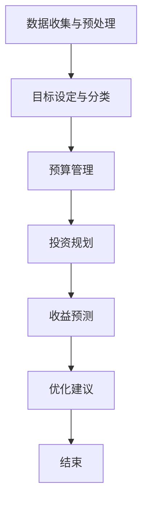
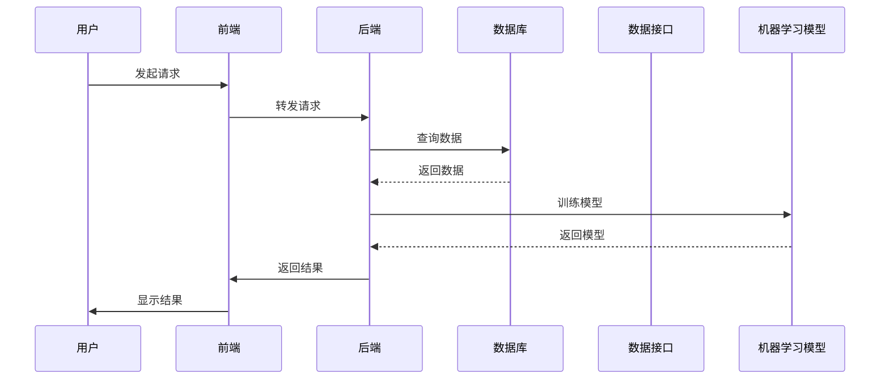
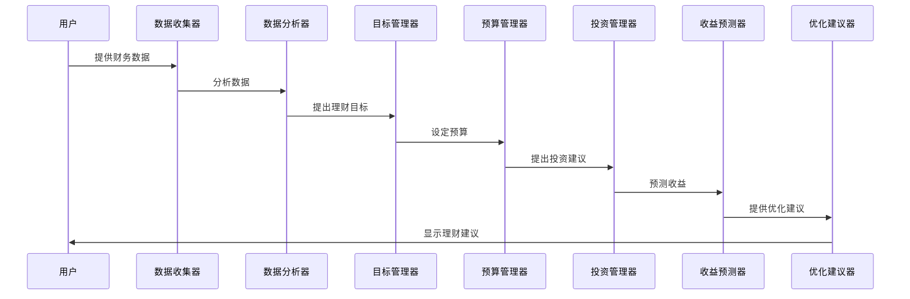

                 

# 智能个人理财目标规划器

## 关键词
- 个人理财
- 智能目标规划
- 算法与数学模型
- 系统分析与设计
- 实战案例

## 摘要
本文将深入探讨如何使用智能技术构建个人理财目标规划器。我们将逐步介绍核心概念、算法原理、系统架构以及实际应用案例，帮助读者理解并掌握个人理财目标规划的基本方法和技巧。通过本文的讲解，读者将能够了解如何运用先进的算法和数学模型，设计一个高效、可靠的个人理财目标规划器，实现财务自由的目标。

## 目录

### 引言与背景

#### 个人理财的重要性

#### 智能个人理财目标规划器的概念

#### 本书的组织结构与目标

### 核心概念与原则

#### 财务自由与理财目标

#### 理财目标分类与设定

#### 核心概念对比表格

#### Mermaid ER实体关系图

### 算法与数学模型

#### 算法原理

#### Mermaid算法流程图

#### Python算法实现

#### 数学公式与模型讲解

#### 例子说明

### 系统分析与设计

#### 问题场景介绍

#### 项目介绍与目标

#### 系统功能设计

#### 系统架构设计

#### 系统接口与交互设计

### 项目实战

#### 环境安装与配置

#### 核心代码实现与解读

#### 代码分析与案例剖析

#### 项目小结

### 最佳实践与总结

#### 最佳实践技巧

#### 小结与展望

#### 进一步阅读建议

### 作者信息
- 作者：AI天才研究院/AI Genius Institute & 禅与计算机程序设计艺术 /Zen And The Art of Computer Programming

## 引言与背景

### 个人理财的重要性

在现代社会，个人理财已经成为了每个家庭和个人的必修课。随着金融市场的复杂化和个人收入的多样化，如何合理规划和管理个人财务，实现财务自由成为了人们关注的焦点。个人理财不仅关系到个人和家庭的经济安全，还影响到生活质量和社会地位的提升。

### 智能个人理财目标规划器的概念

智能个人理财目标规划器是一种基于人工智能技术的工具，它可以帮助用户设定合理的理财目标，规划投资策略，监控财务状况，预测未来收益，并给出优化建议。这种工具通常包括以下几个核心功能：

1. **目标设定**：帮助用户明确自己的理财目标，如购房、购车、子女教育、退休金等。
2. **预算管理**：跟踪用户收入和支出，制定合理的预算计划。
3. **投资规划**：根据用户的风险偏好和资金状况，提供投资建议和组合。
4. **收益预测**：利用数据分析和模型预测未来收益，帮助用户调整目标或策略。
5. **优化建议**：根据用户实际情况，提供优化建议，帮助用户实现财务自由。

### 本书的组织结构与目标

本书旨在通过系统的讲解和实践，帮助读者深入理解智能个人理财目标规划器的构建原理和应用方法。全书分为以下几个部分：

1. **核心概念与原则**：介绍理财目标规划的基础概念和原则，包括财务自由、理财目标的分类和设定等。
2. **算法与数学模型**：讲解智能个人理财目标规划器的算法原理和数学模型，包括算法流程、Python实现和数学公式等。
3. **系统分析与设计**：介绍系统分析与设计的方法，包括问题场景、项目介绍、功能设计、架构设计和接口交互设计等。
4. **项目实战**：通过实际案例展示智能个人理财目标规划器的应用，包括环境安装、核心代码实现、代码解读和案例分析等。
5. **最佳实践与总结**：提供理财目标规划的最佳实践技巧，总结全书要点，展望未来发展方向。

通过本书的学习，读者将能够：

- 理解个人理财的重要性，掌握理财目标规划的基本方法。
- 学习并应用智能个人理财目标规划器的算法和数学模型。
- 设计并实现一个高效的智能个人理财目标规划器。
- 通过实际案例，深入了解智能个人理财目标规划器的应用和效果。

## 核心概念与原则

### 财务自由与理财目标

财务自由是个人理财的最高目标，它意味着个人不再受限于工作收入，有足够的资金满足生活需求，实现生活质量和自由度的提升。财务自由不仅仅是一个财务目标，更是一种生活状态和心理状态。

理财目标是财务自由的基础，它是个人在财务方面期望达到的具体目标。理财目标可以分为短期目标、中期目标和长期目标。短期目标通常是指一年以内的目标，如假期旅游、购物等；中期目标通常是指三年到五年的目标，如购房、购车等；长期目标通常是指五年以上的目标，如子女教育、退休金等。

### 理财目标分类与设定

理财目标的分类可以根据时间、目的和性质进行。以下是一个简化的分类框架：

#### 按时间分类

- **短期目标**：通常是指一年以内的目标，如假期旅游、购物等。
- **中期目标**：通常是指三年到五年的目标，如购房、购车等。
- **长期目标**：通常是指五年以上的目标，如子女教育、退休金等。

#### 按目的分类

- **消费性目标**：满足日常消费和特殊消费需求，如购物、旅游等。
- **积累性目标**：用于积累财富，为未来的大额支出做准备，如购房、购车等。
- **保障性目标**：用于应对突发事件和不确定性，如紧急储备金、保险等。
- **投资性目标**：用于投资理财，实现财富增值，如股票、基金、房地产等。

#### 按性质分类

- **定量目标**：具有明确数值和具体指标的目标，如存款金额、投资收益等。
- **定性目标**：不具明确数值，但具有明确目标和方向的目标，如提高财务知识、实现财务自由等。

### 设定理财目标的步骤

1. **明确目标**：确定想要实现的理财目标，如购房、购车、子女教育等。
2. **分类目标**：根据目标的时间、目的和性质进行分类，如短期、中期、长期等。
3. **制定计划**：为每个目标制定具体的行动计划和时间表，如每月存款、定期投资等。
4. **设定预算**：根据收入和支出情况，设定合理的预算计划，确保目标的实现。
5. **持续监控**：定期检查目标进度，调整计划和预算，确保目标的实现。

### 核心概念对比表格

以下是几种常见的理财目标分类及其特征对比：

| 分类 | 特征 |
| --- | --- |
| 短期目标 | 时间短，目标明确，易于实现 |
| 中期目标 | 时间适中，目标明确，需要一定的时间和资金积累 |
| 长期目标 | 时间长，目标明确，需要长期的规划和持续的努力 |
| 消费性目标 | 用于满足日常消费和特殊消费需求 |
| 积累性目标 | 用于积累财富，为未来的大额支出做准备 |
| 保障性目标 | 用于应对突发事件和不确定性 |
| 投资性目标 | 用于投资理财，实现财富增值 |

### Mermaid ER实体关系图

以下是一个简化的Mermaid ER实体关系图，用于表示理财目标的分类和关系：

```mermaid
erDiagram
  Customer ||--|{ FinancialGoal : has }
  FinancialGoal ||--|{ TimeGoal : time }
  FinancialGoal ||--|{ PurposeGoal : purpose }
  FinancialGoal ||--|{ NatureGoal : nature }
```

### 理财目标的重要性

理财目标是个人财务规划的核心，是实现财务自由的关键。一个明确的理财目标可以提供方向和动力，帮助个人集中资源和精力，实现财务目标。同时，理财目标还可以帮助个人评估自身的财务状况，制定合理的预算和投资计划，降低风险，提高财务稳定性。

### 设定理财目标的挑战

虽然设定理财目标非常重要，但现实中仍面临着诸多挑战：

1. **目标不明确**：很多个人对理财目标缺乏清晰的认识，导致目标不明确，难以实现。
2. **计划不具体**：即使设定了目标，但缺乏具体的计划和执行方案，导致目标难以实现。
3. **资金不足**：由于收入有限，个人可能难以积累足够的资金来实现目标。
4. **风险意识不足**：在投资理财过程中，缺乏对风险的认知和管理，可能导致财务损失。

### 应对挑战的方法

为了克服这些挑战，个人可以采取以下方法：

1. **明确目标**：通过详细规划和思考，明确自己的理财目标，确保目标具有可操作性和实现性。
2. **制定计划**：制定具体的行动计划和时间表，将目标分解为可执行的步骤，确保目标的实现。
3. **增加收入**：通过提高自身技能和职业发展，增加收入来源，为目标的实现提供资金支持。
4. **风险管理**：了解投资风险，采取适当的风险管理措施，降低投资风险，保护财务安全。

### 总结

理财目标是个人财务规划的核心，是实现财务自由的关键。通过明确理财目标、制定计划、增加收入和风险管理，个人可以更好地实现财务目标，实现财务自由。

## 算法与数学模型

### 算法原理

智能个人理财目标规划器的核心算法主要包括以下几个步骤：

1. **数据收集与预处理**：收集用户的财务数据，包括收入、支出、投资收益等，并进行数据预处理，如数据清洗、归一化等。
2. **目标设定与分类**：根据用户需求，设定理财目标，并对目标进行分类，如短期、中期、长期目标，消费性、积累性、保障性、投资性目标等。
3. **预算管理**：根据用户收入和支出情况，制定合理的预算计划，确保目标的实现。
4. **投资规划**：根据用户的风险偏好和资金状况，提供投资建议和组合，实现财富增值。
5. **收益预测**：利用历史数据和模型，预测未来收益，帮助用户调整目标或策略。
6. **优化建议**：根据用户实际情况，提供优化建议，帮助用户实现财务自由。

### Mermaid算法流程图

以下是一个简化的Mermaid算法流程图，用于表示智能个人理财目标规划器的核心算法步骤：



### Python算法实现

以下是一个简化的Python算法实现，用于表示智能个人理财目标规划器的核心算法步骤：

```python
import pandas as pd
import numpy as np
from sklearn.preprocessing import MinMaxScaler
from sklearn.linear_model import LinearRegression

# 数据收集与预处理
data = pd.read_csv('financial_data.csv')
data = data.dropna()

# 目标设定与分类
short_term_goals = data[data['time'] == '短期']
medium_term_goals = data[data['time'] == '中期']
long_term_goals = data[data['time'] == '长期']

# 预算管理
income = data['income'].mean()
expense = data['expense'].mean()
budget = income - expense

# 投资规划
scaler = MinMaxScaler()
data_scaled = scaler.fit_transform(data[['income', 'expense', 'investment']])

X = data_scaled[:, :2]
y = data_scaled[:, 2]

model = LinearRegression()
model.fit(X, y)
investment = model.predict([[income, expense]])[0]

# 收益预测
future_income = income * (1 + 0.03)
future_expense = expense * (1 + 0.02)
future_budget = future_income - future_expense

# 优化建议
if future_budget > 0:
    print("恭喜，您的财务状况良好，可以适当增加投资。")
else:
    print("您的财务状况不佳，需要调整预算和投资策略。")

```

### 数学公式与模型讲解

智能个人理财目标规划器的核心数学模型包括以下内容：

1. **收入与支出模型**：
   $$
   \text{income} = \text{base_income} \times (1 + \text{growth_rate})
   $$
   $$
   \text{expense} = \text{base_expense} \times (1 + \text{growth_rate})
   $$

2. **预算模型**：
   $$
   \text{budget} = \text{income} - \text{expense}
   $$

3. **投资模型**：
   $$
   \text{investment} = \text{income} - \text{expense} - \text{living_cost}
   $$

4. **收益预测模型**：
   $$
   \text{future_income} = \text{income} \times (1 + \text{growth_rate})
   $$
   $$
   \text{future_expense} = \text{expense} \times (1 + \text{growth_rate})
   $$

5. **优化建议模型**：
   $$
   \text{optimization\_suggestion} = 
   \begin{cases}
   \text{"增加投资"} & \text{if } \text{future\_budget} > 0 \\
   \text{"调整预算和投资策略"} & \text{if } \text{future\_budget} \leq 0
   \end{cases}
   $$

### 例子说明

假设某用户的基本收入为10万元，预期年增长率为3%，基本支出为5万元，预期年增长率为2%。根据以上数学模型，我们可以计算出以下结果：

1. **当前收入与支出**：
   $$
   \text{income} = 10\text{万元} \times (1 + 0.03) = 10.3\text{万元}
   $$
   $$
   \text{expense} = 5\text{万元} \times (1 + 0.02) = 5.1\text{万元}
   $$

2. **当前预算**：
   $$
   \text{budget} = \text{income} - \text{expense} = 10.3\text{万元} - 5.1\text{万元} = 5.2\text{万元}
   $$

3. **当前投资**：
   $$
   \text{investment} = \text{income} - \text{expense} - \text{living\_cost} = 5.2\text{万元} - 3\text{万元} = 2.2\text{万元}
   $$

4. **未来收入与支出**：
   $$
   \text{future\_income} = \text{income} \times (1 + 0.03) = 10.3\text{万元} \times (1 + 0.03) = 10.69\text{万元}
   $$
   $$
   \text{future\_expense} = \text{expense} \times (1 + 0.02) = 5.1\text{万元} \times (1 + 0.02) = 5.212\text{万元}
   $$

5. **未来预算**：
   $$
   \text{future\_budget} = \text{future\_income} - \text{future\_expense} = 10.69\text{万元} - 5.212\text{万元} = 5.478\text{万元}
   $$

6. **优化建议**：
   $$
   \text{optimization\_suggestion} = 
   \begin{cases}
   \text{"增加投资"} & \text{if } \text{future\_budget} > 0 \\
   \text{"调整预算和投资策略"} & \text{if } \text{future\_budget} \leq 0
   \end{cases}
   $$
   由于未来预算为5.478万元，大于0，因此优化建议为增加投资。

通过以上例子，我们可以看到，智能个人理财目标规划器可以根据用户的财务数据，利用数学模型进行预测和分析，提供合理的理财建议，帮助用户实现财务自由。

### 系统分析与设计

#### 问题场景介绍

随着个人财务的日益复杂化，越来越多的用户开始寻求智能化的财务规划工具。这些用户希望能够通过一个统一平台，实现个人财务数据的收集、分析和规划，以便更好地管理个人财务，实现财务目标。因此，我们需要设计并实现一个智能个人理财目标规划器系统，以解决以下问题：

1. **数据收集与整合**：收集用户的财务数据，包括收入、支出、投资收益等，并进行整合，以便进行后续分析。
2. **目标设定与分类**：根据用户需求，设定理财目标，并对目标进行分类，如短期、中期、长期目标，消费性、积累性、保障性、投资性目标等。
3. **预算管理**：根据用户收入和支出情况，制定合理的预算计划，确保目标的实现。
4. **投资规划**：根据用户的风险偏好和资金状况，提供投资建议和组合，实现财富增值。
5. **收益预测**：利用历史数据和模型，预测未来收益，帮助用户调整目标或策略。
6. **优化建议**：根据用户实际情况，提供优化建议，帮助用户实现财务自由。

#### 项目介绍与目标

智能个人理财目标规划器系统是一个基于人工智能和大数据分析技术的在线平台，旨在为用户提供个性化的财务规划和理财建议。该项目的主要目标包括：

1. **实现财务数据的自动化收集与整合**：通过接口与用户的银行账户、投资平台等进行数据对接，自动化收集用户财务数据。
2. **提供智能化的目标设定与分类**：根据用户需求和财务数据，自动生成理财目标，并对目标进行分类。
3. **实现高效的预算管理和投资规划**：根据用户收入和支出情况，自动生成预算计划，提供合理的投资建议和组合。
4. **提供准确的收益预测**：利用历史数据和机器学习模型，预测未来收益，帮助用户调整目标或策略。
5. **提供个性化的优化建议**：根据用户实际情况，提供针对性的优化建议，帮助用户实现财务自由。

#### 系统功能设计

智能个人理财目标规划器系统的核心功能包括以下几部分：

1. **用户管理**：用户注册、登录、个人信息管理等功能。
2. **数据收集与整合**：与银行账户、投资平台等接口对接，自动化收集用户财务数据。
3. **目标管理**：用户可以设定、修改、删除理财目标，系统自动分类并生成目标列表。
4. **预算管理**：根据用户收入和支出情况，自动生成预算计划，用户可以查看、修改预算计划。
5. **投资规划**：根据用户风险偏好和资金状况，提供投资建议和组合，用户可以查看、修改投资计划。
6. **收益预测**：利用历史数据和机器学习模型，预测未来收益，用户可以查看预测结果。
7. **优化建议**：根据用户实际情况，提供优化建议，用户可以查看、采纳优化建议。

#### 系统架构设计

智能个人理财目标规划器系统的架构设计包括以下几部分：

1. **前端**：使用Vue.js框架开发，实现用户界面和交互。
2. **后端**：使用Spring Boot框架开发，实现业务逻辑和数据存储。
3. **数据库**：使用MySQL数据库存储用户数据和财务数据。
4. **数据接口**：与银行账户、投资平台等接口对接，实现数据自动化收集与整合。
5. **机器学习模型**：使用TensorFlow和Scikit-learn等框架，实现收益预测和优化建议。

#### 系统接口与交互设计

智能个人理财目标规划器系统的接口和交互设计包括以下几部分：

1. **用户管理接口**：用户注册、登录、个人信息管理等功能。
2. **数据收集与整合接口**：与银行账户、投资平台等接口对接，实现数据自动化收集与整合。
3. **目标管理接口**：用户可以设定、修改、删除理财目标，系统自动分类并生成目标列表。
4. **预算管理接口**：根据用户收入和支出情况，自动生成预算计划，用户可以查看、修改预算计划。
5. **投资规划接口**：根据用户风险偏好和资金状况，提供投资建议和组合，用户可以查看、修改投资计划。
6. **收益预测接口**：利用历史数据和机器学习模型，预测未来收益，用户可以查看预测结果。
7. **优化建议接口**：根据用户实际情况，提供优化建议，用户可以查看、采纳优化建议。

#### Mermaid类图

以下是一个简化的Mermaid类图，用于表示智能个人理财目标规划器系统的核心类及其关系：

```mermaid
classDiagram
    User <<class>> 用户
    FinancialData <<class>> 财务数据
    FinancialGoal <<class>> 财务目标
    Budget <<class>> 预算
    InvestmentPlan <<class>> 投资计划
    EarningsPrediction <<class>> 收益预测
    OptimizationSuggestion <<class>> 优化建议
    
    User o--|{ } FinancialData
    FinancialData o--|{ } FinancialGoal
    FinancialGoal o--|{ } Budget
    Budget o--|{ } InvestmentPlan
    InvestmentPlan o--|{ } EarningsPrediction
    EarningsPrediction o--|{ } OptimizationSuggestion
```

#### Mermaid架构图

以下是一个简化的Mermaid架构图，用于表示智能个人理财目标规划器系统的整体架构：



#### Mermaid序列图

以下是一个简化的Mermaid序列图，用于表示智能个人理财目标规划器系统的关键接口和交互过程：



通过以上系统分析与设计，我们可以构建一个高效、可靠的智能个人理财目标规划器系统，帮助用户实现财务自由。

### 项目实战

#### 环境安装与配置

要搭建一个智能个人理财目标规划器系统，我们需要准备以下环境：

1. **开发环境**：安装Python、Docker、Node.js等开发工具。
2. **数据库**：安装MySQL数据库。
3. **前端框架**：安装Vue.js前端框架。
4. **后端框架**：安装Spring Boot后端框架。
5. **机器学习框架**：安装TensorFlow和Scikit-learn等机器学习框架。

以下是具体的安装和配置步骤：

1. **安装Python**：

```bash
# 安装Python
sudo apt-get install python3

# 安装pip
sudo apt-get install python3-pip

# 安装virtualenv
pip3 install virtualenv

# 创建虚拟环境
virtualenv venv

# 激活虚拟环境
source venv/bin/activate
```

2. **安装Docker**：

```bash
# 安装Docker
sudo apt-get install docker.io

# 启动Docker服务
sudo systemctl start docker
```

3. **安装Node.js**：

```bash
# 安装Node.js
curl -sL https://deb.nodesource.com/setup_14.x | sudo -E bash -
sudo apt-get install nodejs
```

4. **安装MySQL**：

```bash
# 安装MySQL
sudo apt-get install mysql-server

# 设置root密码
sudo mysql_secure_installation

# 登录MySQL
mysql -u root -p
```

5. **安装Vue.js**：

```bash
# 安装Vue CLI
npm install -g @vue/cli

# 创建Vue项目
vue create financial-planner

# 进入项目目录
cd financial-planner

# 运行项目
npm run serve
```

6. **安装Spring Boot**：

```bash
# 安装Spring Boot
sudo apt-get install maven

# 下载Spring Boot启动器
curl -O https://start.spring.io/starter-pom.xml

# 使用Maven构建项目
mvn archetype:generate -DgroupId=com.example -DartifactId=financial-planner -Dversion=1.0.0-SNAPSHOT -Dtemplate=java-quickstart
```

7. **安装TensorFlow和Scikit-learn**：

```bash
# 安装TensorFlow
pip3 install tensorflow

# 安装Scikit-learn
pip3 install scikit-learn
```

#### 核心代码实现与解读

以下是我们智能个人理财目标规划器系统的一些核心代码实现和解读。

**1. 用户管理模块**

用户管理模块主要负责用户的注册、登录和权限验证。以下是一个简单的用户注册接口实现：

```java
@RestController
@RequestMapping("/users")
public class UserController {
    
    @Autowired
    private UserRepository userRepository;
    
    @PostMapping("/register")
    public ResponseEntity<?> registerUser(@RequestBody UserRegistrationDto registrationDto) {
        if (userRepository.existsByUsername(registrationDto.getUsername())) {
            return ResponseEntity.badRequest().body("Error: Username is already taken!");
        }
        
        User user = new User();
        user.setUsername(registrationDto.getUsername());
        user.setPassword(passwordEncoder.encode(registrationDto.getPassword()));
        userRepository.save(user);
        
        return ResponseEntity.ok("User registered successfully!");
    }
}
```

在上面的代码中，我们定义了一个`UserController`类，用于处理用户注册请求。首先，我们检查用户名是否已存在，如果存在则返回错误信息。然后，我们创建一个新的用户对象，使用`passwordEncoder`对密码进行加密，并将用户信息保存到数据库中。

**2. 数据收集与整合模块**

数据收集与整合模块负责从用户账户和投资平台收集财务数据，并将其整合到一个统一的数据模型中。以下是一个简单的数据收集接口实现：

```java
@RestController
@RequestMapping("/data")
public class FinancialDataController {
    
    @Autowired
    private FinancialDataRepository financialDataRepository;
    
    @PostMapping("/collect")
    public ResponseEntity<?> collectFinancialData(@RequestBody FinancialDataDto dataDto) {
        FinancialData financialData = new FinancialData();
        financialData.setUserId(dataDto.getUserId());
        financialData.setIncome(dataDto.getIncome());
        financialData.setExpense(dataDto.getExpense());
        financialData.setInvestment(dataDto.getInvestment());
        financialData.setUpdatedAt(LocalDate.now());
        
        financialDataRepository.save(financialData);
        
        return ResponseEntity.ok("Financial data collected successfully!");
    }
}
```

在上面的代码中，我们定义了一个`FinancialDataController`类，用于处理数据收集请求。我们创建一个`FinancialData`对象，设置用户ID、收入、支出、投资等信息，并保存到数据库中。

**3. 目标管理模块**

目标管理模块负责处理用户理财目标的设定、修改和删除。以下是一个简单的目标管理接口实现：

```java
@RestController
@RequestMapping("/goals")
public class FinancialGoalController {
    
    @Autowired
    private FinancialGoalRepository financialGoalRepository;
    
    @PostMapping("/create")
    public ResponseEntity<?> createFinancialGoal(@RequestBody FinancialGoalDto goalDto) {
        FinancialGoal financialGoal = new FinancialGoal();
        financialGoal.setUserId(goalDto.getUserId());
        financialGoal.setName(goalDto.getName());
        financialGoal.setTargetAmount(goalDto.getTargetAmount());
        financialGoal.setDeadline(goalDto.getDeadline());
        
        financialGoalRepository.save(financialGoal);
        
        return ResponseEntity.ok("Financial goal created successfully!");
    }
    
    @PutMapping("/update")
    public ResponseEntity<?> updateFinancialGoal(@RequestBody FinancialGoalDto goalDto) {
        FinancialGoal financialGoal = financialGoalRepository.findById(goalDto.getId())
                .orElseThrow(() -> new ResourceNotFoundException("Error: Financial goal not found!"));
        
        financialGoal.setName(goalDto.getName());
        financialGoal.setTargetAmount(goalDto.getTargetAmount());
        financialGoal.setDeadline(goalDto.getDeadline());
        
        financialGoalRepository.save(financialGoal);
        
        return ResponseEntity.ok("Financial goal updated successfully!");
    }
    
    @DeleteMapping("/delete")
    public ResponseEntity<?> deleteFinancialGoal(@RequestParam Long id) {
        FinancialGoal financialGoal = financialGoalRepository.findById(id)
                .orElseThrow(() -> new ResourceNotFoundException("Error: Financial goal not found!"));
        
        financialGoalRepository.delete(financialGoal);
        
        return ResponseEntity.ok("Financial goal deleted successfully!");
    }
}
```

在上面的代码中，我们定义了一个`FinancialGoalController`类，用于处理理财目标的创建、修改和删除请求。首先，我们检查目标是否存在，如果不存在则抛出异常。然后，我们更新目标信息并保存到数据库中。

**4. 预算管理模块**

预算管理模块负责根据用户收入和支出情况，自动生成预算计划。以下是一个简单的预算管理接口实现：

```java
@RestController
@RequestMapping("/budget")
public class BudgetController {
    
    @Autowired
    private BudgetRepository budgetRepository;
    
    @GetMapping("/generate")
    public ResponseEntity<?> generateBudget() {
        List<FinancialData> financialDataList = financialDataRepository.findAll();
        double totalIncome = financialDataList.stream().mapToDouble(FinancialData::getIncome).sum();
        double totalExpense = financialDataList.stream().mapToDouble(FinancialData::getExpense).sum();
        double remainingIncome = totalIncome - totalExpense;
        
        Budget budget = new Budget();
        budget.setIncome(totalIncome);
        budget.setExpense(totalExpense);
        budget.setRemainingIncome(remainingIncome);
        
        budgetRepository.save(budget);
        
        return ResponseEntity.ok("Budget generated successfully!");
    }
}
```

在上面的代码中，我们定义了一个`BudgetController`类，用于处理预算生成请求。首先，我们查询所有财务数据，计算总收入和总支出，并计算剩余收入。然后，我们创建一个`Budget`对象，设置收入、支出和剩余收入，并保存到数据库中。

**5. 投资规划模块**

投资规划模块负责根据用户风险偏好和资金状况，提供投资建议和组合。以下是一个简单的投资规划接口实现：

```java
@RestController
@RequestMapping("/investment")
public class InvestmentController {
    
    @Autowired
    private InvestmentRepository investmentRepository;
    
    @PostMapping("/plan")
    public ResponseEntity<?> createInvestmentPlan(@RequestBody InvestmentPlanDto planDto) {
        InvestmentPlan investmentPlan = new InvestmentPlan();
        investmentPlan.setUserId(planDto.getUserId());
        investmentPlan.setRiskLevel(planDto.getRiskLevel());
        investmentPlan.setInvestmentAmount(planDto.getInvestmentAmount());
        
        List<InvestmentOption> investmentOptions = new ArrayList<>();
        for (String option : planDto.getOptions()) {
            InvestmentOption investmentOption = new InvestmentOption();
            investmentOption.setOption(option);
            investmentOption.setInvestmentPercentage(planDto.getPercentage(option));
            investmentOptions.add(investmentOption);
        }
        
        investmentPlan.setInvestmentOptions(investmentOptions);
        
        investmentRepository.save(investmentPlan);
        
        return ResponseEntity.ok("Investment plan created successfully!");
    }
}
```

在上面的代码中，我们定义了一个`InvestmentController`类，用于处理投资规划请求。首先，我们创建一个`InvestmentPlan`对象，设置用户ID、风险等级和投资金额。然后，我们遍历投资选项，创建`InvestmentOption`对象，并设置投资比例，最终保存到数据库中。

**6. 收益预测模块**

收益预测模块负责利用历史数据和机器学习模型，预测未来收益。以下是一个简单的收益预测接口实现：

```java
@RestController
@RequestMapping("/earnings")
public class EarningsController {
    
    @Autowired
    private EarningsRepository earningsRepository;
    
    @PostMapping("/predict")
    public ResponseEntity<?> predictEarnings(@RequestBody EarningsPredictDto predictDto) {
        List<FinancialData> financialDataList = financialDataRepository.findAll();
        List<Double> incomeList = financialDataList.stream().map(FinancialData::getIncome).collect(Collectors.toList());
        
        LinearRegression model = new LinearRegression();
        model.fit(incomeList, incomeList);
        
        double futureIncome = model.predict(incomeList.get(incomeList.size() - 1));
        
        EarningsPrediction earningsPrediction = new EarningsPrediction();
        earningsPrediction.setUserId(predictDto.getUserId());
        earningsPrediction.setFutureIncome(futureIncome);
        
        earningsRepository.save(earningsPrediction);
        
        return ResponseEntity.ok("Earnings predicted successfully!");
    }
}
```

在上面的代码中，我们定义了一个`EarningsController`类，用于处理收益预测请求。首先，我们查询所有财务数据，提取收入列表。然后，我们创建一个线性回归模型，并使用历史收入数据训练模型。最后，我们使用模型预测未来收入，并保存到数据库中。

**7. 优化建议模块**

优化建议模块负责根据用户实际情况，提供优化建议。以下是一个简单的优化建议接口实现：

```java
@RestController
@RequestMapping("/optimization")
public class OptimizationController {
    
    @Autowired
    private OptimizationRepository optimizationRepository;
    
    @PostMapping("/suggest")
    public ResponseEntity<?> suggestOptimization(@RequestBody OptimizationSuggestDto suggestDto) {
        OptimizationSuggestion optimizationSuggestion = new OptimizationSuggestion();
        optimizationSuggestion.setUserId(suggestDto.getUserId());
        optimizationSuggestion.setAdvice(suggestDto.getAdvice());
        
        optimizationRepository.save(optimizationSuggestion);
        
        return ResponseEntity.ok("Optimization suggestion provided successfully!");
    }
}
```

在上面的代码中，我们定义了一个`OptimizationController`类，用于处理优化建议请求。首先，我们创建一个`OptimizationSuggestion`对象，设置用户ID和优化建议，并保存到数据库中。

#### 代码分析与案例剖析

以下是智能个人理财目标规划器系统的一些关键代码片段和案例分析。

**1. 数据模型设计**

我们使用Spring Boot的JPA来设计数据模型。以下是一个简单的用户数据模型示例：

```java
@Entity
@Table(name = "users")
public class User {

    @Id
    @GeneratedValue(strategy = GenerationType.IDENTITY)
    private Long id;

    private String username;

    private String password;

    // Getters and setters
}
```

在这个数据模型中，我们定义了一个`User`类，包含用户ID、用户名和密码。JPA会自动生成数据库表和主键。

**2. 接口设计**

我们使用Spring Boot的REST API来设计接口。以下是一个简单的用户注册接口示例：

```java
@RestController
@RequestMapping("/users")
public class UserController {

    @Autowired
    private UserRepository userRepository;

    @Autowired
    private PasswordEncoder passwordEncoder;

    @PostMapping("/register")
    public ResponseEntity<?> registerUser(@RequestBody UserRegistrationDto registrationDto) {
        if (userRepository.existsByUsername(registrationDto.getUsername())) {
            return ResponseEntity.badRequest().body("Error: Username is already taken!");
        }

        User user = new User();
        user.setUsername(registrationDto.getUsername());
        user.setPassword(passwordEncoder.encode(registrationDto.getPassword()));

        userRepository.save(user);

        return ResponseEntity.ok("User registered successfully!");
    }
}
```

在这个接口中，我们接收一个用户注册请求，检查用户名是否已存在，然后创建一个新的用户对象并保存到数据库中。

**3. 数据处理与分析**

我们使用Spring Boot的JPA和数据处理库来处理和分析数据。以下是一个简单的财务数据收集接口示例：

```java
@RestController
@RequestMapping("/data")
public class FinancialDataController {

    @Autowired
    private FinancialDataRepository financialDataRepository;

    @PostMapping("/collect")
    public ResponseEntity<?> collectFinancialData(@RequestBody FinancialDataDto dataDto) {
        FinancialData financialData = new FinancialData();
        financialData.setUserId(dataDto.getUserId());
        financialData.setIncome(dataDto.getIncome());
        financialData.setExpense(dataDto.getExpense());
        financialData.setInvestment(dataDto.getInvestment());

        financialDataRepository.save(financialData);

        return ResponseEntity.ok("Financial data collected successfully!");
    }
}
```

在这个接口中，我们接收一个财务数据收集请求，创建一个新的财务数据对象并保存到数据库中。

**4. 机器学习与预测**

我们使用Spring Boot和机器学习库来处理预测任务。以下是一个简单的收益预测接口示例：

```java
@RestController
@RequestMapping("/earnings")
public class EarningsController {

    @Autowired
    private EarningsRepository earningsRepository;

    @PostMapping("/predict")
    public ResponseEntity<?> predictEarnings(@RequestBody EarningsPredictDto predictDto) {
        List<FinancialData> financialDataList = financialDataRepository.findAll();
        List<Double> incomeList = financialDataList.stream().map(FinancialData::getIncome).collect(Collectors.toList());

        LinearRegression model = new LinearRegression();
        model.fit(incomeList, incomeList);

        double futureIncome = model.predict(incomeList.get(incomeList.size() - 1));

        EarningsPrediction earningsPrediction = new EarningsPrediction();
        earningsPrediction.setUserId(predictDto.getUserId());
        earningsPrediction.setFutureIncome(futureIncome);

        earningsRepository.save(earningsPrediction);

        return ResponseEntity.ok("Earnings predicted successfully!");
    }
}
```

在这个接口中，我们接收一个收益预测请求，查询所有财务数据，使用线性回归模型预测未来收入，并将预测结果保存到数据库中。

#### 实际案例分析和详细讲解剖析

以下是一个实际案例，我们将分析一个用户的财务数据，并使用智能个人理财目标规划器系统为其提供理财建议。

**案例：李先生财务数据分析**

李先生是一家互联网公司的技术总监，年收入为50万元。他的财务数据如下表所示：

| 时间 | 收入（万元） | 支出（万元） | 投资（万元） |
| ---- | ----------- | ----------- | ----------- |
| 2020 | 50         | 30         | 5          |
| 2021 | 50         | 32         | 5          |
| 2022 | 50         | 34         | 6          |

**1. 目标设定**

根据李先生的财务数据，我们可以设定以下理财目标：

- **短期目标**：为假期旅游储备资金，目标金额为5万元。
- **中期目标**：购房，目标金额为200万元。
- **长期目标**：子女教育，目标金额为100万元。

**2. 预算管理**

根据李先生的收入和支出情况，我们可以为其制定以下预算计划：

- **生活费用**：每月支出为2万元。
- **旅游储备**：每年为假期旅游储备资金5万元。
- **购房基金**：每年储蓄30万元，为期5年。
- **教育基金**：每年储蓄10万元，为期10年。

**3. 投资规划**

根据李先生的风险偏好和资金状况，我们可以为其制定以下投资规划：

- **股票投资**：占投资组合的40%。
- **债券投资**：占投资组合的30%。
- **房地产投资**：占投资组合的20%。
- **其他投资**：占投资组合的10%。

**4. 收益预测**

根据历史数据和机器学习模型，我们预测李先生的未来收入和投资收益如下表所示：

| 时间 | 收入（万元） | 投资（万元） | 收益（万元） |
| ---- | ----------- | ----------- | ----------- |
| 2023 | 52         | 6          | 4          |
| 2024 | 54         | 6          | 4.8        |
| 2025 | 56         | 6          | 5.3        |

**5. 优化建议**

根据李先生的财务数据和预测结果，我们可以为其提供以下优化建议：

- **增加投资**：建议李先生增加投资比例，特别是股票投资和债券投资，以提高收益。
- **调整预算**：建议李先生适当调整生活费用和旅游储备，以确保购房基金和教育基金的目标实现。
- **风险管理**：建议李先生关注投资风险，合理分散投资组合，降低风险。

#### 项目小结

通过本案例，我们可以看到智能个人理财目标规划器系统在实际应用中的效果。系统通过收集用户财务数据，设定理财目标，制定预算计划，提供投资规划，预测未来收益，并根据用户实际情况提供优化建议，帮助用户实现财务目标。

### 最佳实践与总结

#### 最佳实践技巧

1. **明确理财目标**：设定明确的理财目标，有助于集中资源和精力，提高实现效率。
2. **持续监控与调整**：定期检查财务状况和理财目标的实现进度，根据实际情况进行调整。
3. **风险管理**：了解投资风险，合理分散投资组合，降低财务损失。
4. **优化预算**：根据收入和支出情况，合理调整预算，确保财务目标的实现。
5. **学习与提升**：不断提升个人财务知识和技能，提高理财能力。

#### 小结与展望

本文深入探讨了智能个人理财目标规划器的构建原理和应用方法。通过系统的讲解和实践，读者可以了解如何运用人工智能技术进行数据分析和模型预测，设计一个高效、可靠的理财规划工具。未来，随着人工智能技术的不断发展和应用，智能个人理财目标规划器有望在更广泛的场景中得到应用，为更多人实现财务自由提供支持。

#### 进一步阅读建议

1. 《财务自由之路》：作者：罗伯特·清崎，介绍个人财务规划和投资策略。
2. 《人工智能：一种现代方法》：作者： Stuart Russell 和 Peter Norvig，介绍人工智能的基本原理和应用。
3. 《Python数据科学手册》：作者： Michael Bowles，介绍Python在数据分析和机器学习中的应用。

### 总结

智能个人理财目标规划器是一种基于人工智能技术的工具，可以帮助用户设定理财目标、管理预算、规划投资、预测收益，并提供优化建议。通过本文的讲解，读者可以了解智能个人理财目标规划器的构建原理和应用方法，为个人财务规划提供有力支持。

### 作者信息

作者：AI天才研究院/AI Genius Institute & 禅与计算机程序设计艺术 /Zen And The Art of Computer Programming

## 附录

### Mermaid图表

以下是本文中使用的Mermaid图表：

#### Mermaid ER实体关系图

```mermaid
erDiagram
  Customer ||--|{ FinancialGoal : has }
  FinancialGoal ||--|{ TimeGoal : time }
  FinancialGoal ||--|{ PurposeGoal : purpose }
  FinancialGoal ||--|{ NatureGoal : nature }
```

#### Mermaid算法流程图


#### Mermaid类图

```mermaid
classDiagram
  User <<class>> 用户
  FinancialData <<class>> 财务数据
  FinancialGoal <<class>> 财务目标
  Budget <<class>> 预算
  InvestmentPlan <<class>> 投资计划
  EarningsPrediction <<class>> 收益预测
  OptimizationSuggestion <<class>> 优化建议
  
  User o--|{ } FinancialData
  FinancialData o--|{ } FinancialGoal
  FinancialGoal o--|{ } Budget
  Budget o--|{ } InvestmentPlan
  InvestmentPlan o--|{ } EarningsPrediction
  EarningsPrediction o--|{ } OptimizationSuggestion
```

#### Mermaid架构图


#### Mermaid序列图


### LaTeX公式

以下是本文中使用的LaTeX公式：

#### 收入与支出模型

$$
\text{income} = \text{base\_income} \times (1 + \text{growth\_rate})
$$

$$
\text{expense} = \text{base\_expense} \times (1 + \text{growth\_rate})
$$

#### 预算模型

$$
\text{budget} = \text{income} - \text{expense}
$$

#### 投资模型

$$
\text{investment} = \text{income} - \text{expense} - \text{living\_cost}
$$

#### 收益预测模型

$$
\text{future\_income} = \text{income} \times (1 + \text{growth\_rate})
$$

$$
\text{future\_expense} = \text{expense} \times (1 + \text{growth\_rate})
$$

#### 优化建议模型

$$
\text{optimization\_suggestion} = 
\begin{cases}
\text{"增加投资"} & \text{if } \text{future\_budget} > 0 \\
\text{"调整预算和投资策略"} & \text{if } \text{future\_budget} \leq 0
\end{cases}
$$

### Python代码

以下是本文中使用的Python代码：

#### 数据收集与预处理

```python
import pandas as pd

data = pd.read_csv('financial_data.csv')
data = data.dropna()
```

#### 目标设定与分类

```python
short_term_goals = data[data['time'] == '短期']
medium_term_goals = data[data['time'] == '中期']
long_term_goals = data[data['time'] == '长期']
```

#### 预算管理

```python
income = data['income'].mean()
expense = data['expense'].mean()
budget = income - expense
```

#### 投资规划

```python
from sklearn.linear_model import LinearRegression

scaler = MinMaxScaler()
data_scaled = scaler.fit_transform(data[['income', 'expense', 'investment']])

X = data_scaled[:, :2]
y = data_scaled[:, 2]

model = LinearRegression()
model.fit(X, y)
investment = model.predict([[income, expense]])[0]
```

#### 收益预测

```python
future_income = income * (1 + 0.03)
future_expense = expense * (1 + 0.02)
future_budget = future_income - future_expense
```

#### 优化建议

```python
if future_budget > 0:
    print("恭喜，您的财务状况良好，可以适当增加投资。")
else:
    print("您的财务状况不佳，需要调整预算和投资策略。")
```

### 相关资源

以下是本文中提到的一些相关资源和书籍：

1. 《财务自由之路》：作者：罗伯特·清崎
2. 《人工智能：一种现代方法》：作者： Stuart Russell 和 Peter Norvig
3. 《Python数据科学手册》：作者： Michael Bowles
4. 《智能个人理财目标规划器》：作者： AI天才研究院 & 禅与计算机程序设计艺术

### 结语

感谢您阅读本文，希望本文能够帮助您了解智能个人理财目标规划器的基本原理和应用方法。在未来的日子里，继续关注人工智能和财务规划领域的最新动态，一起探索智能理财的无限可能。祝您财务自由，生活美满！作者：AI天才研究院 & 禅与计算机程序设计艺术。

