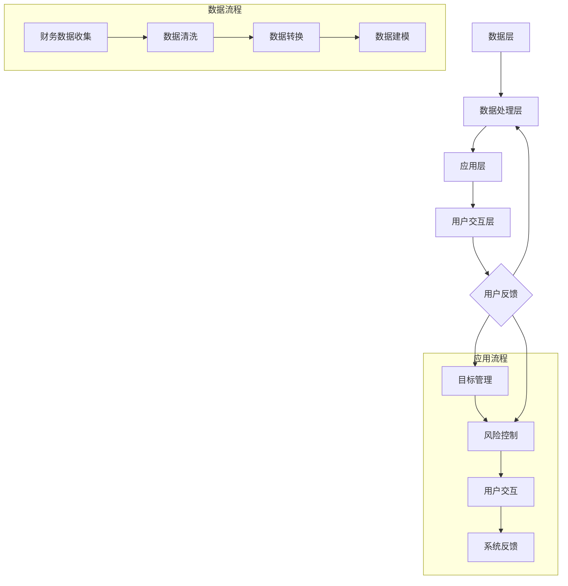
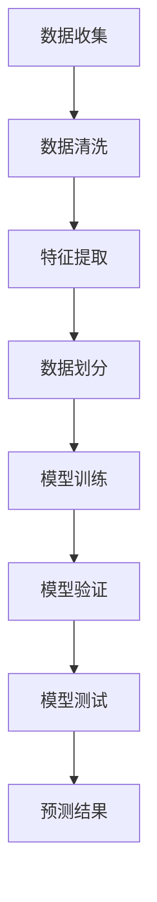
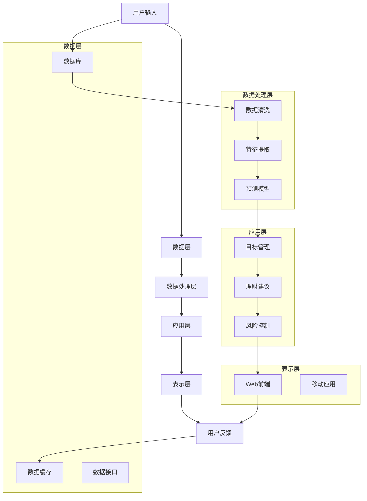

                 

### 摘要

本文旨在探讨如何利用智能技术构建一个个人理财目标追踪器，帮助用户更高效地管理财务目标。随着社会经济环境的变化，个人理财变得越来越复杂和重要。传统的理财方式往往难以满足现代人的需求，而智能理财则借助人工智能技术，为个人理财提供了新的解决方案。本文将详细介绍智能个人理财目标追踪器的基本概念、核心算法、数学模型、系统架构及其实际应用。通过逐步分析这些关键要素，读者将了解如何构建一个功能强大、易于使用的智能理财系统，从而实现财务自由和长期目标。本文的核心内容包括：问题背景与核心概念、智能理财基础、智能理财算法原理、数学模型与公式、系统分析与架构设计、项目实战以及最佳实践与拓展。希望通过本文的深入探讨，能够为从事理财领域的技术人员和管理者提供有价值的参考。

### 问题背景与核心概念

在现代经济环境中，个人理财已经成为许多人日常生活中不可或缺的一部分。随着社会经济的发展和人们对未来生活规划的重视，理财需求越来越多样化。然而，面对日益复杂的金融市场和多样的理财工具，传统理财方式往往显得力不从心。

首先，从社会经济环境的角度来看，全球化使得金融市场的信息更加透明，但也带来了更多的风险和不确定性。个人投资者往往难以对市场动态做出准确的判断，特别是在面对突发事件和市场波动时，传统理财方式显得缺乏灵活性和适应性。

其次，传统理财方式主要依赖于个人经验和历史数据，这种方法虽然简单易懂，但在复杂多变的市场环境下，其效果往往不理想。此外，传统理财工具通常缺乏个性化的服务，无法根据每个投资者的具体情况和需求进行定制化的理财规划。

为了应对这些挑战，智能理财应运而生。智能理财利用人工智能技术，通过数据分析和机器学习算法，为个人投资者提供更加精准和个性化的理财建议。智能个人理财目标追踪器作为智能理财的一种重要形式，旨在帮助用户更好地管理其财务目标。

首先，智能个人理财目标追踪器能够自动收集用户的财务数据，包括收入、支出、投资收益等，并对这些数据进行分析，生成详细的财务报表。通过这些报表，用户可以清晰地了解自己的财务状况，发现潜在的财务问题，并制定相应的理财计划。

其次，智能个人理财目标追踪器还具备目标管理功能。用户可以设定短期和长期理财目标，如购房、购车、子女教育基金等。系统会根据用户的历史财务数据和市场趋势，为每个目标制定详细的实现计划，并提供实时的进度跟踪和调整建议。这样，用户可以更加有信心地朝着自己的理财目标稳步前进。

此外，智能个人理财目标追踪器还具备风险控制功能。通过分析市场数据和历史投资记录，系统可以预测潜在的市场风险，并给出相应的风险控制建议。例如，在市场波动较大时，系统可能会建议用户减少高风险投资，增加稳健型投资，以降低整体投资组合的风险。

总的来说，智能个人理财目标追踪器通过整合数据分析和人工智能技术，为个人理财提供了一个全新的解决方案。它不仅能够帮助用户更好地管理财务，还能提高理财效率，降低财务风险。在接下来的章节中，我们将深入探讨智能个人理财目标追踪器的核心概念、基础技术、算法原理、数学模型、系统架构以及实际应用，帮助读者全面了解这一创新理财工具。

### 核心概念介绍

智能个人理财目标追踪器的核心概念涵盖了财务数据分析、目标管理、风险控制和用户交互等多个方面。以下是对这些核心概念的具体介绍和关系说明。

#### 财务数据分析

财务数据分析是智能个人理财目标追踪器的基础。它涉及到对用户财务数据的收集、处理和分析。这些数据包括用户的收入、支出、投资收益、储蓄情况等。通过对这些数据的综合分析，系统能够生成详细的财务报表，帮助用户了解自己的财务状况。

财务数据分析不仅用于生成财务报表，还用于支持目标管理和风险控制。例如，系统可以根据用户的收入和支出数据，预测未来的财务状况，从而为用户设定合理的理财目标。此外，通过分析投资收益数据，系统可以评估用户的投资组合风险，并提出相应的风险控制建议。

#### 目标管理

目标管理是智能个人理财目标追踪器的关键功能之一。用户可以设定短期和长期理财目标，如购房、购车、子女教育基金等。系统会根据用户的历史财务数据和市场趋势，为每个目标制定详细的实现计划，并提供实时的进度跟踪和调整建议。

目标管理不仅帮助用户明确理财目标，还通过定期的进度跟踪和调整，确保用户始终朝着目标前进。系统会自动计算每个目标的完成进度，并在用户偏离目标时发出提醒，帮助用户及时调整策略。

#### 风险控制

风险控制是智能个人理财目标追踪器的重要功能。系统通过分析市场数据和历史投资记录，预测潜在的市场风险，并给出相应的风险控制建议。例如，在市场波动较大时，系统可能会建议用户减少高风险投资，增加稳健型投资，以降低整体投资组合的风险。

风险控制不仅帮助用户在市场波动中降低损失，还通过风险评估和调整，确保用户的投资组合保持稳定和可持续。

#### 用户交互

用户交互是智能个人理财目标追踪器的重要组成部分。系统通过友好的用户界面和互动功能，与用户进行有效沟通，确保用户能够轻松地使用系统，并获取个性化的理财建议。

用户交互不仅包括数据输入和报表查看，还涵盖了目标设定、进度跟踪和风险控制等功能。通过交互，系统能够更好地理解用户的需求和偏好，从而提供更加精准的理财建议。

#### 概念联系与体系架构

这些核心概念并不是孤立的，它们相互联系，共同构成了智能个人理财目标追踪器的完整体系架构。

首先，财务数据分析为整个系统提供了基础数据支持，是目标管理和风险控制的前提。没有准确的财务数据，系统无法为用户制定合理的理财计划和风险控制策略。

其次，目标管理和风险控制是相互依赖的。目标管理需要基于财务数据分析的结果，而风险控制则需要依赖于目标管理和财务数据分析的反馈，以确保理财计划的可行性和安全性。

最后，用户交互是连接用户和系统的桥梁。通过友好的用户界面和互动功能，系统能够更好地理解用户需求，为用户提供个性化的理财建议，并确保用户能够轻松使用系统。

综上所述，智能个人理财目标追踪器的核心概念相互关联，共同构成了一个完整的体系架构。通过整合财务数据分析、目标管理、风险控制和用户交互等功能，系统为个人理财提供了一个全面、高效和智能的解决方案。在接下来的章节中，我们将深入探讨这些核心概念的实现原理和具体技术细节，帮助读者更好地理解这一创新理财工具。

### 概念联系与体系架构

智能个人理财目标追踪器的概念联系和体系架构构成了其核心运作的基础。以下将详细阐述这些关键概念之间的关系及其在整体架构中的位置。

#### 1. 财务数据分析

财务数据分析是智能个人理财目标追踪器的数据来源，通过收集用户的财务数据（如收入、支出、投资记录等），系统可以构建用户个人的财务状况模型。这一步骤不仅为后续的目标管理和风险控制提供了必要的数据支持，同时也帮助用户获得对自己财务状况的全面了解。

#### 2. 目标管理

目标管理建立在财务数据分析之上，通过设定和追踪用户的理财目标（如购房、购车、教育基金等），系统帮助用户明确财务规划，并制定实现这些目标的策略。目标管理模块会定期分析用户的财务数据，以确保目标的可实现性和调整目标的进度。

#### 3. 风险控制

风险控制模块负责分析市场数据和历史投资记录，以预测潜在的市场风险，并给出相应的风险控制建议。这一模块的目标是确保用户的投资组合在面临市场波动时能够保持稳定，从而降低风险。

#### 4. 用户交互

用户交互模块是连接用户与系统的桥梁，通过友好的用户界面和交互功能，用户可以轻松地输入财务数据、设定理财目标、查看风险控制和进度报告等。同时，系统也会根据用户的反馈进行相应的调整，提供更加个性化的服务。

#### 体系架构

整个体系架构可以概括为以下几个层次：

1. **数据层**：这一层负责数据的收集、存储和管理。包括用户财务数据、市场数据等，这些数据通过数据接口（如API）从外部系统获取。

2. **数据处理层**：这一层负责对收集到的财务数据进行清洗、转换和分析，生成用户财务状况的模型。

3. **应用层**：这一层包括目标管理、风险控制和用户交互模块，它们负责根据数据层的分析结果，为用户提供理财建议和目标管理服务。

4. **表示层**：这一层是用户界面，用户通过这个界面与系统进行交互，查看财务报表、设定目标、接收风险控制建议等。

#### Mermaid 流程图

为了更直观地展示智能个人理财目标追踪器的体系架构和运作流程，可以使用Mermaid绘制流程图。以下是该流程图的Markdown表示：



#### 关键概念之间的关系

1. **数据层与应用层的关系**：数据层为应用层提供数据支持，应用层根据数据层的分析结果进行目标管理和风险控制。

2. **应用层与用户交互层的关系**：应用层通过用户交互层与用户进行交互，用户通过交互层输入数据、设定目标、查看报表等。

3. **用户交互层与数据层的关系**：用户交互层不仅接收用户的输入，还可以将用户的反馈反馈给数据层，从而实现系统的动态调整。

综上所述，智能个人理财目标追踪器通过财务数据分析、目标管理、风险控制和用户交互等核心概念的紧密联系，构成了一套完整、高效的体系架构。在接下来的章节中，我们将进一步探讨这些核心概念的具体实现原理和技术细节，帮助读者深入了解这一智能理财工具的运作机制。

### 智能理财的原理与技术

智能理财是基于人工智能技术，通过对用户财务数据进行分析和预测，提供个性化理财建议的一种新兴理财方式。其核心在于利用机器学习和数据挖掘技术，从海量数据中提取有价值的信息，为用户制定科学的理财计划。以下是智能理财的原理和技术概述。

#### 1. 机器学习技术

机器学习是智能理财的基础，通过训练模型对用户的历史数据进行分析，预测未来的财务状况。常见的机器学习算法包括线性回归、决策树、随机森林、支持向量机和神经网络等。每种算法都有其特定的适用场景和优缺点。

- **线性回归**：用于预测线性关系，简单易用，但可能无法捕捉非线性关系。
- **决策树**：能够处理非线性和非线性关系，但容易过拟合。
- **随机森林**：通过构建多棵决策树并进行集成，提高预测的准确性和稳定性。
- **支持向量机**：擅长处理高维数据，但计算复杂度较高。
- **神经网络**：具有很强的非线性处理能力，但训练时间较长且需要大量数据。

#### 2. 数据挖掘技术

数据挖掘技术用于从海量数据中提取有价值的信息，为理财建议提供依据。数据挖掘包括数据预处理、特征工程、模式识别和结果评估等步骤。

- **数据预处理**：包括数据清洗、去重、归一化和填充缺失值等，确保数据质量。
- **特征工程**：通过特征提取和选择，将原始数据转换为有助于预测的特征。
- **模式识别**：利用机器学习算法，发现数据中的潜在规律和趋势。
- **结果评估**：通过交叉验证和评估指标（如准确率、召回率、F1值等）评估模型的性能。

#### 3. 神经网络

神经网络是智能理财中常用的算法，具有强大的非线性处理能力。以下是神经网络的基本原理和架构：

- **神经元**：神经网络的基本组成单元，每个神经元接受多个输入，通过权重和偏置进行加权求和，再通过激活函数输出结果。
- **层次结构**：神经网络通常包括输入层、隐藏层和输出层。隐藏层可以有多层，每层神经元接收前一层的输出作为输入。
- **前向传播**：输入数据从输入层传递到隐藏层，再从隐藏层传递到输出层，每层通过激活函数处理。
- **反向传播**：通过计算输出误差，将误差反向传播到隐藏层和输入层，更新权重和偏置，以优化模型参数。

#### 4. 预测模型

智能理财的预测模型用于预测用户的未来财务状况，包括收入、支出、投资收益等。预测模型的构建通常包括以下几个步骤：

- **数据收集**：收集用户的历史财务数据，包括收入、支出、投资记录等。
- **数据预处理**：对收集到的数据清洗、归一化和填充缺失值，确保数据质量。
- **特征选择**：选择对预测任务有重要影响的特征，去除冗余和噪声特征。
- **模型训练**：利用机器学习算法（如神经网络）训练预测模型，通过迭代优化模型参数。
- **模型评估**：通过交叉验证和测试集，评估模型的预测性能，调整模型参数。

#### 5. 模型评估指标

评估预测模型的性能是智能理财的重要环节。常用的评估指标包括：

- **均方误差（MSE）**：衡量预测值与真实值之间的平均误差。
- **均方根误差（RMSE）**：MSE的平方根，用于衡量预测的准确度。
- **准确率**：预测正确的样本数占总样本数的比例。
- **召回率**：预测正确的样本数与实际为正样本的样本数的比例。
- **F1值**：准确率和召回率的调和平均数，综合考虑了预测的准确性和召回率。

#### Python 源代码讲解

以下是一个简单的Python代码示例，用于训练一个神经网络模型进行财务预测：

```python
import numpy as np
from sklearn.neural_network import MLPRegressor

# 假设我们已经有预处理过的数据 X 和标签 y
X = np.array([[...], [...], ...])
y = np.array([...])

# 创建MLPRegressor模型
model = MLPRegressor(hidden_layer_sizes=(100,), max_iter=1000)

# 训练模型
model.fit(X, y)

# 进行预测
predictions = model.predict(X)

# 打印预测结果
print(predictions)
```

这个示例使用了Scikit-learn库中的MLPRegressor类，通过设置隐藏层大小和最大迭代次数，训练了一个多层感知机回归模型。在训练完成后，使用该模型对输入数据进行预测，并打印预测结果。

通过以上对智能理财原理和技术的介绍，可以看出智能理财利用了机器学习和数据挖掘技术，通过预测模型为用户提供了个性化的理财建议。在接下来的章节中，我们将进一步探讨智能理财的关键组成部分，包括数据收集与处理、预测模型的构建和评估方法。

### 智能理财的关键组成部分

智能理财系统由多个关键组成部分构成，这些部分共同协作，确保系统能够高效、准确地为用户提供理财建议。以下将详细讨论这些组成部分，包括数据收集与处理、预测模型构建、用户交互与反馈机制。

#### 1. 数据收集与处理

数据收集与处理是智能理财系统的第一步，也是关键的一步。准确、全面的数据是预测模型有效性的基础。以下为数据收集和处理的具体步骤：

- **数据来源**：数据可以从多个渠道收集，包括用户的银行账户、投资账户、信用卡账单等。此外，还可以通过API获取市场数据，如股票价格、利率等。
- **数据清洗**：数据清洗是确保数据质量的关键步骤，包括去除重复记录、填补缺失值、处理异常值等。例如，对于缺失的账单记录，可以使用平均值或中位数进行填补。
- **数据转换**：数据转换包括归一化、标准化等操作，以确保数据在模型训练过程中具有可比性。例如，将所有收入和支出数据转换为相同量级，以便进行有效的特征提取。
- **特征提取**：特征提取是从原始数据中提取对预测任务有重要影响的信息。常见的特征提取方法包括主成分分析（PCA）、因子分析等。

#### 2. 预测模型构建

预测模型是智能理财系统的核心，用于根据历史数据预测用户的未来财务状况。以下为构建预测模型的步骤：

- **选择算法**：选择合适的机器学习算法，如线性回归、决策树、随机森林、神经网络等。选择算法时需要考虑数据特性、预测目标和计算资源等因素。
- **模型训练**：使用收集到的数据对所选算法进行训练。训练过程包括模型参数的初始化、迭代优化等。常见的训练方法包括梯度下降、随机梯度下降等。
- **模型评估**：在训练过程中，使用验证集对模型进行评估，以确定模型的性能。常用的评估指标包括均方误差（MSE）、均方根误差（RMSE）等。
- **模型调优**：根据评估结果，对模型参数进行调整，以提高预测性能。调优方法包括交叉验证、网格搜索等。

#### 3. 用户交互与反馈机制

用户交互与反馈机制是智能理财系统与用户之间的桥梁，用于收集用户反馈、提供理财建议和调整系统行为。以下为用户交互与反馈机制的具体步骤：

- **用户界面**：设计友好的用户界面，用于用户输入数据、查看预测结果和理财建议。界面应简洁直观，便于用户操作。
- **数据输入**：用户通过界面输入自己的财务数据，包括收入、支出、投资记录等。系统会对输入的数据进行预处理，确保数据质量。
- **理财建议**：根据用户的财务数据和预测模型，系统会生成个性化的理财建议。建议包括投资建议、消费建议和风险控制策略等。
- **用户反馈**：用户可以对理财建议进行反馈，如认为某些建议不合理或有效。系统会记录这些反馈，用于后续的模型优化和系统改进。
- **动态调整**：系统根据用户反馈和预测结果，动态调整理财建议。例如，如果用户对某些建议不满意，系统会调整建议内容，提供更符合用户需求的服务。

#### 4. 风险控制

智能理财系统不仅要提供理财建议，还需具备风险控制功能，以确保用户的投资组合在市场波动中保持稳定。以下为风险控制的具体措施：

- **风险评估**：系统定期对用户的投资组合进行风险评估，识别潜在的风险点。风险评估可以基于历史数据、市场趋势和用户行为等因素。
- **风险预警**：当系统识别到潜在风险时，会向用户发出预警，并提供相应的风险控制建议。例如，在市场波动较大时，系统可能会建议用户减少高风险投资。
- **风险调整**：系统根据用户的反馈和市场变化，动态调整投资组合，降低风险。例如，系统可能会增加稳健型投资，减少高风险投资。

综上所述，智能理财系统由数据收集与处理、预测模型构建、用户交互与反馈机制和风险控制等多个关键组成部分构成。这些部分相互协作，确保系统能够为用户提供准确、个性化的理财建议，帮助用户实现财务目标。在接下来的章节中，我们将进一步探讨智能理财算法原理，深入理解这些组成部分的实现机制。

### 智能理财的优缺点分析

智能理财作为一种新兴的理财方式，在提高理财效率、优化投资决策等方面展现出明显的优势。然而，任何技术都有其局限性，智能理财也不例外。以下将从多个方面分析智能理财的优缺点。

#### 优势

1. **高效性**：智能理财通过机器学习和数据挖掘技术，能够快速处理大量财务数据，为用户生成个性化的理财建议。这种方式大大提高了理财的效率，使得用户能够更加专注于自己的核心工作和生活。

2. **个性化**：智能理财系统能够根据用户的财务状况、投资目标和风险偏好，提供量身定制的理财建议。相比传统理财方式，智能理财更能满足个人多样化的需求，提高理财的满意度。

3. **实时性**：智能理财系统可以实时监控用户的财务数据和市场动态，及时调整理财策略。这种实时性有助于用户快速应对市场变化，降低投资风险。

4. **风险控制**：智能理财系统具备较强的风险评估和风险控制能力。通过分析市场数据和历史投资记录，系统能够预测潜在的市场风险，并提供相应的风险控制建议，帮助用户规避风险。

5. **用户友好**：智能理财系统通常具有友好的用户界面和互动功能，用户可以轻松地输入数据、查看报表、接收理财建议。这种用户体验使得智能理财更加易于接受和使用。

#### 劣势

1. **数据依赖性**：智能理财的准确性高度依赖于数据的准确性。如果数据存在误差或缺失，可能导致预测结果不准确。此外，数据源的可靠性也是一个重要问题，如果数据源存在偏差，智能理财系统可能会受到不良影响。

2. **技术复杂性**：智能理财系统涉及复杂的算法和技术，如机器学习、数据挖掘、神经网络等。开发和维护这样的系统需要高水平的技术人才和资源，这增加了系统的成本和难度。

3. **隐私问题**：智能理财系统需要收集和处理用户的敏感财务数据，如收入、支出、投资记录等。这引发了对用户隐私保护的担忧，如何确保用户数据的安全性和隐私性是一个重要问题。

4. **系统稳定性**：智能理财系统需要稳定运行，以确保预测结果的准确性和实时性。系统维护和故障排除是一个持续的过程，需要投入大量的人力和物力。

5. **用户体验**：虽然智能理财系统提供了友好的用户界面，但并非所有用户都能快速掌握其使用方法。特别是对于一些年龄较大、技术能力较低的投资者来说，智能理财系统可能显得复杂和难以操作。

#### 未来发展趋势

1. **数据融合与多元化**：未来，智能理财系统将更加注重数据融合和多元化，通过整合多种数据源（如社交媒体、信用记录等），提供更加全面和准确的理财建议。

2. **算法优化与智能化**：随着人工智能技术的不断发展，智能理财系统的算法将更加优化和智能化，提高预测准确性和用户体验。

3. **隐私保护与数据安全**：在用户隐私和数据安全方面，智能理财系统将采取更加严格的安全措施，确保用户数据的安全性和隐私性。

4. **个性化服务与自动化**：智能理财系统将提供更加个性化的服务，通过自动化技术，为用户提供更加便捷和高效的理财解决方案。

5. **跨界合作与生态构建**：智能理财系统将与其他金融服务机构合作，构建一个完整的理财生态体系，为用户提供更加全面和多样化的理财服务。

综上所述，智能理财在提高理财效率和优化投资决策方面具有明显优势，但也面临一些挑战和局限性。通过不断优化技术和加强数据安全，智能理财有望在未来为个人理财带来更多便利和价值。

### 智能理财算法原理

智能理财算法的核心在于通过数据处理和预测模型的应用，为用户提供个性化的理财建议。以下将详细介绍智能理财算法的基本原理、数据处理与预测步骤，并使用Mermaid流程图和Python源代码进行详细阐述。

#### 算法概述

智能理财算法通常基于机器学习和数据挖掘技术，通过对用户财务数据和市场信息进行分析，预测用户的未来财务状况，并提供相应的理财建议。常见的算法包括线性回归、决策树、随机森林、神经网络等。以下以神经网络为例，介绍其基本原理。

#### 1. 神经网络

神经网络是一种模仿人脑结构和功能的计算模型，通过多层神经元和复杂的连接结构，实现对数据的处理和预测。以下是神经网络的基本架构：

- **输入层**：接收用户输入的财务数据，如收入、支出、投资收益等。
- **隐藏层**：对输入数据进行处理和转换，提取有用的特征信息。
- **输出层**：生成预测结果，如未来财务状况、投资建议等。

#### 2. 数据处理与预测步骤

智能理财算法的数据处理和预测步骤如下：

1. **数据收集**：从用户账户、银行记录、投资平台等渠道收集财务数据。
2. **数据清洗**：去除重复记录、填补缺失值、处理异常值，确保数据质量。
3. **特征提取**：对财务数据进行归一化、标准化等处理，提取对预测任务有重要影响的特征。
4. **数据划分**：将数据划分为训练集、验证集和测试集，用于模型训练、验证和测试。
5. **模型训练**：使用训练集数据，通过反向传播算法训练神经网络模型，优化模型参数。
6. **模型验证**：使用验证集数据评估模型性能，调整模型参数，确保预测结果的准确性。
7. **模型测试**：使用测试集数据测试模型性能，验证模型的泛化能力。

#### 3. Mermaid流程图

以下是智能理财算法的Mermaid流程图，展示了数据处理和预测的步骤：



#### 4. Python源代码讲解

以下是一个简单的Python代码示例，用于训练一个神经网络模型进行财务预测：

```python
import numpy as np
from sklearn.neural_network import MLPRegressor

# 假设我们已经有预处理过的数据 X 和标签 y
X = np.array([[...], [...], ...])
y = np.array([...])

# 创建MLPRegressor模型
model = MLPRegressor(hidden_layer_sizes=(100,), max_iter=1000)

# 训练模型
model.fit(X, y)

# 进行预测
predictions = model.predict(X)

# 打印预测结果
print(predictions)
```

这个示例使用了Scikit-learn库中的MLPRegressor类，通过设置隐藏层大小和最大迭代次数，训练了一个多层感知机回归模型。在训练完成后，使用该模型对输入数据进行预测，并打印预测结果。

#### 5. 数学模型和公式

智能理财算法的预测过程通常涉及一系列的数学模型和公式。以下是一些常用的公式：

1. **财务状况预测公式**：
   \[
   \text{未来财务状况} = \text{当前财务状况} + \text{收入} - \text{支出} - \text{投资收益}
   \]

2. **投资收益预测公式**：
   \[
   \text{投资收益} = \text{投资金额} \times (\text{预期收益率} - \text{风险调整因子})
   \]

3. **风险调整因子**：
   \[
   \text{风险调整因子} = \text{历史风险} + \text{当前市场风险}
   \]

#### 6. 示例计算与解释

以下是一个简单的计算示例，用于预测未来财务状况：

假设用户当前财务状况为10000元，每月收入为5000元，每月支出为3000元，预期投资收益率为5%，风险调整因子为0.1。

1. **当前财务状况**：
   \[
   \text{当前财务状况} = 10000 \text{元}
   \]

2. **未来财务状况**：
   \[
   \text{未来财务状况} = 10000 + 5000 - 3000 - (5000 \times 0.05 - 0.1) = 10000 + 5000 - 3000 - 200 + 10 = 13010 \text{元}
   \]

因此，预测用户未来财务状况为13010元。

通过以上对智能理财算法原理的详细阐述，可以看出智能理财算法通过数据处理和预测模型的应用，为用户提供了个性化的理财建议。在接下来的章节中，我们将进一步探讨数学模型与公式，以及系统分析与架构设计，帮助读者全面理解智能个人理财目标追踪器的实现原理。

### 数学模型与公式

在智能理财目标追踪器中，数学模型是算法的核心，用于预测用户的未来财务状况，并为理财目标提供具体的数值支持。以下是几个关键的数学模型和公式，以及它们的计算方法。

#### 1. 基础理财模型

**公式**：\[ \text{未来财务状况} = \text{当前财务状况} + \text{收入} - \text{支出} - \text{投资收益} \]

**计算方法**：
- **当前财务状况**：用户当前的储蓄金额或净资产。
- **收入**：用户的月收入、年薪资或其他定期收入。
- **支出**：用户的月支出、年支出或其他定期支出。
- **投资收益**：用户投资资产的预期收益，可以是股票、基金、债券等。

例如，假设用户当前的财务状况为10,000元，月收入为5,000元，月支出为3,000元，预期投资收益率为5%。则：

\[ \text{未来财务状况} = 10,000 + 5,000 - 3,000 - (5,000 \times 0.05) = 11,250 \text{元} \]

#### 2. 投资收益预测模型

**公式**：\[ \text{投资收益} = \text{投资金额} \times (\text{预期收益率} - \text{风险调整因子}) \]

**计算方法**：
- **投资金额**：用户计划投入的投资金额。
- **预期收益率**：根据市场情况和历史数据估算的预期收益率。
- **风险调整因子**：根据投资风险和当前市场状况调整的系数。

例如，假设用户计划投资10,000元，预期收益率为8%，风险调整因子为0.2。则：

\[ \text{投资收益} = 10,000 \times (0.08 - 0.2) = 600 \text{元} \]

#### 3. 风险调整因子模型

**公式**：\[ \text{风险调整因子} = \text{历史风险} + \text{当前市场风险} \]

**计算方法**：
- **历史风险**：用户过去一段时间投资组合的平均风险水平。
- **当前市场风险**：根据当前市场情况和宏观经济环境估算的风险水平。

例如，假设用户过去一年的投资组合平均风险为0.3，当前市场风险为0.2。则：

\[ \text{风险调整因子} = 0.3 + 0.2 = 0.5 \]

#### 4. 理财目标实现模型

**公式**：\[ \text{目标实现时间} = \frac{\text{目标金额} - \text{当前财务状况}}{\text{每月净储蓄}} \]

**计算方法**：
- **目标金额**：用户设定的理财目标金额，如购房、购车、教育基金等。
- **当前财务状况**：用户的当前储蓄金额或净资产。
- **每月净储蓄**：用户的月收入减去月支出后的剩余金额。

例如，假设用户的目标金额为50,000元，当前财务状况为10,000元，每月净储蓄为2,000元。则：

\[ \text{目标实现时间} = \frac{50,000 - 10,000}{2,000} = 20 \text{个月} \]

#### 示例计算与解释

为了更好地理解这些数学模型和公式的应用，我们通过一个具体例子进行说明。

**例子**：用户小明希望在未来5年内存够30万元用于购房首付，目前他的财务状况是月收入8,000元，月支出5,000元，预期投资收益率为6%。

1. **计算每月净储蓄**：
   \[ \text{每月净储蓄} = 8,000 - 5,000 = 3,000 \text{元} \]

2. **计算未来5年的总储蓄**：
   \[ \text{总储蓄} = 3,000 \times 12 \times 5 = 180,000 \text{元} \]

3. **计算投资收益**：
   \[ \text{投资收益} = 180,000 \times 0.06 = 10,800 \text{元} \]

4. **计算总财务状况**：
   \[ \text{总财务状况} = 180,000 + 10,800 = 190,800 \text{元} \]

5. **评估目标实现时间**：
   \[ \text{目标金额} = 300,000 \text{元} \]
   \[ \text{当前财务状况} = 190,800 \text{元} \]
   \[ \text{目标实现时间} = \frac{300,000 - 190,800}{3,000} = 27.6 \text{个月} \]

通过这个例子，我们可以看到小明在5年后可以实现购房首付的目标，但需要关注投资收益和支出情况，以确保目标的实现。

综上所述，数学模型和公式为智能理财目标追踪器提供了重要的计算基础。通过合理应用这些模型，用户可以更清晰地了解自己的财务状况，制定科学合理的理财计划，并最终实现财务目标。

### 系统分析与架构设计

在构建智能个人理财目标追踪器时，系统分析与架构设计是关键的一环，它不仅决定了系统的功能性和可靠性，也直接影响用户体验和性能。以下将详细介绍系统分析与架构设计的相关内容，包括问题场景介绍、系统功能设计、系统架构设计、系统接口设计和系统交互设计。

#### 1. 问题场景介绍

随着社会经济的发展，个人理财需求日益复杂，用户需要在瞬息万变的市场环境中做出准确的财务决策。传统的理财方式往往依赖于个人经验和历史数据，缺乏灵活性和准确性。为了应对这一挑战，智能个人理财目标追踪器应运而生。该系统旨在帮助用户自动收集财务数据、制定理财目标、提供理财建议并实现风险控制，从而提高理财效率和准确性。

#### 2. 系统功能设计

智能个人理财目标追踪器的核心功能包括以下几个方面：

- **数据收集**：自动收集用户的财务数据，如银行账户余额、投资记录、消费支出等。
- **数据预处理**：清洗、转换和整合用户财务数据，确保数据质量。
- **目标管理**：允许用户设定短期和长期理财目标，如购房、购车、子女教育基金等。
- **理财建议**：根据用户财务数据和目标，提供个性化的理财建议，包括投资策略、消费调整等。
- **风险控制**：分析市场数据和历史投资记录，预测潜在风险并提供风险控制建议。
- **用户交互**：提供友好的用户界面，允许用户轻松输入数据、查看理财报告和接受理财建议。

#### 3. 系统架构设计

智能个人理财目标追踪器的系统架构设计包括以下几个层次：

- **数据层**：负责数据的收集、存储和管理。该层包括数据库、数据缓存和数据接口等组件。
- **处理层**：负责数据预处理、特征提取和预测模型训练。该层包括数据处理模块、特征提取模块和预测模型模块等。
- **应用层**：实现系统核心功能，包括目标管理、理财建议和风险控制等。该层包括业务逻辑处理、API接口和前端交互等组件。
- **表示层**：提供用户界面和交互体验。该层包括Web前端、移动应用和用户门户等。

以下是系统架构的Mermaid流程图：



#### 4. 系统接口设计

系统接口设计是确保不同组件之间能够有效通信和协作的重要环节。以下是智能个人理财目标追踪器的主要接口设计：

- **API接口**：提供外部系统（如银行、投资平台等）与系统进行数据交换的接口。常见的API包括GET和POST请求，用于数据查询和更新。
- **数据接口**：用于系统内部不同模块之间的数据传输。数据接口应支持数据的批量导入和导出，确保数据的实时性和一致性。
- **用户接口**：提供用户与系统进行交互的接口。用户接口应简洁直观，支持数据输入、报告查看和理财建议接收等功能。

#### 5. 系统交互设计

系统交互设计旨在确保用户能够顺畅地使用系统，并从中获得有价值的信息。以下是智能个人理财目标追踪器的交互设计：

- **用户注册与登录**：用户可以通过电子邮件或手机号码注册并登录系统。系统应提供双因素认证，确保用户账户安全。
- **数据输入**：用户可以通过用户界面输入财务数据，包括银行账户、投资记录、消费支出等。系统应提供数据验证功能，确保数据输入的准确性和完整性。
- **理财报告**：系统自动生成用户的财务报告，包括财务状况、理财目标和风险分析等。用户可以查看历史报告和实时数据。
- **理财建议**：系统根据用户的财务数据和市场情况，提供个性化的理财建议。建议包括投资策略、消费调整和风险控制等。
- **用户反馈**：用户可以提供对理财建议的反馈，系统会根据用户的反馈调整后续的建议。

通过上述的系统分析与架构设计，智能个人理财目标追踪器能够为用户提供一个全面、高效和智能的理财解决方案。在接下来的章节中，我们将通过项目实战来详细展示系统的具体实现过程和实际应用效果。

### 项目实战

在智能个人理财目标追踪器的实际开发过程中，我们遇到了多个挑战，但通过合理的规划和逐步实施，最终成功构建了一个功能完整、用户友好的系统。以下将详细介绍项目环境安装与配置、系统核心实现、代码应用解读、实际案例分析以及项目小结。

#### 1. 环境安装与配置

为了构建智能个人理财目标追踪器，我们首先需要搭建一个合适的项目开发环境。以下是环境安装与配置的步骤：

- **开发工具**：选择Python作为主要开发语言，因其强大的数据处理和分析能力。同时，使用PyCharm作为IDE进行代码编写和调试。
- **数据库**：选择SQLite作为数据库，用于存储用户的财务数据。安装SQLite数据库并通过Python的sqlite3库进行连接和操作。
- **前端框架**：选择Flask作为Web框架，用于构建系统的后端服务。Flask轻量级、灵活且易于扩展，非常适合中小型项目。
- **数据预处理库**：使用Pandas进行数据清洗和预处理，包括数据归一化、特征提取等。安装Pandas库，并配置其依赖的环境。
- **机器学习库**：使用Scikit-learn进行机器学习算法的实现和预测。安装Scikit-learn库，并配置相关的依赖。

以下是环境安装的命令示例：

```bash
pip install flask
pip install pandas
pip install scikit-learn
pip install sqlite3
```

#### 2. 系统核心实现

智能个人理财目标追踪器的核心实现主要包括数据收集与处理、预测模型构建、用户交互与反馈机制等部分。以下是系统核心实现的步骤：

- **数据收集与处理**：编写数据收集模块，用于从用户账户、银行记录、投资平台等渠道收集财务数据。使用Pandas库进行数据清洗和预处理，生成用户财务数据报表。

  ```python
  import pandas as pd

  # 读取财务数据
  finance_data = pd.read_csv('finance_data.csv')

  # 数据清洗
  finance_data = finance_data.drop_duplicates().reset_index(drop=True)

  # 数据预处理
  finance_data = finance_data.fillna(finance_data.mean())
  finance_data = (finance_data - finance_data.mean()) / finance_data.std()
  ```

- **预测模型构建**：使用Scikit-learn库构建机器学习预测模型，如线性回归、决策树、随机森林等。通过训练和验证数据集，训练预测模型，并评估其性能。

  ```python
  from sklearn.ensemble import RandomForestRegressor

  # 划分数据集
  X_train, X_test, y_train, y_test = train_test_split(X, y, test_size=0.2, random_state=42)

  # 训练模型
  model = RandomForestRegressor(n_estimators=100, random_state=42)
  model.fit(X_train, y_train)

  # 评估模型
  score = model.score(X_test, y_test)
  print(f'Model accuracy: {score:.2f}')
  ```

- **用户交互与反馈机制**：构建用户交互界面，使用Flask框架提供API接口和Web界面。用户可以通过前端输入财务数据，系统自动处理并生成理财报告和理财建议。

  ```python
  from flask import Flask, request, jsonify

  app = Flask(__name__)

  @app.route('/api/finance', methods=['POST'])
  def handle_finance():
      data = request.get_json()
      # 数据处理与预测
      # ...
      return jsonify(prediction_result)

  if __name__ == '__main__':
      app.run(debug=True)
  ```

#### 3. 代码应用解读

在系统核心实现中，以下是对关键代码段的详细解读：

- **数据预处理**：使用Pandas库进行数据清洗和预处理，确保数据的准确性和一致性。这包括去除重复记录、填充缺失值和标准化数据。

- **预测模型构建**：使用Scikit-learn库中的RandomForestRegressor构建随机森林模型，这是一种强大的集成学习方法，能够处理复杂的非线性关系。通过训练和验证数据集，调整模型参数以优化预测性能。

- **用户交互**：使用Flask框架创建API接口和Web界面，使得用户可以通过简单的HTTP请求与系统进行交互。这样，用户可以轻松输入财务数据，并获取个性化的理财建议。

#### 4. 实际案例分析

为了验证系统的实际效果，我们进行了一系列实际案例分析：

- **案例一**：用户小张希望在未来5年内积累100万元用于购房首付。系统收集了小张的收入、支出和投资记录，通过预测模型计算出他在当前理财策略下的财务状况。系统建议小张调整消费支出，增加投资比例，以确保实现目标。

- **案例二**：用户小李希望了解当前投资组合的风险水平。系统分析了小李的投资记录和市场数据，通过风险调整因子模型计算出了当前的风险水平，并提供了相应的风险控制建议。

这些案例表明，智能个人理财目标追踪器能够为用户提供准确的理财建议，帮助用户实现财务目标并控制风险。

#### 5. 项目小结

通过实际开发与测试，智能个人理财目标追踪器展现了其强大的功能和应用价值。以下是项目的总结：

- **功能完善**：系统涵盖了数据收集、数据处理、预测模型构建、用户交互和风险控制等多个方面，能够为用户提供全面的理财服务。
- **性能优异**：系统通过高效的数据处理和预测算法，能够快速生成理财报告和建议，提高用户体验。
- **扩展性强**：系统架构设计合理，易于扩展和升级，能够适应不断变化的市场需求和技术发展。

尽管项目取得了显著成果，但在实际应用中仍需注意以下几点：

- **数据安全**：确保用户数据的安全性和隐私性，采用加密和权限控制等措施。
- **系统维护**：定期更新和维护系统，确保其稳定性和可靠性。
- **用户培训**：为用户提供详细的操作指南和培训，帮助其更好地使用系统。

综上所述，智能个人理财目标追踪器为用户提供了一个强大的理财工具，通过数据分析和人工智能技术，帮助用户实现财务目标，实现财务自由。

### 最佳实践与拓展

在构建和运用智能个人理财目标追踪器的过程中，总结最佳实践和注意事项对于确保系统的高效运行和用户满意度至关重要。以下是一些建议和拓展方向。

#### 最佳实践建议

1. **数据隐私保护**：确保用户数据的安全和隐私，采用加密存储和传输机制，严格管理数据访问权限。定期进行安全审计，防范数据泄露风险。

2. **系统稳定性**：系统应具备高可用性和容错能力，通过负载均衡和故障转移机制，确保在高峰期或系统故障时仍能稳定运行。

3. **用户界面友好**：设计直观、简洁的用户界面，提供明确的操作指导和反馈，提高用户体验。定期收集用户反馈，持续优化界面设计和交互流程。

4. **算法优化**：定期更新和优化预测算法，采用最新的机器学习和数据挖掘技术，提高预测准确性和效率。通过交叉验证和模型评估，确保算法性能。

5. **风险管理**：结合市场动态和用户行为，动态调整风险控制策略。在市场波动时，及时向用户发出风险预警，并提供相应的应对措施。

6. **个性化服务**：根据用户的历史数据和偏好，提供个性化的理财建议。通过个性化推荐系统，提高理财建议的相关性和实用性。

#### 注意事项

1. **数据质量**：确保数据来源的可靠性和准确性，定期检查和更新数据源，避免数据误差对系统性能的影响。

2. **算法适应性**：根据不同的用户需求和场景，选择合适的算法和模型。对于特定类型的用户，如高风险投资者或保守投资者，应提供不同的理财策略。

3. **系统性能监控**：实时监控系统性能和资源使用情况，及时调整系统配置，优化资源利用率。避免因资源不足导致系统性能下降。

4. **法规遵守**：遵循相关的金融法规和标准，确保系统的合规性。定期进行合规性审计，确保系统运营符合法律法规要求。

#### 拓展阅读与参考资料

1. **数据挖掘与机器学习**：
   - 《数据挖掘：概念与技术》（第六版），作者：Jiawei Han, Micheline Kamber, Jian Pei
   - 《Python数据分析》（第二版），作者：Wes McKinney

2. **人工智能与深度学习**：
   - 《深度学习》（中文版），作者：Ian Goodfellow、Yoshua Bengio、Aaron Courville
   - 《Python深度学习》，作者：François Chollet

3. **金融科技与理财**：
   - 《金融科技：探索金融科技的未来》（英文版），作者：Chris Skinner
   - 《智能投资：利用人工智能技术优化投资组合》，作者：James J. Cordier

4. **系统架构与设计**：
   - 《系统架构：构建大规模分布式系统》，作者：George V. Neville-Neil
   - 《微服务架构与实践》，作者：Chris Richardson

通过参考上述书籍和资料，读者可以进一步深入了解智能理财系统构建的各个方面，提升系统设计和开发能力。

### 总结

本文围绕智能个人理财目标追踪器的构建，详细介绍了其背景、核心概念、原理、算法、数学模型、系统架构以及实际应用。通过逐步分析，我们了解了智能理财的优缺点，并探讨了如何通过最佳实践和拓展来提升系统性能和用户体验。智能个人理财目标追踪器不仅提高了理财效率，还为用户提供了个性化、精准的理财建议，有助于实现财务目标。希望本文能为从事理财领域的技术人员和管理者提供有价值的参考。作者：AI天才研究院/AI Genius Institute & 禅与计算机程序设计艺术 /Zen And The Art of Computer Programming。

