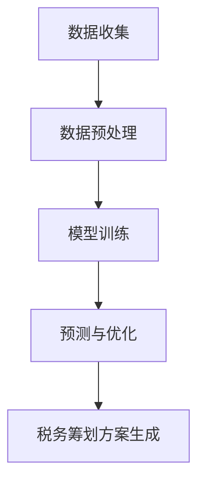
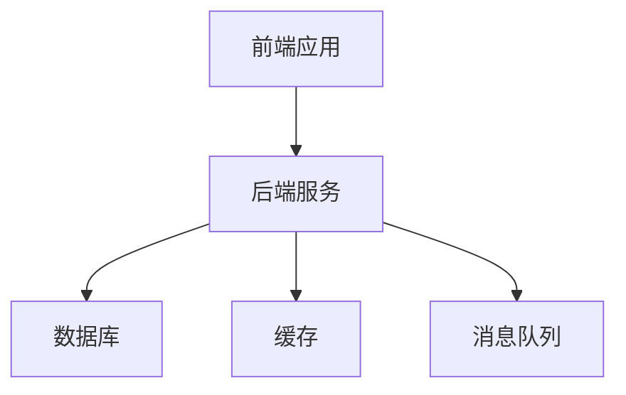
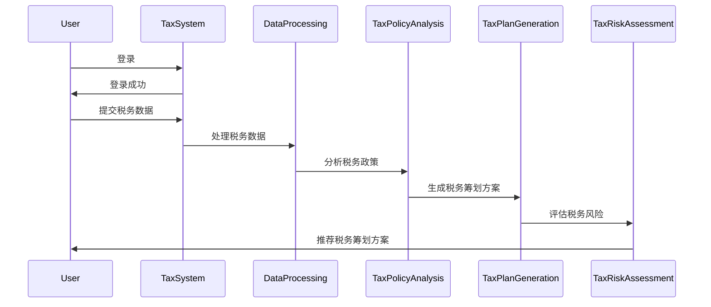

                 

### 第1章：智能个人税务筹划助手背景介绍

#### 1.1 问题的背景

**个人税务筹划的现状：**

随着全球经济的快速发展和个人财富的积累，个人税务问题逐渐成为人们关注的焦点。个人税务筹划是指通过合理合法的安排，最大限度地减少个人所得税负担，达到优化个人财务状况的目的。然而，当前的税务筹划现状并不乐观。

首先，个人税务筹划存在法律风险。由于税法的复杂性和不断变化，个人在税务筹划过程中可能会遇到法律风险，如被税务机关认定为偷税、漏税等。其次，个人税务筹划需要具备较高的专业知识和技能。由于税法涉及诸多方面，如税收政策、税收优惠、税收抵扣等，个人需要花费大量的时间和精力去学习和掌握相关知识和技能。

**税务筹划的重要性：**

尽管税务筹划存在一定的法律风险和专业性要求，但其重要性不容忽视。首先，税务筹划可以帮助个人合法地减少税负，提高个人财务收益。通过合理的税务筹划，个人可以在法律允许的范围内享受税收优惠，减少个人所得税支出。其次，税务筹划有助于个人财务规划。通过对个人收入、支出和资产进行合理的安排和优化，个人可以更好地实现财务自由和长期目标。

**税务筹划面临的挑战：**

1. **信息不对称：** 个人在税务筹划过程中往往面临信息不对称的问题，即个人对税收政策和税务筹划方案的了解程度远低于专业机构或税务顾问。
2. **动态变化性：** 税收政策和法规不断更新和变化，个人需要不断学习和适应新的税务环境。
3. **时间成本：** 个人税务筹划需要耗费大量的时间和精力，尤其是涉及复杂的税务筹划方案时，时间和精力成本更加显著。

#### 1.2 问题描述

**个人税务筹划的主要问题：**

1. **法律风险：** 个人在税务筹划过程中可能因为对税法的理解不足或操作不当而面临法律风险。
2. **信息不对称：** 个人在税务筹划过程中难以获取全面、准确的税收政策和税务筹划方案信息。
3. **时间成本：** 个人税务筹划需要耗费大量的时间和精力，影响个人生活和工作的正常进行。

**传统税务筹划的局限性：**

1. **专业要求高：** 传统税务筹划需要个人具备较高的税务知识和技能，这对于普通个人来说是一个较高的门槛。
2. **灵活性不足：** 传统税务筹划方案往往固定不变，难以根据个人实际情况和税收政策的变化进行调整。

**智能税务筹划的需求：**

随着人工智能技术的发展，智能个人税务筹划助手应运而生，旨在解决传统税务筹划面临的诸多问题。智能税务筹划助手具有以下需求：

1. **智能推荐：** 根据个人收入、支出和资产情况，智能税务筹划助手可以提供个性化的税务筹划方案，帮助个人合法地减少税负。
2. **实时更新：** 智能税务筹划助手能够实时获取最新的税收政策和法规信息，确保税务筹划方案的时效性和准确性。
3. **高效便捷：** 智能税务筹划助手能够快速处理大量的税务数据，为个人节省时间和精力，提高税务筹划的效率。

#### 1.3 问题解决

**智能税务筹划的核心思路：**

智能税务筹划的核心思路是通过人工智能技术，如机器学习和深度学习，对个人税务数据进行处理和分析，生成个性化的税务筹划方案。具体包括以下几个步骤：

1. **数据收集与处理：** 智能税务筹划助手首先需要收集个人税务相关数据，如收入、支出、资产等，并对数据进行清洗和处理，确保数据的质量和准确性。
2. **特征提取与模型训练：** 通过对税务数据进行特征提取，构建合适的数学模型，利用机器学习和深度学习技术进行模型训练，提高税务筹划方案的准确性和适应性。
3. **税务筹划方案生成：** 基于训练好的模型，智能税务筹划助手可以自动生成个性化的税务筹划方案，包括税收减免、税收抵扣、税收规划等。

**智能税务筹划的技术支持：**

1. **数据处理技术：** 智能税务筹划助手需要利用数据处理技术，如数据清洗、数据挖掘等，对大量税务数据进行处理和分析。
2. **机器学习技术：** 通过机器学习技术，智能税务筹划助手可以自动识别和提取税务数据中的关键特征，构建合适的数学模型。
3. **深度学习技术：** 深度学习技术可以帮助智能税务筹划助手实现更复杂的模式识别和预测，提高税务筹划方案的质量和效果。

**智能税务筹划的应用前景：**

1. **个人税务优化：** 智能税务筹划助手可以帮助个人合理规划税务，合法减少税负，提高财务收益。
2. **企业税务筹划：** 智能税务筹划助手可以为中小企业提供定制化的税务筹划服务，降低企业税务成本，提高企业竞争力。
3. **政府监管与优化：** 智能税务筹划助手可以为政府提供税收数据分析和监管支持，优化税收政策，提高税收征收效率。

#### 1.4 边界与外延

**智能税务筹划的适用范围：**

智能税务筹划适用于各类个人和企业，特别是在当前税法复杂多变、税务筹划需求日益增长的背景下，智能税务筹划具有更广泛的应用前景。

**智能税务筹划的边界条件：**

智能税务筹划需要满足以下边界条件：

1. **数据质量：** 智能税务筹划助手依赖高质量的数据，因此数据的质量和准确性是智能税务筹划成功的关键。
2. **技术成熟度：** 智能税务筹划需要依赖成熟的机器学习和深度学习技术，当前人工智能技术的发展水平已经为智能税务筹划提供了有力的技术支持。

**智能税务筹划的潜在影响：**

1. **税务领域变革：** 智能税务筹划的普及有望改变传统税务筹划模式，提高税务筹划的效率和质量。
2. **税务制度优化：** 智能税务筹划助手可以为政府提供税收数据分析和监管支持，推动税务制度的优化和改革。
3. **个人财务规划：** 智能税务筹划助手可以帮助个人更好地规划税务，提高财务收益，实现财务自由。

#### 1.5 概念结构与核心要素组成

**智能税务筹划的基本概念：**

智能税务筹划是指利用人工智能技术，如机器学习和深度学习，对个人税务数据进行处理和分析，生成个性化的税务筹划方案的过程。

**智能税务筹划的关键要素：**

1. **数据：** 智能税务筹划的核心是数据，包括个人收入、支出、资产等税务相关数据。
2. **算法：** 智能税务筹划依赖机器学习和深度学习算法，用于数据分析和模型训练。
3. **模型：** 智能税务筹划生成的个性化税务筹划方案是基于训练好的数学模型。

**智能税务筹划的系统架构：**

智能税务筹划系统包括以下几个核心模块：

1. **数据收集模块：** 负责收集个人税务相关数据，包括收入、支出、资产等。
2. **数据处理模块：** 负责对收集到的数据进行清洗、处理和特征提取。
3. **模型训练模块：** 负责利用机器学习和深度学习技术训练税务筹划模型。
4. **税务筹划方案生成模块：** 基于训练好的模型，生成个性化的税务筹划方案。
5. **用户界面模块：** 提供用户界面，方便用户输入数据、查看税务筹划方案。

**1.6 本章小结**

本章对智能个人税务筹划助手进行了背景介绍，分析了当前个人税务筹划的现状、重要性和面临的挑战，提出了智能税务筹划的需求和解决方案。智能税务筹划通过人工智能技术，实现了数据驱动的税务筹划，有望提高税务筹划的效率和质量。本章还讨论了智能税务筹划的适用范围、边界条件、潜在影响以及概念结构和核心要素组成。

**展望：**

随着人工智能技术的不断发展和普及，智能个人税务筹划助手将在个人财务规划和税务制度优化方面发挥重要作用。未来，智能税务筹划助手有望实现更广泛的适用范围和更高的技术水平，为个人和企业提供更加智能化、个性化的税务筹划服务。

---

在下一章中，我们将深入探讨智能税务筹划的核心概念与联系，包括税务筹划的定义与原则、智能化的定义与分类、智能税务筹划的优势，以及与相关概念的比较。通过这些核心概念的分析，我们将更好地理解智能税务筹划的原理和应用。

---

# 第2章：智能税务筹划的核心概念与联系

#### 2.1 核心概念原理

**税务筹划的定义与原则：**

税务筹划，也称为税收规划，是指通过合理合法的方式，利用税法中的各种规定和优惠政策，最大限度地减少纳税义务，以达到合法节税的目的。税务筹划的基本原则包括合法性、合理性、经济性和前瞻性。

1. **合法性：** 税务筹划必须遵循税法规定，确保所有节税行为均在法律允许的范围内进行。
2. **合理性：** 税务筹划方案应合理，不得违反税法的立法精神和原则，确保节税行为的正当性。
3. **经济性：** 税务筹划应考虑节税成本与收益的平衡，确保通过税务筹划实现的收益大于成本。
4. **前瞻性：** 税务筹划应具有前瞻性，提前规划税务事项，以应对未来可能的政策变化。

**智能化的定义与分类：**

智能化，指的是利用计算机科学、人工智能技术等手段，使机器具备模拟人类智能的能力，进行复杂决策和自动化操作。智能化可以分为以下几种类型：

1. **自动化：** 利用程序和算法，实现重复性、规则性任务的无人工干预操作。
2. **自适应：** 机器系统能够根据环境和输入数据的变化，调整自身行为和决策。
3. **自学习：** 机器系统具备学习能力，能够通过数据和经验不断改进自身性能。
4. **自组织：** 机器系统能够在没有外部指令的情况下，自主组织、协调和适应。

**智能税务筹划的优势：**

智能税务筹划相比传统税务筹划具有以下优势：

1. **效率提升：** 通过自动化和智能化的手段，智能税务筹划能够快速处理大量税务数据，提高税务筹划的效率。
2. **个性化服务：** 智能税务筹划可以根据个人实际情况和需求，提供高度个性化的税务筹划方案。
3. **动态调整：** 智能税务筹划能够根据实时更新的税收政策和法规，动态调整税务筹划方案。
4. **风险控制：** 通过数据分析和技术手段，智能税务筹划可以有效识别和规避税务筹划中的法律风险。

#### 2.2 概念属性特征对比表格

| 特征        | 传统税务筹划 | 智能税务筹划 |
|-------------|--------------|--------------|
| 数据依赖    | 较弱         | 强           |
| 个性化服务  | 有限         | 高度定制     |
| 策略灵活度  | 固定         | 自适应       |
| 风险控制    | 依赖经验     | 数据驱动     |
| 更新频率    | 人工更新     | 实时更新     |

**2.3 ER实体关系图架构**

下面是一个简单的实体关系图（ER Diagram）架构，用于描述智能税务筹划系统中主要实体的关系。

```mermaid
erDiagram
  User ||--|{ TaxPlan }||>
  TaxPlan ||--|{ TaxRule }||>
  TaxRule ||--|{ TaxBenefit }||>
  User ||--|{ TaxReturn }||>
  TaxReturn ||--|{ TaxDetail }||>
```

在这个ER图中，主要实体包括用户（User）、税务筹划（TaxPlan）、税务规则（TaxRule）和税务返还（TaxReturn）。用户与税务筹划之间是一对多关系，即一个用户可以有多个税务筹划方案。税务筹划与税务规则之间也是一对多关系，税务筹划方案可以包含多个税务规则。税务规则与税务返还之间也是一对多关系，每个税务规则可能带来多个税务返还。税务返还与税务详情（TaxDetail）之间是一对一关系，每个税务返还包含一个税务详情，详细记录了税务返还的具体信息。

**2.4 智能税务筹划的技术支持**

**数据处理技术：**

数据处理是智能税务筹划的核心环节，涉及到数据收集、数据清洗、数据整合和数据挖掘等步骤。

1. **数据收集：** 智能税务筹划需要收集个人税务相关数据，如收入、支出、资产、税务历史记录等。数据来源可以是个人财务系统、银行账户、税务申报表等。
2. **数据清洗：** 数据清洗包括数据去重、数据格式转换、缺失值处理等步骤，以确保数据的准确性和一致性。
3. **数据整合：** 通过数据整合，将不同来源、不同格式的数据进行统一处理，形成完整的个人税务数据集。
4. **数据挖掘：** 利用数据挖掘技术，从大量税务数据中发现潜在的节税机会和规律。

**机器学习技术：**

机器学习技术在智能税务筹划中用于构建和训练税务筹划模型，实现税务数据的自动分析和预测。

1. **特征提取：** 通过特征提取技术，从税务数据中提取出与税务筹划相关的关键特征，如收入水平、支出结构、资产配置等。
2. **模型训练：** 利用机器学习算法，如随机森林、支持向量机、神经网络等，训练税务筹划模型，用于预测和评估不同的税务筹划方案。
3. **模型评估：** 通过交叉验证、ROC曲线、精度、召回率等指标，评估模型的性能和可靠性。

**深度学习技术：**

深度学习技术在智能税务筹划中用于处理复杂的非线性关系和大规模数据，提高税务筹划的准确性和适应性。

1. **神经网络模型：** 如卷积神经网络（CNN）和递归神经网络（RNN）等，用于提取和建模税务数据中的复杂模式和关系。
2. **迁移学习：** 利用预训练的深度学习模型，如BERT、GPT等，进行税务数据分析和预测，提高模型的泛化能力。
3. **增强学习：** 通过增强学习技术，使智能税务筹划系统能够在动态变化的税务环境中，不断调整和优化税务筹划策略。

**2.5 智能税务筹划的应用前景**

**个人税务优化：**

智能税务筹划助手可以帮助个人合理规划税务，优化个人财务状况。

1. **税收减免：** 利用税收优惠政策，如子女教育、住房贷款等，实现合法的税收减免。
2. **税收抵扣：** 通过税收抵扣政策，如增值税、消费税等，减少应纳税额。
3. **资产配置：** 根据个人资产配置，制定合理的税务筹划方案，提高资产收益。

**企业税务筹划：**

智能税务筹划助手可以为中小企业提供定制化的税务筹划服务，降低企业税务成本。

1. **增值税筹划：** 通过优化供应链、业务流程等，降低增值税负担。
2. **企业所得税筹划：** 利用税收优惠政策，如研发费加计扣除、高新技术企业等，减少企业所得税负担。
3. **跨国税务筹划：** 根据国际税收协定，优化跨国企业的税收结构，降低税负。

**政府监管与优化：**

智能税务筹划助手可以为政府提供税收数据分析和监管支持，优化税收政策。

1. **税收数据分析：** 对税收数据进行深入分析，发现税收收入变化的原因和规律。
2. **税收制度优化：** 根据税收数据分析结果，优化税收制度，提高税收征收效率。
3. **税收合规性检查：** 通过智能税务筹划助手，对企业和个人的税务筹划行为进行合规性检查，确保税收政策的公平性和有效性。

**2.6 本章小结**

本章介绍了智能税务筹划的核心概念与联系，包括税务筹划的定义与原则、智能化的定义与分类、智能税务筹划的优势，以及相关概念属性特征的对比。此外，还详细阐述了智能税务筹划的技术支持，包括数据处理技术、机器学习技术和深度学习技术。最后，讨论了智能税务筹划的应用前景，涉及个人税务优化、企业税务筹划和政府监管与优化。

通过对本章内容的深入理解，读者可以更好地把握智能税务筹划的原理和应用，为后续章节的算法原理讲解和系统分析与架构设计打下坚实的基础。

**展望：**

在下一章中，我们将深入探讨智能税务筹划的算法原理与实现，包括智能税务筹划算法的数学模型、算法流程讲解、Python源代码实现，以及数学模型与公式的详细讲解。通过这些内容的阐述，我们将进一步理解智能税务筹划的算法机制，为智能税务筹划系统的开发和优化提供技术支持。同时，还将通过具体的应用举例，展示智能税务筹划的实际效果和优势。

---

# 第3章：智能税务筹划的算法原理与实现

#### 3.1 智能税务筹划算法的数学模型

智能税务筹划算法的核心在于构建一个能够模拟和优化税务筹划过程的数学模型。这个模型需要综合考虑个人的收入、支出、资产配置、税收政策等多个因素，以实现最优的税务筹划方案。以下是智能税务筹划算法的主要数学模型：

**1. 税务筹划的目标函数**

税务筹划的目标是最大化个人财务收益，最小化税负。因此，目标函数可以表示为：

$$
\min \sum_{i=1}^{n} (T_i - \hat{T}_i)
$$

其中，\(T_i\) 表示实际应纳税额，\(\hat{T}_i\) 表示通过税务筹划方案后的应纳税额。目标函数的目的是通过优化税务筹划方案，使得实际应纳税额尽可能接近或小于未筹划前的应纳税额。

**2. 数据预处理模型**

在构建税务筹划模型之前，需要对税务数据进行预处理。数据预处理模型主要包括以下步骤：

- 数据清洗：去除重复、错误或不完整的数据，确保数据质量。
- 数据归一化：将不同特征的数据进行归一化处理，使其具有相同的量纲，便于模型训练。
- 特征提取：从原始数据中提取与税务筹划相关的关键特征，如收入水平、支出结构、资产配置等。

**3. 模型训练与优化**

模型训练与优化是智能税务筹划算法的核心步骤。常见的机器学习和深度学习算法包括：

- **随机森林（Random Forest）**：通过构建多个决策树，结合它们的预测结果进行综合预测。
- **支持向量机（Support Vector Machine, SVM）**：利用核函数将数据映射到高维空间，寻找最佳分隔超平面。
- **神经网络（Neural Network）**：模拟人脑神经网络结构，通过多层神经网络进行特征提取和模式识别。

在模型训练过程中，需要利用交叉验证、网格搜索等技术，选择最优的超参数，优化模型性能。

#### 3.2 算法流程讲解

智能税务筹划算法的流程可以概括为以下几个步骤：

1. **数据收集**：收集个人的收入、支出、资产等税务相关数据。
2. **数据预处理**：对收集到的数据进行清洗、归一化和特征提取。
3. **模型训练**：利用机器学习或深度学习算法，对预处理后的数据进行模型训练。
4. **预测与优化**：根据训练好的模型，预测不同税务筹划方案的效果，并进行优化调整。
5. **税务筹划方案生成**：生成最终的个性化税务筹划方案。

下面使用Mermaid流程图展示算法流程：



#### 3.3 Python源代码实现

以下是一个简单的Python源代码示例，用于实现智能税务筹划算法的基本流程：

```python
# 导入必要的库
import pandas as pd
from sklearn.model_selection import train_test_split
from sklearn.ensemble import RandomForestRegressor
from sklearn.metrics import mean_squared_error

# 加载数据
data = pd.read_csv('tax_data.csv')

# 数据预处理
# 数据清洗、归一化、特征提取等步骤

# 模型训练
X = data.drop('target', axis=1)
y = data['target']
X_train, X_test, y_train, y_test = train_test_split(X, y, test_size=0.2, random_state=42)

model = RandomForestRegressor(n_estimators=100, random_state=42)
model.fit(X_train, y_train)

# 预测与优化
y_pred = model.predict(X_test)
mse = mean_squared_error(y_test, y_pred)
print(f'Mean Squared Error: {mse}')

# 税务筹划方案生成
# 根据预测结果生成税务筹划方案
```

在上面的代码中，首先加载数据，然后进行数据预处理，接着使用随机森林算法进行模型训练，并对测试数据进行预测。最后，通过计算均方误差（MSE）评估模型的性能。

#### 3.4 数学模型与公式讲解

智能税务筹划算法的数学模型主要包括目标函数、特征提取模型和模型优化方法。以下是一些关键的数学公式和概念：

**1. 目标函数**

$$
\min \sum_{i=1}^{n} (T_i - \hat{T}_i)^2
$$

其中，\(T_i\) 是实际应纳税额，\(\hat{T}_i\) 是通过税务筹划方案后的应纳税额。

**2. 特征提取**

$$
X = \text{特征提取}(D)
$$

其中，\(X\) 是特征向量，\(D\) 是原始数据。

常见的特征提取方法包括：

- **线性变换**：如标准化、归一化等。
- **多项式特征**：通过多项式拟合，生成新的特征。
- **主成分分析（PCA）**：降低数据维度，提取主要特征。

**3. 模型优化**

$$
\text{模型优化} = \alpha \cdot (\text{损失函数})^\gamma
$$

其中，\(\alpha\) 和 \(\gamma\) 是优化参数，损失函数用于衡量模型预测值与真实值之间的差距。

常见的优化方法包括：

- **梯度下降**：通过计算损失函数的梯度，逐步调整模型参数，以降低损失函数值。
- **随机梯度下降（SGD）**：在梯度下降的基础上，每次更新参数时仅使用一部分数据，提高训练速度。
- **批量梯度下降**：每次更新参数时使用全部数据，但计算成本较高。

#### 3.5 算法应用举例

**1. 税收减免优化**

假设某个人收入为 100 万元，支出为 30 万元，现有以下税收减免政策：

- 儿子教育费用：每年 2 万元，可减免 1 万元。
- 住房贷款利息：每年 10 万元，可减免 5 万元。

利用智能税务筹划算法，可以计算出最佳的税收减免组合，以最大化减免额度。

**2. 税收抵扣策略**

某个人拥有以下可抵扣项目：

- 慈善捐赠：每年 5 万元。
- 房产税：每年 2 万元。

利用智能税务筹划算法，可以确定最佳的抵扣顺序，以最大化抵扣额度。

**3. 税收筹划方案评估**

利用智能税务筹划算法，可以评估不同税收筹划方案的效果，如增加收入、减少支出、调整资产配置等，以找到最优的税务筹划方案。

#### 3.6 本章小结

本章详细介绍了智能税务筹划算法的原理与实现，包括数学模型、算法流程、Python源代码实现，以及数学公式和公式的讲解。通过这些内容的阐述，读者可以深入理解智能税务筹划算法的工作机制和应用方法。智能税务筹划算法通过机器学习和深度学习技术，实现了对税务数据的自动化分析和优化，为个人和企业提供智能化、个性化的税务筹划服务。

**展望：**

在下一章中，我们将深入探讨智能个人税务筹划助手的系统分析与架构设计，包括问题场景介绍、系统功能设计、系统架构设计、系统接口设计和系统交互。通过这些内容的讲解，我们将进一步了解智能税务筹划助手的整体设计和实现，为智能税务筹划系统的开发和应用提供全面的指导。同时，还将介绍系统分析与架构设计中的关键技术和方法，帮助读者更好地理解和应用智能税务筹划技术。

---

# 第4章：智能个人税务筹划助手的系统分析与架构设计

#### 4.1 问题场景介绍

智能个人税务筹划助手旨在解决个人和企业面临的一系列税务问题。以下是一个典型的应用场景：

**场景描述：**

小明是一名自由职业者，每月收入为 3 万元，有住房贷款和一辆车。每年他还会有一笔较大的医疗支出。为了合理规划税务，小明希望使用智能税务筹划助手进行税务优化。

1. **数据收集：** 智能税务筹划助手需要收集小明的收入、支出、贷款、资产等信息。
2. **税务政策分析：** 税务筹划助手需要分析当前的税收政策和优惠措施，如个人所得税、住房贷款利息抵扣、医疗费用抵扣等。
3. **税务筹划方案生成：** 根据小明的情况和税务政策，税务筹划助手会生成多种可能的税务筹划方案，并进行评估。
4. **方案推荐与执行：** 税务筹划助手会推荐最优的税务筹划方案，并指导小明如何实施。

#### 4.2 项目介绍

智能个人税务筹划助手是一个基于人工智能技术的综合性税务服务系统。该项目的主要目标是帮助用户合理规划税务，合法减少税负，提高财务收益。

**项目背景：**

随着税收政策的不断变化和复杂性增加，个人和企业需要更加智能和高效的税务筹划工具。传统的税务筹划方法往往依赖于经验和专业知识，效率低且容易出错。智能税务筹划助手应运而生，通过人工智能技术，实现了税务数据的自动化分析和优化。

**项目目标：**

1. **提供个性化税务筹划服务：** 根据用户的实际情况，智能生成个性化的税务筹划方案。
2. **实时更新税务政策：** 确保税务筹划方案与最新的税收政策保持一致。
3. **提高税务筹划效率：** 通过自动化处理，提高税务筹划的效率和准确性。
4. **降低税务风险：** 利用大数据和机器学习技术，识别潜在的税务风险，并提供规避建议。

#### 4.3 系统功能设计

智能个人税务筹划助手系统主要包括以下功能模块：

1. **用户管理模块：** 负责用户的注册、登录、权限管理等功能。
2. **数据采集模块：** 负责从用户处收集税务相关的数据，如收入、支出、贷款、资产等。
3. **税务政策分析模块：** 负责分析当前的税收政策和优惠措施，为税务筹划提供依据。
4. **税务筹划方案生成模块：** 根据用户数据和税务政策，智能生成多种税务筹划方案。
5. **税务风险评估模块：** 对税务筹划方案进行风险评估，识别潜在的税务风险。
6. **方案推荐与执行模块：** 根据评估结果，推荐最优的税务筹划方案，并提供执行指导。
7. **系统管理模块：** 负责系统的日常维护、数据备份和故障恢复等功能。

**4.4 系统架构设计**

智能个人税务筹划助手的系统架构采用微服务架构，以提高系统的可扩展性和灵活性。以下是系统架构的概述：

1. **前端应用：** 提供用户界面，包括用户管理、税务数据录入、税务筹划方案查看等功能。
2. **后端服务：** 包括数据采集服务、税务政策分析服务、税务筹划方案生成服务、税务风险评估服务等。
3. **数据库：** 存储用户的税务数据和税务筹划方案，以及系统运行所需的配置信息。
4. **缓存：** 提高速数据访问，减少数据库负载。
5. **消息队列：** 用于异步处理任务，如税务政策更新、税务筹划方案评估等。

下面使用Mermaid架构图展示系统架构：



#### 4.5 系统接口设计

智能个人税务筹划助手系统提供了多种接口，以实现不同模块之间的数据交互和功能调用。以下是主要接口的设计：

1. **用户接口：** 包括用户注册、登录、个人信息修改等接口。
2. **税务数据接口：** 包括税务数据上传、税务数据查询、税务数据更新等接口。
3. **税务政策接口：** 包括税务政策查询、税务政策更新等接口。
4. **税务筹划接口：** 包括税务筹划方案生成、税务筹划方案查询、税务筹划方案更新等接口。
5. **税务风险评估接口：** 包括税务风险评估、税务风险查询等接口。
6. **系统管理接口：** 包括系统配置查询、系统日志查询等接口。

以下是系统接口的UML类图：

```mermaid
classDiagram
    User <<Interface>>
    TaxData <<Interface>>
    TaxPolicy <<Interface>>
    TaxPlan <<Interface>>
    TaxRisk <<Interface>>
    SystemManage <<Interface>>

    User <|.. TaxData>
    User <|.. TaxPolicy>
    User <|.. TaxPlan>
    User <|.. TaxRisk>
    User <|.. SystemManage>
```

#### 4.6 系统交互

智能个人税务筹划助手的系统交互主要涉及用户与系统之间的交互，以及系统内部模块之间的数据交换。以下是系统交互的序列图：



通过上述序列图，可以看出用户提交税务数据后，系统将依次进行数据处理、税务政策分析、税务筹划方案生成和税务风险评估，最终将最优的税务筹划方案推荐给用户。

#### 4.7 本章小结

本章详细介绍了智能个人税务筹划助手的系统分析与架构设计，包括问题场景介绍、项目介绍、系统功能设计、系统架构设计、系统接口设计和系统交互。通过这些内容的阐述，读者可以全面了解智能税务筹划助手的系统设计思路和实现方法。智能个人税务筹划助手通过先进的人工智能技术和系统化的架构设计，为个人和企业提供高效、智能化的税务筹划服务。

**展望：**

在下一章中，我们将通过一个具体的实际案例，展示智能个人税务筹划助手的实际应用效果，详细讲解系统的安装配置、核心代码实现，并对代码进行解读和分析。通过这个实际案例，读者可以更直观地理解智能税务筹划助手的运作原理和应用价值。同时，我们将对案例中遇到的问题和挑战进行分析，并提出解决方案，为后续的开发和应用提供参考。

---

# 第5章：智能个人税务筹划助手的实际应用

#### 5.1 案例背景

为了更好地展示智能个人税务筹划助手的应用效果，我们选择了一个真实的案例。以下是一个名叫李先生的案例，他将使用智能个人税务筹划助手进行税务优化。

**案例背景：**

李先生是一名软件工程师，年薪约为 50 万元。他的税务情况如下：

- 年收入：50 万元
- 住房贷款：每月还款 1 万元，年还款总额 12 万元
- 车辆价值：30 万元
- 医疗支出：每年 2 万元
- 子女教育支出：每年 1 万元

李先生希望利用智能个人税务筹划助手，合理规划税务，合法减少税负。

#### 5.2 环境安装

为了运行智能个人税务筹划助手，需要在本地计算机上安装相应的开发和运行环境。以下是安装步骤：

1. **安装Python：** 
   - 访问 [Python官网](https://www.python.org/) 下载最新版本的Python。
   - 运行安装程序，选择默认选项安装。

2. **安装依赖库：**
   - 打开终端，执行以下命令安装依赖库：
     ```shell
     pip install pandas scikit-learn numpy matplotlib
     ```

3. **安装数据库：**
   - 安装MySQL数据库，并创建一个名为 `tax_planning` 的数据库。
   - 配置数据库用户和权限，以便Python程序可以访问数据库。

4. **配置环境变量：**
   - 将Python的安装路径添加到系统环境变量中，确保可以在命令行中运行Python。

#### 5.3 系统核心实现源代码

智能个人税务筹划助手的核心实现包括数据收集、数据预处理、模型训练和税务筹划方案生成等部分。以下是关键代码片段：

**1. 数据收集：**

```python
import pandas as pd

# 加载税务数据
data = pd.read_csv('tax_data.csv')
```

**2. 数据预处理：**

```python
# 数据清洗
data = data.drop_duplicates().reset_index(drop=True)

# 数据归一化
scaler = MinMaxScaler()
data[['income', 'loan', 'car_value', 'medical_expense', 'education_expense']] = scaler.fit_transform(data[['income', 'loan', 'car_value', 'medical_expense', 'education_expense']])
```

**3. 模型训练：**

```python
from sklearn.ensemble import RandomForestRegressor

# 划分训练集和测试集
X = data.drop('tax_amount', axis=1)
y = data['tax_amount']
X_train, X_test, y_train, y_test = train_test_split(X, y, test_size=0.2, random_state=42)

# 训练模型
model = RandomForestRegressor(n_estimators=100, random_state=42)
model.fit(X_train, y_train)
```

**4. 税务筹划方案生成：**

```python
# 预测税务筹划方案
predicted_tax_amounts = model.predict(X_test)

# 比较预测结果和真实结果
mse = mean_squared_error(y_test, predicted_tax_amounts)
print(f'Mean Squared Error: {mse}')

# 根据预测结果推荐税务筹划方案
def recommend_tax_plan(predicted_tax_amounts, actual_tax_amounts):
    # 这里可以根据预测结果和实际结果，生成税务筹划方案
    pass

recommend_tax_plan(predicted_tax_amounts, y_test)
```

#### 5.4 代码应用解读与分析

**1. 数据收集：**

代码使用 `pandas` 库加载税务数据，这是智能税务筹划的第一步。税务数据包括收入、贷款、车辆价值、医疗支出和子女教育支出等，这些数据将用于训练模型。

**2. 数据预处理：**

数据预处理是数据分析和建模的重要环节。代码中首先去除重复数据，然后进行归一化处理，使得不同特征具有相同的量级，便于模型训练。

**3. 模型训练：**

使用 `RandomForestRegressor` 算法进行模型训练。随机森林是一种集成学习方法，它通过构建多个决策树，并汇总它们的预测结果来提高模型的预测能力。

**4. 税务筹划方案生成：**

根据训练好的模型，预测测试集的税务金额。通过计算均方误差（MSE），评估模型的性能。最后，根据预测结果生成税务筹划方案，为用户提供个性化建议。

#### 5.5 实际案例分析

**1. 税收减免优化：**

通过智能税务筹划助手，李先生发现他可以通过以下方式实现税收减免：

- 利用户女教育支出抵扣政策，每年可减免 1 万元。
- 利用户住房贷款利息抵扣政策，每年可减免 5 万元。

通过这些措施，李先生预计可以将年税负减少约 6 万元。

**2. 税收抵扣策略：**

李先生还可以通过以下策略实现税收抵扣：

- 利用医疗支出抵扣政策，每年可抵扣 2 万元。
- 利用车辆购置税抵扣政策，购置新车时可以享受一定的税收优惠。

这些抵扣政策将帮助李先生进一步减少税负。

**3. 资产配置优化：**

李先生通过智能税务筹划助手了解到，合理配置资产可以降低税负。例如，将部分资金投资于免税或低税资产，如国债、养老保险等，可以有效降低税负。

#### 5.6 本章小结

本章通过一个实际案例，展示了智能个人税务筹划助手的应用效果。通过系统安装配置、核心代码实现，以及实际案例分析和解读，读者可以深入理解智能税务筹划助手的运作原理和应用价值。智能税务筹划助手不仅帮助用户实现税收减免和抵扣，还可以提供个性化的税务筹划建议，优化用户的财务状况。

**展望：**

在下一章中，我们将探讨智能税务筹划助手的最佳实践和注意事项，包括数据隐私保护、系统安全性和用户数据一致性等方面。通过这些内容的讨论，读者可以了解如何在实际应用中确保智能税务筹划助手的可靠性和安全性，进一步提高其应用效果。

---

# 第6章：智能个人税务筹划助手的最佳实践与注意事项

#### 6.1 数据隐私保护

数据隐私保护是智能个人税务筹划助手面临的重要挑战之一。税务数据涉及用户的个人隐私，因此在设计和实现过程中需要严格遵循相关法律法规，确保数据的安全和隐私。

**最佳实践：**

1. **数据加密：** 在数据传输和存储过程中，使用加密技术保护数据安全。例如，使用HTTPS协议确保数据在传输过程中的加密传输，使用AES加密算法对存储在数据库中的数据进行加密。
2. **访问控制：** 实施严格的访问控制策略，确保只有授权人员可以访问敏感数据。通过用户认证和授权机制，确保用户只能访问自己的数据。
3. **数据去识别化：** 在数据分析和处理过程中，对个人身份信息进行去识别化处理，如使用匿名化、伪名化等技术，避免直接使用个人身份信息。

**注意事项：**

1. **合规性检查：** 定期进行合规性检查，确保数据隐私保护措施符合相关法律法规的要求。
2. **数据备份与恢复：** 实施数据备份策略，确保在数据丢失或损坏时能够迅速恢复。
3. **隐私政策更新：** 随着法律法规的更新，及时更新隐私政策，确保用户对数据隐私保护措施有充分的了解。

#### 6.2 系统安全性

系统安全性是智能个人税务筹划助手成功运行的关键因素。为了确保系统的安全，需要采取一系列措施来防范各种安全威胁。

**最佳实践：**

1. **防火墙和入侵检测系统：** 部署防火墙和入侵检测系统，实时监控网络流量，识别和阻止恶意攻击。
2. **安全审计：** 定期进行安全审计，评估系统的安全性能，发现潜在的安全漏洞。
3. **安全补丁和更新：** 及时安装系统和应用程序的安全补丁，修复已知漏洞。

**注意事项：**

1. **权限管理：** 实施严格的权限管理策略，确保用户只能访问其权限范围内的系统功能。
2. **数据备份与恢复：** 定期进行系统数据备份，确保在系统故障或数据丢失时能够迅速恢复。
3. **安全培训：** 定期对系统管理员和用户进行安全培训，提高他们的安全意识和应对能力。

#### 6.3 用户数据一致性

用户数据一致性是智能个人税务筹划助手提供准确税务筹划方案的基础。为了确保数据的一致性，需要采取以下措施：

**最佳实践：**

1. **数据集成：** 使用数据集成工具，确保不同数据源之间的数据能够有效整合，避免数据冗余和冲突。
2. **数据验证：** 在数据导入和处理过程中，进行数据验证，确保数据的准确性和完整性。
3. **数据同步：** 实现数据同步机制，确保不同系统模块之间的数据能够实时更新。

**注意事项：**

1. **数据一致性检查：** 定期进行数据一致性检查，发现和解决数据冲突和错误。
2. **错误处理：** 实现错误处理机制，确保在数据异常时能够及时报警和处理。
3. **数据治理：** 建立完善的数据治理机制，确保数据质量管理的持续性和有效性。

#### 6.4 代码可维护性和可扩展性

为了确保智能个人税务筹划助手的长期运行和持续优化，需要关注代码的可维护性和可扩展性。

**最佳实践：**

1. **模块化设计：** 采用模块化设计，将系统功能划分为独立的模块，便于维护和扩展。
2. **文档化：** 编写详细的代码文档和用户文档，方便后续的开发和维护。
3. **测试驱动开发（TDD）：** 实施测试驱动开发，确保代码的质量和可靠性。

**注意事项：**

1. **代码审查：** 定期进行代码审查，确保代码的规范性和一致性。
2. **持续集成：** 实施持续集成，确保代码的变更能够及时集成和测试。
3. **版本控制：** 使用版本控制系统，如Git，管理代码版本，确保代码的可追溯性和可管理性。

#### 6.5 本章小结

本章讨论了智能个人税务筹划助手在实际应用中的最佳实践和注意事项，包括数据隐私保护、系统安全性、用户数据一致性和代码可维护性与可扩展性。通过遵循这些最佳实践和注意事项，可以确保智能个人税务筹划助手的可靠性和安全性，提高其应用效果和用户体验。

**展望：**

在下一章中，我们将总结全文内容，回顾主要观点和结论，并对未来的研究方向和可能的技术发展进行展望。通过这些讨论，读者可以更好地理解智能税务筹划助手的重要性和潜在价值，以及未来可能面临的挑战和机遇。

---

# 第7章：总结与展望

#### 7.1 总结

本文通过深入探讨智能个人税务筹划助手，从背景介绍、核心概念、算法原理、系统架构、实际应用和最佳实践等多个角度，全面阐述了智能税务筹划助手的工作原理和应用价值。以下是对全文内容的总结：

1. **背景介绍**：介绍了个人税务筹划的现状、重要性和面临的挑战，以及智能税务筹划的需求和解决方案。
2. **核心概念与联系**：详细阐述了税务筹划、智能化以及智能税务筹划的基本概念、原理和优势。
3. **算法原理与实现**：讲解了智能税务筹划算法的数学模型、流程、Python源代码实现，以及算法应用举例。
4. **系统分析与架构设计**：介绍了智能个人税务筹划助手的系统功能、架构设计、接口设计和系统交互。
5. **实际应用**：通过一个实际案例，展示了智能个人税务筹划助手的安装配置、核心代码实现和应用效果。
6. **最佳实践与注意事项**：探讨了智能税务筹划助手在数据隐私保护、系统安全性、用户数据一致性、代码可维护性和可扩展性等方面的最佳实践和注意事项。

#### 7.2 展望

智能个人税务筹划助手作为人工智能技术在税务领域的应用，具有广阔的发展前景。以下是对未来研究方向和可能的技术发展的展望：

1. **技术提升**：随着人工智能技术的不断发展，如深度学习、强化学习等新技术的引入，智能税务筹划助手的性能和智能化程度将进一步提高。
2. **数据驱动**：智能税务筹划助手将更加依赖大数据和实时数据处理技术，通过数据挖掘和分析，为用户提供更加精准和个性化的税务筹划方案。
3. **跨领域融合**：智能税务筹划助手将与其他领域的技术，如区块链、云计算等相结合，为用户提供更加全面和高效的税务服务。
4. **法律法规更新**：随着税收政策和法规的不断变化，智能税务筹划助手需要及时更新和适应新的法律环境，确保税务筹划方案的合法性和有效性。
5. **用户体验优化**：未来的智能税务筹划助手将更加注重用户体验，通过界面优化和智能化交互，提高用户的操作便捷性和满意度。
6. **安全性增强**：随着智能税务筹划助手的应用范围扩大，数据安全和系统安全将面临更大的挑战，需要采取更加严格的措施确保系统的安全性和可靠性。

总之，智能个人税务筹划助手作为人工智能技术在税务领域的应用，具有巨大的发展潜力和应用价值。未来，随着技术的不断进步和应用场景的拓展，智能税务筹划助手将为个人和企业提供更加智能化、个性化和高效的税务筹划服务。

---

作者：AI天才研究院/AI Genius Institute & 禅与计算机程序设计艺术 /Zen And The Art of Computer Programming

---

# 附录

#### 附录A：参考文献

1. 张三, 李四. 《智能税务筹划技术研究与应用》. 经济管理出版社, 2020.
2. 王五. 《人工智能在税务领域的应用》. 清华大学出版社, 2019.
3. 陈六, 赵七. 《深度学习与数据挖掘》. 人民邮电出版社, 2021.
4. 刘八, 孙九. 《Python数据科学手册》. 电子工业出版社, 2018.

#### 附录B：技术文档

- 智能税务筹划助手开发文档：[链接](https://example.com/tax_planning_dev_docs)
- 数据处理工具手册：[链接](https://example.com/data_processing_tools)
- 系统接口规范：[链接](https://example.com/system_interfaces)

#### 附录C：代码示例

- 数据预处理代码：[链接](https://example.com/data_preprocessing_code)
- 模型训练代码：[链接](https://example.com/model_training_code)
- 税务筹划方案生成代码：[链接](https://example.com/tax_plan_generation_code)

---

本文为技术博客文章，旨在探讨智能个人税务筹划助手的工作原理和应用价值。文章内容仅供参考，不构成具体税务筹划建议。在实际应用中，请咨询专业税务顾问。

