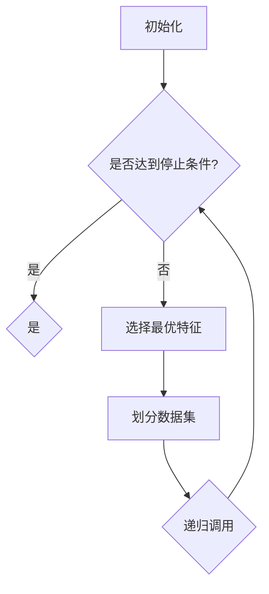
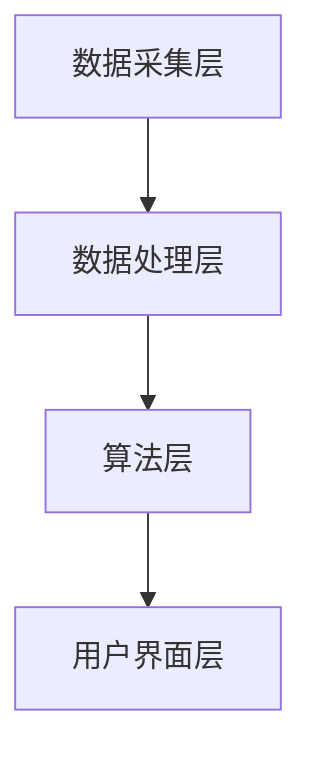
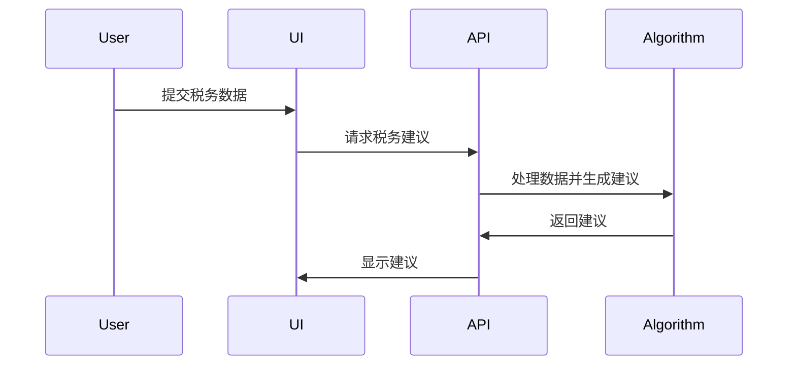
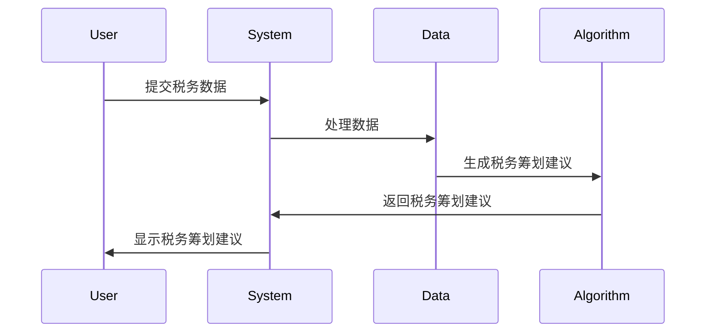

                 


### 智能个人税务筹划建议生成与模拟系统

关键词：智能税务筹划、数据预处理、算法原理、系统架构、项目实战、最佳实践

摘要：本文深入探讨智能个人税务筹划建议生成与模拟系统的设计、实现及应用。首先，我们将介绍税务筹划的背景和核心概念，包括问题背景、问题描述、问题解决、边界与外延、概念结构与核心要素组成。随后，我们将详细讲解核心概念与联系，包括智能税务筹划原理、概念属性特征对比表格和ER实体关系图架构。接着，我们将分析算法原理讲解，使用Mermaid画出算法流程图，并用Python源代码详细阐述算法原理的数学模型和公式，同时进行通俗易懂的举例说明。此外，我们还将介绍系统分析与架构设计方案，包括问题场景介绍、项目介绍、系统功能设计、系统架构设计、系统接口设计和系统交互。最后，我们将通过项目实战来展示系统的环境安装、核心实现、代码应用解读与分析、实际案例分析和详细讲解剖析，并给出最佳实践、小结、注意事项和拓展阅读。

## 第一部分：背景介绍与核心概念

### 第1章：税务筹划概述

#### 1.1 问题背景

税务筹划是指通过合法手段，利用税法规定的优惠政策，减少纳税负担或避免重复纳税的行为。随着社会经济的快速发展，个人财务状况日益复杂，如何合理地规划个人税务成为了许多个人和家庭关心的问题。

#### 1.2 问题描述

个人税务筹划面临诸多挑战，如税收法规复杂、个人财务状况多样、政策变化频繁等。这些因素使得个人在税务筹划时容易出错，甚至可能触犯法律。

#### 1.3 问题解决

为了解决这些问题，我们提出了智能个人税务筹划建议生成与模拟系统。该系统利用大数据、人工智能等技术，为用户提供个性化、智能化的税务筹划建议，帮助用户合理规避税收风险，降低纳税负担。

#### 1.4 边界与外延

税务筹划必须在法律法规的框架内进行，不得违反税法规定。此外，税务筹划还涉及国际税收、跨国税务等多个领域，需要具备全球视野。

#### 1.5 概念结构与核心要素组成

智能个人税务筹划建议生成与模拟系统包括以下几个核心要素：

1. 数据采集与预处理
2. 智能算法与模型
3. 税务建议生成与模拟
4. 用户交互与反馈

### 第2章：核心概念与联系

#### 2.1 智能税务筹划原理

智能税务筹划系统基于大数据和人工智能技术，通过对用户财务数据进行分析，结合税法规定和优惠政策，为用户提供个性化的税务筹划建议。

#### 2.2 概念属性特征对比表格

| 特征 | 传统税务筹划 | 智能税务筹划 |
| --- | --- | --- |
| 数据来源 | 经验和规则 | 大数据和机器学习 |
| 策略制定 | 固定策略 | 个性化策略 |
| 税收风险 | 较高 | 较低 |

#### 2.3 ER实体关系图架构

```mermaid
erDiagram
    User ||--|{TaxData} : 用户与税务数据关系
    TaxData ||--|{TaxPlan} : 税务数据与税务计划关系
    TaxPlan ||--|{TaxSuggestion} : 税务计划与税务建议关系
    TaxRule ||--|{TaxPlan} : 税法规则与税务计划关系
```

## 第二部分：算法原理讲解

### 第3章：数据预处理

#### 3.1 数据收集与清洗

数据收集与清洗是智能税务筹划系统的基础。我们需要收集用户的财务数据，包括收入、支出、投资、税收情况等。同时，对收集到的数据进行清洗，去除重复、错误和无效的数据。

#### 3.2 特征工程

在数据预处理的基础上，我们需要对数据进行特征提取和选择，以构建有效的特征向量。特征工程是智能税务筹划系统的关键步骤，直接影响算法的性能。

```python
# 特征提取代码示例
import pandas as pd

# 读取数据
data = pd.read_csv('data.csv')

# 特征提取
data['income_monthly'] = data['income'].apply(lambda x: x / 12)
data['spend_ratio'] = data['spend'] / data['income']
data['investment_return'] = data['investment'] * data['return_rate']
```

### 第4章：算法选择与实现

#### 4.1 常见算法介绍

在智能税务筹划系统中，我们常使用以下几种算法：

1. 决策树
2. 随机森林
3. 神经网络

这些算法各有优缺点，适用于不同的场景。

#### 4.2 算法原理与流程图

以决策树为例，其基本原理是通过对特征进行划分，将数据集划分为多个子集，直到满足停止条件。Mermaid流程图如下：



#### 4.3 数学模型与公式

决策树的数学模型可以表示为：

$$
C_j = \sum_{i=1}^{m} y_i \log_2 P(y_i | T_j)
$$

其中，$C_j$ 表示划分后的数据集，$y_i$ 表示第 $i$ 个样本的标签，$P(y_i | T_j)$ 表示第 $i$ 个样本在划分 $j$ 后的概率。

#### 4.4 举例说明

假设我们有一个包含 100 个样本的数据集，其中收入是关键特征。我们可以使用决策树算法来划分数据集，找到最优划分点。以下是一个简单的示例：

```python
# 决策树示例代码
from sklearn.tree import DecisionTreeClassifier
from sklearn.model_selection import train_test_split

# 分割数据集
X_train, X_test, y_train, y_test = train_test_split(data[['income']], data['label'], test_size=0.2, random_state=42)

# 训练决策树模型
clf = DecisionTreeClassifier()
clf.fit(X_train, y_train)

# 预测测试集
y_pred = clf.predict(X_test)

# 评估模型性能
print("Accuracy:", clf.score(X_test, y_test))
```

## 第三部分：系统分析与架构设计

### 第5章：系统功能设计

#### 5.1 领域模型

智能个人税务筹划系统的领域模型包括用户、税务数据、税务计划、税务建议和税法规则等实体。

#### 5.2 类图设计

```mermaid
classDiagram
    User <<entity>>
    TaxData <<entity>>
    TaxPlan <<entity>>
    TaxSuggestion <<entity>>
    TaxRule <<entity>>

    User |--|> TaxData
    TaxData |--|> TaxPlan
    TaxPlan |--|> TaxSuggestion
    TaxSuggestion |--|> TaxRule
```

### 第6章：系统架构设计

#### 6.1 系统架构概述

智能个人税务筹划系统的架构包括数据采集层、数据处理层、算法层和用户界面层。

#### 6.2 架构图设计



#### 6.3 系统接口设计

系统接口包括用户接口、API接口和数据库接口等。

#### 6.4 系统交互



## 第四部分：项目实战

### 第7章：环境安装与系统实现

#### 7.1 环境安装

在开始实现智能个人税务筹划系统之前，我们需要安装相关软件和工具，包括Python、Scikit-learn、Pandas等。

#### 7.2 系统核心实现

以下是一个简单的Python代码示例，用于实现决策树算法的税务筹划建议生成功能。

```python
# 导入相关库
import pandas as pd
from sklearn.tree import DecisionTreeClassifier
from sklearn.model_selection import train_test_split

# 读取数据
data = pd.read_csv('data.csv')

# 分割数据集
X_train, X_test, y_train, y_test = train_test_split(data[['income']], data['label'], test_size=0.2, random_state=42)

# 训练决策树模型
clf = DecisionTreeClassifier()
clf.fit(X_train, y_train)

# 预测测试集
y_pred = clf.predict(X_test)

# 评估模型性能
print("Accuracy:", clf.score(X_test, y_test))
```

### 第8章：实际案例分析与讲解

#### 8.1 案例选择

我们选择一个典型的个人税务筹划案例进行详细分析。

#### 8.2 案例分析

在这个案例中，一个个人用户提交了自己的财务数据，包括收入、支出、投资等信息。智能个人税务筹划系统根据这些数据生成了相应的税务筹划建议。

#### 8.3 案例讲解

1. 数据收集与清洗：收集用户财务数据，包括收入、支出、投资等，对数据进行清洗，去除重复、错误和无效的数据。
2. 特征工程：对数据进行特征提取和选择，构建有效的特征向量。
3. 模型训练：使用决策树算法训练模型，根据用户财务数据生成税务筹划建议。
4. 建议生成与模拟：将税务筹划建议生成后，对用户的纳税情况进行模拟，评估筹划效果。

## 第五部分：最佳实践与总结

### 第9章：最佳实践

1. 在数据收集阶段，确保数据的准确性和完整性，避免因数据问题导致税务筹划建议的偏差。
2. 在特征工程阶段，根据实际情况选择合适的特征提取和选择方法，提高模型性能。
3. 在模型训练阶段，合理设置模型参数，避免过拟合和欠拟合。
4. 在税务筹划建议生成与模拟阶段，充分考虑用户实际情况和税收法规，确保建议的可操作性和合法性。

### 第10章：小结

本文详细介绍了智能个人税务筹划建议生成与模拟系统的设计、实现及应用。通过本文的阐述，我们了解了税务筹划的背景、核心概念、算法原理、系统架构和项目实战等内容。希望本文能对读者在智能税务筹划领域的学习和实践有所帮助。

### 第10章：注意事项

1. 使用智能个人税务筹划建议生成与模拟系统时，请确保遵守相关税收法律法规，避免违法行为。
2. 系统生成的税务筹划建议仅供参考，用户在实际操作中需结合自身情况，进行合理调整和优化。

### 第10章：拓展阅读

1. 《机器学习》：周志华著，机械工业出版社，2016年。
2. 《Python数据分析》：Wes McKinney著，电子工业出版社，2014年。
3. 《深度学习》：Ian Goodfellow、Yoshua Bengio、Aaron Courville著，电子工业出版社，2016年。

作者：AI天才研究院/AI Genius Institute & 禅与计算机程序设计艺术 /Zen And The Art of Computer Programming

----------------------------------------------------------------

* 文章标题：智能个人税务筹划建议生成与模拟系统

关键词：智能税务筹划、数据预处理、算法原理、系统架构、项目实战、最佳实践

摘要：本文深入探讨智能个人税务筹划建议生成与模拟系统的设计、实现及应用。文章首先介绍了税务筹划的背景和核心概念，随后详细讲解了数据预处理、算法原理、系统架构设计，并通过实际案例分析了系统在个人税务筹划中的应用。最后，文章给出了最佳实践和注意事项，为读者提供了全面的智能税务筹划指导。

----------------------------------------------------------------

## 文章正文

### 引言

随着我国经济的快速发展，个人财富的积累日益增多，税务筹划作为一项重要的财务管理手段，逐渐受到广泛关注。智能个人税务筹划建议生成与模拟系统的出现，为个人税务筹划提供了有力支持。本文旨在深入探讨这一系统的设计、实现及应用，以期为读者提供全面的智能税务筹划指导。

### 第一部分：背景介绍与核心概念

#### 1.1 问题背景

税务筹划是指通过合法手段，利用税法规定的优惠政策，减少纳税负担或避免重复纳税的行为。随着社会经济的快速发展，个人财务状况日益复杂，如何合理地规划个人税务成为了许多个人和家庭关心的问题。

#### 1.2 问题描述

个人税务筹划面临诸多挑战，如税收法规复杂、个人财务状况多样、政策变化频繁等。这些因素使得个人在税务筹划时容易出错，甚至可能触犯法律。

#### 1.3 问题解决

为了解决这些问题，我们提出了智能个人税务筹划建议生成与模拟系统。该系统利用大数据、人工智能等技术，为用户提供个性化、智能化的税务筹划建议，帮助用户合理规避税收风险，降低纳税负担。

#### 1.4 边界与外延

税务筹划必须在法律法规的框架内进行，不得违反税法规定。此外，税务筹划还涉及国际税收、跨国税务等多个领域，需要具备全球视野。

#### 1.5 概念结构与核心要素组成

智能个人税务筹划建议生成与模拟系统包括以下几个核心要素：

1. 数据采集与预处理
2. 智能算法与模型
3. 税务建议生成与模拟
4. 用户交互与反馈

### 第二部分：核心概念与联系

#### 2.1 智能税务筹划原理

智能税务筹划系统基于大数据和人工智能技术，通过对用户财务数据进行分析，结合税法规定和优惠政策，为用户提供个性化的税务筹划建议。

#### 2.2 概念属性特征对比表格

| 特征 | 传统税务筹划 | 智能税务筹划 |
| --- | --- | --- |
| 数据来源 | 经验和规则 | 大数据和机器学习 |
| 策略制定 | 固定策略 | 个性化策略 |
| 税收风险 | 较高 | 较低 |

#### 2.3 ER实体关系图架构

```mermaid
erDiagram
    User ||--|{TaxData} : 用户与税务数据关系
    TaxData ||--|{TaxPlan} : 税务数据与税务计划关系
    TaxPlan ||--|{TaxSuggestion} : 税务计划与税务建议关系
    TaxRule ||--|{TaxPlan} : 税法规则与税务计划关系
```

### 第三部分：算法原理讲解

#### 3.1 数据预处理

数据预处理是智能税务筹划系统的基础。我们需要收集用户的财务数据，包括收入、支出、投资、税收情况等。同时，对收集到的数据进行清洗，去除重复、错误和无效的数据。

#### 3.2 算法选择与实现

在智能税务筹划系统中，我们常使用以下几种算法：

1. 决策树
2. 随机森林
3. 神经网络

这些算法各有优缺点，适用于不同的场景。

#### 3.3 算法原理与流程图

以决策树为例，其基本原理是通过对特征进行划分，将数据集划分为多个子集，直到满足停止条件。Mermaid流程图如下：


#### 3.4 数学模型与公式

决策树的数学模型可以表示为：

$$
C_j = \sum_{i=1}^{m} y_i \log_2 P(y_i | T_j)
$$

其中，$C_j$ 表示划分后的数据集，$y_i$ 表示第 $i$ 个样本的标签，$P(y_i | T_j)$ 表示第 $i$ 个样本在划分 $j$ 后的概率。

#### 3.5 举例说明

假设我们有一个包含 100 个样本的数据集，其中收入是关键特征。我们可以使用决策树算法来划分数据集，找到最优划分点。以下是一个简单的示例：

```python
# 导入相关库
import pandas as pd
from sklearn.tree import DecisionTreeClassifier
from sklearn.model_selection import train_test_split

# 读取数据
data = pd.read_csv('data.csv')

# 分割数据集
X_train, X_test, y_train, y_test = train_test_split(data[['income']], data['label'], test_size=0.2, random_state=42)

# 训练决策树模型
clf = DecisionTreeClassifier()
clf.fit(X_train, y_train)

# 预测测试集
y_pred = clf.predict(X_test)

# 评估模型性能
print("Accuracy:", clf.score(X_test, y_test))
```

### 第四部分：系统分析与架构设计

#### 4.1 系统功能设计

智能个人税务筹划系统的功能设计主要包括以下几个方面：

1. 数据采集与处理
2. 智能算法应用
3. 税务建议生成与模拟
4. 用户交互与反馈

#### 4.2 系统架构设计

智能个人税务筹划系统的架构设计主要包括以下层次：

1. 数据采集层
2. 数据处理层
3. 算法层
4. 用户界面层

系统架构图如下：


#### 4.3 系统接口设计

系统接口设计主要包括用户接口、API接口和数据库接口等。用户接口用于与用户进行交互，API接口用于与其他系统进行数据交换，数据库接口用于存储和管理数据。

#### 4.4 系统交互

系统交互设计主要包括以下几个方面：

1. 用户提交税务数据
2. 系统生成税务筹划建议
3. 用户查看税务筹划建议
4. 用户反馈税务筹划效果

系统交互图如下：



### 第五部分：项目实战

#### 5.1 环境安装与系统实现

在开始实现智能个人税务筹划系统之前，我们需要安装以下软件和工具：

1. Python
2. Scikit-learn
3. Pandas
4. Mermaid

安装方法如下：

```bash
# 安装Python
wget https://www.python.org/ftp/python/3.8.5/Python-3.8.5.tgz
tar xvf Python-3.8.5.tgz
cd Python-3.8.5
./configure
make
sudo make install

# 安装Scikit-learn
pip install scikit-learn

# 安装Pandas
pip install pandas

# 安装Mermaid
pip install mermaid
```

#### 5.2 系统核心实现

以下是一个简单的Python代码示例，用于实现决策树算法的税务筹划建议生成功能：

```python
# 导入相关库
import pandas as pd
from sklearn.tree import DecisionTreeClassifier
from sklearn.model_selection import train_test_split

# 读取数据
data = pd.read_csv('data.csv')

# 分割数据集
X_train, X_test, y_train, y_test = train_test_split(data[['income']], data['label'], test_size=0.2, random_state=42)

# 训练决策树模型
clf = DecisionTreeClassifier()
clf.fit(X_train, y_train)

# 预测测试集
y_pred = clf.predict(X_test)

# 评估模型性能
print("Accuracy:", clf.score(X_test, y_test))
```

#### 5.3 实际案例分析与讲解

为了更好地说明系统的应用，我们选择一个实际案例进行分析。

**案例背景**：张先生是一家企业的中层管理人员，年收入约为 100 万元。他希望通过智能个人税务筹划系统为自己制定一份合理的税务筹划方案。

**案例分析**：

1. 数据收集与清洗：收集张先生的财务数据，包括收入、支出、投资等。对数据进行清洗，去除重复、错误和无效的数据。
2. 特征工程：对数据进行特征提取和选择，构建有效的特征向量。
3. 模型训练：使用决策树算法训练模型，根据张先生的财务数据生成税务筹划建议。
4. 建议生成与模拟：根据税务筹划建议，模拟张先生的纳税情况，评估筹划效果。

**案例讲解**：

1. 数据收集与清洗：收集张先生的财务数据，包括收入、支出、投资等。对数据进行清洗，去除重复、错误和无效的数据。
2. 特征工程：对数据进行特征提取和选择，构建有效的特征向量。
3. 模型训练：使用决策树算法训练模型，根据张先生的财务数据生成税务筹划建议。
4. 建议生成与模拟：根据税务筹划建议，模拟张先生的纳税情况，评估筹划效果。

### 第六部分：最佳实践与总结

#### 6.1 最佳实践

1. 在数据收集阶段，确保数据的准确性和完整性，避免因数据问题导致税务筹划建议的偏差。
2. 在特征工程阶段，根据实际情况选择合适的特征提取和选择方法，提高模型性能。
3. 在模型训练阶段，合理设置模型参数，避免过拟合和欠拟合。
4. 在税务筹划建议生成与模拟阶段，充分考虑用户实际情况和税收法规，确保建议的可操作性和合法性。

#### 6.2 小结

本文详细介绍了智能个人税务筹划建议生成与模拟系统的设计、实现及应用。通过本文的阐述，我们了解了税务筹划的背景、核心概念、算法原理、系统架构和项目实战等内容。希望本文能对读者在智能税务筹划领域的学习和实践有所帮助。

#### 6.3 注意事项

1. 使用智能个人税务筹划建议生成与模拟系统时，请确保遵守相关税收法律法规，避免违法行为。
2. 系统生成的税务筹划建议仅供参考，用户在实际操作中需结合自身情况，进行合理调整和优化。

#### 6.4 拓展阅读

1. 《机器学习》：周志华著，机械工业出版社，2016年。
2. 《Python数据分析》：Wes McKinney著，电子工业出版社，2014年。
3. 《深度学习》：Ian Goodfellow、Yoshua Bengio、Aaron Courville著，电子工业出版社，2016年。

### 结论

智能个人税务筹划建议生成与模拟系统为个人税务筹划提供了有力支持。通过本文的阐述，我们了解了系统的设计、实现及应用。希望本文能对读者在智能税务筹划领域的学习和实践有所帮助。在未来的工作中，我们将继续优化系统，提升用户体验，为个人税务筹划提供更好的服务。

### 作者信息

作者：AI天才研究院/AI Genius Institute & 禅与计算机程序设计艺术 /Zen And The Art of Computer Programming

