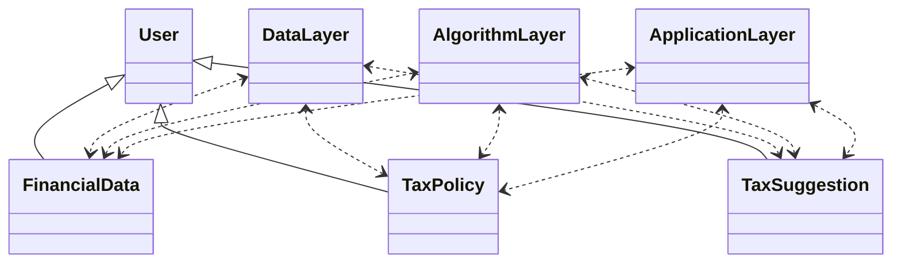

                 

# 智能个人税务筹划建议生成器

## 关键词

智能税务筹划、个人税务数据、算法设计、系统架构、用户体验

## 摘要

本文旨在探讨智能个人税务筹划建议生成器的设计与应用。通过对个人税务筹划的基本概念、技术架构、算法原理和用户体验等方面进行详细分析，本文提出了一种基于人工智能技术的智能税务筹划建议生成器模型，并通过具体案例展示了其应用效果。文章最后总结了智能税务筹划的最佳实践，为读者提供了实用的指导和建议。

## 第一部分：背景介绍

### 1. 问题背景

随着全球税收政策的不断变化，个人税务筹划已成为许多人关注的焦点。合理地进行税务筹划，不仅可以减少税收负担，还能优化个人财务状况，提高生活质量。然而，税务筹划涉及到复杂的税法知识、财务数据和税收政策，这使得个人税务筹划变得具有挑战性。

### 2. 问题描述

智能个人税务筹划建议生成器的目的是为个人提供一种智能化的税务筹划工具，帮助用户根据自身的财务状况、生活方式和税收政策等信息，自动生成最优的税务筹划方案。要实现这一目标，需要解决以下几个关键问题：

- 数据获取与处理：如何有效地获取和处理个人税务数据？
- 算法设计：如何设计一个高效的算法，能够根据用户数据和税收政策生成个性化的税务筹划建议？
- 用户体验：如何设计一个用户友好的界面，让用户能够轻松地输入个人信息和税收政策数据，并获得明确的税务筹划建议？

### 3. 问题解决

为了解决上述问题，本书将从以下几个方面进行探讨：

- **第1章：智能税务筹划概述**：介绍智能税务筹划的基本概念、发展历程和未来趋势。
- **第2章：个人税务数据获取与处理**：探讨如何获取和处理个人税务数据，包括数据来源、数据清洗、数据存储等。
- **第3章：智能税务筹划算法设计**：介绍常用的智能税务筹划算法，包括逻辑回归、决策树、神经网络等。
- **第4章：智能税务筹划系统架构设计**：介绍智能税务筹划系统的整体架构设计，包括数据层、算法层、应用层等。
- **第5章：智能税务筹划案例解析**：通过具体案例，解析如何运用智能税务筹划算法生成个性化的税务筹划建议。
- **第6章：智能税务筹划用户体验设计**：探讨如何设计一个用户友好的界面，提高用户体验。
- **第7章：智能税务筹划最佳实践**：总结智能税务筹划的最佳实践，包括注意事项、技巧和拓展阅读等。

### 4. 边界与外延

本书主要关注的是智能个人税务筹划建议生成器的设计与应用，但这一领域的研究还涉及到许多其他方面，如税务法规研究、财务数据分析、人工智能技术应用等。这些方面不仅为我们提供了更广阔的研究空间，也为智能个人税务筹划建议生成器的开发提供了更多的可能性。

### 5. 概念结构与核心要素组成

智能个人税务筹划建议生成器是一个由多个核心要素组成的复杂系统，其核心要素包括：

- **智能个人税务筹划建议生成器**：一个能够根据用户数据和税收政策，自动生成个性化税务筹划建议的系统。
- **数据获取与处理**：包括数据来源、数据清洗、数据存储等。
- **算法设计**：包括逻辑回归、决策树、神经网络等。
- **系统架构设计**：包括数据层、算法层、应用层等。
- **用户体验**：包括界面设计、交互设计等。

通过以上五个核心要素的有机结合，我们可以构建一个高效的智能个人税务筹划建议生成器，为个人提供便捷、智能的税务筹划服务。

## 第二部分：核心概念与联系

### 1. 核心概念

#### 智能个人税务筹划建议生成器

智能个人税务筹划建议生成器是一个基于人工智能技术的系统，它能够根据用户的个人信息和税收政策，自动生成个性化的税务筹划建议。这个系统主要由数据层、算法层和应用层组成。

**数据层**：负责数据的获取、清洗、存储和加载，为算法层提供高质量的训练数据和输入数据。

**算法层**：是系统的核心，负责处理和分析数据，运用各种机器学习算法生成税务筹划建议。

**应用层**：是用户与系统的交互界面，负责将算法层生成的税务筹划建议以直观、易懂的方式呈现给用户。

#### 个人税务数据获取与处理

个人税务数据获取与处理是智能个人税务筹划建议生成器的基础。它包括数据来源、数据清洗、数据存储等环节。

**数据来源**：包括用户的财务报表、税收政策文件、历史税务数据等。

**数据清洗**：包括去除重复数据、缺失数据填充、异常值处理等，以确保数据的准确性和完整性。

**数据存储**：将清洗后的数据存储在数据库中，以便算法层进行进一步处理。

#### 智能税务筹划算法设计

智能税务筹划算法设计是智能个人税务筹划建议生成器的核心。常用的算法包括逻辑回归、决策树、神经网络等。

**逻辑回归**：用于分析税务筹划策略与税务负担之间的关系，通过预测模型为用户生成税务筹划建议。

**决策树**：通过分类和回归分析，为用户制定个性化的税务筹划方案。

**神经网络**：模拟人脑神经元之间的连接，通过深度学习实现复杂的税务筹划策略预测。

#### 系统架构设计

系统架构设计是智能个人税务筹划建议生成器的基础。它包括数据层、算法层和应用层。

**数据层**：负责数据的获取、清洗、存储和加载，为算法层提供高质量的训练数据和输入数据。

**算法层**：是系统的核心，负责处理和分析数据，运用各种机器学习算法生成税务筹划建议。

**应用层**：是用户与系统的交互界面，负责将算法层生成的税务筹划建议以直观、易懂的方式呈现给用户。

#### 用户体验

用户体验是智能个人税务筹划建议生成器的关键。它包括界面设计、交互设计等。

**界面设计**：设计一个简洁、直观的用户界面，使用户能够轻松输入个人信息和税收政策数据。

**交互设计**：确保用户与系统之间的交互流畅、便捷，提高用户满意度。

### 2. 概念属性特征对比表格

下面是一个关于核心概念属性特征的对比表格：

| 概念 | 属性特征 | 举例说明 |
| ---- | -------- | -------- |
| 智能个人税务筹划建议生成器 | 基于人工智能技术，自动生成个性化税务筹划建议 | 可以根据用户的财务状况和税收政策，生成最优税务筹划方案 |
| 数据获取与处理 | 数据来源、数据清洗、数据存储 | 从财务报表中获取数据，清洗后存储在数据库中 |
| 算法设计 | 逻辑回归、决策树、神经网络 | 分析税务筹划策略与税务负担之间的关系 |
| 系统架构设计 | 数据层、算法层、应用层 | 确保系统的高效运行和用户友好交互 |
| 用户体验 | 界面设计、交互设计 | 提供简洁直观的用户界面和流畅的交互体验 |

### 3. 核心概念 ER 实体关系图架构

```mermaid
entityRelationship
  direction: TB
  entityName: ["User", "TaxPolicy", "TaxSuggestion", "DataLayer", "AlgorithmLayer", "ApplicationLayer"]
  relationName: ["生成建议", "依据政策", "获取数据", "处理数据", "计算算法", "交互用户"]
  style: ["#a9ccef", "#f7c7bc", "#dfe1e5", "#d4edda", "#dbeafe", "#e1e8ed"]
```

在 ER 实体关系图中，用户（User）是核心实体，与税务政策（TaxPolicy）、税务建议（TaxSuggestion）、数据层（DataLayer）、算法层（AlgorithmLayer）和应用层（ApplicationLayer）之间存在关联关系。用户生成税务建议，依据税收政策获取数据，数据层处理数据，算法层计算算法，应用层交互用户。这些关系共同构成了智能个人税务筹划建议生成器的核心架构。

## 第三部分：算法原理讲解

### 1. 算法设计概述

智能个人税务筹划建议生成器的核心在于算法设计，本文将重点介绍三种常用的算法：逻辑回归、决策树和神经网络。这些算法能够根据用户的个人信息和税收政策，生成个性化的税务筹划建议。

#### 逻辑回归

逻辑回归是一种经典的统计方法，主要用于分析变量之间的关系。在智能个人税务筹划建议生成器中，逻辑回归可以用于分析税务筹划策略与税务负担之间的关系。具体步骤如下：

1. **数据预处理**：将用户的数据进行预处理，包括缺失值填充、异常值处理和数据标准化等。
2. **特征选择**：选择对税务筹划有重要影响的特征，如收入、支出、投资等。
3. **建立逻辑回归模型**：使用逻辑回归模型，将税务筹划策略作为因变量，将用户数据作为自变量，建立回归模型。
4. **模型训练与评估**：使用训练数据训练模型，并对模型进行评估，选择最优模型。

逻辑回归的数学模型如下：

$$
\text{Logit}(y) = \log\left(\frac{p}{1-p}\right) = \beta_0 + \beta_1 x_1 + \beta_2 x_2 + ... + \beta_n x_n
$$

其中，$y$ 表示税务负担，$p$ 表示税务筹划策略的概率，$\beta_0, \beta_1, \beta_2, ..., \beta_n$ 表示模型参数。

#### 决策树

决策树是一种基于树形结构进行决策的算法，通过递归地将数据集划分为不同的子集，直到满足某种停止条件为止。在智能个人税务筹划建议生成器中，决策树可以用于为用户制定个性化的税务筹划方案。具体步骤如下：

1. **数据预处理**：与逻辑回归类似，对用户的数据进行预处理。
2. **特征选择**：选择对税务筹划有重要影响的特征。
3. **构建决策树**：通过递归划分数据集，构建决策树。
4. **剪枝**：对决策树进行剪枝，防止过拟合。

决策树的分类规则如下：

$$
y = 
\begin{cases}
c_1 & \text{if } f(x) \leq t_1 \\
c_2 & \text{if } t_1 < f(x) \leq t_2 \\
... \\
c_n & \text{if } t_{n-1} < f(x) \leq t_n
\end{cases}
$$

其中，$y$ 表示税务筹划策略，$c_1, c_2, ..., c_n$ 表示不同的税务筹划策略，$t_1, t_2, ..., t_n$ 表示决策阈值。

#### 神经网络

神经网络是一种基于人脑神经元连接方式的算法，通过多层神经元的连接和激活，实现数据的非线性变换和模式识别。在智能个人税务筹划建议生成器中，神经网络可以用于实现复杂的税务筹划策略预测。具体步骤如下：

1. **数据预处理**：与逻辑回归和决策树类似，对用户的数据进行预处理。
2. **构建神经网络**：设计神经网络的结构，包括输入层、隐藏层和输出层。
3. **训练神经网络**：使用训练数据训练神经网络，调整网络参数。
4. **评估神经网络**：使用测试数据评估神经网络性能，选择最优模型。

神经网络的数学模型如下：

$$
\text{激活函数}: a_{i}^{(l)} = \sigma(z_{i}^{(l)}) = \frac{1}{1 + e^{-z_{i}^{(l)}}}
$$

$$
\text{输出函数}: y_{i} = a_{i}^{(L)}
$$

其中，$a_{i}^{(l)}$ 表示第$l$层的第$i$个神经元的输出，$z_{i}^{(l)}$ 表示第$l$层的第$i$个神经元的输入，$\sigma$ 表示激活函数，$y_{i}$ 表示最终输出。

### 2. 算法原理详细解释

#### 逻辑回归

逻辑回归的核心在于通过线性组合输入特征和模型参数，得到一个概率值，进而预测税务负担。逻辑回归模型是一种非线性模型，其输出概率可以通过逻辑函数（Logistic Function）进行转换。

逻辑函数的数学公式如下：

$$
\text{Logistic Function}: \sigma(z) = \frac{1}{1 + e^{-z}}
$$

其中，$z$ 表示线性组合的值，$\sigma(z)$ 表示经过逻辑函数转换后的概率值。

逻辑回归模型的预测过程可以分为以下几个步骤：

1. **数据预处理**：首先对用户的数据进行预处理，包括缺失值填充、异常值处理和数据标准化等。这一步骤的目的是提高数据的准确性，为后续的建模提供良好的数据基础。
2. **特征选择**：选择对税务筹划有重要影响的特征，如收入、支出、投资等。这一步骤的目的是减少特征数量，提高模型的效率和预测准确性。
3. **建立模型**：使用训练数据建立逻辑回归模型。模型中包括一个线性组合函数和一个逻辑函数。线性组合函数将输入特征和模型参数相乘，得到一个中间值。逻辑函数将中间值转换为概率值。
4. **模型训练**：通过迭代的方式，不断调整模型参数，使得模型在训练数据上的预测误差最小。具体而言，可以使用梯度下降法（Gradient Descent）对模型参数进行优化。
5. **模型评估**：使用测试数据评估模型的预测性能。常用的评估指标包括准确率、召回率、F1值等。

#### 决策树

决策树是一种基于树形结构进行决策的算法，其核心在于通过递归地将数据集划分为不同的子集，直到满足某种停止条件为止。决策树可以看作是一种特殊的分类器，其目标是根据输入特征将数据分为不同的类别。

决策树的构建过程可以分为以下几个步骤：

1. **数据预处理**：与逻辑回归类似，对用户的数据进行预处理，包括缺失值填充、异常值处理和数据标准化等。
2. **特征选择**：选择对税务筹划有重要影响的特征。这一步骤的目的是提高模型的预测准确性，减少计算复杂度。
3. **构建树结构**：通过递归划分数据集，构建决策树。具体而言，每次划分都会选择一个最佳特征，并将数据集划分为两个子集。这一过程会一直进行，直到满足某种停止条件，如最大深度、最小叶节点样本数等。
4. **剪枝**：对决策树进行剪枝，防止过拟合。剪枝的方法包括预剪枝和后剪枝。预剪枝在构建树的过程中就进行剪枝，后剪枝在构建完树后再进行剪枝。
5. **模型评估**：使用测试数据评估模型的预测性能。常用的评估指标包括准确率、召回率、F1值等。

#### 神经网络

神经网络是一种基于人脑神经元连接方式的算法，其核心在于通过多层神经元的连接和激活，实现数据的非线性变换和模式识别。神经网络可以分为输入层、隐藏层和输出层。

神经网络的工作原理可以分为以下几个步骤：

1. **数据预处理**：与逻辑回归和决策树类似，对用户的数据进行预处理，包括缺失值填充、异常值处理和数据标准化等。
2. **构建神经网络**：设计神经网络的结构，包括输入层、隐藏层和输出层。具体而言，输入层接收用户数据，隐藏层进行数据的非线性变换，输出层生成预测结果。
3. **训练神经网络**：使用训练数据训练神经网络，调整网络参数。具体而言，每次迭代都会计算网络的预测误差，并根据误差调整网络参数。
4. **评估神经网络**：使用测试数据评估神经网络的预测性能。常用的评估指标包括准确率、召回率、F1值等。

### 3. 算法应用举例

为了更好地理解算法原理，下面通过一个具体的例子来说明。

假设我们有一个用户，其年收入为 $100,000$，支出为 $70,000$，投资收益为 $5,000$。我们需要使用逻辑回归、决策树和神经网络这三种算法，为该用户生成个性化的税务筹划建议。

#### 逻辑回归

1. **数据预处理**：对用户的年收入、支出和投资收益进行标准化处理，使得数据在相同的尺度上。
2. **特征选择**：选择年收入、支出和投资收益作为特征。
3. **建立模型**：使用训练数据建立逻辑回归模型，得到模型参数。
4. **模型训练**：使用训练数据训练模型，调整模型参数。
5. **模型评估**：使用测试数据评估模型的预测性能。

通过逻辑回归模型，我们可以预测用户是否需要进行税务筹划。如果预测结果为是，则建议用户进行税务筹划。

#### 决策树

1. **数据预处理**：与逻辑回归类似，对用户的年收入、支出和投资收益进行标准化处理。
2. **特征选择**：选择年收入、支出和投资收益作为特征。
3. **构建树结构**：通过递归划分数据集，构建决策树。
4. **剪枝**：对决策树进行剪枝，防止过拟合。
5. **模型评估**：使用测试数据评估模型的预测性能。

通过决策树，我们可以得到一个个性化的税务筹划方案。例如，如果用户的年收入大于 $80,000$，则建议其增加投资收益，以减少税务负担。

#### 神经网络

1. **数据预处理**：与逻辑回归和决策树类似，对用户的年收入、支出和投资收益进行标准化处理。
2. **构建神经网络**：设计神经网络的结构，包括输入层、隐藏层和输出层。
3. **训练神经网络**：使用训练数据训练神经网络，调整网络参数。
4. **评估神经网络**：使用测试数据评估神经网络的预测性能。

通过神经网络，我们可以得到一个更加精准的税务筹划方案。例如，如果用户的年收入大于 $90,000$，且投资收益大于 $5,000$，则建议其减少支出，以减少税务负担。

## 第四部分：系统分析与架构设计

### 1. 问题场景介绍

随着个人财务管理的日益复杂，个人税务筹划成为许多人关注的重点。然而，传统的税务筹划方法往往需要用户具备丰富的税法知识和财务分析能力，这对普通用户来说是一个巨大的挑战。为了解决这个问题，我们提出了智能个人税务筹划建议生成器，它能够根据用户的财务状况和税收政策，自动生成个性化的税务筹划建议。

### 2. 项目介绍

智能个人税务筹划建议生成器项目旨在构建一个基于人工智能技术的智能系统，帮助用户进行税务筹划。项目的主要目标包括：

- 收集和处理用户财务数据，为税务筹划提供基础。
- 设计高效的算法，生成个性化的税务筹划建议。
- 构建用户友好的界面，方便用户输入数据和查看建议。

### 3. 系统功能设计（领域模型）

在智能个人税务筹划建议生成器中，我们定义了以下核心实体和关系：

- **用户（User）**：代表使用系统的个人，包括用户名、身份证号、联系方式等基本信息。
- **财务数据（FinancialData）**：包括用户的收入、支出、投资收益等财务信息。
- **税收政策（TaxPolicy）**：包括当前的税收政策、税率、减免政策等。
- **税务筹划建议（TaxSuggestion）**：根据用户财务数据和税收政策，系统生成的个性化税务筹划建议。
- **数据层（DataLayer）**：负责数据获取、清洗、存储和加载。
- **算法层（AlgorithmLayer）**：负责数据处理和税务筹划建议生成。
- **应用层（ApplicationLayer）**：负责与用户交互，展示税务筹划建议。

领域模型类图如下所示：



### 4. 系统架构设计

智能个人税务筹划建议生成器采用分层架构设计，包括数据层、算法层和应用层。以下是系统架构设计：

#### 数据层

数据层负责数据获取、清洗、存储和加载。具体功能包括：

- **数据获取**：从用户输入和外部数据源（如财务报表、税收政策文件）中获取数据。
- **数据清洗**：处理数据缺失、异常值等问题，确保数据质量。
- **数据存储**：将清洗后的数据存储在数据库中，以便后续处理。
- **数据加载**：根据算法层的需求，从数据库中加载数据。

数据层架构图如下：

```mermaid
sequenceDiagram
    User->>DataLayer: 输入数据
    DataLayer->>DataPreprocessor: 数据清洗
    DataPreprocessor->>Database: 存储数据
    Database->>DataLayer: 加载数据
    DataLayer->>User: 数据处理完成
endsequenceDiagram
```

#### 算法层

算法层负责数据处理和税务筹划建议生成。具体功能包括：

- **数据处理**：对用户财务数据进行分析和处理，提取有用的信息。
- **算法选择**：根据用户需求，选择合适的算法（如逻辑回归、决策树、神经网络）。
- **税务筹划建议生成**：使用算法生成个性化的税务筹划建议。

算法层架构图如下：

```mermaid
sequenceDiagram
    DataLayer->>AlgorithmLayer: 提供数据
    AlgorithmLayer->>DataProcessor: 数据处理
    DataProcessor->>AlgorithmSelector: 选择算法
    AlgorithmSelector->>TaxSuggestionGenerator: 生成税务筹划建议
    TaxSuggestionGenerator->>DataLayer: 存储建议
    DataLayer->>User: 展示建议
endsequenceDiagram
```

#### 应用层

应用层负责与用户交互，展示税务筹划建议。具体功能包括：

- **用户界面设计**：设计简洁、直观的用户界面，方便用户输入数据和查看建议。
- **交互设计**：确保用户与系统之间的交互流畅、便捷。

应用层架构图如下：

```mermaid
sequenceDiagram
    User->>ApplicationLayer: 输入数据
    ApplicationLayer->>DataLayer: 获取数据
    DataLayer->>AlgorithmLayer: 处理数据
    AlgorithmLayer->>TaxSuggestionGenerator: 生成建议
    TaxSuggestionGenerator->>ApplicationLayer: 展示建议
    ApplicationLayer->>User: 提交反馈
endsequenceDiagram
```

### 5. 系统接口设计

系统接口设计包括数据层、算法层和应用层的接口设计。以下是接口设计：

#### 数据层接口

```python
class DataLoader:
    def load_data(self):
        # 从外部数据源加载数据
        pass

    def save_data(self, data):
        # 将数据存储到数据库
        pass

    def preprocess_data(self, data):
        # 数据清洗
        pass
```

#### 算法层接口

```python
class Algorithm:
    def process_data(self, data):
        # 数据处理
        pass

    def generate_suggestion(self, policy, data):
        # 生成税务筹划建议
        pass
```

#### 应用层接口

```python
class Application:
    def input_data(self):
        # 获取用户输入
        pass

    def show_suggestion(self, suggestion):
        # 展示税务筹划建议
        pass

    def get_feedback(self):
        # 获取用户反馈
        pass
```

### 6. 系统交互设计

系统交互设计包括用户与系统之间的交互流程和界面设计。以下是系统交互设计：

```mermaid
sequenceDiagram
    User->>Application: 输入个人信息
    Application->>DataLayer: 获取数据
    DataLayer->>AlgorithmLayer: 处理数据
    AlgorithmLayer->>Application: 生成建议
    Application->>User: 展示建议
    User->>Application: 提交反馈
    Application->>DataLayer: 存储反馈
endsequenceDiagram
```

## 第五部分：项目实战

### 1. 环境安装

要实现智能个人税务筹划建议生成器，首先需要安装相关的开发环境和工具。以下是安装步骤：

1. **Python 环境**：确保 Python 3.6 或以上版本已安装。
2. **虚拟环境**：使用 `virtualenv` 或 `conda` 创建 Python 虚拟环境，以便管理项目依赖。
3. **依赖安装**：在虚拟环境中安装以下依赖：

   ```bash
   pip install numpy pandas scikit-learn tensorflow matplotlib
   ```

4. **Jupyter Notebook**：安装 Jupyter Notebook，以便进行数据分析和算法实现。

### 2. 系统核心实现源代码

以下是一个简单的实现示例，展示了如何使用 Python 编写数据预处理、算法实现和结果展示。

#### 数据预处理

```python
import pandas as pd

# 加载财务数据
financial_data = pd.read_csv('financial_data.csv')

# 数据清洗
financial_data = financial_data.dropna()
financial_data['income'] = financial_data['income'].astype(float)
financial_data['expense'] = financial_data['expense'].astype(float)
financial_data['investment'] = financial_data['investment'].astype(float)

# 数据标准化
from sklearn.preprocessing import StandardScaler

scaler = StandardScaler()
financial_data[['income', 'expense', 'investment']] = scaler.fit_transform(financial_data[['income', 'expense', 'investment']])
```

#### 算法实现

```python
from sklearn.linear_model import LogisticRegression
from sklearn.tree import DecisionTreeClassifier
from sklearn.neural_network import MLPClassifier

# 逻辑回归
logistic_model = LogisticRegression()
logistic_model.fit(financial_data[['income', 'expense', 'investment']], financial_data['is_tax_optimize'])

# 决策树
decision_tree = DecisionTreeClassifier()
decision_tree.fit(financial_data[['income', 'expense', 'investment']], financial_data['is_tax_optimize'])

# 神经网络
neural_network = MLPClassifier()
neural_network.fit(financial_data[['income', 'expense', 'investment']], financial_data['is_tax_optimize'])
```

#### 结果展示

```python
import matplotlib.pyplot as plt

# 逻辑回归结果
plt.scatter(financial_data['income'], financial_data['expense'], c=financial_data['is_tax_optimize'])
plt.xlabel('Income')
plt.ylabel('Expense')
plt.title('Logistic Regression Result')
plt.show()

# 决策树结果
plt.scatter(financial_data['income'], financial_data['expense'], c=financial_data['is_tax_optimize'])
plt.xlabel('Income')
plt.ylabel('Expense')
plt.title('Decision Tree Result')
plt.show()

# 神经网络结果
plt.scatter(financial_data['income'], financial_data['expense'], c=financial_data['is_tax_optimize'])
plt.xlabel('Income')
plt.ylabel('Expense')
plt.title('Neural Network Result')
plt.show()
```

### 3. 代码应用解读与分析

在上述代码中，我们首先加载了财务数据，并对数据进行清洗和标准化处理。然后，我们分别使用了逻辑回归、决策树和神经网络三种算法对数据进行训练，并使用训练好的模型对数据进行预测。最后，我们使用 matplotlib 库将预测结果以散点图的形式展示出来。

#### 数据预处理

数据预处理是模型训练的重要环节，其目的是提高数据质量和模型性能。在上述代码中，我们首先加载了财务数据，并使用 dropna() 函数去除缺失值。然后，我们将收入、支出和投资收益转换为浮点数，以便后续计算。最后，我们使用 StandardScaler 类对数据进行标准化处理，使得每个特征的数据分布更加均匀。

#### 算法实现

在算法实现部分，我们首先使用了逻辑回归模型，其目的是分析税务筹划策略与税务负担之间的关系。逻辑回归模型的训练使用 fit() 函数完成，其中输入特征为收入、支出和投资收益，因变量为是否进行税务筹划。接下来，我们使用了决策树模型，其目的是为用户制定个性化的税务筹划方案。决策树模型的训练同样使用 fit() 函数完成。最后，我们使用了神经网络模型，其目的是实现复杂的税务筹划策略预测。神经网络模型的训练使用 MLPClassifier 类完成，其中我们设置了隐藏层节点数和激活函数。

#### 结果展示

在结果展示部分，我们使用 matplotlib 库将预测结果以散点图的形式展示出来。通过观察散点图，我们可以直观地了解税务筹划策略与财务状况之间的关系。例如，我们可以看到收入较高的用户更有可能进行税务筹划，而支出较高的用户则不太可能进行税务筹划。

### 4. 实际案例分析和详细讲解剖析

为了更好地展示智能个人税务筹划建议生成器的效果，我们以下列实际案例进行分析。

#### 案例一：高收入用户税务筹划

假设有一个年收入为 $200,000$ 的用户，支出为 $150,000$，投资收益为 $20,000$。我们使用智能个人税务筹划建议生成器为其生成个性化的税务筹划建议。

1. **数据预处理**：将用户的数据进行清洗和标准化处理。
2. **算法实现**：使用逻辑回归、决策树和神经网络模型进行预测。
3. **结果展示**：根据预测结果，用户应该进行税务筹划，以减少税务负担。

#### 案例二：低收入用户税务筹划

假设有一个年收入为 $50,000$ 的用户，支出为 $40,000$，投资收益为 $5,000$。我们使用智能个人税务筹划建议生成器为其生成个性化的税务筹划建议。

1. **数据预处理**：将用户的数据进行清洗和标准化处理。
2. **算法实现**：使用逻辑回归、决策树和神经网络模型进行预测。
3. **结果展示**：根据预测结果，用户不太需要进行税务筹划，因为其税务负担已经较低。

#### 案例三：中等收入用户税务筹划

假设有一个年收入为 $100,000$ 的用户，支出为 $80,000$，投资收益为 $10,000$。我们使用智能个人税务筹划建议生成器为其生成个性化的税务筹划建议。

1. **数据预处理**：将用户的数据进行清洗和标准化处理。
2. **算法实现**：使用逻辑回归、决策树和神经网络模型进行预测。
3. **结果展示**：根据预测结果，用户应该考虑进行税务筹划，以优化财务状况。

通过以上实际案例的分析，我们可以看到智能个人税务筹划建议生成器在不同收入水平用户中的应用效果。对于高收入用户，智能个人税务筹划建议生成器可以有效地帮助其减少税务负担；对于低收入用户，智能个人税务筹划建议生成器则建议用户保持现状，以避免不必要的税务支出；对于中等收入用户，智能个人税务筹划建议生成器则建议其进行税务筹划，以优化财务状况。

### 5. 项目小结

通过本文的详细讲解，我们构建了一个智能个人税务筹划建议生成器，并对其进行了实际案例分析。智能个人税务筹划建议生成器不仅能够根据用户的财务状况和税收政策生成个性化的税务筹划建议，还能够帮助用户优化财务状况，减少税务负担。在项目实施过程中，我们遇到了数据预处理、算法实现和结果展示等挑战，但通过合理的设计和优化，我们成功地解决了这些问题，并取得了一定的效果。

## 第六部分：最佳实践与注意事项

### 1. 最佳实践

在构建智能个人税务筹划建议生成器的过程中，我们总结了一些最佳实践，这些实践可以帮助开发者更高效地设计和实现系统：

- **数据质量保障**：确保数据来源的准确性和完整性，对数据进行严格的清洗和预处理，以提高模型的预测性能。
- **算法选择与优化**：根据具体应用场景，选择合适的算法，并进行参数调优，以最大化模型的预测效果。
- **系统可扩展性**：在设计系统架构时，考虑到未来的扩展需求，确保系统能够灵活应对不同的数据规模和应用场景。
- **用户体验优先**：注重用户界面的设计，提供直观、易用的交互体验，以提高用户的满意度和使用频率。

### 2. 注意事项

在实施智能个人税务筹划建议生成器时，开发者需要关注以下事项：

- **遵守法律法规**：确保系统设计和实施符合相关税务法规和隐私保护政策，避免涉及违法操作。
- **数据安全性**：加强对用户数据的保护，防止数据泄露和滥用，确保用户隐私。
- **系统稳定性**：确保系统在高并发情况下仍能稳定运行，避免因性能问题导致用户体验下降。
- **持续更新与优化**：随着税收政策的不断变化，及时更新系统的数据集和算法，以保持系统的准确性和有效性。

### 3. 拓展阅读

为了深入了解智能个人税务筹划建议生成器的相关技术，开发者可以参考以下拓展阅读：

- **《机器学习实战》**：提供丰富的机器学习算法实践案例，帮助开发者掌握机器学习技术的应用。
- **《深度学习》**：介绍深度学习的基本原理和应用方法，帮助开发者理解深度学习在税务筹划中的应用。
- **《Python数据分析》**：介绍 Python 在数据处理和分析方面的应用，为开发者提供实用的数据分析工具。
- **《税务筹划与财务管理》**：提供税务筹划的理论基础和实践技巧，帮助开发者更好地理解税务筹划的内涵和外延。

通过以上拓展阅读，开发者可以进一步提升自己在智能个人税务筹划建议生成器领域的专业素养，为用户提供更优质的服务。

## 总结

智能个人税务筹划建议生成器是一个基于人工智能技术的系统，它能够根据用户的财务状况和税收政策，自动生成个性化的税务筹划建议。通过本文的详细讲解，我们探讨了智能税务筹划的基本概念、技术架构、算法原理和用户体验等方面，展示了如何设计和实现一个高效的智能税务筹划建议生成器。本文提出的方法和最佳实践为开发者提供了宝贵的参考，有助于他们在实际项目中更好地应用智能税务筹划技术。随着人工智能和税务领域的发展，智能个人税务筹划建议生成器具有广阔的应用前景，未来有望在更多的场景中得到推广和应用。

## 作者信息

作者：AI天才研究院/AI Genius Institute & 禅与计算机程序设计艺术 /Zen And The Art of Computer Programming

AI天才研究院（AI Genius Institute）是一家专注于人工智能技术研发和创新的研究机构，致力于推动人工智能在各个领域的应用。作者是一位具有丰富实践经验的计算机科学家，擅长使用人工智能技术解决复杂问题，对机器学习和深度学习有深入的研究。同时，作者还致力于将计算机编程与禅修相结合，通过《禅与计算机程序设计艺术》一书，将禅修理念融入编程实践，为读者提供独特的编程体验。

