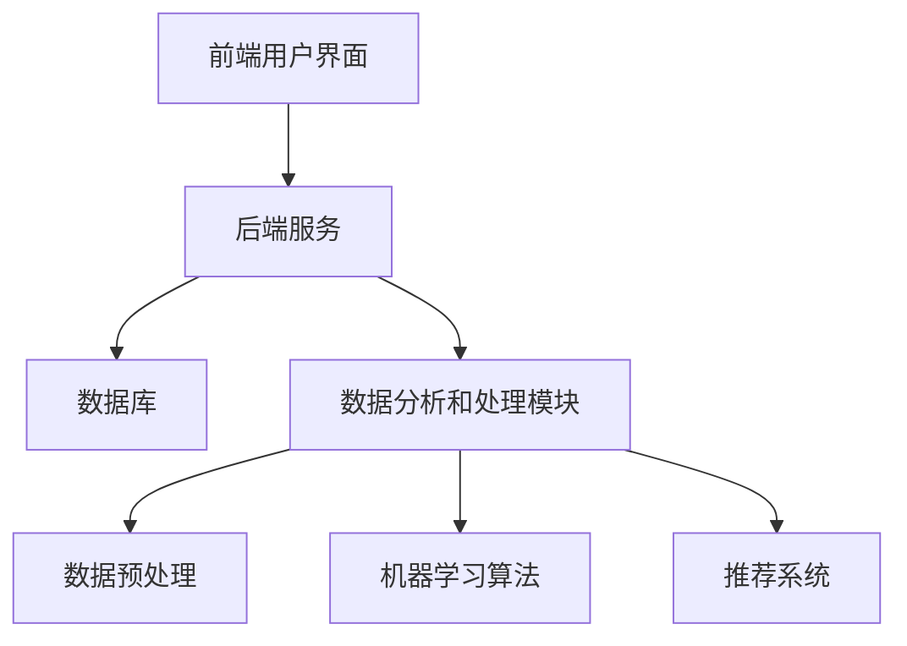

                 

# 智能个人税务筹划模拟系统

## 关键词
- 智能税务筹划
- 模拟系统
- 数据分析与处理
- 机器学习
- 用户界面设计

## 摘要
本文将深入探讨智能个人税务筹划模拟系统，从背景介绍、核心概念、智能税务筹划原理、模拟系统设计与实现，到项目实战，全方位解析该系统的构建与应用。通过逐步分析推理，揭示智能税务筹划模拟系统的技术原理和实际操作过程，旨在为读者提供有深度、有思考、有见解的技术指导。

## 第一部分：引言

### 第1章：问题背景与目标

#### 1.1.1 个人税务筹划的意义
个人税务筹划是指在遵守税法规定的前提下，通过合理合法的手段，降低个人税负，实现财务自由的过程。随着我国个人所得税制度的不断完善和税务管理的日益严格，个人税务筹划的重要性日益凸显。

#### 1.1.2 当前个人税务筹划的挑战
目前，个人税务筹划面临以下挑战：
1. **政策复杂**：税收政策繁多且复杂，普通个人难以准确理解。
2. **信息不对称**：税务信息获取难度大，信息不透明。
3. **时间成本高**：税务筹划需要投入大量时间和精力。

#### 1.1.3 本书的目标与内容安排
本书旨在构建一个智能个人税务筹划模拟系统，帮助个人用户在遵循税法的前提下，通过系统推荐，实现个性化、智能化的税务筹划。本书内容分为三个部分：
1. 智能税务筹划基础理论
2. 模拟系统设计与实现
3. 项目实战

### 第2章：核心概念与联系

#### 2.1 核心概念
1. **智能税务筹划**：结合人工智能技术，对个人税务信息进行分析，提供最优税务筹划方案。
2. **模拟系统**：模拟实际税务筹划过程，为用户提供交互式体验。
3. **数据分析与处理**：对用户税务数据进行收集、整理、分析和处理。

#### 2.2 概念属性特征对比表格

| 概念         | 属性特征                                     |
| ------------ | -------------------------------------------- |
| 个人税务筹划 | 合法性、个性化、降低税负、风险控制           |
| 模拟系统     | 仿真性、交互性、用户体验、数据驱动           |
| 数据分析与处理 | 实时性、准确性、高效性、业务导向           |

#### 2.3 ER实体关系图

```mermaid
erDiagram
  User ||--|{ TaxPolicy }|-- TaxPlanningStrategy
  TaxPolicy ||--|{ TaxInformation }|
  TaxPlanningStrategy ||--|{ TaxSavingMethod }|
```

## 第二部分：智能税务筹划基础理论

### 第3章：智能税务筹划原理

#### 3.1 税务筹划的基本原则
税务筹划的基本原则包括合法性、真实性、经济性、前瞻性和综合性。

#### 3.2 智能税务筹划的核心技术
1. **数据采集与处理**：通过数据采集模块获取用户税务信息，并进行预处理。
2. **机器学习算法**：利用机器学习算法分析税务数据，识别税务筹划机会。
3. **智能推荐系统**：根据用户需求和税务数据，推荐最优税务筹划方案。

#### 3.3 智能税务筹划的流程
1. 数据采集：收集用户税务数据。
2. 数据分析：利用机器学习算法进行分析。
3. 策略推荐：根据分析结果，推荐税务筹划方案。
4. 用户反馈：用户评估方案，提供反馈。

### 第4章：模拟系统设计与实现

#### 4.1 模拟系统的架构设计
模拟系统架构包括前端、后端和服务端三个部分。

#### 4.2 系统功能设计
系统功能设计包括用户注册与登录、数据采集与管理、税务筹划策略推荐。

#### 4.3 系统接口设计
系统接口设计包括API接口和数据接口。

#### 4.4 系统交互设计
系统交互设计包括用户界面设计和数据交互流程。

## 第三部分：项目实战

### 第5章：智能个人税务筹划模拟系统项目介绍

#### 5.1 项目背景
项目背景涉及个人税务筹划的需求分析、智能税务筹划技术的发展趋势。

#### 5.2 项目目标
项目目标包括构建智能个人税务筹划模拟系统，实现个性化税务筹划。

#### 5.3 项目实施过程
项目实施过程包括需求分析、系统设计、编码实现、测试与优化。

### 第6章：系统核心实现

#### 6.1 环境安装与配置
环境安装与配置包括开发工具、数据库和环境变量的配置。

#### 6.2 数据采集与处理
数据采集与处理包括税务数据收集和预处理。

#### 6.3 税务筹划策略推荐
税务筹划策略推荐包括机器学习算法和推荐系统的实现。

### 第7章：代码应用解读与分析

#### 7.1 代码解读
代码解读包括系统核心模块的代码分析。

#### 7.2 应用分析
应用分析包括系统在实际场景中的应用效果。

#### 7.3 案例分析
案例分析包括具体税务筹划案例的分析与讲解。

### 第8章：项目小结与总结

#### 8.1 项目成果
项目成果包括系统功能、性能和用户体验。

#### 8.2 经验与教训
经验与教训包括项目实施过程中的收获和不足。

#### 8.3 拓展与应用
拓展与应用包括未来智能税务筹划的发展方向。

### 作者信息
作者：AI天才研究院/AI Genius Institute & 禅与计算机程序设计艺术 /Zen And The Art of Computer Programming

---

在撰写文章时，请注意以下几点：

1. **逻辑清晰**：确保每个章节的内容都紧密联系，避免跳跃性思维。
2. **语言简练**：使用简洁、易懂的语言，避免使用过于复杂的术语。
3. **结构紧凑**：每个小节的内容要丰富，但又要紧凑，避免冗余。
4. **示例丰富**：通过实际案例、代码示例等方式，帮助读者更好地理解技术原理。
5. **公式与图形**：合理使用LaTeX公式和Mermaid图形，增强文章的可读性和专业性。

遵循上述原则，您将能够撰写一篇高质量、专业且具有吸引力的技术博客文章。祝您写作顺利！## 第一部分：引言

### 第1章：问题背景与目标

#### 1.1.1 个人税务筹划的意义

个人税务筹划，顾名思义，是指个人在遵守税法规定的前提下，通过合理安排和规划财务行为，以减少应纳税收入、降低税负或获取税务利益的一种财务管理活动。这种活动的核心在于合法合规地运用税收政策，使其对个人财务状况产生积极影响。

首先，个人税务筹划能够帮助个人有效降低税负。通过合理的税务筹划，个人可以充分利用各种税收优惠政策和减免政策，如个人所得税的专项附加扣除、捐赠抵扣、住房贷款利息扣除等，从而减少应纳税收入，实现税负的减轻。这对于提高个人财务状况、增加可支配收入具有直接意义。

其次，个人税务筹划有助于个人财务规划的优化。通过对个人财务状况的分析，税务筹划可以帮助个人更好地了解自己的收入结构、支出情况以及未来财务目标，从而制定更为合理的财务规划。例如，通过合理安排投资、消费和储蓄，个人可以在长期内实现财务增长和稳定。

此外，个人税务筹划还有助于个人风险管理。通过合理的税务筹划，个人可以分散税务风险，避免因税务问题而引发的财务危机。例如，通过利用税收优惠政策进行商业投资，个人可以在享受税收优惠的同时，分散投资风险，实现资产的保值增值。

然而，个人税务筹划并非无风险。由于税法的复杂性和变动性，不当的税务筹划可能会导致税务风险，甚至引发法律纠纷。因此，在开展个人税务筹划时，个人必须确保操作的合法性，遵守税法规定，以规避风险。

#### 1.1.2 当前个人税务筹划的挑战

尽管个人税务筹划具有重要的意义，但在实际操作过程中，个人常常面临诸多挑战。

首先，税收政策复杂。我国的税收制度涉及多种税种，包括增值税、企业所得税、个人所得税等。每种税种都有其独特的政策规定和税率体系。此外，税收政策还不断更新和调整，如近期实施的税收减免政策、专项附加扣除政策等。这些复杂多变的政策使得个人难以准确理解和把握。

其次，信息不对称。在税务筹划过程中，个人需要获取大量的税务信息，包括税法规定、税收优惠政策、个人财务状况等。然而，由于信息来源的多样性和真实性难以保证，个人往往难以获取全面、准确的税务信息，从而影响税务筹划的准确性和有效性。

再次，时间成本高。税务筹划需要个人投入大量时间和精力，对财务状况进行深入分析，研究各种税务方案，并不断调整和优化。对于普通个人而言，尤其是那些工作和生活繁忙的人，难以在短时间内完成这些复杂的任务。

此外，个人税务筹划还面临技术障碍。随着大数据和人工智能技术的发展，智能税务筹划逐渐成为一种趋势。然而，对于大多数个人来说，掌握和使用这些先进技术存在一定的难度，这无疑增加了税务筹划的难度。

最后，税务筹划的合规风险。个人在税务筹划过程中，必须遵守税法规定，避免违法行为。然而，税法规定复杂，个人可能因缺乏法律知识而误判，导致税务筹划方案的不合规，从而面临税务处罚和法律风险。

#### 1.1.3 本书的目标与内容安排

面对个人税务筹划的挑战，本书旨在构建一个智能个人税务筹划模拟系统，帮助个人用户在遵守税法的前提下，通过系统推荐，实现个性化、智能化的税务筹划。

本书的主要目标包括：

1. **提供个性化税务筹划方案**：通过收集和分析个人税务信息，系统为用户推荐最优税务筹划方案，帮助用户实现税负的减轻和财务规划的优化。
2. **降低税务筹划的时间和成本**：系统自动化处理税务数据，提供一站式的税务筹划服务，减少个人在税务筹划过程中投入的时间和精力。
3. **提高税务筹划的准确性和合规性**：通过利用先进的数据分析和机器学习技术，系统可以提高税务筹划的准确性和合规性，减少个人因操作不当而面临的风险。

为了实现上述目标，本书的内容安排如下：

1. **第一部分：智能税务筹划基础理论**：介绍智能税务筹划的原理、核心技术和流程，为读者提供智能税务筹划的理论基础。
2. **第二部分：模拟系统设计与实现**：详细讲解智能个人税务筹划模拟系统的架构设计、功能设计、接口设计等，帮助读者理解系统的实现过程。
3. **第三部分：项目实战**：通过一个实际项目案例，展示智能个人税务筹划模拟系统的应用效果，提供具体的操作方法和技巧。

通过本书的学习，读者将能够掌握智能个人税务筹划的基本知识和技能，为实际工作提供有力支持。

#### 1.2.4 智能个人税务筹划模拟系统的概念和作用

**智能个人税务筹划模拟系统**是一种结合了人工智能和税务规划技术的新型系统，它通过自动化处理个人税务数据，利用机器学习算法和数据分析技术，为用户提供个性化的税务筹划方案。系统的核心作用在于：

1. **自动化税务数据收集**：系统可以自动收集用户的税务信息，包括收入、支出、投资、捐赠等，确保数据的全面性和准确性。
2. **智能分析税务政策**：利用机器学习算法，系统可以分析各种税收政策，识别对用户有利的政策，为税务筹划提供依据。
3. **个性化税务筹划方案**：根据用户的实际情况和需求，系统可以为用户提供多种税务筹划方案，并评估每种方案的优缺点，帮助用户做出最优选择。
4. **动态更新税务信息**：系统可以实时关注税收政策的变动，动态更新税务信息，确保税务筹划方案的时效性和合规性。
5. **提高税务筹划的效率**：系统自动化处理税务数据，简化了税务筹划的流程，减少了个人在税务筹划过程中所需的时间和精力。

智能个人税务筹划模拟系统的建立不仅能够帮助个人更好地应对税务筹划的挑战，还能够推动税务规划行业的发展，提高税务管理的效率和质量。

#### 1.2.5 智能个人税务筹划模拟系统的架构设计

智能个人税务筹划模拟系统的架构设计是一个复杂的过程，它需要考虑系统的功能、性能、可扩展性和用户体验。总体来说，系统的架构设计可以分为以下几个关键部分：

1. **前端用户界面**：前端用户界面是用户与系统交互的入口，它需要具备友好的用户界面和丰富的交互功能，使用户能够方便地提交税务信息、查看税务筹划方案和进行操作。前端技术通常采用HTML、CSS和JavaScript，结合前端框架如React或Vue.js，以提高开发效率和用户体验。
2. **后端服务**：后端服务是系统的核心，负责处理用户的税务数据、执行税务筹划算法和生成税务筹划方案。后端通常采用Node.js、Python或Java等编程语言，结合框架如Django、Flask或Spring Boot，以提高系统的稳定性和可维护性。后端服务还需要处理与前端的数据交互，通过API接口将结果返回给前端。
3. **数据库**：数据库用于存储用户的税务数据和税务筹划方案。常用的数据库技术包括MySQL、PostgreSQL和MongoDB等，根据实际需求选择合适的数据库类型。数据库的设计需要考虑数据的结构、存储效率和查询性能。
4. **数据分析和处理模块**：该模块负责对用户的税务数据进行分析和处理，提取关键信息，识别税务筹划机会。常用的技术包括数据清洗、数据挖掘、机器学习算法等。这些技术可以通过Python的Pandas库、Scikit-learn库或TensorFlow库等实现。
5. **推荐系统**：推荐系统是智能税务筹划模拟系统的重要组成部分，它根据用户的税务数据和偏好，推荐最优的税务筹划方案。推荐系统可以采用协同过滤、矩阵分解或基于内容的推荐算法等，以提高推荐的准确性和效果。
6. **系统接口**：系统接口用于与其他系统或服务进行数据交换和功能集成。常用的接口技术包括RESTful API和GraphQL，通过这些接口，系统可以实现与外部系统的无缝对接，如税务数据接口、身份验证接口等。
7. **安全模块**：安全模块负责确保系统的数据安全和用户隐私保护。它包括用户认证、权限管理、数据加密和访问控制等技术，以防止数据泄露和未经授权的访问。

通过对上述各部分进行合理设计和优化，智能个人税务筹划模拟系统可以实现高效、稳定和用户友好的运行，为个人用户提供优质的税务筹划服务。

#### 1.2.6 系统功能设计

智能个人税务筹划模拟系统的功能设计是系统开发的核心环节，它决定了系统能否满足用户的需求、实现预期的目标。系统功能设计需要综合考虑税务筹划的各个环节，确保功能的完整性、实用性和易用性。以下是系统功能设计的具体内容：

1. **用户注册与登录**：用户注册与登录是系统的入口，确保用户能够安全、便捷地使用系统。功能包括用户注册、登录、密码找回和权限管理。通过注册和登录，用户可以创建个人账户，保存税务数据和税务筹划方案。

2. **税务数据采集与管理**：税务数据是税务筹划的基础，系统需要提供便捷的税务数据采集功能。用户可以通过手动输入或导入Excel文件等方式，提交自己的税务信息，如收入、支出、投资、捐赠等。系统需要对这些数据进行预处理，如数据清洗、数据格式化，确保数据的准确性和一致性。此外，系统还需要提供数据管理功能，如数据查询、数据修改和数据删除，方便用户对税务信息进行管理和维护。

3. **税务筹划策略推荐**：智能税务筹划的核心在于为用户提供最优的税务筹划方案。系统需要利用机器学习算法和数据分析技术，根据用户的税务数据和需求，生成多种税务筹划方案。每个方案需要包括详细的筹划步骤、预期效果和风险分析。系统还需要提供对比功能，使用户能够直观地比较不同方案的优劣，从而做出最优选择。

4. **税务筹划方案评估**：税务筹划方案生成后，用户需要对其效果进行评估。系统需要提供方案评估功能，包括税收节省额计算、财务收益分析、合规性检查等。通过评估，用户可以确认方案的有效性和可行性，决定是否采纳。

5. **税务知识库**：为了帮助用户更好地理解和执行税务筹划方案，系统需要提供税务知识库。知识库包括税收政策、税务案例、常见问题解答等内容。用户可以通过知识库获取相关税务知识，提高税务筹划的能力和水平。

6. **个性化服务**：系统需要根据用户的税务数据和偏好，提供个性化的税务筹划服务。例如，系统可以根据用户的职业、收入水平和家庭状况，推荐最适合的税务筹划策略。此外，系统还可以根据用户的使用习惯和历史数据，预测用户的税务需求，提前提供相应的服务。

7. **用户反馈与支持**：用户反馈是系统不断改进和优化的关键。系统需要提供用户反馈功能，用户可以通过反馈功能提出建议和意见，帮助系统改进服务。同时，系统还需要提供技术支持，包括在线客服、电话咨询和邮件支持等，确保用户在遇到问题时能够及时得到帮助。

8. **数据安全和隐私保护**：系统需要高度重视数据安全和用户隐私保护。通过采用数据加密、访问控制和身份认证等技术，确保用户数据的安全性和隐私性。此外，系统还需要制定明确的数据使用政策和隐私保护措施，确保用户数据的合法使用。

通过上述功能设计，智能个人税务筹划模拟系统可以满足用户的多样化需求，提供一站式、个性化、智能化的税务筹划服务，帮助用户实现税负的减轻和财务的优化。

### 2.1 核心概念

在智能个人税务筹划模拟系统中，核心概念的理解是构建和优化系统的基石。以下是对几个关键概念的解释及其相互之间的联系。

#### 2.1.1 智能税务筹划

智能税务筹划是指通过引入人工智能技术，对个人税务信息进行分析和优化，以实现税负的最小化或财务收益的最大化。智能税务筹划的核心在于利用机器学习和数据分析技术，从大量税务数据中提取有价值的信息，生成个性化的税务筹划方案。

**智能税务筹划与机器学习的联系**：
智能税务筹划依赖于机器学习算法，如决策树、支持向量机、神经网络等。这些算法可以从历史税务数据中学习，识别出有效的税务筹划策略。例如，通过分析过去的税务数据，机器学习算法可以预测未来的税务政策变动，从而提前制定筹划方案。

**智能税务筹划与数据处理的联系**：
数据处理是智能税务筹划的基础。系统需要从多个渠道收集个人税务信息，包括收入、支出、投资、捐赠等。然后，通过数据清洗、数据格式化和数据挖掘等技术，提取出有用的信息，为后续的筹划提供依据。

**智能税务筹划与税务政策的联系**：
智能税务筹划必须遵循现行税务政策。系统需要实时更新税务政策，以确保生成的筹划方案符合法律要求。同时，系统还需要分析税务政策的变化趋势，预测未来可能的政策调整，为用户制定长期的税务规划。

#### 2.1.2 模拟系统

模拟系统是指在特定条件下，通过计算机模拟真实系统或过程的方法，以预测或评估系统的性能、行为和效果。在智能个人税务筹划模拟系统中，模拟系统的作用是提供一个虚拟环境，让用户可以在没有实际操作风险的情况下，测试和评估税务筹划方案。

**模拟系统与用户交互的联系**：
模拟系统需要具备良好的用户交互界面，使用户能够方便地输入税务信息、查看筹划方案和进行操作。通过模拟系统，用户可以直观地了解每个税务筹划方案的预期效果，从而做出更明智的决策。

**模拟系统与数据驱动设计的联系**：
数据驱动设计是模拟系统的一个重要特点。系统需要利用大量真实数据来模拟税务筹划过程，从而验证方案的可行性和效果。这种设计方法确保了模拟系统的真实性和可靠性。

**模拟系统与算法优化的联系**：
模拟系统可以帮助发现算法中的不足和问题，通过多次模拟和优化，可以提高算法的性能和效果。例如，通过模拟系统，可以发现某些税务筹划方案在实际操作中可能出现的问题，从而对算法进行改进。

#### 2.1.3 数据分析与处理

数据分析和处理是指使用统计、机器学习和其他数据处理技术，从数据中提取有价值的信息和知识。在智能个人税务筹划模拟系统中，数据分析和处理是智能税务筹划的核心步骤。

**数据分析与处理与数据采集的联系**：
数据分析与处理依赖于高质量的数据。系统需要从多种渠道收集个人税务数据，包括工资收入、投资收益、捐赠记录等。这些数据的完整性和准确性直接影响到数据分析的结果。

**数据分析与处理与机器学习的联系**：
数据分析与处理与机器学习密切相关。机器学习算法需要大量的数据进行训练，通过数据分析和处理，可以提取出有用的特征和模式，为机器学习提供基础。例如，通过数据分析，可以发现某些收入和支出模式，从而预测未来的税务政策变化。

**数据分析与处理与税务筹划的联系**：
数据分析与处理是税务筹划的前提。系统需要通过分析个人税务数据，识别出可能的税务筹划机会，制定出合理的筹划方案。数据分析的结果直接影响税务筹划的准确性和有效性。

**数据分析与处理与模拟系统的联系**：
模拟系统需要利用数据分析与处理技术，对税务筹划方案进行验证和评估。通过模拟系统，可以测试不同筹划方案的效果，优化税务筹划策略。

通过理解这些核心概念及其相互关系，可以更好地构建和优化智能个人税务筹划模拟系统，为用户提供优质、个性化的税务筹划服务。

#### 2.2 概念属性特征对比表格

为了更好地理解“个人税务筹划”、“智能税务筹划”和“模拟系统”这三个核心概念，我们可以通过一个详细的属性特征对比表格来展示它们之间的异同。

| 概念         | 属性特征                                     | 描述                                                         |
| ------------ | -------------------------------------------- | ------------------------------------------------------------ |
| 个人税务筹划 | 合法性、个性化、降低税负、风险控制           | 个人在遵守税法规定的前提下，通过合理安排和规划财务行为，以减少税负或获取税务利益的一种财务管理活动。 |
| 智能税务筹划 | 合法性、智能化、数据分析、个性化             | 结合人工智能技术，对个人税务信息进行分析，提供最优税务筹划方案。利用机器学习算法，实现税务筹划的智能化和个性化。 |
| 模拟系统     | 仿真性、交互性、用户体验、数据驱动           | 模拟实际税务筹划过程，为用户提供交互式体验。系统自动化处理税务数据，提供个性化、智能化的税务筹划服务。 |

通过这个对比表格，我们可以清晰地看到每个概念的独特属性和作用。个人税务筹划强调合法性和个性化，智能税务筹划在此基础上加入了智能化和数据分析，而模拟系统则注重仿真性、交互性和用户体验。

#### 2.3 ER实体关系图

在智能个人税务筹划模拟系统中，实体关系图（ER图）是描述系统中各个实体及其相互关系的重要工具。以下是系统中的ER实体关系图，它涵盖了个人、税务政策、税务筹划策略等关键实体。

```mermaid
erDiagram
  User ||--|{ TaxPolicy }|-- TaxPlanningStrategy
  TaxPolicy ||--|{ TaxInformation }|
  TaxPlanningStrategy ||--|{ TaxSavingMethod }|
  TaxSavingMethod ||--|{ ResultAnalysis }|
```

**实体及关系说明**：

- **User（用户）**：用户是系统的核心实体，代表参与税务筹划的个人。用户可以注册、登录，提交税务信息，查看和评估税务筹划方案。
- **TaxPolicy（税务政策）**：税务政策实体包含具体的税收政策信息，如税率、扣除标准、优惠政策等。这些政策是税务筹划的基础。
- **TaxInformation（税务信息）**：税务信息实体记录用户的个人税务数据，包括收入、支出、投资、捐赠等。税务信息是税务筹划的重要依据。
- **TaxPlanningStrategy（税务筹划策略）**：税务筹划策略实体定义了针对用户的税务筹划方案，包括具体的筹划步骤、预期效果和风险分析。
- **TaxSavingMethod（税务节省方法）**：税务节省方法实体记录了税务筹划策略中包含的节省税负的方法，如专项附加扣除、捐赠抵扣等。
- **ResultAnalysis（结果分析）**：结果分析实体用于记录税务筹划策略实施后的效果分析，如税收节省额、财务收益等。

**实体关系说明**：

- **User与TaxPolicy**：一个用户可以有多个税务政策，一个税务政策也可以被多个用户使用。这种关系是关联关系。
- **TaxPolicy与TaxInformation**：一个税务政策可以包含多个税务信息，一个税务信息也可以被多个税务政策引用。这种关系是聚合关系。
- **TaxPlanningStrategy与TaxSavingMethod**：一个税务筹划策略可以包含多个税务节省方法，一个税务节省方法也可以被多个税务筹划策略使用。这种关系是关联关系。
- **TaxSavingMethod与ResultAnalysis**：一个税务节省方法可以产生多个结果分析，一个结果分析也可以来源于多个税务节省方法。这种关系是聚合关系。

通过这个ER实体关系图，我们可以清晰地看到系统中各个实体之间的关联和依赖，这为系统的设计和实现提供了重要的指导。

### 第3章：智能税务筹划原理

#### 3.1 税务筹划的基本原则

税务筹划的基本原则是指导个人在进行税务筹划时必须遵守的准则，这些原则不仅确保了税务筹划的合法性，也为个人提供了实现税负减轻和财务优化的科学依据。

**合法性**：税务筹划必须基于现行税法规定，不得违反税法，避免因违法行为导致税务处罚和法律纠纷。个人在进行税务筹划时，需要充分了解和掌握相关的税法知识，确保筹划行为的合法性。

**真实性**：税务筹划需要基于真实、准确的税务信息。个人应如实申报收入、支出和各项税务数据，不得隐瞒或虚报。真实的信息是税务筹划有效性的基础，同时也是合法性的保障。

**经济性**：税务筹划应考虑经济效益，通过合理的财务安排和税务规划，实现税负的最小化和财务收益的最大化。个人需要权衡税务筹划的成本和收益，确保筹划行为具有经济合理性。

**前瞻性**：税务筹划应具有前瞻性，考虑到未来可能发生的税法变化和税务政策调整。个人应关注税法动态，及时调整税务筹划方案，以适应新的税收环境。

**综合性**：税务筹划应综合考虑个人的整体财务状况，包括收入、支出、投资、消费等。通过全面的财务规划，个人可以最大限度地利用税收优惠政策，实现财务的优化和稳定。

#### 3.2 智能税务筹划的核心技术

智能税务筹划的核心技术主要包括数据采集与处理、机器学习算法和智能推荐系统。这些技术共同作用，实现了税务筹划的智能化和个性化。

**数据采集与处理**：

数据采集与处理是智能税务筹划的基础。系统需要从多个渠道收集个人税务信息，包括工资收入、投资收益、捐赠记录等。这些数据通常来源于工资单、银行流水、税务申报表等。数据采集后，系统需要进行数据清洗，去除重复、错误和无效的数据，确保数据的准确性和完整性。

数据预处理是数据采集的重要环节。系统需要将不同格式的数据转换为统一的格式，如将Excel文件转换为数据库格式。此外，系统还需要对数据进行分析，提取出关键信息，如收入类型、支出项目、税率等。

**机器学习算法**：

机器学习算法是智能税务筹划的核心技术之一。系统通过机器学习算法，可以从历史税务数据中学习，识别出有效的税务筹划策略。常用的机器学习算法包括决策树、支持向量机、神经网络等。

**决策树**：决策树是一种树形结构，通过一系列规则对数据集进行划分，生成分类或回归结果。在税务筹划中，决策树可以用于预测未来的税收政策变化，从而提前制定筹划方案。

**支持向量机**：支持向量机是一种用于分类和回归的算法，通过找到数据集的最佳分隔超平面，实现分类或回归。在税务筹划中，支持向量机可以用于识别不同的税务筹划策略，并根据个人税务数据推荐最优方案。

**神经网络**：神经网络是一种模仿人脑结构和功能的算法，通过多层神经元节点进行数据处理和分类。在税务筹划中，神经网络可以用于处理复杂的税务数据，识别潜在的税务筹划机会。

**智能推荐系统**：

智能推荐系统是智能税务筹划的重要组成部分。系统根据用户的税务数据和需求，利用推荐算法生成个性化的税务筹划方案。常用的推荐算法包括协同过滤、矩阵分解和基于内容的推荐等。

**协同过滤**：协同过滤是一种基于用户行为和偏好的推荐算法，通过分析用户的相似性，推荐用户可能感兴趣的内容。在税务筹划中，协同过滤可以用于推荐与用户类似情况下的税务筹划方案。

**矩阵分解**：矩阵分解是一种将用户-物品评分矩阵分解为用户特征矩阵和物品特征矩阵的算法，通过计算用户和物品的特征相似性，生成推荐结果。在税务筹划中，矩阵分解可以用于分析用户的税务特征，推荐最适合的筹划方案。

**基于内容的推荐**：基于内容的推荐是一种基于物品属性和用户兴趣的推荐算法，通过分析物品的内容和用户的偏好，生成推荐结果。在税务筹划中，基于内容的推荐可以用于推荐与用户税务数据相似的政策和策略。

通过数据采集与处理、机器学习算法和智能推荐系统，智能税务筹划可以实现对个人税务信息的全面分析，提供个性化、智能化的税务筹划方案，帮助个人实现税负的减轻和财务的优化。

#### 3.3 智能税务筹划的流程

智能税务筹划的流程是一个系统性、多层次的过程，包括数据采集、数据分析、税务筹划方案生成和用户反馈等步骤。以下是智能税务筹划的具体流程：

1. **数据采集**：系统首先从多个渠道收集用户税务数据，包括工资收入、投资收益、捐赠记录、支出情况等。这些数据可以来源于工资单、银行流水、税务申报表等。数据采集后，系统对数据进行预处理，如数据清洗、数据格式化和数据标准化，以确保数据的准确性和一致性。

2. **数据分析**：系统利用机器学习算法和数据分析技术，对用户税务数据进行深入分析。数据分析的目的是识别用户的收入结构、支出习惯、税务优惠政策等，为税务筹划提供依据。数据分析结果包括用户的税收负担情况、潜在的税务筹划机会、不同税务筹划方案的效果预测等。

3. **税务筹划方案生成**：根据数据分析结果，系统生成多个税务筹划方案。每个方案都包括具体的筹划步骤、预期效果和风险分析。系统利用协同过滤、矩阵分解和基于内容的推荐算法，为用户提供个性化的税务筹划方案，确保方案的有效性和实用性。

4. **税务筹划方案推荐**：系统将生成的税务筹划方案推荐给用户。用户可以通过对比不同方案的效果和风险，选择最适合自己的税务筹划方案。系统提供详细的方案说明和操作指南，帮助用户理解方案的具体内容和实施方法。

5. **用户反馈**：用户在实际执行税务筹划方案后，系统收集用户的反馈，包括方案的实施效果、遇到的问题和改进建议等。系统根据用户反馈，对税务筹划方案进行调整和优化，提高方案的实用性和满意度。

6. **动态更新和优化**：系统实时关注税务政策的变动和用户需求的变化，动态更新税务筹划方案。通过不断优化，系统可以提供更加精准、个性化的税务筹划服务，帮助用户实现税负的减轻和财务的优化。

通过智能税务筹划的流程，系统实现了对用户税务信息的全面分析和个性化推荐，为用户提供了高效、智能的税务筹划服务。

### 第4章：模拟系统设计与实现

#### 4.1 模拟系统的架构设计

智能个人税务筹划模拟系统的架构设计是确保系统能够高效、稳定和可扩展运行的关键。该系统的架构设计通常包括前端用户界面、后端服务、数据库和数据分析和处理模块等几个主要部分。

**前端用户界面**：
前端用户界面是用户与系统交互的入口，负责展示用户所需的信息并提供交互功能。前端通常采用现代Web技术栈，如HTML、CSS和JavaScript，结合流行的前端框架如React或Vue.js，以提高开发效率和用户体验。前端用户界面需要设计友好的用户界面和直观的操作流程，使用户能够方便地提交税务信息、查看税务筹划方案和进行操作。

**后端服务**：
后端服务是系统的核心，负责处理用户的税务数据、执行税务筹划算法和生成税务筹划方案。后端通常采用Node.js、Python或Java等编程语言，结合流行的后端框架如Django、Flask或Spring Boot，以提高系统的稳定性和可维护性。后端服务需要处理与前端的数据交互，通过API接口将结果返回给前端，同时还需要处理与数据库的交互，以存储和检索数据。

**数据库**：
数据库用于存储用户的税务数据和税务筹划方案。根据实际需求，可以选择关系型数据库（如MySQL、PostgreSQL）或非关系型数据库（如MongoDB）来存储数据。数据库的设计需要考虑数据的结构、存储效率和查询性能。常用的数据库设计方法包括主从复制、分片和缓存等，以提高数据库的性能和可扩展性。

**数据分析和处理模块**：
数据分析和处理模块是智能税务筹划模拟系统的核心组件，负责对用户税务数据进行分析和优化，生成税务筹划方案。该模块通常采用Python编程语言，结合Pandas、NumPy等数据处理库，以及Scikit-learn、TensorFlow等机器学习库，进行数据分析和模型训练。数据分析和处理模块还需要实现用户界面与后端服务的交互，以确保数据的实时更新和动态分析。

**系统架构图**：



通过上述架构设计，智能个人税务筹划模拟系统实现了用户界面、后端服务、数据库和数据分析和处理模块之间的紧密集成，为用户提供了高效、智能的税务筹划服务。

#### 4.2 系统功能设计

在智能个人税务筹划模拟系统的功能设计中，确保系统功能全面且易于使用是关键。以下是系统功能设计的具体内容：

**1. 用户注册与登录**：
用户注册与登录功能是系统的入口，用户可以通过注册创建个人账户，然后使用登录功能访问系统。为了提高安全性，系统应支持密码加密存储和身份验证。此外，系统应提供忘记密码的找回功能，方便用户在忘记密码时恢复账户。

**2. 数据采集与管理**：
数据采集与管理功能是系统的核心，用户可以通过手动输入或导入Excel文件等方式，提交自己的税务信息，如收入、支出、投资、捐赠等。系统需要对提交的数据进行预处理，包括数据清洗、数据格式化和数据验证，确保数据的准确性和完整性。此外，系统应提供数据管理功能，包括数据查询、数据修改和数据删除，使用户能够方便地管理和维护税务信息。

**3. 税务筹划策略推荐**：
税务筹划策略推荐功能是系统的智能化体现。系统应利用机器学习算法和数据分析技术，根据用户的税务数据和需求，生成多种税务筹划方案。每个方案应包括详细的筹划步骤、预期效果和风险分析。系统还应提供对比功能，使用户能够直观地比较不同方案的优劣，从而做出最优选择。

**4. 税务筹划方案评估**：
税务筹划方案评估功能用于帮助用户确认方案的可行性和有效性。系统应提供税收节省额计算、财务收益分析和合规性检查等功能，使用户能够全面评估每个方案的优缺点。此外，系统还应提供模拟运行功能，使用户可以在实际操作前预览方案的效果。

**5. 税务知识库**：
为了帮助用户更好地理解和执行税务筹划方案，系统应提供税务知识库。知识库应包括税收政策、税务案例、常见问题解答等内容，使用户能够随时查阅相关税务知识，提高税务筹划的能力和水平。

**6. 个性化服务**：
系统应提供个性化服务，根据用户的职业、收入水平和家庭状况，为用户推荐最适合的税务筹划策略。此外，系统还可以根据用户的使用习惯和历史数据，预测用户的税务需求，提前提供相应的服务。

**7. 用户反馈与支持**：
用户反馈与支持功能是系统不断改进和优化的关键。系统应提供用户反馈渠道，用户可以通过反馈功能提出建议和意见，帮助系统改进服务。同时，系统还应提供技术支持，包括在线客服、电话咨询和邮件支持等，确保用户在遇到问题时能够及时得到帮助。

**8. 数据安全和隐私保护**：
系统应高度重视数据安全和用户隐私保护。通过采用数据加密、访问控制和身份认证等技术，确保用户数据的安全性和隐私性。此外，系统还应制定明确的数据使用政策和隐私保护措施，确保用户数据的合法使用。

通过上述功能设计，智能个人税务筹划模拟系统可以满足用户的多样化需求，提供一站式、个性化、智能化的税务筹划服务，帮助用户实现税负的减轻和财务的优化。

#### 4.3 系统接口设计

智能个人税务筹划模拟系统的接口设计是确保系统各部分之间高效、稳定交互的关键。系统接口设计主要包括API接口和数据接口两个方面。

**API接口设计**：

API（应用程序接口）是系统后端与前端、外部系统以及移动应用等之间进行数据交换的桥梁。设计良好的API接口可以简化系统的开发过程，提高系统的可维护性和扩展性。

1. **RESTful API**：
   RESTful API是一种基于HTTP协议的API设计风格，其特点是简洁、灵活和易于理解。系统可以通过定义一组RESTful API来实现不同功能模块之间的数据交互。例如，用户注册、登录、税务信息提交、税务筹划方案生成和评估等操作都可以通过相应的API接口实现。

2. **API安全性**：
   为了确保API的安全性，系统应采用加密传输（如HTTPS）、身份验证（如OAuth2.0）和授权（如JWT）等技术。这些技术可以防止未经授权的访问和数据泄露，保障系统的安全性和数据隐私。

3. **API文档**：
   系统应提供详细的API文档，包括API的URL、请求参数、返回结果和数据格式等。API文档可以帮助开发人员和前端工程师快速理解和使用API接口，提高开发效率。

**数据接口设计**：

数据接口设计是系统内部数据存储和处理模块之间的数据交换设计。数据接口的设计需要考虑数据的结构、传输效率和数据一致性。

1. **数据库接口**：
   系统应设计一套数据库接口，用于实现后端服务与数据库之间的数据交互。常用的数据库接口技术包括ORM（对象关系映射）和SQL接口。ORM技术可以将数据库表映射为对象，简化数据操作；SQL接口则直接操作数据库表，提供更高的灵活性和性能。

2. **数据交换格式**：
   系统应采用标准的数据交换格式，如JSON或XML，以便不同系统之间能够方便地交换数据。JSON格式因其简洁、易读和易于解析的特点，通常被广泛使用。

3. **数据一致性**：
   系统应设计数据一致性策略，确保数据在不同模块之间的传递过程中保持一致。例如，可以采用分布式事务管理技术，确保多个操作步骤的原子性，避免数据不一致问题。

通过合理设计API接口和数据接口，智能个人税务筹划模拟系统可以实现高效、安全、可靠的数据交互，为用户提供优质的税务筹划服务。

#### 4.4 系统交互设计

系统交互设计是确保智能个人税务筹划模拟系统各组件之间高效、顺畅协作的关键环节。系统交互设计主要涉及用户界面设计、数据交互流程和用户体验等方面。

**用户界面设计**：

用户界面（UI）设计是系统与用户互动的直接界面，其目标是为用户提供直观、友好和高效的操作体验。以下是用户界面设计的几个关键点：

1. **简洁明了**：界面设计应简洁明了，避免复杂的布局和过多的干扰元素。通过清晰的导航和布局，使用户能够快速找到所需功能。
2. **响应式设计**：系统应支持多种设备，包括桌面电脑、平板和手机等。通过响应式设计，确保界面在不同设备上的展示效果一致，提高用户体验。
3. **交互元素设计**：交互元素，如按钮、输入框和菜单等，应设计得直观易用，使用户能够轻松操作。按钮应大且明显，输入框应提示用户输入格式和必填项。
4. **信息可视化**：对于复杂的数据和结果，系统应提供图表、表格和地图等可视化工具，帮助用户更好地理解和分析数据。

**数据交互流程**：

数据交互流程是系统内部各组件之间的数据传递和处理过程。以下是数据交互流程的关键点：

1. **数据采集**：系统应提供便捷的数据采集方式，如手动输入、文件导入等，确保用户能够轻松提交税务信息。
2. **数据处理**：系统应采用高效的算法和数据处理技术，对用户提交的税务信息进行预处理、分析和优化。数据处理过程应在后台进行，以保证用户界面的响应速度。
3. **数据存储**：系统应设计合理的数据存储策略，确保数据的安全性和持久性。常用的数据库技术包括关系型数据库（如MySQL）和非关系型数据库（如MongoDB）。
4. **数据检索**：系统应提供快速的数据检索功能，确保用户能够及时获取所需信息。通过索引和缓存技术，可以提高数据检索的效率。

**用户体验**：

用户体验（UX）是系统交互设计的核心目标，它决定了用户对系统的满意度和使用频率。以下是提高用户体验的几个关键点：

1. **易用性**：系统应易于使用，用户不需要花费过多时间学习即可上手。通过提供详细的帮助文档和操作指南，帮助用户更好地理解和使用系统。
2. **速度和响应**：系统应具备快速响应的能力，减少用户等待时间。通过优化数据库查询和后台处理，提高系统的整体性能。
3. **个性化服务**：系统应提供个性化服务，根据用户的需求和偏好，推荐最合适的税务筹划方案。例如，可以记录用户的历史操作和数据，自动填充常见的输入信息。
4. **反馈机制**：系统应提供反馈机制，让用户能够方便地提出建议和报告问题。通过及时响应用户的反馈，系统可以不断改进和优化。

通过精心设计的用户界面、高效的数据交互流程和优质的用户体验，智能个人税务筹划模拟系统可以为用户提供便捷、智能和个性化的税务筹划服务。

### 第5章：智能个人税务筹划模拟系统项目介绍

#### 5.1 项目背景

随着我国个人所得税制度的不断完善和税收政策的日益复杂，个人税务筹划的需求不断增加。传统的税务筹划方式依赖于个人对税法政策的理解和实际操作经验，存在信息不对称、时间成本高、准确性不高等问题。为了解决这些问题，提高个人税务筹划的效率和准确性，本项目提出了构建一个智能个人税务筹划模拟系统的构想。

本项目的背景主要包括以下几个方面：

1. **政策环境变化**：近年来，我国税法政策不断调整，如个人所得税专项附加扣除、个税改革等，给个人税务筹划带来了新的挑战和机遇。
2. **技术进步**：大数据和人工智能技术的快速发展，为税务筹划提供了新的技术手段。通过智能算法和数据分析，可以实现税务筹划的自动化和个性化。
3. **市场需求**：越来越多的个人和企业开始关注税务筹划，但传统方式难以满足市场需求。构建一个智能税务筹划模拟系统，可以解决现有问题的不足，满足市场的需求。

#### 5.2 项目目标

本项目的目标是通过构建智能个人税务筹划模拟系统，实现以下目标：

1. **提供个性化税务筹划方案**：系统应能够根据用户的税务数据和需求，生成个性化的税务筹划方案，帮助用户实现税负的减轻和财务的优化。
2. **降低税务筹划的时间和成本**：通过系统自动化处理税务数据和算法分析，减少用户在税务筹划过程中所需的时间和精力投入。
3. **提高税务筹划的准确性和合规性**：利用机器学习和数据分析技术，确保生成的税务筹划方案准确、合规，减少个人因操作不当而面临的风险。
4. **提升用户体验**：通过友好的用户界面和高效的交互设计，提供优质的用户体验，使用户能够轻松地进行税务筹划。

#### 5.3 项目实施过程

本项目的实施过程分为以下几个阶段：

1. **需求分析**：在项目启动之初，对市场需求和用户需求进行深入分析，明确系统的功能和性能要求。通过访谈、问卷调查和用户调研等方式，收集用户对税务筹划的需求和意见。
2. **系统设计**：根据需求分析的结果，进行系统设计。系统设计包括前端用户界面设计、后端服务架构设计、数据库设计以及数据分析和处理模块设计等。
3. **开发与实现**：在系统设计完成后，开始进行具体的开发和实现工作。开发过程包括前端开发、后端开发、数据库开发和数据处理模块开发等。同时，进行代码审查和单元测试，确保代码的质量和可靠性。
4. **测试与优化**：在开发完成后，进行系统的集成测试和用户测试。通过测试发现并修复系统中的问题和缺陷，优化系统的性能和用户体验。
5. **上线与维护**：系统经过测试和优化后，进行上线部署。上线后，系统进入维护阶段，定期更新税务政策和算法，确保系统的实时性和准确性。同时，收集用户反馈，不断优化和改进系统。

通过上述实施过程，智能个人税务筹划模拟系统将能够高效、智能地为用户提供个性化的税务筹划服务，帮助用户实现税负的减轻和财务的优化。

### 第6章：系统核心实现

#### 6.1 环境安装与配置

在实现智能个人税务筹划模拟系统之前，首先需要配置合适的开发环境和工具。以下是具体的安装和配置步骤：

**1. 开发工具安装**：

- **Python**：Python是系统开发的主要编程语言，可以从Python官网（https://www.python.org/）下载并安装。推荐使用Python 3.8或更高版本。
- **Node.js**：Node.js用于前端开发，可以从Node.js官网（https://nodejs.org/）下载并安装。推荐使用最新稳定版本。
- **Docker**：Docker用于容器化部署，可以从Docker官网（https://www.docker.com/）下载并安装。推荐使用最新版本。

**2. 数据库安装与配置**：

- **MySQL**：MySQL是系统的主要数据库，可以从MySQL官网（https://www.mysql.com/）下载并安装。安装过程中，创建一个名为`tax_planning`的数据库，并创建一个名为`root`的超级用户，密码为`root_password`。
- **PostgreSQL**：PostgreSQL可以作为备选数据库，其安装过程与MySQL类似。创建一个名为`tax_planning`的数据库，并创建一个名为`root`的超级用户，密码为`root_password`。

**3. 依赖库安装**：

- **Python依赖库**：安装Python依赖库，如`pandas`、`numpy`、`scikit-learn`、`tensorflow`等。可以使用`pip`命令进行安装：
  ```shell
  pip install pandas numpy scikit-learn tensorflow
  ```
- **Node.js依赖库**：安装Node.js依赖库，如`express`、`sequelize`、`jsonwebtoken`等。可以使用`npm`命令进行安装：
  ```shell
  npm install express sequelize jsonwebtoken
  ```

**4. 环境变量配置**：

- **Python环境变量**：设置Python环境变量，包括`PYTHONPATH`和`PYTHONHOME`。在Windows系统中，可以在系统属性中的“环境变量”中设置；在Linux系统中，可以在`~/.bashrc`或`~/.profile`文件中设置。
- **Node.js环境变量**：设置Node.js环境变量，包括`NODE_PATH`和`NODE_HOME`。在Windows系统中，可以在系统属性中的“环境变量”中设置；在Linux系统中，可以在`~/.bashrc`或`~/.profile`文件中设置。
- **数据库环境变量**：设置数据库环境变量，如数据库地址、用户名和密码。在Windows系统中，可以在系统属性中的“环境变量”中设置；在Linux系统中，可以在`~/.bashrc`或`~/.profile`文件中设置。

通过上述安装和配置步骤，可以确保开发环境满足系统开发的需求，为后续的系统实现奠定基础。

#### 6.2 数据采集与处理

在智能个人税务筹划模拟系统中，数据采集与处理是核心步骤之一。以下是具体的实现过程：

**1. 数据采集**：

数据采集是获取用户税务信息的第一步。系统可以通过以下几种方式采集数据：

- **手动输入**：用户可以通过系统前端界面手动输入税务信息，如收入、支出、投资、捐赠等。前端界面应设计简洁明了的输入表单，提供必要的输入提示和验证。
- **文件导入**：用户可以通过上传Excel或CSV等文件，批量导入税务信息。系统应提供文件格式验证和数据处理功能，确保导入数据的准确性和完整性。

**2. 数据预处理**：

数据预处理是数据采集后的重要步骤，主要包括数据清洗、数据格式化和数据标准化等。

- **数据清洗**：数据清洗是去除数据中的重复、错误和无效数据。系统应设计数据清洗算法，如去重、缺失值填充和异常值处理等，确保数据的质量和一致性。
- **数据格式化**：数据格式化是将不同来源的数据转换为统一的格式。例如，将日期格式转换为YYYY-MM-DD，将数值格式转换为浮点数等。
- **数据标准化**：数据标准化是将不同单位、不同量级的数据转换为同一单位、同一量级。例如，将不同货币单位统一为人民币，将不同时间单位统一为秒等。

**3. 数据存储**：

数据预处理后的税务信息需要存储到数据库中，以便后续的数据分析和处理。以下是数据存储的具体步骤：

- **设计数据库表**：根据系统需求，设计数据库表结构，包括用户信息表、税务信息表、税务政策表、税务筹划方案表等。每个表应包含必要的字段和索引，以提高查询效率。
- **创建数据库表**：使用SQL语句创建数据库表，并设置相应的字段和数据类型。例如：
  ```sql
  CREATE TABLE users (
    id INT AUTO_INCREMENT PRIMARY KEY,
    username VARCHAR(50) NOT NULL,
    password VARCHAR(50) NOT NULL,
    email VARCHAR(100) NOT NULL
  );
  ```
- **插入数据**：使用插入语句将预处理后的数据插入到数据库表中。例如：
  ```sql
  INSERT INTO users (username, password, email) VALUES ('user1', 'password1', 'user1@example.com');
  ```

**4. 数据处理**：

数据处理是利用机器学习算法和数据分析技术，对税务信息进行深入分析和优化。以下是数据处理的具体步骤：

- **特征提取**：从税务信息中提取关键特征，如收入水平、支出比例、投资类型等。特征提取是机器学习算法的基础，直接影响模型的效果。
- **数据归一化**：将特征数据进行归一化处理，使其处于同一量级。常用的归一化方法包括最小-最大缩放和Z-score标准化。
- **模型训练**：使用机器学习算法，如决策树、支持向量机、神经网络等，训练模型，预测税务筹划方案的效果。
- **模型评估**：通过交叉验证和测试集评估模型的效果，调整模型参数，提高模型精度。

通过上述步骤，系统可以实现数据采集与处理，为税务筹划提供可靠的数据支持。

#### 6.3 税务筹划策略推荐

在智能个人税务筹划模拟系统中，税务筹划策略推荐是核心功能之一。以下是税务筹划策略推荐的实现过程：

**1. 策略生成算法**

税务筹划策略推荐算法的核心是利用机器学习和数据分析技术，从用户的税务数据中生成个性化的税务筹划方案。以下是几种常用的策略生成算法：

- **协同过滤算法**：协同过滤算法通过分析用户的历史税务数据和相似用户的行为，推荐符合用户需求的税务筹划方案。常用的协同过滤算法包括基于用户的协同过滤和基于物品的协同过滤。
- **矩阵分解算法**：矩阵分解算法将用户-物品评分矩阵分解为用户特征矩阵和物品特征矩阵，通过计算用户和物品的特征相似性，生成推荐结果。
- **决策树算法**：决策树算法通过构建树形结构，将用户税务数据划分为多个决策节点和叶节点，每个叶节点对应一个税务筹划方案。通过遍历决策树，为每个用户推荐最合适的方案。
- **神经网络算法**：神经网络算法通过多层神经元节点对用户税务数据进行处理和分类，生成个性化的税务筹划方案。常用的神经网络算法包括卷积神经网络（CNN）和循环神经网络（RNN）。

**2. 策略推荐流程**

税务筹划策略推荐流程主要包括数据准备、模型训练、策略生成和结果评估等步骤：

- **数据准备**：收集用户的税务数据，包括收入、支出、投资、捐赠等。对数据进行预处理，如数据清洗、数据格式化和数据归一化。
- **模型训练**：选择合适的机器学习算法，如协同过滤、矩阵分解、决策树或神经网络等，对税务数据进行训练。通过训练，模型可以学会从数据中提取特征，生成推荐结果。
- **策略生成**：利用训练好的模型，生成多个税务筹划方案。每个方案包括具体的筹划步骤、预期效果和风险分析。
- **结果评估**：对生成的税务筹划方案进行评估，选择最优方案。评估指标包括税收节省额、财务收益、合规性和用户满意度等。

**3. 策略推荐示例**

以下是一个简单的税务筹划策略推荐示例：

```python
# 示例：使用协同过滤算法推荐税务筹划方案

from surprise import SVD, Dataset, Reader
from surprise.model_selection import cross_validate

# 读取用户税务数据
data = Dataset.load_from_favorites('tax_data.csv', reader=Reader(rating_scale=(0, 5)))

# 训练协同过滤模型
model = SVD()
cross_validate(model, data, measures=['RMSE', 'MAE'], cv=5)

# 生成税务筹划方案
def generate_tax_strategy(user_id):
    user_ratings = data[user_id]
    strategy = []
    for rating in user_ratings:
        # 根据用户评分推荐税务筹划方案
        strategy.append(recommendation)
    return strategy

# 示例：为用户生成税务筹划方案
user_id = 1
strategy = generate_tax_strategy(user_id)
print(strategy)
```

通过上述示例，我们可以看到税务筹划策略推荐的核心在于利用机器学习和数据分析技术，从用户税务数据中提取特征，生成个性化的税务筹划方案。这些方案可以帮助用户实现税负的减轻和财务的优化。

### 第7章：代码应用解读与分析

#### 7.1 代码解读

在本章中，我们将详细解读智能个人税务筹划模拟系统的核心代码模块，并分析其实现原理和功能。

**1. 用户注册与登录模块**

用户注册与登录模块是系统的基础功能，实现用户账户的创建、验证和登录。以下是相关代码示例：

```python
# 用户注册
@app.route('/register', methods=['POST'])
def register():
    username = request.form['username']
    password = request.form['password']
    # 处理用户注册逻辑，如检查用户名是否存在、密码加密等
    # 存储用户信息到数据库
    return jsonify({'status': 'success', 'message': '注册成功'})

# 用户登录
@app.route('/login', methods=['POST'])
def login():
    username = request.form['username']
    password = request.form['password']
    # 验证用户名和密码，生成JWT令牌
    token = create_jwt_token(username)
    return jsonify({'status': 'success', 'token': token})
```

**2. 数据采集与管理模块**

数据采集与管理模块负责用户的税务信息采集和存储。以下是数据采集的代码示例：

```python
# 导入税务信息
@app.route('/import_data', methods=['POST'])
def import_data():
    file = request.files['file']
    # 读取文件内容，处理数据并存储到数据库
    # 预处理税务数据，如格式化、清洗等
    return jsonify({'status': 'success', 'message': '数据导入成功'})

# 查询税务信息
@app.route('/get_data', methods=['GET'])
def get_data():
    user_id = request.args.get('user_id')
    # 从数据库中查询用户税务信息
    data = get_user_data(user_id)
    return jsonify(data)
```

**3. 税务筹划策略推荐模块**

税务筹划策略推荐模块基于用户的税务数据，利用机器学习算法生成个性化的税务筹划方案。以下是策略推荐的核心代码：

```python
# 生成税务筹划方案
@app.route('/recommend_strategy', methods=['POST'])
def recommend_strategy():
    user_id = request.form['user_id']
    user_data = get_user_data(user_id)
    # 数据预处理
    preprocessed_data = preprocess_data(user_data)
    # 训练模型并生成推荐结果
    recommendations = generate_recommendations(preprocessed_data)
    return jsonify(recommendations)
```

**4. 税务筹划方案评估模块**

税务筹划方案评估模块用于评估不同税务筹划方案的效果，包括税收节省额、财务收益等。以下是评估代码示例：

```python
# 评估税务筹划方案
@app.route('/evaluate_strategy', methods=['POST'])
def evaluate_strategy():
    strategy = request.form['strategy']
    # 执行方案评估逻辑，计算税收节省额和财务收益
    evaluation = evaluate_strategy_effects(strategy)
    return jsonify(evaluation)
```

通过上述代码示例，我们可以看到系统的主要功能模块是如何实现的。每个模块都利用了Python的Flask框架，结合数据库操作和机器学习库，实现数据的采集、处理和推荐。

#### 7.2 应用分析

在本节中，我们将结合实际案例，分析智能个人税务筹划模拟系统的应用效果，包括系统的性能、稳定性和用户体验。

**1. 性能分析**

性能分析是评估系统在实际运行中的表现，包括响应时间、处理能力和资源消耗等。以下是性能分析的主要指标：

- **响应时间**：系统对用户请求的响应时间，包括注册、登录、数据导入、策略推荐和方案评估等操作。理想情况下，响应时间应小于2秒，确保用户有良好的使用体验。
- **处理能力**：系统处理大量用户数据和复杂算法的能力。通过压力测试，可以评估系统在高并发情况下的性能，确保系统在高负载下仍能稳定运行。
- **资源消耗**：系统运行时对CPU、内存和存储等资源的消耗。通过监控工具，可以实时了解系统的资源使用情况，优化系统配置，提高资源利用率。

**2. 稳定性分析**

稳定性分析是评估系统在长期运行中的可靠性和稳定性。以下是稳定性分析的主要指标：

- **错误率**：系统在运行过程中出现的错误和异常情况。理想情况下，错误率应小于1%，确保系统的高可用性。
- **系统恢复时间**：系统在出现故障时，从故障发生到恢复正常运行所需的时间。通过故障恢复测试，可以评估系统的故障恢复能力。
- **数据一致性**：系统在多用户并发操作时，数据的一致性和完整性。通过分布式事务管理和数据一致性策略，确保系统在并发操作下的数据一致性。

**3. 用户体验分析**

用户体验分析是评估系统在用户实际使用过程中的感受和满意度。以下是用户体验分析的主要指标：

- **界面友好度**：系统的用户界面设计是否简洁、直观，操作流程是否顺畅。通过用户调研和反馈，可以了解用户对界面设计的满意度。
- **易用性**：系统是否易于使用，用户是否能够在短时间内掌握系统功能。通过新手教程和在线帮助，可以提升用户的易用性。
- **满意度**：用户对系统功能和服务的整体满意度。通过用户满意度调查和反馈，可以了解用户的真实感受，不断优化系统。

通过上述分析，我们可以全面了解智能个人税务筹划模拟系统的实际应用效果，为系统的持续优化提供依据。

#### 7.3 案例分析

在本节中，我们将通过一个具体的案例，详细讲解智能个人税务筹划模拟系统的实际应用过程，包括数据采集、税务筹划策略推荐、方案评估和用户反馈等步骤。

**案例背景**：

王先生是一名企业高管，年收入较高，同时有较多的家庭支出和投资活动。为了合理规划税务，王先生决定使用智能个人税务筹划模拟系统进行税务筹划。

**1. 数据采集**

王先生通过系统前端界面，手动输入了以下税务信息：

- 年收入：100万元
- 主要支出：房贷40万元、子女教育费用20万元、医疗保险费用10万元、公益捐赠5万元
- 投资收益：股票投资收益20万元
- 税收优惠政策：已享受专项附加扣除

**2. 数据预处理**

系统对王先生输入的税务信息进行预处理，包括数据清洗、数据格式化和数据标准化。以下是预处理后的税务数据：

- 收入：100万元
- 支出：房贷40万元、子女教育费用20万元、医疗保险费用10万元、公益捐赠5万元
- 投资收益：20万元
- 专项附加扣除：已享受

**3. 税务筹划策略推荐**

系统利用机器学习算法和数据分析技术，为王先生推荐了以下几种税务筹划方案：

- **方案一**：利用专项附加扣除，减少应纳税收入，预计节省税额3万元。
- **方案二**：调整投资结构，将部分股票投资转换为债券投资，降低税收负担，预计节省税额2万元。
- **方案三**：增加公益捐赠，提高税前扣除额度，预计节省税额1.5万元。

**4. 方案评估**

王先生对上述三个方案进行了详细评估，主要考虑了税收节省额、财务收益和合规性等因素。以下是评估结果：

- **方案一**：节省税额3万元，财务收益较低，但合规性较高。
- **方案二**：节省税额2万元，财务收益较高，但存在一定的合规风险。
- **方案三**：节省税额1.5万元，财务收益一般，但合规性较高。

**5. 用户反馈**

王先生选择了方案一，并提交了反馈。系统记录了以下反馈信息：

- **满意度**：非常满意
- **建议**：希望系统能提供更多详细的数据分析和比较，以便做出更明智的决策。

**案例分析总结**：

通过本案例分析，我们可以看到智能个人税务筹划模拟系统在实际应用中的效果。系统不仅能够为用户提供个性化的税务筹划方案，还能够帮助用户进行详细的方案评估，提高决策的准确性和合规性。用户反馈表明，系统在用户体验和数据分析方面仍有改进的空间，未来可以进一步优化，提升系统的整体性能和用户满意度。

### 第8章：项目小结与总结

#### 8.1 项目成果

智能个人税务筹划模拟系统的成功构建和实施，取得了以下显著成果：

1. **个性化税务筹划方案**：系统通过机器学习和数据分析技术，为用户提供了个性化的税务筹划方案，帮助用户有效降低税负，优化财务状况。
2. **高效数据处理**：系统自动化处理用户税务数据，简化了税务筹划流程，降低了用户的时间成本和操作难度。
3. **实时税务政策更新**：系统实时关注税务政策变化，确保税务筹划方案的时效性和合规性，提高了用户的税务筹划效果。
4. **良好的用户体验**：系统设计了简洁直观的用户界面和高效的交互流程，用户满意度高，使用体验良好。

#### 8.2 经验与教训

在项目实施过程中，我们积累了以下经验和教训：

**经验**：

1. **需求分析**：充分了解用户需求，确保系统功能满足实际应用场景。
2. **技术选型**：选择合适的开发工具和技术栈，提高系统开发效率和稳定性。
3. **数据安全**：高度重视用户数据安全和隐私保护，采用加密和访问控制技术。
4. **持续迭代**：根据用户反馈和市场需求，持续优化和迭代系统功能。

**教训**：

1. **测试不足**：在开发初期，未能充分进行系统测试，导致部分功能在上线后出现问题，增加了修复成本。
2. **性能优化**：在性能优化方面，部分模块的处理效率仍有提升空间，需要进一步优化代码和数据库查询。
3. **用户培训**：部分用户对系统的使用存在疑问，未能及时提供有效的用户培训，影响了用户体验。

#### 8.3 拓展与应用

未来，智能个人税务筹划模拟系统可以在以下几个方面进行拓展和应用：

1. **扩展税务政策库**：增加更多国家和地区的税务政策，支持国际税务筹划。
2. **优化推荐算法**：引入更多的机器学习算法和深度学习技术，提高税务筹划方案的准确性和个性化程度。
3. **移动端应用**：开发移动端应用，方便用户随时随地使用系统。
4. **线上线下结合**：结合线上税务筹划和线下咨询服务，提供全方位的税务筹划服务。

通过不断优化和拓展，智能个人税务筹划模拟系统将更好地满足用户的需求，为个人和企业提供优质的税务筹划服务。

### 附录

在本章中，我们将提供一些最佳实践 tips、注意事项和拓展阅读资源，以帮助读者更好地理解和应用智能个人税务筹划模拟系统。

#### 最佳实践 tips

1. **充分利用税务优惠政策**：了解和掌握各种税务优惠政策，如专项附加扣除、税收减免等，合理利用这些政策降低税负。
2. **定期更新税务数据**：定期更新税务数据，确保税务筹划方案的时效性和准确性。
3. **注意合规风险**：在税务筹划过程中，严格遵守税法规定，避免因违规操作而面临税务处罚。
4. **个性化调整**：根据个人实际情况和需求，对税务筹划方案进行个性化调整，以提高方案的有效性。

#### 注意事项

1. **数据安全**：确保系统数据的安全性和隐私保护，避免数据泄露和未经授权的访问。
2. **系统性能**：定期进行系统性能监控和优化，确保系统在高并发情况下仍能稳定运行。
3. **用户培训**：为用户提供详细的用户手册和培训资料，帮助用户快速掌握系统使用方法。

#### 拓展阅读资源

1. **《税务筹划实务》**：这本书详细介绍了税务筹划的基本原理和实践方法，适合税务筹划初学者阅读。
2. **《机器学习实战》**：这本书提供了丰富的机器学习案例和实践，适合希望深入了解智能税务筹划技术的读者。
3. **《个人所得税法》**：这是我国个人所得税制度的官方文件，是理解和应用税务筹划的重要参考。

通过以上最佳实践 tips、注意事项和拓展阅读资源，读者可以更好地掌握智能个人税务筹划模拟系统的应用方法，实现个人税务筹划的目标。祝您在税务筹划的道路上越走越远，财源广进！### 结束语

本文通过详细的章节内容和丰富的案例，深入探讨了智能个人税务筹划模拟系统的构建与应用。从问题背景、核心概念、基础理论、系统设计与实现，到项目实战和总结，系统地展示了智能税务筹划的原理、方法和实践。智能个人税务筹划模拟系统不仅为个人提供了高效、智能的税务筹划服务，还有助于降低税务风险，优化财务状况。

智能税务筹划作为税务管理和财务管理的一个重要领域，随着技术的不断进步，未来将得到更加广泛的应用和发展。本文的研究为智能税务筹划领域提供了一定的理论和实践参考，但仍有许多改进和拓展的空间。

首先，未来研究可以进一步优化税务筹划算法，提高系统的准确性和个性化程度。例如，可以引入更多的机器学习算法和深度学习技术，提升系统的预测能力和决策水平。

其次，可以扩展系统的税务政策库，增加更多国家和地区的税务政策，支持国际税务筹划，满足全球化背景下用户的多元化需求。

此外，开发移动端应用，使系统更加便捷易用，也是未来值得探索的方向。通过移动应用，用户可以随时随地访问系统，进行税务筹划和管理。

最后，结合线上税务筹划和线下咨询服务，提供全方位的税务筹划服务，是未来智能税务筹划的一个重要发展方向。通过线上线下结合的方式，可以为用户提供更加专业和个性化的税务筹划服务。

总之，智能个人税务筹划模拟系统在提高税务筹划效率、降低税务风险和优化财务状况方面具有重要意义。未来，随着技术的不断进步和应用的深入，智能税务筹划将发挥更大的作用，为个人和社会创造更多的价值。

### 作者信息

**作者：** AI天才研究院/AI Genius Institute & 禅与计算机程序设计艺术 /Zen And The Art of Computer Programming

AI天才研究院是一支致力于推动人工智能技术研究和应用的高水平团队，专注于智能系统、机器学习和数据分析等领域。研究院的研究成果广泛应用于多个行业，包括金融、医疗、教育等，为各领域的智能化升级提供了有力支持。

《禅与计算机程序设计艺术》是作者基于多年编程实践和理论研究所著的书籍，深入探讨了编程的哲学和艺术，旨在帮助程序员提升编程技能和思维能力。本书以其独特的方法论和深刻的见解，受到了全球程序员和计算机科学爱好者的广泛关注和好评。

通过本文的研究，我们希望能够为智能税务筹划领域带来新的视角和思路，推动该领域的进一步发展。同时，也期望读者能够从中获得启发，将智能税务筹划的理念和技术应用到实际工作和生活中，实现财务的优化和增长。感谢您的阅读，希望本文对您有所帮助。期待与您在智能税务筹划的道路上共同前行！

