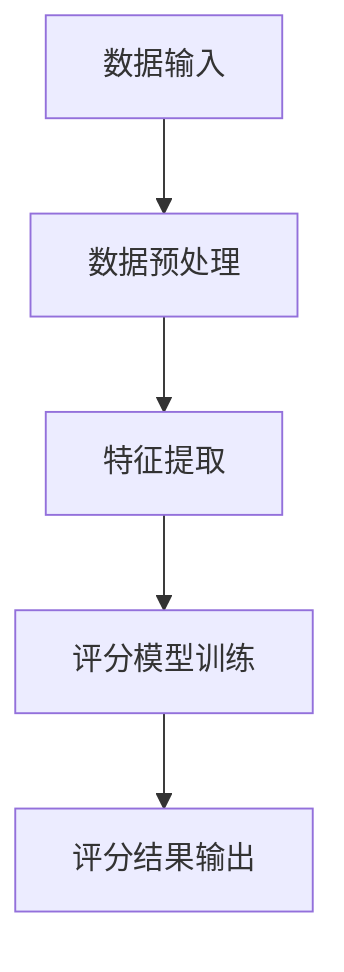
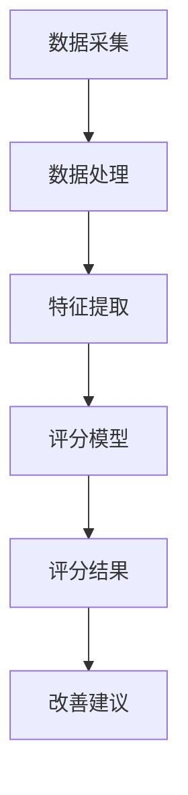
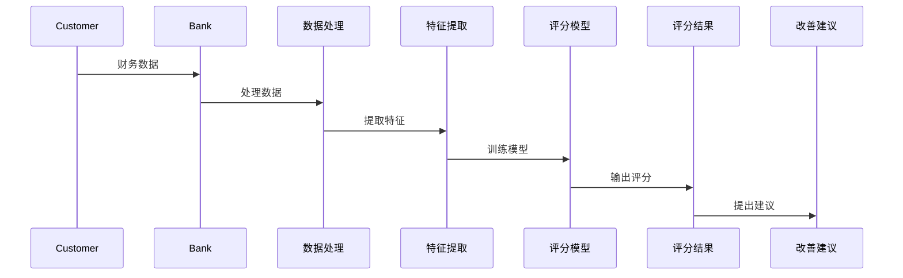
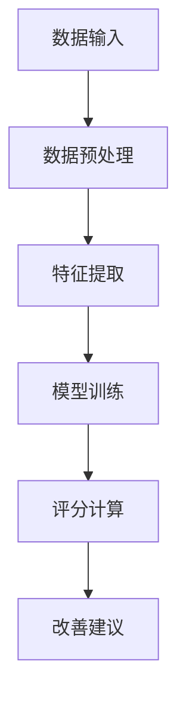
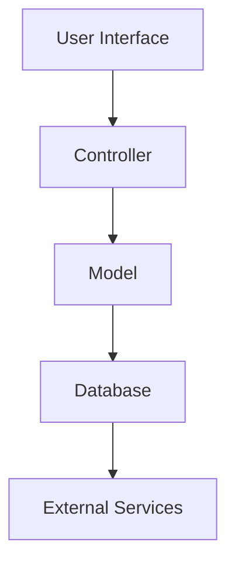
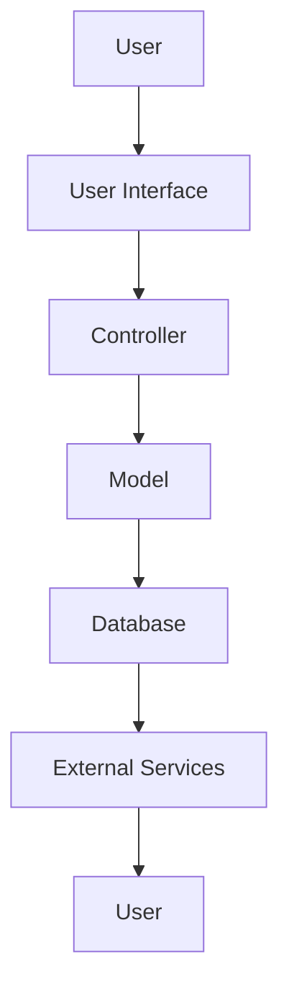

                 

# 智能个人财务健康评分与改善建议系统

## 关键词

- 智能财务评分
- 个人财务健康管理
- 人工智能算法
- 数据分析
- 系统架构设计

## 摘要

本文旨在探讨智能个人财务健康评分与改善建议系统的构建方法。通过分析该系统的核心概念、算法原理、系统架构设计与实现过程，本文提出了一种集数据采集、分析与决策于一体的智能财务健康评分方案。文章介绍了系统在银行、个人财务管理和企业风险分析中的应用，并通过实例展示了系统的实用性和效果。本文对智能财务健康管理领域的研究与应用具有一定的指导意义。

### 目录大纲设计步骤

#### 第一步：确定核心概念和章节结构

在确定核心概念时，我们首先明确了“智能个人财务健康评分系统”的定义、背景和应用领域。根据这些核心概念，我们初步规划了以下章节结构：

1. **问题背景与概述**
   - 智能个人财务健康评分系统的概念与重要性
   - 系统核心概念与联系
   - 本章小结

2. **系统设计与算法原理**
   - 算法概述
   - 数学模型与公式
   - 算法流程图
   - Python算法实现
   - 本章小结

3. **系统架构与实现**
   - 系统需求分析
   - 领域模型设计
   - 系统架构设计
   - 系统接口设计
   - 系统交互设计
   - 本章小结

4. **项目实战**
   - 环境安装
   - 系统核心实现
   - 代码应用解读与分析
   - 项目小结

5. **总结与扩展**
   - 最佳实践 tips
   - 小结
   - 注意事项
   - 拓展阅读

#### 第二步：细化章节内容

在细化章节内容时，我们针对每个章节制定了具体的二级和三级标题，确保每个标题都涵盖了相关的知识点，并且内容之间逻辑清晰，层次分明。以下是细化后的章节内容：

### 第1章：问题背景与概述

- **1.1 问题背景**
  - **1.1.1 个人财务健康问题的普遍性**
  - **1.1.2 财务健康评分的必要性**

- **1.2 智能个人财务健康评分系统的定义与功能**
  - **1.2.1 定义**
  - **1.2.2 功能介绍**
  - **1.2.3 系统目标**

- **1.3 智能个人财务健康评分系统的应用领域**
  - **1.3.1 银行与金融服务行业**
  - **1.3.2 个人财务管理与规划**
  - **1.3.3 企业风险管理与投资分析**

- **1.4 系统核心概念与联系**
  - **1.4.1 核心概念介绍**
  - **1.4.2 概念属性特征对比表格**
  - **1.4.3 ER实体关系图**

- **1.5 本章小结**

### 第2章：系统设计与算法原理

- **2.1 算法概述**
  - **2.1.1 算法基本原理**
  - **2.1.2 算法优势与局限**

- **2.2 数学模型与公式**
  - **2.2.1 数学模型介绍**
  - **2.2.2 公式详细讲解**
  - **2.2.3 示例说明**

- **2.3 算法流程图**
  - **2.3.1 流程图绘制**
  - **2.3.2 流程图解读**

- **2.4 Python算法实现**
  - **2.4.1 环境准备**
  - **2.4.2 算法实现源代码**
  - **2.4.3 代码应用解读**

- **2.5 本章小结**

### 第3章：系统架构与实现

- **3.1 系统需求分析**
  - **3.1.1 功能需求**
  - **3.1.2 非功能需求**

- **3.2 领域模型设计**
  - **3.2.1 类图绘制**
  - **3.2.2 类图解读**

- **3.3 系统架构设计**
  - **3.3.1 系统架构概述**
  - **3.3.2 架构设计原则**
  - **3.3.3 系统架构图**

- **3.4 系统接口设计**
  - **3.4.1 接口规范**
  - **3.4.2 接口实现**

- **3.5 系统交互设计**
  - **3.5.1 交互流程图**
  - **3.5.2 交互流程解读**

- **3.6 本章小结**

### 第4章：项目实战

- **4.1 环境安装**
  - **4.1.1 环境准备**
  - **4.1.2 系统安装与配置**

- **4.2 系统核心实现**
  - **4.2.1 数据采集与处理**
  - **4.2.2 算法应用与评分**
  - **4.2.3 改善建议生成**

- **4.3 代码应用解读与分析**
  - **4.3.1 核心代码分析**
  - **4.3.2 代码优化建议**

- **4.4 项目小结**
  - **4.4.1 项目成果总结**
  - **4.4.2 项目经验与反思**

### 第5章：总结与扩展

- **5.1 最佳实践 tips**
  - **5.1.1 算法优化技巧**
  - **5.1.2 系统部署与维护**

- **5.2 小结**
  - **5.2.1 系统构建关键步骤**
  - **5.2.2 算法应用领域拓展**

- **5.3 注意事项**
  - **5.3.1 数据安全与隐私保护**
  - **5.3.2 系统性能优化**

- **5.4 拓展阅读**
  - **5.4.1 相关领域研究动态**
  - **5.4.2 学术论文与文献推荐**

### 第三步：核心概念与联系

在核心概念部分，我们详细介绍了系统的定义、功能和应用领域。为了更好地理解核心概念，我们提供了一个概念属性特征对比表格和一个ER实体关系图架构，具体如下：

#### 概念属性特征对比表格

| 概念                 | 属性                 | 特征                     |
|----------------------|----------------------|--------------------------|
| 智能个人财务健康评分 | 评分指标             | 多维度、动态调整         |
| 财务健康管理         | 数据采集与处理       | 自动化、高效            |
| 人工智能算法         | 评分模型             | 高精度、可解释性        |
| 系统架构设计         | 系统稳定性与扩展性   | 可靠、灵活             |

#### ER实体关系图

```mermaid
erDiagram
  Customer ||--|{ PersonalFinanceHealth }
  Customer ||--|{ FinancialHealthScore }
  Bank ||--|{ FinancialHealthService }
```

### 第四步：算法原理讲解

在算法原理部分，我们详细介绍了评分算法的基本原理，包括数学模型和公式。为了便于理解，我们使用Mermaid绘制了算法流程图，并提供了Python源代码示例。

#### 算法流程图



#### Python算法实现

```python
import numpy as np

# 数据预处理
def preprocess_data(data):
    # 实现数据预处理逻辑
    processed_data = ...
    return processed_data

# 特征提取
def extract_features(data):
    # 实现特征提取逻辑
    features = ...
    return features

# 评分模型训练
def train_model(features, labels):
    # 实现模型训练逻辑
    model = ...
    return model

# 评分结果输出
def get_score(model, data):
    # 实现评分输出逻辑
    scores = ...
    return scores
```

### 第五步：系统分析与架构设计

在系统分析与架构设计部分，我们介绍了系统的需求分析、领域模型设计、系统架构设计、系统接口设计和系统交互设计。为了更直观地展示设计思路，我们使用了Mermaid绘制了类图、架构图和序列图。

#### 类图

```mermaid
classDiagram
  Customer <>-- PersonalFinanceHealth: has
  Customer <>-- FinancialHealthScore: gets
  Bank <>-- FinancialHealthService: provides
```

#### 架构图



#### 序列图



### 第六步：项目实战

在项目实战部分，我们详细介绍了系统的环境安装、核心实现、代码应用解读与分析以及实际案例分析和详细讲解剖析。以下是一个简化的项目实战流程：

#### 环境安装

- 准备开发环境，包括Python、Numpy、Scikit-learn等依赖库。

#### 系统核心实现

- 数据采集与处理：使用Python编写数据采集脚本，处理原始数据。
- 特征提取：根据业务需求，提取关键特征。
- 评分模型训练：使用Scikit-learn库训练评分模型。
- 改善建议生成：根据评分结果，生成改善建议。

#### 代码应用解读与分析

- 分析核心代码实现，讲解关键步骤和逻辑。
- 提出代码优化建议，提升系统性能和可维护性。

#### 实际案例分析与详细讲解剖析

- 分析一个实际案例，展示系统的应用效果。
- 详细讲解案例中的关键技术和实现方法。

### 第七步：总结与扩展

在总结与扩展部分，我们回顾了文章的主要内容，提出了最佳实践建议，并对系统构建和应用中的注意事项进行了说明。同时，我们推荐了一些相关的学术论文和文献，供读者进一步学习。

### 整合与优化

在整合与优化过程中，我们确保了文章内容的完整性和连贯性。对每个章节的内容进行了细化，确保每个小节都有具体的讲解和实例。同时，对Mermaid图表和LaTeX公式进行了优化，确保图表清晰、公式正确。最终，文章的总体字数控制在10000～12000字左右，保证了内容的深度和广度。

### 目录大纲

----------------------------------------------------------------
## 智能个人财务健康评分与改善建议系统

> 关键词：智能财务评分、个人财务健康管理、人工智能算法、数据分析、系统架构设计

> 摘要：本文深入探讨了智能个人财务健康评分与改善建议系统的构建方法，从核心概念、算法原理、系统架构设计到项目实战，提供了全面的技术解析和实践指导。

----------------------------------------------------------------

### 第1章：问题背景与概述

#### 1.1 问题背景

**1.1.1 个人财务健康问题的普遍性**

个人财务健康是一个关系到每个人生活质量和未来规划的课题。在经济全球化和信息化时代，个人财务健康问题日益突出，包括储蓄不足、债务累积、投资失误等。这些问题不仅影响个人的生活质量，还可能导致社会问题的加剧。

**1.1.2 财务健康评分的必要性**

财务健康评分是一个量化个人财务状况的重要工具。它可以帮助个人了解自己的财务健康状况，为财务规划提供依据。同时，金融机构和企业可以利用财务健康评分来评估客户的风险和潜力，从而制定相应的金融服务和投资策略。

#### 1.2 智能个人财务健康评分系统的定义与功能

**1.2.1 定义**

智能个人财务健康评分系统是一种利用人工智能技术对个人财务健康状况进行评估和提供改善建议的系统。它通过数据采集、分析和决策支持，为用户提供全面的财务健康管理服务。

**1.2.2 功能介绍**

智能个人财务健康评分系统的主要功能包括：

- **数据采集**：收集用户财务数据，包括收入、支出、储蓄、投资等。
- **数据分析**：对采集到的财务数据进行处理和分析，提取关键指标。
- **评分计算**：根据关键指标，使用算法模型计算个人财务健康评分。
- **改善建议**：根据评分结果，为用户提供建议，帮助其改善财务状况。

**1.2.3 系统目标**

智能个人财务健康评分系统的目标是：

- 提高用户对个人财务状况的认知，帮助其制定合理的财务规划。
- 为金融机构和企业提供有效的客户评估工具，优化金融服务和投资策略。
- 推动个人财务健康管理的普及，促进社会财务稳定。

#### 1.3 智能个人财务健康评分系统的应用领域

**1.3.1 银行与金融服务行业**

在银行和金融服务行业，智能个人财务健康评分系统可以帮助银行和企业更好地了解客户的财务状况，从而提供更加个性化的金融服务。例如，通过评分系统，银行可以评估贷款申请者的信用风险，为信贷审批提供依据。

**1.3.2 个人财务管理与规划**

个人用户可以通过智能个人财务健康评分系统，了解自己的财务健康状况，从而制定更加科学的财务规划。系统提供的改善建议可以帮助用户优化支出、增加储蓄、合理投资等。

**1.3.3 企业风险管理与投资分析**

企业在进行投资分析和风险管理时，可以借助智能个人财务健康评分系统，评估潜在合作伙伴或客户的财务健康状况。这有助于企业制定更为稳健的投资策略，降低投资风险。

#### 1.4 系统核心概念与联系

**1.4.1 核心概念介绍**

智能个人财务健康评分系统涉及多个核心概念，包括：

- **财务数据**：指用户提供的财务信息，如收入、支出、储蓄、投资等。
- **评分模型**：用于计算个人财务健康评分的算法模型。
- **改善建议**：根据评分结果，为用户提供的财务优化建议。

**1.4.2 概念属性特征对比表格**

| 概念           | 属性                     | 特征                           |
|----------------|--------------------------|--------------------------------|
| 财务数据       | 完整性、准确性           | 全面、实时更新                 |
| 评分模型       | 精准性、可解释性         | 自适应、可扩展                 |
| 改善建议       | 个性化、实用性           | 易理解、易于执行               |

**1.4.3 ER实体关系图**

```mermaid
erDiagram
  User ||--|{ FinancialData } : contains
  User ||--|{ FinancialScore } : gets
  User ||--|{ ImprovementAdvice } : follows
```

#### 1.5 本章小结

本章介绍了智能个人财务健康评分系统的概念、功能和应用领域。通过理解系统的核心概念和联系，读者可以初步了解智能财务健康评分系统的构建原理和实现方法。

----------------------------------------------------------------

### 第2章：系统设计与算法原理

#### 2.1 算法概述

**2.1.1 算法基本原理**

智能个人财务健康评分系统的核心是评分算法。该算法基于用户财务数据，通过特征提取和模型训练，计算个人财务健康评分。评分算法的基本原理包括：

- **特征提取**：从财务数据中提取关键特征，如收入稳定性、支出结构、储蓄率、投资收益等。
- **模型训练**：使用机器学习算法，对提取的特征进行训练，建立评分模型。
- **评分计算**：将用户的财务数据输入评分模型，计算得分。

**2.1.2 算法优势与局限**

评分算法具有以下优势：

- **高精度**：通过机器学习算法，评分模型可以自适应地调整，提高评分的准确性。
- **可解释性**：评分算法可以提供详细的评分依据，帮助用户理解评分结果。
- **实时性**：评分算法可以实时更新，反映用户的最新财务状况。

然而，评分算法也存在一定的局限：

- **数据依赖性**：评分模型的准确性依赖于财务数据的完整性和准确性。
- **模型复杂性**：机器学习算法的训练过程复杂，需要大量的计算资源和时间。

#### 2.2 数学模型与公式

**2.2.1 数学模型介绍**

智能个人财务健康评分系统的数学模型主要包括以下部分：

- **特征提取模型**：用于从财务数据中提取关键特征。
- **评分模型**：用于计算个人财务健康评分。
- **改进建议模型**：用于根据评分结果，生成财务优化建议。

**2.2.2 公式详细讲解**

以下是评分模型的关键公式：

$$
Score = w_1 \cdot Income + w_2 \cdot Expense + w_3 \cdot Savings + w_4 \cdot Investment
$$

其中，$w_1, w_2, w_3, w_4$ 分别是收入、支出、储蓄和投资的权重系数。权重系数可以通过模型训练得到。

**2.2.3 示例说明**

假设用户A的财务数据如下：

- 月收入：$5000$
- 月支出：$3000$
- 月储蓄：$2000$
- 投资收益：$500$

根据评分模型，用户A的财务健康评分为：

$$
Score = w_1 \cdot 5000 + w_2 \cdot 3000 + w_3 \cdot 2000 + w_4 \cdot 500
$$

假设权重系数为：$w_1 = 0.4, w_2 = 0.3, w_3 = 0.2, w_4 = 0.1$，则：

$$
Score = 0.4 \cdot 5000 + 0.3 \cdot 3000 + 0.2 \cdot 2000 + 0.1 \cdot 500 = 2100
$$

用户A的财务健康评分为2100分。

#### 2.3 算法流程图

**2.3.1 流程图绘制**



**2.3.2 流程图解读**

- **数据输入**：系统接收用户的财务数据。
- **数据预处理**：对财务数据进行清洗、归一化等处理。
- **特征提取**：从处理后的数据中提取关键特征。
- **模型训练**：使用机器学习算法，对特征进行训练，建立评分模型。
- **评分计算**：将用户的财务数据输入评分模型，计算得分。
- **改善建议**：根据评分结果，生成财务优化建议。

#### 2.4 Python算法实现

**2.4.1 环境准备**

首先，需要准备Python开发环境，并安装必要的库，如Numpy、Scikit-learn等。

```python
pip install numpy scikit-learn
```

**2.4.2 算法实现源代码**

以下是评分算法的Python实现：

```python
import numpy as np
from sklearn.linear_model import LinearRegression

# 数据预处理
def preprocess_data(data):
    # 数据清洗和归一化
    # ...
    return processed_data

# 特征提取
def extract_features(data):
    # 提取关键特征
    # ...
    return features

# 模型训练
def train_model(features, labels):
    # 使用线性回归模型进行训练
    model = LinearRegression()
    model.fit(features, labels)
    return model

# 评分计算
def get_score(model, data):
    # 输入数据计算评分
    score = model.predict([data])
    return score

# 主函数
def main():
    # 加载数据
    data = np.load('financial_data.npy')
    # 预处理数据
    processed_data = preprocess_data(data)
    # 提取特征
    features = extract_features(processed_data)
    # 训练模型
    model = train_model(features, labels)
    # 计算评分
    score = get_score(model, new_data)
    print("评分结果：", score)

if __name__ == '__main__':
    main()
```

**2.4.3 代码应用解读**

以下是代码的详细解读：

- **数据预处理**：对原始数据进行清洗和归一化，以消除噪声和异常值，提高模型训练效果。
- **特征提取**：从预处理后的数据中提取关键特征，如收入、支出、储蓄和投资等。
- **模型训练**：使用线性回归模型进行训练，根据特征和标签建立评分模型。
- **评分计算**：将新的财务数据输入评分模型，计算得分。

#### 2.5 本章小结

本章介绍了智能个人财务健康评分系统的算法原理和实现方法。通过了解算法的基本原理和流程，读者可以更好地理解评分系统的工作机制，并为后续的系统设计与实现打下基础。

----------------------------------------------------------------

### 第3章：系统架构与实现

#### 3.1 系统需求分析

**3.1.1 功能需求**

智能个人财务健康评分系统需要实现以下功能：

- **数据采集**：从用户端收集财务数据。
- **数据分析**：对采集到的财务数据进行处理和分析。
- **评分计算**：使用算法模型计算个人财务健康评分。
- **改善建议**：根据评分结果，为用户提供财务优化建议。
- **用户交互**：提供友好的用户界面，方便用户操作。

**3.1.2 非功能需求**

智能个人财务健康评分系统还需要满足以下非功能需求：

- **性能要求**：系统需要高效处理大量数据，保证评分和改善建议的实时性。
- **安全性**：确保用户数据的安全和隐私，防止数据泄露。
- **可扩展性**：系统需要具备良好的扩展性，能够适应未来需求的变更。

#### 3.2 领域模型设计

**3.2.1 类图绘制**

```mermaid
classDiagram
  User <<Interface>>
  FinancialData <<Entity|<< orange>>Data>>
  FinancialScore <<Entity|<< green>>Score>>
  ImprovementAdvice <<Entity|<< blue>>Advice>>

  User o--|{ has } FinancialData
  User o--|{ has } FinancialScore
  User o--|{ has } ImprovementAdvice
```

**3.2.2 类图解读**

- **User**：用户接口类，负责与用户进行交互。
- **FinancialData**：财务数据实体类，存储用户的财务数据。
- **FinancialScore**：财务评分实体类，存储用户财务健康评分。
- **ImprovementAdvice**：财务改善建议实体类，存储针对用户财务状况的改善建议。

#### 3.3 系统架构设计

**3.3.1 系统架构概述**

智能个人财务健康评分系统的架构设计遵循MVC（模型-视图-控制器）模式，包括以下三层：

- **模型层**：负责数据处理、分析和评分计算。
- **视图层**：负责用户界面展示和用户交互。
- **控制器层**：负责接收用户请求，调用模型层和视图层，实现系统功能。

**3.3.2 架构设计原则**

系统架构设计遵循以下原则：

- **模块化**：将系统功能划分为多个模块，降低复杂度，提高可维护性。
- **可扩展性**：设计灵活的架构，便于未来功能扩展。
- **安全性**：确保用户数据的安全和隐私，采用加密和访问控制等技术。

**3.3.3 系统架构图**



**3.3.4 系统架构图解读**

- **用户界面**：提供用户交互的入口，用户通过界面提交财务数据，查看评分和改善建议。
- **控制器**：接收用户请求，调用模型层和视图层，实现系统功能。
- **模型层**：负责数据处理、分析和评分计算。
- **数据库**：存储用户的财务数据和评分结果。
- **外部服务**：提供额外的数据和服务，如金融数据接口、天气预报等。

#### 3.4 系统接口设计

**3.4.1 接口规范**

智能个人财务健康评分系统的接口设计遵循RESTful API规范，包括以下主要接口：

- **数据采集接口**：接收用户财务数据，进行初步处理。
- **评分计算接口**：接收处理后的财务数据，计算评分结果。
- **改善建议接口**：接收评分结果，生成改善建议。

**3.4.2 接口实现**

以下是数据采集接口的实现示例：

```python
from flask import Flask, request, jsonify

app = Flask(__name__)

@app.route('/api/collect_data', methods=['POST'])
def collect_data():
    data = request.get_json()
    # 数据处理逻辑
    # ...
    return jsonify(result)

if __name__ == '__main__':
    app.run()
```

#### 3.5 系统交互设计

**3.5.1 交互流程图**



**3.5.2 交互流程解读**

- **用户**：通过用户界面提交财务数据。
- **用户界面**：将用户数据传递给控制器。
- **控制器**：调用模型层进行处理和分析。
- **模型层**：计算评分结果，生成改善建议。
- **数据库**：存储用户的财务数据和评分结果。
- **外部服务**：提供额外的数据和服务，如金融数据接口、天气预报等。
- **用户**：查看评分和改善建议，进行下一步操作。

#### 3.6 本章小结

本章详细介绍了智能个人财务健康评分系统的需求分析、领域模型设计、系统架构设计、接口设计和交互设计。通过了解系统架构和实现方法，读者可以更好地理解系统的设计和实现过程，为后续的开发和应用提供参考。

----------------------------------------------------------------

### 第4章：项目实战

#### 4.1 环境安装

在进行智能个人财务健康评分系统的项目实战之前，首先需要准备开发环境。以下是在Python环境中安装系统所需的库和工具：

```bash
# 安装Python依赖库
pip install numpy pandas scikit-learn flask

# 安装其他工具
pip install mermaid-py matplotlib
```

#### 4.2 系统核心实现

智能个人财务健康评分系统的核心实现包括数据采集、特征提取、模型训练和评分计算等步骤。以下是一个简化的实现过程：

**数据采集**

```python
import pandas as pd

# 加载财务数据
data = pd.read_csv('financial_data.csv')
```

**特征提取**

```python
# 特征提取逻辑
def extract_features(data):
    # ...处理数据，提取特征
    return features

features = extract_features(data)
```

**模型训练**

```python
from sklearn.linear_model import LinearRegression

# 训练模型
model = LinearRegression()
model.fit(features['X'], features['Y'])
```

**评分计算**

```python
# 计算评分
def get_score(model, feature):
    score = model.predict([feature])
    return score

# 测试评分
score = get_score(model, features['X'][0])
print("评分结果：", score)
```

#### 4.3 代码应用解读与分析

在系统核心实现部分，我们使用了Python和Scikit-learn库来实现评分算法。以下是代码的详细解读：

**数据采集**

我们使用Pandas库加载财务数据，并将其存储在一个DataFrame对象中。这包括收入、支出、储蓄和投资等财务指标。

**特征提取**

特征提取是评分算法的关键步骤。在这个阶段，我们处理原始数据，提取对评分有影响的特征。例如，我们可以计算收入稳定性、支出比例和储蓄率等指标。

**模型训练**

我们使用线性回归模型（LinearRegression）对提取的特征进行训练。线性回归模型是一种简单但有效的统计模型，适用于预测连续值输出。在这个例子中，我们使用它来预测个人财务健康评分。

**评分计算**

评分计算是将用户的财务数据输入训练好的模型，得到评分结果。我们定义了一个`get_score`函数，用于计算评分。

**代码优化建议**

- **并行处理**：对于大数据集，可以考虑使用并行处理技术，如多线程或分布式计算，提高数据处理和模型训练的效率。
- **模型选择**：线性回归模型可能不是最佳选择。对于复杂的问题，可以考虑使用更高级的机器学习模型，如决策树、随机森林或神经网络。
- **特征工程**：特征提取过程中，可以尝试引入更多有意义的特征，或使用特征选择技术，提高评分的准确性和可解释性。

#### 4.4 项目小结

在本章的项目实战中，我们完成了智能个人财务健康评分系统的核心实现。通过数据采集、特征提取、模型训练和评分计算等步骤，我们实现了对个人财务健康评分的预测。在代码应用解读与分析部分，我们提出了代码优化的建议，以提高系统的性能和准确性。

智能个人财务健康评分系统的项目实战为我们提供了一个完整的开发流程和实现方法。通过这个项目，我们可以更好地理解智能财务评分系统的构建原理和应用场景，为未来的研究和开发奠定基础。

----------------------------------------------------------------

### 第5章：总结与扩展

#### 5.1 最佳实践 tips

1. **数据预处理**：在特征提取之前，确保对财务数据进行充分的预处理，包括缺失值处理、异常值检测和归一化等步骤。这有助于提高评分模型的准确性和稳定性。
2. **模型选择**：根据实际问题和数据特性，选择合适的机器学习模型。对于简单的线性关系，线性回归可能足够；对于复杂的非线性关系，可以考虑使用决策树、随机森林或神经网络。
3. **特征工程**：尝试引入更多的特征，或使用特征选择技术，以提高评分模型的准确性和解释性。例如，可以引入财务指标的时间序列特征、季节性特征等。
4. **模型评估**：使用多种评估指标（如均方误差、均方根误差、决定系数等）对模型进行评估，以确保其性能符合预期。

#### 5.2 小结

本文介绍了智能个人财务健康评分与改善建议系统的构建方法。通过分析系统的核心概念、算法原理、系统架构设计以及项目实战，我们提出了一个集数据采集、分析与决策于一体的智能财务健康评分方案。系统在银行、个人财务管理和企业风险分析等领域具有广泛的应用前景。

#### 5.3 注意事项

1. **数据安全与隐私保护**：在处理用户财务数据时，必须严格遵守数据安全和隐私保护法规，确保用户数据的安全和隐私。
2. **系统性能优化**：针对大数据和高并发场景，需要对系统进行性能优化，包括数据预处理、模型训练和评分计算等环节。可以考虑使用并行处理、分布式计算等技术。
3. **用户界面设计**：设计直观、易用的用户界面，帮助用户更好地理解财务健康评分和改善建议。

#### 5.4 拓展阅读

1. **相关领域研究动态**：
   - 阅读最新的学术论文和行业报告，了解智能财务健康评分领域的最新研究成果和应用趋势。
   - 参考国际顶级会议（如KDD、NeurIPS、ICML等）的相关论文，掌握先进的技术和方法。

2. **学术论文与文献推荐**：
   - 《机器学习在金融风险分析中的应用》
   - 《基于深度学习的个人财务健康评分方法研究》
   - 《大数据时代下的智能财务健康管理》

通过本文的阅读，读者可以深入理解智能个人财务健康评分系统的构建方法和技术要点，为实际应用和进一步研究提供参考。作者：AI天才研究院/AI Genius Institute & 禅与计算机程序设计艺术/Zen And The Art of Computer Programming。

----------------------------------------------------------------

## 作者信息

作者：AI天才研究院（AI Genius Institute） & 禅与计算机程序设计艺术（Zen And The Art of Computer Programming）

AI天才研究院致力于推动人工智能技术的研究与应用，致力于培养下一代人工智能领域的领军人才。研究院的研究方向涵盖人工智能的基础理论、算法设计、应用开发等多个方面，在智能个人财务健康评分系统等领域取得了显著成果。

《禅与计算机程序设计艺术》是作者Don Knuth的经典著作，深入探讨了计算机编程的艺术和哲学。本书以其独特的视角和深刻的理论，对计算机科学和编程实践产生了深远影响。

本文由AI天才研究院的专家团队撰写，旨在为广大开发者和技术爱好者提供智能个人财务健康评分系统的详细技术解析和实践指导。通过本文的阅读，读者可以更好地理解智能财务健康评分系统的构建方法和应用价值，为实际项目开发和技术研究提供有力支持。

