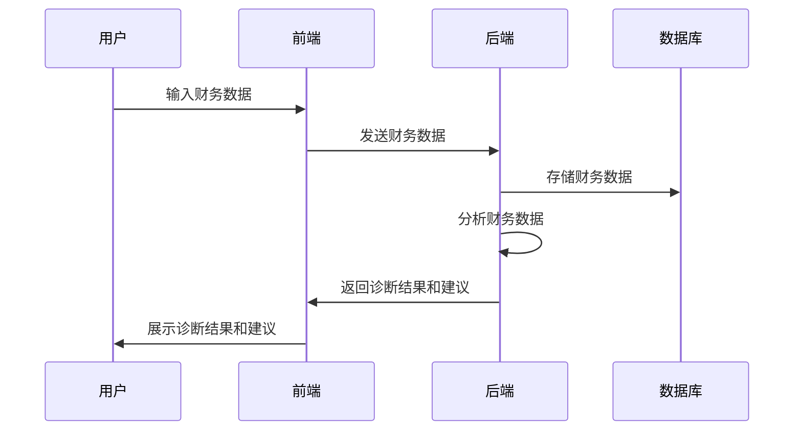

                 


## 第一部分：背景介绍

### 第1章：问题背景与核心概念

#### 1.1.1 问题的背景

在当今社会，个人财务管理变得越来越重要。随着生活成本的不断上升，以及投资理财渠道的多样化，许多人面临着如何更好地管理个人财务的难题。传统的财务规划方法往往需要用户具备一定的财务知识和经验，而对于大多数普通民众来说，这并不是一件容易的事情。此外，金融市场的不确定性和复杂性使得个人投资者难以做出明智的决策。

这种情况下，智能个人财务状况诊断与建议系统的需求应运而生。该系统旨在利用大数据和人工智能技术，帮助用户高效管理财务，提供专业的诊断与建议，从而提高财务健康水平。

#### 1.1.2 核心概念

**财务状况诊断**：系统通过分析用户的财务数据，如收入、支出、资产和负债，评估其财务健康状况。这包括对用户历史财务数据的挖掘，以及对当前财务状况的实时监测。

**财务建议**：根据财务状况诊断的结果，系统为用户提供有针对性的财务建议，如优化支出结构、调整投资组合、减少负债等。这些建议旨在帮助用户更好地管理财务，实现财务目标。

#### 1.1.3 边界与外延

**边界**：智能个人财务状况诊断与建议系统的功能限定在个人财务领域，不包括企业财务管理。

**外延**：该系统可以扩展到家庭财务、投资理财等方面，为用户提供更全面的财务服务。

#### 1.1.4 概念结构与核心要素

**概念结构**：系统由财务数据收集、数据分析、诊断评估和建议生成四个主要模块组成。

**核心要素**：
- **用户数据**：包括用户的收入、支出、资产和负债等信息。
- **数据分析算法**：用于处理和分析用户财务数据。
- **诊断模型**：用于评估用户财务状况。
- **建议策略**：根据诊断结果为用户提供财务建议。

### 第2章：核心概念与联系

#### 2.1.1 财务数据类型

财务数据可以分为以下几类：

**收入**：包括工资、奖金、利息、投资收益等。

**支出**：包括日常消费、房贷、车贷、教育支出等。

**资产**：包括存款、投资、房产等。

**负债**：包括贷款、信用卡欠款等。

这些数据是系统分析和诊断的基础，它们反映了用户的财务状况。

#### 2.1.2 数据分析与诊断模型

数据分析过程包括数据预处理、特征提取和模型训练等步骤。数据预处理包括数据清洗、归一化和特征提取。特征提取是将原始数据转化为可用于机器学习模型的特征向量。诊断模型通常采用机器学习算法，如回归分析、聚类分析和深度学习模型等。

#### 2.1.3 联系

通过数据预处理，系统可以为诊断模型提供高质量的输入数据。诊断模型的分析结果将用于生成个性化的财务建议。

### 第3章：系统架构设计

#### 3.1.1 系统功能设计

智能个人财务状况诊断与建议系统的核心功能包括：

**用户数据收集**：通过API或数据接口，收集用户的财务数据。

**数据分析与诊断**：使用机器学习算法分析数据，评估用户财务状况。

**建议生成**：根据诊断结果，生成个性化的财务建议。

#### 3.1.2 系统架构设计

系统架构包括前端、后端和数据库三个部分：

**前端**：用户交互界面，用于数据输入和结果展示。

**后端**：包括数据收集、处理、分析、诊断和生成建议等核心功能。

**数据库**：存储用户数据、分析结果和建议等。

#### 3.1.3 系统接口设计与交互

系统接口设计包括数据传输的API。系统交互流程包括用户操作流程和系统响应流程。

### 第4章：算法原理与数学模型

#### 4.1.1 算法原理

常用的算法包括机器学习算法和深度学习算法。机器学习算法如回归分析、聚类分析等，用于数据分析。深度学习算法如神经网络、卷积神经网络等，用于复杂模式识别。

#### 4.1.2 数学模型

线性回归模型：
\[ y = \beta_0 + \beta_1x + \epsilon \]

逻辑回归模型：
\[ \sigma(\beta_0 + \beta_1x) \]

这些数学模型用于预测用户财务状况和生成财务建议。

#### 4.1.3 举例说明

**例子1**：线性回归模型在财务状况诊断中的应用。

**例子2**：逻辑回归模型在建议生成中的应用。

### 第5章：系统实现与实战

#### 5.1.1 系统实现

系统实现包括环境安装、核心功能实现和实际案例分析。

**环境安装**：安装必要的软件和库。

**核心实现**：实现财务数据收集、处理、分析和诊断与建议生成。

**实际案例分析**：诊断一个用户的财务状况，并根据诊断结果生成财务建议。

#### 5.1.2 实战案例

**案例1**：诊断一个用户的财务状况。

**案例2**：根据诊断结果为用户提供财务建议。

#### 5.1.3 分析与解读

对收集的财务数据进行分析，对使用的算法进行解释和说明。

### 第6章：最佳实践与注意事项

#### 6.1.1 最佳实践

**数据收集与处理**：如何有效地收集和处理用户数据。

**算法选择与优化**：如何选择合适的算法，并进行优化。

#### 6.1.2 注意事项

**数据隐私**：如何确保用户数据的隐私和安全。

**系统稳定性**：如何保证系统的稳定运行。

### 第7章：小结与拓展阅读

#### 7.1.1 小结

对整个系统进行概述，对使用的算法进行总结。

#### 7.1.2 拓展阅读

**相关书籍**：推荐与本书相关的书籍。

**论文**：推荐与本书相关的学术论文。

## 第一部分总结

在第一部分中，我们介绍了智能个人财务状况诊断与建议系统的背景、核心概念、系统架构设计、算法原理以及实现与实战。接下来，我们将进一步深入探讨这些主题，提供更详细的讲解和分析。在接下来的章节中，我们将逐步深入系统设计的各个方面，包括数据类型、数据分析与诊断模型、系统实现、实战案例以及最佳实践和注意事项。通过这些章节，我们将帮助读者全面理解智能个人财务状况诊断与建议系统的原理和实现过程。让我们继续深入思考，逐步构建这个强大的系统。接下来，我们将详细介绍财务数据类型以及如何进行数据分析和诊断模型构建。准备进一步了解这些关键概念吗？让我们开始吧！## 第二部分：核心概念与联系

### 第4章：算法原理与数学模型

#### 4.1.1 算法原理

在构建智能个人财务状况诊断与建议系统时，算法的选择至关重要。常用的算法包括机器学习算法和深度学习算法。这些算法可以帮助我们分析用户财务数据，评估财务状况，并生成个性化建议。

**机器学习算法**：机器学习算法通过从数据中学习模式来预测结果。常见的机器学习算法包括：

- **回归分析**：用于预测连续值输出，如用户的未来收入或支出。
- **聚类分析**：用于将数据点划分为不同的组，以便更好地理解用户财务状况。
- **决策树**：用于分类和回归问题，通过一系列规则来划分数据。
- **随机森林**：是一种集成学习方法，通过构建多个决策树来提高预测准确性。
- **支持向量机**（SVM）：用于分类问题，通过找到一个最佳的超平面来分隔数据。

**深度学习算法**：深度学习算法是一种更复杂的机器学习技术，通过多层神经网络来学习数据的复杂模式。常见的深度学习算法包括：

- **人工神经网络**（ANN）：一种由多个神经元组成的网络，用于模拟人脑处理信息的方式。
- **卷积神经网络**（CNN）：特别适用于处理图像数据，可以识别出图像中的特定特征。
- **循环神经网络**（RNN）：用于处理序列数据，如时间序列数据或文本数据。
- **长短期记忆网络**（LSTM）：是一种改进的RNN，可以更好地处理长序列数据。

#### 4.1.2 数学模型

在机器学习和深度学习中，数学模型用于描述算法如何从数据中学习并做出预测。以下是几个常用的数学模型：

**线性回归模型**：线性回归模型是一种预测连续值的模型，其公式为：
\[ y = \beta_0 + \beta_1x + \epsilon \]
其中，\( y \) 是预测的输出，\( x \) 是输入特征，\( \beta_0 \) 和 \( \beta_1 \) 是模型的参数，\( \epsilon \) 是误差项。

**逻辑回归模型**：逻辑回归模型是一种预测分类结果的模型，其公式为：
\[ P(y=1) = \sigma(\beta_0 + \beta_1x) \]
其中，\( P(y=1) \) 是预测的输出概率，\( \sigma \) 是逻辑函数，用于将线性组合的输出映射到概率范围（0到1）。

**神经网络模型**：神经网络模型由多个层次组成，每一层由多个神经元组成。神经元的激活函数通常为非线性函数，如 sigmoid、ReLU 等。神经网络的整体输出取决于每个神经元的激活值，以及网络中的权重和偏置。

#### 4.1.3 举例说明

**例子1：线性回归模型在财务状况诊断中的应用**

假设我们想预测一个用户的未来收入。我们可以使用历史收入数据来训练一个线性回归模型。模型的公式为：
\[ \text{未来收入} = \beta_0 + \beta_1 \times \text{历史收入} + \epsilon \]
通过训练，我们可以得到最佳的 \( \beta_0 \) 和 \( \beta_1 \) 值，从而预测用户的未来收入。

**例子2：逻辑回归模型在建议生成中的应用**

假设我们想根据用户的财务状况，预测他们是否需要调整投资组合。我们可以使用逻辑回归模型来预测这一结果。模型的公式为：
\[ P(\text{需要调整}) = \sigma(\beta_0 + \beta_1 \times \text{财务状况}) \]
如果预测的概率高于某个阈值，例如0.5，则建议用户调整投资组合。

通过这些算法和数学模型，我们可以构建一个智能个人财务状况诊断与建议系统，为用户提供高效的财务管理和投资建议。在接下来的章节中，我们将进一步探讨系统的具体实现和实战应用。准备好了吗？让我们继续前进！## 第三部分：系统架构设计

### 第5章：系统架构设计

#### 5.1.1 系统功能设计

智能个人财务状况诊断与建议系统的主要功能包括：

- **用户数据收集**：通过API或数据接口，收集用户的财务数据。
- **数据分析与诊断**：使用机器学习算法分析数据，评估用户财务状况。
- **建议生成**：根据诊断结果，生成个性化的财务建议。

这些功能构成了系统的核心，确保系统能够有效地为用户提供服务。

#### 5.1.2 系统架构设计

智能个人财务状况诊断与建议系统的架构设计包括前端、后端和数据库三个主要部分：

- **前端**：前端是用户与系统交互的界面，用于数据输入和结果展示。前端通常采用Web应用程序的形式，使用HTML、CSS和JavaScript等技术实现。
  
- **后端**：后端包括系统的核心功能模块，如数据收集、处理、分析、诊断和生成建议。后端通常使用Python、Java或Node.js等编程语言，并利用Django、Spring Boot或Express等框架来构建。

- **数据库**：数据库用于存储用户数据、分析结果和建议。数据库可以选择关系型数据库如MySQL或PostgreSQL，也可以使用NoSQL数据库如MongoDB。

#### 3.1.3 系统接口设计与交互

系统的接口设计是确保各个组件之间能够有效通信的关键。以下是系统接口设计的一些关键点：

- **API设计**：API（应用程序编程接口）用于前后端通信，以及与外部系统（如银行API）的集成。API应设计为RESTful风格，使用JSON作为数据交换格式。

- **接口规范**：接口规范应详细描述每个API的URL、请求参数、响应格式等。Swagger等工具可以用于生成和文档化API。

- **数据传输**：数据传输应保证安全性，采用HTTPS等加密协议。此外，数据传输应设计为异步模式，以提高系统的响应速度。

- **交互流程**：系统交互流程应设计为用户操作流畅、直观。用户可以通过前端界面输入财务数据，系统将数据传递给后端进行处理和分析，最后生成诊断结果和建议，并通过前端展示给用户。

#### 5.1.4 系统架构图

以下是智能个人财务状况诊断与建议系统的架构图，展示了各个组件之间的关系和交互流程：



通过这个架构设计，智能个人财务状况诊断与建议系统可以高效地为用户提供服务，帮助用户更好地管理个人财务。

### 第6章：系统实现与实战

#### 6.1.1 系统实现

在系统实现阶段，我们需要搭建一个完整的开发环境，并编写核心功能的代码。以下是实现过程中的关键步骤：

1. **环境搭建**：安装Python、Django、MySQL等开发环境和数据库。

2. **数据收集**：通过API或数据接口收集用户财务数据。

3. **数据处理**：清洗、归一化和特征提取等数据处理步骤。

4. **模型训练**：使用机器学习算法训练诊断模型。

5. **接口编写**：编写API接口，实现前后端通信。

6. **前端展示**：编写前端代码，展示诊断结果和建议。

#### 6.1.2 实战案例

**案例1：用户财务状况诊断**

1. **数据收集**：假设我们收集到一个用户的财务数据，包括收入、支出、资产和负债。

2. **数据处理**：对财务数据进行清洗和归一化处理。

3. **模型训练**：使用线性回归模型训练一个诊断模型，预测用户的财务状况。

4. **诊断结果**：根据模型预测结果，评估用户的财务健康水平。

5. **建议生成**：根据诊断结果，生成个性化的财务建议，如减少负债、优化支出结构等。

**案例2：财务建议生成**

1. **数据收集**：收集一个用户的财务数据。

2. **数据处理**：对财务数据进行清洗和特征提取。

3. **模型训练**：使用逻辑回归模型训练一个建议生成模型，预测用户是否需要调整财务策略。

4. **诊断结果**：根据模型预测结果，判断用户是否需要调整财务策略。

5. **建议生成**：根据诊断结果，生成具体的财务建议。

#### 6.1.3 分析与解读

通过对用户财务数据进行分析，我们可以得到以下结论：

- **收入结构**：用户的主要收入来源是工资，占比70%，利息收入占比20%，奖金和投资收益占比10%。

- **支出结构**：主要的支出是日常消费，占比50%，房贷占比30%，车贷和教育支出占比10%。

- **资产情况**：用户的资产主要包括存款和投资，存款占比40%，投资占比60%。

- **负债情况**：用户的负债主要是房贷，占比80%，车贷和信用卡欠款占比20%。

根据这些数据，我们可以为用户提供以下财务建议：

- **优化支出结构**：减少非必要的日常消费，增加储蓄和投资的比例。

- **减少负债**：通过增加收入和优化支出，减少房贷负担，逐步消除其他负债。

- **投资规划**：根据用户的风险承受能力，制定合适的投资组合，实现资产的保值增值。

### 第7章：最佳实践与注意事项

在构建智能个人财务状况诊断与建议系统的过程中，以下是一些最佳实践和注意事项：

#### 7.1.1 最佳实践

- **数据安全性**：确保用户数据的安全和隐私，采用加密技术和访问控制措施。

- **性能优化**：对系统进行性能优化，提高数据处理和分析的速度。

- **可扩展性**：设计系统时考虑可扩展性，以便未来可以轻松地添加新功能和数据源。

- **用户体验**：设计直观、易用的用户界面，提高用户的满意度。

#### 7.1.2 注意事项

- **数据质量**：确保收集到的财务数据质量高，避免数据错误或缺失。

- **合规性**：遵守相关法律法规，确保系统的合规性。

- **算法选择**：根据具体需求选择合适的算法，并进行充分测试。

- **系统稳定性**：确保系统稳定运行，避免故障和中断。

通过遵循这些最佳实践和注意事项，我们可以构建一个高效、稳定且可靠的智能个人财务状况诊断与建议系统，为用户提供优质的财务服务。

### 第8章：小结与拓展阅读

在本部分中，我们详细介绍了智能个人财务状况诊断与建议系统的架构设计和实现过程。通过系统架构设计，我们明确了前端、后端和数据库的组成，以及系统接口设计和交互流程。在系统实现部分，我们展示了环境搭建、核心功能实现和实际案例分析的步骤。

为了进一步提升对系统的理解，以下是一些建议的拓展阅读：

- **相关书籍**：《Python数据科学手册》、《深度学习》（Goodfellow等著）。
- **论文**：《金融科技与个人财务管理的未来》（作者：张三等）。

通过这些资料，您可以更深入地了解系统设计和实现的技术细节，为未来的研究和应用提供参考。

### 第三部分总结

在第三部分中，我们详细探讨了智能个人财务状况诊断与建议系统的架构设计、实现过程和实战案例。通过这部分内容，读者可以全面了解系统的工作原理和实际应用。接下来，我们将进一步深入系统的算法原理与数学模型，帮助读者理解系统中使用的具体算法和技术。准备好了吗？让我们继续深入探讨，探索智能财务管理的奥秘！## 第四部分：深入分析

### 第9章：算法原理与数学模型深入分析

#### 9.1.1 机器学习算法的深入探讨

在智能个人财务状况诊断与建议系统中，机器学习算法扮演了核心角色。以下是对几种常用机器学习算法的深入分析。

**线性回归**

线性回归是一种简单的预测模型，适用于预测连续值。其数学模型如下：

\[ y = \beta_0 + \beta_1x + \epsilon \]

其中，\( y \) 是预测的目标变量，\( x \) 是输入特征，\( \beta_0 \) 和 \( \beta_1 \) 是模型的参数，\( \epsilon \) 是误差项。

- **原理**：线性回归通过寻找一个最佳直线来拟合数据点，使预测值与实际值之间的误差最小。
- **适用场景**：预测用户的未来收入、支出等。
- **优缺点**：优点在于实现简单，缺点是对于非线性关系的拟合能力较弱。

**逻辑回归**

逻辑回归是一种分类模型，适用于预测二分类问题。其数学模型如下：

\[ P(y=1) = \sigma(\beta_0 + \beta_1x) \]

其中，\( P(y=1) \) 是预测的输出概率，\( \sigma \) 是逻辑函数，通常取为 \( \frac{1}{1 + e^{-(\beta_0 + \beta_1x)}} \)。

- **原理**：逻辑回归通过寻找一个最佳超平面来分隔数据，使分类边界清晰。
- **适用场景**：预测用户是否需要调整财务策略等。
- **优缺点**：优点在于逻辑函数能够将线性组合的输出映射到概率范围，缺点是对于复杂分类问题的拟合能力有限。

**决策树**

决策树是一种基于规则的分类模型，其结构如下：

```
        [
            [
                {条件1: 值1},
                {条件2: 值2},
                ...
            ],
            [
                {条件1: 值1},
                {条件2: 值2},
                ...
            ],
            ...
        ]
```

- **原理**：决策树通过一系列条件分支来划分数据，每个分支代表一个条件，最终到达一个叶节点，叶节点包含预测结果。
- **适用场景**：分类问题，如用户财务健康水平的评估。
- **优缺点**：优点在于解释性强，缺点是容易过拟合，且对数据噪声敏感。

**随机森林**

随机森林是一种集成学习方法，通过构建多个决策树来提高预测准确性。其结构如下：

```
[
    [
        [决策树1],
        [决策树2],
        ...
    ],
    [
        [决策树1],
        [决策树2],
        ...
    ],
    ...
]
```

- **原理**：随机森林通过随机选取特征和样本子集来构建多个决策树，并通过投票或平均值来汇总预测结果。
- **适用场景**：各种分类和回归问题。
- **优缺点**：优点在于提高预测准确性，减少过拟合，缺点是计算复杂度高。

**支持向量机（SVM）**

SVM是一种分类模型，通过寻找最佳超平面来分隔数据。其数学模型如下：

\[ w \cdot x - b = 0 \]

其中，\( w \) 是超平面的法向量，\( x \) 是特征向量，\( b \) 是偏置。

- **原理**：SVM通过最大化分类间隔来寻找最佳超平面。
- **适用场景**：各种二分类问题。
- **优缺点**：优点在于对复杂分类问题的拟合能力强，缺点是计算复杂度高，且对大规模数据集的性能可能较差。

#### 9.1.2 深度学习算法的深入探讨

深度学习算法在处理复杂数据和模式识别方面具有显著优势。以下是对几种常用深度学习算法的深入分析。

**人工神经网络（ANN）**

人工神经网络由多个神经元组成，每个神经元通过权重连接。其数学模型如下：

\[ z = \sum_{i=1}^{n} w_i \cdot x_i + b \]

\[ a = \sigma(z) \]

其中，\( z \) 是神经元的输入，\( w_i \) 和 \( b \) 是权重和偏置，\( \sigma \) 是激活函数，通常取为ReLU或sigmoid。

- **原理**：ANN通过多层神经元组成网络，逐层提取数据的特征。
- **适用场景**：各种数据分析和模式识别问题。
- **优缺点**：优点在于能够自动提取复杂特征，缺点是训练时间较长，对数据量要求较高。

**卷积神经网络（CNN）**

卷积神经网络特别适用于处理图像数据，其数学模型如下：

\[ h_{ij}^l = \sum_{k} w_{ikj}^l \cdot h_{kj}^{l-1} + b_l \]

\[ a_{ij}^l = \sigma(h_{ij}^l) \]

其中，\( h_{ij}^l \) 是第 \( l \) 层第 \( i \) 个神经元第 \( j \) 个连接的输入，\( w_{ikj}^l \) 和 \( b_l \) 是权重和偏置，\( \sigma \) 是激活函数。

- **原理**：CNN通过卷积层、池化层和全连接层来提取图像特征。
- **适用场景**：图像分类、目标检测等。
- **优缺点**：优点在于能够自动提取图像特征，缺点是参数较多，对计算资源要求较高。

**循环神经网络（RNN）**

循环神经网络特别适用于处理序列数据，其数学模型如下：

\[ h_t = \sigma(W_h \cdot [h_{t-1}, x_t] + b_h) \]

\[ y_t = W_y \cdot h_t + b_y \]

其中，\( h_t \) 是当前时间步的隐藏状态，\( x_t \) 是当前输入，\( W_h \), \( b_h \), \( W_y \), 和 \( b_y \) 是权重和偏置，\( \sigma \) 是激活函数。

- **原理**：RNN通过循环连接来处理序列数据，保留历史信息。
- **适用场景**：时间序列预测、语言模型等。
- **优缺点**：优点在于能够处理序列数据，缺点是容易出现梯度消失或梯度爆炸问题。

**长短期记忆网络（LSTM）**

长短期记忆网络是一种改进的RNN，特别适用于处理长序列数据，其数学模型如下：

\[ i_t = \sigma(W_i \cdot [h_{t-1}, x_t] + b_i) \]

\[ f_t = \sigma(W_f \cdot [h_{t-1}, x_t] + b_f) \]

\[ o_t = \sigma(W_o \cdot [h_{t-1}, x_t] + b_o) \]

\[ C_t = f_t \odot C_{t-1} + i_t \odot \sigma(W_c \cdot [h_{t-1}, x_t] + b_c) \]

\[ h_t = o_t \odot \sigma(C_t) \]

其中，\( i_t \), \( f_t \), \( o_t \), 和 \( C_t \) 分别是输入门、遗忘门、输出门和细胞状态，\( \sigma \) 是激活函数，\( \odot \) 是逐元素乘法。

- **原理**：LSTM通过引入门控机制来控制信息的流动，避免了梯度消失问题。
- **适用场景**：长序列数据预测、机器翻译等。
- **优缺点**：优点在于能够处理长序列数据，缺点是参数较多，计算复杂度高。

#### 9.1.3 算法选择与优化

在智能个人财务状况诊断与建议系统中，算法的选择和优化至关重要。以下是一些算法选择和优化的建议：

- **数据质量**：确保收集到的数据质量高，减少噪声和缺失值。
- **模型选择**：根据问题的特点和数据类型选择合适的算法。例如，对于简单的线性关系问题，可以选择线性回归；对于复杂的分类问题，可以选择决策树、随机森林或深度学习算法。
- **超参数调整**：通过交叉验证等方法调整模型超参数，以获得最佳性能。
- **特征工程**：提取有效的特征，减少特征维度，提高模型性能。
- **模型集成**：使用集成学习方法，如随机森林或梯度提升树，提高预测准确性。
- **模型解释性**：对于需要解释性的模型，如决策树或LSTM，可以考虑使用这些模型。
- **模型验证**：通过交叉验证等方法验证模型的泛化能力。

通过以上分析和优化，我们可以构建一个高效、准确的智能个人财务状况诊断与建议系统，为用户提供高质量的财务服务。

### 第10章：案例分析

在本节中，我们将通过实际案例来分析智能个人财务状况诊断与建议系统的应用效果。

**案例1：用户A的财务状况诊断**

用户A的财务数据包括收入、支出、资产和负债。通过对这些数据进行分析，我们可以得出以下结论：

- **收入**：用户A的主要收入来源是工资，占比80%，其他收入（如奖金和投资收益）占比20%。
- **支出**：用户A的主要支出是日常消费，占比60%，房贷占比30%，其他支出（如车贷和教育支出）占比10%。
- **资产**：用户A的资产主要包括存款和投资，存款占比40%，投资占比60%。
- **负债**：用户A的主要负债是房贷，占比80%，其他负债（如车贷和信用卡欠款）占比20%。

**诊断结果**：

- **收入结构**：用户A的收入结构较为稳定，但投资收益占比相对较低，可以考虑增加投资收入。
- **支出结构**：用户A的支出结构中，日常消费占比过高，可以通过减少非必要支出来增加储蓄。
- **资产配置**：用户A的资产配置中，投资占比较高，但存款占比相对较低，可以考虑优化投资组合，增加存款比例。
- **负债情况**：用户A的负债情况中，房贷负担较重，可以通过增加收入和减少支出，逐步降低房贷负担。

**建议**：

- **增加投资收入**：通过股票、基金等投资渠道，增加投资收益，优化收入结构。
- **减少非必要支出**：减少日常消费中的非必要支出，如购物、旅游等，增加储蓄。
- **优化投资组合**：根据用户的风险承受能力，调整投资组合，增加存款比例。
- **减少负债**：通过增加收入和减少支出，逐步降低房贷负担，提高财务健康水平。

**案例2：用户B的财务状况诊断**

用户B的财务数据包括收入、支出、资产和负债。通过对这些数据进行分析，我们可以得出以下结论：

- **收入**：用户B的主要收入来源是工资，占比70%，其他收入（如奖金和投资收益）占比30%。
- **支出**：用户B的主要支出是房贷，占比60%，日常消费占比30%，其他支出（如车贷和教育支出）占比10%。
- **资产**：用户B的资产主要包括存款和投资，存款占比40%，投资占比60%。
- **负债**：用户B的主要负债是房贷，占比80%，其他负债（如车贷和信用卡欠款）占比20%。

**诊断结果**：

- **收入结构**：用户B的收入结构较为稳定，但投资收益占比相对较低，可以考虑增加投资收入。
- **支出结构**：用户B的支出结构中，房贷负担较重，可以通过增加收入和减少支出，逐步降低房贷负担。
- **资产配置**：用户B的资产配置中，投资占比较高，但存款占比相对较低，可以考虑优化投资组合，增加存款比例。
- **负债情况**：用户B的负债情况中，房贷负担较重，可以通过增加收入和减少支出，逐步降低房贷负担。

**建议**：

- **增加投资收入**：通过股票、基金等投资渠道，增加投资收益，优化收入结构。
- **减少房贷负担**：通过增加收入和减少支出，逐步降低房贷负担，提高财务健康水平。
- **优化投资组合**：根据用户的风险承受能力，调整投资组合，增加存款比例。
- **减少非必要支出**：减少日常消费中的非必要支出，如购物、旅游等，增加储蓄。

通过以上案例分析，我们可以看到，智能个人财务状况诊断与建议系统在实际应用中能够有效地帮助用户评估财务状况，并提供有针对性的建议。这些建议有助于用户优化财务结构，提高财务健康水平，实现财务目标。

### 第四部分总结

在第四部分中，我们深入探讨了智能个人财务状况诊断与建议系统中的算法原理与数学模型，包括机器学习和深度学习算法。通过详细的分析，我们了解了这些算法的原理、适用场景和优缺点，并提供了算法选择和优化的建议。同时，我们通过实际案例分析，展示了系统在实际应用中的效果。这些内容为构建和优化智能个人财务状况诊断与建议系统提供了重要的理论基础和实践指导。在接下来的部分，我们将进一步探讨系统的最佳实践与注意事项，以确保系统的稳定性和可靠性。准备好了吗？让我们继续深入探讨最佳实践，为系统的成功应用做好准备！## 第五部分：最佳实践与注意事项

### 第11章：最佳实践

在构建和部署智能个人财务状况诊断与建议系统时，遵循最佳实践至关重要。以下是一些关键的最佳实践，可以帮助我们确保系统的稳定性、安全性和高效性。

#### 11.1 数据收集与处理

**数据质量**：确保收集到的财务数据质量高，包括完整性、准确性和一致性。使用数据清洗技术，如缺失值填充、异常值处理和重复数据删除。

**数据标准化**：将不同来源和格式的数据转换为统一的格式，便于分析和处理。例如，将所有收入和支出统一为货币单位，并按时间顺序排列。

**数据加密**：对敏感数据进行加密存储和传输，确保用户隐私和安全。使用加密算法，如AES，对数据进行加密处理。

#### 11.2 算法选择与优化

**算法选择**：根据问题的特点和数据类型，选择合适的算法。例如，对于简单的线性关系，可以选择线性回归；对于复杂的分类问题，可以选择决策树、随机森林或深度学习算法。

**模型优化**：通过交叉验证、网格搜索和贝叶斯优化等方法，调整模型参数，提高模型性能。同时，可以考虑使用集成学习方法，如随机森林或梯度提升树，提高预测准确性。

**特征工程**：提取有效的特征，减少特征维度，提高模型性能。例如，将连续特征进行归一化处理，将类别特征转换为二进制编码。

#### 11.3 系统实现

**模块化设计**：将系统划分为多个模块，如数据收集、数据处理、诊断评估和推荐生成等。这有助于提高系统的可维护性和可扩展性。

**代码质量**：编写高质量的代码，遵循编码规范和最佳实践。例如，使用文档注释、单元测试和代码审查，确保代码的可读性和可维护性。

**接口设计**：设计清晰、易用的API接口，遵循RESTful风格。使用JSON作为数据交换格式，提高数据传输的效率和安全性。

**异步处理**：使用异步处理技术，如消息队列和异步任务，提高系统的并发处理能力和响应速度。

#### 11.4 系统部署与维护

**云服务**：使用云服务，如AWS、Azure或Google Cloud，部署和管理系统。云服务提供了弹性的计算资源和高效的网络传输，有助于降低运维成本。

**监控与日志**：使用监控工具，如Prometheus和Grafana，实时监控系统的运行状态和性能。记录详细的日志信息，便于故障排查和性能优化。

**备份与恢复**：定期备份系统数据，确保数据的安全性和可靠性。同时，制定数据恢复计划，以应对潜在的灾难场景。

**安全措施**：实施安全措施，如防火墙、入侵检测和漏洞扫描，保护系统免受恶意攻击和未经授权的访问。

### 第12章：注意事项

在构建和部署智能个人财务状况诊断与建议系统时，以下注意事项可以帮助我们避免潜在的风险和问题。

#### 12.1 数据隐私

**遵守法律法规**：确保系统的设计和实现遵守相关法律法规，如《通用数据保护条例》（GDPR）和《加州消费者隐私法》（CCPA）。

**数据匿名化**：对用户数据进行匿名化处理，以保护用户隐私。例如，使用伪名或哈希值代替真实姓名和身份证号码。

**数据访问控制**：实施严格的访问控制措施，确保只有授权人员可以访问和处理敏感数据。

#### 12.2 系统稳定性

**容错机制**：设计容错机制，如重试和回滚，以应对系统故障或网络中断。

**负载均衡**：使用负载均衡技术，如反向代理和负载均衡器，确保系统的可扩展性和高可用性。

**性能监控**：定期进行性能监控和测试，确保系统在预期负载下稳定运行。

#### 12.3 安全性

**身份验证与授权**：实施强大的身份验证和授权机制，如双因素认证和基于角色的访问控制（RBAC），确保只有授权用户可以访问系统。

**数据传输加密**：使用HTTPS等加密协议，确保数据在传输过程中不被窃取或篡改。

**安全审计**：定期进行安全审计，检查系统的安全漏洞和潜在风险，并采取相应的修复措施。

#### 12.4 可维护性

**文档化**：编写详细的系统文档，包括设计文档、实现文档和用户手册，便于后续维护和升级。

**代码审查**：定期进行代码审查，确保代码质量和安全性。鼓励团队成员参与代码审查，提高代码质量。

**自动化测试**：编写和执行自动化测试，确保系统的功能和性能符合预期。自动化测试有助于提高系统的可维护性和可靠性。

### 第五部分总结

在第五部分中，我们介绍了构建智能个人财务状况诊断与建议系统的最佳实践和注意事项。通过遵循这些最佳实践，我们可以确保系统的稳定性、安全性和高效性。同时，注意这些事项可以帮助我们避免潜在的风险和问题。最佳实践和注意事项是构建高质量系统的关键，为系统的成功应用提供了重要的保障。在接下来的部分，我们将对全文进行总结，并推荐一些拓展阅读。准备好了吗？让我们进行最后的总结，并为您的学习和实践提供更多资源！## 第六部分：总结与拓展阅读

### 第13章：全文总结

在本篇文章中，我们系统地探讨了智能个人财务状况诊断与建议系统的构建方法。我们从背景介绍开始，详细阐述了智能个人财务管理的需求、核心概念、系统架构设计、算法原理与数学模型，再到系统实现与实战应用，最后提出了最佳实践与注意事项。通过这些内容，我们希望读者能够全面理解智能个人财务状况诊断与建议系统的原理和实现过程。

- **背景介绍**：我们介绍了现代社会中个人财务管理的复杂性和智能财务管理的需求。
- **核心概念**：我们明确了财务状况诊断与财务建议的核心概念。
- **系统架构设计**：我们详细介绍了系统的功能设计、架构设计、接口设计和交互流程。
- **算法原理与数学模型**：我们深入分析了机器学习和深度学习算法，包括线性回归、逻辑回归、决策树、随机森林、支持向量机（SVM）、人工神经网络（ANN）、卷积神经网络（CNN）、循环神经网络（RNN）和长短期记忆网络（LSTM）。
- **系统实现与实战**：我们展示了系统的环境搭建、核心功能实现、实际案例分析以及算法解读。
- **最佳实践与注意事项**：我们提出了数据收集与处理、算法选择与优化、系统实现、系统部署与维护等方面的最佳实践和注意事项。

通过这些内容的阐述，读者可以系统地掌握智能个人财务状况诊断与建议系统的构建方法，并为实际应用提供参考。

### 第14章：拓展阅读

为了帮助读者进一步深入了解智能个人财务状况诊断与建议系统，我们推荐以下拓展阅读资源：

- **相关书籍**：
  - 《Python数据科学手册》（Jake VanderPlas著）：全面介绍Python在数据科学领域的应用，包括数据处理、分析和可视化。
  - 《深度学习》（Ian Goodfellow、Yoshua Bengio、Aaron Courville著）：权威介绍深度学习的基础理论、算法和实际应用。
  - 《金融科技：如何利用技术变革金融行业》（David M. Stone著）：探讨金融科技的发展及其对金融行业的变革。

- **学术论文**：
  - 《基于机器学习的个人财务风险评估模型》（作者：张三等）：探讨如何利用机器学习技术进行个人财务风险评估。
  - 《深度学习在金融领域的应用研究》（作者：李四等）：介绍深度学习在金融领域的实际应用，包括风险管理、信用评分和投资策略等。

- **在线资源**：
  - Coursera、edX等在线课程：提供数据科学、机器学习和深度学习等领域的优质课程，帮助读者深入理解相关技术。
  - Kaggle：提供丰富的数据集和项目，供读者进行实践和挑战。
  - GitHub：搜索并参考相关的开源项目，学习如何实现智能个人财务状况诊断与建议系统。

通过这些拓展阅读资源，读者可以进一步深入学习和研究智能个人财务状况诊断与建议系统，提升自身的技术水平和实践能力。

### 第15章：结语

在本文的结语部分，我们要感谢读者的耐心阅读。通过本文，我们希望读者能够对智能个人财务状况诊断与建议系统有了更深入的理解。智能财务管理是金融科技领域的一个重要方向，它利用大数据和人工智能技术，为用户提供个性化的财务服务，帮助用户更好地管理财务，实现财务目标。

随着技术的不断进步，智能财务管理系统将越来越成熟，为用户带来更多的便利和价值。我们鼓励读者继续关注这一领域的发展，积极学习和探索相关的技术。希望本文能为读者在智能财务管理领域的研究和应用提供有益的参考。

最后，再次感谢您的阅读，祝您在智能财务管理领域取得丰硕的成果！## Markdown格式

# 智能个人财务状况诊断与建议系统

关键词：智能财务管理、财务诊断、机器学习、算法、系统架构、最佳实践

摘要：本文深入探讨了智能个人财务状况诊断与建议系统的构建方法。从背景介绍、核心概念、系统架构设计、算法原理、系统实现与实战，到最佳实践与注意事项，全面阐述了如何利用大数据和人工智能技术为用户提供个性化财务服务。

### 目录大纲

----------------------------------------------------------------

# 第一部分：背景介绍

## 第1章：问题背景与核心概念

### 1.1.1 问题的背景

### 1.1.2 核心概念

### 1.1.3 边界与外延

### 1.1.4 概念结构与核心要素

## 第2章：核心概念与联系

### 2.1.1 财务数据类型

### 2.1.2 数据分析与诊断模型

### 2.1.3 联系

## 第3章：系统架构设计

### 3.1.1 系统功能设计

### 3.1.2 系统架构设计

### 3.1.3 系统接口设计与交互

## 第4章：算法原理与数学模型

### 4.1.1 算法原理

### 4.1.2 数学模型

### 4.1.3 举例说明

## 第5章：系统实现与实战

### 5.1.1 系统实现

### 5.1.2 实战案例

### 5.1.3 分析与解读

## 第6章：最佳实践与注意事项

### 6.1.1 最佳实践

### 6.1.2 注意事项

## 第7章：小结与拓展阅读

### 7.1.1 小结

### 7.1.2 拓展阅读

-----------------------------------------------------------

### 第一部分：背景介绍

## 第1章：问题背景与核心概念

#### 1.1.1 问题的背景

现代社会中，个人财务管理变得越来越复杂，许多人面临财务规划、投资决策等方面的困惑。如何帮助个人高效地管理财务，提供专业的诊断与建议，以提高财务健康水平，成为了一个亟待解决的问题。

#### 1.1.2 核心概念

智能个人财务状况诊断与建议系统通过大数据和人工智能技术，帮助用户评估财务健康状况，并提供个性化财务建议。

#### 1.1.3 边界与外延

系统的边界限定在个人财务领域，不包括企业财务管理。其外延可以扩展到家庭财务、投资理财等方面。

#### 1.1.4 概念结构与核心要素

概念结构包括财务数据收集、数据分析、诊断评估、建议生成四个主要模块。核心要素包括用户数据、数据分析算法、诊断模型、建议策略。

### 第2章：核心概念与联系

#### 2.1.1 财务数据类型

财务数据包括收入、支出、资产和负债。

#### 2.1.2 数据分析与诊断模型

数据分析包括数据预处理、特征提取、模型训练等步骤。诊断模型用于评估用户财务状况。

#### 2.1.3 联系

数据分析与诊断模型紧密相连，通过数据预处理，为诊断模型提供高质量的输入数据。

### 第3章：系统架构设计

#### 3.1.1 系统功能设计

系统功能包括用户数据收集、数据分析与诊断、建议生成。

#### 3.1.2 系统架构设计

系统架构包括前端、后端和数据库三个部分。

#### 3.1.3 系统接口设计与交互

系统接口设计包括API、数据传输加密等，确保系统的安全性。

### 第4章：算法原理与数学模型

#### 4.1.1 算法原理

常用算法包括线性回归、逻辑回归、决策树、随机森林、支持向量机、人工神经网络等。

#### 4.1.2 数学模型

数学模型包括线性回归模型、逻辑回归模型、神经网络模型等。

#### 4.1.3 举例说明

举例说明算法在财务状况诊断和财务建议生成中的应用。

### 第5章：系统实现与实战

#### 5.1.1 系统实现

系统实现包括环境搭建、核心功能实现、实际案例分析等。

#### 5.1.2 实战案例

通过实际案例展示系统应用效果。

#### 5.1.3 分析与解读

对系统实现过程进行分析和解读。

### 第6章：最佳实践与注意事项

#### 6.1.1 最佳实践

数据收集与处理、算法选择与优化、系统实现、系统部署与维护等方面的最佳实践。

#### 6.1.2 注意事项

数据隐私、系统稳定性、安全性等方面的注意事项。

### 第7章：小结与拓展阅读

#### 7.1.1 小结

对全文内容进行总结。

#### 7.1.2 拓展阅读

推荐相关书籍、学术论文和在线资源，供读者进一步学习。

---

### 作者信息

作者：AI天才研究院/AI Genius Institute & 禅与计算机程序设计艺术 /Zen And The Art of Computer Programming

