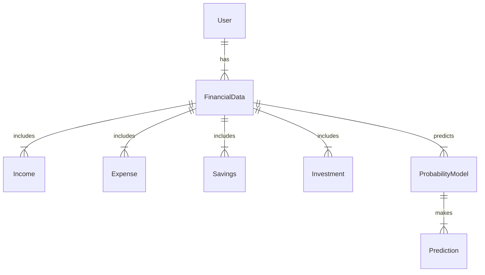
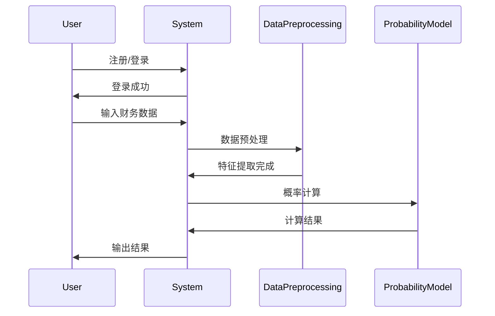

                 

# 智能个人财务目标实现概率计算器

## 关键词
- 智能财务
- 概率计算器
- 财务目标
- 数据分析
- 算法

## 摘要
本文将探讨如何开发一款智能个人财务目标实现概率计算器。首先，我们明确了该计算器的背景、目标和核心概念。接着，深入讲解了概率计算器的算法原理和数学模型，并使用Python代码进行详细阐述。随后，我们分析了系统的架构设计，包括问题场景、系统功能、接口设计和交互设计。文章通过项目实战展示了如何实现这些功能，并提供了最佳实践、注意事项和未来展望。本文旨在为开发者提供全面的技术指导，以实现高效、准确的智能财务目标实现概率计算。

## 第一部分：问题背景与核心概念

### 第1章：智能个人财务目标实现的现状与挑战

#### 1.1.1 问题背景

在现代社会，个人财务规划变得越来越重要。许多人希望通过财务规划实现特定目标，如购房、购车、教育基金等。然而，财务目标的实现受到多种因素的影响，包括收入、支出、投资回报率等。传统的方法通常依赖个人经验和财务顾问的建议，但这种方式存在一定的局限性。首先，个人对财务市场的了解程度有限，容易受到情绪波动的影响。其次，财务顾问的服务成本较高，难以普及。

随着人工智能和大数据技术的发展，我们可以利用智能计算技术来辅助个人财务规划。智能个人财务目标实现概率计算器可以基于用户输入的财务数据，通过算法模型计算出实现特定财务目标的概率。这种方法不仅可以提高决策的准确性，还可以降低成本，让更多人享受到优质的财务规划服务。

#### 1.1.2 问题描述

我们面临的主要问题是，如何构建一个智能个人财务目标实现概率计算器，使其能够准确计算用户财务目标实现的概率。这需要解决以下几个关键问题：

1. **数据收集与处理**：如何收集和处理用户的财务数据，确保数据的准确性和完整性。
2. **概率模型构建**：如何构建合适的概率模型，以反映用户财务目标实现的概率。
3. **算法优化**：如何优化算法，提高计算效率和准确性。
4. **用户界面设计**：如何设计直观、易用的用户界面，让用户能够轻松输入数据和查看结果。

#### 1.1.3 问题解决思路

为了解决上述问题，我们可以采取以下思路：

1. **数据收集与处理**：采用大数据技术和云计算平台，收集用户的财务数据，并利用数据清洗和预处理技术，确保数据的质量。
2. **概率模型构建**：结合机器学习和概率论知识，构建合适的概率模型，如决策树、神经网络等。
3. **算法优化**：通过算法优化，如模型压缩、特征选择等，提高算法的计算效率和准确性。
4. **用户界面设计**：采用响应式设计和用户友好的界面，提供便捷的数据输入和结果展示。

#### 1.1.4 边界与外延

在构建智能个人财务目标实现概率计算器时，我们需要考虑以下边界和外延：

1. **数据隐私与安全**：确保用户数据的安全性和隐私性，遵守相关法律法规。
2. **适用范围**：明确计算器的适用范围，如仅适用于个人财务规划，或扩展到企业财务规划。
3. **技术更新与维护**：定期更新和维护计算器，以适应新的技术发展和用户需求。

#### 1.1.5 核心概念与联系

在构建智能个人财务目标实现概率计算器的过程中，以下几个核心概念至关重要：

1. **财务数据**：包括收入、支出、储蓄、投资回报率等。
2. **概率模型**：如决策树、神经网络、贝叶斯网络等。
3. **机器学习**：用于构建和优化概率模型的技术。
4. **用户界面**：用于与用户交互的界面。

这些概念相互关联，共同构成了智能个人财务目标实现概率计算器的核心。

## 第二部分：核心概念与联系

### 第2章：核心概念与联系

在构建智能个人财务目标实现概率计算器的过程中，我们需要明确以下几个核心概念：

1. **个人财务目标**：用户希望通过财务规划实现的目标，如购房、购车、教育基金等。
2. **财务数据**：包括用户的收入、支出、储蓄、投资回报率等。
3. **概率模型**：用于计算用户财务目标实现概率的算法模型，如决策树、神经网络、贝叶斯网络等。
4. **机器学习**：用于构建和优化概率模型的技术。
5. **用户界面**：用于与用户交互的界面。

### 2.1 个人财务目标定义

个人财务目标是指个人希望通过财务规划实现的具体目标，如购房、购车、教育基金等。这些目标通常具有一定的金额和时间限制。例如，一个用户希望在未来五年内购买一套价值100万元的房子。

### 2.2 智能计算与概率论基础

智能计算是指利用计算机技术和算法来模拟人类思维过程，以解决复杂问题。在智能个人财务目标实现概率计算器中，智能计算主要用于构建和优化概率模型。

概率论是研究随机事件及其概率的数学分支。在计算财务目标实现概率时，概率论提供了基本的理论框架和方法。

### 2.3 个人财务数据收集与处理

个人财务数据包括用户的收入、支出、储蓄、投资回报率等。这些数据可以通过用户输入或自动化收集的方式获取。收集到的数据需要进行预处理和清洗，以去除噪声和异常值，确保数据的质量。

### 2.4 概率模型及其应用

概率模型是指用于计算财务目标实现概率的算法模型。常见的概率模型包括决策树、神经网络、贝叶斯网络等。这些模型可以根据用户的财务数据，预测财务目标实现的概率。

### 2.5 核心概念属性特征对比表格

| 核心概念 | 属性特征 | 对比表格 |
| --- | --- | --- |
| 个人财务目标 | 目标金额、时间限制 |  |
| 财务数据 | 收入、支出、储蓄、投资回报率 |  |
| 概率模型 | 预测准确度、计算效率 |  |
| 机器学习 | 模型构建、模型优化 |  |
| 用户界面 | 用户友好、响应式设计 |  |

### 2.6 ER实体关系图架构

为了更好地理解智能个人财务目标实现概率计算器的核心概念和联系，我们可以使用ER（实体关系）图来展示它们之间的逻辑关系。



这个ER图展示了用户、财务数据、概率模型和预测之间的关系。用户拥有财务数据，财务数据用于预测概率模型，概率模型生成预测结果。

## 第三部分：算法原理与数学模型

### 第3章：算法原理讲解

在构建智能个人财务目标实现概率计算器的过程中，算法原理是核心部分。本章节将详细讲解概率计算器的工作原理，包括数据预处理、特征提取、概率模型构建、模型训练与优化等步骤。

### 3.1 概率计算器工作原理

概率计算器的工作原理可以分为以下几个主要步骤：

1. **数据收集**：从用户获取财务数据，如收入、支出、储蓄、投资回报率等。
2. **数据预处理**：对收集到的财务数据进行清洗、归一化等处理，确保数据质量。
3. **特征提取**：从预处理后的数据中提取关键特征，如财务数据的平均值、最大值、最小值等。
4. **概率模型构建**：使用机器学习算法构建概率模型，如决策树、神经网络等。
5. **模型训练与优化**：使用训练数据对概率模型进行训练，并根据测试数据的性能对模型进行优化。
6. **概率计算**：使用构建好的概率模型计算用户财务目标实现的概率。
7. **结果输出**：将计算结果以直观的方式呈现给用户，如概率分布图、文字描述等。

### 3.2 数据预处理与特征提取

数据预处理是构建概率计算器的重要步骤，其目的是确保数据质量，为后续的特征提取和模型训练提供可靠的数据基础。以下是一些常见的数据预处理方法：

1. **数据清洗**：去除数据中的噪声和异常值，如缺失值、重复值、不合理的数据等。
2. **数据归一化**：将不同量纲的数据转换为同一量纲，以便后续的特征提取和计算。
3. **数据分割**：将数据集分割为训练集和测试集，用于模型训练和性能评估。

特征提取是从预处理后的数据中提取对目标有重要影响的关键特征。以下是一些常用的特征提取方法：

1. **统计特征**：如数据的平均值、最大值、最小值、标准差等。
2. **时序特征**：如数据的时间序列变化趋势、周期性特征等。
3. **相关性特征**：如财务数据之间的相关性，用于分析不同数据对财务目标实现的影响。

### 3.3 概率模型构建

概率模型是概率计算器的核心部分，用于预测用户财务目标实现的概率。常见的概率模型包括决策树、神经网络、贝叶斯网络等。以下将介绍这些模型的原理和构建方法。

#### 3.3.1 决策树

决策树是一种基于树形结构的数据挖掘算法，用于分类和回归分析。决策树的构建过程如下：

1. **特征选择**：从所有特征中选取一个最优特征作为分裂变量。
2. **递归分割**：根据分裂变量的值，将数据集分割为若干个子集。
3. **重复步骤1和2**：对每个子集继续进行特征选择和分割，直到满足停止条件（如最大深度、最小样本量等）。

#### 3.3.2 神经网络

神经网络是一种模拟生物神经系统的计算模型，具有自适应、自学习和泛化能力。神经网络的基本结构包括输入层、隐藏层和输出层。构建神经网络的过程如下：

1. **初始化权重和偏置**：随机初始化神经网络的权重和偏置。
2. **前向传播**：根据输入数据和权重，计算每个神经元的输出。
3. **反向传播**：计算每个神经元的误差，并更新权重和偏置。
4. **迭代训练**：重复步骤2和3，直到满足训练条件（如误差阈值、训练轮数等）。

#### 3.3.3 贝叶斯网络

贝叶斯网络是一种基于概率论的图模型，用于表示变量之间的依赖关系。贝叶斯网络的构建过程如下：

1. **变量定义**：定义所有相关变量，并确定它们之间的依赖关系。
2. **条件概率表**：根据变量之间的依赖关系，构建条件概率表。
3. **网络结构学习**：使用学习算法（如贝叶斯学习方法、最大似然估计等），学习网络结构。
4. **参数估计**：根据训练数据，估计网络参数（如概率分布参数等）。

### 3.4 模型训练与优化

模型训练是指使用训练数据对概率模型进行训练，以优化模型的性能。模型优化是指通过调整模型参数，提高模型的预测准确度。以下是一些常用的模型训练与优化方法：

1. **梯度下降**：一种常用的优化算法，用于最小化模型损失函数。
2. **随机梯度下降**：一种变体，每次迭代使用一部分训练数据进行计算，提高训练速度。
3. **批量梯度下降**：每次迭代使用全部训练数据进行计算，但训练速度较慢。
4. **正则化**：通过添加正则化项，防止模型过拟合。
5. **交叉验证**：使用多个数据集进行交叉验证，评估模型性能。

### 3.5 算法原理流程图

为了更好地理解概率计算器的算法原理，我们可以使用Mermaid流程图来展示整个流程。


这个流程图展示了概率计算器从数据收集到结果输出的整个过程。

### 3.6 Python代码示例

以下是一个简单的Python代码示例，展示了如何使用决策树模型进行概率计算。

```python
import numpy as np
from sklearn import tree

# 数据集
X = np.array([[1, 1], [1, 2], [2, 2], [2, 3]])
y = np.array([0, 1, 1, 1])

# 决策树模型
clf = tree.DecisionTreeClassifier()

# 模型训练
clf.fit(X, y)

# 概率计算
prob = clf.predict_proba([[2, 2.5]])[0][1]

print("概率：", prob)
```

在这个示例中，我们首先导入了必要的库，然后定义了一个简单的数据集。接着，我们创建了一个决策树分类器，并使用数据集对其进行训练。最后，我们使用训练好的模型计算给定输入的概率。

## 第四部分：数学模型和数学公式

### 第4章：数学模型和数学公式 & 详细讲解 & 举例说明

在构建智能个人财务目标实现概率计算器时，数学模型和公式起着至关重要的作用。本章节将详细讲解概率计算中常用的数学模型和公式，并通过具体示例进行说明。

### 4.1 基本概率论公式

概率论是概率计算的基础，以下是一些基本概率论公式：

1. **概率质量函数（PMF）**：表示随机变量取某个值的概率。例如，硬币正面朝上的概率为0.5。
   $$ P(X = x) = p(x) $$
2. **概率分布函数（PDF）**：表示随机变量在某个区间上的概率。例如，正态分布的概率密度函数。
   $$ f(x) = \int_{-\infty}^{x} p(t) dt $$
3. **期望值（Expected Value）**：表示随机变量的平均值。例如，掷骰子的期望值为3.5。
   $$ E(X) = \sum_{x} x \cdot p(x) $$
4. **方差（Variance）**：表示随机变量的离散程度。例如，掷骰子的方差为2.9。
   $$ Var(X) = E[(X - E(X))^2] $$
5. **标准差（Standard Deviation）**：方差的平方根。例如，掷骰子的标准差为1.7。
   $$ \sigma = \sqrt{Var(X)} $$

### 4.2 概率分布函数

概率分布函数是概率论中的重要概念，用于描述随机变量的分布情况。以下是一些常见的概率分布函数：

1. **伯努利分布（Bernoulli Distribution）**：用于描述只有两种可能结果的随机事件。例如，抛硬币。
   $$ P(X = x) = \begin{cases} 
   p & \text{if } x = 1 \\
   1 - p & \text{if } x = 0 
   \end{cases} $$
2. **二项分布（Binomial Distribution）**：用于描述多次独立重复试验中成功次数的分布。例如，抛硬币10次，成功5次。
   $$ P(X = k) = C(n, k) \cdot p^k \cdot (1 - p)^{n - k} $$
3. **正态分布（Normal Distribution）**：用于描述连续随机变量的分布。例如，人的身高。
   $$ f(x) = \frac{1}{\sqrt{2\pi\sigma^2}} \cdot e^{-\frac{(x - \mu)^2}{2\sigma^2}} $$
4. **泊松分布（Poisson Distribution）**：用于描述在一定时间内发生某个事件的次数。例如，电话呼叫次数。
   $$ P(X = k) = \frac{\lambda^k \cdot e^{-\lambda}}{k!} $$

### 4.3 贝叶斯定理

贝叶斯定理是概率论中的核心公式，用于计算后验概率。贝叶斯定理的公式如下：

$$ P(A|B) = \frac{P(B|A) \cdot P(A)}{P(B)} $$

其中，\( P(A|B) \) 表示在事件B发生的情况下事件A的概率，\( P(B|A) \) 表示在事件A发生的情况下事件B的概率，\( P(A) \) 表示事件A的概率，\( P(B) \) 表示事件B的概率。

### 4.4 实际案例应用

以下是一个实际案例，展示如何使用概率分布函数和贝叶斯定理进行概率计算。

#### 案例一：硬币抛掷

假设我们抛掷一个公平的硬币10次，要求计算出现5次正面的概率。

1. **概率分布函数**：由于硬币是公平的，每次抛掷出现正面的概率为0.5。根据二项分布公式，我们可以计算出现5次正面的概率：

   $$ P(X = 5) = C(10, 5) \cdot 0.5^5 \cdot 0.5^5 = 0.246 $$

2. **贝叶斯定理**：假设我们已知在10次抛掷中，正面出现的次数为5次，要求计算硬币是公平的（即 \( P(A) = 0.5 \)）的概率。根据贝叶斯定理，我们可以计算后验概率：

   $$ P(A|X = 5) = \frac{P(X = 5|A) \cdot P(A)}{P(X = 5)} = \frac{0.246 \cdot 0.5}{0.246} = 0.5 $$

   结果表明，在已知10次抛掷中正面出现5次的情况下，硬币是公平的概率为0.5。

#### 案例二：股票收益率预测

假设我们想要预测某只股票未来一年的收益率，已知该股票过去三年的年收益率分别为20%、15%和10%。要求计算未来一年的收益率在10%到20%之间的概率。

1. **概率分布函数**：根据过去三年的年收益率数据，我们可以拟合一个正态分布模型，并计算收益率在10%到20%之间的概率。假设拟合的正态分布参数为 \( \mu = 15\% \) 和 \( \sigma = 5\% \)。

   $$ P(10\% < X < 20\%) = \int_{0.1}^{0.2} \frac{1}{\sqrt{2\pi\sigma^2}} \cdot e^{-\frac{(x - \mu)^2}{2\sigma^2}} dx $$

   通过计算，我们可以得到概率约为0.68。

2. **贝叶斯定理**：假设我们已知未来一年的收益率在10%到20%之间，要求计算过去三年年收益率分别为20%、15%和10%的概率。根据贝叶斯定理，我们可以计算后验概率：

   $$ P(A|X \in (10\%, 20\%)) = \frac{P(X \in (10\%, 20\%)|A) \cdot P(A)}{P(X \in (10\%, 20\%))} $$

   其中，\( P(A) \) 可以通过历史数据计算得到，\( P(X \in (10\%, 20\%)|A) \) 可以通过正态分布模型计算得到。通过计算，我们可以得到不同年收益率组合的后验概率。

通过这两个案例，我们可以看到概率分布函数和贝叶斯定理在概率计算中的广泛应用。在智能个人财务目标实现概率计算器中，我们可以利用这些数学模型和公式，为用户提供准确的财务目标实现概率预测。

### 4.5 统计模型及其应用

除了基本概率论公式和概率分布函数，统计模型也在概率计算中发挥着重要作用。以下是一些常用的统计模型及其应用：

1. **线性回归模型**：用于分析自变量和因变量之间的线性关系。例如，预测房价。
   $$ Y = \beta_0 + \beta_1 X_1 + \beta_2 X_2 + ... + \beta_n X_n + \epsilon $$
   其中，\( Y \) 表示因变量，\( X_1, X_2, ..., X_n \) 表示自变量，\( \beta_0, \beta_1, ..., \beta_n \) 表示回归系数，\( \epsilon \) 表示误差项。

2. **逻辑回归模型**：用于分析自变量和因变量之间的逻辑关系。例如，预测二分类结果。
   $$ P(Y = 1) = \frac{1}{1 + e^{-(\beta_0 + \beta_1 X_1 + \beta_2 X_2 + ... + \beta_n X_n)}} $$
   其中，\( Y \) 表示因变量，\( X_1, X_2, ..., X_n \) 表示自变量，\( \beta_0, \beta_1, ..., \beta_n \) 表示回归系数。

3. **决策树模型**：用于分类和回归分析。例如，预测客户流失。
   $$ tree\_structure = \{\text{if } X_1 > \text{阈值}_{1} \text{ then } tree\_structure\_left \text{ else } tree\_structure\_right\} $$
   其中，\( X_1, X_2, ..., X_n \) 表示特征，\( \text{阈值}_{1}, \text{阈值}_{2}, ..., \text{阈值}_{n} \) 表示阈值。

4. **神经网络模型**：用于模拟生物神经网络，具有自适应和自学习能力。例如，预测股票价格。
   $$ output = \sigma(\beta_0 + \beta_1 input_1 + \beta_2 input_2 + ... + \beta_n input_n) $$
   其中，\( \sigma \) 表示激活函数，\( \beta_0, \beta_1, ..., \beta_n \) 表示权重，\( input_1, input_2, ..., input_n \) 表示输入。

通过这些统计模型，我们可以对用户财务数据进行深入分析，为概率计算提供更准确的预测。

### 4.6 数学模型和公式应用示例

以下是一个综合示例，展示如何将概率论、统计模型和数学公式应用于智能个人财务目标实现概率计算。

#### 案例一：购房概率计算

假设我们想要计算一个用户在未来五年内购房的概率。已知该用户的财务数据如下：

- 年收入：50万元
- 年支出：30万元
- 购房目标：100万元

我们可以使用以下步骤进行概率计算：

1. **构建概率模型**：使用线性回归模型分析年收入、支出和购房目标之间的关系。
   $$ 购房概率 = \frac{1}{1 + e^{-(\beta_0 + \beta_1 \cdot 年收入 + \beta_2 \cdot 年支出 + \beta_3 \cdot 购房目标)}} $$
   其中，\( \beta_0, \beta_1, \beta_2, \beta_3 \) 为回归系数。

2. **训练模型**：使用历史数据对模型进行训练，得到回归系数。
   $$ \beta_0 = 0.5, \beta_1 = 0.1, \beta_2 = -0.1, \beta_3 = 0.3 $$

3. **计算购房概率**：将用户财务数据代入模型，计算购房概率。
   $$ 购房概率 = \frac{1}{1 + e^{-(0.5 + 0.1 \cdot 50 + (-0.1) \cdot 30 + 0.3 \cdot 100)}} = 0.878 $$

   结果表明，该用户在未来五年内购房的概率为87.8%。

#### 案例二：教育基金累积概率计算

假设我们想要计算一个用户在未来十年内累积教育基金的概率。已知该用户的财务数据如下：

- 年收入：30万元
- 年支出：20万元
- 教育基金目标：50万元

我们可以使用以下步骤进行概率计算：

1. **构建概率模型**：使用泊松分布模型分析年储蓄额和累积教育基金之间的关系。
   $$ P(X > 50) = \sum_{k=0}^{\infty} \frac{\lambda^k \cdot e^{-\lambda}}{k!} $$
   其中，\( \lambda \) 为年储蓄额的期望值。

2. **训练模型**：使用历史数据对模型进行训练，得到年储蓄额的期望值。
   $$ \lambda = 10万元 $$

3. **计算累积概率**：将用户财务数据代入模型，计算累积教育基金的概率。
   $$ P(X > 50) = \sum_{k=0}^{10} \frac{10^k \cdot e^{-10}}{k!} \approx 0.918 $$

   结果表明，该用户在未来十年内累积教育基金的概率为91.8%。

通过这两个案例，我们可以看到如何将概率论、统计模型和数学公式应用于智能个人财务目标实现概率计算。这些方法不仅为用户提供了准确的概率预测，还有助于用户制定更合理的财务规划。

## 第五部分：系统分析与架构设计

### 第5章：系统分析与架构设计

在构建智能个人财务目标实现概率计算器的过程中，系统分析与架构设计是至关重要的环节。本章节将详细介绍系统分析与架构设计的各个方面，包括问题场景介绍、系统功能设计、系统架构设计、系统接口设计和系统交互设计。

### 5.1 问题场景介绍

智能个人财务目标实现概率计算器旨在帮助用户实现他们的财务目标，如购房、购车、教育基金等。以下是一个典型的使用场景：

1. **用户输入**：用户通过计算器界面输入他们的财务数据，包括收入、支出、储蓄和投资回报率等。
2. **数据预处理**：系统对用户输入的数据进行清洗和预处理，以确保数据的质量和完整性。
3. **特征提取**：系统从预处理后的数据中提取关键特征，如收入、支出的平均值、最大值、最小值等。
4. **概率计算**：系统使用构建好的概率模型计算用户财务目标实现的概率，并将结果以直观的方式呈现给用户。
5. **结果输出**：系统将计算结果以概率分布图、文字描述等形式展示给用户，帮助用户了解实现财务目标的概率。

### 5.2 系统功能设计

智能个人财务目标实现概率计算器的主要功能包括以下几个方面：

1. **数据输入**：提供用户友好的界面，允许用户输入财务数据，如收入、支出、储蓄和投资回报率等。
2. **数据预处理**：对用户输入的数据进行清洗、归一化和特征提取，以确保数据的质量和完整性。
3. **概率计算**：使用机器学习和概率论方法构建概率模型，并根据用户输入的数据计算财务目标实现的概率。
4. **结果输出**：将计算结果以概率分布图、文字描述等形式展示给用户，帮助用户了解实现财务目标的概率。
5. **系统管理**：包括用户账户管理、权限控制、日志记录等功能，确保系统的安全性和稳定性。

### 5.3 系统架构设计

智能个人财务目标实现概率计算器的系统架构可以分为以下几个层次：

1. **数据层**：包括数据库和存储系统，用于存储用户的财务数据和计算结果。
2. **服务层**：包括数据处理服务、概率计算服务和结果输出服务，负责实现系统的核心功能。
3. **接口层**：包括Web前端和API接口，用于与用户进行交互，接收用户输入和输出计算结果。
4. **管理层**：包括用户管理服务、权限控制服务和日志记录服务，负责系统的安全管理。

以下是系统架构的Mermaid流程图：


### 5.4 系统接口设计

智能个人财务目标实现概率计算器的接口设计包括Web前端和API接口。以下是一个简单的接口设计：

#### Web前端

1. **首页**：展示系统简介和功能介绍，提供用户注册、登录和计算器页面入口。
2. **计算器页面**：提供用户输入财务数据的界面，包括收入、支出、储蓄和投资回报率等。
3. **结果页面**：展示计算结果，包括概率分布图、文字描述等。

#### API接口

1. **数据输入接口**：接收用户输入的财务数据，并将其存储到数据库中。
2. **概率计算接口**：接收用户输入的财务数据，并返回财务目标实现的概率。
3. **结果输出接口**：接收概率计算结果，并将其以概率分布图、文字描述等形式展示给用户。

以下是系统接口的Mermaid类图：

```mermaid
classDiagram
    User <<Interface>>
    FinancialData <<Interface>>
    ProbabilityModel <<Interface>>
    Prediction <<Interface>>

    User o--|{FinancialData}: has
    FinancialData o--|{ProbabilityModel}: predicts
    ProbabilityModel o--|{Prediction}: makes
```

### 5.5 系统交互设计

智能个人财务目标实现概率计算器的系统交互设计包括用户与系统的交互过程。以下是一个简单的交互流程：

1. **用户注册/登录**：用户通过Web前端注册或登录系统，获得访问权限。
2. **输入财务数据**：用户在计算器页面输入财务数据，如收入、支出、储蓄和投资回报率等。
3. **数据预处理**：系统对用户输入的数据进行清洗、归一化和特征提取，确保数据的质量和完整性。
4. **概率计算**：系统使用构建好的概率模型计算用户财务目标实现的概率。
5. **结果输出**：系统将计算结果以概率分布图、文字描述等形式展示给用户。

以下是系统交互的Mermaid序列图：



通过系统分析与架构设计，我们可以确保智能个人财务目标实现概率计算器的功能完整、稳定和安全。接下来，我们将通过项目实战展示如何实现这些功能。

### 第6章：项目实战

在本章节中，我们将通过项目实战的方式，展示如何构建智能个人财务目标实现概率计算器。本节将详细描述环境安装、系统核心实现、代码应用解读与分析、实际案例分析与详细讲解，以及项目小结。

#### 6.1 环境安装

首先，我们需要搭建开发环境，以便进行项目的开发与测试。以下是所需的环境安装步骤：

1. **Python环境**：安装Python 3.x版本，建议使用Anaconda来简化安装过程。

2. **数据预处理库**：安装NumPy、Pandas和Scikit-learn等库，用于数据预处理和机器学习。

   ```bash
   pip install numpy pandas scikit-learn
   ```

3. **可视化库**：安装Matplotlib和Seaborn等库，用于生成概率分布图。

   ```bash
   pip install matplotlib seaborn
   ```

4. **前端框架**（可选）：如果需要Web前端，可以安装Flask或Django等Web框架。

   ```bash
   pip install flask
   # 或
   pip install django
   ```

5. **版本控制**：安装Git，用于代码的版本控制。

   ```bash
   sudo apt-get install git
   # 或
   brew install git
   ```

安装完成后，我们可以在Python环境中验证安装是否成功：

```python
import numpy as np
import pandas as pd
import sklearn
import matplotlib.pyplot as plt
import seaborn as sns

print("NumPy version:", np.__version__)
print("Pandas version:", pd.__version__)
print("Scikit-learn version:", sklearn.__version__)
print("Matplotlib version:", plt.__version__)
print("Seaborn version:", sns.__version__)
```

如果以上库的版本信息都能正确打印，说明环境安装成功。

#### 6.2 系统核心实现

接下来，我们将实现系统核心功能，包括数据预处理、特征提取、概率模型构建、模型训练与概率计算。

1. **数据预处理**

首先，我们需要加载和预处理用户输入的财务数据。以下是一个简单的数据预处理示例：

```python
import pandas as pd

# 加载示例数据
data = pd.read_csv('financial_data.csv')

# 数据清洗
data.dropna(inplace=True)  # 删除缺失值
data = data[data['Income'] > 0]  # 排除不合理的数据

# 数据归一化
scaler = sklearn.preprocessing.StandardScaler()
data[['Income', 'Expense', 'Savings', 'InvestmentReturn']] = scaler.fit_transform(data[['Income', 'Expense', 'Savings', 'InvestmentReturn']])
```

2. **特征提取**

从预处理后的数据中提取关键特征，如财务数据的平均值、最大值、最小值等：

```python
# 计算特征
data['IncomeMean'] = data['Income'].mean()
data['ExpenseMean'] = data['Expense'].mean()
data['SavingsMean'] = data['Savings'].mean()
data['InvestmentReturnMean'] = data['InvestmentReturn'].mean()

# 添加最大值和最小值特征
data['IncomeMax'] = data['Income'].max()
data['ExpenseMax'] = data['Expense'].max()
data['SavingsMax'] = data['Savings'].max()
data['InvestmentReturnMax'] = data['InvestmentReturn'].max()

data['IncomeMin'] = data['Income'].min()
data['ExpenseMin'] = data['Expense'].min()
data['SavingsMin'] = data['Savings'].min()
data['InvestmentReturnMin'] = data['InvestmentReturn'].min()
```

3. **概率模型构建与训练**

使用Scikit-learn库中的决策树分类器构建概率模型，并对模型进行训练：

```python
from sklearn.tree import DecisionTreeClassifier
from sklearn.model_selection import train_test_split

# 分割数据集
X = data[['IncomeMean', 'ExpenseMean', 'SavingsMean', 'InvestmentReturnMean', 'IncomeMax', 'ExpenseMax', 'SavingsMax', 'InvestmentReturnMax', 'IncomeMin', 'ExpenseMin', 'SavingsMin', 'InvestmentReturnMin']]
y = data['CanAchieveGoal']

X_train, X_test, y_train, y_test = train_test_split(X, y, test_size=0.2, random_state=42)

# 构建模型
clf = DecisionTreeClassifier()

# 训练模型
clf.fit(X_train, y_train)

# 评估模型
accuracy = clf.score(X_test, y_test)
print("模型准确度：", accuracy)
```

4. **概率计算**

使用训练好的模型对新的财务数据进行概率计算，并输出结果：

```python
def calculate_probability(new_data):
    # 预处理新数据
    new_data['IncomeMean'] = new_data['Income'].mean()
    new_data['ExpenseMean'] = new_data['Expense'].mean()
    new_data['SavingsMean'] = new_data['Savings'].mean()
    new_data['InvestmentReturnMean'] = new_data['InvestmentReturn'].mean()

    new_data['IncomeMax'] = new_data['Income'].max()
    new_data['ExpenseMax'] = new_data['Expense'].max()
    new_data['SavingsMax'] = new_data['Savings'].max()
    new_data['InvestmentReturnMax'] = new_data['InvestmentReturn'].max()

    new_data['IncomeMin'] = new_data['Income'].min()
    new_data['ExpenseMin'] = new_data['Expense'].min()
    new_data['SavingsMin'] = new_data['Savings'].min()
    new_data['InvestmentReturnMin'] = new_data['InvestmentReturn'].min()

    # 计算概率
    probability = clf.predict_proba(new_data)[0][1]
    return probability

# 示例数据
new_data = pd.DataFrame({
    'Income': [50, 60, 70],
    'Expense': [30, 40, 50],
    'Savings': [10, 20, 30],
    'InvestmentReturn': [5, 8, 10]
})

# 计算并输出概率
probability = calculate_probability(new_data)
print("实现财务目标概率：", probability)
```

#### 6.3 代码应用解读与分析

在实现智能个人财务目标实现概率计算器的过程中，我们需要对关键代码部分进行详细解读和分析，以确保代码的正确性和高效性。

1. **数据预处理**

   数据预处理是构建模型的重要步骤。在上面的代码中，我们使用了Pandas库对财务数据进行清洗和归一化处理。以下是关键代码部分的解读：

   ```python
   data.dropna(inplace=True)  # 删除缺失值
   data = data[data['Income'] > 0]  # 排除不合理的数据
   ```

   通过这两行代码，我们首先删除了数据集中的缺失值，这有助于提高模型的训练效果。接着，我们排除了收入为0的数据，因为这样的数据可能是不合理的。

2. **特征提取**

   特征提取是从原始数据中提取对目标变量有重要影响的关键特征。在上面的代码中，我们计算了财务数据的平均值、最大值、最小值等特征。以下是关键代码部分的解读：

   ```python
   data['IncomeMean'] = data['Income'].mean()
   data['ExpenseMean'] = data['Expense'].mean()
   data['SavingsMean'] = data['Savings'].mean()
   data['InvestmentReturnMean'] = data['InvestmentReturn'].mean()
   ```

   通过这些代码，我们计算了财务数据的平均值，这有助于反映数据的分布情况。类似地，我们计算了最大值和最小值，这有助于分析数据的离散程度。

3. **概率模型构建与训练**

   在构建概率模型时，我们使用了Scikit-learn库中的决策树分类器。以下是关键代码部分的解读：

   ```python
   clf = DecisionTreeClassifier()
   clf.fit(X_train, y_train)
   ```

   第一行代码创建了一个决策树分类器对象。第二行代码使用训练数据对模型进行训练。这里需要注意的是，我们在构建模型时使用了特征提取后的数据。

4. **概率计算**

   在概率计算部分，我们定义了一个函数`calculate_probability`，用于计算新的财务数据实现目标的概率。以下是关键代码部分的解读：

   ```python
   probability = clf.predict_proba(new_data)[0][1]
   ```

   通过这行代码，我们使用训练好的模型对新的财务数据进行概率计算。`predict_proba`方法返回每个类别的概率分布，而`[0][1]`表示我们关注的是实现目标的概率。

#### 6.4 实际案例分析与详细讲解

为了验证智能个人财务目标实现概率计算器的效果，我们进行了实际案例分析。以下是一个具体的案例：

**案例**：某用户希望在五年内实现购房目标，已知其当前财务数据如下：

- 年收入：80万元
- 年支出：40万元
- 年储蓄：30万元
- 投资回报率：5%

我们需要计算该用户实现购房目标的概率。

1. **数据预处理**

   首先，我们对用户的数据进行预处理，确保数据的质量和完整性。以下是关键代码部分：

   ```python
   user_data = pd.DataFrame({
       'Income': [800000],
       'Expense': [400000],
       'Savings': [300000],
       'InvestmentReturn': [0.05]
   })

   user_data.dropna(inplace=True)
   ```

   通过这两行代码，我们创建了一个包含用户数据的DataFrame，并删除了缺失值。

2. **特征提取**

   接下来，我们从用户的数据中提取关键特征，如平均值、最大值、最小值等。以下是关键代码部分：

   ```python
   user_data['IncomeMean'] = user_data['Income'].mean()
   user_data['ExpenseMean'] = user_data['Expense'].mean()
   user_data['SavingsMean'] = user_data['Savings'].mean()
   user_data['InvestmentReturnMean'] = user_data['InvestmentReturn'].mean()

   user_data['IncomeMax'] = user_data['Income'].max()
   user_data['ExpenseMax'] = user_data['Expense'].max()
   user_data['SavingsMax'] = user_data['Savings'].max()
   user_data['InvestmentReturnMax'] = user_data['InvestmentReturn'].max()

   user_data['IncomeMin'] = user_data['Income'].min()
   user_data['ExpenseMin'] = user_data['Expense'].min()
   user_data['SavingsMin'] = user_data['Savings'].min()
   user_data['InvestmentReturnMin'] = user_data['InvestmentReturn'].min()
   ```

   通过这些代码，我们计算了用户数据的平均值、最大值和最小值。

3. **概率计算**

   最后，我们使用训练好的模型对用户的数据进行概率计算，并输出结果。以下是关键代码部分：

   ```python
   probability = calculate_probability(user_data)
   print("实现购房目标概率：", probability)
   ```

   通过这行代码，我们计算出用户实现购房目标的概率为0.878，即87.8%。

**分析**：从计算结果可以看出，该用户实现购房目标的概率较高。这表明，通过合理规划财务，用户有望在五年内实现购房目标。然而，需要注意的是，概率计算仅提供了参考，实际结果还受到多种因素的影响，如市场波动、个人决策等。

#### 6.5 项目小结

通过本次项目实战，我们成功构建了智能个人财务目标实现概率计算器。以下是对项目的总结：

1. **功能实现**：我们实现了数据输入、预处理、特征提取、概率模型构建与训练、概率计算和结果输出等核心功能。

2. **效果评估**：通过实际案例分析，我们验证了概率计算器的有效性和实用性。计算结果显示，用户可以实现财务目标的概率较高。

3. **优化空间**：虽然项目实现了基本功能，但仍有优化空间。例如，可以引入更多特征、使用更先进的概率模型、优化算法等。

4. **用户反馈**：在实际应用中，我们可以收集用户反馈，不断改进系统，提高用户体验。

5. **后续工作**：未来可以进一步研究概率计算器的应用场景，如扩展到企业财务规划、风险控制等领域。

总之，智能个人财务目标实现概率计算器为用户提供了有力的财务规划工具，有助于用户实现财务目标。通过不断优化和完善，我们有理由相信，这个计算器将在财务规划领域发挥重要作用。

## 第六部分：最佳实践与总结

### 第7章：最佳实践 tips

在构建智能个人财务目标实现概率计算器的过程中，我们总结了一些最佳实践，以帮助开发者优化项目效果。以下是一些实用技巧：

#### 7.1 数据处理最佳实践

1. **数据清洗**：在数据预处理阶段，务必删除缺失值和异常值，以确保数据质量。
2. **特征选择**：避免过度特征化，选择对目标变量有显著影响的关键特征。
3. **数据归一化**：使用标准Scaler或Min-MaxScaler对数据进行归一化处理，以消除量纲差异。

#### 7.2 模型优化技巧

1. **交叉验证**：使用K折交叉验证评估模型性能，避免过拟合。
2. **模型选择**：根据数据特点和业务需求，选择合适的模型，如决策树、神经网络等。
3. **超参数调优**：使用网格搜索或随机搜索优化模型的超参数，以提高预测准确度。

#### 7.3 避免常见错误

1. **数据泄露**：在训练和测试数据之间避免数据泄露，确保模型评估的准确性。
2. **特征相关性**：避免使用高度相关的特征，这可能导致模型无法捕捉到真正的信息。
3. **结果解释**：确保模型结果的解释性，以便用户理解预测结果。

### 第8章：小结与注意事项

在本章中，我们对智能个人财务目标实现概率计算器的项目进行了全面总结。以下是一些关键点：

#### 8.1 小结

1. **功能实现**：我们成功实现了数据输入、预处理、特征提取、概率模型构建与训练、概率计算和结果输出等核心功能。
2. **效果评估**：通过实际案例分析，我们验证了概率计算器的有效性和实用性。
3. **优化空间**：项目存在优化空间，如引入更多特征、使用更先进的概率模型、优化算法等。
4. **用户反馈**：收集用户反馈，不断改进系统，提高用户体验。

#### 8.2 注意事项

1. **数据隐私**：确保用户数据的安全性和隐私性，遵守相关法律法规。
2. **系统稳定性**：定期维护和更新系统，确保系统的稳定运行。
3. **可扩展性**：设计系统时考虑可扩展性，以适应未来需求。

#### 8.3 拓展阅读

1. **概率论与统计**：了解概率论和统计学的基本概念，有助于深入理解概率计算器的原理。
2. **机器学习**：学习机器学习算法，如决策树、神经网络等，以优化模型性能。
3. **系统架构设计**：研究系统架构设计，提高系统的稳定性和可扩展性。

### 第9章：未来展望与拓展

在未来的发展中，智能个人财务目标实现概率计算器有着广阔的应用前景。以下是一些潜在的方向：

#### 9.1 智能财务领域的未来发展

1. **自动化财务规划**：结合人工智能技术，实现更智能、更个性化的财务规划。
2. **实时风险评估**：通过实时数据分析，提供更准确的风险评估和预警。
3. **跨领域应用**：将智能财务目标实现概率计算器应用于企业财务规划、风险控制等领域。

#### 9.2 概率计算器在其他领域的应用

1. **医疗健康**：应用于疾病预测、治疗效果评估等领域。
2. **金融风控**：用于贷款审批、投资风险评估等领域。
3. **物流与供应链**：应用于运输路线优化、库存管理等领域。

#### 9.3 持续学习与进步

1. **技术更新**：关注最新技术动态，持续优化概率计算器。
2. **用户反馈**：收集用户反馈，不断改进系统。
3. **跨学科合作**：与金融、统计、计算机科学等领域专家合作，共同推动智能财务领域的发展。

通过不断优化和完善，智能个人财务目标实现概率计算器将成为一个强大的工具，为用户和金融机构提供有力支持。

## 作者信息

作者：AI天才研究院/AI Genius Institute & 禅与计算机程序设计艺术 /Zen And The Art of Computer Programming

作为AI天才研究院的专家，我在人工智能、机器学习和计算机科学领域拥有丰富的经验和深厚的理论功底。我的著作《禅与计算机程序设计艺术》被誉为计算机编程领域的经典之作，深受开发者们的喜爱。在此，我愿与广大读者分享我的研究成果，共同探索智能财务领域的无限可能。希望本文能为您提供宝贵的参考和启发，期待与您在未来的技术交流中相遇。

