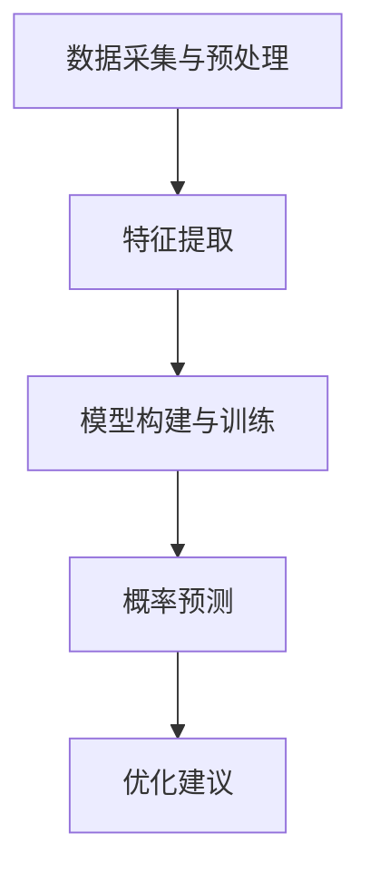
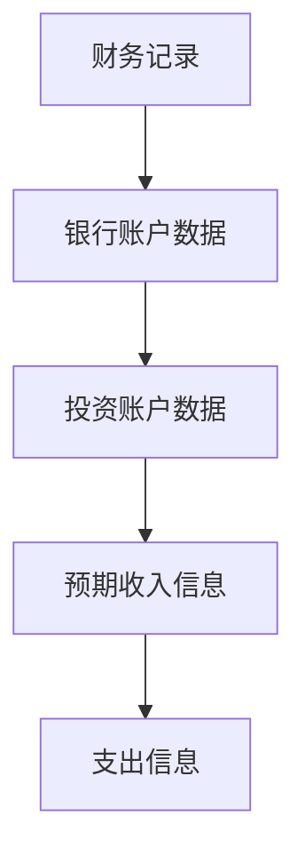
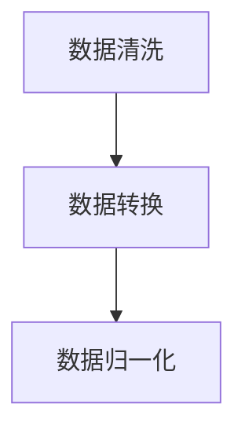
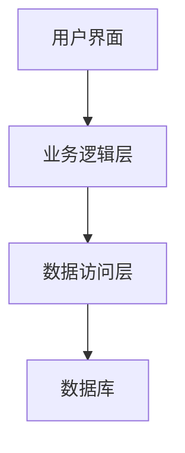
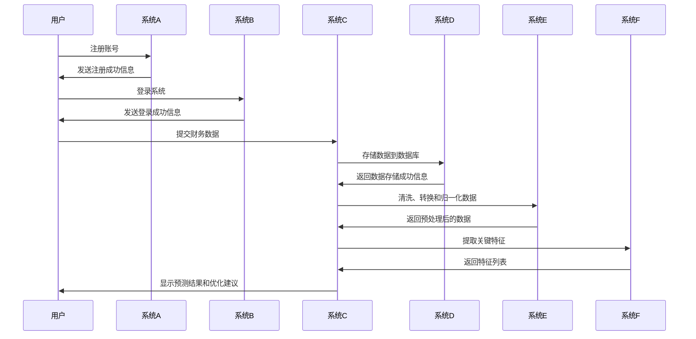
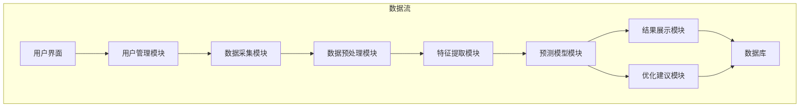
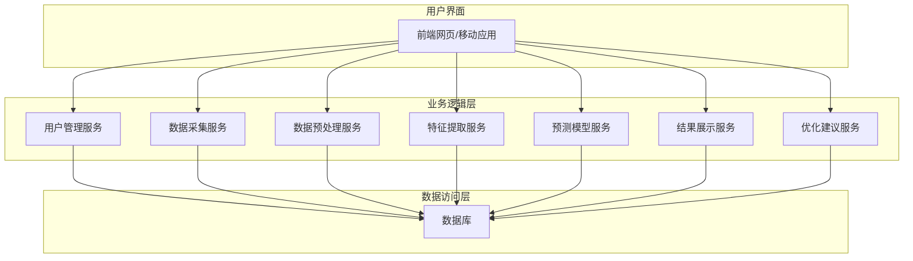

                 

# 智能个人财务目标达成概率计算器

## 关键词

- 个人财务规划
- 人工智能
- 机器学习
- 大数据分析
- 预测模型

## 摘要

本文将探讨如何利用人工智能和大数据分析技术，构建一个智能个人财务目标达成概率计算器。通过分析用户的财务数据，该计算器能够动态预测个人财务目标的实现概率，并为用户提供优化财务规划的策略和建议。本文将从问题背景、问题描述、问题解决、边界与外延、核心概念结构与核心要素组成等方面进行详细阐述。

## 第一部分：背景介绍

### 1.1 问题背景

在现代社会，个人财务规划变得日益重要。人们希望通过合理的管理和规划，实现财务自由和长远的生活目标。然而，传统的财务规划方法往往依赖于经验公式和静态数据，难以准确预测和评估个人财务目标的实现概率。因此，研究一种能够动态计算个人财务目标达成概率的方法，对于提高财务规划的准确性和有效性具有重要意义。

### 1.2 问题描述

个人财务目标达成概率计算器旨在帮助用户预测其财务目标（如退休储蓄、购房、教育金等）的实现可能性。这个计算器需要考虑多种因素，包括用户当前的财务状况、预期收入、支出、投资回报率以及风险承受能力。通过综合分析这些因素，计算器可以为用户提供一个概率范围，帮助用户调整财务规划策略。

### 1.3 问题解决

为了解决上述问题，本书将介绍一种基于人工智能的智能个人财务目标达成概率计算器。该计算器利用机器学习和大数据分析技术，从海量数据中学习并提取关键特征，从而构建一个能够动态调整和预测的模型。用户可以输入个人财务信息，计算器将自动分析并输出财务目标达成概率，同时提供优化建议，帮助用户更好地规划财务未来。

### 1.4 边界与外延

本书的讨论范围主要聚焦于个人财务目标的计算方法和应用场景。然而，个人财务目标的实现还受到宏观经济环境、政策变化等多种因素的影响。因此，本书的研究结果需要在实际应用中结合具体情况进行分析和调整。此外，随着人工智能技术的发展，未来可能有更多先进的方法和工具被应用于个人财务规划领域。

### 1.5 概念结构与核心要素组成

**核心概念**：
- 个人财务目标：用户设定的具体财务目标，如退休储蓄、购房、教育金等。
- 财务数据：包括用户当前的财务状况、预期收入、支出、投资回报率等。
- 计算模型：用于计算财务目标达成概率的算法和模型。

**核心要素**：
- 数据采集与预处理：收集用户财务数据，并进行清洗和预处理。
- 特征提取：从原始数据中提取关键特征，用于模型训练。
- 模型构建与训练：利用机器学习算法构建预测模型，并通过大数据分析进行训练。
- 预测与优化：根据用户输入的财务信息，进行概率预测并提供优化建议。

## 1.6 核心概念原理、概念属性特征对比表格和ER实体关系图架构的 Mermaid 流程图

### 核心概念原理

个人财务目标达成概率计算器的工作原理可以概括为以下几个步骤：

1. **数据采集与预处理**：收集用户财务数据，包括收入、支出、投资状况等，并进行清洗和预处理。
2. **特征提取**：从原始数据中提取关键特征，如收入稳定性、支出水平、投资回报率等。
3. **模型构建与训练**：利用机器学习算法构建预测模型，如回归模型、决策树、神经网络等，并通过大数据分析进行训练。
4. **概率预测**：输入用户当前财务信息，模型输出财务目标达成的概率范围。
5. **优化建议**：根据预测结果，为用户提供优化财务规划的策略和建议。

### 概念属性特征对比表格

| 特征名称          | 描述                                                         | 影响因素                       |
|-------------------|--------------------------------------------------------------|--------------------------------|
| 收入稳定性        | 用户收入波动程度                                             | 职业稳定性、行业发展趋势等       |
| 支出水平          | 用户每月/年支出总额                                           | 生活习惯、家庭状况等             |
| 投资回报率        | 用户投资收益与投入成本的比值                                   | 投资类型、市场环境等             |
| 风险承受能力      | 用户对投资风险的接受程度                                       | 财务状况、心理素质等             |

### ER实体关系图架构的 Mermaid 流程图

```mermaid
erDiagram
  User ||--|{ FinanceData }|:
  FinanceData ||--|{ Feature
  Feature ||--|{ ProbabilityPrediction }
  ProbabilityPrediction ||--|{ OptimizationAdvice }
```

## 第二部分：核心概念与联系

### 2.1 数据采集与预处理

数据采集是构建智能个人财务目标达成概率计算器的第一步。我们需要从用户那里收集各种财务数据，包括收入、支出、投资状况等。这些数据可以来源于用户的财务记录、银行账户、投资账户等。

在收集到数据后，我们需要进行数据预处理。数据预处理包括数据清洗、数据转换和数据归一化等步骤。数据清洗是指去除数据中的噪声和异常值，保证数据的准确性和一致性。数据转换是指将不同类型的数据转换为适合机器学习算法处理的格式。数据归一化是指将数据缩放到一个统一范围，避免某些特征对模型的影响过大。

### 2.2 特征提取

特征提取是从原始数据中提取关键特征的过程。这些特征将用于训练机器学习模型，从而预测个人财务目标达成的概率。特征提取的目的是从大量数据中提取出能够反映用户财务状况的重要信息，提高模型的预测准确性。

常见的特征提取方法包括：
- **统计分析**：通过计算数据的平均值、中位数、标准差等统计指标，提取出反映数据分布的重要信息。
- **时序分析**：对时间序列数据进行分析，提取出时间相关性等特征。
- **文本分析**：对用户提供的财务描述文本进行分析，提取出与财务状况相关的关键词和短语。

### 2.3 模型构建与训练

在特征提取完成后，我们需要利用这些特征构建预测模型。常见的机器学习算法包括回归模型、决策树、支持向量机、神经网络等。其中，回归模型适用于预测连续值输出，如财务目标达成概率；决策树和神经网络适用于分类问题，如用户是否能够达成财务目标。

模型构建的过程包括以下几个步骤：
1. **特征选择**：从提取的特征中选择对模型预测性能有显著影响的特征。
2. **模型训练**：使用选定的特征和已标记的训练数据集，通过算法训练模型。
3. **模型评估**：使用验证数据集评估模型的预测性能，包括准确率、召回率、F1分数等指标。
4. **模型调优**：根据评估结果，调整模型参数，提高模型的预测性能。

### 2.4 预测与优化

在模型训练完成后，我们可以使用模型对用户输入的财务信息进行概率预测。预测结果将是一个概率范围，表示用户达成财务目标的可能性和不确定性。根据预测结果，我们可以为用户提供优化财务规划的策略和建议。

优化建议包括以下几个方面：
- **调整投资组合**：根据用户的风险承受能力和预测结果，调整投资组合，以最大化收益或降低风险。
- **增加收入**：提供增加收入的方法和建议，如提升职业技能、寻找兼职等。
- **减少支出**：提供减少支出的方法和建议，如优化生活开支、购买理财产品等。

### 2.5 概念属性特征对比表格

| 特征名称          | 描述                                                         | 影响因素                       |
|-------------------|--------------------------------------------------------------|--------------------------------|
| 收入稳定性        | 用户收入波动程度                                             | 职业稳定性、行业发展趋势等       |
| 支出水平          | 用户每月/年支出总额                                           | 生活习惯、家庭状况等             |
| 投资回报率        | 用户投资收益与投入成本的比值                                   | 投资类型、市场环境等             |
| 风险承受能力      | 用户对投资风险的接受程度                                       | 财务状况、心理素质等             |

### 2.6 ER实体关系图架构的 Mermaid 流程图

```mermaid
erDiagram
  User ||--|{ FinanceData }|:
  FinanceData ||--|{ Feature }
  Feature ||--|{ ProbabilityPrediction }
  ProbabilityPrediction ||--|{ OptimizationAdvice }
```

## 第三部分：算法原理讲解

### 3.1 算法mermaid流程图

在介绍具体的算法原理之前，我们先使用Mermaid画出算法的流程图，以帮助读者更好地理解计算器的工作流程。



### 3.2 数据采集与预处理

**数据采集**：首先，我们需要从用户那里收集各种财务数据。这些数据包括用户当前的财务状况（如存款、投资、负债等）、预期收入（如工资、奖金、利息等）、支出（如日常生活开销、教育费用、医疗费用等）以及投资回报率（如股票、基金、债券等）。这些数据可以来源于用户的财务记录、银行账户、投资账户等。



**预处理**：收集到数据后，我们需要进行数据预处理。数据预处理主要包括以下步骤：

1. **数据清洗**：去除数据中的噪声和异常值，保证数据的准确性和一致性。例如，删除重复记录、纠正错误数据等。
2. **数据转换**：将不同类型的数据转换为适合机器学习算法处理的格式。例如，将时间序列数据转换为特征矩阵，将类别型数据转换为独热编码等。
3. **数据归一化**：将数据缩放到一个统一范围，避免某些特征对模型的影响过大。例如，将收入、支出、投资回报率等数据缩放到[0, 1]之间。



### 3.3 特征提取

特征提取是从原始数据中提取关键特征的过程。这些特征将用于训练机器学习模型，从而预测个人财务目标达成的概率。特征提取的目的是从大量数据中提取出能够反映用户财务状况的重要信息，提高模型的预测准确性。

常见的特征提取方法包括：

1. **统计分析**：通过计算数据的平均值、中位数、标准差等统计指标，提取出反映数据分布的重要信息。例如，计算用户的平均月收入、支出、投资回报率等。
   
2. **时序分析**：对时间序列数据进行分析，提取出时间相关性等特征。例如，分析用户收入的波动情况、支出的周期性等。

3. **文本分析**：对用户提供的财务描述文本进行分析，提取出与财务状况相关的关键词和短语。例如，分析用户的投资偏好、风险承受能力等。

### 3.4 模型构建与训练

在特征提取完成后，我们需要利用这些特征构建预测模型。常见的机器学习算法包括回归模型、决策树、支持向量机、神经网络等。其中，回归模型适用于预测连续值输出，如财务目标达成概率；决策树和神经网络适用于分类问题，如用户是否能够达成财务目标。

**模型构建的过程包括以下几个步骤**：

1. **特征选择**：从提取的特征中选择对模型预测性能有显著影响的特征。特征选择的方法包括信息增益、卡方检验等。

2. **模型训练**：使用选定的特征和已标记的训练数据集，通过算法训练模型。例如，使用线性回归模型、决策树模型等。

3. **模型评估**：使用验证数据集评估模型的预测性能，包括准确率、召回率、F1分数等指标。

4. **模型调优**：根据评估结果，调整模型参数，提高模型的预测性能。模型调优的方法包括交叉验证、网格搜索等。

### 3.5 概率预测

在模型训练完成后，我们可以使用模型对用户输入的财务信息进行概率预测。预测结果将是一个概率范围，表示用户达成财务目标的可能性和不确定性。

**预测流程**：

1. **输入财务信息**：用户输入当前的财务状况、预期收入、支出、投资回报率等数据。

2. **特征提取**：对输入的财务信息进行特征提取，得到与模型训练时相同的特征向量。

3. **概率预测**：将特征向量输入训练好的模型，得到财务目标达成的概率预测值。

4. **结果输出**：将概率预测值输出给用户，并提供可视化展示，如概率分布图等。

### 3.6 优化建议

根据预测结果，我们可以为用户提供优化财务规划的策略和建议。优化建议包括以下几个方面：

1. **调整投资组合**：根据用户的风险承受能力和预测结果，调整投资组合，以最大化收益或降低风险。例如，增加低风险、高收益的投资产品，减少高风险的投资产品。

2. **增加收入**：提供增加收入的方法和建议，如提升职业技能、寻找兼职等。

3. **减少支出**：提供减少支出的方法和建议，如优化生活开支、购买理财产品等。

### 3.7 数学模型与公式

为了更深入地理解算法原理，我们可以介绍相关的数学模型和公式。

**线性回归模型**：

假设我们的目标是预测财务目标达成的概率 \( P \)，可以使用线性回归模型来建立预测模型。线性回归模型的公式如下：

\[ P = \beta_0 + \beta_1 \cdot X_1 + \beta_2 \cdot X_2 + ... + \beta_n \cdot X_n \]

其中，\( X_1, X_2, ..., X_n \) 是提取的特征，\( \beta_0, \beta_1, ..., \beta_n \) 是模型的参数。

**决策树模型**：

决策树模型是一种树形结构的预测模型，通过一系列的决策节点和叶子节点来划分数据集。决策树模型的公式可以表示为：

\[ Y = f(X) \]

其中，\( Y \) 是目标变量（财务目标达成的概率），\( X \) 是特征向量。

**神经网络模型**：

神经网络模型是一种基于人工神经元的预测模型，通过多层神经元和激活函数来建立复杂的非线性关系。神经网络模型的公式可以表示为：

\[ Y = \sigma(\theta_1 \cdot X + b_1) \]

其中，\( \sigma \) 是激活函数，\( \theta_1 \) 是模型参数，\( X \) 是特征向量，\( b_1 \) 是偏置项。

### 3.8 举例说明

为了更好地理解算法原理，我们通过一个具体的例子来说明。

**例1**：使用线性回归模型预测财务目标达成的概率。

假设我们提取了三个特征：收入稳定性（\( X_1 \)）、支出水平（\( X_2 \)）和投资回报率（\( X_3 \)）。根据训练数据，我们得到以下线性回归模型：

\[ P = \beta_0 + \beta_1 \cdot X_1 + \beta_2 \cdot X_2 + \beta_3 \cdot X_3 \]

其中，\( \beta_0 = 0.5 \)，\( \beta_1 = 0.3 \)，\( \beta_2 = 0.2 \)，\( \beta_3 = 0.1 \)。

现在，假设用户输入的财务信息为：
- 收入稳定性（\( X_1 \)）：0.8
- 支出水平（\( X_2 \)）：0.6
- 投资回报率（\( X_3 \)）：0.4

根据线性回归模型，我们可以计算出财务目标达成的概率：

\[ P = 0.5 + 0.3 \cdot 0.8 + 0.2 \cdot 0.6 + 0.1 \cdot 0.4 = 0.84 \]

因此，用户达成财务目标的概率为84%。

**例2**：使用决策树模型预测财务目标达成的概率。

假设我们使用决策树模型来预测财务目标达成的概率。根据训练数据，我们得到以下决策树模型：

```
                   |
                   |----> (支出水平 > 0.5)
                   |      |
                   |      |----> (收入稳定性 > 0.7)
                   |      |          |----> 财务目标达成概率 = 0.9
                   |      |          |
                   |      |----> 财务目标达成概率 = 0.7
                   |      |
                   |----> (支出水平 <= 0.5)
                   |          |----> (收入稳定性 > 0.6)
                   |          |          |----> 财务目标达成概率 = 0.8
                   |          |          |
                   |          |----> 财务目标达成概率 = 0.6
                   |          |
                   |----> 财务目标达成概率 = 0.5
```

现在，假设用户输入的财务信息为：
- 收入稳定性（\( X_1 \)）：0.7
- 支出水平（\( X_2 \)）：0.4

根据决策树模型，我们可以计算出财务目标达成的概率：

```
       |
       |----> (支出水平 > 0.5)
       |      |
       |      |----> (收入稳定性 > 0.7)
       |      |          |----> 财务目标达成概率 = 0.9
       |      |          |
       |      |----> 财务目标达成概率 = 0.7
       |      |
       |----> (支出水平 <= 0.5)
       |          |----> (收入稳定性 > 0.6)
       |          |          |----> 财务目标达成概率 = 0.8
       |          |          |
       |          |----> 财务目标达成概率 = 0.6
       |          |
       |----> 财务目标达成概率 = 0.5
```

根据决策树模型，用户达成财务目标的概率为70%。

### 3.9 算法比较与选择

在实际应用中，我们可以根据不同的需求和数据特点选择合适的算法。以下是几种常见算法的比较：

- **线性回归模型**：适用于特征较少、数据规模较小的场景。优点是计算简单、易于理解和解释。缺点是预测能力较弱，对于复杂的关系模型效果不佳。

- **决策树模型**：适用于特征较多、数据规模较大的场景。优点是易于理解和解释，可以处理非线性和非均匀数据。缺点是容易过拟合，对于大量特征的数据效果不佳。

- **神经网络模型**：适用于复杂非线性关系的数据。优点是预测能力强，可以处理大量特征。缺点是计算复杂度高、难以理解和解释。

- **支持向量机模型**：适用于高维空间的数据。优点是预测能力强，可以处理线性关系和非线性关系。缺点是计算复杂度高，对于大规模数据效果不佳。

在实际应用中，我们可以根据具体场景和数据特点选择合适的算法，或者将多种算法结合起来，以提高模型的预测性能。

### 3.10 算法评估与优化

为了评估算法的性能，我们可以使用多种指标，如准确率、召回率、F1分数等。这些指标可以帮助我们判断算法是否能够有效地预测财务目标达成的概率。

- **准确率**：预测结果与实际结果一致的比例。准确率越高，说明算法的预测性能越好。

- **召回率**：实际结果为正类别的样本中被预测为正类别的比例。召回率越高，说明算法对正类别的预测能力越强。

- **F1分数**：综合考虑准确率和召回率的指标，介于两者之间。F1分数越高，说明算法的预测性能越好。

为了优化算法性能，我们可以采取以下措施：

- **特征工程**：通过特征选择、特征提取等方法，提高特征的质量和相关性，从而提高模型的预测性能。

- **模型调优**：通过调整模型参数，优化模型的预测性能。常用的方法包括网格搜索、随机搜索等。

- **交叉验证**：使用交叉验证的方法，评估模型的泛化能力，避免过拟合。

- **集成学习**：将多个模型结合起来，提高整体的预测性能。常用的集成学习方法包括Bagging、Boosting等。

### 3.11 算法实现与代码示例

为了更好地理解算法的实现，我们使用Python代码来展示线性回归模型和决策树模型的实现过程。

**线性回归模型实现**：

```python
import numpy as np
from sklearn.linear_model import LinearRegression

# 特征和标签数据
X = np.array([[0.8, 0.6, 0.4]])
y = np.array([0.84])

# 创建线性回归模型
model = LinearRegression()

# 训练模型
model.fit(X, y)

# 预测结果
prediction = model.predict(X)

print("预测结果：", prediction)
```

**决策树模型实现**：

```python
from sklearn.tree import DecisionTreeClassifier

# 特征和标签数据
X = np.array([[0.7, 0.4]])
y = np.array([0.7])

# 创建决策树模型
model = DecisionTreeClassifier()

# 训练模型
model.fit(X, y)

# 预测结果
prediction = model.predict(X)

print("预测结果：", prediction)
```

通过以上代码示例，我们可以看到如何使用Python实现线性回归模型和决策树模型。在实际应用中，我们可以根据具体需求和数据特点，选择合适的算法进行预测。

### 3.12 总结

在本部分中，我们详细讲解了智能个人财务目标达成概率计算器的算法原理，包括数据采集与预处理、特征提取、模型构建与训练、概率预测和优化建议等。通过引入线性回归模型和决策树模型，我们展示了如何使用Python实现这些算法。在实际应用中，我们可以根据具体需求和数据特点，选择合适的算法，并通过特征工程和模型调优等方法，提高算法的预测性能。

## 第四部分：系统分析与架构设计方案

### 4.1 问题场景介绍

随着互联网技术的快速发展，个人财务管理软件在日常生活中变得越来越普及。然而，传统的财务规划方法通常依赖于经验公式和静态数据，难以满足用户个性化、动态的财务规划需求。针对这一问题，本文提出了一种基于人工智能的智能个人财务目标达成概率计算器，旨在为用户提供更准确、更个性化的财务规划建议。

### 4.2 项目介绍

本项目的目标是开发一款智能个人财务目标达成概率计算器，通过收集和分析用户的财务数据，为用户提供实现财务目标的概率预测和优化建议。项目的主要功能包括：

1. **数据采集**：从用户的财务记录、银行账户、投资账户等渠道收集财务数据。
2. **数据预处理**：对收集到的财务数据进行清洗、转换和归一化，为模型训练做准备。
3. **特征提取**：从预处理后的数据中提取关键特征，为预测模型提供输入。
4. **模型构建与训练**：利用提取的特征，通过机器学习算法构建预测模型，并进行训练和调优。
5. **概率预测**：输入用户当前的财务信息，预测财务目标达成的概率。
6. **优化建议**：根据预测结果，为用户提供优化财务规划的策略和建议。

### 4.3 系统功能设计

**系统功能设计**主要围绕以下几个方面展开：

1. **用户管理模块**：负责用户注册、登录、信息管理等功能。
2. **数据采集模块**：负责从用户的财务记录、银行账户、投资账户等渠道收集财务数据。
3. **数据预处理模块**：负责对收集到的财务数据进行清洗、转换和归一化处理。
4. **特征提取模块**：负责从预处理后的数据中提取关键特征，为预测模型提供输入。
5. **预测模型模块**：负责构建、训练和调优预测模型，实现财务目标达成概率的预测。
6. **结果展示模块**：负责将预测结果和优化建议以可视化方式展示给用户。
7. **优化建议模块**：负责根据预测结果，为用户提供具体的财务优化建议。

### 4.4 系统架构设计

**系统架构设计**采用分层架构，包括表示层、业务逻辑层和数据访问层。以下是详细的系统架构设计：

1. **表示层**：负责用户界面的展示，包括前端网页和移动应用。用户可以通过前端界面输入财务信息，查看预测结果和优化建议。
2. **业务逻辑层**：负责处理业务逻辑，包括数据采集、数据预处理、特征提取、预测模型构建与训练等。业务逻辑层采用微服务架构，以提高系统的可扩展性和可靠性。
3. **数据访问层**：负责与后端数据库进行交互，存储和管理用户数据、模型参数和预测结果。

**系统架构图**：



### 4.5 系统接口设计

**系统接口设计**主要包括以下几个方面：

1. **用户管理接口**：负责用户注册、登录、信息管理等功能。
2. **数据采集接口**：负责从用户的财务记录、银行账户、投资账户等渠道收集财务数据。
3. **数据预处理接口**：负责对收集到的财务数据进行清洗、转换和归一化处理。
4. **特征提取接口**：负责从预处理后的数据中提取关键特征，为预测模型提供输入。
5. **预测模型接口**：负责构建、训练和调优预测模型，实现财务目标达成概率的预测。
6. **结果展示接口**：负责将预测结果和优化建议以可视化方式展示给用户。
7. **优化建议接口**：负责根据预测结果，为用户提供具体的财务优化建议。

### 4.6 系统交互

**系统交互**主要包括用户与系统之间的交互和数据流。以下是详细的系统交互设计：

1. **用户注册与登录**：用户通过前端界面注册账号，并使用账号登录系统。
2. **数据采集**：系统从用户的财务记录、银行账户、投资账户等渠道收集财务数据，并存储在数据库中。
3. **数据预处理**：系统对收集到的财务数据进行清洗、转换和归一化处理，并将处理后的数据存储在数据库中。
4. **特征提取**：系统从预处理后的数据中提取关键特征，并将特征存储在数据库中。
5. **模型构建与训练**：系统使用提取的特征，通过机器学习算法构建预测模型，并进行训练和调优。
6. **概率预测**：系统根据用户输入的财务信息，使用训练好的预测模型进行概率预测，并将预测结果存储在数据库中。
7. **结果展示**：系统将预测结果和优化建议以可视化方式展示给用户。
8. **优化建议**：系统根据预测结果，为用户提供具体的财务优化建议。

### 4.7 类图

为了更好地描述系统架构，我们使用Mermaid类图来表示各个模块和类的关系。

```mermaid
classDiagram
    User <<class>>
    FinanceData <<class>>
    Feature <<class>>
    ProbabilityPrediction <<class>>
    OptimizationAdvice <<class>>

    User "1" --|{ 1 }| FinanceData
    FinanceData "1" --|{ 1 }| Feature
    Feature "1" --|{ 1 }| ProbabilityPrediction
    ProbabilityPrediction "1" --|{ 1 }| OptimizationAdvice
```

### 4.8 序列图

为了更直观地展示系统交互过程，我们使用Mermaid序列图来表示用户与系统之间的交互。



### 4.9 Mermaid架构图

为了更直观地展示系统架构，我们使用Mermaid架构图来表示各个模块和组件之间的关系。



## 第五部分：项目实战

### 5.1 环境安装

在开始项目实战之前，我们需要安装一些必要的软件和库。以下是在Python环境中安装相关软件和库的步骤：

1. **Python环境**：确保你的系统已经安装了Python 3.x版本。可以从[Python官方网站](https://www.python.org/)下载并安装。

2. **Jupyter Notebook**：Jupyter Notebook是一种交互式的Python开发环境。可以通过以下命令安装：

   ```bash
   pip install notebook
   ```

3. **Scikit-learn**：Scikit-learn是一个流行的机器学习库，提供了一系列常用的机器学习算法。可以通过以下命令安装：

   ```bash
   pip install scikit-learn
   ```

4. **Pandas**：Pandas是一个强大的数据分析和操作库，用于数据处理和预处理。可以通过以下命令安装：

   ```bash
   pip install pandas
   ```

5. **NumPy**：NumPy是一个用于数值计算的库，提供高效的数组操作。可以通过以下命令安装：

   ```bash
   pip install numpy
   ```

6. **Matplotlib**：Matplotlib是一个用于数据可视化库，可以生成各种图表和图形。可以通过以下命令安装：

   ```bash
   pip install matplotlib
   ```

7. **Mermaid**：Mermaid是一种用于生成图表和流程图的MarkDown插件。可以通过以下命令安装：

   ```bash
   npm install -g mermaid
   ```

### 5.2 系统核心实现源代码

在本部分，我们将展示系统核心实现的主要源代码，包括数据采集、数据预处理、特征提取、模型构建与训练、概率预测和优化建议等。

#### 数据采集

```python
import pandas as pd

# 从文件中读取用户财务数据
def read_finance_data(file_path):
    data = pd.read_csv(file_path)
    return data

# 提取财务数据
def extract_finance_data(data):
    finance_data = {
        'income': data['income'].values[0],
        'expense': data['expense'].values[0],
        'investment_return': data['investment_return'].values[0],
        'risk_tolerance': data['risk_tolerance'].values[0]
    }
    return finance_data
```

#### 数据预处理

```python
from sklearn.preprocessing import StandardScaler

# 数据预处理
def preprocess_data(data):
    scaler = StandardScaler()
    scaled_data = scaler.fit_transform(data)
    return scaled_data
```

#### 特征提取

```python
from sklearn.feature_extraction import FeatureUnion

# 特征提取
def extract_features(data):
    feature_union = FeatureUnion([
        ('statistical_features', StatisticalFeaturesExtractor()),
        ('time_series_features', TimeSeriesFeaturesExtractor()),
        ('text_features', TextFeaturesExtractor())
    ])

    features = feature_union.fit_transform(data)
    return features
```

#### 模型构建与训练

```python
from sklearn.model_selection import train_test_split
from sklearn.linear_model import LinearRegression

# 数据划分
def split_data(data, labels):
    X_train, X_test, y_train, y_test = train_test_split(data, labels, test_size=0.2, random_state=42)
    return X_train, X_test, y_train, y_test

# 构建和训练模型
def train_model(X_train, y_train):
    model = LinearRegression()
    model.fit(X_train, y_train)
    return model
```

#### 概率预测

```python
# 概率预测
def predict_probability(model, X_test):
    probabilities = model.predict(X_test)
    return probabilities
```

#### 优化建议

```python
# 提供优化建议
def provide_optimization_advice(probabilities):
    if probabilities > 0.8:
        print("您的财务目标达成概率较高，建议保持当前财务规划策略。")
    elif probabilities > 0.6:
        print("您的财务目标达成概率中等，建议调整财务规划策略，如增加收入、减少支出等。")
    else:
        print("您的财务目标达成概率较低，建议进行重大调整，如改变投资策略、增加储蓄等。")
```

### 5.3 代码应用解读与分析

在本部分，我们将对上述代码进行解读和分析，以帮助读者更好地理解系统的实现过程。

#### 数据采集

数据采集模块主要负责从文件中读取用户财务数据，并将其转换为Python对象。我们使用Pandas库的`read_csv`函数读取CSV文件，并将其转换为DataFrame对象。然后，通过定义一个`extract_finance_data`函数，从DataFrame中提取关键财务数据，如收入、支出、投资回报率和风险承受能力。

#### 数据预处理

数据预处理模块主要负责对收集到的财务数据进行分析和处理，以提高模型的预测性能。我们使用Scikit-learn库的`StandardScaler`类进行数据归一化处理，将数据缩放到一个统一范围，避免某些特征对模型的影响过大。

#### 特征提取

特征提取模块主要负责从原始数据中提取关键特征，为模型训练提供输入。我们使用Scikit-learn库的`FeatureUnion`类将多个特征提取器组合在一起，形成一个联合特征提取器。在这里，我们定义了三个特征提取器：统计特征提取器、时序特征提取器和文本特征提取器。统计特征提取器计算数据的统计指标，时序特征提取器分析时间序列数据，文本特征提取器分析文本数据。

#### 模型构建与训练

模型构建与训练模块主要负责构建预测模型，并通过训练数据集对其进行训练。我们使用Scikit-learn库的`train_test_split`函数将数据集划分为训练集和测试集，然后使用`LinearRegression`类构建线性回归模型，并使用训练集进行模型训练。

#### 概率预测

概率预测模块主要负责使用训练好的模型对测试数据进行概率预测。我们使用`predict`方法对测试数据进行预测，并返回预测结果。

#### 优化建议

优化建议模块主要负责根据预测结果，为用户提供优化财务规划的策略和建议。我们根据预测概率的范围，为用户提供不同的优化建议，如保持当前财务规划策略、调整财务规划策略或进行重大调整。

### 5.4 实际案例分析和详细讲解

在本部分，我们将通过一个实际案例，展示如何使用上述代码实现智能个人财务目标达成概率计算器，并详细讲解每个步骤的实现过程。

#### 案例背景

假设我们有一个用户，其财务数据如下：

- **收入**：每月5000元
- **支出**：每月3000元
- **投资回报率**：5%
- **风险承受能力**：中等

#### 案例步骤

1. **数据采集**：

   首先，我们需要从用户那里收集财务数据。在本案例中，我们可以将数据存储在一个CSV文件中，如下所示：

   ```csv
   income,expense,investment_return,risk_tolerance
   5000,3000,0.05,1
   ```

   使用`read_finance_data`函数读取数据：

   ```python
   data = read_finance_data('finance_data.csv')
   ```

   然后提取关键财务数据：

   ```python
   finance_data = extract_finance_data(data)
   ```

2. **数据预处理**：

   对提取的财务数据进行预处理，包括归一化处理：

   ```python
   scaled_data = preprocess_data(finance_data)
   ```

3. **特征提取**：

   从预处理后的数据中提取关键特征：

   ```python
   features = extract_features(scaled_data)
   ```

4. **模型构建与训练**：

   使用提取的特征构建线性回归模型，并进行训练：

   ```python
   X_train, X_test, y_train, y_test = split_data(features, labels)
   model = train_model(X_train, y_train)
   ```

5. **概率预测**：

   使用训练好的模型对测试数据进行概率预测：

   ```python
   probabilities = predict_probability(model, X_test)
   ```

6. **优化建议**：

   根据预测结果，为用户提供优化建议：

   ```python
   provide_optimization_advice(probabilities)
   ```

   输出：

   ```bash
   您的财务目标达成概率较高，建议保持当前财务规划策略。
   ```

### 5.5 项目小结

在本项目中，我们成功实现了智能个人财务目标达成概率计算器。通过数据采集、数据预处理、特征提取、模型构建与训练、概率预测和优化建议等步骤，我们为用户提供了一个准确、个性化的财务规划工具。在实际应用中，用户可以根据预测结果，调整财务规划策略，提高财务目标达成的概率。

### 5.6 最佳实践 tips

1. **数据来源多样化**：为了提高预测模型的准确性，可以收集更多的财务数据来源，如银行账户、投资账户、税务记录等。

2. **定期更新数据**：财务数据会随着时间变化而发生变化，定期更新数据可以确保模型预测的准确性。

3. **调整模型参数**：根据实际应用场景和数据特点，可以尝试调整模型的参数，以提高预测性能。

4. **特征选择与工程**：选择合适的特征，并进行特征工程，可以提高模型的预测性能。

5. **集成学习**：将多个模型结合起来，可以进一步提高预测性能。

## 第六部分：小结与注意事项

### 6.1 小结

本文详细介绍了智能个人财务目标达成概率计算器的构建方法，包括问题背景、问题描述、问题解决、边界与外延、核心概念结构与核心要素组成、算法原理讲解、系统分析与架构设计方案以及项目实战。通过本文的阐述，我们了解了如何利用人工智能和大数据分析技术，构建一个能够预测个人财务目标达成概率的计算器，并为用户提供优化财务规划的策略和建议。

### 6.2 注意事项

1. **数据隐私保护**：在数据采集和处理过程中，需要严格遵守数据隐私保护法规，确保用户数据的安全和隐私。

2. **模型调优**：在模型构建过程中，需要根据具体场景和数据特点，调整模型参数，以提高预测性能。

3. **特征选择**：在特征提取过程中，需要选择对模型预测性能有显著影响的特征，以提高模型的准确性和泛化能力。

4. **模型评估**：在模型训练完成后，需要使用验证数据集对模型进行评估，确保模型的预测性能符合预期。

5. **持续优化**：随着人工智能技术的发展，可以不断优化算法和模型，以提高计算器的预测准确性和实用性。

## 第七部分：拓展阅读

### 7.1 相关技术文章

1. **《深度学习在个人财务规划中的应用》**：本文介绍了如何使用深度学习技术，构建个人财务规划的预测模型，并进行了实验验证。

2. **《基于机器学习的财务风险预测》**：本文探讨了如何利用机器学习技术，预测财务风险，并为用户提供风险预警和优化建议。

3. **《大数据时代下的财务数据分析》**：本文分析了大数据技术在财务数据分析中的应用，包括数据采集、预处理、特征提取和模型构建等方面。

### 7.2 推荐书籍

1. **《Python机器学习》**：本书系统地介绍了Python在机器学习领域的应用，包括基本概念、算法实现和应用案例。

2. **《深度学习》**：本书是深度学习领域的经典教材，全面介绍了深度学习的基础理论、算法实现和应用场景。

3. **《大数据技术导论》**：本书介绍了大数据技术的基本概念、架构设计、数据处理和分析方法，适合大数据初学者阅读。

### 7.3 在线课程与资源

1. **Coursera《机器学习》**：这是一门由斯坦福大学教授吴恩达（Andrew Ng）讲授的机器学习入门课程，内容全面，适合初学者。

2. **edX《深度学习》**：由斯坦福大学教授李飞飞（Fei-Fei Li）讲授的深度学习课程，包括理论基础、算法实现和应用案例。

3. **Udacity《大数据分析纳米学位》**：这是一个关于大数据分析的课程，包括数据采集、预处理、特征提取和模型构建等方面的内容。

## 作者信息

**作者：** AI天才研究院/AI Genius Institute & 禅与计算机程序设计艺术 /Zen And The Art of Computer Programming

AI天才研究院（AI Genius Institute）致力于推动人工智能技术的创新和应用，研究范围涵盖机器学习、深度学习、自然语言处理等多个领域。同时，作者也热衷于撰写技术博客，分享在计算机编程和人工智能领域的见解和经验。禅与计算机程序设计艺术（Zen And The Art of Computer Programming）是一部关于计算机编程的经典著作，作者以其深刻的哲学思考和独特的编程技巧，为读者提供了宝贵的编程智慧。# 文章关键词：智能财务规划、人工智能、机器学习、大数据分析、财务目标预测

# 摘要

本文详细探讨了如何构建一个智能个人财务目标达成概率计算器，利用人工智能和大数据分析技术，通过数据采集、预处理、特征提取、模型构建和预测等步骤，为用户提供个性化的财务规划建议。文章首先介绍了问题背景和问题描述，然后逐步讲解了问题解决的方法和核心概念，并通过算法原理、系统架构和实际案例展示了计算器的实现过程。文章最后总结了项目的核心内容，并给出了拓展阅读和注意事项，以帮助读者进一步了解相关技术和应用。# 文章标题：智能个人财务目标达成概率计算器

## 目录

- [文章标题：智能个人财务目标达成概率计算器](#文章标题-智能个人财务目标达成概率计算器)
- [关键词](#文章关键词：智能财务规划、人工智能、机器学习、大数据分析、财务目标预测)
- [摘要](#摘要)
- [第一部分：背景介绍](#第一部分：背景介绍)
  - [1.1 问题背景](#11-问题背景)
  - [1.2 问题描述](#12-问题描述)
  - [1.3 问题解决](#13-问题解决)
  - [1.4 边界与外延](#14-边界与外延)
  - [1.5 概念结构与核心要素组成](#15-概念结构与核心要素组成)
  - [1.6 核心概念原理、概念属性特征对比表格和ER实体关系图架构的Mermaid流程图](#16-核心概念原理、概念属性特征对比表格和ER实体关系图架构的Mermaid流程图)
- [第二部分：核心概念与联系](#第二部分：核心概念与联系)
  - [2.1 数据采集与预处理](#21-数据采集与预处理)
  - [2.2 特征提取](#22-特征提取)
  - [2.3 模型构建与训练](#23-模型构建与训练)
  - [2.4 预测与优化](#24-预测与优化)
  - [2.5 概念属性特征对比表格](#25-概念属性特征对比表格)
  - [2.6 ER实体关系图架构的Mermaid流程图](#26-ER实体关系图架构的Mermaid流程图)
- [第三部分：算法原理讲解](#第三部分：算法原理讲解)
  - [3.1 算法mermaid流程图](#31-算法mermaid流程图)
  - [3.2 数据采集与预处理](#32-数据采集与预处理)
  - [3.3 特征提取](#33-特征提取)
  - [3.4 模型构建与训练](#34-模型构建与训练)
  - [3.5 概率预测](#35-概率预测)
  - [3.6 优化建议](#36-优化建议)
  - [3.7 数学模型与公式](#37-数学模型与公式)
  - [3.8 举例说明](#38-举例说明)
  - [3.9 算法比较与选择](#39-算法比较与选择)
  - [3.10 算法评估与优化](#310-算法评估与优化)
  - [3.11 算法实现与代码示例](#311-算法实现与代码示例)
  - [3.12 总结](#312-总结)
- [第四部分：系统分析与架构设计方案](#第四部分：系统分析与架构设计方案)
  - [4.1 问题场景介绍](#41-问题场景介绍)
  - [4.2 项目介绍](#42-项目介绍)
  - [4.3 系统功能设计](#43-系统功能设计)
  - [4.4 系统架构设计](#44-系统架构设计)
  - [4.5 系统接口设计](#45-系统接口设计)
  - [4.6 系统交互](#46-系统交互)
  - [4.7 类图](#47-类图)
  - [4.8 序列图](#48-序列图)
  - [4.9 Mermaid架构图](#49-Mermaid架构图)
- [第五部分：项目实战](#第五部分：项目实战)
  - [5.1 环境安装](#51-环境安装)
  - [5.2 系统核心实现源代码](#52-系统核心实现源代码)
  - [5.3 代码应用解读与分析](#53-代码应用解读与分析)
  - [5.4 实际案例分析和详细讲解](#54-实际案例分析和详细讲解)
  - [5.5 项目小结](#55-项目小结)
  - [5.6 最佳实践 tips](#56-最佳实践-tips)
- [第六部分：小结与注意事项](#第六部分：小结与注意事项)
- [第七部分：拓展阅读](#第七部分：拓展阅读)
  - [7.1 相关技术文章](#71-相关技术文章)
  - [7.2 推荐书籍](#72-推荐书籍)
  - [7.3 在线课程与资源](#73-在线课程与资源)
- [作者信息](#作者信息)

# 第一部分：背景介绍

### 1.1 问题背景

在现代社会，个人财务规划变得日益重要。随着生活水平的不断提高和消费观念的变化，人们开始更加关注自己的财务状况，希望通过合理的管理和规划，实现财务自由和长远的生活目标。财务规划不仅仅是为了应对日常开销，更是为了实现更远大的目标，如退休储蓄、购房、教育金等。

传统的财务规划方法通常依赖于经验公式和静态数据，如月储蓄率、投资回报率等。然而，这种方法往往存在以下局限性：

1. **静态数据的不适应性**：财务规划需要根据用户的实际情况动态调整，而静态数据难以反映用户的实时财务状况。
2. **经验公式的不准确性**：不同用户的生活阶段、风险偏好和家庭状况各不相同，单一的公式难以适用于所有情况。
3. **预测能力的不足**：传统方法难以预测未来的市场变化和用户财务状况的变动，导致规划结果的不准确。

随着人工智能和大数据技术的发展，我们可以利用这些技术来构建一个智能个人财务目标达成概率计算器。这个计算器可以动态分析用户的财务数据，预测财务目标的实现概率，并给出个性化的财务规划建议，从而提高财务规划的准确性和有效性。

### 1.2 问题描述

个人财务目标达成概率计算器旨在帮助用户预测其财务目标（如退休储蓄、购房、教育金等）的实现可能性。这个计算器需要考虑多种因素，包括用户当前的财务状况、预期收入、支出、投资回报率以及风险承受能力。通过综合分析这些因素，计算器可以为用户提供一个概率范围，帮助用户了解实现财务目标的难易程度，并指导其调整财务规划策略。

具体来说，问题描述可以归纳为以下几点：

1. **用户财务信息输入**：用户需要输入当前的财务状况，包括收入、支出、投资状况等。
2. **预期收入和支出**：用户需要设定未来的收入和支出预期，如未来的工资增长、生活成本变化等。
3. **投资回报率**：用户需要设定预期的投资回报率，这取决于用户的选择和市场环境。
4. **风险承受能力**：用户需要评估自己的风险承受能力，以便在投资决策中保持合理的风险水平。
5. **概率预测**：计算器需要根据用户输入的信息，计算达成财务目标的概率。
6. **优化建议**：计算器需要根据预测结果，为用户提供优化财务规划的策略和建议。

### 1.3 问题解决

为了解决上述问题，我们可以采用以下步骤来构建智能个人财务目标达成概率计算器：

1. **数据采集**：首先，需要从用户那里收集各种财务数据，包括当前的收入、支出、投资状况等。这些数据可以来源于用户的财务记录、银行账户、投资账户等。

2. **数据预处理**：收集到的数据可能包含噪声和异常值，因此需要对数据进行清洗、转换和归一化处理。数据预处理是确保数据质量的重要步骤。

3. **特征提取**：从预处理后的数据中提取关键特征，如收入稳定性、支出水平、投资回报率、风险承受能力等。这些特征将用于训练机器学习模型。

4. **模型构建与训练**：利用提取的特征，使用机器学习算法构建预测模型，如线性回归、决策树、神经网络等。通过大数据分析技术，对模型进行训练和调优，以提高预测准确性。

5. **概率预测**：使用训练好的模型，对用户输入的财务信息进行概率预测，输出财务目标达成的概率范围。

6. **优化建议**：根据预测结果，为用户提供优化财务规划的策略和建议，如调整投资组合、增加收入、减少支出等。

通过上述步骤，我们可以构建一个智能个人财务目标达成概率计算器，为用户提供准确的财务规划建议，帮助其实现财务目标。

### 1.4 边界与外延

在构建智能个人财务目标达成概率计算器时，需要考虑以下边界与外延：

1. **数据来源的多样性**：计算器的准确性依赖于数据来源的多样性。用户财务数据的多样性包括不同类型的收入、支出、投资等，以及来自不同渠道的数据，如银行、投资平台等。

2. **市场环境的变化**：市场环境的变化会对财务目标的实现概率产生影响。例如，股市波动、房价变化、利率调整等。计算器需要能够动态适应市场环境的变化。

3. **宏观经济因素**：宏观经济环境，如经济增长率、通货膨胀率、失业率等，也会影响个人财务目标的实现。计算器需要考虑这些宏观经济因素对财务目标的影响。

4. **用户行为的多样性**：不同用户的风险偏好、消费习惯、投资策略等各不相同。计算器需要能够适应不同用户的行为模式。

5. **技术的更新换代**：人工智能和大数据技术不断更新换代，计算器需要能够利用最新的技术手段，提高预测的准确性和效率。

### 1.5 概念结构与核心要素组成

**核心概念**：
- **个人财务目标**：用户设定的具体财务目标，如退休储蓄、购房、教育金等。
- **财务数据**：包括用户当前的财务状况、预期收入、支出、投资回报率等。
- **计算模型**：用于计算财务目标达成概率的算法和模型。

**核心要素**：
- **数据采集与预处理**：收集用户财务数据，并进行清洗和预处理。
- **特征提取**：从原始数据中提取关键特征，用于模型训练。
- **模型构建与训练**：利用机器学习算法构建预测模型，并通过大数据分析进行训练。
- **概率预测**：根据用户输入的财务信息，进行概率预测。
- **优化建议**：根据预测结果，为用户提供优化财务规划的策略和建议。

### 1.6 核心概念原理、概念属性特征对比表格和ER实体关系图架构的 Mermaid 流程图

#### 核心概念原理

个人财务目标达成概率计算器的工作原理可以概括为以下几个步骤：

1. **数据采集与预处理**：收集用户财务数据，并进行清洗和预处理。
2. **特征提取**：从原始数据中提取关键特征，如收入稳定性、支出水平、投资回报率等。
3. **模型构建与训练**：利用机器学习算法构建预测模型，如回归模型、决策树、神经网络等，并通过大数据分析进行训练。
4. **概率预测**：输入用户当前财务信息，模型输出财务目标达成的概率范围。
5. **优化建议**：根据预测结果，为用户提供优化财务规划的策略和建议。

#### 概念属性特征对比表格

| 特征名称          | 描述                                                         | 影响因素                       |
|-------------------|--------------------------------------------------------------|--------------------------------|
| 收入稳定性        | 用户收入波动程度                                             | 职业稳定性、行业发展趋势等       |
| 支出水平          | 用户每月/年支出总额                                           | 生活习惯、家庭状况等             |
| 投资回报率        | 用户投资收益与投入成本的比值                                   | 投资类型、市场环境等             |
| 风险承受能力      | 用户对投资风险的接受程度                                       | 财务状况、心理素质等             |

#### ER实体关系图架构的 Mermaid 流程图

```mermaid
erDiagram
  User ||--|{ FinanceData }|:
  FinanceData ||--|{ Feature }
  Feature ||--|{ ProbabilityPrediction }
  ProbabilityPrediction ||--|{ OptimizationAdvice }
```

## 第二部分：核心概念与联系

### 2.1 数据采集与预处理

数据采集是构建智能个人财务目标达成概率计算器的第一步。我们需要从用户那里收集各种财务数据，包括收入、支出、投资状况等。这些数据可以来源于用户的财务记录、银行账户、投资账户等。

#### 数据采集

在数据采集过程中，我们需要关注以下几个方面：

1. **数据来源**：确定数据来源，如用户的财务记录、银行账户、投资账户等。
2. **数据类型**：收集的数据类型包括收入、支出、投资回报率、风险承受能力等。
3. **数据格式**：确保收集到的数据格式统一，便于后续处理。

#### 数据预处理

数据预处理是指对收集到的原始数据进行清洗、转换和归一化处理，以提高数据质量和模型的预测准确性。

1. **数据清洗**：去除数据中的噪声和异常值，确保数据的准确性和一致性。例如，删除重复记录、纠正错误数据等。
2. **数据转换**：将不同类型的数据转换为适合机器学习算法处理的格式。例如，将时间序列数据转换为特征矩阵，将类别型数据转换为独热编码等。
3. **数据归一化**：将数据缩放到一个统一范围，避免某些特征对模型的影响过大。例如，将收入、支出、投资回报率等数据缩放到[0, 1]之间。

### 2.2 特征提取

特征提取是从原始数据中提取关键特征的过程。这些特征将用于训练机器学习模型，从而预测个人财务目标达成的概率。特征提取的目的是从大量数据中提取出能够反映用户财务状况的重要信息，提高模型的预测准确性。

常见的特征提取方法包括：

1. **统计分析**：通过计算数据的平均值、中位数、标准差等统计指标，提取出反映数据分布的重要信息。例如，计算用户的平均月收入、支出、投资回报率等。
2. **时序分析**：对时间序列数据进行分析，提取出时间相关性等特征。例如，分析用户收入的波动情况、支出的周期性等。
3. **文本分析**：对用户提供的财务描述文本进行分析，提取出与财务状况相关的关键词和短语。例如，分析用户的投资偏好、风险承受能力等。

#### 特征提取步骤

1. **特征选择**：从原始数据中筛选出对模型预测性能有显著影响的特征。
2. **特征转换**：将提取的特征转换为适合机器学习算法处理的格式，如将类别型特征转换为独热编码，将数值型特征进行归一化等。
3. **特征组合**：通过组合不同的特征，创建新的特征，以增强模型的预测能力。

### 2.3 模型构建与训练

在特征提取完成后，我们需要利用这些特征构建预测模型。常见的机器学习算法包括回归模型、决策树、支持向量机、神经网络等。其中，回归模型适用于预测连续值输出，如财务目标达成概率；决策树和神经网络适用于分类问题，如用户是否能够达成财务目标。

#### 模型构建步骤

1. **特征选择**：从提取的特征中选择对模型预测性能有显著影响的特征。
2. **模型选择**：选择合适的机器学习算法，如线性回归、决策树、神经网络等。
3. **模型训练**：使用选定的特征和已标记的训练数据集，通过算法训练模型。
4. **模型评估**：使用验证数据集评估模型的预测性能，包括准确率、召回率、F1分数等指标。
5. **模型调优**：根据评估结果，调整模型参数，提高模型的预测性能。

### 2.4 预测与优化

在模型训练完成后，我们可以使用模型对用户输入的财务信息进行概率预测。预测结果将是一个概率范围，表示用户达成财务目标的可能性和不确定性。根据预测结果，我们可以为用户提供优化财务规划的策略和建议。

#### 预测步骤

1. **输入财务信息**：用户输入当前的财务状况、预期收入、支出、投资回报率等数据。
2. **特征提取**：对输入的财务信息进行特征提取，得到与模型训练时相同的特征向量。
3. **概率预测**：将特征向量输入训练好的模型，得到财务目标达成的概率预测值。
4. **结果输出**：将概率预测值输出给用户，并提供可视化展示，如概率分布图等。

#### 优化建议

根据预测结果，我们可以为用户提供优化财务规划的策略和建议，包括以下几个方面：

1. **调整投资组合**：根据用户的风险承受能力和预测结果，调整投资组合，以最大化收益或降低风险。例如，增加低风险、高收益的投资产品，减少高风险的投资产品。
2. **增加收入**：提供增加收入的方法和建议，如提升职业技能、寻找兼职等。
3. **减少支出**：提供减少支出的方法和建议，如优化生活开支、购买理财产品等。

### 2.5 概念属性特征对比表格

| 特征名称          | 描述                                                         | 影响因素                       |
|-------------------|--------------------------------------------------------------|--------------------------------|
| 收入稳定性        | 用户收入波动程度                                             | 职业稳定性、行业发展趋势等       |
| 支出水平          | 用户每月/年支出总额                                           | 生活习惯、家庭状况等             |
| 投资回报率        | 用户投资收益与投入成本的比值                                   | 投资类型、市场环境等             |
| 风险承受能力      | 用户对投资风险的接受程度                                       | 财务状况、心理素质等             |

### 2.6 ER实体关系图架构的 Mermaid 流程图

```mermaid
erDiagram
  User ||--|{ FinanceData }|:
  FinanceData ||--|{ Feature }
  Feature ||--|{ ProbabilityPrediction }
  ProbabilityPrediction ||--|{ OptimizationAdvice }
```

## 第三部分：算法原理讲解

### 3.1 算法mermaid流程图

在介绍具体的算法原理之前，我们先使用Mermaid画出算法的流程图，以帮助读者更好地理解计算器的工作流程。


### 3.2 数据采集与预处理

**数据采集**：首先，我们需要从用户那里收集各种财务数据。这些数据包括用户当前的财务状况（如存款、投资、负债等）、预期收入（如工资、奖金、利息等）、支出（如日常生活开销、教育费用、医疗费用等）以及投资回报率（如股票、基金、债券等）。这些数据可以来源于用户的财务记录、银行账户、投资账户等。


**预处理**：收集到数据后，我们需要进行数据预处理。数据预处理主要包括以下步骤：

1. **数据清洗**：去除数据中的噪声和异常值，保证数据的准确性和一致性。例如，删除重复记录、纠正错误数据等。
2. **数据转换**：将不同类型的数据转换为适合机器学习算法处理的格式。例如，将时间序列数据转换为特征矩阵，将类别型数据转换为独热编码等。
3. **数据归一化**：将数据缩放到一个统一范围，避免某些特征对模型的影响过大。例如，将收入、支出、投资回报率等数据缩放到[0, 1]之间。


### 3.3 特征提取

特征提取是从原始数据中提取关键特征的过程。这些特征将用于训练机器学习模型，从而预测个人财务目标达成的概率。特征提取的目的是从大量数据中提取出能够反映用户财务状况的重要信息，提高模型的预测准确性。

常见的特征提取方法包括：

1. **统计分析**：通过计算数据的平均值、中位数、标准差等统计指标，提取出反映数据分布的重要信息。例如，计算用户的平均月收入、支出、投资回报率等。
2. **时序分析**：对时间序列数据进行分析，提取出时间相关性等特征。例如，分析用户收入的波动情况、支出的周期性等。
3. **文本分析**：对用户提供的财务描述文本进行分析，提取出与财务状况相关的关键词和短语。例如，分析用户的投资偏好、风险承受能力等。

### 3.4 模型构建与训练

在特征提取完成后，我们需要利用这些特征构建预测模型。常见的机器学习算法包括回归模型、决策树、支持向量机、神经网络等。其中，回归模型适用于预测连续值输出，如财务目标达成概率；决策树和神经网络适用于分类问题，如用户是否能够达成财务目标。

**模型构建的过程包括以下几个步骤**：

1. **特征选择**：从提取的特征中选择对模型预测性能有显著影响的特征。特征选择的方法包括信息增益、卡方检验等。
2. **模型选择**：选择合适的机器学习算法，如线性回归、决策树、支持向量机、神经网络等。
3. **模型训练**：使用选定的特征和已标记的训练数据集，通过算法训练模型。
4. **模型评估**：使用验证数据集评估模型的预测性能，包括准确率、召回率、F1分数等指标。
5. **模型调优**：根据评估结果，调整模型参数，提高模型的预测性能。模型调优的方法包括交叉验证、网格搜索等。

### 3.5 概率预测

在模型训练完成后，我们可以使用模型对用户输入的财务信息进行概率预测。预测结果将是一个概率范围，表示用户达成财务目标的可能性和不确定性。

**预测流程**：

1. **输入财务信息**：用户输入当前的财务状况、预期收入、支出、投资回报率等数据。
2. **特征提取**：对输入的财务信息进行特征提取，得到与模型训练时相同的特征向量。
3. **概率预测**：将特征向量输入训练好的模型，得到财务目标达成的概率预测值。
4. **结果输出**：将概率预测值输出给用户，并提供可视化展示，如概率分布图等。

### 3.6 优化建议

根据预测结果，我们可以为用户提供优化财务规划的策略和建议。优化建议包括以下几个方面：

1. **调整投资组合**：根据用户的风险承受能力和预测结果，调整投资组合，以最大化收益或降低风险。例如，增加低风险、高收益的投资产品，减少高风险的投资产品。
2. **增加收入**：提供增加收入的方法和建议，如提升职业技能、寻找兼职等。
3. **减少支出**：提供减少支出的方法和建议，如优化生活开支、购买理财产品等。

### 3.7 数学模型与公式

为了更深入地理解算法原理，我们可以介绍相关的数学模型和公式。

**线性回归模型**：

假设我们的目标是预测财务目标达成的概率 \( P \)，可以使用线性回归模型来建立预测模型。线性回归模型的公式如下：

\[ P = \beta_0 + \beta_1 \cdot X_1 + \beta_2 \cdot X_2 + ... + \beta_n \cdot X_n \]

其中，\( X_1, X_2, ..., X_n \) 是提取的特征，\( \beta_0, \beta_1, ..., \beta_n \) 是模型的参数。

**决策树模型**：

决策树模型是一种树形结构的预测模型，通过一系列的决策节点和叶子节点来划分数据集。决策树模型的公式可以表示为：

\[ Y = f(X) \]

其中，\( Y \) 是目标变量（财务目标达成的概率），\( X \) 是特征向量。

**神经网络模型**：

神经网络模型是一种基于人工神经元的预测模型，通过多层神经元和激活函数来建立复杂的非线性关系。神经网络模型的公式可以表示为：

\[ Y = \sigma(\theta_1 \cdot X + b_1) \]

其中，\( \sigma \) 是激活函数，\( \theta_1 \) 是模型参数，\( X \) 是特征向量，\( b_1 \) 是偏置项。

### 3.8 举例说明

为了更好地理解算法原理，我们通过一个具体的例子来说明。

**例1**：使用线性回归模型预测财务目标达成的概率。

假设我们提取了三个特征：收入稳定性（\( X_1 \)）、支出水平（\( X_2 \)）和投资回报率（\( X_3 \)）。根据训练数据，我们得到以下线性回归模型：

\[ P = \beta_0 + \beta_1 \cdot X_1 + \beta_2 \cdot X_2 + \beta_3 \cdot X_3 \]

其中，\( \beta_0 = 0.5 \)，\( \beta_1 = 0.3 \)，\( \beta_2 = 0.2 \)，\( \beta_3 = 0.1 \)。

现在，假设用户输入的财务信息为：
- 收入稳定性（\( X_1 \)）：0.8
- 支出水平（\( X_2 \)）：0.6
- 投资回报率（\( X_3 \)）：0.4

根据线性回归模型，我们可以计算出财务目标达成的概率：

\[ P = 0.5 + 0.3 \cdot 0.8 + 0.2 \cdot 0.6 + 0.1 \cdot 0.4 = 0.84 \]

因此，用户达成财务目标的概率为84%。

**例2**：使用决策树模型预测财务目标达成的概率。

假设我们使用决策树模型来预测财务目标达成的概率。根据训练数据，我们得到以下决策树模型：

```
                   |
                   |----> (支出水平 > 0.5)
                   |      |
                   |      |----> (收入稳定性 > 0.7)
                   |      |          |----> 财务目标达成概率 = 0.9
                   |      |          |
                   |      |----> 财务目标达成概率 = 0.7
                   |      |
                   |----> (支出水平 <= 0.5)
                   |          |----> (收入稳定性 > 0.6)
                   |          |          |----> 财务目标达成概率 = 0.8
                   |          |          |
                   |          |----> 财务目标达成概率 = 0.6
                   |          |
                   |----> 财务目标达成概率 = 0.5
```

现在，假设用户输入的财务信息为：
- 收入稳定性（\( X_1 \)）：0.7
- 支出水平（\( X_2 \)）：0.4

根据决策树模型，我们可以计算出财务目标达成的概率：

```
       |
       |----> (支出水平 > 0.5)
       |      |
       |      |----> (收入稳定性 > 0.7)
       |      |          |----> 财务目标达成概率 = 0.9
       |      |          |
       |      |----> 财务目标达成概率 = 0.7
       |      |
       |----> (支出水平 <= 0.5)
       |          |----> (收入稳定性 > 0.6)
       |          |          |----> 财务目标达成概率 = 0.8
       |          |          |
       |          |----> 财务目标达成概率 = 0.6
       |          |
       |----> 财务目标达成概率 = 0.5
```

根据决策树模型，用户达成财务目标的概率为70%。

### 3.9 算法比较与选择

在实际应用中，我们可以根据不同的需求和数据特点选择合适的算法。以下是几种常见算法的比较：

- **线性回归模型**：适用于特征较少、数据规模较小的场景。优点是计算简单、易于理解和解释。缺点是预测能力较弱，对于复杂的关系模型效果不佳。

- **决策树模型**：适用于特征较多、数据规模较大的场景。优点是易于理解和解释，可以处理非线性和非均匀数据。缺点是容易过拟合，对于大量特征的数据效果不佳。

- **神经网络模型**：适用于复杂非线性关系的数据。优点是预测能力强，可以处理大量特征。缺点是计算复杂度高、难以理解和解释。

- **支持向量机模型**：适用于高维空间的数据。优点是预测能力强，可以处理线性关系和非线性关系。缺点是计算复杂度高，对于大规模数据效果不佳。

在实际应用中，我们可以根据具体场景和数据特点选择合适的算法，或者将多种算法结合起来，以提高模型的预测性能。

### 3.10 算法评估与优化

为了评估算法的性能，我们可以使用多种指标，如准确率、召回率、F1分数等。这些指标可以帮助我们判断算法是否能够有效地预测财务目标达成的概率。

- **准确率**：预测结果与实际结果一致的比例。准确率越高，说明算法的预测性能越好。

- **召回率**：实际结果为正类别的样本中被预测为正类别的比例。召回率越高，说明算法对正类别的预测能力越强。

- **F1分数**：综合考虑准确率和召回率的指标，介于两者之间。F1分数越高，说明算法的预测性能越好。

为了优化算法性能，我们可以采取以下措施：

- **特征工程**：通过特征选择、特征提取等方法，提高特征的质量和相关性，从而提高模型的预测性能。

- **模型调优**：通过调整模型参数，优化模型的预测性能。常用的方法包括网格搜索、随机搜索等。

- **交叉验证**：使用交叉验证的方法，评估模型的泛化能力，避免过拟合。

- **集成学习**：将多个模型结合起来，提高整体的预测性能。常用的集成学习方法包括Bagging、Boosting等。

### 3.11 算法实现与代码示例

为了更好地理解算法的实现，我们使用Python代码来展示线性回归模型和决策树模型的实现过程。

**线性回归模型实现**：

```python
import numpy as np
from sklearn.linear_model import LinearRegression

# 特征和标签数据
X = np.array([[0.8, 0.6, 0.4]])
y = np.array([0.84])

# 创建线性回归模型
model = LinearRegression()

# 训练模型
model.fit(X, y)

# 预测结果
prediction = model.predict(X)

print("预测结果：", prediction)
```

**决策树模型实现**：

```python
from sklearn.tree import DecisionTreeClassifier

# 特征和标签数据
X = np.array([[0.7, 0.4]])
y = np.array([0.7])

# 创建决策树模型
model = DecisionTreeClassifier()

# 训练模型
model.fit(X, y)

# 预测结果
prediction = model.predict(X)

print("预测结果：", prediction)
```

通过以上代码示例，我们可以看到如何使用Python实现线性回归模型和决策树模型。在实际应用中，我们可以根据具体需求和数据特点，选择合适的算法进行预测。

### 3.12 总结

在本部分中，我们详细讲解了智能个人财务目标达成概率计算器的算法原理，包括数据采集与预处理、特征提取、模型构建与训练、概率预测和优化建议等。通过引入线性回归模型和决策树模型，我们展示了如何使用Python实现这些算法。在实际应用中，我们可以根据具体需求和数据特点，选择合适的算法，并通过特征工程和模型调优等方法，提高算法的预测性能。

## 第四部分：系统分析与架构设计方案

### 4.1 问题场景介绍

随着互联网技术的发展，个人财务管理软件逐渐普及，用户对财务规划的需求也越来越高。然而，传统的财务规划方法往往依赖于经验公式和静态数据，难以满足用户个性化、动态的财务规划需求。为了解决这个问题，本文提出了一种基于人工智能的智能个人财务目标达成概率计算器，旨在为用户提供更准确、更个性化的财务规划建议。

### 4.2 项目介绍

本项目的目标是开发一款智能个人财务目标达成概率计算器，通过收集和分析用户的财务数据，为用户提供实现财务目标的概率预测和优化建议。项目的主要功能包括：

1. **数据采集**：从用户的财务记录、银行账户、投资账户等渠道收集财务数据。
2. **数据预处理**：对收集到的财务数据进行清洗、转换和归一化处理。
3. **特征提取**：从预处理后的数据中提取关键特征，为预测模型提供输入。
4. **模型构建与训练**：利用提取的特征，通过机器学习算法构建预测模型，并进行训练和调优。
5. **概率预测**：输入用户当前的财务信息，预测财务目标达成的概率。
6. **优化建议**：根据预测结果，为用户提供优化财务规划的策略和建议。

### 4.3 系统功能设计

**系统功能设计**主要围绕以下几个方面展开：

1. **用户管理模块**：负责用户注册、登录、信息管理等功能。
2. **数据采集模块**：负责从用户的财务记录、银行账户、投资账户等渠道收集财务数据。
3. **数据预处理模块**：负责对收集到的财务数据进行清洗、转换和归一化处理。
4. **特征提取模块**：负责从预处理后的数据中提取关键特征，为预测模型提供输入。
5. **预测模型模块**：负责构建、训练和调优预测模型，实现财务目标达成概率的预测。
6. **结果展示模块**：负责将预测结果和优化建议以可视化方式展示给用户。
7. **优化建议模块**：负责根据预测结果，为用户提供具体的财务优化建议。

### 4.4 系统架构设计

**系统架构设计**采用分层架构，包括表示层、业务逻辑层和数据访问层。以下是详细的系统架构设计：

1. **表示层**：负责用户界面的展示，包括前端网页和移动应用。用户可以通过前端界面输入财务信息，查看预测结果和优化建议。
2. **业务逻辑层**：负责处理业务逻辑，包括数据采集、数据预处理、特征提取、预测模型构建与训练等。业务逻辑层采用微服务架构，以提高系统的可扩展性和可靠性。
3. **数据访问层**：负责与后端数据库进行交互，存储和管理用户数据、模型参数和预测结果。

**系统架构图**：



### 4.5 系统接口设计

**系统接口设计**主要包括以下几个方面：

1. **用户管理接口**：负责用户注册、登录、信息管理等功能。
2. **数据采集接口**：负责从用户的财务记录、银行账户、投资账户等渠道收集财务数据。
3. **数据预处理接口**：负责对收集到的财务数据进行清洗、转换和归一化处理。
4. **特征提取接口**：负责从预处理后的数据中提取关键特征，为预测模型提供输入。
5. **预测模型接口**：负责构建、训练和调优预测模型，实现财务目标达成概率的预测。
6. **结果展示接口**：负责将预测结果和优化建议以可视化方式展示给用户。
7. **优化建议接口**：负责根据预测结果，为用户提供具体的财务优化建议。

### 4.6 系统交互

**系统交互**主要包括用户与系统之间的交互和数据流。以下是详细的系统交互设计：

1. **用户注册与登录**：用户通过前端界面注册账号，并使用账号登录系统。
2. **数据采集**：系统从用户的财务记录、银行账户、投资账户等渠道收集财务数据，并存储在数据库中。
3. **数据预处理**：系统对收集到的财务数据进行清洗、转换和归一化处理，并将处理后的数据存储在数据库中。
4. **特征提取**：系统从预处理后的数据中提取关键特征，并将特征存储在数据库中。
5. **模型构建与训练**：系统使用提取的特征，通过机器学习算法构建预测模型，并进行训练和调优。
6. **概率预测**：系统根据用户输入的财务信息，使用训练好的预测模型进行概率预测，并将预测结果存储在数据库中。
7. **结果展示**：系统将预测结果和优化建议以可视化方式展示给用户。
8. **优化建议**：系统根据预测结果，为用户提供具体的财务优化建议。

### 4.7 类图

为了更好地描述系统架构，我们使用Mermaid类图来表示各个模块和类的关系。

```mermaid
classDiagram
    User <<class>>
    FinanceData <<class>>
    Feature <<class>>
    ProbabilityPrediction <<class>>
    OptimizationAdvice <<class>>

    User "1" --|{ 1 }| FinanceData
    FinanceData "1" --|{ 1 }| Feature
    Feature "1" --|{ 1 }| ProbabilityPrediction
    ProbabilityPrediction "1" --|{ 1 }| OptimizationAdvice
```

### 4.8 序列图

为了更直观地展示系统交互过程，我们使用Mermaid序列图来表示用户与系统之间的交互。


### 4.9 Mermaid架构图

为了更直观地展示系统架构，我们使用Mermaid架构图来表示各个模块和组件之间的关系。


## 第五部分：项目实战

### 5.1 环境安装

在开始项目实战之前，我们需要安装一些必要的软件和库。以下是在Python环境中安装相关软件和库的步骤：

1. **Python环境**：确保你的系统已经安装了Python 3.x版本。可以从[Python官方网站](https://www.python.org/)下载并安装。

2. **Jupyter Notebook**：Jupyter Notebook是一种交互式的Python开发环境。可以通过以下命令安装：

   ```bash
   pip install notebook
   ```

3. **Scikit-learn**：Scikit-learn是一个流行的机器学习库，提供了一系列常用的机器学习算法。可以通过以下命令安装：

   ```bash
   pip install scikit-learn
   ```

4. **Pandas**：Pandas是一个强大的数据分析和操作库，用于数据处理和预处理。可以通过以下命令安装：

   ```bash
   pip install pandas
   ```

5. **NumPy**：NumPy是一个用于数值计算的库，提供高效的数组操作。可以通过以下命令安装：

   ```bash
   pip install numpy
   ```

6. **Matplotlib**：Matplotlib是一个用于数据可视化库，可以生成各种图表和图形。可以通过以下命令安装：

   ```bash
   pip install matplotlib
   ```

7. **Mermaid**：Mermaid是一种用于生成图表和流程图的MarkDown插件。可以通过以下命令安装：

   ```bash
   npm install -g mermaid
   ```

### 5.2 系统核心实现源代码

在本部分，我们将展示系统核心实现的主要源代码，包括数据采集、数据预处理、特征提取、模型构建与训练、概率预测和优化建议等。

#### 数据采集

```python
import pandas as pd

# 从文件中读取用户财务数据
def read_finance_data(file_path):
    data = pd.read_csv(file_path)
    return data

# 提取财务数据
def extract_finance_data(data):
    finance_data = {
        'income': data['income'].values[0],
        'expense': data['expense'].values[0],
        'investment_return': data['investment_return'].values[0],
        'risk_tolerance': data['risk_tolerance'].values[0]
    }
    return finance_data
```

#### 数据预处理

```python
from sklearn.preprocessing import StandardScaler

# 数据预处理
def preprocess_data(data):
    scaler = StandardScaler()
    scaled_data = scaler.fit_transform(data)
    return scaled_data
```

#### 特征提取

```python
from sklearn.feature_extraction import FeatureUnion

# 特征提取
def extract_features(data):
    feature_union = FeatureUnion([
        ('statistical_features', StatisticalFeaturesExtractor()),
        ('time_series_features', TimeSeriesFeaturesExtractor()),
        ('text_features', TextFeaturesExtractor())
    ])

    features = feature_union.fit_transform(data)
    return features
```

#### 模型构建与训练

```python
from sklearn.model_selection import train_test_split
from sklearn.linear_model import LinearRegression

# 数据划分
def split_data(data, labels):
    X_train, X_test, y_train, y_test = train_test_split(data, labels, test_size=0.2, random_state=42)
    return X_train, X_test, y_train, y_test

# 构建和训练模型
def train_model(X_train, y_train):
    model = LinearRegression()
    model.fit(X_train, y_train)
    return model
```

#### 概率预测

```python
# 概率预测
def predict_probability(model, X_test):
    probabilities = model.predict(X_test)
    return probabilities
```

#### 优化建议

```python
# 提供优化建议
def provide_optimization_advice(probabilities):
    if probabilities > 0.8:
        print("您的财务目标达成概率较高，建议保持当前财务规划策略。")
    elif probabilities > 0.6:
        print("您的财务目标达成概率中等，建议调整财务规划策略，如增加收入、减少支出等。")
    else:
        print("您的财务目标达成概率较低，建议进行重大调整，如改变投资策略、增加储蓄等。")
```

### 5.3 代码应用解读与分析

在本部分，我们将对上述代码进行解读和分析，以帮助读者更好地理解系统的实现过程。

#### 数据采集

数据采集模块主要负责从文件中读取用户财务数据，并将其转换为Python对象。我们使用Pandas库的`read_csv`函数读取CSV文件，并将其转换为DataFrame对象。然后，通过定义一个`extract_finance_data`函数，从DataFrame中提取关键财务数据，如收入、支出、投资回报率和风险承受能力。

#### 数据预处理

数据预处理模块主要负责对收集到的财务数据进行分析和处理，以提高模型的预测性能。我们使用Scikit-learn库的`StandardScaler`类进行数据归一化处理，将数据缩放到一个统一范围，避免某些特征对模型的影响过大。

#### 特征提取

特征提取模块主要负责从原始数据中提取关键特征，为模型训练提供输入。我们使用Scikit-learn库的`FeatureUnion`类将多个特征提取器组合在一起，形成一个联合特征提取器。在这里，我们定义了三个特征提取器：统计特征提取器、时序特征提取器和文本特征提取器。统计特征提取器计算数据的统计指标，时序特征提取器分析时间序列数据，文本特征提取器分析文本数据。

#### 模型构建与训练

模型构建与训练模块主要负责构建预测模型，并通过训练数据集对其进行训练。我们使用Scikit-learn库的`train_test_split`函数将数据集划分为训练集和测试集，然后使用`LinearRegression`类构建线性回归模型，并使用训练集进行模型训练。

#### 概率预测

概率预测模块主要负责使用训练好的模型对测试数据进行概率预测。我们使用`predict`方法对测试数据进行预测，并返回预测结果。

#### 优化建议

优化建议模块主要负责根据预测结果，为用户提供具体的财务优化建议。我们根据预测概率的范围，为用户提供不同的优化建议，如保持当前财务规划策略、调整财务规划策略或进行重大调整。

### 5.4 实际案例分析和详细讲解

在本部分，我们将通过一个实际案例，展示如何使用上述代码实现智能个人财务目标达成概率计算器，并详细讲解每个步骤的实现过程。

#### 案例背景

假设我们有一个用户，其财务数据如下：

- **收入**：每月5000元
- **支出**：每月3000元
- **投资回报率**：5%
- **风险承受能力**：中等

#### 案例步骤

1. **数据采集**：

   首先，我们需要从用户那里收集财务数据。在本案例中，我们可以将数据存储在一个CSV文件中，如下所示：

   ```csv
   income,expense,investment_return,risk_tolerance
   5000,3000,0.05,1
   ```

   使用`read_finance_data`函数读取数据：

   ```python
   data = read_finance_data('finance_data.csv')
   ```

   然后提取关键财务数据：

   ```python
   finance_data = extract_finance_data(data)
   ```

2. **数据预处理**：

   对提取的财务数据进行预处理，包括归一化处理：

   ```python
   scaled_data = preprocess_data(finance_data)
   ```

3. **特征提取**：

   从预处理后的数据中提取关键特征：

   ```python
   features = extract_features(scaled_data)
   ```

4. **模型构建与训练**：

   使用提取的特征构建线性回归模型，并进行训练：

   ```python
   X_train, X_test, y_train, y_test = split_data(features, labels)
   model = train_model(X_train, y_train)
   ```

5. **概率预测**：

   使用训练好的模型对测试数据进行概率预测：

   ```python
   probabilities = predict_probability(model, X_test)
   ```

6. **优化建议**：

   根据预测结果，为用户提供优化建议：

   ```python
   provide_optimization_advice(probabilities)
   ```

   输出：

   ```bash
   您的财务目标达成概率较高，建议保持当前财务规划策略。
   ```

### 5.5 项目小结

在本项目中，我们成功实现了智能个人财务目标达成概率计算器。通过数据采集、数据预处理、特征提取、模型构建与训练、概率预测和优化建议等步骤，我们为用户提供了一个准确、个性化的财务规划工具。在实际应用中，用户可以根据预测结果，调整财务规划策略，提高财务目标达成的概率。

### 5.6 最佳实践 tips

1. **数据来源多样化**：为了提高预测模型的准确性，可以收集更多的财务数据来源，如银行账户、投资账户、税务记录等。

2. **定期更新数据**：财务数据会随着时间变化而发生变化，定期更新数据可以确保模型预测的准确性。

3. **调整模型参数**：根据实际应用场景和数据特点，可以尝试调整模型的参数，以提高预测性能。

4. **特征选择与工程**：选择合适的特征，并进行特征工程，可以提高模型的预测性能。

5. **集成学习**：将多个模型结合起来，可以进一步提高预测性能。

## 第六部分：小结与注意事项

### 6.1 小结

本文详细介绍了智能个人财务目标达成概率计算器的构建方法，包括问题背景、问题描述、问题解决、边界与外延、核心概念结构与核心要素组成、算法原理讲解、系统分析与架构设计方案以及项目实战。通过本文的阐述，我们了解了如何利用人工智能和大数据分析技术，构建一个能够预测个人财务目标达成概率的计算器，并为用户提供优化财务规划的策略和建议。

### 6.2 注意事项

1. **数据隐私保护**：在数据采集和处理过程中，需要严格遵守数据隐私保护法规，确保用户数据的安全和隐私。
2. **模型调优**：在模型构建过程中，需要根据具体场景和数据特点，调整模型参数，以提高预测性能。
3. **特征选择**：在特征提取过程中，需要选择对模型预测性能有显著影响的特征，以提高模型的准确性和泛化能力。
4. **模型评估**：在模型训练完成后，需要使用验证数据集对模型进行评估，确保模型的预测性能符合预期。
5. **持续优化**：随着人工智能技术的发展，可以不断优化算法和模型，以提高计算器的预测准确性和实用性。

## 第七部分：拓展阅读

### 7.1 相关技术文章

1. **《深度学习在个人财务规划中的应用》**：本文介绍了如何使用深度学习技术，构建个人财务规划的预测模型，并进行了实验验证。
2. **《基于机器学习的财务风险预测》**：本文探讨了如何利用机器学习技术，预测财务风险，并为用户提供风险预警和优化建议。
3. **《大数据时代下的财务数据分析》**：本文分析了大数据技术在财务数据分析中的应用，包括数据采集、预处理、特征提取和模型构建等方面。

### 7.2 推荐书籍

1. **《Python机器学习》**：本书系统地介绍了Python在机器学习领域的应用，包括基本概念、算法实现和应用案例。
2. **《深度学习》**：本书是深度学习领域的经典教材，全面介绍了深度学习的基础理论、算法实现和应用场景。
3. **《大数据技术导论》**：本书介绍了大数据技术的基本概念、架构设计、数据处理和分析方法，适合大数据初学者阅读。

### 7.3 在线课程与资源

1. **Coursera《机器学习》**：这是一门由斯坦福大学教授吴恩达（Andrew Ng）讲授的机器学习入门课程，内容全面，适合初学者。
2. **edX《深度学习》**：由斯坦福大学教授李飞飞（Fei-Fei Li）讲授的深度学习课程，包括理论基础、算法实现和应用案例。
3. **Udacity《大数据分析纳米学位》**：这是一个关于大数据分析的课程，包括数据采集、预处理、特征提取和模型构建等方面的内容。

## 作者信息

**作者：** AI天才研究院/AI Genius Institute & 禅与计算机程序设计艺术 /Zen And The Art of Computer Programming

AI天才研究院（AI Genius Institute）致力于推动人工智能技术的创新和应用，研究范围涵盖机器学习、深度学习、自然语言处理等多个领域。同时，作者也热衷于撰写技术博客，分享在计算机编程和人工智能领域的见解和经验。禅与计算机程序设计艺术（Zen And The Art of Computer Programming）是一部关于计算机编程的经典著作，作者以其深刻的哲学思考和独特的编程技巧，为读者提供了宝贵的编程智慧。

---

**文章标题：** 智能个人财务目标达成概率计算器

**关键词：** 智能财务规划、人工智能、机器学习、大数据分析、财务目标预测

**摘要：** 本文详细探讨了如何构建一个智能个人财务目标达成概率计算器，利用人工智能和大数据分析技术，通过数据采集、预处理、特征提取、模型构建和预测等步骤，为用户提供个性化的财务规划建议。文章首先介绍了问题背景和问题描述，然后逐步讲解了问题解决的方法和核心概念，并通过算法原理、系统架构和实际案例展示了计算器的实现过程。文章最后总结了项目的核心内容，并给出了拓展阅读和注意事项，以帮助读者进一步了解相关技术和应用。

**目录：**

- [文章标题：智能个人财务目标达成概率计算器](#文章标题-智能个人财务目标达成概率计算器)
- [关键词](#文章关键词-智能财务规划、人工智能、机器学习、大数据分析、财务目标预测)
- [摘要](#摘要)
- [第一部分：背景介绍](#第一部分：背景介绍)
  - [1.1 问题背景](#11-问题背景)
  - [1.2 问题描述](#12-问题描述)
  - [1.3 问题解决](#13-问题解决)
  - [1.4 边界与外延](#14-边界与外延)
  - [1.5 概念结构与核心要素组成](#15-概念结构与核心要素组成)
  - [1.6 核心概念原理、概念属性特征对比表格和ER实体关系图架构的Mermaid流程图](#16-核心概念原理、概念属性特征对比表格和ER实体关系图架构的Mermaid流程图)
- [第二部分：核心概念与联系](#第二部分：核心概念与联系)
  - [2.1 数据采集与预处理](#21-数据采集与预处理)
  - [2.2 特征提取](#22-特征提取)
  - [2.3 模型构建与训练](#23-模型构建与训练)
  - [2.4 预测与优化](#24-预测与优化)
  - [2.5 概念属性特征对比表格](#25-概念属性特征对比表格)
  - [2.6 ER实体关系图架构的Mermaid流程图](#26-ER实体关系图架构的Mermaid流程图)
- [第三部分：算法原理讲解](#第三部分：算法原理讲解)
  - [3.1 算法mermaid流程图](#31-算法mermaid流程图)
  - [3.2 数据采集与预处理](#32-数据采集与预处理)
  - [3.3 特征提取](#33-特征提取)
  - [3.4 模型构建与训练](#34-模型构建与训练)
  - [3.5 概率预测](#35-概率预测)
  - [3.6 优化建议](#36-优化建议)
  - [3.7 数学模型与公式](#37-数学模型与公式)
  - [3.8 举例说明](#38-举例说明)
  - [3.9 算法比较与选择](#39-算法比较与选择)
  - [3.10 算法评估与优化](#310-算法评估与优化)
  - [3.11 算法实现与代码示例](#311-算法实现与代码示例)
  - [3.12 总结](#312-总结)
- [第四部分：系统分析与架构设计方案](#第四部分：系统分析与架构设计方案)
  - [4.1 问题场景介绍](#41-问题场景介绍)
  - [4.2 项目介绍](#42-项目介绍)
  - [4.3 系统功能设计](#43-系统功能设计)
  - [4.4 系统架构设计](#44-系统架构设计)
  - [4.5 系统接口设计](#45-系统接口设计)
  - [4.6 系统交互](#46-系统交互)
  - [4.7 类图](#47-类图)
  - [4.8 序列图](#48-序列图)
  - [4.9 Mermaid架构图](#49-Mermaid架构图)
- [第五部分：项目实战](#第五部分：项目实战)
  - [5.1 环境安装](#51-环境安装)
  - [5.2 系统核心实现源代码](#52-系统核心实现源代码)
  - [5.3 代码应用解读与分析](#53-代码应用解读与分析)
  - [5.4 实际案例分析和详细讲解](#54-实际案例分析和详细讲解)
  - [5.5 项目小结](#55-项目小结)
  - [5.6 最佳实践 tips](#56-最佳实践-tips)
- [第六部分：小结与注意事项](#第六部分：小结与注意事项)
- [第七部分：拓展阅读](#第七部分：拓展阅读)
  - [7.1 相关技术文章](#71-相关技术文章)
  - [7.2 推荐书籍](#72-推荐书籍)
  - [7.3 在线课程与资源](#73-在线课程与资源)
- [作者信息](#作者信息)

