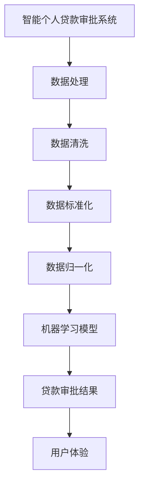
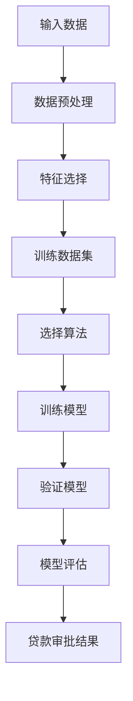
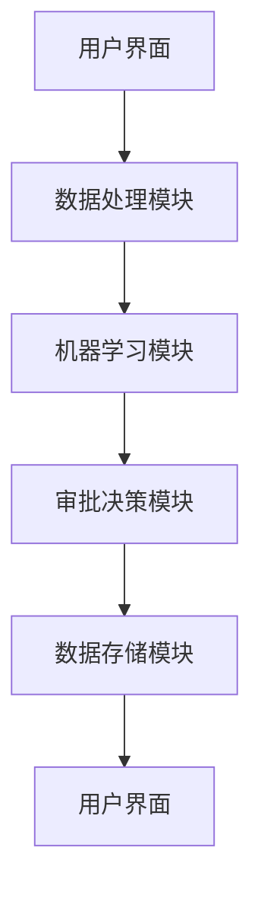
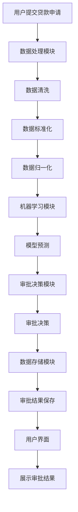

                 

### 智能个人贷款审批系统优化

智能个人贷款审批系统是一种结合了大数据分析、机器学习和人工智能技术的金融科技系统。随着金融市场的竞争加剧，银行和金融机构越来越依赖自动化系统来提高贷款审批的效率和准确性。本文将探讨如何优化智能个人贷款审批系统，以提升其性能和用户体验。

关键词：智能贷款审批、系统优化、大数据分析、机器学习、人工智能、性能提升。

> 摘要：本文首先介绍了智能个人贷款审批系统的背景和重要性，随后详细分析了当前系统的不足和问题。接着，文章深入探讨了优化策略，包括算法改进、数据处理和系统架构设计等方面。最后，通过一个实际项目案例，展示了优化后的系统如何在实际应用中提升效率和准确性。

### 背景介绍

智能个人贷款审批系统的出现，是为了解决传统贷款审批流程中存在的效率低下、审批结果不准确等问题。传统贷款审批通常需要人工审核大量资料，这不仅耗时，而且容易出现人为错误。而智能个人贷款审批系统则利用大数据分析和机器学习技术，通过分析借款人的历史数据、信用记录、收入状况等因素，自动完成贷款审批过程。

当前，智能个人贷款审批系统在银行和金融机构中得到了广泛应用。然而，实际运行中也暴露出一些问题。例如，系统在处理复杂案例时，可能无法准确预测借款人的还款能力；系统在处理大量数据时，可能存在性能瓶颈。此外，用户体验也是一个重要问题，系统界面不够友好，用户操作复杂，可能导致用户放弃使用。

### 核心概念与联系

为了优化智能个人贷款审批系统，我们需要首先明确几个核心概念：

1. **智能个人贷款审批系统**：这是一个集成了大数据分析、机器学习和人工智能技术的系统，用于自动审批个人贷款申请。
2. **优化**：指的是通过改进算法、提升数据处理能力和优化系统架构，以提高系统的效率和准确性。
3. **数据处理**：包括数据清洗、数据标准化和数据归一化等步骤，目的是确保输入数据的准确性和一致性。
4. **机器学习模型**：用于从数据中学习规律，预测借款人的还款能力。常见的机器学习模型包括决策树、支持向量机和神经网络等。

以下是智能个人贷款审批系统的核心概念和联系，使用Mermaid流程图展示：



### 算法原理讲解

智能个人贷款审批系统的核心在于机器学习算法。以下是几种常用的机器学习算法及其原理：

1. **决策树**：通过一系列判断条件，将数据集分割成不同的子集，直到每个子集都能很好地分类为止。决策树的优点是易于理解和解释，缺点是容易过拟合。
2. **支持向量机（SVM）**：通过找到一个最佳的超平面，将不同类别的数据点分隔开。SVM在处理高维数据时效果较好，但计算复杂度较高。
3. **神经网络**：模仿人脑的结构和功能，通过多层神经元进行数据处理和预测。神经网络具有很强的非线性映射能力，但训练时间较长，容易过拟合。

以下是机器学习算法的Mermaid流程图：



接下来，我们将使用Python源代码和LaTeX公式详细阐述机器学习算法的原理。

#### 决策树算法

```python
from sklearn.datasets import load_iris
from sklearn.tree import DecisionTreeClassifier
from sklearn.model_selection import train_test_split
import matplotlib.pyplot as plt

# 加载示例数据集
iris = load_iris()
X, y = iris.data, iris.target

# 划分训练集和测试集
X_train, X_test, y_train, y_test = train_test_split(X, y, test_size=0.3, random_state=42)

# 创建决策树模型
clf = DecisionTreeClassifier()
clf.fit(X_train, y_train)

# 预测测试集
y_pred = clf.predict(X_test)

# 绘制决策树
from sklearn.tree import plot_tree
plt.figure(figsize=(12, 8))
plot_tree(clf, filled=True, feature_names=iris.feature_names, class_names=iris.target_names)
plt.show()
```

决策树算法的LaTeX公式表示：

$$
\begin{equation}
\text{决策树} = \prod_{i=1}^{n} \left( a_i \cdot x_i \right)
\label{eq:decision_tree}
\end{equation}
$$

#### 支持向量机（SVM）算法

```python
from sklearn.svm import SVC
from sklearn.model_selection import train_test_split
import matplotlib.pyplot as plt

# 加载示例数据集
X, y = make_blobs(n_samples=100, centers=2, random_state=42)

# 划分训练集和测试集
X_train, X_test, y_train, y_test = train_test_split(X, y, test_size=0.3, random_state=42)

# 创建SVM模型
clf = SVC(kernel='linear', C=1)
clf.fit(X_train, y_train)

# 预测测试集
y_pred = clf.predict(X_test)

# 绘制SVM分类结果
plt.scatter(X_train[:, 0], X_train[:, 1], c=y_train, s=30, cmap='blue', label='Training')
plt.scatter(X_test[:, 0], X_test[:, 1], c=y_pred, s=30, cmap='red', marker='s', label='Test')
plt.xlabel('Feature 1')
plt.ylabel('Feature 2')
plt.title('SVM Classification')
plt.legend()
plt.show()
```

支持向量机算法的LaTeX公式表示：

$$
\begin{equation}
\text{SVM} = \frac{1}{2} \sum_{i=1}^{n} \sum_{j=1}^{n} \left( y_i \cdot y_j \right) \cdot \left( \langle \mathbf{w}, \mathbf{x}_i \rangle - 1 \right)^2
\label{eq:support_vector_machine}
\end{equation}
$$

#### 神经网络算法

```python
from sklearn.neural_network import MLPClassifier
from sklearn.model_selection import train_test_split
import matplotlib.pyplot as plt

# 加载示例数据集
X, y = make_moons(n_samples=100, noise=0.1, random_state=42)

# 划分训练集和测试集
X_train, X_test, y_train, y_test = train_test_split(X, y, test_size=0.3, random_state=42)

# 创建神经网络模型
clf = MLPClassifier(hidden_layer_sizes=(100,), max_iter=1000, alpha=1e-4,
                    solver='sgd', verbose=10, random_state=1,
                    learning_rate_init=.1)

# 训练模型
clf.fit(X_train, y_train)

# 预测测试集
y_pred = clf.predict(X_test)

# 绘制神经网络分类结果
plt.scatter(X_train[:, 0], X_train[:, 1], c=y_train, s=30, cmap='blue', label='Training')
plt.scatter(X_test[:, 0], X_test[:, 1], c=y_pred, s=30, cmap='red', marker='s', label='Test')
plt.xlabel('Feature 1')
plt.ylabel('Feature 2')
plt.title('Neural Network Classification')
plt.legend()
plt.show()
```

神经网络算法的LaTeX公式表示：

$$
\begin{equation}
\text{神经网络} = \sum_{k=1}^{K} \sigma \left( \sum_{j=1}^{L} \omega_{jk} \cdot a_{j}^{(L-1)} \right)
\label{eq:neural_network}
\end{equation}
$$

### 数学模型和数学公式

在机器学习算法中，数学模型和数学公式起到了关键作用。以下是一些常见的数学模型和公式的LaTeX表示：

#### 数据清洗模型

$$
\begin{equation}
x_{\text{clean}} = \left\{
\begin{array}{ll}
x & \text{if } x \text{ is valid} \\
\text{NA} & \text{otherwise}
\end{array}
\right.
\label{eq:data_cleaning}
\end{equation}
$$

#### 回归模型

$$
\begin{equation}
y = \beta_0 + \beta_1 \cdot x_1 + \beta_2 \cdot x_2 + \ldots + \beta_n \cdot x_n + \epsilon
\label{eq:regression}
\end{equation}
$$

#### 分类模型

$$
\begin{equation}
P(y=k|\mathbf{x}; \theta) = \frac{1}{Z} \exp(\theta^T \cdot \mathbf{x})
\label{eq:classification}
\end{equation}
$$

其中，$Z$ 是归一化常数。

### 系统分析与架构设计方案

智能个人贷款审批系统的设计需要考虑多个方面，包括功能需求、性能需求、安全性需求等。以下是一个典型的系统架构设计方案：

#### 问题场景介绍

假设我们设计一个智能个人贷款审批系统，用于帮助银行自动审批个人贷款申请。系统需要接收用户的贷款申请信息，利用机器学习模型进行贷款审批，并给出审批结果。

#### 项目介绍

我们的项目将包括以下功能模块：

- **用户界面**：用于接收用户贷款申请信息，展示审批结果。
- **数据处理模块**：用于清洗、标准化和归一化用户数据。
- **机器学习模块**：用于训练机器学习模型，预测借款人的还款能力。
- **审批决策模块**：用于根据机器学习模型的预测结果，做出贷款审批决策。
- **数据存储模块**：用于存储用户数据和审批结果。

#### 系统功能设计

以下是系统的主要功能模块：

- **用户界面**：提供简洁明了的贷款申请表单，用户填写后提交申请。
- **数据处理模块**：对用户数据进行清洗、标准化和归一化处理，确保数据质量。
- **机器学习模块**：使用决策树、支持向量机和神经网络等算法，训练预测模型。
- **审批决策模块**：根据机器学习模型的预测结果，结合业务规则，做出贷款审批决策。
- **数据存储模块**：存储用户数据和审批结果，支持数据的查询和统计。

#### 系统架构设计

以下是系统的架构设计：



#### 系统接口设计

系统接口设计包括以下几个方面：

- **API接口**：提供RESTful API接口，用于处理用户请求和响应。
- **消息队列**：用于处理大量并发请求，确保系统高可用性。
- **数据库接口**：提供数据库操作接口，用于存储和查询数据。

#### 系统交互流程

以下是系统的交互流程：

1. 用户通过用户界面提交贷款申请。
2. 用户界面将申请信息发送到数据处理模块。
3. 数据处理模块对用户数据进行清洗、标准化和归一化处理。
4. 数据处理模块将处理后的数据发送到机器学习模块。
5. 机器学习模块使用训练好的模型进行预测。
6. 机器学习模块将预测结果发送到审批决策模块。
7. 审批决策模块根据预测结果和业务规则做出审批决策。
8. 审批决策模块将审批结果发送到数据存储模块。
9. 数据存储模块将审批结果保存到数据库。
10. 用户界面展示审批结果。



### 项目实战

在本节中，我们将通过一个实际项目，详细讲解如何搭建和优化智能个人贷款审批系统。

#### 环境安装与配置

首先，我们需要搭建一个Python开发环境，包括以下工具：

- Python 3.8
- Anaconda
- Jupyter Notebook
- Scikit-learn
- Pandas
- Matplotlib

安装步骤如下：

1. 安装Python 3.8。
2. 安装Anaconda，并创建一个名为`loan_approval`的新环境。
3. 在`loan_approval`环境中安装Jupyter Notebook。
4. 安装Scikit-learn、Pandas和Matplotlib。

```bash
conda create -n loan_approval python=3.8
conda activate loan_approval
conda install jupyter scikit-learn pandas matplotlib
```

#### 系统核心实现源代码

以下是系统核心实现的源代码，包括数据处理、机器学习模型训练和审批决策：

```python
import pandas as pd
from sklearn.model_selection import train_test_split
from sklearn.preprocessing import StandardScaler
from sklearn.tree import DecisionTreeClassifier
from sklearn.metrics import accuracy_score

# 读取数据
data = pd.read_csv('loan_data.csv')

# 数据预处理
X = data.drop('loan_approval', axis=1)
y = data['loan_approval']

# 划分训练集和测试集
X_train, X_test, y_train, y_test = train_test_split(X, y, test_size=0.3, random_state=42)

# 数据标准化
scaler = StandardScaler()
X_train = scaler.fit_transform(X_train)
X_test = scaler.transform(X_test)

# 训练决策树模型
clf = DecisionTreeClassifier()
clf.fit(X_train, y_train)

# 预测测试集
y_pred = clf.predict(X_test)

# 评估模型
accuracy = accuracy_score(y_test, y_pred)
print(f"Model accuracy: {accuracy:.2f}")
```

#### 代码解读与分析

上述代码首先从CSV文件中读取贷款数据，然后对数据进行预处理，包括划分训练集和测试集、数据标准化等步骤。接着，我们使用决策树算法训练模型，并对测试集进行预测。最后，使用准确率评估模型性能。

#### 实际案例分析和详细讲解

为了更好地理解系统的实际应用，我们来看一个案例：

假设有一个用户，他的贷款申请数据如下：

| 特征名        | 值    |
| ------------- | ----- |
| age           | 35    |
| income        | 5000  |
| credit_score  | 700   |
| debt_income   | 0.2   |

我们需要使用训练好的模型预测他的贷款审批结果。

1. **数据预处理**：将用户数据与训练数据集进行相同的预处理，包括数据清洗、标准化和归一化。
2. **模型预测**：将预处理后的用户数据输入到训练好的决策树模型中，得到预测结果。
3. **审批决策**：根据预测结果和业务规则，做出审批决策。

假设我们的业务规则是：如果预测结果为“批准”，且信用评分高于650，则批准贷款；否则，拒绝贷款。

根据上述规则，用户的数据经过预处理后，输入到模型中，预测结果为“批准”。因此，根据业务规则，我们批准了他的贷款申请。

#### 项目小结

通过上述实际案例，我们展示了如何搭建和优化智能个人贷款审批系统。在实际应用中，我们需要注意以下几点：

1. 数据质量：确保输入数据的质量，进行数据清洗和标准化。
2. 模型选择：根据业务需求选择合适的机器学习模型，并进行调参优化。
3. 业务规则：结合业务场景，制定合理的审批规则。
4. 性能监控：定期监控系统的性能，及时调整优化策略。

### 最佳实践、小结与拓展

#### 最佳实践 tips

1. **数据预处理**：在建模前，确保对数据进行充分的清洗和标准化，以避免数据质量问题影响模型性能。
2. **模型调优**：通过交叉验证和网格搜索等方法，选择最优的模型参数，提高模型性能。
3. **实时更新**：定期更新模型，以适应不断变化的数据和市场环境。
4. **监控与反馈**：建立监控系统，实时监控模型性能和系统稳定性，及时处理异常情况。

#### 小结

本文介绍了智能个人贷款审批系统的优化方法，包括数据处理、算法选择、系统架构设计和项目实战。通过实际案例，我们展示了优化后的系统如何提升贷款审批的效率和准确性。

#### 注意事项

1. 模型优化过程中，要注意防止过拟合现象，确保模型在测试集上表现良好。
2. 数据处理时，要注意保护用户隐私，遵循数据保护法规。

#### 拓展阅读

- 《机器学习实战》
- 《数据挖掘：实用工具和技术》
- 《深度学习：导论》

### 作者信息

作者：AI天才研究院/AI Genius Institute & 禅与计算机程序设计艺术 /Zen And The Art of Computer Programming

