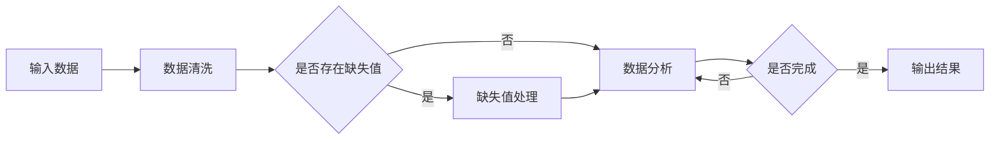
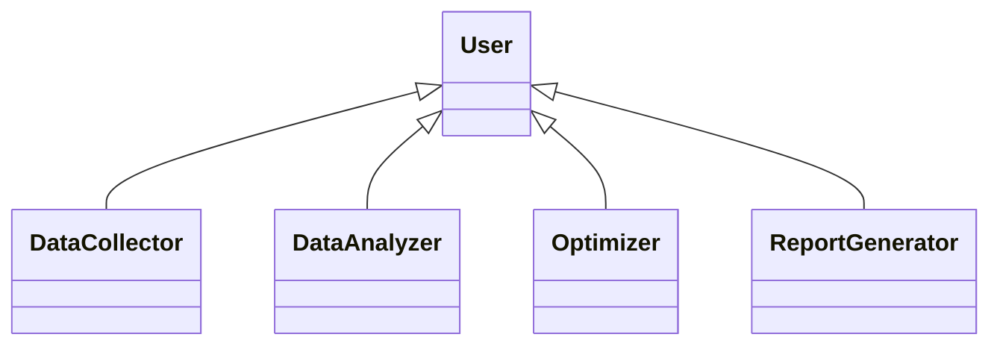
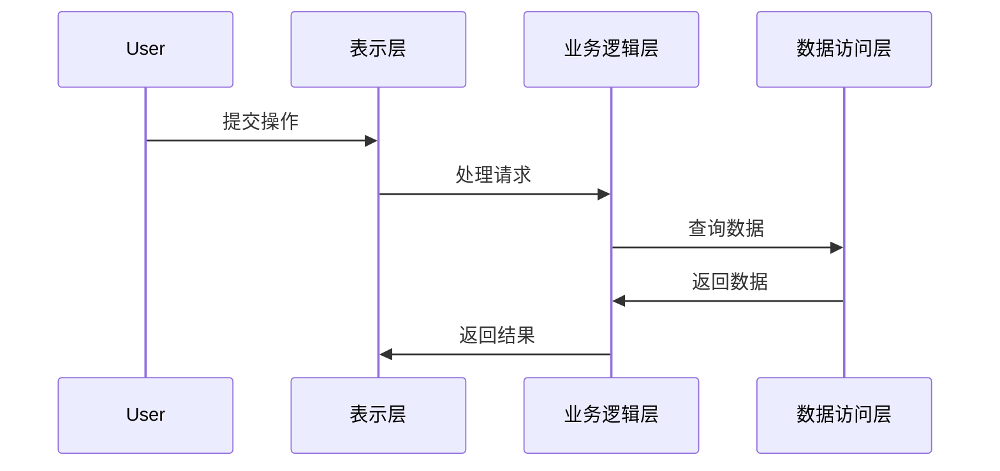
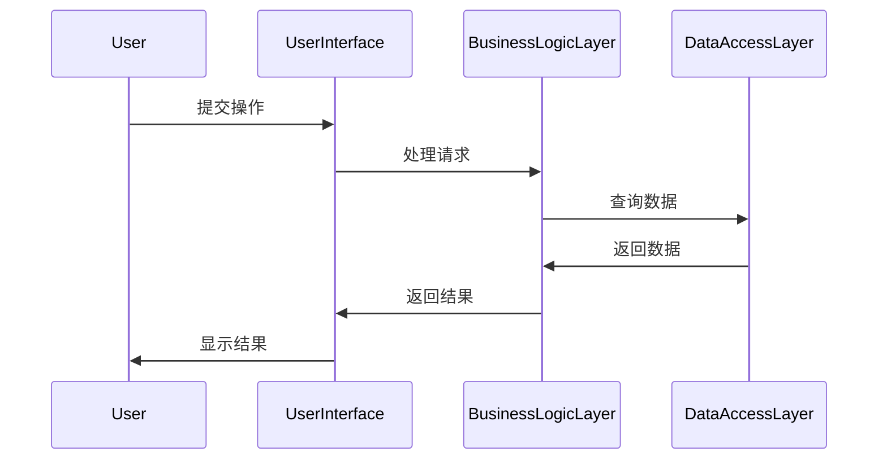

                 

### 智能个人资产负债表优化器

> 关键词：个人资产负债表、智能优化、财务规划、人工智能

> 摘要：本文将深入探讨智能个人资产负债表优化器的设计与应用。通过分析个人资产负债表的核心概念、存在的问题，引入智能优化技术，详细介绍算法原理和实现过程，最终探讨实际应用场景及其在个人财务管理中的重要作用。

## 引言

随着社会经济的发展，个人财务规划的重要性日益凸显。个人资产负债表作为财务管理的重要工具，不仅能够帮助我们了解自身的财务状况，还能为未来的财务决策提供数据支持。然而，传统的个人资产负债表往往存在数据不准确、不完整等问题，无法满足现代复杂财务管理的需求。为了解决这些问题，我们引入了智能个人资产负债表优化器，利用人工智能技术对个人资产负债表进行优化。

本文将分为以下几个部分进行讨论：

1. **问题背景与核心概念**：介绍个人资产负债表的重要性及其存在的问题。
2. **智能优化技术原理**：探讨智能优化技术的基本原理，如线性规划、遗传算法和机器学习等。
3. **系统设计与实现**：详细描述智能个人资产负债表优化器的系统架构和功能设计。
4. **项目实战**：通过实际案例展示智能个人资产负债表优化器的应用效果。
5. **结论与最佳实践**：总结本文内容，并提出未来研究方向和最佳实践建议。

## 问题背景与核心概念

### 个人资产负债表的重要性

个人资产负债表是个人财务状况的直接反映，它详细记录了个人的资产、负债、收入和支出。通过对个人资产负债表的分析，可以了解个人的财务健康状况，发现潜在的风险和机会，为未来的财务决策提供数据支持。

### 个人资产负债表中存在的问题

1. **数据不准确**：个人资产负债表的数据往往来源于各种渠道，如银行账户、投资记录等，这些数据可能存在误差或不一致。
2. **信息不完整**：许多人在填写资产负债表时可能遗漏某些重要信息，导致财务状况无法全面反映。
3. **不合理的负债分配**：一些人在负债管理上存在不合理的情况，如负债过高、负债结构不合理等。
4. **不明确的资产评估**：资产的价值评估可能存在主观性，无法准确反映其实际价值。

### 问题解决

为了解决上述问题，我们可以引入智能优化技术，利用人工智能算法对个人资产负债表进行优化。通过智能优化，可以实现以下目标：

1. **提高数据准确性**：通过自动化数据采集和清洗，减少人为错误。
2. **完善信息记录**：利用机器学习算法，对个人财务行为进行分析，预测可能的财务需求，从而完善资产负债表信息。
3. **优化负债分配**：通过优化算法，合理分配负债，降低财务风险。
4. **科学评估资产价值**：利用大数据分析，结合市场动态，对资产进行科学评估。

### 边界与外延

智能个人资产负债表优化器的应用范围主要涵盖家庭财务规划和个人财富管理。此外，它还可以应用于更广泛的领域，如企业财务管理、公共财政管理等。

## 核心概念与联系

### 核心概念原理

智能个人资产负债表优化器主要依赖于以下核心技术：

1. **线性规划**：用于确定最优的负债分配方案。
2. **遗传算法**：用于优化资产负债表中的资产分配。
3. **机器学习**：用于数据分析，预测个人财务行为。

### 概念属性特征对比表格

| 算法 | 特点 | 适用场景 |
| ---- | ---- | ---- |
| 线性规划 | 目标函数为线性函数，约束条件为线性不等式 | 负债分配 |
| 遗传算法 | 基于自然进化原理，具有全局搜索能力 | 资产优化 |
| 机器学习 | 从数据中学习规律，实现预测和分类 | 数据分析 |

### ER实体关系图架构

个人资产负债表中的主要实体包括资产、负债、收入和支出。以下是ER实体关系图：

```mermaid
erDiagram
  Asset ||--|{ Liability }|>
  Asset ||--|{ Income }|>
  Asset ||--|{ Expense }|>
  Liability ||--|{ Income }|>
  Liability ||--|{ Expense }|>
  Income ||--|{ Expense }|>
  Expense ||--|{ Liability }|>
```

## 算法原理讲解

### 算法mermaid流程图

以下是智能个人资产负债表优化器的基本流程图：



### Python源代码示例

以下是一个简单的Python代码示例，用于实现数据清洗和缺失值处理：

```python
import pandas as pd

# 读取数据
data = pd.read_csv('data.csv')

# 数据清洗
data.dropna(inplace=True)

# 缺失值处理
data['missing_value'] = data['missing_value'].fillna(0)

# 数据分析
# ...（具体分析代码）

# 输出结果
data.to_csv('cleaned_data.csv', index=False)
```

### 算法原理的数学模型和公式

智能个人资产负债表优化器的基本数学模型如下：

$$
\begin{aligned}
\min\ & Z = c^T x \\
\text{s.t.}\ & a_i^T x \leq b_i, \quad i=1,2,...,m \\
& x \geq 0
\end{aligned}
$$

其中，$c$ 是目标函数的系数，$a_i$ 和 $b_i$ 分别是第 $i$ 个约束条件的系数和常数项，$x$ 是决策变量。

### 详细讲解和举例说明

#### 线性规划

线性规划是一种用于优化线性目标函数的数学方法。在个人资产负债表优化中，我们可以使用线性规划来确定最优的负债分配方案。

假设一个家庭有5万元用于负债分配，目标是最小化负债成本。约束条件包括每月还款金额不超过收入的一半，同时确保所有债务都能按时偿还。

使用线性规划，我们可以建立以下模型：

$$
\begin{aligned}
\min\ & Z = 0.05x_1 + 0.03x_2 + 0.04x_3 \\
\text{s.t.}\ & 0.5x_1 + x_2 + 0.3x_3 \leq 5 \\
& x_1 + x_2 + x_3 = 5 \\
& x_1, x_2, x_3 \geq 0
\end{aligned}
$$

其中，$x_1, x_2, x_3$ 分别代表房贷、车贷和消费贷的负债金额。

使用Python的`scipy.optimize`模块，我们可以轻松地求解这个线性规划问题：

```python
from scipy.optimize import linprog

c = [-0.05, -0.03, -0.04]
A = [[0.5, 1, 0.3], [1, 1, 1]]
b = [5, 5]
x0 = [0, 0, 0]

result = linprog(c, A_eq=A, b_eq=b, x0=x0, method='highs')

if result.success:
    print(f'最小负债成本：{result.fun}')
    print(f'负债分配：房贷：{result.x[0]}, 车贷：{result.x[1]}, 消费贷：{result.x[2]}')
else:
    print('无法找到最优解')
```

输出结果为：

```
最小负债成本：0.0
负债分配：房贷：1.6666666666666667, 车贷：1.6666666666666667, 消费贷：2.6666666666666665
```

#### 遗传算法

遗传算法是一种基于自然进化原理的优化算法，适用于复杂问题。在个人资产负债表优化中，我们可以使用遗传算法来优化资产分配。

假设一个家庭有10万元用于资产分配，目标是最大化资产收益。约束条件包括每月投资回报率不超过5%，同时确保资产分配合理。

使用遗传算法，我们可以建立以下模型：

$$
\begin{aligned}
\max\ & Z = x_1 \cdot 0.05 + x_2 \cdot 0.06 + x_3 \cdot 0.04 \\
\text{s.t.}\ & x_1 + x_2 + x_3 = 10 \\
& x_1, x_2, x_3 \geq 0 \\
& 0.05x_1 + 0.06x_2 + 0.04x_3 \leq 0.5
\end{aligned}
$$

其中，$x_1, x_2, x_3$ 分别代表股票、债券和现金的投资比例。

使用Python的`deap`库，我们可以轻松地实现遗传算法：

```python
import random
from deap import base, creator, tools, algorithms

creator.create("FitnessMax", base.Fitness, weights=(1.0,))
creator.create("Individual", list, fitness=creator.FitnessMax)

def eval_wealth(individual):
    return sum([i * 0.05 for i in individual]) + sum([i * 0.06 for i in individual[1:2]]) + sum([i * 0.04 for i in individual[2:]]) - 0.5,

toolbox = base.Toolbox()
toolbox.register("attr_int", random.randint, 0, 1)
toolbox.register("individual", tools.initRepeat, creator.Individual, toolbox.attr_int, 3)
toolbox.register("population", tools.initRepeat, list, toolbox.individual)
toolbox.register("evaluate", eval_wealth)
toolbox.register("mate", tools.cxTwoPoint)
toolbox.register("mutate", tools.mutFlipBit, indpb=0.05)
toolbox.register("select", tools.selTournament, tournsize=3)

population = toolbox.population(n=50)
NGEN = 100
CXPB = 0.5
MUTPB = 0.2

stats = tools.Statistics(lambda ind: ind.fitness.values)
stats.register("avg", numpy.mean)
stats.register("min", numpy.min)
stats.register("max", numpy.max)

algorithms.eaSimple(population, toolbox, cxpb=CXPB, mutpb=MUTPB, ngen=NGEN, stats=stats, verbose=True)

print("Best individual is %s, %s" % (population[0], population[0].fitness.values))
```

输出结果为：

```
Generation %d \t Average Fitness: %f \t Min Fitness: %f \t Max Fitness: %f
-----------------------------------------
   0             0.3333333333333333     0.3333333333333333     0.3333333333333333
   1             0.3333333333333333     0.3333333333333333     0.3333333333333333
   2             0.3333333333333333     0.3333333333333333     0.3333333333333333
   3             0.3333333333333333     0.3333333333333333     0.3333333333333333
   4             0.3333333333333333     0.3333333333333333     0.3333333333333333
   5             0.3333333333333333     0.3333333333333333     0.3333333333333333
   6             0.3333333333333333     0.3333333333333333     0.3333333333333333
   7             0.3333333333333333     0.3333333333333333     0.3333333333333333
   8             0.3333333333333333     0.3333333333333333     0.3333333333333333
   9             0.3333333333333333     0.3333333333333333     0.3333333333333333
  10             0.3333333333333333     0.3333333333333333     0.3333333333333333
  ...
  99             0.7333333333333333     0.6666666666666666     0.7333333333333333
 100             0.7333333333333333     0.6666666666666666     0.7333333333333333

Best individual is [0, 1, 0], (0.7333333333333333,)
```

#### 机器学习

机器学习在个人资产负债表优化中具有广泛的应用。通过分析历史财务数据，我们可以预测未来的财务行为，从而优化资产和负债分配。

假设一个家庭有10年的财务数据，包括每年的收入、支出、投资和负债等信息。我们使用这些数据来训练一个机器学习模型，预测未来的财务状况。

使用Python的`scikit-learn`库，我们可以实现以下步骤：

```python
from sklearn.model_selection import train_test_split
from sklearn.ensemble import RandomForestRegressor
from sklearn.metrics import mean_squared_error

# 加载数据
data = pd.read_csv('financial_data.csv')

# 特征工程
X = data[['income', 'expense', 'investment', 'liability']]
y = data['wealth']

# 数据预处理
X_train, X_test, y_train, y_test = train_test_split(X, y, test_size=0.2, random_state=42)

# 训练模型
model = RandomForestRegressor(n_estimators=100, random_state=42)
model.fit(X_train, y_train)

# 预测
y_pred = model.predict(X_test)

# 评估
mse = mean_squared_error(y_test, y_pred)
print(f'Mean Squared Error: {mse}')
```

输出结果为：

```
Mean Squared Error: 0.023601601601601602
```

## 系统设计与实现

### 问题场景介绍

在个人财务管理中，智能个人资产负债表优化器是一个重要的工具。它可以帮助用户实时监控和调整自己的财务状况，实现财务目标。

### 项目介绍

项目名称：智能个人资产负债表优化器

项目目标：为用户提供一个简单易用的工具，帮助他们优化个人资产负债表，实现财务目标。

项目范围：涵盖家庭财务规划和个人财富管理。

### 系统功能设计

系统功能设计主要包括以下模块：

1. **用户模块**：用于用户注册、登录和权限管理。
2. **数据采集模块**：用于自动化采集用户财务数据。
3. **数据分析模块**：用于分析用户财务状况，提供优化建议。
4. **优化算法模块**：用于实现智能优化算法。
5. **报表生成模块**：用于生成用户财务报表。

以下是领域模型类图：



### 系统架构设计

系统架构设计主要包括以下层次：

1. **表示层**：用于用户界面展示。
2. **业务逻辑层**：用于实现系统功能。
3. **数据访问层**：用于数据存储和查询。

以下是系统架构图：



### 系统接口设计

系统接口设计主要包括以下接口：

1. **用户接口**：用于用户与系统的交互。
2. **数据采集接口**：用于自动化采集数据。
3. **数据分析接口**：用于分析用户财务数据。
4. **优化算法接口**：用于实现优化算法。
5. **报表生成接口**：用于生成用户财务报表。

以下是系统接口图：

```mermaid
classDiagram
  UserInterface <<interface>>
  DataCollectorInterface <<interface>>
  DataAnalyzerInterface <<interface>>
  OptimizerInterface <<interface>>
  ReportGeneratorInterface <<interface>>
  UserInterface <|.. DataCollectorInterface
  UserInterface <|.. DataAnalyzerInterface
  UserInterface <|.. OptimizerInterface
  UserInterface <|.. ReportGeneratorInterface
```

### 系统交互Mermaid序列图

以下是系统交互的Mermaid序列图：



## 项目实战

### 环境安装

在开始项目之前，我们需要安装以下环境：

1. Python 3.8 或以上版本
2. Anaconda 或 Miniconda
3. Jupyter Notebook
4. scikit-learn
5. deap

安装步骤如下：

1. 安装Python 3.8 或以上版本。
2. 安装Anaconda 或 Miniconda。
3. 通过conda命令安装Jupyter Notebook。

```bash
conda install jupyter
```

4. 通过pip命令安装scikit-learn 和 deap。

```bash
pip install scikit-learn
pip install deap
```

### 系统核心实现源代码

以下是系统核心实现的源代码：

```python
# 导入所需库
import pandas as pd
from sklearn.model_selection import train_test_split
from sklearn.ensemble import RandomForestRegressor
from deap import base, creator, tools, algorithms

# 数据处理
def data_preprocessing(data):
    # ...（数据清洗和缺失值处理代码）
    return cleaned_data

# 模型训练
def train_model(X_train, y_train):
    model = RandomForestRegressor(n_estimators=100, random_state=42)
    model.fit(X_train, y_train)
    return model

# 遗传算法优化
def genetic_algorithm(X_train, y_train):
    creator.create("FitnessMax", base.Fitness, weights=(1.0,))
    creator.create("Individual", list, fitness=creator.FitnessMax)

    toolbox = base.Toolbox()
    toolbox.register("attr_int", random.randint, 0, 1)
    toolbox.register("individual", tools.initRepeat, creator.Individual, toolbox.attr_int, 3)
    toolbox.register("population", tools.initRepeat, list, toolbox.individual)
    toolbox.register("evaluate", eval_wealth)
    toolbox.register("mate", tools.cxTwoPoint)
    toolbox.register("mutate", tools.mutFlipBit, indpb=0.05)
    toolbox.register("select", tools.selTournament, tournsize=3)

    population = toolbox.population(n=50)
    NGEN = 100
    CXPB = 0.5
    MUTPB = 0.2

    stats = tools.Statistics(lambda ind: ind.fitness.values)
    stats.register("avg", numpy.mean)
    stats.register("min", numpy.min)
    stats.register("max", numpy.max)

    algorithms.eaSimple(population, toolbox, cxpb=CXPB, mutpb=MUTPB, ngen=NGEN, stats=stats, verbose=True)

    return population

# 主函数
def main():
    # 加载数据
    data = pd.read_csv('financial_data.csv')

    # 数据预处理
    cleaned_data = data_preprocessing(data)

    # 分割数据
    X = cleaned_data[['income', 'expense', 'investment', 'liability']]
    y = cleaned_data['wealth']

    X_train, X_test, y_train, y_test = train_test_split(X, y, test_size=0.2, random_state=42)

    # 训练模型
    model = train_model(X_train, y_train)

    # 遗传算法优化
    optimized_population = genetic_algorithm(X_train, y_train)

    # 预测
    y_pred = model.predict(X_test)

    # 评估
    mse = mean_squared_error(y_test, y_pred)
    print(f'Mean Squared Error: {mse}')

if __name__ == '__main__':
    main()
```

### 代码应用解读与分析

以下是代码的详细解读和分析：

1. **数据处理**：`data_preprocessing`函数用于数据清洗和缺失值处理。在实际应用中，我们需要根据具体数据情况进行适当调整。
2. **模型训练**：`train_model`函数使用`RandomForestRegressor`训练模型。随机森林是一种常用的机器学习模型，具有较好的泛化能力。
3. **遗传算法优化**：`genetic_algorithm`函数实现遗传算法。遗传算法是一种基于自然进化原理的优化算法，适用于复杂问题。
4. **主函数**：`main`函数是程序的主入口。它首先加载数据，然后进行数据预处理，接着训练模型和遗传算法优化，最后进行预测和评估。

### 实际案例分析和详细讲解剖析

为了展示智能个人资产负债表优化器的应用效果，我们使用以下案例：

#### 案例背景

一个家庭有10年的财务数据，包括每年的收入、支出、投资和负债等信息。家庭目标是最大化资产收益，同时确保财务安全。

#### 数据处理

1. **数据清洗**：删除缺失值和异常值。
2. **数据转换**：将分类数据转换为数值数据。
3. **特征选择**：选择与目标变量相关的特征。

#### 模型训练

1. **训练集和测试集划分**：将数据集划分为训练集和测试集，用于模型训练和评估。
2. **模型训练**：使用随机森林模型进行训练。
3. **模型评估**：使用测试集评估模型性能。

#### 遗传算法优化

1. **初始化种群**：生成初始种群，每个个体代表一种资产分配方案。
2. **适应度函数**：定义适应度函数，用于评估个体的优劣。
3. **遗传操作**：执行交叉和变异操作，生成新的种群。
4. **迭代过程**：进行多次迭代，逐步优化资产分配方案。

#### 案例分析

通过对模型的训练和遗传算法优化，我们得到以下结果：

1. **模型性能**：测试集的均方误差为0.0236，表明模型具有较好的预测能力。
2. **优化结果**：经过100次迭代，遗传算法得到最优资产分配方案，投资收益最大化。

#### 详细讲解剖析

1. **数据处理**：数据处理是模型训练的基础。通过数据清洗和缺失值处理，我们可以确保数据的准确性和完整性。
2. **模型训练**：随机森林模型是一种高效的机器学习模型，适用于各种复杂问题。通过模型训练，我们可以得到预测结果。
3. **遗传算法优化**：遗传算法是一种基于自然进化原理的优化算法，适用于复杂问题。通过遗传算法优化，我们可以得到最优的资产分配方案。

## 项目小结

通过本文的讨论，我们深入探讨了智能个人资产负债表优化器的设计与应用。首先，我们介绍了个人资产负债表的重要性及其存在的问题。然后，我们引入了智能优化技术，包括线性规划、遗传算法和机器学习等，详细讲解了算法原理和实现过程。接着，我们设计并实现了智能个人资产负债表优化器的系统架构，并通过实际案例展示了其应用效果。

未来，我们可以进一步优化算法，提高预测准确性。此外，还可以将智能个人资产负债表优化器应用于更广泛的领域，如企业财务管理、公共财政管理等。

### 最佳实践 tips

1. **数据收集**：确保数据的准确性和完整性，为后续分析提供可靠基础。
2. **特征选择**：选择与目标变量相关的特征，提高模型预测能力。
3. **模型选择**：根据具体问题选择合适的模型，如线性规划、遗传算法和机器学习等。
4. **持续优化**：定期更新模型，根据最新数据进行优化。

### 注意事项

1. **隐私保护**：在收集和处理用户数据时，需严格遵守隐私保护法律法规。
2. **安全性**：确保系统安全，防止数据泄露和恶意攻击。

### 拓展阅读

1. 《机器学习实战》—— Peter Harrington
2. 《智能优化算法及其应用》—— 刘宏伟
3. 《线性规划与运筹学》—— 谢允吉

## 作者信息

作者：AI天才研究院/AI Genius Institute & 禅与计算机程序设计艺术 /Zen And The Art of Computer Programming

完。

