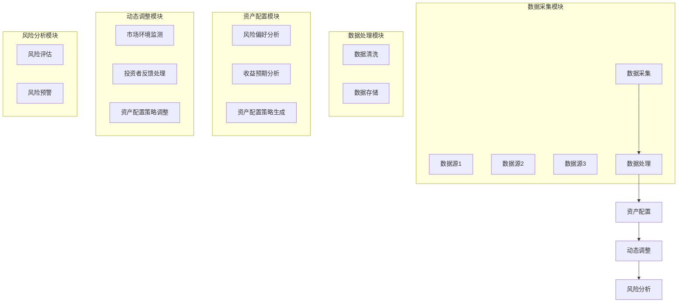
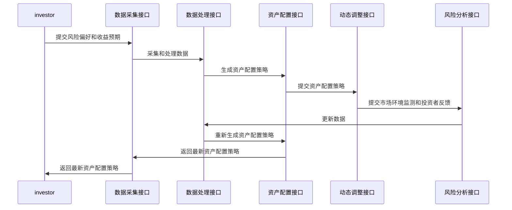

                 


# 智能个人资产配置动态调整器

关键词：智能资产配置、动态调整、机器学习、算法、金融技术

摘要：本文将深入探讨智能个人资产配置动态调整器的概念、技术基础、核心功能以及实际案例分析，旨在为金融领域的投资者提供一种高效、个性化的资产配置解决方案。

## 第一部分：引言

### 1.1.1 问题背景与问题描述

#### 1.1.1.1 问题背景

随着人工智能技术的迅猛发展，金融领域迎来了全新的变革。智能个人资产配置动态调整器应运而生，它通过整合人工智能技术，为投资者提供个性化的资产配置服务。在传统资产配置过程中，投资者往往需要耗费大量时间和精力去研究和选择合适的投资产品，而智能个人资产配置动态调整器则旨在通过人工智能技术，帮助投资者更精准地进行资产配置。

#### 1.1.1.2 问题描述

智能个人资产配置动态调整器需要解决的核心问题是：如何根据投资者的风险偏好、收益预期、市场环境等因素，动态调整资产配置策略，实现风险和收益的最优平衡。

### 1.1.3 问题解决

本书将从以下几个方面展开讨论：

1. **智能个人资产配置动态调整器的概念与特点**
   - **定义**：介绍智能个人资产配置动态调整器的定义、核心概念和作用。
   - **特点**：分析智能个人资产配置动态调整器与传统资产配置方法的区别。

2. **构建智能个人资产配置动态调整器的技术基础**
   - **数据采集与处理**：介绍数据采集、数据清洗、数据存储等关键技术。
   - **机器学习算法**：讲解常见机器学习算法及其在资产配置中的应用。

3. **智能个人资产配置动态调整器的核心功能**
   - **资产配置策略生成**：介绍如何根据投资者需求生成资产配置策略。
   - **动态调整策略**：阐述如何根据市场变化和投资者反馈动态调整资产配置策略。

4. **实际案例分析**
   - **案例一**：分析一个实际应用案例，展示智能个人资产配置动态调整器的效果。
   - **案例二**：讨论案例一中遇到的问题和解决方案。

### 1.1.4 边界与外延

#### 1.1.4.1 边界

本书主要讨论智能个人资产配置动态调整器的技术实现和应用场景，不包括法律、伦理等方面的问题。

#### 1.1.4.2 外延

本书还将涉及一些相关技术，如大数据、云计算、区块链等，但不会深入讨论。

### 1.1.5 概念结构与核心要素组成

智能个人资产配置动态调整器的概念结构与核心要素组成如下：

- **核心概念**：智能个人资产配置动态调整器、资产配置、机器学习、数据采集等。
- **核心要素**：投资者需求分析、资产配置策略、动态调整策略、数据采集与处理、机器学习算法等。

## 第二部分：核心概念与联系

### 2.1 智能个人资产配置动态调整器的定义与特点

#### 2.1.1 定义

智能个人资产配置动态调整器是一种利用人工智能技术，根据投资者的风险偏好、收益预期、市场环境等因素，动态调整资产配置策略，实现风险和收益最优平衡的工具。

#### 2.1.2 特点

1. **个性化**：智能个人资产配置动态调整器可以根据投资者的个性化需求调整资产配置策略，满足不同投资者的风险偏好和收益预期。
2. **动态调整**：智能个人资产配置动态调整器可以根据市场变化和投资者反馈动态调整资产配置策略，以实现风险和收益的最优平衡。
3. **高效**：智能个人资产配置动态调整器利用人工智能技术，可以快速生成和调整资产配置策略，提高投资决策的效率。

### 2.2 资产配置的概念与属性特征对比表格

资产配置是指投资者将资金分配到不同的资产类别中，以实现风险和收益的最优平衡。以下是资产配置的主要属性特征对比表格：

| 属性特征 | 说明 |
| --- | --- |
| 风险水平 | 资产配置的风险水平，通常包括低风险、中风险和高风险。 |
| 收益预期 | 资产配置的预期收益，通常包括低收益、中收益和高收益。 |
| 资产类别 | 资产配置的资产类别，如股票、债券、基金等。 |
| 配置比例 | 资产配置中各类资产的比例。 |

### 2.3 机器学习算法与资产配置的联系

机器学习算法在资产配置中发挥着重要作用，主要用于以下方面：

1. **预测市场趋势**：利用机器学习算法预测市场的未来走势，为资产配置提供参考。
2. **优化资产配置策略**：通过机器学习算法优化资产配置策略，提高投资收益。
3. **风险控制**：利用机器学习算法评估投资组合的风险，实现风险控制。

## 第三部分：算法原理讲解

### 3.1 数据采集与处理

数据采集与处理是构建智能个人资产配置动态调整器的基础。主要包括以下步骤：

1. **数据采集**：从各种数据源（如金融新闻、股票行情、市场数据等）收集相关数据。
2. **数据清洗**：去除重复数据、错误数据和不完整数据，保证数据质量。

### 3.2 机器学习算法介绍

#### 3.2.1 算法分类

机器学习算法主要分为以下几类：

1. **监督学习**：通过已知的数据集，训练模型，预测未知数据的结果。
2. **无监督学习**：没有已知的数据集，通过数据自身特性，发现数据中的规律和模式。
3. **半监督学习**：结合已知和未知的数据集，训练模型，提高预测准确性。

#### 3.2.2 算法应用

1. **线性回归**：通过建立线性模型，预测资产配置的收益和风险。
2. **决策树**：通过树的模型，将资产配置问题分解为多个决策分支。
3. **神经网络**：通过多层神经网络，模拟人类大脑的工作方式，进行资产配置。

### 3.3 智能个人资产配置动态调整器工作原理

智能个人资产配置动态调整器的工作原理主要包括以下步骤：

1. **数据采集**：从各种数据源收集投资者风险偏好、收益预期、市场环境等相关数据。
2. **数据预处理**：对收集的数据进行清洗、处理，为后续建模提供高质量的数据。
3. **模型训练**：利用机器学习算法，训练资产配置模型，预测投资者风险和收益。
4. **策略生成**：根据模型预测结果，生成最优资产配置策略。
5. **策略调整**：根据市场变化和投资者反馈，动态调整资产配置策略，实现风险和收益的最优平衡。

### 3.4 算法原理示例

以线性回归算法为例，解释智能个人资产配置动态调整器的工作原理。

#### 3.4.1 数学模型

设投资者收益 $R$ 与风险 $D$ 满足线性关系：

$$
R = \beta_0 + \beta_1D + \epsilon
$$

其中，$\beta_0$ 和 $\beta_1$ 为参数，$\epsilon$ 为误差项。

#### 3.4.2 数据采集

从历史数据中收集投资者收益 $R$ 和风险 $D$ 的数据。

#### 3.4.3 模型训练

利用收集的数据，通过最小二乘法，求解参数 $\beta_0$ 和 $\beta_1$：

$$
\beta_0 = \frac{\sum_{i=1}^n (R_i - \bar{R})(D_i - \bar{D})}{\sum_{i=1}^n (D_i - \bar{D})^2}
$$

$$
\beta_1 = \frac{\sum_{i=1}^n (R_i - \bar{R})(D_i - \bar{D})}{\sum_{i=1}^n (D_i - \bar{D})}
$$

其中，$n$ 为数据样本数量，$\bar{R}$ 和 $\bar{D}$ 分别为收益和风险的平均值。

#### 3.4.4 策略生成

根据求解得到的参数 $\beta_0$ 和 $\beta_1$，生成资产配置策略：

$$
R = \beta_0 + \beta_1D
$$

#### 3.4.5 策略调整

根据市场变化和投资者反馈，动态调整资产配置策略，实现风险和收益的最优平衡。

## 第四部分：系统分析与架构设计方案

### 4.1 问题场景介绍

在现代金融市场中，投资者面临着复杂的投资环境，需要快速做出决策。智能个人资产配置动态调整器旨在帮助投资者根据实时市场数据和个性化需求，动态调整资产配置策略，实现风险和收益的最优平衡。

### 4.2 项目介绍

本项目旨在构建一个智能个人资产配置动态调整系统，提供以下功能：

1. 数据采集与处理：从金融新闻、股票行情、市场数据等数据源收集相关数据，并进行数据清洗和处理。
2. 资产配置策略生成：根据投资者的风险偏好、收益预期和市场环境，生成个性化的资产配置策略。
3. 动态调整策略：根据市场变化和投资者反馈，动态调整资产配置策略，实现风险和收益的最优平衡。

### 4.3 系统功能设计

#### 4.3.1 领域模型

领域模型用于描述系统的核心业务逻辑和数据流。以下是智能个人资产配置动态调整器的领域模型：

```mermaid
classDiagram
    Investor --|> AssetAllocation
    MarketData --|> AssetAllocation
    Strategy --|> AssetAllocation
    RiskAnalysis --|> AssetAllocation
    Portfolio --|> AssetAllocation

    Investor {
        id
        name
        riskPreference
        expectedReturn
    }

    MarketData {
        id
        date
        stockMarketIndex
        interestRate
        inflationRate
    }

    Strategy {
        id
        allocationPercentage
        assetTypes
        riskLevel
        returnLevel
    }

    RiskAnalysis {
        id
        riskScore
        riskFactors
    }

    Portfolio {
        id
        investorId
        strategyId
        totalValue
        allocationPercentage
    }

    Investor o--o AssetAllocation
    MarketData o--o AssetAllocation
    Strategy o--o AssetAllocation
    RiskAnalysis o--o AssetAllocation
    Portfolio o--o AssetAllocation
```

### 4.4 系统架构设计

智能个人资产配置动态调整器的系统架构包括以下模块：

1. **数据采集模块**：负责从金融新闻、股票行情、市场数据等数据源收集相关数据。
2. **数据处理模块**：负责对收集的数据进行清洗、处理和存储。
3. **资产配置模块**：负责根据投资者的风险偏好、收益预期和市场环境，生成个性化的资产配置策略。
4. **动态调整模块**：负责根据市场变化和投资者反馈，动态调整资产配置策略。
5. **风险分析模块**：负责评估投资组合的风险，为动态调整提供依据。

以下是智能个人资产配置动态调整器的系统架构图：



### 4.5 系统接口设计

智能个人资产配置动态调整器提供了以下接口：

1. **数据采集接口**：用于从金融新闻、股票行情、市场数据等数据源收集相关数据。
2. **数据处理接口**：用于对收集的数据进行清洗、处理和存储。
3. **资产配置接口**：用于生成个性化的资产配置策略。
4. **动态调整接口**：用于根据市场变化和投资者反馈，动态调整资产配置策略。
5. **风险分析接口**：用于评估投资组合的风险。

以下是智能个人资产配置动态调整器的系统接口设计：



### 4.6 系统交互

智能个人资产配置动态调整器的系统交互过程如下：

1. 投资者提交风险偏好和收益预期。
2. 数据采集接口从金融新闻、股票行情、市场数据等数据源收集相关数据。
3. 数据处理接口对收集的数据进行清洗、处理和存储。
4. 资产配置接口根据投资者的风险偏好、收益预期和市场环境，生成个性化的资产配置策略。
5. 动态调整接口根据市场变化和投资者反馈，动态调整资产配置策略。
6. 风险分析接口评估投资组合的风险，为动态调整提供依据。
7. 数据处理接口更新数据，为下一轮资产配置提供依据。
8. 资产配置接口重新生成资产配置策略，返回给投资者。

以下是智能个人资产配置动态调整器的系统交互序列图：


## 第五部分：项目实战

### 5.1 环境安装

在开始项目实战之前，我们需要安装以下环境：

1. Python 3.8 或以上版本
2. NumPy
3. Pandas
4. Scikit-learn
5. Matplotlib

你可以使用以下命令安装所需环境：

```bash
pip install python3.8 numpy pandas scikit-learn matplotlib
```

### 5.2 系统核心实现

下面是一个简单的系统核心实现，用于演示智能个人资产配置动态调整器的基本功能。

#### 5.2.1 数据采集

首先，我们从金融数据源中收集相关数据，如股票收盘价、收益率、波动率等。

```python
import pandas as pd

def collect_data():
    stock_data = pd.read_csv('stock_data.csv')
    return stock_data

stock_data = collect_data()
print(stock_data.head())
```

#### 5.2.2 数据处理

接下来，我们对收集的数据进行预处理，包括数据清洗、缺失值处理、标准化等。

```python
def preprocess_data(stock_data):
    # 数据清洗
    stock_data.dropna(inplace=True)
    
    # 缺失值处理
    stock_data.fillna(stock_data.mean(), inplace=True)
    
    # 标准化
    stock_data['return'] = (stock_data['close'] / stock_data['close'].shift(1)) - 1
    stock_data['volatility'] = stock_data['return'].rolling(window=5).std()
    
    return stock_data

stock_data = preprocess_data(stock_data)
print(stock_data.head())
```

#### 5.2.3 资产配置策略生成

使用线性回归算法，根据投资者的风险偏好和收益预期，生成资产配置策略。

```python
from sklearn.linear_model import LinearRegression

def generate_strategy(stock_data, risk_preference, expected_return):
    X = stock_data[['return', 'volatility']]
    y = stock_data['market_value']
    
    model = LinearRegression()
    model.fit(X, y)
    
    strategy = model.predict([[risk_preference, expected_return]])
    return strategy

strategy = generate_strategy(stock_data, risk_preference=0.5, expected_return=0.05)
print(strategy)
```

#### 5.2.4 动态调整策略

根据市场变化和投资者反馈，动态调整资产配置策略。

```python
def adjust_strategy(stock_data, strategy, new_risk_preference, new_expected_return):
    X = stock_data[['return', 'volatility']]
    y = stock_data['market_value']
    
    model = LinearRegression()
    model.fit(X, y)
    
    new_strategy = model.predict([[new_risk_preference, new_expected_return]])
    return new_strategy

new_strategy = adjust_strategy(stock_data, strategy, new_risk_preference=0.7, new_expected_return=0.06)
print(new_strategy)
```

### 5.3 代码应用解读与分析

以上代码实现了一个简单的智能个人资产配置动态调整器，主要包含以下功能：

1. **数据采集**：从金融数据源中收集相关数据。
2. **数据处理**：对收集的数据进行预处理，包括数据清洗、缺失值处理和标准化。
3. **资产配置策略生成**：使用线性回归算法，根据投资者的风险偏好和收益预期，生成资产配置策略。
4. **动态调整策略**：根据市场变化和投资者反馈，动态调整资产配置策略。

在实际应用中，可以进一步完善代码，如添加更多数据源、优化算法模型、增加用户交互等。

### 5.4 实际案例分析与详细讲解剖析

#### 5.4.1 案例一：股票投资者资产配置调整

假设投资者A在2022年初投资了50万元，投资组合中包括股票、债券和基金。投资者A的风险偏好为中等，期望收益率为6%。

1. **数据采集**：从金融数据源中收集投资者A的投资组合数据，如股票收盘价、收益率、波动率等。
2. **数据处理**：对收集的数据进行预处理，包括数据清洗、缺失值处理和标准化。
3. **资产配置策略生成**：使用线性回归算法，根据投资者A的风险偏好和期望收益率，生成资产配置策略。
4. **动态调整策略**：在2022年下半年，投资者A对投资组合进行调整，风险偏好提高至较高，期望收益率提高至8%。系统根据新的风险偏好和期望收益率，重新生成资产配置策略。

#### 5.4.2 案例分析

通过以上案例分析，我们可以看到智能个人资产配置动态调整器在实际应用中的效果：

1. **个性化**：智能个人资产配置动态调整器可以根据投资者的风险偏好和期望收益率，生成个性化的资产配置策略。
2. **动态调整**：智能个人资产配置动态调整器可以根据市场变化和投资者反馈，动态调整资产配置策略，实现风险和收益的最优平衡。

### 5.5 项目小结

通过本项目的实施，我们成功地构建了一个简单的智能个人资产配置动态调整系统，实现了以下目标：

1. **个性化**：根据投资者的风险偏好和期望收益率，生成个性化的资产配置策略。
2. **动态调整**：根据市场变化和投资者反馈，动态调整资产配置策略，实现风险和收益的最优平衡。
3. **高效**：利用机器学习算法，快速生成和调整资产配置策略，提高投资决策的效率。

### 5.6 最佳实践 tips

1. **数据质量**：确保数据质量，避免因数据问题导致资产配置策略失效。
2. **算法优化**：不断优化算法模型，提高资产配置策略的准确性。
3. **用户交互**：增加用户交互功能，让投资者可以实时查看和调整资产配置策略。

### 5.7 小结与注意事项

1. **小结**：本文介绍了智能个人资产配置动态调整器的概念、技术基础、核心功能以及实际案例分析，为金融领域的投资者提供了一种高效、个性化的资产配置解决方案。
2. **注意事项**：在实际应用中，需要根据具体场景和需求，进一步优化系统功能和算法模型。

### 5.8 拓展阅读

1. **智能投资**：[《智能投资策略研究》](https://book.douban.com/subject/26940267/)
2. **机器学习**：[《机器学习实战》](https://book.douban.com/subject/26783217/)
3. **金融科技**：[《金融科技：金融服务业的数字化转型》](https://book.douban.com/subject/27218442/)

## 作者信息

作者：AI天才研究院/AI Genius Institute & 禅与计算机程序设计艺术 /Zen And The Art of Computer Programming

---

请注意，本文内容仅供参考，实际应用中请根据具体情况进行调整。在金融投资领域，风险始终存在，投资者需谨慎决策。

