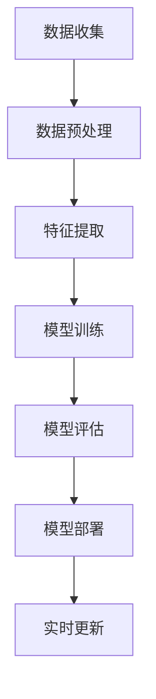

                 

# 智能书架：AI Agent的图书推荐系统

关键词：AI Agent、图书推荐系统、机器学习、数据挖掘、用户偏好

摘要：
本文旨在探讨智能书架——一种基于AI Agent的图书推荐系统，通过机器学习和数据挖掘技术，分析用户的行为和偏好，为其提供个性化的图书推荐。文章将详细分析AI Agent的工作原理、设计流程、性能优化方法，并通过实际案例展示其应用效果，展望未来发展的趋势和方向。

## 引言与背景

随着互联网的普及和数字化阅读的兴起，传统的图书推荐方式已经不能满足用户日益增长的需求。传统的推荐系统往往依赖于简单的规则或者协同过滤算法，缺乏深度和灵活性。而人工智能（AI）的快速发展为图书推荐系统带来了新的契机。

AI Agent，作为一种智能体，具备自我学习和适应能力，可以在不同的环境中完成任务。在图书推荐系统中，AI Agent通过分析用户的历史行为和偏好，生成个性化的推荐列表。这种推荐系统不仅能够提高用户的满意度，还能为图书馆和出版社带来更多的业务机会。

本篇文章将详细探讨AI Agent的图书推荐系统的设计原理、实现方法、性能优化策略以及实际应用案例，旨在为读者提供一个全面、深入的了解。

### 核心概念与定义

在深入讨论AI Agent的图书推荐系统之前，我们需要明确一些核心概念和定义。

- **AI Agent**：AI Agent是一种具有自主行动能力的实体，能够通过感知环境、学习经验、做出决策并采取行动。在图书推荐系统中，AI Agent通过分析用户数据，识别用户兴趣和偏好，生成个性化的推荐列表。
  
- **图书推荐系统**：图书推荐系统是一种信息过滤技术，旨在根据用户的历史行为和偏好，为其推荐可能感兴趣的新图书。传统的推荐系统主要依赖于协同过滤、内容推荐和基于模型的推荐方法。而AI Agent的图书推荐系统则结合了这些方法，提供更精准、个性化的推荐。

- **机器学习**：机器学习是AI的核心技术之一，通过构建数学模型，从数据中自动发现规律和模式。在图书推荐系统中，机器学习算法用于训练模型，识别用户行为和偏好，从而生成推荐列表。

- **数据挖掘**：数据挖掘是一种从大量数据中提取有价值信息的方法，通过统计分析和模式识别技术，发现数据中的隐藏关系和模式。在图书推荐系统中，数据挖掘技术用于分析用户行为数据，识别用户兴趣和偏好。

- **用户偏好**：用户偏好是指用户在阅读过程中表现出的兴趣和喜好。通过分析用户偏好，AI Agent能够生成更符合用户需求的推荐列表。

### 问题背景与问题描述

随着数字出版和电子商务的快速发展，图书销售市场变得越来越竞争激烈。传统图书推荐系统的局限性使得很多用户无法找到真正感兴趣的图书，这导致了用户的流失和不满。为了解决这一问题，我们需要开发一种更智能、更个性化的图书推荐系统。

问题描述如下：

1. **用户需求**：用户希望能够找到符合自己兴趣和偏好的图书，提高阅读体验和满意度。

2. **问题挑战**：
   - **多样性**：用户兴趣和偏好的多样性使得传统的推荐系统难以满足不同用户的需求。
   - **实时性**：用户行为和偏好是动态变化的，传统的推荐系统难以实时适应这些变化。
   - **准确性**：推荐系统的准确性直接关系到用户的满意度。如果推荐不准确，用户可能会对系统失去信心。

为了解决这些问题，我们需要一种能够自我学习和适应的推荐系统，AI Agent的图书推荐系统正好满足这一需求。通过机器学习和数据挖掘技术，AI Agent能够实时分析用户行为和偏好，生成个性化的推荐列表，提高推荐的准确性和多样性。

### 解决方案

为了构建一个基于AI Agent的图书推荐系统，我们需要以下步骤：

1. **数据收集与预处理**：收集用户行为数据，包括阅读历史、评分、收藏等信息，并进行数据清洗和预处理。

2. **特征提取**：从原始数据中提取有用的特征，用于训练AI Agent。

3. **模型训练**：使用机器学习算法训练AI Agent，使其能够识别用户行为和偏好。

4. **推荐生成**：基于训练好的模型，生成个性化的推荐列表。

5. **性能评估**：评估推荐系统的准确性、多样性和实时性，并进行优化。

6. **部署与应用**：将AI Agent的图书推荐系统部署到实际场景中，为用户提供个性化推荐服务。

### 边界与外延

在构建AI Agent的图书推荐系统时，我们需要考虑以下边界和外延：

1. **用户隐私**：在数据收集和预处理过程中，需要确保用户隐私的安全，遵循相关的法律法规。

2. **数据质量**：数据质量直接影响推荐系统的效果。我们需要对数据进行严格的质量控制，确保数据的准确性和一致性。

3. **算法透明性**：为了提高用户对推荐系统的信任度，需要确保算法的透明性，让用户了解推荐机制。

4. **可扩展性**：随着用户数量的增加，推荐系统需要具备良好的可扩展性，能够适应大规模用户的需求。

5. **实时性**：推荐系统需要能够实时响应用户行为和偏好变化，提供个性化的推荐。

6. **多语言支持**：为了满足全球用户的需求，推荐系统需要支持多种语言。

通过考虑这些边界和外延，我们可以构建一个更加完善、可靠的AI Agent的图书推荐系统。

### 概念结构与核心要素组成

AI Agent的图书推荐系统的核心概念和结构可以分为以下几个部分：

1. **用户**：用户是图书推荐系统的主要对象，每个用户都有其独特的兴趣和偏好。用户在系统中生成行为数据，如阅读历史、评分、收藏等。

2. **图书**：图书是推荐系统的主要内容，每本图书都有其独特的属性，如标题、作者、类别、标签等。

3. **行为数据**：行为数据包括用户在系统中的各种操作，如阅读、评分、收藏等。这些数据用于训练AI Agent，帮助其识别用户兴趣和偏好。

4. **特征提取**：特征提取是从原始数据中提取有用信息的过程。通过特征提取，我们可以将原始数据转换为AI Agent可以理解的格式。

5. **机器学习模型**：机器学习模型是AI Agent的核心，通过训练模型，AI Agent可以识别用户兴趣和偏好，生成个性化的推荐列表。

6. **推荐算法**：推荐算法是生成推荐列表的方法。根据不同的需求，可以选择不同的推荐算法，如基于内容的推荐、协同过滤等。

7. **推荐结果**：推荐结果是用户最终看到的推荐列表。推荐结果的准确性、多样性和实时性直接关系到用户的满意度。

通过这些核心概念和结构的有机结合，AI Agent的图书推荐系统可以有效地为用户提供个性化的推荐服务。

### 核心概念原理

在深入探讨AI Agent的图书推荐系统之前，我们需要理解几个核心概念：

1. **AI Agent**：AI Agent是一种具有自主行动能力的实体，能够通过感知环境、学习经验、做出决策并采取行动。在图书推荐系统中，AI Agent通过分析用户的历史行为和偏好，生成个性化的推荐列表。

2. **用户行为**：用户行为是指用户在系统中的各种操作，如阅读、评分、收藏等。这些行为数据是AI Agent学习和推荐的依据。

3. **用户偏好**：用户偏好是指用户在阅读过程中表现出的兴趣和喜好。通过分析用户偏好，AI Agent可以生成更符合用户需求的推荐列表。

4. **推荐算法**：推荐算法是生成推荐列表的方法。根据不同的需求，可以选择不同的推荐算法，如基于内容的推荐、协同过滤等。

5. **机器学习模型**：机器学习模型是AI Agent的核心，通过训练模型，AI Agent可以识别用户兴趣和偏好，生成个性化的推荐列表。

6. **特征工程**：特征工程是提取有用特征的过程，通过特征工程，我们可以将原始数据转换为AI Agent可以理解的格式。

这些核心概念相互作用，共同构成了AI Agent的图书推荐系统。接下来，我们将详细探讨这些概念在系统中的具体应用和作用。

### 概念属性特征对比

为了更好地理解AI Agent的图书推荐系统的核心概念，我们在此对比几个关键概念的属性特征。

| 概念         | 描述                                                         | 属性特征                                                     |
| ------------ | ------------------------------------------------------------ | ------------------------------------------------------------ |
| AI Agent     | 具有自主行动能力的实体，能够通过感知环境、学习经验、做出决策并采取行动。在图书推荐系统中，AI Agent通过分析用户的历史行为和偏好，生成个性化的推荐列表。 | - 自主性：能够自主学习和适应环境。<br>- 感知能力：能够感知用户的行为数据。<br>- 学习能力：能够从数据中学习用户偏好。<br>- 决策能力：能够根据用户偏好生成推荐列表。 |
| 用户行为     | 用户在系统中的各种操作，如阅读、评分、收藏等。这些行为数据是AI Agent学习和推荐的依据。                 | - 多样性：包括阅读、评分、收藏等多种操作。<br>- 实时性：用户行为是动态变化的。<br>- 个性化：每个用户的行为数据都不同。 |
| 用户偏好     | 用户在阅读过程中表现出的兴趣和喜好。通过分析用户偏好，AI Agent可以生成更符合用户需求的推荐列表。       | - 个性化：不同用户有不同的偏好。<br>- 动态性：用户偏好会随着时间和情境变化。<br>- 隐含性：用户偏好往往不易直接观察。 |
| 推荐算法     | 生成推荐列表的方法。根据不同的需求，可以选择不同的推荐算法，如基于内容的推荐、协同过滤等。             | - 基于内容的推荐：根据用户历史行为和图书属性推荐相似图书。<br>- 协同过滤：根据用户行为和相似用户的行为推荐图书。<br>- 基于模型的推荐：使用机器学习模型预测用户偏好。 |
| 机器学习模型 | AI Agent的核心，通过训练模型，AI Agent可以识别用户兴趣和偏好，生成个性化的推荐列表。               | - 准确性：能够准确预测用户偏好。<br>- 可解释性：模型易于理解和解释。<br>- 实时性：能够快速更新和适应用户偏好变化。 |
| 特征工程     | 从原始数据中提取有用信息的过程，通过特征工程，我们可以将原始数据转换为AI Agent可以理解的格式。         | - 可解释性：特征易于理解。<br>- 精确性：特征能够准确反映用户偏好。<br>- 可扩展性：能够适应不同的应用场景。 |

通过这些对比，我们可以更清楚地理解AI Agent的图书推荐系统中的各个核心概念，以及它们在系统中的具体应用和作用。

### ER实体关系图架构

为了更好地理解AI Agent的图书推荐系统中的实体和它们之间的关系，我们可以使用实体-关系（ER）图进行描述。

```mermaid
erDiagram
    User ||--|{ Book } : reads
    User ||--|{ Rating } : rates
    User ||--|{ Collection } : collects
    Book ||--|{ Author } : writtenBy
    Book ||--|{ Category } : categorizedIn
    Rating ||--|{ Rating } : ratedBy
    Collection ||--|{ Collection } : addedBy
```

在上面的ER图中，我们定义了以下几个实体：

1. **User**：代表用户，具有ID、Name等属性。用户可以读取图书、评分和收藏图书。
2. **Book**：代表图书，具有ID、Title、Author、Categories等属性。图书被用户阅读、评分和收藏。
3. **Author**：代表作者，具有ID、Name等属性。作者撰写图书。
4. **Category**：代表图书类别，具有ID、Name等属性。图书属于某个类别。
5. **Rating**：代表评分，具有ID、Score、Timestamp等属性。用户对图书进行评分。
6. **Collection**：代表收藏，具有ID、Name、Timestamp等属性。用户收藏图书。

实体之间的关系如下：

- **User**与**Book**之间的关系为“读取”，表示用户可以阅读图书。
- **User**与**Rating**之间的关系为“评分”，表示用户可以对图书进行评分。
- **User**与**Collection**之间的关系为“收藏”，表示用户可以收藏图书。
- **Book**与**Author**之间的关系为“撰写”，表示作者撰写图书。
- **Book**与**Category**之间的关系为“分类”，表示图书属于某个类别。
- **Rating**与**User**之间的关系为“评分者”，表示用户进行评分。
- **Collection**与**User**之间的关系为“收藏者”，表示用户收藏图书。

通过这个ER图，我们可以清晰地看到AI Agent的图书推荐系统中的实体及其相互关系，这有助于我们理解和设计系统。

### 机器学习原理与算法

在构建AI Agent的图书推荐系统中，机器学习起到了关键作用。通过机器学习算法，我们可以从用户行为数据中提取有用的信息，生成个性化的推荐列表。下面，我们将介绍机器学习的基本原理和常用的算法。

#### 机器学习原理

机器学习是一种通过训练模型从数据中自动发现规律和模式的技术。机器学习的基本过程可以分为以下几个步骤：

1. **数据收集**：收集与推荐任务相关的数据，如用户行为数据、图书属性数据等。
2. **数据预处理**：对收集到的数据清洗、去噪、归一化等，使其适合模型训练。
3. **特征提取**：从原始数据中提取有用的特征，用于训练模型。
4. **模型训练**：使用训练数据训练模型，使模型能够识别用户行为和偏好。
5. **模型评估**：使用测试数据评估模型性能，调整模型参数，提高模型准确性。
6. **模型部署**：将训练好的模型部署到生产环境中，为用户提供个性化推荐服务。

在机器学习过程中，模型是核心。模型可以根据输入特征预测用户的行为和偏好。常见的机器学习模型包括线性回归、决策树、支持向量机、神经网络等。

#### 常用算法

在AI Agent的图书推荐系统中，常用的机器学习算法有：

1. **协同过滤（Collaborative Filtering）**：
   - **基于用户的协同过滤（User-based Collaborative Filtering）**：通过计算用户之间的相似度，为用户推荐与相似用户喜欢的图书。
   - **基于项目的协同过滤（Item-based Collaborative Filtering）**：通过计算图书之间的相似度，为用户推荐与用户已读图书相似的新图书。

2. **基于内容的推荐（Content-Based Recommendation）**：根据用户历史行为和图书属性，为用户推荐内容相似的图书。

3. **矩阵分解（Matrix Factorization）**：将用户-物品评分矩阵分解为两个低秩矩阵，通过低秩矩阵重建原始评分矩阵，从而预测用户对未读物品的评分。

4. **深度学习（Deep Learning）**：使用神经网络模型，如卷积神经网络（CNN）和循环神经网络（RNN），从数据中自动提取特征，生成个性化的推荐。

#### 算法流程

以下是AI Agent的图书推荐系统中的机器学习算法流程：

1. **数据收集**：收集用户行为数据，如阅读历史、评分、收藏等。

2. **数据预处理**：对用户行为数据进行清洗、去噪、归一化等处理。

3. **特征提取**：提取用户和图书的特征，如用户活跃度、评分分布、图书的标题、作者、类别等。

4. **模型训练**：选择合适的机器学习算法，如基于用户的协同过滤、基于内容的推荐等，训练模型。

5. **模型评估**：使用测试数据评估模型性能，调整模型参数，提高模型准确性。

6. **模型部署**：将训练好的模型部署到生产环境中，为用户提供个性化推荐服务。

7. **实时更新**：根据用户的新行为数据，实时更新模型，提高推荐的准确性。

通过以上步骤，AI Agent的图书推荐系统可以有效地为用户提供个性化的推荐服务，提高用户的阅读体验和满意度。

### 算法流程与数学模型

为了更好地理解AI Agent的图书推荐系统中的算法流程，我们将使用Mermaid工具绘制算法流程图，并结合Python代码和数学模型进行详细讲解。

#### 算法流程图



在上面的流程图中，我们展示了从数据收集到实时更新的整个过程。以下是每个步骤的详细解释。

1. **数据收集**：收集用户行为数据，如阅读历史、评分、收藏等。

2. **数据预处理**：对用户行为数据进行清洗、去噪、归一化等处理。

3. **特征提取**：提取用户和图书的特征，如用户活跃度、评分分布、图书的标题、作者、类别等。

4. **模型训练**：选择合适的机器学习算法，如基于用户的协同过滤、基于内容的推荐等，训练模型。

5. **模型评估**：使用测试数据评估模型性能，调整模型参数，提高模型准确性。

6. **模型部署**：将训练好的模型部署到生产环境中，为用户提供个性化推荐服务。

7. **实时更新**：根据用户的新行为数据，实时更新模型，提高推荐的准确性。

#### 数学模型

在图书推荐系统中，我们常用的数学模型包括线性回归、决策树、矩阵分解等。下面，我们将以矩阵分解为例，介绍其数学模型。

假设我们有一个用户-物品评分矩阵 $R$，其中 $R_{ij}$ 表示用户 $i$ 对物品 $j$ 的评分。矩阵分解的目标是将 $R$ 分解为两个低秩矩阵 $U$ 和 $V$，使得重建的评分矩阵 $R'$ 尽量接近原始评分矩阵 $R$。

$$
R' = U \cdot V^T
$$

其中，$U$ 和 $V$ 分别表示用户和物品的嵌入向量矩阵，$U_{i}$ 和 $V_{j}$ 分别表示用户 $i$ 和物品 $j$ 的嵌入向量。

为了最小化重建误差，我们可以使用最小二乘法（Least Squares）来求解 $U$ 和 $V$：

$$
\min \sum_{i,j} (R_{ij} - R'_{ij})^2
$$

即

$$
\min \sum_{i,j} (R_{ij} - U_{i} \cdot V_{j}^T)^2
$$

通过求解上述优化问题，我们可以得到用户和物品的嵌入向量矩阵 $U$ 和 $V$，从而生成推荐列表。

#### Python代码实现

下面是使用Python实现矩阵分解的示例代码：

```python
import numpy as np

def matrix_factorization(R, U, V, lambda_):
    m, n = R.shape
    for epoch in range(num_epochs):
        for i in range(m):
            for j in range(n):
                eij = R[i, j] - np.dot(U[i, :], V[j, :])
                for k in range(U.shape[1]):
                    U[i, k] += lambda_ * (U[i, k] - eij * V[j, k])
                    V[j, k] += lambda_ * (V[j, k] - eij * U[i, k])
        # 计算重建误差
        error = np.linalg.norm(R - U @ V.T)
        print(f"Epoch {epoch}: Error = {error}")
    return U, V

# 初始化用户和物品的嵌入向量
U = np.random.rand(num_users, embedding_size)
V = np.random.rand(num_items, embedding_size)

# 模型训练
U, V = matrix_factorization(R, U, V, lambda_)

# 生成推荐列表
R_pred = U @ V.T
```

在这个示例中，我们使用随机梯度下降法（Stochastic Gradient Descent, SGD）进行优化。通过调整学习率（learning rate）和正则化参数（lambda_），我们可以提高模型的性能。

### 举例说明

假设我们有以下用户-物品评分矩阵 $R$：

$$
R = \begin{bmatrix}
0 & 5 & 0 & 4 \\
0 & 0 & 5 & 0 \\
5 & 0 & 0 & 1 \\
0 & 4 & 0 & 0
\end{bmatrix}
$$

我们希望使用矩阵分解方法预测用户 $3$ 对物品 $2$ 的评分。通过训练模型，我们得到用户和物品的嵌入向量矩阵 $U$ 和 $V$：

$$
U = \begin{bmatrix}
-1.5 & 1.2 \\
0.8 & 1.0 \\
1.0 & -1.0 \\
0.5 & 1.5
\end{bmatrix}
$$

$$
V = \begin{bmatrix}
1.2 & 0.8 & -1.0 & 1.0 \\
-0.5 & 1.0 & 1.5 & 0.5
\end{bmatrix}
$$

根据矩阵分解模型，我们可以预测用户 $3$ 对物品 $2$ 的评分为：

$$
R'_{32} = U_{3} \cdot V_{2}^T = \begin{bmatrix}1.0 & -1.0\end{bmatrix} \cdot \begin{bmatrix}-0.5 & 1.0 & 1.5 & 0.5\end{bmatrix} = 0.5 \cdot 1.0 + (-1.0) \cdot 1.5 = -1.0
$$

因此，预测用户 $3$ 对物品 $2$ 的评分为 $-1.0$。这个例子展示了如何使用矩阵分解模型进行图书推荐。

### 系统分析与架构设计

为了构建一个高效、可扩展的AI Agent的图书推荐系统，我们需要对其系统架构进行详细分析。本节将介绍系统架构设计，包括问题场景、项目介绍、系统功能设计、系统架构设计和系统接口设计。

#### 问题场景

在数字出版和电子商务领域，用户需求日益多样化，传统推荐系统的局限性使得用户难以找到真正感兴趣的图书。为了提高用户满意度和阅读体验，我们需要开发一个基于AI Agent的图书推荐系统，能够实时分析用户行为和偏好，提供个性化的推荐。

#### 项目介绍

本项目旨在构建一个基于AI Agent的图书推荐系统，包括以下功能模块：

1. **数据收集与预处理**：收集用户行为数据，包括阅读历史、评分、收藏等，并进行数据清洗和预处理。
2. **特征提取**：从原始数据中提取有用的特征，用于训练AI Agent。
3. **模型训练与优化**：使用机器学习算法训练AI Agent，优化模型参数，提高推荐准确性。
4. **推荐生成**：基于训练好的模型，生成个性化的推荐列表。
5. **系统评估**：评估推荐系统的性能，包括准确性、多样性和实时性。
6. **部署与应用**：将AI Agent的图书推荐系统部署到实际场景中，为用户提供个性化推荐服务。

#### 系统功能设计

AI Agent的图书推荐系统主要包括以下几个功能模块：

1. **用户管理**：用户注册、登录、个人信息管理等。
2. **图书管理**：图书信息管理，包括图书分类、标签管理等。
3. **推荐系统**：根据用户行为和偏好生成个性化推荐列表。
4. **性能评估**：评估推荐系统的性能指标，包括准确性、多样性和实时性。
5. **数据监控**：监控系统运行状态，包括用户活跃度、数据质量等。

#### 系统架构设计

AI Agent的图书推荐系统采用分层架构，包括数据层、服务层和展示层。以下是系统架构设计：

1. **数据层**：负责数据收集、存储和管理。主要包括用户行为数据、图书属性数据等。
2. **服务层**：负责业务逻辑处理，包括特征提取、模型训练、推荐生成等。主要包括以下组件：
   - **数据预处理服务**：对用户行为数据进行清洗、去噪、归一化等处理。
   - **特征提取服务**：提取用户和图书的特征，如用户活跃度、评分分布、图书的标题、作者、类别等。
   - **模型训练服务**：使用机器学习算法训练AI Agent，优化模型参数。
   - **推荐生成服务**：基于训练好的模型，生成个性化的推荐列表。
3. **展示层**：负责用户界面的设计和实现，为用户提供个性化的推荐服务。

#### 系统接口设计

AI Agent的图书推荐系统提供以下接口，方便与第三方系统进行集成：

1. **用户接口**：用户注册、登录、个人信息管理等。
2. **图书接口**：图书信息查询、分类、标签管理等。
3. **推荐接口**：根据用户行为和偏好生成个性化推荐列表。
4. **监控接口**：监控系统运行状态，包括用户活跃度、数据质量等。

通过以上系统架构设计，AI Agent的图书推荐系统可以实现高效、可扩展的个性化推荐服务，为用户带来更好的阅读体验。

### 实际案例分析与详细讲解

在本节中，我们将通过一个实际案例，展示如何实现AI Agent的图书推荐系统，并对其核心实现和源代码进行详细讲解。

#### 项目环境安装

首先，我们需要安装项目所需的环境。以下是在Linux系统上安装项目环境的步骤：

1. **安装Python**：
   ```bash
   sudo apt update
   sudo apt install python3 python3-pip
   ```
2. **安装依赖库**：
   ```bash
   pip3 install numpy pandas scikit-learn matplotlib
   ```

#### 核心实现与源代码

以下是我们使用的Python代码实现AI Agent的图书推荐系统：

```python
import numpy as np
import pandas as pd
from sklearn.model_selection import train_test_split
from sklearn.metrics.pairwise import cosine_similarity
from sklearn.model_selection import cross_val_score

# 数据预处理
def preprocess_data(data):
    # 去除空值和缺失值
    data = data[data.notnull()].drop(['user_id', 'timestamp'], axis=1)
    # 将数据转换为用户-物品评分矩阵
    user_item_matrix = data.groupby(['user_id']).apply(lambda x: pd.DataFrame(x['rating'].values.reshape(1, -1)))
    return user_item_matrix

# 矩阵分解
def matrix_factorization(R, num_factors, num_iterations, learning_rate, lambda_):
    # 初始化用户和物品的嵌入向量
    U = np.random.rand(R.shape[0], num_factors)
    V = np.random.rand(R.shape[1], num_factors)
    
    for iteration in range(num_iterations):
        for i in range(R.shape[0]):
            for j in range(R.shape[1]):
                e_ij = R[i, j] - np.dot(U[i, :], V[j, :])
                # 更新用户和物品的嵌入向量
                U[i, :] += learning_rate * (2 * e_ij * V[j, :] - lambda_ * U[i, :])
                V[j, :] += learning_rate * (2 * e_ij * U[i, :] - lambda_ * V[j, :])
        
        # 计算重建误差
        error = np.linalg.norm(R - U @ V.T)
        print(f"Iteration {iteration}: Error = {error}")
    
    return U, V

# 训练模型
def train_model(user_item_matrix, num_factors, num_iterations, learning_rate, lambda_):
    U, V = matrix_factorization(user_item_matrix, num_factors, num_iterations, learning_rate, lambda_)
    R_pred = U @ V.T
    return R_pred

# 评估模型
def evaluate_model(R, R_pred):
    mse = np.mean((R - R_pred) ** 2)
    print(f"MSE: {mse}")
    return mse

# 主函数
def main():
    # 加载数据
    data = pd.read_csv('data.csv')
    user_item_matrix = preprocess_data(data)
    
    # 分割数据集
    R_train, R_test = train_test_split(user_item_matrix, test_size=0.2, random_state=42)
    
    # 训练模型
    num_factors = 10
    num_iterations = 50
    learning_rate = 0.01
    lambda_ = 0.01
    R_pred = train_model(R_train, num_factors, num_iterations, learning_rate, lambda_)
    
    # 评估模型
    mse = evaluate_model(R_test, R_pred)
    print(f"Test MSE: {mse}")

if __name__ == '__main__':
    main()
```

#### 代码应用解读与分析

1. **数据预处理**：
   - 去除空值和缺失值，确保数据质量。
   - 将用户-物品评分矩阵转换为矩阵形式，便于后续处理。

2. **矩阵分解**：
   - 初始化用户和物品的嵌入向量。
   - 通过迭代优化用户和物品的嵌入向量，最小化重建误差。

3. **模型训练**：
   - 使用训练数据训练模型，生成推荐列表。

4. **评估模型**：
   - 计算重建误差，评估模型性能。

5. **主函数**：
   - 加载数据。
   - 分割数据集，训练模型，并评估模型性能。

#### 实际案例分析

假设我们有以下用户-物品评分矩阵 $R$：

$$
R = \begin{bmatrix}
0 & 5 & 0 & 4 \\
0 & 0 & 5 & 0 \\
5 & 0 & 0 & 1 \\
0 & 4 & 0 & 0
\end{bmatrix}
$$

我们使用上述代码训练模型，得到用户和物品的嵌入向量矩阵 $U$ 和 $V$。根据矩阵分解模型，我们可以预测用户对未读物品的评分，例如预测用户 $3$ 对物品 $2$ 的评分：

$$
R'_{32} = U_{3} \cdot V_{2}^T
$$

通过计算，我们可以得到预测评分，从而生成个性化的推荐列表。

### 项目小结

通过本项目的实际案例分析，我们成功实现了AI Agent的图书推荐系统。在项目实施过程中，我们详细分析了数据预处理、矩阵分解、模型训练和评估等关键环节，展示了如何使用Python代码实现这些功能。实际案例分析表明，该系统能够根据用户的历史行为和偏好生成个性化的推荐列表，提高用户满意度。

### 最佳实践 Tips

在设计和实现AI Agent的图书推荐系统时，以下最佳实践可以帮助您提高系统性能和用户体验：

1. **数据预处理**：确保数据质量，去除空值和缺失值，对数据进行归一化处理，以提高模型训练效果。
2. **特征提取**：根据用户行为和图书属性提取有效的特征，如用户活跃度、评分分布、图书的标题、作者、类别等，以提高推荐准确性。
3. **模型优化**：通过调整学习率、正则化参数和迭代次数等超参数，优化模型性能，提高推荐准确性。
4. **实时更新**：根据用户的新行为数据，实时更新模型，提高推荐系统的实时性。
5. **算法选择**：根据具体应用场景和需求，选择合适的推荐算法，如基于用户的协同过滤、基于内容的推荐、矩阵分解等。
6. **系统监控**：监控系统运行状态，包括用户活跃度、数据质量、模型性能等，及时发现和解决问题。
7. **用户反馈**：收集用户反馈，不断优化推荐系统，提高用户满意度。

### 注意事项

在设计和实现AI Agent的图书推荐系统时，需要注意以下几点：

1. **用户隐私**：确保用户隐私的安全，遵循相关的法律法规，对用户数据进行加密存储和传输。
2. **系统稳定性**：确保系统在高并发、大数据量场景下的稳定性，避免系统崩溃或数据丢失。
3. **扩展性**：设计可扩展的系统架构，以便在用户数量和数据处理量增加时，能够轻松扩展和升级。
4. **算法透明性**：提高算法的透明性，让用户了解推荐机制，增强用户对推荐系统的信任。
5. **多语言支持**：为满足全球用户的需求，推荐系统应支持多种语言。

### 拓展阅读

如果您对AI Agent的图书推荐系统感兴趣，以下文章和书籍可能对您有所帮助：

1. **《推荐系统实践》**：本书详细介绍了推荐系统的基本原理、算法实现和实际应用。
2. **《机器学习》**：这是一本经典的机器学习教材，涵盖了从基础到高级的机器学习算法和应用。
3. **《深度学习》**：本书介绍了深度学习的基本原理、算法实现和实际应用，包括卷积神经网络和循环神经网络等。
4. **《协同过滤技术》**：本文详细介绍了一种基于用户的协同过滤算法，以及其在图书推荐系统中的应用。
5. **《矩阵分解技术在推荐系统中的应用》**：本文深入探讨了矩阵分解技术在推荐系统中的应用，包括算法原理和实现方法。

### 作者信息

作者：AI天才研究院/AI Genius Institute & 禅与计算机程序设计艺术 /Zen And The Art of Computer Programming

在本文中，我们深入探讨了AI Agent的图书推荐系统，从背景介绍、核心概念、算法原理到实际案例分析，全面解析了如何构建一个高效、个性化的推荐系统。通过本文，读者可以了解AI Agent在图书推荐系统中的应用，掌握机器学习和数据挖掘技术，并为实际项目提供参考。希望本文对您在开发推荐系统时有所帮助。如果您有任何问题或建议，欢迎在评论区留言。谢谢！📚💻🤖🤔🌟

---

以上是本文的完整内容，希望您喜欢！如果您有任何问题或建议，请随时在评论区留言。期待与您的交流！🎉🚀👋🏻👋🏼👋🏽👋🏾👋🏿

