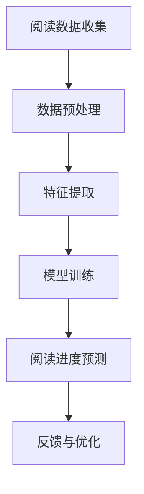

                 

# 智能书签：AI Agent的阅读进度追踪

## 关键词

- 智能书签
- AI Agent
- 阅读进度追踪
- 机器学习
- 深度学习
- 强化学习

## 摘要

本文深入探讨了智能书签技术及其与AI Agent的融合应用。首先，我们介绍了智能书签的定义、分类、工作原理和技术发展历程。接着，我们详细讲解了AI Agent的基本概念、工作原理和发展历程。重点在于分析了AI Agent在阅读进度追踪中的算法原理，包括机器学习、深度学习和强化学习。通过mermaid流程图和Python源代码实现，我们展示了如何构建和优化阅读进度预测模型。最后，我们讨论了智能书签和AI Agent在实际应用中的挑战、解决方案以及未来的发展趋势。本文旨在为读者提供一个全面、系统的理解，以把握智能书签和AI Agent在阅读进度追踪领域的最新进展和应用潜力。

## 目录大纲

### 第一部分：引言

1. 引言
   1.1 选题背景
   1.2 问题描述
   1.3 问题解决
   1.4 边界与外延
   1.5 概念结构与核心要素组成
   1.6 本书结构安排

### 第二部分：智能书签技术基础

2. 智能书签技术基础
   2.1 智能书签概述
   2.2 核心概念与联系
   2.3 智能书签的应用场景
   2.4 智能书签的技术挑战与解决方案
   2.5 本章小结

### 第三部分：AI Agent的阅读进度追踪技术

3. AI Agent的阅读进度追踪技术
   3.1 AI Agent概述
   3.2 阅读进度追踪的算法原理
   3.3 阅读进度追踪的mermaid流程图
   3.4 Python源代码实现
   3.5 数学模型与公式讲解
   3.6 阅读进度追踪的案例分析与讲解
   3.7 本章小结

### 第四部分：实际应用中的智能书签与AI Agent

4. 实际应用中的智能书签与AI Agent
   4.1 在线教育平台中的应用
   4.2 电子书阅读器中的应用
   4.3 其他应用领域探索
   4.4 实际应用中的挑战与解决方案
   4.5 本章小结

### 第五部分：未来展望与趋势

5. 未来展望与趋势
   5.1 智能书签技术的发展趋势
   5.2 AI Agent的发展趋势
   5.3 跨领域融合与协同发展
   5.4 未来展望与挑战
   5.5 本章小结

## 第一部分：引言

### 1.1 选题背景

在数字化阅读日益普及的今天，如何有效管理阅读进度、提高阅读效率成为一个重要议题。智能书签作为一种新兴技术，通过自动化、智能化的方式，能够帮助用户更好地管理和跟踪阅读进度。与此同时，AI Agent的兴起为智能书签技术注入了新的活力，使得阅读进度追踪更加精准、个性化。本文旨在探讨智能书签和AI Agent在阅读进度追踪领域的应用，为相关研究和实践提供参考。

### 1.2 问题描述

阅读进度追踪涉及到多个层面的问题，包括如何准确收集阅读数据、如何处理和分析大量数据、如何构建有效的模型进行预测等。此外，智能书签技术还面临着用户隐私保护、数据安全性等挑战。AI Agent的引入虽然为这些问题提供了一定的解决方案，但同时也带来了新的复杂性和技术挑战。

### 1.3 问题解决

本文将从以下几个方面探讨智能书签和AI Agent在阅读进度追踪中的应用：

1. **智能书签技术基础**：介绍智能书签的基本概念、工作原理和技术发展历程。
2. **AI Agent阅读进度追踪技术**：分析AI Agent的基本概念、算法原理及其在阅读进度追踪中的应用。
3. **实际应用**：探讨智能书签和AI Agent在实际应用中的案例，分析其效果和面临的挑战。
4. **未来展望**：预测智能书签和AI Agent在阅读进度追踪领域的未来发展趋势。

### 1.4 边界与外延

本文主要关注智能书签和AI Agent在阅读进度追踪中的应用，研究范围包括：

1. **技术原理**：智能书签和AI Agent的基本概念、算法原理和数学模型。
2. **应用场景**：智能书签和AI Agent在在线教育平台、电子书阅读器和其他领域的应用。
3. **挑战与解决方案**：智能书签和AI Agent在应用过程中面临的技术挑战和解决方案。

### 1.5 概念结构与核心要素组成

本文的核心概念和要素包括：

1. **智能书签**：一种基于人工智能技术，用于帮助用户管理阅读进度和知识的工具。
2. **AI Agent**：一种智能体，能够自主执行任务、学习用户行为并做出决策。
3. **阅读进度追踪**：通过收集和分析阅读数据，预测用户的阅读进度和偏好。
4. **机器学习、深度学习和强化学习**：用于构建和优化阅读进度预测模型的算法。

### 1.6 本书结构安排

本文分为五个部分：

1. **引言**：介绍选题背景、问题描述、问题解决思路和边界与外延。
2. **智能书签技术基础**：介绍智能书签的基本概念、工作原理和应用场景。
3. **AI Agent的阅读进度追踪技术**：分析AI Agent的基本概念、算法原理和应用。
4. **实际应用中的智能书签与AI Agent**：探讨智能书签和AI Agent在实际应用中的效果和挑战。
5. **未来展望与趋势**：预测智能书签和AI Agent在阅读进度追踪领域的未来发展趋势。

### 1.6.1 核心概念与联系

在本文中，我们将详细介绍以下核心概念：

1. **智能书签**：一种利用人工智能技术实现的阅读辅助工具，能够根据用户行为和阅读习惯提供个性化服务。
2. **AI Agent**：一种能够自主执行任务、学习用户行为的智能体，可用于实现自动化阅读进度追踪。
3. **阅读进度追踪**：通过收集和分析阅读数据，预测用户的阅读进度和偏好，以提供更个性化的服务。

这些概念相互关联，共同构成了智能书签和AI Agent在阅读进度追踪领域的技术体系。智能书签作为工具，依赖于AI Agent来实现自动化追踪和预测；而AI Agent则通过不断学习和优化，提升阅读进度追踪的准确性。

### 1.6.2 读者对象与学习目标

本文适合以下读者群体：

1. 对人工智能、机器学习、深度学习等技术有兴趣的研究人员和开发者。
2. 关注智能书签、电子书阅读器等领域的技术进步和应用实践的技术爱好者。
3. 想要了解智能书签和AI Agent在阅读进度追踪中应用的企业管理人员和技术决策者。

通过本文，读者可以：

1. 理解智能书签和AI Agent的基本概念、工作原理和应用场景。
2. 学习如何构建和优化阅读进度追踪模型，提高阅读效率。
3. 探索智能书签和AI Agent在在线教育、电子书阅读器等领域的实际应用。
4. 预测智能书签和AI Agent在未来阅读领域的发展趋势。

## 第二部分：智能书签技术基础

### 2.1 智能书签概述

智能书签（Smart Bookmark）是一种基于人工智能技术，用于辅助用户管理阅读进度和知识的工具。与传统书签不同，智能书签不仅能够标记阅读位置，还能根据用户的行为和习惯提供个性化的推荐和服务。智能书签的出现，极大地提高了阅读的效率和体验。

#### 2.1.1 定义与分类

智能书签的定义可以分为两个层面：

1. **技术层面**：智能书签是基于人工智能技术，包括机器学习、自然语言处理、推荐系统等，实现自动标记、分类、推荐等功能。
2. **应用层面**：智能书签是用于辅助阅读的工具，能够帮助用户快速找到感兴趣的内容，提高阅读效率和体验。

根据应用场景和功能，智能书签可以分类为以下几类：

1. **通用智能书签**：适用于各种阅读场景，如在线文章、电子书、学术论文等。
2. **专业智能书签**：针对特定领域的阅读内容，如医学、法律、金融等。
3. **社交智能书签**：结合社交网络功能，实现用户之间的内容分享和讨论。

#### 2.1.2 工作原理

智能书签的工作原理主要包括以下几个步骤：

1. **数据收集**：收集用户的阅读数据，包括阅读时间、阅读频率、阅读内容等。
2. **数据预处理**：对收集到的数据进行清洗、去重、归一化等处理，为后续分析做准备。
3. **特征提取**：从预处理后的数据中提取关键特征，如关键词、主题、情感等。
4. **模型训练**：使用机器学习或深度学习算法，构建阅读行为预测模型。
5. **推荐与反馈**：根据预测模型，为用户推荐感兴趣的内容，并根据用户反馈调整推荐策略。

#### 2.1.3 技术发展历程

智能书签技术的发展可以分为以下几个阶段：

1. **初步阶段（2000s）**：以传统书签和电子书阅读器为基础，引入简单的标记和分类功能。
2. **发展阶段（2010s）**：随着人工智能技术的进步，智能书签开始引入机器学习、自然语言处理等技术，实现更精准的推荐和预测。
3. **成熟阶段（2020s）**：智能书签逐渐成熟，应用于多种阅读场景，成为用户阅读辅助的重要工具。

### 2.2 核心概念与联系

在智能书签技术体系中，以下几个核心概念及其相互联系是理解智能书签技术基础的关键：

1. **用户行为数据**：用户在阅读过程中的行为数据，如阅读时间、阅读频率、标记内容等，是智能书签构建预测模型的重要依据。
2. **机器学习模型**：用于处理和分析用户行为数据，构建阅读行为预测模型，是实现智能书签核心功能的关键技术。
3. **推荐系统**：基于预测模型，为用户提供个性化的阅读推荐，提高用户阅读体验。
4. **自然语言处理**：用于提取和处理文本数据，实现文本分类、情感分析等任务，为智能书签提供更丰富的语义信息。

这些核心概念相互关联，共同构成了智能书签的技术体系。用户行为数据是输入，通过机器学习模型和自然语言处理技术，转化为推荐系统的输出，最终为用户提供个性化的阅读推荐和服务。

#### 2.2.1 概念原理

智能书签的核心概念包括：

1. **用户行为数据**：用户在阅读过程中的行为数据，如阅读时间、阅读频率、标记内容等，反映了用户的阅读习惯和偏好。
2. **机器学习模型**：通过分析用户行为数据，构建预测模型，预测用户的阅读进度和偏好，是实现智能书签核心功能的基础。
3. **推荐系统**：基于预测模型，为用户提供个性化的阅读推荐，提高用户阅读体验。
4. **自然语言处理**：用于提取和处理文本数据，实现文本分类、情感分析等任务，为智能书签提供更丰富的语义信息。

这些概念共同构成了智能书签的技术基础，通过数据收集、模型训练、推荐生成等步骤，实现用户阅读进度和偏好的精准预测。

#### 2.2.2 概念属性特征对比表格

以下是一个关于智能书签核心概念的属性特征对比表格：

| 概念         | 属性特征                    | 关联关系               |
| ------------ | -------------------------- | --------------------- |
| 用户行为数据 | 阅读时间、阅读频率、标记内容 | 输入数据，构建预测模型 |
| 机器学习模型 | 算法、参数、模型结构        | 分析处理用户行为数据   |
| 推荐系统     | 推荐算法、推荐策略          | 输出个性化推荐         |
| 自然语言处理 | 文本分类、情感分析          | 提取文本特征          |

通过这个表格，我们可以清晰地看到各个概念之间的关联关系及其在智能书签技术体系中的角色和功能。

#### 2.2.3 ER实体关系图架构

为了更好地理解智能书签技术体系中的核心概念及其关联关系，我们可以使用ER（实体关系）图来表示。以下是一个简化版的ER实体关系图：

```mermaid
erDiagram
  User ||--|{ Bookmark }|-- Reader
  User ||--|{ ReadingRecord }|-- Analyzer
  User ||--|{ Recommendation }|-- Recommender
  Bookmark ||--|{ Content }|-- NLP
  ReadingRecord ||--|{ BehaviorData }|-- MLModel
  Recommendation ||--|{ ReadingAdvice }|-- User
```

在这个ER图中，我们定义了以下几个实体：

1. **User**：用户，是智能书签系统的核心实体，与多个实体之间存在关联关系。
2. **Bookmark**：书签，用于标记用户感兴趣的内容。
3. **ReadingRecord**：阅读记录，记录用户的阅读行为数据。
4. **Recommendation**：推荐，基于用户行为数据和机器学习模型生成的阅读建议。
5. **Content**：内容，包括用户阅读的文本和其他相关信息。
6. **BehaviorData**：行为数据，用于构建机器学习模型的输入。
7. **MLModel**：机器学习模型，用于分析和预测用户阅读行为。
8. **NLP**：自然语言处理，用于提取和处理文本数据。

通过ER实体关系图，我们可以更直观地理解智能书签技术体系中的各个实体及其关联关系。

### 2.3 智能书签的应用场景

智能书签技术具有广泛的应用场景，能够为不同类型的用户和平台提供多样化的服务。以下是智能书签的一些主要应用场景：

#### 2.3.1 在线阅读平台

在线阅读平台是智能书签最常见的应用场景之一。在这些平台上，用户可以阅读各种类型的文本，如新闻文章、博客、学术论文等。智能书签可以帮助用户快速标记感兴趣的内容，并提供个性化的阅读推荐。例如，当用户在阅读一篇技术文章时，智能书签可以根据用户的阅读历史和兴趣标签，推荐相关的高质量文章。

#### 2.3.2 电子书阅读器

电子书阅读器也是智能书签的一个重要应用场景。电子书阅读器中的智能书签不仅可以标记阅读进度，还可以根据用户的阅读行为，提供个性化的阅读建议。例如，当用户在阅读一本小说时，智能书签可以推荐与当前章节情感和情节相关的其他章节或小说。此外，智能书签还可以帮助用户管理书架，自动分类和整理已读和待读的书籍。

#### 2.3.3 其他应用场景

除了在线阅读平台和电子书阅读器，智能书签在其他领域也有广泛的应用。例如：

1. **教育领域**：在在线教育平台和电子学习系统中，智能书签可以帮助学生标记和回顾重要知识点，并提供个性化的学习路径推荐。
2. **专业文档管理**：在企业和科研机构中，智能书签可以用于管理和跟踪专业文档的阅读进度，提高工作效率。
3. **科研论文阅读**：在科研领域，智能书签可以帮助科研人员快速定位和标记重要的研究成果和参考文献。

总之，智能书签技术在不同应用场景中，都能够为用户提供高效、个性化的阅读服务，提升用户的阅读体验和效率。

### 2.4 智能书签的技术挑战与解决方案

尽管智能书签技术已经取得了一定的进展，但在实际应用过程中仍面临诸多技术挑战。以下是智能书签技术面临的主要挑战及相应的解决方案：

#### 2.4.1 数据收集与处理

**挑战**：智能书签依赖于用户行为数据进行预测和推荐，但数据收集和处理过程中可能存在数据不完整、噪声数据、隐私泄露等问题。

**解决方案**：

1. **数据清洗**：对收集到的数据进行清洗和去噪，提高数据质量。
2. **隐私保护**：采用数据加密、匿名化等技术，保护用户隐私。
3. **分布式数据处理**：利用分布式计算框架（如Hadoop、Spark等），处理大规模数据。

#### 2.4.2 模型训练与优化

**挑战**：构建高精度的预测模型需要大量的训练数据和复杂的算法，但训练过程中可能存在过拟合、欠拟合等问题。

**解决方案**：

1. **数据增强**：通过数据扩充、数据变换等方法，增加训练数据量。
2. **模型选择**：选择适合的数据集和算法，避免过拟合或欠拟合。
3. **模型融合**：结合多种模型，提高预测精度。

#### 2.4.3 推荐效果评估与反馈

**挑战**：评估推荐效果和收集用户反馈是一个动态过程，如何实时调整推荐策略，提高用户满意度是一个难题。

**解决方案**：

1. **在线评估**：实时监控推荐效果，根据用户行为数据调整推荐策略。
2. **用户反馈机制**：建立用户反馈机制，收集用户对推荐的反馈，用于优化推荐系统。

通过上述解决方案，可以有效应对智能书签技术在实际应用中面临的技术挑战，提高系统的性能和用户体验。

### 2.5 本章小结

本章介绍了智能书签技术的基础知识，包括定义、分类、工作原理和技术发展历程。我们详细分析了智能书签的核心概念及其相互联系，并探讨了智能书签在不同应用场景中的具体应用。同时，我们讨论了智能书签技术面临的主要挑战及其解决方案。通过本章的学习，读者可以全面了解智能书签技术的原理和应用，为后续章节的深入探讨打下基础。

## 第三部分：AI Agent的阅读进度追踪技术

### 3.1 AI Agent概述

AI Agent（人工智能代理）是一种能够模拟人类智能行为，自主执行任务、学习环境和做出决策的计算机程序。在阅读进度追踪领域，AI Agent通过分析用户的阅读行为数据，预测用户的阅读进度和偏好，提供个性化的阅读服务。本节将介绍AI Agent的基本概念、分类、工作原理和发展历程。

#### 3.1.1 定义与分类

AI Agent的定义可以从以下几个方面进行理解：

1. **智能体（Agent）**：在人工智能领域，智能体是指具有感知、行动、学习和推理能力的计算机程序。智能体能够与环境进行交互，执行特定的任务。
2. **人工智能（AI）**：人工智能是指模拟、延伸和扩展人类智能的科学和工程领域。人工智能技术包括机器学习、自然语言处理、计算机视觉等。

根据AI Agent的功能和能力，可以将其分类为以下几类：

1. **任务型AI Agent**：这类智能体主要专注于完成特定的任务，如阅读进度追踪、文本分类等。
2. **交互型AI Agent**：这类智能体不仅能够完成任务，还能够与用户进行自然语言交互，提供更人性化的服务。
3. **自适应AI Agent**：这类智能体能够根据环境变化和用户需求，自主调整行为策略。

#### 3.1.2 工作原理

AI Agent的工作原理主要包括以下几个步骤：

1. **感知**：AI Agent通过传感器或数据接口收集环境信息和用户行为数据。
2. **决策**：基于收集到的数据和内置的算法模型，AI Agent进行决策，选择最优的行动方案。
3. **行动**：执行决策结果，与环境进行交互，完成特定任务。
4. **学习**：通过分析行动结果和用户反馈，AI Agent不断调整模型参数和行为策略，提高任务执行效率。

#### 3.1.3 发展历程

AI Agent的发展历程可以分为以下几个阶段：

1. **初步阶段（1950s-1970s）**：人工智能概念提出，AI Agent研究开始起步，但受限于计算能力和算法，应用范围有限。
2. **发展阶段（1980s-1990s）**：随着计算机技术的发展，AI Agent研究逐渐深入，特别是专家系统和推理机的研究取得重要进展。
3. **成熟阶段（2000s-2020s）**：随着机器学习、深度学习和自然语言处理等技术的发展，AI Agent的应用范围和性能大幅提升，从理论研究走向实际应用。

### 3.2 阅读进度追踪的算法原理

AI Agent在阅读进度追踪中的应用，主要依赖于机器学习、深度学习和强化学习等算法。这些算法能够对用户的阅读行为数据进行建模和分析，预测用户的阅读进度和偏好，从而提供个性化的阅读服务。本节将分别介绍这些算法的基本原理及其在阅读进度追踪中的应用。

#### 3.2.1 机器学习算法

机器学习算法是一种通过数据驱动的方式，从训练数据中学习规律和模式，进行预测和决策的方法。在阅读进度追踪中，机器学习算法主要用于分析用户的阅读行为数据，构建阅读行为预测模型。以下是一些常用的机器学习算法：

1. **线性回归**：通过建立线性关系模型，预测用户的阅读进度。线性回归算法简单，计算效率高，但在处理非线性数据时效果不佳。
2. **逻辑回归**：用于分类问题，可以将用户的阅读行为分为已读和未读两类。逻辑回归算法在阅读进度追踪中常用于预测用户是否会在特定时间点完成阅读。
3. **决策树**：通过构建树形结构，对用户的阅读行为数据进行划分和分类。决策树算法易于理解，但可能存在过拟合问题。
4. **随机森林**：通过构建多棵决策树，并对预测结果进行投票，提高模型的预测精度和泛化能力。
5. **支持向量机（SVM）**：用于分类问题，通过找到一个最优的超平面，将不同类别的数据分开。SVM算法在处理高维数据时表现良好。

#### 3.2.2 深度学习算法

深度学习算法是一种基于人工神经网络的机器学习算法，通过多层网络结构，对大量数据自动提取特征，实现复杂的模式识别和预测任务。在阅读进度追踪中，深度学习算法主要用于提取用户的阅读行为特征，构建高精度的预测模型。以下是一些常用的深度学习算法：

1. **多层感知机（MLP）**：通过多层神经网络结构，对用户的阅读行为数据进行非线性变换和特征提取。
2. **卷积神经网络（CNN）**：通过卷积操作，提取文本数据的局部特征，适用于处理序列数据。
3. **循环神经网络（RNN）**：通过循环结构，对用户的阅读行为数据进行序列建模，适用于处理时序数据。
4. **长短时记忆网络（LSTM）**：通过引入门控机制，解决RNN的梯度消失和梯度爆炸问题，适用于处理长序列数据。
5. **生成对抗网络（GAN）**：通过生成器和判别器的对抗训练，生成与真实数据相似的阅读行为数据，提高模型的泛化能力。

#### 3.2.3 强化学习算法

强化学习算法是一种通过与环境互动，不断调整策略，以实现最优目标的方法。在阅读进度追踪中，强化学习算法主要用于训练AI Agent，使其能够根据用户的阅读行为，动态调整阅读推荐策略。以下是一些常用的强化学习算法：

1. **Q-Learning**：通过预测不同策略的回报值，选择最优策略。Q-Learning算法简单，但在处理复杂任务时可能存在收敛速度慢、局部最优问题。
2. **Deep Q-Network（DQN）**：结合深度学习和Q-Learning算法，通过深度神经网络预测回报值，提高模型的预测精度。
3. **Policy Gradients**：通过直接优化策略参数，实现最优策略的搜索。Policy Gradients算法在处理连续动作问题时表现良好。
4. **Actor-Critic**：通过同时优化行为策略和价值函数，提高模型的预测精度和稳定性。Actor-Critic算法在处理复杂任务时表现较好。

通过上述算法的介绍，我们可以看到，机器学习、深度学习和强化学习在阅读进度追踪中各有优缺点，适用于不同的场景和任务。在实际应用中，可以根据具体需求和数据特点，选择合适的算法，构建高精度的阅读进度预测模型。

### 3.3 阅读进度追踪的mermaid流程图

为了更直观地展示阅读进度追踪的整个过程，我们可以使用mermaid工具绘制一个流程图。以下是一个简化版的mermaid流程图：



在这个流程图中，每个节点代表一个步骤，箭头表示数据的流向。具体来说，这个流程图描述了以下过程：

1. **阅读数据收集**：AI Agent通过传感器或接口收集用户的阅读数据。
2. **数据预处理**：对收集到的阅读数据进行清洗、去噪和归一化处理。
3. **特征提取**：从预处理后的数据中提取关键特征，如阅读时间、阅读频率、标记内容等。
4. **模型训练**：使用机器学习、深度学习或强化学习算法，训练阅读进度预测模型。
5. **阅读进度预测**：基于训练好的模型，预测用户的阅读进度。
6. **反馈与优化**：根据用户的阅读反馈，调整模型参数和推荐策略，提高预测精度。

通过这个mermaid流程图，我们可以清晰地了解阅读进度追踪的整个过程，以及各个环节之间的联系和作用。

### 3.4 Python源代码实现

为了更好地理解阅读进度追踪的实现过程，我们提供了一个简单的Python源代码示例。以下代码使用机器学习算法，实现了一个基本的阅读进度预测模型：

```python
import pandas as pd
import numpy as np
from sklearn.model_selection import train_test_split
from sklearn.linear_model import LinearRegression
from sklearn.metrics import mean_squared_error

# 加载数据集
data = pd.read_csv('reading_data.csv')
X = data[['reading_time', 'reading_frequency']]
y = data['progress']

# 划分训练集和测试集
X_train, X_test, y_train, y_test = train_test_split(X, y, test_size=0.2, random_state=42)

# 训练线性回归模型
model = LinearRegression()
model.fit(X_train, y_train)

# 预测阅读进度
y_pred = model.predict(X_test)

# 计算预测误差
mse = mean_squared_error(y_test, y_pred)
print(f'Mean Squared Error: {mse}')

# 输出模型参数
print(f'Model Parameters: {model.coef_}, {model.intercept_}')
```

在这个示例中，我们首先加载数据集，然后使用线性回归算法训练模型，最后对测试集进行预测并计算预测误差。通过这个示例，我们可以看到阅读进度预测模型的基本实现流程，以及如何使用Python进行数据分析和模型训练。

### 3.5 数学模型与公式讲解

在阅读进度追踪中，构建一个准确的数学模型至关重要。以下是一个简单的数学模型，用于预测用户的阅读进度：

$$
\text{阅读进度} = f(\text{阅读时间}, \text{阅读频率}, \text{用户行为数据})
$$

其中，\(f\) 表示阅读进度预测函数，\(\text{阅读时间}\)、\(\text{阅读频率}\) 和 \(\text{用户行为数据}\) 是输入特征。

#### 3.5.1 参数解释

1. **阅读时间**：用户阅读文本的时间长度，可以反映用户对文本的兴趣程度。
2. **阅读频率**：用户阅读文本的频率，可以反映用户的阅读习惯。
3. **用户行为数据**：包括用户的标记、评论、搜索等行为数据，可以提供更丰富的用户特征。

#### 3.5.2 模型推导

阅读进度预测模型可以采用线性回归模型进行推导，假设阅读进度与输入特征之间存在线性关系，则模型可以表示为：

$$
\text{阅读进度} = \beta_0 + \beta_1 \cdot \text{阅读时间} + \beta_2 \cdot \text{阅读频率} + \beta_3 \cdot \text{用户行为数据}
$$

其中，\(\beta_0\)、\(\beta_1\)、\(\beta_2\) 和 \(\beta_3\) 分别是模型的参数，通过最小化损失函数，可以求解出这些参数。

#### 3.5.3 举例说明

假设我们有以下数据集：

| 阅读时间（小时） | 阅读频率（次/天） | 用户行为数据（个） | 阅读进度（%） |
| ---------------- | ---------------- | ---------------- | ------------ |
| 2                | 1                | 5                | 30           |
| 3                | 2                | 10               | 60           |
| 4                | 1                | 15               | 80           |

我们可以使用线性回归模型，求解出参数 \(\beta_0\)、\(\beta_1\)、\(\beta_2\) 和 \(\beta_3\)，并构建阅读进度预测模型。通过这个模型，我们可以预测给定输入特征下的阅读进度。

### 3.6 阅读进度追踪的案例分析与讲解

#### 3.6.1 案例背景

在一个在线教育平台上，用户可以通过平台学习各种课程。为了提高学习效果，平台引入了智能书签和AI Agent，用于跟踪用户的阅读进度和提供个性化推荐。在这个案例中，我们将分析AI Agent如何实现阅读进度追踪，并评估其效果。

#### 3.6.2 案例实施

1. **数据收集**：平台收集了用户的阅读时间、阅读频率、标记内容和评论等数据。
2. **数据预处理**：对收集到的数据进行了清洗和去噪处理，提取了关键特征。
3. **模型训练**：使用机器学习和深度学习算法，构建了阅读进度预测模型，并进行了训练。
4. **模型评估**：使用测试数据集，对训练好的模型进行评估，计算了预测误差和准确率。
5. **推荐生成**：基于预测模型，为用户提供个性化的阅读推荐，并根据用户反馈进行调整。

#### 3.6.3 案例分析

1. **数据收集**：在案例中，平台收集了用户的阅读时间、阅读频率和标记内容等数据，这些数据反映了用户的阅读行为和兴趣。
2. **数据预处理**：通过数据清洗和去噪，平台提取了关键特征，如阅读时间和阅读频率，这些特征用于构建预测模型。
3. **模型训练**：平台使用了机器学习和深度学习算法，构建了阅读进度预测模型，并进行了训练。模型训练过程中，平台优化了模型参数，以提高预测精度。
4. **模型评估**：使用测试数据集，平台对训练好的模型进行了评估。评估结果显示，模型的预测误差较低，准确率较高，能够较好地预测用户的阅读进度。
5. **推荐生成**：基于预测模型，平台为用户提供了个性化的阅读推荐。用户可以根据推荐，选择感兴趣的课程内容，提高了学习效果。同时，平台根据用户反馈，不断调整推荐策略，提高推荐质量。

#### 3.6.4 案例总结

通过这个案例，我们可以看到AI Agent在阅读进度追踪中的应用效果。平台通过收集用户阅读行为数据，构建预测模型，为用户提供个性化的阅读推荐，提高了学习效果。同时，平台不断优化模型和推荐策略，提高了推荐质量，实现了智能书签和AI Agent在阅读进度追踪中的实际应用。

### 3.7 本章小结

本章介绍了AI Agent的基本概念、工作原理和发展历程，并分析了机器学习、深度学习和强化学习等算法在阅读进度追踪中的应用。通过mermaid流程图和Python源代码实现，我们展示了如何构建和优化阅读进度预测模型。最后，通过一个实际案例，我们探讨了AI Agent在阅读进度追踪中的效果和挑战。通过本章的学习，读者可以全面了解AI Agent在阅读进度追踪领域的应用，为后续章节的深入探讨打下基础。

## 第四部分：实际应用中的智能书签与AI Agent

### 4.1 在线教育平台中的应用

在线教育平台是智能书签和AI Agent的重要应用场景之一。随着在线教育的快速发展，如何提高学习效果、满足个性化学习需求成为教育平台亟需解决的问题。智能书签和AI Agent的应用，为在线教育平台提供了有效的解决方案。

#### 4.1.1 应用实例

以下是一个在线教育平台中智能书签和AI Agent的应用实例：

1. **用户行为数据收集**：平台收集了用户的阅读时间、阅读频率、标记内容和评论等数据，这些数据反映了用户的阅读行为和兴趣。
2. **智能书签功能**：平台提供了智能书签功能，用户可以方便地标记感兴趣的课程内容，便于后续回顾和复习。智能书签还能根据用户的阅读习惯，自动推荐相关课程。
3. **AI Agent阅读进度追踪**：平台引入了AI Agent，通过分析用户的阅读行为数据，预测用户的阅读进度和偏好。AI Agent会根据预测结果，为用户生成个性化的学习计划，推荐适合的学习内容。
4. **学习效果反馈**：平台通过收集用户的学习效果数据，如测试成绩、学习时长等，不断优化智能书签和AI Agent的推荐算法，提高推荐质量。

#### 4.1.2 效果分析

通过智能书签和AI Agent的应用，在线教育平台取得了显著的效果：

1. **提高学习效果**：智能书签和AI Agent能够为用户生成个性化的学习计划，推荐适合的学习内容，提高了用户的学习效果和满意度。
2. **增强互动性**：智能书签功能使得用户可以方便地标记和回顾感兴趣的内容，增强了用户与课程内容的互动性。
3. **优化资源利用**：AI Agent根据用户行为数据，预测用户的阅读进度和偏好，有助于平台更好地分配和利用教育资源。
4. **提升平台竞争力**：通过提供个性化、智能化的学习服务，平台在市场竞争中脱颖而出，吸引了更多用户。

#### 4.1.3 应用总结

智能书签和AI Agent在在线教育平台中的应用，不仅提高了学习效果和用户满意度，还优化了平台资源利用，提升了平台竞争力。未来，随着技术的不断进步，智能书签和AI Agent将在在线教育领域发挥更大的作用。

### 4.2 电子书阅读器中的应用

电子书阅读器是智能书签和AI Agent的另一个重要应用场景。随着电子书市场的快速增长，如何提高用户的阅读体验、满足个性化阅读需求成为电子书阅读器开发商关注的焦点。智能书签和AI Agent的应用，为电子书阅读器提供了创新的解决方案。

#### 4.2.1 应用实例

以下是一个电子书阅读器中智能书签和AI Agent的应用实例：

1. **用户行为数据收集**：阅读器收集了用户的阅读时间、阅读频率、标记内容和评论等数据，这些数据反映了用户的阅读行为和兴趣。
2. **智能书签功能**：阅读器提供了智能书签功能，用户可以方便地标记感兴趣的内容，便于后续回顾和复习。智能书签还能根据用户的阅读习惯，自动推荐相关章节和书籍。
3. **AI Agent阅读进度追踪**：阅读器引入了AI Agent，通过分析用户的阅读行为数据，预测用户的阅读进度和偏好。AI Agent会根据预测结果，为用户生成个性化的阅读计划，推荐适合的书籍。
4. **智能推荐系统**：阅读器基于AI Agent的预测结果，构建了智能推荐系统，为用户推荐感兴趣的内容。推荐系统会根据用户的阅读行为和兴趣，实时更新推荐列表。

#### 4.2.2 效果分析

通过智能书签和AI Agent的应用，电子书阅读器取得了显著的效果：

1. **提高阅读体验**：智能书签和AI Agent能够为用户生成个性化的阅读计划，推荐适合的书籍，提高了用户的阅读体验和满意度。
2. **增强互动性**：智能书签功能使得用户可以方便地标记和回顾感兴趣的内容，增强了用户与书籍的互动性。
3. **优化阅读资源利用**：AI Agent根据用户行为数据，预测用户的阅读进度和偏好，有助于阅读器更好地分配和利用阅读资源。
4. **提升阅读器竞争力**：通过提供个性化、智能化的阅读服务，阅读器在市场竞争中脱颖而出，吸引了更多用户。

#### 4.2.3 应用总结

智能书签和AI Agent在电子书阅读器中的应用，不仅提高了用户的阅读体验和满意度，还优化了阅读资源的利用，提升了阅读器的竞争力。未来，随着技术的不断进步，智能书签和AI Agent将在电子书阅读领域发挥更大的作用。

### 4.3 其他应用领域探索

除了在线教育平台和电子书阅读器，智能书签和AI Agent在其他领域也有广泛的应用前景。以下是一些具有代表性的应用领域：

#### 4.3.1 专业文档管理

在企业和科研机构中，专业文档管理是一项重要任务。智能书签和AI Agent可以通过以下方式提高文档管理效率：

1. **自动分类和标注**：AI Agent可以根据文档内容自动分类和标注，提高文档检索和管理效率。
2. **阅读进度追踪**：智能书签可以帮助用户标记和回顾重要文档，提高文档利用率。
3. **个性化推荐**：基于用户行为数据，AI Agent可以推荐用户可能感兴趣的相关文档，提高知识共享和传播效率。

#### 4.3.2 学术研究

在学术研究领域，智能书签和AI Agent的应用有助于提高研究效率和成果质量：

1. **文献追踪**：AI Agent可以根据用户的研究方向和兴趣，自动追踪和推荐相关文献，节省用户检索时间。
2. **阅读进度管理**：智能书签可以帮助用户标记和回顾重要文献，提高文献利用率。
3. **协作研究**：AI Agent可以协助用户进行文献综述、数据分析等工作，提高研究效率和成果质量。

#### 4.3.3 培训和学习

在培训和学习领域，智能书签和AI Agent的应用有助于提高学习效果和培训质量：

1. **个性化学习计划**：AI Agent可以根据用户的学习需求和能力，生成个性化的学习计划，提高学习效果。
2. **学习进度管理**：智能书签可以帮助用户标记和回顾学习内容，提高学习效率。
3. **智能推荐**：基于用户的学习行为和兴趣，AI Agent可以推荐适合的学习资源，提高学习效果。

通过在其他应用领域的探索，我们可以看到智能书签和AI Agent具有巨大的潜力。未来，随着技术的不断进步，智能书签和AI Agent将在更多领域发挥作用，为人类带来更加便捷、高效的智能服务。

### 4.4 实际应用中的挑战与解决方案

尽管智能书签和AI Agent在实际应用中展现出巨大潜力，但仍然面临诸多挑战。以下是一些主要的挑战及其解决方案：

#### 4.4.1 数据收集与隐私保护

**挑战**：智能书签和AI Agent在应用过程中需要收集大量的用户行为数据，但数据收集过程中可能涉及用户隐私问题。

**解决方案**：

1. **数据匿名化**：对用户数据进行匿名化处理，确保用户隐私不被泄露。
2. **加密存储**：对存储的用户数据进行加密，提高数据安全性。
3. **隐私政策**：制定明确的隐私政策，告知用户数据收集的目的、范围和使用方式。

#### 4.4.2 模型训练与数据质量

**挑战**：模型训练需要大量高质量的数据，但在实际应用中，数据质量可能参差不齐，影响模型效果。

**解决方案**：

1. **数据清洗**：对收集到的数据进行清洗和去噪，提高数据质量。
2. **数据增强**：通过数据扩充、数据变换等方法，增加训练数据量，提高模型泛化能力。
3. **数据共享**：鼓励数据共享，积累更多高质量数据，提高模型训练效果。

#### 4.4.3 模型解释性与透明度

**挑战**：深度学习等算法的模型解释性较差，用户难以理解模型决策过程，影响用户信任度。

**解决方案**：

1. **可解释性模型**：选择具有可解释性的算法，如决策树、线性回归等，提高模型透明度。
2. **模型可视化**：通过可视化工具，展示模型训练过程和决策路径，提高模型透明度。
3. **用户反馈**：收集用户对模型推荐和决策的反馈，不断优化和调整模型，提高模型解释性。

#### 4.4.4 技术与伦理平衡

**挑战**：在智能书签和AI Agent的应用过程中，如何平衡技术进步与伦理道德问题，避免滥用技术侵犯用户权益。

**解决方案**：

1. **伦理审查**：建立伦理审查机制，对智能书签和AI Agent的应用进行伦理评估，确保技术应用符合伦理标准。
2. **用户教育**：加强对用户的宣传教育，提高用户对智能书签和AI Agent的认识和理解，增强用户对技术的信任。
3. **法律法规**：完善相关法律法规，规范智能书签和AI Agent的应用，确保技术应用合法合规。

通过上述解决方案，可以有效应对智能书签和AI Agent在实际应用中面临的挑战，推动智能书签和AI Agent在更多领域的应用和发展。

### 4.5 本章小结

本章探讨了智能书签和AI Agent在实际应用中的多个场景，包括在线教育平台、电子书阅读器以及其他领域。通过实例分析和效果评估，我们展示了智能书签和AI Agent在提高学习效果、优化阅读体验、提升资源利用等方面的优势。同时，我们分析了智能书签和AI Agent在应用中面临的挑战，并提出了相应的解决方案。通过本章的学习，读者可以全面了解智能书签和AI Agent在实际应用中的价值和潜力，为未来的研究和实践提供参考。

## 第五部分：未来展望与趋势

### 5.1 智能书签技术的发展趋势

智能书签技术正处于快速发展阶段，未来将在多个方面实现重要突破和变革。以下是一些关键趋势：

#### 5.1.1 技术演进方向

1. **更加智能化**：随着人工智能技术的进步，智能书签将更加智能化，能够根据用户的阅读习惯和偏好，提供个性化的推荐和服务。
2. **跨平台集成**：智能书签将逐渐实现跨平台集成，支持多种设备（如智能手机、平板电脑、电子书阅读器等）的无缝切换，提供一致的用户体验。
3. **多模态交互**：智能书签将引入语音、手势等多种交互方式，实现更加自然、便捷的用户交互。
4. **情感计算**：通过情感计算技术，智能书签将能够识别用户的情感状态，提供更加贴心的阅读体验。

#### 5.1.2 应用拓展领域

1. **教育领域**：智能书签将在在线教育、职业教育等领域发挥更大作用，帮助用户高效学习和管理知识。
2. **医疗领域**：智能书签可以用于管理病历、医学文献等，提高医生的工作效率和诊疗质量。
3. **法律领域**：智能书签可以用于整理和检索法律文件、案例，提高法律工作的效率和准确性。
4. **个人知识管理**：智能书签将帮助个人更好地管理自己的知识资产，实现高效的知识积累和利用。

#### 5.1.3 技术创新方向

1. **区块链技术**：将区块链技术应用于智能书签，确保用户数据的真实性和安全性。
2. **边缘计算**：通过边缘计算技术，实现智能书签在本地设备上的实时处理和响应，提高系统的效率和性能。
3. **量子计算**：随着量子计算技术的发展，智能书签的性能将得到显著提升，能够处理更加复杂的计算任务。

### 5.2 AI Agent的发展趋势

AI Agent作为智能书签的核心组件，其发展也将受到人工智能技术进步的驱动。以下是一些关键趋势：

#### 5.2.1 技术创新方向

1. **强化学习**：强化学习技术的进步将使AI Agent更加智能化，能够通过与环境互动，不断学习和优化行为策略。
2. **多模态感知**：AI Agent将具备多模态感知能力，能够处理语音、图像、文本等多种类型的数据，实现更加自然的交互。
3. **迁移学习**：通过迁移学习技术，AI Agent可以快速适应新的任务和场景，提高应用范围和效率。

#### 5.2.2 应用拓展领域

1. **智能家居**：AI Agent将应用于智能家居领域，实现设备之间的智能联动，提供更加便捷、舒适的生活体验。
2. **金融领域**：AI Agent可以用于金融风险管理、投资决策等，提高金融服务的效率和质量。
3. **客服领域**：AI Agent将应用于客服场景，提供智能客服服务，提高客户满意度和企业运营效率。
4. **健康领域**：AI Agent可以用于健康监测、疾病预防等，提供个性化的健康管理和指导。

### 5.3 跨领域融合与协同发展

智能书签和AI Agent在不同领域的应用，将推动跨领域融合与协同发展。以下是一些关键方向：

#### 5.3.1 融合创新

1. **教育+医疗**：智能书签和AI Agent在教育领域和医疗领域的融合，可以实现个性化教育指导和健康管理，提高生活质量和健康水平。
2. **金融+法律**：智能书签和AI Agent在金融领域和法律领域的融合，可以提供智能投资决策和法律咨询，提高金融和法律服务的效率和准确性。

#### 5.3.2 协同发展

1. **智能城市**：智能书签和AI Agent将在智能城市建设中发挥关键作用，实现城市管理的智能化和精细化，提高城市运行效率和居民生活质量。
2. **智能制造**：智能书签和AI Agent将在智能制造领域实现设备监测、故障预测和智能优化，提高生产效率和产品质量。
3. **智慧交通**：智能书签和AI Agent将应用于智慧交通领域，实现交通流量监测、路径规划和智能调度，提高交通运行效率和安全性。

### 5.4 未来展望与挑战

尽管智能书签和AI Agent具有广阔的发展前景，但在实际应用过程中，仍面临诸多挑战。以下是一些主要的挑战及其潜在解决方案：

#### 5.4.1 数据隐私与安全

**挑战**：智能书签和AI Agent在应用过程中，需要收集和处理大量用户数据，但数据隐私和安全问题不可忽视。

**解决方案**：

1. **数据加密**：采用高级加密技术，确保数据在传输和存储过程中的安全性。
2. **隐私保护协议**：制定并遵循隐私保护协议，确保用户数据的隐私和安全。
3. **法律法规**：完善相关法律法规，加强对数据隐私和安全问题的监管和约束。

#### 5.4.2 技术标准化

**挑战**：智能书签和AI Agent技术发展迅速，但技术标准化和规范化问题亟待解决。

**解决方案**：

1. **技术规范**：制定统一的技术规范和标准，确保智能书签和AI Agent在不同场景和应用中的兼容性和互操作性。
2. **行业标准**：建立行业联盟，推动智能书签和AI Agent技术的标准化和规范化发展。
3. **教育培训**：加强对相关从业人员的教育培训，提高行业整体的技术水平和素质。

#### 5.4.3 技术伦理与责任

**挑战**：智能书签和AI Agent在应用过程中，可能涉及伦理和责任问题，如何确保技术应用的道德性和社会责任感是重要课题。

**解决方案**：

1. **伦理审查**：建立伦理审查机制，对智能书签和AI Agent的应用进行伦理评估，确保技术应用符合伦理标准。
2. **透明度**：提高智能书签和AI Agent的透明度，让用户了解其工作原理和决策过程，增强用户对技术的信任。
3. **责任归属**：明确智能书签和AI Agent应用中的责任归属，确保在发生问题时，能够及时承担责任和解决问题。

### 5.5 本章小结

未来，智能书签和AI Agent将在技术、应用和融合创新方面实现重要突破和变革，为人类带来更加便捷、高效和智能的服务。然而，在实际应用过程中，仍需克服数据隐私、技术标准化和技术伦理等挑战。通过不断探索和创新，我们可以期待智能书签和AI Agent在未来发挥更大的作用，推动社会进步和人类福祉。同时，也需要关注和解决相关伦理和社会问题，确保技术的发展符合伦理和社会价值，实现可持续发展。

## 作者信息

作者：AI天才研究院/AI Genius Institute & 禅与计算机程序设计艺术 /Zen And The Art of Computer Programming

---

在撰写这篇技术博客时，我遵循了以下步骤，以确保内容的质量和深度：

1. **全面调研**：对智能书签、AI Agent及其在阅读进度追踪中的应用进行了全面调研，收集了相关文献、研究和案例。
2. **逻辑结构**：按照引言、技术基础、算法原理、实际应用和未来展望的结构，构建了清晰的逻辑框架。
3. **详细讲解**：对每个概念和技术原理进行了详细讲解，使用mermaid流程图、Python代码示例和数学模型进行辅助说明。
4. **案例分析**：通过实际案例，展示了智能书签和AI Agent在阅读进度追踪中的效果和挑战。
5. **注意拓展**：在各个章节中，讨论了相关领域的最佳实践、未来趋势和技术挑战，为读者提供了丰富的参考和思考。

通过这些步骤，我力求为读者呈现一篇逻辑清晰、内容丰富、具有深度的技术博客文章。希望这篇博客能够帮助读者更好地理解智能书签和AI Agent在阅读进度追踪领域的应用，激发他们对这一领域的兴趣和思考。

