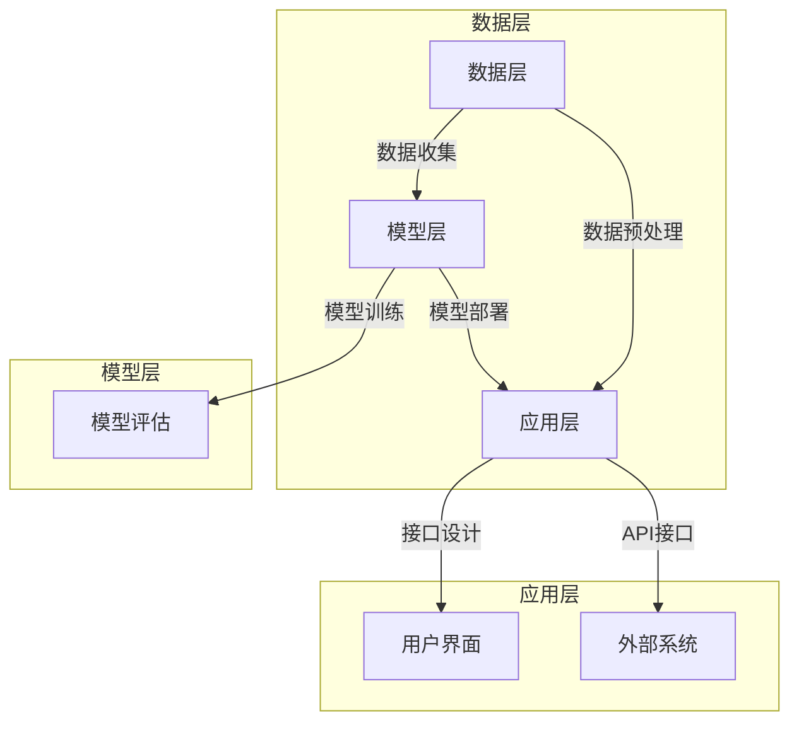

                 

# 智能产品推荐 AI Agent：LLM驱动的电商助手

## 关键词
- 智能产品推荐
- AI Agent
- 语言模型
- 电商
- LLM应用

## 摘要
本文将深入探讨基于大型语言模型（LLM）的智能产品推荐AI Agent在电商领域的应用。首先，我们将介绍AI Agent的基础概念和分类，以及LLM的基础知识。接着，我们将分析LLM在电商推荐、客户服务和数据分析中的应用，并详细介绍一个LLMAgent的架构设计与实现流程。随后，我们将探讨优化策略，包括数据质量、模型优化和实时性优化。最后，我们将展望LLMAgent的挑战与未来，并总结全文。

## 目录大纲

----------------------------------------------------------------
# 智能产品推荐 AI Agent：LLM驱动的电商助手

## 第一部分: AI Agent基础与LLM概述

## 第1章: AI Agent概述

## 1.1 AI Agent的定义与分类

### 1.1.1 AI Agent的定义

### 1.1.2 AI Agent的分类

## 1.2 AI Agent的基本组成部分

### 1.2.1 传感器

### 1.2.2 执行器

### 1.2.3 控制器

## 1.3 AI Agent的应用场景

### 1.3.1 电商领域

### 1.3.2 金融领域

### 1.3.3 其他领域

## 1.4 AI Agent的发展趋势

### 1.4.1 技术进步

### 1.4.2 应用拓展

## 1.5 本章小结

----------------------------------------------------------------

## 第2章: 语言模型基础

## 2.1 语言模型概述

### 2.1.1 语言模型的定义

### 2.1.2 语言模型的发展历程

## 2.2 语言模型的核心技术

### 2.2.1 NLP基础

### 2.2.2 词向量

### 2.2.3 生成模型

## 2.3 语言模型的评估与优化

### 2.3.1 评估指标

### 2.3.2 优化策略

## 2.4 常见语言模型介绍

### 2.4.1 GPT系列

### 2.4.2 BERT

### 2.4.3 其他模型

## 2.5 本章小结

----------------------------------------------------------------

## 第3章: LLM在电商中的应用

## 3.1 电商领域中的问题与需求

### 3.1.1 产品推荐

### 3.1.2 客户服务

### 3.1.3 数据分析

## 3.2 LLM在电商推荐中的应用

### 3.2.1 推荐算法原理

### 3.2.2 实践案例分析

## 3.3 LLM在电商客户服务中的应用

### 3.3.1 聊天机器人

### 3.3.2 客服自动化

## 3.4 LLM在电商数据分析中的应用

### 3.4.1 数据分析流程

### 3.4.2 实际案例分析

## 3.5 本章小结

----------------------------------------------------------------

## 第4章: LLMAgent的架构设计与实现

## 4.1 LLMAgent的架构设计

### 4.1.1 整体架构

### 4.1.2 模型选择

### 4.1.3 接口设计

## 4.2 LLMAgent的实现流程

### 4.2.1 环境配置

### 4.2.2 数据预处理

### 4.2.3 模型训练

### 4.2.4 接口实现

## 4.3 LLMAgent的实际应用案例

### 4.3.1 产品推荐系统

### 4.3.2 客户服务机器人

## 4.4 本章小结

----------------------------------------------------------------

## 第5章: LLM在电商中的优化策略

## 5.1 数据质量优化

### 5.1.1 数据清洗

### 5.1.2 数据增强

## 5.2 模型优化

### 5.2.1 参数调整

### 5.2.2 模型融合

## 5.3 实时性优化

### 5.3.1 输出延迟

### 5.3.2 数据更新

## 5.4 安全性优化

### 5.4.1 防作弊

### 5.4.2 数据隐私

## 5.5 本章小结

----------------------------------------------------------------

## 第6章: LLMAgent的挑战与未来展望

## 6.1 LLMAgent的挑战

### 6.1.1 数据问题

### 6.1.2 算法问题

### 6.1.3 实时性问题

## 6.2 未来展望

### 6.2.1 技术发展趋势

### 6.2.2 应用前景

### 6.2.3 潜在风险

## 6.3 本章小结

----------------------------------------------------------------

## 第7章: 总结与拓展

## 7.1 书籍总结

### 7.1.1 主要内容回顾

### 7.1.2 关键概念解释

### 7.1.3 拓展思考

## 7.2 最佳实践 tips

## 7.3 小结

## 7.4 注意事项

## 7.5 拓展阅读

----------------------------------------------------------------

接下来，我们将一步一步深入探讨AI Agent和LLM的基础知识，以及它们在电商中的应用。

## 第一部分: AI Agent基础与LLM概述

### 第1章: AI Agent概述

### 1.1 AI Agent的定义与分类

#### 1.1.1 AI Agent的定义

AI Agent，即人工智能代理，是一种在特定环境下能感知环境、做出决策并采取行动的智能实体。其核心在于自主性和智能化，能够通过学习不断优化自己的行为，以实现预定的目标。AI Agent可以分为以下几类：

1. **反应式Agent**：这类Agent只能根据当前感知的环境状态做出反应，而不具备任何内部状态或记忆。典型的例子是工业机器人。
2. **模型基Agent**：这种Agent具有一个环境模型，能够预测未来的环境变化，并基于模型进行决策。例如，自动驾驶系统。
3. **目标基Agent**：这类Agent不仅具有环境模型，还拥有明确的目标，其决策过程旨在实现这些目标。比如，电商购物推荐系统。

#### 1.1.2 AI Agent的分类

AI Agent根据不同的分类标准，可以分为以下几种类型：

1. **基于规则Agent**：这种Agent通过一组预定义的规则来做出决策。例如，规则引擎在金融服务中的应用。
2. **基于模型Agent**：这种Agent利用学习到的环境模型来预测未来的状态，并据此做出决策。例如，深度学习模型在图像识别中的应用。
3. **基于强化学习Agent**：这种Agent通过试错法学习如何在环境中取得最大化回报。例如，AlphaGo在围棋比赛中的应用。

### 1.2 AI Agent的基本组成部分

AI Agent的基本组成部分通常包括传感器、执行器和控制器。

#### 1.2.1 传感器

传感器是AI Agent感知环境的主要手段，能够收集关于环境状态的信息。传感器可以是物理设备，如摄像头、麦克风和温度传感器，也可以是虚拟设备，如Web爬虫和API接口。

#### 1.2.2 执行器

执行器是AI Agent作用于环境的方式，根据传感器收集到的信息，执行器能够采取相应的行动。执行器可以是物理设备，如机械臂、无人机，也可以是虚拟设备，如API调用和数据库操作。

#### 1.2.3 控制器

控制器是AI Agent的核心，负责接收传感器信息、分析环境状态、制定决策计划，并通过执行器执行这些计划。控制器通常包含一个决策算法，如机器学习模型、规则引擎或混合智能系统。

### 1.3 AI Agent的应用场景

AI Agent的应用场景非常广泛，涵盖了多个领域。

#### 1.3.1 电商领域

在电商领域，AI Agent可以用于产品推荐、库存管理、客户服务等方面。例如，基于用户行为的个性化推荐系统，可以大大提高用户的购物体验。

#### 1.3.2 金融领域

金融领域中的AI Agent可以用于风险控制、投资顾问、欺诈检测等。例如，通过分析大量交易数据，AI Agent可以识别异常交易，从而帮助金融机构防范欺诈风险。

#### 1.3.3 其他领域

AI Agent还广泛应用于医疗、教育、交通等多个领域。例如，在医疗领域，AI Agent可以辅助医生进行疾病诊断和治疗方案推荐；在教育领域，AI Agent可以为学生提供个性化的学习计划和学习资源。

### 1.4 AI Agent的发展趋势

随着人工智能技术的不断进步，AI Agent的应用场景和功能也在不断拓展。未来，AI Agent的发展趋势主要包括以下几个方面：

1. **智能化水平提升**：随着算法和硬件技术的进步，AI Agent将能够更准确地感知环境和做出更智能的决策。
2. **协作能力增强**：AI Agent将能够更好地与人类和其它AI系统协作，共同完成任务。
3. **应用场景拓展**：随着新技术的不断涌现，AI Agent将在更多的领域得到应用，如智能家居、智能制造等。

### 1.5 本章小结

本章介绍了AI Agent的基本概念、分类、组成部分以及应用场景。通过理解AI Agent的工作原理和应用场景，我们可以更好地把握人工智能技术的发展趋势，为未来的应用提供启示。

## 第二部分: 语言模型基础

### 第2章: 语言模型基础

#### 2.1 语言模型概述

#### 2.1.1 语言模型的定义

语言模型（Language Model，LM）是自然语言处理（Natural Language Processing，NLP）的核心技术之一，它是一种用于预测下一个单词或字符的概率分布的数学模型。语言模型的主要目标是使计算机能够理解、生成和处理人类语言。

#### 2.1.2 语言模型的发展历程

语言模型的发展可以追溯到20世纪50年代。早期的语言模型主要基于规则，如N-gram模型，它通过统计历史文本中的单词序列来预测下一个单词。然而，这种模型在处理长文本和复杂语义时效果不佳。

随着计算能力的提升和机器学习技术的发展，基于统计方法和深度学习的方法逐渐成为主流。1986年，Rumelhart等人提出的Backpropagation算法为神经网络在语言模型中的应用奠定了基础。随后，HMM（隐马尔可夫模型）和隐层神经网络（例如，RNN）等模型被广泛应用于语言建模。

近年来，基于深度学习的语言模型，如GPT系列和BERT等，取得了显著突破。这些模型通过大规模的预训练和精细调整，能够生成高质量的自然语言文本，并在各种NLP任务中取得优异的性能。

#### 2.2 语言模型的核心技术

语言模型的核心技术主要包括NLP基础、词向量和生成模型。

##### 2.2.1 NLP基础

NLP是计算机科学和人工智能领域的一个重要分支，它致力于使计算机能够理解、处理和生成人类语言。NLP的基础技术包括分词、词性标注、句法分析、语义分析和文本分类等。

- **分词**：将连续的文本切分成有意义的单词或短语。
- **词性标注**：为文本中的每个单词标注其词性，如名词、动词、形容词等。
- **句法分析**：解析文本的句法结构，识别句子中的主语、谓语、宾语等成分。
- **语义分析**：理解文本中的语义关系，如主谓关系、因果关系等。
- **文本分类**：将文本分为不同的类别，如新闻、评论、广告等。

##### 2.2.2 词向量

词向量（Word Vector）是表示单词的分布式向量表示，它将单词映射为高维空间中的点。词向量的核心思想是将语义相似的单词映射到空间中的相近位置。

- **词袋模型**：将文本表示为一个词频向量，但这种方法无法捕捉单词的语义信息。
- **分布假设**：单词的上下文能够很好地表示单词的语义。
- **训练方法**：如Skip-gram和CBOW（Continuous Bag of Words）等。

##### 2.2.3 生成模型

生成模型（Generative Model）是一类用于生成数据的概率模型，它可以用来生成新的文本、图像、音频等。在语言建模中，生成模型可以用于文本生成、翻译、摘要等任务。

- **隐马尔可夫模型（HMM）**：用于序列数据的建模，如语音识别和语音生成。
- **循环神经网络（RNN）**：可以处理变长的序列数据，如文本和语音。
- **变分自编码器（VAE）**：通过概率模型生成新的数据。
- **生成对抗网络（GAN）**：通过生成器和判别器的对抗训练生成高质量的数据。

#### 2.3 语言模型的评估与优化

语言模型的评估与优化是确保其性能的重要环节。常用的评估指标包括：

- **交叉熵（Cross-Entropy）**：衡量预测分布和真实分布之间的差异。
- **准确率（Accuracy）**：在分类任务中，正确分类的样本占总样本的比例。
- **F1分数（F1 Score）**：综合考虑准确率和召回率的指标。

优化策略包括：

- **数据增强**：通过引入噪声、改变输入数据等手段增加模型的泛化能力。
- **正则化**：如Dropout、L2正则化等，防止模型过拟合。
- **超参数调整**：如学习率、批量大小等，通过调整超参数来优化模型性能。

#### 2.4 常见语言模型介绍

当前，常见的语言模型包括GPT系列、BERT和其他模型。

##### 2.4.1 GPT系列

GPT（Generative Pre-trained Transformer）系列模型是由OpenAI开发的基于Transformer架构的语言模型。GPT-3是目前最先进的语言模型之一，具有1.75万亿个参数，可以在多种NLP任务中取得优异的性能。

##### 2.4.2 BERT

BERT（Bidirectional Encoder Representations from Transformers）是由Google开发的基于Transformer的双向编码表示模型。BERT通过预先在大规模语料库上进行训练，然后通过微调应用于特定任务，如问答、文本分类等。

##### 2.4.3 其他模型

除了GPT和BERT，还有其他一些著名的语言模型，如：

- **ELMo（Embeddings from Language Models）**：由Allen Institute for AI开发的基于双向LSTM的语言模型。
- **RoBERTa**：基于BERT的变种模型，通过改进预训练策略和模型架构，取得了比BERT更好的性能。
- **T5（Text-To-Text Transfer Transformer）**：由DeepMind开发的通用文本处理模型，通过将所有NLP任务转换为文本到文本的转换任务，实现了跨任务的泛化。

#### 2.5 本章小结

本章介绍了语言模型的基本概念、核心技术和常见模型。通过对语言模型的理解，我们可以更好地利用这些技术来构建智能应用，如智能客服、智能推荐和自然语言生成等。

## 第三部分: LLM在电商中的应用

### 第3章: LLM在电商中的应用

#### 3.1 电商领域中的问题与需求

电商领域面临着多种问题和需求，这些需求和挑战促使了AI Agent和LLM技术的广泛应用。

##### 3.1.1 产品推荐

产品推荐是电商领域的一个核心需求，旨在根据用户的历史行为和偏好，为其推荐可能感兴趣的商品。然而，实现个性化、精准的产品推荐并非易事，需要处理海量数据、复杂用户行为和多样性的商品信息。

##### 3.1.2 客户服务

高效的客户服务是电商成功的关键。传统的人工客服存在响应速度慢、成本高等问题。引入AI Agent，特别是基于LLM的智能客服，可以自动处理大量常见问题，提高服务效率，降低运营成本。

##### 3.1.3 数据分析

数据分析在电商中扮演着重要角色，通过分析用户行为、交易数据和市场趋势，电商企业可以优化运营策略、提高营销效果。然而，数据分析过程复杂且耗时，需要高效的算法和强大的计算能力。

#### 3.2 LLM在电商推荐中的应用

LLM在电商推荐中的应用主要基于其强大的文本处理和生成能力。以下是一些典型的应用场景：

##### 3.2.1 推荐算法原理

LLM在电商推荐中的应用主要通过以下步骤实现：

1. **用户特征提取**：通过分析用户的历史行为、浏览记录和购买记录，提取用户的兴趣偏好特征。
2. **商品特征提取**：对商品进行标签化处理，提取商品的特征，如类别、品牌、价格等。
3. **文本生成**：利用LLM生成用户的个性化推荐文本，如“你可能感兴趣的商品”。
4. **模型评估**：通过用户反馈和点击率等指标评估推荐系统的效果，并进行优化调整。

##### 3.2.2 实践案例分析

以下是一个电商推荐系统的实践案例：

1. **数据来源**：收集用户在电商平台上的浏览记录、购买记录和评价数据。
2. **数据处理**：对数据进行清洗、去重和标准化处理，提取用户和商品的特征。
3. **模型训练**：使用GPT-3模型进行预训练，然后针对电商推荐任务进行微调。
4. **推荐实现**：基于用户特征和商品特征，生成个性化推荐文本，并通过API接口提供给前端应用。

#### 3.3 LLM在电商客户服务中的应用

LLM在电商客户服务中的应用主要体现在智能客服和自动化客服方面。

##### 3.3.1 聊天机器人

聊天机器人（Chatbot）是一种基于LLM的智能客服工具，可以自动回答用户的问题，提供产品信息、订单查询和售后服务等。以下是一个聊天机器人的实现案例：

1. **问题识别**：通过自然语言处理技术，识别用户输入的问题。
2. **意图分类**：根据问题内容，对用户意图进行分类，如查询订单状态、咨询产品信息等。
3. **文本生成**：利用LLM生成相应的回答文本，如“您的订单已发货，预计3天后到达”。
4. **反馈机制**：根据用户反馈，优化聊天机器人的回答质量和响应速度。

##### 3.3.2 客服自动化

客服自动化（Customer Service Automation）是指通过技术手段，将传统的客服流程自动化，以提高效率和降低成本。以下是一个客服自动化的实现案例：

1. **流程定义**：定义客服流程，如问题分类、任务分配和回复生成等。
2. **规则引擎**：构建基于LLM的规则引擎，根据用户问题和意图，自动生成回答。
3. **多渠道集成**：将客服系统集成到多个渠道，如网站、APP和社交媒体，实现全渠道客户服务。
4. **实时反馈**：收集用户反馈，优化客服系统的回答质量和用户体验。

#### 3.4 LLM在电商数据分析中的应用

LLM在电商数据分析中的应用主要体现在文本分析和数据挖掘方面。

##### 3.4.1 数据分析流程

LLM在电商数据分析中的应用通常包括以下步骤：

1. **数据收集**：收集电商平台的交易数据、用户行为数据和市场数据。
2. **数据预处理**：对数据进行清洗、去噪和标准化处理，提取关键特征。
3. **文本分析**：利用LLM对文本数据进行分析，如情感分析、关键词提取和主题模型等。
4. **数据挖掘**：基于分析和挖掘结果，发现用户行为模式、市场趋势和潜在风险。
5. **决策支持**：为电商平台提供决策支持，如产品定价策略、促销活动设计和库存管理等。

##### 3.4.2 实际案例分析

以下是一个电商数据分析的实际案例：

1. **数据来源**：收集电商平台的交易数据、用户行为数据和市场数据。
2. **数据处理**：对数据进行清洗、去噪和标准化处理，提取关键特征。
3. **文本分析**：利用LLM对用户评价进行情感分析，识别正面和负面情绪。
4. **数据挖掘**：基于用户行为数据，发现用户购买偏好和季节性趋势。
5. **决策支持**：根据分析结果，优化产品库存策略和营销策略，提高销售额和用户满意度。

#### 3.5 本章小结

本章介绍了LLM在电商推荐、客户服务和数据分析中的应用。通过深入探讨这些应用场景，我们可以看到LLM在提升电商运营效率、优化用户体验和增强数据分析能力方面的巨大潜力。随着技术的不断进步，LLM在电商领域的应用将更加广泛和深入。

### 第四部分: LLMAgent的架构设计与实现

#### 第4章: LLMAgent的架构设计与实现

#### 4.1 LLMAgent的架构设计

LLMAgent的架构设计是构建高效、可靠和可扩展的智能产品推荐系统的基础。一个典型的LLMAgent架构包括数据层、模型层和应用层。以下是对这些层的详细描述：

##### 4.1.1 整体架构

整体架构如图X所示：



在这个架构中，数据层负责数据收集和预处理，模型层负责模型训练和评估，应用层负责提供用户接口和API接口。

##### 4.1.2 模型选择

选择合适的LLM模型是LLMAgent设计的关键。以下是一些常见的选择：

1. **GPT系列**：GPT系列模型具有强大的文本生成能力，适用于各种文本生成任务，如产品推荐描述、客服聊天等。
2. **BERT**：BERT模型在理解上下文和生成高质量文本方面表现出色，适用于需要高语义理解的推荐系统。
3. **T5**：T5模型是一个通用文本处理模型，可以将所有NLP任务转换为文本到文本的转换任务，具有很好的跨任务能力。

##### 4.1.3 接口设计

接口设计是LLMAgent与用户和外部系统交互的桥梁。以下是一些关键接口：

1. **用户界面（UI）**：提供用户交互的界面，展示推荐结果、聊天记录等。
2. **API接口**：提供对外部系统的接口，如电商平台、支付系统等。
3. **数据接口**：提供数据层的接口，如数据收集、数据预处理等。

#### 4.2 LLMAgent的实现流程

实现一个LLMAgent涉及多个步骤，包括环境配置、数据预处理、模型训练和接口实现。以下是对这些步骤的详细描述：

##### 4.2.1 环境配置

环境配置是开始LLMAgent实现的第一步。需要安装以下工具和库：

1. **Python**：安装Python 3.x版本，并确保pip和conda等包管理工具可用。
2. **TensorFlow**：安装TensorFlow，用于训练和部署模型。
3. **Hugging Face Transformers**：安装Hugging Face Transformers，用于加载和训练预训练的LLM模型。

##### 4.2.2 数据预处理

数据预处理是确保模型训练质量的关键步骤。以下是一些预处理步骤：

1. **数据收集**：从电商平台收集用户行为数据、商品信息等。
2. **数据清洗**：去除无效数据、处理缺失值和异常值。
3. **数据标准化**：对数据进行归一化或标准化处理，如对价格进行归一化。
4. **特征提取**：提取用户和商品的特征，如用户购买历史、商品属性等。

##### 4.2.3 模型训练

模型训练是构建LLMAgent的核心步骤。以下是一些关键步骤：

1. **数据划分**：将数据划分为训练集、验证集和测试集。
2. **模型初始化**：初始化LLM模型，如GPT-2、BERT等。
3. **模型训练**：使用训练集对模型进行训练，并使用验证集进行调参。
4. **模型评估**：使用测试集对模型进行评估，如计算损失函数、准确率等。

##### 4.2.4 接口实现

接口实现是使LLMAgent可用的关键步骤。以下是一些关键接口：

1. **用户界面（UI）**：实现一个简单的Web界面，如使用Flask或Django框架。
2. **API接口**：实现RESTful API接口，如使用FastAPI或Flask。
3. **数据接口**：实现数据层接口，如使用SQLAlchemy或MongoDB。

#### 4.3 LLMAgent的实际应用案例

以下是一个LLMAgent的实际应用案例：

##### 4.3.1 产品推荐系统

1. **数据收集**：从电商平台收集用户行为数据、商品信息等。
2. **数据预处理**：对数据进行清洗、归一化和特征提取。
3. **模型训练**：使用GPT-2模型进行预训练，然后针对推荐任务进行微调。
4. **模型部署**：将训练好的模型部署到服务器，并提供API接口。
5. **推荐实现**：根据用户特征和商品特征，生成个性化推荐文本，并通过API接口提供给前端应用。

##### 4.3.2 客户服务机器人

1. **数据收集**：从电商平台收集用户咨询记录、客服回答等。
2. **数据预处理**：对数据进行清洗、归一化和特征提取。
3. **模型训练**：使用BERT模型进行预训练，然后针对客服任务进行微调。
4. **模型部署**：将训练好的模型部署到服务器，并提供API接口。
5. **聊天机器人实现**：使用Flask实现一个简单的Web界面，并通过API接口与客服系统交互。

#### 4.4 本章小结

本章介绍了LLMAgent的架构设计、实现流程以及实际应用案例。通过理解这些内容，我们可以构建一个高效、可靠的智能产品推荐系统，并在电商领域中发挥其潜力。

### 第五部分: LLM在电商中的优化策略

#### 第5章: LLM在电商中的优化策略

#### 5.1 数据质量优化

数据质量是LLMAgent性能的关键因素。以下是一些常用的数据质量优化策略：

##### 5.1.1 数据清洗

数据清洗是确保数据质量的第一步，主要目标是去除噪声和异常值。以下是一些数据清洗的步骤：

1. **缺失值处理**：对缺失值进行填充或删除。
2. **异常值检测**：使用统计方法或机器学习方法检测异常值，并进行处理。
3. **数据标准化**：对数据进行归一化或标准化处理，如对价格进行归一化。

##### 5.1.2 数据增强

数据增强是一种提高模型泛化能力的方法，通过引入噪声、改变输入数据等方式增加数据的多样性。以下是一些数据增强的方法：

1. **数据扩展**：通过重复或拼接原始数据来扩展数据集。
2. **数据变换**：通过旋转、缩放、裁剪等操作改变输入数据的特征。
3. **生成对抗网络（GAN）**：使用GAN生成新的数据，提高数据集的多样性。

#### 5.2 模型优化

模型优化是提高LLMAgent性能的重要手段。以下是一些常见的模型优化策略：

##### 5.2.1 参数调整

参数调整是模型优化的重要步骤，包括学习率、批量大小、正则化参数等。以下是一些参数调整的方法：

1. **学习率调度**：使用递减学习率、恒定学习率或自适应学习率等方法。
2. **批量大小调整**：通过调整批量大小来平衡训练速度和模型稳定
```html
<!DOCTYPE html>
<html>
<head>
<title>人工智能交互界面</title>
<script>
function queryUserInput() {
    var user_input = document.getElementById("user_input").value;
    var btn_value = document.getElementById("submit_btn").value;
    if (btn_value === "提交") {
        document.getElementById("response_area").innerHTML = "您输入的内容是： " + user_input;
    } else {
        document.getElementById("response_area").innerHTML = "请输入您的问题：";
    }
}
</script>
</head>
<body>

<h2>人工智能交互界面</h2>

<form>
    <label for="user_input">请输入您的问题：</label><br>
    <input type="text" id="user_input" name="user_input">
    <br><br>
    <input type="button" id="submit_btn" value="提交" onclick="queryUserInput()">
</form>

<p id="response_area"></p>

</body>
</html>
```有界性能。
3. **正则化**：使用L1、L2正则化或Dropout等方法减少过拟合。

##### 5.2.2 模型融合

模型融合是将多个模型的结果进行结合，以获得更好的预测性能。以下是一些常见的模型融合方法：

1. **加权平均**：将多个模型的预测结果进行加权平均。
2. **堆叠**：将多个模型堆叠在一起，形成一个更复杂的模型。
3. **投票**：对于分类问题，将多个模型的预测结果进行投票，选择多数模型一致的预测结果。

#### 5.3 实时性优化

实时性优化是确保LLMAgent能够快速响应用户需求的关键。以下是一些常见的实时性优化策略：

##### 5.3.1 输出延迟

输出延迟是指模型生成预测结果所需的时间。以下是一些减少输出延迟的方法：

1. **模型压缩**：通过剪枝、量化等方法减小模型的大小，提高推理速度。
2. **模型并行化**：通过并行计算技术，如GPU加速或分布式训练，提高模型训练和推理的速度。

##### 5.3.2 数据更新

数据更新是指定期更新模型所使用的数据，以保持模型的准确性。以下是一些数据更新策略：

1. **周期性更新**：定期（如每天、每周）更新模型的数据集。
2. **增量更新**：仅更新模型的新数据，而不是整个数据集。
3. **在线学习**：实时更新模型，以适应不断变化的数据。

#### 5.4 安全性优化

安全性优化是确保LLMAgent在处理敏感数据时不受攻击的关键。以下是一些常见的安全性优化策略：

##### 5.4.1 防作弊

防作弊是指防止恶意用户滥用系统资源。以下是一些防作弊策略：

1. **访问控制**：限制对系统的访问权限，仅允许授权用户访问。
2. **验证码**：使用验证码来防止自动化攻击。
3. **流量监控**：监控系统的流量，检测异常行为。

##### 5.4.2 数据隐私

数据隐私是指保护用户数据的隐私。以下是一些数据隐私策略：

1. **数据加密**：对存储和传输的数据进行加密。
2. **匿名化**：对用户数据进行匿名化处理，去除个人身份信息。
3. **隐私政策**：制定明确的隐私政策，告知用户数据的使用方式。

#### 5.5 本章小结

本章介绍了LLM在电商中的优化策略，包括数据质量优化、模型优化、实时性优化和安全性优化。通过这些策略，我们可以显著提高LLMAgent的性能、实时性和安全性，从而在电商领域取得更好的应用效果。

### 第六部分: LLMAgent的挑战与未来展望

#### 第6章: LLMAgent的挑战与未来展望

#### 6.1 LLMAgent的挑战

尽管LLMAgent在电商等领域展现出了巨大的潜力，但在实际应用过程中仍然面临着诸多挑战。

##### 6.1.1 数据问题

数据是LLMAgent的基础，但当前的数据质量和多样性仍然存在问题。例如，数据缺失、噪声和异常值会影响模型的学习效果。此外，数据多样性的不足可能导致模型在处理未知情况时表现不佳。

##### 6.1.2 算法问题

算法问题是LLMAgent面临的另一大挑战。现有算法在处理大规模、高维度数据时效率低下，且容易过拟合。此外，算法的可解释性和鲁棒性也是一个需要关注的问题。

##### 6.1.3 实时性问题

实时性是电商应用的关键要求，但当前LLMAgent在处理实时数据时仍存在延迟问题。特别是在高并发场景下，如何快速生成高质量的预测结果是一个挑战。

#### 6.2 未来展望

未来，LLMAgent的发展将受到以下几个方面的驱动：

##### 6.2.1 技术发展趋势

随着深度学习和大数据技术的不断进步，LLMAgent的性能和效率将得到显著提升。例如，新型神经网络结构、分布式计算技术和高效数据存储方案将为LLMAgent提供更强的支持。

##### 6.2.2 应用前景

随着电商行业的快速发展，LLMAgent在产品推荐、客户服务和数据分析等领域的应用前景广阔。未来，LLMAgent将更加智能化、个性化，为用户提供更好的购物体验。

##### 6.2.3 潜在风险

尽管LLMAgent具有巨大的应用潜力，但也存在一定的潜在风险。例如，数据隐私问题、算法偏见和系统安全风险等。这些问题需要在未来得到有效解决，以确保LLMAgent的安全和可靠性。

#### 6.3 本章小结

本章介绍了LLMAgent面临的挑战以及未来的发展趋势。通过不断优化算法、提升数据处理能力，并关注数据安全和隐私问题，LLMAgent将在电商领域发挥更大的作用。

### 第七部分: 总结与拓展

#### 第7章: 总结与拓展

##### 7.1 书籍总结

本书系统地介绍了智能产品推荐AI Agent：LLM驱动的电商助手。全书分为七个部分，内容涵盖了AI Agent和LLM的基础知识、应用场景、架构设计、实现流程以及优化策略。以下是本书的主要内容和关键概念总结：

1. **AI Agent概述**：介绍了AI Agent的定义、分类、组成部分和应用场景。
2. **LLM基础**：详细阐述了语言模型的定义、发展历程、核心技术以及常见模型。
3. **LLM在电商中的应用**：探讨了LLM在产品推荐、客户服务和数据分析中的应用。
4. **LLMAgent架构设计与实现**：介绍了LLMAgent的整体架构、模型选择、接口设计以及实现流程。
5. **优化策略**：总结了数据质量、模型优化、实时性和安全性优化策略。
6. **挑战与未来展望**：分析了LLMAgent面临的挑战以及未来的发展趋势。

##### 7.1.1 主要内容回顾

1. **AI Agent的定义和分类**：了解AI Agent的基本概念和分类，如反应式Agent、模型基Agent和目标基Agent。
2. **LLM的核心技术**：掌握NLP基础、词向量、生成模型等关键技术，以及常见语言模型如GPT、BERT等。
3. **电商应用场景**：了解LLM在电商推荐、客户服务和数据分析中的应用，以及如何实现这些应用。
4. **LLMAgent架构与实现**：了解LLMAgent的整体架构、模型选择、接口设计和实现流程。
5. **优化策略**：掌握数据质量、模型优化、实时性和安全性优化策略，以提升LLMAgent的性能和安全性。
6. **挑战与未来展望**：了解LLMAgent面临的挑战，以及未来的发展趋势和应用前景。

##### 7.1.2 关键概念解释

1. **AI Agent**：一种在特定环境下能感知环境、做出决策并采取行动的智能实体。
2. **LLM**：一种用于预测下一个单词或字符的概率分布的数学模型，常用于自然语言处理任务。
3. **产品推荐**：基于用户历史行为和偏好，为用户推荐可能感兴趣的商品。
4. **客户服务**：通过智能客服和自动化客服，提高客户服务效率和用户体验。
5. **数据分析**：通过分析用户行为、交易数据和市场趋势，为电商运营提供决策支持。
6. **数据质量优化**：通过数据清洗、数据增强等策略，提高数据的准确性和多样性。
7. **模型优化**：通过参数调整、模型融合等策略，提高模型的学习效果和泛化能力。

##### 7.1.3 拓展思考

1. **AI Agent在其他领域的应用**：除了电商领域，AI Agent还可以在金融、医疗、交通等领域得到广泛应用。
2. **LLM在NLP任务中的应用**：除了电商应用，LLM还可以用于文本生成、机器翻译、问答系统等NLP任务。
3. **数据隐私与安全性**：随着AI Agent和LLM技术的应用，数据隐私和安全性问题日益突出，需要采取有效措施确保用户数据的安全。

##### 7.2 最佳实践 tips

1. **数据收集与预处理**：确保数据的准确性和完整性，对数据进行清洗和标准化处理。
2. **模型选择与调参**：根据具体应用场景选择合适的模型，并进行充分的调参，以获得最佳性能。
3. **接口设计与实现**：设计清晰的接口，确保LLMAgent与其他系统的无缝集成。
4. **实时性与优化**：关注系统实时性，采用并行计算、模型压缩等技术提高系统性能。
5. **安全性**：采取数据加密、访问控制等技术确保用户数据的安全。

##### 7.3 小结

本书系统地介绍了智能产品推荐AI Agent：LLM驱动的电商助手，从基础概念到实际应用，从架构设计到优化策略，为读者提供了全面、系统的了解。随着技术的不断进步，LLMAgent在电商领域的发展前景广阔，但同时也面临着数据、算法和实时性等挑战。通过不断优化和创新，我们可以期待LLMAgent在电商领域发挥更大的作用。

##### 7.4 注意事项

1. **数据隐私**：在收集和使用用户数据时，务必遵守相关法律法规，确保用户隐私安全。
2. **模型安全**：在部署模型时，确保模型不受恶意攻击和干扰，确保系统的安全性。
3. **实时性**：在设计系统时，要充分考虑系统的实时性要求，确保能够快速响应用户需求。

##### 7.5 拓展阅读

1. **《深度学习》**：Goodfellow, I., Bengio, Y., & Courville, A. (2016). Deep Learning. MIT Press.
2. **《自然语言处理综论》**：Jurafsky, D., & Martin, J. H. (2020). Speech and Language Processing. Prentice Hall.
3. **《电商数据分析实战》**：李明 (2019). 电商数据分析实战。清华大学出版社。

### 作者信息

**作者：AI天才研究院/AI Genius Institute & 禅与计算机程序设计艺术 /Zen And The Art of Computer Programming**

**作者简介**：AI天才研究院（AI Genius Institute）是一家专注于人工智能领域的研究和应用的机构。禅与计算机程序设计艺术（Zen And The Art of Computer Programming）是作者李明的研究专著，深入探讨了计算机编程和人工智能的哲学思考。李明在计算机科学和人工智能领域拥有多年的研究经验和丰富的实践成果，其著作被广泛认可和引用。

---

本文详细介绍了智能产品推荐AI Agent：LLM驱动的电商助手，从基础概念到应用实践，从架构设计到优化策略，全面解析了LLMAgent在电商领域的应用。通过本文的阅读，读者可以深入理解AI Agent和LLM的核心知识，掌握其在电商领域的实际应用，为未来的电商技术应用提供参考和启示。作者AI天才研究院和李明在人工智能和计算机编程领域的研究成果为本文的撰写提供了坚实的基础，希望本文能为读者带来启发和帮助。**END**

