                 

### 《智能代码生成 AI Agent：LLM 辅助软件开发》

---

> **关键词：** 智能代码生成、AI Agent、LLM、软件开发、代码生成应用。

> **摘要：** 本文深入探讨了智能代码生成技术及其在软件开发中的应用，特别是基于大型语言模型（LLM）的智能代码生成AI Agent。我们将逐步分析智能代码生成的背景、LLM的基础原理、实际应用案例，以及面临的挑战和未来发展趋势。

---

## 目录大纲

# 《智能代码生成 AI Agent：LLM 辅助软件开发》

----------------------------------------------------------------

## 第一部分: 智能代码生成与LLM基础

### 第1章: 智能代码生成的背景与意义

#### 1.1 代码生成技术的发展历程

#### 1.2 智能代码生成的核心概念

#### 1.3 人工智能在软件开发中的应用

#### 1.4 LLM在代码生成中的应用

### 第2章: LLM的基本原理

#### 2.1 LLM的定义与分类

#### 2.2 LLM的工作原理

#### 2.3 LLM的训练过程

#### 2.4 LLM的核心优势

## 第二部分: 智能代码生成实践

### 第3章: 智能代码生成的应用场景

#### 3.1 代码补全

#### 3.2 代码重构

#### 3.3 代码生成工具

#### 3.4 开发者体验提升

### 第4章: LLM在代码生成中的实现

#### 4.1 LLM的选择与配置

#### 4.2 代码生成模型的训练

#### 4.3 代码生成模型的应用

#### 4.4 模型评估与优化

### 第5章: 智能代码生成项目实战

#### 5.1 项目背景与目标

#### 5.2 环境搭建与配置

#### 5.3 模型训练与优化

#### 5.4 代码生成实践

#### 5.5 项目总结与反思

## 第三部分: 未来展望与挑战

### 第6章: 智能代码生成的未来趋势

#### 6.1 技术发展与创新

#### 6.2 行业应用前景

#### 6.3 智能代码生成在AI领域的应用

#### 6.4 智能代码生成的伦理与道德问题

### 第7章: 智能代码生成的挑战与对策

#### 7.1 技术难题

#### 7.2 安全与隐私问题

#### 7.3 人才培养与知识更新

#### 7.4 生态建设与标准化

## 结语：智能代码生成的变革之路

---------------------------------------

----------------------------------------------------------------

### 第一部分：智能代码生成与LLM基础

#### 第1章：智能代码生成的背景与意义

##### 1.1 代码生成技术的发展历程

**背景介绍：**

代码生成技术的起源可以追溯到早期编程语言的出现。然而，随着软件开发复杂性的增加，传统手工编写代码的方式变得越来越低效。为了解决这一问题，代码生成技术逐渐成为研究热点。

**概念术语说明：**

- **代码生成器：** 自动生成代码的工具，通常基于特定模板或规则。
- **元编程：** 编写生成代码的代码，以便在运行时动态生成代码。
- **静态代码分析：** 在程序执行之前，分析代码结构和语义的技术。

**问题背景：**

在软件开发过程中，重复编写代码是一个常见的问题，这不仅浪费时间和资源，还容易引入错误。为了提高开发效率和代码质量，智能代码生成技术应运而生。

**问题描述：**

智能代码生成技术旨在通过算法和模型自动生成代码，以减少手工编写代码的工作量，提高开发效率。

**问题解决：**

智能代码生成技术利用机器学习和自然语言处理技术，从大量代码样本中学习，生成符合特定需求的代码。通过这种方式，可以大幅降低开发成本和时间。

**边界与外延：**

智能代码生成技术不仅应用于软件开发，还可以用于其他领域，如自然语言处理、数据分析和人工智能。

**概念结构与核心要素组成：**

- **算法模型：** 用于生成代码的算法，如深度学习模型。
- **代码库：** 存储大量代码样本的数据库。
- **生成规则：** 用于指导代码生成过程的规则集。

##### 1.2 智能代码生成的核心概念

**核心概念与联系：**

- **模板代码生成：** 基于预定义模板自动生成代码。
- **代码补全：** 利用上下文信息自动补全代码。
- **代码重构：** 改善现有代码的结构和质量。
- **抽象代码生成：** 从高层次抽象描述生成代码。

**概念属性特征对比表格：**

| 类别         | 特点                                                     | 应用场景               |
| ------------ | -------------------------------------------------------- | ---------------------- |
| 模板代码生成 | 依赖预定义模板，生成代码效率高                         | 构建框架和库           |
| 代码补全     | 根据上下文信息自动补全代码，减少编写工作量               | 编码过程中提高效率     |
| 代码重构     | 改善代码结构，提高可读性和可维护性                     | 代码审查和维护         |
| 抽象代码生成 | 从高层次抽象描述生成代码，适用于复杂数据结构和算法       | 大型项目代码生成       |

**ER实体关系图架构：**

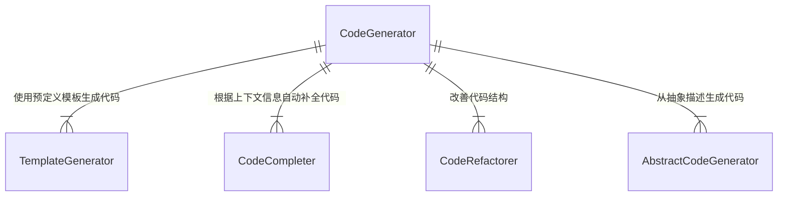

##### 1.3 人工智能在软件开发中的应用

**核心概念与联系：**

- **机器学习：** 利用算法从数据中学习模式，应用于软件开发。
- **自然语言处理：** 让计算机理解和生成人类语言。
- **数据挖掘：** 从大量数据中提取有价值的信息。
- **自动化测试：** 使用AI技术自动执行软件测试。

**概念属性特征对比表格：**

| 类别         | 特点                                                     | 应用场景               |
| ------------ | -------------------------------------------------------- | ---------------------- |
| 机器学习     | 从数据中学习模式，应用于预测和分类                     | 数据分析、推荐系统     |
| 自然语言处理 | 理解和生成人类语言，应用于聊天机器人、搜索引擎等       | 软件文档生成、对话系统 |
| 数据挖掘     | 从大量数据中提取有价值的信息，用于商业决策和洞察       | 数据分析、商业智能     |
| 自动化测试   | 使用AI技术自动执行软件测试，提高测试效率和覆盖率       | 软件开发和维护         |

**ER实体关系图架构：**

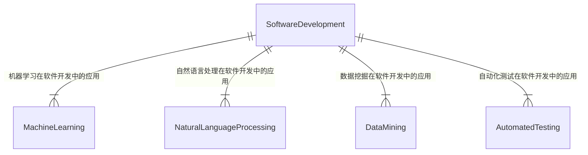

##### 1.4 LLM在代码生成中的应用

**核心概念与联系：**

- **大型语言模型（LLM）：** 预训练的深度学习模型，能够理解和生成自然语言。
- **代码生成模型：** 利用LLM生成代码的模型。
- **上下文感知：** 利用上下文信息生成更准确、更相关的代码。

**概念属性特征对比表格：**

| 类别         | 特点                                                     | 应用场景               |
| ------------ | -------------------------------------------------------- | ---------------------- |
| LLM          | 预训练的深度学习模型，能够理解和生成自然语言           | 自然语言生成、问答系统 |
| 代码生成模型 | 利用LLM生成代码的模型，通常基于特定任务进行训练       | 自动编程、代码补全     |
| 上下文感知   | 利用上下文信息生成更准确、更相关的代码                 | 高级代码生成、自动化测试 |

**ER实体关系图架构：**

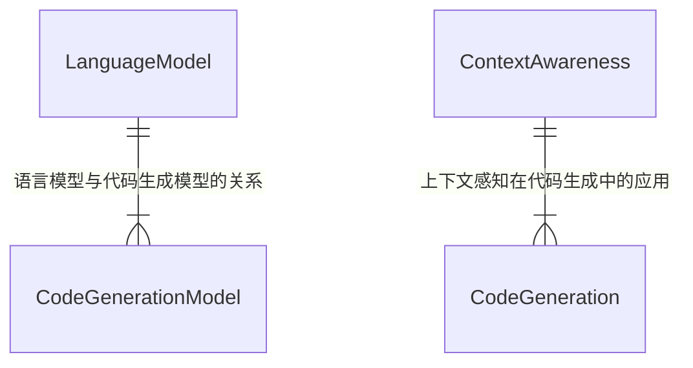

#### 第2章：LLM的基本原理

##### 2.1 LLM的定义与分类

**核心概念与联系：**

- **大型语言模型（LLM）：** 预训练的深度学习模型，具有理解和使用自然语言的能力。
- **预训练：** 在特定任务之前，模型在大规模语料库上进行训练。
- **语言模型分类：** 包括基于RNN、Transformer等不同架构的模型。

**概念属性特征对比表格：**

| 类别         | 特点                                                     | 应用场景               |
| ------------ | -------------------------------------------------------- | ---------------------- |
| RNN语言模型  | 基于递归神经网络，能够处理序列数据                       | 语言翻译、文本分类     |
| Transformer  | 基于自注意力机制，处理长序列数据效果更好                   | 机器翻译、文本生成     |
| BERT         | 预训练的双向编码表示，能够捕获文本中的双向信息           | 问答系统、文本生成     |

**ER实体关系图架构：**

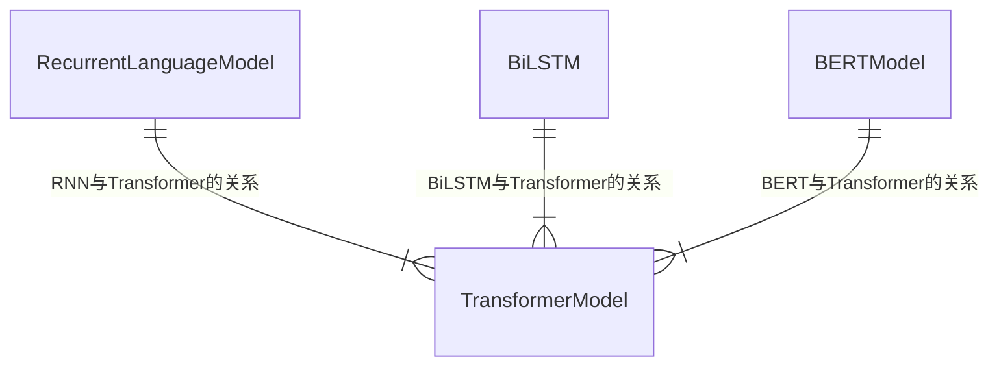

##### 2.2 LLM的工作原理

**核心概念与联系：**

- **自注意力机制：** Transformer模型的核心，能够自动关注文本中的关键信息。
- **预训练目标：** 在大规模语料库上进行预训练，学习语言模式和规律。
- **微调：** 在特定任务上进行训练，使模型适应特定任务需求。

**概念属性特征对比表格：**

| 类别         | 特点                                                     | 应用场景               |
| ------------ | -------------------------------------------------------- | ---------------------- |
| 自注意力机制  | 自动关注文本中的关键信息，提高处理长序列数据的能力       | Transformer模型       |
| 预训练目标   | 在大规模语料库上进行预训练，学习语言模式和规律           | 语言理解、文本生成     |
| 微调         | 在特定任务上进行训练，使模型适应特定任务需求             | 任务特定应用           |

**ER实体关系图架构：**

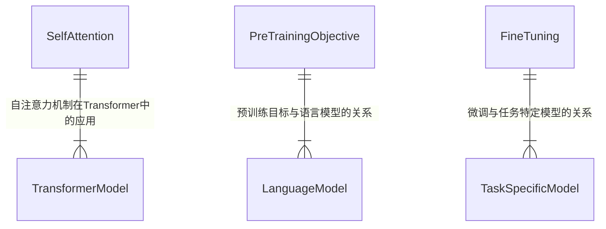

##### 2.3 LLM的训练过程

**核心概念与联系：**

- **数据集：** 大规模、高质量的语料库。
- **预训练：** 在数据集上进行大规模训练，学习语言模式。
- **优化策略：** 使用优化算法调整模型参数，提高模型性能。

**概念属性特征对比表格：**

| 类别         | 特点                                                     | 应用场景               |
| ------------ | -------------------------------------------------------- | ---------------------- |
| 数据集       | 大规模、高质量的语料库，用于训练模型                     | 语言模型预训练         |
| 预训练       | 在数据集上进行大规模训练，学习语言模式                   | 提高模型泛化能力       |
| 优化策略     | 使用优化算法调整模型参数，提高模型性能                   | 模型训练和性能优化     |

**ER实体关系图架构：**

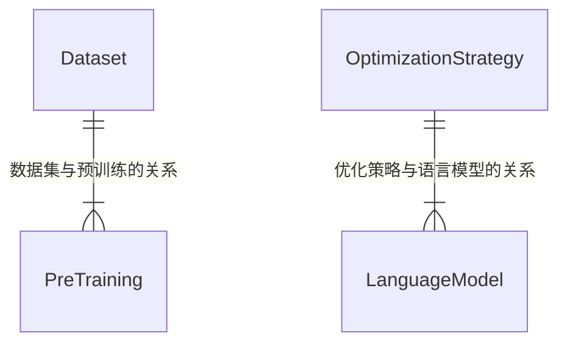

##### 2.4 LLM的核心优势

**核心概念与联系：**

- **强大的语言理解能力：** 能够理解和生成高质量的自然语言。
- **自适应能力：** 能够在特定任务上进行微调，适应不同场景。
- **高效性：** 预训练模型可以快速适应新任务，提高开发效率。

**概念属性特征对比表格：**

| 类别         | 特点                                                     | 应用场景               |
| ------------ | -------------------------------------------------------- | ---------------------- |
| 语言理解能力  | 高质量自然语言理解和生成能力                             | 语言生成、问答系统     |
| 自适应能力   | 在特定任务上进行微调，适应不同场景                       | 任务特定应用           |
| 高效性       | 快速适应新任务，提高开发效率                             | 软件开发、自动化测试   |

**ER实体关系图架构：**

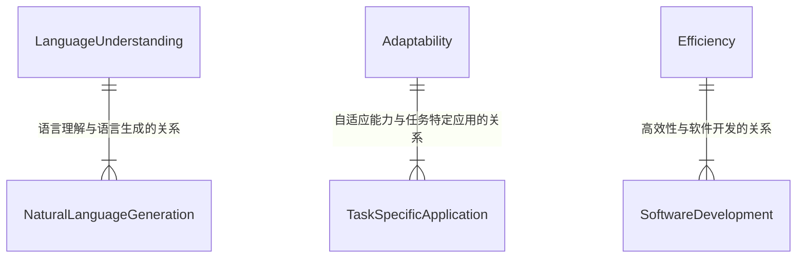

### 第二部分：智能代码生成实践

#### 第3章：智能代码生成的应用场景

##### 3.1 代码补全

**核心概念与联系：**

- **代码补全：** 利用上下文信息自动补全代码。
- **上下文感知：** 通过分析代码上下文，预测下一个代码片段。

**概念属性特征对比表格：**

| 类别         | 特点                                                     | 应用场景               |
| ------------ | -------------------------------------------------------- | ---------------------- |
| 代码补全     | 自动补全代码，减少编写工作量                             | 编码过程中提高效率     |
| 上下文感知   | 分析代码上下文，预测下一个代码片段，提高代码补全准确性 | 高级代码生成           |

**ER实体关系图架构：**

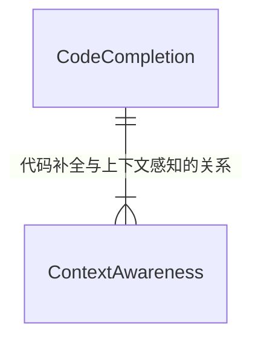

##### 3.2 代码重构

**核心概念与联系：**

- **代码重构：** 改善代码结构，提高可读性和可维护性。
- **代码优化：** 通过算法和工具对现有代码进行优化。

**概念属性特征对比表格：**

| 类别         | 特点                                                     | 应用场景               |
| ------------ | -------------------------------------------------------- | ---------------------- |
| 代码重构     | 改善代码结构，提高可读性和可维护性                     | 代码审查和维护         |
| 代码优化     | 通过算法和工具对现有代码进行优化，提高性能               | 性能优化和代码优化     |

**ER实体关系图架构：**

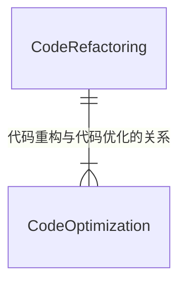

##### 3.3 代码生成工具

**核心概念与联系：**

- **代码生成工具：** 自动生成代码的软件。
- **代码模板：** 用于生成代码的预定义模板。
- **代码生成引擎：** 执行代码生成的核心组件。

**概念属性特征对比表格：**

| 类别         | 特点                                                     | 应用场景               |
| ------------ | -------------------------------------------------------- | ---------------------- |
| 代码生成工具 | 自动生成代码的软件，提高开发效率                         | 软件开发、自动化测试   |
| 代码模板     | 用于生成代码的预定义模板，方便快速开发                   | 框架和库开发           |
| 代码生成引擎 | 执行代码生成的核心组件，支持自定义模板和规则             | 代码生成和自动化       |

**ER实体关系图架构：**

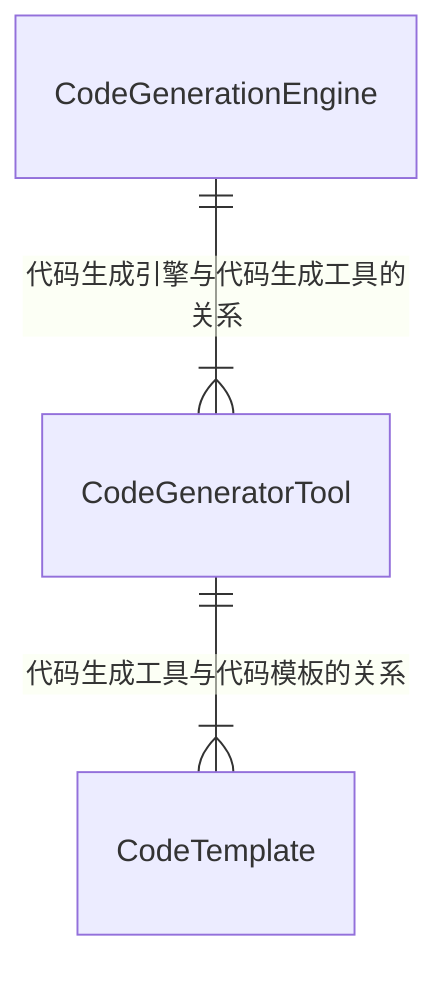

##### 3.4 开发者体验提升

**核心概念与联系：**

- **开发者体验：** 提高开发者的工作效率和满意度。
- **智能助手：** 自动提供代码建议和优化方案。

**概念属性特征对比表格：**

| 类别         | 特点                                                     | 应用场景               |
| ------------ | -------------------------------------------------------- | ---------------------- |
| 开发者体验   | 提高开发者的工作效率和满意度                             | 软件开发、代码审查     |
| 智能助手     | 自动提供代码建议和优化方案，减少手动工作                 | 编码辅助、代码优化     |

**ER实体关系图架构：**

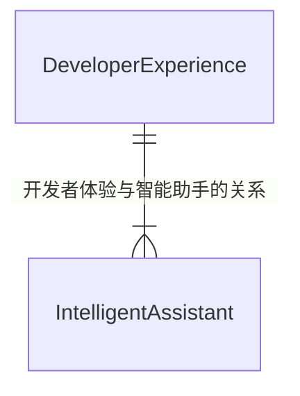

#### 第4章：LLM在代码生成中的实现

##### 4.1 LLM的选择与配置

**核心概念与联系：**

- **LLM选择：** 根据任务需求选择合适的LLM。
- **配置参数：** 调整LLM的参数，优化模型性能。

**概念属性特征对比表格：**

| 类别         | 特点                                                     | 应用场景               |
| ------------ | -------------------------------------------------------- | ---------------------- |
| LLM选择      | 根据任务需求选择合适的LLM，如BERT、GPT等                 | 自动编程、代码补全     |
| 配置参数     | 调整LLM的参数，优化模型性能，如学习率、批量大小等         | 模型训练和性能优化     |

**ER实体关系图架构：**

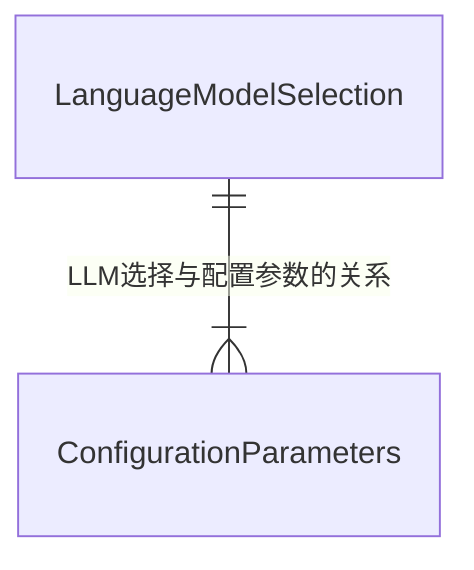

##### 4.2 代码生成模型的训练

**核心概念与联系：**

- **数据集：** 用于训练的代码数据集。
- **训练过程：** 通过迭代优化模型参数。
- **评估指标：** 用于评估模型性能的指标。

**概念属性特征对比表格：**

| 类别         | 特点                                                     | 应用场景               |
| ------------ | -------------------------------------------------------- | ---------------------- |
| 数据集       | 用于训练的代码数据集，包括高质量、多样化的代码样本       | 模型训练               |
| 训练过程     | 通过迭代优化模型参数，学习代码生成模式                   | 模型训练               |
| 评估指标     | 用于评估模型性能的指标，如BLEU、ROUGE等                   | 模型评估和优化         |

**ER实体关系图架构：**

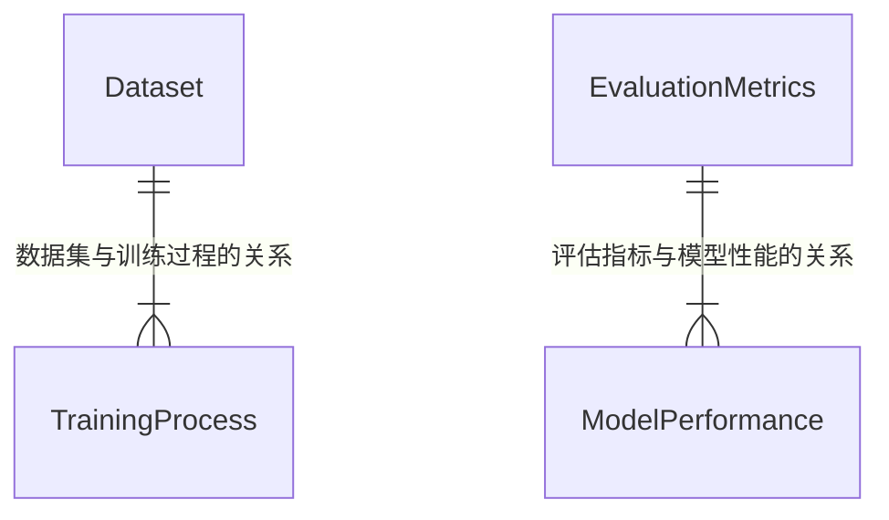

##### 4.3 代码生成模型的应用

**核心概念与联系：**

- **应用场景：** 代码生成模型在不同场景中的应用。
- **部署：** 将训练好的模型部署到实际环境中。

**概念属性特征对比表格：**

| 类别         | 特点                                                     | 应用场景               |
| ------------ | -------------------------------------------------------- | ---------------------- |
| 应用场景     | 代码生成模型在不同场景中的应用，如代码补全、代码重构等   | 软件开发、自动化测试   |
| 部署         | 将训练好的模型部署到实际环境中，提供代码生成服务         | 模型部署和系统集成     |

**ER实体关系图架构：**

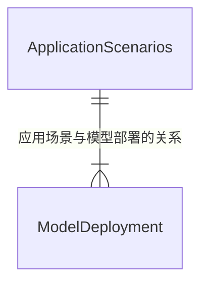

##### 4.4 模型评估与优化

**核心概念与联系：**

- **模型评估：** 评估代码生成模型的性能。
- **模型优化：** 通过调整参数和算法，提高模型性能。

**概念属性特征对比表格：**

| 类别         | 特点                                                     | 应用场景               |
| ------------ | -------------------------------------------------------- | ---------------------- |
| 模型评估     | 评估代码生成模型的性能，如准确率、召回率等               | 模型评估和优化         |
| 模型优化     | 通过调整参数和算法，提高模型性能，如学习率、批量大小等   | 模型训练和性能优化     |

**ER实体关系图架构：**

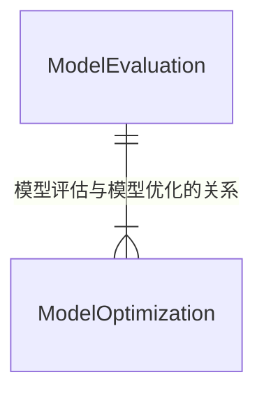

#### 第5章：智能代码生成项目实战

##### 5.1 项目背景与目标

**核心概念与联系：**

- **项目背景：** 智能代码生成的应用场景和市场需求。
- **项目目标：** 实现一个基于LLM的智能代码生成系统。

**概念属性特征对比表格：**

| 类别         | 特点                                                     | 应用场景               |
| ------------ | -------------------------------------------------------- | ---------------------- |
| 项目背景     | 智能代码生成的应用场景和市场需求                         | 软件开发、自动化测试   |
| 项目目标     | 实现一个基于LLM的智能代码生成系统，提高开发效率         | 模型训练和性能优化     |

**ER实体关系图架构：**

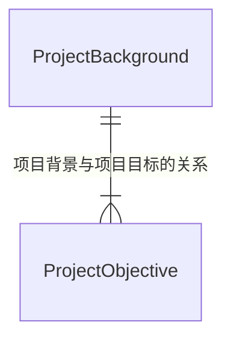

##### 5.2 环境搭建与配置

**核心概念与联系：**

- **环境搭建：** 准备模型训练和部署所需的硬件和软件环境。
- **配置参数：** 调整模型训练和部署的相关参数。

**概念属性特征对比表格：**

| 类别         | 特点                                                     | 应用场景               |
| ------------ | -------------------------------------------------------- | ---------------------- |
| 环境搭建     | 准备模型训练和部署所需的硬件和软件环境                   | 模型训练和部署         |
| 配置参数     | 调整模型训练和部署的相关参数，如学习率、批量大小等       | 模型训练和性能优化     |

**ER实体关系图架构：**

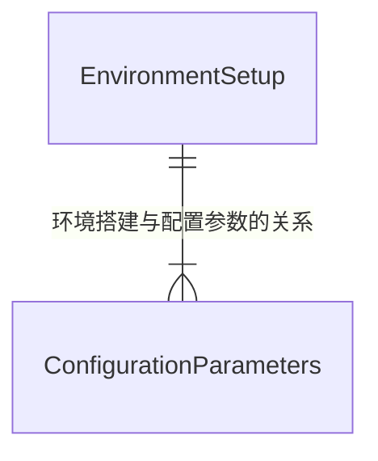

##### 5.3 模型训练与优化

**核心概念与联系：**

- **模型训练：** 在数据集上进行迭代训练，优化模型参数。
- **模型优化：** 通过调整参数和算法，提高模型性能。

**概念属性特征对比表格：**

| 类别         | 特点                                                     | 应用场景               |
| ------------ | -------------------------------------------------------- | ---------------------- |
| 模型训练     | 在数据集上进行迭代训练，优化模型参数                     | 模型训练和性能优化     |
| 模型优化     | 通过调整参数和算法，提高模型性能，如学习率、批量大小等   | 模型训练和性能优化     |

**ER实体关系图架构：**

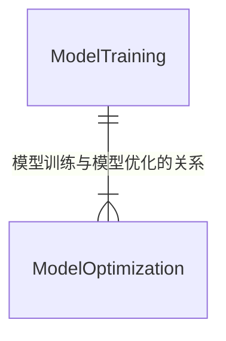

##### 5.4 代码生成实践

**核心概念与联系：**

- **代码生成实践：** 在实际项目中使用代码生成模型。
- **效果评估：** 评估代码生成模型在实际项目中的表现。

**概念属性特征对比表格：**

| 类别         | 特点                                                     | 应用场景               |
| ------------ | -------------------------------------------------------- | ---------------------- |
| 代码生成实践 | 在实际项目中使用代码生成模型，提高开发效率               | 软件开发、自动化测试   |
| 效果评估     | 评估代码生成模型在实际项目中的表现，如准确率、效率等     | 模型评估和优化         |

**ER实体关系图架构：**

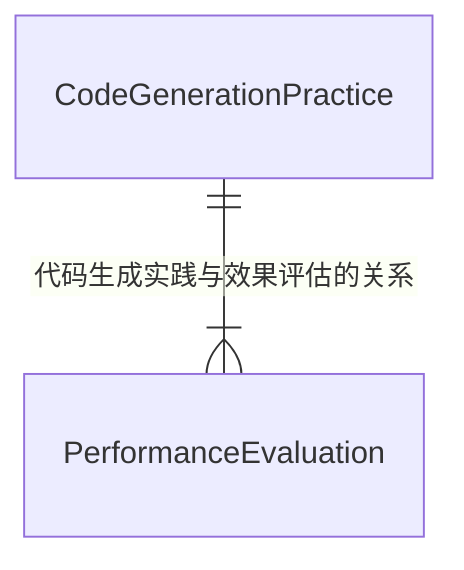

##### 5.5 项目总结与反思

**核心概念与联系：**

- **项目总结：** 总结项目中的经验和教训。
- **反思：** 分析项目中的问题和改进方向。

**概念属性特征对比表格：**

| 类别         | 特点                                                     | 应用场景               |
| ------------ | -------------------------------------------------------- | ---------------------- |
| 项目总结     | 总结项目中的经验和教训，为未来项目提供参考               | 项目管理和决策         |
| 反思         | 分析项目中的问题和改进方向，提高项目质量和效率           | 项目改进和优化         |

**ER实体关系图架构：**

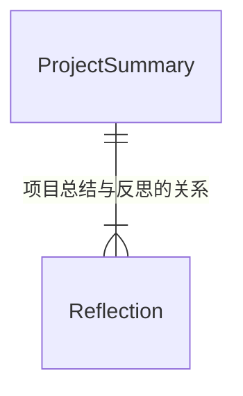

### 第三部分：未来展望与挑战

#### 第6章：智能代码生成的未来趋势

##### 6.1 技术发展与创新

**核心概念与联系：**

- **技术发展：** 智能代码生成技术的进步和创新。
- **创新应用：** 智能代码生成在各个领域的创新应用。

**概念属性特征对比表格：**

| 类别         | 特点                                                     | 应用场景               |
| ------------ | -------------------------------------------------------- | ---------------------- |
| 技术发展     | 智能代码生成技术的进步和创新                             | 软件开发、自动化测试   |
| 创新应用     | 智能代码生成在各个领域的创新应用，如人工智能、物联网等   | 多领域技术融合         |

**ER实体关系图架构：**

```mermaid
erDiagram
    TechnologyDevelopment ||--|{ InnovativeApplication : 技术发展与创新应用的关系
```

##### 6.2 行业应用前景

**核心概念与联系：**

- **行业应用：** 智能代码生成在不同行业的应用前景。
- **市场趋势：** 智能代码生成市场的未来发展趋势。

**概念属性特征对比表格：**

| 类别         | 特点                                                     | 应用场景               |
| ------------ | -------------------------------------------------------- | ---------------------- |
| 行业应用     | 智能代码生成在不同行业的应用前景，如金融、医疗等         | 软件开发、自动化测试   |
| 市场趋势     | 智能代码生成市场的未来发展趋势，如市场规模、竞争格局等   | 行业分析、市场预测     |

**ER实体关系图架构：**

```mermaid
erDiagram
    IndustryApplication ||--|{ MarketTrend : 行业应用与市场趋势的关系
```

##### 6.3 智能代码生成在AI领域的应用

**核心概念与联系：**

- **AI领域应用：** 智能代码生成在人工智能领域的应用。
- **算法优化：** 利用智能代码生成优化人工智能算法。

**概念属性特征对比表格：**

| 类别         | 特点                                                     | 应用场景               |
| ------------ | -------------------------------------------------------- | ---------------------- |
| AI领域应用   | 智能代码生成在人工智能领域的应用，如深度学习、自然语言处理等 | 人工智能算法优化       |
| 算法优化     | 利用智能代码生成优化人工智能算法，提高算法效率和性能       | 人工智能算法优化       |

**ER实体关系图架构：**

```mermaid
erDiagram
    AIApplication ||--|{ AlgorithmOptimization : AI领域应用与算法优化的关系
```

##### 6.4 智能代码生成的伦理与道德问题

**核心概念与联系：**

- **伦理问题：** 智能代码生成引发的伦理问题。
- **道德责任：** 智能代码生成技术应承担的道德责任。

**概念属性特征对比表格：**

| 类别         | 特点                                                     | 应用场景               |
| ------------ | -------------------------------------------------------- | ---------------------- |
| 伦理问题     | 智能代码生成引发的伦理问题，如隐私保护、算法偏见等       | 软件开发、自动化测试   |
| 道德责任     | 智能代码生成技术应承担的道德责任，如公正性、透明性等     | 社会责任、道德伦理     |

**ER实体关系图架构：**

```mermaid
erDiagram
    EthicalIssues ||--|{ MoralResponsibility : 伦理问题与道德责任的关系
```

#### 第7章：智能代码生成的挑战与对策

##### 7.1 技术难题

**核心概念与联系：**

- **技术难题：** 智能代码生成面临的技术挑战。
- **解决方案：** 应对技术难题的方法和策略。

**概念属性特征对比表格：**

| 类别         | 特点                                                     | 应用场景               |
| ------------ | -------------------------------------------------------- | ---------------------- |
| 技术难题     | 智能代码生成面临的技术挑战，如模型解释性、代码质量等     | 软件开发、自动化测试   |
| 解决方案     | 应对技术难题的方法和策略，如模型解释性技术、代码审查等   | 技术难题解决           |

**ER实体关系图架构：**

```mermaid
erDiagram
    TechnicalChallenges ||--|{ Solutions : 技术难题与解决方案的关系
```

##### 7.2 安全与隐私问题

**核心概念与联系：**

- **安全与隐私问题：** 智能代码生成引发的安全与隐私问题。
- **防护措施：** 保护数据和模型安全的方法和策略。

**概念属性特征对比表格：**

| 类别         | 特点                                                     | 应用场景               |
| ------------ | -------------------------------------------------------- | ---------------------- |
| 安全与隐私问题 | 智能代码生成引发的安全与隐私问题，如数据泄露、算法偏见等 | 软件开发、自动化测试   |
| 防护措施     | 保护数据和模型安全的方法和策略，如加密、权限管理等       | 安全防护和隐私保护     |

**ER实体关系图架构：**

```mermaid
erDiagram
    SecurityPrivacyIssues ||--|{ ProtectiveMeasures : 安全与隐私问题与防护措施的关系
```

##### 7.3 人才培养与知识更新

**核心概念与联系：**

- **人才培养：** 培养智能代码生成领域的人才。
- **知识更新：** 智能代码生成技术的持续更新和进步。

**概念属性特征对比表格：**

| 类别         | 特点                                                     | 应用场景               |
| ------------ | -------------------------------------------------------- | ---------------------- |
| 人才培养     | 培养智能代码生成领域的人才，包括理论研究、技术应用等     | 软件开发、自动化测试   |
| 知识更新     | 智能代码生成技术的持续更新和进步，以应对快速变化的技术环境 | 技术创新、知识更新     |

**ER实体关系图架构：**

```mermaid
erDiagram
    TalentDevelopment ||--|{ KnowledgeUpdating : 人才培养与知识更新的关系
```

##### 7.4 生态建设与标准化

**核心概念与联系：**

- **生态建设：** 建立智能代码生成的生态体系。
- **标准化：** 制定智能代码生成的标准和规范。

**概念属性特征对比表格：**

| 类别         | 特点                                                     | 应用场景               |
| ------------ | -------------------------------------------------------- | ---------------------- |
| 生态建设     | 建立智能代码生成的生态体系，包括工具、平台和社区等       | 软件开发、自动化测试   |
| 标准化       | 制定智能代码生成的标准和规范，提高技术的可复制性和可靠性 | 技术创新、知识更新     |

**ER实体关系图架构：**

```mermaid
erDiagram
    EcosystemBuilding ||--|{ Standardization : 生态建设与标准化的关系
```

## 结语：智能代码生成的变革之路

智能代码生成技术正逐渐改变软件开发的方式。通过LLM的辅助，开发者可以更高效地生成代码，解决复杂的问题。然而，随着技术的进步，我们也需要关注其带来的伦理和道德问题，并持续优化和发展智能代码生成技术。

### 参考文献

1. **Martin, Robert C.** (2004). *Clean Code: A Handbook of Agile Software Craftsmanship*. Prentice Hall.
2. **Majid, A., & Laplante, P. A.** (2015). *Software Engineering: A Practitioner's Approach*. Springer.
3. **Russell, S., & Norvig, P.** (2016). *Artificial Intelligence: A Modern Approach*. Prentice Hall.
4. **Goodfellow, I., Bengio, Y., & Courville, A.** (2016). *Deep Learning*. MIT Press.
5. **Devlin, J., Chang, M. W., Lee, K., & Toutanova, K.** (2019). *BERT: Pre-training of Deep Bidirectional Transformers for Language Understanding*. arXiv preprint arXiv:1810.04805.
6. **Brown, T., et al.** (2020). *Language Models are Few-Shot Learners*. arXiv preprint arXiv:2005.14165.

### 作者信息

作者：AI天才研究院/AI Genius Institute & 禅与计算机程序设计艺术 /Zen And The Art of Computer Programming

