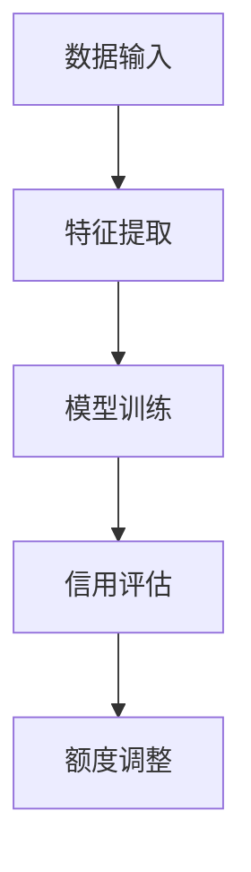
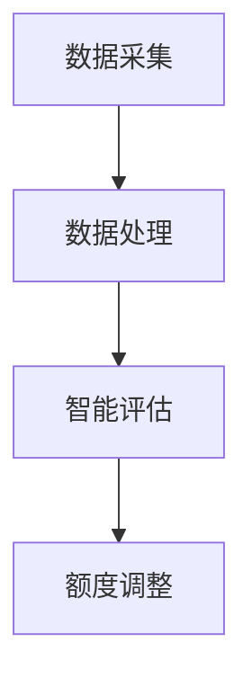
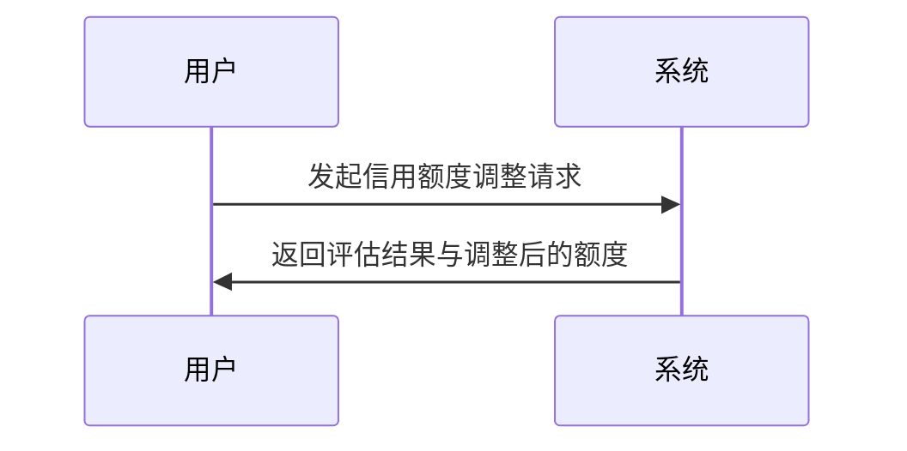

                 

### 智能企业信用额度动态调整系统

#### 关键词

- 智能信用管理
- 动态调整算法
- 企业资金运作
- 机器学习
- 数据分析

#### 摘要

本文旨在探讨智能企业信用额度动态调整系统的构建与应用。在传统企业信用额度管理中，存在评估周期长、风险控制不到位等问题。通过引入智能算法，该系统能够实时采集企业运营数据，自动评估信用状况，并动态调整信用额度。本文首先介绍企业信用额度管理的背景与挑战，然后详细阐述核心概念、智能算法原理、数学模型与公式解析、系统分析与架构设计、项目实战，最后总结最佳实践与注意事项。

### 目录大纲

# 智能企业信用额度动态调整系统

## 第1章：背景与核心概念

### 1.1 问题背景

- **企业信用额度管理的现状与挑战**：传统企业信用额度管理通常依靠人工评估，效率低下，且容易出现误差。企业需要更灵活、更精准的管理手段。
- **智能化的需求与重要性**：随着大数据和人工智能技术的发展，智能化管理成为企业提升竞争力、降低风险的关键途径。

### 1.2 核心概念

- **信用额度**：企业根据信用评估获得的贷款额度。
- **动态调整**：根据企业实时经营状况和信用情况，调整信用额度。
- **智能算法**：运用数据分析和机器学习技术，自动评估和调整信用额度。

### 1.3 概念属性特征对比表格

| 概念     | 定义                                                         | 关联与作用                                                         |
|----------|--------------------------------------------------------------|------------------------------------------------------------------|
| 信用额度 | 企业根据信用评估获得的贷款额度。                               | 影响企业资金运作，需要合理调整以降低风险。                         |
| 动态调整 | 根据企业实时经营状况和信用情况，调整信用额度。                 | 提高信用管理的灵活性和准确性，降低信贷风险。                       |
| 智能算法 | 运用数据分析和机器学习技术，自动评估和调整信用额度。           | 提升决策速度与精准度，优化信用额度管理流程。                       |

### 1.4 概念联系

- **信用额度与动态调整的关系**：信用额度是动态调整的基础。
- **动态调整与智能算法的相互作用**：智能算法为动态调整提供了技术支持。

## 第2章：智能算法原理与流程

### 2.1 智能算法基础

- **数据采集与预处理**：采集企业历史和实时数据，进行清洗和标准化处理。
- **数据分析技术**：利用统计分析方法提取数据特征。
- **机器学习模型**：构建和训练模型，用于信用评估和额度调整。

### 2.2 算法流程

- **数据输入**：收集企业的财务数据、经营数据等。
- **特征提取**：从数据中提取对企业信用评估有影响力的特征。
- **模型训练**：使用历史数据训练模型。
- **信用评估**：根据实时数据评估企业信用状况。
- **额度调整**：根据评估结果动态调整信用额度。

### 2.3 Mermaid算法流程图

## 第3章：数学模型与公式解析

### 3.1 数学模型概述

- **建立信用额度动态调整的数学模型**：定义变量和参数，构建信用额度调整公式。
- **模型中涉及的变量和参数**：如企业的财务状况、市场表现、信用历史等。

### 3.2 关键公式

$$
\text{信用额度}_{\text{new}} = \text{信用额度}_{\text{current}} + f(\text{风险评估})
$$

### 3.3 公式详细讲解

- **风险评估公式的推导**：分析风险因素，构建风险评估模型。
- **信用额度调整公式的应用**：如何根据风险评估结果调整信用额度。

## 第4章：系统分析与架构设计

### 4.1 问题场景介绍

- **信用额度管理的实际业务场景**：企业如何根据市场需求调整信用额度。
- **动态调整的需求与挑战**：如何在保证信用风险可控的前提下，实现动态调整。

### 4.2 系统功能设计

- **数据采集与处理模块**：采集并处理企业运营数据。
- **智能评估模块**：运用智能算法评估企业信用状况。
- **额度调整模块**：根据评估结果调整信用额度。

### 4.3 系统架构设计

- **架构组成**：系统的整体架构设计，包括数据层、服务层和表现层。
- **系统模块间的关系**：各模块的功能与交互关系。

### 4.4 Mermaid架构图

### 4.5 系统接口设计

- **系统对外提供的主要接口**：如数据查询接口、额度调整接口。
- **接口功能与数据交换格式**：定义接口的功能和数据格式。

### 4.6 系统交互Mermaid序列图

## 第5章：项目实战

### 5.1 环境安装

- **操作系统与软件环境的配置**：配置适合运行系统的环境。
- **数据库与中间件安装**：安装数据库和中间件，如MySQL、Redis等。

### 5.2 系统核心实现

- **数据采集与预处理**：采集企业数据，进行预处理。
- **智能算法实现**：实现智能算法，用于信用评估和额度调整。
- **额度调整流程**：根据评估结果调整信用额度。

### 5.3 代码应用解读与分析

- **关键代码段解释**：解释系统实现中的关键代码。
- **系统运行实例分析**：分析系统在实际运行中的表现。

### 5.4 实际案例分析与详细讲解

- **案例背景**：介绍实际案例的背景。
- **案例实施步骤**：详细讲解案例的实施步骤。
- **案例效果评估**：评估案例的效果。

### 5.5 项目小结

- **项目实施经验总结**：总结项目实施过程中的经验。
- **存在问题与改进建议**：分析项目中存在的问题，并提出改进建议。

## 第6章：最佳实践与拓展

### 6.1 最佳实践

- **动态调整策略优化**：如何优化动态调整策略。
- **风险控制策略应用**：如何在信用额度管理中应用风险控制策略。

### 6.2 注意事项

- **系统安全与隐私保护**：确保系统安全与用户隐私。
- **数据质量与管理**：保证数据质量，优化数据管理。

### 6.3 拓展阅读

- **最新研究成果**：介绍最新的研究成果和应用。
- **相关领域趋势**：分析相关领域的趋势与发展方向。

