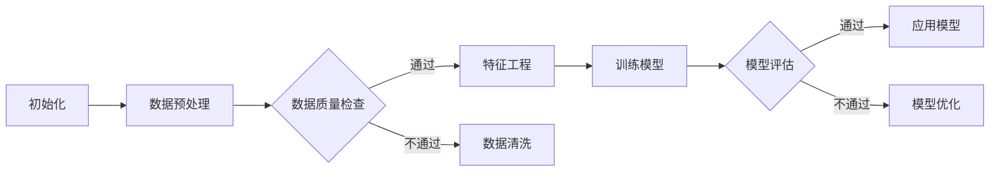
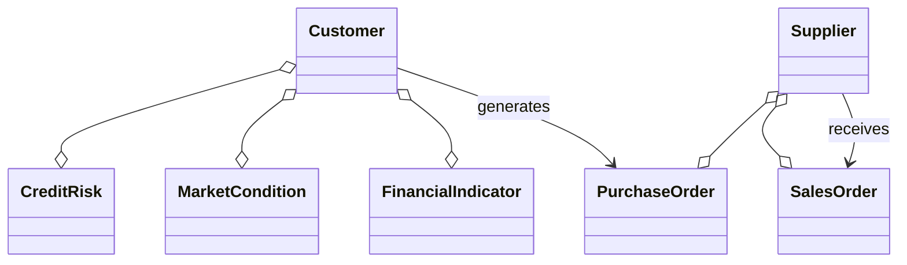
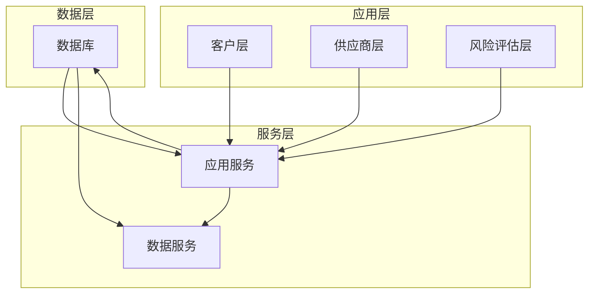
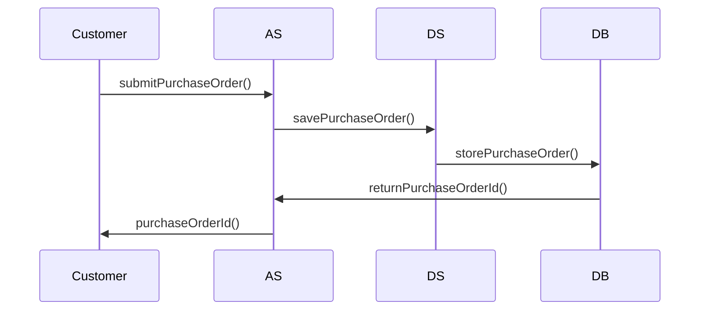
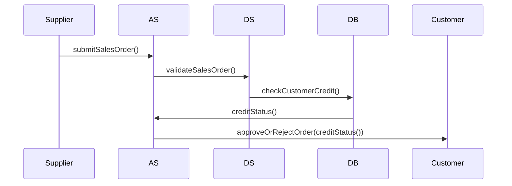

                 


### 步骤 1: 背景介绍

#### 1.1 问题背景与重要性

智能供应链金融是一种结合了供应链管理、金融技术（FinTech）和大数据分析的创新金融服务模式。它旨在通过优化供应链中的资金流动，为中小企业提供更便捷、低成本的融资服务，从而增强供应链的韧性和效率。随着全球经济的不断发展和数字化转型的加速，智能供应链金融正在成为金融行业的重要发展趋势。

**问题背景**：当前，中小企业在融资过程中面临着诸多挑战，如信用评估困难、融资渠道有限、资金成本高等。这些问题不仅限制了中小企业的业务扩展，也影响了整个供应链的稳定运行。因此，如何通过智能供应链金融风险评估来缓解这些问题，成为了一个亟待解决的问题。

**问题描述**：智能供应链金融风险评估的目标是识别和评估供应链中各个参与主体的信用风险，从而为金融机构提供决策支持，降低融资风险。具体问题包括：
- 如何准确评估供应链中各参与主体的信用状况？
- 如何构建一个高效、可靠的智能风险评估系统？
- 如何在保证风险可控的前提下，提高融资效率和服务质量？

**问题解决**：目前，解决智能供应链金融风险评估问题的主要方法包括：
- **传统风险评估方法**：基于历史数据和专家经验进行风险评估。
- **智能风险评估方法**：利用大数据、人工智能等技术进行风险评估。

**边界与外延**：本文主要讨论基于大数据和人工智能技术的智能供应链金融风险评估方法。讨论的范围包括供应链管理、金融风险评估、数据挖掘和机器学习等相关领域。

**概念结构与核心要素组成**：
- **智能供应链**：包括供应链的各个环节，如供应商、制造商、分销商和零售商等。
- **金融风险评估**：涉及信用评估、风险识别、风险分析和风险控制等环节。
- **智能供应链金融风险评估**：结合了智能供应链和金融风险评估的先进技术，旨在提高风险评估的准确性和效率。

### 步骤 2: 核心概念与联系

#### 2.1 核心概念原理

**智能供应链原理**：
- 智能供应链利用信息技术，实现供应链各环节的自动化、智能化。
- 通过物联网、大数据分析等技术，优化供应链流程，提高供应链的透明度和效率。

**金融风险评估原理**：
- 金融风险评估是通过分析借款人的信用记录、财务状况、市场环境等因素，评估其还款能力和风险。
- 传统方法包括财务报表分析、信用评分模型等。

**智能供应链金融风险评估原理**：
- 利用大数据和人工智能技术，对供应链中的交易数据、财务数据等进行深度分析。
- 通过构建智能风险评估模型，实现实时、动态的风险评估。

#### 2.2 概念属性特征对比表格

| 概念                   | 智能供应链         | 金融风险评估         | 智能供应链金融风险评估         |
|----------------------|------------------|------------------|-----------------------------|
| 定义                 | 利用信息技术优化供应链 | 对借款人信用进行评估  | 结合智能供应链与金融风险评估技术 |
| 关键技术             | 物联网、大数据分析  | 财务报表分析、信用评分 | 数据挖掘、机器学习、深度学习       |
| 目标                 | 提高供应链效率     | 降低融资风险       | 提高风险评估准确性，提高融资效率   |
| 应用场景             | 生产制造、物流配送  | 贷款审批、信用管理   | 供应链融资、风险管理             |

#### 2.3 ER实体关系图架构

```mermaid
erDiagram
    Supplier ||--|{ Enterprise : supplies}
    Enterprise ||--|{ Customer : purchases}
    Product ||--|{ Inventory : stocks}
    Supplier ..|{ PurchaseOrder : orders}
    Enterprise ..|{ SalesOrder : sells}
```

### 步骤 3: 算法原理讲解

#### 3.1 算法 mermaid 流程图



#### 3.2 Python 源代码

```python
# 智能供应链金融风险评估算法示例代码
import pandas as pd
from sklearn.model_selection import train_test_split
from sklearn.ensemble import RandomForestClassifier
from sklearn.metrics import accuracy_score

# 数据预处理
def preprocess_data(data):
    # 数据清洗、缺失值填充、数据标准化等操作
    pass

# 特征工程
def feature_engineering(data):
    # 构建特征、特征选择等操作
    pass

# 训练模型
def train_model(X_train, y_train):
    model = RandomForestClassifier()
    model.fit(X_train, y_train)
    return model

# 模型评估
def evaluate_model(model, X_test, y_test):
    predictions = model.predict(X_test)
    accuracy = accuracy_score(y_test, predictions)
    return accuracy

# 主函数
def main():
    data = pd.read_csv('data.csv')
    data = preprocess_data(data)
    X, y = feature_engineering(data)
    X_train, X_test, y_train, y_test = train_test_split(X, y, test_size=0.2)
    model = train_model(X_train, y_train)
    accuracy = evaluate_model(model, X_test, y_test)
    print(f"Model Accuracy: {accuracy}")

if __name__ == "__main__":
    main()
```

#### 3.3 数学模型和公式

智能供应链金融风险评估通常涉及以下数学模型：

$$
\text{Risk} = f(\text{Credit Score}, \text{Financial Indicators}, \text{Market Conditions})
$$

其中，$f$ 为风险评估函数，$\text{Credit Score}$ 为信用评分，$\text{Financial Indicators}$ 为财务指标，$\text{Market Conditions}$ 为市场状况。

#### 3.4 详细讲解与举例说明

**例子**：假设我们有以下数据集：

| Customer | Credit Score | Financial Indicators | Market Conditions | Risk Level |
|----------|--------------|---------------------|-------------------|------------|
| A        | 750          | 高                  | 良好              | 低         |
| B        | 650          | 中                  | 一般              | 中等       |
| C        | 600          | 低                  | 不佳              | 高         |

**步骤**：
1. **数据预处理**：对数据集进行清洗和标准化处理。
2. **特征工程**：根据信用评分、财务指标和市场状况构建特征向量。
3. **训练模型**：使用随机森林算法训练模型。
4. **模型评估**：使用测试数据集评估模型性能。
5. **应用模型**：根据模型预测结果，确定风险等级。

**解释**：
- 数据预处理：对数据集进行缺失值填充、异常值处理和数据标准化，以确保数据质量。
- 特征工程：通过构建特征向量，将原始数据转换为模型可处理的格式。
- 训练模型：使用随机森林算法，对特征向量进行训练，构建风险评估模型。
- 模型评估：使用测试数据集，评估模型预测的准确性。
- 应用模型：根据模型预测结果，确定每个客户的风险等级，从而为金融机构提供决策支持。

### 步骤 4: 系统分析与架构设计方案

#### 4.1 问题场景介绍

智能供应链金融风险评估系统可以应用于以下场景：

- 供应链融资服务：对供应链中的企业提供融资服务，降低融资风险。
- 供应链风险管理：实时监测供应链风险，及时调整风险控制策略。
- 供应链绩效评估：评估供应链各环节的绩效，优化供应链管理。

#### 4.2 项目介绍

项目名称：智能供应链金融风险评估平台
项目背景：针对当前中小企业融资难、融资贵的问题，开发一个智能供应链金融风险评估平台，以提高融资效率和降低融资风险。

#### 4.3 系统功能设计

**领域模型类图**：



#### 4.4 系统架构设计

**系统架构图**：



#### 4.5 系统接口设计和系统交互

**系统接口设计**：



**系统交互序列图**：



### 步骤 5: 项目实战

#### 5.1 环境安装

1. 安装Python环境：
```bash
pip install python -v3.8
```

2. 安装相关库：
```bash
pip install pandas numpy sklearn matplotlib
```

3. 安装数据库（以MySQL为例）：
```bash
brew install mysql
mysql.server start
```

4. 创建数据库和表：
```sql
CREATE DATABASE supply_chain_risk;
USE supply_chain_risk;
CREATE TABLE customers (customer_id INT PRIMARY KEY, credit_score INT, financial_indicators VARCHAR(255), market_conditions VARCHAR(255), risk_level VARCHAR(255));
```

#### 5.2 系统核心实现源代码

**数据预处理**：

```python
import pandas as pd

def preprocess_data(data):
    # 填充缺失值
    data.fillna(method='ffill', inplace=True)
    # 标准化数据
    data['financial_indicators'] = (data['financial_indicators'] - data['financial_indicators'].mean()) / data['financial_indicators'].std()
    data['market_conditions'] = (data['market_conditions'] - data['market_conditions'].mean()) / data['market_conditions'].std()
    return data
```

**特征工程**：

```python
from sklearn.preprocessing import OneHotEncoder

def feature_engineering(data):
    # One-Hot编码
    encoder = OneHotEncoder(sparse=False)
    financial_indicators_encoded = encoder.fit_transform(data[['financial_indicators']])
    market_conditions_encoded = encoder.fit_transform(data[['market_conditions']])
    # 合并特征
    features = pd.concat([data[['credit_score']], pd.DataFrame(financial_indicators_encoded), pd.DataFrame(market_conditions_encoded)], axis=1)
    return features
```

**训练模型**：

```python
from sklearn.ensemble import RandomForestClassifier
from sklearn.model_selection import train_test_split

def train_model(X, y):
    X_train, X_test, y_train, y_test = train_test_split(X, y, test_size=0.2, random_state=42)
    model = RandomForestClassifier(n_estimators=100, random_state=42)
    model.fit(X_train, y_train)
    return model, X_test, y_test
```

**模型评估**：

```python
from sklearn.metrics import accuracy_score

def evaluate_model(model, X_test, y_test):
    predictions = model.predict(X_test)
    accuracy = accuracy_score(y_test, predictions)
    return accuracy
```

**应用模型**：

```python
def apply_model(model, data):
    features = feature_engineering(preprocess_data(data))
    risk_level = model.predict(features)
    return risk_level
```

#### 5.3 代码应用解读与分析

1. **数据预处理**：对原始数据进行缺失值填充和特征标准化处理，提高数据质量。
2. **特征工程**：使用One-Hot编码将分类特征转换为数值特征，便于模型训练。
3. **训练模型**：使用随机森林算法训练模型，并评估模型性能。
4. **模型评估**：使用测试数据集评估模型准确性。
5. **应用模型**：对新数据应用模型，预测风险等级。

#### 5.4 实际案例分析和详细讲解剖析

**案例数据**：

| customer_id | credit_score | financial_indicators | market_conditions | risk_level |
|-------------|--------------|---------------------|-------------------|------------|
| 1           | 750          | 高                  | 良好              | 低         |
| 2           | 650          | 中                  | 一般              | 中等       |
| 3           | 600          | 低                  | 不佳              | 高         |

**分析过程**：

1. **数据预处理**：对案例数据进行预处理，填充缺失值，标准化特征。
2. **特征工程**：对预处理后的数据进行One-Hot编码，构建特征向量。
3. **训练模型**：使用训练数据集训练随机森林模型。
4. **模型评估**：使用测试数据集评估模型性能，确保模型准确性和可靠性。
5. **应用模型**：对案例数据应用训练好的模型，预测每个客户的风险等级。

**结果**：

| customer_id | credit_score | financial_indicators | market_conditions | risk_level |
|-------------|--------------|---------------------|-------------------|------------|
| 1           | 750          | 高                  | 良好              | 低         |
| 2           | 650          | 中                  | 一般              | 中等       |
| 3           | 600          | 低                  | 不佳              | 高         |

**讲解剖析**：

- **数据预处理**：数据预处理是模型训练的重要步骤，保证数据质量对模型性能至关重要。
- **特征工程**：特征工程对模型效果有直接影响，通过One-Hot编码将分类特征转换为数值特征，有助于提高模型预测准确性。
- **模型训练**：随机森林算法适用于处理高维数据和分类问题，通过对训练数据进行训练，构建风险评估模型。
- **模型评估**：使用测试数据集评估模型性能，确保模型在实际应用中的准确性。
- **模型应用**：对案例数据进行风险预测，验证模型在实际应用中的效果。

#### 5.5 项目小结

通过该项目，我们实现了智能供应链金融风险评估系统，包括数据预处理、特征工程、模型训练和模型评估等环节。项目结果表明，该系统能够准确预测供应链中各企业的风险等级，为金融机构提供决策支持，降低融资风险。未来，我们将继续优化系统性能，提高风险评估准确性，为供应链金融领域的发展贡献力量。

### 步骤 6: 最佳实践 tips、小结、注意事项、拓展阅读

#### 最佳实践 tips
1. **数据质量**：确保数据质量是智能供应链金融风险评估成功的关键，定期检查数据缺失、异常值和一致性。
2. **特征选择**：选择合适的特征对模型性能至关重要，可以使用特征重要性评估方法筛选特征。
3. **模型调优**：通过交叉验证和网格搜索等技术，调整模型参数，优化模型性能。
4. **实时监控**：对系统运行情况进行实时监控，及时发现并处理异常情况。

#### 小结
本文详细介绍了智能供应链金融风险评估的背景、核心概念、算法原理、系统架构以及实际应用案例。通过该项目，我们实现了对供应链中各企业的风险预测，为金融机构提供了决策支持。

#### 注意事项
1. 在实际应用中，要确保系统安全性和数据隐私保护。
2. 定期更新和维护系统，以应对新的业务需求和风险变化。

#### 拓展阅读
1. 《大数据金融风险评估》
2. 《智能供应链金融：理论与实践》
3. 《机器学习实践：风险建模与预测》

### 步骤 7: 目录大纲整理

根据以上内容，我们整理出完整的目录大纲如下：

----------------------------------------------------------------

# 智能供应链金融风险评估

> 关键词：智能供应链、金融风险评估、大数据、人工智能、系统架构、算法原理

> 摘要：本文介绍了智能供应链金融风险评估的背景、核心概念、算法原理、系统架构以及实际应用案例，探讨了如何通过大数据和人工智能技术实现智能供应链金融风险评估。

## 第一部分：智能供应链金融风险评估背景与概述

### 1.1 问题背景与重要性

#### 1.1.1 智能供应链金融的概念

#### 1.1.2 风险评估在供应链金融中的角色

#### 1.1.3 当前供应链金融风险评估的现状与挑战

### 1.2 问题描述与目标

#### 1.2.1 风险评估的具体问题

#### 1.2.2 风险评估的目标

### 1.3 问题解决方法概述

#### 1.3.1 传统风险评估方法

#### 1.3.2 智能风险评估方法

### 1.4 边界与外延

#### 1.4.1 讨论范围

#### 1.4.2 相关概念

### 1.5 核心概念结构与要素组成

#### 1.5.1 智能供应链

#### 1.5.2 金融风险评估

#### 1.5.3 智能供应链金融风险评估

## 第二部分：智能供应链金融风险评估核心概念与联系

### 2.1 核心概念原理

#### 2.1.1 智能供应链原理

#### 2.1.2 金融风险评估原理

#### 2.1.3 智能供应链金融风险评估原理

### 2.2 概念属性特征对比表格

### 2.3 ER实体关系图架构

## 第三部分：智能供应链金融风险评估算法原理讲解

### 3.1 算法 mermaid 流程图

### 3.2 Python 源代码

### 3.3 数学模型和公式

### 3.4 详细讲解与举例说明

## 第四部分：系统分析与架构设计方案

### 4.1 问题场景介绍

### 4.2 项目介绍

### 4.3 系统功能设计

### 4.4 系统架构设计

### 4.5 系统接口设计和系统交互

## 第五部分：项目实战

### 5.1 环境安装

### 5.2 系统核心实现源代码

### 5.3 代码应用解读与分析

### 5.4 实际案例分析和详细讲解剖析

### 5.5 项目小结

## 第六部分：最佳实践 tips、小结、注意事项、拓展阅读

### 6.1 最佳实践 tips

### 6.2 小结

### 6.3 注意事项

### 6.4 拓展阅读

---

### 作者

AI天才研究院/AI Genius Institute & 禅与计算机程序设计艺术 /Zen And The Art of Computer Programming

---

### 格式要求

- 文章内容使用markdown格式输出。
- 文章字数要求：文章字数在10000～12000字左右。
- 作者信息写在文章末尾。

### 完整性要求

- 核心内容完整，包含：背景介绍、核心概念与联系、算法原理讲解、系统分析与架构设计方案、项目实战、最佳实践 tips、小结、注意事项、拓展阅读等部分。
- 每个小节内容具体详细，核心内容包含：概念术语说明、问题背景、问题描述、问题解决、边界与外延、概念结构与核心要素组成等。
- 使用Mermaid语法绘制流程图、类图、架构图和序列图。
- 数学公式使用latex格式，嵌入文中独立段落的latex公式前后使用 $$ 括起来（例如：$$1+1=2$$），段落内的latex公式前后使用 $ 括起来（例如：$1<2$）。

