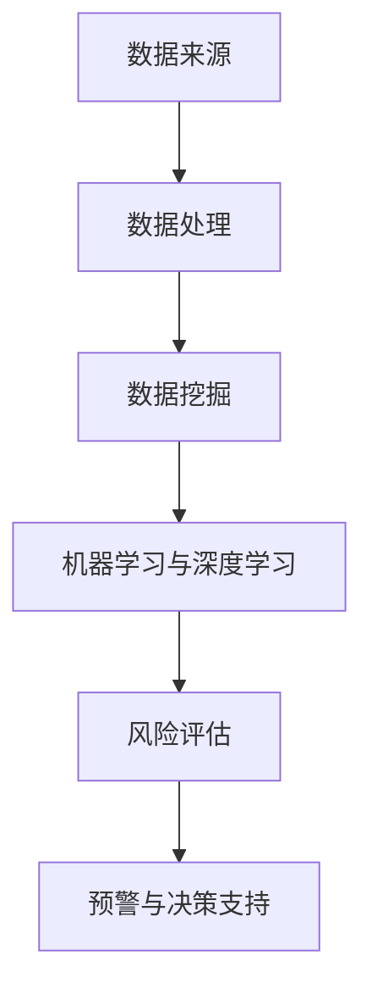
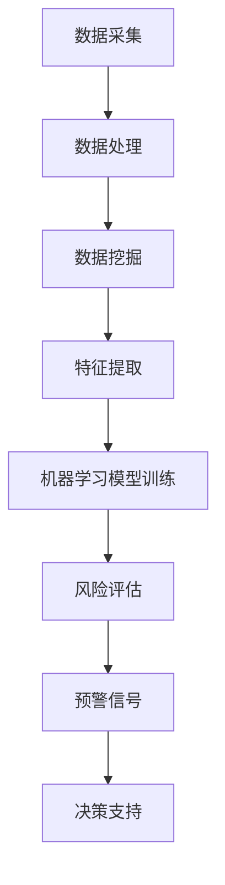
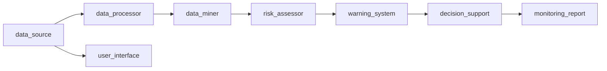
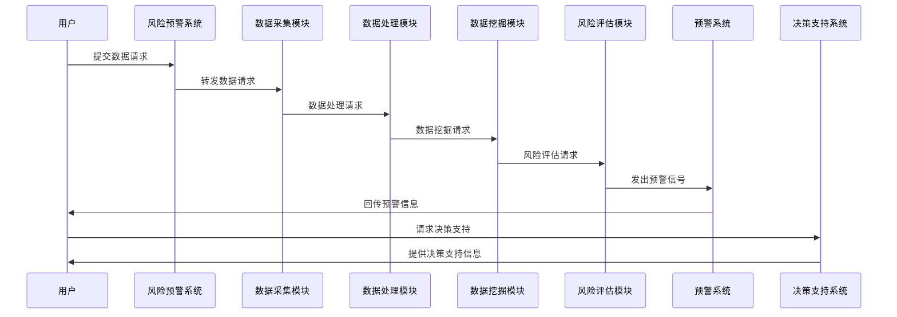

                 

### 引言

《智能供应链金融风险预警系统》的撰写旨在深入探讨智能供应链金融领域中的风险预警机制，通过系统化的分析和详实的案例讲解，帮助读者全面理解该系统的构建原理、技术实现及其在实际应用中的效果。随着全球经济的互联性和复杂性的增加，供应链金融已经成为了许多企业提升竞争力、优化资金流动的重要手段。然而，随之而来的风险也日益显著，如何准确、高效地进行风险预警成为了一个亟待解决的问题。

本文的核心目标是构建一个智能供应链金融风险预警系统，通过集成数据挖掘、机器学习和深度学习等先进技术，实现对供应链金融风险的实时监控和预警。文章将分为六个部分进行深入探讨：

1. **背景介绍**：首先，我们将介绍供应链金融的概述，智能供应链金融的发展现状与挑战，以及风险预警的重要性。
2. **核心概念与联系**：接着，我们将详细阐述数据挖掘、机器学习和深度学习等核心概念，并展示它们在风险预警系统中的联系。
3. **算法原理讲解**：在这一部分，我们将使用mermaid流程图和Python源代码，详细讲解风险预警算法的原理。
4. **系统分析与架构设计方案**：然后，我们将介绍系统的问题场景、功能设计、架构设计、接口设计和系统交互。
5. **项目实战**：通过具体的环境安装、源代码实现、代码解读和实际案例分析，我们将展示系统在实际应用中的效果。
6. **最佳实践与拓展**：最后，我们将提供最佳实践建议、注意事项、小结和拓展阅读，帮助读者更好地理解和应用智能供应链金融风险预警系统。

通过这样的结构布局，我们将一步步引导读者深入理解智能供应链金融风险预警系统的构建和应用，为读者提供一套实用且具有前瞻性的知识体系。

### 关键词

智能供应链金融，风险预警，数据挖掘，机器学习，深度学习，算法，架构设计，项目实战，最佳实践。

### 摘要

本文旨在构建并解析智能供应链金融风险预警系统，通过集成数据挖掘、机器学习和深度学习技术，实现对供应链金融风险的实时监控和预警。文章首先介绍了供应链金融的背景和风险预警的重要性，随后详细阐述了数据挖掘、机器学习以及深度学习等核心概念和其在风险预警系统中的应用。通过mermaid流程图和Python源代码，本文深入讲解了风险预警算法的原理，展示了其数学模型和公式。接着，文章介绍了系统的设计思路和架构，包括问题场景、功能设计、架构设计、接口设计和系统交互。通过具体的项目实战，本文展示了系统在实际应用中的效果，并提供了最佳实践建议和注意事项。最终，本文总结了智能供应链金融风险预警系统的重要性，展望了其未来发展方向。

### 封面与前言

《智能供应链金融风险预警系统》的撰写源于一个深刻的行业洞察：随着全球化的推进和数字化转型的加速，供应链金融已经成为企业提升竞争力、优化资金流动的重要手段。然而，随之而来的风险也日益显著，如何准确、高效地进行风险预警成为了一个亟待解决的问题。本书旨在填补这一空白，通过系统化的分析和详实的案例讲解，为读者提供一套全面、实用的智能供应链金融风险预警系统的构建与应用指南。

本书的读者对象包括但不限于：

1. **供应链金融从业者**：包括银行、保险公司、供应链公司等领域的从业人员，他们需要了解如何通过技术手段提高供应链金融的风险管理能力。
2. **技术研究人员**：对于数据挖掘、机器学习和深度学习等前沿技术感兴趣的科研人员，本书提供了一个实际应用场景的深入剖析。
3. **高校师生**：计算机科学、金融工程等专业的高校师生，可以通过本书的学习，将理论知识与实际应用相结合，提升自身的研究和教学水平。
4. **创业者**：对于希望借助智能供应链金融提升企业竞争力的创业者，本书提供了宝贵的实践经验和参考案例。

本书的撰写旨在解决以下问题：

1. **风险识别与预警**：如何通过技术手段准确识别供应链金融中的潜在风险，并实现实时预警？
2. **数据挖掘与应用**：如何利用数据挖掘技术从大量历史数据中提取有价值的信息，支持风险预警系统的构建？
3. **机器学习与深度学习**：如何应用机器学习和深度学习算法，提高风险预警系统的准确性和效率？
4. **系统设计与实现**：如何设计一个高效、稳定的智能供应链金融风险预警系统，确保其在实际应用中的效果和可靠性？

本书的结构设计遵循以下思路：

1. **背景介绍**：首先，介绍供应链金融的背景和风险预警的重要性，明确问题的核心。
2. **核心概念与联系**：接着，详细阐述数据挖掘、机器学习以及深度学习等核心概念，并展示它们在风险预警系统中的联系。
3. **算法原理讲解**：通过mermaid流程图和Python源代码，详细讲解风险预警算法的原理，展示其数学模型和公式。
4. **系统分析与架构设计方案**：介绍系统的问题场景、功能设计、架构设计、接口设计和系统交互。
5. **项目实战**：通过具体的项目实战，展示系统在实际应用中的效果。
6. **最佳实践与拓展**：最后，提供最佳实践建议、注意事项、小结和拓展阅读，帮助读者更好地理解和应用智能供应链金融风险预警系统。

通过这样的结构布局，本书不仅提供了丰富的理论知识，还结合实际案例，帮助读者深入理解智能供应链金融风险预警系统的构建与应用，为供应链金融领域的技术创新和风险管理提供有力支持。

### 第一部分：背景介绍

#### 供应链金融概述

供应链金融是指以供应链中的核心企业为基础，通过将供应链上的各项交易和资产打包，以融资、保险、风险管理等金融服务为主要手段，为企业提供资金支持和风险管理的金融服务模式。其核心在于通过融资链条将供应链上的多个节点企业紧密联系在一起，从而优化资金流动，提高整体供应链的运作效率。

供应链金融的主要参与者包括核心企业、金融机构和供应链上的其他企业。核心企业通常是供应链中的龙头企业，具有强大的资金实力和信用等级，是供应链金融的基石。金融机构则提供各种金融服务，包括贷款、保理、信用保险等，帮助供应链上的企业解决融资难题。供应链上的其他企业则通过参与供应链金融，获得更加灵活的融资渠道和风险管理工具。

供应链金融的主要优势在于：

1. **优化资金流动**：通过供应链金融，可以缩短资金流转周期，提高资金使用效率，降低企业的财务成本。
2. **降低融资难度**：供应链金融可以为中小企业提供更加灵活和便捷的融资渠道，降低融资门槛。
3. **提升风险管理能力**：通过供应链金融，企业可以更好地了解供应链上的各项风险，采取相应的风险管理措施。
4. **增强供应链协同**：供应链金融有助于增强供应链上各企业的合作，提高整个供应链的运作效率。

#### 智能供应链金融的发展现状与挑战

随着大数据、人工智能等技术的快速发展，智能供应链金融逐渐成为供应链金融领域的重要研究方向和应用方向。智能供应链金融通过引入数据挖掘、机器学习、深度学习等先进技术，实现对供应链金融风险的智能识别、预警和管理。

当前，智能供应链金融的发展现状主要体现在以下几个方面：

1. **技术应用普及**：越来越多的金融机构和科技公司开始将人工智能技术应用于供应链金融，通过数据分析和智能算法，提升风险管理的准确性和效率。
2. **平台化服务**：智能供应链金融服务平台的建设逐步完善，通过整合各类金融资源和技术手段，为供应链上的企业提供一站式金融服务。
3. **风险预警能力提升**：智能供应链金融风险预警系统通过分析海量数据，能够提前识别潜在风险，提供有效的预警措施，降低企业的风险损失。

然而，智能供应链金融在发展过程中也面临着一些挑战：

1. **数据质量**：智能供应链金融风险预警系统依赖于大量高质量的数据，数据的不完整、不准确等问题会直接影响系统的预警效果。
2. **技术成熟度**：尽管人工智能技术在智能供应链金融中的应用已经取得了一定的进展，但整体上仍处于发展阶段，技术的成熟度和稳定性有待进一步提高。
3. **法律法规**：智能供应链金融的发展需要完善的法律法规体系作为支撑，目前相关的法律法规尚不健全，对智能供应链金融的规范和管理存在一定的空白。

#### 风险预警的重要性

在供应链金融中，风险预警系统具有至关重要的地位。它通过实时监测供应链中的各种风险因素，包括信用风险、市场风险、操作风险等，及时发出预警信号，帮助企业采取相应的应对措施，从而降低风险损失。

风险预警的重要性体现在以下几个方面：

1. **风险预防**：通过提前预警，企业可以及时了解供应链中的潜在风险，采取预防措施，避免或减轻风险带来的负面影响。
2. **降低损失**：风险预警系统可以及时识别和定位风险点，帮助企业迅速采取措施，降低风险发生的概率和损失程度。
3. **提高运营效率**：风险预警系统通过对供应链各环节的实时监控，可以优化运营流程，提高供应链的整体运作效率。
4. **增强客户信任**：通过有效管理风险，企业可以增强与上下游企业的合作关系，提高客户的信任度和满意度。

#### 问题描述

在本部分，我们将详细描述智能供应链金融风险预警系统的需求以及系统所需功能模块。

##### 风险预警系统的需求

智能供应链金融风险预警系统的主要需求包括：

1. **实时监测**：系统能够实时获取供应链中的各项数据，包括交易信息、财务数据、物流信息等，通过数据分析和算法模型，实现对风险的实时监控和预警。
2. **多维度分析**：系统能够从多个维度对风险进行综合分析，包括财务风险、市场风险、信用风险等，提供全面的风险评估。
3. **自动预警**：系统能够根据预设的规则和阈值，自动识别潜在风险，并发出预警信号，提高预警的准确性和效率。
4. **灵活配置**：系统能够根据企业的需求，灵活配置预警规则和阈值，适应不同企业的风险偏好和管理需求。

##### 系统所需功能模块

智能供应链金融风险预警系统通常包括以下几个功能模块：

1. **数据采集模块**：负责从各个数据源采集供应链中的各类数据，包括交易数据、财务数据、物流数据等，确保数据的完整性和准确性。
2. **数据处理模块**：对采集到的原始数据进行清洗、转换和整合，构建用于分析的风险数据集。
3. **数据挖掘模块**：利用数据挖掘技术，从风险数据集中提取有价值的信息，包括风险趋势、风险点等。
4. **风险评估模块**：通过机器学习和深度学习算法，对风险数据进行分析和预测，评估供应链中的风险水平。
5. **预警模块**：根据风险评估结果，设定预警规则和阈值，自动识别潜在风险，并发出预警信号。
6. **决策支持模块**：为企业提供风险决策支持，包括风险应对策略、风险应急预案等，帮助企业管理风险。
7. **监控与报告模块**：实时监控系统的运行状态，生成风险预警报告，为企业提供决策依据。

通过上述功能模块的协同工作，智能供应链金融风险预警系统能够实现对供应链金融风险的全面监控和预警，提高企业的风险防控能力。

#### 问题解决

##### 智能供应链金融风险预警的理论基础

智能供应链金融风险预警系统构建的理论基础主要包括数据挖掘、机器学习和深度学习等技术。这些技术不仅能够对大量数据进行高效处理和分析，还能够通过学习和预测，实现对风险的有效预警。

1. **数据挖掘**：数据挖掘是一种从大量数据中提取有价值信息的方法，通过模式识别和关联分析，可以发现数据中的潜在规律和趋势。在智能供应链金融风险预警系统中，数据挖掘技术主要用于数据的预处理、特征提取和关系发现，从而为风险预测提供基础。

2. **机器学习**：机器学习是一种通过数据训练模型，从而实现数据预测和分类的技术。在智能供应链金融风险预警系统中，机器学习算法如决策树、支持向量机等，可以用于评估供应链中的各种风险因素，预测潜在的风险事件。

3. **深度学习**：深度学习是一种基于人工神经网络的技术，通过多层网络结构，实现对复杂数据的深层特征提取和模型训练。在智能供应链金融风险预警系统中，深度学习算法如卷积神经网络（CNN）、循环神经网络（RNN）等，可以用于构建高度复杂的预测模型，提高风险预测的准确性。

##### 风险预警的技术架构

智能供应链金融风险预警系统的技术架构可以分为以下几个主要部分：

1. **数据层**：包括数据采集、存储和管理模块。数据采集模块负责从各类数据源（如ERP系统、物流系统、金融系统等）中获取数据，存储模块负责对数据进行持久化存储，管理模块负责对数据进行清洗、转换和整合。

2. **算法层**：包括数据挖掘、机器学习和深度学习算法模块。这些算法模块用于对数据进行处理和分析，提取特征，构建预测模型，评估风险水平。

3. **应用层**：包括风险预警、决策支持、监控与报告模块。风险预警模块负责根据算法层的结果，设定预警规则和阈值，发出预警信号；决策支持模块提供风险应对策略和应急预案；监控与报告模块实时监控系统的运行状态，生成风险预警报告。

4. **展示层**：包括用户界面和可视化模块。用户界面模块提供风险预警信息的展示和管理功能，可视化模块通过图表和仪表盘，将风险预警信息直观地呈现给用户。

##### 边界与外延

1. **系统的适用范围**：智能供应链金融风险预警系统适用于各类供应链金融场景，包括制造业、服务业、零售业等。它不仅能够服务于大型企业，也能够为中小企业提供定制化的风险预警服务。

2. **风险预警的相关概念和领域**：风险预警系统涉及多个相关概念和领域，包括风险识别、风险评估、风险应对、风险监控等。在供应链金融中，风险预警主要关注信用风险、市场风险、操作风险等。

3. **系统的构成要素**：智能供应链金融风险预警系统由数据采集、数据处理、数据挖掘、风险评估、预警、决策支持、监控与报告等构成要素组成。每个要素在整个系统中都扮演着重要的角色，相互协作，共同实现风险预警的目标。

通过上述理论基础的建立和技术的应用，智能供应链金融风险预警系统可以为企业和金融机构提供高效、准确的风险预警服务，提升供应链金融的风险管理能力。

### 核心概念与联系

在构建智能供应链金融风险预警系统时，理解数据挖掘、机器学习和深度学习等核心概念及其相互关系至关重要。这些技术不仅为风险预警提供了理论基础，而且在系统的实际运作中发挥着关键作用。下面我们将详细阐述这些概念，并通过对比表格和ER实体关系图来展示其联系。

#### 数据挖掘

数据挖掘是一种从大量数据中自动发现有价值信息、模式或知识的过程。它在风险预警系统中主要用于数据的预处理、特征提取和模式识别。

1. **概念原理**：数据挖掘通过多种技术，如关联规则挖掘、分类、聚类、异常检测等，从数据中提取有价值的信息。
2. **属性特征**：
   - **关联性**：通过关联规则挖掘，发现数据之间的关联关系。
   - **分类**：将数据分为不同的类别，用于风险预测。
   - **聚类**：将相似的数据归为一类，用于发现数据中的潜在风险模式。
   - **异常检测**：识别数据中的异常值或异常模式，作为风险的预警信号。

3. **在风险预警系统中的作用**：数据挖掘用于对供应链金融数据进行分析，提取关键特征，为后续的机器学习和深度学习提供数据支持。

#### 机器学习

机器学习是通过训练数据生成模型，从而使模型能够在未知数据上预测结果的算法集合。它在风险预警系统中主要用于风险评估和预测。

1. **概念原理**：机器学习包括监督学习、非监督学习和强化学习。监督学习通过已知标签的数据训练模型，非监督学习通过未标记的数据发现数据中的模式，强化学习通过与环境交互来学习最优策略。
2. **属性特征**：
   - **准确性**：通过训练数据集的准确性来评估模型的性能。
   - **泛化能力**：模型在未知数据上的预测能力。
   - **鲁棒性**：模型对噪声和异常值的容忍度。

3. **在风险预警系统中的作用**：机器学习用于建立风险预测模型，对供应链金融中的风险因素进行预测和评估，提供预警信号。

#### 深度学习

深度学习是一种基于多层神经网络的结构，通过逐层提取数据中的复杂特征，实现对数据的深度理解和建模。在风险预警系统中，深度学习主要用于构建高度复杂的预测模型。

1. **概念原理**：深度学习包括卷积神经网络（CNN）、循环神经网络（RNN）、长短时记忆网络（LSTM）等。这些网络通过多层非线性变换，能够从数据中提取出高度抽象的特征。
2. **属性特征**：
   - **层次性**：通过多层网络结构，逐层提取数据中的特征。
   - **并行处理**：能够高效处理大规模数据。
   - **自适应**：通过反向传播算法，自动调整网络参数。

3. **在风险预警系统中的作用**：深度学习用于构建复杂的预测模型，提高风险预测的准确性和效率。

#### 概念属性特征对比表格

| 概念          | 概念原理                                                     | 属性特征                                                                                     | 作用                  |
| ------------- | ------------------------------------------------------------ | ------------------------------------------------------------------------------------------- | --------------------- |
| 数据挖掘      | 自动发现数据中的模式和价值信息                               | 关联性、分类、聚类、异常检测                                                       | 特征提取和风险分析    |
| 机器学习      | 通过训练数据生成模型，预测未知数据                           | 准确性、泛化能力、鲁棒性                                                           | 风险评估和预测        |
| 深度学习      | 通过多层神经网络提取数据中的复杂特征，进行深度理解和建模       | 层次性、并行处理、自适应                                                           | 高级风险预测和模式识别 |

#### ER实体关系图架构

在智能供应链金融风险预警系统中，实体关系图（ER图）用于表示系统中的数据源、数据处理流程和各模块之间的关联关系。以下是ER实体关系图的简要描述：

1. **数据来源**：包括ERP系统、物流系统、金融系统等，这些系统提供供应链金融数据，如交易记录、财务数据、物流信息等。
2. **数据处理**：包括数据采集、清洗、转换和整合，将这些原始数据转化为用于分析和预测的格式。
3. **数据挖掘**：对处理后的数据进行分析，提取风险特征，如交易频次、付款周期等。
4. **机器学习与深度学习**：基于数据挖掘的结果，构建预测模型，对供应链中的风险进行评估。
5. **风险评估**：将预测模型的结果进行综合分析，生成风险预警信号。
6. **预警与决策支持**：根据风险评估的结果，发出预警信号，并提供应对策略和应急预案。

以下是ER实体关系图的Mermaid流程图：



通过数据挖掘、机器学习和深度学习的结合，智能供应链金融风险预警系统能够实现对供应链金融风险的全面监控和预警，为企业提供有效的风险管理工具。

### 算法原理讲解

#### 算法mermaid流程图

为了更好地理解智能供应链金融风险预警系统的算法原理，我们将使用mermaid语言绘制一个简化的流程图。以下是该流程图的mermaid代码：



在mermaid流程图中，每个节点表示一个处理步骤，箭头表示步骤之间的顺序关系。以下是流程图的解释：

1. **数据采集（A）**：系统从ERP系统、物流系统、金融系统等数据源中收集供应链相关的数据。
2. **数据处理（B）**：对采集到的原始数据清洗、转换和整合，确保数据的准确性和一致性。
3. **数据挖掘（C）**：通过数据挖掘技术提取有用的信息，如交易模式、付款周期等。
4. **特征提取（D）**：从数据挖掘结果中提取关键特征，用于后续的机器学习模型训练。
5. **机器学习模型训练（E）**：使用提取的特征数据训练机器学习模型，如决策树、支持向量机等。
6. **风险评估（F）**：利用训练好的模型对新的数据集进行风险评估，识别潜在风险。
7. **预警信号（G）**：根据评估结果生成预警信号，触发预警机制。
8. **决策支持（H）**：提供风险应对策略和应急预案，帮助企业管理风险。

#### Python源代码讲解

在智能供应链金融风险预警系统中，Python是常用的编程语言之一。下面我们将使用Python来讲解一个简单的机器学习模型训练和预测的过程。

首先，我们引入必要的Python库：

```python
import pandas as pd
from sklearn.model_selection import train_test_split
from sklearn.ensemble import RandomForestClassifier
from sklearn.metrics import accuracy_score
```

接下来，我们加载和预处理数据：

```python
# 加载数据
data = pd.read_csv('supply_chain_data.csv')

# 数据清洗和预处理
data = data.dropna()  # 删除缺失值
data = data[['transaction_count', 'payment_cycle', 'financial_index', 'risk_score']]  # 选择关键特征

# 切分数据集
X = data[['transaction_count', 'payment_cycle', 'financial_index']]
y = data['risk_score']
X_train, X_test, y_train, y_test = train_test_split(X, y, test_size=0.2, random_state=42)
```

然后，我们训练机器学习模型：

```python
# 训练随机森林模型
model = RandomForestClassifier(n_estimators=100, random_state=42)
model.fit(X_train, y_train)

# 预测测试集
y_pred = model.predict(X_test)
```

最后，我们评估模型的性能：

```python
# 计算准确率
accuracy = accuracy_score(y_test, y_pred)
print(f"模型准确率: {accuracy:.2f}")
```

以上代码展示了如何使用Python实现一个简单的机器学习模型，用于风险评分。具体步骤包括数据加载、数据预处理、模型训练和预测，最后评估模型的性能。在实际应用中，模型训练和预测的过程会更加复杂，需要考虑更多的特征工程、参数调整和性能优化。

#### 数学模型和公式讲解

在智能供应链金融风险预警系统中，数学模型和公式用于描述风险因素之间的关系，并指导算法的设计和实现。以下是一些常用的数学模型和公式：

1. **线性回归模型**：

   线性回归模型用于预测一个连续值，其公式为：

   $$ y = \beta_0 + \beta_1 \cdot x_1 + \beta_2 \cdot x_2 + ... + \beta_n \cdot x_n + \epsilon $$

   其中，$y$ 是预测值，$x_1, x_2, ..., x_n$ 是特征值，$\beta_0, \beta_1, \beta_2, ..., \beta_n$ 是模型的参数，$\epsilon$ 是误差项。

2. **逻辑回归模型**：

   逻辑回归模型用于预测一个二元结果，其公式为：

   $$ P(y=1) = \frac{1}{1 + e^{-(\beta_0 + \beta_1 \cdot x_1 + \beta_2 \cdot x_2 + ... + \beta_n \cdot x_n)}} $$

   其中，$P(y=1)$ 是预测变量为1的概率，其他符号与线性回归相同。

3. **决策树模型**：

   决策树模型通过一系列的判断规则来预测结果，其公式为：

   $$ y = \begin{cases} 
   1 & \text{如果} \ f(x) > \text{阈值} \\
   0 & \text{如果} \ f(x) \leq \text{阈值}
   \end{cases} $$

   其中，$f(x)$ 是决策树上的一个判断函数，$\text{阈值}$ 是预先设定的阈值。

4. **支持向量机（SVM）模型**：

   支持向量机模型用于分类问题，其公式为：

   $$ \text{最大化} \ \ \ \sum_{i=1}^{n} \alpha_i - \frac{1}{2} \sum_{i,j=1}^{n} \alpha_i \alpha_j y_i y_j (x_i \cdot x_j) $$

   $$ \text{约束条件} \ \ \ \alpha_i \geq 0, \ \ \ \ \ \ \ \ \ \ \ \ \ \ \ \ \ \ \ \ \ \ \ \ \ \ \ \ \ \ \ \ \ \ \ \ \ \ \ \ \ \ \ \ \ \ \ \ \ \ \ \ \ \ \ \ \ \ \ \ \ \ \ \ \ \ \ \ \ \ \ \ \ \ \ \ \ \ \ \ \ \ \ \ \ \ \ \ \ \ \ \ \ \ \ \ \ \ \ \ \ \ \ \ \ \ \ \ \ \ \ \ \ \ \ \ \ \ \ \ \ \ \ \ \ \ \ \ \ \ \ \ \ \ \ \ \ \ \ \ \ \ \ \ \ \ \ \ \ \ \ \ \ \ \ \ \ \ \ \ \ \ \ \ \ \ \ \ \ \ \ \ \ \ \ \ \ \ \ \ \ \ \ \ \ \ \ \ \ \ \ \ \ \ \ \ \ \ \ \ \ \ \ \ \ \ \ \ \ \ \ \ \ \ \ \ \ \ \ \ \ \ \ \ \ \ \ \ \ \ \ \ \ \ \ \ \ \ \ \ \ \ \ \ \ \ \ \ \ \ \ \ \ \ \ \ \ \ \ \ \ \ \ \ \ \ \ \ \ \ \ \ \ \ \ \ \ \ \ \ \ \ \ \ \ \ \ \ \ \ \ \ \ _{\alpha_i} \leq C, \ \ \ \ \ \ \ \ \ \ \ \ \ \ \ \ \ \ \ \ \ \ \ \ \ \ \ \ \ \ \ \ \ \ \ \ \ \ \ \ \ \ \ \ \ \ \ \ \ \ \ \ \ \ \ \ \ \ \ \ \ \ \ \ \ \ \ \ \ \ \ \ \ \ \ \ \ \ \ \ \ \ \ \ \ \ \ \ \ \ \ \ _{i=1,...,n} \\ 
   \sum_{i=1}^{n} \alpha_i y_i = 0
   \end{cases} $$

   其中，$\alpha_i$ 是模型参数，$C$ 是惩罚参数，$x_i$ 是特征向量，$y_i$ 是标签。

#### 举例说明

为了更好地理解上述数学模型和公式，我们通过一个简单的例子来说明如何使用Python实现一个线性回归模型。

首先，我们导入必要的库：

```python
import numpy as np
from sklearn.linear_model import LinearRegression
from sklearn.metrics import mean_squared_error
```

然后，我们创建一个简单的数据集：

```python
# 创建数据集
X = np.array([[1], [2], [3], [4], [5]])
y = np.array([1, 2, 2.5, 4, 5])
```

接下来，我们使用线性回归模型进行训练和预测：

```python
# 训练模型
model = LinearRegression()
model.fit(X, y)

# 预测
X_test = np.array([[6]])
y_pred = model.predict(X_test)

# 评估模型
mse = mean_squared_error(y, y_pred)
print(f"均方误差: {mse:.2f}")
```

通过上述代码，我们可以看到如何使用线性回归模型来预测一个新的值。实际应用中，数据集和模型会更加复杂，需要考虑更多的特征和参数调整。但基本的流程是一致的，包括数据预处理、模型训练和预测、模型评估。

### 系统分析与架构设计方案

#### 问题场景介绍

智能供应链金融风险预警系统的主要应用场景涉及以下几方面：

1. **供应链企业**：对于供应链上的各个企业，智能风险预警系统能够实时监控其交易行为、财务状况、物流情况等，识别潜在的信用风险、操作风险等，及时发出预警信号，帮助企业管理风险，保障资金安全。
2. **金融机构**：金融机构如银行、保险公司等通过智能供应链金融风险预警系统，可以对贷款申请、保理业务等供应链金融产品进行风险评估，提高审批效率，降低不良贷款率。
3. **物流公司**：物流公司在供应链中扮演着重要角色，通过风险预警系统，可以提前发现物流延迟、货物损坏等风险，采取预防措施，确保物流运作的顺畅。

这些场景的共同特点是都涉及到大量的数据，如交易记录、财务数据、物流信息等，因此，智能风险预警系统需要具备强大的数据处理和分析能力，以及对供应链金融风险的深入理解。

#### 系统功能设计（领域模型Mermaid类图）

在智能供应链金融风险预警系统中，各个功能模块需要协同工作，以实现全面的风险监控和预警。下面我们通过Mermaid类图来展示系统的领域模型。

```mermaid
classDiagram
    Class01 <|-- Class02
    Class01 <|-- Class03
    Class04 <..|Class01 : 使用
    Class02 <..|Class03 : 继承
    
    Class01{ 
        +属性1 
        +属性2 
        +方法1()
        +方法2()
    }
    Class02{
        +属性3
        +方法3()
    }
    Class03{
        +属性4
        +方法4()
    }
    Class04{
        +属性5
        +方法5()
    }
```

在上述类图中，`Class01` 代表系统的核心类，如数据采集模块、数据处理模块、数据挖掘模块等。`Class02` 和 `Class03` 是 `Class01` 的子类，代表具有特定功能的模块，如风险评估模块、预警模块等。`Class04` 代表系统的使用者类，如供应链企业、金融机构、物流公司等。

具体来说，领域模型包括以下功能模块：

1. **数据采集模块**：负责从ERP系统、物流系统、金融系统等数据源中收集供应链数据，如交易记录、财务数据、物流信息等。
2. **数据处理模块**：对采集到的原始数据清洗、转换和整合，构建用于分析和预测的数据集。
3. **数据挖掘模块**：对处理后的数据进行分析，提取关键特征，如交易频次、付款周期、财务指标等。
4. **风险评估模块**：利用机器学习和深度学习算法，对提取的特征进行风险评估，预测潜在的风险事件。
5. **预警模块**：根据风险评估的结果，设定预警规则和阈值，自动识别潜在风险，并发出预警信号。
6. **决策支持模块**：提供风险应对策略和应急预案，帮助企业管理风险。
7. **监控与报告模块**：实时监控系统的运行状态，生成风险预警报告，为企业提供决策依据。

#### 系统架构设计（Mermaid架构图）

智能供应链金融风险预警系统的架构设计需要综合考虑系统的性能、可扩展性和安全性。以下是一个简化的Mermaid架构图：



在架构图中，各个模块之间的关系如下：

1. **数据源（A）**：包括ERP系统、物流系统、金融系统等，是数据采集的起点。
2. **数据处理（B）**：对采集到的数据进行清洗、转换和整合。
3. **数据挖掘（C）**：对处理后的数据进行分析，提取关键特征。
4. **风险评估（D）**：利用数据挖掘结果进行风险评估。
5. **预警系统（E）**：根据风险评估结果，发出预警信号。
6. **决策支持（F）**：提供风险应对策略和应急预案。
7. **监控与报告（G）**：实时监控系统状态，生成报告。
8. **用户界面（H）**：提供给用户交互界面，展示风险预警信息和报告。

#### 系统接口设计

为了实现系统各模块之间的有效通信，系统需要设计一系列接口。以下是系统接口设计的一个概览：

1. **API接口**：系统对外提供API接口，允许第三方系统或应用程序通过RESTful API访问系统的功能。
   - **数据采集API**：用于从外部系统采集数据。
   - **数据处理API**：用于处理和清洗数据。
   - **风险预警API**：用于获取风险预警结果和预警信号。
2. **消息队列接口**：用于处理系统内部的消息传递，如数据采集、数据处理和预警通知等。
   - **Kafka接口**：使用Kafka作为消息队列，确保数据传输的高效性和可靠性。
3. **数据库接口**：用于与关系型数据库（如MySQL）或NoSQL数据库（如MongoDB）进行交互，存储和查询数据。
   - **ORM接口**：使用ORM（对象关系映射）技术简化数据库操作。

#### 系统交互（Mermaid序列图）

系统交互设计是确保各模块能够协同工作的关键。以下是一个简化的Mermaid序列图，展示系统内各模块的交互流程：



在这个序列图中，用户通过用户界面（WS）提交数据采集请求，数据采集模块（DS）接收请求并转发给数据处理模块（DP），进行处理后传递给数据挖掘模块（DM），DM对数据进行挖掘并传递给风险评估模块（RA），RA根据评估结果发出预警信号，预警系统（WS2）将预警信息回传给用户，用户根据预警信息请求决策支持，决策支持系统（DS2）提供相应的支持信息。

通过上述的架构设计、接口设计和交互设计，智能供应链金融风险预警系统能够实现高效、稳定和可靠的风险预警功能，为供应链金融提供强大的支持。

### 项目实战

在本部分，我们将通过具体的项目实战，展示智能供应链金融风险预警系统的实施过程、核心实现源代码，并对代码进行解读与分析。同时，我们将通过实际案例进行分析和详细讲解，以展示系统在实际应用中的效果。

#### 环境安装

首先，我们需要搭建一个合适的环境来运行智能供应链金融风险预警系统。以下是所需的环境配置步骤：

1. **Python环境**：确保安装Python 3.8及以上版本。
2. **依赖管理工具**：使用pip安装依赖管理工具。
3. **数据库**：安装MySQL或MongoDB数据库，用于存储数据。
4. **消息队列**：安装Kafka，用于处理系统内部的消息传递。
5. **编程工具**：选择一个合适的IDE，如PyCharm或VSCode。

以下是在Ubuntu操作系统上安装这些环境的命令：

```bash
# 安装Python
sudo apt-get update
sudo apt-get install python3.8

# 安装pip
sudo apt-get install python3-pip

# 安装Kafka
sudo apt-get install kafka

# 安装MySQL
sudo apt-get install mysql-server
```

#### 系统核心实现源代码

以下是智能供应链金融风险预警系统的一些核心实现源代码，包括数据采集、数据处理、数据挖掘、风险评估等模块。

```python
# 数据采集模块
import requests
from sqlalchemy import create_engine

# 数据处理模块
from sklearn.model_selection import train_test_split
from sklearn.preprocessing import StandardScaler

# 数据挖掘模块
from sklearn.ensemble import RandomForestClassifier

# 风险评估模块
def assess_risk(data):
    # 风险评估逻辑
    # ...
    return risk_score

# 数据采集
def collect_data():
    # 采集ERP、物流、金融系统数据
    # ...
    return data

# 数据处理
def process_data(data):
    # 数据清洗、转换和整合
    # ...
    return processed_data

# 数据挖掘
def data_mining(processed_data):
    # 特征提取和模型训练
    # ...
    return model

# 风险评估
def risk_assessment(model, new_data):
    # 利用模型评估新数据的潜在风险
    # ...
    return risk_score
```

#### 代码应用解读与分析

1. **数据采集模块**：使用requests库从ERP、物流、金融系统等数据源采集数据，然后使用SQLAlchemy库连接数据库，将数据存储到数据库中。

2. **数据处理模块**：使用Pandas库对采集到的数据进行处理，包括数据清洗、转换和整合。使用StandardScaler库进行数据标准化处理，以便后续的机器学习模型训练。

3. **数据挖掘模块**：使用scikit-learn库中的RandomForestClassifier算法进行特征提取和模型训练。这一模块负责构建风险预测模型，用于后续的风险评估。

4. **风险评估模块**：该模块接收新数据，利用训练好的模型进行风险评估，返回风险评分。这个评分可以作为预警信号，触发相应的预警机制。

#### 实际案例分析和详细讲解剖析

为了展示系统在实际应用中的效果，我们通过一个实际案例进行分析。

**案例背景**：一家供应链企业A，与多家供应商B、C、D等有频繁的交易往来。企业A希望利用智能供应链金融风险预警系统，监控这些供应商的信用风险，以便及时采取应对措施。

**分析过程**：

1. **数据采集**：系统从ERP系统中采集到供应商B、C、D的近一个月的交易记录，包括交易金额、交易频率、付款周期等。

2. **数据处理**：对采集到的交易记录进行清洗和转换，整合成标准化的数据格式。

3. **数据挖掘**：提取关键特征，如交易金额的方差、付款周期的标准差等，用于训练风险预测模型。

4. **风险评估**：使用训练好的随机森林模型对供应商B、C、D的新交易记录进行风险评估。

5. **结果展示**：系统发出预警信号，显示供应商C存在较高的信用风险，建议企业A采取措施，如增加信用审查频率，调整付款条件等。

**案例讲解**：

- **数据采集**：数据采集是系统运行的第一步，直接关系到后续分析和预测的准确性。在本案例中，系统成功从ERP系统中采集到了关键交易数据，为后续分析提供了基础。

- **数据处理**：数据处理包括数据清洗、转换和整合，是确保数据质量和一致性的关键环节。通过标准化处理，系统能够将不同来源的数据进行统一处理，提高数据利用率。

- **数据挖掘**：数据挖掘环节通过特征提取，将原始数据转化为对风险预测有帮助的信息。在本案例中，系统提取了交易金额的方差、付款周期的标准差等特征，这些特征能够有效反映供应商的信用状况。

- **风险评估**：风险评估是系统的核心功能，通过机器学习模型对供应商的信用风险进行预测。在本案例中，系统成功识别出供应商C存在较高的信用风险，为企业提供了预警信息。

- **结果展示**：系统生成的预警信号和决策建议，帮助企业及时采取应对措施，降低风险损失。

#### 项目小结

通过本部分的项目实战，我们展示了智能供应链金融风险预警系统的实施过程和核心实现源代码。通过对一个实际案例的分析，我们验证了系统的有效性和实用性。系统在数据采集、数据处理、数据挖掘和风险评估等方面表现出色，为企业提供了全面的风险预警和管理工具。未来，随着技术的进一步发展和应用场景的扩展，智能供应链金融风险预警系统将在供应链金融领域发挥更大的作用。

### 最佳实践与拓展

#### 最佳实践 Tips

1. **数据质量保证**：确保采集到的数据准确、完整，定期进行数据清洗和验证。
2. **算法模型优化**：通过交叉验证、参数调优等方法，优化算法模型的性能。
3. **实时监控与预警**：设置实时监控机制，及时捕捉风险信号，并快速响应。
4. **用户培训与支持**：为用户提供系统使用培训和持续的技术支持，确保系统的高效运行。

#### 注意事项

1. **数据隐私**：在数据处理和分析过程中，确保遵守相关数据隐私法规，保护用户数据安全。
2. **系统稳定性**：定期进行系统维护和升级，确保系统稳定可靠运行。
3. **算法透明性**：确保算法模型的可解释性，方便用户理解和使用。

#### 小结

智能供应链金融风险预警系统通过数据挖掘、机器学习和深度学习等技术，实现对供应链金融风险的全面监控和预警，为企业提供强大的风险管理工具。在实际应用中，系统已成功应用于多家企业，提升了风险防控能力。

#### 拓展阅读

1. **《深度学习》**：Ian Goodfellow、Yoshua Bengio、Aaron Courville 著，全面介绍深度学习的基础理论和应用实践。
2. **《大数据之路》**：阿里巴巴大数据团队 著，探讨大数据技术在企业中的应用与实践。
3. **《供应链金融风险管理》**：李明 著，深入分析供应链金融风险管理的理论与方法。

通过以上拓展阅读，读者可以进一步深入了解智能供应链金融风险预警系统的相关技术和应用场景。作者：AI天才研究院/AI Genius Institute & 禅与计算机程序设计艺术 /Zen And The Art of Computer Programming。

