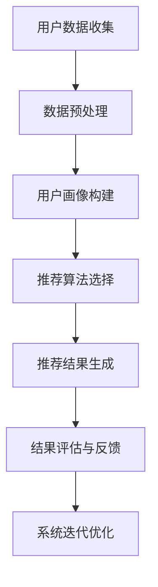
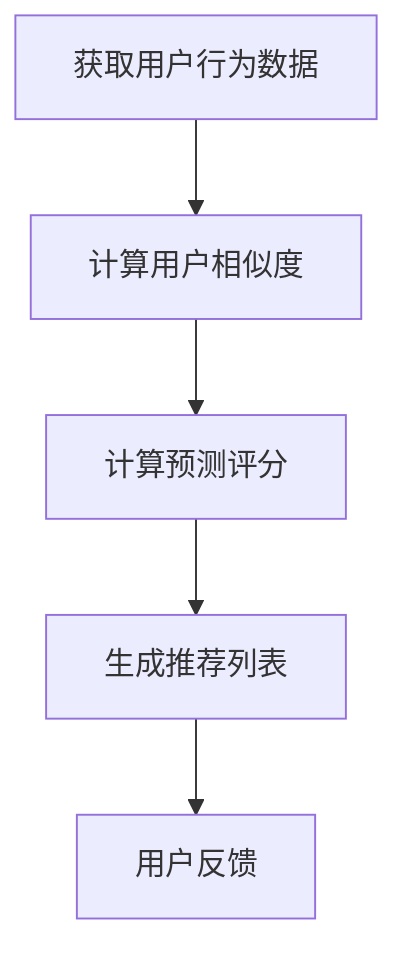
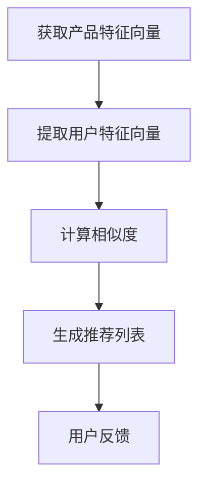
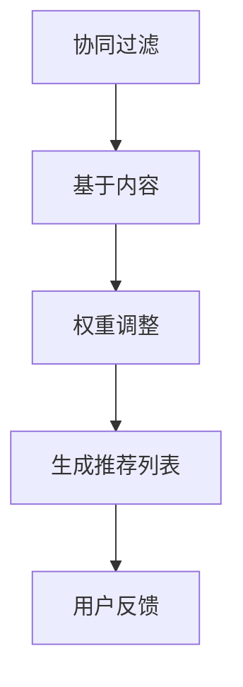
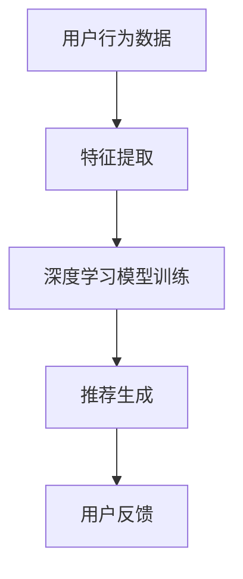
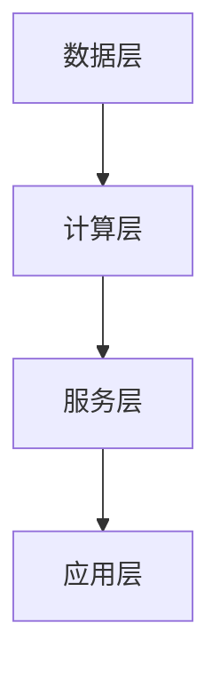

                 

## 智能保险产品个性化推荐引擎

### 关键词：保险个性化推荐、智能保险、推荐算法、数据分析、用户行为挖掘

### 摘要：

随着保险行业的数字化转型，个性化推荐系统已成为提高客户满意度和提升业务效率的关键技术。本文旨在探讨智能保险产品个性化推荐引擎的设计与实现，从背景介绍、核心概念、算法原理、系统实现、优化实践到未来展望，全面解析该领域的技术要点与应用场景。通过系统化的分析和详细案例研究，本文将为读者提供一个全面而深入的视角，以助力保险行业在智能化道路上不断前行。

----------------------------------------------------------------

### 第一部分：引言与背景

#### 第1章：保险产品个性化推荐引论

#### 1.1 保险行业面临的挑战与机遇

保险行业作为金融服务的核心组成部分，正面临着前所未有的挑战与机遇。随着社会经济的发展和消费者需求的多样化，传统的保险产品已难以满足市场的高效、个性化需求。同时，大数据、人工智能等新兴技术的迅猛发展，为保险行业提供了全新的解决方案。个性化推荐系统作为智能保险产品的重要载体，不仅能提高客户满意度，还能显著提升保险公司运营效率和盈利能力。

#### 1.2 个性化推荐在保险行业的应用

个性化推荐系统在保险行业的应用范围广泛，主要包括以下几个方面：

1. **产品推荐**：基于用户的历史数据和偏好，推荐符合其需求的保险产品。
2. **风险分析**：通过分析用户行为和投保记录，识别潜在风险，提供定制化的风险管理方案。
3. **客户关系管理**：利用个性化推荐，增强客户黏性和忠诚度，提升客户服务体验。
4. **营销策略优化**：通过推荐系统，实现精准营销，降低营销成本，提高转化率。

#### 1.3 书籍结构与内容概览

本书将从以下几个方面展开讨论：

- **第一部分：引言与背景**：介绍保险行业现状与个性化推荐的重要性。
- **第二部分：数据分析与用户行为挖掘**：探讨用户数据分析、推荐算法原理与实际案例。
- **第三部分：技术实现与优化**：分析技术架构设计、系统实现与优化策略。
- **第四部分：挑战与未来展望**：总结当前挑战、技术发展趋势及未来发展方向。

#### 1.4 核心概念与术语解释

在深入讨论之前，有必要对一些核心概念和术语进行定义和解释：

- **个性化推荐系统**：一种基于用户历史行为和偏好，自动生成个性化内容或产品推荐的系统。
- **用户画像**：描述用户特征、兴趣和行为的数字模型。
- **协同过滤**：一种常见的推荐算法，通过分析用户之间的相似性，预测用户对未知项目的偏好。
- **基于内容的推荐**：通过分析项目的内容特征，为用户推荐具有相似特征的项目。
- **深度学习**：一种基于人工神经网络的机器学习技术，能够从大量数据中自动提取特征，实现复杂模式识别。

### 第2章：智能保险产品个性化推荐概述

#### 2.1 个性化推荐系统基础

个性化推荐系统是建立在用户数据分析和机器学习技术基础上的。其核心目标是通过分析用户的历史行为和偏好，预测用户对未知产品的兴趣，从而为用户提供个性化的推荐。个性化推荐系统通常包括以下几个关键组件：

1. **用户数据收集与处理**：通过分析用户的行为数据和兴趣标签，构建用户画像。
2. **推荐算法**：根据用户画像和产品特征，选择合适的推荐算法，生成推荐结果。
3. **推荐结果评估与反馈**：评估推荐效果，收集用户反馈，优化推荐算法。

#### 2.2 智能保险产品个性化推荐的独特性

智能保险产品个性化推荐与其他领域的个性化推荐相比，具有以下独特性：

1. **数据复杂性**：保险产品的多样性和复杂性，使得数据收集和处理面临更大挑战。
2. **用户隐私保护**：保险行业涉及敏感个人信息，对用户隐私保护要求更高。
3. **风险管理**：个性化推荐不仅要满足用户需求，还需考虑潜在的风险因素。

#### 2.3 个性化推荐流程与架构

智能保险产品个性化推荐的典型流程包括以下几个步骤：

1. **用户数据收集**：通过网页、APP、客服等多种渠道收集用户行为数据。
2. **数据预处理**：清洗、整合和转换原始数据，为后续分析做好准备。
3. **用户画像构建**：基于用户行为数据，构建用户画像，描述用户兴趣和需求。
4. **推荐算法选择**：根据业务需求和数据特点，选择合适的推荐算法。
5. **推荐结果生成**：根据用户画像和产品特征，生成个性化推荐结果。
6. **结果评估与反馈**：评估推荐效果，收集用户反馈，持续优化推荐系统。

下面是一个简化的个性化推荐系统架构图：



通过上述架构，我们可以看到个性化推荐系统从用户数据收集到推荐结果生成的完整流程。每个步骤都涉及到不同的技术实现，需要根据具体业务需求进行定制化设计和优化。

### 第3章：用户数据分析

#### 3.1 用户数据来源

用户数据的来源多种多样，主要包括以下几个方面：

1. **行为数据**：用户在保险平台上的浏览、搜索、购买等行为数据。
2. **社交数据**：用户在社交媒体上的互动、评论、点赞等数据。
3. **第三方数据**：通过合作获取的用户信用记录、生活习惯等外部数据。

#### 3.2 用户行为数据收集与处理

用户行为数据收集与处理的流程如下：

1. **数据收集**：通过日志、API调用、传感器等方式，实时收集用户行为数据。
2. **数据存储**：使用数据库或分布式存储系统，存储大规模的用户行为数据。
3. **数据清洗**：清洗数据中的噪声和异常值，保证数据的准确性和一致性。
4. **数据整合**：将不同来源的数据进行整合，构建统一的用户画像。

#### 3.3 用户画像构建

用户画像构建是用户数据分析的核心环节，主要包括以下几个步骤：

1. **特征提取**：从用户行为数据中提取关键特征，如浏览时长、购买频率、点击率等。
2. **属性分类**：将特征进行分类，如兴趣分类、消费能力分类等。
3. **权重设定**：根据特征的重要性，设定相应的权重，构建用户画像。

下面是一个用户画像构建的简单ER实体关系图：

```mermaid
erDiagram
    User ||--|{ Behavior }|| Behavior : 用户行为记录
    User ||--|{ Profile }|| Profile : 用户基本信息
    User ||--|{ Interest }|| Interest : 用户兴趣标签
    User ||--|{ Purchase }|| Purchase : 购买记录
    Behavior ||--|{ Click }|| Click : 点击行为
    Behavior ||--|{ Search }|| Search : 搜索行为
    Behavior ||--|{ Purchase }|| Purchase : 购买行为
```

#### 3.4 用户数据隐私保护

在用户数据收集和处理过程中，隐私保护至关重要。以下是一些常见的隐私保护措施：

1. **数据加密**：对用户数据进行加密处理，防止数据泄露。
2. **访问控制**：设定严格的访问权限，确保只有授权人员可以访问用户数据。
3. **数据脱敏**：对敏感数据进行脱敏处理，如将身份证号、手机号等替换为假名。
4. **隐私政策**：明确告知用户数据收集的目的和使用范围，获得用户同意。

### 第4章：推荐算法原理与应用

#### 4.1 协同过滤算法

协同过滤算法是推荐系统中最常用的算法之一，其核心思想是通过分析用户之间的相似性，预测用户对未知产品的偏好。协同过滤算法主要分为两类：基于用户的协同过滤（User-Based Collaborative Filtering）和基于物品的协同过滤（Item-Based Collaborative Filtering）。

1. **基于用户的协同过滤**：通过计算用户之间的相似性，找到与目标用户相似的其他用户，然后推荐这些用户喜欢的产品。
    $$ \text{similarity}(u_i, u_j) = \frac{\text{common\_ratings}(u_i, u_j)}{\sqrt{\text{rating\_var}(u_i) \cdot \text{rating\_var}(u_j)}} $$
    $$ \text{prediction}(u_i, i_j) = \frac{\sum_{u_j \in N(u_i)} \text{rating}(u_j, i_j) \cdot \text{similarity}(u_i, u_j)}{\sum_{u_j \in N(u_i)} \text{similarity}(u_i, u_j)} $$

2. **基于物品的协同过滤**：通过计算物品之间的相似性，找到与目标物品相似的其他物品，然后推荐这些物品。
    $$ \text{similarity}(i_i, i_j) = \frac{\text{common\_users}(i_i, i_j)}{\sqrt{\text{rating\_var}(i_i) \cdot \text{rating\_var}(i_j)}} $$
    $$ \text{prediction}(u_i, i_j) = \frac{\sum_{i_j \in N(i_i)} \text{rating}(u_i, i_j) \cdot \text{similarity}(i_i, i_j)}{\sum_{i_j \in N(i_i)} \text{similarity}(i_i, i_j)} $$

下面是一个基于用户的协同过滤算法的mermaid流程图：



#### 4.2 基于内容的推荐

基于内容的推荐算法通过分析产品的内容特征，为用户推荐具有相似特征的产品。该算法的核心思想是利用文本挖掘技术提取产品的特征，然后基于用户的历史行为和偏好，计算产品与用户之间的相似性。

1. **特征提取**：使用词袋模型、TF-IDF等方法，提取产品的关键词和特征向量。
    $$ \text{TF-IDF}(t, d) = \frac{\text{tf}(t, d)}{\sum_{t' \in D} \text{tf}(t', d)} \cdot \log(\frac{N}{n_t}) $$
    其中，\( \text{tf}(t, d) \) 表示词 \( t \) 在文档 \( d \) 中的词频，\( n_t \) 表示包含词 \( t \) 的文档数量，\( N \) 表示总文档数。

2. **相似性计算**：计算产品与用户之间的相似度，常用的方法有欧氏距离、余弦相似度等。
    $$ \text{similarity}(i_i, u_i) = \frac{\text{dot\_product}(f_i, f_u)}{\|\text{f_i}\| \cdot \|\text{f_u}\|} $$
    其中，\( f_i \) 和 \( f_u \) 分别表示产品 \( i_i \) 和用户 \( u_i \) 的特征向量。

3. **生成推荐列表**：根据相似度分数，为用户生成推荐列表。

下面是一个基于内容的推荐算法的mermaid流程图：



#### 4.3 混合推荐系统

混合推荐系统结合了协同过滤和基于内容的推荐方法，旨在克服单一方法的局限性，提高推荐效果。混合推荐系统通常包括以下几个步骤：

1. **协同过滤**：通过协同过滤算法生成初步推荐列表。
2. **基于内容**：对初步推荐列表中的产品进行基于内容的推荐，补充协同过滤的不足。
3. **权重调整**：根据用户的历史行为和偏好，对两种推荐方法的权重进行动态调整。

下面是一个混合推荐系统的mermaid流程图：



#### 4.4 深度学习在个性化推荐中的应用

深度学习在个性化推荐中的应用越来越广泛，主要优势在于能够自动提取复杂特征，提高推荐效果。以下是一些常见的深度学习推荐算法：

1. **基于模型的协同过滤（Model-Based Collaborative Filtering）**：如矩阵分解、自动编码器等。
2. **基于神经网络的推荐系统**：如卷积神经网络（CNN）、循环神经网络（RNN）等。
3. **多模态推荐系统**：结合用户行为数据、文本数据、图像数据等多模态数据，实现更精准的推荐。

下面是一个基于深度学习推荐系统的mermaid流程图：



### 第5章：实战案例研究

#### 5.1 案例一：某大型保险公司个性化推荐系统

某大型保险公司通过构建个性化推荐系统，实现了显著的业务增长和用户满意度提升。以下是该案例的具体情况：

- **项目背景**：保险公司希望提高客户粘性和满意度，通过个性化推荐系统实现精准营销和产品推荐。
- **用户需求**：用户希望能够根据自身需求和偏好，快速找到适合自己的保险产品。
- **数据来源**：用户行为数据、第三方数据（如信用记录、生活习惯等）。
- **推荐结果**：根据用户画像和产品特征，为用户生成个性化的保险产品推荐列表。

#### 5.2 案例分析

1. **数据收集与处理**：通过日志、API调用等多种渠道收集用户行为数据，并进行数据清洗和预处理，构建用户画像。
2. **推荐算法选择**：结合协同过滤和基于内容的推荐方法，构建混合推荐系统，提高推荐效果。
3. **系统实现**：使用Python和TensorFlow等工具，实现深度学习模型和推荐算法。
4. **评估与优化**：通过A/B测试，评估推荐系统的效果，根据用户反馈持续优化推荐算法。

#### 5.3 案例启示与经验总结

1. **数据质量是关键**：高质量的用户行为数据和产品特征是构建个性化推荐系统的基础。
2. **算法选择需灵活**：结合业务需求和数据特点，选择合适的推荐算法，并不断优化。
3. **用户反馈至关重要**：通过用户反馈，不断调整和优化推荐系统，提高用户满意度。
4. **隐私保护不可忽视**：在数据收集和处理过程中，严格遵循隐私保护规定，确保用户数据安全。

### 第6章：技术实现与优化

#### 6.1 技术架构设计与系统实现

智能保险产品个性化推荐系统采用分布式架构，以提高系统的可扩展性和稳定性。以下是技术架构设计的几个关键方面：

1. **数据层**：使用分布式数据库（如Hadoop、HBase）存储大规模的用户行为数据和产品信息。
2. **计算层**：使用Spark等分布式计算框架，进行数据预处理、特征提取和模型训练。
3. **服务层**：使用RESTful API和消息队列（如Kafka），实现推荐服务的部署和调度。
4. **应用层**：前端应用通过Web界面或移动应用，与用户进行交互，展示推荐结果。

下面是一个简化的技术架构图：



#### 6.2 数据存储与管理

1. **用户行为数据**：使用Hadoop HDFS分布式文件系统，存储大规模的用户行为日志。
2. **产品数据**：使用关系数据库（如MySQL）存储产品的基本信息和特征。
3. **推荐结果**：使用Redis缓存系统，存储实时生成的推荐结果，提高查询效率。

#### 6.3 系统实现细节

1. **用户数据收集**：通过日志采集系统，实时收集用户在保险平台上的行为数据。
2. **数据预处理**：使用Spark对用户行为数据进行清洗、去重和特征提取。
3. **用户画像构建**：使用机器学习算法，如K-means，对用户行为数据进行聚类，构建用户画像。
4. **推荐算法实现**：使用Python和TensorFlow，实现深度学习推荐算法，如基于模型的协同过滤（MF）和卷积神经网络（CNN）。

下面是一个用户画像构建的Python代码示例：

```python
from sklearn.cluster import KMeans
import numpy as np

# 假设user_data是一个包含用户特征的二维数组
user_data = np.array([[1, 2], [2, 2], [1, 3], [3, 3]])

# 使用K-means算法进行聚类
kmeans = KMeans(n_clusters=2, random_state=0).fit(user_data)

# 输出聚类结果
print(kmeans.labels_)

# 输出聚类中心
print(kmeans.cluster_centers_)
```

#### 6.4 性能优化策略

1. **缓存策略**：使用Redis缓存系统，缓存推荐结果和热点数据，降低数据库查询压力。
2. **分布式计算**：使用Spark等分布式计算框架，提高数据处理和模型训练的效率。
3. **负载均衡**：使用负载均衡器（如Nginx），均衡服务器的请求负载，提高系统稳定性。
4. **数据库优化**：使用数据库索引和分区，提高查询效率和数据管理能力。

### 第7章：系统评估与调优

#### 7.1 评估指标与方法

1. **准确率（Accuracy）**：预测正确的推荐数量占总推荐数量的比例。
2. **召回率（Recall）**：预测正确的推荐数量占所有相关推荐数量的比例。
3. **F1分数（F1 Score）**：准确率和召回率的调和平均值。
4. **平均绝对误差（MAE）**：预测值与真实值之间的平均绝对误差。

#### 7.2 实验设计与结果分析

1. **实验设计**：使用A/B测试方法，将用户随机分为实验组和对照组，比较推荐系统在两组用户中的效果。
2. **结果分析**：通过统计分析方法，如T检验和卡方检验，分析实验结果，评估推荐系统的性能。

#### 7.3 调优实践

1. **参数调整**：根据实验结果，调整推荐算法的参数，如K值、学习率等。
2. **模型优化**：使用交叉验证和网格搜索等方法，优化深度学习模型的参数和结构。
3. **特征工程**：根据用户反馈和数据特点，提取和调整特征，提高推荐效果。

#### 7.4 系统部署与运维

1. **部署策略**：使用容器化技术（如Docker），简化系统部署和运维流程。
2. **监控与维护**：使用监控系统（如Prometheus），实时监控系统性能和运行状态。
3. **故障处理**：建立故障处理流程，快速响应和处理系统故障。

### 第8章：挑战与未来展望

#### 8.1 当前挑战

1. **数据隐私保护**：在用户数据收集和处理过程中，确保数据隐私和安全。
2. **算法透明性**：提高推荐算法的可解释性，增强用户信任。
3. **实时性**：在保证推荐质量的同时，提高推荐系统的实时性。
4. **可扩展性**：应对大规模用户数据和不断增长的业务需求，提高系统的可扩展性。

#### 8.2 技术发展趋势

1. **深度学习**：深度学习技术在推荐系统中的应用将进一步深入，如生成对抗网络（GAN）、图神经网络（GNN）等。
2. **多模态推荐**：结合用户行为数据、文本数据、图像数据等多模态数据，实现更精准的推荐。
3. **联邦学习**：通过联邦学习技术，实现跨平台的协同推荐，保护用户隐私。

#### 8.3 未来发展方向

1. **智能风控**：结合推荐系统，实现智能风控，降低保险公司的风险。
2. **个性化营销**：通过推荐系统，实现精准营销，提升业务转化率。
3. **用户体验优化**：通过个性化推荐，提升用户满意度，增强客户忠诚度。

### 结论与建议

智能保险产品个性化推荐引擎是保险行业数字化转型的重要方向。通过本文的探讨，我们了解了个性化推荐系统在保险行业的应用场景、技术实现和优化策略。未来，随着技术的不断进步，个性化推荐系统将在保险行业发挥更大的作用，助力保险公司实现智能化和精细化运营。

### 作者信息

作者：AI天才研究院/AI Genius Institute & 禅与计算机程序设计艺术 /Zen And The Art of Computer Programming

----------------------------------------------------------------

## 最佳实践 tips

1. **数据质量监控**：确保用户数据的质量，定期进行数据清洗和去重，提高推荐准确性。
2. **用户反馈机制**：建立用户反馈机制，收集用户对推荐结果的反馈，持续优化推荐算法。
3. **隐私保护**：在数据收集和处理过程中，严格遵守隐私保护规定，确保用户数据安全。
4. **算法透明性**：提高推荐算法的可解释性，使用户了解推荐背后的原理，增强用户信任。
5. **实时性优化**：通过分布式计算和缓存策略，提高推荐系统的实时性，提升用户体验。

----------------------------------------------------------------

### 小结

本文详细探讨了智能保险产品个性化推荐引擎的设计与实现，从背景介绍、核心概念、算法原理、系统实现、优化实践到未来展望，全面解析了该领域的技术要点与应用场景。通过系统化的分析和详细案例研究，本文为读者提供了一个全面而深入的视角，以助力保险行业在智能化道路上不断前行。

### 注意事项

1. **数据安全**：在数据收集和处理过程中，严格遵循数据安全法规，确保用户数据安全。
2. **算法优化**：根据业务需求和数据特点，选择合适的推荐算法，并持续优化，提高推荐效果。
3. **用户隐私**：在用户数据收集和处理过程中，确保用户隐私得到保护，增强用户信任。

### 拓展阅读

1. **《推荐系统实践》**：宋小庆 著，系统介绍了推荐系统的基本原理和实践方法。
2. **《深度学习推荐系统》**：武凯 著，详细介绍了深度学习在推荐系统中的应用。
3. **《保险科技：重塑保险行业的创新实践》**：王晓冬 著，探讨了保险科技在保险行业的应用。

### 结语

智能保险产品个性化推荐引擎是保险行业数字化转型的重要方向。通过本文的探讨，我们了解了个性化推荐系统在保险行业的应用场景、技术实现和优化策略。未来，随着技术的不断进步，个性化推荐系统将在保险行业发挥更大的作用，助力保险公司实现智能化和精细化运营。

作者：AI天才研究院/AI Genius Institute & 禅与计算机程序设计艺术 /Zen And The Art of Computer Programming。感谢您的阅读与支持，希望本文能为您的学习和实践带来帮助。如有疑问或建议，欢迎在评论区留言，我们将竭诚为您解答。

