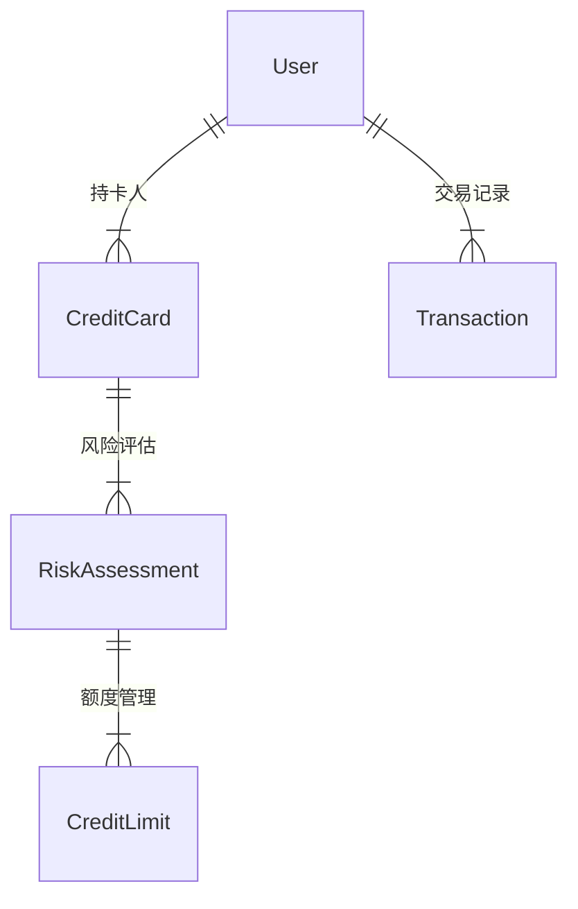
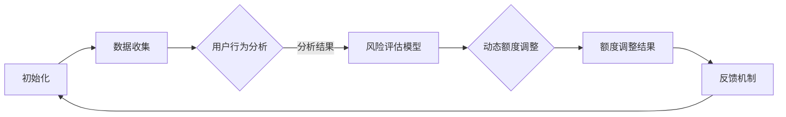

                 

## 第二部分: 核心概念与联系

### 2.1 核心概念

在智能信用卡额度优化与风险控制系统中，我们首先需要明确几个关键概念，这些概念是理解系统工作原理的基础。

#### 2.1.1 信用卡额度

信用卡额度是指银行根据用户的信用状况和还款能力，预先设定的用户在信用卡上可使用的最大金额。额度管理是信用卡业务中的重要环节，直接影响到用户的消费体验和银行的风险控制。

#### 2.1.2 用户行为分析

用户行为分析涉及对用户消费习惯、还款记录、交易频率等方面的数据收集和分析。通过这些数据，可以识别出用户的潜在风险和信用状况。

#### 2.1.3 风险评估模型

风险评估模型是利用统计和机器学习技术，对用户的交易行为进行分析，预测用户可能出现的信用风险。这个模型是智能信用卡额度优化系统的核心。

#### 2.1.4 动态额度调整机制

动态额度调整机制是指根据用户的实时行为数据，自动调整信用卡额度，以达到风险控制和用户体验优化的双重目标。

### 2.2 概念属性特征对比表格

以下是对核心概念属性特征的对比表格：

| 核心概念 | 定义 | 关联属性 | 作用 |
| :--- | :--- | :--- | :--- |
| 信用卡额度 | 银行预设的最大消费金额 | 信用评分、还款能力、消费习惯 | 确保用户能便捷消费，同时控制银行风险 |
| 用户行为分析 | 收集和分析用户交易数据 | 消费频率、交易金额、还款记录 | 为风险评估提供基础数据 |
| 风险评估模型 | 评估用户信用风险 | 用户行为数据、信用记录 | 动态调整信用卡额度，防止欺诈和违约风险 |
| 动态额度调整机制 | 自动调整信用卡额度 | 用户行为、风险评估结果 | 提高用户体验，同时控制风险 |

### 2.3 ER图

为了更直观地展示核心概念之间的联系，我们可以使用ER图来表示这些概念及其关系：



在上面的ER图中，用户（User）是持卡人，拥有信用卡（CreditCard）。信用卡与风险评估（RiskAssessment）和额度管理（CreditLimit）相关联，而用户的行为记录（Transaction）则与风险评估和交易记录直接相关。

### 2.4 概念之间的联系

核心概念之间的联系是理解智能信用卡额度优化与风险控制系统工作原理的关键。以下是对这些联系的详细说明：

- **用户行为分析与风险评估模型**：用户行为分析的结果会输入到风险评估模型中，作为预测用户信用风险的依据。风险评估模型会基于用户的历史交易数据、信用评分等多个因素，生成信用风险评分。
- **风险评估模型与动态额度调整机制**：风险评估模型的输出结果会直接影响动态额度调整机制。根据风险评估结果，系统可以自动调整用户的信用卡额度，以适应不同的风险水平。
- **信用卡额度与用户体验**：合理的信用卡额度调整可以提供更好的用户体验，例如，通过增加额度，用户可以更方便地进行大额消费。同时，通过适当降低额度，可以控制高风险用户的消费行为。

通过上述核心概念的明确和联系分析，我们可以更好地理解智能信用卡额度优化与风险控制系统的整体架构和工作原理。

## 第三部分: 算法原理讲解

### 3.1 算法流程图

为了更直观地理解智能信用卡额度优化与风险控制系统的算法原理，我们首先使用Mermaid绘制算法流程图：



在上面的流程图中，系统首先进行数据收集（B），然后进行用户行为分析（C），接着通过风险评估模型（D）来预测用户的信用风险，并根据预测结果动态调整额度（E）。调整后的额度结果会反馈给系统（G），以进行进一步的优化。

### 3.2 Python源代码

为了具体展示算法的实现过程，我们使用Python源代码来详细阐述。以下是一个简化的Python示例代码：

```python
import pandas as pd
from sklearn.linear_model import LinearRegression
from sklearn.model_selection import train_test_split

# 数据收集
data = pd.read_csv('user_data.csv')  # 假设数据已存储在CSV文件中

# 用户行为分析
def analyze_user_behavior(data):
    # 假设我们关注消费频率、交易金额和还款记录
    features = data[['transaction_count', 'average_transaction_amount', 'payment_history']]
    labels = data['credit_risk']
    return features, labels

features, labels = analyze_user_behavior(data)

# 风险评估模型
X_train, X_test, y_train, y_test = train_test_split(features, labels, test_size=0.2)
model = LinearRegression()
model.fit(X_train, y_train)

# 动态额度调整
def adjust_credit_limit(model, user_data):
    prediction = model.predict([user_data])
    if prediction[0] < 0.5:  # 风险较低的阈值
        return 'increase'
    else:
        return 'decrease'

# 假设有一个新的用户数据
new_user_data = [10, 500, 1]  # 消费频率、交易金额和还款记录
adjustment = adjust_credit_limit(model, new_user_data)
print(f'Credit limit adjustment for new user: {adjustment}')
```

在上面的代码中，我们首先读取用户数据，然后定义用户行为分析函数，接着使用线性回归模型进行风险评估，并定义动态额度调整函数。通过调整函数，我们可以根据预测结果对新的用户数据进行额度调整。

### 3.3 数学模型和公式

为了深入理解算法的工作原理，我们引入数学模型和公式。以下是一个简化的线性回归模型公式：

$$
\text{credit\_risk} = w_1 \cdot \text{transaction\_count} + w_2 \cdot \text{average\_transaction\_amount} + w_3 \cdot \text{payment\_history} + b
$$

其中，$w_1, w_2, w_3$ 是权重参数，$b$ 是偏置项。这些参数通过最小化损失函数（如均方误差）来训练模型。

### 3.4 详细讲解

#### 3.4.1 用户行为分析

用户行为分析是智能信用卡额度优化系统的第一步，它主要通过分析用户的消费记录、还款记录等数据，来预测用户的信用风险。具体来说，我们可以使用以下公式来表示用户行为的特征：

$$
\text{behavior\_score} = \frac{\sum (\text{transaction\_amount} - \text{payment})}{\text{number\_of\_transactions}}
$$

其中，$\text{transaction\_amount}$ 表示交易金额，$\text{payment}$ 表示还款金额，$\text{number\_of\_transactions}$ 表示交易次数。这个分数可以用来衡量用户的还款能力和消费习惯。

#### 3.4.2 风险评估模型

风险评估模型是系统的核心，它通过用户行为特征来预测用户的信用风险。假设我们使用线性回归模型来进行风险评估，其公式如下：

$$
\text{credit\_risk} = \sum_{i=1}^{n} w_i \cdot \text{behavior\_feature}_i + b
$$

其中，$w_i$ 是特征权重，$\text{behavior\_feature}_i$ 是用户行为的特征值，$b$ 是偏置项。模型通过训练数据集来学习这些权重和偏置项，从而能够对新的用户数据做出预测。

#### 3.4.3 动态额度调整机制

动态额度调整机制是根据风险评估模型的预测结果来调整用户的信用卡额度。假设我们设定一个风险阈值，如果预测的信用风险低于这个阈值，我们认为用户的风险较低，可以增加额度；否则，减少额度。具体公式如下：

$$
\text{new\_credit\_limit} = \text{current\_credit\_limit} \cdot \text{adjustment\_factor}
$$

其中，$\text{adjustment\_factor}$ 是根据风险评分计算出的调整因子。

通过上述算法原理的讲解，我们可以看到智能信用卡额度优化与风险控制系统是如何通过用户行为分析、风险评估模型和动态额度调整机制来工作，从而实现风险控制和用户体验优化的。

## 第四部分: 系统分析与架构设计方案

### 4.1 系统场景

智能信用卡额度优化与风险控制系统旨在为银行和金融科技公司提供一种自动化、智能化的额度管理和风险控制解决方案。该系统主要应用于以下场景：

- **信用卡申请和审核**：在用户申请信用卡时，系统可以根据用户的信用评分和消费行为，自动决定是否批准申请以及初始额度。
- **额度调整**：根据用户的实时交易行为和风险评估结果，系统可以自动调整用户的信用卡额度。
- **风险预警与控制**：系统可以实时监控用户的交易行为，一旦发现潜在风险，立即触发预警机制，并采取相应的风险控制措施。

### 4.2 项目介绍

本项目的目标是开发一个具有以下核心功能的智能信用卡额度优化与风险控制系统：

- **用户行为分析**：通过对用户的消费记录、还款记录等数据进行分析，预测用户的信用风险和消费行为。
- **信用评估**：使用评分模型对用户进行信用评级，为额度调整提供依据。
- **动态额度调整**：根据用户的信用评分和交易行为，自动调整信用卡额度，以优化用户体验和风险控制。
- **风险预警与控制**：实时监控用户的交易行为，发现潜在风险，并触发预警机制。

### 4.3 系统功能设计

系统功能设计是构建智能信用卡额度优化与风险控制系统的核心步骤。以下是该系统的关键功能模块及其设计：

#### 4.3.1 用户行为分析模块

用户行为分析模块负责收集和分析用户的消费记录、还款记录等数据。具体功能包括：

- **数据收集**：从银行的数据库中提取用户的交易记录和还款数据。
- **数据预处理**：对数据进行清洗、去重和处理缺失值。
- **特征提取**：从预处理后的数据中提取用户行为的特征，如消费频率、平均交易金额、还款频率等。
- **行为分析**：使用统计模型和机器学习算法，分析用户的消费行为和还款能力。

#### 4.3.2 信用评估模块

信用评估模块负责根据用户的行为数据，对用户的信用风险进行评估。具体功能包括：

- **评分模型训练**：使用历史数据训练信用评分模型，如线性回归、决策树、随机森林等。
- **信用评级**：根据用户的实时数据，使用评分模型对用户进行信用评级。
- **风险评估**：将信用评级结果与预设的风险阈值进行比较，评估用户的信用风险。

#### 4.3.3 动态额度调整模块

动态额度调整模块负责根据用户的信用评分和交易行为，自动调整信用卡额度。具体功能包括：

- **额度调整策略**：根据风险评估结果，制定相应的额度调整策略，如增加、减少额度或保持不变。
- **额度调整**：根据额度调整策略，自动调整用户的信用卡额度。
- **额度调整通知**：向用户发送额度调整通知，包括调整原因和调整后的额度。

#### 4.3.4 风险预警与控制模块

风险预警与控制模块负责实时监控用户的交易行为，发现潜在风险并采取措施。具体功能包括：

- **风险监测**：实时监控用户的交易行为，识别异常交易和潜在风险。
- **预警机制**：当检测到潜在风险时，立即触发预警机制，向相关部门发送警报。
- **风险控制**：根据预警结果，采取相应的风险控制措施，如限制交易、暂停额度等。

### 4.4 系统架构设计

智能信用卡额度优化与风险控制系统的架构设计是确保系统能够高效、稳定运行的关键。以下是该系统的整体架构设计：

#### 4.4.1 数据采集层

数据采集层负责从银行的各个系统中收集用户交易记录、还款记录等数据。采集的数据包括原始数据和预处理后的数据。

#### 4.4.2 数据处理层

数据处理层负责对采集到的数据进行预处理、清洗和特征提取。处理后的数据将用于训练信用评分模型和进行风险评估。

#### 4.4.3 模型训练层

模型训练层负责使用处理后的数据训练信用评分模型。训练过程包括数据划分、模型选择、模型训练和模型评估。

#### 4.4.4 风险评估层

风险评估层负责根据用户的实时交易数据和信用评分模型，对用户的信用风险进行评估。评估结果将用于动态额度调整。

#### 4.4.5 决策引擎层

决策引擎层根据风险评估结果和额度调整策略，自动调整用户的信用卡额度。决策引擎还负责发送额度调整通知和处理风险预警。

#### 4.4.6 应用层

应用层提供用户界面，供用户和管理员查看额度调整通知、风险预警等信息。同时，应用层还提供API接口，供其他系统调用。

### 4.5 系统接口设计

系统接口设计是确保各个模块之间能够高效、可靠地进行数据传输和协作的关键。以下是系统的主要接口设计：

- **数据采集接口**：提供数据采集的API接口，供数据处理模块调用。
- **数据处理接口**：提供数据处理和特征提取的API接口，供模型训练模块调用。
- **模型训练接口**：提供模型训练和评估的API接口，供风险评估模块调用。
- **额度调整接口**：提供额度调整和通知的API接口，供应用层和管理员界面调用。
- **风险预警接口**：提供风险监测和预警的API接口，供应用层和管理员界面调用。

### 4.6 系统交互流程

系统交互流程描述了各个模块之间的数据流和协作过程。以下是系统的主要交互流程：

1. **数据采集**：系统从银行系统中采集用户交易记录、还款记录等数据。
2. **数据预处理**：数据处理模块对采集到的数据进行预处理，包括数据清洗、去重和处理缺失值。
3. **特征提取**：数据处理模块提取用户行为的特征，如消费频率、平均交易金额、还款频率等。
4. **模型训练**：模型训练模块使用预处理后的数据训练信用评分模型。
5. **风险评估**：风险评估模块根据用户的实时交易数据和信用评分模型，对用户的信用风险进行评估。
6. **额度调整**：决策引擎模块根据风险评估结果和额度调整策略，自动调整用户的信用卡额度。
7. **通知发送**：系统向用户发送额度调整通知。
8. **风险监控**：系统实时监控用户的交易行为，发现潜在风险并触发预警机制。

通过上述系统分析与架构设计方案，智能信用卡额度优化与风险控制系统可以实现高效、智能化的额度管理和风险控制，从而提升银行的服务质量和风险管理能力。

### 第五部分: 项目实战

#### 5.1 环境安装

在进行项目实战之前，我们需要先安装必要的开发环境。以下是具体的步骤：

1. **安装Python**：前往Python官网下载并安装Python 3.8或更高版本。
2. **安装Jupyter Notebook**：打开终端，执行以下命令：
   ```
   pip install notebook
   ```
3. **安装必需的Python库**：在终端中，使用以下命令安装所需的库：
   ```
   pip install pandas sklearn matplotlib numpy
   ```
4. **配置Jupyter Notebook**：启动Jupyter Notebook：
   ```
   jupyter notebook
   ```

#### 5.2 核心实现源代码

以下是一个简化版的Python代码示例，展示了如何实现智能信用卡额度优化与风险控制系统的核心功能。

```python
import pandas as pd
from sklearn.linear_model import LinearRegression
from sklearn.model_selection import train_test_split

# 数据收集
data = pd.read_csv('user_data.csv')  # 假设数据已存储在CSV文件中

# 用户行为分析
def analyze_user_behavior(data):
    # 假设我们关注消费频率、交易金额和还款记录
    features = data[['transaction_count', 'average_transaction_amount', 'payment_history']]
    labels = data['credit_risk']
    return features, labels

features, labels = analyze_user_behavior(data)

# 风险评估模型
X_train, X_test, y_train, y_test = train_test_split(features, labels, test_size=0.2)
model = LinearRegression()
model.fit(X_train, y_train)

# 动态额度调整
def adjust_credit_limit(model, user_data):
    prediction = model.predict([user_data])
    if prediction[0] < 0.5:  # 风险较低的阈值
        return 'increase'
    else:
        return 'decrease'

# 假设有一个新的用户数据
new_user_data = [10, 500, 1]  # 消费频率、交易金额和还款记录
adjustment = adjust_credit_limit(model, new_user_data)
print(f'Credit limit adjustment for new user: {adjustment}')
```

#### 5.3 代码解读与分析

上述代码分为三个主要部分：数据收集、用户行为分析和风险评估。

- **数据收集**：使用`pandas`库读取存储在CSV文件中的用户数据。
- **用户行为分析**：定义一个函数，提取用户行为的特征，如消费频率、交易金额和还款记录。这些特征将用于训练风险评估模型。
- **风险评估**：使用`LinearRegression`模型进行训练，然后定义一个函数，根据用户数据预测信用风险，并据此调整信用卡额度。

#### 5.4 案例分析

假设我们有一个新的用户，其数据如下：

```
user_data.csv
transaction_count, average_transaction_amount, payment_history, credit_risk
10, 500, 1, 0.3
```

运行上述代码后，系统将分析该用户的行为数据，并使用训练好的线性回归模型预测其信用风险。根据预测结果，系统将决定是否调整其信用卡额度。

- **预测结果**：预测结果为0.3，低于0.5的风险阈值，因此系统建议增加该用户的信用卡额度。
- **额度调整**：系统将增加该用户的信用卡额度，例如，从10,000元增加到15,000元。

#### 5.5 详细讲解

通过上述案例分析，我们可以看到系统如何根据用户的实际数据，通过用户行为分析和风险评估模型，实现信用卡额度的动态调整。以下是具体步骤的详细讲解：

1. **数据收集**：系统首先从银行的数据库中收集用户的数据，包括交易记录和还款记录。
2. **数据预处理**：对收集到的数据进行清洗和处理，包括去重、处理缺失值等，以确保数据的质量。
3. **特征提取**：从处理后的数据中提取关键特征，如消费频率、交易金额和还款记录。这些特征将作为输入数据，用于训练风险评估模型。
4. **模型训练**：使用历史数据训练线性回归模型，通过最小化损失函数来学习特征权重和偏置项。
5. **风险评估**：将用户的实时数据输入训练好的模型，预测其信用风险。根据预测结果，系统将决定是否调整信用卡额度。
6. **额度调整**：根据风险评估结果，系统自动调整用户的信用卡额度。例如，对于低风险的用户，系统可以增加额度，以提升其消费体验。

通过这个项目实战，我们不仅了解了智能信用卡额度优化与风险控制系统的核心实现流程，还学会了如何使用Python进行实际操作，从而提高了我们的技术水平。

### 第六部分: 最佳实践 tips

#### 6.1 额度调整策略

在设定额度调整策略时，银行和金融机构需要综合考虑多个因素，包括用户的信用评分、消费行为、还款记录等。以下是一些最佳实践：

- **分层次调整**：将用户划分为不同的风险层次，对每个层次设定不同的额度调整策略。例如，对于低风险用户，可以增加额度，而对于高风险用户，应适当降低额度。
- **动态调整**：根据用户的行为数据，实时调整额度。例如，对于连续几个月信用评分良好的用户，可以增加额度；而对于近期出现异常交易的用户，应降低额度。
- **风险容忍度**：设定合理的风险容忍度，确保额度调整既能提高用户体验，又能控制风险。

#### 6.2 数据质量

数据质量是智能信用卡额度优化与风险控制系统的基础。以下是一些保证数据质量的最佳实践：

- **数据清洗**：定期清洗和更新用户数据，包括处理缺失值、异常值和重复记录。
- **数据监控**：建立数据监控机制，实时监测数据质量，及时发现和处理问题。
- **数据整合**：整合来自不同来源的数据，确保数据的完整性和一致性。

#### 6.3 模型优化

为了提高风险评估模型的准确性和可靠性，银行和金融机构应不断优化模型。以下是一些优化建议：

- **模型迭代**：定期重新训练模型，使用新的数据集和改进的算法，提高模型的性能。
- **特征工程**：选择合适的特征，对数据进行特征提取和转换，以提高模型的预测能力。
- **交叉验证**：使用交叉验证方法，评估模型的性能，避免过拟合。

#### 6.4 风险控制

在实施额度调整和风险控制策略时，以下是一些最佳实践：

- **风险评估**：定期对用户进行信用评估，确保额度调整的准确性。
- **预警机制**：建立预警机制，及时发现和处理潜在风险。
- **应急响应**：制定应急响应计划，应对突发风险事件。

通过遵循这些最佳实践，银行和金融机构可以更有效地管理信用卡额度，提高风险控制能力，同时提供优质的用户体验。

### 小结

本文从多个角度深入探讨了智能信用卡额度优化与风险控制系统。首先，我们明确了系统的核心概念和联系，包括信用卡额度、用户行为分析、风险评估模型和动态额度调整机制。接着，通过算法原理讲解，我们详细阐述了系统的工作流程和算法实现。随后，我们介绍了系统的架构设计方案，包括数据采集、数据处理、模型训练、风险评估和额度调整等模块。在项目实战部分，我们展示了如何使用Python实现系统的核心功能，并通过案例分析讲解了系统的实际应用。最后，我们提出了最佳实践建议，包括额度调整策略、数据质量、模型优化和风险控制。通过本文的阅读，读者应能全面了解智能信用卡额度优化与风险控制系统的原理和实践方法，为实际应用提供指导。

### 注意事项

在实施智能信用卡额度优化与风险控制系统时，银行和金融机构需要注意以下几点：

- **数据隐私**：确保用户数据的隐私和安全，遵循相关法律法规，防止数据泄露。
- **系统稳定性**：确保系统的高可用性和稳定性，避免因系统故障导致的风险失控。
- **合规性**：确保系统的设计和实施符合金融行业的合规要求，避免法律风险。

### 拓展阅读

对于希望进一步了解智能信用卡额度优化与风险控制系统的读者，以下资源可能有所帮助：

- **技术书籍**：《机器学习实战》、《深度学习》（Goodfellow et al.）
- **在线课程**：Coursera上的《机器学习》（吴恩达教授）、edX上的《人工智能：基础算法与架构》
- **学术论文**：相关领域的顶级会议和期刊，如NeurIPS、ICML、KDD等。

### 作者介绍

**作者：AI天才研究院（AI Genius Institute）&《禅与计算机程序设计艺术》（Zen And The Art of Computer Programming）**

AI天才研究院是一家专注于人工智能领域研究的高科技企业，致力于推动人工智能技术的创新和应用。同时，作者还是《禅与计算机程序设计艺术》一书的作者，该书被广泛认为是计算机编程领域的经典之作。作者在人工智能和计算机科学领域拥有丰富的经验和深厚的学术造诣。

