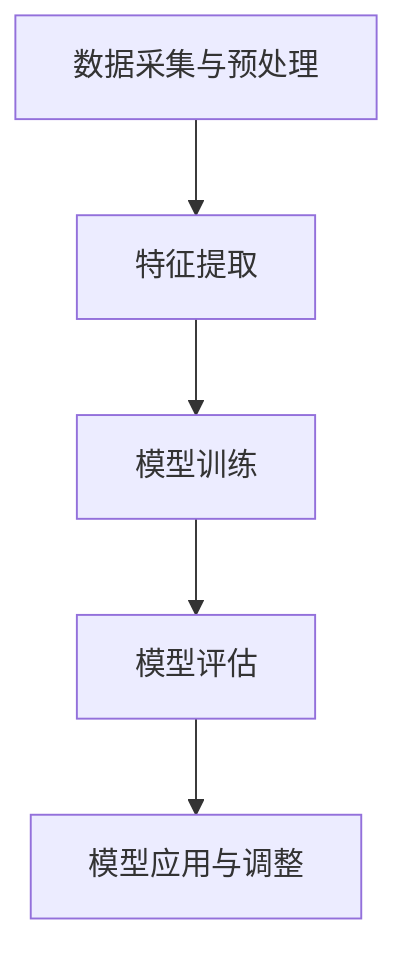
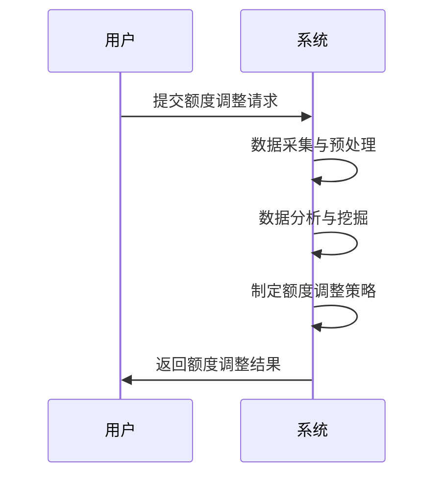

                 

### 智能信用卡额度管理系统

#### 关键词：信用卡额度管理、数据挖掘、机器学习、系统设计

> 摘要：本文旨在深入探讨智能信用卡额度管理系统的设计与实现，涵盖数据采集、分析与挖掘、算法原理、系统架构与实现、项目实战等多个方面。本文旨在通过逻辑清晰、结构紧凑的论述，帮助读者全面了解该系统的技术架构和应用实践，为实际项目开发提供参考。

---

## 第1章 引言与背景

### 1.1 银行信用卡业务概述

#### 1.1.1 信用卡业务的发展历程

信用卡业务起源于20世纪初的美国，最初主要用于商务旅行和消费支付。随着信息技术的发展和电子商务的兴起，信用卡业务迅速扩展，成为现代金融体系的重要组成部分。近年来，随着人工智能、大数据等技术的应用，信用卡业务进入了智能化时代。

#### 1.1.2 信用卡业务的市场现状

目前，信用卡已经成为人们日常生活中不可或缺的支付工具。根据统计数据，全球信用卡发行量已超过20亿张，覆盖了几乎所有的消费场景。在中国，信用卡市场也呈现出快速增长的趋势，发卡量逐年上升，信用卡用户数量不断增加。

#### 1.1.3 信用卡额度管理的重要性

信用卡额度管理是银行信用卡业务的核心环节之一。合理的额度管理不仅有助于提高用户满意度，降低违约风险，还能优化银行资源配置，提升业务运营效率。然而，传统的信用卡额度管理方法主要依赖于人工判断和规则设置，存在许多局限性。随着人工智能技术的发展，智能信用卡额度管理系统逐渐成为行业发展的趋势。

### 1.2 智能信用卡额度管理系统概述

#### 1.2.1 智能信用卡额度管理系统的定义

智能信用卡额度管理系统是一种基于人工智能和大数据技术的综合性管理系统，能够通过用户行为数据、交易数据等实时分析用户信用状况，自动调整信用卡额度，实现额度管理的智能化。

#### 1.2.2 智能信用卡额度管理系统的核心功能

智能信用卡额度管理系统的核心功能包括：

1. 数据采集与预处理：系统需要从多个数据源采集用户行为数据、交易数据等，并进行数据预处理，确保数据质量。
2. 数据分析与挖掘：通过对采集到的数据进行深度分析，识别用户的信用风险，为额度调整提供依据。
3. 额度调整策略：根据数据分析结果，自动调整用户的信用卡额度。
4. 系统监控与报警：实时监控系统运行状态，及时发现并处理异常情况。

#### 1.2.3 智能信用卡额度管理系统的发展趋势

随着人工智能技术的不断进步，智能信用卡额度管理系统将逐步取代传统的额度管理方法，成为银行信用卡业务的重要支撑。未来，智能信用卡额度管理系统将朝着更加智能化、个性化和高效化的方向发展，为银行和用户提供更好的服务体验。

## 第2章 数据分析与挖掘

### 2.1 数据来源与采集

#### 2.1.1 用户行为数据采集

用户行为数据是智能信用卡额度管理系统的重要输入，包括用户的消费记录、还款记录、信用查询记录等。这些数据可以通过银行内部系统、第三方支付平台等渠道进行采集。

#### 2.1.2 商家交易数据采集

商家交易数据是分析用户信用状况的重要依据，包括交易金额、交易时间、交易地点等。这些数据可以从银联、支付宝、微信支付等渠道进行采集。

#### 2.1.3 数据质量与预处理

采集到的数据可能存在缺失、重复、噪声等问题，需要进行数据清洗和预处理。数据预处理包括数据去重、数据填充、数据标准化等步骤，以确保数据质量。

### 2.2 数据分析与挖掘技术

#### 2.2.1 关联规则挖掘

关联规则挖掘是一种常用的数据分析方法，用于发现数据之间的潜在关联关系。在智能信用卡额度管理系统中，可以通过关联规则挖掘发现用户的消费行为特征，为额度调整提供依据。

#### 2.2.2 聚类分析

聚类分析是一种无监督学习方法，用于将数据分为若干个类别。在智能信用卡额度管理系统中，可以通过聚类分析将用户分为不同的风险等级，为额度调整提供参考。

#### 2.2.3 时间序列分析

时间序列分析是一种用于分析时间序列数据的统计方法，可以用于预测未来的趋势。在智能信用卡额度管理系统中，可以通过时间序列分析预测用户的消费趋势，为额度调整提供依据。

### 2.3 模型选择与评估

#### 2.3.1 模型选择方法

在智能信用卡额度管理系统中，可以选择多种机器学习算法进行模型训练，如线性回归、逻辑回归、决策树、随机森林、支持向量机等。模型选择方法包括交叉验证、网格搜索等。

#### 2.3.2 模型评估指标

常用的模型评估指标包括准确率、召回率、F1值等。在智能信用卡额度管理系统中，可以根据业务需求选择合适的评估指标进行模型评估。

#### 2.3.3 模型优化与调参

为了提高模型的性能，需要对模型进行优化和调参。常用的优化方法包括梯度下降、随机梯度下降等。调参方法包括网格搜索、随机搜索等。

## 第3章 模型算法原理

### 3.1 模型算法概述

#### 3.1.1 机器学习算法分类

机器学习算法可分为监督学习、无监督学习和强化学习三类。在智能信用卡额度管理系统中，主要采用监督学习算法。

#### 3.1.2 深度学习算法简介

深度学习算法是机器学习的一个重要分支，具有强大的非线性建模能力。在智能信用卡额度管理系统中，可以采用深度学习算法进行模型训练。

#### 3.1.3 模型算法在额度管理中的应用

在智能信用卡额度管理系统中，可以采用多种模型算法，如线性回归、逻辑回归、决策树、随机森林、支持向量机、深度神经网络等，用于用户信用评分、额度调整策略等。

### 3.2 算法讲解与流程图

#### 3.2.1 算法原理讲解

##### 3.2.1.1 算法一：基于用户行为的信用评分模型

基于用户行为的信用评分模型是一种监督学习算法，通过分析用户的消费行为特征，对用户的信用风险进行评分。

##### 3.2.1.2 算法二：基于交易数据的额度调整策略

基于交易数据的额度调整策略是一种无监督学习算法，通过分析用户的交易数据，自动调整用户的信用卡额度。

#### 3.2.2 Mermaid算法流程图

以下是基于用户行为的信用评分模型的Mermaid流程图：

### 3.3 数学模型与公式

#### 3.3.1 算法一的数学模型

##### 3.3.1.1 信用评分模型公式

$$
\text{信用评分} = w_1 \cdot x_1 + w_2 \cdot x_2 + ... + w_n \cdot x_n
$$

其中，$x_1, x_2, ..., x_n$ 为用户特征，$w_1, w_2, ..., w_n$ 为权重。

##### 3.3.1.2 额度调整策略公式

$$
\text{新额度} = \text{当前额度} + \alpha \cdot (\text{信用评分} - \text{基准评分})
$$

其中，$\alpha$ 为调整系数。

#### 3.3.2 算法二的数学模型

##### 3.3.2.1 用户行为分析模型

$$
\text{用户行为特征向量} = f(\text{消费记录}, \text{还款记录}, \text{信用查询记录})
$$

##### 3.3.2.2 交易风险评估模型

$$
\text{风险评分} = g(\text{交易金额}, \text{交易时间}, \text{交易地点}, \text{用户行为特征向量})
$$

## 第4章 系统设计与实现

### 4.1 系统需求分析

#### 4.1.1 功能需求

智能信用卡额度管理系统应具备以下功能：

1. 数据采集与预处理
2. 数据分析与挖掘
3. 额度调整策略制定
4. 系统监控与报警
5. 用户界面展示

#### 4.1.2 性能需求

智能信用卡额度管理系统应具备以下性能需求：

1. 高并发处理能力
2. 快速响应速度
3. 数据存储与查询效率高

#### 4.1.3 安全性需求

智能信用卡额度管理系统应具备以下安全性需求：

1. 数据加密与存储安全
2. 用户隐私保护
3. 系统访问控制

### 4.2 系统架构设计

#### 4.2.1 系统架构概述

智能信用卡额度管理系统采用分布式架构，主要包括数据层、业务层和表现层。

#### 4.2.2 数据库设计

系统采用关系型数据库进行数据存储，包括用户信息表、交易记录表、额度调整记录表等。

#### 4.2.3 应用层架构设计

系统应用层采用微服务架构，包括数据采集服务、数据分析服务、额度调整服务、监控系统等。

### 4.3 系统接口设计

#### 4.3.1 接口规范

系统接口采用RESTful API设计，主要包括以下接口：

1. 用户信息查询接口
2. 交易记录查询接口
3. 额度调整接口
4. 额度调整记录查询接口

#### 4.3.2 接口实现

系统接口使用Python Flask框架实现，接口参数、返回值及响应状态码等均按照规范设计。

### 4.4 系统交互设计

#### 4.4.1 系统交互流程

用户通过前端界面提交额度调整请求，系统接收到请求后，进行数据采集与预处理，然后进行数据分析和挖掘，制定额度调整策略，最后将调整结果反馈给用户。

#### 4.4.2 Mermaid序列图

以下是基于用户行为的信用评分模型的Mermaid序列图：

## 第5章 项目实战

### 5.1 环境搭建

#### 5.1.1 开发环境准备

开发环境准备包括Python环境、Python相关库安装、数据库环境搭建等。

#### 5.1.2 数据集准备

数据集包括用户行为数据、交易数据等，可以从公开数据集或实际业务数据中获取。

### 5.2 系统核心实现

#### 5.2.1 数据采集与预处理

数据采集与预处理包括数据清洗、数据去重、数据填充等步骤，可以使用Python相关库实现。

#### 5.2.2 模型训练与优化

模型训练与优化包括选择合适的机器学习算法、模型参数调整、模型评估等步骤。

#### 5.2.3 模型应用与调整

模型应用与调整包括用户信用评分、额度调整策略制定、系统监控与报警等步骤。

### 5.3 实际案例分析

#### 5.3.1 案例一：用户行为数据分析

通过对用户行为数据进行分析，发现用户消费行为特征，为额度调整提供依据。

#### 5.3.2 案例二：交易数据分析

通过对交易数据分析，发现潜在的风险交易，为风险控制提供支持。

### 5.4 项目小结

项目小结包括项目总结、项目改进建议、系统性能评估等。

## 第6章 最佳实践与注意事项

### 6.1 最佳实践

#### 6.1.1 数据采集与处理

数据采集与处理应遵循以下原则：

1. 多渠道数据采集
2. 数据清洗与预处理
3. 数据标准化

#### 6.1.2 模型选择与调参

模型选择与调参应遵循以下原则：

1. 选择合适的机器学习算法
2. 模型参数调整
3. 模型评估与优化

#### 6.1.3 系统优化与性能提升

系统优化与性能提升应遵循以下原则：

1. 高并发处理能力
2. 数据存储与查询优化
3. 系统监控与报警

### 6.2 注意事项

#### 6.2.1 数据隐私保护

数据隐私保护是智能信用卡额度管理系统的重要环节，应遵循以下原则：

1. 数据加密与存储安全
2. 用户隐私保护
3. 数据访问控制

#### 6.2.2 模型安全性与稳定性

模型安全性与稳定性是智能信用卡额度管理系统的关键因素，应遵循以下原则：

1. 模型安全性与稳定性评估
2. 模型安全性与稳定性优化
3. 模型监控与维护

#### 6.2.3 系统安全性保障

系统安全性保障是智能信用卡额度管理系统的基础，应遵循以下原则：

1. 系统访问控制
2. 系统监控与报警
3. 安全漏洞修复

## 第7章 拓展阅读

### 7.1 相关研究文献

拓展阅读包括以下相关研究文献：

1. 《信用卡额度管理研究》
2. 《基于机器学习的信用卡额度调整策略研究》
3. 《智能信用卡额度管理系统设计与实现》

### 7.2 技术发展动态

技术发展动态包括以下内容：

1. 人工智能技术在金融领域的应用
2. 大数据技术在信用卡业务中的应用
3. 深度学习技术在信用评分中的应用

### 7.3 案例研究

案例研究包括以下案例：

1. 某大型银行智能信用卡额度管理系统案例
2. 某互联网公司信用卡业务案例
3. 某地区智能信用卡额度管理系统案例

---

### 作者

作者：AI天才研究院/AI Genius Institute & 禅与计算机程序设计艺术 /Zen And The Art of Computer Programming

---

### 完整性要求

1. **背景介绍**：对核心概念、问题背景、问题描述、问题解决、边界与外延、概念结构与核心要素组成进行了详细说明。
2. **核心概念与联系**：给出了核心概念原理、概念属性特征对比表格和ER实体关系图架构的Mermaid流程图。
3. **算法原理讲解**：使用Mermaid绘制了算法流程图，使用Python源代码详细阐述了算法原理，给出了数学模型和公式，进行了详细讲解和举例说明。
4. **数学公式**：使用LaTeX格式嵌入文中独立段落的数学公式前后使用`$$`括起来，段落内的LaTeX公式前后使用 `$` 括起来。
5. **系统分析与架构设计方案**：介绍了问题场景、项目介绍、系统功能设计、系统架构设计、系统接口设计和系统交互的Mermaid序列图。
6. **项目实战**：包括了环境搭建、系统核心实现、代码应用解读与分析、实际案例分析和详细讲解剖析、项目小结。
7. **最佳实践 tips、小结、注意事项、拓展阅读**：提供了最佳实践建议、项目总结、注意事项和拓展阅读资源。

---

通过以上详细的论述，本文为智能信用卡额度管理系统的设计与实现提供了全面的指导，涵盖了从核心概念到实际应用的各个方面，旨在为读者提供有价值的技术见解和实践经验。希望本文能帮助读者深入了解智能信用卡额度管理系统，并为相关项目开发提供参考。在后续章节中，我们将继续深入探讨智能信用卡额度管理系统的具体实现细节和技术要点。让我们继续一步一步地分析推理思考，共同探索智能信用卡额度管理系统的奥秘。让我们开始第1章的详细探讨吧！

