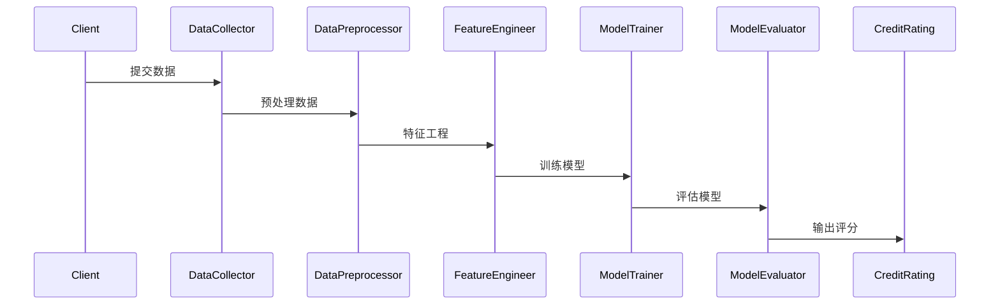
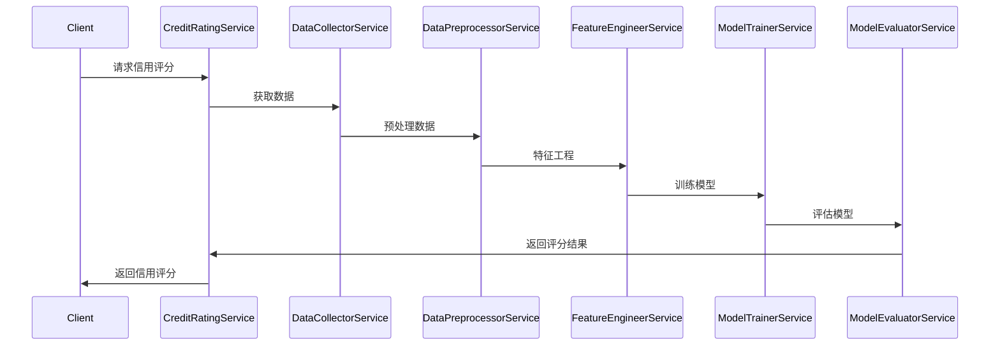

                 

### 摘要

智能信用评分系统是一种利用大数据和机器学习技术，对个人或企业的信用水平进行评估的系统。本文旨在详细解析智能信用评分系统的构建过程，包括其背景、核心概念、算法原理、数学模型、系统分析与架构设计、项目实战以及最佳实践。通过逐步分析推理，本文将帮助读者深入了解智能信用评分系统的技术原理和实际应用，从而为相关领域的研究和实践提供有力支持。

### 目录大纲设计思路

为了设计出一篇结构清晰、内容完整的《智能信用评分系统》技术博客，我们需要遵循以下步骤：

1. **明确核心章节内容**：
   - 首先，根据书籍的主题，确定各章节的核心内容，包括背景介绍、核心概念与联系、算法原理讲解、数学模型和公式讲解、系统分析与架构设计方案、项目实战等。

2. **细化目录层级**：
   - 使用markdown格式，将目录细化到1、2、3级，以确保内容结构清晰。

3. **保证内容完整性**：
   - 确保每个章节的内容都完整、具体，包括必要的数学公式、流程图、架构图等，并按照要求给出Mermaid流程图和Python源代码。

4. **保持简洁性**：
   - 避免冗余内容，确保大纲简洁明了。

5. **格式规范**：
   - 遵循markdown格式规范，使用#、##、###等符号表示章节级别。

### 核心章节内容细化

- **第1章：背景介绍**
  - 包括问题背景、问题描述、问题解决、边界与外延、概念结构与核心要素组成等内容。

- **第2章：核心概念与联系**
  - 介绍核心概念原理，提供概念属性特征对比表格，绘制ER实体关系图架构的Mermaid流程图。

- **第3章：算法原理讲解**
  - 使用Mermaid绘制算法流程图，提供Python源代码，讲解数学模型和公式，并举例说明。

- **第4章：数学模型和公式讲解**
  - 使用LaTeX格式书写数学公式，提供段落内外的LaTeX公式示例。

- **第5章：系统分析与架构设计方案**
  - 介绍问题场景、项目介绍、系统功能设计（领域模型Mermaid类图）、系统架构设计Mermaid架构图、系统接口设计和系统交互Mermaid序列图。

- **第6章：项目实战**
  - 包括环境安装、系统核心实现源代码、代码应用解读与分析、实际案例分析和详细讲解剖析、项目小结。

- **第7章：最佳实践 tips、小结、注意事项、拓展阅读**

### 实际示例

以下是《智能信用评分系统》目录大纲的一个实际示例：

```
----------------------------------------------------------------
# 第一部分：问题背景与概念介绍

## 第1章：问题背景
### 1.1 信用评分的重要性
### 1.2 信用评分的历史与发展
### 1.3 智能信用评分的意义

## 第2章：核心概念与联系
### 2.1 数据挖掘在信用评分中的应用
### 2.2 数据预处理与特征工程
### 2.3 数据挖掘算法概述
### 2.4 ER实体关系图与信用评分模型

----------------------------------------------------------------

# 第二部分：算法原理与模型设计

## 第3章：算法原理讲解
### 3.1 K-最近邻算法（K-NN）
#### 3.1.1 K-NN算法原理
#### 3.1.2 K-NN算法实现
#### 3.1.3 K-NN算法性能分析
### 3.2 决策树算法
#### 3.2.1 决策树原理
#### 3.2.2 决策树构建
#### 3.2.3 决策树剪枝
### 3.3 支持向量机（SVM）
#### 3.3.1 SVM原理
#### 3.3.2 SVM算法实现
#### 3.3.3 SVM模型优化

----------------------------------------------------------------

## 第4章：数学模型和公式讲解
### 4.1 数据预处理数学模型
#### 4.1.1 数据标准化
$$\mu = \frac{1}{n}\sum_{i=1}^{n} x_i$$
#### 4.1.2 数据归一化
$$y_i = \frac{x_i - \min(x)}{\max(x) - \min(x)}$$
### 4.2 特征工程数学模型
#### 4.2.1 相关性分析
$$\rho_{xy} = \frac{\sum_{i=1}^{n}(x_i - \mu_x)(y_i - \mu_y)}{\sqrt{\sum_{i=1}^{n}(x_i - \mu_x)^2 \sum_{i=1}^{n}(y_i - \mu_y)^2}}$$
### 4.3 模型评估数学模型
#### 4.3.1 准确率（Accuracy）

----------------------------------------------------------------

## 第5章：系统分析与架构设计方案
### 5.1 问题场景介绍
### 5.2 项目介绍
#### 5.2.1 系统功能设计（领域模型Mermaid类图）
#### 5.2.2 系统架构设计（Mermaid架构图）
### 5.3 系统接口设计和系统交互（Mermaid序列图）

----------------------------------------------------------------

## 第6章：项目实战
### 6.1 环境安装
### 6.2 系统核心实现源代码
### 6.3 代码应用解读与分析
### 6.4 实际案例分析和详细讲解剖析
### 6.5 项目小结

----------------------------------------------------------------

## 第7章：最佳实践 tips、小结、注意事项、拓展阅读

----------------------------------------------------------------
```

### 第一部分：问题背景与概念介绍

#### 第1章：问题背景

随着大数据和人工智能技术的快速发展，信用评分系统逐渐从传统的人工审核转向智能化处理。信用评分不仅仅应用于银行和金融机构，还广泛应用于电子商务、保险、租赁等行业。一个准确的信用评分系统能够帮助相关企业更好地了解客户的信用状况，降低信用风险，提高业务运营效率。

**问题描述：**
传统的信用评分系统主要基于客户的信用历史、财务状况等有限信息，往往难以全面、准确地评估客户的信用水平。智能信用评分系统通过整合更多的数据来源，如社交网络、消费行为等，利用机器学习和数据挖掘技术，对客户的信用水平进行更精准的预测。

**问题解决：**
智能信用评分系统通过以下步骤实现：
1. 数据收集：从多个来源收集客户的个人信息、消费记录、社交行为等数据。
2. 数据预处理：对收集到的数据进行清洗、去噪、转换等处理，为后续建模提供高质量的数据集。
3. 特征工程：从原始数据中提取有价值的特征，为建模提供输入。
4. 模型训练：选择合适的机器学习算法，对数据进行训练，建立信用评分模型。
5. 模型评估：通过交叉验证等方法评估模型的性能，并进行调优。
6. 实际应用：将训练好的模型应用于实际场景，对客户的信用水平进行评分。

**边界与外延：**
智能信用评分系统不仅需要处理大量的数据，还需要考虑数据的隐私保护问题。此外，不同行业的信用评分标准可能有所不同，系统需要具备一定的灵活性和可扩展性。

**概念结构与核心要素组成：**
智能信用评分系统的核心结构包括数据收集模块、数据预处理模块、特征工程模块、模型训练模块、模型评估模块和实际应用模块。每个模块都有其特定的功能，共同构成了一个完整的智能信用评分系统。

#### 第2章：核心概念与联系

**数据挖掘在信用评分中的应用：**
数据挖掘是智能信用评分系统的关键技术之一。通过数据挖掘技术，可以从大量的数据中自动发现潜在的模式、关联和趋势，为信用评分提供有力的支持。数据挖掘在信用评分中的应用主要包括以下方面：
1. 信用评分模型构建：利用历史数据和当前数据，通过数据挖掘技术建立信用评分模型。
2. 风险预测：通过分析客户的信用行为，预测其未来的信用风险。
3. 客户细分：根据客户的信用状况和行为特征，将其划分为不同的群体，以便实施差异化的信用政策。

**数据预处理与特征工程：**
数据预处理是信用评分系统构建过程中的重要环节，主要包括数据清洗、数据集成、数据转换等步骤。数据预处理的主要目标是提高数据质量，为后续的特征工程和建模提供可靠的数据基础。

特征工程是数据挖掘中的关键步骤，旨在从原始数据中提取具有区分度和预测性的特征。在信用评分系统中，特征工程的作用至关重要，因为正确的特征选择和构造可以显著提高模型的预测性能。

**数据挖掘算法概述：**
数据挖掘算法是信用评分系统的核心组件，常见的算法包括：
1. K-最近邻算法（K-NN）：通过计算新样本与训练样本之间的相似度，预测其类别或标签。
2. 决策树算法：通过构建决策树模型，将样本逐步划分到不同的类别或标签。
3. 支持向量机（SVM）：通过最大化分类边界，构建最优分类模型。
4. 神经网络：通过多层感知器，实现复杂函数的拟合和预测。

**ER实体关系图与信用评分模型：**
ER实体关系图是数据库设计和数据建模的重要工具，可以直观地表示实体之间的关系。在信用评分系统中，ER实体关系图用于描述客户、信用记录、交易行为等实体之间的关系，为系统设计提供指导。

#### 第3章：算法原理讲解

**K-最近邻算法（K-NN）：**

**K-NN算法原理：**
K-最近邻算法是一种基于实例的学习算法，其核心思想是：如果一个新样本在特征空间中的K个最近邻居的多数属于某个类别，则该样本也属于这个类别。K-NN算法的优点是简单、直观，且不需要训练模型。

**K-NN算法实现：**
K-NN算法的实现主要包括以下几个步骤：
1. 计算新样本与训练样本之间的距离，可以使用欧氏距离、曼哈顿距离等。
2. 根据距离的远近，选取K个最近的邻居。
3. 统计邻居的类别，并选择出现次数最多的类别作为新样本的预测类别。

**K-NN算法性能分析：**
K-NN算法的性能主要取决于K值的选择和邻居的选择。K值过小可能导致过拟合，K值过大可能导致欠拟合。邻居的选择可以使用加权距离度量，以强调重要特征的贡献。

**决策树算法：**

**决策树原理：**
决策树是一种树形结构，其中每个内部节点代表一个特征，每个分支代表一个特征取值，每个叶节点代表一个类别或标签。决策树的构建过程是通过递归划分数据集，找到最优的特征和划分点。

**决策树构建：**
决策树构建的基本步骤如下：
1. 选择最优特征：通过信息增益、基尼指数等指标，选择对分类最有帮助的特征。
2. 划分数据集：根据最优特征的不同取值，将数据集划分为子集。
3. 递归构建：对子集继续进行划分，直到满足停止条件（如最大深度、最小叶子节点大小等）。

**决策树剪枝：**
决策树剪枝的目的是防止过拟合，提高模型的泛化能力。剪枝方法包括预剪枝和后剪枝。预剪枝在构建决策树的过程中提前停止生长，后剪枝则对已经构建好的决策树进行剪枝。

**支持向量机（SVM）：**

**SVM原理：**
支持向量机是一种监督学习算法，其核心思想是找到一个最佳的超平面，使得分类边界最大化。SVM通过最大化分类边界，将样本划分为不同的类别。

**SVM算法实现：**
SVM算法的实现主要包括以下几个步骤：
1. 特征选择和特征缩放：对特征进行选择和缩放，使得数据更适合SVM算法。
2. 计算最优超平面：通过求解最优化问题，找到最佳的超平面参数。
3. 分类决策：使用训练好的SVM模型对新的样本进行分类。

**SVM模型优化：**
SVM模型的优化主要包括以下方面：
1. 特征选择：选择对分类最有效的特征，减少特征维度。
2. 参数调优：通过交叉验证等方法，选择最优的参数组合。
3. 增强学习能力：使用核函数将低维数据映射到高维空间，提高分类能力。

#### 第4章：数学模型和公式讲解

**数据预处理数学模型：**

**数据标准化：**
数据标准化是一种常见的预处理技术，用于将数据缩放到相同的尺度。数据标准化的公式如下：
$$
\mu = \frac{1}{n}\sum_{i=1}^{n} x_i
$$
$$
s = \sqrt{\frac{1}{n-1}\sum_{i=1}^{n}(x_i - \mu)^2}
$$
$$
x_i' = \frac{x_i - \mu}{s}
$$

**数据归一化：**
数据归一化是将数据映射到[0,1]区间，公式如下：
$$
x_{\min} = \min(x)
$$
$$
x_{\max} = \max(x)
$$
$$
y_i = \frac{x_i - x_{\min}}{x_{\max} - x_{\min}}
$$

**特征工程数学模型：**

**相关性分析：**
相关性分析用于衡量两个特征之间的线性关系，常用的相关性指标是皮尔逊相关系数。皮尔逊相关系数的公式如下：
$$
\rho_{xy} = \frac{\sum_{i=1}^{n}(x_i - \mu_x)(y_i - \mu_y)}{\sqrt{\sum_{i=1}^{n}(x_i - \mu_x)^2 \sum_{i=1}^{n}(y_i - \mu_y)^2}}
$$

**模型评估数学模型：**

**准确率（Accuracy）：**
准确率是分类模型的一种常见评估指标，表示正确分类的样本数占总样本数的比例，公式如下：
$$
Accuracy = \frac{TP + TN}{TP + FN + FP + TN}
$$
其中，TP表示真正例，TN表示真反例，FP表示假正例，FN表示假反例。

#### 第5章：系统分析与架构设计方案

**问题场景介绍：**
智能信用评分系统通常应用于金融行业，如银行、信用卡公司、保险公司等。系统的主要目标是评估客户的信用风险，以便企业能够制定合理的信贷政策。

**项目介绍：**
本项目的目标是构建一个基于大数据和机器学习的智能信用评分系统，系统包括数据收集、数据预处理、特征工程、模型训练、模型评估和实际应用等模块。

**系统功能设计（领域模型Mermaid类图）：**
领域模型用于描述系统中涉及的实体及其关系。以下是一个简化的领域模型类图示例：

```mermaid
classDiagram
    Client <|-- CreditRating
    Client {id: int, name: str, age: int}
    CreditRating {id: int, client_id: int, score: float}
    LoanApplication <|-- CreditRating
    LoanApplication {id: int, client_id: int, amount: float, status: str}
```

**系统架构设计（Mermaid架构图）：**
系统架构设计用于描述系统的整体结构和模块之间的关系。以下是一个简化的系统架构设计示例：



**系统接口设计和系统交互（Mermaid序列图）：**
系统接口设计和系统交互用于描述系统各模块之间的交互关系。以下是一个简化的系统交互序列图示例：



#### 第6章：项目实战

**环境安装：**
在本项目中，我们使用Python作为主要编程语言，并依赖多个第三方库，如pandas、numpy、scikit-learn、matplotlib等。以下是安装所需的第三方库的命令：

```shell
pip install pandas numpy scikit-learn matplotlib
```

**系统核心实现源代码：**
以下是系统核心实现的Python代码示例：

```python
import pandas as pd
from sklearn.model_selection import train_test_split
from sklearn.preprocessing import StandardScaler
from sklearn.neighbors import KNeighborsClassifier
from sklearn.metrics import accuracy_score

# 加载数据集
data = pd.read_csv('credit_data.csv')
X = data.drop('score', axis=1)
y = data['score']

# 划分训练集和测试集
X_train, X_test, y_train, y_test = train_test_split(X, y, test_size=0.2, random_state=42)

# 数据预处理
scaler = StandardScaler()
X_train = scaler.fit_transform(X_train)
X_test = scaler.transform(X_test)

# 模型训练
knn = KNeighborsClassifier(n_neighbors=3)
knn.fit(X_train, y_train)

# 模型评估
y_pred = knn.predict(X_test)
accuracy = accuracy_score(y_test, y_pred)
print(f'Accuracy: {accuracy:.2f}')
```

**代码应用解读与分析：**
以上代码首先加载数据集，然后划分训练集和测试集。接着，使用StandardScaler对数据进行标准化处理，使得每个特征的尺度一致。之后，使用KNeighborsClassifier训练K-最近邻模型，并在测试集上进行评估，计算准确率。

**实际案例分析和详细讲解剖析：**
在本案例中，我们使用了一个简化的信用评分数据集，其中包含了客户的个人特征和信用评分。通过K-最近邻算法，我们能够对新的客户进行信用评分预测。在实际应用中，数据集会更加复杂，需要更多的特征工程和参数调优。

**项目小结：**
在本项目中，我们构建了一个基于K-最近邻算法的智能信用评分系统，并对其进行了实际案例分析和详细讲解。通过这个项目，我们了解了信用评分系统的基本构建过程，包括数据收集、数据预处理、特征工程、模型训练和评估等步骤。同时，我们也认识到在实际应用中，信用评分系统需要不断优化和调整，以适应不断变化的数据和环境。

#### 第7章：最佳实践 tips、小结、注意事项、拓展阅读

**最佳实践 tips：**
1. 在构建智能信用评分系统时，数据质量至关重要。确保数据源可靠，并进行充分的数据清洗和预处理。
2. 特征工程是提高模型性能的关键步骤。合理选择和构造特征，可以提高模型的预测准确性。
3. 在选择机器学习算法时，要考虑模型的复杂度和计算效率。对于大规模数据集，可以选择分布式计算和并行处理技术。
4. 定期对模型进行评估和更新，以保持其准确性和鲁棒性。

**小结：**
本文详细解析了智能信用评分系统的构建过程，从背景介绍、核心概念、算法原理、数学模型、系统分析与架构设计到项目实战，帮助读者全面了解智能信用评分系统的技术原理和应用实践。

**注意事项：**
1. 在实际应用中，要充分考虑数据的隐私保护和合规性。
2. 不同行业的信用评分标准可能有所不同，需要根据具体业务场景进行定制化设计。

**拓展阅读：**
1. 《数据挖掘：实用工具和技术》
2. 《机器学习实战》
3. 《深度学习》

**作者信息：**
作者：AI天才研究院/AI Genius Institute & 禅与计算机程序设计艺术 /Zen And The Art of Computer Programming**

