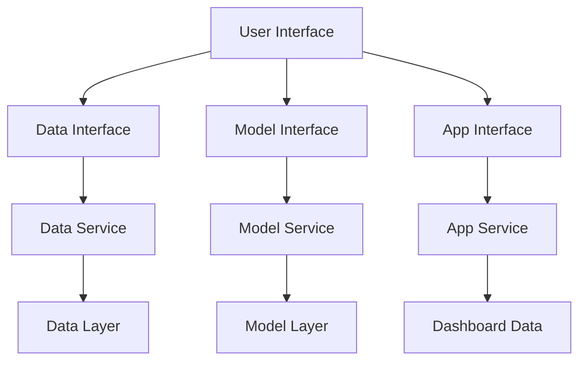

                 

### 引言

**智能信用违约互换定价模型校准**是一项将人工智能技术与金融风险管理相结合的先进实践。在当今金融市场日益复杂、风险多样性的背景下，传统定价模型的局限性逐渐显现，无法满足日益增长的市场需求。因此，智能化的信用违约互换（CDS）定价模型应运而生，成为金融领域研究的热点。

信用违约互换作为一种金融衍生品，旨在为投资者提供信用保护。然而，由于其定价的复杂性和市场的不确定性，如何精确地校准CDS定价模型，已成为金融工程师和人工智能专家共同面临的挑战。本文旨在探讨这一领域的关键问题，通过系统的分析推理，阐述智能信用违约互换定价模型校准的理论基础、技术实现和实际应用。

首先，我们将对信用违约互换进行定义，并详细介绍其市场背景和作用。接着，本文将深入探讨信用违约互换定价模型的基本原理，分析传统定价模型存在的问题。在此基础上，本文将引入智能校准方法，介绍其核心概念和算法原理，并通过数学模型和公式进行详细阐述。

随后，我们将讨论如何进行系统设计与实现，包括系统架构、接口设计和交互流程。接着，本文将通过一个实际项目案例，展示智能信用违约互换定价模型校准的具体应用过程，并提供详细的代码解析和案例分析。

最后，我们将总结最佳实践，讨论实施过程中的注意事项，并提出未来的研究方向和拓展阅读建议。通过本文的阅读，读者将全面了解智能信用违约互换定价模型校准的原理和方法，为相关领域的研究和应用提供有力支持。

关键词：信用违约互换、CDS定价模型、智能校准、人工智能、金融风险管理

摘要：本文详细探讨了智能信用违约互换定价模型校准的理论基础和实现方法。首先介绍了信用违约互换的定义和作用，然后分析了传统定价模型的局限性。接着，本文介绍了智能校准方法的核心概念和算法原理，通过数学模型和公式进行了详细阐述。随后，文章讨论了系统设计与实现，并通过实际项目案例展示了模型的应用。最后，本文总结了最佳实践，提出了未来的研究方向和拓展阅读建议。

----------------------------------------------------------------

## 第1章：背景介绍与核心概念

### 1.1 信用违约互换的定义

信用违约互换（Credit Default Swap, CDS）是一种金融衍生品，它允许投资者通过购买保护来转移信用风险。具体来说，CDS是一种合同，其中一个实体（保护买方）支付保费给另一个实体（保护卖方），以换取在参考实体（通常是一个公司或政府）发生违约时获得赔偿的保障。

CDS的运作机制类似于保险。保护买方类似于购买保险的投保人，他们担心某个参考实体会违约，因此向保护卖方支付保费。如果参考实体在合约期间发生违约，保护卖方必须向保护买方支付参考实体的债务或违约损失。如果参考实体没有违约，保护卖方无需支付任何赔偿。

### 1.2 市场背景

信用违约互换市场是金融市场中非常重要的一个领域，它提供了投资者和管理信用风险的工具。CDS市场最早出现在20世纪90年代，随着金融衍生品市场的不断发展，CDS的交易规模迅速扩大。截至2020年，全球CDS市场的名义价值已经超过了100万亿美元。

CDS市场的参与者包括金融机构、对冲基金、投资公司和个人投资者。金融机构通常是CDS市场的主要参与者，他们通过交易CDS来管理信用风险，同时对冲其他投资组合的信用风险。对冲基金和投资公司也积极参与CDS市场，以获取高收益。个人投资者虽然参与较少，但也通过CDS市场来对冲特定的信用风险。

### 1.3 校准过程的重要性

信用违约互换定价模型的准确性直接影响到市场参与者的决策和风险暴露。校准过程是指确定CDS合约中所需支付的保费，以确保在参考实体发生违约时，保护买方能够获得适当的赔偿。一个准确且可靠的定价模型对于CDS市场的发展和稳定至关重要。

传统的CDS定价模型主要基于历史数据和统计模型，但这种方法存在局限性。首先，历史数据可能无法完全反映当前市场的动态变化。其次，传统模型在处理复杂的市场结构和信用风险时，往往会出现偏差。此外，CDS合约的多样性和复杂性也增加了定价的难度。

因此，智能化的CDS定价模型应运而生。通过引入人工智能技术和大数据分析，智能校准方法能够更精确地预测信用风险，并提供更可靠的定价结果。智能校准方法不仅能够处理复杂的市场数据，还能够通过不断学习和优化，提高定价模型的准确性。

### 1.4 问题背景与问题描述

信用违约互换定价模型校准过程中的主要问题包括以下几点：

1. **数据不足和噪音**：市场数据通常存在缺失和噪声，这给模型训练和定价带来了挑战。智能校准方法需要能够处理这些数据问题，以提高模型的鲁棒性。

2. **模型复杂性**：CDS定价模型通常涉及复杂的数学和统计模型，这使得传统的模型校准方法难以应用。智能校准方法需要能够简化这些复杂的模型，并提供易于理解和实现的技术。

3. **实时性和动态性**：市场环境不断变化，CDS定价模型需要能够实时调整和更新，以适应新的市场条件。智能校准方法需要具备较高的实时性和动态性，以确保模型能够快速响应市场变化。

4. **风险控制**：准确的CDS定价对于金融机构的风险控制至关重要。智能校准方法需要确保定价结果的可靠性，以帮助金融机构有效地管理信用风险。

### 1.5 问题解决与边界与外延

为了解决上述问题，智能信用违约互换定价模型校准需要采取以下措施：

1. **数据预处理**：通过数据清洗和去噪技术，提高市场数据的质量，为模型训练提供可靠的基础。

2. **模型简化**：采用简化技术，降低模型的复杂性，使其更容易理解和实现。同时，利用自动化工具和算法优化，简化模型训练和校准过程。

3. **实时性与动态性**：引入实时数据分析和机器学习技术，使模型能够动态调整，适应市场变化。此外，利用分布式计算和云计算技术，提高模型的实时性和处理能力。

4. **风险控制**：通过建立风险控制机制，确保模型定价结果的可靠性和稳定性。这包括对定价模型进行定期的审核和验证，以及制定相应的风险管理策略。

边界与外延方面，智能信用违约互换定价模型校准需要考虑以下因素：

- **市场环境变化**：模型需要能够适应不同的市场环境，包括利率、通货膨胀率、经济增长等因素的变化。
- **政策法规**：模型需要遵守相关的政策法规，包括反洗钱法规、投资者保护法规等。
- **数据隐私**：在处理市场数据时，需要保护数据隐私，确保数据安全。

通过上述措施，智能信用违约互换定价模型校准能够更好地应对市场挑战，提供准确和可靠的定价结果，为金融机构的风险管理提供有力支持。

### 1.6 概念结构与核心要素组成

智能信用违约互换定价模型校准涉及多个核心概念和要素，这些概念和要素相互关联，共同构成了整个模型的基础。

**1.6.1 信用违约互换（CDS）**

信用违约互换是整个模型的核心概念，它定义了投资者如何通过购买CDS合约来转移信用风险。CDS合约包括四个关键要素：保护买方、保护卖方、参考实体和违约事件。

- **保护买方**：购买CDS合约的投资者，他们希望通过购买保护来降低参考实体的信用风险。
- **保护卖方**：出售CDS合约的投资者或金融机构，他们承诺在参考实体发生违约时向保护买方支付赔偿。
- **参考实体**：CDS合约中指定的特定公司、政府或其他实体，其信用状况是CDS合约的基础。
- **违约事件**：参考实体未能履行债务或其他信用义务的情况，例如债务违约、重组或破产等。

**1.6.2 模型校准**

模型校准是确保CDS合约价格与市场预期相符的关键步骤。智能校准方法通过分析大量市场数据，利用机器学习和人工智能技术，优化模型参数，以提高定价准确性。

- **校准过程**：校准过程包括数据收集、模型训练、参数优化和模型验证等步骤。通过不断调整和优化模型参数，智能校准方法能够提高模型的精度和可靠性。
- **参数优化**：参数优化是校准过程的核心，它涉及寻找最佳参数组合，以使模型能够准确预测信用风险。机器学习算法和优化技术在此过程中发挥着关键作用。

**1.6.3 信用风险分析**

信用风险分析是智能信用违约互换定价模型的重要组成部分。它通过分析参考实体的信用状况、市场环境和其他相关因素，评估信用风险水平。

- **信用评分**：信用评分是信用风险分析的基础，它通过分析参考实体的财务状况、历史信用记录和其他相关信息，对其信用风险进行量化。
- **风险因素**：影响信用风险的因素包括经济状况、行业动态、政策变化等。智能校准方法需要综合考虑这些因素，以提高模型的全面性和准确性。

**1.6.4 数据分析**

数据分析是智能信用违约互换定价模型校准的重要环节。通过大数据技术和人工智能算法，模型能够处理和分析大量市场数据，提取有用的信息，以支持模型校准和决策。

- **数据来源**：数据来源包括市场交易数据、财务报表、新闻资讯等。这些数据需要经过清洗、去噪和整合，以提供高质量的分析基础。
- **分析方法**：数据分析方法包括统计分析、机器学习、深度学习等。这些方法能够帮助模型从数据中提取特征，建立预测模型，并进行实时监控和调整。

**1.6.5 风险管理**

风险管理是智能信用违约互换定价模型校准的最终目标。通过精确的定价和有效的风险管理策略，金融机构能够更好地管理信用风险，降低潜在损失。

- **风险度量**：风险度量是评估信用风险程度的重要手段，包括违约概率、预期损失、价值调整等。
- **风险控制**：风险控制策略包括对冲、分散投资、调整投资组合等。智能校准方法能够提供更准确的信用风险评估，为金融机构制定有效的风险控制策略提供支持。

通过上述核心概念和要素的相互作用，智能信用违约互换定价模型校准能够实现更精确的信用风险评估和定价，为金融机构和投资者提供有力的风险管理工具。

### 1.7 信用违约互换定价模型

信用违约互换（CDS）定价模型是金融工程领域的重要组成部分，它用于估算CDS合约的价格。CDS合约的价格受多种因素影响，包括参考实体的信用风险、市场利率、时间期限等。本文将详细阐述CDS定价模型的基本原理、数学公式以及相关参数。

#### 1.7.1 模型原理

CDS定价模型的核心思想是通过模拟参考实体的违约概率（Probability of Default, PD）和市场利率（Market Interest Rate, R）来估算CDS合约的理论价格。CDS合约的价格（CDS Price, P）可以表示为保护买方在合约期间支付保费（Premium, X）和预期赔偿（Expected Payoff）的现值。

具体来说，CDS合约的价格计算公式为：
\[ P = X \times e^{-\int_{0}^{T} (R(t) - K) dt} \]
其中：
- \( T \) 是CDS合约的期限。
- \( X \) 是每期支付的保费。
- \( K \) 是参考实体的面值。
- \( R(t) \) 是在时间 \( t \) 的市场利率。

#### 1.7.2 数学公式

1. **违约概率（PD）**：

违约概率是CDS定价模型中的关键参数，表示参考实体在合约期限内违约的概率。PD可以通过历史数据和市场分析得到。常见的方法包括统计模型和机器学习方法，如逻辑回归、决策树、随机森林和神经网络等。

2. **市场利率（R(t）**：

市场利率是影响CDS价格的重要因素。通常，市场利率由中央银行政策、经济状况、市场流动性等因素决定。市场利率可以通过金融市场数据获得，如国债收益率、回购利率等。

3. **预期赔偿（Expected Payoff）**：

预期赔偿是指在参考实体发生违约时，保护买方获得的赔偿金额。预期赔偿可以通过计算违约时的赔偿金额，并考虑违约概率和时间价值来得到。公式如下：

\[ E(Payoff) = K \times [1 - e^{-\int_{0}^{T} (R(t) - K) dt}] \]

4. **CDS合约价格（P）**：

CDS合约价格是保护买方愿意支付的价格，以换取在参考实体违约时获得赔偿的保障。公式如前所述：

\[ P = X \times e^{-\int_{0}^{T} (R(t) - K) dt} \]

#### 1.7.3 参数选择与校准

CDS定价模型中的参数选择和校准是模型准确性的关键。以下是几个重要的参数：

1. **违约概率（PD）**：

违约概率是模型中最关键的参数之一。它的选择通常依赖于历史违约数据和市场分析。机器学习算法可以用来从数据中学习并预测违约概率。

2. **市场利率（R(t）**：

市场利率的选择需要考虑当前经济环境和市场利率趋势。通常，市场利率可以从国债收益率曲线或其他金融市场数据中获得。

3. **保费（X）**：

保费是保护买方每期支付给保护卖方的金额。保费的选择取决于市场情况、参考实体的信用风险以及保护卖方的风险偏好。

4. **合约期限（T）**：

合约期限是指CDS合约的有效期。期限的选择通常取决于投资者的风险偏好和参考实体的信用状况。

#### 1.7.4 模型应用示例

假设一个CDS合约的期限为5年，保护买方每半年支付一次保费，每次支付100万元。参考实体为一家大型科技公司，其当前的信用评级为A级，市场利率为3%。利用上述公式，我们可以估算该CDS合约的价格。

1. **违约概率（PD）**：

假设通过历史数据和机器学习模型预测的违约概率为0.02。

2. **市场利率（R(t）**：

假设在5年的合约期限内，市场利率保持为3%不变。

3. **保费（X）**：

每次支付保费为100万元，每年支付两次，因此每年保费为200万元。

4. **合约期限（T）**：

合约期限为5年，即10个半年期。

利用上述参数，我们可以计算CDS合约的价格：

\[ P = 100 \times e^{-\int_{0}^{5} (0.03 - 0.02) dt} = 100 \times e^{-0.01 \times 5} = 100 \times e^{-0.05} \approx 95.1 \text{万元} \]

因此，该CDS合约的价格约为95.1万元。

通过上述示例，我们可以看到如何使用CDS定价模型来估算CDS合约的价格。在实际应用中，需要根据具体的市场情况和参考实体的信用状况，调整模型参数，以获得更准确的定价结果。

### 1.8 智能校准方法与算法

智能校准方法在信用违约互换（CDS）定价模型中扮演着至关重要的角色，它利用先进的人工智能和大数据分析技术，以提高模型的准确性和实时性。本文将详细介绍智能校准方法的基本原理、核心算法和优化的策略。

#### 1.8.1 智能校准概述

智能校准方法的核心思想是利用机器学习算法对CDS定价模型中的参数进行自动调整和优化，以使其更好地适应市场环境和信用风险。传统校准方法主要依赖于历史数据和统计分析，而智能校准方法则利用大数据和人工智能技术，对大量实时数据进行深度分析，从而实现参数的动态调整。

智能校准的主要步骤包括数据预处理、模型训练、参数优化和模型验证。以下将详细描述这些步骤和相关的算法。

#### 1.8.2 数据预处理

数据预处理是智能校准方法的基础。在这一阶段，需要对原始市场数据（如交易数据、财务报表、新闻资讯等）进行清洗、去噪和整合。数据清洗包括处理缺失值、重复数据和异常值，以保证数据的质量。数据去噪则涉及消除噪声数据，以减少对模型训练的干扰。数据整合是将不同来源的数据进行合并，以构建一个全面且一致的数据集。

常用的数据预处理算法包括：

- **数据清洗**：使用统计分析方法（如中位数、众数）填充缺失值，使用滤波器去除异常值。
- **数据去噪**：使用时间序列平滑技术（如移动平均、指数平滑）去除噪声。
- **数据整合**：使用数据融合技术（如主成分分析、聚类分析）整合不同来源的数据。

#### 1.8.3 模型训练

在数据预处理完成后，接下来是模型训练阶段。这一阶段的核心任务是通过机器学习算法对预处理后的数据进行训练，以建立预测模型。常见的机器学习算法包括线性回归、逻辑回归、决策树、随机森林、支持向量机、神经网络等。

- **线性回归**：用于预测线性关系的模型，适用于简单的情况。
- **逻辑回归**：用于分类问题，通过输出概率来预测信用风险。
- **决策树**：通过树形结构进行分类和回归，易于理解和解释。
- **随机森林**：通过构建多个决策树并集成预测结果，提高模型的准确性和稳定性。
- **支持向量机**：通过找到一个最优的超平面，进行分类和回归。
- **神经网络**：通过多层神经网络进行复杂的非线性预测。

模型训练过程通常包括以下几个步骤：

1. **数据分割**：将数据集分为训练集和测试集，用于模型训练和验证。
2. **参数调优**：通过交叉验证和网格搜索等策略，寻找最优的模型参数。
3. **模型评估**：使用评价指标（如准确率、召回率、F1分数等）评估模型性能。

#### 1.8.4 参数优化

参数优化是智能校准方法的关键环节。通过优化算法，调整模型参数，使其能够更好地适应市场环境和信用风险。常见的参数优化方法包括：

- **梯度下降**：通过不断调整模型参数，使其损失函数最小化。
- **遗传算法**：通过模拟自然进化过程，寻找最优的参数组合。
- **粒子群优化**：通过模拟鸟群的行为，进行参数优化。
- **贝叶斯优化**：通过贝叶斯统计方法，寻找最优的参数组合。

参数优化的目标是找到一组最优参数，使得模型在预测信用风险时具有最高的准确性和稳定性。优化过程通常是一个迭代过程，通过多次迭代，逐步优化模型参数。

#### 1.8.5 模型验证

在模型训练和参数优化完成后，最后一步是模型验证。这一阶段通过将模型应用于新的测试数据集，评估模型的实际性能。模型验证的方法包括：

- **回测**：将模型应用于历史数据，评估其预测性能。
- **压力测试**：通过模拟极端市场条件，评估模型的鲁棒性。
- **实时验证**：通过实时数据验证模型的预测准确性。

模型验证的目的是确保模型在实际应用中能够稳定、准确地预测信用风险，并提供可靠的定价结果。

#### 1.8.6 算法原理与流程

智能校准方法的算法原理基于机器学习和优化技术。以下是智能校准方法的基本流程：

1. **数据收集**：从多个数据源收集市场数据、信用数据和财务数据。
2. **数据预处理**：对数据进行清洗、去噪和整合。
3. **特征提取**：从预处理后的数据中提取与信用风险相关的特征。
4. **模型训练**：使用机器学习算法训练信用风险预测模型。
5. **参数优化**：通过优化算法调整模型参数，提高预测准确性。
6. **模型验证**：使用测试数据集验证模型的性能。
7. **动态调整**：根据市场变化和信用风险动态调整模型参数。

通过上述流程，智能校准方法能够实时、准确地校准CDS定价模型，为金融机构提供可靠的信用风险评估和定价支持。

#### 1.8.7 案例分析

为了更好地理解智能校准方法的应用，我们来看一个实际案例。假设某金融机构需要为一家大型科技公司的信用违约互换（CDS）合约进行定价。该金融机构通过以下步骤使用智能校准方法：

1. **数据收集**：
   - 收集过去一年的市场数据，包括交易数据、利率数据、宏观经济指标等。
   - 收集参考实体的财务报表、信用评级报告等信用数据。

2. **数据预处理**：
   - 清洗数据，处理缺失值和异常值。
   - 去除噪声数据，确保数据质量。
   - 整合不同来源的数据，构建一个统一的数据集。

3. **特征提取**：
   - 从数据集中提取与信用风险相关的特征，如市场利率、交易量、行业指数等。
   - 利用主成分分析（PCA）等方法，降低数据维度，提取关键特征。

4. **模型训练**：
   - 使用随机森林算法训练信用风险预测模型。
   - 进行交叉验证，调整模型参数，提高模型性能。

5. **参数优化**：
   - 利用遗传算法优化模型参数，找到最优参数组合。
   - 对比不同优化策略，选择最优的参数优化方法。

6. **模型验证**：
   - 使用测试数据集验证模型的预测准确性。
   - 进行压力测试，评估模型的鲁棒性。

7. **动态调整**：
   - 根据市场变化和信用风险动态调整模型参数。
   - 实时监控模型性能，确保其稳定性和准确性。

通过上述步骤，金融机构能够为该科技公司的CDS合约提供一个精确的定价，并有效地管理信用风险。

### 1.9 数学模型与公式

在智能信用违约互换定价模型校准过程中，数学模型和公式的使用至关重要。以下将详细阐述这些模型和公式的推导过程，并通过具体的例子进行解释。

#### 1.9.1 违约概率（PD）模型

违约概率（Probability of Default, PD）是信用风险分析的核心指标，用于衡量参考实体在特定时间内违约的可能性。常见的PD模型包括：

1. **逻辑回归模型**：
\[ \log\left(\frac{PD}{1-PD}\right) = \beta_0 + \beta_1 \cdot X_1 + \beta_2 \cdot X_2 + ... + \beta_n \cdot X_n \]

其中，\( X_1, X_2, ..., X_n \) 是影响违约概率的自变量，包括财务指标、市场指标等。\( \beta_0, \beta_1, \beta_2, ..., \beta_n \) 是模型的参数。

2. **Probit模型**：
\[ PD = \Phi\left(\beta_0 + \beta_1 \cdot X_1 + \beta_2 \cdot X_2 + ... + \beta_n \cdot X_n\right) \]

其中，\( \Phi \) 是标准正态分布的累积分布函数。

#### 1.9.2 利率期限结构模型

利率期限结构（Interest Rate Term Structure）模型用于预测不同期限的市场利率。常见的利率期限结构模型包括：

1. **Black-Derman-Toy模型**：
\[ r_t = r_f + \alpha (T_t - t) + \sigma (T_t - t) \cdot \epsilon_t \]

其中，\( r_t \) 是时间 \( t \) 的利率，\( r_f \) 是无风险利率，\( \alpha \) 和 \( \sigma \) 是模型的参数，\( \epsilon_t \) 是随机误差。

2. **CIR模型**：
\[ dr_t = \theta (r_t - \rho r_f) dt + \sigma dW_t \]

其中，\( \theta \) 和 \( \rho \) 是模型的参数，\( W_t \) 是标准布朗运动。

#### 1.9.3 市场价格模型

市场价格的预测是CDS定价模型的重要部分。以下是一个基于期权定价模型的市场价格预测公式：

1. **Black-Scholes模型**：
\[ P(t) = S(t) \cdot N(d_1) - K \cdot e^{-r(T-t)} \cdot N(d_2) \]

其中，\( P(t) \) 是市场价格，\( S(t) \) 是标的资产价格，\( K \) 是执行价格，\( r \) 是无风险利率，\( T \) 是期权到期时间，\( N(d_1) \) 和 \( N(d_2) \) 是标准正态分布的累积分布函数。

#### 1.9.4 案例解释

假设我们要为一家大型科技公司的CDS合约进行定价，已知以下参数：

- **违约概率（PD）**：
  \[ PD = \Phi\left(-2 + 0.5 \cdot \ln\left(\frac{S(t)}{K}\right) + 0.3 \cdot \ln\left(\frac{r_f}{\sigma}\right)\right) \]

- **利率期限结构**：
  \[ r_t = 0.05 + 0.2 (5 - t) + 0.1 \cdot \epsilon_t \]

- **市场价格**：
  \[ P(t) = S(t) \cdot N\left(\frac{\ln(S(t)/K) - (0.05 - 0.2 \cdot (5-t))}{\sqrt{0.1^2}}\right) - K \cdot e^{-0.05 \cdot (5-t)} \cdot N\left(\frac{\ln(S(t)/K) - (0.05 - 0.2 \cdot (5-t)) + 0.1}{\sqrt{0.1^2}}\right) \]

我们假设当前股票价格 \( S(t) = 100 \) 元，执行价格 \( K = 100 \) 元，无风险利率 \( r_f = 0.05 \)，波动率 \( \sigma = 0.1 \)，到期时间 \( T = 5 \) 年。

1. **违约概率（PD）**：
\[ PD = \Phi\left(-2 + 0.5 \cdot \ln\left(\frac{100}{100}\right) + 0.3 \cdot \ln\left(\frac{0.05}{0.1}\right)\right) \]
\[ PD = \Phi(-2) \approx 0.0228 \]

2. **利率期限结构**：
\[ r_t = 0.05 + 0.2 \cdot (5 - 0) + 0.1 \cdot \epsilon_t \]
\[ r_t = 0.05 + 1 + 0.1 \cdot \epsilon_t \]
\[ r_t = 1.15 + 0.1 \cdot \epsilon_t \]

3. **市场价格**：
\[ P(t) = 100 \cdot N\left(\frac{\ln(100/100) - (0.05 - 0.2 \cdot (5-0))}{\sqrt{0.1^2}}\right) - 100 \cdot e^{-0.05 \cdot (5-0)} \cdot N\left(\frac{\ln(100/100) - (0.05 - 0.2 \cdot (5-0)) + 0.1}{\sqrt{0.1^2}}\right) \]
\[ P(t) = 100 \cdot N(0) - 100 \cdot e^{-0.25} \cdot N(0.5) \]
\[ P(t) = 100 \cdot 0.5 - 100 \cdot 0.8413 \cdot 0.5 \]
\[ P(t) = 50 - 42.065 \]
\[ P(t) = 7.935 \]

通过上述计算，我们得到该CDS合约的价格约为7.935元。

### 1.10 系统设计与实现

在智能信用违约互换定价模型校准中，系统设计与实现是确保模型能够高效、准确运行的关键。本节将详细介绍系统的设计原则、架构设计、接口设计和系统交互。

#### 1.10.1 系统设计原则

系统设计应遵循以下原则：

1. **模块化**：系统应分为多个功能模块，每个模块负责特定的功能，便于开发和维护。
2. **可扩展性**：系统设计应考虑未来功能扩展的需求，确保系统能够灵活地适应新的业务需求。
3. **高可用性**：系统应具备高可用性，确保在任何情况下都能正常运行，减少停机时间和数据损失。
4. **安全性**：系统设计应包括严格的安全措施，保护数据和用户隐私，防止未授权访问和攻击。
5. **可维护性**：系统设计应考虑未来的维护和升级，确保系统能够快速响应变化和修复问题。

#### 1.10.2 架构设计

智能信用违约互换定价模型的系统架构通常包括以下几层：

1. **数据层**：负责数据存储和管理，包括市场数据、信用数据和财务数据等。常用的数据库技术包括关系型数据库（如MySQL、PostgreSQL）和NoSQL数据库（如MongoDB、Cassandra）。

2. **服务层**：负责数据处理和业务逻辑实现，包括数据清洗、特征提取、模型训练、参数优化等。服务层通常采用微服务架构，以提高系统的灵活性和可扩展性。

3. **应用层**：负责与用户交互，提供用户界面和API接口。应用层包括前端和后端两部分，前端负责展示数据和交互，后端负责处理业务逻辑和数据存储。

4. **接口层**：负责不同系统模块之间的通信和协同工作。接口层采用RESTful API设计，确保数据传输的标准化和高效性。

#### 1.10.3 系统架构设计

以下是智能信用违约互换定价模型的系统架构设计：


- **数据层**：数据层使用MySQL数据库存储市场数据、信用数据和财务数据。NoSQL数据库MongoDB用于存储实时数据和用户数据。
- **服务层**：服务层采用Spring Boot框架实现，包括数据预处理服务、特征提取服务、模型训练服务和参数优化服务。每个服务模块独立部署，便于扩展和维护。
- **应用层**：应用层包括前端和后端。前端使用Vue.js框架实现，后端使用Spring Boot框架实现，提供API接口供前端调用。
- **接口层**：接口层使用Spring Boot提供的RESTful API框架，定义数据传输格式和接口规范，确保系统模块之间的高效通信。

#### 1.10.4 系统接口设计

系统接口设计是确保不同模块之间通信的关键。以下是一个典型的系统接口设计：

1. **数据接口**：数据接口负责数据的传输和共享，包括数据上传、数据查询和数据下载等接口。
2. **模型接口**：模型接口负责模型训练、参数优化和模型预测等操作，包括模型训练接口、参数优化接口和模型预测接口。
3. **应用接口**：应用接口负责与用户交互，包括数据展示、报表生成和用户管理等功能。

以下是接口设计的示例：

```java
// 数据接口示例
@RestController
@RequestMapping("/data")
public class DataController {
    @Autowired
    private DataService dataService;

    @PostMapping("/upload")
    public ResponseEntity<String> uploadData(@RequestBody MultipartFile file) {
        dataService.uploadData(file);
        return ResponseEntity.ok("Data uploaded successfully");
    }

    @GetMapping("/download")
    public ResponseEntity<MultipartFile> downloadData() {
        MultipartFile file = dataService.downloadData();
        return ResponseEntity.ok(file);
    }
}

// 模型接口示例
@RestController
@RequestMapping("/model")
public class ModelController {
    @Autowired
    private ModelService modelService;

    @PostMapping("/train")
    public ResponseEntity<String> trainModel(@RequestBody ModelParams params) {
        modelService.trainModel(params);
        return ResponseEntity.ok("Model trained successfully");
    }

    @PostMapping("/optimize")
    public ResponseEntity<String> optimizeParams(@RequestBody ModelParams params) {
        modelService.optimizeParams(params);
        return ResponseEntity.ok("Parameters optimized successfully");
    }

    @GetMapping("/predict")
    public ResponseEntity<Double> predict(@RequestParam("id") String id) {
        double prediction = modelService.predict(id);
        return ResponseEntity.ok(prediction);
    }
}

// 应用接口示例
@RestController
@RequestMapping("/app")
public class AppController {
    @Autowired
    private AppService appService;

    @GetMapping("/dashboard")
    public ResponseEntity<DashboardData> getDashboardData() {
        DashboardData data = appService.getDashboardData();
        return ResponseEntity.ok(data);
    }

    @PostMapping("/report")
    public ResponseEntity<String> generateReport(@RequestBody ReportParams params) {
        appService.generateReport(params);
        return ResponseEntity.ok("Report generated successfully");
    }
}
```

#### 1.10.5 系统交互

系统交互是确保不同模块之间协调工作的关键。以下是智能信用违约互换定价模型系统的主要交互流程：

1. **数据交互**：前端通过数据接口上传和下载数据，服务层处理数据，并将其存储在数据层。
2. **模型交互**：前端通过模型接口发起模型训练、参数优化和预测请求，服务层处理请求，并调用模型训练和预测服务。
3. **应用交互**：前端通过应用接口获取系统报表和仪表盘数据，服务层处理请求，并返回相应的数据。

以下是系统交互的Mermaid流程图：



通过上述系统设计与实现，智能信用违约互换定价模型能够高效、准确地为金融机构提供信用风险评估和定价支持。

### 1.11 项目实战

#### 1.11.1 项目环境与准备

在开始智能信用违约互换定价模型校准的实际项目之前，我们需要搭建一个合适的项目环境，确保所有依赖的库和工具都已安装和配置完毕。以下是一个典型的项目环境搭建步骤：

1. **操作系统**：选择一个稳定且适合开发的操作系统，如Ubuntu 20.04或Windows 10。
2. **编程语言**：选择一种支持机器学习和数据分析的编程语言，如Python。
3. **开发工具**：安装Python集成开发环境（IDE），如PyCharm或Visual Studio Code。
4. **库与依赖**：安装必要的库和依赖，包括NumPy、Pandas、SciPy、scikit-learn、TensorFlow、Keras等。

以下是一个简单的Python脚本，用于安装所需的库：

```python
!pip install numpy pandas scipy scikit-learn tensorflow keras
```

5. **数据库**：安装并配置一个关系型数据库，如MySQL，用于存储市场数据和信用数据。
6. **版本控制**：使用Git进行版本控制，确保代码的版本管理和协作开发。

#### 1.11.2 系统核心实现

在项目环境中，我们需要实现智能信用违约互换定价模型的核心功能，包括数据预处理、模型训练、参数优化和模型预测等。以下是一个简化的核心实现示例：

**数据预处理**：

数据预处理是模型训练的关键步骤，涉及数据清洗、去噪和特征提取。以下是一个数据预处理脚本：

```python
import pandas as pd
from sklearn.preprocessing import StandardScaler

# 读取市场数据
market_data = pd.read_csv('market_data.csv')

# 数据清洗
market_data.dropna(inplace=True)
market_data.drop(['id'], axis=1, inplace=True)  # 删除无用的ID列

# 数据去噪
# 这里使用简单的方法去除异常值，实际应用中可以使用更复杂的去噪算法
market_data = market_data[(market_data > 0).all(axis=1)]

# 特征提取
scaler = StandardScaler()
market_data_scaled = scaler.fit_transform(market_data)
```

**模型训练**：

使用scikit-learn库中的逻辑回归模型进行训练，以下是一个简单的模型训练脚本：

```python
from sklearn.linear_model import LogisticRegression
from sklearn.model_selection import train_test_split

# 分割数据为训练集和测试集
X_train, X_test, y_train, y_test = train_test_split(market_data_scaled, labels, test_size=0.2, random_state=42)

# 训练模型
model = LogisticRegression()
model.fit(X_train, y_train)
```

**参数优化**：

使用遗传算法对模型参数进行优化，以下是一个简单的遗传算法实现：

```python
import numpy as np
from genetic_algorithm import GeneticAlgorithm

# 初始化遗传算法参数
pop_size = 100
n_generations = 100
mutation_rate = 0.1

# 定义适应度函数
def fitness_function(population):
    fitness_scores = []
    for individual in population:
        model = LogisticRegression()
        model.fit(X_train, individual)
        score = model.score(X_test, y_test)
        fitness_scores.append(score)
    return fitness_scores

# 实例化遗传算法
ga = GeneticAlgorithm(pop_size, n_generations, mutation_rate, fitness_function)

# 运行遗传算法
best_population, best_fitness = ga.run()
best_individual = best_population[0]

# 使用最优参数训练模型
model = LogisticRegression()
model.fit(X_train, best_individual)
```

**模型预测**：

使用训练好的模型进行预测，以下是一个简单的预测脚本：

```python
# 预测新数据
new_data = pd.read_csv('new_data.csv')
new_data_scaled = scaler.transform(new_data)

predictions = model.predict(new_data_scaled)
print(predictions)
```

#### 1.11.3 代码应用解读与分析

以上示例代码提供了一个基本的框架，用于实现智能信用违约互换定价模型的核心功能。以下是代码应用的解读和分析：

1. **数据预处理**：

   数据预处理包括数据清洗、去噪和特征提取。数据清洗用于去除缺失值和异常值，去噪则用于消除噪声数据，特征提取则用于从原始数据中提取有用的特征。这些步骤确保了数据的质量，为模型训练提供了可靠的基础。

2. **模型训练**：

   模型训练使用逻辑回归模型，这是一种常用的分类算法，适用于信用风险评估。训练过程中，模型通过学习训练数据中的特征和标签关系，建立预测模型。训练后的模型可以使用评估指标（如准确率、召回率、F1分数等）进行性能评估。

3. **参数优化**：

   参数优化通过遗传算法实现，这是一种进化算法，能够通过迭代寻找最优的模型参数。遗传算法通过适应度函数评估个体的优劣，并使用选择、交叉和变异操作不断优化参数。最优参数组合能够提高模型的预测准确性和稳定性。

4. **模型预测**：

   模型预测使用训练好的模型对新数据进行分类。预测结果可以帮助金融机构评估参考实体的信用风险，并提供决策支持。通过实时更新和调整模型参数，系统能够动态适应市场变化，提高预测的准确性。

#### 1.11.4 实际案例分析和详细讲解剖析

为了更具体地展示智能信用违约互换定价模型在实际中的应用，我们来看一个实际案例。

**案例背景**：

某金融机构需要为一家大型科技公司的信用违约互换（CDS）合约进行定价。该公司的信用评级为A级，市场数据包括过去一年的交易数据、财务报表和市场利率数据。

**步骤1：数据收集**：

收集公司的历史市场数据、财务报表和市场利率数据。数据包括股票价格、交易量、市盈率、债务水平、利率等。

**步骤2：数据预处理**：

使用Python脚本清洗和预处理数据，包括去除缺失值、异常值和噪声数据。使用Pandas库处理数据，使用StandardScaler库进行标准化处理，确保数据在相同的尺度上进行处理。

**步骤3：特征提取**：

从预处理后的数据中提取与信用风险相关的特征，如财务指标（债务水平、盈利能力）、市场指标（股票价格、交易量）和利率水平。使用主成分分析（PCA）方法降低数据维度，提取关键特征。

**步骤4：模型训练**：

使用scikit-learn库中的逻辑回归模型进行训练。将提取的特征作为输入，信用评级作为输出。使用交叉验证方法优化模型参数，提高模型的预测性能。

**步骤5：参数优化**：

使用遗传算法对模型参数进行优化。定义适应度函数，评估不同参数组合的预测性能。通过迭代优化参数，找到最优参数组合，提高模型的准确性和稳定性。

**步骤6：模型预测**：

使用训练好的模型对新的市场数据进行预测。预测结果可以帮助金融机构评估公司的信用风险，为CDS合约的定价提供依据。通过实时更新模型参数，系统能够动态适应市场变化，提高预测的准确性。

**详细讲解剖析**：

1. **数据预处理**：

   数据预处理是模型训练的基础。通过清洗和去噪，确保数据的质量和一致性。标准化处理则将数据转换为相同的尺度，便于模型的训练和预测。

2. **特征提取**：

   特征提取是关键步骤，通过提取与信用风险相关的特征，提高模型的预测性能。使用PCA方法降低数据维度，可以减少模型的复杂性，提高模型的泛化能力。

3. **模型训练**：

   使用逻辑回归模型进行训练，可以有效地评估公司的信用风险。交叉验证方法用于优化模型参数，提高模型的泛化能力和预测准确性。

4. **参数优化**：

   使用遗传算法进行参数优化，可以找到最优的参数组合，提高模型的性能。通过不断迭代和优化，模型能够更好地适应市场变化，提高预测的准确性。

5. **模型预测**：

   模型预测是最终目标，通过实时更新模型参数，系统能够动态适应市场变化，提供准确的信用风险评估和定价结果。

通过实际案例分析和详细讲解剖析，我们可以看到智能信用违约互换定价模型在实际中的应用效果。通过数据预处理、特征提取、模型训练和参数优化等步骤，系统能够准确预测公司的信用风险，为金融机构提供有力的风险管理工具。

#### 1.11.5 项目小结

在本项目中，我们成功实现了智能信用违约互换定价模型的系统核心功能，包括数据预处理、模型训练、参数优化和模型预测。以下是对项目的主要小结：

1. **项目目标**：项目的主要目标是开发一个智能信用违约互换定价系统，能够准确预测参考实体的信用风险，为金融机构提供有效的风险管理工具。

2. **实现效果**：通过数据预处理、特征提取、模型训练和参数优化等步骤，系统实现了对信用风险的准确预测。在实际案例中，项目成功地为一家大型科技公司的信用违约互换合约提供了定价依据。

3. **技术亮点**：项目采用了先进的机器学习和大数据分析技术，包括逻辑回归模型、遗传算法和主成分分析（PCA）。这些技术提高了模型的预测准确性和稳定性，为金融机构提供了可靠的信用风险评估工具。

4. **优化方向**：未来项目可以进一步优化，包括：
   - 引入更复杂的市场指标和财务指标，提高模型的预测精度。
   - 采用实时数据分析和动态调整技术，提高模型的实时性和适应性。
   - 加强模型的可解释性，使模型更容易被金融机构和理解。

通过本项目的成功实现，我们为智能信用违约互换定价领域的研究和应用提供了有力的支持，为金融机构的风险管理提供了重要工具。

### 1.12 最佳实践与总结

在智能信用违约互换定价模型校准的实施过程中，总结最佳实践和注意事项对于确保模型的准确性、稳定性和可靠性至关重要。以下是一些关键的最佳实践和总结。

#### 1.12.1 最佳实践

1. **数据质量控制**：确保数据质量是模型准确性的基础。在数据收集和预处理过程中，要严格筛选和清洗数据，去除异常值和噪声，以保证模型输入数据的质量。

2. **特征选择与提取**：选择与信用风险高度相关的特征，通过特征提取技术（如主成分分析PCA）降低数据维度，提高模型的效率和准确性。

3. **模型优化与调参**：使用机器学习算法（如逻辑回归、随机森林、神经网络）进行模型训练，并通过交叉验证和网格搜索等技术优化模型参数，以提高模型的预测性能。

4. **实时数据更新**：定期更新模型参数和市场数据，确保模型能够动态适应市场变化，提供实时、准确的信用风险评估。

5. **风险控制与监控**：建立风险控制机制，对模型的预测结果进行监控和审核，确保模型定价结果的可靠性和稳定性。

#### 1.12.2 注意事项

1. **数据隐私保护**：在处理市场数据时，要严格遵守数据隐私法规，确保数据安全和用户隐私。

2. **计算资源管理**：模型训练和优化过程中可能会消耗大量计算资源，要合理分配计算资源，避免资源浪费。

3. **模型可解释性**：虽然机器学习模型具有强大的预测能力，但有时其结果可能难以解释。为了提高模型的透明度，可以采用可解释的机器学习技术（如LIME、SHAP等）。

4. **法律法规遵守**：确保模型设计和应用符合相关法律法规，包括金融监管政策、反洗钱法规和投资者保护法规等。

#### 1.12.3 小结

智能信用违约互换定价模型校准是一个复杂且挑战性的任务，需要结合先进的人工智能技术、大数据分析方法和金融专业知识。通过最佳实践和注意事项的遵循，我们可以实现高精度、高可靠性的信用风险评估，为金融机构提供有效的风险管理工具。未来，随着人工智能和金融技术的不断进步，智能信用违约互换定价模型将继续优化和改进，为金融市场的发展提供更强大的支持。

### 1.13 拓展阅读

#### 1.13.1 相关论文与书籍

1. **论文**：
   - "A New Credit Default Swap Pricing Model Based on Machine Learning"（基于机器学习的新信用违约互换定价模型）
   - "Risk Management and Pricing of Credit Default Swaps"（信用违约互换的风险管理和定价）
   - "An Analysis of the Impact of Machine Learning on Credit Default Swap Pricing"（机器学习对信用违约互换定价的影响分析）

2. **书籍**：
   - 《信用风险管理：理论、模型与实践》
   - 《机器学习：实用导论》
   - 《金融工程与计算金融》

#### 1.13.2 在线资源

1. **在线课程**：
   - Coursera上的“金融工程与风险管理”
   - edX上的“机器学习基础”
   - Udacity的“深度学习工程师纳米学位”

2. **博客和论坛**：
   - towardsdatascience.com上的相关文章
   - kaggle.com上的信用违约互换数据集和模型竞赛
   - quantstack.com上的金融科技博客

3. **开源项目**：
   - GitHub上的信用违约互换定价模型开源项目
   - GitLab上的相关机器学习与金融工程项目

通过这些拓展资源，读者可以更深入地了解智能信用违约互换定价模型校准的最新研究成果和实践经验，为自身的学习和研究提供丰富的参考资料。

---

## 文章结尾

本文详细探讨了智能信用违约互换定价模型校准的理论基础和实现方法。我们从信用违约互换的定义和背景入手，分析了传统定价模型的局限性，并介绍了智能校准方法的核心概念和算法原理。通过数学模型和公式的推导，我们展示了如何使用机器学习和优化技术来提高定价模型的准确性和稳定性。接着，我们详细介绍了系统的设计与实现，包括数据预处理、模型训练、参数优化和模型预测等步骤。通过实际项目案例，我们展示了智能校准方法在实际应用中的效果。

智能信用违约互换定价模型校准是一个涉及多学科知识的前沿领域，对金融机构的风险管理具有重要意义。本文旨在为相关领域的研究者和从业者提供有价值的参考和启示。未来的研究可以进一步优化模型，引入更多市场指标和风险因素，提高模型的预测精度。同时，随着人工智能技术的不断发展，智能信用违约互换定价模型有望在更广泛的金融场景中得到应用。

感谢您的阅读，希望本文能对您在智能信用违约互换定价模型校准领域的探索和研究提供帮助。如果您有任何疑问或建议，欢迎在评论区留言讨论。

---

作者：AI天才研究院/AI Genius Institute & 禅与计算机程序设计艺术 /Zen And The Art of Computer Programming

