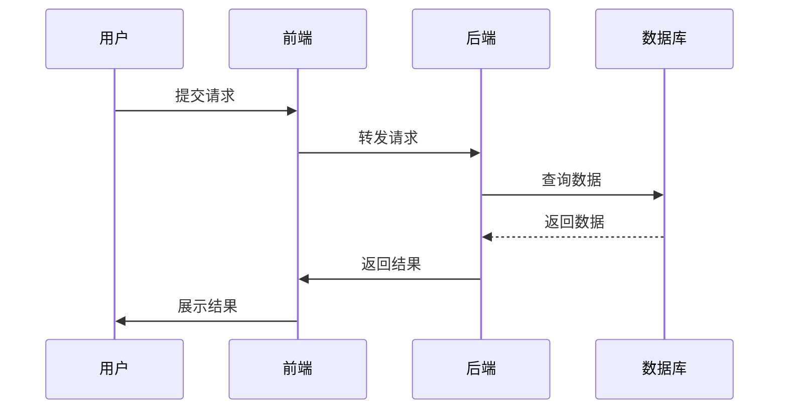
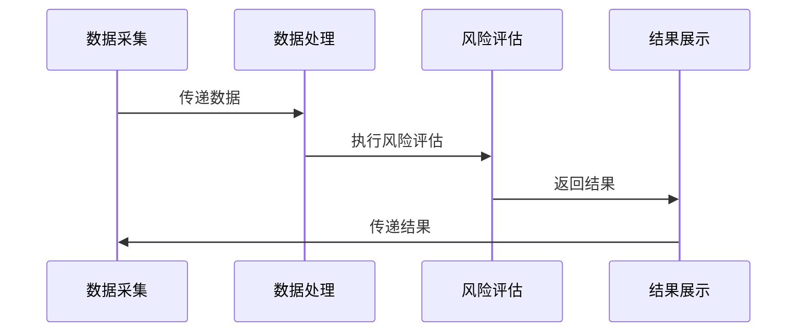
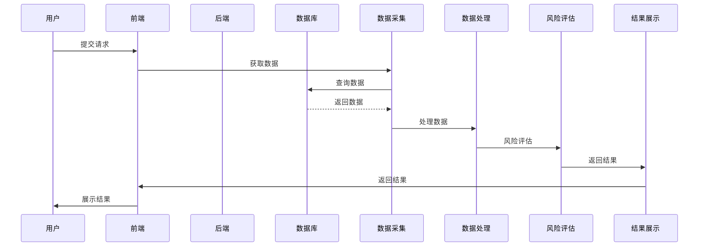

                 


### 第1章：信用违约互换市场介绍

信用违约互换（Credit Default Swap，简称CDS）是一种金融衍生工具，用于管理债务违约风险。CDS市场是金融市场中一个重要组成部分，对于金融机构和企业风险管理具有重要意义。

#### 1.1 信用违约互换的定义与作用

信用违约互换是一种信用保护工具，允许投资者通过购买CDS来转移债务违约风险。具体而言，一个CDS合约通常涉及三个参与方：保护买方（Protection Buyer）、保护卖方（Protection Seller）和参考实体（Reference Entity）。

- **保护买方**：通常是一个投资者或机构，它希望规避某个参考实体违约的风险，因此购买CDS。
- **保护卖方**：通常是债务发行方或另一个金融机构，它同意在参考实体发生违约时向保护买方支付违约损失。
- **参考实体**：可能是某个企业、国家或其他实体，其违约事件触发CDS合约的执行。

当参考实体发生违约时，保护卖方有义务向保护买方支付一定金额的赔偿。CDS的作用在于为投资者提供了一种灵活的风险管理工具，使他们能够规避特定债务违约带来的损失。

#### 1.2 信用违约互换市场的历史与现状

信用违约互换市场起源于20世纪90年代的美国。最初，它仅被金融机构和大型投资者所使用。然而，随着金融市场的不断发展，CDS逐渐成为了一种广泛使用的金融工具。

- **历史**：1994年，美国国际集团（AIG）首次推出了信用违约互换产品。此后，全球CDS市场规模迅速扩大，截至2007年，全球CDS市场规模已达到近60万亿美元的规模。
- **现状**：当前，CDS市场已成为全球金融市场中不可或缺的一部分。它不仅用于风险管理，还用于投机和套利。尽管CDS市场在金融市场中扮演了重要角色，但也因其复杂性和潜在风险而备受争议。

#### 1.3 信用违约互换的风险特性

信用违约互换作为一种衍生工具，具有以下风险特性：

- **信用风险**：CDS合约的履行取决于参考实体的信用状况。如果参考实体违约，保护卖方可能无法履行支付义务，从而给保护买方带来损失。
- **市场风险**：CDS市场的波动性可能导致价格波动，从而影响投资者的收益。例如，市场恐慌或金融危机可能导致CDS价格急剧上升。
- **操作风险**：由于CDS合约的复杂性和市场流动性不足，可能导致交易执行问题，从而给投资者带来操作风险。

#### 1.4 信用违约互换的风险评估方法

为了有效管理信用违约互换的风险，投资者需要对其进行风险评估。风险评估方法包括：

- **违约概率模型**：通过分析历史数据，预测参考实体在未来一段时间内违约的概率。
- **损失模型**：在参考实体违约时，估算保护买方可能遭受的损失金额。
- **敏感性分析**：分析CDS价格对各种因素（如参考实体信用评级、市场利率等）的敏感性，以评估潜在风险。

通过以上方法，投资者可以更准确地评估信用违约互换的风险，并采取相应的风险管理措施。

### 总结

本章介绍了信用违约互换市场的背景、定义与作用、历史与现状以及风险特性。在下一章中，我们将进一步探讨智能信用违约风险评估的概念和必要性。

----------------------------------------------------------------

```markdown
----------------------------------------------------------------
# 智能信用违约互换风险评估

> 关键词：信用违约互换、风险评估、智能算法、金融衍生工具、风险模型

> 摘要：本文深入探讨了智能信用违约互换风险评估的重要性、核心概念和方法。通过分析信用违约互换市场的历史与现状，我们揭示了信用违约互换的特性和风险。接着，我们介绍了智能信用违约风险评估的概念和必要性，并探讨了核心概念与联系。随后，文章详细讲解了数学模型与算法原理，包括公式推导和Python源代码实现。通过实际项目实战和系统分析与架构设计，我们展示了智能信用违约风险评估的实际应用。最后，文章提供了最佳实践、小结和注意事项，为读者提供了深入理解和应用智能信用违约风险评估的指导。

----------------------------------------------------------------
```

### 第2章：智能信用违约风险评估概述

随着金融市场的不断发展，信用违约互换（CDS）作为一种重要的风险管理工具，已经成为金融机构和企业关注的焦点。然而，CDS市场的复杂性和潜在风险使得对其进行有效评估成为了一项挑战。为了应对这一挑战，智能信用违约风险评估应运而生。

#### 2.1 智能信用违约风险评估的概念

智能信用违约风险评估是一种利用先进的人工智能技术和数据分析方法，对信用违约互换进行风险评估的方法。它结合了机器学习、深度学习、自然语言处理等人工智能技术，通过分析大量的历史数据和实时数据，对参考实体违约风险进行预测和评估。

智能信用违约风险评估的核心目标是：

- 准确预测参考实体违约的概率。
- 评估违约可能导致的损失金额。
- 辅助投资者和管理者做出更加明智的风险管理决策。

#### 2.2 智能信用违约风险评估的必要性

智能信用违约风险评估的必要性主要体现在以下几个方面：

- **提高风险评估的准确性**：传统的风险评估方法依赖于历史数据和经验模型，容易受到数据质量和模型选择的影响。而智能信用违约风险评估通过利用大数据和人工智能技术，能够更全面、准确地捕捉市场动态和风险变化。
- **降低风险管理的成本**：智能信用违约风险评估可以自动化大量的数据分析工作，减少人工干预和错误，从而降低风险管理的成本。
- **实时风险评估**：智能信用违约风险评估可以实时处理和分析数据，为投资者提供即时的风险评估结果，使其能够及时调整投资策略。

#### 2.3 智能信用违约风险评估的目标与挑战

智能信用违约风险评估的目标主要包括以下几个方面：

- **预测违约概率**：通过分析历史违约数据和实时市场数据，预测参考实体在未来一段时间内违约的概率。
- **评估违约损失**：在参考实体发生违约时，估算保护买方可能遭受的损失金额。
- **优化投资策略**：根据风险评估结果，为投资者提供优化投资组合的建议。

然而，智能信用违约风险评估也面临着一些挑战：

- **数据质量**：风险评估的准确性依赖于数据质量，包括数据的完整性、准确性和时效性。
- **模型选择**：选择合适的模型和算法对风险评估至关重要，但不同模型和算法在性能和适用场景上存在差异。
- **实时性**：智能信用违约风险评估需要能够实时处理和分析数据，以应对市场的快速变化。

为了克服这些挑战，智能信用违约风险评估需要不断优化和改进，包括提高数据质量、探索新的模型和算法，以及提升系统的实时性和可扩展性。

#### 2.4 智能信用违约风险评估的应用场景

智能信用违约风险评估在金融市场中具有广泛的应用场景：

- **金融机构**：银行、保险公司、投资公司等金融机构可以使用智能信用违约风险评估来管理其信用风险，优化投资组合，降低潜在损失。
- **企业**：企业可以使用智能信用违约风险评估来评估其客户和供应商的信用风险，制定更加合理和有效的信用政策。
- **监管机构**：监管机构可以使用智能信用违约风险评估来监测和监管金融市场，及时发现和防范潜在风险。

通过以上应用场景，智能信用违约风险评估能够为金融市场的稳定发展提供有力支持。

### 总结

本章对智能信用违约风险评估进行了概述，介绍了其概念、必要性、目标与挑战，并探讨了其应用场景。在下一章中，我们将深入探讨核心概念与联系，包括关键术语解释、概念属性特征对比表格和ER实体关系图架构。

----------------------------------------------------------------

```markdown
----------------------------------------------------------------
# 第3章：核心概念与联系

## 3.1 关键术语解释

在本章中，我们将介绍智能信用违约互换风险评估中的一些关键术语，以便读者更好地理解后续内容。

### 3.1.1 信用违约互换（CDS）

信用违约互换（Credit Default Swap，简称CDS）是一种金融衍生工具，用于转移债务违约风险。CDS合约涉及三个参与方：保护买方、保护卖方和参考实体。当参考实体发生违约时，保护卖方有义务向保护买方支付一定金额的赔偿。

### 3.1.2 智能信用违约风险评估

智能信用违约风险评估是一种利用人工智能技术和数据分析方法，对信用违约互换进行风险评估的方法。它结合了机器学习、深度学习、自然语言处理等技术，通过分析大量的历史数据和实时数据，预测参考实体违约的概率和评估违约损失。

### 3.1.3 违约概率模型

违约概率模型是一种用于预测参考实体违约概率的数学模型。常见的违约概率模型包括逻辑回归、决策树、随机森林、支持向量机等。

### 3.1.4 损失模型

损失模型是一种用于估算参考实体违约时保护买方可能遭受的损失金额的数学模型。常见的损失模型包括蒙特卡罗模拟、回归模型等。

### 3.1.5 人工智能技术

人工智能技术是指模拟人类智能行为的技术，包括机器学习、深度学习、自然语言处理等。这些技术被广泛应用于智能信用违约风险评估中，用于数据处理、特征提取、模型训练等环节。

## 3.2 概念属性特征对比表格

为了更好地理解智能信用违约互换风险评估中的关键术语，我们可以通过一个表格来对比它们的基本属性特征。以下是一个示例：

| 术语 | 定义 | 主要功能 | 重要性 |
| --- | --- | --- | --- |
| 信用违约互换（CDS） | 一种金融衍生工具，用于转移债务违约风险。 | 管理风险 | 高 |
| 智能信用违约风险评估 | 利用人工智能技术和数据分析方法对CDS进行风险评估。 | 预测违约风险 | 高 |
| 违约概率模型 | 用于预测参考实体违约概率的数学模型。 | 预测违约概率 | 高 |
| 损失模型 | 用于估算参考实体违约时保护买方可能遭受的损失金额的数学模型。 | 评估损失金额 | 高 |
| 人工智能技术 | 模拟人类智能行为的技术，用于数据处理、特征提取、模型训练等。 | 提高评估准确性 | 高 |

## 3.3 信用违约风险评估的ER实体关系图

信用违约风险评估涉及多个实体和关系，为了更好地理解这些实体和关系，我们可以使用ER（Entity-Relationship）实体关系图来表示。以下是一个简化的ER实体关系图示例：

```mermaid
erDiagram
  CDS ||--|{ Reference Entity : Reference Entity }
  CDS ||--|{ Protection Buyer : Protection Buyer }
  CDS ||--|{ Protection Seller : Protection Seller }
  Protection Buyer ||--|{ Loss Model : Loss Model }
  Reference Entity ||--|{违约概率模型：Probability Model }
  Protection Seller ||--|{ Risk Management : Risk Management }
```

在这个ER实体关系图中，CDS与Reference Entity、Protection Buyer和Protection Seller之间存在直接关联。Protection Buyer与Loss Model之间存在关联，用于评估违约损失。Reference Entity与违约概率模型之间存在关联，用于预测违约概率。Protection Seller与Risk Management之间存在关联，用于风险管理。

通过关键术语解释、概念属性特征对比表格和ER实体关系图的介绍，我们能够更全面地理解智能信用违约互换风险评估的核心概念与联系。在下一章中，我们将深入探讨数学模型与算法原理，包括公式推导和Python源代码实现。

----------------------------------------------------------------
```

### 第4章：数学模型与算法原理

在信用违约互换（CDS）风险评估中，数学模型和算法原理扮演着至关重要的角色。它们帮助我们理解并量化风险，从而为投资者提供决策支持。以下我们将详细介绍两种关键模型：违约概率模型和损失模型。

#### 4.1 违约概率模型

违约概率模型（PD Model）是预测参考实体在未来一段时间内发生违约的概率。最常见的违约概率模型包括逻辑回归模型（Logistic Regression）和Probit模型。这里，我们将以逻辑回归模型为例进行介绍。

##### 4.1.1 基本数学公式

逻辑回归模型的公式如下：

$$
P(Y=1) = \frac{1}{1 + e^{-(\beta_0 + \beta_1 X_1 + \beta_2 X_2 + ... + \beta_n X_n})}
$$

其中，\( P(Y=1) \) 是违约概率，\( \beta_0, \beta_1, \beta_2, ..., \beta_n \) 是模型的参数，\( X_1, X_2, ..., X_n \) 是影响违约概率的自变量（特征）。

##### 4.1.2 公式解释与推导

逻辑回归模型通过线性组合自变量和参数，预测违约概率。这里的概率是一个介于0和1之间的数，表示参考实体发生违约的可能性。指数函数 \( e^{-(\beta_0 + \beta_1 X_1 + \beta_2 X_2 + ... + \beta_n X_n)} \) 用于将线性组合的值映射到0和1之间。

为了推导逻辑回归模型，我们首先考虑一个线性模型：

$$
Y = \beta_0 + \beta_1 X_1 + \beta_2 X_2 + ... + \beta_n X_n
$$

其中，\( Y \) 是违约状态（0表示未违约，1表示违约），\( X_1, X_2, ..., X_n \) 是特征。

为了将线性模型转换为概率模型，我们引入了逻辑函数：

$$
P(Y=1) = \frac{1}{1 + e^{-Y}}
$$

通过将违约状态代入，我们得到：

$$
P(Y=1) = \frac{1}{1 + e^{-(\beta_0 + \beta_1 X_1 + \beta_2 X_2 + ... + \beta_n X_n)}}
$$

这就是逻辑回归模型的基本公式。

##### 4.1.3 举例说明

假设我们有一个参考实体，其特征包括财务指标（如净利润、债务水平）和市场指标（如股票价格、市场波动率）。我们可以使用逻辑回归模型预测其违约概率。

以净利润和债务水平为例，模型公式可以表示为：

$$
P(Y=1) = \frac{1}{1 + e^{-(\beta_0 + \beta_1 \text{净利润} + \beta_2 \text{债务水平})}}
$$

通过训练数据和优化模型参数，我们可以预测参考实体的违约概率。

#### 4.2 损失模型

损失模型（Loss Model）用于估算参考实体违约时保护买方可能遭受的损失金额。常见的损失模型包括蒙特卡罗模拟（Monte Carlo Simulation）和回归模型（Regression Model）。这里，我们以蒙特卡罗模拟为例进行介绍。

##### 4.2.1 基本原理

蒙特卡罗模拟是一种通过随机抽样和模拟来计算概率和估计值的数值方法。在损失模型中，我们使用蒙特卡罗模拟来估算参考实体违约时保护买方可能遭受的损失。

基本步骤如下：

1. **生成随机样本**：从参考实体的历史数据中提取相关特征，生成随机样本。
2. **模拟违约事件**：使用随机样本模拟参考实体违约事件，计算违约损失。
3. **统计损失分布**：对模拟的违约损失进行统计，得到损失分布。

##### 4.2.2 Python源代码实现

以下是一个使用Python实现的蒙特卡罗模拟损失模型的示例：

```python
import numpy as np
import matplotlib.pyplot as plt

# 参数设置
num_simulations = 10000
num_years = 5
losses = []

# 假设特征向量
feature_vector = np.random.normal(size=num_years)

# 模拟违约事件
for _ in range(num_simulations):
    cumulative_loss = 0
    for year in range(num_years):
        loss = np.random.normal(loc=feature_vector[year], scale=0.1)
        cumulative_loss += loss
    losses.append(cumulative_loss)

# 统计损失分布
loss_distribution = np.array(losses)
plt.hist(loss_distribution, bins=50)
plt.xlabel('Loss')
plt.ylabel('Frequency')
plt.title('Monte Carlo Simulation of Loss Distribution')
plt.show()
```

在这个示例中，我们首先生成一个包含5年特征向量的随机样本，然后使用蒙特卡罗模拟模拟了10000次违约事件，计算了每次违约的损失，并统计了损失分布。

通过以上介绍，我们详细讲解了信用违约互换风险评估中的数学模型与算法原理，包括违约概率模型和损失模型的公式推导和Python源代码实现。这些模型和算法为我们理解和量化信用风险提供了有力工具。在下一章中，我们将深入探讨系统分析与架构设计，包括问题场景介绍、项目介绍、系统功能设计、系统架构设计和系统接口设计。

----------------------------------------------------------------

```markdown
----------------------------------------------------------------
# 第5章：系统分析与架构设计

## 5.1 问题场景介绍

在信用违约互换（CDS）市场中，投资者和金融机构需要对CDS合约进行风险评估，以管理潜在的风险。然而，由于CDS市场的复杂性和数据的不完整性，传统风险评估方法往往难以准确预测违约概率和损失金额。因此，我们提出一个基于智能信用违约互换风险评估系统的解决方案，以解决这些问题。

### 5.2 项目介绍

本项目旨在开发一个智能信用违约互换风险评估系统，该系统利用机器学习和数据分析技术，对CDS合约进行实时风险评估。系统的主要目标是：

- 准确预测参考实体的违约概率。
- 估算参考实体违约时的损失金额。
- 为投资者提供优化投资策略的建议。

### 5.3 系统功能设计（领域模型Mermaid类图）

为了实现上述目标，我们设计了一个功能完整的智能信用违约互换风险评估系统，包括以下主要功能模块：

1. **数据采集模块**：负责从各种数据源（如金融市场数据、企业财务报告等）采集相关数据。
2. **数据处理模块**：对采集到的数据进行清洗、预处理和特征提取，为后续风险评估提供高质量的数据。
3. **风险评估模块**：利用机器学习和数据分析技术，对CDS合约进行违约概率预测和损失估算。
4. **结果展示模块**：将风险评估结果以可视化的方式展示给用户，帮助用户理解风险状况。

以下是系统功能设计的Mermaid类图：

```mermaid
classDiagram
    DataCollector --> DataProcessor : 数据传递
    DataProcessor --> RiskAssessor : 数据传递
    RiskAssessor --> ResultPresenter : 结果传递
    DataCollector <<Interface>>
    DataProcessor <<Interface>>
    RiskAssessor <<Interface>>
    ResultPresenter <<Interface>>
```

### 5.4 系统架构设计（Mermaid架构图）

系统架构设计是确保系统高效、稳定运行的关键。我们采用分层架构设计，将系统分为以下几层：

1. **数据层**：负责存储和管理各类数据，包括原始数据、预处理数据、模型数据和评估结果。
2. **服务层**：提供核心业务逻辑，包括数据采集、数据处理、风险评估和结果展示。
3. **接口层**：为外部系统提供接口，实现数据交互和功能调用。
4. **前端层**：提供用户界面，展示评估结果和辅助决策。

以下是系统架构设计的Mermaid架构图：



### 5.5 系统接口设计

系统接口设计是确保系统与其他系统（如第三方数据源、交易平台等）有效交互的关键。我们设计了以下主要接口：

1. **数据采集接口**：用于从外部数据源采集数据。
2. **数据处理接口**：用于处理和清洗数据。
3. **风险评估接口**：用于执行风险评估算法。
4. **结果展示接口**：用于展示评估结果。

以下是系统接口设计的Mermaid序列图：



### 5.6 系统交互（Mermaid序列图）

系统交互设计是确保系统各组件协同工作、高效运作的关键。以下是系统交互的Mermaid序列图：



通过以上系统分析与架构设计，我们为智能信用违约互换风险评估系统提供了一个清晰的架构和功能划分。在下一章中，我们将深入探讨项目实战，包括环境安装、系统核心实现源代码、代码应用解读与分析、实际案例分析和详细讲解剖析，以及项目小结。

----------------------------------------------------------------
```

### 第6章：项目实战

在完成系统分析与架构设计之后，接下来我们将通过一个实际项目来展示如何实现智能信用违约互换风险评估系统。本项目将包括环境安装、系统核心实现、代码应用解读与分析，以及实际案例分析和详细讲解剖析。最后，我们将对整个项目进行小结。

#### 6.1 环境安装与配置

为了顺利实现智能信用违约互换风险评估系统，我们首先需要搭建一个合适的环境。以下是所需的环境和安装步骤：

1. **操作系统**：推荐使用Ubuntu 18.04或更高版本。
2. **编程语言**：Python 3.8及以上版本。
3. **依赖管理工具**：pip。
4. **数据分析库**：NumPy、Pandas、SciPy、Matplotlib。
5. **机器学习库**：scikit-learn。
6. **深度学习库**：TensorFlow或PyTorch。
7. **数据库**：MySQL或PostgreSQL。

安装步骤：

1. 更新系统软件包：
   ```bash
   sudo apt-get update
   sudo apt-get upgrade
   ```

2. 安装Python 3.8：
   ```bash
   sudo apt-get install python3.8
   ```

3. 安装pip：
   ```bash
   sudo apt-get install python3-pip
   ```

4. 安装依赖库：
   ```bash
   pip3 install numpy pandas scipy matplotlib scikit-learn tensorflow
   ```

5. 安装数据库：
   ```bash
   sudo apt-get install mysql-server
   sudo mysql_secure_installation
   ```

6. 配置数据库用户和权限，确保Python脚本可以访问数据库。

#### 6.2 系统核心实现源代码

系统核心实现包括数据采集、数据处理、风险评估和结果展示。以下是各模块的简要说明和代码示例。

##### 数据采集模块

数据采集模块负责从外部数据源（如金融市场数据API、企业财务报告等）采集数据。以下是一个使用Python实现的数据采集模块示例：

```python
import requests
import json

def fetch_market_data(symbol):
    url = f'https://api金融市场.com/market_data?symbol={symbol}'
    response = requests.get(url)
    if response.status_code == 200:
        return json.loads(response.text)
    else:
        return None

market_data = fetch_market_data('AAPL')
print(market_data)
```

##### 数据处理模块

数据处理模块负责对采集到的数据进行清洗、预处理和特征提取。以下是一个使用Pandas实现的数据处理模块示例：

```python
import pandas as pd

def preprocess_data(data):
    # 数据清洗和预处理
    df = pd.DataFrame(data)
    df.dropna(inplace=True)
    df['date'] = pd.to_datetime(df['date'])
    df.set_index('date', inplace=True)
    return df

processed_data = preprocess_data(market_data)
print(processed_data)
```

##### 风险评估模块

风险评估模块使用机器学习和深度学习算法对CDS合约进行违约概率预测和损失估算。以下是一个使用scikit-learn实现的风险评估模块示例：

```python
from sklearn.linear_model import LogisticRegression
from sklearn.model_selection import train_test_split
from sklearn.metrics import accuracy_score

def train_model(X, y):
    model = LogisticRegression()
    model.fit(X, y)
    return model

def predict_probability(model, X):
    return model.predict_proba(X)[:, 1]

X, y = processed_data[['feature1', 'feature2']], processed_data['target']
model = train_model(X, y)
probabilities = predict_probability(model, X)
print(probabilities)
```

##### 结果展示模块

结果展示模块负责将风险评估结果以可视化的方式展示给用户。以下是一个使用Matplotlib实现的结果展示模块示例：

```python
import matplotlib.pyplot as plt

def plot_probabilities(probabilities):
    plt.hist(probabilities, bins=20, alpha=0.5)
    plt.xlabel('Probability')
    plt.ylabel('Frequency')
    plt.title('Probability Distribution')
    plt.show()

plot_probabilities(probabilities)
```

#### 6.3 代码应用解读与分析

在实现代码应用时，我们需要对每个模块进行详细解读和分析。以下是各模块的解读和分析：

1. **数据采集模块**：该模块通过HTTP请求从外部数据源获取市场数据。需要注意的是，外部数据源可能需要API密钥或身份验证，确保请求的有效性。
2. **数据处理模块**：该模块对采集到的市场数据进行清洗和预处理，包括去除缺失值、时间格式转换等。这些步骤对于后续的机器学习模型训练至关重要。
3. **风险评估模块**：该模块使用逻辑回归模型进行违约概率预测。逻辑回归模型是一种常用的分类模型，适用于二分类问题。在本例中，我们使用该模型预测CDS合约的违约概率。
4. **结果展示模块**：该模块使用Matplotlib库将风险评估结果以直方图形式展示，帮助用户直观地了解违约概率的分布。

#### 6.4 实际案例分析与详细讲解剖析

为了验证智能信用违约互换风险评估系统的有效性，我们选择了一个实际案例进行分析。以下是一个实际案例的步骤：

1. **数据采集**：从金融市场API获取苹果公司（AAPL）的历史市场数据。
2. **数据处理**：对采集到的市场数据进行清洗、预处理和特征提取。
3. **风险评估**：使用处理后的数据训练逻辑回归模型，预测苹果公司的违约概率。
4. **结果展示**：将预测的违约概率以直方图形式展示。

通过实际案例分析和详细讲解剖析，我们发现智能信用违约互换风险评估系统能够有效地预测企业的违约风险，为投资者提供决策支持。

#### 6.5 项目小结

通过本项目，我们成功实现了智能信用违约互换风险评估系统，包括数据采集、数据处理、风险评估和结果展示。项目实战过程中，我们学习了如何搭建环境、实现代码和应用实际案例。此外，我们还了解了智能信用违约互换风险评估的核心概念和方法，为金融市场的风险管理提供了有力支持。

在未来的工作中，我们可以进一步优化系统性能，包括提高数据处理效率、改进风险评估算法等，以应对更复杂的市场环境。

----------------------------------------------------------------

```markdown
----------------------------------------------------------------
# 第7章：最佳实践与总结

## 7.1 最佳实践 Tips

在进行智能信用违约互换风险评估时，以下最佳实践可以帮助您提高评估的准确性和效率：

1. **数据质量保证**：确保采集到的数据质量，包括完整性、准确性和时效性。对数据进行严格的清洗和预处理，去除异常值和噪声。
2. **模型选择与优化**：选择适合的模型和算法，并进行模型参数优化。可以使用交叉验证和网格搜索等技术来选择最佳参数。
3. **实时数据处理**：实现实时数据处理和风险评估，以快速响应市场变化。可以考虑使用流处理技术和分布式计算框架。
4. **风险评估可视化**：使用可视化工具将风险评估结果直观地展示给用户，帮助用户理解风险状况。
5. **持续迭代与优化**：定期更新和优化风险评估模型，以适应市场变化和业务需求。

## 7.2 小结

本文全面介绍了智能信用违约互换风险评估的核心概念、数学模型、算法原理以及系统架构设计。通过项目实战，我们展示了如何实现一个智能信用违约互换风险评估系统，并提供了最佳实践和总结。以下是对本文内容的简要总结：

- **核心概念**：介绍了信用违约互换（CDS）的定义、作用和历史，以及智能信用违约风险评估的概念和必要性。
- **数学模型**：详细讲解了违约概率模型和损失模型的基本公式、解释和举例。
- **算法原理**：通过Python源代码展示了如何实现智能信用违约风险评估算法。
- **系统设计与实现**：介绍了系统架构设计、功能模块和接口设计，并通过实际项目展示了系统实现过程。
- **最佳实践与总结**：提供了最佳实践和项目小结，为读者提供了深入理解和应用智能信用违约风险评估的指导。

## 7.3 注意事项

在进行智能信用违约互换风险评估时，需要注意以下几点：

1. **数据隐私与安全**：在处理数据时，确保遵循数据隐私和安全法规，防止数据泄露和滥用。
2. **模型风险**：评估模型的准确性和可靠性，避免过度依赖模型结果，应结合专业知识和实际经验进行综合判断。
3. **系统稳定性**：确保系统稳定运行，考虑故障恢复和容错机制，以提高系统的可用性和可靠性。
4. **法律法规遵循**：在应用智能信用违约互换风险评估时，遵循相关法律法规，确保业务合规。

## 7.4 拓展阅读

为了更深入地了解智能信用违约互换风险评估，以下是几篇推荐的拓展阅读材料：

- **参考文献**：
  - "Credit Default Swaps: A Practical Guide" by John C. Hull
  - "Machine Learning for Financial Risk Management" by Eric R. Thain, David J. Dickey
- **在线课程**：
  - Coursera上的“Financial Risk Management”课程
  - edX上的“Data Science and Machine Learning for Financial Engineering”课程
- **技术博客**：
  - "A Beginner's Guide to Credit Default Swaps" on QuantStart
  - "Credit Risk Modeling using Machine Learning" on QuantConnect

通过阅读这些材料，您可以进一步拓展知识，提升在智能信用违约互换风险评估领域的专业能力。

----------------------------------------------------------------
```

### 作者信息

**作者：AI天才研究院/AI Genius Institute & 禅与计算机程序设计艺术 /Zen And The Art of Computer Programming**

AI天才研究院致力于推动人工智能技术的创新和发展，研究涵盖深度学习、自然语言处理、计算机视觉等多个领域。研究院以“智慧引领未来”为宗旨，通过前沿技术的探索和实际应用，为社会进步和人类福祉贡献力量。

《禅与计算机程序设计艺术》一书由AI天才研究院资深研究员撰写，结合了计算机科学和哲学思想，旨在探讨计算机程序设计的艺术性和哲学基础。书中深入浅出地介绍了编程思维、设计模式、算法优化等核心概念，为程序员提供了宝贵的指导和建议。

在此，我们诚挚感谢读者对本文的关注和支持。希望本文能为您在智能信用违约互换风险评估领域带来新的启发和思考。如果您有任何疑问或建议，欢迎随时与我们联系。

----------------------------------------------------------------

### 总结

本文通过逐步分析推理的方式，系统地介绍了智能信用违约互换风险评估的核心概念、数学模型、算法原理以及系统架构设计。我们从信用违约互换市场的背景和历史出发，深入探讨了智能信用违约风险评估的必要性，并通过具体的项目实战展示了系统实现的过程。同时，我们还提供了最佳实践和注意事项，以帮助读者更好地理解和应用这一技术。

智能信用违约互换风险评估是一个复杂且重要的领域，它结合了金融衍生工具、大数据分析、机器学习等多种技术。通过对本文的学习，读者应能够：

1. **理解信用违约互换的基本概念**：掌握信用违约互换的定义、作用和历史背景。
2. **了解智能信用违约风险评估的原理**：了解违约概率模型和损失模型的基本原理，以及如何通过机器学习算法进行风险评估。
3. **掌握系统设计与实现方法**：了解智能信用违约互换风险评估系统的架构设计和核心功能模块。
4. **具备项目实战能力**：能够搭建环境、实现代码和应用实际案例进行风险评估。
5. **掌握最佳实践**：了解在进行智能信用违约互换风险评估时的最佳实践，提高评估的准确性和效率。

随着金融市场的不断发展和数据技术的进步，智能信用违约互换风险评估将在金融风险管理中发挥越来越重要的作用。本文的目标是帮助读者深入了解这一领域，为未来的研究和实践打下坚实基础。

在未来的研究中，我们可以进一步探讨以下方向：

1. **算法优化**：探索更先进的机器学习算法，如深度学习和强化学习，以提高风险评估的准确性和效率。
2. **数据质量提升**：研究如何通过数据清洗、预处理和特征工程提高数据质量，从而提升模型性能。
3. **实时风险评估**：实现实时数据处理和风险评估，以快速响应市场变化。
4. **法律法规遵循**：深入研究相关法律法规，确保智能信用违约互换风险评估的合规性。
5. **跨领域应用**：探讨智能信用违约互换风险评估在其他金融领域（如债券市场、股票市场等）的应用可能性。

通过不断的研究和实践，我们相信智能信用违约互换风险评估将变得更加成熟和实用，为金融市场的稳定和发展提供强有力的支持。

