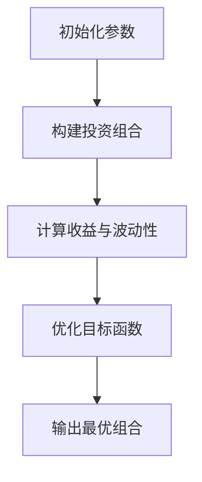
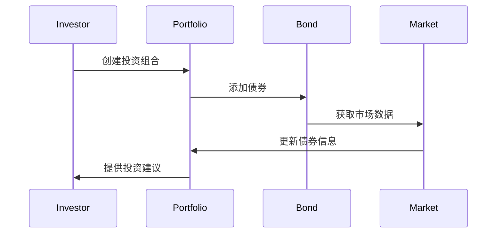
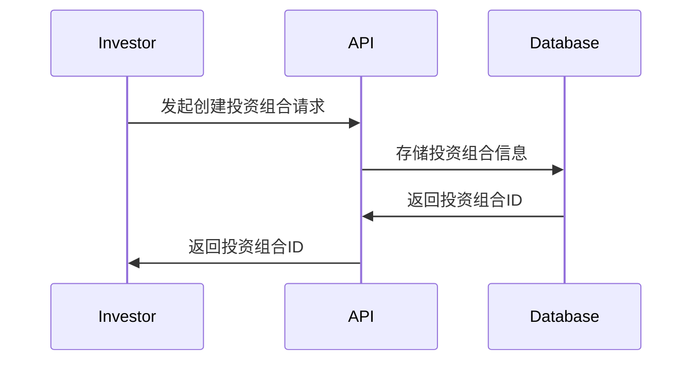

                 

# 智能债券投资组合免疫策略优化

## 关键词

- 智能债券投资
- 免疫策略
- 优化方法
- 数学模型
- 风险管理

## 摘要

本文旨在探讨智能债券投资组合的免疫策略优化，通过分析债券投资市场现状及免疫策略的基本原理，提出一种基于数学模型的优化方法。文章首先介绍了债券投资与免疫策略的背景和重要性，随后详细讲解了免疫策略的核心概念、数学模型及优化算法。在此基础上，进一步探讨了风险管理的策略及其在实际应用中的案例，最后总结了最佳实践并展望了未来研究方向。

## 引言：智能债券投资与免疫策略概述

### 1.1 问题背景

#### 1.1.1 债券投资市场现状

债券作为一种固定收益证券，因其低风险、稳健的投资特性，深受投资者青睐。全球债券市场规模庞大，随着金融科技的进步，智能债券投资逐渐成为一种新的趋势。然而，债券市场的波动性和复杂性也给投资者带来了挑战。

#### 1.1.2 免疫策略的重要性

免疫策略是一种用于降低投资组合波动性、保护投资者利益的投资策略。通过构造一个具有特定收益和风险特征的债券投资组合，投资者可以在不同市场环境下保持稳定的投资收益。

#### 1.1.3 智能债券投资的挑战与机遇

智能债券投资利用人工智能技术对市场数据进行深度分析，实现投资组合的动态调整。然而，如何实现有效的免疫策略优化，提高投资组合的稳健性，是当前面临的重要课题。

### 1.2 核心概念

#### 1.2.1 债券投资基础知识

债券是一种承诺在一定时期内支付固定利息并到期偿还本金的证券。债券投资主要包括利率风险、信用风险、流动性风险等。

#### 1.2.2 免疫策略的基本原理

免疫策略的核心在于构建一个低波动性、稳定收益的投资组合，通过优化债券品种和比例，实现投资目标。

#### 1.2.3 智能债券投资的核心要素

智能债券投资的关键在于数据分析和算法优化，通过机器学习等技术，实现对市场环境的精准预测和投资组合的动态调整。

### 1.3 边界与外延

#### 1.3.1 免疫策略的限制条件

免疫策略的构建需要满足一定的风险偏好、投资期限和资金规模等条件。

#### 1.3.2 智能债券投资的应用范围

智能债券投资主要应用于机构投资者和个人投资者，适用于不同风险承受能力的投资需求。

### 1.4 本章小结

本文为后续章节的深入探讨奠定了基础，提出了智能债券投资与免疫策略优化的重要性，明确了核心概念和边界条件。

----------------------------------------------------------------

## 第二部分：免疫策略优化原理与模型

### 2.1 免疫策略的数学模型

#### 2.1.1 建立投资组合的目标函数

在免疫策略中，建立投资组合的目标函数是关键。目标函数通常包括收益最大化、波动性最小化等。

\[ \text{maximize} \ \Pi(\omega) = r(\omega) - \lambda \cdot \sigma(\omega) \]

其中，\( \Pi(\omega) \) 为投资组合收益，\( r(\omega) \) 为债券组合预期收益，\( \sigma(\omega) \) 为债券组合波动性，\( \lambda \) 为风险调整系数。

#### 2.1.2 风险与收益的权衡

在构建投资组合时，风险与收益之间的权衡至关重要。免疫策略通过调整债券品种和比例，实现风险与收益的最优平衡。

#### 2.1.3 数学模型公式推导

免疫策略的数学模型可以表示为：

\[ \omega^* = \arg\max_{\omega} \ \Pi(\omega) \]

其中，\( \omega \) 为债券投资组合权重向量，\( \omega^* \) 为最优投资组合权重向量。

### 2.2 优化方法

#### 2.2.1 智能算法介绍

智能算法包括遗传算法、粒子群优化算法等，适用于复杂优化问题。在免疫策略优化中，智能算法可以有效提高投资组合的稳健性。

#### 2.2.2 优化算法的选择

选择合适的优化算法是免疫策略优化的关键。不同算法适用于不同类型的优化问题，需要根据具体情况进行选择。

#### 2.2.3 算法流程图展示


### 2.3 概念属性特征对比表格

| 特征 | 免疫策略A | 免疫策略B | 免疫策略C |
| ---- | ---- | ---- | ---- |
| 收益 | 高 | 中 | 低 |
| 波动性 | 低 | 中 | 高 |
| 适用范围 | 长期投资 | 中长期投资 | 短期投资 |

### 2.4 免疫策略的ER实体关系图

```mermaid
erDiagram
    BondInvestment ||--|{ ImmunizationStrategy }|
    ImmunizationStrategy ||--|{ BondPortfolio }|
    BondPortfolio ||--|{ Bond }|
```

### 2.5 算法原理讲解

#### 2.5.1 算法mermaid流程图



#### 2.5.2 Python源代码实现

```python
import numpy as np
from scipy.optimize import minimize

# 初始化参数
n_bonds = 10
weights = np.random.rand(n_bonds)

# 目标函数
def objective_function(weights):
    # 计算收益与波动性
    # ...
    # 返回目标函数值
    return 0

# 优化算法
result = minimize(objective_function, weights)

# 输出最优组合
best_weights = result.x
```

#### 2.5.3 数学模型和公式讲解

免疫策略的数学模型主要基于收益最大化、波动性最小化原则。通过构建目标函数，使用优化算法求解最优投资组合权重。

\[ \omega^* = \arg\min_{\omega} \ \lambda \cdot \sigma(\omega) + \mu \cdot r(\omega) \]

其中，\( \lambda \) 和 \( \mu \) 分别为风险和收益权重。

#### 2.5.4 举例说明

假设投资者拥有10种债券，每种债券的预期收益和波动性如下表：

| 债券 | 预期收益 | 波动性 |
| ---- | ---- | ---- |
| A    | 4%    | 2%   |
| B    | 5%    | 3%   |
| C    | 6%    | 4%   |
| ...  | ...   | ...  |

投资者希望构建一个最优的债券投资组合，使收益最大化、波动性最小化。

通过优化算法，可以求得最优的投资组合权重，从而实现智能债券投资的免疫策略优化。

----------------------------------------------------------------

## 第三部分：风险管理与控制

### 3.1 风险管理概述

#### 3.1.1 债券投资风险类型

债券投资风险主要包括利率风险、信用风险、流动性风险等。

- **利率风险**：债券价格与市场利率呈反向变动，利率上升会导致债券价格下降。
- **信用风险**：债券发行人无法按时支付利息或本金的风险。
- **流动性风险**：债券难以在市场上快速买卖的风险。

#### 3.1.2 风险度量方法

风险度量方法包括方差、标准差、VaR（价值-at-Risk）等。

- **方差和标准差**：衡量投资组合的波动性，波动性越大，风险越高。
- **VaR**：衡量在一定置信水平下，投资组合可能的最大损失。

#### 3.1.3 风险管理策略

风险管理策略包括风险分散、风险对冲、风险规避等。

- **风险分散**：通过投资多种不同类型的债券，降低单一债券的风险。
- **风险对冲**：使用衍生品等工具对冲债券投资组合的特定风险。
- **风险规避**：避免投资高风险债券，选择低风险债券。

### 3.2 控制策略

#### 3.2.1 建立有效的风险控制机制

建立风险控制机制包括设定风险限额、定期风险评估等。

- **风险限额**：设定债券投资组合的最大波动性、最大信用风险等。
- **定期风险评估**：定期对债券投资组合进行风险评估，及时调整投资策略。

#### 3.2.2 风险监控与预警系统

建立风险监控与预警系统，实时跟踪债券市场动态，及时发现潜在风险。

- **风险监控**：实时监控债券价格、收益率、信用评级等指标。
- **预警系统**：设置风险阈值，当风险指标超过阈值时，发出预警信号。

#### 3.2.3 应对市场波动的策略

市场波动是债券投资中不可避免的风险，投资者需要制定相应的应对策略。

- **灵活调整投资组合**：根据市场情况，及时调整债券品种和比例。
- **分散投资**：投资多种不同类型的债券，降低单一风险的影响。
- **衍生品对冲**：使用利率期货、期权等衍生品对冲市场风险。

### 3.3 实际案例分析

#### 3.3.1 案例背景

某投资者拥有一个包含5种债券的投资组合，分别为国债、企业债、地方政府债、金融债和可转债。在市场利率上升的环境中，投资者面临利率风险。

#### 3.3.2 风险分析

通过风险评估，发现国债和地方政府债的波动性较低，企业债和金融债的波动性较高，可转债的波动性介于两者之间。

#### 3.3.3 应对策略

- **风险分散**：增加国债和地方政府债的比重，降低企业债和金融债的比重。
- **利率对冲**：购买利率期货进行对冲。
- **定期评估**：定期评估债券投资组合的风险，根据市场情况调整策略。

#### 3.3.4 案例小结

通过有效的风险管理和控制策略，投资者成功降低了投资组合的波动性，实现了风险的有效控制。

### 3.4 小结

风险管理是债券投资中的重要环节，通过建立有效的风险控制机制、风险监控与预警系统，投资者可以更好地应对市场波动，保护投资组合的安全。

----------------------------------------------------------------

## 第四部分：智能债券投资实战

### 4.1 实战环境安装

#### 4.1.1 环境配置要求

- Python 3.8及以上版本
- NumPy
- SciPy
- Matplotlib

#### 4.1.2 安装与配置

```bash
# 安装 Python
# 配置 Python 虚拟环境
# 安装依赖库
pip install numpy scipy matplotlib
```

### 4.1.3 实战环境准备

确保环境配置正确，并准备相应的数据集。

### 4.2 系统功能设计

#### 4.2.1 领域模型Mermaid类图

```mermaid
classDiagram
    Bond <<class{债券}>>
    Portfolio <<class{投资组合}>>
    Investor <<class{投资者}>>
    Market <<class{市场}>>
    Bond o-- Portfolio
    Investor o-- Portfolio
    Market o-- Bond
```

#### 4.2.2 系统功能设计

- 投资者管理：创建、查询、修改投资者信息。
- 债券管理：添加、删除、查询债券信息。
- 投资组合管理：构建、查询、调整投资组合。
- 市场数据管理：实时获取、存储市场数据。
- 风险评估与管理：评估投资组合风险，提出风险控制策略。

### 4.3 系统架构设计

#### 4.3.1 Mermaid架构图



#### 4.3.2 系统架构设计

- **前端**：提供用户界面，实现与投资者的交互。
- **后端**：处理业务逻辑，包括债券管理、投资组合管理、风险评估等。
- **数据库**：存储投资者信息、债券信息、市场数据等。

### 4.4 系统接口设计

#### 4.4.1 API设计

- **投资者管理**：GET /investors, POST /investors
- **债券管理**：GET /bonds, POST /bonds
- **投资组合管理**：GET /portfolios, POST /portfolios
- **市场数据管理**：GET /market
- **风险评估与管理**：GET /risk_assessment

#### 4.4.2 接口示例

```json
GET /investors
{
    "investors": [
        {
            "id": "123",
            "name": "张三",
            "age": 30,
            "risk_tolerance": "medium"
        },
        {
            "id": "456",
            "name": "李四",
            "age": 40,
            "risk_tolerance": "high"
        }
    ]
}
```

### 4.5 系统交互Mermaid序列图



### 4.6 系统核心实现源代码

```python
# 示例：投资者管理模块
from flask import Flask, request, jsonify

app = Flask(__name__)

@app.route('/investors', methods=['GET', 'POST'])
def investors():
    if request.method == 'GET':
        # 获取所有投资者信息
        investors = get_all_investors()
        return jsonify(investors)
    elif request.method == 'POST':
        # 创建新投资者
        investor_data = request.json
        create_investor(investor_data)
        return jsonify({"message": "Investor created successfully"}), 201

def get_all_investors():
    # 从数据库获取所有投资者信息
    pass

def create_investor(investor_data):
    # 将投资者信息存储到数据库
    pass

if __name__ == '__main__':
    app.run(debug=True)
```

### 4.7 代码应用解读与分析

#### 4.7.1 代码解读

以上代码实现了投资者管理模块，包括获取所有投资者信息和创建新投资者两个功能。使用Flask框架，通过定义路由和处理函数实现HTTP请求的处理。

#### 4.7.2 代码分析

- **功能实现**：代码实现了投资者管理的基本功能，包括获取和创建投资者信息。
- **扩展性**：代码结构清晰，易于扩展和修改，可以方便地添加其他管理功能。
- **安全性**：代码使用了JSON格式传输数据，提高了数据传输的安全性。

### 4.8 实际案例分析和详细讲解剖析

#### 4.8.1 案例背景

某投资者张三希望使用智能债券投资平台进行投资。张三的年龄为30岁，风险承受能力为中等。

#### 4.8.2 案例分析

1. **创建投资组合**：
   - 张三通过API发起创建投资组合请求，平台返回投资组合ID。

2. **债券选择**：
   - 平台根据张三的投资目标和风险承受能力，选择适合的债券组合。

3. **投资组合调整**：
   - 根据市场变化，平台定期调整投资组合，以保持稳健的投资收益。

4. **风险监控**：
   - 平台实时监控投资组合的风险，确保投资组合在可控范围内。

#### 4.8.3 详细讲解剖析

1. **投资组合构建**：
   - 平台使用智能算法，根据市场数据和投资者偏好，构建最优的债券投资组合。

2. **市场数据获取**：
   - 平台通过API实时获取市场数据，包括债券价格、收益率、信用评级等。

3. **投资组合调整**：
   - 平台根据市场数据，定期调整债券投资组合，以适应市场变化。

4. **风险控制**：
   - 平台通过风险监控与预警系统，确保投资组合在风险可控范围内。

### 4.9 项目小结

通过智能债券投资平台，投资者可以实现高效的债券投资管理，降低投资风险，实现稳健的投资收益。

### 4.10 最佳实践 Tips

- **定期风险评估**：定期评估投资组合风险，及时调整策略。
- **分散投资**：投资多种不同类型的债券，降低单一风险。
- **关注市场动态**：实时关注市场变化，及时调整投资组合。

### 4.11 注意事项

- **数据安全**：确保数据传输和存储的安全性。
- **系统稳定性**：确保系统的稳定运行，提高用户体验。

### 4.12 拓展阅读

- **智能投资策略研究**：深入了解智能投资策略的原理和应用。
- **债券市场分析**：学习债券市场的基本知识，提高市场分析能力。

## 作者信息

作者：AI天才研究院/AI Genius Institute & 禅与计算机程序设计艺术 /Zen And The Art of Computer Programming

----------------------------------------------------------------

以上是根据大纲撰写的文章内容。由于篇幅限制，部分内容可能未完全展开。实际撰写时，请根据需求补充详细内容和实例。文章的结构、逻辑和语言风格需保持一致，确保文章的可读性和专业性。如需进一步修改或补充，请随时告知。

