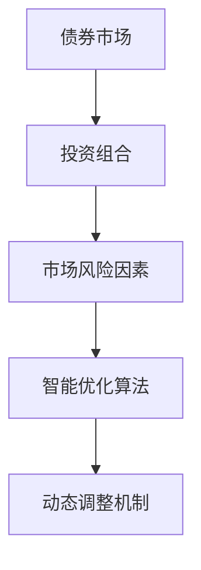
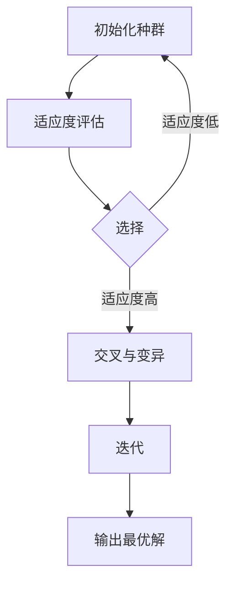
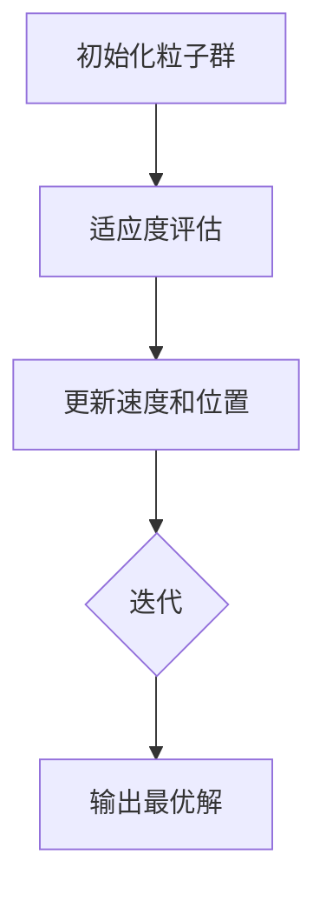
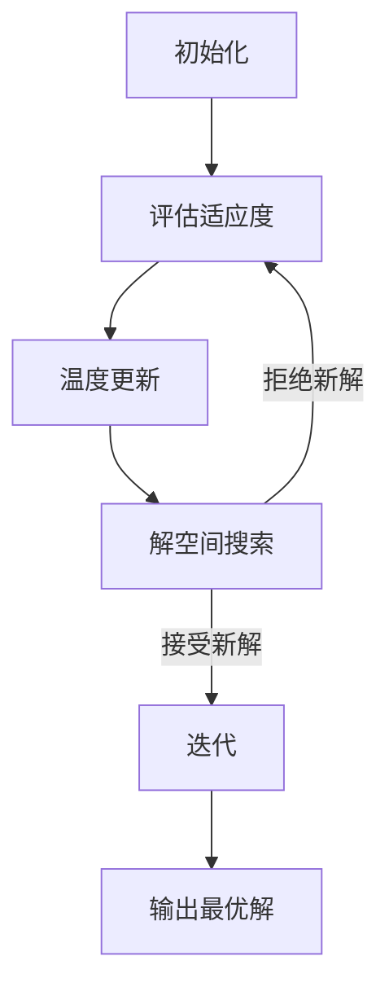
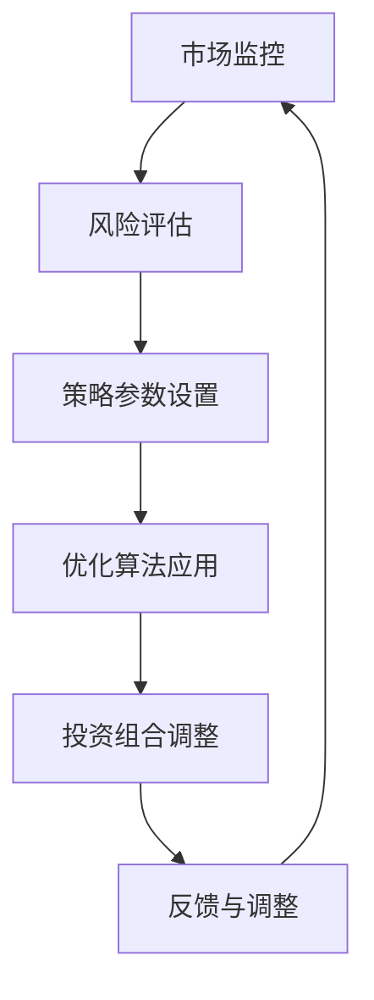

                 

### 第1章：智能债券投资与组合免疫策略概述

#### 1.1.1 问题背景

在金融市场中，债券投资是一种重要的资产配置方式，它以其较低的风险和相对稳定的收益吸引了众多投资者。然而，债券市场并非一成不变，市场利率的波动、信用风险的变动等因素都可能对债券投资组合产生重大影响。传统的债券投资策略往往难以在市场变化中保持组合的稳定性和收益性，这就促使了智能债券投资组合免疫策略的出现。

智能债券投资组合免疫策略是一种旨在降低债券投资组合系统性风险的策略。它通过动态优化，根据市场环境的变化及时调整投资组合，从而在一定程度上规避市场波动带来的风险。该策略的核心思想是，在保持投资组合相对稳定收益的同时，最大限度地减少风险暴露。

#### 1.1.2 问题描述

债券投资组合免疫策略的目标是在不同市场环境下，构建一个既能抵抗市场风险，又能保持较高收益的投资组合。然而，这一目标的实现面临着一系列挑战：

- **数据复杂性**：债券市场的数据多样且复杂，包括收益率、信用评级、流动性指标等，如何有效收集、处理这些数据是一个难题。
- **市场风险识别**：债券市场存在多种风险，如利率风险、信用风险、流动性风险等。如何准确识别和评估这些风险，是实施免疫策略的关键。
- **优化算法选择**：智能优化算法的选择和参数设置直接影响到投资组合的优化效果。如何选择适合的算法，以及如何调整算法参数，是实现动态优化的重要问题。
- **动态调整机制**：市场变化是持续且不可预测的，如何设计一个有效的动态调整机制，以便在市场变化时及时调整投资组合，是策略成功实施的关键。

#### 1.1.3 问题解决

针对上述挑战，智能债券投资组合免疫策略采取以下方法：

- **数据收集与处理**：利用大数据技术和人工智能算法，对债券市场数据进行深度挖掘和处理，确保数据的准确性和实时性。
- **市场风险识别与评估**：结合定量分析和定性分析，识别债券市场的风险因素，并采用风险度量方法评估风险水平。
- **智能优化算法应用**：选用合适的智能优化算法，如遗传算法、粒子群优化算法、模拟退火算法等，对债券投资组合进行优化。
- **动态调整机制**：设计一个灵活的动态调整机制，根据市场变化实时调整投资组合，确保投资组合在不同市场环境下的风险免疫能力。

通过这些方法，智能债券投资组合免疫策略能够在保持较高收益的同时，有效降低投资组合的风险。

#### 1.1.4 边界与外延

在讨论智能债券投资组合免疫策略时，需要明确以下几个边界与外延：

- **数据范围**：本文所涉及的数据主要来自公开市场数据源，如财务报表、债券评级等，不包括内部数据。
- **算法范围**：本文主要讨论常用的智能优化算法，如遗传算法、粒子群优化算法、模拟退火算法等，不包括其他非主流算法。
- **市场范围**：本文主要针对传统债券市场，不包括其他金融衍生品市场。
- **策略范围**：本文主要讨论智能债券投资组合免疫策略的基本原理和应用，不包括其他复杂的债券投资策略。

#### 1.1.5 概念结构与核心要素组成

智能债券投资组合免疫策略的核心概念和要素组成如下：

1. **债券投资组合**：投资组合是策略实施的载体，包括多种债券及其持有比例。
2. **市场风险因素**：市场风险因素是影响投资组合收益和风险的关键，包括利率风险、信用风险、流动性风险等。
3. **智能优化算法**：智能优化算法是策略实施的核心工具，用于对投资组合进行优化，如遗传算法、粒子群优化算法、模拟退火算法等。
4. **动态调整机制**：动态调整机制是策略实施的保障，用于根据市场变化及时调整投资组合。

这些要素相互作用，共同构成了智能债券投资组合免疫策略的完整体系。

### 1.2 智能债券投资组合免疫策略的基本原理

智能债券投资组合免疫策略的基本原理可以概括为以下几个关键点：

#### 1.2.1 智能优化算法原理

智能优化算法是一类模拟自然界生物进化的算法，通过模拟生物的遗传、变异、选择等过程，在给定的问题空间中搜索最优解。常见的智能优化算法包括遗传算法、粒子群优化算法、模拟退火算法等。

- **遗传算法**：遗传算法通过模拟生物进化过程中的基因遗传和自然选择机制，不断迭代优化，以找到问题的最优解。其主要步骤包括编码、交叉、变异和选择。
- **粒子群优化算法**：粒子群优化算法模拟鸟群或鱼群的社会行为，通过群体中的信息共享，不断调整每个粒子的位置和速度，从而寻找最优解。其主要步骤包括更新粒子的速度和位置。
- **模拟退火算法**：模拟退火算法模拟固体物质的退火过程，通过控制温度逐步降低，使系统达到稳定状态。其主要步骤包括初始化温度、更新温度和更新解。

这些算法在债券投资组合优化中的应用，主要是利用它们的全局搜索能力和适应性，对复杂的投资问题进行求解。

#### 1.2.2 概念属性特征对比表格

以下是几种常见智能优化算法的概念属性特征对比表格：

| 算法名称 | 特点 | 适用场景 |
| --- | --- | --- |
| 遗传算法 | 并行搜索、全局优化、适应性强 | 复杂非线性问题、大规模优化问题 |
| 粒子群优化算法 | 易于实现、收敛速度快、适应性强 | 简单优化问题、非线性优化问题 |
| 模拟退火算法 | 可避免局部最优、自适应性强、收敛速度慢 | 复杂非线性问题、大规模优化问题 |

通过对比可以发现，不同的智能优化算法具有各自的特点和适用场景，选择合适的算法对于债券投资组合优化的成功至关重要。

#### 1.2.3 智能债券投资组合免疫策略的ER实体关系图

以下是一个简单的智能债券投资组合免疫策略的ER实体关系图：



在这个ER实体关系图中，债券市场是整个策略的起点，投资组合是实现策略的核心，市场风险因素是影响策略的关键因素，智能优化算法是实现投资组合优化的工具，而动态调整机制则是策略实施的重要保障。

通过这个ER图，可以清晰地看出各个实体之间的关系，为后续的详细讨论提供了基础。

### 1.3 市场风险因素的识别与评估

在智能债券投资组合免疫策略中，市场风险因素的识别与评估是至关重要的一环。只有准确识别和评估市场风险，才能为策略的动态调整提供依据。

#### 1.3.1 市场风险因素识别

债券市场的风险因素主要包括以下几类：

- **利率风险**：债券价格与市场利率呈反向关系。当市场利率上升时，债券价格下降，投资者可能会遭受损失。
- **信用风险**：债券发行人的信用评级下降，可能导致债券无法按期支付利息或本金，从而造成损失。
- **流动性风险**：债券市场流动性下降，可能导致投资者在需要时难以以合理的价格卖出债券，从而影响投资组合的调整。
- **通货膨胀风险**：通货膨胀可能导致债券实际收益下降，影响投资组合的整体收益。
- **经济周期风险**：经济周期波动可能影响债券市场的走势，从而影响投资组合的收益。

#### 1.3.2 市场风险因素评估

为了评估这些市场风险因素，可以采用以下几种方法：

- **风险度量方法**：例如，使用价值风险（VaR）来衡量投资组合在特定概率下的最大潜在损失，或者使用条件价值加（CVaR）来评估投资组合的潜在损失分布。
- **风险价值计算**：通过计算风险价值（Risk-Value），可以评估投资组合在不同风险水平下的价值。
- **敏感性分析**：通过分析投资组合对市场风险因素的敏感性，可以评估投资组合在不同风险情景下的表现。

例如，可以采用以下公式来计算投资组合的VaR：

$$
VaR = p \times \sum_{i=1}^{n} w_i \times \Delta P_i
$$

其中，$p$ 是置信水平，$w_i$ 是资产 $i$ 的权重，$\Delta P_i$ 是资产 $i$ 的价格变化。

通过这些方法，可以系统地识别和评估债券市场的风险因素，为智能债券投资组合免疫策略的实施提供数据支持。

### 1.4 智能优化算法在债券投资组合优化中的应用

智能优化算法在债券投资组合优化中的应用主要体现在以下几个方面：

#### 1.4.1 遗传算法在债券投资组合优化中的应用

遗传算法（Genetic Algorithm, GA）是一种基于自然选择和遗传机制的优化算法，通过模拟生物进化过程来搜索最优解。在债券投资组合优化中，遗传算法可以用于以下步骤：

1. **编码与初始化**：将债券投资组合的权重编码为染色体，通过初始化生成初始种群。
2. **适应度评估**：计算每个染色体的适应度，即投资组合在特定市场环境下的收益与风险指标。
3. **选择**：根据适应度，选择适应度较高的染色体进行繁殖。
4. **交叉与变异**：通过交叉和变异操作，生成新的染色体，增加种群的多样性。
5. **迭代与优化**：不断迭代，直到找到适应度最高的染色体，即最优投资组合。

以下是一个简化的遗传算法流程图：



#### 1.4.2 粒子群优化算法在债券投资组合优化中的应用

粒子群优化算法（Particle Swarm Optimization, PSO）是一种基于群体智能的优化算法，通过模拟鸟群或鱼群的社会行为来搜索最优解。在债券投资组合优化中，PSO可以用于以下步骤：

1. **初始化粒子群**：设置每个粒子的位置和速度，以及全局最优位置和个体最优位置。
2. **适应度评估**：计算每个粒子的适应度，即投资组合在特定市场环境下的收益与风险指标。
3. **更新速度和位置**：根据个体最优位置和全局最优位置，更新每个粒子的速度和位置。
4. **迭代与优化**：不断迭代，直到找到适应度最高的粒子，即最优投资组合。

以下是一个简化的粒子群优化算法流程图：



#### 1.4.3 模拟退火算法在债券投资组合优化中的应用

模拟退火算法（Simulated Annealing, SA）是一种基于固体退火过程的优化算法，通过控制温度逐步降低，避免陷入局部最优。在债券投资组合优化中，模拟退火算法可以用于以下步骤：

1. **初始化**：设置初始温度、解空间和初始解。
2. **评估适应度**：计算当前解的适应度，即投资组合在特定市场环境下的收益与风险指标。
3. **温度更新**：根据一定规则更新温度。
4. **解空间搜索**：在当前温度下，随机选择一个新解，并计算其适应度。
5. **接受或拒绝新解**：根据适应度和温度，决定是否接受新解。
6. **迭代与优化**：不断迭代，直到找到适应度最高的解，即最优投资组合。

以下是一个简化的模拟退火算法流程图：



通过以上三种智能优化算法的应用，可以实现对债券投资组合的有效优化，从而提高投资组合的风险免疫能力。

### 1.5 债券投资组合的动态调整与优化

债券投资组合的动态调整与优化是智能债券投资组合免疫策略的重要组成部分。动态调整机制的目的是根据市场环境的变化，及时调整投资组合，以保持投资组合的高风险免疫能力和收益稳定性。

#### 1.5.1 动态调整机制的设计

动态调整机制的设计需要考虑以下几个关键因素：

1. **市场监控**：实时监控债券市场的数据，包括利率、信用评级、流动性指标等，以便及时了解市场变化。
2. **风险评估**：根据市场监控数据，对投资组合进行风险评估，识别潜在的风险因素。
3. **策略参数**：设置动态调整策略的参数，如调整频率、调整幅度等，以适应不同的市场环境。
4. **优化算法**：选择合适的智能优化算法，对投资组合进行优化，以实现动态调整。

以下是一个简化的动态调整机制流程图：



#### 1.5.2 动态优化策略的实施

动态优化策略的实施可以分为以下几个步骤：

1. **数据采集**：从债券市场获取实时数据，包括利率、信用评级、流动性指标等。
2. **风险识别**：分析实时数据，识别当前市场中的主要风险因素。
3. **风险度量**：使用风险度量方法，如VaR、CVaR等，评估投资组合的风险水平。
4. **优化计算**：应用智能优化算法，对投资组合进行优化，找到最优的投资组合配置。
5. **调整实施**：根据优化结果，调整投资组合的持仓，实现风险免疫和收益稳定。
6. **反馈与调整**：根据调整后的投资组合表现，对动态调整机制进行反馈，不断优化调整策略。

通过以上步骤，可以实现债券投资组合的动态调整与优化，确保投资组合在不同市场环境下的稳定性和收益性。

### 1.6 项目实战与案例分析

为了更好地理解智能债券投资组合免疫策略的实际应用，下面我们将通过一个实际案例，详细介绍项目实战的过程。

#### 1.6.1 环境安装与配置

在开始项目之前，首先需要搭建一个合适的开发环境。以下是环境安装与配置的步骤：

1. **Python环境**：安装Python 3.8及以上版本，并配置好pip工具。
2. **依赖库**：安装以下依赖库：NumPy、Pandas、SciPy、Matplotlib、Gurobi等。
3. **数据源**：选择合适的数据源，如Wind数据库、聚宽平台等，获取债券市场的实时数据。

以下是一个简单的Python安装命令示例：

```bash
pip install numpy pandas scipy matplotlib gurobi
```

#### 1.6.2 系统核心实现源代码

以下是系统核心实现的一部分源代码，用于实现智能债券投资组合免疫策略。

```python
import numpy as np
import pandas as pd
from gurobipy import *

# 数据预处理
def preprocess_data(data):
    # 数据清洗、处理
    pass

# 风险度量
def calculate_risk(portfolio, data):
    # 计算VaR、CVaR等风险指标
    pass

# 智能优化算法
def optimize_portfolio(data):
    # 应用遗传算法、粒子群优化算法等
    pass

# 动态调整机制
def dynamic_adjustment(portfolio, data):
    # 实现动态调整机制
    pass

# 主程序
def main():
    # 加载数据
    data = pd.read_csv('bond_data.csv')
    # 数据预处理
    processed_data = preprocess_data(data)
    # 风险度量
    risk = calculate_risk(processed_data)
    # 优化投资组合
    portfolio = optimize_portfolio(processed_data)
    # 动态调整
    dynamic_adjustment(portfolio, processed_data)

if __name__ == '__main__':
    main()
```

#### 1.6.3 代码应用解读与分析

以上代码主要分为以下几个部分：

1. **数据预处理**：用于清洗和处理原始数据，确保数据的准确性和完整性。
2. **风险度量**：通过计算VaR、CVaR等风险指标，对投资组合进行风险评估。
3. **智能优化算法**：应用遗传算法、粒子群优化算法等，对投资组合进行优化。
4. **动态调整机制**：根据市场变化，动态调整投资组合，以保持其风险免疫能力和收益稳定性。
5. **主程序**：整合以上各个部分，实现整个智能债券投资组合免疫策略的运行。

#### 1.6.4 实际案例分析和讲解

为了更好地理解智能债券投资组合免疫策略的实际效果，下面我们分析一个实际案例。

假设当前市场利率上升，信用风险增加，我们需要调整投资组合以应对这些变化。

1. **数据采集**：从数据源获取最新的债券市场数据。
2. **风险识别**：通过数据分析，发现利率上升和信用风险增加是当前的主要风险因素。
3. **风险度量**：计算当前投资组合的VaR和CVaR，发现风险水平较高。
4. **优化计算**：应用智能优化算法，找到在当前市场环境下最优的投资组合配置。
5. **调整实施**：根据优化结果，调整投资组合的持仓，降低利率风险和信用风险。
6. **反馈与调整**：观察调整后的投资组合表现，根据实际效果进一步优化调整策略。

通过以上步骤，智能债券投资组合免疫策略可以有效地应对市场变化，保持投资组合的稳定性和收益性。

### 1.7 最佳实践与拓展阅读

#### 1.7.1 最佳实践技巧

以下是实施智能债券投资组合免疫策略的最佳实践技巧：

- **数据质量**：确保数据来源的准确性和及时性，数据质量直接影响投资组合的优化效果。
- **算法选择**：根据市场环境和投资组合的特点，选择合适的智能优化算法。
- **动态调整**：及时调整投资组合，以应对市场变化，保持投资组合的风险免疫能力。
- **风险管理**：采用多种风险度量方法，全面评估投资组合的风险水平。

#### 1.7.2 小结与注意事项

本文通过详细分析智能债券投资组合免疫策略的核心概念、市场风险因素识别与评估、智能优化算法应用、动态调整机制设计等，提出了一种有效的策略框架。实施过程中，需要注意以下几点：

- **数据准确性**：确保数据来源的可靠性和实时性。
- **算法适用性**：根据市场环境和投资组合特点，选择合适的智能优化算法。
- **动态调整频率**：根据市场变化，合理设置动态调整的频率和幅度。
- **风险管理**：采用多种风险度量方法，全面评估投资组合的风险。

#### 1.7.3 拓展阅读

为了深入了解智能债券投资组合免疫策略，读者可以参考以下拓展阅读材料：

- **学术论文**：查阅相关的学术论文，了解最新的研究成果和应用案例。
- **专业书籍**：阅读专业书籍，如《智能投资组合优化：理论、方法与应用》等，系统学习相关理论和方法。
- **在线资源**：利用在线资源和论坛，如GitHub、Stack Overflow等，获取实践经验和代码示例。

通过这些资源，可以进一步丰富对智能债券投资组合免疫策略的理解，提升实际应用能力。

