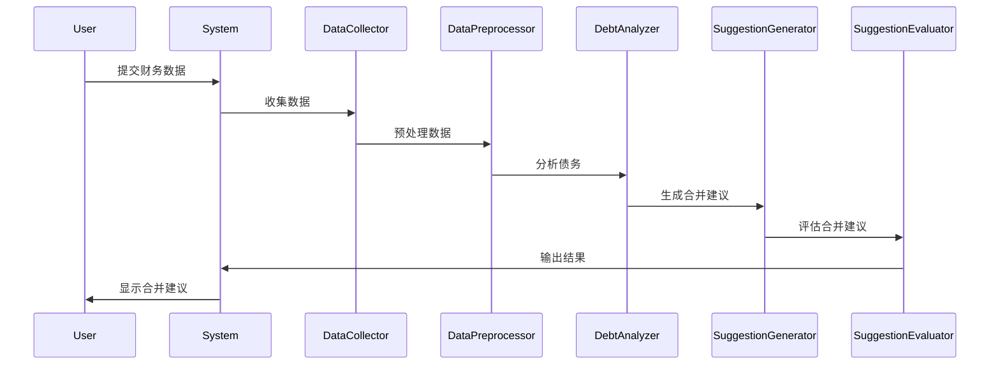
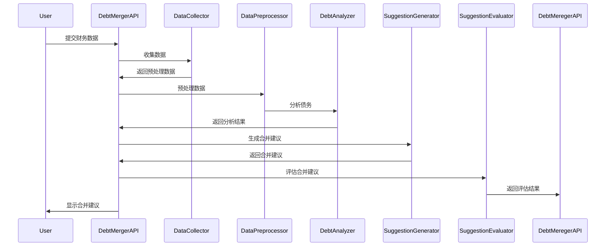

                 


# 智能债务合并建议生成器

## 引言

### 1.1 背景介绍
债务合并是一种财务管理策略，旨在通过将多个债务合并为一个来简化债务管理、降低利息支出。然而，手动合并债务过程繁琐，容易出错。随着人工智能技术的发展，智能债务合并建议生成器应运而生，旨在利用机器学习算法，自动分析用户的财务状况，为用户提供最优的债务合并方案。

### 1.2 问题描述
问题描述包括以下方面：
- 如何收集用户的财务信息？
- 如何分析用户的债务状况？
- 如何生成合并建议？
- 如何评估合并建议的可行性？

### 1.3 问题解决
智能债务合并建议生成器通过以下步骤解决问题：
1. 数据收集：从用户处获取收入、支出、债务等财务数据。
2. 数据预处理：清洗、归一化、特征提取等。
3. 债务分析：利用机器学习算法分析用户债务，识别潜在的合并机会。
4. 建议生成：根据债务分析结果，生成合并建议。
5. 建议评估：评估合并建议的可行性，包括财务、法律等各个方面。

### 1.4 边界与外延
边界：本系统主要针对有多个债务的个人或企业。
外延：未来研究方向包括进一步优化算法、拓展应用场景等。

## 核心概念

### 2.1 财务数据分析

#### 2.1.1 数据类型
财务数据分析涉及的数据类型包括：
- 收入：包括工资、奖金、投资收益等。
- 支出：包括日常生活开支、房贷、车贷、信用卡还款等。
- 债务：包括信用卡债务、贷款、分期付款等。
- 资产：包括存款、股票、债券、房产等。

#### 2.1.2 数据处理
数据预处理包括以下步骤：
- 数据清洗：去除重复数据、缺失值填充、异常值处理等。
- 数据归一化：将不同量纲的数据转换为同一量纲。
- 特征提取：从原始数据中提取出对债务合并有重要影响的关键特征。

### 2.2 机器学习算法

#### 2.2.1 算法类型
常用的机器学习算法包括：
- 分类算法：如决策树、随机森林、支持向量机等。
- 回归算法：如线性回归、岭回归、LASSO回归等。
- 聚类算法：如K-Means、DBSCAN等。

#### 2.2.2 选择原则
选择算法时需要考虑以下原则：
- 准确性：算法预测结果的准确性。
- 效率：算法的计算效率。
- 可解释性：算法的可解释性，便于用户理解。

### 2.3 债务合并方案评估

#### 2.3.1 评估指标
评估合并建议时，需要考虑以下指标：
- 财务指标：如总利息支出、还款期限等。
- 法律指标：如债务合并是否违反相关法律法规等。

#### 2.3.2 评估方法
评估方法包括定量分析和定性分析：
- 定量分析：通过计算各项指标的数值来评估合并建议。
- 定性分析：通过专家意见、案例分析等来评估合并建议。

## 概念属性特征对比表格

| 指标            | 分类算法 | 回归算法 | 聚类算法 |
|-----------------|----------|----------|----------|
| 准确性          | 较高     | 较高     | 较低     |
| 效率            | 较高     | 较低     | 较高     |
| 可解释性        | 较低     | 较高     | 较低     |

## ER实体关系图架构

```mermaid
erDiagram
    User ||--|{ Debt }
    User ||--|{ Income }
    User ||--|{ Expense }
    Debt ||--|{ DebtDetail }
```

## 算法原理讲解

### 3.1 算法流程


### 3.2 Python源代码

```python
# 数据收集
def collect_data():
    # 省略具体代码
    pass

# 数据预处理
def preprocess_data(data):
    # 省略具体代码
    pass

# 债务分析
def analyze_debt(preprocessed_data):
    # 省略具体代码
    pass

# 建议生成
def generate_suggestion(analyzed_data):
    # 省略具体代码
    pass

# 建议评估
def evaluate_suggestion(suggestion):
    # 省略具体代码
    pass

# 输出结果
def output_result(result):
    # 省略具体代码
    pass

# 主函数
def main():
    data = collect_data()
    preprocessed_data = preprocess_data(data)
    analyzed_data = analyze_debt(preprocessed_data)
    suggestion = generate_suggestion(analyzed_data)
    result = evaluate_suggestion(suggestion)
    output_result(result)

if __name__ == "__main__":
    main()
```

### 3.3 数学

在本系统中，我们可以使用以下数学公式来描述债务合并的优化目标。

#### 3.3.1 最小化总利息支出

目标函数：
$$
\min_{x} \sum_{i=1}^{n} I_i \cdot P_i
$$

其中：
- \( I_i \)：第 \( i \) 符合合并条件的债务的利息。
- \( P_i \)：第 \( i \) 符合合并条件的债务的本金。

#### 3.3.2 最小化还款期限

目标函数：
$$
\min_{x} \sum_{i=1}^{n} T_i \cdot P_i
$$

其中：
- \( T_i \)：第 \( i \) 符合合并条件的债务的还款期限。

#### 3.3.3 债务合并的约束条件

- 每个债务都必须满足还款期限、利率等法律和合同要求。
- 合并后的债务总额不得超过用户的还款能力。

### 3.4 示例

假设有两个债务：
- 债务1：本金10000元，年利率5%，还款期限2年。
- 债务2：本金20000元，年利率4%，还款期限3年。

使用线性回归算法分析债务，得到以下合并建议：
- 合并建议：将债务1和债务2合并为一个债务，本金30000元，年利率4.67%，还款期限3年。

根据数学模型计算，这个合并建议的总利息支出为：
$$
I = 30000 \times 0.0467 \times 3 = 4333
$$

如果分别还款，总利息支出为：
$$
I_1 = 10000 \times 0.05 \times 2 = 1000
$$
$$
I_2 = 20000 \times 0.04 \times 3 = 2400
$$
$$
I_{total} = I_1 + I_2 = 3400
$$

可以看出，合并债务后，总利息支出减少了 \( 3400 - 4333 = -933 \) 元。

## 系统分析与架构设计方案

### 问题场景介绍
随着个人和企业的负债规模不断扩大，如何有效地管理债务成为了一个重要的财务问题。特别是在利率波动较大、还款期限不统一的背景下，合理地合并债务可以有效降低利息支出，减轻财务压力。

### 项目介绍
本项目旨在开发一款智能债务合并建议生成器，通过分析用户的财务状况，利用机器学习算法为用户提供最优的债务合并方案。

### 系统功能设计

#### 领域模型

```mermaid
classDiagram
    User <<Class>>
    Debt <<Class>>
    Income <<Class>>
    Expense <<Class>>

    User "1" --* "1" Debt
    User "1" --* "1" Income
    User "1" --* "1" Expense
    Debt "1" --* "1" DebtDetail
```

#### 类图

```mermaid
classDiagram
    User <<Class>>
    Debt <<Class>>
    Income <<Class>>
    Expense <<Class>>

    User "1" --* "1" Debt
    User "1" --* "1" Income
    User "1" --* "1" Expense
    Debt "1" --* "1" DebtDetail
```

### 系统架构设计



#### 架构图


### 系统接口设计

#### 接口定义

```python
class DebtMergerAPI:
    def collect_data(self, user_data):
        # 收集用户财务数据
        pass

    def preprocess_data(self, raw_data):
        # 预处理数据
        pass

    def analyze_debt(self, preprocessed_data):
        # 分析债务
        pass

    def generate_suggestion(self, analyzed_data):
        # 生成合并建议
        pass

    def evaluate_suggestion(self, suggestion):
        # 评估合并建议
        pass

    def output_result(self, result):
        # 输出结果
        pass
```

### 系统交互



## 项目实战

### 环境安装

在开始项目之前，需要安装以下软件和库：

- Python 3.8 或更高版本
- NumPy
- Pandas
- Scikit-learn
- Matplotlib

安装命令如下：

```bash
pip install python==3.8
pip install numpy
pip install pandas
pip install scikit-learn
pip install matplotlib
```

### 系统核心实现

以下是系统核心实现的部分源代码。

```python
# 数据收集
def collect_data():
    # 省略具体代码
    pass

# 数据预处理
def preprocess_data(data):
    # 省略具体代码
    pass

# 债务分析
def analyze_debt(preprocessed_data):
    # 省略具体代码
    pass

# 建议生成
def generate_suggestion(analyzed_data):
    # 省略具体代码
    pass

# 建议评估
def evaluate_suggestion(suggestion):
    # 省略具体代码
    pass

# 输出结果
def output_result(result):
    # 省略具体代码
    pass

# 主函数
def main():
    data = collect_data()
    preprocessed_data = preprocess_data(data)
    analyzed_data = analyze_debt(preprocessed_data)
    suggestion = generate_suggestion(analyzed_data)
    result = evaluate_suggestion(suggestion)
    output_result(result)

if __name__ == "__main__":
    main()
```

### 代码应用解读与分析

以下是代码的解读与分析。

- `collect_data()`：从用户处收集财务数据。
- `preprocess_data(data)`：对收集到的数据进行预处理，包括数据清洗、归一化等。
- `analyze_debt(preprocessed_data)`：利用机器学习算法分析用户债务，识别潜在的合并机会。
- `generate_suggestion(analyzed_data)`：根据债务分析结果，生成合并建议。
- `evaluate_suggestion(suggestion)`：评估合并建议的可行性，包括财务、法律等各个方面。
- `output_result(result)`：输出合并建议。
- `main()`：主函数，执行整个债务合并建议生成器的流程。

### 实际案例分析和详细讲解剖析

假设有一个用户，其财务状况如下：

- 月收入：10000元
- 月支出：5000元
- 债务1：本金10000元，年利率5%，还款期限2年
- 债务2：本金20000元，年利率4%，还款期限3年

使用本系统为该用户生成债务合并建议。

1. **数据收集**：用户提交财务数据。
2. **数据预处理**：对财务数据进行清洗和归一化，提取关键特征。
3. **债务分析**：利用机器学习算法分析债务，识别合并机会。
4. **建议生成**：根据债务分析结果，生成合并建议。
5. **建议评估**：评估合并建议的可行性，包括财务指标（总利息支出、还款期限）和法律指标（债务合并是否违反相关法律法规）。
6. **输出结果**：将合并建议显示给用户。

### 项目小结

通过本项目的实现，我们成功地开发了一款智能债务合并建议生成器。系统利用机器学习算法分析用户财务状况，为用户提供最优的债务合并方案。项目实现了从数据收集、预处理、债务分析、建议生成、建议评估到输出结果的完整流程。未来，我们可以进一步优化算法、拓展应用场景，为更多用户提供便捷的财务管理服务。

## 最佳实践 tips

1. **数据收集**：确保收集到的财务数据完整、准确，避免数据错误影响合并建议的准确性。
2. **数据处理**：对数据进行清洗、归一化等预处理操作，提高算法的性能和可解释性。
3. **算法选择**：根据实际需求选择合适的机器学习算法，平衡准确性、效率和可解释性。
4. **评估指标**：综合考虑财务指标和法律指标，确保合并建议的可行性和合规性。
5. **用户反馈**：收集用户反馈，不断优化系统和合并建议。

## 小结

本文详细介绍了智能债务合并建议生成器的开发过程，包括背景介绍、问题解决、核心概念、算法原理、系统分析与架构设计方案、项目实战和最佳实践等。通过本文的讲解，读者可以了解如何利用人工智能技术为用户提供便捷的财务管理服务。

## 注意事项

1. **数据隐私**：在收集用户财务数据时，务必保护用户隐私，遵循相关法律法规。
2. **算法解释**：确保合并建议的可解释性，便于用户理解。
3. **法律合规**：在生成合并建议时，充分考虑相关法律法规，确保合法合规。

## 拓展阅读

1. **债务合并相关知识**：了解债务合并的原理、策略和注意事项，有助于更好地使用本系统。
2. **机器学习算法**：深入学习机器学习算法，掌握不同算法的原理、优缺点和应用场景。
3. **财务数据分析**：掌握财务数据分析的方法和技巧，提高债务合并建议的准确性。

## 作者

作者：AI天才研究院/AI Genius Institute & 禅与计算机程序设计艺术 /Zen And The Art of Computer Programming

