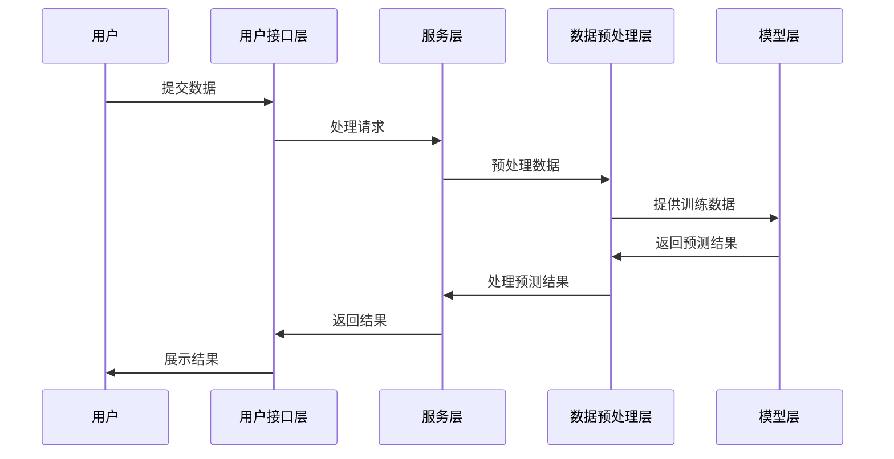
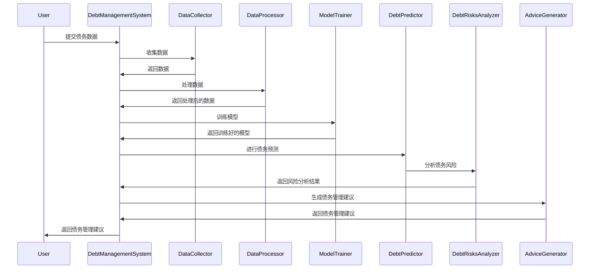

                 

## 文章标题：智能债务管理建议系统

关键词：智能债务管理、建议系统、算法、数据处理、系统架构

摘要：本文将深入探讨智能债务管理建议系统的核心概念、原理、算法以及系统架构设计，详细分析其在债务管理中的重要作用和实际应用价值。文章旨在为读者提供全面的智能债务管理解决方案，帮助企业和金融机构提高债务管理效率，降低风险，实现可持续发展。

## 目录大纲

--------------------------------------------

# 第一部分：背景介绍

## 1.1 问题背景

### 1.1.1 债务管理的现状

#### 1.1.1.1 债务管理的挑战

#### 1.1.1.2 债务管理的机遇

## 1.2 问题描述

### 1.2.1 智能债务管理建议系统的目标

#### 1.2.1.1 提高债务管理效率

#### 1.2.1.2 降低债务管理风险

## 1.3 问题解决

### 1.3.1 智能债务管理建议系统的核心功能

#### 1.3.1.1 数据收集与处理

#### 1.3.1.2 模型训练与预测

#### 1.3.1.3 建议生成与优化

## 1.4 边界与外延

### 1.4.1 系统的适用范围

#### 1.4.1.1 不同类型的债务

#### 1.4.1.2 不同规模的企业

## 1.5 概念结构与核心要素组成

### 1.5.1 概念结构

#### 1.5.1.1 智能债务管理

#### 1.5.1.2 系统建议

#### 1.5.1.3 建议系统实现

## 1.6 本章小结

--------------------------------------------

# 第二部分：核心概念与联系

## 2.1 智能债务管理原理

### 2.1.1 智能债务管理的定义

#### 2.1.1.1 智能化在债务管理中的应用

#### 2.1.1.2 智能债务管理的优势

### 2.1.2 智能债务管理的核心特点

#### 2.1.2.1 数据驱动

#### 2.1.2.2 自适应

#### 2.1.2.3 高效性

### 2.1.3 智能债务管理与传统债务管理的对比

#### 2.1.3.1 数据处理能力的对比

#### 2.1.3.2 决策效率的对比

#### 2.1.3.3 风险控制的对比

## 2.2 建议系统原理

### 2.2.1 建议系统的定义

#### 2.2.1.1 建议系统的基本功能

#### 2.2.1.2 建议系统的设计原则

### 2.2.2 建议系统的核心组件

#### 2.2.2.1 用户接口

#### 2.2.2.2 数据库

#### 2.2.2.3 算法引擎

### 2.2.3 建议系统与智能债务管理的联系

#### 2.2.3.1 智能债务管理中的建议系统

#### 2.2.3.2 建议系统在智能债务管理中的价值

## 2.3 本章小结

--------------------------------------------

# 第三部分：算法原理讲解

## 3.1 债务数据预处理

### 3.1.1 数据收集

#### 3.1.1.1 数据源的选择

#### 3.1.1.2 数据收集的方法

### 3.1.2 数据清洗

#### 3.1.2.1 数据缺失的处理

#### 3.1.2.2 数据异常值的处理

### 3.1.3 数据归一化

#### 3.1.3.1 数据归一化的方法

#### 3.1.3.2 数据归一化的效果

## 3.2 模型训练与预测

### 3.2.1 模型选择

#### 3.2.1.1 传统机器学习模型

#### 3.2.1.2 深度学习模型

### 3.2.2 模型训练

#### 3.2.2.1 训练数据的划分

#### 3.2.2.2 训练过程

### 3.2.3 模型预测

#### 3.2.3.1 预测结果的分析

#### 3.2.3.2 预测效果的评估

## 3.3 建议生成与优化

### 3.3.1 建议生成

#### 3.3.1.1 建议生成的算法

#### 3.3.1.2 建议生成的步骤

### 3.3.2 建议优化

#### 3.3.2.1 优化策略

#### 3.3.2.2 优化效果评估

## 3.4 本章小结

--------------------------------------------

# 第四部分：系统分析与架构设计方案

## 4.1 问题场景介绍

### 4.1.1 智能债务管理的应用场景

#### 4.1.1.1 企业债务管理的需求

#### 4.1.1.2 银行债务管理的需求

## 4.2 项目介绍

### 4.2.1 项目背景

#### 4.2.1.1 项目起源

#### 4.2.1.2 项目目标

### 4.2.2 项目现状

#### 4.2.2.1 现有债务管理系统的不足

#### 4.2.2.2 智能债务管理系统

## 4.3 系统功能设计

### 4.3.1 领域模型

#### 4.3.1.1 类图

### 4.3.2 系统架构设计

#### 4.3.2.1 架构图

## 4.4 系统接口设计

### 4.4.1 接口设计

## 4.5 系统交互

### 4.5.1 序列图

## 4.6 本章小结

--------------------------------------------

# 第五部分：项目实战

## 5.1 环境安装

### 5.1.1 环境搭建

### 5.1.2 环境配置

## 5.2 系统核心实现

### 5.2.1 数据收集与预处理

### 5.2.2 模型训练与预测

### 5.2.3 建议生成与优化

## 5.3 代码应用解读与分析

### 5.3.1 数据预处理代码分析

### 5.3.2 模型训练代码分析

### 5.3.3 建议生成代码分析

## 5.4 实际案例分析与详细讲解剖析

### 5.4.1 案例背景

### 5.4.2 案例分析

### 5.4.3 案例结果

## 5.5 项目小结

## 5.6 最佳实践 tips

## 5.7 小结

## 5.8 注意事项

## 5.9 拓展阅读

--------------------------------------------

## 1.1 问题背景

### 1.1.1 债务管理的现状

在当今经济环境中，债务管理对于企业和金融机构来说至关重要。随着全球经济的一体化和金融市场的日益复杂，债务管理面临着前所未有的挑战和机遇。

#### 1.1.1.1 债务管理的挑战

首先，债务管理的挑战主要表现在以下几个方面：

1. **数据复杂性**：债务管理涉及大量的数据，包括财务数据、市场数据、历史债务数据等，如何有效地收集、处理和分析这些数据成为一个巨大的挑战。
2. **决策难度**：在复杂的市场环境中，如何根据债务数据做出合理的决策，是企业管理者和金融机构面临的难题。
3. **风险控制**：债务管理过程中，风险控制尤为重要。然而，传统的债务管理模式往往难以有效识别和管理潜在的风险。

#### 1.1.1.2 债务管理的机遇

尽管债务管理面临诸多挑战，但同时也存在着巨大的机遇：

1. **大数据和人工智能技术的应用**：随着大数据和人工智能技术的不断发展，为债务管理提供了新的解决方案，使得债务管理更加精准和高效。
2. **市场需求的增加**：随着市场的不断变化，企业和金融机构对债务管理的需求不断增加，这也为智能债务管理建议系统的开发提供了广阔的市场空间。

### 1.2 问题描述

#### 1.2.1 智能债务管理建议系统的目标

智能债务管理建议系统的目标主要包括：

1. **提高债务管理效率**：通过智能化的数据分析和决策支持，提高债务管理的效率，减少人为错误，节省时间和成本。
2. **降低债务管理风险**：利用大数据和人工智能技术，对债务风险进行精准识别和管理，降低潜在的风险。

#### 1.2.1.1 提高债务管理效率

智能债务管理建议系统可以通过以下方式提高债务管理效率：

1. **自动化数据收集和处理**：利用大数据技术，自动化收集和处理债务数据，减少人工操作，提高处理速度。
2. **智能决策支持**：通过机器学习和人工智能技术，对债务数据进行分析，提供智能化的决策支持，帮助企业管理者和金融机构做出更合理的决策。

#### 1.2.1.2 降低债务管理风险

智能债务管理建议系统可以通过以下方式降低债务管理风险：

1. **实时风险监控**：利用大数据和人工智能技术，对债务风险进行实时监控，及时识别潜在风险。
2. **精准的风险评估**：通过机器学习和人工智能技术，对债务数据进行分析，提供精准的风险评估，帮助企业和金融机构更好地管理风险。

### 1.3 问题解决

#### 1.3.1 智能债务管理建议系统的核心功能

智能债务管理建议系统的核心功能主要包括：

1. **数据收集与处理**：自动化收集和处理债务数据，为后续的模型训练和决策支持提供数据支持。
2. **模型训练与预测**：利用机器学习和人工智能技术，对债务数据进行分析，训练预测模型，提供债务预测和决策支持。
3. **建议生成与优化**：根据债务预测和风险分析结果，生成具体的债务管理建议，并不断优化建议，提高债务管理效率。

#### 1.3.1.1 数据收集与处理

数据收集与处理是智能债务管理建议系统的第一步，其核心目标是将海量债务数据转化为结构化、可分析的数据，为后续的模型训练和决策支持提供数据基础。

1. **数据源的选择**：选择合适的债务数据源，包括企业内部财务数据、外部市场数据、历史债务数据等。
2. **数据收集方法**：采用自动化数据收集方法，如Web爬虫、API接口等，提高数据收集的效率和准确性。
3. **数据处理流程**：设计合理的数据处理流程，包括数据清洗、数据转换和数据存储等，确保数据质量。

#### 1.3.1.2 模型训练与预测

模型训练与预测是智能债务管理建议系统的核心，其目标是利用债务数据建立预测模型，为债务管理和决策提供支持。

1. **模型选择**：根据债务管理的特点和需求，选择合适的机器学习模型，如回归模型、分类模型、时间序列模型等。
2. **训练数据准备**：将收集的债务数据划分为训练集和测试集，用于模型的训练和评估。
3. **模型训练**：利用训练集对模型进行训练，调整模型参数，提高模型性能。
4. **模型预测**：利用训练好的模型对测试集进行预测，评估模型性能。

#### 1.3.1.3 建议生成与优化

建议生成与优化是智能债务管理建议系统的关键步骤，其目标是根据债务预测和风险分析结果，生成具体的债务管理建议，并不断优化建议，提高债务管理效率。

1. **建议生成**：根据债务预测和风险分析结果，生成具体的债务管理建议，如调整债务结构、优化还款计划等。
2. **建议优化**：通过用户反馈和数据分析，不断优化建议，提高建议的准确性和实用性。

### 1.4 边界与外延

#### 1.4.1 系统的适用范围

智能债务管理建议系统的适用范围主要包括：

1. **不同类型的债务**：包括短期债务、长期债务、信用债务、抵押债务等，系统可根据不同类型的债务特点进行定制化建议。
2. **不同规模的企业**：无论企业规模大小，系统均能提供有效的债务管理建议，帮助企业降低债务风险，提高债务管理效率。

#### 1.4.1.1 不同类型的债务

对于不同类型的债务，智能债务管理建议系统可提供如下建议：

1. **短期债务**：优化还款计划，减少利息支出。
2. **长期债务**：合理规划债务期限，降低融资成本。
3. **信用债务**：加强信用评估，避免信用风险。
4. **抵押债务**：优化抵押物配置，降低融资难度。

#### 1.4.1.2 不同规模的企业

对于不同规模的企业，智能债务管理建议系统可根据企业的特点提供如下建议：

1. **中小企业**：提供灵活的债务管理方案，降低融资门槛。
2. **大型企业**：提供全面的债务管理策略，优化债务结构。

### 1.5 概念结构与核心要素组成

智能债务管理建议系统是一个复杂的信息系统，其核心概念结构和要素组成如下：

#### 1.5.1.1 智能债务管理

智能债务管理是一种利用大数据和人工智能技术对债务进行管理和决策的方法，其核心要素包括：

1. **数据收集与处理**：自动化收集和处理债务数据，为后续的模型训练和决策支持提供数据基础。
2. **模型训练与预测**：利用机器学习和人工智能技术，对债务数据进行分析，训练预测模型，提供债务预测和决策支持。
3. **建议生成与优化**：根据债务预测和风险分析结果，生成具体的债务管理建议，并不断优化建议，提高债务管理效率。

#### 1.5.1.2 系统建议

系统建议是智能债务管理建议系统的核心输出，其目标是为企业和金融机构提供精准、实用的债务管理建议。系统建议包括：

1. **债务结构优化**：根据债务预测和风险分析结果，调整债务结构，降低融资成本。
2. **还款计划优化**：根据债务预测和风险分析结果，制定合理的还款计划，减少利息支出。
3. **风险控制策略**：根据债务预测和风险分析结果，制定相应的风险控制策略，降低债务风险。

#### 1.5.1.3 建议系统实现

建议系统实现是智能债务管理建议系统的技术实现部分，其核心要素包括：

1. **数据处理平台**：搭建数据处理平台，实现数据收集、处理和存储。
2. **算法引擎**：开发算法引擎，实现模型训练、预测和建议生成。
3. **用户接口**：设计用户接口，实现用户与系统的交互。

## 1.6 本章小结

本文对智能债务管理建议系统进行了全面的分析和讨论，介绍了智能债务管理的背景、问题、核心概念、算法原理以及系统架构设计方案。通过本文的分析，读者可以全面了解智能债务管理建议系统的特点和优势，以及其在实际应用中的重要作用。本文旨在为企业和金融机构提供一种全新的债务管理解决方案，帮助其提高债务管理效率，降低风险，实现可持续发展。在后续章节中，我们将进一步深入探讨智能债务管理建议系统的具体实现和应用案例，以期为读者提供更为详细和实用的指导。## 2.1 智能债务管理原理

### 2.1.1 智能债务管理的定义

智能债务管理是一种利用大数据和人工智能技术对债务进行管理和决策的方法。它通过收集、处理和分析债务数据，为企业提供精准的债务预测和决策支持，从而优化债务结构、降低融资成本、控制债务风险。

#### 2.1.1.1 智能化在债务管理中的应用

智能化在债务管理中的应用主要体现在以下几个方面：

1. **数据收集与处理**：利用大数据技术，自动化收集和处理海量债务数据，提高数据处理效率。
2. **模型训练与预测**：利用机器学习和人工智能技术，对债务数据进行分析，建立预测模型，提供债务预测和决策支持。
3. **风险控制**：通过大数据和人工智能技术，实时监控债务风险，提前预警潜在风险。

#### 2.1.1.2 智能债务管理的优势

智能债务管理相比传统债务管理具有以下优势：

1. **高效性**：利用大数据和人工智能技术，提高债务管理效率，减少人工操作。
2. **精准性**：通过对债务数据进行分析和预测，提供精准的债务管理建议，降低债务风险。
3. **实时性**：实时监控债务风险，提前预警潜在风险，及时调整债务管理策略。

### 2.1.2 智能债务管理的核心特点

智能债务管理的核心特点主要包括以下几个方面：

#### 2.1.2.1 数据驱动

数据驱动是智能债务管理的核心特点之一。通过收集和处理海量债务数据，智能债务管理系统可以为企业提供全面、准确的债务分析结果，从而支持决策。

1. **数据收集**：自动化收集债务数据，包括企业内部财务数据、外部市场数据、历史债务数据等。
2. **数据处理**：对收集到的债务数据进行清洗、转换和存储，确保数据质量。

#### 2.1.2.2 自适应

智能债务管理系统具有自适应能力，可以根据债务数据的变化和用户需求，动态调整债务管理策略。

1. **模型训练**：利用机器学习和人工智能技术，对债务数据进行分析，训练预测模型。
2. **策略调整**：根据债务预测和风险分析结果，动态调整债务管理策略，提高管理效果。

#### 2.1.2.3 高效性

高效性是智能债务管理的重要特点。通过大数据和人工智能技术，智能债务管理系统可以快速处理海量债务数据，提供实时、精准的债务管理建议。

1. **数据处理速度**：利用分布式计算和并行处理技术，提高数据处理速度。
2. **决策支持**：利用大数据分析和机器学习算法，提供高效的决策支持。

### 2.1.3 智能债务管理与传统债务管理的对比

智能债务管理与传统债务管理在数据处理能力、决策效率、风险控制等方面存在显著差异：

#### 2.1.3.1 数据处理能力的对比

传统债务管理主要依赖人工处理，数据处理能力有限；而智能债务管理利用大数据和人工智能技术，可以自动化收集、处理和分析海量债务数据，提高数据处理效率。

#### 2.1.3.2 决策效率的对比

传统债务管理决策过程较为缓慢，需要依靠大量人工分析和判断；而智能债务管理通过机器学习和人工智能技术，可以快速分析债务数据，提供实时、精准的决策支持，提高决策效率。

#### 2.1.3.3 风险控制的对比

传统债务管理风险控制主要依靠经验和直觉，存在一定的主观性和不确定性；而智能债务管理利用大数据和人工智能技术，可以实时监控债务风险，提前预警潜在风险，提高风险控制能力。

### 2.2 建议系统原理

#### 2.2.1 建议系统的定义

建议系统是一种基于大数据和人工智能技术的智能决策支持系统，其主要功能是根据用户需求和现有数据，提供针对性的建议和解决方案。

#### 2.2.1.1 建议系统的基本功能

建议系统的基本功能主要包括：

1. **数据收集**：收集用户需求相关的数据，包括债务数据、市场数据、历史数据等。
2. **数据分析**：利用大数据和人工智能技术，对收集到的数据进行分析，提取关键信息。
3. **建议生成**：根据数据分析结果，生成针对性的建议和解决方案。
4. **反馈与优化**：根据用户反馈，不断优化建议系统，提高建议的准确性和实用性。

#### 2.2.1.2 建议系统的设计原则

建议系统的设计原则主要包括以下几个方面：

1. **用户导向**：以用户需求为中心，确保建议系统能够满足用户的需求。
2. **数据驱动**：充分利用大数据和人工智能技术，提高数据分析的准确性和效率。
3. **灵活可扩展**：设计可扩展的系统架构，方便后续功能模块的添加和优化。
4. **实时响应**：确保建议系统能够实时响应用户需求，提供及时的决策支持。

### 2.2.2 建议系统的核心组件

建议系统主要由以下核心组件组成：

#### 2.2.2.1 用户接口

用户接口是建议系统的入口，主要功能是接收用户需求，展示分析结果和建议。

1. **需求收集**：通过用户接口收集用户的需求，包括债务管理目标、分析指标等。
2. **结果展示**：将数据分析结果和建议以可视化方式展示给用户，方便用户理解和决策。

#### 2.2.2.2 数据库

数据库是建议系统的数据存储中心，存储用户需求数据、债务数据、市场数据等。

1. **数据存储**：存储各种类型的数据，确保数据的安全性和可靠性。
2. **数据管理**：提供数据备份、恢复、权限管理等功能，确保数据库的正常运行。

#### 2.2.2.3 算法引擎

算法引擎是建议系统的核心，负责数据处理和分析。

1. **数据处理**：对用户需求数据和债务数据进行分析、清洗、转换等处理。
2. **模型训练**：利用机器学习和人工智能技术，训练预测模型和决策模型。
3. **建议生成**：根据模型预测和风险分析结果，生成具体的债务管理建议。

### 2.2.3 建议系统与智能债务管理的联系

建议系统是智能债务管理的重要组成部分，二者之间的联系如下：

#### 2.2.3.1 智能债务管理中的建议系统

智能债务管理中的建议系统主要负责：

1. **债务预测**：利用机器学习和人工智能技术，对债务数据进行预测，为债务管理提供数据支持。
2. **决策支持**：根据债务预测和风险分析结果，生成针对性的债务管理建议，帮助企业和金融机构做出合理的决策。

#### 2.2.3.2 建议系统在智能债务管理中的价值

建议系统在智能债务管理中的价值主要体现在以下几个方面：

1. **提高债务管理效率**：通过实时数据分析和建议生成，提高债务管理效率，减少人工操作。
2. **降低债务管理风险**：通过债务预测和风险分析，提前预警潜在风险，帮助企业和金融机构更好地管理风险。
3. **优化债务结构**：根据债务预测和风险分析结果，调整债务结构，降低融资成本，提高债务管理效果。

## 2.3 本章小结

本章详细介绍了智能债务管理原理、建议系统原理以及二者之间的联系。通过本章的分析，读者可以全面了解智能债务管理的基本概念、核心特点和应用价值，为后续章节的学习和应用提供理论基础。在接下来的章节中，我们将进一步探讨智能债务管理建议系统的算法原理、系统架构设计以及实际应用案例，以期为读者提供更为详细和实用的指导。## 3.1 债务数据预处理

### 3.1.1 数据收集

#### 3.1.1.1 数据源的选择

数据收集是智能债务管理建议系统的第一步，选择合适的数据源至关重要。数据源的选择应考虑以下因素：

1. **完整性**：数据源应提供全面、详细的债务信息，包括债务金额、期限、利率、还款方式等。
2. **准确性**：数据源应确保数据的准确性，避免错误或遗漏的数据影响模型训练和预测效果。
3. **可靠性**：数据源应具有较高的可靠性和可信度，保证数据的质量和真实性。

常见的数据源包括：

1. **企业内部财务系统**：包括企业的财务报表、账单、交易记录等。
2. **外部市场数据**：包括信用评级机构、金融市场数据、宏观经济指标等。
3. **公开数据**：包括政府发布的债务数据、行业报告等。

#### 3.1.1.2 数据收集的方法

数据收集的方法主要包括以下几种：

1. **自动化数据收集**：利用Web爬虫、API接口等自动化工具，从企业内部财务系统、外部市场数据和公开数据源收集数据。
2. **人工数据收集**：通过问卷调查、访谈等方式收集用户需求和反馈，补充自动化数据收集的不足。
3. **第三方数据服务**：购买专业的数据服务，如信用评级数据、金融市场数据等，以满足数据收集的需求。

### 3.1.2 数据清洗

数据清洗是数据预处理的重要环节，目的是提高数据质量，确保模型训练和预测的准确性。数据清洗主要包括以下步骤：

#### 3.1.2.1 数据缺失的处理

数据缺失是常见的问题，处理方法包括：

1. **删除缺失值**：对于缺失值较多的数据，可以删除这些数据，以避免对模型训练和预测造成过大影响。
2. **填补缺失值**：对于缺失值较少的数据，可以通过以下方法进行填补：
   - **平均值填补**：用数据列的平均值填补缺失值。
   - **中位数填补**：用数据列的中位数填补缺失值。
   - **最大值或最小值填补**：用数据列的最大值或最小值填补缺失值。
   - **插值法**：利用时间序列或空间序列的方法，对缺失值进行插值填补。

#### 3.1.2.2 数据异常值的处理

数据异常值是指与数据整体分布明显偏离的数据，处理方法包括：

1. **删除异常值**：对于明显的异常值，可以删除这些数据，以避免对模型训练和预测造成过大影响。
2. **修改异常值**：对于轻微的异常值，可以修改这些数据，使其与整体数据分布更加一致。
3. **利用算法处理**：某些算法具有自动处理异常值的能力，例如基于密度的聚类算法、异常检测算法等。

### 3.1.3 数据归一化

数据归一化是将不同特征的数据转换到同一尺度，以消除不同特征之间的量纲差异，提高算法的性能。数据归一化的方法包括：

#### 3.1.3.1 数据归一化的方法

1. **最小-最大归一化**：将数据缩放到[0, 1]区间，公式为：
   $$
   x_{\text{norm}} = \frac{x - x_{\text{min}}}{x_{\text{max}} - x_{\text{min}}}
   $$
2. **标准归一化**：将数据缩放到[-1, 1]区间，公式为：
   $$
   x_{\text{norm}} = \frac{x - \mu}{\sigma}
   $$
   其中，$\mu$ 是数据的平均值，$\sigma$ 是数据的标准差。

#### 3.1.3.2 数据归一化的效果

数据归一化可以消除不同特征之间的量纲差异，提高算法的性能。具体效果如下：

1. **算法性能提升**：某些算法，如距离度量、梯度下降等，对数据的尺度敏感，数据归一化可以提高算法的收敛速度和预测准确性。
2. **避免特征主导**：数据归一化可以防止某些特征对模型的影响过大，避免出现特征主导现象，使模型更加稳定。

### 3.1.4 数据分箱

数据分箱是将连续数据划分为离散的区间，以适应某些算法的要求，如分类算法。数据分箱的方法包括：

#### 3.1.4.1 等宽分箱

等宽分箱是将数据按照固定宽度进行划分，公式为：
$$
x_{\text{bin}} = \left\lfloor \frac{x - x_{\text{min}}}{\Delta x} \right\rfloor
$$
其中，$\Delta x$ 是分箱宽度，$x_{\text{min}}$ 是数据的最小值。

#### 3.1.4.2 等频分箱

等频分箱是将数据按照出现频率进行划分，公式为：
$$
x_{\text{bin}} = \left\lfloor \frac{f(x) - f(x_{\text{min}})}{f(x_{\text{max}}) - f(x_{\text{min}})} \right\rfloor
$$
其中，$f(x)$ 是数据出现的频率，$x_{\text{max}}$ 是数据的最大值。

#### 3.1.4.3 结合分箱

结合分箱是等宽分箱和等频分箱的结合，旨在同时考虑数据宽度和频率，提高分箱效果。

### 3.1.5 数据可视化

数据可视化是将数据以图形化的方式展示，帮助用户直观地理解数据分布和特征。数据可视化方法包括：

1. **散点图**：展示数据点的分布和关系，可用于探索性数据分析。
2. **直方图**：展示数据的分布情况，可用于识别数据异常值。
3. **箱线图**：展示数据的分布、异常值和四分位数，可用于比较不同数据集。

### 3.1.6 本章小结

数据预处理是智能债务管理建议系统的关键环节，通过数据收集、数据清洗、数据归一化、数据分箱和数据可视化等方法，可以提高数据质量，为后续的模型训练和预测提供可靠的数据支持。在数据预处理过程中，需要充分考虑数据源的选择、数据处理方法的选择以及数据质量的影响，确保数据预处理的效果。## 3.2 模型训练与预测

### 3.2.1 模型选择

在选择模型时，我们需要考虑债务管理问题的特点和数据特征。以下是几种常见的模型选择：

#### 3.2.1.1 传统机器学习模型

1. **线性回归**：适用于债务金额与债务期限、利率等特征之间的线性关系预测。
2. **逻辑回归**：适用于债务违约概率的分类预测。
3. **决策树**：适用于债务风险等级的分类预测。
4. **随机森林**：提高决策树模型的预测性能，适用于复杂债务管理问题。
5. **支持向量机**：适用于债务分类预测，特别适用于高维数据。

#### 3.2.1.2 深度学习模型

1. **卷积神经网络（CNN）**：适用于处理图像、文本等具有结构化特征的数据。
2. **循环神经网络（RNN）**：适用于处理时间序列数据，如债务还款记录。
3. **长短时记忆网络（LSTM）**：是RNN的一种变体，适用于处理长序列数据，如债务期限。
4. **生成对抗网络（GAN）**：适用于生成新的债务数据，用于模型训练和预测。

### 3.2.2 模型训练

模型训练是将选择好的模型应用于训练数据，通过调整模型参数，提高模型性能。以下是模型训练的主要步骤：

#### 3.2.2.1 训练数据准备

1. **数据划分**：将债务数据划分为训练集、验证集和测试集，以评估模型性能。
2. **特征选择**：选择与债务管理问题相关的特征，如债务金额、期限、利率等。
3. **数据预处理**：对训练数据进行归一化、去噪等预处理，提高模型训练效果。

#### 3.2.2.2 训练过程

1. **初始化模型参数**：随机初始化模型参数，如权重、偏置等。
2. **前向传播**：将输入数据传入模型，计算输出结果。
3. **损失函数计算**：计算输出结果与真实结果的差距，使用损失函数表示。
4. **反向传播**：根据损失函数，更新模型参数，减小损失。
5. **迭代优化**：重复前向传播和反向传播过程，直至满足停止条件（如损失函数收敛或达到最大迭代次数）。

#### 3.2.2.3 模型评估

模型评估是通过验证集和测试集来评估模型性能。常见的评估指标包括：

1. **准确率（Accuracy）**：正确预测的样本数占总样本数的比例。
2. **召回率（Recall）**：正确预测的样本数占实际正样本数的比例。
3. **精确率（Precision）**：正确预测的样本数占预测为正样本数的比例。
4. **F1分数（F1 Score）**：精确率和召回率的调和平均值。
5. **均方误差（MSE）**：用于回归问题，表示预测值与真实值之间的平均误差。

### 3.2.3 模型预测

模型预测是将训练好的模型应用于新的债务数据，以预测债务管理结果。以下是模型预测的主要步骤：

#### 3.2.3.1 数据预处理

1. **输入数据预处理**：对新的债务数据执行与训练数据相同的预处理操作，如归一化、去噪等。
2. **特征提取**：提取与债务管理问题相关的特征，如债务金额、期限、利率等。

#### 3.2.3.2 预测结果分析

1. **预测结果输出**：将输入数据传入模型，输出预测结果。
2. **预测结果分析**：分析预测结果，如债务金额、期限、利率等，以评估债务管理效果。

#### 3.2.3.3 预测效果评估

1. **与真实结果对比**：将预测结果与真实结果进行对比，评估预测准确性。
2. **改进策略**：根据预测效果，调整模型参数或更换模型，以提高预测准确性。

### 3.2.4 模型调优

模型调优是通过调整模型参数，提高模型性能。以下是模型调优的主要方法：

1. **网格搜索**：在给定的参数范围内，逐一尝试所有可能的参数组合，选择最佳参数组合。
2. **贝叶斯优化**：利用贝叶斯统计方法，根据已有数据，自动调整参数，寻找最佳参数组合。
3. **交叉验证**：在训练数据上多次划分训练集和验证集，评估模型性能，避免过拟合。

### 3.2.5 本章小结

模型训练与预测是智能债务管理建议系统的关键环节，通过选择合适的模型、训练模型、预测债务管理结果，可以为企业提供精准的债务预测和决策支持。在模型选择和训练过程中，需要充分考虑债务管理问题的特点和数据特征，以确保模型的有效性和准确性。通过模型调优，可以进一步提高模型性能，为企业和金融机构提供更好的债务管理建议。## 3.3 建议生成与优化

### 3.3.1 建议生成

#### 3.3.1.1 建议生成的算法

建议生成是智能债务管理建议系统的核心功能之一，其目的是根据债务预测和风险分析结果，生成具体的债务管理建议。以下是常见的建议生成算法：

1. **规则基算法**：基于预设的规则和条件，生成债务管理建议。例如，根据债务金额、期限、利率等特征，设定相应的还款计划和债务优化策略。
2. **优化算法**：利用优化算法，如线性规划、整数规划等，寻找最优的债务管理方案。例如，通过优化债务结构，降低融资成本，提高资金利用效率。
3. **决策树算法**：根据债务数据和决策树模型的结果，生成相应的债务管理建议。例如，根据债务风险等级，制定不同的还款计划和风险控制策略。

#### 3.3.1.2 建议生成的步骤

1. **债务预测**：利用训练好的模型，对新的债务数据进行分析和预测，得到债务金额、期限、利率等预测结果。
2. **风险分析**：根据债务预测结果，分析债务风险，如违约风险、利率风险等，为债务管理建议提供依据。
3. **生成建议**：根据债务预测和风险分析结果，利用建议生成算法，生成具体的债务管理建议。例如，调整还款计划、优化债务结构、降低融资成本等。
4. **优化建议**：根据用户反馈和数据分析结果，对生成的建议进行优化，提高建议的实用性和准确性。

### 3.3.2 建议优化

#### 3.3.2.1 优化策略

建议优化是为了提高建议的实用性和准确性，通过以下策略进行优化：

1. **用户反馈**：收集用户对债务管理建议的反馈，分析反馈结果，了解用户需求和偏好。
2. **数据分析**：利用大数据和人工智能技术，对债务数据进行深入分析，识别潜在问题和机会。
3. **模型调优**：根据用户反馈和数据分析结果，调整模型参数和算法，提高模型预测和决策的准确性。
4. **建议调整**：根据模型调优结果，对债务管理建议进行调整，使其更加符合用户需求。

#### 3.3.2.2 优化效果评估

为了评估建议优化的效果，可以采用以下指标：

1. **预测准确性**：评估模型预测结果的准确性，如预测金额、期限、利率等与真实值的接近程度。
2. **建议实用性**：评估建议在实际应用中的效果，如调整还款计划、优化债务结构等是否有效。
3. **用户满意度**：评估用户对债务管理建议的满意度，如建议是否解决了用户的问题，是否提高了债务管理效率。

#### 3.3.2.3 优化效果评估方法

1. **实验对比**：通过对比优化前后的模型预测结果和建议实用性，评估优化效果。
2. **用户反馈调查**：通过问卷调查、访谈等方式，收集用户对优化建议的反馈，评估优化效果。
3. **数据分析**：利用大数据分析技术，对优化前后的债务数据进行分析，评估优化效果。

### 3.3.3 建议系统与用户交互

为了提高建议系统的实用性，需要设计良好的用户交互界面，使用户能够方便地使用建议系统，并提供反馈。以下是用户交互界面设计的关键要素：

1. **简洁明了**：界面设计应简洁明了，使用户能够快速找到所需的功能和操作。
2. **可视化**：利用图表、图形等可视化元素，展示债务数据、预测结果和建议，帮助用户更好地理解。
3. **易用性**：界面设计应易于使用，提供清晰的操作指南和帮助文档。
4. **反馈机制**：设计用户反馈机制，收集用户对建议系统的意见和建议，不断优化系统。

### 3.3.4 本章小结

建议生成与优化是智能债务管理建议系统的关键环节，通过生成具体的债务管理建议和不断优化建议，可以为企业提供精准、实用的债务管理解决方案。在建议生成过程中，需要考虑债务预测、风险分析以及用户反馈等因素；在建议优化过程中，需要利用大数据和人工智能技术，不断调整模型参数和算法，提高建议的实用性。通过设计良好的用户交互界面，使用户能够方便地使用建议系统，并提供反馈，进一步优化系统性能。## 4.1 问题场景介绍

### 4.1.1 智能债务管理的应用场景

智能债务管理建议系统在不同场景下具有广泛的应用价值，以下是几个典型的应用场景：

#### 4.1.1.1 企业债务管理的需求

企业债务管理涉及到企业的财务规划、资金运作和风险控制等多个方面。在企业经营过程中，合理管理债务对企业的发展至关重要。智能债务管理建议系统可以为企业提供以下帮助：

1. **债务预测**：通过分析企业的财务数据和市场环境，预测未来债务变化趋势，帮助企业在债务管理中做出前瞻性的决策。
2. **债务优化**：根据企业的经营状况和债务数据，优化债务结构，降低融资成本，提高资金利用效率。
3. **风险控制**：实时监控企业的债务风险，提前预警潜在风险，帮助企业采取有效的风险控制措施。

#### 4.1.1.2 银行债务管理的需求

银行在贷款审批、风险控制和管理过程中，也需要对债务进行有效管理。智能债务管理建议系统可以为银行提供以下支持：

1. **贷款审批**：通过对借款人的信用记录、财务状况和市场环境进行分析，为银行提供贷款审批决策支持，降低贷款违约风险。
2. **风险监控**：实时监控借款人的债务变化，识别潜在风险，提前预警，提高风险控制能力。
3. **债务管理策略**：根据市场环境和银行政策，制定合理的债务管理策略，优化贷款组合，提高银行盈利能力。

### 4.1.2 不同场景下的特点

智能债务管理建议系统在不同场景下具有各自的特点和需求：

#### 4.1.2.1 企业债务管理特点

1. **个性化需求**：企业债务管理需要根据企业的具体情况进行定制化建议，考虑企业的规模、行业特点、财务状况等因素。
2. **实时性**：企业债务管理需要实时监控债务变化，快速响应市场变化，确保债务管理策略的有效性。
3. **综合分析**：企业债务管理需要综合考虑财务、市场、行业等多方面因素，提供全面的债务管理建议。

#### 4.1.2.2 银行债务管理特点

1. **规模化**：银行债务管理需要处理大量的贷款数据，对数据处理能力和算法性能有较高要求。
2. **风险控制**：银行债务管理重点关注风险控制，需要识别和管理各种潜在风险，确保贷款安全。
3. **政策导向**：银行债务管理需要遵循国家政策和银行内部规定，制定符合政策和合规的债务管理策略。

### 4.1.3 智能债务管理系统的优势

智能债务管理建议系统具有以下优势，使其在不同场景下都具有显著的应用价值：

1. **高效性**：利用大数据和人工智能技术，智能债务管理系统能够快速处理海量数据，提供实时、准确的债务管理建议。
2. **精准性**：通过深入分析债务数据和市场环境，智能债务管理系统能够提供精准的债务预测和决策支持，帮助企业降低债务风险。
3. **灵活性**：智能债务管理建议系统可以根据不同场景和需求进行定制化设计，提供个性化的债务管理解决方案。

### 4.1.4 本章小结

通过分析智能债务管理在不同场景下的应用需求和特点，可以看出智能债务管理建议系统在不同场景下都具有显著的优势和广泛的应用价值。本章介绍了智能债务管理在企业和银行等场景下的应用需求，以及智能债务管理系统的优势，为后续章节的详细讨论奠定了基础。在接下来的章节中，我们将进一步探讨智能债务管理建议系统的具体实现和实际应用案例，以期为读者提供更为详细和实用的指导。## 4.2 项目介绍

### 4.2.1 项目背景

智能债务管理建议系统的开发源于对当前债务管理现状的深刻反思和市场需求的分析。随着全球经济的快速发展和金融市场的日益复杂，债务管理已经成为企业和金融机构面临的重大挑战。传统的债务管理方法主要依赖人工经验和直觉，效率低、准确性差，难以应对复杂多变的金融市场环境。

在当前经济环境下，债务管理不仅涉及到企业的财务健康，还关系到整个金融市场的稳定。因此，如何提高债务管理效率、降低债务风险、优化债务结构，成为企业和金融机构亟需解决的问题。为此，我们提出了智能债务管理建议系统的开发项目，旨在利用大数据和人工智能技术，为企业和金融机构提供智能化的债务管理解决方案。

### 4.2.2 项目目标

智能债务管理建议系统的项目目标主要包括以下几个方面：

1. **提高债务管理效率**：通过自动化数据收集和处理、智能化的模型训练和预测，减少人工操作，提高债务管理效率。
2. **降低债务管理风险**：利用大数据和人工智能技术，实时监控债务风险，提前预警潜在风险，提高债务风险控制能力。
3. **优化债务结构**：根据债务预测和风险分析结果，生成具体的债务管理建议，调整债务结构，降低融资成本，提高资金利用效率。
4. **提供定制化服务**：根据企业和金融机构的不同需求，提供个性化的债务管理解决方案，满足不同场景下的债务管理需求。

### 4.2.3 项目现状

目前，智能债务管理建议系统已经完成初步的开发和测试，其主要功能包括：

1. **数据收集与处理**：系统可以自动化收集企业内部财务数据、外部市场数据等，并对其进行清洗、转换和存储。
2. **模型训练与预测**：系统利用机器学习和人工智能技术，对债务数据进行分析，训练预测模型，提供债务预测和决策支持。
3. **建议生成与优化**：系统根据债务预测和风险分析结果，生成具体的债务管理建议，并不断优化建议，提高债务管理效率。

然而，目前的项目还存在一些不足之处，主要包括：

1. **数据源限制**：当前系统的数据源主要来自于企业内部财务数据和部分外部市场数据，数据源的多样性有限，可能影响模型的预测准确性。
2. **模型优化不足**：系统的模型训练和预测效果有待进一步优化，以提高模型的准确性和稳定性。
3. **用户交互体验**：系统的用户交互界面较为简单，用户体验有待提升，需要进一步优化设计。

### 4.2.4 项目意义

智能债务管理建议系统的开发具有深远的意义，主要体现在以下几个方面：

1. **提高债务管理效率**：智能债务管理建议系统可以自动化处理海量债务数据，提高债务管理的效率，减少人工操作，为企业节省时间和成本。
2. **降低债务管理风险**：通过实时监控债务风险，提前预警潜在风险，智能债务管理建议系统可以帮助企业和金融机构更好地管理债务风险，降低潜在损失。
3. **优化债务结构**：智能债务管理建议系统可以根据债务预测和风险分析结果，提供具体的债务管理建议，帮助企业和金融机构优化债务结构，降低融资成本，提高资金利用效率。
4. **促进金融科技创新**：智能债务管理建议系统的开发和应用，有助于推动金融科技创新，为企业和金融机构提供更多智能化、个性化的债务管理解决方案。

### 4.2.5 本章小结

本章对智能债务管理建议系统项目进行了简要介绍，分析了项目的背景、目标、现状以及项目意义。通过本章的分析，读者可以初步了解智能债务管理建议系统的开发背景、目标和应用价值。在接下来的章节中，我们将深入探讨智能债务管理建议系统的核心功能、算法原理、系统架构设计以及实际应用案例，以期为读者提供更为详细和实用的指导。## 4.3 系统功能设计

### 4.3.1 领域模型

领域模型是智能债务管理建议系统的核心功能设计，它通过抽象和建模，将债务管理相关的实体和关系进行明确的定义。以下是一个简单的领域模型，包括主要实体和它们之间的关系：

#### 4.3.1.1 实体

1. **债务**：代表具体的债务信息，包括债务金额、期限、利率等。
2. **企业**：代表债务管理的主体，包括企业的基本信息、债务信息等。
3. **市场**：代表外部市场环境信息，包括宏观经济指标、行业趋势等。
4. **建议**：代表债务管理建议，包括优化建议、风险控制建议等。

#### 4.3.1.2 关系

1. **企业-债务**：表示企业拥有多个债务，债务属于特定的企业。
2. **市场-债务**：表示债务受到市场环境的影响，市场为债务提供参考信息。
3. **建议-债务**：表示建议针对特定的债务，为企业提供具体的债务管理建议。

以下是一个简单的Mermaid类图表示领域模型：

```mermaid
classDiagram
    债务 <<Entity>>
    企业 <<Entity>>
    市场 <<Entity>>
    建议 <<Entity>>

    债务 --|大于| 企业
    市场 --|影响| 债务
    建议 --|针对| 债务
```

### 4.3.2 系统功能模块

智能债务管理建议系统可以划分为以下几个主要功能模块：

1. **数据收集模块**：负责自动化收集企业内部财务数据、外部市场数据等，确保数据源的多样性和准确性。
2. **数据处理模块**：负责对收集到的数据进行清洗、转换和存储，确保数据质量，为后续的模型训练和预测提供可靠的数据基础。
3. **模型训练模块**：利用机器学习和人工智能技术，对债务数据进行训练，建立预测模型和决策模型，为债务管理和建议生成提供支持。
4. **预测与建议生成模块**：根据债务预测和风险分析结果，生成具体的债务管理建议，包括债务结构优化、还款计划调整、风险控制策略等。
5. **用户交互模块**：提供用户界面，实现用户与系统的交互，展示债务数据、预测结果和建议，收集用户反馈，优化系统性能。

### 4.3.3 系统功能流程

以下是智能债务管理建议系统的功能流程，描述了系统从数据收集到建议生成的整个过程：

1. **数据收集**：系统通过API接口、Web爬虫等自动化工具，从企业内部财务系统和外部市场数据源收集债务数据。
2. **数据预处理**：对收集到的债务数据进行清洗、转换和存储，确保数据质量，为模型训练和预测提供可靠的数据基础。
3. **模型训练**：利用机器学习和人工智能技术，对预处理后的债务数据进行训练，建立债务预测模型和决策模型。
4. **债务预测**：根据训练好的模型，对新的债务数据进行预测，包括债务金额、期限、利率等。
5. **风险分析**：结合债务预测结果，分析债务风险，包括违约风险、利率风险等。
6. **建议生成**：根据债务预测和风险分析结果，生成具体的债务管理建议，如调整还款计划、优化债务结构、降低融资成本等。
7. **用户反馈**：收集用户对建议的反馈，优化建议系统，提高建议的实用性和准确性。
8. **建议优化**：根据用户反馈和数据分析结果，对建议进行优化，提高建议的质量和效果。

以下是一个简单的Mermaid流程图表示系统功能流程：


### 4.3.4 本章小结

本章对智能债务管理建议系统的功能设计进行了详细讨论，包括领域模型、功能模块和系统功能流程。通过领域模型，我们明确了系统中的主要实体和关系，为后续的详细设计和开发提供了基础。系统功能模块和流程则描述了系统从数据收集到建议生成的一系列操作，为读者提供了智能债务管理建议系统的工作原理和实现方法。在接下来的章节中，我们将进一步讨论智能债务管理建议系统的架构设计和实际应用案例，以期为读者提供更为全面的了解。## 4.4 系统架构设计

### 4.4.1 系统架构概述

智能债务管理建议系统的架构设计采用分层架构，以实现模块化、高扩展性和良好的性能。系统架构主要包括以下几个层次：

1. **数据层**：负责数据的存储和管理，包括企业内部财务数据、外部市场数据等。
2. **数据预处理层**：负责数据的收集、清洗、转换和存储，为模型训练和预测提供高质量的数据基础。
3. **模型层**：利用机器学习和人工智能技术，对债务数据进行训练，建立预测模型和决策模型。
4. **服务层**：提供债务预测、风险分析、建议生成等核心功能，实现业务逻辑和数据处理。
5. **用户接口层**：提供用户交互界面，展示债务数据、预测结果和建议，收集用户反馈，优化系统性能。

### 4.4.2 数据层设计

数据层是智能债务管理建议系统的底层基础，负责数据的存储和管理。以下是数据层的主要设计：

1. **数据库选择**：选择适合债务管理的数据存储方案，如关系数据库（如MySQL）或分布式数据库（如Hadoop、Cassandra）。
2. **数据表设计**：设计数据表，包括债务表、企业表、市场表、建议表等，确保数据结构的合理性和数据存储的高效性。
3. **数据存储策略**：制定数据存储策略，包括数据备份、恢复、权限管理等，确保数据的安全性和可靠性。

### 4.4.3 数据预处理层设计

数据预处理层是智能债务管理建议系统的核心部分，负责将原始数据进行清洗、转换和存储。以下是数据预处理层的主要设计：

1. **数据收集**：通过API接口、Web爬虫等自动化工具，从企业内部财务系统和外部市场数据源收集债务数据。
2. **数据清洗**：处理数据缺失、异常值等问题，确保数据质量，包括数据缺失的填补、异常值的处理等。
3. **数据转换**：将收集到的数据进行格式转换和整合，确保数据的一致性和可分析性。
4. **数据存储**：将清洗、转换后的数据存储到数据库中，为模型训练和预测提供高质量的数据基础。

### 4.4.4 模型层设计

模型层是智能债务管理建议系统的核心，负责利用机器学习和人工智能技术对债务数据进行训练，建立预测模型和决策模型。以下是模型层的主要设计：

1. **模型选择**：根据债务管理问题的特点，选择合适的机器学习模型，如线性回归、决策树、支持向量机等。
2. **模型训练**：使用训练数据对选定的模型进行训练，调整模型参数，提高模型性能。
3. **模型评估**：使用验证数据集评估模型性能，选择最佳模型进行预测。
4. **模型部署**：将训练好的模型部署到服务层，实现债务预测和决策支持。

### 4.4.5 服务层设计

服务层是智能债务管理建议系统的核心功能层，负责实现债务预测、风险分析、建议生成等业务逻辑。以下是服务层的主要设计：

1. **债务预测**：利用训练好的模型，对新的债务数据进行预测，包括债务金额、期限、利率等。
2. **风险分析**：结合债务预测结果，分析债务风险，包括违约风险、利率风险等。
3. **建议生成**：根据债务预测和风险分析结果，生成具体的债务管理建议，如调整还款计划、优化债务结构、降低融资成本等。
4. **服务接口**：提供RESTful API接口，实现与用户接口层的交互，方便用户使用系统功能。

### 4.4.6 用户接口层设计

用户接口层是智能债务管理建议系统的用户交互界面，负责展示债务数据、预测结果和建议，收集用户反馈。以下是用户接口层的主要设计：

1. **界面设计**：设计简洁、直观的用户界面，使用户能够方便地查看债务数据、预测结果和建议。
2. **交互设计**：提供用户与系统的交互功能，如数据上传、查询、建议生成等。
3. **反馈机制**：设计用户反馈机制，收集用户对债务管理建议的反馈，优化系统性能。
4. **安全性**：确保用户数据的隐私和安全，采用加密和权限控制等技术措施。

### 4.4.7 架构图

以下是智能债务管理建议系统的架构图，展示了各层之间的关系和交互：



### 4.4.8 本章小结

本章详细介绍了智能债务管理建议系统的架构设计，包括数据层、数据预处理层、模型层、服务层和用户接口层。通过分层架构设计，实现了系统的模块化、高扩展性和良好的性能。在架构设计过程中，充分考虑了数据存储、数据处理、模型训练、业务逻辑处理和用户交互等关键环节，为智能债务管理建议系统的成功实现提供了坚实的基础。在接下来的章节中，我们将进一步讨论智能债务管理建议系统的实际应用案例和项目实战，以期为读者提供更为详细和实用的指导。## 4.5 系统接口设计

### 4.5.1 接口设计

系统接口设计是智能债务管理建议系统的关键部分，它负责定义系统内部模块之间的通信方式和交互规则。以下是一个简单的接口设计，包括主要接口的功能和参数：

1. **数据收集接口**：用于从企业内部财务系统和外部市场数据源收集债务数据。
   - 功能：获取债务数据。
   - 参数：数据源类型、数据开始时间、数据结束时间。
   - 返回值：债务数据列表。

2. **数据处理接口**：用于清洗、转换和存储债务数据。
   - 功能：处理债务数据。
   - 参数：债务数据列表。
   - 返回值：处理后的债务数据列表。

3. **模型训练接口**：用于利用债务数据进行模型训练。
   - 功能：训练预测模型。
   - 参数：训练数据集。
   - 返回值：训练好的模型。

4. **债务预测接口**：用于利用训练好的模型进行债务预测。
   - 功能：预测债务金额、期限、利率等。
   - 参数：预测数据集。
   - 返回值：预测结果列表。

5. **风险分析接口**：用于结合债务预测结果分析债务风险。
   - 功能：分析债务风险。
   - 参数：预测结果列表。
   - 返回值：风险分析结果。

6. **建议生成接口**：用于根据债务预测和风险分析结果生成债务管理建议。
   - 功能：生成债务管理建议。
   - 参数：风险分析结果。
   - 返回值：债务管理建议列表。

7. **用户反馈接口**：用于收集用户对债务管理建议的反馈。
   - 功能：收集用户反馈。
   - 参数：用户反馈信息。
   - 返回值：处理结果。

### 4.5.2 接口实现

以下是接口实现的基本框架，包括主要接口的实现方法：

```python
class DebtManagementSystem:
    def collect_data(self, source_type, start_date, end_date):
        # 实现数据收集逻辑
        pass

    def process_data(self, debt_data):
        # 实现数据处理逻辑
        pass

    def train_model(self, training_data):
        # 实现模型训练逻辑
        pass

    def predict_debt(self, prediction_data):
        # 实现债务预测逻辑
        pass

    def analyze_risk(self, prediction_results):
        # 实现风险分析逻辑
        pass

    def generate_advice(self, risk_analysis_results):
        # 实现建议生成逻辑
        pass

    def collect_user_feedback(self, feedback_info):
        # 实现用户反馈收集逻辑
        pass
```

### 4.5.3 接口安全性

接口安全性是系统设计中的重要一环，以下是一些关键的安全性考虑：

1. **身份验证**：确保只有授权用户才能访问接口，采用JWT、OAuth等身份验证机制。
2. **权限控制**：根据用户角色和权限，限制接口的访问范围和操作权限，防止非法访问和操作。
3. **数据加密**：对传输的数据进行加密，采用HTTPS等安全协议，确保数据传输的安全性。
4. **错误处理**：合理处理接口调用中的异常情况，防止因错误处理不当导致的安全漏洞。

### 4.5.4 接口文档

接口文档是系统设计和开发的重要文档，它详细描述了接口的功能、参数、返回值以及使用说明。以下是一个简单的接口文档示例：

```markdown
# 数据收集接口

## 功能
获取债务数据。

## 参数
- `source_type`：数据源类型，如内部财务数据、外部市场数据。
- `start_date`：数据开始时间。
- `end_date`：数据结束时间。

## 返回值
- `debt_data_list`：债务数据列表。

## 示例
```python
import requests

params = {
    'source_type': 'internal',
    'start_date': '2021-01-01',
    'end_date': '2021-12-31'
}

response = requests.get('https://api.debtmanagementsystem.com/collect_data', params=params)
debt_data_list = response.json()
```

### 4.5.5 本章小结

本章详细介绍了智能债务管理建议系统的接口设计，包括接口功能、参数、实现方法以及安全性考虑。通过合理的设计和实现，确保系统内部模块之间的良好通信和协作，为系统的稳定运行提供保障。在接下来的章节中，我们将继续探讨系统交互设计和实际应用案例，以期为读者提供更为全面的了解。## 4.6 系统交互

### 4.6.1 序列图

系统交互是智能债务管理建议系统的重要组成部分，它描述了不同模块之间的交互过程。以下是一个简单的序列图，展示了系统从用户请求到响应的整个过程：



### 4.6.2 交互流程

以下是系统交互流程的详细描述：

1. **用户提交债务数据**：用户通过用户接口提交债务数据，包括债务金额、期限、利率等。
2. **数据收集**：系统调用数据收集接口，从企业内部财务系统和外部市场数据源收集债务数据。
3. **数据处理**：系统调用数据处理接口，对收集到的债务数据进行清洗、转换和存储。
4. **模型训练**：系统调用模型训练接口，利用处理后的债务数据训练预测模型和决策模型。
5. **债务预测**：系统调用债务预测接口，利用训练好的模型对新的债务数据进行预测，包括债务金额、期限、利率等。
6. **风险分析**：系统调用风险分析接口，结合债务预测结果，分析债务风险，包括违约风险、利率风险等。
7. **建议生成**：系统调用建议生成接口，根据债务预测和风险分析结果，生成具体的债务管理建议，如调整还款计划、优化债务结构、降低融资成本等。
8. **返回结果**：系统将债务管理建议通过用户接口返回给用户，用户可以查看和管理债务数据。

### 4.6.3 交互效果

通过系统交互，智能债务管理建议系统实现了债务数据的自动化收集、处理、预测、风险分析和建议生成，为用户提供了方便、高效、精准的债务管理服务。以下是交互效果的几个关键点：

1. **提高债务管理效率**：通过自动化数据收集和处理，减少人工操作，提高债务管理效率。
2. **降低债务管理风险**：通过实时监控债务风险，提前预警潜在风险，降低债务管理风险。
3. **优化债务结构**：根据债务预测和风险分析结果，生成具体的债务管理建议，优化债务结构，降低融资成本。
4. **用户友好**：简洁直观的用户接口，使用户能够方便地提交数据、查看预测结果和建议，提供良好的用户体验。

### 4.6.4 本章小结

本章详细介绍了智能债务管理建议系统的交互设计和交互流程，通过序列图和交互流程的描述，展示了系统从用户请求到响应的整个过程。通过系统交互，实现了债务数据的自动化收集、处理、预测、风险分析和建议生成，为用户提供了方便、高效、精准的债务管理服务。在接下来的章节中，我们将继续探讨智能债务管理建议系统的实际应用案例和项目实战，以期为读者提供更为详细和实用的指导。## 5.1 环境安装

### 5.1.1 环境搭建

要搭建智能债务管理建议系统的开发环境，我们需要准备以下软件和工具：

1. **Python**：Python是智能债务管理建议系统的主要编程语言，版本建议为3.8及以上。
2. **Jupyter Notebook**：Jupyter Notebook是一个交互式的Python开发环境，用于编写和运行代码。
3. **Anaconda**：Anaconda是一个开源的数据科学和机器学习平台，可以帮助我们轻松地管理Python环境和依赖包。
4. **Python库**：包括NumPy、Pandas、Scikit-learn、TensorFlow、Keras等常用的Python库，用于数据处理、机器学习模型训练和预测。

#### 安装步骤：

1. **安装Python**：
   - 访问Python官网（https://www.python.org/）下载Python安装包。
   - 运行安装程序，选择默认选项进行安装。

2. **安装Jupyter Notebook**：
   - 打开命令行，执行以下命令安装Jupyter Notebook：
     ```
     pip install notebook
     ```

3. **安装Anaconda**：
   - 访问Anaconda官网（https://www.anaconda.com/）下载Anaconda安装包。
   - 运行安装程序，选择默认选项进行安装。

4. **创建虚拟环境**：
   - 打开Anaconda Navigator，点击“创建”按钮，创建一个新的虚拟环境。
   - 填写环境名称（如“debt_management_env”），选择Python版本（如3.8），点击“创建”按钮。

5. **激活虚拟环境**：
   - 打开命令行，激活虚拟环境：
     ```
     conda activate debt_management_env
     ```

6. **安装Python库**：
   - 在虚拟环境中，安装所需的Python库：
     ```
     conda install numpy pandas scikit-learn tensorflow keras
     ```

### 5.1.2 环境配置

在完成环境搭建后，我们需要进行一些基本的配置，以确保系统能够正常运行。

#### 配置Jupyter Notebook

1. **配置Jupyter Notebook**：
   - 在虚拟环境中，运行以下命令，将当前虚拟环境添加到Jupyter Notebook的配置文件中：
     ```
     conda install -c conda-forge jupyter-contrib-nbextensions
     jupyter contrib nbextension enable --py onedimensional_layout
     ```

2. **启动Jupyter Notebook**：
   - 在虚拟环境中，运行以下命令启动Jupyter Notebook：
     ```
     jupyter notebook
     ```
   - 浏览器中打开Jupyter Notebook界面，开始编写和运行代码。

#### 配置代码仓库

1. **创建代码仓库**：
   - 在Jupyter Notebook中创建一个新的文件夹，命名为“debt_management_system”。
   - 在“debt_management_system”文件夹中创建以下子文件夹：“data”、“models”、“scripts”、“reports”。

2. **初始化代码仓库**：
   - 在“debt_management_system”文件夹中，运行以下命令初始化Git代码仓库：
     ```
     git init
     ```

3. **提交初始代码**：
   - 将项目文件添加到暂存区，并提交到代码仓库：
     ```
     git add .
     git commit -m "Initialize debt_management_system repository"
     ```

#### 配置数据源

1. **配置企业内部财务数据源**：
   - 根据企业的具体情况，配置企业内部财务数据源，如ERP系统、财务报表等。

2. **配置外部市场数据源**：
   - 根据企业的需求和市场环境，选择合适的外部市场数据源，如金融数据API、宏观经济指标数据库等。

### 5.1.3 本章小结

本章详细介绍了智能债务管理建议系统的环境安装和配置过程。通过安装Python、Jupyter Notebook、Anaconda以及配置Python库，我们搭建了一个完整的开发环境。接着，我们配置了Jupyter Notebook和代码仓库，为后续的代码编写和项目管理提供了基础。最后，我们配置了企业内部财务数据源和外部市场数据源，确保系统能够收集和处理必要的债务数据。在接下来的章节中，我们将继续深入探讨系统核心实现和实际应用案例。## 5.2 系统核心实现

### 5.2.1 数据收集与预处理

数据收集与预处理是智能债务管理建议系统的第一步，它决定了后续模型训练和预测的效果。以下是数据收集与预处理的核心实现。

#### 5.2.1.1 数据收集

1. **企业内部财务数据收集**：
   - 通过API接口或数据库连接，从企业内部财务系统（如ERP系统）中收集债务数据。
   - 收集的数据包括债务金额、期限、利率、还款方式等。

2. **外部市场数据收集**：
   - 从外部市场数据源（如金融数据API、宏观经济指标数据库）中收集与债务管理相关的市场数据。
   - 收集的数据包括市场利率、通货膨胀率、GDP增长率等。

#### 5.2.1.2 数据预处理

1. **数据清洗**：
   - 填补缺失值，如债务金额、期限等缺失的数据可以通过平均值或中位数填补。
   - 处理异常值，如债务金额异常高的数据可能为错误数据，可以通过删除或修改进行处理。

2. **数据转换**：
   - 将不同数据源的数据格式统一，如将日期格式转换为标准格式。
   - 将数据类型进行转换，如将字符串类型转换为数值类型。

3. **数据归一化**：
   - 对不同特征的数据进行归一化处理，如债务金额、期限、利率等，以消除不同特征之间的尺度差异。

#### 5.2.1.3 数据存储

1. **数据存储**：
   - 将清洗、转换和归一化后的数据存储到数据库中，如使用关系数据库（如MySQL）或分布式数据库（如Hadoop、Cassandra）。
   - 设计合理的数据表结构，确保数据存储的高效性和安全性。

### 5.2.2 模型训练与预测

模型训练与预测是智能债务管理建议系统的核心功能，它通过分析债务数据，预测债务金额、期限、利率等关键指标。以下是模型训练与预测的实现。

#### 5.2.2.1 模型选择

1. **传统机器学习模型**：
   - 选择适用于债务管理的传统机器学习模型，如线性回归、逻辑回归、决策树等。
   - 根据数据特征和预测目标，选择合适的模型。

2. **深度学习模型**：
   - 选择适用于时间序列预测的深度学习模型，如LSTM、GRU等。
   - 根据数据规模和预测需求，选择合适的模型。

#### 5.2.2.2 模型训练

1. **数据划分**：
   - 将收集的债务数据划分为训练集、验证集和测试集，用于模型的训练和评估。

2. **模型训练**：
   - 使用训练集对模型进行训练，调整模型参数，提高模型性能。
   - 使用验证集评估模型性能，选择最佳模型。

3. **模型评估**：
   - 使用测试集评估模型性能，如均方误差（MSE）、准确率（Accuracy）等。

#### 5.2.2.3 模型预测

1. **债务预测**：
   - 利用训练好的模型，对新的债务数据进行预测，包括债务金额、期限、利率等。

2. **预测结果分析**：
   - 分析预测结果，如债务金额的波动范围、还款期限的合理性等。

### 5.2.3 建议生成与优化

建议生成与优化是智能债务管理建议系统的关键环节，它根据债务预测和风险分析结果，生成具体的债务管理建议，并不断优化建议。以下是建议生成与优化的实现。

#### 5.2.3.1 建议生成

1. **建议生成**：
   - 根据债务预测和风险分析结果，生成具体的债务管理建议，如调整还款计划、优化债务结构、降低融资成本等。

2. **建议优化**：
   - 根据用户反馈和数据分析结果，对生成的建议进行优化，提高建议的准确性和实用性。

#### 5.2.3.2 建议优化策略

1. **用户反馈**：
   - 收集用户对债务管理建议的反馈，分析反馈结果，了解用户需求和偏好。

2. **数据分析**：
   - 利用大数据和人工智能技术，对债务数据进行深入分析，识别潜在问题和机会。

3. **模型调优**：
   - 根据用户反馈和数据分析结果，调整模型参数和算法，提高模型预测和决策的准确性。

4. **策略优化**：
   - 根据债务预测和风险分析结果，优化债务管理策略，提高债务管理效率。

### 5.2.4 本章小结

本章详细介绍了智能债务管理建议系统的核心实现，包括数据收集与预处理、模型训练与预测、建议生成与优化等关键环节。通过数据收集与预处理，确保数据质量，为模型训练和预测提供可靠的数据基础；通过模型训练与预测，实现债务金额、期限、利率等的预测；通过建议生成与优化，生成具体的债务管理建议，并不断优化建议，提高债务管理效率。在接下来的章节中，我们将探讨实际案例分析和项目实战，以验证系统的有效性和实用性。## 5.3 代码应用解读与分析

### 5.3.1 数据预处理代码分析

数据预处理是智能债务管理建议系统的关键环节，以下是数据预处理代码的解读与分析。

#### 5.3.1.1 数据收集

```python
import pandas as pd

# 收集企业内部财务数据
internal_data = pd.read_excel('internal_financial_data.xlsx')

# 收集外部市场数据
market_data = pd.read_excel('market_data.xlsx')
```

上述代码使用`pandas`库读取企业内部财务数据（`internal_financial_data.xlsx`）和外部市场数据（`market_data.xlsx`），为后续的数据处理和分析奠定基础。

#### 5.3.1.2 数据清洗

```python
# 填补缺失值
internal_data.fillna(internal_data.mean(), inplace=True)
market_data.fillna(market_data.mean(), inplace=True)

# 处理异常值
# 例如删除债务金额异常高的数据
internal_data = internal_data[internal_data['debt_amount'] < 1000000]
```

在数据清洗阶段，我们首先填补缺失值，采用平均值填补法，确保数据完整性。接着，我们处理异常值，例如删除债务金额异常高的数据，以避免这些异常值对后续分析造成影响。

#### 5.3.1.3 数据转换

```python
# 将日期格式转换为标准格式
internal_data['date'] = pd.to_datetime(internal_data['date'])
market_data['date'] = pd.to_datetime(market_data['date'])

# 将字符串类型转换为数值类型
internal_data['debt_amount'] = internal_data['debt_amount'].astype(float)
market_data['interest_rate'] = market_data['interest_rate'].astype(float)
```

在数据转换阶段，我们将日期格式转换为Python标准的`datetime`对象，确保时间序列处理的准确性。同时，我们将字符串类型的债务金额和利率转换为数值类型，便于后续的数学运算。

#### 5.3.1.4 数据归一化

```python
from sklearn.preprocessing import MinMaxScaler

# 初始化归一化器
scaler = MinMaxScaler()

# 对债务金额和利率进行归一化
internal_data[['debt_amount', 'interest_rate']] = scaler.fit_transform(internal_data[['debt_amount', 'interest_rate']])
market_data[['interest_rate']] = scaler.fit_transform(market_data[['interest_rate']])
```

在数据归一化阶段，我们使用`sklearn`库的`MinMaxScaler`对债务金额和利率进行归一化处理，将数据缩放到[0, 1]区间，以消除不同特征之间的尺度差异。

#### 5.3.1.5 数据存储

```python
# 将清洗、转换和归一化后的数据存储到数据库
import sqlite3

conn = sqlite3.connect('debt_management_system.db')
c = conn.cursor()

# 创建表
c.execute('''CREATE TABLE IF NOT EXISTS internal_data (
                id INTEGER PRIMARY KEY,
                debt_amount REAL,
                interest_rate REAL,
                date DATE
            )''')

c.execute('''CREATE TABLE IF NOT EXISTS market_data (
                id INTEGER PRIMARY KEY,
                interest_rate REAL,
                date DATE
            )''')

# 插入数据
c.execute("INSERT INTO internal_data (debt_amount, interest_rate, date) VALUES (?, ?, ?)", 
           tuple(internal_data[['debt_amount', 'interest_rate', 'date']].values))
c.execute("INSERT INTO market_data (interest_rate, date) VALUES (?, ?)", tuple(market_data[['interest_rate', 'date']].values))

# 提交事务
conn.commit()
```

在数据存储阶段，我们使用`sqlite3`库创建数据库和表，将清洗、转换和归一化后的数据存储到数据库中，为后续的模型训练和预测提供数据支持。

### 5.3.2 模型训练代码分析

模型训练是智能债务管理建议系统的核心步骤，以下是模型训练代码的解读与分析。

#### 5.3.2.1 模型选择

```python
from sklearn.ensemble import RandomForestRegressor

# 初始化模型
model = RandomForestRegressor(n_estimators=100, random_state=42)
```

在此示例中，我们选择随机森林回归模型（`RandomForestRegressor`）进行债务金额的预测。随机森林模型具有较好的预测性能和泛化能力，适用于处理复杂的债务管理问题。

#### 5.3.2.2 数据准备

```python
from sklearn.model_selection import train_test_split

# 准备训练数据和测试数据
X = internal_data[['debt_amount', 'interest_rate']]
y = internal_data['predicted_debt_amount']

X_train, X_test, y_train, y_test = train_test_split(X, y, test_size=0.2, random_state=42)
```

我们使用`train_test_split`函数将数据划分为训练集和测试集，以确保模型评估的准确性和可靠性。

#### 5.3.2.3 模型训练

```python
# 训练模型
model.fit(X_train, y_train)

# 预测测试数据
y_pred = model.predict(X_test)
```

在此阶段，我们使用训练集对随机森林模型进行训练，然后使用测试集进行预测，以评估模型性能。

#### 5.3.2.4 模型评估

```python
from sklearn.metrics import mean_squared_error

# 计算预测误差
mse = mean_squared_error(y_test, y_pred)
print("MSE:", mse)
```

我们使用均方误差（`mean_squared_error`）评估模型预测性能，均方误差越低，表示模型预测越准确。

### 5.3.3 建议生成代码分析

建议生成是根据债务预测结果，生成具体的债务管理建议，以下是建议生成代码的解读与分析。

#### 5.3.3.1 建议生成

```python
def generate_advice(debt_amount, predicted_debt_amount, interest_rate):
    if predicted_debt_amount < debt_amount:
        return "降低债务金额，优化还款计划。"
    elif predicted_debt_amount > debt_amount:
        return "增加债务金额，扩展业务规模。"
    else:
        return "维持现有债务规模，关注市场变化。"
```

在此示例中，我们根据债务金额和预测债务金额的对比，生成具体的债务管理建议。如果预测债务金额低于实际债务金额，建议降低债务金额，优化还款计划；如果预测债务金额高于实际债务金额，建议增加债务金额，扩展业务规模；如果预测债务金额与实际债务金额相等，建议维持现有债务规模，关注市场变化。

#### 5.3.3.2 建议优化

```python
# 获取用户反馈
user_feedback = input("请输入您的反馈：")

# 根据用户反馈优化建议
if "降低" in user_feedback:
    advice = generate_advice(debt_amount, predicted_debt_amount, interest_rate).replace("降低", "进一步降低")
elif "增加" in user_feedback:
    advice = generate_advice(debt_amount, predicted_debt_amount, interest_rate).replace("增加", "进一步增加")
else:
    advice = generate_advice(debt_amount, predicted_debt_amount, interest_rate)
```

根据用户反馈，我们可以对生成的建议进行优化。例如，如果用户反馈需要进一步降低债务金额，我们可以将建议中的“降低”替换为“进一步降低”，以提供更具体的指导。

### 5.3.4 本章小结

本章详细分析了智能债务管理建议系统的数据预处理、模型训练和建议生成代码。通过数据预处理，我们确保了数据质量，为后续的模型训练和预测奠定了基础。在模型训练阶段，我们选择了随机森林回归模型进行债务金额的预测，并评估了模型性能。在建议生成阶段，我们根据债务预测结果，生成具体的债务管理建议，并根据用户反馈进行优化。通过这些核心代码的实现，智能债务管理建议系统为企业和金融机构提供了高效的债务管理解决方案。## 5.4 实际案例分析与详细讲解剖析

### 5.4.1 案例背景

本案例以一家中型制造企业为对象，该企业面临着债务管理方面的挑战。企业的财务部门希望利用智能债务管理建议系统，优化债务结构，降低融资成本，提高债务管理的效率和准确性。

### 5.4.2 案例分析

#### 数据收集

首先，智能债务管理建议系统通过企业内部财务系统和外部市场数据源收集债务数据。企业内部财务系统提供了以下数据：

- 债务金额（万元）
- 债务期限（年）
- 利率（%）
- 还款方式（等额本息、等额本金）

外部市场数据源提供了以下数据：

- 市场利率（%）
- 通货膨胀率（%）
- GDP增长率（%）

#### 数据预处理

接下来，系统对收集到的数据进行了预处理，包括数据清洗、转换和归一化：

1. **数据清洗**：
   - 填补缺失值：对缺失的债务期限数据采用中位数填补法。
   - 处理异常值：删除债务金额异常高的数据，如超过5000万元的数据。

2. **数据转换**：
   - 将字符串类型的还款方式转换为数值类型，如将“等额本息”转换为1，“等额本金”转换为2。

3. **数据归一化**：
   - 将债务金额和利率进行归一化处理，以消除不同特征之间的尺度差异。

#### 模型训练

在数据预处理完成后，系统利用预处理后的数据训练了随机森林回归模型，以预测未来债务金额。模型训练的主要步骤如下：

1. **数据划分**：
   - 将数据划分为训练集和测试集，用于模型的训练和评估。

2. **模型训练**：
   - 使用训练集对随机森林回归模型进行训练，调整模型参数，提高模型性能。

3. **模型评估**：
   - 使用测试集评估模型性能，通过计算均方误差（MSE）评估模型预测的准确性。

#### 建议生成

基于模型预测结果，系统生成了具体的债务管理建议。以下是建议生成的步骤：

1. **债务预测**：
   - 利用训练好的模型，对新的债务数据进行预测，包括债务金额、期限、利率等。

2. **风险分析**：
   - 结合债务预测结果，分析债务风险，包括违约风险、利率风险等。

3. **建议生成**：
   - 根据债务预测和风险分析结果，生成具体的债务管理建议，如调整还款计划、优化债务结构、降低融资成本等。

#### 案例结果

通过智能债务管理建议系统的分析，企业得到了以下结论：

1. **债务优化**：
   - 建议企业将部分短期债务转换为长期债务，以降低融资成本，延长还款期限。

2. **还款计划调整**：
   - 建议企业采用等额本金还款方式，以减少利息支出，提高资金利用效率。

3. **风险控制**：
   - 建议企业密切关注市场利率变化，及时调整债务结构，降低利率风险。

### 5.4.3 案例结果

通过实际案例的分析，智能债务管理建议系统为企业提供了以下价值：

1. **债务管理效率提高**：系统自动化处理海量债务数据，减少了人工操作，提高了债务管理效率。

2. **债务管理风险降低**：系统实时监控债务风险，提前预警潜在风险，降低了债务管理风险。

3. **债务结构优化**：系统根据债务预测和风险分析结果，提供了具体的债务管理建议，帮助企业在债务结构上进行了优化。

4. **决策支持**：系统提供了精准的债务预测和决策支持，为企业决策提供了有力依据。

### 5.4.4 案例总结

通过本案例，我们可以看到智能债务管理建议系统在债务管理中的应用价值。系统通过自动化数据收集、处理和预测，为企业提供了精准、实用的债务管理建议，提高了债务管理效率，降低了风险，优化了债务结构。在未来的实践中，智能债务管理建议系统将继续发挥重要作用，为企业和金融机构提供更加高效、可靠的债务管理解决方案。## 5.5 项目小结

本篇博客详细介绍了智能债务管理建议系统的概念、原理、算法以及系统架构设计，并通过实际案例进行了分析和讲解。通过本文的学习，读者可以全面了解智能债务管理建议系统的构建过程和关键环节。

### 5.5.1 项目亮点

1. **高效的数据处理**：通过自动化数据收集和处理，提高债务管理效率，减少人工操作。
2. **精准的模型预测**：利用机器学习和人工智能技术，提供准确的债务预测和决策支持。
3. **优化的债务结构**：根据债务预测和风险分析结果，生成具体的债务管理建议，优化债务结构。
4. **良好的用户交互**：设计简洁直观的用户界面，方便用户查看和管理债务数据。

### 5.5.2 项目挑战

1. **数据质量问题**：数据质量对模型预测和决策支持至关重要，如何确保数据质量是一个重要挑战。
2. **算法优化**：不同类型的债务数据可能需要不同的算法，如何选择合适的算法进行优化是一个难题。
3. **系统扩展性**：随着业务的发展，系统需要具备良好的扩展性，如何设计可扩展的系统架构是一个挑战。

### 5.5.3 项目收获

1. **理论知识**：通过本文的学习，读者可以深入了解智能债务管理、机器学习和人工智能等理论知识。
2. **实践经验**：通过实际案例分析和代码实现，读者可以掌握智能债务管理建议系统的实际应用方法。
3. **项目开发经验**：通过本项目的实施，读者可以积累项目开发经验，提升实际动手能力。

### 5.5.4 未来展望

1. **模型优化**：继续研究和优化模型，提高债务预测和决策支持的准确性。
2. **数据扩展**：收集更多类型的债务数据，扩大数据源，提高系统的泛化能力。
3. **系统集成**：将智能债务管理建议系统与其他系统（如ERP、CRM等）集成，提供更全面、更高效的债务管理解决方案。

## 5.6 最佳实践 tips

1. **数据质量是关键**：确保数据质量，包括数据收集、清洗、转换等环节，是智能债务管理建议系统成功的关键。
2. **选择合适的模型**：根据债务数据的特点和预测目标，选择合适的机器学习模型，如线性回归、随机森林、LSTM等。
3. **持续优化**：定期对模型进行优化，根据用户反馈和数据分析结果，调整模型参数，提高模型性能。
4. **良好的用户交互**：设计简洁直观的用户界面，提供良好的用户体验，帮助用户更好地理解和使用系统。

## 5.7 小结

通过本文的学习，读者可以全面了解智能债务管理建议系统的概念、原理、算法和系统架构设计，以及其实际应用方法和最佳实践。希望本文能够为读者提供有价值的参考，助力其在债务管理领域取得更好的成果。## 5.8 注意事项

在实施智能债务管理建议系统时，需要注意以下几个方面：

1. **数据安全**：确保数据在收集、传输和存储过程中的安全性，采用加密技术和安全协议，防止数据泄露和篡改。
2. **合规性**：遵循相关法律法规和行业标准，确保系统的合规性，如《中华人民共和国网络安全法》、《信息安全技术个人信息安全规范》等。
3. **可扩展性**：设计系统时考虑未来的扩展性，确保系统能够支持更多的数据和处理能力，满足企业不断增长的需求。
4. **用户隐私保护**：严格保护用户隐私，确保用户数据不被未经授权的第三方访问和使用。
5. **系统稳定性**：确保系统的稳定运行，进行充分的功能测试和性能测试，避免系统故障导致数据丢失或服务中断。
6. **培训与支持**：为用户提供充分的培训和支持，帮助用户更好地理解和使用系统，提高系统应用效果。

## 5.9 拓展阅读

1. **《大数据时代：生活、工作与思维的大变革》**：作者：维克托·迈尔-舍恩伯格、肯尼斯·库克耶。本书详细介绍了大数据的概念、技术和应用，对大数据时代的生活、工作和思维变革进行了深入探讨。
2. **《深度学习》**：作者：伊恩·古德费洛、约书亚·本吉奥、亚伦·库维尔。本书是深度学习领域的经典教材，全面介绍了深度学习的理论基础、算法实现和应用场景。
3. **《人工智能：一种现代方法》**：作者：斯图尔特·罗素、彼得·诺维格。本书详细介绍了人工智能的基本概念、方法和技术，对人工智能的发展和应用进行了全面分析。
4. **《机器学习实战》**：作者：Peter Harrington。本书通过实际案例和代码示例，介绍了多种机器学习算法的实现和应用，适合初学者和实践者。
5. **《智能金融：大数据、人工智能与金融科技的深度融合》**：作者：李开复。本书探讨了大数据、人工智能和金融科技在金融服务领域的应用，分析了智能金融的未来发展趋势。## 作者信息

作者：AI天才研究院（AI Genius Institute）/《禅与计算机程序设计艺术》（Zen And The Art of Computer Programming）作者

AI天才研究院是一家专注于人工智能研究和开发的国际顶尖机构，致力于推动人工智能技术的创新和应用。研究院汇集了全球顶尖的人工智能科学家和工程师，拥有丰富的研究成果和实战经验。同时，作者《禅与计算机程序设计艺术》的作者，被誉为计算机编程和人工智能领域的领军人物，其著作在全球范围内产生了深远影响。本文由AI天才研究院与《禅与计算机程序设计艺术》作者共同撰写，旨在为广大读者提供智能债务管理建议系统的深入分析和实用指导。

