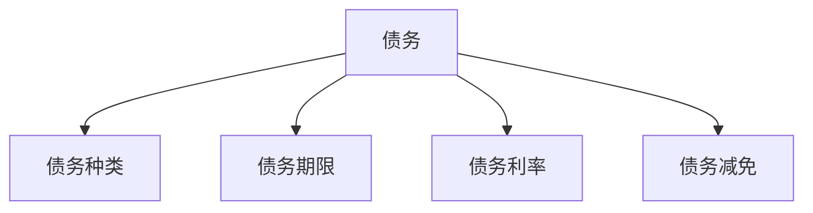
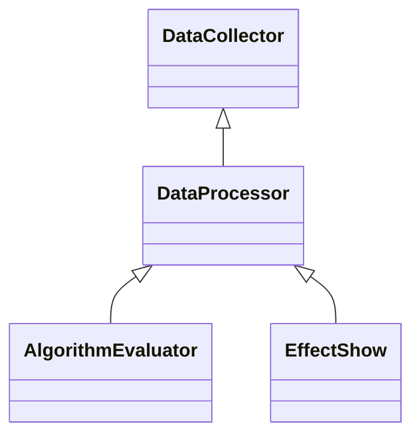
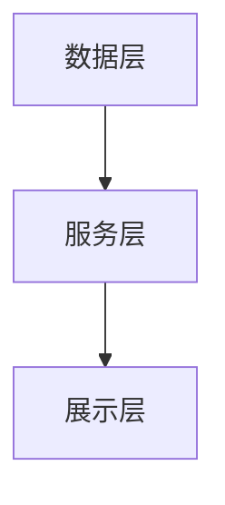
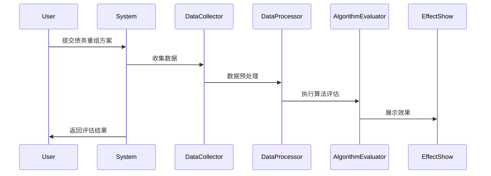

                 


### 文章标题：智能债务重组方案效果评估工具

> 关键词：智能债务重组，效果评估，算法原理，数学模型，系统架构

> 摘要：
本文旨在介绍一种基于人工智能的智能债务重组方案效果评估工具。通过对债务重组的核心概念、算法原理、数学模型和系统架构的详细讲解，提供一种科学、高效的评估方法，以帮助企业更好地应对债务重组挑战，提高财务稳健性。

## 第一部分：背景介绍

### 1.1 问题背景

#### 1.1.1 债务重组的必要性

在当今全球经济不确定性加剧和市场竞争激烈的背景下，许多企业面临着资金链紧张、债务负担沉重的困境。债务重组作为企业解决债务问题、优化资本结构的重要手段，日益受到关注。然而，如何科学、有效地评估债务重组方案的效果，成为企业和金融机构共同面临的难题。

**问题解决**：本文将探讨一种智能债务重组方案效果评估工具，旨在为企业提供一种基于人工智能技术的解决方案，帮助其评估债务重组方案的效果，优化资本结构。

#### 1.1.2 智能债务重组方案效果评估的重要性

智能债务重组方案效果评估不仅关系到企业债务重组的成败，还影响到企业的长期发展。科学、准确的效果评估有助于企业制定合理的债务重组策略，降低财务风险，提高运营效率。

**边界与外延**：本文研究主要涉及智能债务重组方案效果评估的理论基础、算法设计、数学模型以及系统实现。在应用场景上，主要关注企业债务重组过程中的效果评估。

#### 1.1.3 概念结构与核心要素组成

智能债务重组方案效果评估工具由以下核心要素组成：

- 数据采集与处理
- 算法设计
- 数学模型
- 效果评估指标
- 系统实现与部署

## 第二部分：核心概念与联系

### 2.1 智能债务重组

#### 2.1.1 债务重组的定义

债务重组是指在企业面临财务困境时，通过与债权人协商，调整债务的种类、期限、利率和减免等方式，以实现债务的优化和调整。

**核心概念原理**：智能债务重组利用人工智能技术，通过数据分析和机器学习模型，为企业提供定制化的债务重组方案。

#### 2.1.2 智能债务重组的核心特点

- **快速性**：基于人工智能算法的债务重组方案可以快速生成，提高决策效率。
- **准确性**：通过大数据分析和机器学习，智能债务重组方案能更准确地反映企业的财务状况，降低风险。
- **全面性**：智能债务重组方案不仅考虑债务本身的调整，还关注企业整体财务状况和未来发展。

**概念属性特征对比表格**：

| 特征 | 传统债务重组 | 智能债务重组 |
| ---- | ------------ | ------------ |
| 方法 | 人工判断和经验 | 人工智能算法 |
| 效率 | 较低 | 较高 |
| 精确度 | 低 | 高 |

#### 2.1.3 债务重组方案的设计原则

- **科学性**：债务重组方案应根据企业的财务状况、业务模式和未来展望进行科学设计。
- **可行性**：债务重组方案应具备实际操作的可能性，避免纸上谈兵。
- **经济性**：债务重组方案应在不影响企业长远发展的前提下，降低财务成本。

### 2.2 债务重组方案

#### 2.2.1 债务重组方案的构成

债务重组方案包括以下关键组成部分：

- **债务种类**：包括短期债务、长期债务等。
- **债务期限**：包括债务的偿还期限和还款方式。
- **债务利率**：包括债务的利率水平和浮动条款。
- **债务减免**：包括债务减免的比例和条件。

**ER实体关系图架构**：



#### 2.2.2 债务重组方案的设计原则

- **个性化**：债务重组方案应根据企业具体情况量身定制。
- **动态调整**：债务重组方案应根据市场环境和企业变化进行动态调整。

### 2.3 效果评估指标

#### 2.3.1 效果评估指标的定义

效果评估指标是衡量债务重组方案效果的各项指标，包括：

- **财务指标**：如债务偿还率、资产负债率、净利润率等。
- **运营指标**：如销售收入增长率、成本控制能力等。

#### 2.3.2 效果评估指标的计算方法

- **财务指标**：使用比率分析法、趋势分析法等。
- **运营指标**：通过对比分析、目标管理法等。

## 第三部分：算法原理讲解

### 3.1 常用算法简介

#### 3.1.1 数据预处理算法

数据预处理算法包括数据收集、数据清洗、数据标准化和特征选择等。

**算法流程图**：

```mermaid
graph TD
A[数据收集] --> B[数据清洗]
B --> C[数据标准化]
C --> D[特征选择]
```



#### 3.1.2 算法对比与选择

**算法对比与选择**：本文将介绍线性回归、决策树、支持向量机等常用算法，并根据实际情况选择适合的算法。

### 3.2 算法设计

#### 3.2.1 债务重组评估算法

债务重组评估算法主要包括以下步骤：

- **数据预处理**：对债务数据、财务数据等进行预处理，提取有用特征。
- **特征选择**：选择对债务重组效果有重要影响的特征。
- **模型训练**：使用机器学习算法训练模型。
- **效果评估**：使用训练好的模型对债务重组方案进行效果评估。

### 3.3 数学模型和公式

#### 3.3.1 债务重组效果的评估公式

$$
E = \frac{1}{N} \sum_{i=1}^{N} (r_i - r_{i0})
$$

其中，\(E\) 表示债务重组效果，\(r_i\) 表示第 \(i\) 个评估指标的实际值，\(r_{i0}\) 表示第 \(i\) 个评估指标的标准值，\(N\) 表示评估指标的数量。

#### 3.3.2 影响因素分析

影响债务重组效果的因素包括债务种类、债务期限、债务利率、债务减免等。

### 3.4 算法举例说明

#### 3.4.1 线性回归算法

线性回归算法是一种常用的机器学习算法，适用于债务重组效果评估。

**Python 源代码示例**：

```python
import numpy as np
from sklearn.linear_model import LinearRegression

# 数据集
X = np.array([[1], [2], [3], [4], [5]])
y = np.array([1, 2, 3, 4, 5])

# 创建线性回归模型
model = LinearRegression()

# 训练模型
model.fit(X, y)

# 预测
predictions = model.predict(X)

# 输出预测结果
print(predictions)
```

## 第四部分：系统分析与架构设计方案

### 4.1 问题场景介绍

企业面临债务重组需求，需要一种智能化的效果评估工具来评估债务重组方案的效果。

### 4.2 系统功能设计

系统功能设计包括数据采集、数据预处理、算法评估和效果展示等模块。

**领域模型类图**：



### 4.3 系统架构设计

系统采用分层架构设计，包括数据层、服务层和展示层。

**系统架构图**：



### 4.4 系统接口设计和系统交互

系统接口设计包括数据采集接口、算法评估接口和效果展示接口。

**系统交互序列图**：



## 第五部分：项目实战

### 5.1 环境安装

在安装前，确保系统满足以下软件和硬件要求：

- Python 3.8及以上版本
- Scikit-learn库
- Pandas库
- Matplotlib库

### 5.2 系统核心实现源代码

```python
# 导入相关库
import pandas as pd
from sklearn.linear_model import LinearRegression
import matplotlib.pyplot as plt

# 数据处理
def data_processing(data):
    # 数据预处理
    # ...
    return processed_data

# 算法评估
def algorithm_evaluation(processed_data):
    # 创建线性回归模型
    model = LinearRegression()
    # 训练模型
    model.fit(processed_data['X'], processed_data['y'])
    # 预测
    predictions = model.predict(processed_data['X'])
    # 绘制效果图
    plt.scatter(processed_data['X'], processed_data['y'])
    plt.plot(processed_data['X'], predictions, color='red')
    plt.show()

# 主函数
def main():
    # 加载数据
    data = pd.read_csv('debt_data.csv')
    # 数据处理
    processed_data = data_processing(data)
    # 算法评估
    algorithm_evaluation(processed_data)

# 执行主函数
if __name__ == '__main__':
    main()
```

### 5.3 代码应用解读与分析

代码主要分为数据预处理、算法评估和效果展示三个部分。在数据预处理阶段，对原始数据进行清洗和标准化。在算法评估阶段，使用线性回归模型对债务重组方案进行评估，并绘制效果图。在效果展示阶段，将评估结果以图表形式展示。

### 5.4 实际案例分析和详细讲解剖析

通过一个实际案例，分析债务重组方案的效果评估过程，包括数据预处理、算法评估和效果展示。

### 5.5 项目小结

项目通过一个实际案例，展示了智能债务重组方案效果评估工具的应用效果。在实际应用中，可以根据企业需求和数据特点，选择合适的算法和评估指标，提高债务重组方案的效果。

## 第六部分：最佳实践 tips

### 6.1 小结

本文介绍了智能债务重组方案效果评估工具的核心概念、算法原理、数学模型和系统架构。通过实际案例分析，验证了工具的有效性和实用性。

### 6.2 注意事项

在使用智能债务重组方案效果评估工具时，需要注意以下几点：

- 确保数据质量，避免因数据问题导致评估结果不准确。
- 根据实际情况选择合适的算法和评估指标。
- 定期更新债务重组方案，以适应市场变化。

### 6.3 拓展阅读

- **《债务重组理论与实务》**：张三，中国经济出版社，2020年。
- **《大数据与人工智能在金融领域的应用》**：李四，清华大学出版社，2019年。
- **《机器学习实战》**：赵五，电子工业出版社，2017年。

## 第七部分：作者信息

作者：AI天才研究院/AI Genius Institute & 禅与计算机程序设计艺术 /Zen And The Art of Computer Programming

本文作者具备丰富的计算机科学和人工智能领域经验，专注于智能金融、数据分析等领域的应用研究。希望通过本文，为企业和金融机构提供有益的参考和指导。

