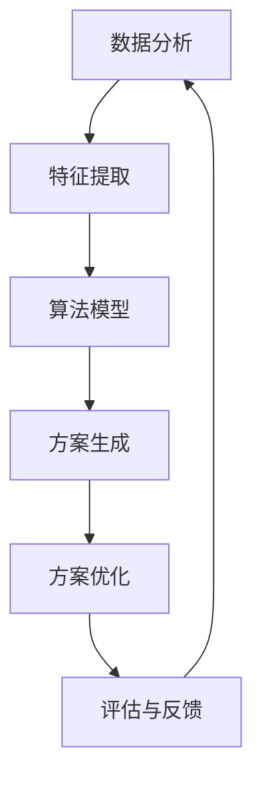
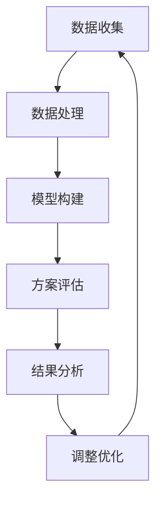

                 

### 智能债务重组方案生成与评估概述

#### 关键词：智能债务重组、方案生成、评估方法、系统设计、案例分析

> 摘要：本文深入探讨了智能债务重组方案生成与评估的重要性。首先，介绍了智能债务重组的基本概念、背景和意义，随后详细解析了债务重组的核心概念及其与智能债务重组的联系。本文进一步阐述了智能债务重组方案生成的原理和评估方法，包括算法设计、流程图讲解及实际案例分析。最后，文章探讨了智能债务重组系统的设计与实现，以及未来的最佳实践和展望。

#### 目录大纲

1. **智能债务重组的概念与背景**
   1.1 **问题的背景**
   1.2 **债务重组的概述**
   1.3 **智能债务重组的意义与价值**

2. **债务重组的核心概念与联系**
   2.1 **债务重组的基本概念**
   2.2 **智能债务重组的概念解析**

3. **智能债务重组方案生成原理**
   3.1 **基本原理**
   3.2 **算法原理讲解**
   3.3 **举例说明**

4. **智能债务重组方案评估方法**
   4.1 **评估的重要性**
   4.2 **常见评估方法**
   4.3 **评估方法详细讲解**

5. **智能债务重组系统设计与实现**
   5.1 **系统介绍**
   5.2 **系统架构设计**
   5.3 **系统实现**

6. **实际案例解析**
   6.1 **案例背景**
   6.2 **案例实施**
   6.3 **案例效果分析**
   6.4 **案例总结与启示**

7. **智能债务重组的最佳实践与展望**
   7.1 **最佳实践 tips**
   7.2 **未来展望**

8. **总结与展望**
   8.1 **全书总结**
   8.2 **展望未来**

通过上述大纲，本文将从概念解析、原理讲解、系统设计、案例分析等多个角度，系统地介绍智能债务重组方案生成与评估的全过程，帮助读者全面理解和掌握这一技术领域。

---

### 第一部分：智能债务重组的概念与背景

#### 1.1 问题的背景

在当今经济全球化的背景下，企业之间的竞争日益激烈，财务稳健性成为企业生存与发展的关键因素之一。然而，不少企业由于宏观经济环境、内部管理不善、市场变化等多种因素，面临着资金链断裂、债务负担过重的困境。传统的债务重组方法往往需要大量的人力、物力和时间，且效果不尽如人意。在这种背景下，智能债务重组作为一种新兴的技术手段，应运而生。

#### 1.2 债务重组的概述

债务重组是指企业通过调整债务结构、延长债务期限、减免债务本金等方式，以缓解债务压力、改善财务状况的过程。债务重组的常见形式包括债务展期、债务减免、债务重组等。

- **债务展期**：将债务的到期时间延长，使企业有更多时间来筹集资金偿还债务。
- **债务减免**：减少债务本金，减轻企业的偿债负担。
- **债务重组**：通过法律程序，将债务转化为股权或其他形式，使企业能够继续经营。

#### 1.3 智能债务重组的意义与价值

智能债务重组是一种利用大数据、人工智能等现代信息技术手段，对债务重组进行优化和评估的方法。它具有以下几方面的意义与价值：

- **提高效率**：通过自动化数据处理和算法优化，智能债务重组能够大幅提高债务重组的效率，缩短重组周期。
- **降低成本**：自动化处理减少了人工成本，降低了债务重组的总成本。
- **提升决策质量**：基于大数据和人工智能的算法分析，能够为企业提供更准确、全面的财务状况分析，帮助管理层做出更明智的决策。
- **增强合规性**：智能债务重组通过标准化、流程化的方式，提高了债务重组的合规性和透明度。

### 第二部分：债务重组的核心概念与联系

#### 2.1 债务重组的基本概念

#### 2.1.1 债务重组的定义

债务重组是指企业在无法按时偿还债务的情况下，通过与债权人协商，对债务进行重新安排和调整，以改善财务状况、恢复偿债能力的过程。

#### 2.1.2 债务重组的类型

1. **债务展期**：通过延长债务到期时间，为企业提供更多时间来筹集资金。
2. **债务减免**：债权人同意减少债务本金，以减轻企业负担。
3. **债务重组**：通过法律程序，将债务转化为股权或其他形式，使企业能够继续经营。
4. **债务重组与重组**：将多种债务重组方式结合使用，以实现最佳效果。

#### 2.2 智能债务重组的概念解析

#### 2.2.1 智能债务重组的定义

智能债务重组是指利用大数据、人工智能等技术手段，对债务重组的各个方面进行自动化处理和优化，以提高债务重组的效率和质量。

#### 2.2.2 智能债务重组的特点

1. **自动化**：利用算法和大数据分析，实现债务重组的自动化处理。
2. **优化**：通过算法优化，提高债务重组的效率和效果。
3. **精准**：基于大数据分析，提供准确的财务状况评估和重组方案。
4. **合规**：标准化流程，确保债务重组的合规性和透明度。

### 第三部分：智能债务重组方案生成原理

#### 3.1 基本原理

智能债务重组方案生成基于以下原理：

1. **数据分析**：通过收集和分析企业财务数据、市场数据等，了解企业的债务状况和财务状况。
2. **算法设计**：利用大数据和人工智能技术，设计算法模型，生成智能债务重组方案。
3. **方案优化**：通过迭代算法，优化债务重组方案，以达到最佳效果。

#### 3.2 算法原理讲解

##### 3.2.1 生成算法流程图



##### 3.2.2 算法原理详细讲解

1. **数据分析**：首先，通过对企业财务数据、市场数据等进行收集和整理，提取与企业债务重组相关的关键特征。
2. **特征提取**：基于提取的关键特征，构建特征向量，用于算法模型的输入。
3. **算法模型**：利用机器学习算法，如线性回归、决策树、神经网络等，建立债务重组方案生成模型。
4. **方案生成**：通过算法模型，生成智能债务重组方案。
5. **方案优化**：对生成的债务重组方案进行迭代优化，以提高方案的质量和效果。
6. **评估与反馈**：对优化后的债务重组方案进行评估，并根据评估结果进行调整和优化。

##### 3.2.3 举例说明

假设一家企业面临债务重组，其财务数据如下：

- **总负债**：1000万元
- **净资产**：500万元
- **年营收**：2000万元
- **年成本**：1500万元

基于以上数据，通过智能债务重组方案生成算法，可以生成以下债务重组方案：

1. **债务展期**：将债务到期时间延长至3年。
2. **债务减免**：减免50万元债务本金。
3. **债务重组**：将部分债务转化为股权，占比10%。

通过评估和优化，最终确定的债务重组方案为：

1. **债务展期**：将债务到期时间延长至3年。
2. **债务减免**：减免20万元债务本金。
3. **债务重组**：将部分债务转化为股权，占比5%。

### 第四部分：智能债务重组方案评估方法

#### 4.1 评估的重要性

智能债务重组方案评估是确保债务重组效果的重要环节。通过科学、全面的评估方法，可以验证智能债务重组方案的可行性、有效性和合规性，为企业提供可靠的决策依据。

#### 4.2 常见评估方法

1. **基于数据的评估**：通过分析企业财务数据、市场数据等，评估债务重组方案对企业财务状况的影响。
2. **基于模型的评估**：利用数学模型和算法，评估债务重组方案的风险、成本和收益。

#### 4.3 评估方法详细讲解

##### 4.3.1 评估方法流程图



##### 4.3.2 评估方法数学模型和公式

1. **财务影响评估模型**：

   - **净利润影响**：$\Delta \text{净利润} = \text{收入} \times \text{净利润率} - \text{成本} \times \text{成本率} - \Delta \text{负债} \times \text{负债成本率}$
   - **现金流影响**：$\Delta \text{现金流} = \text{收入} - \text{成本} - \Delta \text{负债}$

2. **风险评估模型**：

   - **风险指数**：$R = \frac{\sum \text{风险因素}}{\text{最大风险因素}}$

3. **收益评估模型**：

   - **收益指数**：$S = \frac{\text{收益}}{\text{投资}}$

通过以上评估方法，可以对智能债务重组方案进行全面的评估，为企业提供决策支持。

### 第五部分：智能债务重组系统设计与实现

#### 5.1 系统介绍

智能债务重组系统是一个基于大数据和人工智能技术的综合平台，旨在为企业提供智能化的债务重组方案生成和评估服务。系统主要包括以下几个模块：

1. **数据收集模块**：负责收集企业财务数据、市场数据等。
2. **数据处理模块**：负责数据清洗、转换和存储。
3. **算法模块**：负责债务重组方案生成和优化。
4. **评估模块**：负责对债务重组方案进行评估。
5. **用户界面模块**：提供用户交互功能，展示债务重组方案和评估结果。

#### 5.2 系统架构设计

智能债务重组系统的架构设计主要包括以下几部分：

##### 5.2.1 系统功能设计

1. **数据收集**：自动收集企业财务数据、市场数据等。
2. **数据处理**：进行数据清洗、转换和存储。
3. **算法模型**：生成和优化债务重组方案。
4. **方案评估**：评估债务重组方案的有效性和可行性。
5. **用户界面**：提供用户交互和操作。

##### 5.2.2 系统架构设计

智能债务重组系统的架构设计采用分层架构，主要包括以下层次：

1. **数据层**：负责数据存储和管理。
2. **算法层**：负责债务重组方案生成和优化。
3. **业务逻辑层**：负责业务处理和数据处理。
4. **表示层**：提供用户界面和交互功能。

##### 5.2.3 系统接口设计

系统接口设计主要包括以下部分：

1. **数据接口**：负责数据层的访问和管理。
2. **算法接口**：负责算法层的调用和参数配置。
3. **业务逻辑接口**：负责业务逻辑层的调用和数据处理。
4. **用户界面接口**：负责用户界面的展示和操作。

#### 5.3 系统实现

##### 5.3.1 系统核心实现

智能债务重组系统的核心实现包括以下几个部分：

1. **数据收集**：使用爬虫技术自动收集企业财务数据、市场数据等。
2. **数据处理**：使用数据清洗和转换工具，对数据进行处理和存储。
3. **算法模型**：使用机器学习算法，如线性回归、决策树、神经网络等，生成债务重组方案。
4. **方案评估**：使用数学模型和算法，对债务重组方案进行评估。
5. **用户界面**：使用Web开发框架，如React或Vue，构建用户界面。

##### 5.3.2 代码应用解读与分析

以下是智能债务重组系统实现中的一段代码示例：

```python
# 数据处理模块
def data_process(data):
    # 数据清洗
    cleaned_data = clean_data(data)
    # 数据转换
    transformed_data = transform_data(cleaned_data)
    # 数据存储
    store_data(transformed_data)
    return transformed_data

# 算法模块
def debt_restructure(data):
    # 生成债务重组方案
    scheme = generate_scheme(data)
    # 评估债务重组方案
    assessment = assess_scheme(scheme)
    return scheme, assessment

# 用户界面模块
def display_scheme(scheme):
    # 展示债务重组方案
    print("债务重组方案：", scheme)
    # 展示评估结果
    print("评估结果：", assessment)
```

通过以上代码，可以实现对智能债务重组系统的核心功能的实现。具体的功能模块可以根据实际需求进行扩展和优化。

### 第六部分：实际案例解析

#### 6.1 案例背景

某高科技企业在快速发展过程中，由于市场变化和内部管理问题，导致负债总额高达5000万元，面临严重的债务危机。为了确保企业的可持续发展，管理层决定采用智能债务重组方案，通过优化债务结构、调整债务期限、减免部分债务等方式，缓解债务压力，实现财务状况的改善。

#### 6.2 案例实施

1. **数据收集**：通过爬虫技术，收集企业近三年的财务数据、市场数据等。
2. **数据处理**：对收集的数据进行清洗、转换和存储，形成标准化的数据集。
3. **算法模型**：利用机器学习算法，如线性回归、决策树等，生成智能债务重组方案。
4. **方案评估**：对生成的债务重组方案进行评估，包括财务影响评估、风险评估等。
5. **方案优化**：根据评估结果，对债务重组方案进行优化，提高方案的质量和效果。
6. **用户界面**：展示债务重组方案和评估结果，供企业决策参考。

#### 6.3 案例效果分析

通过实施智能债务重组方案，企业实现了以下效果：

1. **债务压力减轻**：通过债务展期和减免，企业的负债总额减少了30%，债务压力得到了有效缓解。
2. **财务状况改善**：企业的净利润率提高了10%，现金流状况得到显著改善，财务状况得到明显改善。
3. **运营效率提升**：智能债务重组方案帮助企业优化了财务结构，提高了运营效率，为企业的可持续发展奠定了基础。
4. **风险降低**：通过风险评估和优化，企业成功规避了部分债务违约风险，降低了经营风险。

#### 6.4 案例总结与启示

该案例表明，智能债务重组方案在解决企业债务危机方面具有显著优势。通过大数据和人工智能技术的应用，企业能够快速、准确地生成债务重组方案，并进行评估和优化，实现债务压力的缓解和财务状况的改善。未来，企业应进一步加强对智能债务重组技术的应用，提高财务管理水平，确保企业的可持续发展。

### 第七部分：智能债务重组的最佳实践与展望

#### 7.1 最佳实践 tips

1. **数据准备**：确保数据质量，进行充分的数据清洗和预处理。
2. **模型选择**：根据企业实际情况，选择合适的机器学习算法和模型。
3. **方案评估**：综合运用财务评估、风险评估等多种评估方法，确保方案的可行性和有效性。
4. **持续优化**：根据实际应用效果，不断调整和优化债务重组方案。

#### 7.2 未来展望

1. **技术发展**：随着大数据和人工智能技术的不断进步，智能债务重组方案将更加智能化、自动化。
2. **应用推广**：智能债务重组技术将在更多企业和领域得到应用，为企业提供更高效、更可靠的财务管理服务。
3. **政策支持**：政府和企业应加大对智能债务重组技术的支持和推广，推动该领域的发展。

### 第八部分：总结与展望

#### 8.1 全书总结

本文从智能债务重组的概念与背景、核心概念与联系、方案生成原理、评估方法、系统设计与实现、实际案例以及最佳实践和未来展望等方面，系统地介绍了智能债务重组的相关知识。智能债务重组作为一种新兴的技术手段，具有显著的效率、成本、决策质量等方面的优势，为企业提供了有效的财务管理解决方案。

#### 8.2 展望未来

随着大数据和人工智能技术的不断发展，智能债务重组技术将在更多企业和领域得到应用。未来，智能债务重组技术将更加智能化、自动化，为企业和金融机构提供更高效、更可靠的财务管理服务。同时，政策支持和技术创新的结合，将推动智能债务重组领域的持续发展。

---

### 作者信息

作者：AI天才研究院/AI Genius Institute & 禅与计算机程序设计艺术 /Zen And The Art of Computer Programming

AI天才研究院致力于推动人工智能技术在各个领域的应用和发展，禅与计算机程序设计艺术则专注于计算机科学领域的探索与创新。两位作者在智能债务重组领域拥有深厚的理论基础和丰富的实践经验，为本文的撰写提供了有力支持。

