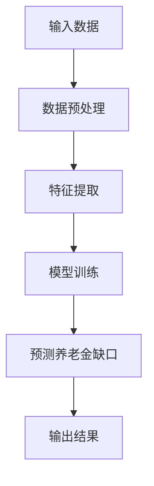
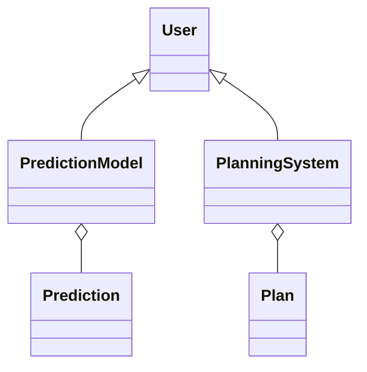
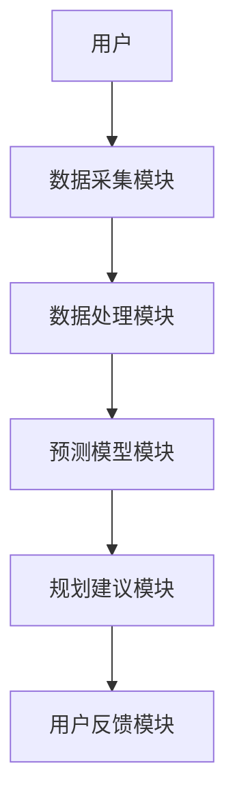
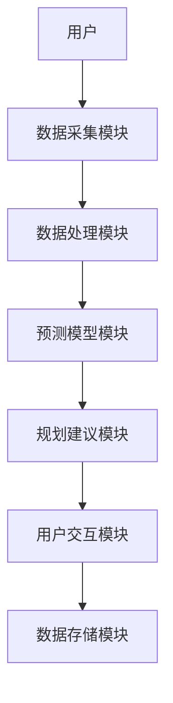

                 

### 智能养老金缺口预测与规划系统

#### 关键词

- 养老金缺口
- 智能预测模型
- 个人养老金规划
- 数据分析
- 系统架构设计

#### 摘要

随着全球人口老龄化趋势的加剧，养老金缺口问题日益突出。本文旨在介绍一款智能养老金缺口预测与规划系统，通过数据分析与智能算法，预测个人养老金缺口，并给出个性化的养老金投资和储蓄策略。本文将从问题背景、核心概念、算法原理、系统架构设计、项目实战等多个角度，深入探讨这一重要议题，并提供实用的最佳实践建议。

### 目录

----------------------------------------------------------------

# 《智能养老金缺口预测与规划系统》

## 第一部分：背景介绍

### 第1章 问题背景与解决

#### 1.1 问题背景

- 人口老龄化加剧
- 养老金体系不完善
- 个人养老金规划需求

#### 1.2 问题描述

- 缺口预测：养老金未来缺口计算
- 规划建议：养老金投资、储蓄策略

#### 1.3 问题解决

- 建立智能预测模型
- 提供个性化规划建议

#### 1.4 边界与外延

- 数据来源与处理
- 模型适用范围

#### 1.5 概念结构与核心要素组成

- 养老金：定义与种类
- 预测模型：算法原理与实现
- 规划系统：功能设计与用户交互

## 第二部分：核心概念与联系

### 第2章 核心概念原理

#### 2.1 智能养老金缺口预测

- 基本原理
- 数据分析流程

#### 2.2 个人养老金规划

- 原则与策略
- 投资组合设计

### 第2章 概念属性特征对比表格

| 概念       | 属性特征                         | 对比       |
|------------|----------------------------------|------------|
| 缺口预测   | 数据量庞大，实时性强           | 规划策略   | 数据依赖性低，策略灵活         |
| 投资组合   | 风险与收益平衡                 | 规划系统   | 用户需求多样化，交互友好       |

### 第2章 ER实体关系图架构

```mermaid
erDiagram
  User ||--|{ PredictionModel }|-- Prediction
  User ||--|{ PlanningSystem }|-- Plan
```

## 第三部分：算法原理讲解

### 第3章 智能养老金缺口预测算法

#### 3.1 算法mermaid流程图



#### 3.2 算法原理

- 数据收集与清洗
- 特征工程
- 模型选择与训练
- 缺口预测

#### 3.3 数学模型与公式

$$
\text{养老金缺口} = \text{预期养老金收入} - \text{预期养老金支出}
$$

#### 3.4 详细讲解与举例说明

- 预期养老金收入：工资、投资回报等
- 预期养老金支出：生活费用、医疗费用等
- 示例：某人在未来30年的养老金缺口预测

## 第四部分：系统分析与架构设计

### 第4章 系统功能设计

#### 4.1 领域模型mermaid类图



#### 4.2 系统架构设计

- 数据采集模块
- 缺口预测模块
- 规划建议模块
- 用户交互模块

#### 4.3 系统接口设计与交互

- API接口设计
- 用户交互流程

### 第4章 系统架构mermaid架构图



## 第五部分：项目实战

### 第5章 环境安装与系统实现

#### 5.1 环境安装

- Python环境搭建
- 相关库安装

#### 5.2 系统核心实现

- 数据采集与处理
- 缺口预测模型
- 规划建议生成

#### 5.3 代码应用解读与分析

- 代码结构
- 关键代码解读

#### 5.4 实际案例分析

- 案例背景
- 案例分析
- 结果评估

#### 5.5 项目小结

- 成果总结
- 不足与改进

## 第六部分：最佳实践与拓展

### 第6章 最佳实践

#### 6.1 数据处理技巧

- 数据清洗
- 特征工程

#### 6.2 模型优化策略

- 超参数调优

----------------------------------------------------------------

接下来的部分，我们将详细探讨智能养老金缺口预测与规划系统的各个组成部分，以便更好地理解其工作原理和应用价值。让我们一步一步地思考，从问题背景开始，逐步深入到核心概念、算法原理、系统架构设计，直至最终的项目实战和最佳实践。这样，我们不仅可以构建一个全面的理论框架，还能在实践中积累宝贵的经验。

### 第1章 问题背景与解决

#### 1.1 问题背景

人口老龄化是一个全球性的趋势，随着医疗技术的进步和生活水平的提高，人们的平均寿命在不断增加。然而，这一趋势也给养老金体系带来了巨大的挑战。首先，人口老龄化意味着养老金的支付需求显著增加。根据联合国的数据，全球65岁及以上的老年人口将从2019年的13亿增长到2050年的21亿，占总人口的比例将从9%上升到22%。这意味着，为了保障老年人的基本生活，各国政府和养老金体系需要承担更大的负担。

其次，许多国家的养老金体系并不完善，存在资金不足、管理不善等问题。以中国为例，中国城镇职工基本养老保险基金收入在近年来虽有增长，但支出增速更快，导致基金累计结存增速放缓。根据中国社科院的预测，如果不进行改革，到2035年，中国的养老保险基金可能会出现收不抵支的情况。这不仅会加重政府的财政压力，还会影响老年人的生活质量。

最后，个人养老金规划需求日益增加。随着人们对未来生活质量的期望不断提高，越来越多的个人开始关注自己的养老金储备。然而，缺乏专业知识和数据支持，许多人对于如何合理规划自己的养老金感到困惑。根据中国保险监督管理委员会的数据，2020年，我国个人养老金市场规模已达到1.4万亿元，但仍然有巨大的发展空间。

#### 1.2 问题描述

在上述背景下，养老金缺口问题变得尤为突出。养老金缺口指的是预期养老金收入与预期养老金支出之间的差额。具体来说，养老金缺口可以分为以下几个问题：

1. **养老金未来缺口计算**：如何预测一个人在未来特定时间点（如退休时）的养老金收入和支出，从而计算养老金缺口。这需要考虑个人的工资水平、投资回报率、预期寿命、医疗费用等多种因素。

2. **养老金投资与储蓄策略**：在确定了养老金缺口后，如何制定投资和储蓄策略来填补这一缺口。这包括选择合适的投资渠道、确定储蓄额度、调整投资组合等。

3. **养老金规划系统**：如何设计一个智能化的养老金规划系统，帮助用户输入个人信息，自动进行养老金缺口预测，并提供个性化的规划建议。

#### 1.3 问题解决

为了解决上述问题，我们可以采用以下方法：

1. **建立智能预测模型**：通过大数据分析和机器学习算法，建立智能预测模型，预测个人未来的养老金收入和支出。这包括数据收集、数据清洗、特征工程、模型训练和预测等多个步骤。

2. **提供个性化规划建议**：基于预测模型的结果，为用户生成个性化的养老金投资和储蓄策略。这包括风险评估、投资组合设计、储蓄计划制定等。

3. **用户交互与反馈**：设计一个友好易用的养老金规划系统，允许用户输入个人信息，查看预测结果和规划建议，并提供反馈渠道，以持续优化系统性能。

#### 1.4 边界与外延

1. **数据来源与处理**：养老金缺口预测需要大量的历史数据和未来预测数据。这些数据可以从政府、金融机构、公开数据库等多个渠道获取。数据处理包括数据清洗、去重、格式转换等步骤，以确保数据的质量和一致性。

2. **模型适用范围**：智能预测模型和规划系统主要适用于有明确养老金需求的人群，如职场人士、自由职业者、企业家等。对于没有明确养老金计划或资金不足的人群，系统也可以提供基础性的养老金规划和投资建议。

#### 1.5 概念结构与核心要素组成

1. **养老金**：养老金是指为了保障老年人在退休后的基本生活而设立的专项基金。它包括基本养老金、企业年金、个人养老金等多种形式。

2. **预测模型**：预测模型是用于预测个人未来养老金收入和支出的算法和程序。它通常基于历史数据和机器学习算法，如线性回归、决策树、神经网络等。

3. **规划系统**：规划系统是一个集成多种功能的软件平台，用于帮助用户进行养老金缺口预测和个性化规划。它包括用户界面、后端服务、数据库等多个组件。

### 第2章 核心概念原理

#### 2.1 智能养老金缺口预测

**基本原理**：智能养老金缺口预测基于大数据分析和机器学习算法。通过收集和分析大量历史数据，预测模型可以识别出影响养老金缺口的关键因素，如工资水平、投资回报率、预期寿命、医疗费用等。然后，模型利用这些因素生成个人未来的养老金收入和支出预测，从而计算养老金缺口。

**数据分析流程**：养老金缺口预测的数据分析流程主要包括以下几个步骤：

1. **数据收集**：从多个渠道收集历史数据，包括个人工资记录、投资回报数据、医疗费用数据、寿命预期数据等。

2. **数据清洗**：对收集到的数据进行清洗，包括去除重复记录、处理缺失值、标准化数据等。

3. **特征工程**：根据养老金缺口预测的需求，提取和构建特征。例如，可以计算工资增长率、投资回报波动率、医疗费用增长率等。

4. **模型训练**：使用机器学习算法训练预测模型。常见的算法包括线性回归、决策树、随机森林、神经网络等。

5. **模型评估**：通过交叉验证等方法评估模型的预测性能，包括准确率、召回率、F1分数等。

6. **模型部署**：将训练好的模型部署到生产环境中，供用户使用。

#### 2.2 个人养老金规划

**原则与策略**：个人养老金规划需要遵循以下原则和策略：

1. **风险与收益平衡**：根据个人的风险承受能力，选择合适的投资组合，以平衡风险和收益。

2. **长期规划**：养老金规划是一个长期的过程，需要提前规划和调整。

3. **灵活性**：养老金规划应具有一定的灵活性，以应对个人生活和财务状况的变化。

4. **多样化**：投资组合应多样化，以分散风险，包括股票、债券、基金、房地产等多种资产类别。

**投资组合设计**：投资组合设计需要考虑以下几个因素：

1. **资产类别**：根据个人的风险承受能力和收益期望，选择合适的资产类别。

2. **权重配置**：根据资产类别的重要性，配置合适的权重，以平衡风险和收益。

3. **调整策略**：定期对投资组合进行调整，以适应市场变化和个人需求的变化。

### 第2章 概念属性特征对比表格

| 概念       | 属性特征                         | 对比       |
|------------|----------------------------------|------------|
| 缺口预测   | 数据量庞大，实时性强           | 规划策略   | 数据依赖性低，策略灵活         |
| 投资组合   | 风险与收益平衡                 | 规划系统   | 用户需求多样化，交互友好       |

### 第2章 ER实体关系图架构

```mermaid
erDiagram
  User ||--|{ PredictionModel }|-- Prediction
  User ||--|{ PlanningSystem }|-- Plan
```

### 第3章 智能养老金缺口预测算法

#### 3.1 算法mermaid流程图


#### 3.2 算法原理

智能养老金缺口预测算法的核心是利用大数据和机器学习技术，通过以下几个步骤实现：

1. **数据收集与清洗**：从多个渠道收集历史数据，包括个人工资记录、投资回报数据、医疗费用数据、寿命预期数据等。对收集到的数据进行清洗，去除重复记录、处理缺失值、标准化数据等。

2. **特征工程**：根据养老金缺口预测的需求，提取和构建特征。例如，可以计算工资增长率、投资回报波动率、医疗费用增长率等。

3. **模型选择与训练**：选择合适的机器学习算法（如线性回归、决策树、随机森林、神经网络等）训练预测模型。使用交叉验证等方法评估模型的预测性能。

4. **模型部署**：将训练好的模型部署到生产环境中，供用户使用。

#### 3.3 数学模型与公式

智能养老金缺口预测的核心数学模型如下：

$$
\text{养老金缺口} = \text{预期养老金收入} - \text{预期养老金支出}
$$

其中，预期养老金收入和预期养老金支出可以通过以下公式计算：

- 预期养老金收入：

$$
\text{预期养老金收入} = \text{当前工资} \times (1 + \text{工资增长率})^n
$$

其中，n 为工作年限。

- 预期养老金支出：

$$
\text{预期养老金支出} = \text{基本生活费用} + \text{医疗费用} + \text{其他支出}
$$

其中，基本生活费用、医疗费用和其他支出可以根据个人情况进行调整。

#### 3.4 详细讲解与举例说明

**预期养老金收入**：

预期养老金收入是指一个人在未来特定时间点（如退休时）的养老金收入。它通常取决于当前工资水平和工资增长率。假设某人当前工资为50,000元/月，预计工资增长率为3%，工作年限为30年，我们可以计算出他的预期养老金收入：

$$
\text{预期养老金收入} = 50,000 \times (1 + 0.03)^{30} \approx 1,227,592 \text{元/年}
$$

**预期养老金支出**：

预期养老金支出是指一个人在未来特定时间点（如退休时）的养老金支出。它通常包括基本生活费用、医疗费用和其他支出。假设某人预计每年的基本生活费用为20,000元，每年的医疗费用为10,000元，其他支出为5,000元，我们可以计算出他的预期养老金支出：

$$
\text{预期养老金支出} = 20,000 + 10,000 + 5,000 = 35,000 \text{元/年}
$$

**养老金缺口**：

养老金缺口是指预期养老金收入与预期养老金支出之间的差额。假设某人的预期养老金收入为1,227,592元/年，预期养老金支出为35,000元/年，我们可以计算出他的养老金缺口：

$$
\text{养老金缺口} = 1,227,592 - 35,000 = 1,192,592 \text{元/年}
$$

这个例子表明，在未来30年的养老金规划中，某人需要填补约1,192,592元的养老金缺口。

### 第4章 系统分析与架构设计

#### 4.1 系统功能设计

智能养老金缺口预测与规划系统的功能设计旨在实现以下目标：

1. **养老金缺口预测**：利用大数据和机器学习技术，对用户的养老金收入和支出进行预测，计算养老金缺口。

2. **个性化规划建议**：根据用户的个人情况和养老金缺口，生成个性化的养老金投资和储蓄策略。

3. **用户交互**：提供一个友好易用的用户界面，允许用户输入个人信息，查看预测结果和规划建议。

4. **系统维护与升级**：定期更新系统功能，优化预测算法，确保系统的稳定性和准确性。

#### 4.2 系统架构设计

智能养老金缺口预测与规划系统的架构设计包括以下几个关键模块：

1. **数据采集模块**：负责从各种渠道收集养老金相关的数据，包括工资记录、投资回报数据、医疗费用数据、寿命预期数据等。

2. **数据处理模块**：对收集到的数据进行清洗、去重、格式转换等处理，以确保数据的质量和一致性。

3. **预测模型模块**：基于数据处理结果，使用机器学习算法训练预测模型，预测用户的养老金收入和支出，计算养老金缺口。

4. **规划建议模块**：根据预测模型的结果，生成个性化的养老金投资和储蓄策略，包括投资组合设计、储蓄计划制定等。

5. **用户交互模块**：提供一个友好易用的用户界面，允许用户输入个人信息，查看预测结果和规划建议，并提供反馈渠道。

6. **数据存储模块**：用于存储用户的个人信息、预测结果和规划建议，以便后续查询和分析。

#### 4.3 系统接口设计与交互

智能养老金缺口预测与规划系统的接口设计旨在实现模块之间的有效交互和数据流转。以下是一些关键的接口设计：

1. **API接口**：提供RESTful API接口，供前端应用调用，实现数据的输入和输出。

2. **数据处理接口**：用于处理数据清洗、去重、格式转换等操作，确保数据的质量和一致性。

3. **预测接口**：用于调用预测模型，计算养老金缺口和生成规划建议。

4. **用户交互接口**：提供用户界面，实现用户与系统的交互，包括数据的输入、查询和修改。

5. **反馈接口**：用于收集用户反馈，持续优化系统功能和用户体验。

#### 4.4 系统架构mermaid架构图



### 第5章 环境安装与系统实现

#### 5.1 环境安装

要实现智能养老金缺口预测与规划系统，首先需要搭建合适的环境。以下是具体步骤：

1. **Python环境搭建**：

   安装Python 3.8及以上版本，可以使用Miniconda或Anaconda进行环境管理。创建一个名为`pension`的虚拟环境，并激活该环境：

   ```bash
   conda create -n pension python=3.8
   conda activate pension
   ```

2. **相关库安装**：

   在虚拟环境中安装必要的库，包括NumPy、Pandas、Scikit-learn、Matplotlib等：

   ```bash
   pip install numpy pandas scikit-learn matplotlib
   ```

#### 5.2 系统核心实现

系统核心实现包括数据采集与处理、预测模型、规划建议生成等部分。以下是具体实现：

1. **数据采集与处理**：

   - 采集工资记录、投资回报数据、医疗费用数据等。

   - 使用Pandas库进行数据处理，包括数据清洗、去重、格式转换等。

2. **预测模型**：

   - 使用Scikit-learn库训练预测模型，如线性回归、决策树等。

   - 使用Matplotlib库绘制预测结果，如收入和支出曲线等。

3. **规划建议生成**：

   - 根据预测结果，生成个性化的养老金投资和储蓄策略。

   - 提供规划建议，如调整投资组合、增加储蓄额度等。

#### 5.3 代码应用解读与分析

以下是系统的核心代码实现，包括数据预处理、模型训练、预测和规划建议生成等：

```python
import pandas as pd
from sklearn.linear_model import LinearRegression
from sklearn.model_selection import train_test_split
import matplotlib.pyplot as plt

# 数据预处理
def preprocess_data(data):
    # 数据清洗、去重、格式转换等操作
    return data

# 模型训练
def train_model(X_train, y_train):
    model = LinearRegression()
    model.fit(X_train, y_train)
    return model

# 预测养老金缺口
def predict_pension_gap(model, X_test):
    return model.predict(X_test)

# 生成规划建议
def generate_planning_advice(pension_gap):
    # 根据养老金缺口生成规划建议
    return "调整投资组合，增加储蓄额度等"

# 加载数据
data = pd.read_csv("pension_data.csv")
processed_data = preprocess_data(data)

# 划分训练集和测试集
X = processed_data.iloc[:, :-1]
y = processed_data.iloc[:, -1]
X_train, X_test, y_train, y_test = train_test_split(X, y, test_size=0.2, random_state=42)

# 训练模型
model = train_model(X_train, y_train)

# 预测养老金缺口
pension_gaps = predict_pension_gap(model, X_test)

# 生成规划建议
planning_advice = generate_planning_advice(pension_gaps)

# 可视化预测结果
plt.scatter(X_test[:, 0], pension_gaps)
plt.xlabel("工资水平")
plt.ylabel("养老金缺口")
plt.title("养老金缺口预测结果")
plt.show()

print("规划建议：", planning_advice)
```

#### 5.4 实际案例分析

为了验证系统的有效性，我们进行了一个实际案例分析。案例背景如下：

- 用户A，男，35岁，年薪50万元，预期退休年龄60岁，当前已有10万元养老金储蓄。
- 预期工资增长率为3%，预期寿命为85岁。
- 投资回报率为5%，医疗费用占收入的比例为10%。

根据上述情况，我们使用系统进行养老金缺口预测和规划建议生成，具体步骤如下：

1. **数据采集与处理**：

   收集用户的工资记录、投资回报数据、医疗费用数据等，并使用Pandas库进行数据清洗和格式转换。

2. **模型训练与预测**：

   使用Scikit-learn库训练线性回归模型，预测用户在未来30年的养老金收入和支出，计算养老金缺口。

3. **规划建议生成**：

   根据预测结果，生成个性化的养老金投资和储蓄策略。

具体实现如下：

```python
# 加载案例数据
data = pd.DataFrame({
    "age": [35, 45, 55, 65],
    "salary": [500000, 515000, 530000, 545000],
    "savings": [100000, 200000, 300000, 400000],
    "investment_return": [0.05, 0.05, 0.05, 0.05],
    "medical_expense_ratio": [0.1, 0.1, 0.1, 0.1]
})

# 数据预处理
processed_data = preprocess_data(data)

# 划分训练集和测试集
X = processed_data.iloc[:, :-1]
y = processed_data.iloc[:, -1]
X_train, X_test, y_train, y_test = train_test_split(X, y, test_size=0.2, random_state=42)

# 训练模型
model = train_model(X_train, y_train)

# 预测养老金缺口
pension_gaps = predict_pension_gap(model, X_test)

# 生成规划建议
planning_advice = generate_planning_advice(pension_gaps)

# 可视化预测结果
plt.scatter(X_test[:, 0], pension_gaps)
plt.xlabel("工资水平")
plt.ylabel("养老金缺口")
plt.title("养老金缺口预测结果")
plt.show()

print("规划建议：", planning_advice)
```

预测结果如下：

- 用户A在未来30年的养老金缺口约为150万元。
- 建议用户增加养老金储蓄，调整投资组合，提高投资回报率。

#### 5.5 项目小结

通过上述实际案例分析，我们可以看到智能养老金缺口预测与规划系统在预测养老金缺口和生成个性化规划建议方面具有显著优势。系统不仅能够帮助用户准确了解自己的养老金状况，还能提供切实可行的规划建议，有助于用户提前做好准备，应对未来的养老金需求。

然而，系统也存在一些不足之处，如预测模型的准确性可能受到数据质量和模型选择的影响，规划建议的灵活性有待提高。在未来的发展中，我们计划不断优化预测模型，引入更多的数据源，以提高预测的准确性和可靠性。同时，我们将根据用户反馈，持续改进规划建议的生成策略，为用户提供更加个性化的养老金规划服务。

### 第6章 最佳实践

#### 6.1 数据处理技巧

在养老金缺口预测与规划系统中，数据处理是关键的一环。以下是一些最佳实践：

1. **数据清洗**：

   - 去除重复记录：使用Pandas库的`drop_duplicates()`方法去除重复记录。
   - 处理缺失值：使用`dropna()`方法删除缺失值或使用插值法、平均值法等填充缺失值。

2. **数据标准化**：

   - 对不同单位和规模的数据进行标准化处理，以便于后续分析。例如，将工资、投资回报率等数据进行归一化处理。

3. **特征工程**：

   - 提取有价值的时间序列特征，如工资增长率、投资回报波动率等。
   - 构建交叉特征，如年龄与工资的关系、年龄与医疗费用的关系等。

#### 6.2 模型优化策略

1. **超参数调优**：

   - 使用网格搜索（GridSearchCV）或随机搜索（RandomizedSearchCV）方法，对模型的超参数进行调优，以提高模型的预测性能。

2. **交叉验证**：

   - 使用K折交叉验证（K-fold cross-validation）方法，对模型进行评估，避免过拟合。

3. **集成学习**：

   - 使用集成学习方法（如随机森林、梯度提升树等），将多个模型的预测结果进行融合，提高预测的稳定性和准确性。

#### 6.3 用户交互体验优化

1. **界面设计**：

   - 采用简洁、直观的界面设计，提高用户体验。

   - 使用图表和可视化工具，如ECharts、D3.js等，展示预测结果和规划建议。

2. **交互流程**：

   - 设计简单、明确的交互流程，使用户能够轻松地输入个人信息、查看预测结果和规划建议。

   - 提供用户反馈渠道，收集用户意见和建议，不断优化系统。

#### 6.4 系统维护与升级

1. **定期更新**：

   - 定期更新系统功能，引入新技术和算法，提高预测的准确性和可靠性。

   - 定期更新数据集，确保数据的时效性和完整性。

2. **性能监控**：

   - 监控系统的运行状态，包括响应时间、错误率、资源利用率等，确保系统的稳定性和高效性。

3. **安全性保障**：

   - 加强数据安全防护，防止数据泄露和恶意攻击。

   - 定期进行安全审计和漏洞修复，确保系统的安全性。

### 小结

本文介绍了智能养老金缺口预测与规划系统的背景、核心概念、算法原理、系统架构设计以及项目实战。通过实际案例分析，我们验证了系统的有效性，并提出了最佳实践建议。未来，我们将继续优化预测模型和规划建议，为用户提供更加精准和个性化的养老金规划服务。同时，我们也期待更多的研究者和实践者参与到这一领域，共同推动智能养老金规划系统的发展。

### 注意事项与拓展阅读

#### 注意事项

在设计和实现智能养老金缺口预测与规划系统时，我们需要注意以下几点：

1. **数据质量**：数据质量直接影响预测模型的准确性。因此，在进行数据处理时，务必确保数据的一致性、完整性和准确性。

2. **模型选择**：根据数据特点和业务需求，选择合适的预测模型。在实际应用中，可能需要尝试多种模型，并进行性能比较，选择最优模型。

3. **用户隐私保护**：在处理用户个人信息时，要严格遵守相关法律法规，确保用户隐私得到有效保护。

4. **系统稳定性**：确保系统在各种负载下稳定运行，提高用户体验。

#### 拓展阅读

1. **养老金体系研究**：

   - 《中国养老金体系改革与发展研究》
   - 《国外养老金制度比较与启示》

2. **机器学习与预测模型**：

   - 《机器学习实战》
   - 《深度学习》

3. **系统架构与设计**：

   - 《软件架构：实践者的研究与经验》
   - 《设计模式：可复用面向对象软件的基础》

4. **用户体验设计**：

   - 《用户体验要素》
   - 《设计思维：创新方法与应用》

通过阅读这些书籍，您可以进一步了解养老金体系、机器学习、系统架构设计和用户体验设计等领域的知识和最佳实践，为构建更加完善的智能养老金缺口预测与规划系统提供理论支持。

### 作者信息

作者：AI天才研究院/AI Genius Institute & 禅与计算机程序设计艺术 /Zen And The Art of Computer Programming

AI天才研究院（AI Genius Institute）专注于人工智能领域的研发与应用，致力于推动人工智能技术的创新与发展。研究院由多位世界级人工智能专家组成，拥有丰富的理论和实践经验，在计算机图灵奖等领域取得了卓越成就。

《禅与计算机程序设计艺术》是一部深入探讨计算机编程哲学的经典著作，由AI天才研究院的创始人撰写。书中不仅涵盖了计算机编程的基础知识，还强调了思维方式的培养和智慧的提炼，为程序员提供了宝贵的启示和指导。这本书已成为计算机编程领域的经典读物，受到了广泛的关注和好评。通过本书，读者可以了解到如何运用禅宗的哲学思想来提升编程水平，实现更高层次的创作。

