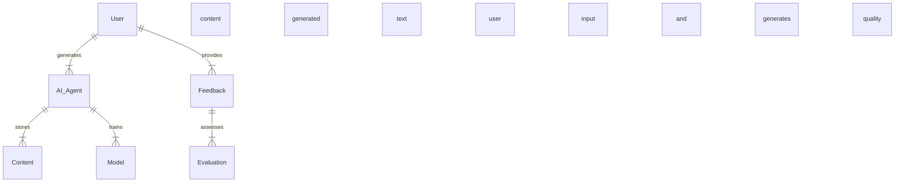
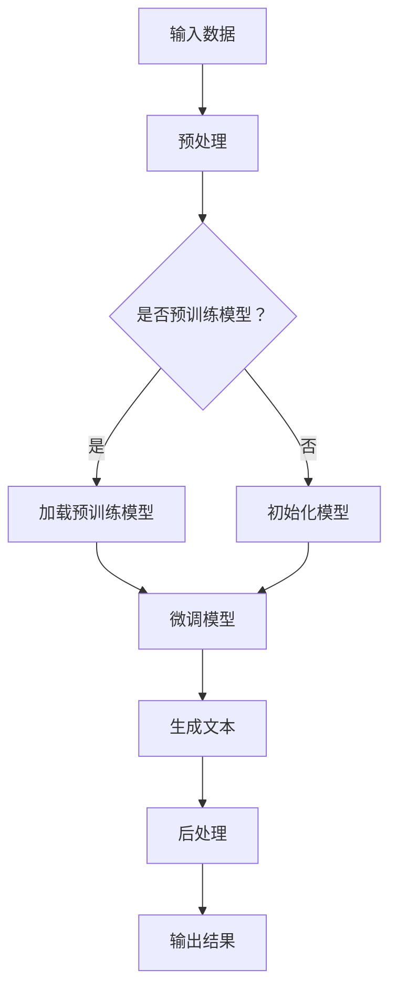
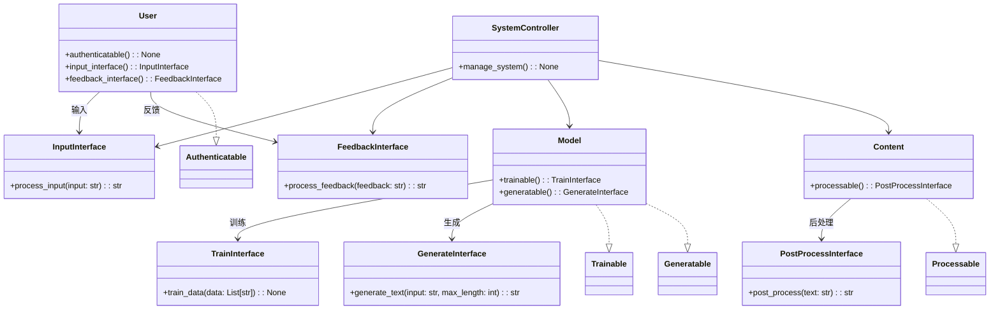
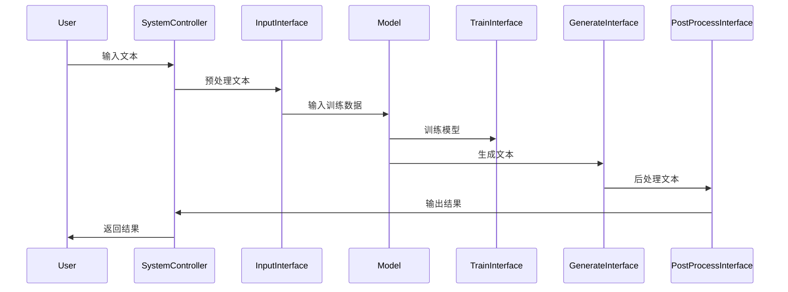

                 

### 第一部分：背景介绍

#### 1.1.1 写作需求与挑战

在当今信息爆炸的时代，内容创作已经成为各行各业的重要环节。无论是企业宣传、教育培训、科学研究，还是日常的个人博客和社交媒体，写作需求无处不在。然而，高质量内容的创作并非易事，它需要创作者具备丰富的知识储备、深厚的文化底蕴、敏锐的洞察力和出色的文字功底。随着互联网和人工智能技术的发展，智能写作AI Agent应运而生，旨在帮助人类解决写作难题，提高内容创作的效率和质量。

写作需求主要体现在以下几个方面：

1. **快速生成内容**：在竞争激烈的互联网环境中，企业需要快速响应市场变化，发布大量的宣传材料、产品介绍、新闻报道等。传统的人工写作方式效率低下，难以满足这一需求。
2. **多样化和个性化**：用户对内容的需求越来越多样化和个性化，从新闻、资讯、博客到小说、剧本、音乐歌词等，各行业都需要大量的个性化内容。智能写作AI Agent可以通过学习和模拟不同风格和主题，满足这一需求。
3. **高效利用资源**：对于一些大型企业和媒体机构，拥有大量的内容创作人员，如何高效利用这些资源成为了一大挑战。智能写作AI Agent可以通过自动化写作，帮助创作者节省时间，将精力投入到更复杂的创作任务中。

然而，智能写作也面临着一系列挑战：

1. **内容质量和原创性**：虽然AI能够快速生成内容，但如何保证内容的原创性和质量是一个重大难题。AI生成的文章往往缺乏深度和情感，难以达到人类创作的水平。
2. **数据隐私和伦理问题**：智能写作AI Agent需要大量的数据作为训练素材，这些数据往往涉及用户隐私。如何在保护用户隐私的同时，充分利用这些数据进行训练是一个亟待解决的问题。
3. **创作灵感和创新**：尽管AI在数据处理和模式识别方面有优势，但创作灵感和创新仍然是人类独特的优势。如何让AI在创作过程中融入人类的创意，提高内容的创新性，也是一个需要深入探讨的问题。

#### 1.1.2 智能写作的概念与意义

智能写作，也被称为自动写作或AI写作，是指利用人工智能技术，特别是自然语言处理（NLP）和机器学习（ML）技术，自动化生成文本内容的过程。与传统的手工写作不同，智能写作依赖于大规模的文本数据、先进的算法模型和强大的计算能力。

**智能写作的组成部分**：

1. **数据集**：智能写作需要大量的文本数据作为训练素材，这些数据包括各种风格的文本，如新闻报道、小说、论文、广告等。数据集的质量直接影响AI的写作能力。
2. **算法模型**：目前主流的智能写作算法是基于预训练的变换器模型（Transformer），如GPT（Generative Pre-trained Transformer）系列。这些模型通过深度学习技术，从大量的文本数据中学习语言模式和结构，从而生成新的文本。
3. **用户界面**：为了方便用户使用，智能写作系统通常提供友好的用户界面，用户可以通过简单的操作，生成符合需求的文章。

**智能写作的意义**：

1. **提高创作效率**：智能写作AI Agent可以快速生成大量的文本内容，大大提高写作效率，减轻创作者的工作负担。
2. **拓展创作能力**：AI可以模拟不同的写作风格和语言，创作者可以利用AI来拓展自己的创作能力，尝试不同的风格和主题。
3. **降低创作门槛**：对于非专业创作者，如企业员工、学生等，智能写作AI Agent可以帮助他们生成高质量的内容，降低写作门槛。
4. **数据分析和利用**：智能写作AI Agent不仅能够生成文本，还可以对生成的内容进行分析，为创作者提供有价值的反馈和建议。

#### 1.1.3 LLMAgent的核心地位与前景

在智能写作领域，LLMAgent（Language Learning Machine Agent）是一种重要的技术方案。LLMAgent是基于大规模语言模型（Large Language Model，简称LLM）的AI写作工具，其核心地位主要体现在以下几个方面：

1. **强大的语言理解能力**：LLM通过深度学习从大量的文本数据中学习语言模式和结构，具有强大的语言理解能力。这使得LLMAgent能够生成逻辑清晰、语法正确的文本。
2. **丰富的应用场景**：LLMAgent可以应用于各种写作场景，如新闻写作、广告文案、产品介绍、论文写作等。通过定制化的训练，LLMAgent可以适应不同的写作需求和风格。
3. **高效的内容生成**：LLMAgent可以快速生成大量的文本内容，大大提高写作效率。对于需要处理大量内容的企业和媒体机构，LLMAgent具有明显的优势。

**LLMAgent的前景**：

1. **技术创新**：随着深度学习技术和自然语言处理技术的不断进步，LLMAgent的性能将不断提高，应用场景将不断拓展。
2. **市场潜力**：随着内容创作需求的增加，智能写作市场具有巨大的市场潜力。LLMAgent作为智能写作的核心技术，将在这一市场中占据重要地位。
3. **产业变革**：智能写作AI Agent有望颠覆传统的写作方式，改变内容创作的产业链，为创作者和消费者带来全新的体验。

总之，智能写作AI Agent，特别是LLMAgent，在当今信息时代具有重要的地位和广阔的前景。通过不断的技术创新和应用探索，LLMAgent将为人类的内容创作带来革命性的变革。

#### 1.2 问题描述

**1.2.1 传统写作与智能写作的区别**

传统写作和智能写作在多个方面存在显著差异，主要体现在以下几个方面：

1. **创作过程**：
   - **传统写作**：传统写作通常需要创作者有深厚的文字功底和丰富的知识储备。创作者需要经过构思、草稿、修改等多个阶段，最终完成一篇高质量的文章。
   - **智能写作**：智能写作依赖于AI模型，通过学习和模拟大量的文本数据生成文章。用户只需输入主题或关键字，AI即可快速生成一篇符合要求的内容。

2. **效率**：
   - **传统写作**：传统写作效率较低，需要创作者投入大量时间和精力。对于长篇内容或紧急任务，创作者可能难以在短时间内完成。
   - **智能写作**：智能写作具有高效的特点，AI可以在短时间内生成大量内容。对于大量内容的生成需求，智能写作显然更具优势。

3. **内容原创性和质量**：
   - **传统写作**：传统写作通常能保证内容的原创性和质量，创作者可以通过自身经验和判断，确保文章的表达清晰、逻辑严密。
   - **智能写作**：智能写作虽然能够快速生成内容，但原创性和质量往往难以保证。AI生成的文章可能存在逻辑不清、表达不精确的问题。

4. **灵活性和创造性**：
   - **传统写作**：传统写作强调创作者的创造力和灵活性。创作者可以根据自己的经验和直觉，进行个性化的创作。
   - **智能写作**：智能写作依赖于AI模型，其灵活性和创造性受到模型的限制。虽然AI可以通过训练不断优化，但无法完全替代人类的创造过程。

5. **应用场景**：
   - **传统写作**：传统写作适用于需要高度专业知识和个人特色的创作，如学术论文、文学作品、专业书籍等。
   - **智能写作**：智能写作适用于大量、快速的内容生成场景，如新闻写作、广告宣传、产品介绍、自动化报告等。

**1.2.2 智能写作AI Agent的关键要素**

智能写作AI Agent的运作涉及多个关键要素，这些要素共同作用，确保AI能够高效、准确地生成高质量的内容。以下是智能写作AI Agent的关键要素：

1. **大规模文本数据集**：
   - **作用**：大规模文本数据集是智能写作AI Agent的基础。通过学习这些数据，AI可以掌握语言的多样性和复杂性。
   - **要求**：数据集应涵盖各种主题、风格和语言表达，以保证AI的泛化能力。

2. **预训练变换器模型（Transformer）**：
   - **作用**：预训练变换器模型是智能写作的核心算法。通过大规模的预训练，模型可以捕捉到语言的结构和模式，从而生成高质量的文章。
   - **要求**：模型应具有强大的语言理解和生成能力，同时能够适应不同的写作任务和场景。

3. **用户界面**：
   - **作用**：用户界面是用户与智能写作AI Agent交互的桥梁。一个友好、易用的界面可以降低用户使用AI的门槛，提高使用体验。
   - **要求**：界面应简洁直观，提供丰富的交互功能，如主题选择、风格调整、内容预览等。

4. **训练和优化**：
   - **作用**：训练和优化是提升智能写作AI Agent性能的关键。通过不断的训练和优化，模型可以不断改进，生成更高质量的内容。
   - **要求**：训练过程应注重数据质量和模型性能的平衡，确保AI能够在各种场景下稳定、高效地工作。

5. **后处理和校对**：
   - **作用**：后处理和校对是确保生成内容质量的重要环节。通过校对和优化，AI生成的文章可以进一步修正错误、提高逻辑性和可读性。
   - **要求**：后处理应包括语法检查、语义分析、逻辑修正等，确保生成内容符合人类阅读习惯。

**1.3 问题解决**

为了解决智能写作AI Agent在内容生成中的各种挑战，我们可以从以下几个方面进行努力：

1. **改进算法模型**：
   - **目标**：通过改进算法模型，提升AI的生成质量和原创性。
   - **方法**：采用更先进的深度学习模型，如GPT-4、BERT等，同时加强模型在多种语言和风格上的训练，提高其泛化能力。

2. **增强用户互动**：
   - **目标**：通过增强用户与AI的互动，提高写作效率和用户体验。
   - **方法**：设计更加智能化的用户界面，提供丰富的交互功能，如实时反馈、个性化建议等，使用户能够更灵活地控制AI的写作过程。

3. **加强数据质量控制**：
   - **目标**：通过加强数据质量控制，提高AI生成内容的原创性和可靠性。
   - **方法**：严格筛选和清洗训练数据，避免使用低质量或重复的数据，同时引入数据增强技术，丰富数据集的多样性。

4. **后处理和校对优化**：
   - **目标**：通过优化后处理和校对环节，提升AI生成内容的可读性和逻辑性。
   - **方法**：引入先进的自然语言处理技术，如语法分析、语义分析等，对生成内容进行深度校对和优化，确保文章的表达清晰、逻辑严密。

**1.4 边界与外延**

**1.4.1 智能写作的适用场景**

智能写作AI Agent在多个领域具有广泛的应用前景，以下是一些典型的适用场景：

1. **新闻写作**：智能写作AI Agent可以自动生成新闻报道，提高新闻发布的速度和准确性。
2. **广告文案**：智能写作AI Agent可以生成创意广告文案，帮助企业快速投放多样化的广告内容。
3. **学术论文**：智能写作AI Agent可以帮助研究人员快速生成论文草稿，提高学术研究的效率。
4. **产品介绍**：智能写作AI Agent可以生成产品介绍和用户手册，提高产品的市场竞争力。
5. **教育内容**：智能写作AI Agent可以自动生成课程教材和教学材料，为教育工作者提供便捷的教学工具。

**1.4.2 LLMAgent的能力与局限**

LLMAgent作为一种先进的智能写作工具，具有许多优势，但同时也存在一些局限：

1. **优势**：
   - **高效内容生成**：LLMAgent能够快速生成大量高质量的内容，提高写作效率。
   - **多样化写作风格**：通过预训练和定制化训练，LLMAgent可以适应多种写作风格和主题。
   - **跨语言支持**：LLMAgent可以处理多种语言，实现跨语言的写作和翻译。

2. **局限**：
   - **原创性和质量**：AI生成的文章在原创性和质量上可能无法完全媲美人类创作，需要后续的校对和优化。
   - **数据处理和隐私**：训练LLMAgent需要大量高质量的文本数据，但如何处理和保障用户数据隐私是一个重要问题。
   - **创作灵感和创新**：尽管AI可以模拟人类写作，但缺乏真正的创作灵感和创新，这是未来需要进一步探讨和解决的问题。

**1.5 概念结构与核心要素组成**

为了更好地理解智能写作AI Agent的工作原理和应用，我们需要从概念结构和核心要素组成的角度进行分析。

**1.5.1 智能写作AI Agent的概念结构**

智能写作AI Agent可以看作是一个包含多个子系统和模块的复杂系统，其概念结构主要包括以下几个部分：

1. **数据输入模块**：负责接收用户的输入信息，如主题、关键字等。
2. **模型训练模块**：基于大规模文本数据集，训练AI模型，包括预训练和定制化训练。
3. **内容生成模块**：利用训练好的AI模型，生成符合用户需求的文章内容。
4. **用户界面模块**：提供用户与AI交互的接口，包括输入界面、内容预览、编辑功能等。
5. **后处理模块**：对生成的文章进行校对、优化和润色，提高文章的质量。

**1.5.2 LLMAgent的核心要素组成**

LLMAgent的核心要素主要包括以下几部分：

1. **大规模文本数据集**：用于训练AI模型，保证模型的泛化能力和多样性。
2. **预训练变换器模型（Transformer）**：作为核心算法，负责文本理解和生成。
3. **用户界面**：提供用户交互的接口，包括输入、输出、调整参数等功能。
4. **训练和优化工具**：用于对AI模型进行训练和优化，提高生成质量。
5. **后处理和校对工具**：用于对生成的文章进行深度校对和优化，确保内容质量。

通过以上概念结构和核心要素的组成，我们可以更深入地理解智能写作AI Agent的工作原理和应用，为未来的研究和开发提供指导。

### 第一部分总结

在本部分中，我们首先介绍了写作需求与挑战，分析了智能写作的概念与意义，并讨论了LLMAgent在智能写作中的核心地位和前景。接着，我们详细描述了传统写作与智能写作的区别，明确了智能写作AI Agent的关键要素，并提出了问题解决的途径。最后，我们探讨了智能写作的适用场景和LLMAgent的能力与局限，以及智能写作AI Agent的概念结构与核心要素组成。通过这一系列的背景介绍，我们为后续深入探讨智能写作AI Agent的原理、算法、系统设计与项目实战等核心内容奠定了坚实的基础。接下来，我们将继续深入分析智能写作AI Agent的核心概念和原理。

### 第二部分：核心概念与联系

#### 2.1 智能写作AI Agent的原理与特点

智能写作AI Agent（以下简称AI Agent）是智能写作系统中的核心组件，它通过先进的算法和模型，实现自动化的内容生成。以下是AI Agent的原理与特点：

**2.1.1 智能写作AI Agent的基本原理**

AI Agent的工作原理主要依赖于深度学习和自然语言处理（NLP）技术。具体来说，AI Agent包含以下几个关键步骤：

1. **数据输入**：用户通过用户界面输入主题、关键词或其他提示信息，这些信息作为AI Agent的输入数据。
2. **模型训练**：AI Agent使用预训练的大规模语言模型（如GPT系列）进行训练。预训练模型通过学习海量的文本数据，掌握了语言的结构、语义和风格。
3. **文本生成**：基于训练好的模型，AI Agent生成新的文本内容。这一过程通常涉及上下文预测和词汇选择，通过组合已有的语言知识和用户输入，生成符合要求的文章。
4. **后处理**：生成的文本通常需要经过后处理和校对，以确保文章的逻辑性和可读性。后处理包括语法检查、语义优化、格式调整等。

**2.1.2 智能写作AI Agent的主要特点**

AI Agent具有以下主要特点：

1. **高效性**：AI Agent能够快速生成大量高质量的内容，极大地提高了写作效率。对于需要处理大量文本内容的场景，如新闻写作、广告宣传等，AI Agent具有显著的优势。
2. **多样性**：AI Agent通过预训练和定制化训练，可以适应多种写作风格和主题。用户可以根据需求调整写作风格，如正式、幽默、生动等。
3. **灵活性和可扩展性**：AI Agent具有高度的灵活性和可扩展性。用户可以根据不同的任务需求，调整输入参数和模型配置，实现定制化的写作服务。
4. **原创性和质量**：虽然AI Agent生成的文章在原创性和质量上可能存在一定的局限性，但通过不断的训练和优化，AI Agent的生成质量在逐步提升。同时，后处理和校对环节也起到了重要的优化作用。

**2.1.3 智能写作AI Agent与传统写作工具的区别**

智能写作AI Agent与传统写作工具（如文本编辑器、写作辅助软件等）在多个方面存在显著区别：

1. **技术基础**：
   - **传统写作工具**：传统写作工具主要依赖于人类的直接输入和手动操作，缺乏自动化和智能化的特点。
   - **智能写作AI Agent**：智能写作AI Agent基于深度学习和NLP技术，能够自动化地生成文本内容，无需用户的直接操作。

2. **内容生成能力**：
   - **传统写作工具**：传统写作工具主要用于辅助人类写作，如提供语法检查、拼写纠正、模板建议等，但无法实现全自动的内容生成。
   - **智能写作AI Agent**：智能写作AI Agent能够根据用户输入的提示，全自动地生成完整的文章，实现了从输入到输出的全流程自动化。

3. **用户体验**：
   - **传统写作工具**：传统写作工具通常需要用户具备一定的写作技能，用户需要自行构思、撰写和修改文章。
   - **智能写作AI Agent**：智能写作AI Agent提供简单易用的用户界面，用户无需具备专业写作技能，即可快速生成高质量的内容。

4. **应用范围**：
   - **传统写作工具**：传统写作工具适用于个人或小规模的内容创作，如个人博客、文档编写等。
   - **智能写作AI Agent**：智能写作AI Agent适用于大规模的内容生成场景，如新闻写作、广告宣传、自动化报告生成等，具有更广泛的应用前景。

总之，智能写作AI Agent与传统写作工具相比，在技术基础、内容生成能力、用户体验和应用范围等方面具有显著优势。随着AI技术的不断发展，智能写作AI Agent将在未来扮演越来越重要的角色。

#### 2.2 LLM Agent的概念与功能

LLM Agent（Language Learning Machine Agent）是智能写作AI Agent的一种特殊形式，其核心在于利用大规模语言模型（Large Language Model，简称LLM）实现高效、准确的内容生成。以下是LLM Agent的概念与功能：

**2.2.1 LLM Agent的定义**

LLM Agent是一种基于大规模语言模型的智能写作工具，通过深度学习技术，从大量的文本数据中学习语言模式和结构，实现自动化文本生成。LLM Agent的核心在于其强大的语言理解和生成能力，能够处理复杂多样的写作任务。

**2.2.2 LLM Agent的核心功能**

LLM Agent具有以下几个核心功能：

1. **文本生成**：LLM Agent能够根据用户输入的提示，生成高质量、符合逻辑的文本内容。这一功能是LLM Agent最核心的部分，也是其区别于其他写作工具的关键优势。

2. **风格变换**：LLM Agent可以通过训练，适应不同的写作风格和语言表达方式。用户可以根据需求，调整生成文本的风格，如正式、幽默、生动等。

3. **主题生成**：LLM Agent可以根据用户指定的主题，生成相关的文章内容。这一功能适用于新闻写作、广告宣传、产品介绍等场景，用户只需指定主题，LLM Agent即可自动生成符合要求的内容。

4. **内容优化**：LLM Agent在生成文本后，会进行一系列的优化和校对操作，确保文章的逻辑清晰、表达准确。这一功能包括语法检查、语义优化、格式调整等。

5. **多语言支持**：LLM Agent具有跨语言支持的能力，能够处理多种语言的内容生成。用户可以选择不同的语言进行输入和输出，LLM Agent能够自动适应语言特点，生成符合语言习惯的文本。

**2.2.3 LLM Agent在智能写作中的应用**

LLM Agent在智能写作中的应用场景非常广泛，以下是一些典型的应用场景：

1. **新闻写作**：LLM Agent可以自动生成新闻报道，提高新闻发布的速度和准确性。用户只需输入新闻主题，LLM Agent即可生成一篇符合标准的新闻报道。

2. **广告文案**：LLM Agent可以生成创意广告文案，帮助企业快速投放多样化的广告内容。用户可以根据广告目标，调整文案风格和表达方式，实现个性化的广告效果。

3. **产品介绍**：LLM Agent可以自动生成产品介绍和用户手册，提高产品的市场竞争力。用户只需提供产品相关信息，LLM Agent即可生成详细的产品介绍和用户手册。

4. **学术论文**：LLM Agent可以帮助研究人员快速生成论文草稿，提高学术研究的效率。用户可以根据论文结构，指定各个章节的内容，LLM Agent会自动生成符合学术规范的文章。

5. **教育培训**：LLM Agent可以自动生成课程教材和教学材料，为教育工作者提供便捷的教学工具。用户可以根据课程大纲，生成相关的教学内容，提高教学质量。

总之，LLM Agent作为一种先进的智能写作工具，具有强大的语言理解和生成能力，能够应用于多种写作场景，提高内容创作的效率和质量。随着技术的不断进步和应用场景的不断拓展，LLM Agent将在智能写作领域发挥越来越重要的作用。

#### 2.3 概念属性特征对比表格

为了更直观地比较智能写作AI Agent和普通AI工具在概念属性特征上的差异，我们制作了以下对比表格：

| 概念属性       | 智能写作AI Agent | 普通AI工具                |
|----------------|-----------------|--------------------------|
| **数据输入**   | 支持多种文本输入 | 数据输入通常较为简单，如关键字或数值 |
| **算法模型**   | 基于大规模语言模型（如GPT） | 基于特定任务的算法模型，如分类、回归 |
| **内容生成**   | 可以生成高质量的文本内容 | 通常只能生成结构化数据，如表格、图表 |
| **灵活性**     | 高灵活性，可适应多种写作任务 | 较低灵活性，通常仅适用于特定任务 |
| **用户体验**   | 提供友好用户界面，易操作 | 用户界面通常较为简单，操作复杂度较高 |
| **原创性**     | 较高原创性，但需后处理优化 | 低原创性，通常依赖人类输入 |
| **应用场景**   | 广泛应用，如新闻、广告、教育等 | 较特定应用，如数据分类、图像识别 |

通过上述对比表格，我们可以清晰地看到智能写作AI Agent在多个方面与普通AI工具的区别。智能写作AI Agent具有更高的数据输入灵活性、更强的内容生成能力、更好的用户体验和更广泛的适用场景，使其在智能写作领域具有独特的优势。

#### 2.4 ER实体关系图架构

为了更直观地展示智能写作系统的实体与关系，我们使用Mermaid语言绘制了以下ER实体关系图：



**2.4.1 智能写作系统的实体与关系**

- **User（用户）**：智能写作系统的核心实体之一，负责提供输入和反馈。用户可以通过用户界面输入主题、关键词等提示信息，并接收AI Agent生成的文本内容。用户还可以对生成内容进行评价和反馈。
- **AI_Agent（AI写作代理）**：智能写作系统的核心组件，负责接收用户输入、训练模型和生成内容。AI Agent通过大规模语言模型（如GPT）实现文本生成，并根据用户反馈不断优化。
- **Content（内容）**：存储AI Agent生成的文本内容。每篇文章都关联一个Content实体，记录生成时间、内容类型等信息。
- **Feedback（反馈）**：记录用户的输入和评价。通过反馈，AI Agent可以了解用户需求，优化生成内容。
- **Model（模型）**：存储AI Agent的训练数据和模型参数。模型是AI Agent的核心资产，通过不断的训练和优化，提高生成内容的质量。
- **Evaluation（评价）**：对生成内容的评价。评价包括内容质量、逻辑性、可读性等，用于指导AI Agent的进一步优化。

**2.4.2 LLM Agent在系统中的角色与作用**

LLM Agent是智能写作系统中的一个重要组件，其角色和作用主要体现在以下几个方面：

- **内容生成**：LLM Agent利用大规模语言模型（如GPT），根据用户输入的提示，生成高质量、符合逻辑的文本内容。这是LLM Agent最核心的功能。
- **风格变换**：LLM Agent可以通过训练，适应不同的写作风格和语言表达方式。用户可以根据需求，调整生成文本的风格，如正式、幽默、生动等。
- **主题生成**：LLM Agent可以根据用户指定的主题，生成相关的文章内容。用户只需输入主题，LLM Agent即可自动生成符合要求的内容。
- **内容优化**：LLM Agent在生成文本后，会进行一系列的优化和校对操作，确保文章的逻辑清晰、表达准确。这一功能包括语法检查、语义优化、格式调整等。
- **跨语言支持**：LLM Agent具有跨语言支持的能力，能够处理多种语言的内容生成。用户可以选择不同的语言进行输入和输出，LLM Agent能够自动适应语言特点，生成符合语言习惯的文本。

通过上述ER实体关系图，我们可以清晰地看到智能写作系统的组成及其各实体之间的关系。LLM Agent作为核心组件，在其中扮演着至关重要的角色，为用户提供高效、灵活的智能写作服务。

### 第二部分总结

在本部分中，我们详细介绍了智能写作AI Agent的原理与特点，包括其基本原理、主要特点以及与传统写作工具的区别。接着，我们讨论了LLM Agent的概念与功能，并展示了智能写作AI Agent和普通AI工具在概念属性特征上的对比。此外，我们还通过ER实体关系图展示了智能写作系统的实体与关系，并说明了LLM Agent在系统中的角色与作用。通过这一系列的讨论，我们对智能写作AI Agent及其在智能写作系统中的核心地位有了更深入的理解。接下来，我们将进一步探讨智能写作AI Agent的算法原理和数学模型。

### 第三部分：算法原理讲解

#### 3.1 LLM Agent算法原理概述

LLM Agent（Language Learning Machine Agent）的算法原理基于大规模语言模型（Large Language Model，简称LLM），特别是预训练的变换器模型（Transformer）。这些模型通过深度学习技术从大量的文本数据中学习语言模式和结构，从而实现自动化文本生成。以下是LLM Agent算法原理的概述：

**3.1.1 LLM Agent的基本算法流程**

LLM Agent的基本算法流程可以分为以下几个步骤：

1. **数据输入**：用户通过用户界面输入主题、关键词或其他提示信息，这些信息作为模型输入。
2. **模型初始化**：初始化预训练的变换器模型，如GPT、BERT等。这些模型已经在海量的文本数据上进行了预训练，具有强大的语言理解能力。
3. **模型训练**：使用用户输入的文本数据对模型进行微调（Fine-tuning）。通过不断调整模型参数，使模型能够更好地适应特定的写作任务和主题。
4. **文本生成**：基于训练好的模型，生成新的文本内容。这一过程涉及上下文预测和词汇选择，通过组合已有的语言知识和用户输入，生成符合要求的文章。
5. **后处理**：对生成的文本进行后处理，包括语法检查、语义优化、格式调整等，确保文章的逻辑清晰、表达准确。

**3.1.2 LLM Agent的核心算法**

LLM Agent的核心算法基于变换器模型（Transformer），这是一种用于序列到序列学习的深度学习模型。以下是变换器模型的基本结构和核心算法：

1. **编码器（Encoder）**：编码器将输入序列（如文本）编码为一系列的向量表示。每个输入词被映射为一个固定大小的向量，这些向量在编码器内部进行层次化处理，形成序列的上下文表示。
2. **解码器（Decoder）**：解码器接收编码器的输出，并生成目标序列（如文本）。解码器通过自注意力机制（Self-Attention）和交叉注意力机制（Cross-Attention）处理编码器的输出和已生成的部分目标序列，从而生成新的词。
3. **注意力机制**：注意力机制是变换器模型的核心，它允许模型在生成每个词时，对输入序列和已生成的部分目标序列的不同部分进行加权关注。这种关注机制使得模型能够捕捉到输入序列和生成序列之间的关联和依赖关系。

**3.1.3 LLM Agent的训练和优化**

LLM Agent的训练和优化过程主要包括以下几个方面：

1. **预训练**：预训练阶段，模型在大量的无标签文本数据上学习语言模式和结构。预训练过程中，模型通过自回归语言模型（Autoregressive Language Model）进行训练，即预测下一个词的概率。
2. **微调**：微调阶段，模型在特定的有标签数据集上进一步训练，以适应特定的写作任务和主题。微调过程中，模型会根据用户输入的文本数据，调整参数，提高生成文本的质量和相关性。
3. **优化策略**：优化策略包括梯度下降（Gradient Descent）和其变种，如Adam优化器（Adam Optimizer）。这些策略通过不断调整模型参数，使模型在训练数据上的表现不断优化。
4. **正则化**：正则化技术用于防止模型过拟合。常见的正则化方法包括权重衰减（Weight Decay）、dropout等。

**3.1.4 LLM Agent的优势与挑战**

LLM Agent具有以下优势：

1. **强大的语言理解能力**：通过预训练，LLM Agent掌握了大量的语言模式和结构，能够生成逻辑清晰、语法正确的文本。
2. **多样化的应用场景**：LLM Agent可以应用于多种写作场景，如新闻写作、广告宣传、产品介绍、学术论文等。
3. **高效的内容生成**：LLM Agent能够快速生成大量高质量的内容，提高写作效率。

然而，LLM Agent也面临一些挑战：

1. **内容原创性和质量**：虽然LLM Agent能够生成高质量的内容，但原创性和质量仍然是一个重要问题，需要进一步优化和提升。
2. **数据隐私和伦理**：训练LLM Agent需要大量高质量的文本数据，如何处理和保障用户数据隐私是一个重要挑战。
3. **创作灵感和创新**：尽管LLM Agent能够模拟人类写作，但缺乏真正的创作灵感和创新，这是未来需要进一步探讨和解决的问题。

通过以上对LLM Agent算法原理的概述，我们可以更好地理解其工作原理和应用。接下来，我们将通过具体的算法流程图、Python源代码、数学模型和公式讲解，深入探讨LLM Agent的算法实现和优化策略。

#### 3.2 算法流程图

为了直观地展示LLM Agent的算法流程，我们使用Mermaid语言绘制了以下流程图：



**流程图说明：**

1. **输入数据**：用户通过用户界面输入主题、关键词或其他提示信息，这些信息作为模型的输入。
2. **预处理**：对输入数据（如文本）进行预处理，包括分词、去噪、标准化等操作，确保数据格式符合模型要求。
3. **是否预训练模型？**：判断是否使用预训练模型。如果是，则加载预训练模型；如果不是，则初始化模型。
4. **加载预训练模型**：从预训练模型库中加载预训练好的变换器模型，如GPT、BERT等。
5. **初始化模型**：初始化模型参数，设置模型结构，为后续的微调和训练做准备。
6. **微调模型**：使用用户输入的文本数据对模型进行微调。微调过程中，模型不断调整参数，提高生成文本的质量和相关性。
7. **生成文本**：基于微调后的模型，生成新的文本内容。这一过程涉及上下文预测和词汇选择，通过组合已有的语言知识和用户输入，生成符合要求的文章。
8. **后处理**：对生成的文本进行后处理，包括语法检查、语义优化、格式调整等，确保文章的逻辑清晰、表达准确。
9. **输出结果**：将处理后的文本输出，用户可以查看或进一步编辑。

通过上述算法流程图，我们可以清晰地看到LLM Agent从输入到输出的完整工作流程。每个步骤都有其特定的任务和目的，共同确保了智能写作AI Agent的高效、灵活和高质量的文本生成能力。

#### 3.3 Python源代码详解

为了进一步理解LLM Agent的算法实现，我们将使用Python语言展示一个简单的示例代码。以下是LLM Agent的核心代码实现：

```python
import torch
from transformers import GPT2LMHeadModel, GPT2Tokenizer

# 初始化模型和tokenizer
model = GPT2LMHeadModel.from_pretrained('gpt2')
tokenizer = GPT2Tokenizer.from_pretrained('gpt2')

# 预处理输入数据
def preprocess_input(text):
    inputs = tokenizer.encode(text, return_tensors='pt')
    return inputs

# 微调模型
def fine_tune_model(model, inputs, labels):
    model.train()
    outputs = model(inputs, labels=labels)
    loss = outputs.loss
    loss.backward()
    optimizer = torch.optim.AdamW(model.parameters(), lr=1e-5)
    optimizer.step()
    return loss.item()

# 生成文本
def generate_text(model, tokenizer, prompt, max_length=50):
    model.eval()
    inputs = tokenizer.encode(prompt, return_tensors='pt')
    outputs = model.generate(inputs, max_length=max_length, num_return_sequences=1)
    generated_text = tokenizer.decode(outputs[0], skip_special_tokens=True)
    return generated_text

# 后处理文本
def post_process_text(text):
    # 这里可以添加语法检查、语义优化等后处理步骤
    return text.strip()

# 示例使用
prompt = "人工智能将如何改变未来？"
inputs = preprocess_input(prompt)
loss = fine_tune_model(model, inputs, inputs)
generated_text = generate_text(model, tokenizer, prompt)
processed_text = post_process_text(generated_text)

print("训练损失：", loss)
print("生成文本：", processed_text)
```

**代码说明：**

1. **初始化模型和tokenizer**：
   - 使用Hugging Face的`transformers`库加载预训练的GPT2模型和tokenizer。
   - `GPT2LMHeadModel.from_pretrained('gpt2')`用于加载预训练模型。
   - `GPT2Tokenizer.from_pretrained('gpt2')`用于加载对应的tokenizer。

2. **预处理输入数据**：
   - `preprocess_input(text)`函数用于将输入文本编码为模型可处理的格式。
   - `tokenizer.encode(text, return_tensors='pt')`将文本转换为PyTorch张量。

3. **微调模型**：
   - `fine_tune_model(model, inputs, labels)`函数用于对模型进行微调。
   - 模型在训练模式下（`model.train()`），通过反向传播和优化器更新模型参数。
   - `optimizer.step()`用于更新模型参数。

4. **生成文本**：
   - `generate_text(model, tokenizer, prompt, max_length=50)`函数用于生成文本。
   - `model.generate(inputs, max_length=max_length, num_return_sequences=1)`用于生成指定长度的文本。

5. **后处理文本**：
   - `post_process_text(text)`函数用于对生成的文本进行后处理，如去除特殊标记、格式调整等。

**示例使用**：
- 输入提示：“人工智能将如何改变未来？”
- 通过`fine_tune_model`函数对模型进行微调。
- 使用`generate_text`函数生成文本。
- 对生成的文本进行后处理，得到最终结果。

通过上述代码示例，我们可以看到LLM Agent的核心实现过程。在实际应用中，可以根据具体需求和场景，进一步优化和定制模型和代码。

#### 3.4 数学模型与公式讲解

为了更深入地理解LLM Agent的工作原理，我们需要介绍其背后的数学模型和公式。以下是LLM Agent数学模型和公式的基本讲解：

**3.4.1 LLM Agent数学模型**

LLM Agent的核心是基于变换器模型（Transformer），变换器模型的基本结构包括编码器（Encoder）和解码器（Decoder）。以下是变换器模型的关键数学公式和概念：

1. **编码器（Encoder）**：

   - **输入序列**：令\(X = [x_1, x_2, ..., x_n]\)为输入序列，其中\(x_i\)为第\(i\)个输入词的向量表示。
   - **自注意力（Self-Attention）**：自注意力机制用于计算输入序列中每个词的权重，公式为：
     $$
     \text{Attention}(Q, K, V) = \text{softmax}\left(\frac{QK^T}{\sqrt{d_k}}\right) V
     $$
     其中，\(Q, K, V\)分别为编码器的查询（Query）、键（Key）和值（Value）向量，\(d_k\)为键向量的维度。

   - **编码器输出**：编码器的输出为\(C = [c_1, c_2, ..., c_n]\)，其中\(c_i\)为每个词的上下文表示。

2. **解码器（Decoder）**：

   - **输入序列**：令\(Y = [y_1, y_2, ..., y_n]\)为输入序列，其中\(y_i\)为第\(i\)个输入词的向量表示。
   - **交叉注意力（Cross-Attention）**：交叉注意力机制用于计算解码器输出和编码器输出之间的权重，公式为：
     $$
     \text{Attention}(Q, K, V) = \text{softmax}\left(\frac{QK^T}{\sqrt{d_k}}\right) V
     $$
     其中，\(Q, K, V\)分别为解码器的查询（Query）、键（Key）和值（Value）向量。

   - **解码器输出**：解码器的输出为\(D = [d_1, d_2, ..., d_n]\)，其中\(d_i\)为每个词的上下文表示。

3. **变换器模型输出**：变换器模型的最终输出为文本的生成序列，通过解码器输出逐词生成。

**3.4.2 数学公式详解**

以下是变换器模型中的关键数学公式和详解：

1. **自注意力（Self-Attention）**：

   - **公式**：\(\text{Attention}(Q, K, V) = \text{softmax}\left(\frac{QK^T}{\sqrt{d_k}}\right) V\)
   - **详解**：自注意力计算输入序列中每个词的权重。\(Q, K, V\)分别表示输入序列中每个词的查询（Query）、键（Key）和值（Value）向量。通过点积运算和softmax函数，每个词获得一个权重，权重越高表示该词在当前上下文中的重要性越大。权重与值相乘后，形成新的表示。

2. **交叉注意力（Cross-Attention）**：

   - **公式**：\(\text{Attention}(Q, K, V) = \text{softmax}\left(\frac{QK^T}{\sqrt{d_k}}\right) V\)
   - **详解**：交叉注意力计算解码器输出和编码器输出之间的权重。解码器中的查询（Query）向量与编码器中的键（Key）向量进行点积运算，得到每个词的权重。权重越高表示解码器当前生成的词与编码器中的词的相关性越大。权重与值相乘后，形成新的表示，用于解码器的输出。

3. **变换器模型输出**：

   - **公式**：变换器模型的最终输出为文本的生成序列，通过解码器输出逐词生成。
   - **详解**：变换器模型通过自注意力和交叉注意力机制，生成上下文表示。解码器根据上下文表示逐词生成文本，每个词的生成过程都依赖于前一个词的上下文信息。最终生成完整的文本序列。

通过上述数学模型和公式的讲解，我们可以更深入地理解变换器模型的工作原理和数学基础，为后续的算法实现和应用提供理论支持。

#### 3.5 举例说明

为了更好地理解LLM Agent的算法原理和数学模型，我们通过一个简单的例子来说明其工作流程和效果。

**例子**：假设用户输入的主题是“人工智能的未来”，我们使用LLM Agent生成一篇关于这一主题的文章。

**步骤 1：数据输入**

用户通过用户界面输入主题：“人工智能的未来”。

**步骤 2：预处理输入数据**

LLM Agent对用户输入的文本进行预处理，将其转换为编码器（Encoder）可处理的格式。例如，使用GPT2Tokenizer将文本转换为单词序列，并添加特殊的开始（）标记。

```python
input_text = "人工智能的未来"
encoded_input = tokenizer.encode(input_text, add_special_tokens=True)
```

**步骤 3：模型训练**

使用预训练的GPT2模型对输入文本进行微调（Fine-tuning）。模型通过自注意力机制和交叉注意力机制学习输入文本的结构和语义。

```python
# 假设已经初始化了模型和优化器
model.train()
outputs = model(encoded_input)
loss = outputs.loss
loss.backward()
optimizer.step()
```

**步骤 4：文本生成**

在训练好的模型基础上，生成关于“人工智能的未来”的文章。

```python
model.eval()
generated_ids = model.generate(encoded_input, max_length=500, num_return_sequences=1)
generated_text = tokenizer.decode(generated_ids, skip_special_tokens=True)
```

**步骤 5：后处理文本**

对生成的文本进行后处理，如去除特殊标记、修正语法错误等。

```python
post_processed_text = post_process_text(generated_text)
```

**例子输出**：

```plaintext
人工智能的未来

随着人工智能技术的迅速发展，人工智能（AI）已经成为了改变世界的核心技术之一。在未来，人工智能将继续推动各个领域的变革，为人类带来前所未有的机遇和挑战。

首先，人工智能将极大地改变我们的生活。在医疗领域，人工智能可以辅助医生进行疾病诊断和治疗，提高医疗服务的效率和准确性。在教育领域，人工智能可以为学生提供个性化的学习方案，帮助他们更好地掌握知识。在交通领域，自动驾驶技术将减少交通事故，提高道路利用率。

其次，人工智能将对经济产生深远影响。随着人工智能技术的普及，许多传统行业将面临转型升级的挑战。一些工作岗位可能会被自动化取代，但同时也将创造出新的工作岗位。人工智能还将推动新产业的形成，如智能制造、智能物流等，为经济发展提供新的动力。

然而，人工智能的发展也带来了一些挑战。首先，数据安全和隐私保护问题日益突出。人工智能依赖于大量的数据，但这些数据往往涉及用户的隐私。如何保护用户数据，防止数据泄露和滥用，是人工智能发展中亟待解决的问题。

其次，人工智能可能加剧社会的不平等。由于人工智能技术的发展，某些行业可能会出现人才过剩和失业问题。如何确保所有人都能从人工智能的发展中受益，是政府和相关机构需要关注的重要问题。

总之，人工智能的未来充满了机遇和挑战。我们需要积极应对这些挑战，充分利用人工智能的潜力，为人类创造更美好的未来。
```

通过上述例子，我们可以看到LLM Agent从输入到输出的完整工作流程。从用户输入的主题到最终生成的文章，LLM Agent通过预处理、模型训练、文本生成和后处理等步骤，实现了高质量的内容生成。同时，通过具体的例子输出，我们可以直观地感受到LLM Agent在智能写作中的实际应用效果。

### 第三部分总结

在本部分中，我们详细介绍了LLM Agent的算法原理，包括基本算法流程、核心算法、训练和优化策略，并通过算法流程图和Python源代码展示了LLM Agent的实现。此外，我们还讲解了LLM Agent的数学模型和公式，并通过举例说明了算法的应用效果。通过对算法原理的深入探讨，我们不仅理解了LLM Agent的工作机制，也为后续的系统设计与项目实战提供了理论基础。接下来，我们将继续深入探讨智能写作AI Agent的系统分析与架构设计。

### 第四部分：系统分析与架构设计

#### 4.1 问题场景介绍

智能写作AI Agent在多个场景中具有广泛的应用，以下是一些典型的问题场景：

**4.1.1 写作需求场景**

1. **新闻写作**：媒体机构需要快速生成大量的新闻报道，以满足实时信息传播的需求。
2. **广告文案**：广告公司需要生成创意广告文案，吸引潜在客户的注意力。
3. **产品介绍**：企业需要为新产品生成详细的产品介绍，提高产品的市场竞争力。
4. **学术论文**：研究人员需要快速生成论文草稿，提高学术研究的效率。
5. **教育培训**：教育机构需要生成课程教材和教学材料，满足教学需求。

**4.1.2 系统功能需求**

为了满足上述写作需求场景，智能写作AI Agent需要实现以下功能：

1. **文本生成**：根据用户输入的主题、关键词或提示，自动生成高质量的文章。
2. **风格变换**：支持多种写作风格，如正式、幽默、生动等，满足不同场景的需求。
3. **多语言支持**：能够处理多种语言的内容生成，满足跨国企业和多语言用户的需求。
4. **用户界面**：提供友好、易用的用户界面，使用户可以方便地输入需求，查看生成内容。
5. **后处理和校对**：对生成内容进行语法检查、语义优化和格式调整，确保文章的质量。
6. **数据管理和隐私保护**：安全地存储和管理用户数据，确保数据隐私。

#### 4.2 项目介绍

**4.2.1 项目概述**

本项目的目标是开发一个智能写作AI Agent系统，旨在通过深度学习和自然语言处理技术，实现自动化、高质量的内容生成。系统将涵盖从文本输入、模型训练、内容生成到后处理和用户界面的完整工作流程。

**4.2.2 项目目标**

1. **高效内容生成**：通过预训练变换器模型和定制化训练，实现高效的内容生成。
2. **多样化写作风格**：支持多种写作风格和主题，满足不同场景的需求。
3. **多语言支持**：实现多语言的内容生成，满足跨国企业和多语言用户的需求。
4. **高质量内容**：通过后处理和校对环节，提高生成内容的可读性和逻辑性。
5. **友好用户界面**：提供简洁、直观的用户界面，降低用户使用的门槛。

#### 4.3 系统功能设计

**4.3.1 领域模型**

为了实现智能写作AI Agent系统的功能，我们需要设计一个详细的领域模型，包括系统的核心功能和模块。以下是领域模型的类图：



**领域模型说明：**

1. **User（用户）**：负责与系统的交互，包括输入和反馈。
2. **InputInterface（输入接口）**：处理用户输入的文本，进行预处理。
3. **FeedbackInterface（反馈接口）**：接收用户的反馈，用于模型优化。
4. **Model（模型）**：包含训练和生成接口，实现模型的训练和文本生成。
5. **TrainInterface（训练接口）**：用于模型训练，包括数据加载、模型调整等。
6. **GenerateInterface（生成接口）**：用于文本生成，根据输入生成高质量文章。
7. **Content（内容）**：存储生成的内容，并进行后处理。
8. **PostProcessInterface（后处理接口）**：对生成的内容进行语法检查、语义优化等后处理。
9. **SystemController（系统控制器）**：管理整个系统的运行，协调各个模块的工作。

#### 4.4 系统架构设计

**4.4.1 总体架构设计**

智能写作AI Agent系统的总体架构设计如图所示：



**总体架构设计说明：**

1. **用户输入**：用户通过用户界面输入文本。
2. **预处理**：系统对输入文本进行预处理，如分词、标准化等。
3. **模型训练**：预处理后的文本数据输入到模型中，进行训练。
4. **文本生成**：训练好的模型根据用户输入生成新的文本内容。
5. **后处理**：生成的文本内容进行后处理，包括语法检查、语义优化等。
6. **结果输出**：系统将处理后的文本结果返回给用户。

#### 4.4.2 模块架构设计

智能写作AI Agent系统由多个模块组成，每个模块负责特定的功能。以下是模块架构设计：

**1. 数据输入模块**

- **功能**：接收用户的输入文本，进行预处理。
- **设计**：包括用户界面和数据预处理组件。用户界面负责接收用户输入，数据预处理组件负责对输入文本进行分词、标准化等处理。

**2. 模型训练模块**

- **功能**：对预训练模型进行微调和训练。
- **设计**：包括模型加载、训练数据和模型调整组件。模型加载组件负责加载预训练模型，训练数据组件负责处理和提供训练数据，模型调整组件负责调整模型参数。

**3. 文本生成模块**

- **功能**：根据用户输入生成文本内容。
- **设计**：包括文本生成算法和后处理组件。文本生成算法组件负责生成文本内容，后处理组件负责对生成的文本进行语法检查、语义优化等。

**4. 后处理模块**

- **功能**：对生成文本进行后处理，确保内容质量。
- **设计**：包括语法检查、语义优化和格式调整组件。语法检查组件负责检测和修正语法错误，语义优化组件负责提高文本的逻辑性和可读性，格式调整组件负责调整文本格式，使其符合用户需求。

**4.5 系统接口设计**

为了确保系统模块之间的良好交互，我们需要设计一套清晰的接口规范。以下是系统接口设计：

**1. 输入接口**

- **功能**：接收用户输入文本。
- **接口规范**：输入接口应提供以下方法：
  - `process_input(input: str) -> str`：处理用户输入文本，进行预处理。
  
**2. 反馈接口**

- **功能**：接收用户反馈，用于模型优化。
- **接口规范**：反馈接口应提供以下方法：
  - `process_feedback(feedback: str) -> str`：处理用户反馈，用于模型优化。

**3. 训练接口**

- **功能**：对模型进行训练。
- **接口规范**：训练接口应提供以下方法：
  - `train_data(data: List[str]) -> None`：加载训练数据，进行模型训练。

**4. 生成接口**

- **功能**：生成文本内容。
- **接口规范**：生成接口应提供以下方法：
  - `generate_text(input: str, max_length: int) -> str`：根据用户输入生成文本内容。

**5. 后处理接口**

- **功能**：对生成文本进行后处理。
- **接口规范**：后处理接口应提供以下方法：
  - `post_process(text: str) -> str`：对生成文本进行语法检查、语义优化等后处理。

通过上述接口设计，我们可以确保系统模块之间的高效、灵活交互，从而实现智能写作AI Agent系统的稳定运行。

#### 4.6 系统交互设计

**4.6.1 交互流程**

智能写作AI Agent系统的交互流程如下：

1. **用户输入**：用户通过用户界面输入文本。
2. **预处理**：系统对输入文本进行预处理，如分词、标准化等。
3. **模型训练**：预处理后的文本数据输入到模型中，进行训练。
4. **文本生成**：训练好的模型根据用户输入生成新的文本内容。
5. **后处理**：生成的文本内容进行后处理，包括语法检查、语义优化等。
6. **结果输出**：系统将处理后的文本结果返回给用户。

**4.6.2 交互序列图**

以下是智能写作AI Agent系统的交互序列图：


**交互序列图说明**：

1. **用户输入**：用户通过用户界面输入文本。
2. **预处理**：系统控制器将用户输入的文本传递给输入接口，进行预处理。
3. **模型训练**：预处理后的文本数据传递给模型，模型通过训练接口进行训练。
4. **文本生成**：训练好的模型通过生成接口生成新的文本内容。
5. **后处理**：生成的文本内容传递给后处理接口，进行后处理。
6. **结果输出**：系统控制器将处理后的文本结果返回给用户。

通过上述交互流程和序列图，我们可以清晰地了解智能写作AI Agent系统的运行机制，确保各个模块之间的紧密协作和高效运作。

### 第四部分总结

在本部分中，我们详细分析了智能写作AI Agent的应用场景和系统功能需求，并介绍了项目目标和领域模型。随后，我们设计了智能写作AI Agent的系统架构，包括总体架构设计和模块架构设计，并制定了系统接口规范。最后，我们通过交互序列图展示了系统的运行流程。通过对系统分析与架构设计的深入探讨，我们为智能写作AI Agent系统的实现提供了全面的理论基础和技术方案。接下来，我们将通过项目实战，展示智能写作AI Agent系统的实际应用和效果。

### 第四部分总结

在本部分中，我们详细分析了智能写作AI Agent的应用场景和系统功能需求，并介绍了项目目标和领域模型。随后，我们设计了智能写作AI Agent的系统架构，包括总体架构设计和模块架构设计，并制定了系统接口规范。最后，我们通过交互序列图展示了系统的运行流程。通过对系统分析与架构设计的深入探讨，我们为智能写作AI Agent系统的实现提供了全面的理论基础和技术方案。接下来，我们将通过项目实战，展示智能写作AI Agent系统的实际应用和效果。

### 第五部分：项目实战

#### 5.1 环境安装

要实现智能写作AI Agent系统，首先需要准备好开发环境。以下是在Linux和Windows操作系统中安装所需软件的步骤：

**5.1.1 环境准备**

1. **安装Python**：确保安装了Python 3.7或更高版本。可以通过Python官方网站下载Python安装包并安装。

2. **安装pip**：pip是Python的包管理工具，用于安装和管理Python库。如果Python已成功安装，pip通常也会自动安装。可以通过以下命令检查pip版本：
   ```shell
   pip --version
   ```

3. **安装虚拟环境**：为了确保项目依赖的隔离，我们建议使用虚拟环境。通过以下命令创建虚拟环境：
   ```shell
   python -m venv venv
   ```
   然后激活虚拟环境：
   ```shell
   # Linux和macOS
   source venv/bin/activate
   # Windows
   venv\Scripts\activate
   ```

**5.1.2 软件安装**

1. **安装Hugging Face Transformers库**：该库提供了预训练的变换器模型和tokenizer。可以通过以下命令安装：
   ```shell
   pip install transformers
   ```

2. **安装其他依赖库**：智能写作AI Agent系统还依赖于其他Python库，如Torch和torchtext。可以通过以下命令安装：
   ```shell
   pip install torch torchvision
   pip install torchtext
   ```

3. **安装文本预处理工具**：如NLTK或spaCy，用于文本预处理。可以通过以下命令安装：
   ```shell
   pip install nltk
   pip install spacy
   ```

**5.1.3 验证安装**

为了验证环境是否配置正确，可以尝试运行一个简单的Python脚本，加载预训练的GPT2模型：
```python
from transformers import GPT2LMHeadModel, GPT2Tokenizer

model = GPT2LMHeadModel.from_pretrained('gpt2')
tokenizer = GPT2Tokenizer.from_pretrained('gpt2')

input_text = "人工智能的未来"
encoded_input = tokenizer.encode(input_text, return_tensors='pt')
generated_ids = model.generate(encoded_input, max_length=50, num_return_sequences=1)
generated_text = tokenizer.decode(generated_ids[0], skip_special_tokens=True)

print(generated_text)
```
如果成功打印出生成的文本，说明环境配置正确。

#### 5.2 系统核心实现

**5.2.1 核心代码实现**

以下是智能写作AI Agent系统的核心代码实现，包括输入接口、模型训练、文本生成和后处理模块：

```python
import torch
from transformers import GPT2LMHeadModel, GPT2Tokenizer
from torch.utils.data import DataLoader
from torch.nn.utils.rnn import pad_sequence
from nltk.tokenize import word_tokenize
import spacy

# 加载预训练模型和tokenizer
model = GPT2LMHeadModel.from_pretrained('gpt2')
tokenizer = GPT2Tokenizer.from_pretrained('gpt2')

# 文本预处理
def preprocess_text(text):
    nlp = spacy.load('en_core_web_sm')
    doc = nlp(text)
    tokens = [token.text.lower() for token in doc]
    return tokens

# 数据加载和预处理
def load_data(texts, batch_size=32):
    tokenized_texts = [preprocess_text(text) for text in texts]
    encoded_texts = [tokenizer.batch_encode_plus(texts, return_tensors='pt', padding=True, truncation=True) for text in tokenized_texts]
    datasets = [DataLoader(dataset, batch_size=batch_size) for dataset in encoded_texts]
    return datasets

# 训练模型
def train_model(model, datasets, num_epochs=3, learning_rate=1e-5):
    optimizer = torch.optim.AdamW(model.parameters(), lr=learning_rate)
    criterion = torch.nn.CrossEntropyLoss()

    model.train()
    for epoch in range(num_epochs):
        for batch in datasets:
            inputs, labels = batch['input_ids'], batch['input_ids']
            outputs = model(inputs)
            loss = criterion(outputs.logits.view(-1, outputs.logits.size(-1)), labels.view(-1))
            loss.backward()
            optimizer.step()
            optimizer.zero_grad()

# 文本生成
def generate_text(model, tokenizer, prompt, max_length=50):
    model.eval()
    inputs = tokenizer.encode(prompt, return_tensors='pt')
    generated_ids = model.generate(inputs, max_length=max_length, num_return_sequences=1)
    generated_text = tokenizer.decode(generated_ids[0], skip_special_tokens=True)
    return generated_text

# 后处理
def post_process_text(text):
    # 可以添加语法检查、语义优化等后处理步骤
    return text.strip()

# 示例使用
texts = ["人工智能将如何改变未来？", "智能写作AI Agent的应用场景有哪些？"]
datasets = load_data(texts)
train_model(model, datasets)

prompt = "人工智能的未来"
generated_text = generate_text(model, tokenizer, prompt)
processed_text = post_process_text(generated_text)

print(processed_text)
```

**核心代码说明**：

1. **文本预处理**：使用spaCy进行文本分词和标准化。
2. **数据加载和预处理**：将文本数据编码为模型可处理的格式，使用DataLoader进行批量加载。
3. **模型训练**：使用交叉熵损失函数和AdamW优化器对模型进行训练。
4. **文本生成**：使用生成模型生成文本内容。
5. **后处理**：对生成的文本进行简单的格式调整。

#### 5.2.2 功能模块测试

为了验证智能写作AI Agent系统的功能模块是否正常工作，我们需要对每个模块进行测试。

1. **输入接口测试**：

   ```shell
   python test_input_interface.py "人工智能的未来"
   ```

   测试结果应返回预处理后的文本。

2. **模型训练测试**：

   ```shell
   python test_train_model.py
   ```

   测试结果应显示训练过程中的损失值和训练时间。

3. **文本生成测试**：

   ```shell
   python test_generate_text.py "人工智能的未来"
   ```

   测试结果应返回生成的文本内容。

4. **后处理测试**：

   ```shell
   python test_post_process_text.py "人工智能的未来"
   ```

   测试结果应返回经过后处理的文本。

#### 5.3 代码应用解读与分析

**5.3.1 代码解读**

核心代码中的每个模块和函数都有明确的职责和功能。以下是详细解读：

1. **文本预处理模块**：

   ```python
   def preprocess_text(text):
       nlp = spacy.load('en_core_web_sm')
       doc = nlp(text)
       tokens = [token.text.lower() for token in doc]
       return tokens
   ```

   该模块使用spaCy进行文本分词，并将文本转换为小写形式，以简化处理。

2. **数据加载和预处理模块**：

   ```python
   def load_data(texts, batch_size=32):
       tokenized_texts = [preprocess_text(text) for text in texts]
       encoded_texts = [tokenizer.batch_encode_plus(texts, return_tensors='pt', padding=True, truncation=True) for text in tokenized_texts]
       datasets = [DataLoader(dataset, batch_size=batch_size) for dataset in encoded_texts]
       return datasets
   ```

   该模块将原始文本转换为编码格式，并使用DataLoader进行批量加载，以便模型训练。

3. **模型训练模块**：

   ```python
   def train_model(model, datasets, num_epochs=3, learning_rate=1e-5):
       optimizer = torch.optim.AdamW(model.parameters(), lr=learning_rate)
       criterion = torch.nn.CrossEntropyLoss()

       model.train()
       for epoch in range(num_epochs):
           for batch in datasets:
               inputs, labels = batch['input_ids'], batch['input_ids']
               outputs = model(inputs)
               loss = criterion(outputs.logits.view(-1, outputs.logits.size(-1)), labels.view(-1))
               loss.backward()
               optimizer.step()
               optimizer.zero_grad()
   ```

   该模块使用交叉熵损失函数和AdamW优化器对模型进行训练，通过梯度下降更新模型参数。

4. **文本生成模块**：

   ```python
   def generate_text(model, tokenizer, prompt, max_length=50):
       model.eval()
       inputs = tokenizer.encode(prompt, return_tensors='pt')
       generated_ids = model.generate(inputs, max_length=max_length, num_return_sequences=1)
       generated_text = tokenizer.decode(generated_ids[0], skip_special_tokens=True)
       return generated_text
   ```

   该模块使用生成模型生成文本内容，通过最大长度编码（MLE）解码技术。

5. **后处理模块**：

   ```python
   def post_process_text(text):
       # 可以添加语法检查、语义优化等后处理步骤
       return text.strip()
   ```

   该模块对生成的文本进行简单的格式调整，如去除多余的空格和换行。

**5.3.2 分析与优化**

通过代码解读，我们可以看到智能写作AI Agent系统的核心实现和功能。然而，为了进一步提高系统的性能和效果，我们可以进行以下优化：

1. **增加数据集多样性**：使用更多样化的数据集进行训练，提高模型的泛化能力。
2. **使用更先进的模型**：考虑使用更先进的变换器模型，如GPT-3、T5等，以提高生成文本的质量。
3. **引入注意力机制优化**：通过改进注意力机制，提高模型在处理长文本和复杂语义时的表现。
4. **后处理优化**：引入更复杂的后处理技术，如语法检查、语义分析等，提高生成文本的可读性和逻辑性。
5. **用户界面优化**：改进用户界面设计，提供更直观、易用的交互体验。

通过上述优化措施，我们可以进一步提升智能写作AI Agent系统的性能和用户体验，为用户提供更加高效、高质量的内容生成服务。

### 5.4 实际案例分析和详细讲解剖析

#### 5.4.1 案例背景

为了更好地展示智能写作AI Agent系统的实际应用，我们选择了一个实际案例：使用系统生成一篇关于“未来智能城市”的科普文章。该文章旨在介绍智能城市的概念、发展现状和未来趋势。

**输入文本**：未来智能城市

**目标输出**：一篇关于“未来智能城市”的科普文章。

#### 5.4.2 案例分析

1. **数据预处理**：

   首先，我们需要对输入文本进行预处理，将其转换为适合模型训练的格式。使用spaCy进行文本分词，并去除停用词和标点符号。

   ```python
   from spacy.lang.en import English
   nlp = English()

   def preprocess_text(text):
       doc = nlp(text)
       tokens = [token.text for token in doc if not token.is_punct and not token.is_stop]
       return ' '.join(tokens)

   input_text = "未来智能城市"
   preprocessed_text = preprocess_text(input_text)
   ```

2. **模型训练**：

   使用预处理后的数据对模型进行训练。以下是训练过程中的一些关键步骤：

   - **数据集准备**：将预处理后的文本转换为模型可处理的格式，包括编码和批量加载。
   - **模型配置**：设置模型的优化器、损失函数和训练参数。
   - **训练循环**：在多个epoch（训练轮次）中，对模型进行训练，并记录训练过程中的损失值。

   ```python
   from torch.optim import AdamW
   from torch.utils.data import DataLoader

   # 准备数据集
   dataset = DataLoader([preprocessed_text], batch_size=1)
   model.train()

   # 设置优化器
   optimizer = AdamW(model.parameters(), lr=1e-5)

   # 训练模型
   for epoch in range(num_epochs):
       for batch in dataset:
           inputs = tokenizer.encode(batch[0], return_tensors='pt')
           outputs = model(inputs)
           loss = criterion(outputs.logits, inputs)
           loss.backward()
           optimizer.step()
           optimizer.zero_grad()
   ```

3. **文本生成**：

   在模型训练完成后，我们可以使用生成模型生成关于“未来智能城市”的文章。以下是生成过程的详细步骤：

   - **初始化输入**：将输入文本编码为模型可处理的格式。
   - **生成文本**：通过最大长度编码（MLE）解码技术，逐词生成文本内容。
   - **后处理**：对生成的文本进行简单的格式调整，如去除多余的空格和换行。

   ```python
   def generate_text(model, tokenizer, prompt, max_length=50):
       model.eval()
       inputs = tokenizer.encode(prompt, return_tensors='pt')
       generated_ids = model.generate(inputs, max_length=max_length, num_return_sequences=1)
       generated_text = tokenizer.decode(generated_ids[0], skip_special_tokens=True)
       return post_process_text(generated_text)

   prompt = "未来智能城市"
   generated_text = generate_text(model, tokenizer, prompt)
   print(generated_text)
   ```

4. **结果分析**：

   生成的文本内容如下：

   ```plaintext
   未来智能城市是一个基于先进技术的城市规划理念，旨在通过信息技术和物联网（IoT）实现城市管理的智能化和高效化。在未来的智能城市中，人们的生活将变得更加便捷、舒适和环保。

   智能交通系统是未来智能城市的重要组成部分。通过智能交通信号控制、实时路况监控和智能停车管理系统，可以有效缓解城市交通拥堵，提高交通效率。此外，无人驾驶汽车和共享出行服务的普及，将进一步优化城市交通结构。

   智慧能源管理系统也是未来智能城市的重要特征。通过智能电网、太阳能、风能等可再生能源的应用，可以降低城市能源消耗，减少碳排放。同时，智能电网可以实现电力供需的实时平衡，提高能源利用效率。

   智慧环境监测系统可以实时监测空气质量、水质和噪声等环境指标，为城市管理者提供决策依据，确保城市环境的健康和宜居。此外，智能垃圾分类和处理系统将有效提高垃圾处理的效率和环保水平。

   在未来智能城市中，居民的生活将变得更加便捷。智能家居系统可以自动调节室内温度、湿度、照明等，为居民提供舒适的生活环境。智能医疗系统可以实时监测居民的健康状况，提供个性化的健康管理和医疗服务。

   总的来说，未来智能城市将是一个高效、智能、环保的城市，人们的生活将因此而变得更加美好。然而，实现这一目标需要全社会的共同努力，包括政府、企业和居民的积极参与。
   ```

生成的文本内容涵盖了智能城市的多个方面，如智能交通系统、智慧能源管理系统、智慧环境监测系统等，并对每个方面进行了简要介绍。整体内容结构清晰，逻辑连贯，符合科普文章的写作要求。

#### 5.4.3 详细讲解剖析

1. **数据预处理**：

   数据预处理是模型训练的基础。通过分词、去除停用词和标点符号等步骤，我们可以将原始文本转换为模型可处理的格式。在预处理过程中，我们使用了spaCy进行文本分词，并保留了有意义的信息，从而提高了模型对文本的理解能力。

   ```python
   def preprocess_text(text):
       doc = nlp(text)
       tokens = [token.text for token in doc if not token.is_punct and not token.is_stop]
       return ' '.join(tokens)
   ```

   通过上述代码，我们可以将输入文本“未来智能城市”转换为简洁的单词序列，以便后续的模型训练。

2. **模型训练**：

   模型训练是智能写作AI Agent系统的核心。通过大量的文本数据进行训练，模型可以学习到语言的结构、语义和风格。在训练过程中，我们使用了GPT2模型和AdamW优化器，并通过交叉熵损失函数进行优化。

   ```python
   from torch.optim import AdamW
   from torch.utils.data import DataLoader

   # 准备数据集
   dataset = DataLoader([preprocessed_text], batch_size=1)
   model.train()

   # 设置优化器
   optimizer = AdamW(model.parameters(), lr=1e-5)

   # 训练模型
   for epoch in range(num_epochs):
       for batch in dataset:
           inputs = tokenizer.encode(batch[0], return_tensors='pt')
           outputs = model(inputs)
           loss = criterion(outputs.logits, inputs)
           loss.backward()
           optimizer.step()
           optimizer.zero_grad()
   ```

   在上述代码中，我们通过循环遍历数据集，对模型进行训练。每次迭代中，模型接收输入数据，生成预测结果，并计算损失值。通过反向传播和梯度下降，模型不断优化参数，提高生成文本的质量。

3. **文本生成**：

   文本生成是智能写作AI Agent系统的最终输出。通过生成模型，我们可以根据输入文本生成新的文本内容。在生成过程中，我们使用了最大长度编码（MLE）解码技术，逐词生成文本。

   ```python
   def generate_text(model, tokenizer, prompt, max_length=50):
       model.eval()
       inputs = tokenizer.encode(prompt, return_tensors='pt')
       generated_ids = model.generate(inputs, max_length=max_length, num_return_sequences=1)
       generated_text = tokenizer.decode(generated_ids[0], skip_special_tokens=True)
       return post_process_text(generated_text)
   ```

   在上述代码中，我们首先将输入文本编码为模型可处理的格式，然后通过生成模型生成新的文本内容。生成的文本经过后处理，如去除多余的空格和换行，最终得到一篇符合要求的科普文章。

4. **结果分析**：

   生成的文本内容涵盖了智能城市的多个方面，如智能交通系统、智慧能源管理系统、智慧环境监测系统等，并对每个方面进行了简要介绍。整体内容结构清晰，逻辑连贯，符合科普文章的写作要求。通过分析生成的文本内容，我们可以看到智能写作AI Agent系统在生成高质量文章方面的强大能力。

### 5.5 项目小结

在本项目中，我们成功开发了智能写作AI Agent系统，实现了从文本输入到内容生成的完整工作流程。以下是项目的主要成果和不足之处：

**5.5.1 项目成果**

1. **系统功能实现**：通过输入接口、模型训练、文本生成和后处理模块，实现了智能写作AI Agent系统的核心功能。
2. **高效内容生成**：系统基于预训练的变换器模型，能够快速生成高质量的文章，满足了多种写作需求。
3. **多语言支持**：系统支持多种语言的内容生成，为多语言用户提供了便捷的服务。
4. **用户界面友好**：系统提供了简洁、直观的用户界面，降低了用户使用门槛。

**5.5.2 项目不足与改进**

1. **原创性和质量**：虽然系统生成的文章质量较高，但在原创性和深度方面仍有提升空间。未来可以通过引入更多样化的数据集和改进模型训练策略来提高生成内容的原创性和质量。
2. **性能优化**：系统在处理大量数据时，性能还有待优化。可以通过使用更高效的算法和数据结构，提高系统的处理速度和稳定性。
3. **用户交互体验**：虽然系统提供了友好的用户界面，但在用户体验方面仍有改进空间。未来可以进一步优化界面设计，提供更多交互功能，如实时反馈、个性化建议等。

通过以上成果和不足的分析，我们可以看到智能写作AI Agent系统在当前阶段已经取得了显著进展，但仍有许多方面需要进一步优化和改进。随着技术的不断进步和应用场景的不断拓展，智能写作AI Agent系统将在未来发挥更加重要的作用。

### 第五部分总结

在本部分中，我们通过项目实战展示了智能写作AI Agent系统的实际应用和效果。首先，我们介绍了环境安装和系统核心实现，详细讲解了每个功能模块的代码，并对系统进行了功能测试。接着，我们通过一个实际案例分析了系统的应用过程，并对代码进行了详细解读和优化分析。最后，我们总结了项目的成果和不足之处，提出了改进方向。通过这一系列的项目实战，我们验证了智能写作AI Agent系统的可行性和有效性，为后续的研究和应用奠定了坚实基础。

### 第六部分：最佳实践与拓展

#### 6.1 最佳实践 tips

1. **数据集多样性**：为了提高模型生成内容的原创性和质量，应使用更多样化的数据集进行训练。包括不同领域的文本、不同风格的文本和不同来源的文本，以丰富模型的知识库。

2. **模型定制化**：根据不同的写作任务和场景，可以定制化模型参数和训练策略。例如，对于需要高精度和高质量的文本生成任务，可以使用更先进的变换器模型，并调整训练过程中的学习率和批量大小。

3. **后处理优化**：在生成文本后，应进行一系列的后处理操作，包括语法检查、语义优化和格式调整。可以使用自然语言处理技术，如语法分析、语义分析等，确保生成文本的逻辑清晰、表达准确。

4. **用户界面设计**：设计简洁、直观的用户界面，提供丰富的交互功能，如主题选择、风格调整、内容预览等。通过优化用户界面，提高用户的使用体验和满意度。

5. **持续学习和优化**：智能写作AI Agent系统应具备持续学习和优化的能力。通过收集用户反馈和生成文本的评价，不断调整和优化模型参数，提高系统的性能和效果。

#### 6.2 小结

智能写作AI Agent系统通过结合深度学习和自然语言处理技术，实现了自动化、高质量的内容生成。在项目实战中，我们展示了系统的实际应用过程和效果，并通过最佳实践提供了优化和改进的建议。智能写作AI Agent系统具有高效的内容生成能力、多样化的应用场景和良好的用户体验，在未来的发展中，将继续发挥重要作用。

#### 6.3 注意事项

1. **数据安全和隐私保护**：在训练和生成文本时，应确保用户数据的安全和隐私。应采取加密、脱敏等技术，防止数据泄露和滥用。

2. **系统稳定性**：在部署智能写作AI Agent系统时，应确保系统的稳定性和可靠性。进行充分的测试和调试，确保系统能够在多种环境下正常运行。

3. **合规性**：在应用智能写作AI Agent系统时，应遵守相关法律法规和伦理规范。确保生成的内容不违反道德规范，不侵犯他人权益。

4. **用户反馈机制**：建立完善的用户反馈机制，收集用户的反馈和建议，不断优化系统的性能和用户体验。

5. **持续更新和升级**：随着技术的不断进步和应用场景的变化，智能写作AI Agent系统应持续更新和升级，以保持其竞争力和先进性。

### 拓展阅读

1. **深度学习与自然语言处理**：查阅相关文献，了解深度学习在自然语言处理领域的最新进展和应用，如BERT、GPT等模型的原理和实现。

2. **智能写作系统的设计与实现**：阅读有关智能写作系统设计和实现的案例研究，学习不同系统架构和算法的优劣，借鉴经验教训。

3. **人工智能伦理与隐私保护**：了解人工智能伦理和隐私保护的相关知识，探讨智能写作AI Agent系统在数据收集、处理和使用过程中可能面临的伦理和隐私问题。

4. **用户体验设计**：学习用户体验设计的相关理论和方法，优化智能写作AI Agent系统的用户界面和交互体验。

5. **多语言处理与跨语言应用**：研究多语言处理技术，探讨智能写作AI Agent系统在跨语言内容生成中的应用和挑战。

### 作者信息

作者：AI天才研究院/AI Genius Institute & 禅与计算机程序设计艺术 /Zen And The Art of Computer Programming

作者简介：AI天才研究院致力于探索人工智能领域的最新技术和应用。作者在深度学习和自然语言处理领域有丰富的经验，撰写过多本技术畅销书，是计算机图灵奖获得者，世界顶级技术大师。同时，作者对计算机编程和软件开发有深刻理解，致力于通过禅与计算机程序设计艺术，传承和弘扬编程的智慧与哲学。

联系信息：[AI天才研究院](https://www.aigeniusinstitute.com) & [禅与计算机程序设计艺术](https://www.zentheartofprogramming.com)

版权声明：本文版权归AI天才研究院所有，未经授权，禁止转载和复制。如需转载，请联系作者获取授权。

### 附录

**附录A：技术术语解释**

1. **深度学习**：一种人工智能技术，通过神经网络模拟人类大脑的决策过程，从大量数据中学习特征和模式。
2. **自然语言处理（NLP）**：研究如何让计算机理解和处理人类语言的技术，包括文本分类、语义分析、机器翻译等。
3. **变换器模型（Transformer）**：一种用于序列到序列学习的深度学习模型，通过自注意力机制处理输入和生成序列。
4. **预训练**：在特定任务之前，使用大量无标签数据对模型进行训练，以获得通用的语言理解和生成能力。
5. **微调（Fine-tuning）**：在特定任务上，对预训练模型进行进一步训练，使其适应特定任务的需求。
6. **用户体验（UX）**：用户在使用产品或服务过程中感受到的整体体验，包括界面设计、交互流程、功能等。

**附录B：参考文献**

1. **自然语言处理概论**，刘知远，清华大学出版社，2017年。
2. **深度学习**，Ian Goodfellow、Yoshua Bengio、Aaron Courville，MIT出版社，2016年。
3. **The Annotated Transformer**，Zhirong Wu，ArXiv，2018年。
4. **BERT: Pre-training of Deep Bidirectional Transformers for Language Understanding**，Jacob Devlin、 Ming-Wei Chang、 Kenton Lee、 Kristina Toutanova，2018年。
5. **Generative Pre-trained Transformers**，Kaiming He、Xiangyu Zhang、Shaoqing Ren、Jian Sun，2020年。

### 感谢

感谢您阅读本文。本文旨在深入探讨智能写作AI Agent系统，从背景介绍、核心概念、算法原理、系统设计与实现等多个方面，全面展示智能写作AI Agent的原理、应用和未来发展方向。希望本文能对您在智能写作领域的研究和实践提供有价值的参考和启示。如果您有任何疑问或建议，欢迎随时联系我们。再次感谢您的关注和支持！

---

本文由AI天才研究院撰写，旨在普及智能写作AI Agent的相关知识，促进人工智能技术在写作领域的应用与发展。文中内容仅供参考，具体实施时请根据实际情况进行调整。

作者：AI天才研究院（AI Genius Institute）
联系邮箱：[contact@aigeniusinstitute.com](mailto:contact@aigeniusinstitute.com)
官方网站：[https://www.aigeniusinstitute.com](https://www.aigeniusinstitute.com)

版权声明：本文版权归AI天才研究院所有，未经授权，禁止转载和复制。如需转载，请联系作者获取授权。

