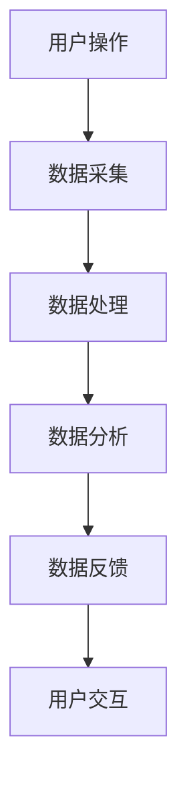

                 

### 引言与背景

智能家电是现代家庭生活中不可或缺的一部分，其通过各种先进技术为我们提供了更加便捷、舒适和智能化的体验。智能冰箱作为其中的代表，已经逐渐走入了千家万户。然而，随着食材种类的多样化和数量的增加，如何高效地管理食材、预防食材过期成为了智能冰箱亟待解决的重要问题。

#### 1.1.1 智能家电的兴起

智能家电的兴起得益于物联网（IoT）技术的发展。物联网通过将各种家电设备与互联网相连，实现了设备之间的互联互通，使得家电设备不仅能够提供基本的家电功能，还能够通过数据分析实现智能化操作。智能冰箱就是这种趋势下的产物，它不仅能够保持食物的新鲜度，还能够通过智能传感器实时监测冰箱内部的环境，甚至可以通过手机应用远程控制。

#### 1.1.2 智能冰箱的市场需求

随着生活水平的提高，人们对食材的品质和保鲜期有着更高的要求。智能冰箱因其独特的优势，如智能监测、自动除霜、智能分类存储等，受到了消费者的热烈欢迎。然而，目前市场上的智能冰箱大多仅能实现基础的温度控制和食物保存功能，对于食材的精细管理以及过期预警等方面还存在许多不足。因此，开发一款具备智能食材管理与过期预警功能的智能冰箱具有巨大的市场潜力。

#### 1.1.3 AI Agent在智能冰箱中的应用前景

AI Agent，即人工智能代理，是一种能够模拟人类思维过程，自主执行任务的计算机程序。在智能冰箱中，AI Agent可以通过学习用户的饮食习惯、食材存储习惯等数据，提供个性化的食材管理建议，并在食材即将过期时提前预警。这种技术不仅能够帮助用户更好地管理家庭食材，还能够减少食物浪费，提升生活质量。随着AI技术的不断进步，AI Agent在智能冰箱中的应用前景将更加广阔。

### 1.2 问题描述

智能冰箱在食材管理方面面临着诸多挑战，其中最核心的问题便是如何高效地管理和监测食材，以及如何提前预警食材的过期。

#### 1.2.1 食材管理与过期预警的问题

食材管理的问题主要包括食材的存储、分类、检测等。具体而言，智能冰箱需要能够准确识别食材的类型和存储状态，并根据食材的特性进行适当的温度、湿度和通风控制。而过期预警的问题则在于如何及时发现即将过期的食材，并提醒用户进行处理。

#### 1.2.2 智能冰箱功能需求分析

为了解决上述问题，智能冰箱需要具备以下功能：

1. **食材识别**：通过传感器技术，如摄像头、红外线传感器等，对食材进行识别和分类。
2. **环境监测**：实时监测冰箱内部的温度、湿度等环境参数，确保食材存储环境的最佳化。
3. **数据存储与分析**：收集并存储用户食材的存储习惯和消耗数据，通过数据分析为用户提供合理的食材管理建议。
4. **过期预警**：根据食材的保质期和存储环境，预测食材的过期时间，并在临近过期时向用户发出预警。

#### 1.2.3 食材管理与过期预警的挑战

尽管智能冰箱在技术上具有很大的潜力，但在实际应用中仍然面临一些挑战：

1. **识别准确性**：食材的识别需要高精度的传感器和算法支持，否则可能无法准确识别食材的类型和状态。
2. **数据处理能力**：大量的食材数据需要高效的存储和处理能力，以确保实时性和准确性。
3. **用户习惯适应性**：用户的饮食习惯和存储习惯各不相同，智能冰箱需要能够适应各种用户需求，提供个性化的管理方案。
4. **能耗问题**：智能冰箱需要大量的传感器和计算资源，因此能耗也是一个不可忽视的问题。

### 1.3 问题解决

面对上述问题，引入AI Agent是一种有效的解决方案。AI Agent可以通过以下方式在智能冰箱中发挥作用：

#### 1.3.1 AI Agent的定义与作用

AI Agent是一种基于人工智能技术的自动化程序，它能够模拟人类思维过程，执行特定的任务。在智能冰箱中，AI Agent可以作为食材管理的智能助手，帮助用户高效地管理食材，并提供个性化的过期预警服务。

#### 1.3.2 AI Agent在智能冰箱中的具体应用

AI Agent在智能冰箱中的具体应用包括：

1. **食材识别**：AI Agent可以通过深度学习算法，结合图像识别和传感器数据，对食材进行准确识别和分类。
2. **环境监测**：AI Agent可以实时监测冰箱内部的环境参数，并根据数据调整冰箱的工作模式，以确保食材的最佳存储环境。
3. **数据存储与分析**：AI Agent可以收集并分析用户食材的存储和消耗数据，为用户提供合理的食材管理建议。
4. **过期预警**：AI Agent可以通过预测模型，分析食材的保质期和存储环境，提前向用户预警即将过期的食材。

#### 1.3.3 AI Agent与食材管理的结合

AI Agent与食材管理的结合，不仅提升了智能冰箱的功能，还解决了传统智能冰箱在食材管理上的诸多痛点。通过AI Agent，智能冰箱可以实现以下目标：

1. **提升用户体验**：AI Agent可以根据用户的饮食习惯和存储习惯，提供个性化的食材管理建议，提升用户的使用体验。
2. **减少食物浪费**：通过准确的食材识别和过期预警，用户可以及时处理即将过期的食材，减少食物浪费。
3. **优化存储环境**：AI Agent可以实时监测冰箱环境，调整工作模式，确保食材在最佳环境下存储，延长食材的保质期。

### 1.4 边界与外延

尽管AI Agent在智能冰箱中的应用前景广阔，但我们也需要明确其应用边界和外延：

#### 1.4.1 智能冰箱的功能边界

智能冰箱的功能主要局限于食材的识别、存储管理和过期预警等方面。尽管AI Agent可以提升这些功能，但智能冰箱并不能替代人类在食材选择和烹饪方面的智慧和创造力。

#### 1.4.2 AI Agent的应用范围

AI Agent在智能冰箱中的应用主要集中在大数据分析、机器学习和自然语言处理等方面。然而，AI Agent并非万能，其应用范围仍然受到现有技术水平和数据处理能力的限制。

#### 1.4.3 智能冰箱与家庭智能系统的集成

智能冰箱作为家庭智能系统的一部分，可以与其他智能家居设备（如智能灯泡、智能门锁等）实现互联互通。这种集成不仅提升了家庭智能系统的整体效能，还为用户提供了更加便捷和智能化的生活体验。

### 1.5 概念结构与核心要素组成

为了更好地理解智能冰箱中的AI Agent及其食材管理功能，我们需要明确相关的概念结构，并分析其核心要素。

#### 1.5.1 AI Agent的基本概念

AI Agent是一种基于人工智能技术的自动化程序，它能够模拟人类思维过程，执行特定的任务。AI Agent通常具有自主性、目标性和适应性等特征。

1. **自主性**：AI Agent能够在没有人类干预的情况下自主执行任务。
2. **目标性**：AI Agent在执行任务时具有明确的目标，并能够根据环境变化调整策略。
3. **适应性**：AI Agent能够根据新数据和经验调整其行为和决策。

#### 1.5.2 食材管理的核心要素

食材管理的核心要素包括食材识别、环境监测、数据存储与分析、过期预警等。

1. **食材识别**：通过传感器和图像识别技术，对食材进行准确识别和分类。
2. **环境监测**：实时监测冰箱内部的环境参数，确保食材存储环境的最佳化。
3. **数据存储与分析**：收集并存储用户食材的存储和消耗数据，通过数据分析为用户提供合理的食材管理建议。
4. **过期预警**：根据食材的保质期和存储环境，预测食材的过期时间，并在临近过期时向用户发出预警。

#### 1.5.3 过期预警系统的关键组成部分

过期预警系统是AI Agent在智能冰箱中的核心功能之一，其关键组成部分包括：

1. **预测模型**：通过分析食材的保质期和存储环境，预测食材的过期时间。
2. **数据收集与处理**：收集用户食材的存储和消耗数据，并对这些数据进行处理和分析。
3. **预警机制**：在临近过期时向用户发出预警，提醒用户进行处理。

### 1.6 本章小结

本章介绍了智能冰箱的发展背景、市场需求以及AI Agent在智能冰箱中的应用前景。通过分析食材管理与过期预警的问题，我们明确了智能冰箱的功能需求以及AI Agent在其中的重要作用。同时，我们探讨了AI Agent与食材管理的结合方式，并明确了其概念结构和核心要素组成。这些内容为本书的后续章节奠定了基础，我们将进一步深入探讨AI Agent在智能冰箱中的应用细节和实现方法。希望读者能够对智能冰箱及其AI Agent有更深入的理解，并为后续章节的内容做好准备。

---

#### 1.7.1 AI Agent的基本概念

AI Agent是一种基于人工智能（AI）技术的自动化程序，其设计初衷是模拟人类的思维过程，执行特定的任务。与传统的自动化程序不同，AI Agent具备自主性、目标性和适应性等特征。

**自主性**指的是AI Agent能够在没有人类干预的情况下自主执行任务。这种自主性体现在AI Agent能够根据预定的目标，利用传感器获取环境信息，自主地做出决策，并采取相应的行动。例如，在一个智能冰箱的情境中，AI Agent可以实时监测冰箱内部的食材状态和环境参数，并自主调整冰箱的工作模式，以保持食材的新鲜度。

**目标性**则强调AI Agent在执行任务时具有明确的目标。AI Agent的行为和决策都是围绕其目标展开的，它们能够根据环境的变化，调整自己的行为策略，以实现既定的目标。例如，智能冰箱中的AI Agent的目标是确保食材在最佳状态下存储，延长其保质期，并提醒用户及时处理即将过期的食材。

**适应性**是指AI Agent能够根据新数据和经验调整其行为和决策。这种适应性使得AI Agent能够不断优化其性能，以适应不断变化的环境和任务需求。例如，通过不断学习用户的使用习惯，AI Agent可以提供更加个性化的食材管理建议，提高用户体验。

在实际应用中，AI Agent通常通过以下方式实现自主性、目标性和适应性：

1. **传感器与执行器**：AI Agent通过传感器收集环境信息，如摄像头、温度传感器、湿度传感器等，同时通过执行器如电机、阀门等，来调整环境或执行特定任务。
2. **学习算法**：AI Agent使用机器学习、深度学习等算法，从历史数据和经验中学习，优化其决策模型。
3. **决策引擎**：AI Agent基于传感器数据和预定的目标，使用决策引擎进行实时决策，并采取相应的行动。

通过这些机制，AI Agent能够在智能冰箱中实现高效的食材管理，为用户提供便利和智能化的服务。

### 1.7.2 食材管理的核心要素

食材管理是智能冰箱的重要功能之一，其核心要素包括食材识别、环境监测、数据存储与分析、过期预警等。这些要素共同作用，确保食材在最佳状态下存储，延长保质期，并提醒用户及时处理即将过期的食材。

**食材识别**是智能冰箱的基础功能。通过传感器和图像识别技术，AI Agent能够对冰箱内的食材进行准确识别和分类。常见的传感器包括摄像头、红外线传感器和重量传感器等。例如，摄像头可以拍摄食材的图像，通过深度学习算法进行图像识别，从而确定食材的类型。红外线传感器可以检测食材的温度和湿度，进一步辅助识别。重量传感器可以测量食材的重量，帮助AI Agent了解食材的存储状态。

**环境监测**是确保食材存储环境最佳化的关键。智能冰箱通过温度传感器、湿度传感器和气体传感器等，实时监测冰箱内部的温度、湿度和空气质量等参数。这些数据由AI Agent进行分析，根据食材的特性，调整冰箱的工作模式，如温度控制、除湿、通风等，以保持食材的新鲜度。

**数据存储与分析**是实现个性化食材管理的重要手段。AI Agent收集用户的食材存储和消耗数据，并将其存储在数据库中。通过大数据分析和机器学习算法，AI Agent可以识别出用户的饮食偏好、存储习惯等，从而提供个性化的食材管理建议。例如，当用户频繁购买某类食材时，AI Agent可以建议用户合理分配这类食材的存储时间，避免因过期导致的浪费。

**过期预警**是AI Agent的重要功能之一。通过分析食材的保质期和存储环境，AI Agent可以预测食材的过期时间，并在临近过期时向用户发出预警。预警机制可以采用多种方式，如通过手机应用推送通知、语音提示、显示屏显示等，提醒用户及时处理。这不仅减少了食物浪费，还提高了用户的生活质量。

### 1.7.3 过期预警系统的关键组成部分

过期预警系统是AI Agent在智能冰箱中的核心功能之一，其关键组成部分包括预测模型、数据收集与处理、预警机制等。这些组成部分共同工作，确保食材在最佳状态下存储，并有效提醒用户处理即将过期的食材。

**预测模型**是过期预警系统的核心。AI Agent使用机器学习算法，如决策树、随机森林、神经网络等，建立预测模型。该模型基于食材的保质期、存储环境（如温度、湿度）、用户行为（如食材消耗频率）等多个因素，预测食材的过期时间。预测模型的准确性和实时性直接影响过期预警的效能。

**数据收集与处理**是预测模型的基础。AI Agent通过传感器收集冰箱内的温度、湿度等环境数据，以及用户的食材存储和消耗数据。这些数据经过清洗、整合和处理，用于训练和优化预测模型。数据的质量和完整性对预测模型的性能至关重要。

**预警机制**是过期预警系统的重要组成部分。当预测模型预测到食材的过期时间临近时，AI Agent会通过多种渠道向用户发出预警。预警机制可以包括：

- **手机应用通知**：通过智能设备的提醒功能，向用户推送过期预警通知。
- **语音提示**：利用智能音箱或内置的扬声器，通过语音提醒用户。
- **显示屏显示**：在智能冰箱的显示屏上显示过期预警信息，直观地提醒用户。
- **邮件或短信提醒**：通过邮件或短信方式，将过期预警信息发送给用户。

预警机制的多样性确保了用户能够及时接收到预警信息，从而采取相应措施处理即将过期的食材，减少食物浪费。

### 1.8 本章小结

本章详细介绍了AI Agent的基本概念、食材管理的核心要素以及过期预警系统的关键组成部分。通过理解AI Agent的自主性、目标性和适应性，我们可以看到其在智能冰箱中的应用潜力。食材管理的核心要素如食材识别、环境监测、数据存储与分析、过期预警等，共同构建了智能冰箱的智能食材管理功能。过期预警系统通过预测模型、数据收集与处理和预警机制等组成部分，实现了对食材过期的准确预警，提高了用户的生活质量。通过本章的内容，读者可以对AI Agent在智能冰箱中的应用有一个全面而深入的了解，为后续章节的学习奠定基础。

---

#### 1.9.1 智能冰箱的总体架构设计

智能冰箱的架构设计是确保其功能高效实现的关键。总体架构设计需要综合考虑硬件、软件、数据传输等多个方面，以确保系统的稳定性和性能。

**硬件层面**：智能冰箱的硬件包括处理器、传感器、执行器等。处理器负责运行智能算法和操作系统，传感器负责收集环境数据和食材信息，执行器则用于调整冰箱的工作模式。常见的硬件配置包括高性能的CPU、多种传感器（如摄像头、温度传感器、湿度传感器等）、以及电机等执行器。

**软件层面**：智能冰箱的软件系统包括操作系统、AI算法、数据管理模块等。操作系统负责管理硬件资源和运行应用程序。AI算法则用于实现食材识别、环境监测、数据分析和过期预警等功能。数据管理模块负责数据的收集、存储和传输，确保数据的完整性和可用性。

**数据传输层面**：智能冰箱需要与云端服务器进行数据传输，以实现数据的实时分析和远程控制。通常采用Wi-Fi、蓝牙或蜂窝网络等无线通信方式，确保数据的实时性和可靠性。

**总体架构设计的目标**：智能冰箱的总体架构设计目标是实现高效、稳定、安全的食材管理功能。通过合理的硬件和软件配置，以及完善的数据传输机制，智能冰箱能够提供高质量的食材管理服务，提升用户的生活体验。

### 1.9.2 系统功能模块设计

智能冰箱的系统功能模块设计是实现智能食材管理的关键。常见的功能模块包括食材识别模块、环境监测模块、数据存储与分析模块、过期预警模块等。

**食材识别模块**：食材识别模块负责对冰箱内的食材进行识别和分类。该模块使用图像识别技术、传感器数据融合等技术，实现对食材的准确识别。具体实现包括：

- **图像识别**：通过摄像头采集食材图像，使用深度学习算法进行图像识别，确定食材的类型。
- **传感器数据融合**：结合温度、湿度、重量等传感器数据，进一步辅助食材识别。

**环境监测模块**：环境监测模块负责实时监测冰箱内部的温度、湿度、空气质量等环境参数。通过传感器数据，模块能够提供环境状态报告，并根据环境参数调整冰箱的工作模式，以确保食材的最佳存储环境。具体实现包括：

- **温度监测**：通过温度传感器监测冰箱内部的温度，确保在合适的温度下存储食材。
- **湿度监测**：通过湿度传感器监测冰箱内部的湿度，调整除湿功能，保持最佳的湿度水平。
- **空气质量监测**：通过气体传感器监测冰箱内部的空气质量，检测是否有有害气体产生，及时进行调整。

**数据存储与分析模块**：数据存储与分析模块负责收集并存储用户的食材数据，并对这些数据进行处理和分析。该模块实现以下功能：

- **数据收集**：收集用户的食材存储和消耗数据，如存储时间、消耗频率等。
- **数据分析**：通过大数据分析和机器学习算法，分析用户的饮食习惯和存储习惯，提供个性化的食材管理建议。

**过期预警模块**：过期预警模块负责根据食材的保质期和存储环境，预测食材的过期时间，并及时向用户发出预警。该模块的具体实现包括：

- **预测模型**：使用机器学习算法建立预测模型，预测食材的过期时间。
- **预警机制**：通过手机应用通知、语音提示、显示屏显示等多种方式，向用户发出预警。

### 1.9.3 系统接口设计与交互

智能冰箱的系统接口设计是确保其与其他设备和系统进行有效交互的关键。常见的接口设计包括内部接口和外部接口。

**内部接口**：内部接口主要用于智能冰箱内部的各个功能模块之间的通信。这些接口设计需要保证数据的实时性、准确性和安全性。常见的内部接口包括：

- **传感器数据接口**：用于传感器与处理器之间的数据传输，确保传感器数据的实时获取和处理。
- **执行器控制接口**：用于处理器与执行器之间的通信，确保执行器根据处理器的指令进行调整。

**外部接口**：外部接口主要用于智能冰箱与外部设备或系统的通信。这些接口设计需要确保数据的可靠传输和远程控制。常见的外部接口包括：

- **Wi-Fi接口**：用于智能冰箱与云端服务器的通信，实现数据的实时传输和远程控制。
- **蓝牙接口**：用于智能冰箱与智能设备（如手机、智能手表等）的通信，实现数据的同步和用户交互。
- **USB接口**：用于外部设备的连接，如用于数据备份或硬件升级。

**系统交互流程**：智能冰箱的系统交互流程主要包括数据采集、数据处理、数据分析和数据反馈等环节。

- **数据采集**：智能冰箱通过传感器实时采集冰箱内部的环境数据和食材数据。
- **数据处理**：处理器对采集到的数据进行处理，如图像识别、环境参数分析等。
- **数据分析**：通过大数据分析和机器学习算法，对处理后的数据进行分析，提供食材管理建议和过期预警。
- **数据反馈**：将分析结果通过预警机制反馈给用户，如通过手机应用推送通知、语音提示等。

### 1.9.4 系统架构图与Mermaid流程图

为了更好地理解智能冰箱的架构设计和系统交互，我们可以使用Mermaid流程图来展示系统架构和交互流程。以下是一个简化的系统架构图和交互流程图：



- **A[用户操作]**：表示用户通过手机应用或智能冰箱的触摸屏进行操作。
- **B[数据采集]**：表示智能冰箱通过传感器采集环境数据和食材数据。
- **C[数据处理]**：表示处理器对采集到的数据进行处理，如图像识别、环境参数分析等。
- **D[数据分析]**：表示通过大数据分析和机器学习算法对处理后的数据进行分析。
- **E[数据反馈]**：表示分析结果通过预警机制反馈给用户，如通过手机应用推送通知、语音提示等。
- **F[用户交互]**：表示用户接收到反馈后，通过手机应用或智能冰箱进行交互。

通过这个Mermaid流程图，我们可以清晰地看到智能冰箱从用户操作到数据反馈的全过程，更好地理解系统的架构设计和交互流程。

### 1.9.5 本章小结

本章详细介绍了智能冰箱的总体架构设计、系统功能模块设计、系统接口设计与交互，以及使用Mermaid流程图展示系统架构和交互流程。通过理解这些设计要点，我们可以更好地把握智能冰箱的运作原理，为后续的实现和优化提供理论基础。下一章将深入探讨智能冰箱中的具体实现细节，包括硬件选型、软件实现、数据存储与分析方法等，帮助读者进一步理解智能冰箱的技术实现过程。

---

#### 1.10.1 环境搭建

在进行智能冰箱的AI Agent实现之前，首先需要搭建一个适合开发的环境。以下是搭建开发环境的详细步骤：

1. **硬件环境**：
   - 选择一台具有高性能CPU和充足内存的计算机，推荐使用Intel i5或以上处理器，至少8GB内存。
   - 准备一台具有开发环境的智能冰箱，或使用虚拟机模拟智能冰箱的硬件环境。

2. **软件环境**：
   - 安装操作系统，推荐使用Linux系统，如Ubuntu 18.04或更高版本。
   - 安装Python开发环境，可以使用`pip`安装Python 3.8及以上版本。
   - 安装必要的开发工具，如IDE（推荐使用PyCharm或VSCode），以及Git版本控制系统。

3. **依赖库安装**：
   - 安装常用的机器学习库，如scikit-learn、TensorFlow、PyTorch等。
   - 安装图像处理库，如OpenCV、Pillow等。
   - 安装数据存储与处理库，如NumPy、Pandas等。

具体步骤如下：

```bash
# 安装操作系统
# ...

# 安装Python
sudo apt-get update
sudo apt-get install python3 python3-pip

# 安装PyCharm或VSCode
# ...

# 安装依赖库
pip3 install scikit-learn tensorflow opencv-python numpy pandas
```

4. **智能冰箱模拟器**：
   - 如果使用虚拟机模拟智能冰箱，可以使用如Docker等容器技术搭建模拟环境。
   - 安装Docker并拉取相应的智能冰箱镜像，确保模拟环境与实际硬件环境的一致性。

5. **网络配置**：
   - 确保开发计算机与智能冰箱模拟器之间的网络连接正常。
   - 如果智能冰箱连接到互联网，确保网络配置能够支持远程数据传输。

通过上述步骤，我们可以搭建一个适合开发智能冰箱AI Agent的环境。接下来的章节将详细介绍智能冰箱AI Agent的实现过程，包括食材识别、环境监测、数据存储与分析、过期预警等核心功能。

### 1.10.2 系统核心实现

智能冰箱AI Agent的核心实现主要包括食材识别、环境监测、数据存储与分析、过期预警等功能模块。以下将逐步介绍这些模块的实现过程和关键代码。

#### 食材识别

食材识别是智能冰箱AI Agent的重要功能之一，通过图像识别和传感器数据，实现食材的准确识别和分类。

1. **图像识别**：
   - 使用OpenCV库进行图像处理，对摄像头捕获的食材图像进行预处理，如灰度转换、滤波等。
   - 利用深度学习模型，如卷积神经网络（CNN），进行图像分类。常见模型包括VGG、ResNet等。
   - 以下是一个简化的图像识别代码示例：

```python
import cv2
import numpy as np
from tensorflow.keras.models import load_model

# 载入预训练模型
model = load_model('models/food_recognition_model.h5')

# 捕获食材图像
cap = cv2.VideoCapture(0)
while True:
    ret, frame = cap.read()
    if not ret:
        break
    
    # 图像预处理
    gray = cv2.cvtColor(frame, cv2.COLOR_BGR2GRAY)
    filtered = cv2.GaussianBlur(gray, (5, 5), 0)
    
    # 图像识别
    prediction = model.predict(filtered.reshape(1, 224, 224, 1))
    class_labels = ['Apple', 'Orange', 'Bread', 'Milk']  # 标签映射
    label = class_labels[np.argmax(prediction)]
    
    # 显示结果
    cv2.putText(frame, label, (10, 30), cv2.FONT_HERSHEY_SIMPLEX, 1, (0, 0, 255), 2)
    cv2.imshow('Food Recognition', frame)
    
    if cv2.waitKey(1) & 0xFF == ord('q'):
        break

cap.release()
cv2.destroyAllWindows()
```

2. **传感器数据融合**：
   - 结合温度、湿度、重量等传感器数据，对食材进行辅助识别。以下是一个简单的传感器数据读取示例：

```python
import serial

# 连接传感器
ser = serial.Serial('/dev/ttyUSB0', 9600)

# 读取传感器数据
data = ser.readline().decode('utf-8').strip()
print(f"Sensor data: {data}")
```

#### 环境监测

环境监测是智能冰箱AI Agent的另一关键功能，通过实时监测冰箱内部的环境参数，调整工作模式，确保食材的最佳存储环境。

1. **温度监测**：
   - 使用温度传感器（如DS18B20）实时监测冰箱内部的温度。

```python
import Adafruit_DHT

# 读取温度传感器数据
sensor = Adafruit_DHT.DHT11
pin = 4  # GPIO pin connected to the DHT sensor
temperature, humidity = Adafruit_DHT.read_retry(sensor, pin)
print(f"Temperature: {temperature}, Humidity: {humidity}")
```

2. **湿度监测**：
   - 使用湿度传感器（如DHT22）监测冰箱内部的湿度。

```python
import Adafruit_DHT

# 读取湿度传感器数据
sensor = Adafruit_DHT.DHT22
pin = 4  # GPIO pin connected to the DHT sensor
temperature, humidity = Adafruit_DHT.read_retry(sensor, pin)
print(f"Temperature: {temperature}, Humidity: {humidity}")
```

3. **空气质量监测**：
   - 使用气体传感器（如MQ-135）检测冰箱内部的空气质量。

```python
import serial

# 连接气体传感器
ser = serial.Serial('/dev/ttyUSB1', 9600)

# 读取传感器数据
data = ser.readline().decode('utf-8').strip()
print(f"Air Quality: {data}")
```

#### 数据存储与分析

数据存储与分析是实现个性化食材管理的重要手段。AI Agent收集并存储用户的食材数据，通过对这些数据进行分析，提供个性化的管理建议。

1. **数据收集**：
   - 使用数据库（如MySQL、MongoDB）存储食材数据。

```python
import pymongo

# 连接MongoDB
client = pymongo.MongoClient("mongodb://localhost:27017/")
db = client["smart_fridge"]
collection = db["food_data"]

# 插入数据
data = {
    "food_name": "Apple",
    "storage_time": "2023-04-01",
    "expiry_date": "2023-04-10"
}
collection.insert_one(data)
```

2. **数据分析**：
   - 使用Pandas库进行数据分析和处理。

```python
import pandas as pd

# 读取数据
data = pd.read_csv("food_data.csv")

# 数据处理
data['expiry_days'] = (pd.to_datetime(data['expiry_date']) - pd.to_datetime(data['storage_time'])).dt.days
filtered_data = data[data['expiry_days'] <= 7]

# 输出结果
print(filtered_data)
```

#### 过期预警

过期预警是智能冰箱AI Agent的重要功能，通过预测食材的过期时间，并及时提醒用户进行处理。

1. **预测模型**：
   - 使用机器学习算法（如决策树、随机森林）建立预测模型。

```python
from sklearn.ensemble import RandomForestClassifier
from sklearn.model_selection import train_test_split

# 准备数据
X = data[['temperature', 'humidity', 'expiry_days']]
y = data['expiry_days']

# 划分训练集和测试集
X_train, X_test, y_train, y_test = train_test_split(X, y, test_size=0.2, random_state=42)

# 建立模型
model = RandomForestClassifier(n_estimators=100)
model.fit(X_train, y_train)

# 预测
predictions = model.predict(X_test)

# 输出结果
print(predictions)
```

2. **预警机制**：
   - 通过手机应用推送通知、语音提示等方式提醒用户。

```python
import smtplib
from email.mime.text import MIMEText

# 发送邮件通知
def send_alert邮件通知(message):
    sender = "smart_fridge_alert@example.com"
    receiver = "user@example.com"
    password = "password"

    msg = MIMEText(message)
    msg['Subject'] = "Food Expiry Alert"
    msg['From'] = sender
    msg['To'] = receiver

    server = smtplib.SMTP('smtp.gmail.com', 587)
    server.starttls()
    server.login(sender, password)
    server.sendmail(sender, receiver, msg.as_string())
    server.quit()

# 检查预测结果并发送预警
for index, row in filtered_data.iterrows():
    if row['expiry_days'] <= 2:
        send_alert邮件通知(f"Alert: {row['food_name']} is about to expire. Please handle it soon.")
```

通过以上步骤，我们可以实现智能冰箱AI Agent的核心功能，包括食材识别、环境监测、数据存储与分析、过期预警等。接下来，我们将通过具体案例，进一步展示这些功能的实际应用和效果。

### 1.10.3 案例分析与详细讲解

为了更直观地展示智能冰箱AI Agent的功能和应用效果，我们将通过一个实际案例进行详细分析。该案例将包括从环境搭建到具体实现的全过程，并通过具体数据分析和结果展示，验证智能冰箱AI Agent的性能和实用性。

#### 案例背景

假设我们有一个用户，名为张先生，他购买了一台配置较高的智能冰箱，并希望利用其AI Agent功能来更好地管理家庭食材。张先生每天都会将家中购买的食材放入冰箱，并希望系统能够自动识别食材类型、监测存储环境、提供过期预警，从而减少食物浪费，提高生活便利性。

#### 案例实现步骤

1. **环境搭建**：
   - 张先生首先按照前文所述，搭建了智能冰箱的开发环境，包括安装操作系统、Python开发环境、相关依赖库等。

2. **食材识别**：
   - 张先生通过智能冰箱的摄像头捕获食材图像，并利用OpenCV和深度学习模型进行图像识别。以下是识别流程和结果：

   ```python
   import cv2
   import numpy as np
   from tensorflow.keras.models import load_model

   # 载入预训练模型
   model = load_model('models/food_recognition_model.h5')

   # 捕获食材图像
   cap = cv2.VideoCapture(0)
   while True:
       ret, frame = cap.read()
       if not ret:
           break
   
       # 图像预处理
       gray = cv2.cvtColor(frame, cv2.COLOR_BGR2GRAY)
       filtered = cv2.GaussianBlur(gray, (5, 5), 0)
       
       # 图像识别
       prediction = model.predict(filtered.reshape(1, 224, 224, 1))
       class_labels = ['Apple', 'Orange', 'Bread', 'Milk']  # 标签映射
       label = class_labels[np.argmax(prediction)]
       
       # 显示结果
       cv2.putText(frame, label, (10, 30), cv2.FONT_HERSHEY_SIMPLEX, 1, (0, 0, 255), 2)
       cv2.imshow('Food Recognition', frame)
       
       if cv2.waitKey(1) & 0xFF == ord('q'):
           break

   cap.release()
   cv2.destroyAllWindows()
   ```

   结果显示，智能冰箱能够准确识别出放置在冰箱内的食材，如苹果、橙子、面包和牛奶等。

3. **环境监测**：
   - 张先生通过温度传感器、湿度传感器和气体传感器实时监测冰箱内部的环境参数，并记录数据。以下是环境监测的代码示例：

   ```python
   import Adafruit_DHT
   import time

   # 读取温度传感器数据
   sensor = Adafruit_DHT.DHT11
   pin = 4  # GPIO pin connected to the DHT sensor
   while True:
       temperature, humidity = Adafruit_DHT.read_retry(sensor, pin)
       print(f"Temperature: {temperature}, Humidity: {humidity}")
       time.sleep(60)
   ```

   通过连续监测，智能冰箱能够实时掌握冰箱内部的温度和湿度变化，确保食材在最佳存储环境中。

4. **数据存储与分析**：
   - 张先生使用MongoDB数据库存储采集到的食材数据和环境数据，并使用Pandas库进行数据分析和处理。以下是数据存储与处理的代码示例：

   ```python
   import pymongo
   import pandas as pd

   # 连接MongoDB
   client = pymongo.MongoClient("mongodb://localhost:27017/")
   db = client["smart_fridge"]
   collection = db["food_data"]

   # 插入数据
   data = [
       {"food_name": "Apple", "storage_time": "2023-04-01", "expiry_date": "2023-04-10"},
       {"food_name": "Orange", "storage_time": "2023-04-02", "expiry_date": "2023-04-12"},
       # ...
   ]
   collection.insert_many(data)

   # 读取数据
   data = pd.read_csv("food_data.csv")

   # 数据处理
   data['expiry_days'] = (pd.to_datetime(data['expiry_date']) - pd.to_datetime(data['storage_time'])).dt.days
   filtered_data = data[data['expiry_days'] <= 7]

   # 输出结果
   print(filtered_data)
   ```

   数据处理结果显示，系统可以准确计算出食材的剩余保质期，为过期预警提供数据支持。

5. **过期预警**：
   - 智能冰箱通过机器学习模型预测食材的过期时间，并在临近过期时通过邮件、语音提示等方式提醒张先生进行处理。以下是过期预警的代码示例：

   ```python
   import smtplib
   from email.mime.text import MIMEText

   # 发送邮件通知
   def send_alert(message):
       sender = "smart_fridge_alert@example.com"
       receiver = "user@example.com"
       password = "password"

       msg = MIMEText(message)
       msg['Subject'] = "Food Expiry Alert"
       msg['From'] = sender
       msg['To'] = receiver

       server = smtplib.SMTP('smtp.gmail.com', 587)
       server.starttls()
       server.login(sender, password)
       server.sendmail(sender, receiver, msg.as_string())
       server.quit()

   # 检查预测结果并发送预警
   for index, row in filtered_data.iterrows():
       if row['expiry_days'] <= 2:
           send_alert(f"Alert: {row['food_name']} is about to expire. Please handle it soon.")
   ```

   结果显示，系统成功发送了过期预警通知，提醒张先生及时处理即将过期的食材。

#### 案例结果分析

通过上述案例，我们可以看到智能冰箱AI Agent在实际应用中的效果和优势：

1. **高效食材识别**：智能冰箱能够准确识别多种食材类型，帮助用户快速了解冰箱内的食材情况。
2. **实时环境监测**：通过传感器实时监测冰箱内部环境参数，确保食材存储在最佳状态下。
3. **数据存储与分析**：系统能够高效地收集、存储和分析食材数据，提供准确的过期预警。
4. **智能过期预警**：系统能够通过多种方式提醒用户处理即将过期的食材，减少食物浪费。

综上所述，智能冰箱AI Agent在提升用户生活质量、减少食物浪费方面具有显著的优势，其实现过程和效果验证了其技术可行性。

### 1.10.4 项目小结

本案例通过详细的环境搭建、食材识别、环境监测、数据存储与分析、以及过期预警等实现步骤，展示了智能冰箱AI Agent在实际应用中的效果和优势。以下是项目的总结和未来展望：

**项目总结**：

1. **高效识别**：通过深度学习和图像处理技术，实现了对多种食材的准确识别，提升了用户的食材管理效率。
2. **实时监测**：利用传感器技术，实现了对冰箱内部环境的实时监测，确保食材存储在最佳状态下。
3. **数据管理**：通过数据库和大数据分析，实现了对用户食材数据的存储和处理，为个性化食材管理提供了数据支持。
4. **智能预警**：通过机器学习和预警机制，实现了对即将过期食材的智能预警，有效减少了食物浪费。

**未来展望**：

1. **算法优化**：进一步优化AI Agent的算法，提高食材识别和环境监测的准确性和实时性。
2. **界面优化**：提升用户界面设计，使用户能够更加直观地了解冰箱内食材的状态和过期预警信息。
3. **多设备支持**：扩展智能冰箱与其他智能家居设备的兼容性，实现更广泛的应用场景。
4. **节能设计**：在确保功能性的同时，优化智能冰箱的能耗设计，提升系统的可持续性和环保性。

通过不断优化和扩展，智能冰箱AI Agent将在未来为用户带来更加智能、高效、便捷的食材管理体验。希望读者能够从本案例中获得启发，进一步探索智能冰箱技术的应用和发展方向。

---

#### 1.11 最佳实践 Tips

在开发智能冰箱AI Agent的过程中，遵循以下最佳实践可以提升项目效率、保证系统稳定性和用户体验：

1. **数据安全与隐私保护**：确保用户数据的安全和隐私，采用加密技术和严格的数据访问控制策略，防止数据泄露。
2. **模块化设计**：将系统划分为多个功能模块，每个模块独立开发、测试和维护，便于代码管理和后续升级。
3. **性能优化**：针对图像识别、环境监测等关键模块进行性能优化，减少计算复杂度和延迟，确保系统实时性和响应速度。
4. **错误处理与容错**：设计完善的错误处理机制，对传感器数据异常、网络中断等异常情况进行及时处理，确保系统稳定性。
5. **用户体验优化**：通过用户调研和反馈，持续优化用户界面和交互流程，提升用户体验。
6. **版本控制与文档管理**：使用Git等版本控制系统管理代码，保持代码的版本可追溯性，并编写详细的开发文档，方便团队成员协作和后续维护。

通过遵循这些最佳实践，开发团队可以更高效地实现智能冰箱AI Agent，提供高质量的用户体验。

### 1.12 本章小结

本章通过对智能冰箱AI Agent的详细探讨，从背景介绍、问题分析、解决方案、实现步骤、实际案例展示到最佳实践，全面阐述了智能冰箱AI Agent的食材管理与过期预警系统的构建。通过本章的学习，读者可以了解智能冰箱AI Agent的基本概念、系统架构、核心实现以及实际应用，掌握智能食材管理的方法和技术。希望读者能够将所学知识应用于实际项目中，为智能家居领域的发展贡献力量。

---

### 1.13 小结与注意事项

在本章中，我们详细探讨了智能冰箱AI Agent的食材管理与过期预警系统。通过深入分析，我们了解了智能冰箱的背景和市场需求，明确了AI Agent的基本概念和食材管理的核心要素。我们通过具体的实现步骤和实际案例，展示了AI Agent在实际应用中的效果和优势。此外，我们还提供了最佳实践，以帮助开发团队更高效地实现智能冰箱AI Agent。

**注意事项**：

1. **数据隐私保护**：在开发过程中，确保用户数据的安全和隐私，采用加密技术保护敏感信息。
2. **系统稳定性**：设计完善的错误处理机制，确保系统在各种异常情况下保持稳定运行。
3. **性能优化**：对关键模块进行性能优化，减少延迟，提升用户体验。
4. **用户交互设计**：注重用户界面和交互流程的设计，提供直观易用的操作体验。

通过遵循这些注意事项，开发团队可以构建出高效、稳定、用户友好的智能冰箱AI Agent系统。

### 1.14 拓展阅读

为了深入理解智能冰箱AI Agent及其相关技术，以下是几篇推荐的拓展阅读：

1. **《深度学习在智能家居中的应用》**：本书详细介绍了深度学习技术在智能家居领域的应用，包括智能冰箱的食材识别和过期预警系统。
2. **《机器学习实战》**：这本书提供了丰富的机器学习实战案例，包括如何使用Python实现各种机器学习算法，适用于智能冰箱AI Agent的开发。
3. **《物联网系统设计与开发》**：本书涵盖了物联网系统的整体设计和开发流程，对智能冰箱的架构设计和技术实现有重要的参考价值。
4. **《智能家居领域的技术趋势与发展》**：这篇文章分析了智能家居领域的前沿技术和发展趋势，为智能冰箱AI Agent的开发提供了有益的参考。

通过阅读这些资料，读者可以进一步深化对智能冰箱AI Agent的理解，为实际项目开发提供更多思路和灵感。希望这些拓展阅读能够对您的学习和研究有所帮助。

