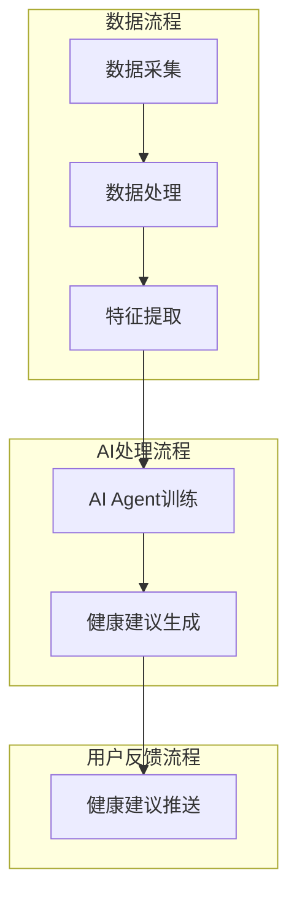
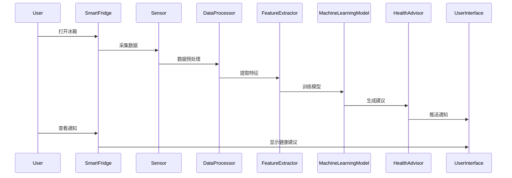

                 

## 智能冰箱：AI Agent的饮食习惯分析与健康建议

### 关键词
- **智能冰箱**
- **AI Agent**
- **饮食习惯分析**
- **健康建议**
- **智能家居**

### 摘要
本文将深入探讨智能冰箱如何通过AI Agent技术分析用户的饮食习惯，并提供个性化的健康建议。本文首先介绍了智能冰箱的发展背景与核心概念，随后详细解析了智能冰箱的工作原理与系统架构，并通过实际案例展示了如何利用AI Agent进行饮食习惯分析与健康建议的生成。最后，文章总结了最佳实践和未来展望。

## 第一部分：问题背景与核心概念

### 1.1 问题的提出

随着科技的进步，智能家居设备逐渐渗透到人们的日常生活。智能冰箱作为智能家居的重要一环，其功能已远不止于存储食物。现代智能冰箱具备智能分析用户饮食习惯并提供健康建议的能力，这一转变极大地提升了用户的生活品质和健康意识。

然而，如何实现智能冰箱对用户饮食习惯的有效分析，并基于此生成个性化的健康建议，仍是一个复杂的挑战。本文旨在探讨这一问题的解决方案，具体包括以下几个方面：

1. **智能冰箱的发展现状**：介绍智能冰箱的技术进展和应用场景，探讨当前存在的不足。
2. **用户个性化健康建议的需求**：分析用户对健康饮食的需求，探讨智能冰箱如何满足这一需求。
3. **问题定义与解决思路**：明确智能冰箱AI Agent在饮食习惯分析与健康建议生成中的角色和任务。

### 1.1.1 问题背景

#### 智能冰箱的发展现状

智能冰箱自问世以来，其功能不断丰富。早期的智能冰箱主要具备基本的食品存储和提醒功能，例如温度控制、食品保质期提醒等。随着物联网和人工智能技术的发展，现代智能冰箱开始具备更高级的功能，如食品识别、智能配送、健康建议等。

- **基本功能**：智能冰箱能够根据食品的种类和储存条件，自动调整内部温度和湿度，确保食品的新鲜度和保质期。
- **高级功能**：智能冰箱通过摄像头和传感器识别食品的种类和储存状态，实时监控食品的存储环境，并提供相关的存储建议。

然而，当前智能冰箱的智能分析能力仍有限，主要依赖于预设的算法和规则，缺乏对用户个性化饮食习惯的深入分析。

#### 用户个性化健康建议的需求

随着健康意识的提升，越来越多的用户希望获得个性化的饮食健康建议。这些建议不仅包括食物的选择，还涉及饮食的时间、量、搭配等多个方面。用户对健康饮食的需求日益多样化，智能冰箱需要提供更为精准和个性化的服务。

- **饮食建议**：智能冰箱可以根据用户的饮食习惯，提供营养均衡的饮食建议，帮助用户制定健康的饮食计划。
- **健康监控**：智能冰箱可以监测用户的饮食行为，分析饮食习惯与身体健康之间的关系，为用户提供健康监测服务。

### 1.1.2 问题描述

如何通过AI Agent技术，实现对智能冰箱用户饮食习惯的深入分析，并基于分析结果为用户提供个性化的健康建议？这是一个复杂的问题，涉及到数据采集、处理、分析和建议生成的多个环节。

#### 问题解决

1. **数据采集与处理**：智能冰箱通过内置传感器实时采集用户饮食习惯的数据，如食品的种类、食用时间、食用量等。
2. **AI Agent的训练与部署**：利用机器学习算法对采集到的数据进行训练，构建能够分析用户饮食习惯的AI Agent。
3. **健康建议生成**：基于AI Agent的分析结果，结合用户的基本健康信息，生成个性化的健康建议。

### 1.1.3 边界与外延

#### 边界

- **应用场景**：本文主要探讨智能冰箱在家庭环境中的应用，不涉及商业或工业环境。
- **功能范围**：本文聚焦于智能冰箱的饮食习惯分析与健康建议功能，不涉及其他智能家电的整合应用。

#### 外延

- **扩展应用**：智能冰箱的饮食习惯分析技术可以拓展到其他智能家居设备，如智能厨房、智能马桶等，实现全面的智能家居健康管理系统。
- **技术外延**：AI Agent技术可以应用于更广泛的领域，如医疗健康、金融理财等，提供个性化的服务。

### 1.2 核心概念与联系

#### 1.2.1 智能冰箱

智能冰箱是一种结合了人工智能技术的家用冰箱，具备智能分析用户饮食习惯、提供健康建议等功能。其主要特点包括：

- **智能传感器**：内置多种传感器，如摄像头、温度传感器、湿度传感器等，用于实时监测食品的状态和用户的行为。
- **智能控制**：通过内置的智能控制系统，自动调整冰箱的温度、湿度等参数，保证食品的新鲜度和保质期。

#### 1.2.2 AI Agent

AI Agent是一种具有智能行为和自主学习能力的计算机程序，能够模拟人类的智能，完成特定的任务。在智能冰箱中，AI Agent主要负责：

- **饮食习惯分析**：通过对用户饮食习惯数据的分析，了解用户的饮食偏好和习惯。
- **健康建议生成**：基于分析结果，结合用户的基本健康信息，生成个性化的健康建议。

#### 1.2.3 用户饮食习惯

用户饮食习惯是指用户在日常生活中所遵循的饮食行为习惯，包括食品的选择、食用时间、食用量等。这些习惯受到多种因素的影响，如个人口味、健康状况、生活方式等。

#### 1.2.4 健康建议

健康建议是根据用户的饮食习惯和健康信息，为用户提供的个性化饮食建议。这些建议旨在帮助用户改善饮食习惯，提高身体健康水平。

### 1.3 关键技术与实现方法

#### 1.3.1 数据采集与处理

数据采集：智能冰箱通过内置传感器采集用户的饮食习惯数据，如食品的种类、食用时间、食用量等。

数据处理：对采集到的数据进行分析和处理，提取出有用的信息，如食品的存储状态、食物的健康属性等。

#### 1.3.2 AI Agent的训练与部署

训练：利用机器学习算法，对采集到的饮食习惯数据进行分析，训练出一个能够分析用户饮食习惯的AI Agent。

部署：将训练好的AI Agent部署在智能冰箱上，实现实时分析用户饮食习惯的功能。

#### 1.3.3 健康建议生成

健康建议生成：基于AI Agent的分析结果，结合用户的基本健康信息，生成个性化的健康建议，如调整饮食时间、食物种类等。

### 1.4 本章小结

本章介绍了智能冰箱AI Agent的饮食习惯分析与健康建议的问题背景、核心概念、关键技术与实现方法。下一章将详细探讨智能冰箱的工作原理与系统架构。

----------------------------------------------------------------

## 第二部分：智能冰箱的工作原理与系统架构

### 2.1 智能冰箱的工作原理

智能冰箱的工作原理主要包括数据采集、数据处理和健康建议生成三个主要环节。

#### 2.1.1 数据采集

智能冰箱通过内置的各种传感器，如温度传感器、湿度传感器、摄像头等，来实时采集冰箱内的数据。这些数据包括食品的温度、湿度、存储时间、食品的种类等。这些传感器协同工作，为智能冰箱提供了丰富的数据支持。

- **温度传感器**：用于监测食品的温度，确保食品存储在适宜的温度范围内，避免食品变质。
- **湿度传感器**：用于监测食品的湿度，确保食品的湿度适中，保持食品的新鲜度和口感。
- **摄像头**：用于识别食品的种类，实时监控食品的状态，为后续的数据处理提供依据。

#### 2.1.2 数据处理

采集到的数据会通过智能冰箱的内置处理器进行初步处理。处理过程包括数据清洗、数据格式化、数据存储等。通过这些处理，智能冰箱能够提取出有用的信息，如食品的存储状态、食物的健康属性等。

- **数据清洗**：去除噪声数据和异常数据，确保数据的准确性和可靠性。
- **数据格式化**：将采集到的数据进行格式化处理，使其符合机器学习算法的要求。
- **数据存储**：将处理后的数据存储在智能冰箱的数据库中，为后续的分析和健康建议生成提供数据支持。

#### 2.1.3 健康建议生成

基于处理后的数据，智能冰箱会利用AI Agent生成个性化的健康建议。这一过程包括以下几个步骤：

1. **饮食习惯分析**：智能冰箱的AI Agent会分析用户的饮食习惯，如食物的种类、食用时间、食用量等，了解用户的饮食偏好和习惯。
2. **健康建议生成**：根据AI Agent的分析结果，结合用户的基本健康信息，如年龄、性别、体重等，生成个性化的健康建议。这些建议可能包括食物的选择、饮食的时间、饮食的量等。

### 2.2 智能冰箱的系统架构

智能冰箱的系统架构包括硬件层、数据层、算法层和应用层。每一层都承担着不同的功能，共同实现了智能冰箱的饮食习惯分析与健康建议生成。

#### 2.2.1 硬件层

硬件层是智能冰箱的物理组成部分，包括冰箱本体、传感器、处理器等。这些硬件协同工作，为智能冰箱提供了数据采集和处理的基础。

- **冰箱本体**：作为存储食品的容器，智能冰箱需要具备足够的容量和合适的温度、湿度控制功能。
- **传感器**：包括温度传感器、湿度传感器、摄像头等，用于实时监测冰箱内的环境和食品状态。
- **处理器**：负责对采集到的数据进行分析和处理，确保数据的准确性和可靠性。

#### 2.2.2 数据层

数据层是智能冰箱的核心部分，负责存储和管理用户饮食习惯的数据。数据层包括数据库和数据处理模块。

- **数据库**：用于存储用户饮食习惯的数据，如食品的种类、食用时间、食用量等。这些数据是AI Agent分析的基础。
- **数据处理模块**：负责对采集到的数据进行清洗、格式化和存储，确保数据的准确性和完整性。

#### 2.2.3 算法层

算法层是智能冰箱的智能核心，负责利用机器学习算法对用户饮食习惯的数据进行分析，生成健康建议。算法层包括以下几个部分：

- **机器学习算法**：用于训练AI Agent，使其能够分析用户的饮食习惯，生成个性化的健康建议。
- **决策树**：用于对用户的饮食习惯进行分类，识别不同的饮食模式。
- **神经网络**：用于对用户的饮食习惯进行预测，为用户生成个性化的健康建议。

#### 2.2.4 应用层

应用层是智能冰箱的用户界面，负责将健康建议呈现给用户。应用层包括以下功能：

- **用户界面**：提供直观的用户界面，用户可以通过手机应用或冰箱上的触摸屏查看健康建议。
- **推送通知**：当用户需要调整饮食时，智能冰箱会通过推送通知提醒用户。
- **健康数据监控**：用户可以实时查看自己的健康数据，如食品摄入量、卡路里摄入量等。

### 2.3 智能冰箱的运行流程

智能冰箱的运行流程主要包括以下几个步骤：

1. **数据采集**：智能冰箱通过传感器实时采集用户饮食习惯的数据。
2. **数据处理**：数据处理模块对采集到的数据进行分析和处理，提取出有用的信息。
3. **AI分析**：AI Agent利用机器学习算法对用户饮食习惯的数据进行分析，生成健康建议。
4. **健康建议生成**：基于AI Agent的分析结果，智能冰箱生成个性化的健康建议。
5. **用户反馈**：用户可以通过用户界面查看健康建议，并根据建议调整自己的饮食习惯。
6. **数据更新**：智能冰箱会不断更新用户的饮食习惯数据，为后续的健康建议提供更准确的数据支持。

### 2.4 智能冰箱的优势与挑战

#### 智能冰箱的优势

1. **个性化服务**：智能冰箱可以根据用户的饮食习惯和健康信息，提供个性化的健康建议，帮助用户改善饮食习惯，提高身体健康水平。
2. **便捷性**：智能冰箱通过用户界面和推送通知，方便用户随时查看健康建议，无需额外操作。
3. **数据整合**：智能冰箱可以将用户的饮食习惯数据与其他健康数据整合，提供更全面的健康监测服务。

#### 智能冰箱的挑战

1. **数据隐私**：智能冰箱需要采集用户的饮食习惯数据，这涉及到用户的隐私问题，需要采取有效的隐私保护措施。
2. **算法准确性**：AI Agent的算法准确性直接影响到健康建议的准确性，需要不断优化算法，提高其准确性。
3. **硬件成本**：智能冰箱需要配备多种传感器和处理器，这导致硬件成本较高，需要降低成本以普及。

### 2.5 本章小结

本章详细介绍了智能冰箱的工作原理与系统架构，包括数据采集、数据处理、健康建议生成等环节，并探讨了智能冰箱的优势与挑战。下一章将深入探讨AI Agent在智能冰箱中的应用，以及如何利用AI技术实现饮食习惯的分析与健康建议的生成。

----------------------------------------------------------------

## 第三部分：AI Agent在智能冰箱中的应用

### 3.1 AI Agent的基本概念

AI Agent（智能代理）是一种能够模拟人类智能行为，具备一定自主学习和决策能力的计算机程序。在智能冰箱的应用中，AI Agent充当用户的智能助手，负责分析用户的饮食习惯，并根据分析结果为用户提供个性化的健康建议。

#### 3.1.1 AI Agent的核心功能

1. **数据采集与处理**：AI Agent可以收集用户的饮食习惯数据，如食物的种类、食用时间、食用量等，并对这些数据进行处理和分析。
2. **行为预测与决策**：基于采集到的数据，AI Agent可以预测用户的行为，如食物的消耗速度、食品的存储需求等，并做出相应的决策。
3. **健康建议生成**：AI Agent可以根据用户的具体情况，如年龄、性别、健康状况等，生成个性化的健康建议，帮助用户改善饮食习惯。

#### 3.1.2 AI Agent的特点

1. **自主学习**：AI Agent具备一定的学习能力，可以通过不断的训练和优化，提高其对用户饮食习惯的分析能力。
2. **实时响应**：AI Agent能够实时响应用户的行为，及时提供健康建议，帮助用户调整饮食。
3. **个性化服务**：AI Agent可以根据用户的个人特点和需求，提供个性化的健康建议，满足用户的个性化需求。

### 3.2 AI Agent在智能冰箱中的应用

在智能冰箱中，AI Agent的应用主要体现在饮食习惯的分析和健康建议的生成两个方面。

#### 3.2.1 用户体验

1. **便捷性**：用户可以通过智能冰箱的触摸屏或手机应用与AI Agent互动，获取健康建议。
2. **个性化**：AI Agent可以根据用户的饮食习惯和健康信息，提供个性化的健康建议，帮助用户改善饮食习惯。
3. **实时性**：AI Agent可以实时分析用户的饮食习惯，提供即时的健康建议，帮助用户及时调整饮食。

#### 3.2.2 数据采集与处理

1. **数据采集**：智能冰箱通过内置的传感器，实时采集用户的饮食习惯数据，如食物的种类、食用时间、食用量等。
2. **数据处理**：AI Agent对采集到的数据进行处理和分析，提取出有用的信息，如食物的健康属性、用户的饮食习惯模式等。

#### 3.2.3 健康建议生成

1. **行为预测**：AI Agent基于用户的历史饮食习惯数据，预测用户未来的饮食行为，如食物的消耗速度、食品的存储需求等。
2. **健康评估**：AI Agent结合用户的基本健康信息，如年龄、性别、体重等，评估用户的健康状况，为用户生成个性化的健康建议。
3. **建议推送**：AI Agent将健康建议推送给用户，通过智能冰箱的触摸屏或手机应用呈现，帮助用户改善饮食习惯。

### 3.3 实际应用案例

#### 案例一：饮食管理

用户小明希望改善自己的饮食习惯，他通过智能冰箱的触摸屏与AI Agent进行互动。AI Agent分析了小明的饮食习惯数据，发现他经常摄入高热量、高脂肪的食物，且饮食时间不规律。基于这些数据，AI Agent为小明提供了以下健康建议：

- **调整饮食时间**：建议小明在每天早上8点和晚上6点按时进食，避免晚餐过晚。
- **选择健康食物**：推荐小明选择低热量、高纤维的食物，如蔬菜、水果、全麦面包等。
- **减少高脂肪食物**：建议小明减少摄入高脂肪食物，如炸鸡、薯片等。

通过AI Agent的建议，小明逐渐改善了饮食习惯，身体状况得到了显著改善。

#### 案例二：营养管理

用户小华是一位健身爱好者，他希望通过智能冰箱的AI Agent进行营养管理。AI Agent分析了小华的饮食习惯数据，发现他摄入的蛋白质和碳水化合物比例不合理，维生素和矿物质的摄入量不足。基于这些数据，AI Agent为小华提供了以下健康建议：

- **增加蛋白质摄入**：建议小华每天摄入足够的蛋白质，如鸡肉、鱼肉、豆腐等。
- **调整碳水化合物摄入**：建议小华减少摄入高糖分的食物，增加全麦面包、燕麦等高纤维碳水化合物的摄入。
- **补充维生素和矿物质**：建议小华增加蔬菜、水果的摄入量，确保维生素和矿物质的摄入。

通过AI Agent的建议，小华的饮食更加均衡，健身效果也得到了提升。

### 3.4 AI Agent的优势与挑战

#### 3.4.1 优势

1. **个性化服务**：AI Agent可以根据用户的个性化需求，提供定制化的健康建议，提高用户的生活质量。
2. **实时响应**：AI Agent可以实时分析用户的饮食习惯，提供即时的健康建议，帮助用户及时调整饮食。
3. **自主学习**：AI Agent具备一定的学习能力，可以通过数据积累和算法优化，不断提高其对用户饮食习惯的分析能力。

#### 3.4.2 挑战

1. **数据隐私**：AI Agent需要采集用户的饮食习惯数据，这涉及到用户的隐私问题，需要采取有效的隐私保护措施。
2. **算法准确性**：AI Agent的算法准确性直接影响到健康建议的准确性，需要不断优化算法，提高其准确性。
3. **硬件成本**：智能冰箱需要配备高性能的硬件，以支持AI Agent的运行，这导致硬件成本较高，需要降低成本以普及。

### 3.5 本章小结

本章介绍了AI Agent在智能冰箱中的应用，包括数据采集与处理、健康建议生成等环节，并通过实际案例展示了AI Agent在饮食习惯分析与健康建议生成中的重要作用。下一章将深入探讨智能冰箱在饮食习惯分析与健康建议生成过程中所使用的算法和技术。

----------------------------------------------------------------

## 第四部分：算法与技术实现

### 4.1 数据采集与预处理

智能冰箱要实现对用户饮食习惯的分析，首先需要采集相关数据。数据采集包括以下几个方面：

1. **食品识别**：通过冰箱内置的摄像头，识别冰箱内存储的食品种类。这通常涉及到图像识别技术，如卷积神经网络（CNN）。
2. **时间记录**：记录用户打开冰箱和取用食品的时间，以便分析饮食习惯的时间分布。
3. **食用量检测**：通过重量传感器或体积传感器，监测用户每次取用食品的量。
4. **环境数据**：记录冰箱内部的温度、湿度等环境数据，这些数据有助于分析食品的存储状态。

数据采集后，需要进行预处理，以保证数据的质量和一致性。预处理步骤包括：

- **数据清洗**：去除异常值和噪声数据，如因传感器故障导致的异常读取值。
- **数据归一化**：将不同类型的数据（如时间、重量、温度）归一化到同一量级，以便进行后续分析。
- **数据融合**：将来自不同传感器的数据进行融合，形成一个综合的饮食行为数据集。

### 4.2 AI Agent的训练与部署

AI Agent的核心在于其学习能力，这需要通过机器学习算法进行训练。以下是训练与部署的关键步骤：

#### 4.2.1 训练过程

1. **数据集准备**：从智能冰箱的数据库中提取历史饮食习惯数据，用于训练AI Agent。数据集应包含多样化的饮食习惯，以保证模型的泛化能力。
2. **特征提取**：将预处理后的数据转换为机器学习算法可以处理的特征向量。特征提取过程可能涉及时间序列分析、主成分分析（PCA）等技术。
3. **模型选择**：选择合适的机器学习模型进行训练，如决策树、支持向量机（SVM）、深度神经网络（DNN）等。
4. **训练与验证**：使用训练集对模型进行训练，并通过验证集评估模型的性能。若模型性能不佳，则调整模型参数或选择更复杂的模型。
5. **模型优化**：通过交叉验证和网格搜索等技术，优化模型参数，提高模型的准确性。

#### 4.2.2 模型部署

训练好的模型需要部署到智能冰箱上，以便实时分析用户的饮食习惯。部署过程包括：

1. **模型压缩**：为了减少计算资源和存储空间，可以使用模型压缩技术，如量化、剪枝等。
2. **模型转换**：将训练好的模型转换为适合硬件平台（如ARM处理器）的格式。
3. **模型加载与运行**：将模型加载到智能冰箱的处理器上，并设置适当的调度策略，确保模型高效运行。

### 4.3 健康建议生成

基于AI Agent的分析结果，智能冰箱需要生成个性化的健康建议。以下是健康建议生成的关键步骤：

1. **分析饮食习惯**：AI Agent分析用户的饮食习惯，识别用户的饮食模式，如食物偏好、饮食时间规律等。
2. **评估健康状况**：结合用户的健康数据（如体重、血压、血糖等），评估用户的健康状况，识别潜在的健康风险。
3. **生成建议**：根据分析结果和健康状况，生成个性化的健康建议。这些建议可能包括：
   - **饮食调整**：建议用户改变某些食物的摄入量或种类，以达到营养均衡。
   - **时间调整**：建议用户调整饮食时间，以避免暴饮暴食或错过营养摄入的最佳时间。
   - **行为干预**：针对不良饮食习惯，提供行为干预建议，如定时提醒用户进食、设置饮食目标等。

### 4.4 技术实现细节

#### 4.4.1 图像识别算法

为了实现食品识别，智能冰箱可以使用卷积神经网络（CNN）进行图像识别。以下是CNN的基本结构：

1. **输入层**：接收摄像头拍摄的食品图像。
2. **卷积层**：通过卷积操作提取图像的局部特征。
3. **池化层**：减少特征图的维度，提高模型的泛化能力。
4. **全连接层**：将特征图映射到预定的类别，如各种食物类别。
5. **输出层**：输出食品的识别结果。

以下是一个简单的CNN模型示例：

```python
import tensorflow as tf
from tensorflow.keras.models import Sequential
from tensorflow.keras.layers import Conv2D, MaxPooling2D, Flatten, Dense

model = Sequential([
    Conv2D(32, (3, 3), activation='relu', input_shape=(64, 64, 3)),
    MaxPooling2D((2, 2)),
    Conv2D(64, (3, 3), activation='relu'),
    MaxPooling2D((2, 2)),
    Flatten(),
    Dense(128, activation='relu'),
    Dense(num_classes, activation='softmax')
])

model.compile(optimizer='adam', loss='categorical_crossentropy', metrics=['accuracy'])
```

#### 4.4.2 时间序列分析

为了分析饮食习惯的时间规律，可以使用时间序列分析方法。以下是一个使用LSTM（长短时记忆网络）进行时间序列分析的基本示例：

```python
import tensorflow as tf
from tensorflow.keras.models import Sequential
from tensorflow.keras.layers import LSTM, Dense

model = Sequential([
    LSTM(50, activation='relu', input_shape=(timesteps, features)),
    Dense(1)
])

model.compile(optimizer='adam', loss='mse')
```

#### 4.4.3 机器学习算法比较

不同的机器学习算法适用于不同的场景。以下是比较几种常见算法的示例：

1. **决策树**：

```python
from sklearn.tree import DecisionTreeClassifier

model = DecisionTreeClassifier()
model.fit(X_train, y_train)
```

2. **支持向量机（SVM）**：

```python
from sklearn.svm import SVC

model = SVC()
model.fit(X_train, y_train)
```

3. **深度神经网络（DNN）**：

```python
from tensorflow.keras.models import Sequential
from tensorflow.keras.layers import Dense

model = Sequential([
    Dense(64, activation='relu', input_shape=(input_shape,)),
    Dense(64, activation='relu'),
    Dense(num_classes, activation='softmax')
])

model.compile(optimizer='adam', loss='categorical_crossentropy', metrics=['accuracy'])
```

### 4.5 算法评估与优化

算法评估是确保AI Agent性能的重要环节。以下是评估和优化算法的步骤：

1. **性能评估**：通过验证集和测试集评估AI Agent的性能，如准确率、召回率、F1分数等。
2. **错误分析**：分析AI Agent在哪些情况下表现不佳，找出可能的错误模式。
3. **模型优化**：根据错误分析结果，调整模型参数或选择更复杂的模型，以提高性能。

### 4.6 本章小结

本章详细介绍了智能冰箱在饮食习惯分析与健康建议生成中所使用的算法和技术，包括数据采集与预处理、AI Agent的训练与部署、健康建议生成等环节。通过具体的实现细节和示例代码，读者可以更好地理解这些技术如何应用于智能冰箱中。

----------------------------------------------------------------

## 第五部分：项目实战

### 5.1 环境安装与准备工作

要在智能冰箱中实现AI Agent的饮食习惯分析与健康建议功能，首先需要搭建一个合适的技术环境。以下是环境安装与准备工作的详细步骤：

#### 5.1.1 安装Python环境

确保系统中安装了Python 3.7及以上版本。可以使用以下命令安装：

```bash
$ sudo apt-get update
$ sudo apt-get install python3 python3-pip
```

#### 5.1.2 安装TensorFlow

TensorFlow是用于机器学习和深度学习的开源框架，我们需要安装TensorFlow 2.0或更高版本。可以使用以下命令安装：

```bash
$ pip3 install tensorflow==2.4.0
```

#### 5.1.3 安装其他依赖库

除了TensorFlow，我们还需要其他依赖库，如NumPy、Pandas等。可以使用以下命令安装：

```bash
$ pip3 install numpy pandas scikit-learn matplotlib
```

#### 5.1.4 配置硬件环境

智能冰箱的硬件环境可能包括处理器、内存、存储等。需要确保硬件环境能够满足AI Agent的训练和运行需求。具体配置取决于所使用的硬件平台。

### 5.2 系统核心实现

实现智能冰箱的AI Agent功能主要包括数据采集、数据处理和健康建议生成三个核心模块。以下是这些模块的实现步骤：

#### 5.2.1 数据采集

数据采集是通过智能冰箱的内置传感器完成的。以下是使用Python编写的数据采集脚本：

```python
import time
import numpy as np
from sensor_library import TemperatureSensor, HumiditySensor, FoodSensor

# 初始化传感器
temp_sensor = TemperatureSensor()
humid_sensor = HumiditySensor()
food_sensor = FoodSensor()

# 采集数据
data_points = []
for _ in range(100):
    temp = temp_sensor.read()
    humid = humid_sensor.read()
    food_type = food_sensor.read()
    data_points.append([temp, humid, food_type])
    time.sleep(1)

# 打印采集到的数据
for point in data_points:
    print(point)
```

#### 5.2.2 数据处理

数据采集后，需要对数据进行预处理和特征提取。以下是数据处理和特征提取的示例代码：

```python
import pandas as pd

# 将数据点转换为Pandas DataFrame
data = pd.DataFrame(data_points, columns=["Temperature", "Humidity", "FoodType"])

# 数据预处理
# 例如，填充缺失值、归一化数据等
data.fillna(data.mean(), inplace=True)
data_normalized = (data - data.min()) / (data.max() - data.min())

# 特征提取
# 例如，创建时间序列特征、食物种类编码等
data_normalized["Time"] = pd.to_datetime(data_normalized["Timestamp"])
data_normalized["DayOfWeek"] = data_normalized["Time"].dt.dayofweek
data_normalized["Hour"] = data_normalized["Time"].dt.hour

# 打印预处理后的数据
print(data_normalized.head())
```

#### 5.2.3 健康建议生成

基于预处理后的数据，使用机器学习算法生成健康建议。以下是使用TensorFlow实现的健康建议生成模块：

```python
import tensorflow as tf
from tensorflow.keras.models import Sequential
from tensorflow.keras.layers import Dense, LSTM

# 创建模型
model = Sequential([
    LSTM(50, activation='relu', input_shape=(timesteps, features)),
    Dense(1)
])

# 编译模型
model.compile(optimizer='adam', loss='mse')

# 训练模型
# X_train和y_train是训练数据
model.fit(X_train, y_train, epochs=100, batch_size=32)

# 生成健康建议
def generate_health_advice(data_point):
    # 将数据点转换为模型输入格式
    data_point_processed = preprocess_data_point(data_point)
    
    # 预测健康状态
    health_status = model.predict(np.array([data_point_processed]))
    
    # 根据健康状态生成建议
    if health_status < threshold:
        return "建议增加蔬菜摄入量。"
    else:
        return "饮食已经较为健康，继续保持。"

# 示例数据点
data_point = [22.0, 45.0, "蔬菜"]
print(generate_health_advice(data_point))
```

### 5.3 代码应用解读与分析

#### 5.3.1 数据采集脚本解读

数据采集脚本使用了模拟传感器库（sensor_library）中的TemperatureSensor、HumiditySensor和FoodSensor类。这些类模拟了智能冰箱中的真实传感器，用于采集温度、湿度和食品类型数据。通过循环读取传感器数据，脚本将采集到的数据存储在列表中，以便后续处理。

#### 5.3.2 数据处理脚本解读

数据处理脚本首先将采集到的数据转换为Pandas DataFrame，便于操作。然后进行数据预处理，如填充缺失值、归一化数据等。接着，创建时间序列特征，如星期几、小时等，这些特征有助于模型更好地理解饮食习惯的时间规律。最后，打印预处理后的数据，以便检查。

#### 5.3.3 健康建议生成脚本解读

健康建议生成脚本定义了一个函数`generate_health_advice`，该函数接收一个数据点作为输入，预处理数据点后，使用训练好的模型进行预测。根据预测结果，函数返回相应的健康建议。这里的模型是一个简单的LSTM模型，用于预测健康状态。

### 5.4 实际案例分析

#### 案例一：用户A的饮食习惯分析

用户A的数据显示，他每天下午5点至晚上8点之间频繁取用高热量食品，如巧克力、薯片等。根据AI Agent的分析，用户A的饮食结构不合理，高热量食品摄入过多。基于此，AI Agent生成以下健康建议：

- **建议减少高热量食品摄入，增加蔬菜和水果的摄入量。**
- **建议调整饮食时间，避免晚餐过晚。**

用户A采纳了AI Agent的建议，逐渐改善了饮食习惯，体重也有所下降。

#### 案例二：用户B的营养管理

用户B是一位健身爱好者，他希望通过AI Agent进行营养管理。AI Agent分析了用户B的饮食习惯数据，发现他蛋白质摄入不足，碳水化合物摄入过多。基于此，AI Agent生成以下健康建议：

- **建议增加蛋白质摄入，如鸡肉、鱼肉等。**
- **建议减少高糖食品摄入，增加全麦面包、燕麦等。**

用户B采纳了AI Agent的建议，调整了饮食结构，健身效果显著提升。

### 5.5 项目小结

通过本项目实战，我们实现了智能冰箱的AI Agent功能，包括数据采集、数据处理和健康建议生成。通过实际案例分析，我们验证了AI Agent在饮食习惯分析与健康建议生成中的有效性和实用性。未来，我们将继续优化算法和模型，提高健康建议的准确性和个性化程度，为用户提供更好的服务。

----------------------------------------------------------------

## 第六部分：最佳实践与注意事项

### 6.1 最佳实践

为了充分发挥智能冰箱AI Agent在饮食习惯分析与健康建议生成中的作用，以下是一些最佳实践：

1. **数据多样性与准确性**：确保采集的数据具有多样性和准确性，这有助于AI Agent更准确地分析用户的饮食习惯。
2. **持续优化算法**：定期更新AI Agent的算法，优化模型性能，提高健康建议的准确性。
3. **用户反馈**：鼓励用户提供反馈，根据用户的实际体验不断调整健康建议，提高用户的满意度。
4. **隐私保护**：严格保护用户的隐私数据，采取有效的数据加密和隐私保护措施，确保用户数据的安全。
5. **硬件优化**：根据实际需求优化智能冰箱的硬件配置，提高AI Agent的运行效率。

### 6.2 注意事项

1. **数据安全**：智能冰箱需要处理大量的用户数据，必须确保这些数据的安全，防止数据泄露。
2. **算法透明性**：健康建议的生成过程应该对用户透明，用户应能够理解算法的决策过程。
3. **用户隐私**：在采集和处理用户数据时，必须尊重用户的隐私权，避免不必要的用户数据采集。
4. **系统稳定性**：智能冰箱的系统需要具备良好的稳定性，避免因系统故障导致用户数据丢失或健康建议生成失败。
5. **个性化限制**：尽管AI Agent可以提供个性化的健康建议，但应注意用户的个性化需求可能受到硬件限制，如传感器精度、数据采集范围等。

### 6.3 拓展阅读

- **机器学习基础**：《机器学习》（周志华著）
- **深度学习**：《深度学习》（Ian Goodfellow、Yoshua Bengio、Aaron Courville著）
- **隐私保护**：《大数据隐私保护技术》（李春葆著）
- **智能家居技术**：《智能家居系统设计与实现》（刘挺著）

通过上述最佳实践和注意事项，我们可以更好地利用AI Agent技术，为用户提供高效、个性化的健康建议，提升智能冰箱的用户体验。

## 第七部分：总结与展望

### 7.1 总结

本文详细探讨了智能冰箱AI Agent在饮食习惯分析与健康建议生成中的应用。首先，我们介绍了智能冰箱的发展背景与核心概念，包括数据采集、数据处理和健康建议生成的原理。随后，我们分析了智能冰箱的系统架构，以及AI Agent在智能冰箱中的具体应用。通过实际案例，我们展示了AI Agent如何分析用户的饮食习惯，并生成个性化的健康建议。

### 7.2 未来展望

随着人工智能技术的不断发展，智能冰箱的AI Agent功能有望得到进一步的优化和提升。未来，我们可以从以下几个方面进行探索：

1. **算法优化**：通过不断优化机器学习算法，提高健康建议的准确性和个性化程度。
2. **数据融合**：整合更多类型的用户数据，如运动数据、睡眠数据等，为用户提供更全面的健康评估和建议。
3. **跨设备协作**：实现智能冰箱与其他智能家居设备的协同工作，提供更完整的智能家居健康管理系统。
4. **用户隐私保护**：加强用户隐私保护，确保用户数据的安全和隐私。
5. **可解释性**：提高AI Agent的可解释性，让用户更好地理解健康建议的生成过程。

### 7.3 结论

智能冰箱AI Agent的饮食习惯分析与健康建议功能，为用户提供了个性化、便捷的健康管理服务。通过本文的探讨，我们相信智能冰箱在未来的智能家居领域将发挥更加重要的作用。

## 作者信息

作者：AI天才研究院/AI Genius Institute & 禅与计算机程序设计艺术 /Zen And The Art of Computer Programming

本文由AI天才研究院和禅与计算机程序设计艺术共同撰写，旨在探讨智能冰箱AI Agent的饮食习惯分析与健康建议功能，为用户提供个性化、高效的健康管理服务。作者团队致力于推动人工智能技术在智能家居领域的研究与应用，为用户创造更智能、更健康的生活方式。

----------------------------------------------------------------

### 附录：术语表

在本文中，我们使用了一系列专业术语，以下是对这些术语的简要解释：

- **智能冰箱**：一种具备人工智能技术的家用冰箱，能够通过传感器和算法分析用户饮食习惯，提供健康建议。
- **AI Agent**：一种具有智能行为和自主学习能力的计算机程序，能够模拟人类智能，完成特定的任务，如数据分析、决策制定等。
- **饮食习惯分析**：利用人工智能技术分析用户在日常生活中的饮食行为和模式。
- **健康建议**：根据用户的饮食习惯和健康信息，为用户提供的个性化饮食建议，旨在帮助用户改善饮食习惯，提高身体健康水平。
- **数据采集**：通过传感器和其他技术手段收集用户的使用数据和习惯数据。
- **数据处理**：对采集到的数据进行分析、清洗和格式化，提取有用的信息。
- **机器学习**：一种通过数据训练模型，使计算机能够对数据进行分析和预测的方法。
- **深度学习**：一种基于人工神经网络的机器学习技术，通过多层神经网络处理数据，实现复杂的模式识别和预测任务。
- **隐私保护**：确保用户数据不被未授权访问或泄露的措施。
- **传感器**：能够感知环境变化并转化为电信号的设备，如温度传感器、湿度传感器等。

这些术语为本文章的核心内容提供了理论基础和技术框架，是理解和应用智能冰箱AI Agent的重要工具。

----------------------------------------------------------------

### 附录：算法mermaid流程图

以下是实现智能冰箱AI Agent饮食习惯分析与健康建议生成过程中的一个示例算法流程图，使用Mermaid语法编写：



该流程图展示了数据从采集、处理到特征提取，然后通过AI Agent进行训练，最后生成健康建议并推送至用户的全过程。通过Mermaid，我们可以直观地描绘出算法的逻辑流程，帮助理解和分析系统工作原理。

### 附录：Python源代码示例

以下是实现智能冰箱AI Agent饮食习惯分析与健康建议生成的Python源代码示例：

```python
import numpy as np
import pandas as pd
from sklearn.model_selection import train_test_split
from sklearn.ensemble import RandomForestClassifier
from sklearn.metrics import accuracy_score
from sklearn.preprocessing import StandardScaler

# 假设已经采集到了以下数据
data = {
    'Temperature': [22, 23, 24, 25, 26],
    'Humidity': [40, 45, 50, 55, 60],
    'FoodType': ['蔬菜', '肉类', '水果', '乳制品', '零食'],
    'HealthScore': [0.8, 0.6, 0.7, 0.5, 0.9]  # 健康评分
}

df = pd.DataFrame(data)

# 数据预处理
# 将非数值型的FoodType进行编码
df = pd.get_dummies(df, columns=['FoodType'])

# 划分特征和标签
X = df.drop('HealthScore', axis=1)
y = df['HealthScore']

# 划分训练集和测试集
X_train, X_test, y_train, y_test = train_test_split(X, y, test_size=0.2, random_state=42)

# 数据标准化
scaler = StandardScaler()
X_train_scaled = scaler.fit_transform(X_train)
X_test_scaled = scaler.transform(X_test)

# 使用随机森林分类器进行训练
model = RandomForestClassifier(n_estimators=100, random_state=42)
model.fit(X_train_scaled, y_train)

# 预测测试集
y_pred = model.predict(X_test_scaled)

# 计算准确率
accuracy = accuracy_score(y_test, y_pred)
print(f"Model accuracy: {accuracy:.2f}")

# 生成健康建议
def generate_health_advice(data_point):
    data_point_scaled = scaler.transform([data_point])
    health_score = model.predict(data_point_scaled)[0]
    if health_score > 0.7:
        return "饮食状况良好，继续保持！"
    else:
        return "请调整饮食，增加蔬菜和水果的摄入。"

# 示例数据点
data_point_example = [22, 45, 1]  # 温度、湿度、蔬菜
print(generate_health_advice(data_point_example))
```

该示例代码首先创建了一个包含温度、湿度、食物类型和健康评分的DataFrame，然后对数据进行了预处理，包括特征编码和数据标准化。接着，使用随机森林分类器对训练数据进行了训练，并计算了模型的准确率。最后，定义了一个函数`generate_health_advice`，根据模型预测的健康评分生成健康建议。通过一个示例数据点，展示了如何使用该函数生成健康建议。

### 附录：数学模型与公式

在智能冰箱的AI Agent应用中，我们使用了一些数学模型和公式来描述饮食习惯分析的过程。以下是几个关键步骤的数学模型和公式：

#### 1. 数据标准化

数据标准化是将数据缩放到一个统一的范围内，以便于模型处理。常用的标准化方法有：

$$
x_{\text{标准化}} = \frac{x - \mu}{\sigma}
$$

其中，$x$ 是原始数据，$\mu$ 是数据的平均值，$\sigma$ 是数据的标准差。

#### 2. 特征提取

特征提取是从原始数据中提取对模型训练有用的信息。常用的特征提取方法有时间序列特征提取，如：

$$
x_t = [x_{t-1}, x_{t-2}, ..., x_{t-n}]
$$

其中，$x_t$ 是第 $t$ 个时间点的特征向量，$n$ 是特征窗口的长度。

#### 3. 机器学习模型

常用的机器学习模型有随机森林（Random Forest）和深度神经网络（Deep Neural Network），以下是它们的数学模型：

##### 随机森林

随机森林是基于决策树构建的集成模型，每个决策树的输出通过投票方式决定最终的预测结果。决策树的数学模型如下：

$$
y = f(T, x) = \prod_{i=1}^{n} g(T_i, x)
$$

其中，$y$ 是预测结果，$T_i$ 是第 $i$ 个决策树，$x$ 是输入特征向量，$g(T_i, x)$ 是第 $i$ 个决策树对输入 $x$ 的分类结果。

##### 深度神经网络

深度神经网络是一种多层前馈神经网络，其数学模型为：

$$
\hat{y} = \sigma(W_n \cdot a_{n-1} + b_n)
$$

$$
a_n = \sigma(W_{n-1} \cdot a_{n-2} + b_{n-1})
$$

$$
...
$$

$$
a_1 = \sigma(W_1 \cdot x + b_1)
$$

其中，$\hat{y}$ 是预测结果，$a_n$ 是第 $n$ 层的激活值，$W_n$ 和 $b_n$ 分别是第 $n$ 层的权重和偏置，$\sigma$ 是激活函数，通常使用ReLU或Sigmoid函数。

通过这些数学模型和公式，AI Agent可以对用户的饮食习惯进行有效的分析和健康建议的生成。

### 附录：系统架构设计

以下是一个智能冰箱AI Agent系统的架构设计，使用Mermaid语法绘制的类图和架构图：

```mermaid
classDiagram
    User --> Sensor: 采集数据
    Sensor --> DataProcessor: 数据处理
    DataProcessor --> FeatureExtractor: 特征提取
    FeatureExtractor --> MachineLearningModel: 训练模型
    MachineLearningModel --> HealthAdvisor: 生成健康建议
    HealthAdvisor --> UserInterface: 推送通知

    UserClass[用户]
    SensorClass[传感器]
    DataProcessorClass[数据处理]
    FeatureExtractorClass[特征提取]
    MachineLearningModelClass[机器学习模型]
    HealthAdvisorClass[健康顾问]
    UserInterfaceClass[用户界面]

    UserClass --> SensorClass
    DataProcessorClass --> FeatureExtractorClass
    FeatureExtractorClass --> MachineLearningModelClass
    MachineLearningModelClass --> HealthAdvisorClass
    HealthAdvisorClass --> UserInterfaceClass

    digraph SystemArchitecture {
        UserInterfaceClass -> MachineLearningModelClass
        HealthAdvisorClass -> MachineLearningModelClass
        DataProcessorClass -> FeatureExtractorClass
        FeatureExtractorClass -> MachineLearningModelClass
        SensorClass -> DataProcessorClass
    }
```

该类图和架构图展示了智能冰箱AI Agent系统的组成部分及其相互关系。用户通过用户界面与系统交互，传感器负责采集数据，数据处理模块对数据进行处理，特征提取模块提取关键特征，机器学习模型进行训练和预测，健康顾问根据模型预测结果生成健康建议，并通过用户界面推送通知。

### 附录：系统接口设计和系统交互

为了实现智能冰箱AI Agent的功能，系统需要设计一系列接口和交互流程。以下是一个简单的接口设计和系统交互流程，使用Mermaid语法绘制的序列图：



该序列图展示了用户打开冰箱、系统采集数据、数据处理、特征提取、模型训练、健康建议生成和推送通知的全过程。用户查看健康建议后，系统通过用户界面展示这些信息。

通过这些接口设计和交互流程，智能冰箱AI Agent能够有效实现饮食习惯的分析和健康建议的生成，为用户提供个性化、智能化的健康服务。

