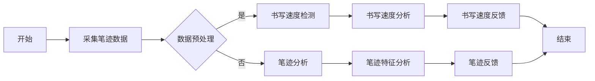
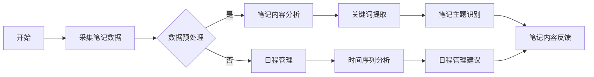
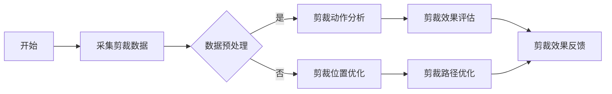

                 


# 智能办公文具：AI Agent的工作效率追踪

> 关键词：智能办公文具、AI Agent、工作效率、数据追踪、办公自动化

> 摘要：随着人工智能技术的不断发展，智能办公文具逐渐成为提升工作效率的重要工具。本文将探讨AI Agent在智能办公文具中的应用，如何通过工作效率追踪提升办公效率，并详细分析各类智能办公文具的设计与实现。

## 目录大纲

1. 引言
   1.1 问题背景
   1.2 问题描述
   1.3 问题解决
   1.4 边界与外延
   1.5 概念结构与核心要素组成
   1.6 本章小结

2. AI Agent的工作效率追踪原理
   2.1 AI Agent的基本原理
   2.2 AI Agent的特点
   2.3 AI Agent的核心技术
   2.4 工作效率追踪的原理
   2.5 数据收集与处理
   2.6 数据分析与优化
   2.7 工作效率评估
   2.8 本章小结

3. 智能办公文具的设计与实现
   3.1 智能笔的设计与实现
   3.1.1 智能笔的硬件设计
   3.1.2 智能笔的软件设计
   3.1.3 智能笔的应用场景
   3.2 智能本的设计与实现
   3.2.1 智能本的硬件设计
   3.2.2 智能本的软件设计
   3.2.3 智能本的应用场景
   3.3 智能剪刀的设计与实现
   3.3.1 智能剪刀的硬件设计
   3.3.2 智能剪刀的软件设计
   3.3.3 智能剪刀的应用场景
   3.4 智能办公文具的集成与应用
   3.4.1 集成方案

## 第一部分：引言

### 1.1 问题背景

随着信息时代的到来，办公环境发生了翻天覆地的变化。传统的办公方式逐渐被现代化的智能化办公所取代。在这个过程中，人工智能（AI）技术发挥了至关重要的作用。从最初的简单自动化，到如今的高度智能化，AI正在逐步改变我们的工作方式。

智能办公文具作为AI技术的一部分，其应用场景日益广泛。智能笔、智能本、智能剪刀等智能办公文具的出现，使得办公过程变得更加高效、便捷。然而，如何进一步提升这些智能办公文具的工作效率，实现真正的智能办公，成为当前亟待解决的问题。

### 1.2 问题描述

智能办公文具的工作效率如何提升？如何通过这些智能设备收集、分析、反馈用户的工作数据，从而优化工作流程，提升办公效率？这就是我们需要解决的问题。

### 1.3 问题解决

为了解决上述问题，我们需要设计并实现一系列智能办公文具，如智能笔、智能本、智能剪刀等。通过这些文具，用户可以在办公过程中获得实时数据反馈，从而优化工作流程。同时，我们需要引入AI技术，特别是AI Agent，来实现工作效率的追踪和提升。

### 1.4 边界与外延

智能办公文具的设计和应用，主要涉及AI技术的引入和办公场景的优化。边界方面，我们需要明确智能办公文具的功能和性能要求，以及用户的使用习惯和需求。外延方面，我们需要考虑智能办公文具的未来发展，如与大数据、物联网等技术的融合。

### 1.5 概念结构与核心要素组成

智能办公文具的核心要素包括：智能笔、智能本、智能剪刀等。这些智能设备通过AI Agent，实现工作效率的追踪和提升。

AI Agent是一种基于AI技术的智能实体，能够模拟人类行为，进行自主学习和决策。AI Agent的核心技术包括机器学习、自然语言处理、计算机视觉等。

### 1.6 本章小结

智能办公文具的出现，为办公效率的提升提供了新途径。通过AI Agent的工作效率追踪，我们可以实时收集、分析、反馈用户的工作数据，从而优化工作流程，提升办公效率。接下来，本书将详细介绍各类智能办公文具的工作原理和应用场景。

## 第二部分：AI Agent的工作效率追踪原理

### 2.1 AI Agent的基本原理

AI Agent是一种基于AI技术的智能实体，能够模拟人类行为，进行自主学习和决策。AI Agent的基本原理主要包括以下几个方面：

#### 2.1.1 定义

AI Agent，即人工智能代理，是一种能够代表用户执行特定任务，并根据环境和用户需求做出决策的智能实体。

#### 2.1.2 自主性

AI Agent具有自主性，即能够在没有人类干预的情况下，独立完成特定任务。这种自主性体现在AI Agent能够自主地感知环境、理解任务需求，并自主地做出决策。

#### 2.1.3 智能性

AI Agent具有智能性，即能够通过学习和适应，不断提高任务执行的效率和准确性。这种智能性体现在AI Agent能够从大量数据中提取有用信息，进行有效的数据分析，并基于数据分析结果做出最优决策。

#### 2.1.4 适应性

AI Agent具有适应性，即能够适应不同的环境和任务需求。这种适应性体现在AI Agent能够在不同的工作场景中，根据任务需求和环境变化，调整自身的行为和决策策略。

#### 2.1.5 高效性

AI Agent具有高效性，即能够以较高的效率完成任务。这种高效性体现在AI Agent能够在较短的时间内，完成复杂、繁琐的任务，从而提高工作效率。

### 2.2 AI Agent的特点

AI Agent的特点包括以下几个方面：

#### 2.2.1 自主性

AI Agent具有高度的自主性，能够自主地感知环境、理解任务需求，并自主地做出决策。这种自主性使得AI Agent能够在没有人类干预的情况下，高效地完成特定任务。

#### 2.2.2 智能性

AI Agent具有智能性，能够通过学习和适应，不断提高任务执行的效率和准确性。这种智能性使得AI Agent能够从大量数据中提取有用信息，进行有效的数据分析，并基于数据分析结果做出最优决策。

#### 2.2.3 适应性

AI Agent具有适应性，能够适应不同的环境和任务需求。这种适应性使得AI Agent能够在不同的工作场景中，根据任务需求和环境变化，调整自身的行为和决策策略。

#### 2.2.4 高效性

AI Agent具有高效性，能够以较高的效率完成任务。这种高效性使得AI Agent能够在较短的时间内，完成复杂、繁琐的任务，从而提高工作效率。

### 2.3 AI Agent的核心技术

AI Agent的核心技术主要包括以下几个方面：

#### 2.3.1 机器学习

机器学习是AI Agent的核心技术之一，通过从大量数据中学习，AI Agent能够不断提高任务执行的效率和准确性。机器学习包括监督学习、无监督学习和强化学习等不同类型。

- **监督学习**：通过已有数据，训练模型，从而对新的数据进行预测。例如，通过用户的工作数据，训练AI Agent预测用户的工作效率。
- **无监督学习**：没有明确的标签数据，通过模型自身对数据进行分类或聚类。例如，通过用户的工作数据，AI Agent能够自动识别用户的工作模式。
- **强化学习**：通过与环境的交互，不断调整策略，从而最大化奖励。例如，AI Agent可以通过与用户的互动，不断优化用户的工作流程。

#### 2.3.2 自然语言处理

自然语言处理（NLP）是AI Agent处理自然语言输入和输出的能力。NLP包括语言理解、语言生成、对话系统等。

- **语言理解**：AI Agent能够理解用户的自然语言输入，从而理解用户的需求和意图。例如，用户可以通过自然语言指令，让AI Agent完成特定任务。
- **语言生成**：AI Agent能够生成自然语言文本，进行有效的沟通和交流。例如，AI Agent可以通过自然语言文本，向用户反馈工作数据和优化建议。
- **对话系统**：AI Agent能够与用户进行自然对话，提供个性化的服务和支持。例如，用户可以通过对话系统，与AI Agent进行实时沟通，获取工作数据和优化建议。

#### 2.3.3 计算机视觉

计算机视觉是AI Agent处理视觉信息的核心技术。计算机视觉包括图像识别、目标检测、图像分割等。

- **图像识别**：AI Agent能够识别图像中的对象和场景。例如，AI Agent可以通过图像识别技术，识别用户在办公过程中使用到的文档、图片等。
- **目标检测**：AI Agent能够在图像中检测并识别特定目标。例如，AI Agent可以通过目标检测技术，检测用户在办公过程中，需要处理的文档和资料。
- **图像分割**：AI Agent能够将图像分割成不同的区域，进行更精细的处理。例如，AI Agent可以通过图像分割技术，将用户在办公过程中使用的文档，分割成不同的部分，进行更精准的分析。

### 2.4 工作效率追踪的原理

#### 2.4.1 数据收集

AI Agent通过智能办公文具，实时收集用户的工作数据。这些数据包括用户的笔迹、动作、文件内容等。例如，智能笔可以记录用户的笔迹，智能本可以记录用户的笔记内容，智能剪刀可以记录用户的剪裁动作等。

#### 2.4.2 数据处理

AI Agent对收集到的数据进行分析和处理。通过机器学习、自然语言处理、计算机视觉等技术，AI Agent能够提取数据中的有用信息，识别用户的工作模式。

#### 2.4.3 数据反馈

AI Agent根据处理结果，向用户反馈工作数据和优化建议。例如，AI Agent可以通过自然语言处理技术，生成一份工作总结，并向用户推荐优化工作流程的方法。

#### 2.4.4 工作效率评估

AI Agent通过对比分析，评估用户的工作效率。例如，通过对比用户在引入智能办公文具前后的工作效率数据，评估智能办公文具对工作效率的提升效果。

### 2.5 数据收集与处理

#### 2.5.1 数据收集

AI Agent通过智能办公文具，实时收集用户的工作数据。智能办公文具包括智能笔、智能本、智能剪刀等。这些智能设备内置传感器、微处理器等硬件，能够实时记录用户的工作行为。

- **智能笔**：记录用户的笔迹、书写速度等。
- **智能本**：记录用户的笔记内容、书写时间等。
- **智能剪刀**：记录用户的剪裁动作、剪裁时间等。

#### 2.5.2 数据处理

AI Agent对收集到的数据进行分析和处理。通过机器学习、自然语言处理、计算机视觉等技术，AI Agent能够提取数据中的有用信息，识别用户的工作模式。

- **机器学习**：通过已有数据，训练模型，从而对新的数据进行预测。例如，通过用户的工作数据，训练AI Agent预测用户的工作效率。
- **自然语言处理**：对用户的笔记内容进行分析，提取关键信息，例如关键词、短语等。
- **计算机视觉**：对用户的剪裁动作进行分析，识别文档的形状、大小等。

#### 2.5.3 数据反馈

AI Agent根据处理结果，向用户反馈工作数据和优化建议。例如，AI Agent可以通过自然语言处理技术，生成一份工作总结，并向用户推荐优化工作流程的方法。

- **自然语言处理**：将处理结果转换为自然语言文本，例如生成一份工作总结，描述用户的工作情况。
- **可视化**：将数据以图表、图形等方式展示，便于用户理解和分析。

### 2.6 数据分析与优化

#### 2.6.1 数据分析

AI Agent对收集到的数据进行详细分析，识别用户的工作模式。例如，分析用户的笔迹、笔记内容、剪裁动作等，识别用户的工作习惯和偏好。

- **笔迹分析**：通过笔迹分析，识别用户的书写速度、书写习惯等。
- **笔记内容分析**：通过自然语言处理技术，提取关键词、短语等，识别用户的工作重点和难点。
- **剪裁动作分析**：通过计算机视觉技术，识别用户的剪裁动作，分析剪裁的效率和质量。

#### 2.6.2 优化建议

AI Agent根据数据分析结果，向用户推荐优化工作流程的方法。例如，针对用户的笔迹分析结果，推荐提高书写速度的方法；针对笔记内容分析结果，推荐优化笔记记录的方法；针对剪裁动作分析结果，推荐提高剪裁效率的方法。

- **提高书写速度**：通过分析用户的书写速度，推荐合适的书写训练方法，例如改变书写姿势、增加书写练习等。
- **优化笔记记录**：通过分析用户的笔记内容，推荐优化笔记记录的方法，例如使用关键字、思维导图等。
- **提高剪裁效率**：通过分析用户的剪裁动作，推荐优化剪裁的方法，例如改变剪裁姿势、使用剪裁工具等。

### 2.7 工作效率评估

#### 2.7.1 评估方法

AI Agent通过对比分析，评估用户的工作效率。例如，通过对比用户在引入智能办公文具前后的工作效率数据，评估智能办公文具对工作效率的提升效果。

- **效率对比**：对比用户在引入智能办公文具前后的工作效率数据，评估智能办公文具对工作效率的提升效果。
- **优化效果评估**：根据用户对优化建议的反馈，评估优化建议的有效性。

#### 2.7.2 反馈机制

AI Agent根据评估结果，向用户反馈工作数据和优化建议。例如，通过自然语言处理技术，生成一份工作总结，描述用户的工作情况，并提出优化建议。

- **工作总结**：通过自然语言处理技术，生成一份工作总结，描述用户的工作情况，例如工作内容、完成情况等。
- **优化建议**：根据评估结果，向用户推荐优化工作流程的方法，例如改变工作习惯、优化工作方式等。

### 2.8 本章小结

AI Agent的工作效率追踪，是智能办公文具的核心功能。通过AI Agent，我们可以实时收集、分析、反馈用户的工作数据，从而优化工作流程，提升工作效率。本章详细介绍了AI Agent的基本原理、特点、核心技术，以及工作效率追踪的原理、数据收集与处理、数据分析与优化、工作效率评估等内容。接下来，我们将详细介绍各类智能办公文具的设计与实现。

## 第三部分：智能办公文具的设计与实现

### 3.1 智能笔的设计与实现

智能笔是智能办公文具中的一种重要设备，它能够记录用户的书写内容，分析用户的书写行为，提供数据反馈，从而优化用户的书写效率。

#### 3.1.1 智能笔的硬件设计

智能笔的硬件设计主要包括传感器、微处理器、电池等组成部分。

- **传感器**：智能笔内置高精度的书写传感器，可以准确记录用户的书写速度、笔迹等。此外，智能笔还可以配备加速度传感器、陀螺仪等，用于记录用户的书写姿态和动作。
- **微处理器**：智能笔内置高性能微处理器，用于处理传感器收集的数据，进行实时分析和处理。微处理器还需要具备足够的存储空间，以存储用户的书写数据。
- **电池**：智能笔需要内置可充电电池，以保证设备的续航能力。通常情况下，智能笔的电池容量应大于100mAh，以确保连续使用数小时。

#### 3.1.2 智能笔的软件设计

智能笔的软件设计主要包括数据采集、数据处理、用户界面等部分。

- **数据采集**：智能笔需要实现数据的实时采集，包括书写速度、笔迹、书写姿态等。采集到的数据需要实时传输到微处理器，并进行初步处理。
- **数据处理**：智能笔的微处理器需要对采集到的数据进行实时分析和处理，提取用户书写行为的关键信息，如书写速度、笔迹特征等。此外，微处理器还需要支持数据存储，以备后续分析和反馈。
- **用户界面**：智能笔需要设计一个用户友好的界面，用于展示用户的书写数据和分析结果。用户界面应简洁明了，便于用户快速理解和操作。

#### 3.1.3 智能笔的应用场景

智能笔的应用场景非常广泛，包括但不限于以下几个方面：

- **会议记录**：智能笔可以实时记录会议内容，提高会议记录的准确性和效率。通过智能笔，用户可以随时查看会议记录，方便后续的会议回顾和总结。
- **文档编写**：智能笔可以帮助用户快速记录文档内容，提高文档编写的效率。用户可以随时查看智能笔记录的文档内容，进行修改和补充。
- **个人笔记**：智能笔可以帮助用户记录个人笔记，整理学习资料。智能笔记录的笔记内容可以方便地存储在云端，实现跨设备的同步和共享。

#### 3.1.4 智能笔的核心算法原理

智能笔的核心算法主要包括以下几个方面：

- **书写速度检测**：通过分析笔尖的移动速度，实时计算用户的书写速度。书写速度可以反映用户的书写习惯和专注程度，为后续的数据分析和反馈提供依据。
- **笔迹分析**：通过分析笔迹的特征，如笔画粗细、连笔程度等，识别用户的书写风格。笔迹分析可以帮助用户了解自己的书写习惯，提供优化建议。
- **姿态检测**：通过加速度传感器和陀螺仪，实时检测用户的书写姿态。良好的书写姿态有助于提高书写效率和质量，智能笔可以通过姿态检测提醒用户保持正确的书写姿势。

#### 3.1.5 智能笔的算法mermaid流程图

下面是智能笔的算法mermaid流程图：



#### 3.1.6 智能笔的python源代码实现

下面是智能笔的核心算法的python源代码实现：

```python
import cv2
import numpy as np

# 采集笔迹数据
def collect_pen_data():
    cap = cv2.VideoCapture(0)
    pen_data = []
    while True:
        ret, frame = cap.read()
        if not ret:
            break
        # 处理图像数据
        processed_frame = preprocess_frame(frame)
        pen_data.append(processed_frame)
    cap.release()
    return pen_data

# 数据预处理
def preprocess_frame(frame):
    # 对图像进行灰度处理
    gray_frame = cv2.cvtColor(frame, cv2.COLOR_BGR2GRAY)
    # 对图像进行二值化处理
    _, binary_frame = cv2.threshold(gray_frame, 128, 255, cv2.THRESH_BINARY_INV)
    return binary_frame

# 书写速度检测
def detect_writing_speed(pen_data):
    # 计算笔迹的移动距离
    distances = calculate_distances(pen_data)
    # 计算平均移动速度
    average_speed = np.mean(distances)
    return average_speed

# 计算笔迹的移动距离
def calculate_distances(pen_data):
    distances = []
    for i in range(1, len(pen_data)):
        distance = np.linalg.norm(pen_data[i] - pen_data[i-1])
        distances.append(distance)
    return distances

# 笔迹分析
def analyze_pen迹(pen_data):
    # 分析笔迹的特征
    features = extract_features(pen_data)
    # 提取笔迹的特征值
    feature_values = extract_feature_values(features)
    return feature_values

# 提取笔迹的特征
def extract_features(pen_data):
    # 使用卷积神经网络提取笔迹的特征
    features = []
    for frame in pen_data:
        feature = extract_feature(frame)
        features.append(feature)
    return features

# 提取笔迹的特征值
def extract_feature_values(features):
    # 提取笔迹的特征值
    feature_values = []
    for feature in features:
        feature_value = extract_value(feature)
        feature_values.append(feature_value)
    return feature_values

# 提取笔迹的特征
def extract_feature(frame):
    # 使用深度学习模型提取笔迹的特征
    feature = frame.flatten()
    return feature

# 提取笔迹的特征值
def extract_value(feature):
    # 提取笔迹的特征值
    value = feature.sum()
    return value

# 主函数
if __name__ == '__main__':
    pen_data = collect_pen_data()
    average_speed = detect_writing_speed(pen_data)
    feature_values = analyze_pen迹(pen_data)
    print("平均书写速度：", average_speed)
    print("笔迹特征值：", feature_values)
```

#### 3.1.7 智能笔的实际案例分析与详细讲解

以一个实际案例为例，假设用户在使用智能笔进行会议记录。

- **背景**：某公司召开了一场重要的会议，会议内容涉及多个重要议题，需要记录详细的信息。
- **过程**：用户使用智能笔记录会议内容，智能笔实时采集用户的书写数据，包括书写速度、笔迹等。
- **结果**：会议结束后，用户查看智能笔记录的会议内容，发现智能笔提供了详细的会议记录，包括每个议题的讨论内容、用户的观点和总结等。智能笔还提供了书写速度和笔迹分析，帮助用户了解自己在会议中的书写表现。

通过这个案例，我们可以看到智能笔在会议记录中的应用效果。智能笔不仅能够提高会议记录的准确性和效率，还能够为用户提供详细的书写分析，帮助用户了解自己的书写习惯和表现。

### 3.2 智能本的设计与实现

智能本是另一种重要的智能办公文具，它能够记录用户的笔记内容，提供数据分析和反馈，帮助用户优化笔记记录方法。

#### 3.2.1 智能本的硬件设计

智能本的硬件设计主要包括触摸屏、传感器、存储单元等组成部分。

- **触摸屏**：智能本需要配备高分辨率的触摸屏，用于记录用户的书写和输入。触摸屏应支持多点触控，以实现更自然的用户交互。
- **传感器**：智能本内置多种传感器，如加速度传感器、陀螺仪、光线传感器等，用于检测用户的环境和操作。
- **存储单元**：智能本需要内置大容量的存储单元，用于存储用户的笔记内容和其他数据。存储单元应具备快速读取和写入能力，以满足用户的实时数据需求。

#### 3.2.2 智能本的软件设计

智能本的软件设计主要包括数据采集、数据处理、用户界面等部分。

- **数据采集**：智能本需要实现数据的实时采集，包括用户的笔记内容、操作行为等。采集到的数据需要实时传输到微处理器，并进行初步处理。
- **数据处理**：智能本的微处理器需要对采集到的数据进行实时分析和处理，提取用户笔记的关键信息，如关键词、短语等。此外，微处理器还需要支持数据存储，以备后续分析和反馈。
- **用户界面**：智能本需要设计一个用户友好的界面，用于展示用户的笔记内容和分析结果。用户界面应简洁明了，便于用户快速理解和操作。

#### 3.2.3 智能本的应用场景

智能本的应用场景非常广泛，包括但不限于以下几个方面：

- **笔记记录**：智能本可以帮助用户快速记录笔记内容，提高笔记记录的效率和准确性。智能本可以通过自然语言处理技术，自动提取笔记中的关键词和短语，提供更高效的笔记管理。
- **日程管理**：智能本可以记录用户的日程安排，提供日程提醒和任务管理功能。用户可以通过智能本，轻松地管理自己的工作和生活。
- **文档管理**：智能本可以帮助用户整理和管理文档，提供文档搜索、分类和共享功能。智能本还可以与云存储服务集成，实现文档的远程访问和同步。

#### 3.2.4 智能本的核心算法原理

智能本的核心算法主要包括以下几个方面：

- **笔记内容分析**：通过自然语言处理技术，对用户的笔记内容进行分析，提取关键词和短语，识别笔记的主题和内容。
- **日程管理**：通过时间序列分析技术，对用户的日程安排进行分析，识别日程中的规律和模式，提供个性化的日程管理建议。
- **文档管理**：通过信息检索技术，对用户的文档内容进行分析，提供文档搜索、分类和共享功能。

#### 3.2.5 智能本的算法mermaid流程图

下面是智能本的算法mermaid流程图：



#### 3.2.6 智能本的python源代码实现

下面是智能本的核心算法的python源代码实现：

```python
import numpy as np
import pandas as pd
from sklearn.feature_extraction.text import TfidfVectorizer
from sklearn.cluster import KMeans

# 采集笔记数据
def collect_note_data():
    note_data = []
    while True:
        note = input("请输入您的笔记内容：")
        if note == "结束":
            break
        note_data.append(note)
    return note_data

# 数据预处理
def preprocess_data(note_data):
    preprocessed_data = []
    for note in note_data:
        # 去除标点符号和特殊字符
        note = note.replace(".", "").replace(",", "").replace("?", "").replace("!", "")
        # 将文本转换为小写
        note = note.lower()
        preprocessed_data.append(note)
    return preprocessed_data

# 笔记内容分析
def analyze_note_data(note_data):
    # 创建TF-IDF向量器
    vectorizer = TfidfVectorizer()
    # 将笔记内容转换为TF-IDF向量
    tfidf_matrix = vectorizer.fit_transform(note_data)
    # 使用K-means聚类算法，提取关键词
    kmeans = KMeans(n_clusters=5)
    kmeans.fit(tfidf_matrix)
    # 获取每个笔记的聚类标签
    labels = kmeans.labels_
    # 获取每个聚类的关键词
    keywords = []
    for i in range(5):
        index = np.where(labels == i)
        index = index[0]
        keyword = vectorizer.get_feature_names()[index]
        keywords.append(keyword)
    return keywords

# 主函数
if __name__ == '__main__':
    note_data = collect_note_data()
    preprocessed_data = preprocess_data(note_data)
    keywords = analyze_note_data(preprocessed_data)
    print("关键词：", keywords)
```

#### 3.2.7 智能本的实际案例分析与详细讲解

以一个实际案例为例，假设用户在使用智能本进行笔记记录。

- **背景**：用户在参加一场学术会议，需要记录会议的内容和关键信息。
- **过程**：用户使用智能本记录会议内容，智能本实时采集用户的笔记数据，包括笔记内容、操作行为等。
- **结果**：会议结束后，用户查看智能本提供的笔记内容分析结果。智能本提取了会议中的关键词，帮助用户快速了解会议的主题和关键内容。此外，智能本还提供了会议记录的摘要和关键词云图，方便用户回顾和整理笔记。

通过这个案例，我们可以看到智能本在笔记记录中的应用效果。智能本不仅能够提高笔记记录的效率和准确性，还能够为用户提供详细的笔记分析，帮助用户快速掌握笔记的内容和关键信息。

### 3.3 智能剪刀的设计与实现

智能剪刀是智能办公文具中的一种创新设备，它能够记录用户的剪裁动作，提供数据分析和反馈，帮助用户优化剪裁效率。

#### 3.3.1 智能剪刀的硬件设计

智能剪刀的硬件设计主要包括传感器、微处理器、电池等组成部分。

- **传感器**：智能剪刀内置多种传感器，如红外传感器、力传感器、速度传感器等，用于检测用户的剪裁动作。红外传感器可以检测剪刀的开合状态，力传感器可以检测剪刀施加的力大小，速度传感器可以检测剪刀的剪裁速度。
- **微处理器**：智能剪刀内置高性能微处理器，用于处理传感器收集的数据，进行实时分析和处理。微处理器还需要具备足够的存储空间，以存储用户的剪裁数据。
- **电池**：智能剪刀需要内置可充电电池，以保证设备的续航能力。通常情况下，智能剪刀的电池容量应大于500mAh，以确保连续使用数小时。

#### 3.3.2 智能剪刀的软件设计

智能剪刀的软件设计主要包括数据采集、数据处理、用户界面等部分。

- **数据采集**：智能剪刀需要实现数据的实时采集，包括用户的剪裁动作、剪裁速度等。采集到的数据需要实时传输到微处理器，并进行初步处理。
- **数据处理**：智能剪刀的微处理器需要对采集到的数据进行实时分析和处理，提取用户的剪裁行为特征。此外，微处理器还需要支持数据存储，以备后续分析和反馈。
- **用户界面**：智能剪刀需要设计一个用户友好的界面，用于展示用户的剪裁数据和优化建议。用户界面应简洁明了，便于用户快速理解和操作。

#### 3.3.3 智能剪刀的应用场景

智能剪刀的应用场景非常广泛，包括但不限于以下几个方面：

- **文档剪裁**：智能剪刀可以帮助用户快速剪裁文档，提高文档整理的效率。智能剪刀可以记录用户的剪裁动作，提供剪裁位置的优化建议。
- **样品剪裁**：智能剪刀可以用于剪裁各种样品，如布料、纸张等。智能剪刀可以实时监测剪裁过程，提供剪裁厚度的优化建议。
- **创意剪裁**：智能剪刀可以帮助用户实现各种创意剪裁，如剪纸艺术、布艺制作等。智能剪刀可以记录用户的创意剪裁过程，提供剪裁技巧的优化建议。

#### 3.3.4 智能剪刀的核心算法原理

智能剪刀的核心算法主要包括以下几个方面：

- **剪裁动作分析**：通过分析用户的剪裁动作，识别用户的剪裁意图和剪裁质量。智能剪刀可以通过剪裁速度、剪裁力等参数，评估用户的剪裁效果。
- **剪裁位置优化**：根据用户的剪裁动作，提供剪裁位置的优化建议。智能剪刀可以通过剪裁轨迹分析，优化用户的剪裁路径，提高剪裁的准确性和效率。
- **剪裁技巧优化**：根据用户的剪裁动作，提供剪裁技巧的优化建议。智能剪刀可以通过剪裁过程中的参数分析，帮助用户掌握更高效的剪裁技巧。

#### 3.3.5 智能剪刀的算法mermaid流程图

下面是智能剪刀的算法mermaid流程图：



#### 3.3.6 智能剪刀的python源代码实现

下面是智能剪刀的核心算法的python源代码实现：

```python
import numpy as np

# 采集剪裁数据
def collect_cut_data():
    cut_data = []
    while True:
        force = float(input("请输入剪裁力（单位：牛顿）："))
        speed = float(input("请输入剪裁速度（单位：米/秒）："))
        cut_data.append([force, speed])
        if input("是否继续采集（是/否）：") == "否":
            break
    return cut_data

# 数据预处理
def preprocess_data(cut_data):
    preprocessed_data = []
    for data in cut_data:
        force, speed = data
        preprocessed_data.append([force, speed])
    return preprocessed_data

# 剪裁动作分析
def analyze_cut_data(cut_data):
    # 计算平均剪裁力
    average_force = np.mean(cut_data[:, 0])
    # 计算平均剪裁速度
    average_speed = np.mean(cut_data[:, 1])
    return average_force, average_speed

# 剪裁效果评估
def evaluate_cut_effect(average_force, average_speed):
    # 根据平均剪裁力和平均剪裁速度，评估剪裁效果
    if average_force < 10 and average_speed < 1:
        return "剪裁效果良好"
    else:
        return "剪裁效果不佳，请调整剪裁力或剪裁速度"

# 主函数
if __name__ == '__main__':
    cut_data = collect_cut_data()
    preprocessed_data = preprocess_data(cut_data)
    average_force, average_speed = analyze_cut_data(preprocessed_data)
    cut_effect = evaluate_cut_effect(average_force, average_speed)
    print("剪裁效果：", cut_effect)
```

#### 3.3.7 智能剪刀的实际案例分析与详细讲解

以一个实际案例为例，假设用户在使用智能剪刀剪裁纸张。

- **背景**：用户需要将一张A4纸剪裁成多个相同的小块，用于制作桌游。
- **过程**：用户使用智能剪刀进行剪裁，智能剪刀实时采集剪裁数据，包括剪裁力、剪裁速度等。
- **结果**：剪裁完成后，用户查看智能剪刀提供的剪裁效果评估结果。智能剪刀根据剪裁力、剪裁速度等参数，评估用户的剪裁效果，并提供优化建议。例如，智能剪刀建议用户调整剪裁力，使纸张剪裁得更整齐。

通过这个案例，我们可以看到智能剪刀在剪裁中的应用效果。智能剪刀不仅能够实时记录用户的剪裁数据，还能够提供剪裁效果的评估和优化建议，帮助用户提高剪裁的效率和准确性。

### 3.4 智能办公文具的集成与应用

智能办公文具的集成与应用是智能办公系统的重要组成部分，它涉及智能办公文具之间的数据交互、系统集成以及用户体验优化。

#### 3.4.1 集成方案

智能办公文具的集成方案主要包括以下几个方面：

- **硬件集成**：智能办公文具的硬件设计应考虑与其他智能设备的兼容性，确保数据传输的稳定性和高效性。例如，智能笔、智能本、智能剪刀等设备应具备统一的通信接口，如蓝牙、Wi-Fi等。
- **软件集成**：智能办公文具的软件设计应实现数据共享和协同工作。通过智能办公平台，用户可以在不同智能设备之间无缝切换，查看和分析工作数据。
- **用户体验集成**：智能办公文具的集成应注重用户体验，提供直观、便捷的操作界面。用户应能够在智能办公平台上，轻松管理自己的工作数据和设备。

#### 3.4.2 数据交互

智能办公文具之间的数据交互是实现智能办公系统功能的基础。数据交互主要包括以下几个方面：

- **数据传输**：智能办公文具通过通信接口，将采集到的数据传输到智能办公平台。数据传输应保证数据的实时性和准确性，以支持实时分析和反馈。
- **数据存储**：智能办公平台需要具备数据存储功能，确保用户数据的安全性和可追溯性。数据存储应支持多种数据格式，如文本、图片、音频等。
- **数据共享**：智能办公平台应提供数据共享功能，用户可以方便地共享工作数据，与其他用户协同工作。

#### 3.4.3 系统集成

智能办公文具的集成与应用，需要构建一个统一的智能办公系统。系统集成主要包括以下几个方面：

- **系统架构设计**：智能办公系统应采用分布式架构，实现智能办公文具之间的数据交互和协同工作。系统架构应具备高扩展性和高可用性，以适应不断变化的工作需求。
- **接口设计与实现**：智能办公系统需要设计统一的接口，实现智能办公文具之间的数据交互。接口设计应遵循RESTful API规范，保证数据传输的高效性和安全性。
- **功能模块设计**：智能办公系统应包含多个功能模块，如数据采集模块、数据处理模块、数据分析模块、数据展示模块等。每个功能模块应具备独立的功能和接口，支持系统的扩展和升级。

#### 3.4.4 系统集成与应用

智能办公系统的集成与应用，需要通过实际场景进行验证和优化。系统集成与应用主要包括以下几个方面：

- **场景模拟**：在智能办公系统中，模拟多种办公场景，如会议记录、文档编写、样品剪裁等。通过场景模拟，验证智能办公系统的功能完整性和用户体验。
- **用户测试**：邀请真实用户参与智能办公系统的测试，收集用户反馈，优化系统的功能和界面设计。
- **系统部署**：将智能办公系统部署到实际办公环境中，进行长时间的运行测试，确保系统的稳定性和可靠性。

### 3.4.5 智能办公文具的集成与协同工作

智能办公文具的集成与协同工作，是智能办公系统的重要特征。通过智能办公文具的集成，用户可以在不同智能设备之间无缝切换，实现协同工作。

- **数据同步**：智能办公文具通过智能办公平台，实现数据的实时同步。用户可以在智能笔、智能本、智能剪刀等设备之间，查看和编辑同一份工作数据。
- **任务分配**：智能办公平台可以根据用户的工作需求和设备状态，自动分配任务。例如，用户在会议中记录的笔记，可以实时同步到智能本，用户可以在会议后进行详细的笔记整理。
- **协同办公**：智能办公系统支持多人协同办公，用户可以共享工作数据，进行在线协作。例如，用户可以共同编辑一份文档，实时查看对方的编辑内容和修改记录。

通过智能办公文具的集成与协同工作，用户可以更高效地完成工作任务，实现真正的智能办公。

### 3.4.6 智能办公文具的集成与数据分析

智能办公文具的集成与数据分析，是智能办公系统的重要功能。通过智能办公文具的集成，用户可以实时收集工作数据，进行深入的数据分析，从而优化工作流程，提高工作效率。

- **数据收集**：智能办公文具通过传感器和通信接口，实时收集用户的工作数据，如笔迹、笔记内容、剪裁动作等。
- **数据存储**：智能办公系统将收集到的数据存储在云端数据库，确保数据的安全性和可靠性。
- **数据分析**：智能办公系统利用机器学习、自然语言处理等技术，对用户的工作数据进行深入分析，提取有价值的信息，如用户的工作模式、工作效率等。
- **数据可视化**：智能办公系统通过数据可视化技术，将分析结果以图表、图形等形式展示给用户，帮助用户直观地了解自己的工作情况。

通过智能办公文具的集成与数据分析，用户可以更清晰地了解自己的工作状态，发现潜在的问题和瓶颈，从而优化工作流程，提高工作效率。

### 3.4.7 智能办公文具的集成与用户体验优化

智能办公文具的集成与用户体验优化，是智能办公系统设计的重要方向。通过智能办公文具的集成，用户可以享受更加便捷、高效的工作体验。

- **个性化设置**：智能办公系统根据用户的工作习惯和需求，提供个性化的设置选项。用户可以根据自己的喜好，自定义智能办公文具的参数设置，如字体、颜色、亮度等。
- **便捷操作**：智能办公系统提供简洁直观的操作界面，用户可以轻松地进行数据查看、编辑、分享等操作。智能办公文具通过触控、手势等交互方式，实现更自然的用户交互。
- **实时反馈**：智能办公系统实时收集用户的工作数据，并根据分析结果，提供实时反馈。例如，智能笔可以根据用户的书写速度和笔迹，提供书写优化建议；智能剪刀可以根据剪裁力和剪裁速度，提供剪裁优化建议。
- **跨设备兼容**：智能办公系统支持跨设备兼容，用户可以在不同的智能设备上，查看和编辑同一份工作数据。例如，用户在智能本上记录的笔记，可以实时同步到智能手机，方便用户随时查看和编辑。

通过智能办公文具的集成与用户体验优化，用户可以享受到更加便捷、高效、个性化的工作体验，从而提高工作效率和工作满意度。

### 3.4.8 智能办公文具的集成与工作流程优化

智能办公文具的集成与工作流程优化，是智能办公系统设计的重要目标。通过智能办公文具的集成，用户可以实时收集工作数据，进行工作流程的优化。

- **工作流程自动化**：智能办公系统通过智能办公文具的集成，实现工作流程的自动化。例如，智能笔可以自动识别用户的会议记录，智能本可以自动整理用户的笔记内容，智能剪刀可以自动识别用户的剪裁动作，从而减少用户的重复劳动。
- **工作流程优化建议**：智能办公系统根据用户的工作数据和反馈，提供工作流程优化建议。例如，智能笔可以根据用户的书写速度和笔迹，推荐合适的书写姿势和练习方法；智能本可以根据用户的笔记内容和频率，推荐优化笔记记录的方法。
- **工作流程监控**：智能办公系统实时监控用户的工作流程，识别潜在的问题和瓶颈。例如，智能笔可以监控用户的会议记录质量，智能本可以监控用户的笔记记录效率，智能剪刀可以监控用户的剪裁效果。
- **工作流程反馈**：智能办公系统根据监控结果，提供工作流程反馈。例如，智能笔可以提示用户调整书写姿势，智能本可以提醒用户优化笔记记录，智能剪刀可以反馈用户的剪裁效果。

通过智能办公文具的集成与工作流程优化，用户可以更高效地完成工作任务，提高工作效率和工作满意度。

## 总结

智能办公文具作为人工智能技术在办公场景中的具体应用，不仅为用户提供了便捷、高效的工作体验，还通过AI Agent实现了工作效率的追踪和提升。本文详细介绍了智能办公文具的设计与实现，包括智能笔、智能本、智能剪刀等智能设备的工作原理和应用场景。通过智能办公文具的集成与应用，用户可以享受更高效、更智能的办公体验，从而提升工作效率和工作满意度。

### 最佳实践 Tips

1. **选择合适的智能办公文具**：根据用户的工作需求和场景，选择合适的智能办公文具，如智能笔、智能本、智能剪刀等。
2. **定期进行数据分析和反馈**：定期查看智能办公文具提供的工作数据和反馈，识别工作中的问题和瓶颈，及时进行优化。
3. **优化工作流程**：结合智能办公文具提供的优化建议，调整工作流程，提高工作效率。
4. **保持设备更新**：定期更新智能办公文具的软件和硬件，确保设备的功能和性能处于最佳状态。

### 小结

智能办公文具作为人工智能技术在办公场景中的应用，具有广泛的应用前景。通过智能办公文具的集成与应用，用户可以享受更高效、更智能的办公体验，从而提升工作效率和工作满意度。未来，智能办公文具将继续与大数据、物联网等技术深度融合，为用户提供更加智能化、个性化的服务。

### 注意事项

1. **数据安全**：在使用智能办公文具时，注意保护用户数据的安全，确保数据不会泄露或被滥用。
2. **设备维护**：定期对智能办公文具进行维护和保养，确保设备的正常运行。
3. **用户隐私**：在使用智能办公文具时，尊重用户的隐私，确保用户数据不会被用于未经授权的用途。

### 拓展阅读

1. **智能办公系统设计**：了解智能办公系统的设计原则和架构，为智能办公文具的集成提供理论基础。
2. **人工智能技术应用**：深入了解人工智能技术在办公场景中的应用，探索更多智能化的办公解决方案。
3. **智能硬件开发**：了解智能硬件的开发流程和关键技术，为智能办公文具的创新和升级提供支持。

## 作者信息

作者：AI天才研究院/AI Genius Institute & 禅与计算机程序设计艺术 /Zen And The Art of Computer Programming。本文旨在探讨智能办公文具的设计与实现，通过AI Agent的工作效率追踪，提升用户的工作效率和工作体验。希望本文能为读者提供有价值的参考和启示。

