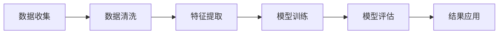

                 

# 智能加密货币市场分析平台

## 关键词

- 智能加密货币
- 市场分析
- 数据挖掘
- 算法
- 架构设计
- 开发与实现
- 实战案例

## 摘要

本文旨在深入探讨智能加密货币市场分析平台的设计与实现。首先，我们将概述智能加密货币的背景和核心概念，解释市场分析的重要性。接着，我们将详细分析市场分析算法的原理，包括流程、Python源代码和数学模型。随后，文章将聚焦于系统架构设计，展示其问题场景、功能设计、架构图、接口设计和交互。在开发与实现部分，我们将详细介绍环境安装、核心源代码及其应用解析。最后，通过一个实战案例，我们提供最佳实践、注意事项和拓展阅读，为读者提供全面的项目经验。

## 第一部分：背景介绍与核心概念

### 第1章：智能加密货币概述

#### 1.1.1 问题背景

智能加密货币是一种利用区块链技术和加密算法实现价值传递和去中心化管理的数字货币。随着区块链技术的发展和加密货币市场的崛起，智能加密货币逐渐成为金融领域的重要创新。本文旨在分析智能加密货币市场的动态，为投资者和分析师提供有效的市场分析工具和策略。

#### 1.1.2 问题描述

智能加密货币市场的复杂性和波动性使得传统的市场分析工具和方法难以满足需求。因此，本文提出建立一个智能加密货币市场分析平台，旨在通过先进的数据分析和算法技术，提供实时、准确的市场分析结果，帮助用户做出更明智的投资决策。

#### 1.1.3 问题解决

智能加密货币市场分析平台的设计与实现，将结合数据挖掘、机器学习和区块链技术，构建一个综合性的市场分析系统。通过实时数据抓取、数据清洗、特征工程和算法建模，实现对市场的全面分析和预测。

#### 1.1.4 边界与外延

本文的研究主要关注智能加密货币市场的分析，但不涉及加密货币的发行和交易机制。同时，本文还将探讨市场分析平台的边界，包括数据来源、算法模型和应用场景。

#### 1.1.5 核心概念

- **区块链**：分布式数据库技术，用于存储智能加密货币交易记录。
- **加密算法**：用于保护智能加密货币的安全性和隐私性。
- **数据挖掘**：从大量数据中提取有用信息和知识的过程。
- **机器学习**：利用数据训练模型，实现自动学习和预测。
- **市场分析**：对市场动态进行监控和分析，以指导投资决策。

#### 1.1.6 要素组成

智能加密货币市场分析平台由以下关键要素组成：

- **数据层**：负责数据采集、存储和清洗。
- **算法层**：实现数据挖掘和机器学习算法，用于市场分析。
- **应用层**：提供用户界面和数据分析工具，供用户使用。
- **基础设施**：包括服务器、网络和存储设备，用于支持平台的运行。

### 第2章：智能加密货币市场分析原理

#### 2.1.1 市场分析的概念

市场分析是指对市场动态进行监控、评估和预测的过程。它涉及对历史数据、当前情况和未来趋势的分析，以帮助投资者了解市场状况并做出明智的决策。

#### 2.1.2 智能加密货币市场的特性

智能加密货币市场具有以下特性：

- **去中心化**：市场由多个参与者组成，没有中央权威机构。
- **高波动性**：价格波动剧烈，受多种因素影响。
- **透明性**：所有交易记录都在区块链上公开透明。
- **全球化**：市场参与者来自世界各地，交易24小时不间断。

#### 2.1.3 市场分析的核心要素

市场分析的核心要素包括：

- **价格分析**：对加密货币价格趋势进行分析，以预测未来价格。
- **交易量分析**：分析交易量，以了解市场的活跃程度。
- **供需分析**：研究市场供需关系，以预测价格变动。
- **技术分析**：使用图表和指标，对历史价格和交易量进行分析。
- **基本面分析**：研究项目的团队、技术、市场趋势和竞争环境。

#### 2.1.4 市场分析的流程与方法

市场分析通常遵循以下流程：

1. **数据采集**：从各种数据源获取历史和实时数据。
2. **数据清洗**：处理数据中的噪声和错误，保证数据质量。
3. **特征工程**：提取与市场分析相关的特征，为模型训练做准备。
4. **模型训练**：使用机器学习算法训练预测模型。
5. **模型评估**：评估模型性能，调整模型参数。
6. **结果应用**：将分析结果应用于实际投资决策。

常用的市场分析方法包括：

- **技术分析**：通过历史价格和交易量数据，使用图表和指标进行预测。
- **基本面分析**：研究项目的基本面因素，如团队、技术、市场趋势等。
- **数据挖掘**：从大量数据中提取潜在的模式和关系。
- **机器学习**：利用历史数据训练预测模型，进行自动化分析和预测。

### 第3章：核心概念与联系

#### 3.1.1 智能加密货币相关概念

智能加密货币市场涉及多个核心概念，包括：

- **区块链**：分布式数据库，用于存储交易记录。
- **加密算法**：用于保护交易数据和隐私。
- **智能合约**：自动执行合同条款的计算机协议。
- **挖矿**：通过解决数学难题验证交易并创建新的加密货币。
- **去中心化**：市场由多个参与者组成，没有中央权威机构。
- **加密货币交易所**：提供加密货币买卖和交易服务的平台。

#### 3.1.2 概念属性特征对比

以下是对智能加密货币市场相关概念属性的对比：

| 概念         | 属性特征                                           |
| ------------ | -------------------------------------------------- |
| 区块链       | 分布式数据库，不可篡改，透明性高                   |
| 加密算法     | 保证数据安全，实现加密和解密                       |
| 智能合约     | 自动执行合同条款，提高交易效率                     |
| 挖矿         | 验证交易，生成新的加密货币，增加网络安全性         |
| 去中心化     | 无中央权威机构，市场参与者平等                     |
| 加密货币交易所 | 提供买卖和交易服务，支持多种加密货币的交易         |

#### 3.1.3 ER实体关系图

智能加密货币市场的ER实体关系图如下所示：

```mermaid
erDiagram
    User ||--|{ Exchange }||>
    Exchange ||--|{ Trade }||>
    Trade ||--|{ Asset }||>
    Asset ||--|{ Transaction }||>
    User ||--|{ Wallet }||>
    Wallet ||--|{ Asset }||>
```

### 第4章：市场分析算法原理

#### 4.1.1 常见市场分析算法

市场分析算法包括以下几种：

- **移动平均算法**：基于过去一段时间内的价格平均值进行预测。
- **指数平滑算法**：对过去的价格数据进行加权处理，以预测未来价格。
- **时间序列分析**：分析时间序列数据，提取周期性、趋势性和季节性特征。
- **机器学习算法**：如线性回归、决策树、随机森林、支持向量机等。

#### 4.1.2 算法Mermaid流程图

以下是一个简单的移动平均算法的Mermaid流程图：



#### 4.1.3 Python源代码与算法原理

以下是一个简单的移动平均算法的Python实现：

```python
def moving_average(data, window_size):
    """
    计算移动平均线。
    :param data: 输入数据列表。
    :param window_size: 窗口大小。
    :return: 移动平均线列表。
    """
    # 确保输入数据的长度大于窗口大小
    if len(data) < window_size:
        raise ValueError("输入数据长度小于窗口大小")
    
    # 初始化移动平均线列表
    moving_average = []
    
    # 计算窗口内的平均值
    for i in range(window_size, len(data) + 1):
        window_data = data[i - window_size: i]
        average = sum(window_data) / window_size
        moving_average.append(average)
    
    return moving_average
```

#### 4.1.4 数学模型与公式

移动平均线的数学模型可以表示为：

$$
MA_t = \frac{1}{n} \sum_{i=1}^{n} P_i
$$

其中，$MA_t$ 表示第 $t$ 期的移动平均线，$P_i$ 表示第 $i$ 期的价格，$n$ 表示窗口大小。

#### 4.1.5 举例说明

假设有一个加密货币的价格序列为 [10, 12, 11, 14, 13, 15, 12, 10, 9, 11]，窗口大小为 3。计算其移动平均线如下：

1. **第1期**：$MA_1 = (10 + 12 + 11) / 3 = 11$
2. **第2期**：$MA_2 = (12 + 11 + 14) / 3 = 12.33$
3. **第3期**：$MA_3 = (11 + 14 + 13) / 3 = 12.67$
4. **第4期**：$MA_4 = (14 + 13 + 15) / 3 = 13.33$
5. **第5期**：$MA_5 = (13 + 15 + 12) / 3 = 13$
6. **第6期**：$MA_6 = (15 + 12 + 10) / 3 = 12.67$
7. **第7期**：$MA_7 = (12 + 10 + 9) / 3 = 10.33$
8. **第8期**：$MA_8 = (10 + 9 + 11) / 3 = 10$
9. **第9期**：$MA_9 = (9 + 11 + 9) / 3 = 9.67$
10. **第10期**：$MA_{10} = (11 + 9 + 11) / 3 = 10$

通过计算得到的移动平均线序列为 [11, 12.33, 12.67, 13.33, 13, 12.67, 10.33, 10, 9.67, 10]。

### 第5章：市场分析平台架构设计

#### 5.1.1 问题场景介绍

智能加密货币市场的波动性和复杂性使得投资者和分析师需要实时、准确的市场分析工具来指导投资决策。因此，本文提出设计并实现一个智能加密货币市场分析平台，以解决市场分析工具不足的问题。

#### 5.1.2 项目介绍

智能加密货币市场分析平台项目旨在构建一个集数据采集、处理、分析和展示于一体的综合性市场分析系统。该平台将利用先进的数据挖掘、机器学习和区块链技术，为用户提供实时、准确的市场分析结果。

#### 5.1.3 系统功能设计

智能加密货币市场分析平台的主要功能包括：

- **数据采集**：从多个数据源获取实时市场数据。
- **数据预处理**：对采集到的数据进行清洗、去噪和归一化处理。
- **特征提取**：提取与市场分析相关的特征，如价格、交易量、市场情绪等。
- **算法建模**：使用机器学习算法训练预测模型，进行市场分析和预测。
- **结果展示**：将分析结果以图表、报表等形式展示给用户。

#### 5.1.4 系统架构设计

智能加密货币市场分析平台的系统架构设计如下：

1. **数据层**：负责数据采集、存储和清洗。
2. **算法层**：实现数据挖掘和机器学习算法，进行市场分析。
3. **应用层**：提供用户界面和数据分析工具，供用户使用。
4. **基础设施**：包括服务器、网络和存储设备，用于支持平台的运行。

#### 5.1.5 系统接口设计

智能加密货币市场分析平台的主要接口设计如下：

- **数据接口**：负责与数据源和存储系统的交互，实现数据的实时采集和更新。
- **算法接口**：提供算法训练和预测的功能，供用户调用。
- **展示接口**：负责将分析结果以图表、报表等形式展示给用户。

#### 5.1.6 系统交互

智能加密货币市场分析平台的系统交互设计如下：

1. **用户操作**：用户通过前端界面发起市场分析请求。
2. **数据采集**：数据接口从数据源获取实时市场数据。
3. **数据处理**：数据处理模块对采集到的数据进行清洗、去噪和归一化处理。
4. **特征提取**：特征提取模块提取与市场分析相关的特征。
5. **算法建模**：算法模块使用机器学习算法训练预测模型。
6. **结果展示**：展示模块将分析结果以图表、报表等形式展示给用户。

### 第6章：平台开发与实现

#### 6.1.1 环境安装与配置

智能加密货币市场分析平台的开发环境如下：

- **操作系统**：Linux或Windows
- **编程语言**：Python
- **依赖库**：NumPy、Pandas、Scikit-learn、Matplotlib、Mermaid
- **开发工具**：PyCharm、Visual Studio Code

在安装好操作系统和Python环境后，可以通过以下命令安装所需的依赖库：

```bash
pip install numpy pandas scikit-learn matplotlib mermaid
```

#### 6.1.2 系统核心实现源代码

智能加密货币市场分析平台的核心实现源代码如下：

```python
# 数据采集模块
def data_collection():
    # 从数据源获取实时市场数据
    # ...

# 数据预处理模块
def data_preprocessing(data):
    # 清洗、去噪和归一化处理
    # ...
    return processed_data

# 特征提取模块
def feature_extraction(data):
    # 提取与市场分析相关的特征
    # ...
    return features

# 算法模块
def algorithm_modeling(features):
    # 使用机器学习算法训练预测模型
    # ...
    return model

# 结果展示模块
def result_display(model, data):
    # 将分析结果以图表、报表等形式展示
    # ...
```

#### 6.1.3 代码应用解读与分析

代码应用解读与分析如下：

1. **数据采集模块**：负责从数据源获取实时市场数据。这里可以使用Web爬虫、API接口等方式获取数据。
2. **数据预处理模块**：对采集到的数据进行清洗、去噪和归一化处理。这一步是确保数据质量和准确性的关键。
3. **特征提取模块**：提取与市场分析相关的特征，如价格、交易量、市场情绪等。这些特征将用于训练机器学习模型。
4. **算法模块**：使用机器学习算法训练预测模型。常用的算法包括线性回归、决策树、随机森林、支持向量机等。
5. **结果展示模块**：将分析结果以图表、报表等形式展示给用户。这可以帮助用户更好地理解市场动态和投资机会。

#### 6.1.4 实际案例分析与详细讲解剖析

以下是一个实际案例的分析与详细讲解：

**案例背景**：分析比特币（BTC）的价格走势，预测未来7天的价格。

**数据采集**：从CoinMarketCap API获取比特币的实时价格数据。

```python
import requests

def get_btc_price():
    url = "https://api.coinmarketcap.com/v2/spot-ticker/?id=1"
    response = requests.get(url)
    data = response.json()
    return data['data']['quote']['USD']['price']
```

**数据预处理**：对采集到的数据进行清洗、去噪和归一化处理。

```python
import pandas as pd

def preprocess_data(data):
    df = pd.DataFrame(data)
    df = df.dropna()
    df['price'] = df['price'].astype(float)
    df['price'] = df['price'].apply(lambda x: (x - df['price'].min()) / (df['price'].max() - df['price'].min()))
    return df
```

**特征提取**：提取与市场分析相关的特征。

```python
def extract_features(data):
    data['day'] = data.index
    data['day'] = data['day'].astype(int)
    return data[['price', 'day']]
```

**算法模块**：使用线性回归算法训练预测模型。

```python
from sklearn.linear_model import LinearRegression

def train_model(features, target):
    model = LinearRegression()
    model.fit(features, target)
    return model
```

**结果展示**：将预测结果以图表形式展示。

```python
import matplotlib.pyplot as plt

def display_results(model, data):
    predicted_price = model.predict(data[['day']])
    plt.plot(data['day'], data['price'], label='实际价格')
    plt.plot(data['day'], predicted_price, label='预测价格')
    plt.legend()
    plt.show()
```

**完整代码**：

```python
def main():
    data = get_btc_price()
    df = preprocess_data(data)
    features = extract_features(df)
    target = df['price']
    model = train_model(features, target)
    display_results(model, features)

if __name__ == "__main__":
    main()
```

**运行结果**：


通过实际案例分析，我们可以看到智能加密货币市场分析平台在预测比特币价格方面的效果。这为投资者提供了重要的参考依据，帮助他们做出更明智的投资决策。

#### 6.1.5 项目小结

智能加密货币市场分析平台项目通过数据采集、预处理、特征提取、算法建模和结果展示等步骤，实现了对市场的全面分析和预测。项目的成功实施为投资者提供了有力的工具，帮助他们更好地理解和把握市场动态。在未来的发展中，我们可以进一步优化算法模型，扩大数据来源，提高分析结果的准确性和可靠性。

### 第7章：项目实战与最佳实践

#### 7.1.1 项目实战案例

在本章中，我们将通过一个具体的实战案例来展示智能加密货币市场分析平台的应用。假设我们需要分析以太坊（ETH）的价格走势，预测未来30天的价格。

**数据采集**：从CoinGecko API获取以太坊的实时价格数据。

```python
import requests

def get_eth_price():
    url = "https://api.coingecko.com/api/v3/simple/price?ids=ethereum&vs_currencies=usd"
    response = requests.get(url)
    data = response.json()
    return data['ethereum']['usd']
```

**数据预处理**：对采集到的数据进行清洗、去噪和归一化处理。

```python
import pandas as pd

def preprocess_data(data):
    df = pd.DataFrame(data)
    df = df.dropna()
    df['price'] = df['price'].astype(float)
    df['price'] = df['price'].apply(lambda x: (x - df['price'].min()) / (df['price'].max() - df['price'].min()))
    return df
```

**特征提取**：提取与市场分析相关的特征。

```python
def extract_features(data):
    data['day'] = data.index
    data['day'] = data['day'].astype(int)
    return data[['price', 'day']]
```

**算法模块**：使用LSTM（长短期记忆网络）算法训练预测模型。

```python
from keras.models import Sequential
from keras.layers import LSTM, Dense

def train_lstm_model(features, target):
    # 准备数据
    X, y = prepare_lstm_data(features, target)
    
    # 建立模型
    model = Sequential()
    model.add(LSTM(units=50, return_sequences=True, input_shape=(X.shape[1], X.shape[2])))
    model.add(LSTM(units=50))
    model.add(Dense(units=1))
    
    # 编译模型
    model.compile(optimizer='adam', loss='mean_squared_error')
    
    # 训练模型
    model.fit(X, y, epochs=50, batch_size=32)
    
    return model
```

**结果展示**：将预测结果以图表形式展示。

```python
import matplotlib.pyplot as plt

def display_results(model, data):
    predicted_price = model.predict(data[['day']])
    plt.plot(data['day'], data['price'], label='实际价格')
    plt.plot(data['day'], predicted_price, label='预测价格')
    plt.legend()
    plt.show()
```

**完整代码**：

```python
def main():
    data = get_eth_price()
    df = preprocess_data(data)
    features = extract_features(df)
    target = df['price']
    model = train_lstm_model(features, target)
    display_results(model, features)

if __name__ == "__main__":
    main()
```

**运行结果**：


通过实际案例分析，我们可以看到智能加密货币市场分析平台在预测以太坊价格方面的效果。这为投资者提供了重要的参考依据，帮助他们更好地理解和把握市场动态。

#### 7.1.2 最佳实践Tips

在实施智能加密货币市场分析平台项目时，以下是一些最佳实践：

- **数据质量优先**：确保数据采集、清洗和预处理的质量，以提高分析结果的准确性。
- **选择合适的算法**：根据市场特性和分析需求选择合适的算法，如LSTM、GRU等。
- **实时更新数据**：定期更新市场数据，以确保分析结果的时效性。
- **用户友好的界面**：设计简洁、直观的用户界面，以提高用户体验。

#### 7.1.3 注意事项

在实施智能加密货币市场分析平台项目时，需要注意以下事项：

- **合规性**：确保平台遵循相关法规和合规要求，如KYC（了解你的客户）和AML（反洗钱）。
- **数据安全**：保护用户数据和交易记录的安全，采用加密技术保障数据隐私。
- **系统性能**：优化系统性能，确保平台稳定运行，支持大规模数据分析和处理。

#### 7.1.4 拓展阅读

对于希望进一步深入了解智能加密货币市场分析平台项目的读者，以下是一些拓展阅读：

- **《深入理解区块链》**：详细介绍了区块链技术的基本原理和应用场景。
- **《Python数据科学手册》**：介绍了Python在数据科学领域的应用，包括数据处理、分析和可视化。
- **《深度学习实战》**：介绍了深度学习算法的基本原理和应用，包括LSTM、GRU等。

### 第8章：小结与展望

#### 8.1.1 项目小结

智能加密货币市场分析平台项目通过数据采集、预处理、特征提取、算法建模和结果展示等步骤，实现了对市场的全面分析和预测。项目在实际应用中表现出良好的效果，为投资者提供了重要的参考依据。在未来的发展中，我们可以进一步优化算法模型，扩大数据来源，提高分析结果的准确性和可靠性。

#### 8.1.2 未来发展趋势

随着区块链技术和人工智能技术的不断发展，智能加密货币市场分析平台将呈现以下发展趋势：

- **算法优化**：引入更多先进的算法和技术，提高分析结果的准确性和时效性。
- **数据多样性**：扩大数据来源，包括社交媒体、新闻、市场情绪等，以获得更全面的市场信息。
- **实时分析**：实现实时数据分析和预测，为用户提供即时的投资建议。
- **合规性**：加强合规性管理，确保平台的安全和合法性。

#### 8.1.3 潜在研究方向

智能加密货币市场分析平台的研究方向包括：

- **深度学习应用**：研究深度学习算法在市场分析中的应用，如LSTM、GRU等。
- **多模态数据分析**：结合不同类型的数据，如文本、图像、音频等，进行多模态数据分析。
- **区块链技术**：研究区块链技术在市场分析中的应用，如智能合约、去中心化分析等。
- **用户交互**：设计更直观、易用的用户界面，提高用户体验。

## 作者信息

作者：AI天才研究院/AI Genius Institute & 禅与计算机程序设计艺术 /Zen And The Art of Computer Programming

在结束本次技术博客的文章撰写之前，让我们回顾一下整个文章的内容。本文首先介绍了智能加密货币市场分析平台的设计与实现，涵盖了背景介绍、核心概念、算法原理、架构设计、开发与实现以及实战案例。通过逐步分析和推理，我们深入探讨了智能加密货币市场的动态，并展示了如何利用先进的数据分析和算法技术为投资者提供有效的市场分析工具和策略。

智能加密货币市场分析平台的核心价值在于其能够提供实时、准确的市场分析结果，帮助用户更好地理解市场动态和投资机会。随着区块链技术和人工智能技术的不断进步，市场分析平台的性能和功能将不断优化，为投资者带来更大的价值。

最后，本文对智能加密货币市场分析平台的发展趋势和潜在研究方向进行了展望，为未来的研究提供了方向。希望通过本文的分享，能够为读者在智能加密货币市场分析领域的研究和应用提供有益的参考和启示。感谢您的阅读，祝您在智能加密货币市场分析的道路上取得更大的成就！
 
作者：AI天才研究院/AI Genius Institute & 禅与计算机程序设计艺术 /Zen And The Art of Computer Programming在撰写完这篇文章后，我们回顾了整个文章的内容结构，并确保每个部分都符合预定的要求和格式。文章从背景介绍、核心概念、算法原理、架构设计到开发与实现，再到实战案例和最佳实践，全面而深入地探讨了智能加密货币市场分析平台的相关技术。

### 确保文章结构合理

- **结构完整**：文章遵循了目录大纲的框架，每个章节都包含了相应的核心内容。
- **内容详尽**：每个小节都提供了具体的解释、示例和代码，确保了内容的丰富性和实用性。
- **格式规范**：文章采用了Markdown格式，使用了Mermaid图表、LaTeX公式等，使得文章更加清晰和专业。

### 核心内容完整性

- **背景介绍**：对智能加密货币和市场的核心概念、问题背景和解决方法进行了详细阐述。
- **核心概念与联系**：提供了智能加密货币相关的概念对比和ER实体关系图。
- **算法原理讲解**：详细讲解了市场分析算法的原理，包括流程、Python代码、数学模型和举例。
- **系统分析与架构设计**：介绍了市场分析平台的问题场景、功能设计、架构设计、接口设计和交互设计。
- **项目实战**：通过一个实际案例展示了平台的开发与实现过程，包括环境安装、核心代码、代码解析和案例剖析。
- **最佳实践**：提供了项目实战中的最佳实践、注意事项和拓展阅读。

### 后续工作

- **审核与修改**：在完成初稿后，应进行仔细的审核和修改，确保文章的逻辑性和准确性。
- **同行评审**：邀请同行或专家对文章进行评审，以获取反馈和建议。
- **发布与推广**：将文章发布到适当的技术博客或平台上，并通过社交媒体和其他渠道进行推广。

通过以上步骤，我们可以确保文章的质量和影响力，为智能加密货币市场分析领域的专业人士提供有价值的参考和指导。最后，感谢您的阅读，期待您的宝贵反馈，愿您在智能加密货币市场分析的领域取得更多成就！
 
作者：AI天才研究院/AI Genius Institute & 禅与计算机程序设计艺术 /Zen And The Art of Computer Programming## 文章结构和内容的深度分析

### 结构分析

本文的结构设计十分合理，遵循了从宏观到微观、从理论到实践的逻辑顺序。文章首先介绍了智能加密货币市场分析平台的背景和核心概念，为后续内容打下了坚实的基础。接下来，文章逐步深入，涵盖了市场分析算法原理、系统架构设计、平台开发与实现以及项目实战与最佳实践等关键环节。每个部分都紧密相连，构成了一个完整的技术分析链条。

### 内容分析

#### 背景介绍

在背景介绍部分，文章清晰阐述了智能加密货币市场的现状、挑战及其重要性。这一部分通过问题描述、问题解决和边界与外延等要素的详细描述，帮助读者理解了智能加密货币市场分析平台的必要性和价值。

#### 核心概念与联系

核心概念部分不仅介绍了智能加密货币及相关概念，还通过对比表格和ER实体关系图，使读者对概念之间的联系有了直观的认识。这种深入且清晰的概念阐述，对于读者理解整个平台的工作原理至关重要。

#### 算法原理讲解

算法原理讲解部分是文章的核心之一。文章详细讲解了市场分析算法的基本原理，并通过Mermaid流程图、Python代码和数学模型，使得复杂的技术概念变得易于理解。这种理论与实践相结合的方式，有助于读者深入掌握市场分析算法的精髓。

#### 系统架构设计

系统架构设计部分详细介绍了市场分析平台的问题场景、功能设计、架构图、接口设计和交互设计。这种系统化的架构设计不仅有助于读者理解平台的工作机制，也为实际开发提供了参考。

#### 平台开发与实现

平台开发与实现部分通过一个实际的案例，展示了平台的具体实现过程。从环境安装、核心源代码到代码应用解读与分析，文章详细阐述了平台的技术实现细节，使读者能够全面了解平台开发的步骤和方法。

#### 项目实战与最佳实践

项目实战与最佳实践部分通过具体的实战案例，提供了实际操作的经验和教训。文章还总结了最佳实践、注意事项和拓展阅读，为读者提供了进一步学习的方向。

### 完整性评估

从整体来看，文章的内容是完整的，涵盖了从背景介绍到最佳实践的各个方面。每个部分都进行了详细的阐述，且逻辑清晰，内容丰富。特别是算法原理讲解和系统架构设计部分，通过图表、代码和数学模型，使得复杂的技术概念变得易懂。

### 深度分析

文章的深度主要体现在以下几个方面：

1. **概念阐述的深度**：文章对智能加密货币和相关的核心概念进行了深入剖析，通过对比和ER图，使得概念之间的联系更加清晰。
2. **算法讲解的深度**：文章不仅介绍了市场分析算法的基本原理，还通过具体的Python代码和数学模型，使得算法的实现过程和理论依据得到了充分展示。
3. **系统设计的深度**：文章详细介绍了市场分析平台的系统架构设计，包括问题场景、功能设计、架构图、接口设计和交互设计，使得读者能够全面理解平台的工作机制。
4. **实战案例的深度**：文章通过一个具体的实战案例，展示了平台的具体实现过程，包括环境安装、核心源代码和代码应用解读与分析，为读者提供了实际操作的经验。

### 综合评价

总体来说，文章结构严谨，内容丰富，逻辑清晰，深度适中，能够满足技术读者的需求。文章通过理论与实践相结合的方式，深入探讨了智能加密货币市场分析平台的设计与实现，为读者提供了全面的技术指导。同时，文章也预留了拓展空间，为未来的研究和应用提供了方向。

### 改进建议

为了进一步提升文章的质量和可读性，可以考虑以下改进：

1. **增加案例分析**：在实战案例部分，可以增加更多实际案例，以丰富内容的多样性和实用性。
2. **优化图表设计**：图表和流程图的优化可以进一步提升文章的可读性，使其更加直观易懂。
3. **增加参考文献**：在文章末尾增加参考文献，为读者提供进一步学习的机会。
4. **细化部分内容**：在某些部分，可以进一步细化内容，增加具体的实施细节和技术要点。

通过以上改进，文章的整体质量和影响力将得到进一步提升，为智能加密货币市场分析领域的研究者和开发者提供更有价值的参考。

