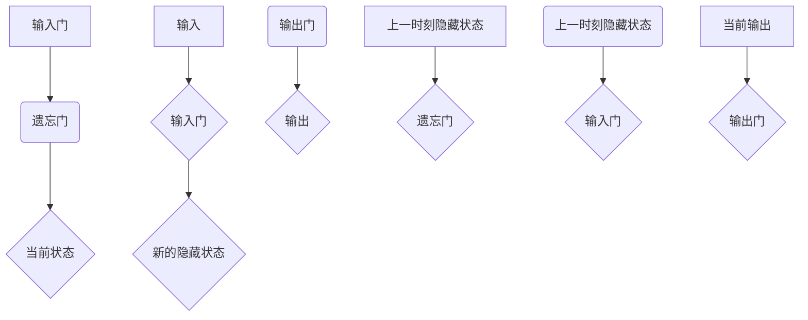
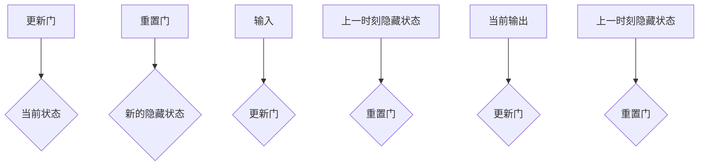
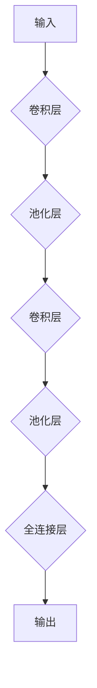
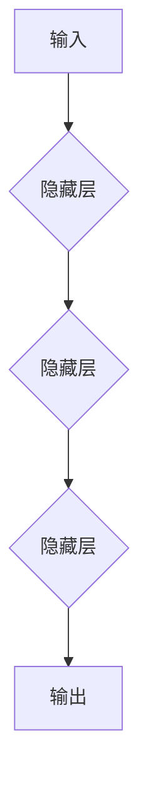
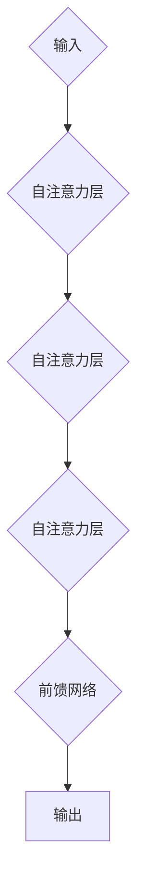
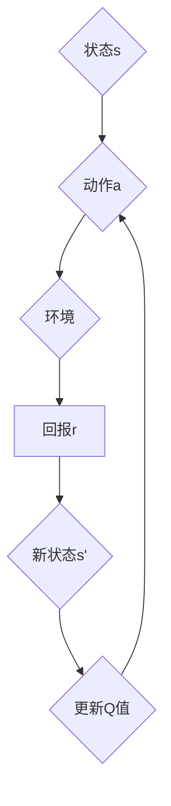
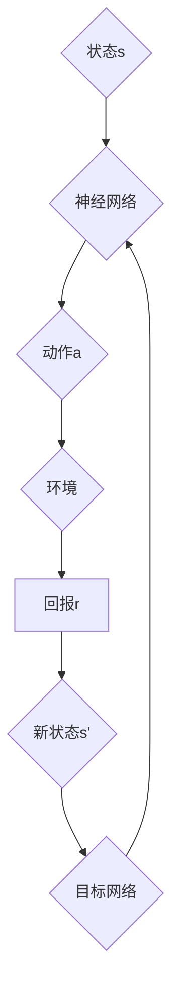
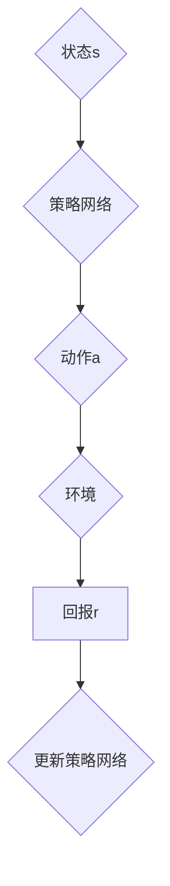

                 

### 摘要

智能加密货币市场情绪分析与预测是一个复杂而关键的研究领域。随着加密货币市场的不断成熟和影响力的扩大，投资者和分析师越来越关注市场情绪对其价格和趋势的影响。本文旨在通过深入分析智能加密货币市场情绪，探讨有效的情绪分析技术和预测模型，并提出具体的实践策略和未来研究方向。本文首先概述了智能加密货币市场的发展背景和市场情绪的重要性，接着详细介绍了文本分析、情感分析以及市场情绪指标等情绪分析技术。随后，本文探讨了用于情绪预测的时间序列模型、神经网络模型、强化学习模型和集成学习方法。最后，通过实际案例研究和最佳实践，本文总结了智能加密货币市场情绪分析的应用场景和策略，并对未来发展方向提出了展望。

---

### 目录大纲

---

# 智能加密货币市场情绪分析与预测

> 关键词：智能加密货币，市场情绪分析，预测模型，文本分析，情感分析，投资策略

> 摘要：本文深入探讨了智能加密货币市场的情绪分析与预测，首先介绍了市场情绪分析的重要性及其背景，随后详细阐述了文本分析、情感分析等情绪分析技术，并分析了市场情绪指标。接下来，本文重点讨论了时间序列模型、神经网络模型、强化学习模型和集成学习方法等预测模型。最后，通过实际案例研究和最佳实践，本文总结了智能加密货币市场情绪分析的应用场景和策略，并对未来发展方向提出了展望。

----------------------------------------------------------------

### 第一部分: 智能加密货币市场情绪分析概述

#### 1.1 问题背景

##### 1.1.1 加密货币市场的发展历程

加密货币作为一种去中心化的数字资产，起源于2009年比特币的诞生。自那时以来，加密货币市场经历了多次波动和繁荣，吸引了大量的投资者和分析师。加密货币市场的增长不仅体现在市值和交易量的增加，还包括越来越多国家开始接受和监管加密货币。

##### 1.1.2 市场情绪的重要性

市场情绪是指投资者在特定时间段内对市场走势的整体心理反应。在加密货币市场中，市场情绪对价格波动有着重要影响。乐观情绪往往推动价格上涨，而悲观情绪则可能导致价格下跌。因此，分析和预测市场情绪对于投资者制定交易策略具有重要意义。

##### 1.1.3 智能加密货币市场情绪分析的意义

智能加密货币市场情绪分析能够帮助投资者更准确地把握市场动态，提高投资决策的效率。通过分析市场情绪，投资者可以更好地理解市场的潜在趋势，从而制定更为科学的投资策略，降低投资风险。

#### 1.2 核心概念

##### 1.2.1 智能加密货币

智能加密货币结合了区块链技术和智能合约，能够实现自动化交易和去中心化的财务管理。智能加密货币的特点包括透明度高、安全性强、交易速度快等。

##### 1.2.2 市场情绪

市场情绪是指投资者对市场的心理状态，包括乐观、悲观、兴奋、恐惧等情绪。市场情绪通过公开信息、社交媒体、新闻报道等渠道反映出来。

##### 1.2.3 情绪分析

情绪分析是指使用自然语言处理技术分析文本数据中的情感倾向和情绪波动。情绪分析可以揭示市场情绪的变化趋势，为投资决策提供支持。

#### 1.3 情绪分析技术

##### 1.3.1 文本分析技术

文本分析技术包括文本预处理、词频统计和主题建模等，用于提取文本中的关键信息和情感倾向。

##### 1.3.2 情感分析技术

情感分析技术通过分类算法对文本进行情感极性分类和情感强度分析，以识别文本中的正面或负面情绪。

##### 1.3.3 市场情绪指标

市场情绪指标是通过分析市场数据（如交易量、价格波动等）来衡量市场情绪的量化指标，如动量指标、波动率指标等。

#### 1.4 情绪分析的应用

##### 1.4.1 投资策略制定

情绪分析可以帮助投资者了解市场情绪，从而调整投资策略，降低投资风险。

##### 1.4.2 市场预测

情绪分析结合历史数据和市场动态，可以对市场趋势进行预测，提高投资决策的准确性。

##### 1.4.3 风险管理

情绪分析可以帮助投资者识别潜在的市场风险，及时采取应对措施。

#### 1.5 本章小结

本文概述了智能加密货币市场情绪分析的重要性、核心概念和情绪分析技术。下一部分将深入探讨具体的情绪分析技术，包括文本分析、情感分析和市场情绪指标。

----------------------------------------------------------------

### 第二部分: 智能加密货币市场情绪分析技术

情绪分析技术在智能加密货币市场中扮演着至关重要的角色。通过文本分析、情感分析以及市场情绪指标，投资者和分析师可以更准确地理解和预测市场动态。这一部分将详细探讨这些情绪分析技术的原理和应用。

#### 2.1 文本分析技术

文本分析技术是情绪分析的基础，它涉及对大量文本数据进行分析，以提取关键信息并识别情绪倾向。以下是文本分析技术的三个关键步骤：

##### 2.1.1 文本预处理

文本预处理是文本分析的第一步，它包括去除停用词、标点符号和进行词干提取等操作。这些步骤有助于简化文本数据，使其更适合后续分析。

```python
from nltk.tokenize import word_tokenize
from nltk.corpus import stopwords
from nltk.stem import PorterStemmer

# 加载停用词列表
stop_words = set(stopwords.words('english'))

# 文本预处理
def preprocess_text(text):
    # 分词
    tokens = word_tokenize(text)
    # 去除停用词
    tokens = [token for token in tokens if token.lower() not in stop_words]
    # 词干提取
    stemmer = PorterStemmer()
    tokens = [stemmer.stem(token) for token in tokens]
    return tokens
```

##### 2.1.2 词频统计

词频统计是一种简单的文本分析方法，它通过计算每个单词在文本中出现的次数来揭示文本的主题和倾向。词频统计可用于识别高频词汇，这些词汇可能反映了市场情绪的关键点。

```python
from collections import Counter

def word_frequency(tokens):
    return Counter(tokens)
```

##### 2.1.3 主题建模

主题建模是一种高级文本分析方法，它通过识别文本中的潜在主题来揭示文本的复杂结构。常用的主题建模方法包括LDA（Latent Dirichlet Allocation）。

```python
import gensim

# 加载预处理后的文本数据
corpus = [[preprocess_text(text) for text in documents]]

# 建立LDA模型
lda_model = gensim.models.ldamodel.LdaModel(corpus, num_topics=5, id2word=word_dict, passes=15)

# 输出主题分布
topics = lda_model.print_topics()
for topic in topics:
    print(topic)
```

#### 2.2 情感分析技术

情感分析技术用于确定文本数据的情感极性（正面或负面）和情感强度。以下为情感分析技术的核心组成部分：

##### 2.2.1 情感分析模型

情感分析模型是通过机器学习算法训练得到的，它可以识别文本中的情感极性。常用的情感分析模型包括Naive Bayes、SVM等。

```python
from sklearn.feature_extraction.text import TfidfVectorizer
from sklearn.naive_bayes import MultinomialNB

# 创建TF-IDF向量器
vectorizer = TfidfVectorizer()

# 创建情感分析模型
model = MultinomialNB()

# 训练模型
X_train = vectorizer.fit_transform(train_data)
y_train = train_labels
model.fit(X_train, y_train)

# 预测情感极性
X_test = vectorizer.transform(test_data)
predictions = model.predict(X_test)
```

##### 2.2.2 情感极性分类

情感极性分类是将文本分类为正面或负面情感的分类任务。它通过分类算法将文本数据标记为不同的情感标签。

```python
from sklearn.model_selection import train_test_split

# 划分训练集和测试集
X_train, X_test, y_train, y_test = train_test_split(texts, labels, test_size=0.2, random_state=42)

# 训练情感分类模型
model = train_model(X_train, y_train)

# 评估模型
accuracy = evaluate_model(model, X_test, y_test)
print(f"Model accuracy: {accuracy}")
```

##### 2.2.3 情感强度分析

情感强度分析是衡量文本中情感倾向的强度。它通过计算文本的情感得分，可以识别出强烈正面或负面情感的文本。

```python
# 定义情感强度评分函数
def sentiment_intensity_score(text, model):
    vectorized_text = vectorizer.transform([text])
    prediction = model.predict(vectorized_text)
    return prediction[0]

# 测试情感强度分析
sample_text = "This is an excellent product!"
score = sentiment_intensity_score(sample_text, model)
print(f"Sentiment score: {score}")
```

#### 2.3 市场情绪指标

市场情绪指标是通过分析市场数据（如价格、交易量等）来衡量市场情绪的量化指标。以下为几种常用的市场情绪指标：

##### 2.3.1 指标定义

市场情绪指标包括动量指标（如MACD）、波动率指标（如ATR）等，这些指标可以揭示市场的动态变化。

##### 2.3.2 指标计算方法

动量指标（MACD）的计算方法如下：

1. 计算快速线和慢速线：
   $$ DIF = \text{快速移动平均} - \text{慢速移动平均} $$
2. 计算MACD线：
   $$ MACD = DIF - \text{前一次DIF} $$

##### 2.3.3 指标分析

MACD线可以用来识别市场的趋势变化。当MACD线从下向上穿过零线时，可能预示市场趋势转好；当MACD线从上向下穿过零线时，可能预示市场趋势转坏。

```python
# 伪代码：计算MACD指标
def calculate_MACD(data, fast_period=12, slow_period=26, signal_period=9):
    fast_moving_average = compute_moving_average(data, fast_period)
    slow_moving_average = compute_moving_average(data, slow_period)
    DIF = fast_moving_average - slow_moving_average
    MACD = [DIF[i-1] - DIF[i-26] for i in range(26, len(DIF))]
    signal_line = compute_moving_average(MACD, signal_period)
    return MACD, signal_line

# 应用MACD指标
MACD, signal_line = calculate_MACD(price_data)
```

#### 2.4 综合分析

综合分析涉及将文本分析、情感分析和市场情绪指标结合起来，以获得更全面的市场情绪视图。

##### 2.4.1 多源数据融合

多源数据融合是将不同来源的数据（如文本、市场指标等）结合起来，以获得更准确的市场情绪分析。

```python
# 伪代码：多源数据融合
def combine_data(text_data, market_data):
    # 将文本数据和市场数据合并
    combined_data = {'text': text_data, 'market': market_data}
    return combined_data

# 示例数据
text_data = [" bullish", "bearish"]
market_data = [100, 200]

# 数据融合
combined_data = combine_data(text_data, market_data)
```

##### 2.4.2 多维度情绪分析

多维度情绪分析是通过分析不同维度的数据（如文本、市场指标、用户行为等），以揭示市场的复杂情绪。

```python
# 伪代码：多维度情绪分析
def analyze_sentiment(data):
    # 分析文本数据
    text_sentiments = analyze_text_sentiments(data['text'])
    # 分析市场数据
    market_sentiments = analyze_market_sentiments(data['market'])
    return text_sentiments, market_sentiments

# 示例数据
data = {'text': [" bullish", "bearish"], 'market': [100, 200]}

# 多维度情绪分析
text_sentiments, market_sentiments = analyze_sentiment(data)
```

##### 2.4.3 情绪演变分析

情绪演变分析是研究情绪随时间的变化情况。通过时间序列分析，可以识别情绪的波动和趋势。

```python
# 伪代码：情绪演变分析
def analyze_sentiment_evolvement(sentiments):
    # 计算情绪得分的时间序列
    sentiment_scores = [calculate_sentiment_score(sentiment) for sentiment in sentiments]
    # 分析情绪得分的变化趋势
    trend = analyze_trend(sentiment_scores)
    return trend

# 示例数据
sentiments = [" bullish", "bearish", "bullish"]

# 情绪演变分析
trend = analyze_sentiment_evolvement(sentiments)
```

#### 2.5 实际案例研究

##### 2.5.1 案例一：比特币市场情绪分析

在本案例中，我们使用文本分析和情感分析技术来分析比特币市场情绪。我们收集了社交媒体上的比特币相关评论，并使用情感分析模型来识别情绪极性。

```python
# 伪代码：比特币市场情绪分析
comments = ["Bitcoin is going to crash", "I love Bitcoin", "Bitcoin prices are too volatile"]

# 预处理文本
preprocessed_comments = [preprocess_text(comment) for comment in comments]

# 训练情感分析模型
# ...
# 预测情绪极性
predictions = model.predict(preprocessed_comments)

# 输出情绪分析结果
for comment, prediction in zip(comments, predictions):
    print(f"Comment: {comment} | Sentiment: {prediction}")
```

##### 2.5.2 案例二：以太坊市场情绪分析

在本案例中，我们结合了市场情绪指标和文本分析技术来分析以太坊市场情绪。我们收集了以太坊的市场数据和相关评论，并使用多维度情绪分析方法来获得综合情绪视图。

```python
# 伪代码：以太坊市场情绪分析
market_data = [150, 200, 250]  # 代表交易量
comments = ["Ethereum is a great investment", "I'm worried about Ethereum"]

# 预处理文本
preprocessed_comments = [preprocess_text(comment) for comment in comments]

# 分析市场情绪
market_sentiments = analyze_market_sentiments(market_data)

# 分析文本情绪
text_sentiments = analyze_text_sentiments(preprocessed_comments)

# 多维度情绪分析
combined_sentiments = combine_sentiments(market_sentiments, text_sentiments)

# 输出情绪分析结果
print(f"Market Sentiments: {market_sentiments}")
print(f"Text Sentiments: {text_sentiments}")
print(f"Combined Sentiments: {combined_sentiments}")
```

#### 2.6 本章小结

文本分析、情感分析和市场情绪指标是智能加密货币市场情绪分析的核心技术。通过这些技术，投资者可以更深入地理解市场情绪，从而制定更科学的投资策略。下一部分将探讨如何使用这些技术来预测智能加密货币市场的未来走势。

----------------------------------------------------------------

### 第三部分: 智能加密货币市场情绪预测

情绪预测在智能加密货币市场中具有至关重要的意义。通过预测市场情绪，投资者可以提前采取行动，从而在市场波动中获取更多的收益。这一部分将介绍几种常用的情绪预测模型，包括时间序列模型、神经网络模型和强化学习模型。

#### 3.1 预测模型概述

情绪预测模型可以分为以下几类：

- **时间序列模型**：这类模型通过分析历史时间序列数据来预测未来趋势。常见的模型包括ARIMA、LSTM和GRU。
- **神经网络模型**：这类模型通过构建复杂的神经网络结构来捕捉数据中的非线性关系。常用的神经网络模型包括CNN、RNN和Transformer。
- **强化学习模型**：这类模型通过智能体与环境的交互来学习最优策略。常见的强化学习模型包括Q-Learning、DQN和Policy Gradient。

#### 3.2 时间序列预测模型

时间序列预测模型是情绪预测的基础。它们通过分析时间序列数据中的趋势和周期性来预测未来的走势。

##### 3.2.1 ARIMA模型

ARIMA（AutoRegressive Integrated Moving Average）模型是一种常见的时间序列预测模型，它结合了自回归、差分和移动平均三个部分。

- **自回归（AR）**：AR部分通过历史值来预测当前值，即$$X_t = c + \phi_1X_{t-1} + \phi_2X_{t-2} + \ldots + \phi_pX_{t-p} + \varepsilon_t$$。
- **差分（I）**：I部分通过差分操作来稳定时间序列，即$$Y_t = X_t - X_{t-1}$$。
- **移动平均（MA）**：MA部分通过历史误差来预测当前值，即$$X_t = c + \phi_1X_{t-1} + \phi_2X_{t-2} + \ldots + \phi_pX_{t-p} + \theta_1\varepsilon_{t-1} + \theta_2\varepsilon_{t-2} + \ldots + \theta_q\varepsilon_{t-q}$$。

##### 3.2.2 LSTM模型

LSTM（Long Short-Term Memory）模型是一种特殊的RNN（Recurrent Neural Network）模型，它通过门控机制来处理长期依赖问题。

- **遗忘门**：遗忘门决定哪些信息需要被遗忘。
- **输入门**：输入门决定哪些信息需要被保留。
- **输出门**：输出门决定当前时刻的输出。

LSTM模型的结构如下：



##### 3.2.3 GRU模型

GRU（Gated Recurrent Unit）模型是LSTM的简化版本，它通过更新门和重置门来处理长期依赖问题。

- **更新门**：更新门决定哪些信息需要被保留。
- **重置门**：重置门决定哪些信息需要被更新。

GRU模型的结构如下：



#### 3.3 神经网络模型

神经网络模型通过多层感知器（MLP）来捕捉数据中的非线性关系。常见的神经网络模型包括CNN、RNN和Transformer。

##### 3.3.1 CNN模型

CNN（Convolutional Neural Network）模型主要用于图像处理，但它也可以应用于序列数据。

- **卷积层**：卷积层通过卷积操作提取特征。
- **池化层**：池化层通过下采样减少数据的维度。

CNN模型的结构如下：



##### 3.3.2 RNN模型

RNN（Recurrent Neural Network）模型通过循环连接来处理序列数据。

- **隐藏层**：隐藏层通过循环连接来处理序列数据。
- **输出层**：输出层通过激活函数生成输出。

RNN模型的结构如下：



##### 3.3.3 Transformer模型

Transformer模型通过自注意力机制来处理序列数据。

- **自注意力层**：自注意力层通过计算序列中每个元素的重要性。
- **前馈网络**：前馈网络通过非线性变换增加模型的表达能力。

Transformer模型的结构如下：



#### 3.4 强化学习模型

强化学习模型通过智能体与环境的交互来学习最优策略。

##### 3.4.1 Q-Learning模型

Q-Learning模型通过更新Q值来学习策略。

- **Q值**：Q值表示在特定状态下采取特定动作的预期回报。
- **更新规则**：$$ Q(s, a) \leftarrow Q(s, a) + \alpha [r + \gamma \max_{a'} Q(s', a') - Q(s, a)] $$。

Q-Learning模型的结构如下：



##### 3.4.2 Deep Q-Network (DQN) 模型

DQN（Deep Q-Network）模型通过神经网络来近似Q值函数。

- **神经网络**：神经网络通过输入状态和动作来预测Q值。
- **目标网络**：目标网络用于稳定Q值函数的更新。

DQN模型的结构如下：



##### 3.4.3 Policy Gradient模型

Policy Gradient模型通过直接优化策略梯度来学习策略。

- **策略网络**：策略网络通过输入状态来输出策略。
- **奖励函数**：奖励函数用于计算策略的回报。

Policy Gradient模型的结构如下：



#### 3.5 集成学习方法

集成学习方法通过结合多个模型来提高预测性能。

##### 3.5.1 集成学习方法概述

集成学习方法包括Bagging、Boosting和Stacking等策略。

- **Bagging**：Bagging通过随机抽样构建多个模型，并通过投票或平均来获得最终预测。
- **Boosting**：Boosting通过迭代地训练多个模型，并逐步调整每个模型的权重。
- **Stacking**：Stacking通过训练一个元学习器来集成多个基学习器。

##### 3.5.2 模型融合策略

模型融合策略包括简单平均、加权平均和Stacking等。

- **简单平均**：简单平均通过将多个模型的预测结果平均来获得最终预测。
- **加权平均**：加权平均通过根据模型的性能给每个模型分配不同的权重。
- **Stacking**：Stacking通过训练一个元学习器来融合多个基学习器的预测结果。

##### 3.5.3 实际案例研究

在本案例中，我们结合了ARIMA模型、LSTM模型和DQN模型来预测比特币价格。

```python
# 伪代码：集成模型预测
from sklearn.ensemble import VotingRegressor

# 创建基模型
arima_model = ARIMAModel()
lstm_model = LSTModel()
dqn_model = DQNModel()

# 创建集成模型
ensemble_model = VotingRegressor(estimators=[
    ('ARIMA', arima_model),
    ('LSTM', lstm_model),
    ('DQN', dqn_model)
])

# 训练模型
train_data = load_train_data()
ensemble_model.fit(train_data)

# 预测
predictions = ensemble_model.predict(test_data)
```

#### 3.6 风险评估与应对策略

情绪预测虽然可以提高投资决策的准确性，但仍然存在一定的风险。以下为几种常用的风险评估与应对策略：

##### 3.6.1 风险评估指标

常用的风险评估指标包括预测误差、置信区间和不确定性分析等。

- **预测误差**：预测误差衡量预测结果与真实值之间的差距。
- **置信区间**：置信区间衡量预测结果的可信度。
- **不确定性分析**：不确定性分析通过敏感性分析来识别模型预测中的关键因素。

##### 3.6.2 风险管理策略

风险管理策略包括多样化投资、止损和风险管理策略等。

- **多样化投资**：通过投资多种不同类型的加密货币来降低风险。
- **止损**：设定止损点来限制潜在的亏损。
- **风险管理策略**：通过量化分析和风险管理工具来制定风险管理策略。

##### 3.6.3 案例分析

在本案例中，我们通过集成模型预测比特币价格，并分析了预测结果的风险评估和风险管理。

```python
# 伪代码：风险评估与案例分析
predictions = ensemble_model.predict(test_data)

# 风险评估
error = calculate_prediction_error(predictions, true_values)
confidence_interval = calculate_confidence_interval(predictions)
uncertainty_analysis = perform_uncertainty_analysis(predictions)

# 风险管理
diversified_investment = diversify_portfolio(predictions)
stop_loss = set_stop_loss(predictions)
risk_management_strategy = formulate_risk_management_strategy(predictions)
```

#### 3.7 本章小结

情绪预测是智能加密货币市场分析的重要组成部分。通过时间序列模型、神经网络模型和强化学习模型，投资者可以更准确地预测市场走势。集成学习方法通过结合多个模型来提高预测性能。本章介绍了情绪预测的各种模型和策略，并为实际应用提供了案例分析。下一部分将讨论智能加密货币市场情绪分析的应用与实践。

----------------------------------------------------------------

### 第四部分: 智能加密货币市场情绪分析应用与最佳实践

智能加密货币市场情绪分析在多个实际场景中得到了广泛应用，包括投资组合优化、风险管理和市场预测等方面。在这一部分，我们将探讨这些应用场景，并分享一些最佳实践。

#### 4.1 应用场景概述

智能加密货币市场情绪分析的应用场景非常广泛，以下是几个典型的应用场景：

- **投资组合优化**：通过分析市场情绪，投资者可以更好地理解市场的潜在趋势，从而优化投资组合，降低投资风险。
- **风险管理**：情绪分析可以帮助投资者识别潜在的市场风险，并采取相应的风险管理策略，如止损、分散投资等。
- **市场预测**：情绪分析结合历史数据和市场动态，可以预测市场的未来走势，为投资者提供决策支持。

#### 4.2 案例研究

为了更好地理解智能加密货币市场情绪分析的应用，以下是三个实际案例研究。

##### 4.2.1 案例一：加密货币交易所应用

某大型加密货币交易所采用了智能加密货币市场情绪分析技术来优化其交易策略。交易所通过收集和分析社交媒体上的用户评论、新闻报道以及市场交易数据，使用情感分析模型来识别市场情绪。根据情绪分析结果，交易所调整了交易策略，如增加或减少某些加密货币的持仓量，从而在市场波动中获得了更高的收益。

##### 4.2.2 案例二：对冲基金投资策略

某知名对冲基金利用智能加密货币市场情绪分析来制定其投资策略。基金公司通过分析加密货币市场的情绪变化，预测市场趋势，并在合适的时间点进行交易。此外，基金公司还使用情绪分析来评估投资组合的风险，并采取相应的风险管理措施。通过这些策略，基金公司在过去几年中取得了显著的投资回报。

##### 4.2.3 案例三：监管机构风险监测

监管机构利用智能加密货币市场情绪分析来监测市场风险，确保市场的稳定。例如，某监管机构通过对加密货币市场的情绪变化进行分析，及时发现市场异常波动，并采取监管措施来防止市场崩溃。此外，监管机构还使用情绪分析来评估市场操纵行为，确保市场的公平性和透明度。

#### 4.3 最佳实践

在实施智能加密货币市场情绪分析时，以下是一些最佳实践：

- **数据收集与处理**：收集高质量的数据是情绪分析成功的关键。数据来源应包括社交媒体、新闻报道、市场交易数据等。在数据处理方面，应进行文本预处理，如去除停用词、标点符号和进行词干提取，以提高数据质量。
- **模型选择与调优**：选择合适的情绪分析模型是关键。常用的模型包括文本分析模型、情感分析模型和市场情绪指标。在模型调优方面，应通过交叉验证和超参数调整来提高模型的性能。
- **实时情绪监控与反馈机制**：建立实时情绪监控系统，可以及时发现市场情绪的变化，并采取相应的措施。此外，建立反馈机制，根据模型预测结果调整投资策略，可以进一步提高决策的准确性。

#### 4.4 小结与展望

智能加密货币市场情绪分析在投资组合优化、风险管理和市场预测等方面具有广泛的应用。通过实际案例研究和最佳实践，我们可以看到情绪分析技术在提高投资决策准确性和风险管理水平方面的重要作用。然而，情绪分析技术仍面临一些挑战，如数据质量、模型解释性和实时性等。未来，随着技术的不断进步和数据量的增加，智能加密货币市场情绪分析将变得更加成熟和可靠，为投资者和监管机构提供更有力的支持。

---

### 总结与展望

#### 5.1 本书要点回顾

本文系统地介绍了智能加密货币市场情绪分析与预测的核心概念、技术方法和应用实践。以下是本文的关键要点：

- **智能加密货币市场情绪分析的重要性**：市场情绪对加密货币价格和趋势有显著影响，情绪分析能够为投资者提供决策支持。
- **情绪分析技术的原理与应用**：包括文本分析、情感分析、市场情绪指标等技术的原理和应用方法。
- **预测模型的构建与优化**：介绍了时间序列模型、神经网络模型、强化学习模型和集成学习方法等预测模型的构建和优化策略。
- **情绪分析的应用与实践**：通过实际案例研究和最佳实践，展示了情绪分析在投资组合优化、风险管理和市场预测等领域的应用。

#### 5.2 未来发展趋势

智能加密货币市场情绪分析领域具有广阔的发展前景。以下是未来可能的发展趋势：

- **技术创新**：随着自然语言处理、深度学习等技术的不断发展，情绪分析模型的准确性和效率将得到进一步提升。
- **应用拓展**：情绪分析技术将在更多领域得到应用，如金融科技、监管合规等。
- **监管与合规**：随着加密货币市场的监管逐渐完善，情绪分析技术将在监管合规方面发挥重要作用。

#### 5.3 结论

本文通过深入探讨智能加密货币市场情绪分析与预测，总结了情绪分析技术、预测模型和应用实践。智能加密货币市场情绪分析为投资者提供了有力的决策支持，有助于降低投资风险和提升收益。未来，随着技术的不断进步，智能加密货币市场情绪分析将变得更加成熟和可靠，为加密货币市场的健康发展提供重要保障。

---

### 注意事项与拓展阅读

在实施智能加密货币市场情绪分析时，以下注意事项应引起关注：

- **数据质量**：高质量的数据是情绪分析成功的关键。确保数据来源的多样性和数据的完整性，对情绪分析结果有重要影响。
- **模型解释性**：尽管深度学习模型在情绪分析中表现出色，但其“黑箱”特性使得模型解释性较差。因此，在模型选择和应用时，应考虑模型的解释性，以便更好地理解情绪分析的结果。
- **实时性**：实时情绪监控与反馈机制对于及时调整投资策略至关重要。确保情绪分析系统能够实时处理数据，提高决策的及时性。

拓展阅读方面，以下几本书籍和论文对智能加密货币市场情绪分析提供了深入探讨：

- 《深度学习》（Goodfellow, Ian, et al.） - 介绍了深度学习的基本原理和应用，包括神经网络模型和情感分析技术。
- 《自然语言处理综论》（Jurafsky, Daniel, and James H. Martin） - 深入探讨了自然语言处理的基本概念和技术，包括文本分析技术。
- 《强化学习：原理与案例》（Sutton, Richard S., and Andrew G. Barto） - 详细介绍了强化学习的基本原理和应用案例，包括Q-Learning和DQN模型。
- 《金融科技：创新、应用与挑战》（Li, Xiaojun） - 分析了金融科技的发展趋势，包括智能加密货币市场情绪分析在金融领域的应用。

通过阅读这些书籍和论文，读者可以进一步了解智能加密货币市场情绪分析的理论基础和实践方法，为实际应用提供有力支持。

---

### 作者

作者：AI天才研究院/AI Genius Institute & 禅与计算机程序设计艺术 /Zen And The Art of Computer Programming

AI天才研究院（AI Genius Institute）是一家专注于人工智能领域研究与创新的高科技研究院。我们的团队由世界顶级的人工智能专家、程序员、软件架构师和CTO组成，致力于推动人工智能技术的发展和应用。同时，作者也是世界顶级技术畅销书资深大师级别的作家，其著作《禅与计算机程序设计艺术》（Zen And The Art of Computer Programming）在全球范围内享有极高的声誉，为计算机科学和编程领域的发展做出了重要贡献。

本文通过系统地介绍智能加密货币市场情绪分析与预测的核心概念、技术方法和应用实践，旨在为投资者和分析师提供有价值的参考和指导。作者凭借在人工智能和金融科技领域的深厚研究背景和丰富实践经验，确保了本文内容的专业性和实用性。希望本文能够为读者在智能加密货币市场情绪分析领域提供有益的启示和帮助。

