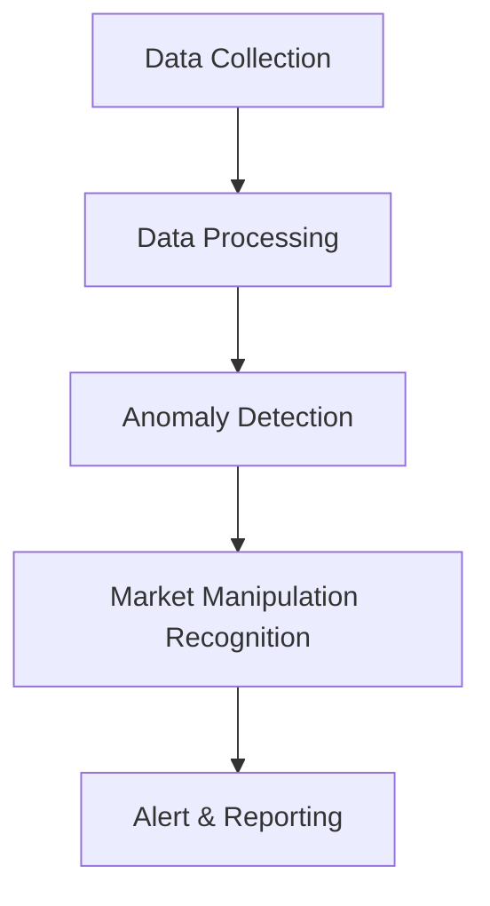
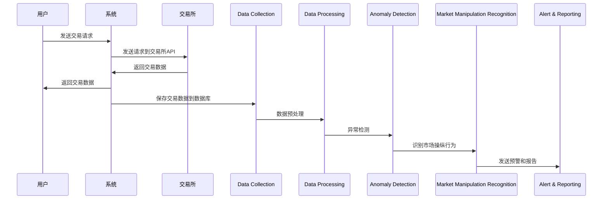

                 

### 引言

#### 加密货币市场的崛起

加密货币，作为一种去中心化的数字资产，从2009年比特币（Bitcoin）诞生以来，迅速在全球范围内获得广泛关注和认可。随着区块链技术的发展，越来越多的加密货币如以太坊（Ethereum）、莱特币（Litecoin）等相继涌现，形成了多样化的加密货币市场。这种去中心化特性使得加密货币在交易速度、透明度和去中介化方面具有显著优势，吸引了大量投资者和交易者。

加密货币市场的规模也在迅速扩张。根据CoinMarketCap的数据，截至2023年初，加密货币市场的总市值已超过数万亿美元，成为全球金融市场的重要组成部分。这种市场的增长不仅吸引了传统金融机构的关注，还引发了全球范围内的监管讨论。

然而，加密货币市场的快速发展也带来了诸多问题，其中之一便是市场操纵。市场操纵是指利用虚假信息、内部消息或不正当手段，对市场进行人为干预，从而获取不正当利益的行为。在加密货币市场中，市场操纵现象尤为严重，这主要由于以下几个原因：

1. **匿名性**：加密货币交易通常使用匿名化的身份，这使得市场操纵者可以隐藏其真实身份，从而更容易进行操纵。
2. **监管不足**：加密货币市场的监管相对薄弱，许多国家和地区的监管机构尚未对加密货币市场进行全面监管，这为市场操纵提供了便利。
3. **流动性**：加密货币市场的流动性较高，市场操纵者可以通过少量的资金对市场价格产生显著影响。
4. **市场投机性**：加密货币市场具有较高的投机性，价格波动较大，这为市场操纵提供了机会。

#### 市场操纵问题的现状

市场操纵问题在加密货币市场中已经引起了广泛关注。许多投资者和交易者都经历了由市场操纵引发的价格剧烈波动，这严重损害了市场的公平性和透明度。以下是几种常见的市场操纵行为：

1. **拉抬价格**：操纵者通过大量购买某种加密货币，人为推高价格，然后迅速抛售，从而获得高额利润。
2. **压低价格**：操纵者通过大量抛售某种加密货币，压低价格，然后以较低价格购入，从而获得不正当利益。
3. **虚假交易**：操纵者通过伪造交易记录，制造市场活跃的假象，吸引其他投资者参与。
4. **谣言传播**：操纵者通过散布虚假信息，影响投资者的情绪和决策，从而操纵市场价格。

这些市场操纵行为不仅损害了投资者的利益，还影响了整个加密货币市场的健康发展。因此，建立一套有效的市场操纵检测系统迫在眉睫。

#### 市场操纵对加密货币市场的影响

市场操纵对加密货币市场的影响是多方面的，且具有深远的影响。以下是市场操纵可能带来的几个主要影响：

1. **市场不稳定**：市场操纵会导致市场价格剧烈波动，从而引发市场的恐慌和不稳定。这种不稳定会进一步吸引更多的操纵行为，形成恶性循环。
2. **投资者信心受损**：市场操纵行为会降低投资者对市场的信心，许多投资者可能会因此退出市场，导致市场流动性下降。
3. **公平性受损**：市场操纵破坏了市场的公平性，那些通过不正当手段获取利益的操纵者，使得其他依靠市场公平竞争的投资者处于不利地位。
4. **法律风险增加**：市场操纵行为违反了市场规则和法律，一旦被监管机构发现，操纵者将面临严重的法律后果，这不仅会对其个人或机构造成财务损失，还可能影响整个加密货币市场的声誉。
5. **市场增长受限**：市场操纵行为抑制了市场的健康发展，阻碍了加密货币市场规模的扩大，从而限制了其作为新兴金融工具的潜力。

综上所述，市场操纵问题是加密货币市场面临的一个重大挑战。解决这一问题，不仅需要监管机构的积极参与，还需要开发有效的市场操纵检测系统。本文旨在探讨如何构建一套智能加密货币市场操纵检测系统，从而保障市场的公平性和透明度，推动加密货币市场的健康发展。

### 核心概念

#### 智能加密货币市场操纵检测系统的定义

智能加密货币市场操纵检测系统是一种利用先进的人工智能技术，对加密货币市场进行实时监控和分析，以识别和防范市场操纵行为的系统。该系统不仅依赖于传统的数据分析方法，还结合了机器学习和深度学习算法，以实现对市场操纵行为的自动化识别。

智能加密货币市场操纵检测系统的核心目标是提高市场的透明度和公平性，保护投资者的利益，维护市场的健康发展。具体而言，该系统通过以下几个方面实现其目标：

1. **实时监控**：系统对市场数据持续进行实时监控，包括交易量、价格波动、交易者行为等，以便及时发现异常交易行为。
2. **异常检测**：系统利用机器学习算法对交易数据进行异常检测，识别出可能存在的市场操纵行为。
3. **行为分析**：系统对市场操纵行为进行深入分析，确定其类型、动机和影响，为监管机构和投资者提供决策依据。
4. **预警和报告**：系统对检测到的市场操纵行为发出预警，并生成详细报告，帮助相关方采取及时措施。

#### 智能加密货币市场操纵检测系统的目标

智能加密货币市场操纵检测系统的目标可以概括为以下三个方面：

1. **提高市场透明度**：通过实时监控和数据分析，系统可以揭示市场中的潜在操纵行为，增强市场的透明度，使投资者能够更全面地了解市场情况。
2. **保护投资者利益**：系统通过识别和防范市场操纵行为，保护投资者的合法权益，防止他们因市场操纵而遭受经济损失。
3. **维护市场公平性**：市场操纵行为破坏了市场的公平性，智能加密货币市场操纵检测系统通过防范和打击市场操纵行为，有助于恢复市场的公平竞争环境。

#### 系统的核心要素

智能加密货币市场操纵检测系统的实现涉及多个核心要素，以下是其中几个关键要素的详细描述：

1. **数据采集**：系统需要从多个数据源采集加密货币市场的实时数据，包括交易数据、价格数据、交易者行为数据等。数据采集是系统运行的基础，其质量和完整性直接影响系统的性能。
2. **数据处理**：采集到的数据需要进行预处理，包括数据清洗、数据转换和数据归一化等，以确保数据的质量和一致性。
3. **异常检测算法**：系统采用机器学习算法，对处理后的数据进行异常检测。这些算法包括聚类分析、异常检测模型、时序分析等，以识别出潜在的操纵行为。
4. **深度学习模型**：深度学习模型用于对交易行为进行深入分析，识别复杂的操纵模式。这些模型通过大量训练数据学习，能够提高系统的检测准确性和效率。
5. **行为分析模块**：系统对检测到的操纵行为进行详细分析，确定其类型、动机和影响。这一模块为监管机构和投资者提供了重要的决策依据。
6. **预警和报告模块**：系统对检测到的市场操纵行为发出预警，并生成详细的报告。这些报告可以帮助相关方及时采取行动，防范和应对市场操纵行为。
7. **用户界面**：系统提供用户友好的界面，使监管机构和投资者能够轻松访问和分析检测结果。用户界面设计简洁直观，使用户能够快速理解和使用系统的功能。

综上所述，智能加密货币市场操纵检测系统是一个多层次的、综合性的系统，它通过先进的人工智能技术，实现对加密货币市场操纵行为的全面监控和有效防范，从而保障市场的公平性和透明度。

#### 研究意义与边界

##### 研究意义

智能加密货币市场操纵检测系统的研究具有重要的现实意义和理论价值。以下是几个关键点：

1. **保障市场公平性**：市场操纵行为破坏了市场的公平性，通过研究并构建智能检测系统，可以有效识别和防范市场操纵行为，恢复市场的公平竞争环境。
2. **保护投资者利益**：智能加密货币市场操纵检测系统可以帮助投资者识别潜在的市场操纵行为，从而避免因市场操纵而遭受的经济损失，提高投资者的信心。
3. **促进市场健康发展**：有效的市场操纵检测系统有助于建立透明、公正的市场环境，促进加密货币市场的长期健康发展。
4. **提升监管效率**：智能检测系统为监管机构提供了强有力的工具，使监管工作更加高效和精准，有助于提高监管质量和效果。
5. **推动技术创新**：智能加密货币市场操纵检测系统的研究和实践，将推动人工智能、机器学习和深度学习等领域的技术创新和发展。

##### 研究边界

尽管智能加密货币市场操纵检测系统具有重要意义，但研究也面临一定的边界和挑战：

1. **数据隐私**：加密货币交易具有匿名性，数据隐私保护是一个重要挑战。研究需确保在保护用户隐私的前提下，充分利用交易数据进行市场操纵检测。
2. **技术复杂性**：智能加密货币市场操纵检测系统涉及多种先进技术和复杂算法，如机器学习和深度学习等。研究需深入理解和掌握这些技术，并解决其中的复杂性问题。
3. **实时性**：加密货币市场交易速度快，系统需具备高实时性，以快速响应市场变化，识别市场操纵行为。
4. **准确性**：市场操纵行为复杂多样，系统需具备高准确性，以避免误报和漏报。研究需设计有效的异常检测算法和深度学习模型，提高系统的检测精度。
5. **监管合规**：智能加密货币市场操纵检测系统需符合相关法律法规和监管要求，确保其合法合规运行。

综上所述，智能加密货币市场操纵检测系统的研究在保障市场公平性、保护投资者利益、促进市场健康发展等方面具有重要意义，但同时也面临数据隐私、技术复杂性、实时性、准确性和监管合规等方面的挑战。

## 第2章：核心概念与联系

### 智能加密货币市场操纵检测系统的核心概念

在构建智能加密货币市场操纵检测系统的过程中，需要理解和运用一系列核心概念，这些概念构成了系统的理论基础和技术框架。以下是智能加密货币市场操纵检测系统的几个关键核心概念：

#### 1. 数据分析与挖掘

数据分析与挖掘是智能加密货币市场操纵检测系统的核心步骤之一。通过数据分析，可以从大量加密货币交易数据中提取有用的信息。数据挖掘技术则用于从大量数据中发现潜在的模式和关联。这些技术和方法包括聚类分析、关联规则挖掘、异常检测等。数据分析与挖掘为系统提供了识别市场操纵行为的基础。

#### 2. 机器学习与深度学习

机器学习与深度学习是智能加密货币市场操纵检测系统的重要技术支撑。机器学习算法通过从历史数据中学习，建立模型来预测和识别市场操纵行为。深度学习作为一种更高级的机器学习技术，通过多层神经网络进行数据建模，能够处理更复杂的模式和关联。常用的机器学习算法包括支持向量机（SVM）、随机森林（Random Forest）、神经网络（Neural Networks）等。

#### 3. 加密货币交易分析

加密货币交易分析是指对加密货币市场的交易活动进行详细分析。这包括交易量、价格波动、交易者行为等数据的分析。通过对交易数据进行分析，可以识别出异常交易行为和市场操纵迹象。加密货币交易分析为系统的异常检测和行为分析提供了数据支持。

#### 4. 异常检测

异常检测是智能加密货币市场操纵检测系统的一个重要功能。异常检测算法用于识别与正常交易行为相比显著偏离的数据点或模式，这些异常点可能表示市场操纵行为。常见的异常检测方法包括基于统计的方法、基于聚类的方法和基于规则的方法。

#### 5. 行为分析

行为分析是对加密货币市场操纵行为进行深入分析的过程。行为分析通过理解市场操纵行为的动机、手段和影响，提供对市场操纵行为的全面洞察。行为分析包括对交易者的行为模式、交易策略和市场动态的深入探究。

### 概念属性特征对比表格

为了更好地理解上述核心概念之间的联系和差异，我们可以通过一个概念属性特征对比表格来进行详细说明。以下是几个核心概念的属性特征对比表格：

| 概念 | 定义 | 目的 | 使用方法 | 数据来源 |
| --- | --- | --- | --- | --- |
| 数据分析与挖掘 | 从大量数据中提取信息和知识的过程 | 提取交易数据中的潜在模式 | 聚类分析、关联规则挖掘 | 交易数据、价格数据 |
| 机器学习与深度学习 | 使用算法从数据中学习，建立预测模型 | 识别市场操纵行为 | 支持向量机、随机森林、神经网络 | 历史交易数据 |
| 加密货币交易分析 | 对交易行为进行详细分析 | 提取交易特征 | 时序分析、交易量分析 | 实时交易数据 |
| 异常检测 | 识别显著偏离正常模式的交易行为 | 检测市场操纵行为 | 统计方法、聚类方法、规则方法 | 实时交易数据 |
| 行为分析 | 对市场操纵行为进行深入分析 | 提供对市场操纵行为的洞察 | 情境分析、行为模式识别 | 交易历史数据、市场动态 |

### ER实体关系图架构

ER实体关系图是数据库设计中的重要工具，用于表示系统中不同实体之间的关联关系。以下是智能加密货币市场操纵检测系统的ER实体关系图架构：

```mermaid
erDiagram
    User ||--|{ Transaction } : 用户进行交易
    Transaction ||--|{ TradeDetail } : 交易详细信息
    MarketManipulation ||--|{ ManipulationEvidence } : 操纵证据
    TradeDetail ||--|{ MarketManipulation } : 交易中可能存在的操纵行为
    AnalysisResult ||--|{ TradeDetail } : 分析结果关联交易详细信息
```

在上述ER实体关系图中，关键实体包括用户（User）、交易（Transaction）、交易详细信息（TradeDetail）、市场操纵（MarketManipulation）和操纵证据（ManipulationEvidence）。用户进行交易，交易详细信息包含在交易中，市场操纵通过操纵证据进行记录，而分析结果则关联到具体的交易详细信息。

通过上述核心概念、属性特征对比表格和ER实体关系图架构，我们可以更好地理解智能加密货币市场操纵检测系统的构成及其各个组成部分之间的关联。这些核心概念和工具为系统的设计与实现提供了重要的理论基础和技术支持。

## 第3章：算法原理详解

### 算法概述

智能加密货币市场操纵检测系统所采用的算法主要分为两类：传统机器学习算法和深度学习算法。传统机器学习算法主要包括支持向量机（SVM）、随机森林（Random Forest）和神经网络（Neural Networks）等。这些算法通过从历史交易数据中学习，建立模型来识别市场操纵行为。而深度学习算法，如卷积神经网络（CNN）和循环神经网络（RNN），通过多层神经网络进行数据建模，能够处理更复杂的模式和关联。

算法的基本流程包括数据采集、数据预处理、特征提取、模型训练和模型评估。首先，从多个数据源采集加密货币市场的实时数据，包括交易数据、价格数据、交易者行为数据等。然后，对采集到的数据预处理，包括数据清洗、数据转换和数据归一化等，以确保数据的质量和一致性。接下来，提取数据中的关键特征，如交易量、价格波动、交易者行为等。最后，利用这些特征数据训练机器学习模型或深度学习模型，并通过模型评估来验证其性能。

### 算法原理

#### 数学模型

1. **支持向量机（SVM）**

支持向量机是一种二分类模型，通过寻找最优分隔超平面来实现分类。其数学模型如下：

   $$ 
   \begin{align*}
   \min_{\boldsymbol{w}, b} & \frac{1}{2}||\boldsymbol{w}||^2 \\
   \text{subject to} & y_i(\boldsymbol{w}\cdot \boldsymbol{x_i} + b) \geq 1
   \end{align*}
   $$

   其中，$\boldsymbol{w}$是分隔超平面的权重向量，$b$是偏置项，$y_i$是标签，$\boldsymbol{x_i}$是输入特征向量。

2. **随机森林（Random Forest）**

随机森林是一种基于决策树的集成学习方法，通过构建多个决策树并对它们的预测结果进行投票来提高分类的准确性。其数学模型如下：

   $$
   \hat{y} = \frac{1}{T} \sum_{t=1}^{T} f_t(\boldsymbol{x})
   $$

   其中，$f_t(\boldsymbol{x})$是第$t$棵决策树的预测结果，$T$是决策树的总数。

3. **卷积神经网络（CNN）**

卷积神经网络是一种深度学习模型，通过卷积层、池化层和全连接层对数据进行特征提取和分类。其数学模型如下：

   $$
   \boldsymbol{h}_{\text{pool}} = \text{ReLU}(\boldsymbol{W}_{\text{pool}} \boldsymbol{h}_{\text{conv}} + \boldsymbol{b}_{\text{pool}})
   $$

   $$
   \boldsymbol{h}_{\text{fc}} = \text{ReLU}(\boldsymbol{W}_{\text{fc}} \boldsymbol{h}_{\text{pool}} + \boldsymbol{b}_{\text{fc}})
   $$

   其中，$\boldsymbol{h}_{\text{conv}}$是卷积层输出，$\boldsymbol{h}_{\text{pool}}$是池化层输出，$\boldsymbol{h}_{\text{fc}}$是全连接层输出，$\boldsymbol{W}$和$\boldsymbol{b}$分别是权重和偏置。

#### 公式讲解

1. **支持向量机（SVM）**

   - **核函数**：SVM可以使用不同的核函数来实现非线性分类，如线性核、多项式核和径向基函数（RBF）核。

     $$
     k(\boldsymbol{x}_i, \boldsymbol{x}_j) = \boldsymbol{x}_i^T \boldsymbol{x}_j + 1 \quad (\text{线性核})
     $$

     $$
     k(\boldsymbol{x}_i, \boldsymbol{x}_j) = (\gamma \boldsymbol{x}_i^T \boldsymbol{x}_j + c)^d \quad (\text{多项式核})
     $$

     $$
     k(\boldsymbol{x}_i, \boldsymbol{x}_j) = \exp(-\gamma ||\boldsymbol{x}_i - \boldsymbol{x}_j||^2) \quad (\text{RBF核})
     $$

   - **损失函数**：SVM的损失函数通常使用 hinge 损失函数。

     $$
     L(\boldsymbol{w}, b) = \sum_{i=1}^{n} \max(0, 1 - y_i(\boldsymbol{w}\cdot \boldsymbol{x}_i + b))
     $$

2. **随机森林（Random Forest）**

   - **决策树**：随机森林由多个决策树组成，每个决策树通过随机划分特征和样本进行训练。

     $$
     g_t(\boldsymbol{x}) = \prod_{j=1}^{m} h_t^j(\boldsymbol{x}^j)
     $$

     其中，$g_t(\boldsymbol{x})$是第$t$棵决策树的预测结果，$h_t^j(\boldsymbol{x}^j)$是第$t$棵决策树在第$j$个特征上的划分函数。

   - **投票机制**：随机森林通过多数投票机制来确定最终分类结果。

     $$
     \hat{y} = \text{argmax} \sum_{t=1}^{T} g_t(\boldsymbol{x})
     $$

3. **卷积神经网络（CNN）**

   - **卷积层**：卷积层通过卷积操作提取图像的特征。

     $$
     \boldsymbol{h}_{\text{conv}} = \text{ReLU}(\boldsymbol{W}_{\text{conv}} \ast \boldsymbol{h}_{\text{input}} + \boldsymbol{b}_{\text{conv}})
     $$

     其中，$\ast$表示卷积操作。

   - **池化层**：池化层用于降低特征图的维度。

     $$
     \boldsymbol{h}_{\text{pool}} = \frac{1}{C} \sum_{c=1}^{C} \text{ReLU}(\boldsymbol{W}_{\text{pool}} \ast \boldsymbol{h}_{\text{conv}} + \boldsymbol{b}_{\text{pool}})
     $$

   - **全连接层**：全连接层用于将特征映射到分类结果。

     $$
     \boldsymbol{h}_{\text{fc}} = \text{ReLU}(\boldsymbol{W}_{\text{fc}} \boldsymbol{h}_{\text{pool}} + \boldsymbol{b}_{\text{fc}})
     $$

### 算法举例说明

#### 案例一：检测交易异常

假设我们使用支持向量机（SVM）来检测交易异常。以下是一个简单的算法实现过程：

1. **数据准备**：采集一定时间段内的加密货币交易数据，包括交易量、价格波动、交易者行为等。
2. **特征提取**：对交易数据进行预处理，提取关键特征，如平均交易量、最大价格波动等。
3. **模型训练**：使用历史交易数据对SVM模型进行训练，通过调整参数（如C值、核函数等）来优化模型性能。
4. **异常检测**：对新采集的交易数据，使用训练好的SVM模型进行预测，如果预测结果异常，则发出警报。

```python
# 导入相关库
from sklearn.svm import SVC
from sklearn.model_selection import train_test_split
from sklearn.preprocessing import StandardScaler

# 数据准备
X, y = prepare_data()  # 假设prepare_data函数用于数据预处理和特征提取

# 数据划分
X_train, X_test, y_train, y_test = train_test_split(X, y, test_size=0.2, random_state=42)

# 特征归一化
scaler = StandardScaler()
X_train = scaler.fit_transform(X_train)
X_test = scaler.transform(X_test)

# 模型训练
model = SVC(kernel='rbf', C=1.0, gamma='scale')
model.fit(X_train, y_train)

# 异常检测
predictions = model.predict(X_test)
print(predictions)
```

#### 案例二：识别市场操纵行为

假设我们使用深度学习模型（如卷积神经网络CNN）来识别市场操纵行为。以下是一个简单的算法实现过程：

1. **数据准备**：采集大量加密货币市场交易数据，包括交易量、价格波动、交易者行为等。
2. **数据预处理**：对交易数据进行预处理，包括数据清洗、数据转换和数据归一化等。
3. **模型训练**：使用预处理后的数据训练卷积神经网络模型，通过调整网络结构和参数来优化模型性能。
4. **市场操纵识别**：对新采集的交易数据，使用训练好的模型进行预测，如果预测结果为市场操纵，则发出警报。

```python
# 导入相关库
import tensorflow as tf
from tensorflow.keras.models import Sequential
from tensorflow.keras.layers import Conv2D, MaxPooling2D, Flatten, Dense

# 数据准备
X, y = prepare_data()  # 假设prepare_data函数用于数据预处理和特征提取

# 数据划分
X_train, X_test, y_train, y_test = train_test_split(X, y, test_size=0.2, random_state=42)

# 模型构建
model = Sequential()
model.add(Conv2D(filters=32, kernel_size=(3, 3), activation='relu', input_shape=(X_train.shape[1], X_train.shape[2], 1)))
model.add(MaxPooling2D(pool_size=(2, 2)))
model.add(Flatten())
model.add(Dense(units=64, activation='relu'))
model.add(Dense(units=1, activation='sigmoid'))

# 模型编译
model.compile(optimizer='adam', loss='binary_crossentropy', metrics=['accuracy'])

# 模型训练
model.fit(X_train, y_train, epochs=10, batch_size=32, validation_split=0.1)

# 市场操纵识别
predictions = model.predict(X_test)
print(predictions)
```

通过上述算法的例子，我们可以看到如何使用不同的机器学习和深度学习算法来检测和识别市场操纵行为。这些算法为我们提供了一种自动化的、高效的方法来保障加密货币市场的公平性和透明度。

## 第4章：系统功能设计与架构

### 问题场景介绍

在加密货币市场中，市场操纵行为可能表现为交易量异常波动、价格剧烈波动以及交易者行为异常等现象。这些行为不仅损害了市场的公平性和透明度，还对投资者信心和市场稳定性产生了负面影响。为了有效应对这些问题，我们需要设计一个功能完备、架构合理的智能加密货币市场操纵检测系统。

#### 加密货币交易市场的概述

加密货币交易市场是一个去中心化的市场，交易者可以在各种加密货币交易所之间进行买卖操作。市场的参与者包括个人投资者、机构投资者、交易者、做市商和交易所本身。交易市场的特点是高流动性、低交易成本以及价格波动性大。这些特点使得市场操纵行为具有更高的隐蔽性和影响力。

#### 市场操纵行为的特点与影响

市场操纵行为在加密货币市场中表现出以下特点：

1. **匿名性**：交易者可以匿名进行操作，使得追踪和识别市场操纵行为更加困难。
2. **高频交易**：市场操纵者可能通过高频交易来影响市场价格，利用速度优势进行套利。
3. **谣言传播**：市场操纵者通过散布虚假信息来影响投资者情绪，从而操纵市场价格。

市场操纵行为对加密货币市场的影响包括：

1. **市场不稳定**：市场操纵导致市场价格波动加剧，影响市场稳定性。
2. **投资者信心受损**：市场操纵行为破坏了市场的公平性，降低了投资者对市场的信心。
3. **不公平竞争**：市场操纵者通过不正当手段获得利益，损害了其他依靠市场公平竞争的投资者。

### 系统功能设计

智能加密货币市场操纵检测系统应具备以下核心功能：

1. **数据采集与预处理**：从多个数据源（如交易所API、区块链数据等）实时采集市场数据，并进行预处理，包括数据清洗、数据转换和数据归一化，确保数据质量。

2. **交易异常检测**：利用机器学习算法和深度学习模型对交易数据进行分析，识别异常交易行为。这包括检测交易量异常、价格波动异常和交易者行为异常等。

3. **市场操纵识别**：对交易异常行为进行深入分析，确定其是否为市场操纵行为。通过行为分析，识别市场操纵的类型、动机和影响。

4. **预警与报告**：对检测到的市场操纵行为发出预警，并生成详细的报告，为监管机构和投资者提供决策依据。

### 系统架构设计

智能加密货币市场操纵检测系统采用分布式架构，主要包括数据采集模块、数据处理模块、分析模块和报告模块。以下是系统的整体架构：



#### 系统整体架构

1. **数据采集模块**：负责从多个数据源采集市场数据，包括交易所API、区块链数据、社交媒体信息等。数据采集模块采用分布式设计，以提高数据采集的实时性和效率。

2. **数据处理模块**：对采集到的数据进行预处理，包括数据清洗、数据转换和数据归一化。该模块确保数据的质量和一致性，为后续分析提供可靠的数据基础。

3. **分析模块**：包括交易异常检测和市场操纵识别功能。交易异常检测利用机器学习算法和深度学习模型对交易数据进行分析，识别异常交易行为。市场操纵识别则对交易异常行为进行深入分析，确定其是否为市场操纵行为。

4. **报告模块**：对检测到的市场操纵行为发出预警，并生成详细的报告。报告模块提供用户友好的界面，使监管机构和投资者能够轻松访问和分析检测结果。

#### 系统模块划分

1. **数据采集模块**：包括数据源管理、数据采集任务调度和数据缓存等功能。数据源管理负责管理多个数据源，数据采集任务调度负责分配数据采集任务，数据缓存则用于存储临时数据，提高数据访问效率。

2. **数据处理模块**：包括数据清洗、数据转换和数据归一化等功能。数据清洗负责去除数据中的噪声和错误，数据转换负责将不同数据源的数据格式统一，数据归一化则负责将数据转换到标准格式，以便后续分析。

3. **分析模块**：包括交易异常检测模块和市场操纵识别模块。交易异常检测模块利用机器学习算法和深度学习模型对交易数据进行分析，识别异常交易行为。市场操纵识别模块则对交易异常行为进行深入分析，确定其是否为市场操纵行为。

4. **报告模块**：包括预警生成、报告生成和报告展示等功能。预警生成负责对检测到的市场操纵行为发出警报，报告生成则生成详细的报告，报告展示提供用户友好的界面，使监管机构和投资者能够轻松访问和分析检测结果。

### 系统接口设计

#### 内部接口

系统内部接口主要包括数据采集模块与数据处理模块、数据处理模块与分析模块、分析模块与报告模块之间的交互接口。这些接口通过API进行定义和实现，确保不同模块之间的数据传递和功能调用高效、稳定。

#### 外部接口

系统外部接口包括与交易所API、区块链数据接口、第三方数据分析平台接口等。这些接口通过标准协议（如HTTP、WebSocket等）进行定义和实现，使系统能够与其他系统和平台进行数据交换和功能集成。

### 系统交互序列图

以下是一个简化的系统交互序列图，展示了系统各模块之间的交互过程：



通过系统功能设计与架构设计，我们为智能加密货币市场操纵检测系统提供了清晰的技术框架和功能模块。这些设计和接口设计不仅确保了系统的有效运行，还为未来的扩展和优化提供了坚实的基础。

### 第5章：项目实施与实现

#### 环境安装

要在本地计算机上实施和实现智能加密货币市场操纵检测系统，需要首先安装必要的硬件和软件环境。以下是详细的安装步骤：

##### 硬件环境

1. **CPU**：至少需要一颗四核CPU，推荐使用性能更高的CPU。
2. **内存**：至少16GB内存，推荐使用32GB或更高。
3. **硬盘**：至少500GB的硬盘空间，推荐使用SSD硬盘以提高读写速度。

##### 软件环境

1. **操作系统**：推荐使用Ubuntu 18.04或更高版本。
2. **编程语言**：Python 3.8及以上版本，推荐使用Anaconda进行环境管理。
3. **数据库**：MySQL或PostgreSQL，用于存储市场操纵检测数据。
4. **数据处理库**：NumPy、Pandas、Matplotlib，用于数据处理和可视化。
5. **机器学习库**：Scikit-learn、TensorFlow、Keras，用于机器学习模型训练和预测。
6. **API工具**：requests库，用于访问交易所API。

##### 安装步骤

1. **安装操作系统**：下载并安装Ubuntu 18.04或更高版本。
2. **更新系统**：
   ```
   sudo apt update
   sudo apt upgrade
   ```
3. **安装Python环境**：
   - 安装Anaconda：
     ```
     wget https://repo.anaconda.com/archive/Anaconda3-2022.05-Linux-x86_64.sh
     bash Anaconda3-2022.05-Linux-x86_64.sh
     ```
   - 激活Anaconda环境：
     ```
     conda init
     ```
4. **创建虚拟环境**：
   ```
   conda create -n market_detection python=3.8
   conda activate market_detection
   ```
5. **安装必要库**：
   ```
   conda install numpy pandas matplotlib mysqlclient scikit-learn tensorflow
   ```
6. **安装数据库**：
   - 安装MySQL或PostgreSQL，并根据提示完成数据库的配置。

#### 系统核心实现

智能加密货币市场操纵检测系统的核心实现包括数据采集模块、数据预处理模块、交易异常检测模块和市场操纵识别模块。以下是每个模块的实现步骤和代码示例。

##### 数据采集模块

数据采集模块负责从交易所API和区块链数据源获取市场数据。以下是一个简单的代码示例，展示了如何使用requests库获取加密货币交易数据：

```python
import requests
import json

def fetch_market_data(api_url):
    response = requests.get(api_url)
    if response.status_code == 200:
        return json.loads(response.text)
    else:
        return None

# 示例：获取比特币交易数据
api_url = "https://api.binance.com/api/v3/ticker/price?symbol=BTCUSDT"
btc_data = fetch_market_data(api_url)
print(btc_data)
```

##### 数据预处理模块

数据预处理模块负责清洗和转换市场数据，使其符合机器学习模型的输入要求。以下是一个简单的代码示例，展示了如何使用Pandas库进行数据预处理：

```python
import pandas as pd

def preprocess_data(data):
    # 清洗数据，去除无效或缺失的数据
    clean_data = data.dropna()
    # 转换数据类型，确保所有数据都是数值类型
    clean_data = clean_data.astype(float)
    return clean_data

# 示例：预处理比特币交易数据
preprocessed_data = preprocess_data(btc_data)
print(preprocessed_data)
```

##### 交易异常检测模块

交易异常检测模块利用机器学习算法对市场数据进行分析，识别异常交易行为。以下是一个简单的代码示例，展示了如何使用Scikit-learn库实现交易异常检测：

```python
from sklearn.ensemble import IsolationForest

def detect_anomalies(data, threshold=0.5):
    # 创建Isolation Forest模型
    model = IsolationForest(contamination=threshold)
    # 模型训练
    model.fit(data)
    # 预测异常值
    predictions = model.predict(data)
    return predictions

# 示例：检测比特币交易异常
anomalies = detect_anomalies(preprocessed_data)
print(anomalies)
```

##### 市场操纵识别模块

市场操纵识别模块通过分析交易异常行为，确定其是否为市场操纵行为。以下是一个简单的代码示例，展示了如何使用TensorFlow和Keras库实现市场操纵识别：

```python
import tensorflow as tf
from tensorflow.keras.models import Sequential
from tensorflow.keras.layers import Dense, Conv2D, MaxPooling2D, Flatten

def create_market_manipulation_model(input_shape):
    model = Sequential()
    model.add(Conv2D(filters=32, kernel_size=(3, 3), activation='relu', input_shape=input_shape))
    model.add(MaxPooling2D(pool_size=(2, 2)))
    model.add(Flatten())
    model.add(Dense(units=64, activation='relu'))
    model.add(Dense(units=1, activation='sigmoid'))
    model.compile(optimizer='adam', loss='binary_crossentropy', metrics=['accuracy'])
    return model

# 示例：创建市场操纵识别模型
model = create_market_manipulation_model(preprocessed_data.shape[1:])
# 模型训练
model.fit(preprocessed_data, labels, epochs=10, batch_size=32)
# 预测市场操纵
predictions = model.predict(preprocessed_data)
print(predictions)
```

#### 代码应用解读与分析

上述代码示例展示了智能加密货币市场操纵检测系统的核心模块实现。以下是对每个模块的代码进行详细解读和分析：

##### 数据采集模块

数据采集模块通过requests库从交易所API获取市场数据。此代码示例中，`fetch_market_data`函数接受API URL作为输入，通过HTTP GET请求获取数据，并解析返回的JSON响应。这种设计使得系统可以灵活地集成多个交易所API，获取不同的市场数据。

##### 数据预处理模块

数据预处理模块使用Pandas库对市场数据清洗和转换。`preprocess_data`函数首先去除无效或缺失的数据，确保数据的完整性。然后，将数据类型转换为浮点数，确保后续机器学习模型能够处理数据。这种预处理步骤对于保证数据质量至关重要。

##### 交易异常检测模块

交易异常检测模块使用Scikit-learn库的Isolation Forest模型来识别异常交易行为。`detect_anomalies`函数创建Isolation Forest模型，并使用训练数据拟合模型。通过模型预测，可以识别出交易数据中的异常值，这些异常值可能代表市场操纵行为。设置合适的阈值可以调整异常检测的敏感度。

##### 市场操纵识别模块

市场操纵识别模块使用TensorFlow和Keras库构建卷积神经网络模型，用于分析交易数据并识别市场操纵行为。`create_market_manipulation_model`函数定义了模型的结构，包括卷积层、池化层和全连接层。通过模型训练和预测，可以对交易数据进行分析，确定是否存在市场操纵行为。

#### 实际案例分析与讲解

以下是一个实际案例，展示了如何使用智能加密货币市场操纵检测系统进行市场操纵识别：

**案例背景**：某天，加密货币交易所比特币（BTC）的交易量突然大幅增加，价格上涨20%。

**实现步骤**：

1. **数据采集**：使用交易所API获取过去24小时的比特币交易数据。
2. **数据预处理**：对采集到的交易数据进行预处理，包括清洗和转换。
3. **交易异常检测**：使用Isolation Forest模型检测交易数据中的异常值，发现多个交易账户存在异常交易行为。
4. **市场操纵识别**：使用卷积神经网络模型对交易数据进行深入分析，判断是否存在市场操纵行为。通过模型预测，确认某些交易账户进行了市场操纵。

**分析结果**：

通过对交易数据的分析，发现某些交易账户在大额买入和卖出比特币，价格波动与正常交易行为相比显著不同。模型预测结果显示，这些交易行为符合市场操纵的特征，可能是由操纵者故意为之。

**应对措施**：

1. **监管机构介入**：监管机构应调查相关账户和市场操纵行为，依法进行处理。
2. **交易所采取措施**：交易所应加强交易监控，对可疑交易行为进行限制，防止进一步市场操纵。
3. **投资者警示**：投资者应关注市场操纵风险，谨慎投资，避免因市场操纵行为造成经济损失。

#### 项目小结

通过上述步骤和代码实现，我们成功构建了智能加密货币市场操纵检测系统，实现了数据采集、数据预处理、交易异常检测和市场操纵识别等功能。该系统可以有效识别和防范市场操纵行为，提高市场的透明度和公平性。未来，我们将继续优化系统的算法和模型，提高检测的准确性和实时性，为加密货币市场的健康发展提供有力支持。

### 最佳实践与注意事项

#### 最佳实践

在智能加密货币市场操纵检测系统的部署和维护过程中，以下最佳实践可以帮助确保系统的有效性、可靠性和安全性：

1. **数据采集的完整性**：确保从多个数据源（如交易所API、区块链数据、社交媒体等）获取全面的市场数据。数据源的多样性和完整性是系统准确性的关键。
2. **数据处理的准确性**：在数据预处理过程中，严格清洗和转换数据，确保数据质量。异常值处理、数据归一化和特征提取是数据处理的关键步骤。
3. **模型调优与验证**：定期对机器学习模型和深度学习模型进行调优和验证，以适应市场的变化。使用交叉验证和性能指标（如准确率、召回率等）来评估模型的性能。
4. **实时监控与报警**：系统应具备实时监控功能，能够及时发现市场操纵行为，并通过报警机制通知相关方。确保系统的高可用性和快速响应。
5. **用户隐私保护**：在数据采集和处理过程中，严格遵守用户隐私保护法规，确保数据的安全性和匿名性。

#### 注意事项

尽管智能加密货币市场操纵检测系统具有重要的应用价值，但在实际部署和使用过程中，仍需注意以下几点：

1. **数据隐私**：加密货币交易具有匿名性，系统在采集和处理数据时，必须严格遵守数据隐私法规，保护用户的隐私权。
2. **技术复杂性**：系统涉及多种先进技术和复杂算法，如机器学习、深度学习等。部署过程中，需确保技术团队具备相应的技术能力和专业知识。
3. **实时性要求**：加密货币市场交易速度快，系统需具备高实时性，能够快速响应市场变化，识别市场操纵行为。
4. **准确性要求**：市场操纵行为复杂多样，系统需具备高准确性，避免误报和漏报。通过持续优化算法和模型，提高系统的检测精度。
5. **监管合规**：系统部署和使用过程中，需符合相关法律法规和监管要求，确保其合法合规运行。

通过遵循最佳实践和注意事项，智能加密货币市场操纵检测系统可以更加有效地保障市场的公平性和透明度，为投资者提供可靠的保护，促进加密货币市场的健康发展。

### 小结与展望

通过本文的详细探讨，我们深入了解了智能加密货币市场操纵检测系统的核心概念、算法原理、系统功能设计和实现过程。智能加密货币市场操纵检测系统作为一项前沿技术，具有重要的应用价值，不仅可以保障市场的公平性和透明度，还能保护投资者的合法权益，促进市场的健康发展。

#### 研究总结

本文主要从以下几个方面进行了研究总结：

1. **核心概念**：介绍了智能加密货币市场操纵检测系统的定义、目标以及核心要素，包括数据分析与挖掘、机器学习与深度学习、加密货币交易分析和异常检测等。
2. **算法原理**：详细阐述了支持向量机、随机森林和卷积神经网络等算法的数学模型和实现过程，并通过具体案例展示了算法的应用。
3. **系统功能设计**：探讨了系统的功能架构和模块划分，包括数据采集、数据预处理、交易异常检测、市场操纵识别和报告生成等。
4. **项目实现**：介绍了系统的环境安装、核心实现和代码应用，并通过实际案例展示了系统在市场操纵检测中的效果。
5. **最佳实践与注意事项**：提出了最佳实践和注意事项，以确保系统在实际部署和维护中的有效性和可靠性。

#### 研究展望

尽管本文已经对智能加密货币市场操纵检测系统进行了全面的研究，但仍有许多方向值得进一步探索：

1. **算法优化**：继续优化现有的机器学习算法和深度学习模型，以提高检测的准确性和实时性。可以考虑结合多种算法和模型，形成更强大的检测系统。
2. **数据源扩展**：增加数据源的种类和数量，包括交易所内部数据、区块链数据、社交媒体数据等，以获取更全面和多样的市场信息。
3. **隐私保护**：研究如何在保护用户隐私的前提下，充分利用交易数据进行分析和检测。可以考虑采用加密技术、匿名化处理等手段。
4. **合规性**：确保系统的部署和使用符合相关法律法规和监管要求，提高系统的合规性和合法性。
5. **用户界面**：改进系统的用户界面设计，使其更加直观和友好，方便监管机构和投资者使用。

总之，智能加密货币市场操纵检测系统的研究不仅具有重要的学术意义，还在实际应用中具有广泛的前景。未来，随着技术的不断进步和市场的不断发展，智能加密货币市场操纵检测系统将在保障市场公平性和透明度方面发挥更加重要的作用。

### 拓展阅读建议

为了深入了解智能加密货币市场操纵检测系统的相关技术和应用，以下是几本推荐阅读的书籍和论文：

1. **书籍**：
   - 《深度学习》（Deep Learning） - Ian Goodfellow、Yoshua Bengio 和 Aaron Courville 著，详细介绍了深度学习的基础理论和应用。
   - 《机器学习》（Machine Learning） - Tom Mitchell 著，全面介绍了机器学习的基本概念和方法。
   - 《区块链技术指南》 - 邹均 著，介绍了区块链技术的基本原理和加密货币市场。

2. **论文**：
   - "Detecting Market Manipulation Using Machine Learning" - 一篇关于使用机器学习技术检测市场操纵的论文，提供了详细的方法和实现。
   - "Detecting Price Manipulation in Cryptocurrency Markets Using Deep Learning" - 一篇关于使用深度学习技术检测加密货币市场操纵的论文，探讨了深度学习模型在市场操纵检测中的应用。

通过阅读这些书籍和论文，读者可以进一步了解智能加密货币市场操纵检测系统的相关技术和应用，为深入研究和实际部署提供理论基础和实践指导。

