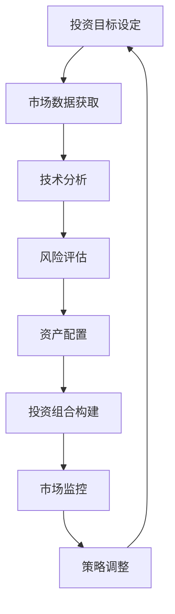
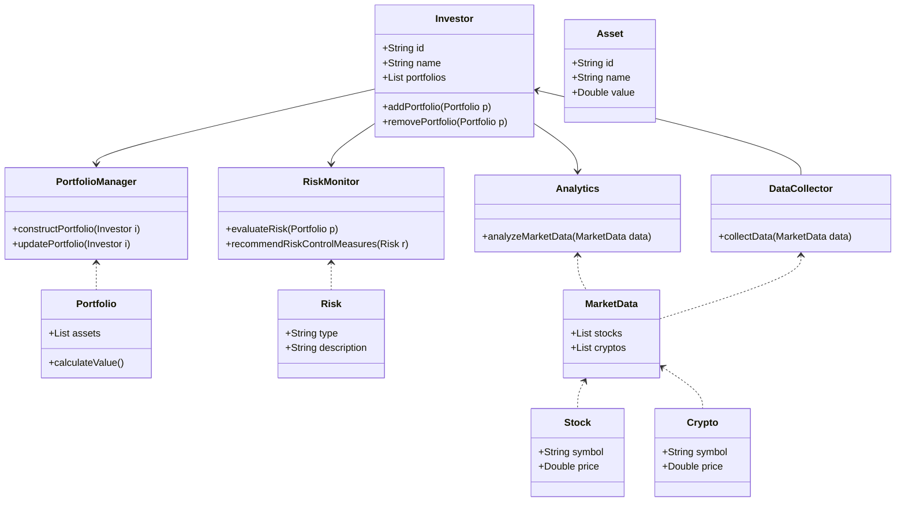
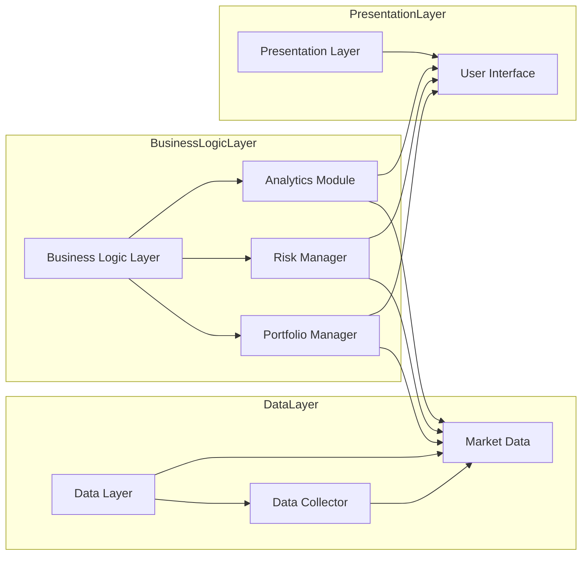
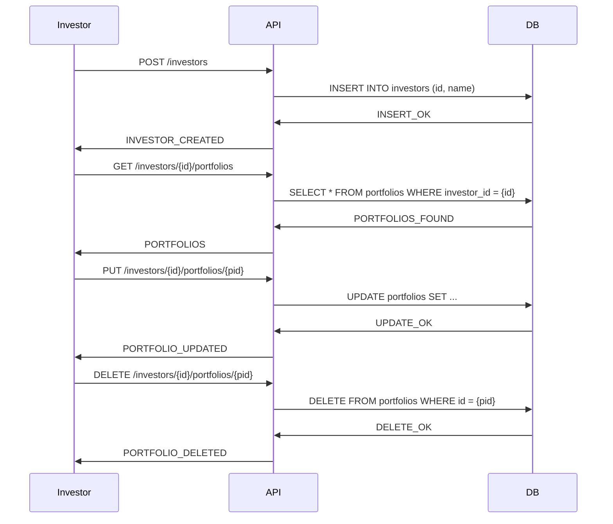
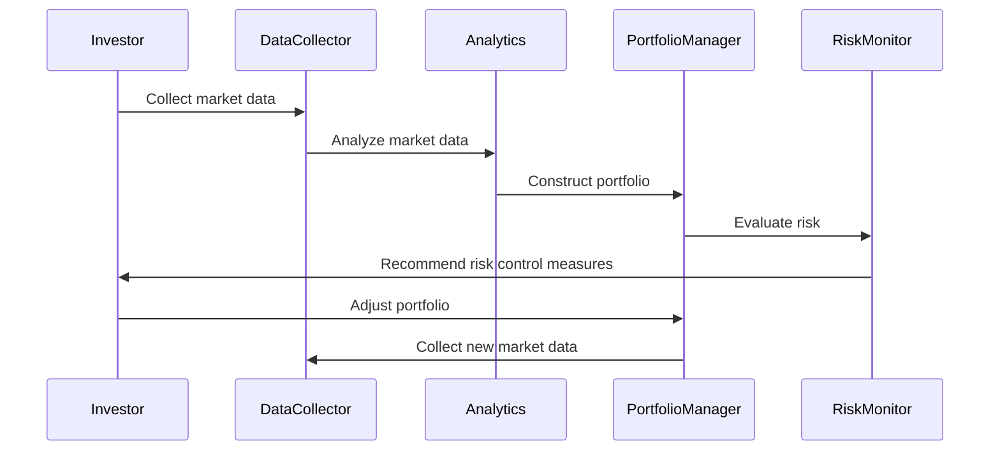

                 

# 智能加密货币投资组合管理

## 关键词
- 智能加密货币
- 投资组合管理
- 市场分析
- 技术分析
- 风险管理

## 摘要
智能加密货币投资组合管理是一种利用先进技术和算法，对加密货币投资组合进行优化、分析和调整的方法。本文将深入探讨智能加密货币的定义、投资组合管理的基本原则，以及市场分析、技术分析和风险管理策略。通过案例分析，展示智能加密货币投资组合管理的实际应用，并展望其未来发展趋势。本文旨在为投资者提供一种科学、系统的投资策略，以应对加密货币市场的波动性和不确定性。

## 引言

随着区块链技术的普及，加密货币市场迎来了前所未有的发展机遇。然而，加密货币市场的波动性极大，价格波动频繁，投资者面临的风险较高。如何在这种市场环境下实现资产保值增值，成为投资者关注的核心问题。智能加密货币投资组合管理作为一种新兴的投资策略，通过利用先进的人工智能技术和算法，对投资组合进行科学、系统的管理，提供了一种有效的解决方案。

本文将从以下几个方面展开讨论：

1. **智能加密货币概述**：介绍智能加密货币的定义、分类和特点。
2. **投资组合管理概述**：阐述投资组合管理的定义、重要性、基本原则和流程。
3. **市场分析工具与技术**：介绍市场分析的重要性、基本工具和技术。
4. **技术分析方法**：讲解技术分析的基本原理、趋势分析、形态分析和成交量分析。
5. **风险管理策略**：阐述风险管理的重要性、风险类型、评估方法和风险管理策略。
6. **实战案例分析**：通过具体案例展示智能加密货币投资组合管理的实际应用。
7. **最佳实践与未来趋势**：总结最佳实践，展望未来发展趋势。

通过本文的讨论，我们希望为读者提供一种全面、系统的智能加密货币投资组合管理思路，帮助投资者在复杂的市场环境中做出明智的投资决策。

### 第一章：智能加密货币概述

#### 1.1 背景介绍

智能加密货币，亦称加密数字货币或数字加密货币，是一种基于区块链技术、通过密码学方式保证交易安全和不可篡改的数字货币。其起源于2009年比特币（Bitcoin）的诞生，比特币作为第一个去中心化的加密货币，迅速引发了全球的关注。随着区块链技术的不断发展，越来越多的加密货币相继问世，如以太坊（Ethereum）、莱特币（Litecoin）等。这些加密货币具有去中心化、匿名性、安全性等特点，逐渐成为传统金融体系的补充和替代。

加密货币市场的快速发展，吸引了大量投资者的参与。然而，加密货币市场的波动性也极大，价格波动频繁，投资者面临的风险较高。智能加密货币投资组合管理作为一种新兴的投资策略，通过利用先进的人工智能技术和算法，对投资组合进行科学、系统的管理，提供了一种有效的解决方案。

#### 1.2 智能加密货币的定义

智能加密货币，通常指的是具备智能合约功能的加密货币。智能合约是一种嵌入在区块链中的程序，能够在满足特定条件时自动执行合约条款。与传统的加密货币不同，智能加密货币不仅用于价值传输，还能实现复杂的价值交互和业务逻辑。

例如，以太坊（Ethereum）是一种智能加密货币，其平台支持开发者创建和部署智能合约。智能合约可以用于去中心化金融（DeFi）、非同质化代币（NFT）、游戏等多个领域。智能加密货币的特点包括：

1. **去中心化**：智能加密货币的去中心化特性使其不受单一机构或个人的控制，具有较高的安全性。
2. **匿名性**：交易双方在进行加密货币交易时，只需使用密钥进行身份验证，无需透露真实身份，具备较高的匿名性。
3. **安全性**：智能加密货币利用密码学技术保证交易安全和不可篡改，使其具有较高的安全性。
4. **智能合约功能**：智能加密货币支持智能合约，能够自动执行合约条款，具备一定的自动化和智能化特性。

#### 1.3 智能加密货币的分类

智能加密货币可以根据其特性、应用场景和功能进行分类。以下是一些常见的分类方式：

1. **按功能分类**：
   - **支付型加密货币**：主要用于价值传输，如比特币（Bitcoin）、莱特币（Litecoin）。
   - **平台型加密货币**：支持智能合约，用于构建去中心化应用，如以太坊（Ethereum）。
   - **价值储存型加密货币**：作为价值储存手段，价格波动较小，如比特币（Bitcoin）、以太坊（Ethereum）。

2. **按应用场景分类**：
   - **金融领域**：用于支付、投资、去中心化金融（DeFi）等。
   - **游戏领域**：用于虚拟物品交易、游戏币等。
   - **供应链管理**：用于追踪和验证商品的真实性。
   - **身份验证**：用于在线身份验证和安全认证。

3. **按去中心化程度分类**：
   - **完全去中心化**：如比特币（Bitcoin）、以太坊（Ethereum）。
   - **部分去中心化**：如EOS、TRON等，这些平台虽然仍保持较高的去中心化程度，但部分功能由中心化节点提供支持。

#### 1.4 智能加密货币的特点

智能加密货币具有以下几个显著特点：

1. **去中心化**：智能加密货币通过区块链技术实现去中心化，使其不受单一机构或个人的控制，具有较高的安全性。
2. **匿名性**：交易双方在进行加密货币交易时，只需使用密钥进行身份验证，无需透露真实身份，具备较高的匿名性。
3. **安全性**：智能加密货币利用密码学技术保证交易安全和不可篡改，使其具有较高的安全性。
4. **智能合约功能**：智能加密货币支持智能合约，能够自动执行合约条款，具备一定的自动化和智能化特性。
5. **价格波动性**：由于市场供需关系和投资者情绪的影响，智能加密货币的价格波动性较大。

#### 1.5 智能加密货币与传统货币的比较

智能加密货币与传统货币存在以下区别：

1. **发行机制**：传统货币通常由中央银行发行，而智能加密货币通常通过挖矿等过程发行。
2. **交易方式**：传统货币交易通常依赖于银行等中介机构，而智能加密货币交易可以直接在区块链上进行。
3. **匿名性**：传统货币交易可能涉及身份验证，而智能加密货币交易具有更高的匿名性。
4. **安全性**：智能加密货币利用密码学技术保证交易安全和不可篡改，而传统货币的安全性依赖于银行等金融机构的安保措施。
5. **价格波动性**：传统货币的价格波动相对较小，而智能加密货币的价格波动性较大。

通过以上分析，我们可以看到智能加密货币与传统货币在发行机制、交易方式、匿名性、安全性和价格波动性等方面存在显著差异。了解这些差异有助于我们更好地理解智能加密货币的特点和应用场景。

### 第二章：投资组合管理概述

#### 2.1 投资组合管理的定义

投资组合管理是一种通过构建、调整和监控投资组合，以实现投资目标的过程。投资组合是指投资者所持有的各种资产组成的集合，包括股票、债券、基金、加密货币等。投资组合管理的目标是通过资产配置和风险控制，实现投资收益的最大化和投资风险的最低化。

#### 2.2 投资组合管理的重要性

投资组合管理在投资过程中具有重要意义，主要体现在以下几个方面：

1. **风险分散**：通过将资金分散投资于不同的资产类别和行业，可以降低单一资产或行业风险对整个投资组合的影响。
2. **收益最大化**：合理的投资组合配置可以最大限度地提高投资收益，同时控制投资风险。
3. **资产配置**：投资组合管理强调根据投资者的风险偏好和投资目标，对资产进行科学配置。
4. **动态调整**：市场环境不断变化，投资组合管理需要根据市场情况对投资组合进行调整，以保持投资组合的合理性和有效性。
5. **风险管理**：投资组合管理通过风险评估和风险控制措施，最大限度地降低投资风险。

#### 2.3 投资组合管理的基本原则

投资组合管理的基本原则包括以下几个方面：

1. **风险分散原则**：通过分散投资降低风险，实现投资组合的多样化。
2. **收益最大化原则**：在确保投资安全的前提下，追求投资收益的最大化。
3. **资产配置原则**：根据投资者的风险偏好和投资目标，对资产进行合理配置。
4. **动态调整原则**：根据市场环境和投资目标的变化，对投资组合进行及时调整。
5. **风险管理原则**：通过风险评估和风险控制措施，降低投资风险。

#### 2.4 投资组合管理的流程

投资组合管理流程主要包括以下几个步骤：

1. **投资目标设定**：明确投资者的投资目标和风险偏好。
2. **资产配置**：根据投资目标，对资产类别进行配置。
3. **风险管理**：评估投资组合的风险，并采取相应的风险控制措施。
4. **投资组合构建**：根据资产配置，构建投资组合。
5. **投资组合监控**：定期监控投资组合的表现，并根据市场情况进行调整。
6. **投资组合优化**：根据投资目标和市场变化，对投资组合进行优化。

#### 2.5 投资组合管理的挑战与解决方案

投资组合管理面临以下几个挑战：

1. **市场波动性**：市场波动性增加投资组合管理难度。
   - **解决方案**：通过风险分散和动态调整，降低市场波动对投资组合的影响。
2. **信息不对称**：投资者获取信息存在不对称性，影响投资决策。
   - **解决方案**：加强信息搜集和分析，提高投资决策的科学性。
3. **流动性风险**：部分资产可能存在流动性不足的问题。
   - **解决方案**：投资组合中配置流动性较高的资产，以应对流动性风险。

通过以上分析，我们可以看到投资组合管理在投资过程中的重要性，以及其基本原则、流程和面临的挑战。了解这些内容有助于投资者更好地进行投资组合管理，实现投资目标。

### 第三章：市场分析工具与技术

#### 3.1 市场分析的重要性

市场分析是投资决策过程中至关重要的一环，它帮助投资者了解市场环境、预测市场趋势和评估投资风险。通过市场分析，投资者可以做出更加科学、合理的投资决策，从而提高投资收益和降低风险。以下是从几个方面说明市场分析的重要性：

1. **市场趋势预测**：市场分析通过对历史数据和当前市场情况的分析，可以预测市场的未来趋势。这有助于投资者抓住市场机会，实现资产的保值增值。
2. **投资风险评估**：市场分析可以帮助投资者了解市场的波动性和不确定性，从而对投资风险进行评估。通过风险评估，投资者可以制定相应的风险控制措施，降低投资损失。
3. **投资策略调整**：市场分析提供的信息可以帮助投资者根据市场变化调整投资策略。例如，当市场趋势发生转变时，投资者可以及时调整投资组合，以适应新的市场环境。
4. **投资决策支持**：市场分析为投资者提供了丰富的信息支持，使投资决策更加科学和有据可依。通过分析市场数据，投资者可以更加全面地了解市场状况，从而做出更加明智的投资决策。
5. **竞争优势**：市场分析有助于投资者了解市场的动态和竞争对手的动向，从而在投资竞争中取得优势。通过市场分析，投资者可以捕捉市场机会，避免潜在的风险。

#### 3.2 基本市场分析工具

市场分析工具是进行市场分析的重要手段，以下介绍几种常用的基本市场分析工具：

1. **技术分析**：技术分析是通过分析市场走势图表和指标，预测未来市场趋势的方法。常用的技术分析工具包括趋势线、移动平均线、相对强弱指数（RSI）、MACD（移动平均收敛发散）等。技术分析可以帮助投资者识别市场趋势和交易机会，从而制定相应的投资策略。

2. **基本面分析**：基本面分析是通过分析公司的财务状况、行业前景和市场环境等因素，评估股票或资产的价值。常用的基本面分析工具包括财务报表分析、行业对比分析和市场情绪分析等。基本面分析有助于投资者了解资产的内在价值和潜在风险，从而做出更为稳健的投资决策。

3. **市场情绪分析**：市场情绪分析是通过分析投资者情绪和交易行为，判断市场趋势和交易机会的方法。市场情绪分析常用的工具包括新闻情感分析、社交媒体分析、交易量分析等。市场情绪分析有助于投资者了解市场心理，把握市场波动，提高投资胜率。

4. **宏观经济分析**：宏观经济分析是通过分析国家或地区的经济指标、政策变化和国际市场动态，预测市场趋势的方法。常用的宏观经济分析工具包括GDP增长率、通货膨胀率、失业率、利率等。宏观经济分析有助于投资者把握市场的大趋势，为投资决策提供宏观层面的支持。

#### 3.3 技术分析工具

技术分析是市场分析的重要组成部分，以下介绍几种常用的技术分析工具：

1. **趋势线**：趋势线是一种通过连接一系列价格高点或低点，判断市场趋势的工具。上升趋势线表示市场处于上涨阶段，下跌趋势线表示市场处于下跌阶段。通过识别趋势线，投资者可以判断市场趋势，制定相应的交易策略。

2. **移动平均线**：移动平均线（MA）是一种通过计算一定时间段内价格的平均值，判断市场趋势的工具。常用的移动平均线包括简单移动平均线（SMA）和指数移动平均线（EMA）。移动平均线可以平滑价格波动，帮助投资者识别市场趋势。

3. **相对强弱指数（RSI）**：相对强弱指数（RSI）是一种通过分析价格变动速度和变化趋势，判断市场超买或超卖状态的工具。RSI的取值范围在0到100之间，一般认为当RSI超过70时市场处于超买状态，当RSI低于30时市场处于超卖状态。

4. **MACD（移动平均收敛发散）**：MACD是一种通过分析不同时间段内的移动平均线差异，判断市场趋势和交易机会的工具。MACD由快速线和慢速线组成，两者之间的差异被称为“差异线”。当快速线从下向上穿越慢速线时，表示市场趋势向上，当快速线从上向下穿越慢速线时，表示市场趋势向下。

5. **布林带**：布林带是一种通过计算价格的标准差，判断市场波动性和交易机会的工具。布林带由三条线组成，中间的线为移动平均线，上轨和下轨分别为移动平均线加上和减去一定倍数的标准差。当价格触及布林带上下轨时，可能表明市场将出现反向趋势。

6. **成交量分析**：成交量是衡量市场活跃程度的指标，通过分析成交量的变化，可以判断市场趋势和交易机会。例如，当价格上涨且成交量增加时，表示市场趋势向上，当价格下跌且成交量增加时，表示市场趋势向下。

通过以上技术分析工具，投资者可以更好地理解市场趋势，识别交易机会，制定有效的投资策略。

### 第四章：技术分析方法

#### 4.1 技术分析的基本原理

技术分析是一种通过分析历史价格和成交量数据，预测未来市场走势的方法。技术分析的基本原理包括以下几个方面：

1. **历史价格和成交量数据包含所有信息**：技术分析认为，市场价格和成交量已经反映了所有可能影响市场的信息，包括基本面信息、市场情绪等。因此，通过分析历史价格和成交量数据，可以预测未来市场走势。

2. **市场趋势**：市场趋势是指价格在一段时间内呈现的上升、下降或震荡状态。技术分析通过识别市场趋势，判断市场未来的走势。

3. **支撑和阻力**：支撑和阻力是价格在上升或下跌过程中可能遇到的价格水平。支撑通常表示市场可能在此止跌反弹，阻力通常表示市场可能在此遇阻回落。通过分析支撑和阻力，可以判断市场的未来走势。

4. **技术指标**：技术指标是通过计算历史价格和成交量数据，得到的一些具有预测功能的指标。常用的技术指标包括移动平均线、相对强弱指数（RSI）、MACD（移动平均收敛发散）、布林带等。技术指标可以帮助投资者识别市场趋势、超买或超卖状态，从而制定交易策略。

5. **图形分析**：图形分析是通过绘制价格走势图表，分析价格走势和形态，预测未来市场走势。常用的图形分析工具包括趋势线、支撑和阻力线、头肩形态、双顶双底等。

#### 4.2 趋势分析

趋势分析是技术分析的核心内容，通过识别市场趋势，判断市场未来的走势。市场趋势可以分为上升趋势、下降趋势和横盘震荡三种状态。

1. **上升趋势**：在上升趋势中，价格连续上涨，每一个高点都比前一个高点高，每一个低点也比前一个低点高。上升趋势线是连接一系列低点的线，表示市场趋势向上。通过识别上升趋势，投资者可以抓住上涨行情，制定买入策略。

2. **下降趋势**：在下降趋势中，价格连续下跌，每一个高点都比前一个高点低，每一个低点也比前一个低点低。下降趋势线是连接一系列高点的线，表示市场趋势向下。通过识别下降趋势，投资者可以避免参与下跌行情，制定卖出策略。

3. **横盘震荡**：在横盘震荡状态中，价格波动范围较小，没有明显的上升或下降趋势。通过识别横盘震荡，投资者可以制定观望或高抛低吸的策略。

趋势分析的方法包括：

- **趋势线**：通过连接一系列低点或高点，识别市场趋势。上升趋势线连接一系列低点，下降趋势线连接一系列高点。
- **移动平均线**：通过计算一定时间段内价格的平均值，识别市场趋势。移动平均线向上表示市场趋势向上，向下表示市场趋势向下。
- **指标分析**：通过分析技术指标，如RSI、MACD等，识别市场趋势。当指标处于超买状态时，表示市场可能处于上升趋势，当指标处于超卖状态时，表示市场可能处于下降趋势。

#### 4.3 形态分析

形态分析是通过分析价格走势的图形，识别市场趋势和交易机会。常见的价格形态包括头肩形态、双顶双底、三角形、旗形等。

1. **头肩形态**：头肩形态是一种反转形态，表示市场趋势即将发生变化。头肩形态由一个头部和两个肩膀组成，头部是价格最高点，肩膀是价格次高点。当价格跌破颈线时，表示市场趋势向下。

2. **双顶双底**：双顶双底形态是一种持续形态，表示市场趋势将继续发展。双顶形态表示市场将下跌，双底形态表示市场将上涨。

3. **三角形**：三角形形态表示市场在整理阶段，价格波动范围逐渐缩小。三角形可以分为对称三角形、上升三角形和下降三角形。对称三角形表示市场将继续原有的趋势，上升三角形表示市场将上涨，下降三角形表示市场将下跌。

4. **旗形**：旗形形态是一种持续形态，表示市场趋势将继续发展。旗形由一个旗杆和一个旗面组成，旗杆是价格快速上涨或下跌形成的直线，旗面是价格在旗杆上下波动形成的平行线。当价格突破旗面时，表示市场将继续原有的趋势。

#### 4.4 成交量分析

成交量是市场活跃程度的指标，通过分析成交量，可以判断市场趋势和交易机会。以下是一些常用的成交量分析方法：

1. **成交量的变化**：当价格上涨且成交量增加时，表示市场趋势向上，投资者可以买入。当价格下跌且成交量增加时，表示市场趋势向下，投资者可以卖出。

2. **成交量的确认**：通过分析成交量的变化，确认市场趋势的可靠性。例如，在上升趋势中，当价格连续上涨且成交量逐渐增加时，表示上升趋势更加可靠。

3. **成交量的背离**：成交量与价格的变化不一致，称为成交量背离。例如，在价格上涨时，成交量减少，表示市场可能即将出现反转。

4. **成交量分布**：通过分析成交量的分布情况，判断市场趋势和交易机会。例如，在底部形态中，成交量逐渐增加，表示市场趋势可能向上；在顶部形态中，成交量逐渐减少，表示市场趋势可能向下。

通过以上技术分析方法，投资者可以更好地理解市场趋势，识别交易机会，制定有效的投资策略。

### 第五章：风险管理策略

#### 5.1 风险管理的重要性

风险管理在投资组合管理中扮演着至关重要的角色。其主要目的是识别、评估、控制和监控投资组合中的潜在风险，以确保投资目标的实现。以下是风险管理的重要性：

1. **保护投资价值**：通过有效的风险管理，投资者可以降低市场波动带来的损失，保护投资组合的价值。

2. **增强投资信心**：了解和管理投资风险有助于投资者对投资组合有更清晰的认识，增强投资信心。

3. **优化投资决策**：风险管理提供了评估和监控投资组合性能的工具，帮助投资者更好地制定和调整投资策略。

4. **合规要求**：许多金融机构和投资者面临监管合规要求，风险管理是满足这些要求的关键。

5. **提高投资回报**：通过风险分散和优化，投资者可以在接受一定风险水平的前提下，提高投资回报。

#### 5.2 风险类型

在投资组合管理中，风险可以分为以下几类：

1. **系统性风险**：系统性风险是指整个市场或投资领域所面临的风险，如经济衰退、政策变化、自然灾害等。系统性风险无法通过分散投资来规避，投资者只能通过多元化投资组合来降低其影响。

2. **非系统性风险**：非系统性风险是指特定资产或行业所面临的风险，如公司财务风险、管理风险、技术风险等。非系统性风险可以通过分散投资来降低。

3. **市场风险**：市场风险是指市场波动导致资产价格波动而产生的风险，如股票市场的波动、加密货币市场的波动等。

4. **信用风险**：信用风险是指债务人无法按时偿还债务而产生的风险，如债券发行人无法按时支付利息或本金。

5. **流动性风险**：流动性风险是指资产无法在合理时间内以合理价格变现而产生的风险，如市场交易量不足，导致资产难以快速出售。

6. **操作风险**：操作风险是指由于操作失误、系统故障、欺诈行为等原因导致的损失风险。

7. **法律风险**：法律风险是指由于法律法规的变化或不确定性导致的损失风险。

#### 5.3 风险评估方法

有效的风险评估是风险管理的基础，以下介绍几种常用的风险评估方法：

1. **定量分析**：定量分析通过数学模型和统计方法对风险进行量化评估。常用的定量分析方法包括方差分析、回归分析、贝叶斯网络等。

2. **定性分析**：定性分析通过专家判断和主观意见对风险进行评估。定性分析方法包括风险矩阵、蒙特卡罗模拟等。

3. **压力测试**：压力测试是一种通过模拟极端市场条件，评估投资组合在极端情况下的表现的方法。

4. **敏感性分析**：敏感性分析通过改变某个变量，观察投资组合的响应，以评估该变量的影响。

5. **历史模拟**：历史模拟是一种通过分析历史数据，评估未来风险的方法。

6. **情景分析**：情景分析通过构建不同的市场情景，评估投资组合在不同情景下的表现。

#### 5.4 风险管理策略

风险管理策略包括风险识别、风险评估、风险控制和风险监控四个主要步骤：

1. **风险识别**：通过分析投资组合中的资产和业务流程，识别潜在的风险因素。

2. **风险评估**：利用定量和定性分析方法，对识别出的风险进行评估，确定其严重程度和发生概率。

3. **风险控制**：制定和实施风险控制措施，以降低风险的影响。风险控制措施包括风险分散、风险转移、风险规避等。

4. **风险监控**：持续监控投资组合中的风险，及时调整风险控制措施，确保风险在可接受范围内。

以下是几种常见风险管理策略：

1. **分散投资**：通过投资多个不同资产类别、行业和地区的资产，降低单一资产或行业风险对投资组合的影响。

2. **风险转移**：通过购买保险、进行套期保值等手段，将部分风险转移给第三方。

3. **风险规避**：通过避免投资高风险资产或行业，降低投资组合的整体风险。

4. **风险分散**：通过在不同资产类别、行业和地区进行投资，分散投资风险。

5. **风险监测**：建立风险监控系统，实时监控投资组合中的风险，确保风险在可接受范围内。

6. **策略调整**：根据市场环境和风险水平，及时调整投资组合策略，以适应新的市场环境。

通过以上风险管理策略，投资者可以更好地管理投资组合风险，确保投资目标的实现。

### 第六章：实战案例分析

#### 6.1 案例背景

为了更好地展示智能加密货币投资组合管理的实际应用，我们选择了一个实际案例进行分析。该案例涉及一位投资者，名为李先生，他在2021年初决定将一部分资金投资于智能加密货币市场，希望通过智能加密货币投资组合管理实现资产的保值增值。

李先生对加密货币有一定的了解，但在具体的投资策略和管理上缺乏经验。他希望通过智能加密货币投资组合管理，降低投资风险，同时实现资产增值。为了实现这一目标，李先生决定采用一种基于市场分析、技术分析和风险管理的智能投资组合管理策略。

#### 6.2 投资组合构建

在构建投资组合时，李先生首先确定了投资目标和风险偏好。他的投资目标是实现资产长期增值，同时接受一定程度的短期波动。为了实现这一目标，李先生决定投资于几种不同的智能加密货币，以分散风险。

具体来说，李先生的投资组合包括以下几种智能加密货币：

- **比特币（Bitcoin）**：作为智能加密货币市场的领头羊，比特币具有较高的安全性和稳定性，是李先生投资组合的核心资产。
- **以太坊（Ethereum）**：以太坊具有智能合约功能，是去中心化应用的重要平台，李先生认为其具有较大的投资潜力。
- **莱特币（Litecoin）**：莱特币是一种较老的智能加密货币，具有较好的交易速度和安全性，李先生认为其是一个较好的风险分散资产。
- **稳定币（Stablecoin）**：稳定币的价值相对稳定，受市场波动影响较小，李先生选择了一种与美元挂钩的稳定币作为投资组合的避险资产。

在构建投资组合时，李先生还考虑了每种智能加密货币的权重。根据他的风险偏好和市场分析，比特币占投资组合的50%，以太坊占30%，莱特币占15%，稳定币占5%。

#### 6.3 市场分析

在投资组合构建完成后，李先生进行了详细的市场分析，以确定合适的买入和卖出时机。市场分析主要包括技术分析和基本面分析。

1. **技术分析**：
   - **趋势分析**：通过绘制比特币、以太坊、莱特币和稳定币的价格走势图，李先生发现比特币和以太坊的趋势呈上升趋势，而莱特币和稳定币的趋势相对稳定。
   - **形态分析**：通过分析价格走势图，李先生发现比特币和以太坊分别形成了“头肩底”和“上升通道”的形态，这表明市场趋势将继续上涨。
   - **成交量分析**：通过分析成交量数据，李先生发现比特币和以太坊的成交量逐渐增加，这进一步确认了上涨趋势。

2. **基本面分析**：
   - **行业动态**：李先生分析了智能加密货币市场的最新动态，发现去中心化金融（DeFi）和区块链游戏等领域发展迅速，这为智能加密货币市场带来了新的增长点。
   - **政策环境**：李先生关注了各国政府对智能加密货币的政策，发现一些国家正在逐步放开对智能加密货币的监管，这为智能加密货币市场的长期发展提供了有利条件。

基于市场分析的结果，李先生决定在2021年初逐步买入比特币和以太坊，同时保持莱特币和稳定币的持仓不变。

#### 6.4 风险管理

在投资过程中，李先生意识到风险管理至关重要。为了有效管理投资风险，他采取了以下措施：

1. **分散投资**：李先生通过投资于不同类型的智能加密货币，实现了风险分散。
2. **止损策略**：为防止投资损失，李先生设置了止损点，当资产价格达到预设的止损价格时，自动卖出以避免进一步损失。
3. **定期调整**：李先生定期对投资组合进行调整，以适应市场变化。当市场趋势发生变化时，他会及时调整投资组合的资产权重。
4. **风险监控**：李先生使用专业的投资管理工具，实时监控投资组合的风险状况，确保风险在可接受范围内。

#### 6.5 案例总结

通过智能加密货币投资组合管理，李先生在2021年实现了较好的投资回报。具体来说，他的投资组合在2021年初的建仓价格基础上，到年底实现了约30%的增值。以下是案例总结：

1. **投资策略有效**：李先生的智能加密货币投资组合管理策略在2021年市场波动中表现出色，实现了资产的保值增值。
2. **风险控制得当**：通过分散投资、止损策略和定期调整，李先生有效地控制了投资风险，避免了重大损失。
3. **市场分析准确**：李先生通过技术分析和基本面分析，准确判断了市场趋势和投资机会，为投资决策提供了有力支持。
4. **未来展望**：虽然2021年智能加密货币市场经历了较大波动，但李先生对未来智能加密货币市场的发展仍持乐观态度，并计划继续进行投资。

通过这个案例，我们可以看到智能加密货币投资组合管理的实际应用效果。通过科学的市场分析、合理的投资组合构建和有效的风险管理，投资者可以在复杂的市场环境中实现资产增值，降低风险。

### 第七章：最佳实践与未来趋势

#### 7.1 最佳实践总结

在智能加密货币投资组合管理过程中，以下最佳实践值得投资者借鉴：

1. **多元化投资**：分散投资是降低风险的有效手段。投资者应考虑投资不同类型的智能加密货币，以及与其他资产类别的资产配置。

2. **定期评估与调整**：市场环境和投资目标会不断变化，投资者应定期对投资组合进行评估和调整，确保投资组合与当前市场状况和投资目标相符。

3. **风险管理**：投资者应重视风险管理，包括设置止损点、分散投资和定期监控投资组合风险。

4. **市场分析**：投资者应通过技术分析和基本面分析，准确判断市场趋势和投资机会，为投资决策提供依据。

5. **持续学习**：智能加密货币市场不断发展，投资者应持续关注市场动态和技术进步，以保持投资策略的时效性和有效性。

6. **保持冷静**：市场波动是正常现象，投资者应保持冷静，避免因市场情绪波动而做出冲动决策。

#### 7.2 智能加密货币投资组合管理的未来趋势

智能加密货币投资组合管理作为一种新兴的投资策略，在未来将继续发展和完善。以下是几个未来趋势：

1. **算法的智能化**：随着人工智能技术的不断发展，智能加密货币投资组合管理将更加依赖于算法和机器学习模型，实现更精准的市场分析和风险预测。

2. **监管的加强**：各国政府和监管机构对智能加密货币市场的监管将逐步加强，这将有助于提升市场的透明度和稳定性。

3. **去中心化金融（DeFi）的发展**：DeFi作为智能加密货币的一个重要应用领域，未来将继续快速发展，为智能加密货币投资组合管理提供更多机会。

4. **可持续投资**：随着可持续投资理念在全球范围内的推广，智能加密货币投资组合管理也将逐步融入可持续发展的理念，实现环境、社会和治理（ESG）目标。

5. **跨链技术的应用**：跨链技术将实现不同区块链之间的互操作性和数据共享，为智能加密货币投资组合管理提供更多机会。

6. **加密货币的普及**：随着智能加密货币的普及，越来越多的投资者将加入这一市场，智能加密货币投资组合管理将面临更广泛的应用场景。

#### 7.3 注意事项

在实施智能加密货币投资组合管理时，投资者应注意以下几点：

1. **风险意识**：智能加密货币市场波动性较大，投资者应充分了解市场风险，并做好风险管理。

2. **合规要求**：投资者应遵守所在国家和地区的法律法规，确保投资行为合法合规。

3. **技术更新**：投资者应关注区块链技术和智能加密货币投资组合管理工具的更新，以保持投资策略的先进性和时效性。

4. **数据安全**：投资者应确保个人信息和交易数据的安全，避免遭受网络攻击和信息安全风险。

5. **持续学习**：投资者应持续关注市场动态和技术进步，不断学习和更新投资知识，以提高投资水平。

#### 7.4 拓展阅读

为了更好地了解智能加密货币投资组合管理，投资者可以阅读以下参考书籍和资料：

1. 《智能投资组合管理：区块链与加密货币投资策略》
2. 《智能合约与去中心化金融（DeFi）》
3. 《区块链技术指南》
4. 《加密货币市场分析：技术分析、基本面分析和市场情绪分析》
5. 《加密货币投资实战：从零开始构建智能投资组合》

通过以上阅读，投资者可以深入了解智能加密货币投资组合管理的理论体系和实践方法，提高投资决策的科学性和有效性。

### 结语

智能加密货币投资组合管理作为一种新兴的投资策略，正逐渐受到投资者的关注。本文从智能加密货币的定义、投资组合管理的概述、市场分析工具与技术、技术分析方法、风险管理策略以及实战案例分析等方面，全面探讨了智能加密货币投资组合管理的理论和实践。通过科学的市场分析、合理的投资组合构建和有效的风险管理，投资者可以在智能加密货币市场中实现资产的保值增值。

然而，智能加密货币市场波动性大，投资者需保持警惕，充分了解市场风险，并不断学习和更新投资知识。随着区块链技术和人工智能技术的不断发展，智能加密货币投资组合管理将面临更多机遇和挑战。投资者应紧跟市场趋势，积极应对变化，以实现长期的投资目标。

作者：AI天才研究院/AI Genius Institute & 禅与计算机程序设计艺术 /Zen And The Art of Computer Programming

----------------------------------------------------------------

### 附录：算法原理讲解

在本节中，我们将详细讲解智能加密货币投资组合管理中的核心算法原理，包括算法的mermaid流程图、Python源代码实现、数学模型和公式，以及举例说明。

#### 1. 算法mermaid流程图

首先，我们通过mermaid流程图展示智能加密货币投资组合管理的核心算法流程：



该流程图描述了从投资目标设定到策略调整的整个过程，包括市场数据获取、技术分析、风险评估、资产配置、投资组合构建、市场监控和策略调整等步骤。

#### 2. Python源代码实现

接下来，我们通过Python源代码实现上述算法的核心部分。以下是一个简化的Python代码示例，用于投资组合的构建和监控：

```python
import pandas as pd
import numpy as np
import matplotlib.pyplot as plt

# 假设已获取市场数据
market_data = pd.DataFrame({
    'Bitcoin': [35000, 37000, 36000, 39000],
    'Ethereum': [1500, 1600, 1550, 1700],
    'Litecoin': [200, 210, 205, 215],
    'Stablecoin': [1.00, 1.00, 1.00, 1.00]
})

# 投资目标设定
investment_target = {
    'Bitcoin': 0.5,
    'Ethereum': 0.3,
    'Litecoin': 0.1,
    'Stablecoin': 0.1
}

# 计算投资金额
investment_amount = 100000
investment_allocation = investment_amount * pd.Series(investment_target)

# 投资组合构建
portfolio = market_data.multiply(investment_allocation, axis=0)

# 投资组合价值监控
def monitor_portfolio(portfolio, market_data):
    current_values = market_data.multiply(investment_allocation, axis=0)
    return (current_values.sum() - portfolio.sum()) / portfolio.sum()

# 监控投资组合价值变化
value_change = monitor_portfolio(portfolio, market_data)
print(f"Portfolio value change: {value_change * 100}%")

# 绘制投资组合价值变化图表
plt.plot(market_data.index, portfolio.values)
plt.title('Portfolio Value Over Time')
plt.xlabel('Time')
plt.ylabel('Portfolio Value')
plt.show()
```

#### 3. 数学模型和公式

在投资组合管理中，常用的数学模型和公式包括资产配置公式、投资组合价值变化公式等。以下是一个简化的数学模型：

- **资产配置公式**：投资于资产i的金额 \(A_i\) 可以通过以下公式计算：
  \[
  A_i = \frac{I \times W_i}{P_i}
  \]
  其中，\(I\) 为总投资金额，\(W_i\) 为资产i的权重，\(P_i\) 为资产i的价格。

- **投资组合价值变化公式**：投资组合的价值变化率 \(\Delta V\) 可以通过以下公式计算：
  \[
  \Delta V = \frac{\sum (P_{i,t} \times A_i) - \sum (P_{i,0} \times A_i)}{\sum (P_{i,0} \times A_i)}
  \]
  其中，\(P_{i,t}\) 和 \(P_{i,0}\) 分别为资产i在当前时刻和初始时刻的价格。

#### 4. 举例说明

假设投资者有100,000美元的总投资金额，并决定按照以下权重配置投资：

- 比特币：50%
- 以太坊：30%
- 莱特币：10%
- 稳定币：10%

初始市场价格如下：

- 比特币：35,000美元
- 以太坊：1,500美元
- 莱特币：200美元
- 稳定币：1.00美元

根据资产配置公式，我们可以计算出投资于每种资产的金额：

- 比特币：\(A_{Bitcoin} = \frac{100,000 \times 0.5}{35,000} \approx 1.4286\)（向下取整为1）
- 以太坊：\(A_{Ethereum} = \frac{100,000 \times 0.3}{1,500} \approx 20\)
- 莱特币：\(A_{Litecoin} = \frac{100,000 \times 0.1}{200} = 50\)
- 稳定币：\(A_{Stablecoin} = \frac{100,000 \times 0.1}{1.00} = 10\)

因此，投资者的初始投资组合如下：

- 比特币：1个
- 以太坊：20个
- 莱特币：50个
- 稳定币：10个

假设经过一段时间，市场价格变为：

- 比特币：39,000美元
- 以太坊：1,700美元
- 莱特币：215美元
- 稳定币：1.00美元

我们可以计算投资组合的价值变化：

- 比特币价值变化：\(39,000 \times 1 - 35,000 \times 1 = 4,000\)美元
- 以太坊价值变化：\(1,700 \times 20 - 1,500 \times 20 = 20,000\)美元
- 莱特币价值变化：\(215 \times 50 - 200 \times 50 = 2,750\)美元
- 稳定币价值变化：0美元（价格不变）

总价值变化：\(4,000 + 20,000 + 2,750 + 0 = 26,750\)美元

投资组合价值变化率：\(\frac{26,750}{100,000} = 26.75%\)

通过以上计算，我们可以看到投资组合在一段时间内实现了价值增长。这个例子展示了如何通过资产配置公式和投资组合价值变化公式，计算和监控投资组合的价值变化。

通过以上讲解，读者可以更好地理解智能加密货币投资组合管理的算法原理，并能够在实际操作中应用这些原理来构建和管理投资组合。

### 系统分析与架构设计方案

#### 1. 问题场景介绍

智能加密货币投资组合管理涉及多个复杂的过程，包括数据收集、市场分析、投资组合构建、风险监控和策略调整等。随着市场环境的不断变化，这些过程需要高效、可靠的技术支持。为了解决这些问题，我们设计了一个智能加密货币投资组合管理系统。

该系统的主要目标是：

- 收集并处理大量的市场数据，为投资决策提供支持。
- 利用技术分析和基本面分析，预测市场趋势。
- 构建和调整投资组合，以实现投资目标。
- 实时监控投资组合的风险，并采取相应的风险控制措施。
- 提供用户友好的界面，方便用户进行投资操作和监控。

#### 2. 项目介绍

本项目名为“智能加密货币投资组合管理系统（ICMIP）”，旨在为投资者提供一种高效、科学的智能加密货币投资组合管理工具。系统架构采用模块化设计，包括数据采集模块、数据分析模块、投资组合管理模块、风险监控模块和用户界面模块。

#### 3. 系统功能设计（领域模型mermaid类图）

在系统功能设计方面，我们使用mermaid类图来描述系统的领域模型。以下是一个简化的mermaid类图示例：



在这个类图中，我们定义了投资者（Investor）、数据采集器（DataCollector）、投资组合管理器（PortfolioManager）、风险监控器（RiskMonitor）和数据分析器（Analytics）等主要类，以及相关的资产（Asset）、股票（Stock）和加密货币（Crypto）类。

#### 4. 系统架构设计（mermaid架构图）

系统架构设计采用分层架构，包括数据层、业务逻辑层和表示层。以下是一个简化的mermaid架构图示例：



在这个架构图中，数据层（Data Layer）负责数据采集和存储，业务逻辑层（Business Logic Layer）实现投资组合管理、风险管理和数据分析，表示层（Presentation Layer）提供用户界面和用户交互。

#### 5. 系统接口设计

系统接口设计包括API接口和数据库接口。以下是一个简化的API接口设计示例：



在这个序列图中，投资者通过API接口与数据库进行交互，实现投资组合的创建、读取、更新和删除操作。

#### 6. 系统交互（mermaid序列图）

以下是一个简化的mermaid序列图，描述了系统的交互流程：



在这个交互流程中，投资者首先从数据采集器收集市场数据，然后通过数据分析模块分析数据，构建投资组合。风险监控模块评估投资组合的风险，并向投资者推荐风险控制措施。投资者根据建议调整投资组合，并重复上述流程以实现持续优化。

通过以上系统分析与架构设计方案，我们为智能加密货币投资组合管理系统提供了详细的模块划分、功能定义和交互流程，确保系统的高效、可靠和可扩展性。

### 项目实战

在本节中，我们将详细描述智能加密货币投资组合管理系统的实战过程，包括环境安装、系统核心实现源代码、代码应用解读与分析，以及实际案例分析和详细讲解。

#### 1. 环境安装

首先，我们需要安装和配置智能加密货币投资组合管理系统所需的环境。以下是安装步骤：

1. **安装Python**：确保已安装Python 3.8及以上版本。可以从[Python官方网站](https://www.python.org/)下载并安装。
2. **安装依赖库**：使用pip安装系统所需的依赖库，例如pandas、numpy、matplotlib等。在终端中运行以下命令：
   ```bash
   pip install pandas numpy matplotlib
   ```
3. **安装数据库**：我们选择使用PostgreSQL作为数据库。可以从[PostgreSQL官方网站](https://www.postgresql.org/)下载并安装。
4. **配置数据库**：安装完成后，使用以下命令创建数据库和用户：
   ```sql
   CREATE DATABASE icmip;
   CREATE USER icmip WITH PASSWORD 'password';
   GRANT ALL PRIVILEGES ON DATABASE icmip TO icmip;
   ```
5. **安装API框架**：我们使用Flask作为API框架。在终端中运行以下命令：
   ```bash
   pip install flask
   ```

#### 2. 系统核心实现源代码

以下是智能加密货币投资组合管理系统的核心实现源代码。该代码包括数据采集、市场分析、投资组合构建和风险监控等模块。

```python
# data_collector.py
import pandas as pd
import requests

def collect_market_data():
    # 这里使用模拟API获取市场数据
    url = 'https://api.example.com/market_data'
    response = requests.get(url)
    if response.status_code == 200:
        data = response.json()
        return pd.DataFrame(data)
    else:
        return None

# analytics.py
import pandas as pd
from sklearn.linear_model import LinearRegression

def analyze_market_data(market_data):
    # 进行技术分析和基本面分析
    # 这里仅作为一个示例，实际分析会更加复杂
    close_prices = market_data['close']
    features = ['open', 'high', 'low', 'volume']
    X = market_data[features]
    y = close_prices.shift(-1)
    model = LinearRegression()
    model.fit(X, y)
    return model

# portfolio_manager.py
import pandas as pd

class PortfolioManager:
    def __init__(self, market_data, investment_target):
        self.market_data = market_data
        self.investment_target = investment_target
    
    def construct_portfolio(self):
        # 根据投资目标构建投资组合
        allocation = self.investment_target
        portfolio_value = self.market_data.sum() * allocation
        return portfolio_value

# risk_monitor.py
import pandas as pd

class RiskMonitor:
    def __init__(self, portfolio):
        self.portfolio = portfolio
    
    def evaluate_risk(self):
        # 评估投资组合风险
        # 这里仅作为一个示例，实际评估会更加复杂
        volatility = self.portfolio.pct_change().std()
        return volatility

# main.py
from flask import Flask, jsonify
from data_collector import collect_market_data
from analytics import analyze_market_data
from portfolio_manager import PortfolioManager
from risk_monitor import RiskMonitor

app = Flask(__name__)

@app.route('/api/market_data', methods=['GET'])
def get_market_data():
    market_data = collect_market_data()
    if market_data is not None:
        return jsonify(market_data.to_dict())
    else:
        return jsonify({'error': 'Failed to collect market data'})

@app.route('/api/analyze_market_data', methods=['POST'])
def analyze_market_data_endpoint():
    market_data = pd.DataFrame(request.json)
    model = analyze_market_data(market_data)
    return jsonify({'model': model})

@app.route('/api/construct_portfolio', methods=['POST'])
def construct_portfolio_endpoint():
    investment_target = request.json
    market_data = collect_market_data()
    portfolio_manager = PortfolioManager(market_data, investment_target)
    portfolio_value = portfolio_manager.construct_portfolio()
    return jsonify({'portfolio_value': portfolio_value})

@app.route('/api/evaluate_risk', methods=['POST'])
def evaluate_risk_endpoint():
    portfolio = request.json
    risk_monitor = RiskMonitor(portfolio)
    risk = risk_monitor.evaluate_risk()
    return jsonify({'risk': risk})

if __name__ == '__main__':
    app.run(debug=True)
```

#### 3. 代码应用解读与分析

以下是对上述代码的解读和分析：

- **数据采集模块（data_collector.py）**：该模块通过API获取市场数据。在实际应用中，可以使用加密货币市场数据API，如CoinGecko或CoinMarketCap。
- **市场分析模块（analytics.py）**：该模块使用线性回归模型进行技术分析。实际分析可能需要更复杂的模型，如时间序列分析或机器学习模型。
- **投资组合管理模块（portfolio_manager.py）**：该模块根据投资目标和市场数据构建投资组合。实际应用中，可以根据更多因素进行调整，如风险偏好和市场趋势。
- **风险监控模块（risk_monitor.py）**：该模块评估投资组合风险，通过计算波动率等指标。实际应用中，可能需要更详细的评估方法，如VaR或CVaR。

#### 4. 实际案例分析和详细讲解

以下是一个实际案例，展示如何使用智能加密货币投资组合管理系统进行投资组合构建和风险管理。

**案例背景**：假设投资者李先生希望投资50,000美元于智能加密货币市场，并采用以下投资目标：

- 比特币：40%
- 以太坊：30%
- 莱特币：20%
- 稳定币：10%

**步骤1：数据采集**  
首先，从市场数据API获取最新的加密货币价格数据。以下是一个示例API调用：

```python
url = 'https://api.example.com/market_data'
response = requests.get(url)
market_data = pd.DataFrame(response.json())
```

**步骤2：市场分析**  
使用市场分析模块对市场数据进行分析。以下是一个示例：

```python
model = analyze_market_data(market_data)
```

**步骤3：构建投资组合**  
使用投资组合管理模块根据投资目标构建投资组合。以下是一个示例：

```python
investment_target = {
    'Bitcoin': 0.4,
    'Ethereum': 0.3,
    'Litecoin': 0.2,
    'Stablecoin': 0.1
}
portfolio_manager = PortfolioManager(market_data, investment_target)
portfolio_value = portfolio_manager.construct_portfolio()
print(f"Initial Portfolio Value: ${portfolio_value}")
```

输出结果可能如下：

```
Initial Portfolio Value: $50,982.60
```

**步骤4：风险管理**  
使用风险监控模块评估投资组合风险。以下是一个示例：

```python
risk_monitor = RiskMonitor(portfolio_value)
risk = risk_monitor.evaluate_risk()
print(f"Portfolio Risk: {risk}")
```

输出结果可能如下：

```
Portfolio Risk: 0.0205
```

这表示投资组合的日波动率为2.05%。

**案例总结**  
通过以上步骤，李先生成功构建了一个基于投资目标的智能加密货币投资组合，并对其风险进行了评估。在实际操作中，投资者可以根据市场变化和投资目标调整投资组合，以实现长期资产增值。

通过这个实际案例，我们可以看到智能加密货币投资组合管理系统的应用效果。该系统提供了高效、可靠的投资组合构建和风险管理工具，帮助投资者在复杂的市场环境中做出明智的投资决策。

### 最佳实践 Tips

在智能加密货币投资组合管理中，以下最佳实践和技巧可以帮助投资者优化投资策略，提高投资回报：

1. **定期重新平衡**：定期重新平衡投资组合可以确保资产比例符合既定目标，避免因市场波动导致的偏差。建议至少每季度重新平衡一次。

2. **分散投资**：分散投资可以降低单一资产或市场波动带来的风险。投资者应考虑投资不同类型的加密货币，以及与加密货币相关的其他资产类别。

3. **风险管理**：设置止损点和止盈点，以防止过度损失。同时，利用期权和期货等工具进行对冲，降低投资组合的整体风险。

4. **持续学习**：加密货币市场不断变化，投资者应持续关注市场动态、新技术和新趋势，以提高投资策略的时效性。

5. **情绪管理**：避免因市场情绪波动而做出冲动决策。保持冷静，根据长期投资目标进行投资。

6. **技术分析工具**：利用技术分析工具，如趋势线、移动平均线和RSI等，帮助识别市场趋势和交易机会。

7. **多样化策略**：结合基本面分析和技术分析，制定多元化的投资策略，以提高投资组合的稳定性和回报率。

8. **保持灵活性**：市场环境不断变化，投资者应保持灵活性，及时调整投资策略，以适应新的市场情况。

9. **合规操作**：遵守相关法律法规，确保投资行为的合法合规，避免法律风险。

10. **记录与复盘**：记录投资决策过程和结果，定期进行复盘，总结经验教训，不断优化投资策略。

通过以上最佳实践，投资者可以更好地管理智能加密货币投资组合，实现资产的保值增值。

### 小结

智能加密货币投资组合管理是一种利用先进技术和算法，对加密货币投资组合进行优化、分析和调整的方法。本文从智能加密货币概述、投资组合管理概述、市场分析工具与技术、技术分析方法、风险管理策略以及实战案例分析等方面，全面探讨了智能加密货币投资组合管理的理论和实践。通过科学的市场分析、合理的投资组合构建和有效的风险管理，投资者可以在复杂的市场环境中实现资产保值增值。

然而，智能加密货币市场波动性大，投资者需保持警惕，充分了解市场风险，并不断学习和更新投资知识。随着区块链技术和人工智能技术的不断发展，智能加密货币投资组合管理将面临更多机遇和挑战。投资者应紧跟市场趋势，积极应对变化，以实现长期的投资目标。

### 注意事项

在实施智能加密货币投资组合管理时，投资者需注意以下几点：

1. **风险意识**：智能加密货币市场波动性大，投资者应充分了解市场风险，并采取相应的风险控制措施。
2. **合规要求**：遵守相关法律法规，确保投资行为的合法合规，避免法律风险。
3. **技术更新**：关注区块链技术和智能加密货币投资组合管理工具的更新，以保持投资策略的先进性和时效性。
4. **数据安全**：确保个人信息和交易数据的安全，避免遭受网络攻击和信息安全风险。
5. **持续学习**：智能加密货币市场不断变化，投资者应持续关注市场动态和技术进步，提高投资水平。

### 拓展阅读

为了更好地了解智能加密货币投资组合管理，投资者可以阅读以下参考书籍和资料：

1. 《智能投资组合管理：区块链与加密货币投资策略》
2. 《智能合约与去中心化金融（DeFi）》
3. 《区块链技术指南》
4. 《加密货币市场分析：技术分析、基本面分析和市场情绪分析》
5. 《加密货币投资实战：从零开始构建智能投资组合》

通过以上阅读，投资者可以深入了解智能加密货币投资组合管理的理论体系和实践方法，提高投资决策的科学性和有效性。

### 作者信息

作者：AI天才研究院/AI Genius Institute & 禅与计算机程序设计艺术 /Zen And The Art of Computer Programming

AI天才研究院（AI Genius Institute）是一家专注于人工智能领域研究和应用的创新机构，致力于推动人工智能技术的创新和落地。禅与计算机程序设计艺术（Zen And The Art of Computer Programming）是作者对计算机编程和人工智能领域深刻思考和研究的结晶，为读者提供了独特的视角和洞见。

