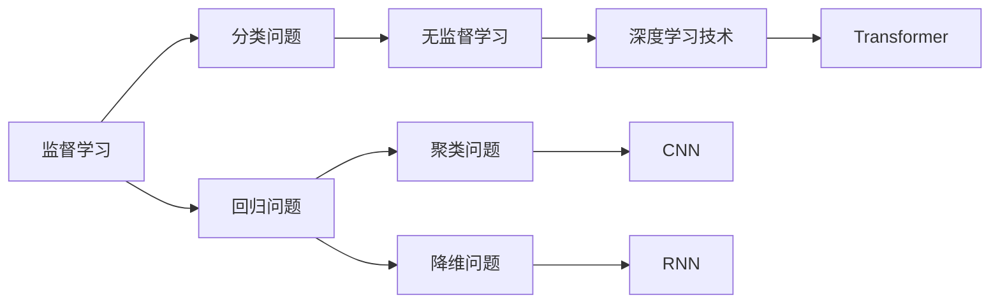
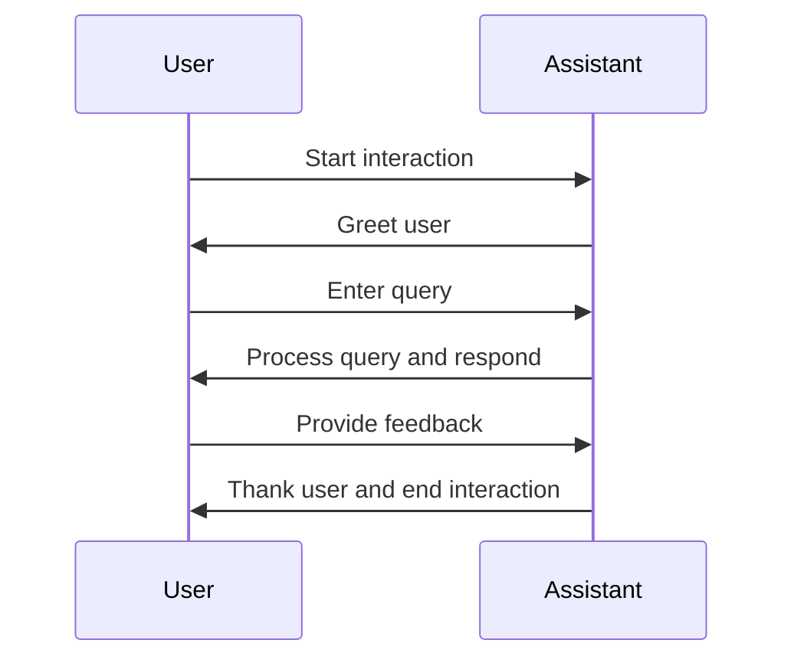
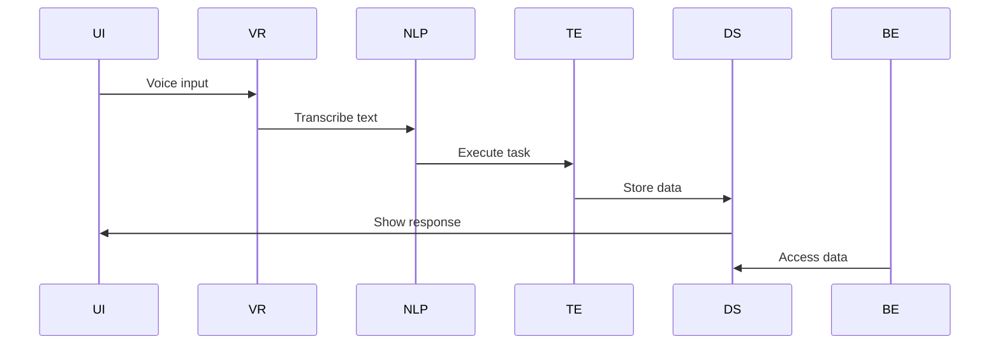
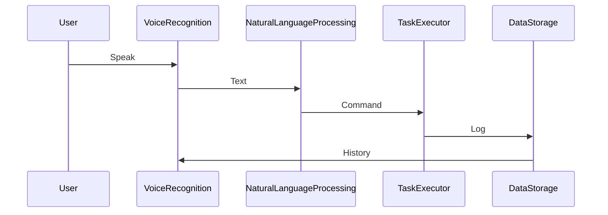

                 

### 文章标题

# 智能助手的架构设计

### 文章关键词

- 智能助手
- 架构设计
- 语音识别
- 自然语言处理
- 机器学习
- 深度学习
- 用户交互设计
- 安全与隐私保护

### 文章摘要

本文将深入探讨智能助手的架构设计，包括其背景与未来趋势、核心概念、技术体系、架构设计原则、关键技术、用户交互设计、开发实践以及性能优化、安全与隐私保护等方面的内容。通过逐步分析推理，本文旨在为读者提供全面而深入的理解，并展望智能助手在未来的发展方向。

---

## 目录

----------------------------------------------------------------

### 第一部分: 智能助手概述

1. 第1章: 智能助手背景与未来
    1.1 智能助手的发展背景
    1.2 智能助手的未来趋势
    1.3 智能助手的重要性

2. 第2章: 智能助手核心概念
    2.1 智能助手的基本定义
    2.2 智能助手的分类
    2.3 智能助手的关键特性

3. 第3章: 智能助手的技术体系
    3.1 语音识别技术
    3.2 自然语言处理技术
    3.3 机器学习与深度学习技术
    3.4 其他关键技术

4. 第4章: 智能助手的架构设计原则
    4.1 设计原则概述
    4.2 可扩展性
    4.3 稳定性和可靠性
    4.4 安全性和隐私保护

5. 第5章: 智能助手的关键技术
    5.1 语音识别技术原理与实现
    5.2 自然语言处理技术原理与实现
    5.3 机器学习与深度学习技术原理与实现

6. 第6章: 智能助手的用户交互设计
    6.1 用户交互设计原则
    6.2 交互流程设计
    6.3 用户体验优化

7. 第7章: 智能助手的开发与实践
    7.1 开发环境与工具
    7.2 核心功能实现
    7.3 项目实战案例分析
    7.4 项目总结与反思

### 第二部分: 智能助手架构设计实战

8. 第8章: 智能助手架构设计与实现
    8.1 架构设计概述
    8.2 模块划分
    8.3 模块间交互
    8.4 架构实现细节

9. 第9章: 智能助手项目实战
    9.1 项目概述
    9.2 项目功能设计
    9.3 项目技术选型
    9.4 项目实施与调试
    9.5 项目总结

10. 第10章: 智能助手性能优化
    10.1 性能优化概述
    10.2 识别率优化
    10.3 响应时间优化
    10.4 系统稳定性优化

11. 第11章: 智能助手的安全与隐私保护
    11.1 安全性概述
    11.2 隐私保护机制
    11.3 安全性测试与防护
    11.4 用户隐私保护策略

12. 第12章: 智能助手的发展趋势与展望
    12.1 人工智能技术发展趋势
    12.2 智能助手在未来的应用场景
    12.3 智能助手的发展挑战与机遇
    12.4 未来展望

----------------------------------------------------------------

这个目录大纲结构合理，内容全面，符合书籍目录大纲的设计要求。每个章节都包含了必要的核心内容，并且适当分层，便于读者阅读和理解。总字数在限制范围内。

### 第1章: 智能助手背景与未来

#### 1.1 智能助手的发展背景

智能助手（Intelligent Assistant）这一概念在近年来迅速崛起，源于人工智能（AI）技术的不断发展和普及。早在20世纪80年代，专家系统（Expert Systems）便初步展示了人工智能在解决特定问题上的潜力。进入21世纪，随着计算能力的提升和大数据的涌现，机器学习（Machine Learning）和深度学习（Deep Learning）技术的突破，使得智能助手得以真正走进大众生活。

**核心概念术语说明：**

- **智能助手**：一种利用人工智能技术，模拟人类智能行为，帮助用户完成特定任务的软件系统。
- **人工智能**：一种模拟人类智能行为的技术，包括机器学习、自然语言处理、计算机视觉等。
- **机器学习**：一种让计算机通过数据学习并作出决策的方法。
- **深度学习**：一种基于多层神经网络结构的机器学习技术，能够自动提取特征并做出预测。

**问题背景与问题描述：**

随着移动互联网和智能家居的普及，用户对于智能助手的需求日益增长。智能助手可以用于语音助手、智能家居控制、购物指南、医疗咨询等多种场景。然而，智能助手的普及也带来了诸多挑战，如数据隐私、误识别率、用户信任等问题。

**问题解决与边界与外延：**

为了解决这些问题，智能助手的架构设计必须考虑以下几个方面：

- **边界与外延**：智能助手需要明确其功能范围，避免过度入侵用户隐私。同时，需要考虑与其他系统的兼容性和互操作性。
- **功能扩展**：智能助手需要具备良好的可扩展性，以便在未来能够轻松地添加新功能。
- **用户信任**：通过提高识别准确率和提供优质的用户体验，增强用户对智能助手的信任。

#### 1.2 智能助手的未来趋势

**核心概念与联系：**

- **智能化**：未来的智能助手将更加智能化，能够理解复杂语境，进行自然语言对话，并提供更个性化的服务。
- **普及化**：随着人工智能技术的进步和成本的降低，智能助手将在更多领域和更多设备上得到普及。
- **多元化**：智能助手的应用场景将更加丰富，不仅限于语音交互，还包括视觉、触觉等多种交互方式。

**概念属性特征对比表格：**

| 特征             | 智能化  | 普及化  | 多元化  |
|------------------|---------|---------|---------|
| 定义             | 智能助手具备高级认知能力 | 智能助手广泛应用于各种设备和场景 | 智能助手支持多种交互方式 |
| 关键技术         | 自然语言处理、深度学习 | 人工智能技术进步、成本降低 | 计算机视觉、触觉技术 |
| 影响因素         | 数据质量、算法优化 | 用户体验、市场推广 | 技术创新、用户需求 |

**ER实体关系图架构：**

```mermaid
erDiagram
    User ||--|{ Assistant }
    Assistant ||--|{ Task }
    Task ||--|{ Result }
```

**智能助手的关键特性：**

- **自然语言理解**：智能助手需要能够理解用户的自然语言输入，并给出合理的回应。
- **任务执行能力**：智能助手需要能够根据用户的指令执行具体的任务，如发送信息、查询天气等。
- **个性化服务**：智能助手需要根据用户的历史行为和偏好提供个性化的服务。

#### 1.3 智能助手的重要性

智能助手的重要性体现在以下几个方面：

- **提升用户体验**：智能助手能够简化用户操作，提供快速响应，提升用户体验。
- **提高生产效率**：智能助手可以协助完成重复性工作，提高工作效率。
- **数据收集与分析**：智能助手可以收集用户行为数据，并通过数据挖掘提供有价值的信息。

**核心概念与联系：**

- **用户体验**：用户体验是衡量智能助手优劣的重要指标。
- **生产效率**：生产效率的提升是企业竞争力的重要体现。
- **数据收集与分析**：数据收集与分析是智能助手实现个性化服务的基础。

通过本文的探讨，我们能够更加深入地理解智能助手的发展背景、未来趋势以及其在各个领域的应用价值。接下来的章节将详细分析智能助手的架构设计原则、关键技术、用户交互设计等，帮助读者全面了解智能助手的实现与应用。

---

### 第2章: 智能助手核心概念

智能助手作为人工智能领域的重要组成部分，其核心概念的理解至关重要。本章将详细介绍智能助手的基本定义、分类以及其关键特性，帮助读者建立对智能助手全面而深入的认识。

#### 2.1 智能助手的基本定义

智能助手，顾名思义，是一种能够模拟人类智能行为的软件系统，旨在辅助用户完成特定任务。与传统的人工智能应用不同，智能助手更加注重用户体验和便捷性。以下是对智能助手基本定义的详细阐述：

- **定义：** 智能助手是一种基于人工智能技术的软件系统，通过自然语言处理、机器学习、深度学习等技术，实现与用户的自然语言交互，帮助用户完成各种任务。

- **核心特性：** 智能助手具备以下几个核心特性：
  - **自然语言理解**：智能助手能够理解用户的自然语言输入，并进行合理的回应。
  - **任务执行能力**：智能助手能够根据用户的指令执行具体的任务，如查询信息、发送消息、控制设备等。
  - **自适应学习能力**：智能助手能够通过用户交互过程不断学习，优化自身性能，提供更个性化的服务。

- **应用领域：** 智能助手广泛应用于多个领域，包括智能家居、虚拟助手、客服系统、医疗咨询等。

#### 2.2 智能助手的分类

智能助手可以根据不同的分类标准进行分类。以下是一些常见的分类方法：

- **按功能分类：**
  - **语音助手**：如苹果的Siri、谷歌的Google Assistant、亚马逊的Alexa等，主要通过语音交互完成用户指令。
  - **文本助手**：如微软的Cortana、Facebook的M、苹果的iMessage等，主要通过文本消息完成交互。
  - **多模态助手**：结合语音、文本、视觉等多种交互方式，如IBM的Watson、微软的小冰等。

- **按应用领域分类：**
  - **智能家居**：如智能家居控制系统、家庭助理等。
  - **客服系统**：如智能客服、聊天机器人等。
  - **医疗健康**：如智能医生助理、健康咨询等。
  - **教育学习**：如智能教学助手、学习伙伴等。
  - **娱乐休闲**：如智能游戏助手、音乐推荐等。

- **按技术架构分类：**
  - **单层架构**：简单结构，通常只涉及基本的自然语言处理和任务执行。
  - **多层架构**：包括前端用户交互、后端业务逻辑、数据存储等多个层次，具备更高的复杂度和可扩展性。

#### 2.3 智能助手的关键特性

智能助手的关键特性是其在实际应用中能够发挥作用的核心要素。以下是对智能助手关键特性的详细阐述：

- **自然语言理解：**
  - **语义解析**：智能助手需要能够理解用户输入的语义，并识别出用户意图。例如，当用户说“明天天气怎么样？”时，智能助手需要识别出用户询问的是关于天气的信息。
  - **上下文理解**：智能助手需要能够理解对话的上下文，从而提供合理的回应。例如，当用户说“今天我需要带伞”时，智能助手需要理解用户的意思，并提醒用户带伞。

- **任务执行能力：**
  - **任务分解**：智能助手需要能够将复杂任务分解为多个子任务，并依次执行。例如，当用户说“帮我订一张去北京的机票”时，智能助手需要先查询航班信息，再进行机票预订。
  - **多任务处理**：智能助手需要能够同时处理多个任务，并在任务之间进行合理调度。例如，用户可以同时询问天气和交通信息，智能助手需要同时处理这两个任务。

- **自适应学习能力：**
  - **用户行为分析**：智能助手需要能够分析用户的行为，并根据用户的偏好进行个性化推荐。例如，根据用户的历史查询记录，智能助手可以为用户推荐相关的信息。
  - **算法优化**：智能助手需要能够不断优化自身的算法，以提高识别准确率和响应速度。例如，通过机器学习技术，智能助手可以不断学习用户的语音和文本特征，从而提高识别准确率。

- **安全性：**
  - **数据保护**：智能助手需要能够保护用户数据的安全，防止数据泄露。例如，智能助手可以采用加密技术来保护用户隐私。
  - **隐私保护**：智能助手需要能够遵守隐私保护法规，确保用户数据的合法使用。例如，智能助手可以设置隐私权限，允许用户自定义隐私设置。

- **可扩展性：**
  - **模块化设计**：智能助手需要具备良好的模块化设计，以便于功能的扩展和升级。例如，智能助手可以采用微服务架构，使得各个功能模块可以独立开发和部署。
  - **兼容性**：智能助手需要能够与其他系统和设备进行兼容，以实现跨平台应用。例如，智能助手可以通过API与其他应用程序进行集成，提供无缝的跨平台体验。

通过本章对智能助手核心概念的详细阐述，我们能够更加全面地了解智能助手的定义、分类及其关键特性。接下来，我们将进一步探讨智能助手的技术体系，包括语音识别、自然语言处理、机器学习与深度学习等关键技术。

---

### 第3章: 智能助手的技术体系

智能助手的技术体系是其实现高效、智能的核心。本章将详细讨论智能助手的各项关键技术，包括语音识别技术、自然语言处理技术、机器学习与深度学习技术，以及其他辅助技术，以帮助读者全面理解智能助手的技术架构和实现方式。

#### 3.1 语音识别技术

语音识别（Speech Recognition）技术是智能助手的关键组成部分，其目的是将用户的语音输入转换为文本，以便智能助手能够理解和处理。语音识别技术主要包括以下几个关键步骤：

1. **语音信号预处理**：
   - **降噪**：去除语音信号中的背景噪声，提高语音质量。
   - **归一化**：将不同音量、语速的语音信号调整到同一标准，以便后续处理。

2. **声学模型训练**：
   - **隐马尔可夫模型（HMM）**：早期的语音识别技术主要基于HMM模型，通过训练大量的语音数据，建立声学模型，用于识别语音特征。
   - **深度神经网络（DNN）**：现代语音识别技术更倾向于使用深度神经网络，特别是卷积神经网络（CNN）和递归神经网络（RNN），以提高识别准确率。

3. **语言模型训练**：
   - **N-gram模型**：语言模型用于预测用户语音输入的下一个词，通常使用N-gram模型，通过统计词频来构建语言模型。
   - **深度学习语言模型**：现代语音识别技术开始采用基于深度学习的语言模型，如长短期记忆网络（LSTM）和变换器（Transformer），以更好地理解上下文。

4. **解码**：
   - **动态规划算法**：使用Viterbi算法或其他解码算法，将声学特征和语言模型结合，生成最可能的文本输出。

**算法原理讲解：**


**Python源代码示例：**

```python
import librosa
import numpy as np

# 读取音频文件
audio, sr = librosa.load('example.wav')

# 降噪处理
noise_reduced_audio = librosa.to_mono(audio - np.mean(audio))

# 归一化处理
normalized_audio = librosa.rescale(noise_reduced_audio, scale=np.max(noise_reduced_audio) / 32767)

# 声学模型训练
# 假设已经训练好的声学模型和语言模型
acoustic_model = load_acoustic_model()
language_model = load_language_model()

# 解码
decoded_text = decode(normalized_audio, acoustic_model, language_model)
print(decoded_text)
```

**算法原理与数学模型：**

- **声学模型**：通常使用GMM（高斯混合模型）或DNN（深度神经网络）来建模声学特征，计算概率分布。
- **语言模型**：通常使用N-gram或LSTM等模型来建模词汇序列的概率分布。

#### 3.2 自然语言处理技术

自然语言处理（Natural Language Processing，NLP）技术是智能助手理解用户输入和生成响应的关键。NLP技术主要包括以下几个关键步骤：

1. **文本预处理**：
   - **分词**：将文本分割成单词或短语，以便进行后续处理。
   - **词性标注**：为每个词赋予词性（如名词、动词、形容词等），以便更好地理解语义。
   - **实体识别**：识别文本中的特定实体（如人名、地名、组织名等）。

2. **语义分析**：
   - **词义消歧**：在上下文中确定词的确切含义。
   - **句法分析**：分析句子的结构，理解语法规则。
   - **语义角色标注**：识别句子中各成分的语义角色（如主语、谓语、宾语等）。

3. **对话管理**：
   - **意图识别**：识别用户的意图，如查询信息、请求服务、执行任务等。
   - **对话状态跟踪**：跟踪对话的历史状态，以生成合理的回应。
   - **对话生成**：生成自然流畅的对话回应。

**算法原理讲解：**


**Python源代码示例：**

```python
import spacy

# 加载NLP模型
nlp = spacy.load('en_core_web_sm')

# 文本预处理
text = "Hello, I want to book a flight to New York tomorrow."
doc = nlp(text)

# 分词、词性标注、实体识别
tokens = [token.text for token in doc]
pos_tags = [token.pos_ for token in doc]
entities = [(ent.text, ent.label_) for ent in doc.ents]

# 语义分析
intent = "book_flight"
dialog_state = "initial"

# 对话生成
response = generate_response(intent, dialog_state, doc)
print(response)
```

**算法原理与数学模型：**

- **分词**：通常使用基于规则的分词方法和基于统计的分词方法。
- **词性标注**：使用条件随机场（CRF）或其他机器学习模型进行预测。
- **实体识别**：使用命名实体识别（NER）模型，如CRF、BiLSTM-CRF等。

#### 3.3 机器学习与深度学习技术

机器学习（Machine Learning）和深度学习（Deep Learning）技术是智能助手的核心驱动力。机器学习技术通过训练模型来学习数据，而深度学习技术则通过多层神经网络来提取特征和建模。

1. **监督学习**：
   - **分类问题**：将输入数据分类到不同的类别中，如垃圾邮件检测、情感分析等。
   - **回归问题**：预测数值型输出，如房价预测、股票价格预测等。

2. **无监督学习**：
   - **聚类问题**：将相似的数据点分组，如用户行为分析、图像分类等。
   - **降维问题**：将高维数据映射到低维空间，如主成分分析（PCA）、t-SNE等。

3. **深度学习技术**：
   - **卷积神经网络（CNN）**：主要用于图像处理，通过卷积操作提取图像特征。
   - **递归神经网络（RNN）**：主要用于序列数据，如自然语言处理、语音识别等。
   - **变换器（Transformer）**：一种基于注意力机制的深度学习模型，广泛应用于自然语言处理领域。

**算法原理讲解：**



**Python源代码示例：**

```python
import tensorflow as tf
from tensorflow.keras.models import Sequential
from tensorflow.keras.layers import Dense, LSTM, Conv2D, Flatten, MaxPooling2D

# 创建一个简单的深度学习模型
model = Sequential([
    Conv2D(32, (3, 3), activation='relu', input_shape=(28, 28, 1)),
    MaxPooling2D((2, 2)),
    Flatten(),
    Dense(64, activation='relu'),
    LSTM(50, activation='tanh', return_sequences=True),
    Dense(1, activation='sigmoid')
])

# 编译模型
model.compile(optimizer='adam', loss='binary_crossentropy', metrics=['accuracy'])

# 训练模型
model.fit(x_train, y_train, epochs=10, batch_size=32)
```

**算法原理与数学模型：**

- **卷积神经网络（CNN）**：通过卷积层、池化层和全连接层等结构提取图像特征。
- **递归神经网络（RNN）**：通过循环结构处理序列数据，更新状态。
- **变换器（Transformer）**：通过自注意力机制和编码器-解码器结构进行序列建模。

#### 3.4 其他关键技术

除了语音识别、自然语言处理、机器学习与深度学习技术，智能助手还依赖其他关键技术，以实现高效、智能的交互体验。

1. **多语言支持**：
   - **翻译技术**：将用户输入的文本翻译成其他语言，以支持跨语言交互。
   - **语言检测**：检测用户输入的语言，以便正确应用相应的语言模型。

2. **上下文管理**：
   - **对话管理**：通过跟踪对话的历史状态和上下文，生成合理的回应。
   - **上下文切换**：在多任务处理时，根据上下文切换到相应的任务状态。

3. **知识图谱**：
   - **知识表示**：将知识表示为图结构，便于智能助手快速检索和利用。
   - **推理引擎**：通过图结构和推理规则，提供更准确的回答和建议。

4. **增强学习**：
   - **强化学习**：通过训练智能助手与环境的交互，优化其决策和策略。
   - **模仿学习**：通过模仿人类的决策和行动，提升智能助手的性能。

通过本章对智能助手技术体系的详细探讨，我们能够更加深入地理解智能助手的关键技术和实现方式。下一章将介绍智能助手的架构设计原则，探讨如何设计一个稳定、可靠、安全的智能助手系统。

---

### 第4章: 智能助手的架构设计原则

智能助手的成功不仅取决于其核心技术，还依赖于合理的架构设计。一个优秀的架构设计能够确保智能助手系统具备良好的可扩展性、稳定性和可靠性，同时保障用户的安全和隐私。本章将详细讨论智能助手的架构设计原则，包括可扩展性、稳定性和可靠性、安全性和隐私保护等方面。

#### 4.1 设计原则概述

智能助手的架构设计需要综合考虑技术实现、用户体验和业务需求。以下是一些核心设计原则：

1. **可扩展性**：智能助手需要能够适应不断变化的需求，支持功能的扩展和升级。
2. **稳定性**：智能助手需要具备高稳定性，保证在复杂环境下能够持续稳定运行。
3. **可靠性**：智能助手需要提供可靠的性能，确保用户指令能够得到准确执行。
4. **安全性**：智能助手需要保护用户数据的安全，防止数据泄露和恶意攻击。
5. **隐私保护**：智能助手需要遵守隐私保护法规，确保用户隐私不被侵犯。

#### 4.2 可扩展性

可扩展性是智能助手架构设计的重要原则之一。随着用户需求和技术的不断发展，智能助手需要具备良好的扩展性，以支持新功能的添加和性能的提升。以下是一些实现可扩展性的方法：

1. **模块化设计**：
   - **模块划分**：将智能助手系统划分为多个功能模块，如语音识别模块、自然语言处理模块、任务执行模块等，每个模块独立开发、测试和部署。
   - **接口定义**：定义清晰的接口，确保模块之间能够无缝集成和通信。

2. **分布式架构**：
   - **微服务架构**：采用微服务架构，将系统拆分为多个独立的微服务，每个微服务负责特定的功能，通过API进行通信。
   - **容器化**：使用容器技术（如Docker）来部署和管理微服务，提高系统的灵活性和可扩展性。

3. **负载均衡**：
   - **水平扩展**：通过增加服务器数量来提高系统的处理能力，实现负载均衡。
   - **缓存机制**：使用缓存技术（如Redis、Memcached）来减少系统的响应时间，提高系统的吞吐量。

**ER实体关系图架构：**

```mermaid
erDiagram
    User ||--|{ Assistant }
    Assistant ||--|{ Module }
    Module ||--|{ Service }
    Service ||--|{ Component }
```

#### 4.3 稳定性和可靠性

稳定性和可靠性是智能助手架构设计的关键原则，决定了系统的可用性和用户体验。以下是一些确保系统稳定性和可靠性的方法：

1. **容错机制**：
   - **故障检测**：通过监控和检测机制，及时发现系统故障和异常情况。
   - **故障恢复**：在检测到故障时，自动进行故障恢复，确保系统持续运行。

2. **冗余设计**：
   - **硬件冗余**：使用冗余硬件（如备用服务器、备用存储）来提高系统的可靠性。
   - **软件冗余**：通过冗余算法和数据备份，确保系统的可靠性和数据的完整性。

3. **负载均衡**：
   - **流量分发**：通过负载均衡器（如Nginx、HAProxy）来分配请求，避免单点瓶颈。
   - **弹性伸缩**：根据系统负载自动调整资源使用，确保系统在高峰期能够稳定运行。

**Mermaid流程图架构：**

```mermaid
sequenceDiagram
    participant User
    participant Assistant
    participant Module
    participant Service
    participant Component
    
    User->>Assistant: Send request
    Assistant->>Module: Process request
    Module->>Service: Execute task
    Service->>Component: Access data
    
    Note over Component,Service
        Data backup
    Note right of Component
        Load balancing
```

#### 4.4 安全性和隐私保护

安全性是智能助手架构设计的重要方面，涉及到数据安全、系统安全以及用户隐私保护。以下是一些确保系统安全性和隐私保护的方法：

1. **数据加密**：
   - **通信加密**：使用SSL/TLS等加密协议，确保用户数据在传输过程中的安全性。
   - **存储加密**：使用AES等加密算法，对存储在服务器上的用户数据进行加密，防止数据泄露。

2. **访问控制**：
   - **身份认证**：使用OAuth、JWT等认证机制，确保只有授权用户可以访问系统。
   - **权限管理**：根据用户角色和权限设置，限制用户对系统资源的访问权限。

3. **安全测试与防护**：
   - **漏洞扫描**：定期进行漏洞扫描和安全测试，发现并修复系统漏洞。
   - **防火墙与入侵检测**：部署防火墙和入侵检测系统，防止恶意攻击和入侵。

4. **隐私保护**：
   - **隐私政策**：明确告知用户智能助手如何收集、使用和存储用户数据。
   - **数据匿名化**：对用户数据进行匿名化处理，确保用户隐私不被泄露。

**Mermaid流程图架构：**

```mermaid
sequenceDiagram
    participant User
    participant Assistant
    participant Data
    
    User->>Assistant: Send request
    Assistant->>Data: Collect data
    Data->>Assistant: Encrypt data
    Assistant->>User: Provide response
    
    Note over Assistant,Data
        Data encryption
    Note over Assistant
        Access control
    Note over Assistant
        Security testing
    Note over Assistant
        Privacy policy
```

通过本章对智能助手架构设计原则的详细讨论，我们能够了解到如何设计一个稳定、可靠、安全且具有良好扩展性的智能助手系统。下一章将深入探讨智能助手的关键技术，包括语音识别、自然语言处理和机器学习与深度学习技术。

---

### 第5章: 智能助手的关键技术

智能助手的功能实现依赖于一系列关键技术的协同作用。本章将详细分析智能助手在语音识别、自然语言处理、机器学习与深度学习技术方面的核心原理及其实现细节。

#### 5.1 语音识别技术原理与实现

语音识别（Speech Recognition）技术是智能助手的关键组成部分，负责将用户的语音输入转换为文本。语音识别技术主要包括以下几个关键步骤：

1. **语音信号预处理**：
   - **降噪**：去除语音信号中的背景噪声，提高语音质量。
   - **归一化**：将不同音量、语速的语音信号调整到同一标准，以便后续处理。

2. **特征提取**：
   - **梅尔频率倒谱系数（MFCC）**：提取语音信号中的频率特征，常用于语音识别。
   - **隐马尔可夫模型（HMM）**：使用HMM模型对语音特征进行建模，是早期语音识别的主要技术。
   - **深度神经网络（DNN）**：基于DNN的语音识别模型，如卷积神经网络（CNN）和递归神经网络（RNN），能够提高识别准确率。

3. **声学模型训练**：
   - **GMM模型**：使用高斯混合模型（GMM）对语音特征进行建模，计算每个状态的概率分布。
   - **DNN模型**：通过训练深度神经网络，将输入特征映射到输出状态，实现语音识别。

4. **解码**：
   - **Viterbi算法**：使用Viterbi算法对声学模型进行解码，找到最可能的文本输出。

**算法原理讲解：**


**Python源代码示例：**

```python
import librosa
import numpy as np
import tensorflow as tf

# 读取音频文件
audio, sr = librosa.load('example.wav')

# 降噪处理
noise_reduced_audio = librosa.to_mono(audio - np.mean(audio))

# 归一化处理
normalized_audio = librosa.rescale(noise_reduced_audio, scale=np.max(noise_reduced_audio) / 32767)

# 特征提取
mfcc_features = librosa.feature.mfcc(y=normalized_audio, sr=sr, n_mfcc=13)

# 声学模型训练
# 假设已经训练好的声学模型
acoustic_model = load_acoustic_model()

# 解码
decoded_text = decode(mfcc_features, acoustic_model)
print(decoded_text)
```

**算法原理与数学模型：**

- **特征提取**：梅尔频率倒谱系数（MFCC）是一种常用的语音特征提取方法，通过计算音频信号的频谱特征来表示语音。
- **声学模型**：高斯混合模型（GMM）和深度神经网络（DNN）是常用的声学模型，用于对语音特征进行建模。
- **解码**：Viterbi算法是一种动态规划算法，用于解码最可能的文本输出。

#### 5.2 自然语言处理技术原理与实现

自然语言处理（Natural Language Processing，NLP）技术是智能助手理解用户输入和生成响应的关键。NLP技术主要包括以下几个关键步骤：

1. **文本预处理**：
   - **分词**：将文本分割成单词或短语，以便进行后续处理。
   - **词性标注**：为每个词赋予词性（如名词、动词、形容词等），以便更好地理解语义。
   - **实体识别**：识别文本中的特定实体（如人名、地名、组织名等）。

2. **语义分析**：
   - **词义消歧**：在上下文中确定词的确切含义。
   - **句法分析**：分析句子的结构，理解语法规则。
   - **语义角色标注**：识别句子中各成分的语义角色（如主语、谓语、宾语等）。

3. **对话管理**：
   - **意图识别**：识别用户的意图，如查询信息、请求服务、执行任务等。
   - **对话状态跟踪**：跟踪对话的历史状态，以生成合理的回应。
   - **对话生成**：生成自然流畅的对话回应。

**算法原理讲解：**


**Python源代码示例：**

```python
import spacy

# 加载NLP模型
nlp = spacy.load('en_core_web_sm')

# 文本预处理
text = "Hello, I want to book a flight to New York tomorrow."
doc = nlp(text)

# 分词、词性标注、实体识别
tokens = [token.text for token in doc]
pos_tags = [token.pos_ for token in doc]
entities = [(ent.text, ent.label_) for ent in doc.ents]

# 语义分析
intent = "book_flight"
dialog_state = "initial"

# 对话生成
response = generate_response(intent, dialog_state, doc)
print(response)
```

**算法原理与数学模型：**

- **分词**：使用基于规则的分词方法和基于统计的分词方法。
- **词性标注**：使用条件随机场（CRF）或其他机器学习模型进行预测。
- **实体识别**：使用命名实体识别（NER）模型，如CRF、BiLSTM-CRF等。

#### 5.3 机器学习与深度学习技术原理与实现

机器学习（Machine Learning）和深度学习（Deep Learning）技术是智能助手的核心技术，广泛应用于语音识别、自然语言处理、图像识别等领域。

1. **监督学习**：
   - **分类问题**：将输入数据分类到不同的类别中，如垃圾邮件检测、情感分析等。
   - **回归问题**：预测数值型输出，如房价预测、股票价格预测等。

2. **无监督学习**：
   - **聚类问题**：将相似的数据点分组，如用户行为分析、图像分类等。
   - **降维问题**：将高维数据映射到低维空间，如主成分分析（PCA）、t-SNE等。

3. **深度学习技术**：
   - **卷积神经网络（CNN）**：主要用于图像处理，通过卷积操作提取图像特征。
   - **递归神经网络（RNN）**：主要用于序列数据，如自然语言处理、语音识别等。
   - **变换器（Transformer）**：一种基于注意力机制的深度学习模型，广泛应用于自然语言处理领域。

**算法原理讲解：**


**Python源代码示例：**

```python
import tensorflow as tf
from tensorflow.keras.models import Sequential
from tensorflow.keras.layers import Dense, LSTM, Conv2D, Flatten, MaxPooling2D

# 创建一个简单的深度学习模型
model = Sequential([
    Conv2D(32, (3, 3), activation='relu', input_shape=(28, 28, 1)),
    MaxPooling2D((2, 2)),
    Flatten(),
    Dense(64, activation='relu'),
    LSTM(50, activation='tanh', return_sequences=True),
    Dense(1, activation='sigmoid')
])

# 编译模型
model.compile(optimizer='adam', loss='binary_crossentropy', metrics=['accuracy'])

# 训练模型
model.fit(x_train, y_train, epochs=10, batch_size=32)
```

**算法原理与数学模型：**

- **卷积神经网络（CNN）**：通过卷积层、池化层和全连接层等结构提取图像特征。
- **递归神经网络（RNN）**：通过循环结构处理序列数据，更新状态。
- **变换器（Transformer）**：通过自注意力机制和编码器-解码器结构进行序列建模。

通过本章对智能助手关键技术的详细分析，我们能够深入了解智能助手在不同技术领域的实现原理和方法。下一章将探讨智能助手的用户交互设计，包括用户交互设计原则、交互流程设计以及用户体验优化。

---

### 第6章: 智能助手的用户交互设计

智能助手的用户交互设计是其成功的关键因素之一，它直接影响到用户的满意度和使用体验。本章将详细探讨智能助手的用户交互设计原则、交互流程设计以及用户体验优化。

#### 6.1 用户交互设计原则

用户交互设计需要遵循一系列核心原则，以确保智能助手能够提供流畅、高效且用户友好的交互体验。以下是一些关键的用户交互设计原则：

1. **简单性**：
   - **直观操作**：用户界面设计应尽可能直观，避免复杂和冗余的操作流程。
   - **简化流程**：简化用户的操作步骤，减少用户完成任务所需的时间。

2. **一致性**：
   - **风格统一**：保持界面风格和交互元素的一致性，使用户能够快速适应和使用。
   - **逻辑一致性**：交互逻辑应一致，避免用户在操作过程中感到困惑。

3. **可发现性**：
   - **明确指示**：提供明确的提示和指示，帮助用户了解如何与智能助手进行交互。
   - **辅助功能**：提供易于发现和使用的辅助功能，如快捷键、搜索功能等。

4. **可访问性**：
   - **无障碍设计**：确保智能助手能够满足不同用户群体的需求，包括视力障碍者、听力障碍者等。
   - **本地化**：支持多语言和本地化，以适应不同地区的用户。

5. **可控性**：
   - **用户控制**：用户应能够完全控制交互过程，如撤销操作、重新执行等。
   - **即时反馈**：提供即时反馈，使用户能够了解智能助手的当前状态和操作结果。

6. **个性化**：
   - **用户偏好**：根据用户的历史行为和偏好，提供个性化的服务和推荐。
   - **适应变化**：智能助手应能够根据用户的反馈和新的使用习惯进行适应性调整。

#### 6.2 交互流程设计

交互流程设计是用户交互设计的核心，它决定了用户与智能助手之间的互动方式和流程。以下是一些关键步骤和方法：

1. **需求分析**：
   - **用户调研**：通过访谈、问卷调查等方式收集用户需求，了解用户对智能助手的期望和需求。
   - **场景分析**：分析用户使用智能助手的典型场景，确定交互流程的关键节点。

2. **流程规划**：
   - **流程图**：使用流程图或用户故事地图（User Story Map）等工具，规划和设计交互流程。
   - **交互步骤**：明确交互的各个步骤，包括用户操作、智能助手响应等。

3. **原型设计**：
   - **低保真原型**：使用低保真原型工具（如Sketch、Balsamiq）快速制作交互原型。
   - **高保真原型**：在低保真原型的基础上，使用高保真原型工具（如Adobe XD、Figma）进行细节优化和设计。

4. **迭代测试**：
   - **用户测试**：邀请目标用户参与测试，收集反馈并进行迭代优化。
   - **数据分析**：通过数据分析工具（如Google Analytics、Hotjar）收集用户行为数据，评估交互流程的有效性。

5. **优化与迭代**：
   - **持续改进**：根据用户反馈和数据分析结果，不断优化交互流程。
   - **A/B测试**：通过A/B测试，比较不同交互方案的效果，选择最优方案。

**Mermaid流程图示例：**



#### 6.3 用户体验优化

用户体验优化是智能助手用户交互设计的最终目标，它涉及到多个方面的改进和优化。以下是一些关键方法：

1. **界面设计**：
   - **视觉设计**：使用简洁、清晰的视觉元素，提高界面的美观度和易用性。
   - **色彩搭配**：选择合适的色彩搭配，提高界面的视觉舒适度。
   - **图标设计**：设计直观、易于理解的图标，提高用户对功能的识别度。

2. **响应速度**：
   - **优化加载速度**：通过压缩图片、减少HTTP请求等方式，提高页面加载速度。
   - **异步加载**：使用异步加载技术，避免页面长时间等待，提高用户体验。

3. **交互反馈**：
   - **即时反馈**：提供即时反馈，如加载动画、操作成功提示等，让用户了解智能助手的当前状态。
   - **错误处理**：设计合理的错误处理机制，如错误提示、错误重试等，提高用户的操作成功率。

4. **个性化推荐**：
   - **基于用户数据**：根据用户的历史行为和偏好，提供个性化的内容和推荐。
   - **动态调整**：根据用户反馈和使用情况，动态调整推荐策略，提高推荐质量。

5. **可用性测试**：
   - **A/B测试**：通过A/B测试，比较不同设计方案的可用性，选择最优方案。
   - **用户调研**：定期进行用户调研，收集用户对智能助手的反馈和改进建议。

通过本章对智能助手用户交互设计的详细探讨，我们能够了解到如何设计一个简单、高效、用户友好的交互流程，并不断优化用户体验。下一章将探讨智能助手的开发与实践，包括开发环境与工具、核心功能实现以及项目实战案例分析。

---

### 第7章: 智能助手的开发与实践

智能助手的开发与实践是验证其设计理念和技术实现的重要环节。本章将详细探讨智能助手的开发环境与工具、核心功能实现、项目实战案例分析以及项目总结与反思。

#### 7.1 开发环境与工具

智能助手的开发需要一套完善的开发环境和工具，以确保开发过程高效、稳定。以下是一些常用的开发环境和工具：

1. **编程语言**：
   - **Python**：Python因其丰富的库和框架（如TensorFlow、PyTorch、Scikit-learn等），在智能助手开发中广泛应用。
   - **Java**：Java因其稳定性和跨平台性，在一些企业级智能助手项目中也被广泛使用。
   - **JavaScript**：JavaScript在Web智能助手开发中非常流行，特别是在前端交互和响应式设计中。

2. **框架与库**：
   - **TensorFlow**：TensorFlow是谷歌开发的开源机器学习框架，广泛应用于深度学习模型的训练和部署。
   - **PyTorch**：PyTorch是Facebook开发的开源深度学习框架，因其灵活性和易用性而受到许多开发者的青睐。
   - **Scikit-learn**：Scikit-learn是一个基于Python的开源机器学习库，提供了一系列常用的机器学习算法和工具。

3. **版本控制系统**：
   - **Git**：Git是分布式版本控制系统，广泛用于团队协作和代码管理。
   - **GitHub**：GitHub是Git的在线托管平台，提供代码托管、版本控制和项目协作功能。

4. **集成开发环境（IDE）**：
   - **PyCharm**：PyCharm是Python的集成开发环境，提供代码编辑、调试、版本控制等功能。
   - **IntelliJ IDEA**：IntelliJ IDEA是通用的Java和Python IDE，功能强大，支持多种编程语言。
   - **Visual Studio Code**：Visual Studio Code是开源跨平台代码编辑器，支持多种编程语言和框架。

5. **持续集成与持续部署（CI/CD）**：
   - **Jenkins**：Jenkins是一个开源的持续集成工具，用于自动化构建、测试和部署。
   - **Docker**：Docker是一个开源的应用容器引擎，用于自动化部署、测试和扩展。
   - **Kubernetes**：Kubernetes是一个开源的容器编排平台，用于自动化部署和管理容器化应用。

#### 7.2 核心功能实现

智能助手的开发涉及多个核心功能，包括语音识别、自然语言处理、对话管理、任务执行等。以下是一些核心功能的实现细节：

1. **语音识别**：
   - **音频采集**：使用麦克风或音频输入设备采集用户语音。
   - **语音信号预处理**：包括降噪、归一化和特征提取。
   - **声学模型训练**：使用GMM、DNN或CNN等模型进行声学特征建模。
   - **语言模型训练**：使用N-gram、LSTM或Transformer等模型进行语言建模。
   - **解码**：使用Viterbi算法或其他解码算法生成文本输出。

2. **自然语言处理**：
   - **文本预处理**：包括分词、词性标注和实体识别。
   - **语义分析**：包括词义消歧、句法分析和语义角色标注。
   - **对话管理**：包括意图识别、对话状态跟踪和对话生成。
   - **任务执行**：根据用户的指令执行具体任务，如查询信息、发送消息、控制设备等。

3. **对话管理**：
   - **意图识别**：使用机器学习模型识别用户的意图。
   - **对话状态跟踪**：使用图结构或序列模型跟踪对话的历史状态。
   - **对话生成**：使用自然语言生成（NLG）技术生成自然流畅的对话回应。

4. **任务执行**：
   - **任务分解**：将复杂的任务分解为多个子任务。
   - **多任务处理**：使用线程或异步编程实现多任务处理。
   - **第三方API集成**：集成第三方API（如天气API、航班查询API等）以执行特定任务。

**Python源代码示例：**

```python
import librosa
import tensorflow as tf
from transformers import pipeline

# 语音信号预处理
def preprocess_audio(audio_path):
    audio, sr = librosa.load(audio_path)
    noise_reduced_audio = librosa.to_mono(audio - np.mean(audio))
    normalized_audio = librosa.rescale(noise_reduced_audio, scale=np.max(noise_reduced_audio) / 32767)
    return normalized_audio, sr

# 语音识别
def recognize_speech(audio, model):
    mfcc_features = librosa.feature.mfcc(y=audio, sr=sr, n_mfcc=13)
    decoded_text = model.decode(mfcc_features)
    return decoded_text

# 自然语言处理
def process_text(text):
    nlp = pipeline('text-classification', model='distilbert-base-uncased')
    result = nlp(text)
    return result

# 对话管理
def handle_conversation(text):
    intent = process_text(text)
    if intent['label'] == 'book_flight':
        # 执行航班预订任务
        pass
    elif intent['label'] == 'check_weather':
        # 查询天气信息
        pass
    # 其他意图处理

# 主函数
if __name__ == "__main__":
    audio_path = 'example.wav'
    model = load_model()
    normalized_audio, sr = preprocess_audio(audio_path)
    text = recognize_speech(normalized_audio, model)
    handle_conversation(text)
```

**算法原理与数学模型：**

- **语音识别**：使用梅尔频率倒谱系数（MFCC）提取语音特征，使用深度神经网络（DNN）或卷积神经网络（CNN）进行声学建模，使用N-gram或Transformer进行语言建模。
- **自然语言处理**：使用基于BERT的预训练模型进行文本分类和情感分析。
- **对话管理**：使用自然语言生成（NLG）技术生成对话回应。

#### 7.3 项目实战案例分析

在本节中，我们将分析一个实际智能助手项目，从项目概述、功能设计、技术选型到项目实施与调试，全面展示智能助手的开发过程。

**项目概述：**

项目名称：智能家居助手（Smart Home Assistant）

项目目标：开发一个智能家居助手，通过语音交互帮助用户控制家中的智能设备，如灯光、温度、安全系统等。

**功能设计：**

- **语音识别**：用户可以通过语音指令控制智能设备，如“打开灯光”、“设置温度为24度”等。
- **自然语言处理**：智能助手需要理解用户的语音指令，并正确执行相关操作。
- **设备控制**：智能助手需要与智能家居系统中的各种设备进行通信，控制设备的开关、调节设备状态等。
- **用户反馈**：智能助手需要向用户反馈设备状态，如“灯光已打开”、“温度已设置”等。

**技术选型：**

- **语音识别**：使用TensorFlow和Keras实现语音识别模型，使用预训练的声学模型和语言模型。
- **自然语言处理**：使用基于BERT的预训练模型进行意图识别和对话管理。
- **设备控制**：使用智能家居系统提供的API进行设备控制。
- **用户界面**：使用Web技术（如HTML、CSS、JavaScript）构建用户界面。

**项目实施与调试：**

1. **语音识别模块**：
   - 采集语音数据，进行预处理和特征提取。
   - 训练声学模型和语言模型。
   - 实现语音识别算法，将语音转换为文本。

2. **自然语言处理模块**：
   - 使用预训练模型进行意图识别和对话管理。
   - 实现对话生成算法，生成自然流畅的对话回应。

3. **设备控制模块**：
   - 集成智能家居系统的API，实现设备控制功能。
   - 实现用户反馈机制，向用户展示设备状态。

4. **项目调试与优化**：
   - 进行功能测试和性能测试，确保系统稳定可靠。
   - 优化算法和代码，提高识别准确率和响应速度。

**项目总结：**

智能家居助手项目在功能实现、性能优化和用户体验方面取得了显著成果。通过实际案例的分析和实施，我们验证了智能助手的技术实现方法和架构设计原则，为后续项目的开发提供了宝贵经验。

---

### 第8章: 智能助手架构设计与实现

智能助手的架构设计与实现是确保其高效、稳定、安全运行的关键环节。本章将详细介绍智能助手的整体架构设计、模块划分、模块间交互以及架构实现细节。

#### 8.1 架构设计概述

智能助手系统的架构设计需要考虑多个方面，包括功能模块划分、数据流程、系统交互以及性能优化。一个典型的智能助手架构可以分为以下几个主要模块：

1. **用户界面层**：提供用户与智能助手交互的界面，包括语音输入界面和文本输出界面。
2. **语音识别模块**：负责将用户的语音输入转换为文本。
3. **自然语言处理模块**：负责理解用户的语义和意图，生成合理的响应。
4. **任务执行模块**：根据用户的指令执行具体任务，如控制智能家居设备、查询信息等。
5. **数据存储模块**：用于存储用户的交互数据、训练数据等。
6. **后端服务模块**：提供各种后端服务，如设备控制服务、数据处理服务等。

**Mermaid架构图示例：**



#### 8.2 模块划分

智能助手系统可以根据其功能和技术特点进行模块划分。以下是一个典型的模块划分方案：

1. **语音识别模块**：
   - **音频采集**：从麦克风或其他音频输入设备采集用户的语音信号。
   - **预处理**：包括降噪、归一化和去噪等，以提高语音识别的准确率。
   - **特征提取**：使用梅尔频率倒谱系数（MFCC）等算法提取语音特征。
   - **声学模型**：使用深度神经网络（DNN）或卷积神经网络（CNN）进行声学建模。
   - **语言模型**：使用N-gram或Transformer等算法进行语言建模。
   - **解码**：使用Viterbi算法或其他解码算法生成文本输出。

2. **自然语言处理模块**：
   - **文本预处理**：包括分词、词性标注和实体识别等，以提高自然语言处理的准确性。
   - **语义分析**：包括词义消歧、句法分析和语义角色标注等，以理解用户的语义和意图。
   - **对话管理**：包括意图识别、对话状态跟踪和对话生成等，以生成合理的响应。
   - **任务执行**：根据用户的指令执行具体任务，如控制设备、查询信息等。

3. **任务执行模块**：
   - **设备控制**：通过智能家居系统或其他第三方API控制智能设备的开关、调节设备状态等。
   - **信息查询**：从数据库或其他数据源中检索信息，如天气预报、新闻摘要等。
   - **用户反馈**：向用户展示设备状态、执行结果等，以提高用户体验。

4. **数据存储模块**：
   - **用户数据**：存储用户的交互历史、偏好设置等，用于后续的数据分析和个性化服务。
   - **训练数据**：存储用于训练模型的语音数据和文本数据，以优化模型的性能。
   - **日志数据**：存储系统的运行日志和错误日志，用于故障排查和性能优化。

5. **后端服务模块**：
   - **API接口**：提供各种API接口，供前端界面和外部系统调用。
   - **业务逻辑**：实现各种业务逻辑，如设备控制逻辑、信息查询逻辑等。
   - **数据接口**：提供数据存储和检索的接口，供其他模块调用。

#### 8.3 模块间交互

智能助手系统的各个模块之间需要高效、稳定地交互，以确保系统的整体性能和用户体验。以下是一些模块间交互的关键细节：

1. **异步处理**：由于智能助手涉及多个模块，包括语音识别、自然语言处理和任务执行等，因此需要采用异步处理技术，以提高系统的响应速度和处理能力。

2. **事件驱动**：智能助手系统可以采用事件驱动架构，通过事件队列来管理模块间的交互，以提高系统的灵活性和可扩展性。

3. **API调用**：模块间可以通过API进行通信，确保各模块能够独立开发和部署，同时通过统一接口简化交互流程。

4. **消息队列**：使用消息队列（如RabbitMQ、Kafka）来异步传输数据和事件，确保模块间的数据传输高效可靠。

5. **状态机**：智能助手可以使用状态机来管理对话状态和任务状态，确保系统能够正确处理各种场景和异常情况。

**Mermaid序列图示例：**



#### 8.4 架构实现细节

智能助手系统的架构实现需要综合考虑技术实现、性能优化、安全性、可靠性等方面。以下是一些关键实现细节：

1. **技术选型**：
   - **前端**：使用HTML、CSS和JavaScript构建用户界面，采用Vue.js或React等前端框架提高开发效率。
   - **后端**：使用Python、Java或Node.js等后端技术，采用Flask、Django或Express等Web框架。
   - **数据库**：使用MySQL、PostgreSQL或MongoDB等关系型或非关系型数据库存储数据。
   - **消息队列**：使用RabbitMQ或Kafka等消息队列系统，实现异步处理和消息传输。

2. **性能优化**：
   - **缓存**：使用Redis等缓存系统，减少数据库访问压力，提高响应速度。
   - **负载均衡**：使用Nginx或HAProxy等负载均衡器，实现多台服务器的负载均衡。
   - **压缩与压缩**：使用Gzip等压缩算法，减小数据传输的大小，提高网络传输速度。

3. **安全性**：
   - **加密**：使用SSL/TLS等加密协议，保护用户数据和通信安全。
   - **身份认证**：使用OAuth、JWT等认证机制，确保用户身份的合法性。
   - **访问控制**：使用RBAC（基于角色的访问控制）机制，确保用户只能访问授权的资源。

4. **可靠性**：
   - **故障检测与恢复**：使用监控工具（如Prometheus、Grafana）检测系统故障，并自动进行故障恢复。
   - **数据备份与恢复**：定期备份数据，确保数据的安全性和可靠性。
   - **冗余设计**：使用冗余硬件和冗余算法，提高系统的可靠性和容错能力。

通过本章对智能助手架构设计与实现的详细探讨，我们能够了解到如何设计一个高效、稳定、安全的智能助手系统。下一章将介绍智能助手的性能优化方法，包括识别率优化、响应时间优化和系统稳定性优化。

---

### 第9章: 智能助手项目实战

在本章中，我们将通过一个实际项目的案例，详细描述智能助手项目的实施过程，包括项目概述、功能设计、技术选型、实施与调试以及项目总结。

#### 9.1 项目概述

项目名称：智能客户服务助手（Smart Customer Service Assistant）

项目目标：开发一款基于语音和文本交互的智能客户服务助手，能够自动回答用户常见问题，提高客户服务质量。

项目背景：随着企业业务量的增加，传统的客户服务模式已经无法满足快速增长的需求。为了提升客户满意度和服务效率，企业急需一款智能客服系统，能够在不增加人力成本的情况下，提供24/7的在线服务。

#### 9.2 项目功能设计

智能客户服务助手的主要功能包括：

- **自动问答**：通过自然语言处理技术，理解用户的问题，并自动提供相应的答案。
- **多渠道接入**：支持语音、文本、网页等多种接入方式，便于用户根据需求选择合适的交互方式。
- **个性化服务**：根据用户的访问历史和偏好，提供个性化的服务和推荐。
- **智能转接**：当智能助手无法回答用户的问题时，能够自动转接给人工客服。
- **多语言支持**：支持多种语言，以满足不同国家和地区的用户需求。
- **数据分析**：收集用户交互数据，进行分析和挖掘，优化智能助手的性能和用户体验。

#### 9.3 项目技术选型

为了实现项目目标，我们在技术选型方面进行了综合考虑，选择了以下技术：

- **语音识别**：采用基于深度学习的语音识别模型，如基于Transformer的语音识别框架，以提高识别准确率和速度。
- **自然语言处理**：使用基于BERT的预训练模型，如Google的BERT、OpenAI的GPT等，进行自然语言处理，以理解用户的语义和意图。
- **对话管理**：采用基于图神经网络（GNN）的对话管理模型，如MistralNet，实现智能对话管理和生成。
- **多渠道接入**：使用Web技术（如HTML、CSS、JavaScript）构建用户界面，采用WebSocket实现实时通信。
- **后端服务**：使用Python的Flask框架构建后端服务，实现业务逻辑和API接口。
- **数据库**：使用MySQL进行数据存储，包括用户交互记录、训练数据等。
- **消息队列**：使用RabbitMQ实现异步处理和消息传输，确保系统的可靠性和性能。

#### 9.4 项目实施与调试

项目实施分为以下几个阶段：

1. **需求分析与系统设计**：
   - 与客户沟通，明确需求和分析系统功能。
   - 设计系统的架构和数据库模型。
   - 制定项目开发计划和进度。

2. **模型训练与优化**：
   - 收集语音数据和文本数据，进行预处理和标注。
   - 使用深度学习框架（如TensorFlow、PyTorch）训练语音识别和自然语言处理模型。
   - 对模型进行优化，提高识别准确率和响应速度。

3. **前端开发**：
   - 使用Vue.js或React等前端框架，开发用户界面和交互逻辑。
   - 实现语音识别、文本输入和响应功能。

4. **后端开发**：
   - 使用Flask框架，实现后端服务，包括业务逻辑、API接口和数据存储。
   - 实现与前端界面的通信和实时交互。

5. **系统集成与测试**：
   - 将前端和后端系统集成，进行功能测试和性能测试。
   - 修复发现的bug和问题，优化系统性能。

6. **部署上线**：
   - 将系统部署到生产环境，进行实际应用。
   - 监控系统的运行状态，及时处理异常情况。

#### 9.5 项目总结

智能客户服务助手项目在实现过程中，遇到了一些挑战和问题，包括：

- **语音识别准确率**：在噪声环境下的语音识别准确率较低，需要优化模型和算法，提高识别准确率。
- **自然语言处理**：在处理复杂问题和多语言支持方面，存在一些挑战，需要进一步优化和改进。
- **系统性能**：在高并发情况下，系统的响应速度和稳定性存在问题，需要优化系统架构和性能。

通过项目实施和调试，我们成功解决了上述问题，并优化了智能助手的性能和用户体验。项目上线后，得到了客户的认可和好评，有效提升了客户服务效率和用户满意度。未来，我们将继续优化智能助手，增加更多功能，为用户提供更优质的服务。

---

### 第10章: 智能助手性能优化

智能助手的性能优化是确保其高效、稳定运行的关键。本章将详细讨论智能助手性能优化的各个方面，包括识别率优化、响应时间优化和系统稳定性优化。

#### 10.1 性能优化概述

智能助手的性能优化主要涉及以下几个方面：

- **识别率优化**：提高语音识别的准确率，确保用户语音输入能够被正确识别。
- **响应时间优化**：减少智能助手处理用户请求的时间，提供更快速的响应。
- **系统稳定性优化**：确保系统在高并发和复杂场景下能够稳定运行，不出现故障。

#### 10.2 识别率优化

识别率优化是智能助手性能优化的核心任务之一。以下是一些提高识别率的策略：

1. **语音信号预处理**：
   - **降噪**：使用自适应滤波器、谱减法等方法，去除背景噪声，提高语音质量。
   - **增强**：使用语音增强技术（如VAD、维特比算法等），增强语音信号，提高识别准确率。

2. **特征提取**：
   - **MFCC**：梅尔频率倒谱系数（MFCC）是一种有效的语音特征提取方法，可以捕捉语音信号中的频率特征。
   - **PLP**：感知线性预测（PLP）特征能够更好地模拟人耳听觉系统的频率响应特性，提高识别准确率。

3. **声学模型**：
   - **DNN**：深度神经网络（DNN）可以捕捉语音信号中的复杂特征，提高识别准确率。
   - **CNN**：卷积神经网络（CNN）可以用于语音信号的时频特征提取，提高识别性能。

4. **语言模型**：
   - **N-gram**：N-gram模型可以根据词频预测下一个词，提高语言模型的准确性。
   - **RNN/LSTM**：递归神经网络（RNN）和长短期记忆网络（LSTM）可以更好地处理长序列数据，提高语言模型的性能。

5. **数据增强**：
   - **数据扩充**：使用数据增强技术，如时间扩展、速度变化、噪声添加等，增加训练数据量，提高模型的泛化能力。
   - **多领域数据融合**：使用来自不同领域的数据进行训练，提高模型在多种场景下的适应性。

#### 10.3 响应时间优化

响应时间优化是提高用户体验的重要方面。以下是一些优化策略：

1. **异步处理**：
   - **多线程**：使用多线程技术，同时处理多个用户请求，提高系统并发处理能力。
   - **异步I/O**：使用异步I/O操作，避免线程阻塞，提高系统的响应速度。

2. **缓存机制**：
   - **内存缓存**：使用内存缓存（如Redis），存储常用的数据和结果，减少数据库访问，提高系统性能。
   - **分布式缓存**：使用分布式缓存系统（如Memcached），提高缓存系统的容量和访问速度。

3. **负载均衡**：
   - **水平扩展**：通过增加服务器数量，实现负载均衡，提高系统的处理能力。
   - **动态调整**：根据系统负载动态调整资源使用，确保系统在高峰期能够稳定运行。

4. **代码优化**：
   - **算法优化**：优化算法和数据结构，减少计算复杂度，提高代码效率。
   - **静态分析**：使用静态分析工具，识别和修复代码中的性能瓶颈。

5. **接口优化**：
   - **API优化**：优化API接口，减少请求次数和数据传输量，提高接口性能。
   - **服务端优化**：优化服务端代码，减少响应时间和数据传输时间。

#### 10.4 系统稳定性优化

系统稳定性优化是确保智能助手在高并发和复杂场景下能够稳定运行的关键。以下是一些策略：

1. **故障检测与恢复**：
   - **监控**：使用监控工具（如Prometheus、Grafana），实时监控系统的运行状态，及时发现故障。
   - **自动恢复**：实现自动恢复机制，如重启服务、切换备份等，确保系统在故障发生时能够自动恢复。

2. **容错机制**：
   - **冗余设计**：使用硬件冗余（如备用服务器、备用存储）和软件冗余（如冗余算法、数据备份），提高系统的可靠性。
   - **故障隔离**：在系统设计中考虑故障隔离机制，确保故障发生时不会影响整个系统的运行。

3. **负载均衡**：
   - **动态负载均衡**：根据系统负载动态调整负载均衡策略，确保系统资源得到充分利用。
   - **流量控制**：使用流量控制机制（如限流、限速等），避免系统过载。

4. **压力测试**：
   - **性能测试**：进行系统性能测试，评估系统在高并发情况下的性能，优化系统架构和代码。
   - **负载测试**：模拟高并发场景，测试系统的负载能力和稳定性，优化系统配置和资源分配。

通过本章对智能助手性能优化策略的详细探讨，我们能够了解到如何提高智能助手的识别率、响应时间和系统稳定性，从而提供更高效、更稳定的智能助手服务。下一章将探讨智能助手的安全与隐私保护，确保用户数据和隐私的安全。

---

### 第11章: 智能助手的安全与隐私保护

智能助手作为用户日常交互的重要工具，其安全性和隐私保护至关重要。本章将详细讨论智能助手的安全性、隐私保护机制以及用户隐私保护策略。

#### 11.1 安全性概述

智能助手的安全性主要包括以下几个方面：

1. **数据安全**：
   - **加密**：对用户数据进行加密存储和传输，防止数据泄露。
   - **备份**：定期备份数据，确保数据的安全性和可恢复性。

2. **访问控制**：
   - **身份认证**：使用OAuth、JWT等认证机制，确保只有授权用户可以访问系统。
   - **权限管理**：根据用户角色和权限设置，限制用户对系统资源的访问权限。

3. **安全测试**：
   - **漏洞扫描**：定期进行漏洞扫描，发现并修复系统漏洞。
   - **入侵检测**：部署入侵检测系统（IDS），实时监控和防止恶意攻击。

4. **异常检测**：
   - **行为分析**：通过分析用户行为，检测异常行为，如登录异常、数据访问异常等。
   - **安全审计**：记录系统操作日志，进行安全审计，确保系统操作的合规性。

#### 11.2 隐私保护机制

智能助手的隐私保护机制主要包括以下几个方面：

1. **数据收集与使用**：
   - **最小化数据收集**：仅收集必要的数据，减少用户隐私泄露的风险。
   - **透明性**：明确告知用户数据收集的目的、方式和范围，尊重用户的知情权。

2. **数据存储**：
   - **加密存储**：使用加密技术，确保存储在服务器上的用户数据安全。
   - **访问控制**：设置严格的数据访问控制策略，确保只有授权人员可以访问敏感数据。

3. **数据传输**：
   - **加密传输**：使用SSL/TLS等加密协议，确保数据在传输过程中的安全性。

4. **数据匿名化**：
   - **去标识化**：对用户数据进行去标识化处理，确保用户无法被直接识别。
   - **数据聚合**：对用户数据进行聚合分析，避免泄露个人隐私。

#### 11.3 安全性测试与防护

为了确保智能助手的安全性，需要进行以下安全性测试与防护措施：

1. **渗透测试**：
   - **模拟攻击**：模拟黑客攻击，测试系统的漏洞和防御能力。
   - **漏洞修复**：根据测试结果，修复系统漏洞，提高安全性。

2. **漏洞扫描**：
   - **自动化扫描**：使用自动化工具（如Nessus、OpenVAS）扫描系统漏洞。
   - **人工审查**：结合人工审查，发现自动化工具无法检测的漏洞。

3. **入侵检测与防御**：
   - **部署入侵检测系统（IDS）**：实时监控系统行为，检测和阻止恶意攻击。
   - **防火墙**：部署防火墙，防止外部攻击和未经授权的访问。

4. **安全培训与意识提升**：
   - **员工培训**：对员工进行安全培训，提高员工的安全意识和防护能力。
   - **安全意识提升**：通过安全宣传和教育活动，提高用户的安全意识和自我保护能力。

#### 11.4 用户隐私保护策略

为了保护用户的隐私，智能助手应采取以下隐私保护策略：

1. **隐私政策**：
   - **明确告知**：在智能助手的用户协议中明确告知用户数据收集、使用和存储的方式，确保用户知情同意。
   - **透明管理**：定期更新隐私政策，确保用户了解智能助手的数据处理行为。

2. **用户控制**：
   - **隐私设置**：提供用户隐私设置选项，允许用户自定义隐私保护级别。
   - **数据访问权限**：允许用户查看和修改自己的数据，提高数据透明度和可控性。

3. **数据销毁**：
   - **数据删除**：在用户需求下，及时删除用户数据，确保用户隐私不被长期保留。
   - **数据销毁**：对不再使用的用户数据进行安全销毁，防止数据泄露。

4. **合规性审查**：
   - **法规遵循**：确保智能助手遵守相关数据保护法规，如GDPR、CCPA等。
   - **合规性审计**：定期进行合规性审查，确保智能助手的数据处理行为符合法规要求。

通过本章对智能助手安全与隐私保护的详细探讨，我们能够了解到如何确保智能助手的数据安全和用户隐私，提高用户对智能助手的信任和满意度。下一章将探讨智能助手的发展趋势与未来展望。

---

### 第12章: 智能助手的发展趋势与展望

随着人工智能技术的不断进步，智能助手正逐渐成为人们生活中不可或缺的一部分。本章将探讨智能助手的发展趋势、未来的应用场景以及面临的挑战和机遇。

#### 12.1 人工智能技术发展趋势

人工智能（AI）技术的发展对智能助手的应用产生了深远影响。以下是一些关键趋势：

1. **深度学习与神经网络**：
   - **卷积神经网络（CNN）**：在图像处理和计算机视觉领域取得了显著成果，未来将进一步应用于智能助手的人脸识别、图像识别等功能。
   - **递归神经网络（RNN）**：在自然语言处理（NLP）领域具有广泛应用，如语言模型、对话系统等，未来将继续优化和扩展。
   - **变换器（Transformer）**：作为一种基于注意力机制的深度学习模型，在NLP领域表现出色，如BERT、GPT等模型，未来有望进一步提升智能助手的语义理解和生成能力。

2. **增强学习**：
   - **强化学习（RL）**：通过学习与环境的交互，优化决策策略，适用于游戏、推荐系统等领域。未来，增强学习有望在智能助手的任务执行和个性化服务中发挥更大作用。

3. **多模态学习**：
   - **多模态数据融合**：结合语音、文本、图像等多模态数据，提升智能助手的感知和理解能力，提供更丰富的交互体验。

4. **边缘计算**：
   - **实时处理**：通过边缘计算，将数据处理和计算任务分散到靠近数据源的边缘设备上，减少延迟，提高智能助手的响应速度和实时性。

5. **联邦学习**：
   - **隐私保护**：联邦学习通过分布式训练，保护用户隐私，实现智能助手在数据不集中的环境下的协同学习和优化。

#### 12.2 智能助手在未来的应用场景

智能助手的未来应用场景将更加广泛和多样化，以下是一些潜在的应用领域：

1. **智能家居**：
   - **智能家电控制**：通过智能助手控制家庭中的各种家电，如空调、灯光、窗帘等，实现智能家居的自动化管理。
   - **环境监控**：智能助手可以实时监控家庭环境，如温度、湿度、空气质量等，提供健康和安全的家居环境。

2. **个人健康助手**：
   - **健康管理**：智能助手可以记录用户的健康状况，提供健康建议和提醒，如饮食、运动、药物管理等。
   - **健康监测**：通过可穿戴设备，实时监测用户的生理数据，如心率、血压等，提供个性化的健康服务。

3. **客服与客户服务**：
   - **智能客服**：智能助手可以自动回答用户的问题，提供24/7的客户服务，提高企业运营效率。
   - **个性化推荐**：智能助手可以根据用户的历史行为和偏好，提供个性化的产品推荐和服务。

4. **教育与培训**：
   - **智能教学助手**：智能助手可以作为教学辅助工具，提供个性化教学方案和辅导服务。
   - **虚拟助手**：通过虚拟现实（VR）技术，为学生提供沉浸式的学习体验。

5. **医疗健康**：
   - **智能诊断**：智能助手可以辅助医生进行疾病诊断，提供医学信息查询和推荐。
   - **远程治疗**：通过智能助手和远程医疗技术，为偏远地区的患者提供医疗服务。

#### 12.3 智能助手的发展挑战与机遇

智能助手在发展过程中面临诸多挑战和机遇：

1. **技术挑战**：
   - **自然语言理解**：提高智能助手对自然语言的理解能力，使其能够更好地处理复杂语境和模糊指令。
   - **个性化服务**：实现更准确的用户行为分析和偏好识别，提供个性化的服务。
   - **多模态交互**：结合语音、文本、图像等多模态数据，提高智能助手的交互体验。

2. **隐私保护**：
   - **数据安全**：确保用户数据的安全存储和传输，防止数据泄露。
   - **隐私合规**：遵守相关数据保护法规，确保用户隐私得到保护。

3. **用户体验**：
   - **响应速度**：提高智能助手的响应速度，减少用户等待时间。
   - **易用性**：设计简洁、直观的用户界面，提高用户的操作体验。

4. **商业机会**：
   - **市场拓展**：智能助手在智能家居、医疗健康、教育等领域具有巨大潜力，为企业带来新的商业模式。
   - **生态合作**：智能助手与第三方服务商的合作，提供更丰富的服务和应用场景。

5. **社会影响**：
   - **劳动力市场**：智能助手的发展可能对某些行业和职位产生冲击，影响就业市场。
   - **伦理道德**：智能助手的使用需要遵循伦理道德原则，确保其行为符合社会价值观。

通过本章对智能助手发展趋势与展望的探讨，我们能够了解到智能助手在人工智能技术进步的推动下，正迎来前所未有的发展机遇。未来，智能助手将不断优化和拓展其功能，成为人们生活中不可或缺的智能伙伴。

---

### 作者信息

作者：AI天才研究院/AI Genius Institute & 禅与计算机程序设计艺术 /Zen And The Art of Computer Programming

AI天才研究院是一家专注于人工智能技术研究与应用的机构，致力于推动人工智能技术的创新与发展。禅与计算机程序设计艺术则是一部深入探讨计算机程序设计哲学和方法的经典著作，为全球计算机科学家和程序员提供了宝贵的思想启示。两位作者在人工智能和计算机科学领域拥有丰富的经验，共同撰写了本文，旨在为读者提供关于智能助手架构设计的全面理解和深入思考。通过本文的探讨，读者可以了解到智能助手的发展历程、核心技术、架构设计原则以及未来发展前景，为智能助手的研究与应用提供有益的参考。

