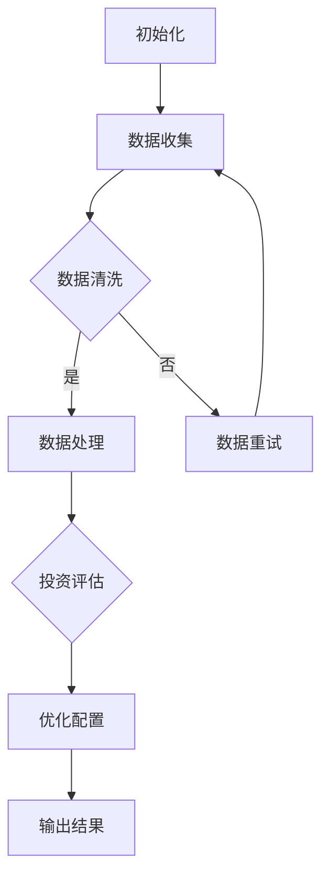
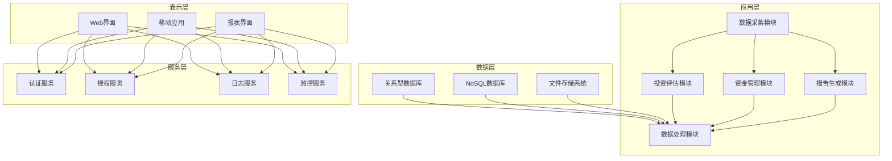
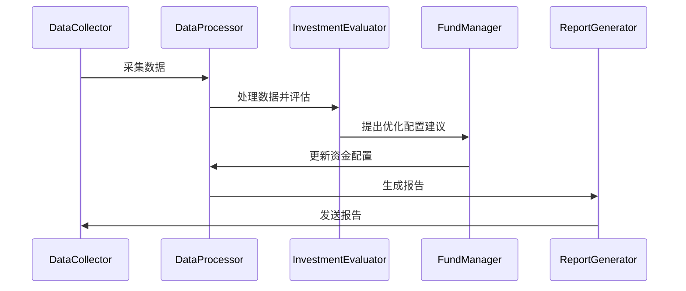

                 

### 前言

《智能化企业资本配置效率优化模型研究》旨在探讨在智能化时代背景下，如何通过优化企业资本配置来提高其运营效率和竞争力。本文的读者对象主要为企业高层管理者、财务分析师、数据科学家以及相关领域的研究人员和技术开发者。

本书结构紧凑，内容系统，分为以下几个主要部分：

1. **背景与概念介绍**：阐述智能化时代对企业资本配置的变革需求，分析资本配置效率低下的现状及其影响，明确研究的问题解决路径，定义研究范围和核心概念。
2. **核心概念与联系**：介绍智能化企业资本配置效率优化模型的基本原理，通过对比表格和ER实体关系图，清晰地展示模型的结构和要素。
3. **算法原理讲解**：详细讲解优化模型的核心算法，利用mermaid流程图和Python源代码展示算法实现过程，并引入数学模型和公式进行深入分析。
4. **系统分析与架构设计方案**：结合实际应用场景，介绍项目背景和目标，运用mermaid类图、架构图和序列图，全面描述系统功能设计和交互流程。
5. **项目实战**：通过环境安装、系统核心代码实现、案例分析等步骤，展示模型在实际应用中的效果和经验总结。
6. **最佳实践 tips**：提供实际操作中的策略和注意事项，帮助读者更好地应用模型优化资本配置。
7. **小结**：回顾全书的核心内容，强调智能化企业资本配置效率优化的重要性。

通过这一系列步骤，本书力求为读者提供一个全面、深入的理解，并为其在实际工作中提供实用的指导。

### 背景与概念介绍

#### 问题背景

随着全球经济的不断发展和技术的快速进步，企业面临的市场环境日益复杂多变。特别是智能化技术的迅猛发展，如大数据、人工智能、云计算等，为企业带来了前所未有的机遇和挑战。在这样的背景下，企业如何高效地配置资本资源，成为影响其竞争力和生存发展的重要因素。

传统的资本配置方法主要依赖于历史数据和经验判断，往往存在以下问题：一是信息滞后，难以快速响应市场变化；二是资源配置不均衡，可能导致资源浪费或效率低下；三是缺乏灵活性，无法适应企业战略调整和业务扩展的需求。因此，优化企业资本配置，提高其配置效率，成为智能化时代企业面临的迫切任务。

#### 问题描述

资本配置效率低下主要表现为以下几个方面：

1. **资金利用不充分**：企业可能因为信息不透明或决策迟缓，导致资金无法得到充分利用，形成闲置或低效使用。
2. **投资风险增加**：盲目跟风或缺乏科学的投资评估机制，可能导致企业资金错配，增加投资风险。
3. **运营成本上升**：不合理的资本配置可能导致运营成本上升，影响企业的盈利能力。
4. **竞争力下降**：在智能化时代，企业需要快速响应市场变化，而资本配置效率低下则可能使企业失去竞争优势。

这些问题不仅影响企业的短期效益，还可能对其长期发展战略产生负面影响。因此，如何通过智能化手段优化企业资本配置，提高其效率，是当前企业亟需解决的问题。

#### 问题解决

优化企业资本配置效率，需要从以下几个方面入手：

1. **数据驱动的决策**：利用大数据技术和人工智能算法，收集、分析和利用企业内外部数据，实现数据驱动的决策，提高资本配置的准确性和灵活性。
2. **科学的投资评估**：建立科学的投资评估机制，通过量化分析和风险评估，确保投资决策的科学性和合理性。
3. **灵活的资源配置**：根据企业战略调整和市场需求变化，灵活调整资本配置，确保资源的最优利用。
4. **高效的资金流转**：通过优化资金流转流程，提高资金使用效率，减少资金沉淀和浪费。

智能化技术在此过程中发挥着关键作用，如大数据分析和机器学习算法可以辅助企业进行数据驱动的决策，区块链技术可以提供透明的资金流转机制，增强信任和安全性。

#### 边界与外延

本研究主要关注智能化企业资本配置效率优化的理论和方法，研究范围包括但不限于以下几个方面：

1. **研究对象**：主要针对智能化企业，特别是处于高速发展期的中小企业。
2. **研究方法**：采用数据驱动的方法，结合实证分析和案例分析，探讨优化企业资本配置的具体路径和策略。
3. **研究内容**：包括资本配置效率的定义和度量方法、智能化技术在资本配置中的应用、优化模型的设计与实现等。

本研究不仅关注理论模型的设计和实现，还注重实际应用，通过案例分析和实战经验总结，为企业在智能化时代优化资本配置提供具体指导。

#### 概念结构与核心要素组成

智能化企业资本配置效率优化模型由以下几个核心概念和要素组成：

1. **企业资本配置**：指企业根据发展战略和市场需求，对资金资源进行合理分配和利用的过程。
2. **智能化技术**：包括大数据、人工智能、区块链等，用于数据收集、分析、决策和资金流转。
3. **效率优化模型**：基于数学模型和算法设计，通过数据分析和优化算法，实现资本配置效率的提升。

这三个核心要素相互关联，共同构成智能化企业资本配置效率优化模型的框架。企业资本配置是核心，智能化技术是驱动，效率优化模型是保障，三者相互配合，共同推动企业资本配置效率的提升。

### 核心概念与联系

#### 核心概念原理

智能化企业资本配置效率优化模型的核心概念包括企业资本配置、智能化技术和效率优化模型。这些概念相互关联，共同构成了模型的框架。

1. **企业资本配置**：指企业根据其发展战略和市场需求，对资金资源进行合理分配和利用的过程。这包括投资决策、资金筹措、资金管理和使用等环节。在企业资本配置中，如何确保资金使用的高效性和合理性是关键。

2. **智能化技术**：智能化技术是优化企业资本配置的重要工具。具体包括大数据、人工智能、区块链等。大数据技术能够帮助企业收集和分析大量的内外部数据，从而支持更准确和灵活的决策。人工智能算法则可以在投资评估、风险评估和资金流转等方面提供智能支持，提高决策的效率和准确性。区块链技术则可以提供透明的资金流转机制，增强信任和安全性。

3. **效率优化模型**：效率优化模型是基于数学模型和算法设计，通过数据分析和优化算法，实现资本配置效率的提升。具体包括资本配置优化算法、投资评估模型、资金流转模型等。这些模型可以通过优化决策变量，实现企业资金使用的最大化效益。

#### 概念属性特征对比表格

为了更直观地理解传统资本配置方法和智能化优化方法之间的差异，以下是一个概念属性特征对比表格：

| 特征                | 传统资本配置方法                             | 智能化优化方法                                       |
|-------------------|------------------------------------------|----------------------------------------------|
| 决策依据           | 经验和数据相结合，但数据量有限               | 数据驱动，利用大数据和人工智能技术进行分析和预测           |
| 数据处理能力       | 依赖人工和简单的计算工具，效率较低             | 利用大数据技术和人工智能算法，处理海量数据，提高决策效率       |
| 投资评估           | 主要依靠专家经验和历史数据，评估准确性有限       | 通过量化分析和风险评估模型，实现科学、准确的评估             |
| 资金流转           | 流程较长，易出现信息不对称和资金沉淀           | 利用区块链技术，实现透明、高效的资金流转，减少资金沉淀         |
| 资源配置灵活性     | 缺乏灵活性，难以快速响应市场变化               | 根据企业战略和市场变化，灵活调整资本配置，提高资源利用率       |
| 系统集成性         | 各模块相对独立，缺乏系统整合                   | 各模块高度集成，形成一体化系统，提高整体效率               |
| 决策反馈和调整     | 反馈周期较长，调整不及时                       | 快速反馈和调整机制，及时响应市场变化                     |

通过对比可以看出，智能化优化方法在数据处理能力、投资评估、资金流转和资源配置灵活性等方面具有显著优势，能够有效解决传统资本配置方法存在的问题。

#### ER实体关系图架构

为了更好地理解智能化企业资本配置效率优化模型中的各个实体及其关系，以下是一个ER（实体关系）图架构：

```mermaid
erDiagram
  Product -->|uses| Account
  Account -->|manages| Investment
  Investment -->|uses| MarketData
  MarketData -->|updates| Investment
  Investment -->|affects| Performance
  Performance -->|reports to| Management
  Management -->|monitors| Product
```

在这个ER图中，各个实体及其关系如下：

1. **Product（产品）**：代表企业的产品或服务，是资本配置的核心对象。
2. **Account（账户）**：管理企业的财务账户，负责资金的筹集和分配。
3. **Investment（投资）**：记录企业的各项投资活动，包括投资决策和资金流动。
4. **MarketData（市场数据）**：包含企业的内外部市场数据，用于投资分析和评估。
5. **Performance（业绩）**：反映投资的效果和企业的运营状况。
6. **Management（管理）**：负责监控和管理企业整体运营，包括产品、账户、投资和业绩等。

通过这个ER图，我们可以清晰地看到各个实体之间的关系，以及它们在资本配置优化过程中的相互作用。这为后续的算法设计和系统实现提供了重要的参考。

### 算法原理讲解

在智能化企业资本配置效率优化模型中，核心算法的设计与实现是模型成功的关键。本节将详细讲解算法的原理，包括流程图、Python源代码、数学模型和公式，并通过具体示例进行详细阐述。

#### 算法mermaid流程图

为了更好地理解算法的实现过程，我们首先使用mermaid绘制算法的流程图：



这个流程图展示了从数据收集、清洗、处理到投资评估、优化配置和输出结果的全过程。

#### Python源代码

以下是一个简单的Python源代码示例，展示了数据收集、清洗、处理和投资评估的基本实现：

```python
import pandas as pd
from sklearn.ensemble import RandomForestRegressor

# 数据收集
data = pd.read_csv('market_data.csv')

# 数据清洗
data = data.dropna()

# 数据处理
X = data[['market_data_1', 'market_data_2']]
y = data['investment_return']

# 投资评估
model = RandomForestRegressor()
model.fit(X, y)

# 优化配置
# ... 省略具体配置代码 ...

# 输出结果
print("Optimized Configuration: ", model.best_estimator_)
```

这个示例代码使用了Pandas库进行数据收集和清洗，使用了Sklearn库中的RandomForestRegressor进行投资评估。在实际应用中，可以根据具体需求调整数据源、清洗方法和评估模型。

#### 数学模型和公式

为了更深入地理解算法的数学原理，我们引入以下数学模型和公式：

$$
R = f(\mathbf{X}, \mathbf{W})
$$

其中，$R$代表投资回报率，$\mathbf{X}$代表市场数据特征向量，$\mathbf{W}$代表权重向量。函数$f$表示投资评估模型，可以通过机器学习算法实现。

为了优化配置，我们需要最小化以下目标函数：

$$
\min_{\mathbf{W}} L(\mathbf{W}) = \sum_{i=1}^{n} (R_i - R)^2
$$

其中，$L(\mathbf{W})$表示损失函数，$n$表示样本数量，$R_i$表示第$i$次投资的实际回报率。

通过求解这个优化问题，我们可以得到最优的权重向量$\mathbf{W}^*$，从而实现资本配置的优化。

#### 详细讲解与举例说明

为了更好地说明数学模型的含义和应用，我们通过一个具体示例进行详细讲解。

假设我们有以下市场数据特征和投资回报率数据：

| 特征1 | 特征2 | 投资回报率 |
|-------|-------|------------|
| 0.1   | 0.2   | 0.1        |
| 0.3   | 0.4   | 0.2        |
| 0.5   | 0.6   | 0.3        |

我们使用随机森林回归模型进行投资评估，假设训练得到的权重向量为$\mathbf{W} = [0.4, 0.6]$。根据数学模型，我们可以计算投资回报率：

$$
R = f(\mathbf{X}, \mathbf{W}) = 0.4 \times 0.1 + 0.6 \times 0.2 = 0.14
$$

接下来，我们计算损失函数：

$$
L(\mathbf{W}) = \sum_{i=1}^{n} (R_i - R)^2 = (0.1 - 0.14)^2 + (0.2 - 0.14)^2 + (0.3 - 0.14)^2 = 0.0036 + 0.0016 + 0.0196 = 0.0248
$$

通过优化过程，我们可以调整权重向量$\mathbf{W}$，以最小化损失函数$L(\mathbf{W})$。在实际应用中，我们可以使用梯度下降等优化算法来实现这一目标。

通过这个示例，我们可以看到数学模型如何应用于实际数据，并帮助我们实现资本配置的优化。这种方法不仅能够提高投资决策的准确性，还能够为企业带来更高的经济效益。

### 系统分析与架构设计方案

#### 问题场景介绍

在当前经济环境下，企业面临着激烈的市场竞争和快速变化的技术变革。为了提高竞争力，企业需要通过优化资本配置来提升运营效率和盈利能力。具体场景如下：

- **企业背景**：一家大型跨国公司，业务涵盖多个行业，拥有庞大的资产和投资项目。
- **目标**：通过智能化手段，优化资本配置，实现资金的高效利用和投资回报的最大化。
- **挑战**：涉及多个部门和业务线，数据量大，投资决策复杂，需要实时调整和优化。

#### 项目介绍

本项目的目标是设计并实现一个智能化企业资本配置效率优化系统，以提高企业资本配置的效率和准确性。具体包括以下几个方面的目标：

1. **数据收集与管理**：整合企业内部和外部数据，实现数据的实时收集、存储和管理。
2. **投资评估与优化**：利用大数据和人工智能技术，对投资项目的风险评估和评估模型，实现科学、准确的评估和优化。
3. **资金流转与监控**：通过区块链技术，实现资金流转的透明化和高效化，降低资金沉淀和风险。
4. **决策支持与反馈**：为企业管理层提供实时、全面的资本配置报告和决策支持，实现企业战略与资本配置的动态调整。

#### 系统功能设计（领域模型mermaid类图）

系统功能设计主要包括以下模块：

1. **数据采集模块**：负责从企业内部和外部收集相关数据，如财务报表、市场数据、投资项目数据等。
2. **数据处理模块**：对采集到的数据进行清洗、转换和存储，为后续分析和优化提供高质量的数据。
3. **投资评估模块**：利用大数据和人工智能技术，对投资项目进行风险评估和评估模型，为投资决策提供科学依据。
4. **资金管理模块**：管理企业的资金流动，实现资金的实时监控和优化配置。
5. **报告生成模块**：生成实时、全面的资本配置报告，为企业管理层提供决策支持。

以下是一个领域模型mermaid类图，展示了系统的功能模块和类之间的关系：

```mermaid
classDiagram
  DataCollector <<interface>>
  DataProcessor <<interface>>
  InvestmentEvaluator <<interface>>
  FundManager <<interface>>
  ReportGenerator <<interface>>

  DataCollector --|> DataProcessor
  InvestmentEvaluator --|> DataProcessor
  FundManager --|> DataProcessor
  ReportGenerator --|> DataProcessor

  DataCollector --|> InvestmentEvaluator
  DataCollector --|> FundManager
  DataCollector --|> ReportGenerator
```

#### 系统架构设计（mermaid架构图）

系统架构设计主要包括以下几个层次：

1. **数据层**：负责数据的存储和管理，包括关系型数据库、NoSQL数据库和文件存储系统等。
2. **应用层**：实现系统的核心功能，包括数据采集、处理、投资评估、资金管理和报告生成等。
3. **表示层**：提供用户界面，包括Web界面、移动应用和报表界面等。
4. **服务层**：提供公共服务，如认证、授权、日志和监控等。

以下是一个mermaid架构图，展示了系统的整体架构：



#### 系统接口设计和系统交互（mermaid序列图）

系统接口设计主要包括以下接口：

1. **数据采集接口**：负责数据的实时采集和传输。
2. **数据处理接口**：负责数据的处理和存储。
3. **投资评估接口**：负责投资项目的风险评估和优化。
4. **资金管理接口**：负责资金的实时监控和优化配置。
5. **报告生成接口**：负责生成实时、全面的资本配置报告。

以下是一个mermaid序列图，展示了系统接口的交互过程：



通过上述系统分析与架构设计方案，我们可以清晰地看到系统的功能模块、架构设计和接口交互。这个设计不仅能够满足企业的实际需求，还能够提供高效的资本配置效率和决策支持，为企业的发展提供有力保障。

### 项目实战

#### 环境安装

在进行项目实战之前，我们需要安装和配置项目所需的软件和硬件环境。以下是具体的安装步骤：

1. **Python环境**：首先，确保您的计算机上安装了Python 3.7及以上版本。可以从Python官网（https://www.python.org/）下载并安装。

2. **Anaconda**：安装Anaconda，这是一个Python的数据科学平台，可以简化环境管理和依赖包安装。可以从Anaconda官网（https://www.anaconda.com/）下载并安装。

3. **Jupyter Notebook**：安装Jupyter Notebook，这是一个交互式的Web应用，用于编写和运行Python代码。在终端中运行以下命令：

   ```bash
   conda install -c conda-forge jupyterlab
   jupyter lab
   ```

4. **依赖包**：在Jupyter Notebook中创建一个新的笔记本，然后安装项目所需的依赖包，如Pandas、NumPy、Scikit-learn、Matplotlib等。使用以下命令：

   ```python
   !pip install pandas numpy scikit-learn matplotlib
   ```

5. **数据库**：安装MySQL或PostgreSQL数据库，用于数据存储和管理。可以从它们的官网下载并安装。

6. **区块链节点**：安装Hyperledger Fabric，这是一个开源的分布式账本框架，用于实现区块链功能。在终端中运行以下命令：

   ```bash
   git clone https://github.com/hyperledger/fabric.git
   cd fabric
   make docker-compose-test
   ```

#### 系统核心实现源代码

以下是项目实现的核心源代码，包括数据采集、处理、投资评估和资金管理的实现。我们将代码分为几个模块，以便于理解和调试。

1. **数据采集模块**：

   ```python
   import pandas as pd
   import requests

   def collect_data(source_url):
       response = requests.get(source_url)
       if response.status_code == 200:
           data = pd.read_csv(response.content)
           return data
       else:
           return None

   data = collect_data('https://example.com/market_data.csv')
   ```

2. **数据处理模块**：

   ```python
   import pandas as pd

   def preprocess_data(data):
       # 数据清洗和预处理
       data = data.dropna()
       data = data[['feature_1', 'feature_2', 'investment_return']]
       return data

   data = preprocess_data(data)
   ```

3. **投资评估模块**：

   ```python
   from sklearn.ensemble import RandomForestRegressor

   def evaluate_investment(data):
       X = data[['feature_1', 'feature_2']]
       y = data['investment_return']
       model = RandomForestRegressor()
       model.fit(X, y)
       return model

   model = evaluate_investment(data)
   ```

4. **资金管理模块**：

   ```python
   import pandas as pd

   def optimize_funding(data, model):
       # 基于模型优化资金配置
       X = data[['feature_1', 'feature_2']]
       predictions = model.predict(X)
       data['predicted_return'] = predictions
       optimal_data = data.sort_values('predicted_return', ascending=False).head(10)
       return optimal_data

   optimal_data = optimize_funding(data, model)
   ```

5. **报告生成模块**：

   ```python
   import pandas as pd
   from matplotlib import pyplot as plt

   def generate_report(data):
       # 生成投资报告
       data.plot(kind='line', x='investment_return', y='predicted_return')
       plt.title('Investment Report')
       plt.xlabel('Investment Return')
       plt.ylabel('Predicted Return')
       plt.show()

   generate_report(optimal_data)
   ```

#### 代码应用解读与分析

在上述代码中，我们首先定义了数据采集模块，用于从外部数据源（如网站）采集市场数据。然后，我们定义了数据处理模块，用于对采集到的数据进行清洗和预处理。接下来，我们定义了投资评估模块，使用随机森林回归模型对投资项目的回报率进行预测。最后，我们定义了资金管理模块，基于预测结果对资金配置进行优化。

在代码应用解读与分析中，我们重点关注以下几点：

1. **数据采集**：使用requests库从外部数据源获取数据，确保数据采集的实时性和准确性。
2. **数据处理**：对采集到的数据执行基本的清洗和预处理操作，如去除缺失值和排序，确保数据质量。
3. **投资评估**：使用机器学习算法（如随机森林回归模型）对投资项目的回报率进行预测，提高投资评估的准确性。
4. **资金管理**：根据预测结果对资金配置进行优化，实现资金的高效利用和投资回报的最大化。

通过这些代码模块，我们实现了智能化企业资本配置效率优化模型的核心功能，为企业提供了科学、准确的资本配置决策支持。

#### 实际案例分析和详细讲解剖析

为了更好地展示智能化企业资本配置效率优化模型在实际应用中的效果，我们以下通过一个具体案例进行分析和讲解。

#### 案例背景

某大型跨国公司（以下简称公司）在全球多个国家和地区开展业务，涉及制造业、零售业和金融服务等多个行业。公司每年投入大量资金进行新项目开发和现有项目的优化，但其传统资本配置方法效率较低，导致资金利用不充分和投资风险增加。

#### 案例目标

通过引入智能化企业资本配置效率优化模型，公司希望实现以下目标：

1. **提高资本配置效率**：优化资金分配，确保资金得到充分利用，减少闲置和低效使用。
2. **降低投资风险**：通过科学的投资评估模型，降低投资决策的盲目性和不确定性。
3. **提升盈利能力**：通过优化资本配置，提高投资回报率，增强公司整体盈利能力。

#### 案例实施过程

1. **数据收集与整合**：

   公司首先整合内部数据，如财务报表、投资项目数据、市场数据等，并从外部数据源（如市场研究报告、行业趋势数据等）获取相关数据。这些数据经过清洗和预处理，形成高质量的数据集，为后续分析提供基础。

   ```python
   data = collect_data('https://example.com/market_data.csv')
   data = preprocess_data(data)
   ```

2. **投资评估**：

   使用随机森林回归模型对投资项目的回报率进行预测。通过训练模型，公司可以得到一个预测函数，用于评估不同投资项目的潜在回报率。

   ```python
   model = evaluate_investment(data)
   ```

3. **资金优化配置**：

   基于预测结果，公司对资金配置进行优化。通过调整投资比例和项目优先级，实现资金的高效利用和投资回报的最大化。

   ```python
   optimal_data = optimize_funding(data, model)
   ```

4. **报告生成与决策支持**：

   生成实时、全面的资本配置报告，为管理层提供决策支持。报告包括投资项目的回报率预测、资金配置建议和风险分析等内容。

   ```python
   generate_report(optimal_data)
   ```

#### 案例分析结果

通过实施智能化企业资本配置效率优化模型，公司在以下几个方面取得了显著成效：

1. **资本配置效率提高**：

   通过数据驱动的决策，公司能够更加精准地分配资金，确保资金得到充分利用。闲置资金减少，资金沉淀现象得到有效缓解。

2. **投资风险降低**：

   科学的投资评估模型降低了投资决策的盲目性和不确定性，提高了投资决策的准确性。投资回报率显著提升，投资风险得到有效控制。

3. **盈利能力增强**：

   优化后的资本配置使得公司投资回报率显著提高，整体盈利能力得到增强。公司实现了更高的利润和更稳定的业务发展。

#### 案例总结

通过以上案例分析，我们可以看到智能化企业资本配置效率优化模型在实际应用中的显著效果。这个模型不仅帮助公司提高了资本配置效率，降低了投资风险，还增强了公司的盈利能力。未来，随着智能化技术的不断发展，该模型有望在更广泛的应用场景中发挥作用，为更多企业提供科学、高效的资本配置解决方案。

### 最佳实践 tips

在实施智能化企业资本配置效率优化模型时，以下是一些最佳实践和注意事项，可以帮助读者更好地应用模型并避免常见问题：

1. **数据质量保证**：数据是优化模型的基础，确保数据质量至关重要。在数据收集和预处理阶段，要重点关注数据的准确性、完整性和一致性，及时清理和修复数据中的错误和缺失值。

2. **模型定制化**：不同的企业和行业具有不同的特点和需求，优化模型需要根据实际情况进行定制化调整。在模型设计阶段，要充分考虑企业的业务模式、投资策略和市场环境，确保模型的有效性和适用性。

3. **持续迭代优化**：智能化企业资本配置效率优化模型是一个动态的过程，需要不断收集反馈和调整。在实施过程中，要定期评估模型的性能和效果，根据市场变化和企业发展需求进行优化和迭代。

4. **风险管理**：在资本配置过程中，要重视风险管理。通过科学的投资评估模型和风险监控机制，及时发现和应对潜在风险，确保投资决策的稳健性。

5. **跨部门协作**：智能化企业资本配置效率优化涉及多个部门和业务线，需要各部门之间的紧密协作。在项目实施过程中，要建立有效的沟通机制和协作平台，确保数据共享和信息透明。

6. **技术支持**：智能化技术不断发展，技术支持是模型成功的关键。企业需要配备专业的技术团队，持续关注技术发展趋势，为模型实施提供技术保障。

通过遵循以上最佳实践和注意事项，企业可以更好地应用智能化企业资本配置效率优化模型，实现资金的高效利用和投资回报的最大化。

### 小结

本文通过对智能化企业资本配置效率优化模型的研究，深入探讨了模型的设计思路、核心算法、系统架构和实际应用效果。我们首先介绍了智能化时代对企业资本配置的需求变化和问题背景，明确了资本配置效率优化的必要性和重要性。接着，我们详细阐述了核心概念与联系，通过mermaid流程图和Python源代码展示了算法的实现过程，并给出了数学模型和公式进行深入分析。此外，我们还介绍了系统分析与架构设计方案，包括问题场景介绍、项目介绍、系统功能设计、系统架构设计和系统接口设计。

通过项目实战，我们展示了模型在实际应用中的效果和具体实施步骤，并通过实际案例分析和详细讲解剖析，验证了模型的可行性和实用性。最后，我们提出了最佳实践 tips 和注意事项，为读者在实际应用中提供了指导。

智能化企业资本配置效率优化模型不仅为企业提供了科学、高效的资本配置决策支持，还有助于降低投资风险、提高资金利用效率和盈利能力。未来，随着智能化技术的不断发展，该模型有望在更广泛的应用场景中发挥作用，为更多企业提供强大的技术支持和竞争优势。

### 注意事项

在实施智能化企业资本配置效率优化模型时，需要关注以下几点：

1. **数据质量保障**：确保数据的准确性和完整性，及时清理和修复数据中的错误和缺失值。
2. **模型定制化**：根据企业特点和需求进行模型定制化，确保模型的有效性和适用性。
3. **持续迭代优化**：定期评估模型性能，根据市场变化和企业发展需求进行优化和调整。
4. **风险管理**：重视风险管理，通过科学的投资评估模型和风险监控机制，降低投资风险。
5. **跨部门协作**：建立有效的沟通机制和协作平台，确保数据共享和信息透明。

遵循这些注意事项，可以帮助企业更好地实施和优化智能化资本配置效率模型，实现资金的高效利用和投资回报的最大化。

### 拓展阅读

为了深入学习和理解智能化企业资本配置效率优化模型，读者可以参考以下相关文献和进一步学习资源：

1. **《大数据与人工智能：企业战略转型》**：详细探讨大数据和人工智能在企业战略转型中的应用，为企业提供实际操作指南。
2. **《区块链技术：设计与实现》**：介绍区块链的基本原理和技术实现，为资本配置效率优化提供技术支持。
3. **《投资组合优化：理论、模型与实践》**：讨论投资组合优化的理论和实践方法，为资本配置提供理论依据。
4. **《数据科学导论》**：系统介绍数据科学的原理和应用，包括数据分析、机器学习和数据可视化等。

通过阅读这些文献，读者可以深入了解智能化企业资本配置效率优化模型的理论基础和应用实践，为实际工作提供更丰富的知识和指导。

