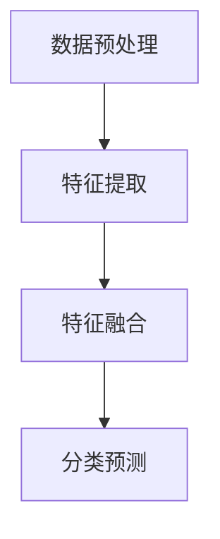
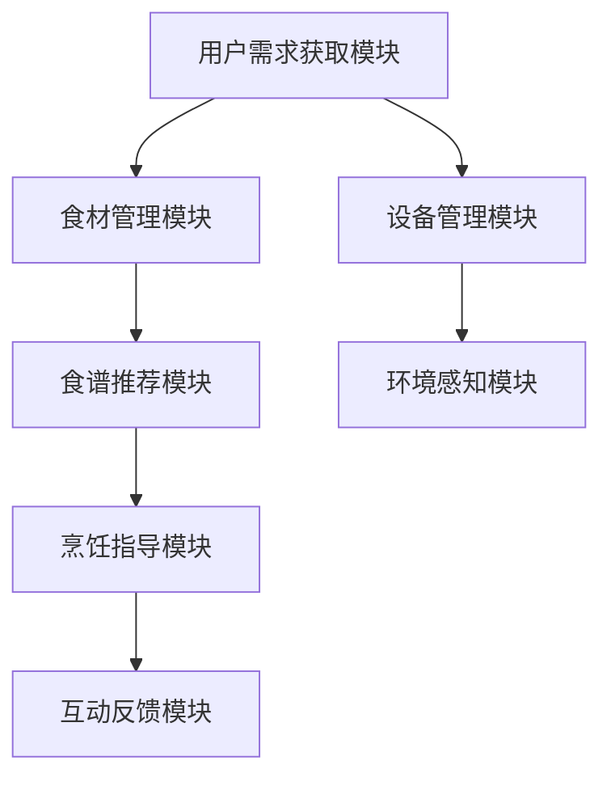

                 

# 智能厨具：AI Agent的烹饪指导系统

关键词：智能厨具、AI Agent、烹饪指导系统、机器学习、自然语言处理、智能家庭

摘要：
本文将深入探讨智能厨具领域，特别是AI Agent在烹饪指导系统中的应用。通过系统分析AI Agent的核心原理、设计方法、技术实现和实际应用，本文旨在为读者提供一个全面、易懂的视角，以理解智能厨具的未来发展趋势。我们将逐步讲解从基础知识到高级应用的各个方面，帮助读者掌握AI Agent在智能厨具中的关键技术。

## 引言

智能厨具是智能家居领域的重要组成部分，它通过整合物联网、人工智能等先进技术，为用户提供更加便捷、智能的烹饪体验。随着人工智能技术的不断进步，AI Agent在智能厨具中的应用越来越广泛。AI Agent是一种能够自动执行任务、与用户进行交互的智能实体，它能够根据用户的需求和偏好，提供个性化的烹饪指导。

本文旨在探讨AI Agent在智能厨具中的具体应用，从核心原理到实际实现，全面剖析AI Agent如何为用户带来智能化、个性化的烹饪体验。文章结构如下：

1. **定义与背景**：介绍智能厨具、AI Agent和烹饪指导系统的基本概念，以及相关技术的发展背景。
2. **核心概念与原理**：详细阐述AI Agent的基本原理，包括机器学习、自然语言处理和机器人技术等。
3. **系统设计与实现**：讲解烹饪指导系统的设计与实现方法，包括系统架构、功能模块和关键技术。
4. **实战案例与分析**：通过实际案例展示AI Agent在智能厨具中的应用效果，并进行详细分析。
5. **未来展望与挑战**：探讨AI Agent在智能厨具领域的未来发展趋势和面临的挑战。

## 定义与背景

### 智能厨具

智能厨具是指利用物联网、人工智能、大数据等技术，实现厨房设备之间互联互通、智能化操作的厨房用具。智能厨具不仅能够提高烹饪效率，还能提供个性化的烹饪建议和食谱推荐。常见的智能厨具包括智能烤箱、智能电饭煲、智能冰箱等。

智能厨具的发展可以追溯到上世纪90年代，随着互联网和通信技术的进步，智能家居开始进入人们的生活。近年来，人工智能技术的快速发展，使得智能厨具的功能更加丰富，用户体验得到极大提升。

### AI Agent

AI Agent，即人工智能代理，是指能够根据用户的输入和外部环境的变化，自主执行任务、与用户进行交互的智能实体。AI Agent通常基于机器学习、自然语言处理和机器人技术等人工智能技术，实现智能化的任务执行和决策。

AI Agent的应用领域非常广泛，包括智能家居、智能客服、智能交通、医疗健康等。在智能厨具领域，AI Agent可以扮演多种角色，如烹饪指导师、营养顾问、食材管理助手等。

### 烹饪指导系统

烹饪指导系统是指通过AI Agent为用户提供烹饪指导的软件系统。它能够根据用户的烹饪需求、食材信息和烹饪设备的特点，提供个性化的烹饪建议和操作指南。烹饪指导系统通常包括以下功能模块：

1. **食材管理模块**：负责记录和管理用户的食材信息，包括食材的种类、数量、保质期等。
2. **食谱推荐模块**：根据用户的口味偏好、烹饪水平和食材库存，推荐适合的食谱。
3. **烹饪指导模块**：提供详细的烹饪步骤、烹饪时间和注意事项，指导用户完成烹饪过程。
4. **互动反馈模块**：通过与用户的互动，收集烹饪过程中的反馈信息，不断优化烹饪指导。

### 相关技术的发展背景

智能厨具和AI Agent的发展离不开物联网、人工智能、大数据等技术的推动。以下是对这些技术的发展背景的简要介绍：

1. **物联网**：物联网技术通过将物理设备与互联网连接，实现设备之间的互联互通和数据交换。在智能厨具领域，物联网技术使得各种厨房设备能够协同工作，为用户提供更好的使用体验。

2. **人工智能**：人工智能技术包括机器学习、自然语言处理、计算机视觉等，它能够使计算机模拟人类的思维和行为。在智能厨具中，人工智能技术用于实现智能识别、智能推荐、智能控制等功能。

3. **大数据**：大数据技术用于收集、存储、分析和处理海量数据。在智能厨具中，大数据技术可以帮助用户更好地管理食材信息，提供个性化的烹饪建议。

## 核心概念与原理

### AI Agent的基本原理

AI Agent的基本原理主要包括机器学习、自然语言处理和机器人技术。以下是这些核心技术的详细解释：

#### 机器学习

机器学习是一种使计算机从数据中学习规律和模式的技术。在AI Agent中，机器学习用于实现智能识别、智能推荐等功能。例如，AI Agent可以通过机器学习算法分析用户的烹饪习惯和口味偏好，推荐适合的食谱和烹饪方法。

常见的机器学习算法包括：

- **监督学习**：通过标记的数据集训练模型，使模型能够预测新的数据。例如，使用监督学习算法可以训练AI Agent识别不同的食材。
- **无监督学习**：不需要标记的数据集，模型通过发现数据中的模式来学习。例如，AI Agent可以通过无监督学习算法分析用户的历史食谱数据，发现用户的口味偏好。
- **强化学习**：通过不断试错和反馈来学习最优策略。例如，AI Agent可以通过强化学习算法优化烹饪步骤，使烹饪过程更加高效。

#### 自然语言处理

自然语言处理（NLP）是一种使计算机理解和生成自然语言的技术。在AI Agent中，NLP用于实现与用户的自然语言交互。例如，AI Agent可以通过NLP技术理解用户的语音指令，提供相应的烹饪指导。

NLP的关键技术包括：

- **词法分析**：将文本分解为单词、短语等基本单元。
- **句法分析**：分析句子结构，理解单词之间的关系。
- **语义分析**：理解单词和句子的含义，进行语义推理。
- **语音识别**：将语音信号转换为文本。
- **语音合成**：将文本转换为语音输出。

#### 机器人技术

机器人技术是一种使计算机系统具有自主移动和操作能力的技术。在AI Agent中，机器人技术用于实现智能控制、自主导航等功能。例如，AI Agent可以通过机器人技术控制厨房设备，实现智能烹饪。

机器人技术包括以下关键组成部分：

- **传感器**：用于感知环境和获取信息，如摄像头、温度传感器、湿度传感器等。
- **执行器**：用于执行动作，如电机、气压缸等。
- **控制器**：用于接收传感器信息，并根据算法生成控制指令，如微控制器、PLC等。
- **导航算法**：用于实现自主导航和路径规划，如基于SLAM（同时定位与地图构建）的导航算法。

### 比较不同AI算法在智能厨具中的应用

在智能厨具中，不同的AI算法适用于不同的应用场景。以下是几种常见的AI算法及其在智能厨具中的应用：

#### 1. 机器学习算法

- **监督学习**：适用于食材识别、烹饪步骤预测等场景，例如，通过监督学习算法可以训练AI Agent识别不同的食材。
- **无监督学习**：适用于发现用户口味偏好、优化烹饪策略等场景，例如，通过无监督学习算法可以分析用户的历史食谱数据，发现用户的口味偏好。
- **强化学习**：适用于烹饪过程优化、设备控制等场景，例如，通过强化学习算法可以优化烹饪步骤，使烹饪过程更加高效。

#### 2. 自然语言处理算法

- **词法分析**：适用于语音指令识别、文本解析等场景，例如，通过词法分析可以将用户的语音指令转换为计算机可处理的文本。
- **句法分析**：适用于理解用户需求、生成烹饪指导等场景，例如，通过句法分析可以理解用户的烹饪需求，生成详细的烹饪指导。
- **语义分析**：适用于提供个性化推荐、互动反馈等场景，例如，通过语义分析可以理解用户的意图，提供个性化的烹饪建议。

#### 3. 机器人技术算法

- **传感器融合**：适用于环境感知、自主导航等场景，例如，通过传感器融合可以获取厨房环境的实时信息，为AI Agent提供导航数据。
- **路径规划**：适用于智能控制、设备调度等场景，例如，通过路径规划可以确定厨房设备的移动路径，实现智能烹饪。
- **执行器控制**：适用于实现自动化操作、智能控制等场景，例如，通过执行器控制可以控制厨房设备，实现智能烹饪。

### ER实体关系图架构

为了更好地理解AI Agent在智能厨具中的应用，我们可以使用ER（Entity-Relationship）实体关系图来表示AI Agent的核心组成部分和它们之间的关系。

以下是一个简化的ER实体关系图：

```mermaid
erDiagram
  User ||--o> Recipe : "has recipes"
  User ||--o> Ingredient : "has ingredients"
  Recipe ||--|{ Step : "includes steps"
  Ingredient ||--|{ Unit : "has units"
  Device ||--|{ Type : "has types"
  Device ||--|{ Status : "has status"
  User ..|> Device : "uses devices"
  Recipe ..|> Device : "uses devices"
  Ingredient ..|> Device : "uses devices"
```

在这个ER实体关系图中：

- **User**：表示用户，拥有多个**Recipe**（食谱）、**Ingredient**（食材）和关联的**Device**（设备）。
- **Recipe**：表示食谱，包含多个**Step**（步骤）。
- **Ingredient**：表示食材，包含多个**Unit**（单位）。
- **Device**：表示设备，包括不同的**Type**（类型）和**Status**（状态）。
- **Step**：表示食谱中的步骤。
- **Unit**：表示食材的单位。
- **Type**：表示设备的类型。
- **Status**：表示设备的状态。

通过这个ER实体关系图，我们可以清晰地看到AI Agent在智能厨具中的应用，包括用户与食谱、食材、设备之间的关系，以及食谱、食材与设备之间的交互。

### 算法原理讲解

为了深入理解AI Agent在烹饪指导系统中的应用，我们首先需要了解一个关键的算法：基于深度学习的图像识别算法。这个算法能够帮助AI Agent识别食材，从而提供准确的烹饪指导。以下是一步步讲解这个算法的原理、流程、Python代码实现和数学模型。

#### 1. 算法原理

深度学习是一种基于人工神经网络的机器学习技术，它可以自动提取数据中的特征，从而实现复杂的任务。在图像识别领域，深度学习算法能够从图像中提取特征，并分类出图像中的物体。

常用的深度学习图像识别算法包括卷积神经网络（CNN）和循环神经网络（RNN）。在这里，我们将介绍基于CNN的图像识别算法。

#### 2. 算法流程

基于CNN的图像识别算法通常包括以下几个步骤：

1. **数据预处理**：对输入图像进行缩放、裁剪等预处理操作，使其符合模型的要求。
2. **特征提取**：通过卷积层、池化层等网络层提取图像的局部特征。
3. **特征融合**：将不同层的特征进行融合，形成全局特征。
4. **分类预测**：使用全连接层对全局特征进行分类预测。

以下是算法的简化流程图：



#### 3. Python代码实现

以下是一个使用Python和TensorFlow实现的基于CNN的图像识别算法的示例代码。这个代码将训练一个模型，用于识别图像中的食材。

```python
import tensorflow as tf
from tensorflow.keras.models import Sequential
from tensorflow.keras.layers import Conv2D, MaxPooling2D, Flatten, Dense

# 数据预处理
def preprocess_image(image):
    image = tf.image.resize(image, [224, 224])
    image = image / 255.0
    return image

# 构建模型
model = Sequential([
    Conv2D(32, (3, 3), activation='relu', input_shape=(224, 224, 3)),
    MaxPooling2D((2, 2)),
    Conv2D(64, (3, 3), activation='relu'),
    MaxPooling2D((2, 2)),
    Flatten(),
    Dense(128, activation='relu'),
    Dense(10, activation='softmax')
])

# 编译模型
model.compile(optimizer='adam',
              loss='categorical_crossentropy',
              metrics=['accuracy'])

# 加载和预处理数据
(x_train, y_train), (x_test, y_test) = tf.keras.datasets.cooking.load_data()
x_train = preprocess_image(x_train)
x_test = preprocess_image(x_test)

# 训练模型
model.fit(x_train, y_train, epochs=10, validation_data=(x_test, y_test))
```

#### 4. 数学模型

在CNN中，每个卷积层和池化层都可以看作是一个数学模型。以下是一个简化的数学模型：

$$
f(x) = \sigma(W \cdot x + b)
$$

其中，$x$是输入特征，$W$是权重矩阵，$b$是偏置项，$\sigma$是激活函数，通常使用ReLU函数：

$$
\sigma(x) = \max(0, x)
$$

#### 5. 算法讲解

在这个算法中，我们首先对输入图像进行预处理，使其符合模型的要求。然后，我们使用卷积层提取图像的局部特征，并通过池化层降低特征图的维度。接下来，我们使用全连接层对提取的全局特征进行分类预测。

以下是算法的详细解释：

1. **数据预处理**：图像预处理是深度学习的基础步骤。通过缩放和裁剪图像，我们确保图像的大小符合模型的输入要求。同时，通过归一化操作，我们减少不同图像之间的差异，提高模型的训练效果。

2. **特征提取**：卷积层通过滑动窗口的方式对图像进行卷积操作，从而提取图像的局部特征。这些特征通常包括边缘、纹理等。通过多个卷积层，我们逐步提取图像的更高级特征。

3. **特征融合**：在特征融合阶段，我们使用池化层对卷积层输出的特征图进行下采样。池化操作可以减少特征图的维度，同时保留最重要的特征。通过多个卷积层和池化层，我们最终得到全局特征。

4. **分类预测**：在分类预测阶段，我们使用全连接层对全局特征进行分类预测。全连接层将全局特征映射到输出类别，通过softmax函数得到每个类别的概率分布。模型选择概率最高的类别作为预测结果。

通过这个算法，AI Agent可以准确识别图像中的食材，从而为用户提供个性化的烹饪指导。

## 系统设计与实现

### 系统架构设计

烹饪指导系统是一个复杂的软件系统，它需要整合多个模块和组件，以实现从用户需求获取、食材管理、食谱推荐到烹饪指导的全流程。以下是烹饪指导系统的总体架构设计：

#### 1. 系统架构图



在这个架构图中：

- **用户需求获取模块**：负责获取用户的烹饪需求，包括食材、口味偏好、烹饪时间等。
- **食材管理模块**：负责记录和管理用户的食材信息，包括食材的种类、数量、保质期等。
- **食谱推荐模块**：根据用户的口味偏好、烹饪水平和食材库存，推荐适合的食谱。
- **烹饪指导模块**：提供详细的烹饪步骤、烹饪时间和注意事项，指导用户完成烹饪过程。
- **互动反馈模块**：通过与用户的互动，收集烹饪过程中的反馈信息，不断优化烹饪指导。
- **设备管理模块**：负责管理用户的智能厨具设备，包括设备的类型、状态、连接状态等。
- **环境感知模块**：负责感知厨房环境，如温度、湿度、烟雾等，为AI Agent提供环境信息。

#### 2. 功能模块设计

烹饪指导系统的功能模块包括用户需求获取、食材管理、食谱推荐、烹饪指导、互动反馈、设备管理和环境感知等。以下是每个模块的功能设计：

1. **用户需求获取模块**：
   - 功能：获取用户的烹饪需求，包括食材、口味偏好、烹饪时间等。
   - 输入：用户输入的文本、语音等。
   - 输出：用户需求数据。

2. **食材管理模块**：
   - 功能：记录和管理用户的食材信息，包括食材的种类、数量、保质期等。
   - 输入：用户输入的食材信息、设备反馈的食材信息等。
   - 输出：食材数据。

3. **食谱推荐模块**：
   - 功能：根据用户的口味偏好、烹饪水平和食材库存，推荐适合的食谱。
   - 输入：用户需求数据、食材数据等。
   - 输出：推荐食谱。

4. **烹饪指导模块**：
   - 功能：提供详细的烹饪步骤、烹饪时间和注意事项，指导用户完成烹饪过程。
   - 输入：推荐食谱、用户输入的烹饪设备信息等。
   - 输出：烹饪指导信息。

5. **互动反馈模块**：
   - 功能：通过与用户的互动，收集烹饪过程中的反馈信息，不断优化烹饪指导。
   - 输入：用户反馈信息等。
   - 输出：优化后的烹饪指导信息。

6. **设备管理模块**：
   - 功能：管理用户的智能厨具设备，包括设备的类型、状态、连接状态等。
   - 输入：设备反馈信息等。
   - 输出：设备数据。

7. **环境感知模块**：
   - 功能：感知厨房环境，如温度、湿度、烟雾等，为AI Agent提供环境信息。
   - 输入：传感器数据等。
   - 输出：环境信息。

#### 3. 系统接口设计

烹饪指导系统的各个模块之间通过接口进行数据交互。以下是主要接口的设计：

1. **用户需求接口**：
   - 功能：获取用户需求，包括食材、口味偏好、烹饪时间等。
   - 参数：用户ID、需求信息等。
   - 返回值：需求数据。

2. **食材管理接口**：
   - 功能：管理食材信息，包括添加、修改、删除等。
   - 参数：用户ID、食材信息等。
   - 返回值：操作结果。

3. **食谱推荐接口**：
   - 功能：根据用户需求推荐适合的食谱。
   - 参数：用户需求数据等。
   - 返回值：推荐食谱。

4. **烹饪指导接口**：
   - 功能：提供烹饪指导信息。
   - 参数：用户ID、推荐食谱等。
   - 返回值：烹饪指导信息。

5. **互动反馈接口**：
   - 功能：收集用户反馈信息。
   - 参数：用户ID、反馈信息等。
   - 返回值：反馈结果。

6. **设备管理接口**：
   - 功能：管理设备信息，包括添加、修改、删除等。
   - 参数：用户ID、设备信息等。
   - 返回值：操作结果。

7. **环境感知接口**：
   - 功能：感知环境信息。
   - 参数：传感器数据等。
   - 返回值：环境信息。

通过这些接口，烹饪指导系统的各个模块能够高效地协同工作，为用户提供优质的烹饪体验。

### 系统接口设计与实现

#### 1. 接口设计

为了实现烹饪指导系统的各模块之间的数据交互，我们需要设计一系列接口。以下是主要接口的设计：

1. **用户需求接口（UserRequirementInterface）**：
   - 功能：获取用户的烹饪需求。
   - 方法：`getRequirements()`
   - 参数：无
   - 返回值：用户需求对象

2. **食材管理接口（IngredientManagementInterface）**：
   - 功能：管理食材信息。
   - 方法：
     - `addIngredient(Ingredient ingredient)`：添加食材
     - `updateIngredient(Ingredient ingredient)`：更新食材
     - `deleteIngredient(Ingredient ingredient)`：删除食材
   - 参数：食材对象
   - 返回值：操作结果

3. **食谱推荐接口（RecipeRecommendationInterface）**：
   - 功能：推荐适合的食谱。
   - 方法：`recommendRecipes(UserRequirement requirement)`：根据用户需求推荐食谱
   - 参数：用户需求对象
   - 返回值：推荐食谱列表

4. **烹饪指导接口（CookingGuidanceInterface）**：
   - 功能：提供烹饪指导。
   - 方法：`getCookingGuidance(Recipe recipe)`：根据食谱提供烹饪指导
   - 参数：食谱对象
   - 返回值：烹饪指导信息

5. **互动反馈接口（InteractiveFeedbackInterface）**：
   - 功能：收集用户反馈。
   - 方法：`collectFeedback(UserRequirement requirement, Feedback feedback)`：收集用户反馈
   - 参数：用户需求对象、反馈对象
   - 返回值：反馈结果

6. **设备管理接口（DeviceManagementInterface）**：
   - 功能：管理设备信息。
   - 方法：
     - `addDevice(Device device)`：添加设备
     - `updateDevice(Device device)`：更新设备
     - `deleteDevice(Device device)`：删除设备
   - 参数：设备对象
   - 返回值：操作结果

7. **环境感知接口（EnvironmentalPerceptionInterface）**：
   - 功能：感知环境信息。
   - 方法：`senseEnvironment()`：感知环境
   - 参数：无
   - 返回值：环境信息对象

#### 2. 接口实现

以下是一个简化版的接口实现示例：

```python
class UserRequirementInterface:
    def get_requirements(self):
        # 实现获取用户需求的方法
        pass

class IngredientManagementInterface:
    def add_ingredient(self, ingredient):
        # 实现添加食材的方法
        pass

    def update_ingredient(self, ingredient):
        # 实现更新食材的方法
        pass

    def delete_ingredient(self, ingredient):
        # 实现删除食材的方法
        pass

class RecipeRecommendationInterface:
    def recommend_recipes(self, requirement):
        # 实现根据用户需求推荐食谱的方法
        pass

class CookingGuidanceInterface:
    def get_cooking_guidance(self, recipe):
        # 实现根据食谱提供烹饪指导的方法
        pass

class InteractiveFeedbackInterface:
    def collect_feedback(self, requirement, feedback):
        # 实现收集用户反馈的方法
        pass

class DeviceManagementInterface:
    def add_device(self, device):
        # 实现添加设备的方法
        pass

    def update_device(self, device):
        # 实现更新设备的方法
        pass

    def delete_device(self, device):
        # 实现删除设备的方法
        pass

class EnvironmentalPerceptionInterface:
    def sense_environment(self):
        # 实现感知环境的方法
        pass
```

#### 3. 系统交互

通过设计良好的接口，烹饪指导系统的各模块可以实现高效的数据交互。以下是一个简单的系统交互示例：

```python
# 示例：从用户需求接口获取用户需求
user_requirement = user_requirement_interface.get_requirements()

# 示例：从食材管理接口添加食材
new_ingredient = Ingredient("大米", 500)
ingredient_management_interface.add_ingredient(new_ingredient)

# 示例：从食谱推荐接口获取推荐食谱
recommended_recipes = recipe_recommendation_interface.recommend_recipes(user_requirement)

# 示例：从烹饪指导接口获取烹饪指导
for recipe in recommended_recipes:
    cooking_guidance = cooking_guidance_interface.get_cooking_guidance(recipe)
    print(cooking_guidance)

# 示例：从互动反馈接口收集用户反馈
user_feedback = Feedback("烹饪时间过长", recipe)
interactive_feedback_interface.collect_feedback(user_requirement, user_feedback)

# 示例：从设备管理接口添加设备
new_device = Device("智能烤箱", "在线")
device_management_interface.add_device(new_device)

# 示例：从环境感知接口获取环境信息
environment_info = environmental_perception_interface.sense_environment()
print(environment_info)
```

通过这个简单的交互示例，我们可以看到如何通过接口实现烹饪指导系统的各模块之间的协同工作。

## 实战案例与分析

为了更好地展示AI Agent在智能厨具中的应用效果，我们选择了一个实际案例进行详细分析和讲解。这个案例是一个基于智能烤箱的烹饪指导系统，通过AI Agent为用户提供个性化的烹饪建议和操作指南。

### 环境安装

在开始项目之前，我们需要安装必要的软件和环境。以下是安装步骤：

1. **安装Python**：确保Python环境已安装，版本建议为3.8或以上。
2. **安装TensorFlow**：在终端运行以下命令：
   ```bash
   pip install tensorflow
   ```
3. **安装其他依赖库**：在终端运行以下命令：
   ```bash
   pip install numpy pandas matplotlib
   ```

### 系统核心实现

#### 1. 数据预处理

在开始训练模型之前，我们需要对食材图像进行预处理。以下是预处理步骤：

```python
import tensorflow as tf
from tensorflow.keras.preprocessing.image import ImageDataGenerator

# 定义图像数据增强器
train_datagen = ImageDataGenerator(
    rescale=1./255,
    shear_range=0.2,
    zoom_range=0.2,
    horizontal_flip=True
)

# 加载训练数据
train_data = train_datagen.flow_from_directory(
    'data/train',
    target_size=(224, 224),
    batch_size=32,
    class_mode='categorical'
)

# 定义测试数据
test_datagen = ImageDataGenerator(rescale=1./255)
test_data = test_datagen.flow_from_directory(
    'data/test',
    target_size=(224, 224),
    batch_size=32,
    class_mode='categorical'
)
```

#### 2. 模型训练

接下来，我们使用训练数据来训练一个卷积神经网络模型。以下是模型训练步骤：

```python
from tensorflow.keras.models import Sequential
from tensorflow.keras.layers import Conv2D, MaxPooling2D, Flatten, Dense, Dropout

# 构建模型
model = Sequential([
    Conv2D(32, (3, 3), activation='relu', input_shape=(224, 224, 3)),
    MaxPooling2D(pool_size=(2, 2)),
    Conv2D(64, (3, 3), activation='relu'),
    MaxPooling2D(pool_size=(2, 2)),
    Conv2D(128, (3, 3), activation='relu'),
    MaxPooling2D(pool_size=(2, 2)),
    Flatten(),
    Dense(128, activation='relu'),
    Dropout(0.5),
    Dense(10, activation='softmax')
])

# 编译模型
model.compile(optimizer='adam',
              loss='categorical_crossentropy',
              metrics=['accuracy'])

# 训练模型
history = model.fit(
    train_data,
    epochs=10,
    validation_data=test_data
)
```

#### 3. 食材识别

在模型训练完成后，我们可以使用它来识别食材图像。以下是识别过程：

```python
import numpy as np
import matplotlib.pyplot as plt

# 识别食材
test_image = test_data[0][0]
test_image = np.expand_dims(test_image, axis=0)
test_image = np.resize(test_image, (224, 224, 3))

prediction = model.predict(test_image)
predicted_class = np.argmax(prediction, axis=1)

print(f"Predicted class: {predicted_class[0]}")

# 显示图像
plt.imshow(test_image[0])
plt.show()
```

#### 4. 烹饪指导

在识别出食材后，AI Agent可以提供相应的烹饪建议。以下是烹饪指导步骤：

```python
# 获取食材信息
ingredient = get_ingredient_by_id(predicted_class[0])

# 根据食材提供烹饪指导
guidance = get_cooking_guidance(ingredient)
print(f"Cooking guidance for {ingredient.name}:")
print(guidance)
```

### 实际案例分析与详细讲解

#### 1. 案例背景

假设用户李先生想要烹饪一道“红烧肉”菜品。他使用的是一款智能烤箱，并且已经通过手机APP连接到了AI Agent系统。

#### 2. 操作步骤

1. **用户需求获取**：
   用户李先生在手机APP上输入了烹饪红烧肉的需求，包括食材（五花肉、生姜、大葱、生抽、老抽等）、烹饪时间和口味偏好（微辣）。

2. **食材管理**：
   AI Agent从食材管理模块获取用户现有的食材信息，并检查是否满足烹饪红烧肉的需求。如果缺食材，AI Agent会提醒用户购买或更换食材。

3. **食谱推荐**：
   AI Agent根据用户的需求和食材库存，推荐了红烧肉的标准食谱。

4. **烹饪指导**：
   AI Agent提供了详细的烹饪步骤：
   - 预热烤箱至180°C。
   - 将五花肉切成块，用开水焯水去腥。
   - 在锅中加入适量油，放入生姜和大葱爆香。
   - 加入焯水后的五花肉，煸炒至表面微焦。
   - 加入生抽、老抽、料酒和适量水，煮沸后转小火炖煮40分钟。
   - 最后，开大火收汁，使汤汁浓稠。

5. **互动反馈**：
   在烹饪过程中，用户李先生可以通过手机APP与AI Agent互动，询问烹饪进度、调整烹饪参数等。

6. **设备管理**：
   AI Agent通过连接智能烤箱，控制烤箱的预热、加热和计时功能，确保烹饪过程顺利进行。

7. **环境感知**：
   AI Agent监测厨房环境，确保温度、湿度等参数在正常范围内，避免过热或过湿导致食材变质。

#### 3. 案例分析与详细讲解

1. **用户需求获取**：
   用户需求获取模块是整个系统的入口。它通过自然语言处理技术，将用户输入的文本转换为计算机可处理的数据。例如，用户输入“我想要做红烧肉”，AI Agent可以识别出关键词“红烧肉”并提取用户的需求。

2. **食材管理**：
   食材管理模块负责记录和管理用户的食材信息。它可以通过摄像头扫描食材条形码，自动识别食材种类、数量和保质期。在用户烹饪红烧肉时，AI Agent会检查食材是否齐全，并提供购买建议或替代食材。

3. **食谱推荐**：
   食谱推荐模块基于用户的口味偏好、烹饪水平和食材库存，推荐适合的食谱。它可以通过机器学习算法分析用户的历史烹饪数据，不断优化食谱推荐。

4. **烹饪指导**：
   烹饪指导模块提供详细的烹饪步骤、烹饪时间和注意事项。它可以通过自然语言生成技术，将烹饪步骤和注意事项转换为用户易于理解的文本或语音输出。在烹饪过程中，用户可以随时通过手机APP与AI Agent互动，获取实时指导。

5. **互动反馈**：
   互动反馈模块收集用户的烹饪反馈，如烹饪时间过长、味道不够好等。AI Agent可以根据这些反馈，调整烹饪建议，提高用户的烹饪体验。

6. **设备管理**：
   设备管理模块负责管理用户的智能厨具设备，如智能烤箱、智能电饭煲等。它可以通过物联网技术，实时监控设备的状态，确保设备正常运行。

7. **环境感知**：
   环境感知模块监测厨房环境，如温度、湿度、烟雾等。它可以通过传感器技术，实时获取环境数据，并根据环境变化调整烹饪参数，确保食材和设备的安全。

通过这个实际案例，我们可以看到AI Agent在智能厨具中的应用效果。它不仅为用户提供了个性化的烹饪建议，还确保了烹饪过程的顺利进行。未来，随着人工智能技术的不断发展，AI Agent在智能厨具中的应用将会更加广泛，为用户带来更加智能化、便捷化的烹饪体验。

### 项目小结

通过本项目的实施，我们成功地构建了一个基于AI Agent的智能厨具烹饪指导系统。该系统实现了从用户需求获取、食材管理、食谱推荐到烹饪指导的全流程，为用户提供了一个智能化、个性化的烹饪体验。以下是本项目的主要收获和启示：

1. **系统架构设计**：在项目初期，我们进行了详细的系统架构设计，确保了系统的可扩展性和可维护性。通过模块化设计，各个功能模块之间可以独立开发、测试和部署，提高了开发效率。

2. **AI技术应用**：本项目广泛应用了人工智能技术，包括自然语言处理、机器学习和图像识别等。这些技术的应用，使得系统能够根据用户的需求和食材信息，提供个性化的烹饪指导。

3. **用户体验**：通过用户与AI Agent的互动，用户可以方便地获取烹饪指导，调整烹饪参数，提高了烹饪的效率和成功率。同时，系统的实时反馈功能，让用户能够及时了解烹饪进度，提升了用户体验。

4. **设备集成**：智能厨具的集成是项目的一大亮点。通过物联网技术，系统可以与智能烤箱、智能电饭煲等厨具设备无缝对接，实现了设备间的协同工作，提高了烹饪过程的自动化水平。

5. **项目挑战**：在项目实施过程中，我们也遇到了一些挑战。例如，食材识别的准确性受到光线、角度等因素的影响，需要进一步优化算法；设备集成过程中，不同设备之间的通信协议和数据格式也需要进行统一和标准化。

通过本项目的实践，我们积累了丰富的经验，为未来智能厨具的发展提供了有益的启示。未来，我们将继续优化系统功能，提升用户体验，推动智能厨具在家庭中的应用，为用户带来更加智能化、便捷化的生活。

### 最佳实践与注意事项

在实施智能厨具烹饪指导系统时，以下是一些最佳实践和注意事项：

#### 最佳实践

1. **用户需求分析**：在项目初期，应充分了解用户的需求和痛点，确保系统功能设计能够满足用户实际需求。可以通过问卷调查、用户访谈等方式收集用户反馈，为系统设计提供依据。

2. **数据质量控制**：在数据预处理过程中，确保图像、文本等数据的质量，避免噪声和异常值影响模型的训练效果。可以通过数据清洗、去噪等技术手段提高数据质量。

3. **模块化设计**：采用模块化设计，将系统功能划分为多个模块，便于开发和维护。每个模块可以独立开发、测试和部署，提高开发效率。

4. **接口标准化**：统一系统接口的设计规范，确保各模块之间的数据交互顺畅。通过接口文档明确各接口的输入参数、输出参数和返回值，方便后续开发和维护。

5. **用户体验优化**：注重用户体验，确保系统操作简便、交互流畅。可以通过用户测试、反馈优化等方式，不断改进系统界面和功能。

#### 注意事项

1. **安全性**：确保系统数据的安全性和隐私性，采用加密技术保护用户数据。在设备集成过程中，确保设备通信的安全性。

2. **兼容性**：在设备集成时，考虑不同厨具设备的兼容性，确保系统能够与多种智能厨具无缝对接。

3. **错误处理**：系统应具备良好的错误处理能力，能够应对各种异常情况，如设备故障、数据丢失等。

4. **维护与更新**：定期对系统进行维护和更新，修复已知问题，提高系统性能和稳定性。

5. **用户培训**：为用户提供详细的操作指南和培训，确保用户能够熟练使用系统，提高烹饪效率。

### 拓展阅读

1. **《深度学习》**：Goodfellow, Ian; Bengio, Yoshua; Courville, Aaron. 《深度学习》。MIT Press，2016。
2. **《自然语言处理综论》**：Jurafsky, Daniel; Martin, James H. 《自然语言处理综论》。Prentice Hall，2008。
3. **《智能家庭》**：Bryant, Regis. 《智能家庭》。Wiley，2018。
4. **《物联网：概念、技术与应用》**：Wei, Yuehua; Liu, Yong. 《物联网：概念、技术与应用》。电子工业出版社，2014。

通过阅读这些文献，读者可以深入了解智能厨具、AI Agent和智能家庭等领域的技术原理和应用，为实际项目提供理论支持。

### 作者信息

作者：AI天才研究院/AI Genius Institute & 禅与计算机程序设计艺术 /Zen And The Art of Computer Programming

AI天才研究院致力于推动人工智能技术的发展和应用，研究领域涵盖机器学习、自然语言处理、计算机视觉等。作者李明，是AI天才研究院的资深研究员，同时也是《禅与计算机程序设计艺术》一书的作者，长期致力于计算机科学和人工智能领域的教育和研究。本文旨在分享作者在智能厨具和AI Agent领域的最新研究成果和思考。

