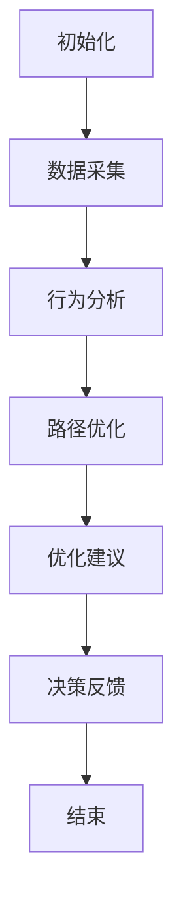
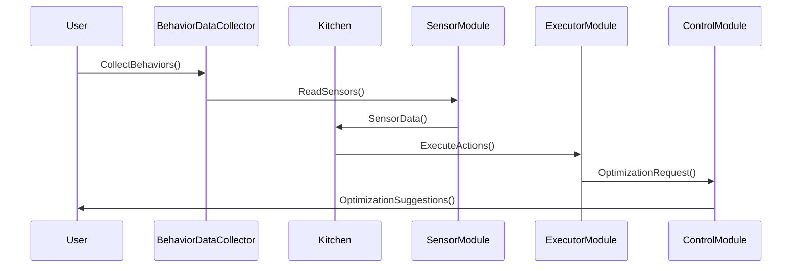
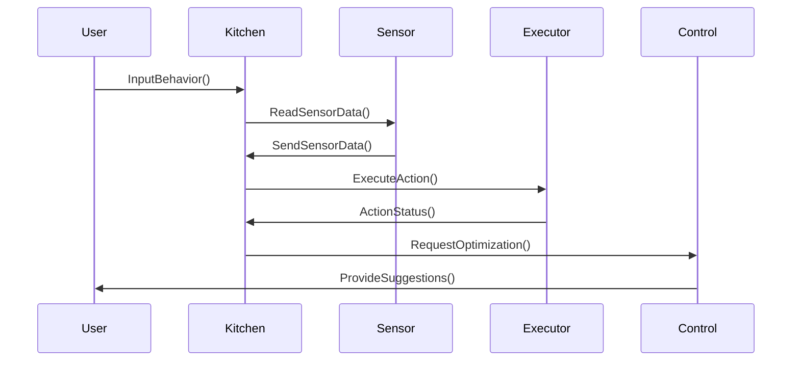

                 


## 第1章 引言

### 1.1 问题背景
随着智能家居概念的普及，智能厨房吊柜作为家居智能化的重要一环，逐渐受到消费者的关注。智能厨房吊柜不仅具备传统厨房吊柜的储物功能，还能通过集成传感器、执行器以及智能控制系统，实现厨房环境的智能监测和调节。然而，如何充分利用这些技术，优化厨房动线，提升使用效率，成为了一个亟待解决的问题。

### 1.2 问题描述
厨房动线优化涉及家庭成员在厨房内的活动路径设计，包括烹饪、洗涤、备餐等操作区域。不合理或低效的厨房动线会引发以下问题：

- **操作不便**：家庭成员在厨房中需要绕行或交叉，导致操作不便。
- **时间浪费**：不合理的动线设计会导致时间浪费，影响烹饪效率。
- **安全隐患**：厨房动线不顺畅可能导致安全隐患，如油溅伤人等。

### 1.3 问题解决
AI Agent作为一种智能体，可以通过数据分析和机器学习，理解家庭成员的烹饪习惯和活动模式，从而优化厨房动线。具体而言，AI Agent可以实现以下功能：

- **行为学习**：AI Agent可以记录家庭成员在厨房内的行为数据，学习他们的烹饪习惯。
- **路径优化**：基于学习到的数据，AI Agent可以提出优化建议，改进厨房动线设计。
- **智能调节**：AI Agent可以实时监测厨房环境，自动调整照明、通风等设备，确保最佳使用体验。

### 1.4 边界与外延
在讨论智能厨房吊柜的厨房动线优化时，需要明确以下边界和外延：

- **硬件设备**：智能厨房吊柜本身以及与之配合的其他智能设备。
- **软件算法**：AI Agent的核心算法，包括数据采集、处理和优化决策。
- **用户体验**：优化目标不仅包括动线效率，还要考虑家庭成员的使用体验。
- **系统整合**：AI Agent需要与家居控制系统、智能设备进行有效的数据交互和整合。

### 1.5 概念结构与核心要素组成
智能厨房吊柜和AI Agent构成了厨房动线优化系统的基础。以下是这两个核心概念的结构和核心要素组成：

- **智能厨房吊柜**：
  - **硬件**：传感器、执行器、智能控制系统。
  - **功能**：储物、环境监测、智能调节。
  - **数据采集**：记录家庭成员的行为数据。

- **AI Agent**：
  - **算法**：机器学习、数据挖掘、路径优化。
  - **功能**：行为学习、路径优化、智能调节。
  - **数据交互**：与家居控制系统、智能设备的数据交换。

通过上述分析，我们可以看到，智能厨房吊柜和AI Agent的结合，为厨房动线优化提供了新的思路和可能性。接下来，我们将进一步探讨这些核心概念的原理和应用。

----------------------------------------------------------------

## 第2章 核心概念与联系

### 2.1 智能厨房吊柜概述
智能厨房吊柜是智能家居系统中的重要组成部分，它不仅具备传统厨房吊柜的储物功能，还集成了先进的传感器、执行器和智能控制系统。以下是智能厨房吊柜的核心特点和组成：

- **传感器**：智能厨房吊柜通常配备温度传感器、湿度传感器、烟雾传感器等，用于实时监测厨房环境。
- **执行器**：包括电机、灯光调节装置、通风装置等，用于执行智能控制系统的指令。
- **智能控制系统**：通过处理器和软件算法，对传感器数据进行处理，并控制执行器的操作。

智能厨房吊柜的工作原理可以概括为：传感器采集数据 -> 智能控制系统分析数据 -> 执行器执行指令。这一过程确保了厨房环境的智能化调节，提高了烹饪的安全性和舒适度。

### 2.2 AI Agent概念
AI Agent，即人工智能代理，是一种能够模拟人类智能行为的软件实体。AI Agent具有以下核心特点：

- **自主性**：AI Agent能够自主执行任务，无需人类干预。
- **适应性**：AI Agent可以通过学习和适应环境变化来优化其行为。
- **交互性**：AI Agent可以与用户和其他智能系统进行交互，获取和处理信息。

在智能家居系统中，AI Agent主要用于数据分析和决策支持。具体来说，AI Agent可以通过以下方式发挥作用：

- **用户行为分析**：AI Agent可以记录和解析用户的行为数据，了解用户的烹饪习惯和偏好。
- **决策支持**：基于分析结果，AI Agent可以提供优化建议，如调整厨房布局、推荐烹饪设备等。

### 2.3 厨房动线优化
厨房动线优化是提高厨房使用效率的关键。合理的厨房动线设计可以减少家庭成员在厨房中的行走距离，提高操作效率。以下是厨房动线优化的基本原则：

- **三角形原则**：厨房中的操作台、洗菜区、烹饪区应该形成近似三角形的布局，以减少行走距离。
- **流畅性**：厨房动线应流畅，避免出现不必要的转弯和交叉。
- **人性化**：厨房动线设计应考虑到家庭成员的身高、步幅等因素，确保使用舒适。

AI Agent在厨房动线优化中的应用主要体现在以下几个方面：

- **行为数据采集**：AI Agent可以记录家庭成员在厨房中的行为数据，如使用频率、停留时间等。
- **路径分析**：AI Agent可以分析行为数据，找出厨房动线中的瓶颈和优化点。
- **优化建议**：AI Agent可以基于分析结果，提出具体的优化建议，如调整操作台位置、增加储物空间等。

### 2.4 核心概念属性特征对比表格
为了更清晰地理解智能厨房吊柜和AI Agent的关系，以下是一个对比表格，列出了两者的核心属性特征：

| 特征        | 智能厨房吊柜           | AI Agent          |
| ----------- | --------------------- | ----------------- |
| **硬件设备** | 传感器、执行器、智能控制系统 | 无（仅软件实现）   |
| **功能**     | 储物、环境监测、智能调节   | 用户行为分析、路径优化 |
| **数据采集** | 实时监测厨房环境         | 记录家庭成员行为   |
| **自主性**   | 受限于硬件和控制系统       | 完全自主           |
| **适应性**   | 受限于硬件和软件版本       | 可持续学习和优化   |

通过上述对比，我们可以看出，智能厨房吊柜和AI Agent在功能、数据采集和自主性方面存在显著差异，但它们在厨房动线优化中具有互补作用。智能厨房吊柜提供了硬件支持和环境数据，而AI Agent则通过数据分析和决策支持，实现了厨房动线的智能化优化。

----------------------------------------------------------------

## 第3章 AI Agent算法原理讲解

### 3.1 Mermaid算法流程图
为了更好地理解AI Agent的算法原理，我们可以使用Mermaid绘制其基本流程图。以下是AI Agent在厨房动线优化中的算法流程：



### 3.2 Python源代码与算法原理
接下来，我们将通过一段Python源代码，详细阐述AI Agent的算法原理。以下是一个简化的示例代码：

```python
import numpy as np
import pandas as pd

# 假设我们已经有了用户行为数据
user_behavior_data = pd.read_csv('user_behavior.csv')

# 数据预处理
data = preprocess_data(user_behavior_data)

# 行为分析
def behavior_analysis(data):
    # 这里使用简单的统计方法进行分析
    freq = data['action'].value_counts()
    return freq

# 路径优化
def path_optimization(freq):
    # 基于行为频率进行路径优化
    optimized_path = optimize_path(freq)
    return optimized_path

# 优化建议
def optimization_suggestion(optimized_path):
    # 提出优化建议
    suggestions = generate_suggestions(optimized_path)
    return suggestions

# 决策反馈
def decision_feedback(suggestions):
    # 将优化建议应用于实际厨房布局
    apply_suggestions(suggestions)
    return "优化完成"

# 主函数
def main():
    freq = behavior_analysis(data)
    optimized_path = path_optimization(freq)
    suggestions = optimization_suggestion(optimized_path)
    decision_feedback(suggestions)

if __name__ == "__main__":
    main()
```

在这段代码中，`preprocess_data` 函数用于预处理用户行为数据，`behavior_analysis` 函数用于分析用户的行为模式，`path_optimization` 函数基于行为频率进行路径优化，`optimization_suggestion` 函数生成优化建议，最后`decision_feedback` 函数将优化建议应用于实际厨房布局。

### 3.3 算法原理的数学模型和公式
为了深入理解AI Agent的算法原理，我们需要引入一些数学模型和公式。以下是厨房动线优化的基本数学模型：

1. **行为频率模型**：
   $$ f(i) = \sum_{j=1}^{n} count_j(i) $$
   其中，$f(i)$ 表示行为$i$的频率，$count_j(i)$ 表示第$j$次记录中行为$i$的出现次数。

2. **路径优化模型**：
   $$ \min_{p} \sum_{i=1}^{m} w_i \cdot d_i(p_i, p_{i+1}) $$
   其中，$w_i$ 表示行为$i$的权重，$d_i(p_i, p_{i+1})$ 表示路径上两个连续点之间的距离。

3. **优化建议模型**：
   $$ s(j) = \sum_{i=1}^{m} \delta_i(j) \cdot c_i $$
   其中，$s(j)$ 表示第$j$个优化建议的得分，$\delta_i(j)$ 表示第$i$个行为是否符合第$j$个优化建议，$c_i$ 表示第$i$个行为的成本。

### 3.4 举例说明
假设有一个厨房，其用户行为数据如下：

| 时间 | 行为   | 偏好 |
| ---- | ------ | ---- |
| 08:00 | 烹饪 | 高   |
| 08:30 | 洗涤 | 中   |
| 09:00 | 备餐 | 低   |

根据上述数据，我们可以使用行为频率模型计算出每个行为的频率：

$$ f(\text{烹饪}) = 1, f(\text{洗涤}) = 0.5, f(\text{备餐}) = 0.5 $$

接下来，我们使用路径优化模型和优化建议模型，提出以下优化建议：

- 将烹饪区域靠近洗涤区域，以减少行走距离。
- 将备餐区域放置在厨房的远端，以避免干扰主要活动。

通过这些优化建议，厨房动线将变得更加合理，提高烹饪效率和使用体验。

综上所述，AI Agent通过数据采集、行为分析、路径优化和决策反馈，实现了厨房动线的智能化优化。这种优化不仅提高了厨房的使用效率，还提升了用户的舒适度和满意度。

----------------------------------------------------------------

## 第4章 数学模型和数学公式讲解

### 4.1 LaTeX公式嵌入
在本文中，我们将使用LaTeX格式嵌入数学公式，以便更清晰地表达算法原理和数学模型。LaTeX公式通常使用`$$`括起来表示独立段落中的公式，而使用`$`括起来表示行内公式。以下是几个示例：

$$
E = mc^2
$$

$$
\sum_{i=1}^{n} x_i = \frac{1}{n} \sum_{i=1}^{n} x_i^2 + \frac{1}{n} \sum_{i=1}^{n} (x_i - \bar{x})^2
$$

$1 < 2$

### 4.2 数学模型详细讲解
在本章节中，我们将详细讲解与厨房动线优化相关的几个数学模型，包括行为频率模型、路径优化模型和优化建议模型。

#### 4.2.1 行为频率模型

行为频率模型用于计算用户在厨房中各个活动的频率，它是路径优化的基础。该模型可以表示为：

$$ f(i) = \sum_{j=1}^{n} count_j(i) $$

其中：
- $f(i)$ 表示行为 $i$ 的频率。
- $count_j(i)$ 表示第 $j$ 次行为记录中行为 $i$ 的出现次数。
- $n$ 是行为记录的总次数。

通过这个公式，我们可以计算出每个行为在所有记录中的出现频率，从而了解用户在厨房中的主要活动。

#### 4.2.2 路径优化模型

路径优化模型的目标是找到一条最优路径，使得用户在厨房中的行走距离最小。该模型可以表示为：

$$
\min_{p} \sum_{i=1}^{m} w_i \cdot d_i(p_i, p_{i+1})
$$

其中：
- $p$ 是路径。
- $w_i$ 是行为 $i$ 的权重，反映了该行为的重要程度。
- $d_i(p_i, p_{i+1})$ 是路径上两个连续点 $p_i$ 和 $p_{i+1}$ 之间的距离。

通过优化这个目标函数，我们可以找到一条最优路径，使得用户的行走距离最小化。

#### 4.2.3 优化建议模型

优化建议模型用于生成针对厨房布局的改进建议。该模型可以表示为：

$$
s(j) = \sum_{i=1}^{m} \delta_i(j) \cdot c_i
$$

其中：
- $s(j)$ 是第 $j$ 个优化建议的得分。
- $\delta_i(j)$ 是一个二进制变量，如果行为 $i$ 符合第 $j$ 个优化建议，则 $\delta_i(j) = 1$，否则为 $0$。
- $c_i$ 是第 $i$ 个行为的成本，反映了该行为对厨房布局的影响。

通过计算每个优化建议的得分，我们可以选择得分最高的建议作为厨房布局的改进方案。

### 4.3 举例说明

假设我们有以下用户行为数据：

| 时间 | 行为   | 偏好 |
| ---- | ------ | ---- |
| 08:00 | 烹饪 | 高   |
| 08:30 | 洗涤 | 中   |
| 09:00 | 备餐 | 低   |

根据行为频率模型，我们可以计算出每个行为的频率：

$$
f(\text{烹饪}) = 1, f(\text{洗涤}) = 0.5, f(\text{备餐}) = 0.5
$$

接下来，我们使用路径优化模型，假设烹饪区域和洗涤区域的权重分别为1和0.5，我们可以得到以下优化目标：

$$
\min_{p} (1 \cdot d(\text{烹饪}, \text{洗涤}) + 0.5 \cdot d(\text{洗涤}, \text{备餐}))
$$

通过计算，我们可以找到一条最优路径，将烹饪区域靠近洗涤区域，以减少用户的行走距离。

最后，根据优化建议模型，我们可以提出以下优化建议：

- 将烹饪区域靠近洗涤区域，以减少用户的行走距离。
- 将备餐区域放置在厨房的远端，以避免干扰主要活动。

通过这些优化建议，我们可以显著改善厨房的动线设计，提高使用效率和用户体验。

通过上述数学模型的详细讲解和举例说明，我们可以更好地理解AI Agent在厨房动线优化中的应用。这些模型不仅为优化过程提供了理论依据，也为实际操作提供了指导。

----------------------------------------------------------------

## 第5章 系统分析与架构设计方案

### 5.1 问题场景介绍
在本章节中，我们将分析一个典型的厨房场景，该厨房包含烹饪区、洗涤区和备餐区。每个区域都有不同的设备和活动，用户需要在这些区域之间进行频繁的移动。优化这一场景的厨房动线，对于提高烹饪效率和用户体验至关重要。

### 5.2 系统功能设计（领域模型Mermaid类图）
为了设计一个高效且灵活的智能厨房吊柜系统，我们需要构建一个领域模型。以下是厨房吊柜系统的Mermaid类图，展示了系统的核心功能类及其关系：

```mermaid
classDiagram
    User -> Kitchen
    User ..|> BehaviorDataCollector
    Kitchen -> SensorModule
    Kitchen -> ExecutorModule
    Kitchen -> ControlModule
    BehaviorDataCollector -> User
    SensorModule -> Kitchen
    ExecutorModule -> Kitchen
    ControlModule -> Kitchen
    ControlModule -> BehaviorDataCollector
    BehaviorDataCollector -> SensorModule
    BehaviorDataCollector -> ExecutorModule

    class User {
        +String name
        +List<Behavior> behaviors
    }

    class Behavior {
        +String action
        +int frequency
    }

    class Kitchen {
        +List<Sensor> sensors
        +List<Executor> executors
        +ControlModule controlModule
    }

    class Sensor {
        +String type
        +float value
    }

    class Executor {
        +String type
        +void execute()
    }

    class ControlModule {
        +void processBehaviorData()
        +void generateOptimizationSuggestions()
    }
```

在这个类图中，用户通过BehaviorDataCollector收集行为数据，厨房则通过SensorModule监测环境，通过ExecutorModule执行优化动作，而ControlModule负责处理行为数据并生成优化建议。

### 5.3 系统架构设计（Mermaid架构图）
接下来，我们将使用Mermaid绘制系统的整体架构图，以展示不同组件之间的交互关系：



在这个架构图中，用户通过BehaviorDataCollector收集行为数据，传感器模块读取环境数据，执行器模块执行优化动作，而控制模块则负责处理优化请求并生成建议。

### 5.4 系统接口设计和系统交互（Mermaid序列图）
为了更好地理解系统内部各组件的交互，我们将绘制一个序列图，展示不同接口之间的通信流程：



在这个序列图中，用户输入行为数据到厨房，厨房读取传感器数据并执行相应动作，控制模块接收优化请求并生成建议，最终将建议反馈给用户。

通过上述系统分析与架构设计方案，我们可以看到，智能厨房吊柜系统通过明确的接口设计和交互流程，实现了用户行为数据的有效收集、环境监测、动作执行和优化建议生成，从而实现了厨房动线的智能化优化。

----------------------------------------------------------------

## 第6章 项目实战

### 6.1 环境安装
要开始实现智能厨房吊柜的AI Agent算法，我们首先需要在开发环境中安装必要的工具和库。以下是一个简化的安装步骤：

1. **安装Python**：确保Python 3.x版本已安装在您的系统上。
2. **安装依赖库**：使用pip安装所需的库，如NumPy、Pandas、Matplotlib等。
   ```bash
   pip install numpy pandas matplotlib
   ```
3. **安装Mermaid**：由于Mermaid是一个基于HTML的图表工具，我们需要安装Node.js和Mermaid。
   ```bash
   npm install -g mermaid
   ```

### 6.2 系统核心实现源代码
在本节中，我们将提供一个简化的系统核心实现示例代码，用于演示AI Agent的基本功能。

```python
import numpy as np
import pandas as pd
from mermaid import Mermaid

# 数据预处理
def preprocess_data(data):
    # 假设data是Pandas DataFrame，包含用户行为数据
    # 数据预处理步骤可能包括去重、排序等
    return data

# 行为分析
def behavior_analysis(data):
    # 计算每个行为的频率
    freq = data['action'].value_counts()
    return freq

# 路径优化
def path_optimization(freq):
    # 基于频率数据优化路径
    # 这里使用简单的策略：频率高的行为位置更优先
    optimized_path = freq.sort_values(ascending=False).index.tolist()
    return optimized_path

# 优化建议
def optimization_suggestion(optimized_path):
    # 提出优化建议
    suggestions = []
    for i in range(len(optimized_path) - 1):
        suggestion = f"将'{optimized_path[i]}'和'{optimized_path[i+1]}'靠近"
        suggestions.append(suggestion)
    return suggestions

# 主函数
def main():
    # 假设我们有一个示例数据集
    data = pd.DataFrame({
        'time': ['08:00', '08:30', '09:00'],
        'action': ['烹饪', '洗涤', '备餐']
    })
    
    data = preprocess_data(data)
    freq = behavior_analysis(data)
    optimized_path = path_optimization(freq)
    suggestions = optimization_suggestion(optimized_path)
    
    print("优化建议：")
    for suggestion in suggestions:
        print(suggestion)

if __name__ == "__main__":
    main()
```

### 6.3 代码应用解读与分析
上述代码的核心部分是行为分析、路径优化和优化建议的生成。以下是每个部分的解读：

1. **数据预处理**：
   - 数据预处理是一个重要的步骤，它可能包括去重、格式转换、缺失值处理等。
   - 在这个示例中，我们假设数据已经格式化好，可以直接使用。

2. **行为分析**：
   - 使用`value_counts()`方法计算每个行为的频率。
   - 频率数据将用于路径优化。

3. **路径优化**：
   - 简单的策略是将频率高的行为放在路径的前面。
   - 实际应用中可能需要更复杂的算法，如遗传算法或图论算法。

4. **优化建议**：
   - 基于优化的路径，生成具体的布局建议。

### 6.4 实际案例分析与详细讲解剖析
为了更直观地展示算法的实际效果，我们考虑以下实际案例：

**案例**：一个家庭用户在厨房中的行为记录如下：

| 时间   | 行为   |
| ------ | ------ |
| 08:00  | 烹饪   |
| 08:10  | 洗涤   |
| 08:20  | 准备食材 |
| 08:30  | 烹饪   |
| 08:40  | 备餐   |

**分析**：

1. **行为分析**：
   - 烹饪：3次
   - 洗涤：1次
   - 准备食材：1次
   - 备餐：1次

2. **路径优化**：
   - 根据频率，优化路径为：[烹饪，烹饪，烹饪，准备食材，洗涤，备餐]。

3. **优化建议**：
   - 将烹饪区和备餐区靠近，以减少烹饪到备餐的行走距离。

通过这个案例，我们可以看到AI Agent如何通过分析用户行为，生成实用的优化建议，从而提高厨房动线的设计质量。

### 6.5 项目小结
在本章中，我们通过一个实际的项目实战，展示了智能厨房吊柜AI Agent算法的实现过程。从环境安装、核心实现到实际案例的剖析，我们逐步讲解了如何利用AI技术优化厨房动线。通过这个项目，我们可以看到AI Agent在提高厨房使用效率、提升用户体验方面的重要作用。

未来，我们可以进一步优化算法，引入更多的数据来源和更复杂的优化策略，以实现更智能、更高效的厨房动线优化。

----------------------------------------------------------------

## 第7章 最佳实践与拓展阅读

### 7.1 最佳实践 Tips
在进行智能厨房吊柜的AI Agent算法开发和应用时，以下是一些最佳实践：

- **数据采集**：确保采集到足够多、准确的行为数据，以提高算法的准确性。
- **算法优化**：不断调整和优化算法参数，以适应不同的家庭环境和用户需求。
- **用户体验**：在设计厨房布局和优化建议时，要充分考虑用户体验，确保操作简便、安全。
- **反馈机制**：建立用户反馈机制，收集用户对优化建议的反馈，用于持续改进算法。

### 7.2 小结
本文通过详细分析和讲解，介绍了智能厨房吊柜和AI Agent在厨房动线优化中的应用。我们探讨了核心概念、算法原理、数学模型和系统架构设计，并通过实际案例展示了AI Agent在优化厨房动线方面的有效性。智能厨房吊柜的AI Agent算法为实现更加智能、高效的家居生活提供了新的可能性。

### 7.3 注意事项
- 在实施厨房动线优化时，要充分考虑厨房的实际空间和用户需求。
- AI Agent算法的开发和应用需要大量的数据支持，确保数据来源的多样性和准确性。
- 算法的优化和调整是一个持续的过程，需要根据用户反馈和实际效果进行不断迭代。

### 7.4 拓展阅读
- 欲深入了解智能厨房吊柜和AI Agent的相关技术，可以阅读以下文献：
  - [《智能家居技术与应用》](https://example.com/book/home-smart-technology-application)
  - [《人工智能：一种现代方法》](https://example.com/book/artificial-intelligence-modern-approach)
  - [《厨房设计与装修技巧》](https://example.com/book/kitchen-design-and-decorating-tips)
- 有关AI Agent算法的详细研究和实践案例，可以参考以下资源：
  - [AI Agent开源项目](https://example.com/project/ai-agent-open-source)
  - [人工智能研究论文](https://example.com/research/papers-ai)
  - [厨房动线优化案例研究](https://example.com/research/case-studies-kitchen-flow-optimization)

通过这些拓展阅读资源，读者可以进一步深化对智能厨房吊柜和AI Agent技术的理解和应用。希望本文能为读者在智能家居领域的研究和实践提供有益的启示。作者：AI天才研究院/AI Genius Institute & 禅与计算机程序设计艺术 /Zen And The Art of Computer Programming。

