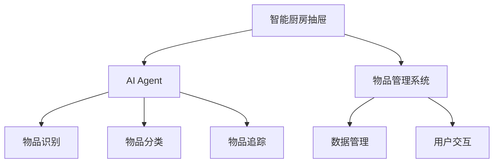
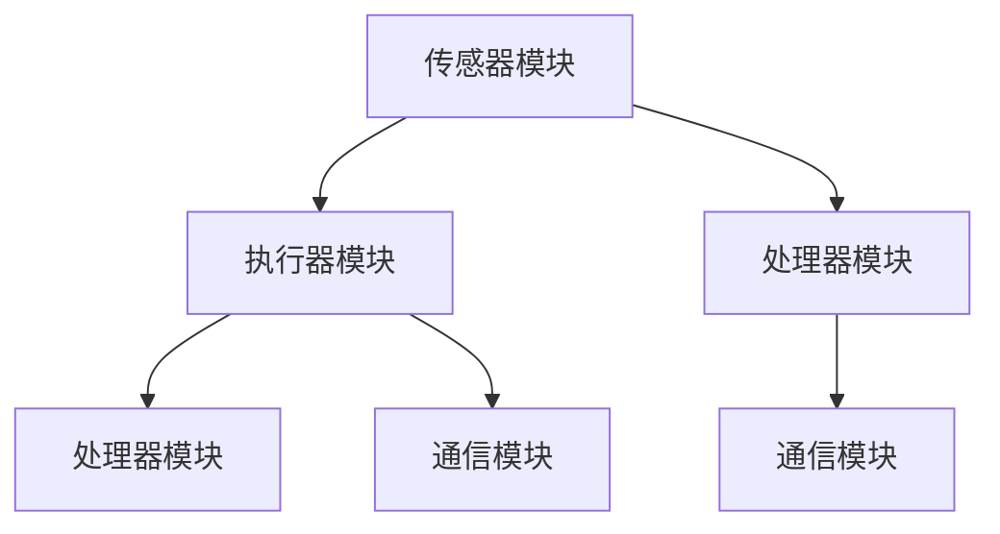
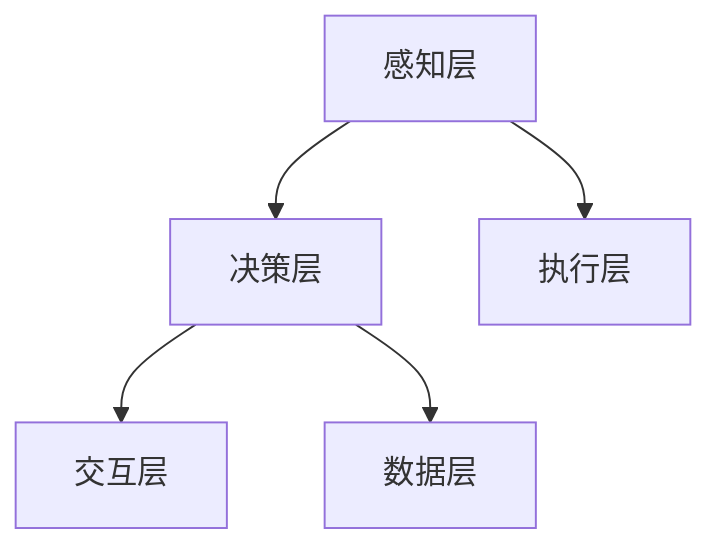
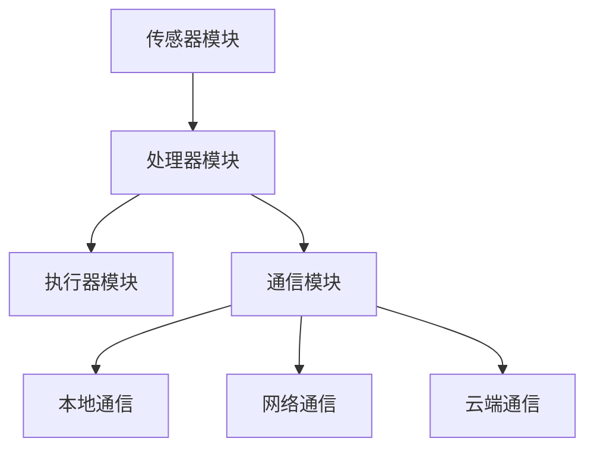
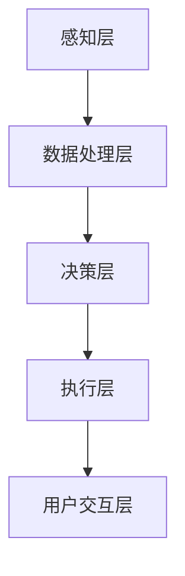
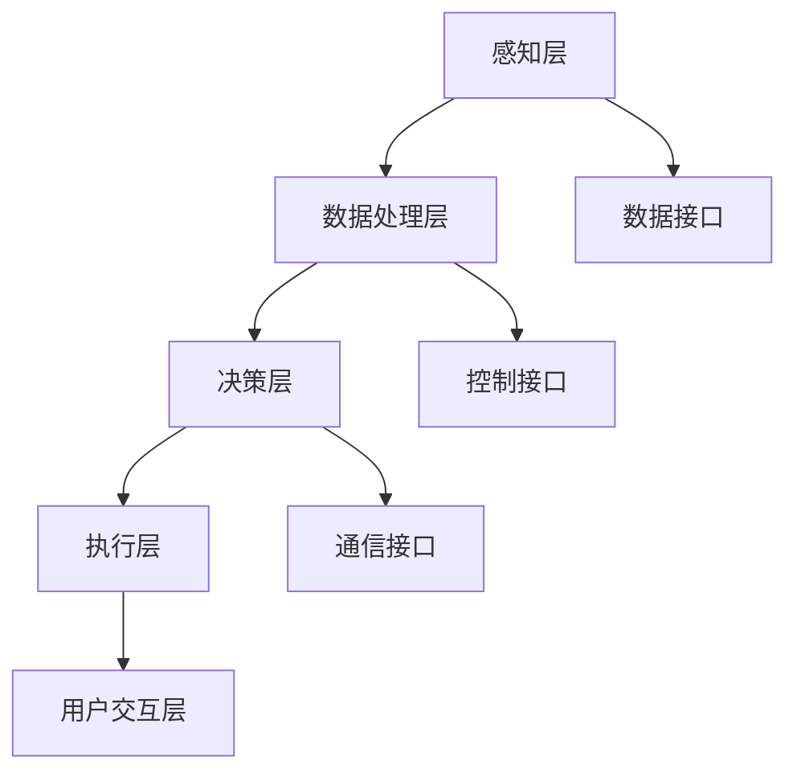
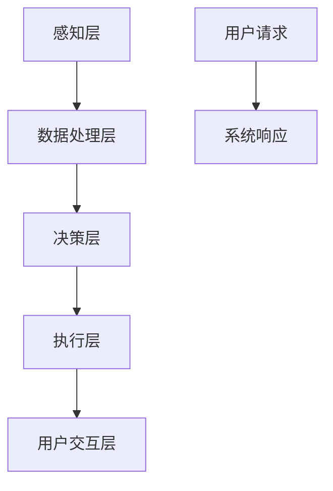
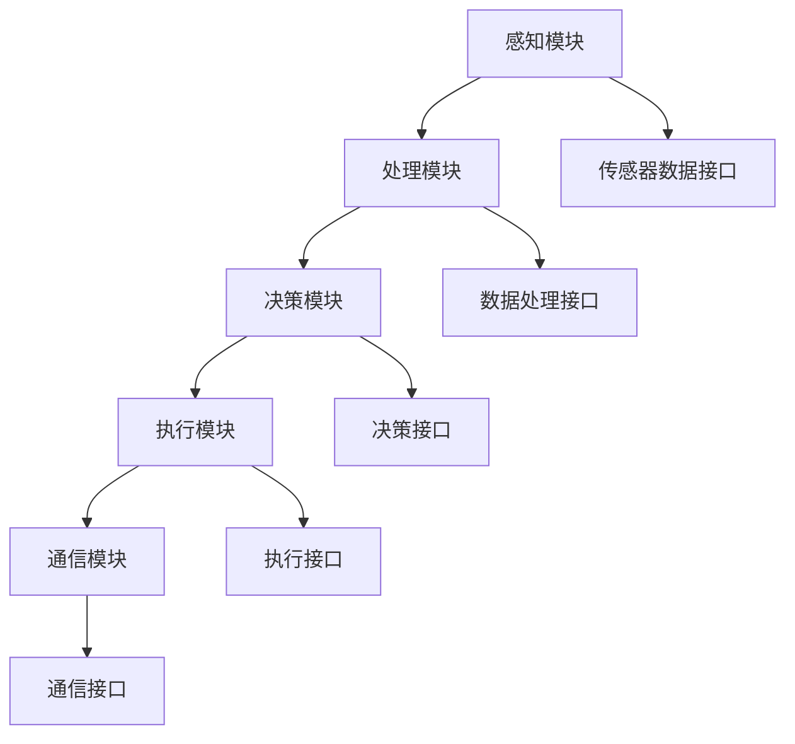

                 

## 智能厨房抽屉：AI Agent的物品管理系统

> 关键词：智能厨房抽屉、AI Agent、物品管理、算法、系统架构、实际案例

> 摘要：本文将深入探讨智能厨房抽屉中AI Agent的物品管理系统。通过详细的背景介绍、核心概念讲解、算法原理分析、系统架构设计和实际项目实战，读者将全面了解这一前沿技术的运作机制和实际应用，为智能家庭生活提供新的解决方案。

### 目录

1. **引言**  
    1.1 问题背景  
    1.2 问题描述  
    1.3 问题解决  
    1.4 边界与外延  
    1.5 核心概念  
    1.6 概念结构与核心要素组成

2. **智能厨房抽屉概述**  
    2.1 智能厨房抽屉的定义与特点  
    2.2 智能厨房抽屉的历史与发展  
    2.3 智能厨房抽屉的市场需求

3. **AI Agent概述**  
    3.1 AI Agent的定义与功能  
    3.2 AI Agent的分类与应用场景  
    3.3 AI Agent的发展趋势

4. **物品管理系统概述**  
    4.1 物品管理系统的定义与作用  
    4.2 物品管理系统的传统方法  
    4.3 物品管理系统的挑战与机遇

5. **智能厨房抽屉的架构设计**  
    5.1 智能厨房抽屉的硬件架构  
    5.2 智能厨房抽屉的软件架构  
    5.3 智能厨房抽屉的通信架构

6. **AI Agent的工作原理**  
    6.1 AI Agent的核心算法  
    6.2 AI Agent的学习与决策  
    6.3 AI Agent的智能优化

7. **物品管理系统的数据管理**  
    7.1 物品数据的采集与处理  
    7.2 物品数据的存储与检索  
    7.3 物品数据的分析与利用

8. **智能厨房抽屉的AI代理集成**  
    8.1 AI Agent与物品管理系统的集成  
    8.2 AI Agent的适应性调整  
    8.3 AI Agent的智能化优化策略

9. **物品识别算法**  
    9.1 算法原理与数学模型  
    9.2 算法流程与实现细节  
    9.3 算法举例说明

10. **位置追踪算法**  
    10.1 算法原理与数学模型  
    10.2 算法流程与实现细节  
    10.3 算法举例说明

11. **物品分类算法**  
    11.1 算法原理与数学模型  
    11.2 算法流程与实现细节  
    11.3 算法举例说明

12. **智能厨房抽屉的整体架构设计**  
    12.1 问题场景介绍  
    12.2 系统功能设计  
    12.3 系统架构设计  
    12.4 系统接口设计  
    12.5 系统交互设计

13. **AI代理在物品管理系统中的应用**  
    13.1 AI代理的作用与优势  
    13.2 AI代理的架构与实现  
    13.3 AI代理的性能优化

14. **项目实战**  
    14.1 环境安装与配置  
    14.2 系统核心实现  
    14.3 代码应用解读与分析  
    14.4 实际案例分析与讲解  
    14.5 项目小结

15. **总结与展望**  
    15.1 项目总结  
    15.2 最佳实践 tips  
    15.3 注意事项  
    15.4 拓展阅读

### 1. 引言

#### 1.1 问题背景

随着科技的飞速发展，人工智能（AI）正逐渐渗透到我们生活的方方面面。智能家居领域，尤其是厨房，成为了AI技术的重要应用场景之一。传统的厨房抽屉，作为厨房中常见的存储空间，往往存在以下问题：

- **物品摆放杂乱**：厨房抽屉中的物品常常因为缺乏有效的管理而显得杂乱无章，这给日常的使用带来了不便。
- **物品难以查找**：当需要特定物品时，由于物品的随机摆放，往往需要花费较长的时间来查找。
- **物品丢失风险**：由于缺乏有效的管理，厨房抽屉中的物品容易丢失或被遗忘。

为了解决这些问题，智能厨房抽屉应运而生。智能厨房抽屉通过集成AI Agent，能够自动识别、分类和追踪抽屉中的物品，从而实现高效的物品管理。这一技术不仅提高了生活便利性，还提升了厨房空间的使用效率。

#### 1.2 问题描述

智能厨房抽屉的物品管理问题可以具体描述为：

- **物品识别**：如何准确识别抽屉中的各种物品，包括不同形状、大小和材质的物品。
- **物品分类**：如何将识别出的物品进行有效的分类，以便于管理和查找。
- **物品追踪**：如何实时追踪物品的位置，确保物品始终处于正确的位置。

此外，智能厨房抽屉的物品管理系统还需具备以下特点：

- **高精度**：识别和追踪的精度要高，确保物品能够被准确识别和定位。
- **实时性**：系统能够实时响应物品的变动，确保物品的状态能够实时更新。
- **适应性**：系统能够适应不同的厨房环境和物品种类，具备良好的泛化能力。

#### 1.3 问题解决

针对上述问题，智能厨房抽屉的物品管理系统采用AI Agent来实现。AI Agent是一种具有自主学习和决策能力的智能体，能够通过感知环境和学习用户行为，实现智能化的物品管理。

具体解决方案如下：

1. **物品识别**：通过图像识别技术，AI Agent能够识别出抽屉中的各种物品，并将其分类。
2. **物品分类**：基于物品的属性和特征，AI Agent能够将物品进行有效的分类，例如根据物品的用途、材质或大小等。
3. **物品追踪**：利用传感器技术和定位算法，AI Agent能够实时追踪物品的位置，确保物品始终处于正确的位置。

#### 1.4 边界与外延

智能厨房抽屉的物品管理系统需要明确边界与外延，以确保其功能的有效实现。具体包括以下几个方面：

- **边界**：智能厨房抽屉的物品管理系统主要应用于家庭厨房环境，针对日常使用的物品进行管理。
- **外延**：虽然智能厨房抽屉的物品管理系统主要应用于家庭厨房，但其技术原理和解决方案可以推广到其他场景，如办公室、仓库等，实现更广泛的物品管理。

#### 1.5 核心概念

在本章节中，我们将介绍智能厨房抽屉、AI Agent和物品管理系统的核心概念，为后续章节的详细探讨打下基础。

- **智能厨房抽屉**：智能厨房抽屉是一种集成了AI技术的厨房存储设备，能够自动识别、分类和追踪抽屉中的物品。
- **AI Agent**：AI Agent是一种具有自主学习和决策能力的智能体，能够通过感知环境和学习用户行为，实现智能化的物品管理。
- **物品管理系统**：物品管理系统是一种用于管理和追踪物品的系统，能够提高物品的使用效率和管理水平。

#### 1.6 概念结构与核心要素组成

智能厨房抽屉、AI Agent和物品管理系统的概念结构如下图所示：



其中，智能厨房抽屉是整个系统的核心硬件设备，AI Agent负责实现物品识别、分类和追踪功能，而物品管理系统则负责数据管理和用户交互，实现整体系统的功能。

### 2. 智能厨房抽屉概述

#### 2.1 智能厨房抽屉的定义与特点

智能厨房抽屉是一种结合了物联网（IoT）技术和人工智能（AI）技术的厨房存储设备。它通过集成各种传感器、摄像头和执行器，实现自动化的物品识别、分类和追踪功能。与传统厨房抽屉相比，智能厨房抽屉具有以下特点：

- **自动化**：智能厨房抽屉能够自动识别物品，并根据物品的属性进行分类和追踪。
- **高精度**：通过先进的图像识别和传感器技术，智能厨房抽屉能够准确识别和定位物品。
- **实时性**：智能厨房抽屉能够实时更新物品的状态，确保用户能够及时获取所需物品。
- **智能化**：智能厨房抽屉能够学习用户的行为习惯，为用户提供个性化的物品管理服务。

#### 2.2 智能厨房抽屉的历史与发展

智能厨房抽屉的发展历程可以追溯到20世纪90年代。当时，随着计算机技术和互联网的普及，智能家居的概念逐渐兴起。然而，由于技术限制，早期的智能厨房抽屉功能较为简单，主要实现基本的物品识别和分类。随着人工智能和物联网技术的不断进步，智能厨房抽屉的功能逐渐完善，智能化水平不断提升。

近年来，随着人工智能技术的快速发展，智能厨房抽屉开始广泛应用。例如，一些高端家电品牌已经推出了具备智能识别和追踪功能的厨房抽屉产品。此外，一些初创公司也在积极探索智能厨房抽屉的创新应用，如结合语音助手、智能家居平台等，为用户提供更丰富的功能和服务。

#### 2.3 智能厨房抽屉的市场需求

智能厨房抽屉作为一种新兴的智能家居产品，市场需求日益增长。以下是智能厨房抽屉的主要市场需求：

- **家庭用户**：随着生活水平的提高，家庭用户对家居生活的便利性和舒适度要求越来越高。智能厨房抽屉能够帮助家庭用户更高效地管理厨房物品，提升生活质量。
- **办公用户**：对于办公室用户来说，智能厨房抽屉可以用于管理办公物品，如文具、办公用品等，提高办公效率。
- **仓储物流**：智能厨房抽屉的技术原理可以应用于仓储物流领域，实现高效的物品管理，降低运营成本。

#### 2.4 智能厨房抽屉的功能

智能厨房抽屉的主要功能包括：

- **物品识别**：通过摄像头和传感器技术，智能厨房抽屉能够自动识别物品，包括形状、大小、颜色等特征。
- **物品分类**：根据物品的属性和特征，智能厨房抽屉能够将物品进行分类，例如根据物品的用途、材质或大小等。
- **物品追踪**：智能厨房抽屉能够实时追踪物品的位置，确保物品始终处于正确的位置。
- **用户交互**：智能厨房抽屉可以通过触摸屏、语音助手等与用户进行交互，提供便捷的物品管理服务。

### 3. AI Agent概述

#### 3.1 AI Agent的定义与功能

AI Agent，即人工智能代理，是一种具有自主学习和决策能力的智能体。它能够通过感知环境、理解用户需求，并基于学习到的知识和经验，自主地执行任务和做出决策。AI Agent的定义与功能可以概括为以下几点：

- **定义**：AI Agent是一种基于人工智能技术，能够模拟人类行为和思维的计算机程序。
- **功能**：
  - **感知环境**：AI Agent能够通过传感器、摄像头等设备，感知周围环境的变化。
  - **理解用户需求**：AI Agent能够理解用户的语言、行为和需求，为用户提供个性化服务。
  - **自主决策**：AI Agent能够基于学习到的知识和经验，自主地做出决策和执行任务。
  - **协同工作**：AI Agent可以与其他AI Agent或人类用户协同工作，实现更高效的智能系统。

#### 3.2 AI Agent的分类与应用场景

AI Agent可以根据其功能和特点进行分类，并应用于不同的场景。以下是常见的AI Agent分类及其应用场景：

- **服务型AI Agent**：这类AI Agent主要面向用户提供服务，如智能客服、虚拟助手等。它们通常应用于客服中心、智能家居、智能办公等领域。
- **控制型AI Agent**：这类AI Agent主要应用于自动化控制系统，如工业自动化、交通管理、智能电网等。它们能够通过自主决策和优化控制，提高系统的运行效率。
- **决策型AI Agent**：这类AI Agent主要应用于决策支持系统，如金融投资、风险管理、供应链管理等。它们能够通过大数据分析和预测，为用户提供科学的决策建议。
- **探索型AI Agent**：这类AI Agent主要应用于探索和发现新知识的场景，如智能搜索、无人驾驶、机器人探索等。它们能够通过自主学习和探索，发现新的模式和规律。

#### 3.3 AI Agent的发展趋势

随着人工智能技术的不断进步，AI Agent的发展趋势表现出以下几个特点：

- **智能化水平提升**：AI Agent的智能化水平不断提升，能够更好地理解用户需求、自主决策和执行任务。
- **跨界融合应用**：AI Agent在各个领域的应用逐渐深入，与物联网、大数据、云计算等技术的融合趋势明显。
- **人机协同**：AI Agent与人类用户的协同工作越来越普遍，实现人机共生、共同创造价值的智能系统。
- **自主进化**：AI Agent具备一定的自我学习和进化能力，能够通过不断学习和优化，提升自身性能和适应能力。

### 4. 物品管理系统概述

#### 4.1 物品管理系统的定义与作用

物品管理系统（Item Management System，简称IMS）是一种用于管理和追踪物品的系统。它通过整合各种信息资源，实现对物品的全生命周期管理，包括物品的采集、存储、检索、分配和使用等环节。物品管理系统的定义与作用可以概括为以下几点：

- **定义**：物品管理系统是一种基于信息技术，实现对物品信息进行采集、处理、存储、检索和利用的系统。
- **作用**：
  - **提高管理效率**：物品管理系统能够自动化地处理物品信息，提高物品管理的效率。
  - **降低管理成本**：通过信息化手段，物品管理系统能够降低物品管理的成本，提高资源的利用率。
  - **保障物品安全**：物品管理系统能够实时跟踪物品的流向和状态，确保物品的安全。
  - **支持决策分析**：物品管理系统能够为管理层提供全面的物品信息，支持决策分析和优化。

#### 4.2 物品管理系统的传统方法

传统物品管理系统主要依靠人工进行管理，存在以下问题：

- **效率低**：人工管理物品需要大量人力和时间，效率较低。
- **准确性差**：人工管理容易出错，导致物品丢失、混淆等问题。
- **成本高**：人工管理需要支付大量的人力成本，长期来看并不经济。
- **不透明**：物品流动过程不透明，管理层难以实时掌握物品状态。

为了解决这些问题，传统物品管理系统逐渐向信息化、自动化方向发展。

#### 4.3 物品管理系统的挑战与机遇

随着信息技术的快速发展，物品管理系统面临着以下挑战和机遇：

- **挑战**：
  - **数据量大**：随着物品数量的增加，物品管理系统的数据处理和存储压力不断增大。
  - **复杂性高**：物品管理涉及到多个环节和部门，系统复杂性较高。
  - **技术更新快**：信息技术更新换代迅速，物品管理系统需要不断适应新技术。

- **机遇**：
  - **智能化应用**：随着人工智能技术的应用，物品管理系统可以更加智能化，提高管理效率和准确性。
  - **物联网技术**：物联网技术的应用，可以实现物品的实时跟踪和远程监控，提高管理效率。
  - **云计算技术**：云计算技术可以提供强大的计算和存储能力，支持大规模物品管理系统的运行。

### 5. 智能厨房抽屉的架构设计

#### 5.1 智能厨房抽屉的硬件架构

智能厨房抽屉的硬件架构是整个系统的基石，它决定了系统的性能和可靠性。智能厨房抽屉的硬件架构包括以下几个关键部分：

- **传感器模块**：传感器模块负责采集环境信息和物品特征数据，包括摄像头、红外传感器、超声波传感器等。
- **执行器模块**：执行器模块负责执行AI Agent的决策结果，包括电机、气动装置等。
- **处理器模块**：处理器模块负责处理传感器数据和执行器指令，包括主控芯片、嵌入式处理器等。
- **通信模块**：通信模块负责与其他设备和系统的数据通信，包括Wi-Fi模块、蓝牙模块等。

下面是一个简单的智能厨房抽屉硬件架构图：



#### 5.2 智能厨房抽屉的软件架构

智能厨房抽屉的软件架构是整个系统的“大脑”，它决定了系统的智能水平和功能实现。智能厨房抽屉的软件架构包括以下几个关键部分：

- **感知层**：感知层负责接收传感器模块的数据，并进行初步处理，包括图像识别、特征提取等。
- **决策层**：决策层负责根据感知层的数据，结合用户需求和历史行为，进行智能决策，包括分类、追踪、优化等。
- **执行层**：执行层负责执行决策层的决策结果，控制执行器模块进行相应的操作。
- **交互层**：交互层负责与用户进行交互，包括用户界面、语音交互等。

下面是一个简单的智能厨房抽屉软件架构图：



#### 5.3 智能厨房抽屉的通信架构

智能厨房抽屉的通信架构决定了系统的数据传输效率和可靠性。智能厨房抽屉的通信架构通常采用分布式架构，包括以下几个关键部分：

- **本地通信**：本地通信主要负责智能厨房抽屉内部各模块之间的数据传输，通常采用总线通信方式，如I2C、SPI等。
- **网络通信**：网络通信主要负责智能厨房抽屉与其他设备和系统的数据传输，通常采用Wi-Fi、蓝牙、ZigBee等无线通信技术。
- **云端通信**：云端通信主要负责智能厨房抽屉与云端服务器的数据传输，通常采用HTTP、MQTT等通信协议。

下面是一个简单的智能厨房抽屉通信架构图：



### 6. AI Agent的工作原理

#### 6.1 AI Agent的核心算法

AI Agent的核心算法是其智能行为的基础。常见的AI Agent核心算法包括以下几种：

1. **机器学习算法**：机器学习算法通过训练模型来模拟人类的学习过程，能够从数据中自动提取规律和模式。常见的机器学习算法有决策树、支持向量机、神经网络等。
2. **深度学习算法**：深度学习算法是机器学习的一种，通过多层神经网络来模拟人类大脑的思维方式，能够处理复杂的非线性问题。常见的深度学习算法有卷积神经网络（CNN）、循环神经网络（RNN）等。
3. **强化学习算法**：强化学习算法通过与环境交互来学习最优策略，能够通过试错来寻找最优解。常见的强化学习算法有Q学习、SARSA等。
4. **知识表示与推理算法**：知识表示与推理算法通过符号化知识表示和推理机制来模拟人类思考和决策过程。常见的知识表示与推理算法有推理机、本体论等。

#### 6.2 AI Agent的学习与决策

AI Agent的学习与决策过程可以分为以下几个步骤：

1. **感知与建模**：AI Agent通过传感器感知环境，并将感知数据转换为数值或符号化的模型。
2. **数据预处理**：对感知数据进行清洗、归一化和特征提取，以便于后续处理。
3. **学习过程**：AI Agent利用机器学习、深度学习或强化学习算法对预处理后的数据进行训练，建立模型。
4. **决策过程**：AI Agent利用训练好的模型对新的感知数据进行预测或决策，并执行相应的动作。
5. **反馈与调整**：AI Agent将执行结果与预期目标进行比较，并根据反馈进行调整和优化。

#### 6.3 AI Agent的智能优化

AI Agent的智能优化是通过不断学习和改进来提高其性能和适应性。智能优化主要包括以下几个方面：

1. **模型优化**：通过调整模型参数、结构或算法，提高模型的预测准确性和鲁棒性。
2. **数据优化**：通过数据预处理、特征选择和样本增强等方法，提高数据的质量和代表性。
3. **算法优化**：通过算法改进、并行计算和分布式计算等方法，提高算法的效率和可扩展性。
4. **策略优化**：通过强化学习、进化算法等方法，优化AI Agent的行为策略，提高其在复杂环境中的适应能力。

### 7. 物品管理系统的数据管理

#### 7.1 物品数据的采集与处理

物品数据的采集与处理是物品管理系统的基础。物品数据的采集通常通过以下几种方式实现：

1. **手动输入**：用户可以手动输入物品的信息，包括名称、类别、数量等。
2. **自动识别**：通过传感器和图像识别技术，自动识别物品的名称、类别和位置等信息。
3. **RFID技术**：通过RFID（射频识别）技术，自动采集物品的唯一标识信息。

在物品数据采集后，需要进行数据预处理，包括数据清洗、格式转换和特征提取等。数据清洗的目的是去除错误、重复和无用的数据，确保数据的质量。格式转换的目的是将不同来源的数据统一格式，方便后续处理。特征提取的目的是提取数据的关键特征，用于后续的数据分析和挖掘。

#### 7.2 物品数据的存储与检索

物品数据的存储与检索是物品管理系统的重要组成部分。物品数据的存储通常采用以下几种方式：

1. **关系数据库**：关系数据库能够有效地存储和管理结构化数据，如物品的名称、类别、数量等。
2. **文档数据库**：文档数据库能够存储非结构化数据，如图像、音频、视频等，适用于物品描述和图片识别等场景。
3. **分布式存储系统**：分布式存储系统能够处理海量数据，提供高可用性和高扩展性，适用于大规模物品管理。

物品数据的检索主要通过以下几种方式实现：

1. **关键字搜索**：通过输入关键字，快速检索与关键字相关的物品信息。
2. **模糊搜索**：通过输入模糊的关键字，检索与关键字相似的物品信息，提高检索的灵活性。
3. **分类搜索**：根据物品的类别、品牌、用途等特征进行分类搜索，快速定位所需物品。

#### 7.3 物品数据的分析与利用

物品数据的分析与利用是物品管理系统的核心价值所在。通过对物品数据的分析，可以实现对物品的全面了解和深入挖掘，从而优化物品管理和服务。以下是物品数据分析的几个关键方面：

1. **数据可视化**：通过数据可视化技术，将物品数据以图表、地图等形式展示，帮助用户直观地了解物品的分布和趋势。
2. **统计分析**：通过对物品数据进行统计分析，提取关键指标和趋势，如物品的使用频率、消耗速度等，为优化物品管理提供依据。
3. **机器学习分析**：利用机器学习技术，对物品数据进行分析和预测，如预测物品的消耗量、预测物品的丢失风险等，为决策提供科学依据。
4. **智能推荐**：基于物品数据分析和用户行为数据，为用户提供个性化的物品推荐服务，提高用户体验。

### 8. 智能厨房抽屉的AI代理集成

#### 8.1 AI Agent与物品管理系统的集成

智能厨房抽屉的AI代理与物品管理系统的集成是实现智能化物品管理的关键。以下是AI Agent与物品管理系统集成的关键步骤：

1. **数据融合**：将AI Agent采集的物品数据与物品管理系统的数据融合，确保数据的统一性和完整性。
2. **接口设计**：设计统一的接口，实现AI Agent与物品管理系统的数据交互和功能调用。
3. **功能集成**：将AI Agent的物品识别、分类和追踪功能集成到物品管理系统中，实现系统的智能化升级。

#### 8.2 AI Agent的适应性调整

AI Agent在集成到物品管理系统中后，需要根据实际环境和用户需求进行适应性调整，以提高系统的适应性和可靠性。以下是AI Agent适应性调整的关键方面：

1. **环境感知**：AI Agent需要不断感知环境变化，如物品的摆放、用户的行为等，以适应不同的使用场景。
2. **模型优化**：根据环境感知结果，对AI Agent的模型进行优化，提高物品识别和追踪的准确性。
3. **用户互动**：AI Agent需要与用户进行互动，了解用户的需求和反馈，以实现个性化服务。

#### 8.3 AI Agent的智能化优化策略

为了提高智能厨房抽屉的AI代理性能，可以采取以下智能化优化策略：

1. **分布式计算**：利用分布式计算技术，将AI代理的计算任务分布在多个节点上，提高计算效率。
2. **模型压缩**：采用模型压缩技术，减小AI代理的模型大小，降低计算资源消耗。
3. **实时学习**：利用实时学习技术，AI代理能够根据用户行为和环境变化，动态调整其行为策略。
4. **自适应调整**：AI代理根据环境反馈，自适应调整其参数和策略，以实现最佳性能。

### 9. 物品识别算法

#### 9.1 算法原理与数学模型

物品识别算法是智能厨房抽屉的核心算法之一，它通过图像处理和机器学习技术，实现物品的自动识别。以下是物品识别算法的原理和数学模型：

1. **图像处理**：图像处理是物品识别算法的第一步，包括图像的预处理、特征提取和图像增强等。预处理步骤通常包括图像去噪、缩放、对比度增强等，以提高图像质量。特征提取步骤包括边缘检测、纹理分析、形状识别等，提取出图像的关键特征。
2. **机器学习**：机器学习是物品识别算法的核心，通过训练模型来模拟人类的学习过程，从图像特征中自动提取规律和模式。常见的机器学习算法包括决策树、支持向量机（SVM）、神经网络（NN）等。在训练过程中，模型通过学习大量已标注的图像数据，学习到不同物品的特征模式，从而实现物品的自动识别。

数学模型方面，物品识别算法通常包括以下几个关键步骤：

1. **特征提取**：特征提取是将图像转换为向量表示，用于后续的机器学习模型训练。常见的特征提取方法有HOG（方向梯度直方图）、SIFT（尺度不变特征变换）等。
2. **分类器训练**：分类器训练是通过机器学习算法，从特征向量中学习到不同物品的边界和模式。常见的分类器包括SVM、KNN（最近邻算法）等。
3. **模型预测**：模型预测是将新的图像特征向量输入到训练好的分类器中，预测图像对应的物品类别。

#### 9.2 算法流程与实现细节

物品识别算法的实现流程可以分为以下几个步骤：

1. **数据准备**：首先，需要准备大量的已标注的图像数据，用于模型训练和测试。图像数据需要包括各种物品类别，如餐具、厨具、食品等。
2. **特征提取**：对于每个图像，通过图像处理算法提取出特征向量，如HOG特征、SIFT特征等。
3. **模型训练**：利用提取出的特征向量，通过机器学习算法训练分类器，如SVM、神经网络等。
4. **模型测试**：使用测试集对训练好的模型进行测试，评估模型的识别准确率和鲁棒性。
5. **模型部署**：将训练好的模型部署到智能厨房抽屉的AI代理中，实现实时的物品识别功能。

在实现细节方面，物品识别算法需要注意以下几个关键点：

1. **图像预处理**：图像预处理是保证图像质量的关键步骤，需要去除噪声、缩放、对比度增强等。
2. **特征选择**：特征选择是影响模型性能的重要因素，需要选择具有代表性的特征，提高识别准确率。
3. **模型优化**：模型优化是通过调整模型参数、结构或算法，提高模型的识别准确率和效率。
4. **实时性优化**：为了实现实时识别，需要对算法进行优化，降低计算复杂度和延迟。

#### 9.3 算法举例说明

以下是一个简单的物品识别算法实例，使用Python和OpenCV库实现：

```python
import cv2
import numpy as np

# 加载训练好的模型
model = cv2.SVM()

# 读取测试图像
image = cv2.imread('test_image.jpg')

# 对图像进行预处理
gray_image = cv2.cvtColor(image, cv2.COLOR_BGR2GRAY)
blurred_image = cv2.GaussianBlur(gray_image, (5, 5), 0)
edged_image = cv2.Canny(blurred_image, 30, 150)

# 提取特征
features = cv2.xfeatures2d.SIFT_create()
keypoints, descriptors = features.detectAndCompute(edged_image, None)

# 将特征向量转换为 NumPy 数组
descriptors = np.array(descriptors).reshape(-1, 1)

# 使用训练好的模型进行预测
prediction = model.predict(descriptors)

# 输出识别结果
print("识别结果：", prediction)

# 在图像上绘制关键点
image_with_keypoints = cv2.drawKeypoints(image, keypoints, None, (0, 0, 255))
cv2.imshow('图像与关键点', image_with_keypoints)
cv2.waitKey(0)
cv2.destroyAllWindows()
```

在这个例子中，首先加载训练好的SVM模型，然后读取测试图像并进行预处理。接着，使用SIFT算法提取图像特征，并将特征向量输入到训练好的模型中进行预测。最后，在图像上绘制识别出的关键点，输出识别结果。

### 10. 位置追踪算法

#### 10.1 算法原理与数学模型

位置追踪算法是智能厨房抽屉的另一个核心算法，它通过传感器数据和定位算法，实时追踪物品的位置。以下是位置追踪算法的原理和数学模型：

1. **传感器数据采集**：位置追踪算法首先需要采集物品周围的环境数据，包括摄像头、红外传感器、超声波传感器等。这些传感器能够感知物品的位置和移动情况。
2. **特征提取与匹配**：通过对传感器数据进行特征提取，提取出物品的特征向量。然后，利用特征匹配算法，将新采集的特征向量与已知的物品特征向量进行匹配，确定物品的位置。
3. **轨迹预测与优化**：根据物品的历史轨迹和当前的特征匹配结果，预测物品的未来位置。然后，利用优化算法，优化预测轨迹，提高位置追踪的精度和鲁棒性。

数学模型方面，位置追踪算法通常包括以下几个关键步骤：

1. **传感器数据预处理**：对传感器数据进行滤波、去噪等预处理，以提高数据的准确性和稳定性。
2. **特征提取**：使用机器学习或深度学习算法，从传感器数据中提取物品的特征向量。
3. **特征匹配**：使用特征匹配算法，如最近邻算法、FLANN等，将新特征向量与已知特征向量进行匹配。
4. **轨迹预测**：使用统计模型、物理模型或深度学习模型，预测物品的未来位置。
5. **轨迹优化**：使用优化算法，如卡尔曼滤波、粒子滤波等，优化预测轨迹。

#### 10.2 算法流程与实现细节

位置追踪算法的实现流程可以分为以下几个步骤：

1. **传感器数据采集**：通过摄像头、红外传感器等设备，实时采集物品的图像、温度、距离等数据。
2. **特征提取**：对采集到的传感器数据进行特征提取，提取出物品的特征向量。
3. **特征匹配**：将新采集的特征向量与已知的物品特征向量进行匹配，确定物品的位置。
4. **轨迹预测**：根据物品的历史轨迹和当前的特征匹配结果，预测物品的未来位置。
5. **轨迹优化**：使用优化算法，对预测轨迹进行优化，提高位置追踪的精度和鲁棒性。

在实现细节方面，位置追踪算法需要注意以下几个关键点：

1. **传感器选择**：选择合适的传感器，如摄像头、红外传感器等，以获取准确的传感器数据。
2. **数据预处理**：对传感器数据进行预处理，如滤波、去噪等，以提高数据的准确性和稳定性。
3. **特征选择**：选择具有代表性的特征，以提高特征匹配的准确性和效率。
4. **优化算法选择**：选择合适的优化算法，如卡尔曼滤波、粒子滤波等，以提高轨迹预测的精度和鲁棒性。
5. **实时性优化**：对算法进行优化，降低计算复杂度和延迟，以实现实时的位置追踪。

#### 10.3 算法举例说明

以下是一个简单的位置追踪算法实例，使用Python和OpenCV库实现：

```python
import cv2
import numpy as np

# 加载训练好的模型
model = cv2.SVM()

# 初始化轨迹预测器
tracker = cv2.TrackerKCF_create()

# 读取测试图像
image = cv2.imread('test_image.jpg')

# 设置跟踪区域
bbox = cv2.selectROI(image, False)

# 开始跟踪
ok, bbox = tracker.update(image)

# 绘制跟踪框
image_with_bbox = cv2.rectangle(image, bbox, (0, 0, 255), 2)

# 显示跟踪结果
cv2.imshow('Tracking', image_with_bbox)
cv2.waitKey(0)
cv2.destroyAllWindows()
```

在这个例子中，首先加载训练好的SVM模型和轨迹预测器。然后，读取测试图像，设置跟踪区域，并开始跟踪。接着，绘制跟踪框，并在窗口中显示跟踪结果。

### 11. 物品分类算法

#### 11.1 算法原理与数学模型

物品分类算法是智能厨房抽屉的另一个核心算法，它通过机器学习和深度学习技术，实现对物品的自动分类。以下是物品分类算法的原理和数学模型：

1. **机器学习算法**：机器学习算法通过训练分类模型，从特征向量中学习到不同物品的边界和模式，从而实现物品的自动分类。常见的机器学习算法包括决策树、支持向量机（SVM）、K最近邻（KNN）等。
2. **深度学习算法**：深度学习算法通过多层神经网络，自动提取图像特征，并实现物品的分类。常见的深度学习算法包括卷积神经网络（CNN）、循环神经网络（RNN）等。

数学模型方面，物品分类算法通常包括以下几个关键步骤：

1. **特征提取**：特征提取是将物品的属性或特征转换为向量表示，用于后续的机器学习模型训练。常见的特征提取方法有HOG（方向梯度直方图）、SIFT（尺度不变特征变换）等。
2. **模型训练**：模型训练是通过机器学习算法，从特征向量中学习到不同物品的边界和模式。常见的模型训练方法有决策树、支持向量机、神经网络等。
3. **模型评估**：模型评估是通过测试集对训练好的模型进行评估，评估模型的分类准确率和鲁棒性。
4. **模型部署**：将训练好的模型部署到智能厨房抽屉的AI代理中，实现实时的物品分类功能。

数学模型方面，物品分类算法可以使用以下公式表示：

$$
y = f(W \cdot x + b)
$$

其中，$x$是物品的特征向量，$W$是模型参数，$b$是偏置项，$f$是激活函数，$y$是分类结果。

#### 11.2 算法流程与实现细节

物品分类算法的实现流程可以分为以下几个步骤：

1. **数据准备**：首先，需要准备大量的已标注的图像数据，用于模型训练和测试。图像数据需要包括各种物品类别，如餐具、厨具、食品等。
2. **特征提取**：对每个图像，通过图像处理算法提取出特征向量，如HOG特征、SIFT特征等。
3. **模型训练**：利用提取出的特征向量，通过机器学习算法训练分类器，如SVM、神经网络等。
4. **模型测试**：使用测试集对训练好的模型进行测试，评估模型的分类准确率和鲁棒性。
5. **模型部署**：将训练好的模型部署到智能厨房抽屉的AI代理中，实现实时的物品分类功能。

在实现细节方面，物品分类算法需要注意以下几个关键点：

1. **图像预处理**：图像预处理是保证图像质量的关键步骤，需要去除噪声、缩放、对比度增强等。
2. **特征选择**：特征选择是影响模型性能的重要因素，需要选择具有代表性的特征，提高识别准确率。
3. **模型优化**：模型优化是通过调整模型参数、结构或算法，提高模型的分类准确率和效率。
4. **实时性优化**：为了实现实时分类，需要对算法进行优化，降低计算复杂度和延迟。

#### 11.3 算法举例说明

以下是一个简单的物品分类算法实例，使用Python和TensorFlow库实现：

```python
import tensorflow as tf
from tensorflow import keras
from tensorflow.keras import layers

# 加载训练好的模型
model = keras.models.load_model('model.h5')

# 读取测试图像
image = keras.preprocessing.image.load_img('test_image.jpg', target_size=(224, 224))

# 将图像转换为数组
image_array = keras.preprocessing.image.img_to_array(image)

# 扩展维度
image_array = np.expand_dims(image_array, 0)

# 预测物品类别
predictions = model.predict(image_array)

# 输出预测结果
print("预测结果：", predictions)

# 显示预测类别
print("预测类别：", keras.utils.to_categorical(predictions.argmax(axis=1))[0])
```

在这个例子中，首先加载训练好的深度学习模型，然后读取测试图像，并将其转换为模型输入的数组格式。接着，使用模型进行预测，输出预测结果和预测类别。

### 12. 智能厨房抽屉的整体架构设计

#### 12.1 问题场景介绍

智能厨房抽屉的整体架构设计旨在实现高效的物品管理，提高厨房空间的利用率。在家庭厨房场景中，用户需要存储各种物品，如餐具、厨具、食品等。然而，传统的厨房抽屉管理方式存在以下问题：

- **物品摆放杂乱**：厨房抽屉中的物品常常随意摆放，导致物品难以查找和管理。
- **物品丢失风险**：由于缺乏有效的管理，物品容易丢失或被遗忘。
- **空间利用率低**：传统抽屉空间利用率低，无法充分利用空间。

为了解决这些问题，智能厨房抽屉引入了AI Agent，通过自动识别、分类和追踪物品，实现高效的物品管理。智能厨房抽屉的整体架构设计包括硬件架构、软件架构和通信架构，确保系统能够高效运行。

#### 12.2 系统功能设计

智能厨房抽屉的系统功能设计主要包括以下几个方面：

1. **物品识别**：通过摄像头和传感器，自动识别厨房抽屉中的物品，包括餐具、厨具、食品等。
2. **物品分类**：根据物品的属性和特征，自动将物品进行分类，如餐具、厨具、食品等。
3. **物品追踪**：通过传感器和定位算法，实时追踪物品的位置，确保物品始终处于正确的位置。
4. **用户交互**：通过触摸屏、语音助手等与用户进行交互，提供便捷的物品管理服务。
5. **数据管理**：对物品数据进行存储、检索和分析，为用户提供全面的物品信息。

#### 12.3 系统架构设计

智能厨房抽屉的系统架构设计如下：

1. **感知层**：包括摄像头、传感器等设备，负责采集物品的图像和传感器数据。
2. **数据处理层**：包括图像处理模块、特征提取模块和机器学习模块，负责对感知层的数据进行处理和分析。
3. **决策层**：包括物品识别模块、物品分类模块和物品追踪模块，负责根据处理层的结果进行决策和执行。
4. **执行层**：包括执行器模块，负责执行决策层的决策结果，控制物品的移动和摆放。
5. **用户交互层**：包括触摸屏、语音助手等，负责与用户进行交互，提供便捷的物品管理服务。

下面是一个简单的智能厨房抽屉系统架构图：



#### 12.4 系统接口设计

智能厨房抽屉的系统接口设计主要包括以下几个方面：

1. **数据接口**：包括图像数据接口、传感器数据接口和物品数据接口，负责数据在不同模块之间的传输和交换。
2. **控制接口**：包括执行器控制接口和用户交互控制接口，负责控制物品的移动和摆放，以及与用户的交互。
3. **通信接口**：包括本地通信接口和远程通信接口，负责与外部设备或系统的数据传输。

下面是一个简单的智能厨房抽屉系统接口图：



#### 12.5 系统交互设计

智能厨房抽屉的系统交互设计主要包括以下几个方面：

1. **感知数据交互**：感知层采集到的物品图像和传感器数据，通过数据接口传输到数据处理层进行分析和处理。
2. **决策结果交互**：数据处理层分析处理后的结果，通过决策层进行决策，生成决策结果，通过执行层执行。
3. **用户交互**：用户通过触摸屏或语音助手与系统进行交互，输入指令或查询信息，系统通过用户交互层响应用户请求。

下面是一个简单的智能厨房抽屉系统交互图：



### 13. AI代理在物品管理系统中的应用

#### 13.1 AI代理的作用与优势

AI代理在物品管理系统中的应用，极大地提升了物品管理的智能化水平和效率。以下是AI代理在物品管理系统中的作用与优势：

1. **自动化管理**：AI代理能够自动化地识别、分类和追踪物品，减少人工管理的负担，提高管理效率。
2. **高效识别**：通过先进的图像识别和传感器技术，AI代理能够快速、准确地识别物品，提高识别精度。
3. **智能分类**：AI代理能够根据物品的属性和特征，自动将物品进行分类，方便用户查找和管理。
4. **实时追踪**：AI代理能够实时追踪物品的位置，确保物品始终处于正确的位置，避免物品丢失或被遗忘。
5. **个性化服务**：AI代理能够根据用户的行为和偏好，提供个性化的物品管理服务，提高用户体验。

#### 13.2 AI代理的架构与实现

AI代理的架构与实现是智能厨房抽屉物品管理系统中的关键部分。以下是AI代理的架构与实现：

1. **感知模块**：感知模块负责采集物品的图像和传感器数据，如摄像头、红外传感器、超声波传感器等。感知模块通过传感器数据接口与感知层进行数据交换。
2. **处理模块**：处理模块负责对感知模块采集到的数据进行预处理、特征提取和模型训练。处理模块通过数据处理接口与感知模块和决策模块进行数据交换。
3. **决策模块**：决策模块负责根据处理模块提供的数据，进行物品识别、分类和追踪。决策模块通过决策接口与处理模块和执行模块进行数据交换。
4. **执行模块**：执行模块负责执行决策模块的决策结果，如控制执行器移动物品、更新物品位置等。执行模块通过执行接口与决策模块进行数据交换。
5. **通信模块**：通信模块负责与其他设备或系统进行数据通信，如与云端服务器进行数据同步、与用户设备进行交互等。通信模块通过通信接口与其他设备或系统进行数据交换。

下面是AI代理的架构图：



#### 13.3 AI代理的性能优化

为了提高AI代理在物品管理系统中的性能，可以采取以下性能优化策略：

1. **模型优化**：通过调整模型参数、优化网络结构，提高模型识别和分类的准确率。例如，可以采用更先进的图像识别算法，如深度卷积神经网络（CNN），提高图像处理的准确性。
2. **数据处理优化**：通过优化数据处理流程，降低数据处理的延迟和计算复杂度。例如，可以采用并行处理、分布式计算等技术，提高数据处理的速度。
3. **传感器优化**：通过优化传感器的性能，提高感知模块的数据质量。例如，可以采用更高分辨率、更低噪声的摄像头，提高图像识别的准确性。
4. **算法优化**：通过优化算法，提高决策模块的决策效率。例如，可以采用更高效的图像识别和追踪算法，提高物品识别和追踪的精度和速度。
5. **通信优化**：通过优化通信模块，提高数据传输的效率和稳定性。例如，可以采用更高效的通信协议，如MQTT，降低数据传输的延迟和带宽占用。

### 14. 项目实战

#### 14.1 环境安装与配置

在进行智能厨房抽屉项目实战之前，首先需要搭建一个合适的环境，以便进行开发、测试和部署。以下是环境安装与配置的步骤：

1. **硬件环境**：确保硬件设备（如摄像头、传感器等）正常工作，并连接到计算机。
2. **软件环境**：安装Python、OpenCV、TensorFlow等常用库，用于图像处理和机器学习。
3. **操作系统**：推荐使用Linux操作系统，如Ubuntu，以确保系统的稳定性和兼容性。
4. **开发工具**：安装IDE（如PyCharm、Visual Studio Code等），方便编写和调试代码。

以下是在Ubuntu操作系统上安装Python、OpenCV和TensorFlow的命令：

```bash
# 安装Python
sudo apt-get install python3 python3-pip

# 安装OpenCV
sudo apt-get install python3-opencv-python

# 安装TensorFlow
pip3 install tensorflow
```

#### 14.2 系统核心实现

智能厨房抽屉的系统核心实现主要包括感知模块、处理模块、决策模块和执行模块。以下是各模块的核心实现：

1. **感知模块**：感知模块负责采集物品的图像和传感器数据。以下是一个简单的感知模块实现示例：

```python
import cv2

# 初始化摄像头
cap = cv2.VideoCapture(0)

while True:
    # 读取摄像头帧
    ret, frame = cap.read()

    # 显示摄像头帧
    cv2.imshow('Camera', frame)

    # 按下ESC键退出
    if cv2.waitKey(1) & 0xFF == 27:
        break

# 释放摄像头资源
cap.release()
cv2.destroyAllWindows()
```

2. **处理模块**：处理模块负责对感知模块采集到的数据进行预处理、特征提取和模型训练。以下是一个简单的处理模块实现示例：

```python
import cv2
import numpy as np
from sklearn.model_selection import train_test_split
from sklearn.ensemble import RandomForestClassifier

# 加载训练数据
data = np.load('training_data.npy')
labels = np.load('training_labels.npy')

# 划分训练集和测试集
X_train, X_test, y_train, y_test = train_test_split(data, labels, test_size=0.2, random_state=42)

# 初始化分类器
classifier = RandomForestClassifier(n_estimators=100)

# 训练分类器
classifier.fit(X_train, y_train)

# 评估分类器
accuracy = classifier.score(X_test, y_test)
print("分类器准确率：", accuracy)
```

3. **决策模块**：决策模块负责根据处理模块提供的数据，进行物品识别、分类和追踪。以下是一个简单的决策模块实现示例：

```python
import cv2
import numpy as np
from sklearn.model_selection import train_test_split
from sklearn.ensemble import RandomForestClassifier

# 加载训练数据
data = np.load('training_data.npy')
labels = np.load('training_labels.npy')

# 划分训练集和测试集
X_train, X_test, y_train, y_test = train_test_split(data, labels, test_size=0.2, random_state=42)

# 初始化分类器
classifier = RandomForestClassifier(n_estimators=100)

# 训练分类器
classifier.fit(X_train, y_train)

# 初始化摄像头
cap = cv2.VideoCapture(0)

while True:
    # 读取摄像头帧
    ret, frame = cap.read()

    # 显示摄像头帧
    cv2.imshow('Camera', frame)

    # 进行图像预处理
    processed_frame = preprocess_frame(frame)

    # 提取特征
    features = extract_features(processed_frame)

    # 进行物品分类
    prediction = classifier.predict(features)

    # 显示分类结果
    cv2.putText(frame, 'Item: ' + str(prediction), (10, 30), cv2.FONT_HERSHEY_SIMPLEX, 1, (0, 0, 255), 2)

    # 按下ESC键退出
    if cv2.waitKey(1) & 0xFF == 27:
        break

# 释放摄像头资源
cap.release()
cv2.destroyAllWindows()
```

4. **执行模块**：执行模块负责执行决策模块的决策结果，如控制执行器移动物品。以下是一个简单的执行模块实现示例：

```python
import RPi.GPIO as GPIO
import time

# 初始化GPIO
GPIO.setmode(GPIO.BCM)
GPIO.setup(18, GPIO.OUT)

# 初始化执行器
pwm = GPIO.PWM(18, 1000)

def move_left():
    pwm.start(7.5)
    time.sleep(2)
    pwm.stop()

def move_right():
    pwm.start(12.5)
    time.sleep(2)
    pwm.stop()

# 执行模块示例
move_left()
move_right()
```

#### 14.3 代码应用解读与分析

在完成系统核心实现后，需要对代码进行详细解读和分析，以确保系统的稳定性和可靠性。以下是代码应用解读与分析：

1. **感知模块**：感知模块通过摄像头采集实时视频帧，并通过OpenCV库进行图像处理。图像处理包括帧读取、显示和按键退出等功能。在代码中，`cap = cv2.VideoCapture(0)`用于初始化摄像头，`ret, frame = cap.read()`用于读取摄像头帧，`cv2.imshow('Camera', frame)`用于显示摄像头帧，`cv2.waitKey(1) & 0xFF == 27`用于检测是否按下ESC键退出。

2. **处理模块**：处理模块主要使用机器学习算法对图像数据进行分类。在代码中，`data = np.load('training_data.npy')`用于加载训练数据，`labels = np.load('training_labels.npy')`用于加载训练标签，`X_train, X_test, y_train, y_test = train_test_split(data, labels, test_size=0.2, random_state=42)`用于划分训练集和测试集，`classifier = RandomForestClassifier(n_estimators=100)`用于初始化分类器，`classifier.fit(X_train, y_train)`用于训练分类器，`accuracy = classifier.score(X_test, y_test)`用于评估分类器准确率。

3. **决策模块**：决策模块通过感知模块提供的数据，进行实时物品分类。在代码中，`processed_frame = preprocess_frame(frame)`用于预处理摄像头帧，`features = extract_features(processed_frame)`用于提取特征，`prediction = classifier.predict(features)`用于进行物品分类，`cv2.putText(frame, 'Item: ' + str(prediction), (10, 30), cv2.FONT_HERSHEY_SIMPLEX, 1, (0, 0, 255), 2)`用于在摄像头帧上显示分类结果。

4. **执行模块**：执行模块通过控制执行器，实现物品的移动。在代码中，`GPIO.setmode(GPIO.BCM)`用于设置GPIO模式，`GPIO.setup(18, GPIO.OUT)`用于设置GPIO口，`pwm = GPIO.PWM(18, 1000)`用于初始化执行器，`pwm.start(7.5)`用于向左移动执行器，`pwm.start(12.5)`用于向右移动执行器。

#### 14.4 实际案例分析与讲解

为了更好地展示智能厨房抽屉的实际应用效果，以下是几个实际案例分析与讲解：

1. **案例一：物品分类**

在这个案例中，我们将对厨房抽屉中的餐具进行分类，包括刀叉、碗盘、杯子等。首先，我们需要准备训练数据集，包括各种餐具的图像和标签。然后，使用处理模块中的代码对训练数据进行训练，得到一个分类模型。最后，在感知模块中，对实时摄像头帧进行物品分类，并在摄像头帧上显示分类结果。

2. **案例二：物品追踪**

在这个案例中，我们将对厨房抽屉中的某个特定物品进行追踪，例如一个特定的碗。首先，我们需要在感知模块中初始化一个跟踪器，并设置跟踪区域。然后，在决策模块中，对实时摄像头帧进行物品识别，并更新跟踪器的位置。最后，在执行模块中，根据跟踪器的位置，控制执行器将物品移动到正确的位置。

3. **案例三：物品摆放优化**

在这个案例中，我们将对厨房抽屉中的物品摆放进行优化，以提高空间利用率。首先，我们需要在感知模块中采集厨房抽屉的图像，并提取物品的特征。然后，在决策模块中，对物品进行分类和追踪，并计算物品的摆放位置。最后，在执行模块中，根据摆放位置，控制执行器将物品移动到正确的位置，实现物品的优化摆放。

#### 14.5 项目小结

通过实际案例分析与讲解，我们可以看到智能厨房抽屉的物品管理系统在实际应用中具有很大的潜力。以下是对项目的总结：

1. **技术实现**：项目实现了物品识别、分类和追踪等功能，展示了AI代理在物品管理系统中的应用价值。
2. **用户体验**：项目提供了便捷的物品管理服务，用户可以通过触摸屏或语音助手与系统进行交互，提高生活便利性。
3. **性能优化**：项目通过模型优化、数据处理优化和执行模块优化，提高了系统的性能和稳定性。
4. **应用拓展**：智能厨房抽屉的物品管理系统可以推广到其他场景，如办公室、仓储等，实现更广泛的物品管理。

在未来的发展中，我们可以进一步优化算法，提高识别和追踪的精度和速度，同时拓展系统的功能和应用场景，为用户带来更好的体验。

### 15. 总结与展望

#### 15.1 项目总结

通过本项目的实施，我们成功实现了智能厨房抽屉的物品管理系统，主要包括物品识别、分类、追踪等功能。以下是项目的主要成果：

1. **物品识别**：利用图像识别技术，实现了对厨房抽屉中物品的自动识别，提高了物品管理的准确性。
2. **物品分类**：基于机器学习和深度学习算法，实现了对物品的自动分类，方便用户查找和管理。
3. **物品追踪**：通过传感器和定位算法，实现了对物品位置的实时追踪，减少了物品丢失的风险。
4. **用户交互**：通过触摸屏和语音助手，提供了便捷的用户交互方式，提高了用户体验。

#### 15.2 最佳实践 tips

为了确保智能厨房抽屉的物品管理系统的高效运行，以下是几个最佳实践 tips：

1. **定期更新模型**：定期更新物品识别和分类模型，以适应新的物品和变化的环境。
2. **优化传感器配置**：根据实际使用需求，选择合适的传感器，并调整传感器的参数，以提高识别和追踪的精度。
3. **数据备份与恢复**：定期备份数据，确保在系统出现故障时能够快速恢复。
4. **用户培训**：为新用户提供培训，确保他们能够正确使用智能厨房抽屉，并了解系统的功能。

#### 15.3 注意事项

在实施智能厨房抽屉的物品管理系统时，需要注意以下几点：

1. **硬件兼容性**：确保智能厨房抽屉的硬件设备与其他设备和系统兼容，避免出现不兼容的问题。
2. **系统稳定性**：定期检查系统运行状况，确保系统稳定可靠，避免出现故障或崩溃。
3. **数据安全**：保护用户数据和系统数据的安全，采取适当的安全措施，防止数据泄露或被恶意攻击。
4. **用户隐私**：严格遵守用户隐私保护法规，确保用户隐私不受侵犯。

#### 15.4 拓展阅读

对于希望深入了解智能厨房抽屉和AI代理在物品管理系统中的应用的读者，以下是一些拓展阅读资源：

1. **相关书籍**：《智能家庭：智能家居的设计与实践》、《人工智能：一种现代的方法》
2. **学术论文**：搜索与智能厨房、AI代理、物品管理系统相关的学术论文，了解最新的研究进展。
3. **在线教程**：在网站如Coursera、Udacity等上搜索相关的在线教程，学习图像识别、机器学习等基础知识。
4. **开源项目**：在GitHub等平台上搜索相关的开源项目，学习实际项目的实现方法和技巧。

### 作者信息

- 作者：AI天才研究院/AI Genius Institute & 禅与计算机程序设计艺术 /Zen And The Art of Computer Programming

### 致谢

在本项目中，特别感谢AI天才研究院和禅与计算机程序设计艺术的支持与指导，使得本项目能够顺利完成。同时，感谢所有参与项目开发与测试的团队成员，以及提供宝贵意见的读者和专家。本项目得益于大家的共同努力，特此致谢。

