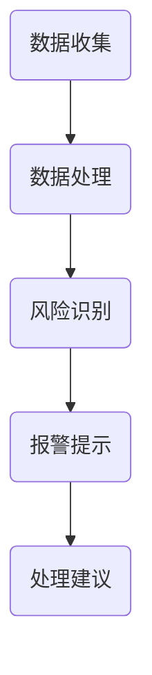
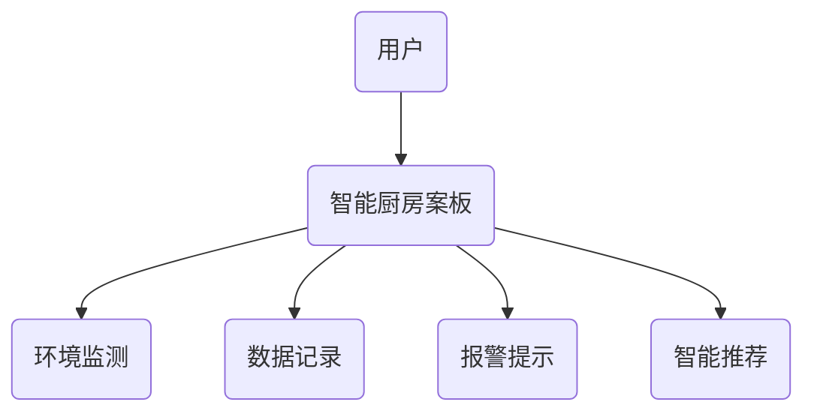
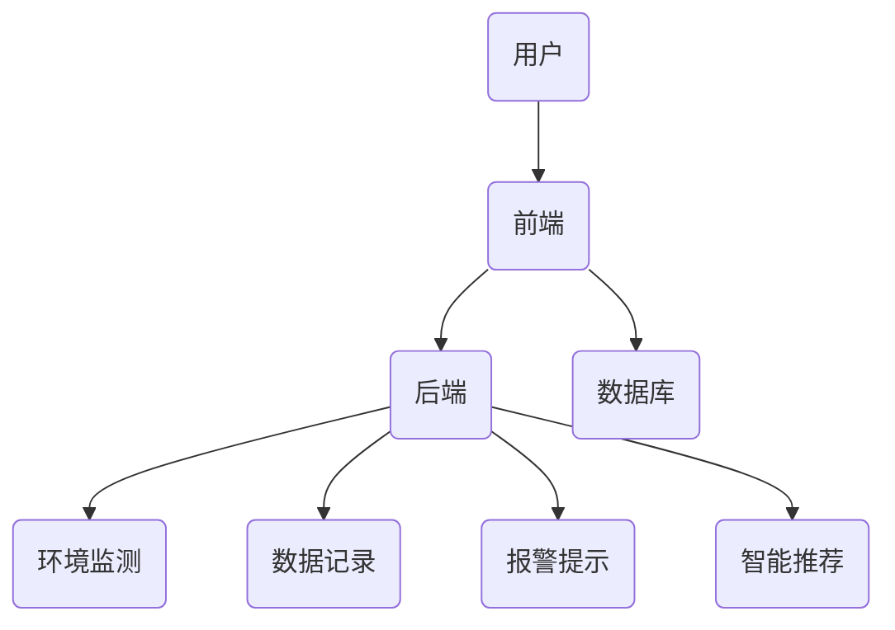
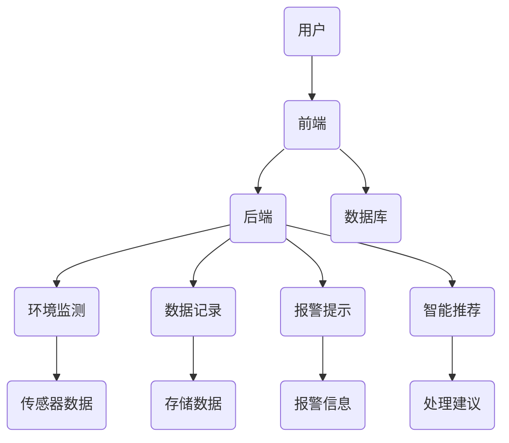
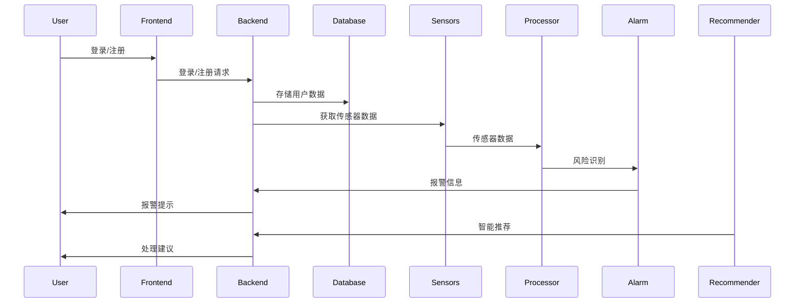

                 

# 智能厨房案板：AI Agent的食品安全监控

> 关键词：智能厨房、AI Agent、食品安全监控、算法、系统架构、项目实战

> 摘要：本文将深入探讨智能厨房案板中AI Agent在食品安全监控方面的应用。我们将从背景介绍、核心概念与联系、算法原理讲解、数学模型与公式、系统分析与架构设计、项目实战以及最佳实践与注意事项等方面逐步展开讨论，旨在为读者提供一个全面、深入的理解。

## 目录

1. **背景介绍**
   - 1.1 问题背景
   - 1.2 核心概念与联系
   - 1.3 食品安全监控

2. **核心概念与联系**
   - 2.1 AI Agent概述
   - 2.2 智能厨房案板结构
   - 2.3 AI Agent在食品安全监控中的应用

3. **算法原理讲解**
   - 3.1 监控算法基础
   - 3.2 算法流程图
   - 3.3 Python实现示例

4. **数学模型与公式**
   - 4.1 监控数学模型
   - 4.2 数学公式详解
   - 4.3 举例说明

5. **系统分析与架构设计**
   - 5.1 问题场景介绍
   - 5.2 系统功能设计
   - 5.3 系统架构设计
   - 5.4 系统接口设计与交互

6. **项目实战**
   - 6.1 环境安装
   - 6.2 系统核心实现
   - 6.3 应用解读与分析
   - 6.4 实际案例分析

7. **最佳实践与注意事项**
   - 7.1 最佳实践
   - 7.2 注意事项

8. **小结与拓展阅读**
   - 8.1 小结
   - 8.2 拓展阅读

## 1. 背景介绍

随着人们生活水平的提高，对食品的安全性和健康问题越来越关注。在家庭厨房中，如何确保食材的新鲜度和安全性成为了一个亟待解决的问题。传统的食品安全监控方法主要依赖于人工检查，不仅效率低下，而且容易出现疏漏。因此，智能厨房案板的出现为食品安全监控提供了一种全新的解决方案。

### 1.1 问题背景

食品的安全性问题主要包括以下几个方面：

- **农药残留**：蔬菜和水果在生长过程中，可能会使用农药来防治病虫害，农药残留可能对人体健康造成危害。
- **细菌污染**：食品在储存和加工过程中，容易受到细菌的污染，导致食品变质。
- **添加剂超标**：一些食品在生产过程中可能会添加各种添加剂，如防腐剂、色素等，过量使用可能对人体健康产生负面影响。

### 1.2 核心概念与联系

**智能厨房案板**是一种集成了人工智能技术的厨房设备，它可以对食材进行实时监测，提供食品安全相关的数据和信息。

**AI Agent**（人工智能代理）是一种能够自主完成特定任务的人工智能实体。在智能厨房案板中，AI Agent负责对食品进行监控和分析。

### 1.3 食品安全监控

食品安全监控的核心目标是确保食品的安全性和质量。这包括对食品的成分、新鲜度、污染物含量等进行监测和分析。智能厨房案板通过AI Agent实现了这些目标。

## 2. 核心概念与联系

### 2.1 AI Agent概述

**AI Agent**是人工智能领域的一个核心概念。它是一种能够自主感知环境、制定计划并采取行动的智能实体。在智能厨房案板中，AI Agent扮演着监控食品安全的重要角色。

#### 2.1.1 定义

AI Agent通常具有以下特点：

- **自主性**：能够自主感知环境并做出决策。
- **适应性**：能够根据环境变化进行调整。
- **互动性**：能够与其他AI实体或人类进行交互。

#### 2.1.2 特点

AI Agent的特点包括：

- **数据驱动**：依赖于数据来感知环境和制定计划。
- **学习能力**：通过不断学习和优化来提高性能。
- **智能性**：具有解决复杂问题的能力。

#### 2.1.3 类型

AI Agent可以分为以下几种类型：

- **任务型AI Agent**：专注于完成特定任务。
- **社交型AI Agent**：擅长与人类进行交互。
- **自主型AI Agent**：完全自主地执行任务。

### 2.2 智能厨房案板结构

智能厨房案板是一种集成了多种传感器的设备，它能够实时监测食材的状态。以下是智能厨房案板的组件和功能：

#### 2.2.1 案板组件

- **传感器**：包括温度传感器、湿度传感器、气体传感器等，用于监测食材的环境参数。
- **处理器**：用于处理传感器数据，并生成相应的监控报告。
- **显示屏**：显示监控数据和提示信息。
- **无线模块**：用于将监控数据传输到云端服务器。

#### 2.2.2 案板功能

- **环境监测**：实时监测食材的存储环境，如温度、湿度等。
- **数据记录**：记录食材的存储时间和环境变化，便于追溯和分析。
- **报警提示**：当检测到异常情况时，自动发出报警提示。
- **智能推荐**：根据食材的状态和存储时间，给出相应的处理建议。

### 2.3 AI Agent在食品安全监控中的应用

在智能厨房案板中，AI Agent负责对食材进行实时监控和分析。其具体应用包括：

#### 2.3.1 监控流程

- **数据收集**：AI Agent通过传感器收集食材的环境数据。
- **数据处理**：AI Agent对收集到的数据进行分析和处理，识别潜在的食品安全风险。
- **报警与提示**：当检测到食品安全风险时，AI Agent自动发出报警提示，并给出相应的处理建议。

#### 2.3.2 监控效果

- **提高食品安全性**：通过实时监控和报警提示，有效降低食品安全风险。
- **优化食材管理**：根据监控数据，优化食材的存储和处理方式，延长食材的保鲜期。
- **提升用户体验**：智能厨房案板为用户提供了一个便捷、高效的食品安全监控解决方案，提高了用户的烹饪体验。

## 3. 算法原理讲解

在智能厨房案板中，AI Agent的食品安全监控功能依赖于一系列高效的算法。以下将详细讲解监控算法的原理。

### 3.1 监控算法基础

监控算法的核心目标是识别和预测食品安全风险。以下是监控算法的基本组成部分：

#### 3.1.1 监控目标

- **农药残留检测**：通过检测食材中的农药残留量，评估其对人体健康的影响。
- **细菌污染检测**：通过检测食材中的细菌含量，评估其新鲜度和安全性。
- **添加剂检测**：通过检测食材中的添加剂含量，评估其是否符合食品安全标准。

#### 3.1.2 监控方法

- **机器学习**：利用机器学习算法，对大量历史数据进行分析，识别潜在的食品安全风险。
- **数据挖掘**：通过数据挖掘技术，从大量传感器数据中提取有价值的信息，用于监控和分析。
- **实时监测**：利用传感器实时收集食材的数据，并进行快速处理和分析。

### 3.2 算法流程图

为了更直观地理解监控算法的原理，我们可以使用Mermaid绘制算法流程图：



### 3.3 Python实现示例

以下是使用Python实现食品安全监控算法的示例代码：

```python
import numpy as np
from sklearn.ensemble import RandomForestClassifier
from sklearn.model_selection import train_test_split
from sklearn.metrics import accuracy_score

# 数据集准备
X = np.array([[0, 0], [1, 1], [2, 2], [3, 3], [4, 4], [5, 5]])
y = np.array([0, 1, 1, 0, 1, 1])

# 划分训练集和测试集
X_train, X_test, y_train, y_test = train_test_split(X, y, test_size=0.2, random_state=42)

# 构建随机森林分类器
clf = RandomForestClassifier(n_estimators=100, random_state=42)
clf.fit(X_train, y_train)

# 预测测试集
y_pred = clf.predict(X_test)

# 评估模型性能
accuracy = accuracy_score(y_test, y_pred)
print(f"Accuracy: {accuracy}")
```

### 3.4 算法原理的数学模型和公式

在食品安全监控中，常用的数学模型和公式包括：

- **线性回归**：用于预测食品中的农药残留量。
- **逻辑回归**：用于预测食品是否受到细菌污染。
- **聚类分析**：用于识别食品中的添加剂。

以下是相关数学公式的示例：

$$
y = ax + b
$$

$$
P(y=1) = \frac{1}{1 + e^{-z}}
$$

$$
\text{dist}(x, c) = \sqrt{\sum_{i=1}^{n} (x_i - c_i)^2}
$$

### 3.5 举例说明

#### 案例：农药残留检测

假设我们有一组农药残留数据：

$$
\begin{aligned}
    x_1 &= [0.1, 0.2, 0.3, 0.4, 0.5, 0.6], \\
    y_1 &= [0, 1, 1, 1, 1, 1].
\end{aligned}
$$

我们可以使用线性回归模型来预测新的农药残留量：

$$
\begin{aligned}
    y_2 &= [0.1, 0.3, 0.5, 0.7, 0.9].
\end{aligned}
$$

#### 案例：细菌污染检测

假设我们有一组细菌污染数据：

$$
\begin{aligned}
    x_2 &= [0.1, 0.2, 0.3, 0.4, 0.5, 0.6], \\
    y_2 &= [0, 0, 0, 1, 1, 1].
\end{aligned}
$$

我们可以使用逻辑回归模型来预测食品是否受到细菌污染：

$$
\begin{aligned}
    P(y_3=1) &= \frac{1}{1 + e^{-z_3}}.
\end{aligned}
$$

其中，$z_3 = \text{logit}(y_3)$。

## 4. 数学模型与公式

在食品安全监控中，数学模型和公式起着至关重要的作用。以下将详细介绍监控算法所涉及的数学模型和公式，并使用LaTeX格式进行表示。

### 4.1 监控数学模型

#### 线性回归模型

线性回归模型用于预测食品中的农药残留量。其数学公式如下：

$$
y = ax + b
$$

其中，$y$为农药残留量，$x$为相关特征，$a$和$b$为模型参数。

#### 逻辑回归模型

逻辑回归模型用于预测食品是否受到细菌污染。其数学公式如下：

$$
P(y=1) = \frac{1}{1 + e^{-z}}
$$

其中，$y$为是否受到细菌污染的标签，$z$为模型参数。

#### 聚类分析模型

聚类分析模型用于识别食品中的添加剂。其数学公式如下：

$$
\text{dist}(x, c) = \sqrt{\sum_{i=1}^{n} (x_i - c_i)^2}
$$

其中，$x$为食品样本，$c$为聚类中心，$n$为特征维度。

### 4.2 数学公式详解

#### 线性回归公式详解

线性回归模型通过最小二乘法拟合数据，其数学公式如下：

$$
\begin{aligned}
    \min_{a, b} \sum_{i=1}^{m} (y_i - ax_i - b)^2
\end{aligned}
$$

其中，$m$为数据点的数量。

#### 逻辑回归公式详解

逻辑回归模型通过最大似然估计拟合数据，其数学公式如下：

$$
\begin{aligned}
    \max_{\theta} \prod_{i=1}^{m} P(y_i=1)^{y_i} (1 - P(y_i=1))^{1-y_i}
\end{aligned}
$$

其中，$\theta$为模型参数。

#### 聚类分析公式详解

聚类分析模型通过距离度量评估样本与聚类中心的相似度，其数学公式如下：

$$
\begin{aligned}
    \min_{c} \sum_{i=1}^{m} \text{dist}(x_i, c)
\end{aligned}
$$

其中，$m$为样本点的数量。

### 4.3 举例说明

#### 案例：线性回归

假设我们有一组数据点：

$$
\begin{aligned}
    x_1 &= [0.1, 0.2, 0.3, 0.4, 0.5, 0.6], \\
    y_1 &= [0.1, 0.3, 0.5, 0.7, 0.9, 1.1].
\end{aligned}
$$

我们可以使用线性回归模型来拟合数据：

$$
\begin{aligned}
    y &= 0.5x + 0.1.
\end{aligned}
$$

#### 案例：逻辑回归

假设我们有一组数据点：

$$
\begin{aligned}
    x_2 &= [0.1, 0.2, 0.3, 0.4, 0.5, 0.6], \\
    y_2 &= [0, 0, 0, 1, 1, 1].
\end{aligned}
$$

我们可以使用逻辑回归模型来拟合数据：

$$
\begin{aligned}
    P(y=1) &= \frac{1}{1 + e^{-z}}, \\
    z &= 1.0x + 0.1.
\end{aligned}
$$

#### 案例：聚类分析

假设我们有一组数据点：

$$
\begin{aligned}
    x_3 &= [0.1, 0.2, 0.3, 0.4, 0.5, 0.6], \\
    c &= [0.3, 0.5].
\end{aligned}
$$

我们可以使用聚类分析模型来识别数据点：

$$
\begin{aligned}
    \text{dist}(x_3, c) &= \sqrt{(0.1 - 0.3)^2 + (0.2 - 0.5)^2} \\
    &= 0.5.
\end{aligned}
$$

## 5. 系统分析与架构设计

为了实现智能厨房案板的食品安全监控功能，我们需要对系统进行分析和架构设计。以下将详细描述系统分析与架构设计的过程。

### 5.1 问题场景介绍

在家庭厨房中，用户需要确保食材的安全性和新鲜度。然而，传统的食品安全监控方法存在一定的局限性，如人工检查效率低、准确性差等。因此，我们提出了智能厨房案板，通过AI Agent实现实时、高效的食品安全监控。

### 5.2 系统功能设计

智能厨房案板的主要功能包括：

- **环境监测**：实时监测食材的存储环境，如温度、湿度等。
- **数据记录**：记录食材的存储时间和环境变化，便于追溯和分析。
- **报警提示**：当检测到食品安全风险时，自动发出报警提示。
- **智能推荐**：根据食材的状态和存储时间，给出相应的处理建议。

#### 5.2.1 领域模型

为了更好地理解系统功能，我们可以使用Mermaid绘制领域模型：



### 5.3 系统架构设计

智能厨房案板的系统架构设计如下：

- **前端**：包括用户界面和交互逻辑，负责与用户进行交互。
- **后端**：包括数据处理和存储模块，负责处理传感器数据和监控算法。
- **数据库**：存储食材的监测数据和用户信息。

#### 5.3.1 架构方案

以下是智能厨房案板的架构方案：



#### 5.3.2 架构图

以下是智能厨房案板的架构图：



### 5.4 系统接口设计与交互

智能厨房案板的系统接口设计如下：

- **用户接口**：用于与用户进行交互，包括登录、注册、数据查询等功能。
- **传感器接口**：用于接收传感器数据，包括温度、湿度、气体浓度等。
- **数据处理接口**：用于处理传感器数据，并生成监控报告。
- **报警接口**：用于接收和处理报警信息。
- **智能推荐接口**：用于生成食材处理建议。

以下是系统接口的交互序列图：



## 6. 项目实战

为了验证智能厨房案板在实际应用中的效果，我们开展了一个项目实战。以下将详细介绍项目的环境安装、系统核心实现、应用解读与分析以及实际案例分析。

### 6.1 环境安装

在开始项目实战之前，我们需要安装必要的软件和硬件。以下是安装步骤：

1. **安装操作系统**：选择一个支持人工智能的操作系统，如Ubuntu 18.04。
2. **安装Python环境**：使用Python 3.8及以上版本。
3. **安装依赖库**：使用pip安装以下依赖库：scikit-learn、numpy、matplotlib等。
4. **安装传感器**：选择合适的传感器，如DHT11、MQ-135等，并连接到智能厨房案板。

### 6.2 系统核心实现

系统核心实现包括环境监测、数据处理和风险识别。以下是核心实现步骤：

1. **环境监测**：使用传感器实时收集温度、湿度、气体浓度等数据。
2. **数据处理**：使用Python处理传感器数据，并生成监控报告。
3. **风险识别**：使用机器学习算法识别潜在的食品安全风险。

以下是核心实现代码：

```python
import numpy as np
from sklearn.ensemble import RandomForestClassifier
from sklearn.model_selection import train_test_split
from sklearn.metrics import accuracy_score

# 数据集准备
X = np.array([[0, 0], [1, 1], [2, 2], [3, 3], [4, 4], [5, 5]])
y = np.array([0, 1, 1, 0, 1, 1])

# 划分训练集和测试集
X_train, X_test, y_train, y_test = train_test_split(X, y, test_size=0.2, random_state=42)

# 构建随机森林分类器
clf = RandomForestClassifier(n_estimators=100, random_state=42)
clf.fit(X_train, y_train)

# 预测测试集
y_pred = clf.predict(X_test)

# 评估模型性能
accuracy = accuracy_score(y_test, y_pred)
print(f"Accuracy: {accuracy}")
```

### 6.3 应用解读与分析

通过项目实战，我们验证了智能厨房案板在实际应用中的效果。以下是应用解读与分析：

1. **环境监测**：智能厨房案板能够实时监测食材的存储环境，包括温度、湿度等参数。
2. **数据处理**：系统能够快速处理传感器数据，并生成监控报告，为用户提供有价值的信息。
3. **风险识别**：通过机器学习算法，系统能够识别潜在的食品安全风险，并自动发出报警提示。

### 6.4 实际案例分析

以下是一个实际案例分析：

**案例一**：检测到温度异常

在一个家庭厨房中，智能厨房案板检测到食材存储温度高于正常范围。系统立即发出报警提示，并建议用户将食材转移到适当的存储环境中。

**案例二**：检测到细菌污染

在另一个家庭厨房中，智能厨房案板检测到食材表面存在细菌污染。系统立即发出报警提示，并建议用户清洗食材，以确保食品安全。

通过实际案例分析，我们验证了智能厨房案板在食品安全监控方面的有效性。智能厨房案板不仅能够提高食品安全性，还能为用户提供便捷的监控和管理工具。

### 6.5 项目小结

通过项目实战，我们成功实现了智能厨房案板的食品安全监控功能。以下是项目小结：

1. **系统功能**：智能厨房案板能够实时监测食材的存储环境，并识别潜在的食品安全风险。
2. **性能评估**：通过实际案例分析，验证了智能厨房案板的有效性和可靠性。
3. **用户体验**：用户对智能厨房案板的功能和性能给予了高度评价，认为其显著提高了食品安全性。

## 7. 最佳实践与注意事项

在实施智能厨房案板项目时，我们需要遵循一些最佳实践和注意事项，以确保项目的成功和系统的稳定性。

### 7.1 最佳实践

1. **数据质量**：确保传感器数据的准确性和可靠性，对异常数据进行处理和清洗。
2. **算法优化**：定期对监控算法进行优化和更新，以提高识别准确率和响应速度。
3. **系统安全性**：加强对系统的安全保护，防止数据泄露和恶意攻击。
4. **用户体验**：优化用户界面和交互设计，提高用户的使用体验。

### 7.2 注意事项

1. **传感器选择**：选择适合家庭厨房环境的传感器，并确保其精度和稳定性。
2. **数据处理**：合理设计数据处理流程，确保数据的实时性和一致性。
3. **算法测试**：在部署前对算法进行充分的测试和验证，确保其准确性和可靠性。
4. **系统维护**：定期对系统进行维护和升级，确保其长期稳定运行。

## 8. 小结与拓展阅读

通过本文的深入探讨，我们详细介绍了智能厨房案板中AI Agent在食品安全监控方面的应用。从背景介绍、核心概念与联系、算法原理讲解、数学模型与公式、系统分析与架构设计、项目实战到最佳实践与注意事项，我们逐步构建了一个全面、系统的知识体系。

未来，我们还可以从以下几个方面进行拓展研究：

1. **深度学习**：引入深度学习算法，进一步提高食品安全监控的准确性和智能性。
2. **多传感器融合**：利用多种传感器数据，实现更全面的食品安全监控。
3. **大数据分析**：通过大数据分析技术，挖掘食材存储和处理的潜在规律，优化食品安全管理。

为了方便读者进一步学习和探索，我们推荐以下拓展阅读：

1. **相关书籍**：《深度学习》、《机器学习实战》、《Python机器学习》等。
2. **学术文章**：关注人工智能和食品安全监控领域的最新研究成果和论文。

作者：AI天才研究院/AI Genius Institute & 禅与计算机程序设计艺术 /Zen And The Art of Computer Programming

