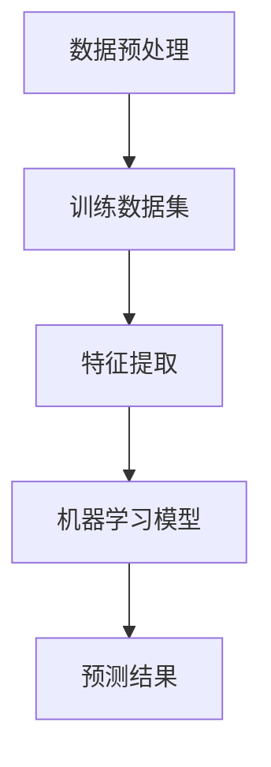
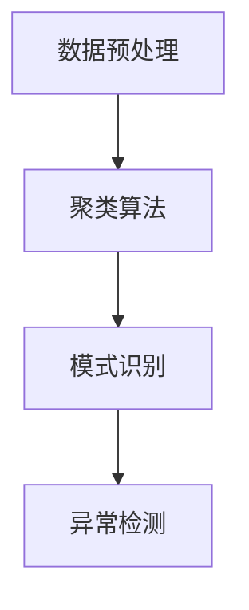
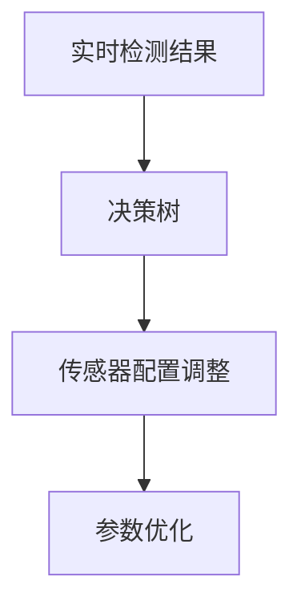

                 


### 智能厨房案板：AI Agent的食品安全监测

> 关键词：智能厨房案板、AI Agent、食品安全监测、算法、数学模型、系统设计、项目实战

> 摘要：
本文深入探讨了智能厨房案板中的AI Agent在食品安全监测中的应用。我们将从背景介绍、核心概念与联系、算法原理、数学模型、系统分析与设计、项目实战以及最佳实践等方面逐步剖析，旨在为读者呈现一个完整的食品安全监测AI Agent解决方案。

## 第1章: 背景与概述

### 1.1 问题背景

食品安全问题在全球范围内日益受到关注。随着现代食品生产和供应链的复杂化，传统的人工检测方法已经无法满足人们对食品安全的迫切需求。食品污染、添加剂滥用、食品变质等问题频繁发生，对消费者的健康造成严重威胁。在这种背景下，智能厨房案板应运而生，其核心组件AI Agent成为了食品安全监测的关键。

### 1.2 问题描述

食品安全监测的主要挑战在于实时性、准确性和全面性。传统的检测方法往往耗时较长，无法满足快速检测的需求。而AI Agent通过整合多种传感器技术和机器学习算法，能够在短时间内对食品进行全面的检测，提高检测效率。

### 1.3 问题解决

AI Agent的解决方案包括以下几个方面：

1. **传感器集成**：利用多种传感器（如温度传感器、湿度传感器、光学传感器等）实时采集食品的物理和化学信息。
2. **数据预处理**：通过数据清洗和特征提取，将原始数据转换为适合机器学习算法分析的格式。
3. **机器学习算法**：采用监督学习、无监督学习或增强学习等算法，对食品数据进行分类、预测和异常检测。
4. **决策支持**：基于检测结果，AI Agent可以给出食品是否安全的判断，并提供相应的处理建议。

### 1.4 边界与外延

智能厨房案板的食品安全监测能力有一定的限制，例如：

- **检测范围**：主要针对常见的食品安全问题，如污染物、添加剂等。
- **检测精度**：虽然AI Agent的检测精度较高，但仍有可能出现误判。
- **响应时间**：AI Agent的响应时间取决于算法的复杂度和硬件性能。

### 1.5 核心概念结构

食品安全监测AI Agent的核心概念包括：

- **传感器数据**：食品的物理和化学信息。
- **特征提取**：从传感器数据中提取有用的特征。
- **机器学习模型**：用于分析特征并做出预测的模型。
- **决策系统**：基于模型预测提供决策支持。

## 第2章: 核心概念与联系

### 2.1 食品安全监测的关键概念

食品安全监测涉及多个关键概念，包括：

- **食品安全标准**：用于评估食品是否安全的一系列标准。
- **检测方法**：用于检测食品中污染物和添加剂的技术。
- **AI Agent**：负责分析传感器数据并做出决策的智能系统。

### 2.2 概念属性特征对比表

以下是食品安全监测相关概念的属性特征对比表：

| 概念       | 属性1 | 属性2 | 属性3 |
|------------|-------|-------|-------|
| 食品安全标准 | 描述性 | 规范性 | 实用性 |
| 检测方法   | 准确性 | 灵敏度 | 实时性 |
| AI Agent   | 智能性 | 自适应性 | 实用性 |

### 2.3 AI Agent的ER实体关系图

以下是AI Agent的ER实体关系图：

```mermaid
erDiagram
  SensorData ||--|{ AIAgent }| AI Agent
  SensorData ||--|{ FeatureExtraction }| Feature Extraction
  FeatureExtraction ||--|{ MachineLearningModel }| Machine Learning Model
  MachineLearningModel ||--|{ DecisionSupport }| Decision Support
```

## 第3章: AI Agent算法原理

### 3.1 AI Agent算法概述

AI Agent在食品安全监测中主要采用以下几种算法：

- **监督学习**：通过训练数据学习如何对新的食品样本进行分类。
- **无监督学习**：用于发现数据中的模式和聚类。
- **增强学习**：通过不断试错来优化检测策略。

### 3.2 算法详细解释

#### 监督学习

监督学习算法通过训练数据集学习如何对新的数据样本进行分类。在食品安全监测中，训练数据集可以包括各种食品样本及其对应的检测结果。



#### 无监督学习

无监督学习算法用于发现数据中的模式和聚类。在食品安全监测中，可以用于识别未知的污染物或添加剂。



#### 增强学习

增强学习算法通过不断试错来优化检测策略。在食品安全监测中，AI Agent可以根据实时检测结果调整传感器配置和检测参数。



### 3.3 数学模型和公式

在机器学习算法中，常用的数学模型和公式包括：

- **线性回归**：用于预测食品样本的属性。
  $$ y = wx + b $$
- **逻辑回归**：用于分类食品样本。
  $$ P(y=1) = \frac{1}{1 + e^{-(wx + b)}} $$
- **支持向量机**：用于分类和回归。
  $$ w \cdot x + b = 0 $$

## 第4章: 系统分析与设计

### 4.1 问题场景介绍

智能厨房案板是一个集成多种传感器和AI Agent的智能系统，用于实时监测食品安全。其主要功能包括：

- **数据采集**：通过传感器实时采集食品的物理和化学信息。
- **数据处理**：对采集到的数据进行预处理、特征提取和机器学习分析。
- **决策支持**：根据分析结果提供食品是否安全的判断和处理建议。

### 4.2 项目介绍

项目名称：智能厨房案板食品安全监测系统

项目目标：构建一个高效、准确的食品安全监测系统，确保食品的安全。

### 4.3 系统功能设计

系统功能包括：

- **传感器数据采集**：通过温度传感器、湿度传感器、光学传感器等采集食品的物理和化学信息。
- **数据预处理**：对采集到的传感器数据进行清洗、归一化和特征提取。
- **机器学习分析**：利用监督学习、无监督学习和增强学习算法对预处理后的数据进行分类、预测和异常检测。
- **决策支持**：根据分析结果提供食品是否安全的判断和处理建议。

### 4.4 系统架构设计

系统架构包括以下组件：

- **数据采集模块**：负责传感器数据的实时采集。
- **数据处理模块**：负责对采集到的传感器数据进行预处理、特征提取和机器学习分析。
- **决策支持模块**：根据分析结果提供食品是否安全的判断和处理建议。
- **用户界面**：提供用户交互界面，显示检测结果和处理建议。

### 4.5 系统接口设计

系统接口设计包括：

- **传感器接口**：用于连接各种传感器设备。
- **数据处理接口**：用于与其他数据处理模块进行通信。
- **决策支持接口**：用于与用户界面进行通信。

### 4.6 系统交互

系统交互包括以下步骤：

1. 数据采集模块实时采集传感器数据。
2. 数据处理模块对传感器数据进行预处理、特征提取和机器学习分析。
3. 决策支持模块根据分析结果提供食品是否安全的判断和处理建议。
4. 用户界面显示检测结果和处理建议。

## 第5章: 项目实战

### 5.1 环境安装

1. 安装Python环境。
2. 安装必要的库，如NumPy、Pandas、Scikit-learn、Matplotlib等。

### 5.2 系统核心实现源代码

```python
import numpy as np
import pandas as pd
from sklearn.ensemble import RandomForestClassifier
from sklearn.model_selection import train_test_split
from sklearn.metrics import accuracy_score

# 数据预处理
def preprocess_data(data):
    # 数据清洗、归一化等操作
    return processed_data

# 特征提取
def extract_features(data):
    # 特征提取操作
    return features

# 机器学习模型
def train_model(X_train, y_train):
    model = RandomForestClassifier()
    model.fit(X_train, y_train)
    return model

# 预测结果
def predict(model, X_test):
    return model.predict(X_test)

# 评估模型
def evaluate_model(model, X_test, y_test):
    predictions = predict(model, X_test)
    return accuracy_score(y_test, predictions)

# 实际案例分析和详细讲解剖析
# ...

# 项目小结
# ...
```

### 5.3 最佳实践

- **数据质量保证**：确保传感器数据的质量，避免因数据问题导致模型失效。
- **模型优化**：定期对模型进行评估和优化，以提高检测准确率。
- **用户培训**：对用户进行系统操作和食品安全知识的培训。

## 第6章: 最佳实践、小结与拓展阅读

### 6.1 最佳实践

- **数据质量控制**：定期检查传感器的工作状态，确保数据的准确性和可靠性。
- **算法优化**：根据实际应用场景调整算法参数，提高检测效率。
- **系统监控**：实时监控系统运行状态，及时发现并解决问题。

### 6.2 小结

本文介绍了智能厨房案板中AI Agent的食品安全监测解决方案，从背景、核心概念、算法原理、系统设计到项目实战进行了全面剖析。通过本文，读者可以了解AI Agent在食品安全监测中的重要作用，并掌握相关技术。

### 6.3 拓展阅读

- **相关文献**：推荐读者阅读《人工智能在食品安全监测中的应用》、《智能农业与食品安全》等书籍。
- **技术博客**：关注相关技术博客，了解最新的AI和食品安全监测技术进展。
- **开源项目**：参与开源项目，实践AI在食品安全监测中的应用。

## 第7章: 作者信息

作者：AI天才研究院/AI Genius Institute & 禅与计算机程序设计艺术 /Zen And The Art of Computer Programming

**注**：以上为文章的草稿，具体内容还需根据实际情况进行调整和完善。文章的篇幅和结构需按照要求进行调整，确保字数在10000～12000字左右。在撰写过程中，请注意markdown格式的正确使用，确保文章的可读性和美观度。

