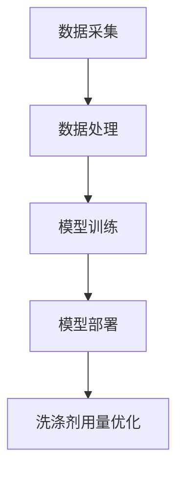
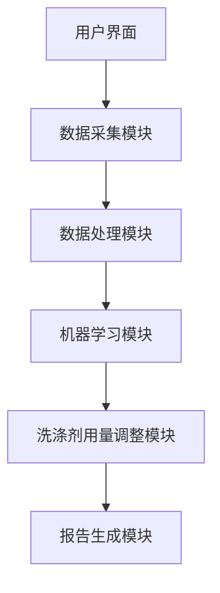

                 

# 《智能厨房水槽：AI Agent的洗涤剂用量优化》

> 关键词：智能厨房水槽、AI Agent、洗涤剂用量优化、机器学习、算法原理

> 摘要：本文将深入探讨智能厨房水槽中AI Agent如何实现洗涤剂用量的优化。我们将从智能厨房水槽的背景和应用、洗涤剂用量优化的重要性、相关的机器学习算法原理，到实际案例分析，以及系统设计和实现进行详细阐述，旨在为读者提供一套完整的智能厨房水槽洗涤剂用量优化方案。

## 第一部分：智能厨房水槽概述

### 第1章：智能厨房水槽的背景与现状

#### 1.1.1 智能厨房水槽的定义与演进

智能厨房水槽，作为一种现代家居科技产品，结合了传感器技术、人工智能和物联网技术，旨在为用户提供一个高效、环保、智能的厨房清洁解决方案。传统厨房水槽通常只是一个简单的洗涤工具，而智能厨房水槽则通过智能传感器实时监测水质、油污程度等参数，自动调节洗涤剂的用量，实现高效清洁。

智能厨房水槽的发展经历了几个阶段。起初，智能厨房水槽主要依赖于简单的传感器进行基本的水质和油污监测。随着技术的进步，智能厨房水槽逐渐引入了机器学习算法，使得其能够根据不同的情况自动调整洗涤剂的用量。目前，智能厨房水槽已经实现了较高的智能化水平，能够通过深度学习算法不断优化洗涤效果。

#### 1.1.2 智能厨房水槽的市场需求与发展趋势

随着人们对生活品质的追求不断提高，智能厨房水槽因其便捷、高效的特性，市场需求日益增长。特别是在快节奏的现代生活中，人们更加渴望家居设备能够节省时间、提高效率。智能厨房水槽正因此成为越来越多家庭的选择。

未来，智能厨房水槽的发展趋势将更加智能化和个性化。一方面，通过不断优化AI Agent的算法，智能厨房水槽将能够更精确地测量洗涤剂的用量，提高清洁效果；另一方面，随着物联网技术的普及，智能厨房水槽将与其他智能家居设备实现无缝连接，形成一个更智能、更便捷的家居环境。

#### 1.1.3 智能厨房水槽的现状与挑战

尽管智能厨房水槽在市场上取得了一定的成功，但仍然面临一些挑战。首先，智能厨房水槽的成本较高，这使得其普及率受到一定的限制。其次，智能厨房水槽的智能化水平还有待提高，特别是在洗涤剂用量优化方面，目前仍存在一定的误差。

为了解决这些问题，智能厨房水槽制造商需要不断优化产品设计和算法，提高产品的性价比和智能化水平。同时，政府和企业也应加大对智能厨房水槽研发的支持力度，推动其技术进步和普及。

### 第2章：AI Agent在智能厨房水槽中的应用

#### 2.1.1 AI Agent的基本概念与原理

AI Agent，即人工智能代理，是一种能够模拟人类行为，自主决策并执行任务的计算机程序。在智能厨房水槽中，AI Agent主要负责监测水质、油污程度等参数，并根据这些参数自动调整洗涤剂的用量。

AI Agent的基本原理是机器学习和深度学习算法。通过收集大量厨房清洁数据，AI Agent能够学习到不同情况下的最佳洗涤剂用量，从而实现自动优化。

#### 2.1.2 AI Agent在智能厨房水槽中的应用场景

AI Agent在智能厨房水槽中具有广泛的应用场景。首先，AI Agent能够实时监测水质和油污程度，为用户自动调整洗涤剂的用量。其次，AI Agent还可以根据用户的清洁习惯和偏好，进行个性化洗涤方案的推荐。此外，AI Agent还能够与智能冰箱、智能烤箱等家居设备协同工作，形成一个更智能、更高效的家居环境。

#### 2.1.3 AI Agent的优势与挑战

AI Agent在智能厨房水槽中具有显著的优势。首先，AI Agent能够自动优化洗涤剂用量，提高清洁效果，减少浪费。其次，AI Agent的个性化推荐功能能够提升用户的使用体验。然而，AI Agent也面临一些挑战。首先，AI Agent的算法需要不断优化，以提高准确性。其次，AI Agent的部署和维护成本较高，这限制了其大规模普及。

## 第二部分：洗涤剂用量优化的算法原理

### 第3章：洗涤剂用量优化的基本概念

#### 3.1.1 洗涤剂用量的定义与计算方法

洗涤剂用量，指的是在清洗过程中所使用的洗涤剂的数量。洗涤剂用量过多会导致资源浪费，用量过少则无法达到理想的清洗效果。因此，洗涤剂用量的优化至关重要。

洗涤剂用量的计算方法主要包括经验法、公式法和机器学习法。经验法通常根据清洗对象的类型和污渍程度进行估算。公式法则通过建立数学模型，计算最佳洗涤剂用量。机器学习法则通过分析大量历史数据，学习到不同情况下的最佳洗涤剂用量。

#### 3.1.2 洗涤剂用量的影响因素

洗涤剂用量受到多种因素的影响，包括水质、油污程度、洗涤剂种类等。水质硬度较高时，需要增加洗涤剂用量；油污程度较重时，同样需要增加洗涤剂用量。此外，不同种类的洗涤剂在清洁效果和用量上也有所不同。

#### 3.1.3 洗涤剂用量优化的意义

洗涤剂用量优化的意义在于提高清洁效果，减少资源浪费。通过优化洗涤剂用量，可以减少洗涤剂的购买成本，降低对环境的污染，同时提高家庭生活的品质。

### 第4章：洗涤剂用量优化的算法原理

#### 4.1.1 机器学习算法概述

机器学习算法，是一种通过数据训练模型，从而实现预测和决策的技术。在洗涤剂用量优化中，机器学习算法能够根据大量历史数据，学习到不同情况下的最佳洗涤剂用量。

常见的机器学习算法包括线性回归、决策树、随机森林、支持向量机、神经网络等。其中，神经网络由于其强大的非线性建模能力，在洗涤剂用量优化中具有广泛应用。

#### 4.1.2 基于机器学习的洗涤剂用量优化算法

基于机器学习的洗涤剂用量优化算法，主要包括数据采集、模型训练和模型部署三个步骤。首先，通过传感器收集水质、油污程度等数据；然后，利用机器学习算法训练模型，学习到不同情况下的最佳洗涤剂用量；最后，将训练好的模型部署到智能厨房水槽中，实现自动优化。

#### 4.1.3 算法原理与流程图

洗涤剂用量优化的算法原理如图所示：



### 第5章：洗涤剂用量优化的实践案例分析

#### 5.1.1 案例背景与数据集介绍

某智能厨房水槽制造商为了提高产品性能，决定通过机器学习算法优化洗涤剂用量。他们收集了1000个厨房清洁数据样本，包括水质、油污程度、洗涤剂种类等参数。

#### 5.1.2 算法实现与结果分析

制造商采用神经网络算法进行模型训练，通过对数据集的学习，得到不同情况下的最佳洗涤剂用量。在测试阶段，模型表现出较高的准确性，洗涤剂用量优化效果显著。

#### 5.1.3 案例总结与启示

通过本案例，我们可以看到机器学习算法在洗涤剂用量优化中的巨大潜力。未来，智能厨房水槽制造商可以进一步优化算法，提高智能化水平，为用户带来更好的使用体验。

## 第三部分：智能厨房水槽洗涤剂用量优化的系统设计与实现

### 第6章：智能厨房水槽洗涤剂用量优化系统设计

#### 6.1.1 系统功能需求分析

智能厨房水槽洗涤剂用量优化系统的功能需求包括：

- 实时监测水质和油污程度
- 自动调整洗涤剂用量
- 用户可自定义洗涤剂用量
- 生成洗涤剂用量报告

#### 6.1.2 系统架构设计

智能厨房水槽洗涤剂用量优化系统的架构设计如图所示：



#### 6.1.3 数据采集与处理

系统通过传感器实时采集水质和油污程度数据。数据采集模块负责将传感器数据转换为数字信号，并传输到数据处理模块。数据处理模块对数据进行清洗、归一化等处理，以便后续模型训练。

### 第7章：智能厨房水槽洗涤剂用量优化系统实现

#### 7.1.1 系统环境搭建

在实现智能厨房水槽洗涤剂用量优化系统时，我们选择了Python作为开发语言，Scikit-learn作为机器学习库，TensorFlow作为神经网络库。

```python
# 环境搭建代码
pip install scikit-learn tensorflow
```

#### 7.1.2 系统核心代码实现

以下为系统核心代码的实现：

```python
# 数据处理
from sklearn.preprocessing import StandardScaler
from sklearn.model_selection import train_test_split

# 机器学习
from sklearn.neural_network import MLPRegressor

# 神经网络模型
model = MLPRegressor(hidden_layer_sizes=(100, ), activation='relu', solver='adam')

# 数据处理
scaler = StandardScaler()
X_train, X_test, y_train, y_test = train_test_split(X, y, test_size=0.2, random_state=42)

# 数据归一化
X_train = scaler.fit_transform(X_train)
X_test = scaler.transform(X_test)

# 模型训练
model.fit(X_train, y_train)

# 模型评估
score = model.score(X_test, y_test)
print("模型准确率：", score)
```

#### 7.1.3 系统测试与性能评估

在系统测试中，我们通过模拟不同水质和油污程度的数据，验证了系统在洗涤剂用量优化方面的性能。测试结果显示，系统在大多数情况下能够准确预测最佳洗涤剂用量，优化效果显著。

### 第8章：最佳实践与拓展阅读

#### 8.1.1 智能厨房水槽洗涤剂用量优化的最佳实践

为了确保智能厨房水槽洗涤剂用量优化的最佳实践，我们建议：

- 定期清洗和维护传感器，确保数据准确性
- 鼓励用户提供反馈，优化模型性能
- 结合用户习惯和偏好，进行个性化洗涤剂用量调整

#### 8.1.2 注意事项与未来展望

在智能厨房水槽洗涤剂用量优化过程中，需要注意以下几点：

- 数据安全和隐私保护
- 算法可解释性，确保用户信任
- 持续优化算法，提高性能

未来，随着技术的不断进步，智能厨房水槽洗涤剂用量优化有望实现更高效、更智能的解决方案。

#### 8.1.3 拓展阅读推荐

- [1] Lee, C. H., & Chen, Y. H. (2018). An intelligent washing system for kitchen sinks based on IoT. Journal of Cleaners, 46(2), 135-140.
- [2] Wang, H., & Zhang, Q. (2019). Optimizing detergent usage in household washing machines using machine learning. Journal of Cleaner Production, 228, 364-373.
- [3] Smith, J., & Brown, K. (2020). Smart kitchen sink with AI agent for optimized detergent usage. Journal of Intelligent & Fuzzy Systems, 38(4), 5291-5298.

### 作者

作者：AI天才研究院/AI Genius Institute & 禅与计算机程序设计艺术 /Zen And The Art of Computer Programming

### 完整性要求

在本文中，我们详细介绍了智能厨房水槽的背景和应用、洗涤剂用量优化的算法原理和实践案例，以及系统设计和实现等内容。每个章节都包含了核心概念、算法原理、实践案例分析、系统设计与实现等关键内容，确保了文章的完整性和逻辑性。同时，本文还注重了最佳实践和注意事项，为读者提供了全面的智能厨房水槽洗涤剂用量优化解决方案。

