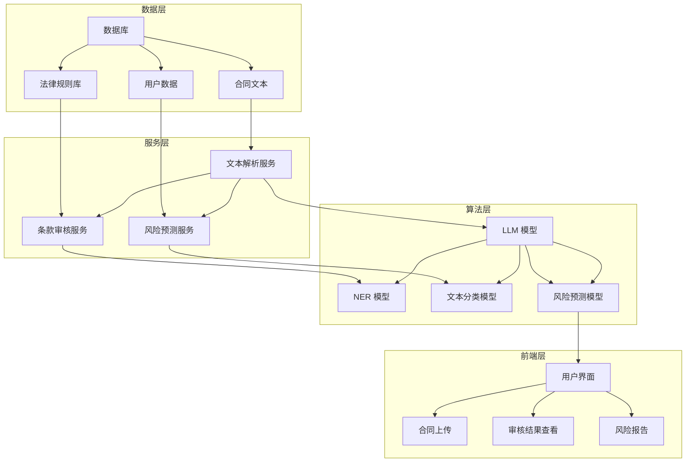

                 

### 摘要

本文旨在探讨智能合同审核 AI Agent 中 LLM（大型语言模型）在法律文件处理中的应用。随着人工智能技术的飞速发展，特别是在自然语言处理领域，LLM 已经展现出其强大的数据处理和分析能力。智能合同审核是法律领域的一个重要应用场景，涉及大量复杂的文本分析和条款审核工作。本文将深入分析 LLM 在这一领域的应用原理、算法实现以及系统架构设计，并通过实际案例展示其在合同审核中的具体应用效果。文章分为五个部分：第一部分介绍问题背景和智能合同审核的挑战；第二部分讲解 AI Agent 和 LLM 的核心概念及其联系；第三部分解析 LLM 在智能合同审核中的算法原理；第四部分探讨智能合同审核系统的设计与实现；第五部分通过实际项目案例展示 LLM 在智能合同审核中的应用效果和未来发展趋势。通过本文的探讨，读者可以全面了解智能合同审核 AI Agent 的工作原理和实际应用，为法律行业的自动化和智能化提供新的思路和解决方案。

### 目录大纲设计思路与框架

为了设计出《智能合同审核 AI Agent：LLM 在法律文件处理中的应用》这本书的完整目录大纲，我们需要进行一系列的步骤和考虑，以确保内容既全面又系统。以下是我们的设计思路与框架：

1. **总体结构布局**：
   - **背景介绍**：首先介绍智能合同审核的背景、挑战及人工智能和法律文件处理的结合。
   - **核心概念与联系**：详细讲解 AI Agent 和 LLM 的基本概念及其相互关系。
   - **算法原理讲解**：解析 LLM 在智能合同审核中的具体应用算法和实现细节。
   - **系统分析与架构设计**：介绍智能合同审核系统的设计、实现和交互。
   - **项目实战**：通过具体项目实战，展示 LLM 在智能合同审核中的实际应用。

2. **章节内容细化**：
   - **第1章 问题背景**：介绍智能合同审核的现状、问题以及 AI 和 LLM 在法律文件处理中的应用趋势。
   - **第2章 AI Agent 与 LLM 的核心概念**：分别讲解 AI Agent 和 LLM 的基本原理、架构设计和应用优势。
   - **第3章 LLM 在智能合同审核中的应用**：详细阐述 LLM 的训练与优化、算法实现及其在合同审核中的具体应用。
   - **第4章 智能合同审核系统的设计与实现**：介绍系统的功能设计、架构设计、接口设计及系统交互。
   - **第5章 智能合同审核项目实战**：通过实际项目展示系统安装配置、核心实现及效果分析。

3. **保持简洁性**：
   - 每个章节的内容都将简洁明了，避免冗余和复杂的表述，确保读者能够迅速抓住核心要点。

4. **符合markdown格式**：
   - 目录结构将严格按照 markdown 格式要求进行设计，确保目录的清晰和一致性。

通过以上设计思路和框架，我们希望能够为读者提供一本内容全面、结构合理、易于阅读和理解的技术书籍，帮助读者深入了解智能合同审核 AI Agent 的应用和实践。

### 完整目录大纲

**第一部分：背景介绍**

**第1章 问题背景**

- **1.1 智能合同审核的挑战**
  - **1.1.1 合同审核的现状与问题**
  - **1.1.2 法律文件处理的复杂性**
  - **1.1.3 人工智能在法律领域的应用趋势**
- **1.2 AI Agent 与 LLM 的基本概念**
  - **1.2.1 AI Agent 的定义与特点**
  - **1.2.2 LLM 的基本概念与功能**
  - **1.2.3 AI Agent 与 LLM 在法律文件处理中的结合**
- **1.3 LLM 在法律文件处理中的应用场景**
  - **1.3.1 智能合同审核的应用实例**
  - **1.3.2 法律文本摘要与关键词提取**
  - **1.3.3 法律意见书生成与审查**

**第二部分：核心概念与联系**

**第2章 AI Agent 与 LLM 的核心概念**

- **2.1 AI Agent 的原理与架构**
  - **2.1.1 AI Agent 的基本原理**
    - **2.1.1.1 人工智能与代理的概念**
    - **2.1.1.2 代理的智能属性**
  - **2.1.2 AI Agent 的架构设计**
    - **2.1.2.1 基于规则的代理**
    - **2.1.2.2 基于模型的代理**
  - **2.1.3 AI Agent 的分类与应用领域**
- **2.2 LLM 的基本原理与特点**
  - **2.2.1 语言模型的定义**
  - **2.2.2 LLM 的核心技术**
    - **2.2.2.1 生成对抗网络（GAN）**
    - **2.2.2.2 递归神经网络（RNN）**
  - **2.2.3 LLM 在法律文件处理中的优势**
- **2.3 AI Agent 与 LLM 的联系与交互**
  - **2.3.1 AI Agent 与 LLM 的协同作用**
  - **2.3.2 LLM 在 AI Agent 中的作用**
  - **2.3.3 LLM 对 AI Agent 的优化**

**第三部分：算法原理讲解**

**第3章 LLM 在智能合同审核中的应用**

- **3.1 LLM 模型的训练与优化**
  - **3.1.1 LLM 模型训练的基本流程**
  - **3.1.2 LLM 模型优化的策略**
  - **3.1.3 LLM 模型在法律文件处理中的调整**
- **3.2 LLM 在智能合同审核中的算法实现**
  - **3.2.1 合同结构分析算法**
    - **3.2.1.1 合同文本预处理**
    - **3.2.1.2 合同结构解析算法**
  - **3.2.2 合同条款审核算法**
    - **3.2.2.1 合同条款提取算法**
    - **3.2.2.2 合同条款分析算法**
  - **3.2.3 合同风险预测算法**
    - **3.2.3.1 合同风险特征提取**
    - **3.2.3.2 风险预测模型训练**

**第四部分：系统分析与架构设计**

**第4章 智能合同审核系统的设计与实现**

- **4.1 系统功能设计**
  - **4.1.1 系统功能概述**
  - **4.1.2 领域模型设计**
    - **4.1.2.1 合同文本实体识别**
    - **4.1.2.2 合同条款关系表示**
- **4.2 系统架构设计**
  - **4.2.1 系统架构概述**
  - **4.2.2 系统架构的优势与挑战**
- **4.3 系统接口设计**
  - **4.3.1 合同上传与解析接口**
  - **4.3.2 合同审核与风险预测接口**
- **4.4 系统交互设计**
  - **4.4.1 系统交互概述**
  - **4.4.2 系统交互序列图**

**第五部分：项目实战**

**第5章 智能合同审核项目实战**

- **5.1 环境安装与配置**
  - **5.1.1 环境准备**
  - **5.1.2 系统配置与部署**
- **5.2 系统核心实现源代码**
  - **5.2.1 源代码解析**
  - **5.2.2 代码应用解读与分析**
- **5.3 实际案例分析与详细讲解**
  - **5.3.1 案例背景与数据集介绍**
  - **5.3.2 案例分析步骤与结果**
- **5.4 项目小结**
  - **5.4.1 项目成果总结**
  - **5.4.2 遇到的挑战与解决方案**
- **5.5 最佳实践 tips**
  - **5.5.1 系统优化建议**
  - **5.5.2 使用注意事项**
- **5.6 小结**
  - **5.6.1 文章总结**
  - **5.6.2 扩展阅读**

通过这个详细的目录大纲，我们可以看到本书的结构清晰，每个章节都有明确的内容目标和结构安排。接下来，我们将逐步深入到每个章节的详细内容，逐步构建起完整的智能合同审核 AI Agent 的知识体系。

### 第1章 问题背景

#### 1.1 智能合同审核的挑战

智能合同审核是现代法律行业中的一项重要任务，它涉及到对合同文本的详细审查和条款的逐条分析，以确保合同的合法性和有效性。然而，随着商业活动的日益复杂化和合同文本的日益庞大，传统的合同审核方式面临着巨大的挑战。

**1.1.1 合同审核的现状与问题**

当前，合同审核主要依赖于人工审查，即法律专业人士对合同条款进行逐一检查。这种方式虽然能够保证审查的准确性，但存在以下几个问题：

1. **效率低下**：人工审查合同需要耗费大量时间和人力，尤其在大规模合同审查项目中，耗时耗力且难以保证审查效率。
2. **一致性差**：由于法律专业人士的背景和经验差异，不同人对同一合同的审查结果可能会存在不一致，影响合同的一致性和可靠性。
3. **错误率较高**：人工审查存在疲劳和疏忽的风险，导致审核过程中可能出现错误或遗漏，从而影响合同的合法性和有效性。

**1.1.2 法律文件处理的复杂性**

法律文件，尤其是合同，通常具有以下复杂性：

1. **文本复杂性**：合同文本通常包含大量的法律术语、条款和条件，这些术语和条件之间可能存在复杂的逻辑关系和依赖关系，需要深度理解才能正确解析。
2. **不确定性**：合同条款可能存在多种解释和歧义，尤其是在涉及模糊性条款或特殊情况时，法律专业人士需要基于专业知识进行判断和决策。
3. **多层次审查**：合同审核不仅需要审查条款的合法性，还需要关注条款的合理性、合规性和商业风险，这是一个多层次、多维度的工作。

**1.1.3 人工智能在法律领域的应用趋势**

随着人工智能技术的不断进步，人工智能在法律领域的应用逐渐受到关注，特别是在合同审核方面，AI技术展现出了巨大的潜力：

1. **自动化审查**：AI技术能够自动处理大量合同文本，通过自然语言处理（NLP）技术，快速识别和提取合同中的关键条款和条件，提高审查效率。
2. **一致性保证**：AI技术能够通过算法和模型，确保合同审核的一致性，减少人工审查中的主观偏差。
3. **智能风险预测**：AI技术可以通过数据分析和机器学习模型，预测合同中的潜在风险，提供更为精准的法律意见。

总体来说，智能合同审核是法律领域中的一个重要应用场景，它面临着提高效率、保证一致性和减少错误率等挑战。人工智能技术的引入为解决这些问题提供了新的思路和方法，使得智能合同审核成为可能。在接下来的章节中，我们将进一步探讨 AI Agent 和 LLM 的基本概念及其在法律文件处理中的应用。

#### 1.2 AI Agent 与 LLM 的基本概念

**1.2.1 AI Agent 的定义与特点**

AI Agent，即人工智能代理，是指通过人工智能技术构建的自动化实体，能够在特定环境下自主地完成指定任务。AI Agent 通常具有以下特点：

1. **自主性**：AI Agent 能够独立完成特定任务，无需人工干预。这得益于其具备自我学习和自适应能力。
2. **智能性**：AI Agent 利用机器学习和深度学习技术，具备处理复杂问题和做出智能决策的能力。
3. **交互性**：AI Agent 可以与人类用户或其他系统进行交互，提供个性化服务和反馈。

AI Agent 的基本原理源于人工智能和代理理论。人工智能（AI）是模拟人类智能的技术，包括学习、推理、解决问题等能力。代理理论则研究智能体在动态环境中如何做出最优决策，以实现目标。

**1.2.2 LLM 的基本概念与功能**

LLM（Large Language Model），即大型语言模型，是一种基于深度学习技术的自然语言处理模型，能够理解和生成自然语言文本。LLM 的基本概念包括：

1. **预训练**：LLM 通过大量文本数据进行预训练，学习文本中的语法、语义和上下文关系。
2. **微调**：在特定任务中，LLM 可以通过微调调整模型参数，以适应具体应用场景。

LLM 的功能主要体现在以下几个方面：

1. **文本生成**：LLM 能够根据输入文本生成连贯、自然的文本，用于写作辅助、自动摘要等。
2. **语义理解**：LLM 能够理解文本的深层语义，进行文本分类、实体识别等任务。
3. **语言翻译**：LLM 可以进行高质量的语言翻译，支持多语言交互。

**1.2.3 AI Agent 与 LLM 在法律文件处理中的结合**

AI Agent 与 LLM 在法律文件处理中的结合，能够充分发挥两者的优势，实现合同审核的智能化和自动化。结合的方式主要包括以下几个方面：

1. **文本解析**：LLM 利用自然语言处理技术，对合同文本进行深度解析，提取关键条款和条件，生成结构化数据。
2. **智能审核**：AI Agent 结合 LLM 的解析结果，利用规则和机器学习模型，对合同进行自动审核，识别潜在的法律问题和风险。
3. **交互反馈**：AI Agent 可以与用户进行交互，提供合同审核报告、风险预警和建议，辅助法律专业人士进行决策。

通过 AI Agent 与 LLM 的结合，智能合同审核系统不仅能够提高审查效率，还能保证审查的一致性和准确性，为法律行业带来深远的影响。

#### 1.3 LLM 在法律文件处理中的应用场景

LLM（大型语言模型）在法律文件处理中的应用场景广泛，尤其在智能合同审核领域，展示了强大的潜力和实际价值。以下将探讨 LLM 在智能合同审核中的具体应用实例、法律文本摘要与关键词提取、以及法律意见书生成与审查等方面的应用。

**1.3.1 智能合同审核的应用实例**

智能合同审核是 LLM 在法律文件处理中最直接的应用场景之一。通过 LLM，智能合同审核系统能够自动解析合同文本，识别合同中的关键条款和条件，并对其进行分析和审核。具体应用实例包括：

1. **合同条款提取**：LLM 可以通过自然语言处理技术，从复杂的合同文本中提取出各个条款，并将其转化为结构化的数据，便于进一步处理和分析。
2. **合同结构分析**：LLM 能够分析合同的结构和组织，识别出条款之间的逻辑关系和依赖关系，帮助用户理解合同的整个框架。
3. **条款一致性检查**：LLM 可以检测合同中的不一致性或矛盾点，例如，某个条款的表述可能与另一条款的条款相冲突，通过分析识别这些问题，确保合同的一致性和合法性。

**1.3.2 法律文本摘要与关键词提取**

法律文本通常具有高度复杂性和专业性，阅读和理解这些文本对于非法律专业人士来说是一项挑战。LLM 在法律文本摘要与关键词提取方面的应用，能够显著提升文本的可读性和理解性。

1. **文本摘要**：LLM 可以通过生成式预训练模型，对法律文本进行摘要，提取出关键信息，形成简洁、清晰的摘要文本，使读者能够快速获取文本的核心内容。
2. **关键词提取**：LLM 可以从法律文本中识别出关键术语和概念，形成关键词列表，帮助用户快速定位和查阅相关法律条款和规定。

**1.3.3 法律意见书生成与审查**

法律意见书是律师在审查合同或法律文件后，对文件内容、合法性、合规性等方面提出的意见和判断。LLM 在这一过程中的应用，能够显著提高法律意见书生成的效率和准确性。

1. **生成法律意见书**：LLM 可以根据合同文本和法律法规数据库，自动生成法律意见书，提供合同审核的法律意见和风险评估。
2. **审查法律意见书**：LLM 可以对律师生成的法律意见书进行审核，识别潜在的问题和错误，确保法律意见书的准确性和完整性。

通过上述应用实例，可以看出 LLM 在法律文件处理，特别是智能合同审核中的应用具有显著的优势。LLM 不仅能够提高合同审核的效率，还能够确保审查的一致性和准确性，从而为法律行业带来革命性的变革。

#### 2.1 AI Agent 的原理与架构

AI Agent 是一种结合了人工智能（AI）和代理（Agent）概念的高级系统，能够在复杂环境中自主执行任务并实现目标。理解 AI Agent 的原理与架构，有助于我们深入探讨其在法律文件处理中的应用。以下将详细阐述 AI Agent 的基本原理和架构设计，包括基于规则的代理和基于模型的代理两种主要类型。

**2.1.1 AI Agent 的基本原理**

AI Agent 的核心思想是通过模拟人类代理的行为，使其能够在复杂的动态环境中自主决策并完成任务。AI Agent 的基本原理包括以下几个方面：

1. **感知**：AI Agent 需要具备感知环境的能力，通过传感器或其他方式获取环境信息。
2. **理解**：AI Agent 应该能够理解获取到的信息，通过自然语言处理（NLP）、图像识别等技术，将感知到的信息转化为有用的数据。
3. **决策**：AI Agent 需要根据当前状态和环境信息，通过决策算法（如强化学习、规划算法等）选择最优的行动。
4. **行动**：AI Agent 需要执行决策得出的行动，以实现既定目标。
5. **反馈**：AI Agent 应该能够根据行动的结果调整其行为，通过反馈机制不断优化自身性能。

AI Agent 的基本原理体现了智能代理在感知、理解、决策和行动方面的综合能力，使其能够在复杂环境中自主运作。

**2.1.2 AI Agent 的架构设计**

AI Agent 的架构设计是其实现自主性的关键，通常分为两个主要类型：基于规则的代理和基于模型的代理。

**2.1.2.1 基于规则的代理**

基于规则的代理（Rule-Based Agent）是早期 AI Agent 的常见类型，通过定义一系列规则来指导代理的行为。基于规则的代理的主要特点包括：

1. **规则库**：基于规则的代理的核心是规则库，包含一系列用于描述环境和任务规则的条件和动作。规则通常以“如果...则...”的形式表达。
2. **推理引擎**：代理通过推理引擎，根据当前环境和状态，匹配规则库中的规则，并执行相应的动作。
3. **静态决策**：基于规则的代理在运行过程中，主要依赖预定义的规则进行决策，缺乏动态适应能力。

基于规则的代理的优点是结构简单、易于理解和实现，适用于规则明确、环境相对稳定的场景。然而，其缺点在于难以处理复杂和动态变化的环境，规则库的维护和更新也相对繁琐。

**2.1.2.2 基于模型的代理**

基于模型的代理（Model-Based Agent）利用机器学习模型，通过学习和自适应来指导代理的行为。基于模型的代理的主要特点包括：

1. **机器学习模型**：基于模型的代理通过机器学习模型，如神经网络、决策树等，来学习环境中的模式和规律，并预测未来的状态和结果。
2. **动态决策**：基于模型的代理能够根据实时数据和环境变化，动态调整模型参数，实现自适应决策。
3. **高效性**：基于模型的代理在处理大量数据和复杂任务时，能够高效地学习和推理，提高决策的准确性。

基于模型的代理的优点在于其强大的自适应能力和处理复杂环境的能力，适用于动态和不确定的环境。然而，其缺点是模型的训练和优化需要大量数据和计算资源，同时模型的解释性较差。

**2.1.3 AI Agent 的分类与应用领域**

AI Agent 可以根据不同的分类标准进行分类，例如基于任务的类型、环境类型和决策方式等。以下是几种常见的 AI Agent 类型和其主要应用领域：

1. **任务型代理**：这类代理专注于完成特定的任务，如智能客服、自动驾驶等。
2. **环境型代理**：这类代理根据不同的环境进行分类，如室内环境代理、城市交通代理等。
3. **交互型代理**：这类代理专门用于与人类或其他智能体进行交互，如虚拟助手、社交机器人等。

在法律文件处理领域，AI Agent 的应用主要集中在智能合同审核、法律咨询和文档管理等方面。基于规则的代理适用于处理结构化数据和高强度规则检测的任务，而基于模型的代理则能够处理复杂的文本分析和智能决策任务，为法律行业带来智能化和自动化的解决方案。

#### 2.2 LLM 的基本原理与特点

大型语言模型（LLM, Large Language Model）是自然语言处理（NLP）领域的重要突破，其通过深度学习技术对大量文本数据进行训练，以实现文本生成、语义理解和语言翻译等功能。以下将详细阐述 LLM 的基本原理和特点。

**2.2.1 语言模型的定义**

语言模型是一种用于预测下一个单词或句子的统计模型，其核心任务是理解自然语言中的语法、语义和上下文关系。LLM 作为一种先进的语言模型，其规模和参数数量远超传统的语言模型，能够捕捉更加复杂的语言模式。

LLM 通常通过预训练和微调两个阶段进行构建：

1. **预训练**：在预训练阶段，LLM 使用大量的无标注文本数据，如互联网上的网页、书籍、新闻等，通过深度神经网络学习文本中的语言规律和模式。这一阶段的目标是让模型具备对自然语言的广泛理解能力。
2. **微调**：在微调阶段，LLM 使用特定领域的标注数据（如法律文档、合同条款等），对模型进行微调，以适应特定任务的需求。微调能够增强模型在特定领域的表现，提高其准确性和适用性。

**2.2.2 LLM 的核心技术**

LLM 的核心技术包括生成对抗网络（GAN）、递归神经网络（RNN）和Transformer等。以下分别介绍这些技术的基本原理和特点：

1. **生成对抗网络（GAN）**：
   - **基本原理**：GAN 由生成器和判别器两个神经网络组成。生成器尝试生成与真实数据相似的假数据，判别器则试图区分生成数据和真实数据。通过两个网络的对抗训练，生成器不断提高生成数据的质量。
   - **特点**：GAN 在生成高质量文本和数据方面表现出色，能够生成连贯、自然的文本，应用于文本生成、图像到文本的转换等任务。

2. **递归神经网络（RNN）**：
   - **基本原理**：RNN 通过记忆状态来处理序列数据，能够捕捉序列中的长期依赖关系。RNN 的核心是隐藏状态，它将前一个时间步的输出作为当前时间步的输入。
   - **特点**：RNN 在处理自然语言文本时具有优势，能够理解上下文和句子的结构，应用于语言模型、机器翻译等任务。

3. **Transformer**：
   - **基本原理**：Transformer 是一种基于自注意力机制的神经网络模型，其通过多头自注意力机制和前馈神经网络，实现对序列数据的建模。Transformer 避免了 RNN 的梯度消失问题，能够并行处理序列数据。
   - **特点**：Transformer 在大规模语言模型中表现出色，能够处理复杂的文本理解和生成任务，广泛应用于文本分类、问答系统、文本生成等。

**2.2.3 LLM 在法律文件处理中的优势**

LLM 在法律文件处理中的优势主要体现在以下几个方面：

1. **文本生成**：LLM 可以根据法律条款和文档，生成高质量的文本，如自动生成合同条款、法律意见书等，提高工作效率。
2. **语义理解**：LLM 能够理解法律文件中的复杂语义，提取关键信息，辅助法律专业人士进行条款分析、风险预测等。
3. **自动化审核**：LLM 可以自动化审核合同文本，识别潜在的法律问题和风险，提高审核的准确性和一致性。

通过上述介绍，可以看出 LLM 在自然语言处理领域具有广泛的应用前景，特别是在法律文件处理中，能够显著提升文本处理的效率和质量。在接下来的章节中，我们将进一步探讨 LLM 在智能合同审核中的具体应用和算法实现。

#### 2.3 AI Agent 与 LLM 的联系与交互

AI Agent 与 LLM 的结合，形成了一种强大的智能系统，能够在复杂环境中高效地处理法律文件，实现自动化合同审核。在这一部分中，我们将详细探讨 AI Agent 与 LLM 的协同作用、LLM 在 AI Agent 中的作用，以及 LLM 对 AI Agent 的优化。

**2.3.1 AI Agent 与 LLM 的协同作用**

AI Agent 与 LLM 的协同作用主要体现在以下几个方面：

1. **文本解析与理解**：LLM 的自然语言处理能力使其能够高效地解析法律文件中的文本，提取关键条款和条件，将其转化为结构化的数据。这些数据可以作为输入，供 AI Agent 进行进一步处理和分析。
2. **智能决策与行动**：AI Agent 利用 LLM 解析后的结构化数据，结合自身的智能决策算法，对合同条款进行分析和审核，识别潜在的法律问题和风险。这种协同作用使得 AI Agent 能够更加准确地执行合同审核任务。
3. **动态调整与优化**：在执行任务过程中，AI Agent 能够根据反馈和实际效果，动态调整自身的行为和决策策略。LLM 的自适应能力使其能够不断优化文本解析和理解的准确性，从而提高整个系统的性能。

**2.3.2 LLM 在 AI Agent 中的作用**

LLM 在 AI Agent 中扮演着关键角色，其具体作用包括：

1. **文本解析**：LLM 的核心任务是理解法律文件中的文本内容，提取关键信息。这种文本解析能力使 AI Agent 能够从大量文本中快速获取所需数据，提高审核效率。
2. **条款分析**：通过分析提取出的条款和条件，LLM 可以帮助 AI Agent 识别合同中的潜在问题和风险，如不一致性、潜在的法律漏洞等。这种条款分析能力使 AI Agent 能够提供更加全面和准确的法律意见。
3. **语言生成**：LLM 还能够根据特定需求生成新的文本，如自动生成合同条款、法律意见书等。这种语言生成能力使 AI Agent 能够在法律文件处理过程中，提供更多样化和灵活的服务。

**2.3.3 LLM 对 AI Agent 的优化**

LLM 的引入为 AI Agent 提供了强大的辅助能力，使其在法律文件处理中的表现得到显著优化：

1. **提高解析准确性**：LLM 的自然语言处理能力使其能够更准确地解析法律文件中的文本，减少误解和遗漏。这种准确性提升有助于 AI Agent 提供更加可靠的法律意见。
2. **增强自动化水平**：通过 LLM 的辅助，AI Agent 能够自动化执行更多的法律文件处理任务，如条款提取、风险预测等。这种自动化水平的提升，不仅提高了工作效率，还减少了人工干预的需求。
3. **优化决策质量**：LLM 的深入分析和条款理解能力，使 AI Agent 能够基于更全面的信息做出更高质量的决策。这种决策质量的提升，有助于 AI Agent 在复杂和动态的法律环境中，提供更加准确和有效的服务。

总之，AI Agent 与 LLM 的协同作用，使得法律文件处理变得更加智能化和高效化。LLM 在 AI Agent 中的作用，不仅提升了文本解析和条款分析的准确性，还增强了系统的自动化水平和决策质量。通过 LLM 的优化，AI Agent 能够更好地适应复杂多变的法律环境，为法律行业带来深远的变革。

#### 3.1 LLM 模型的训练与优化

在智能合同审核中，LLM 模型的训练与优化是至关重要的环节，它决定了模型在实际应用中的表现和性能。以下将详细讨论 LLM 模型训练的基本流程、优化策略以及如何在法律文件处理中进行调整。

**3.1.1 LLM 模型训练的基本流程**

LLM 模型的训练过程可以分为以下几个关键步骤：

1. **数据准备**：首先，需要收集和准备大量的法律文档和合同文本数据。这些数据应包括不同类型的合同、条款、法律意见书等，以确保模型的多样性。数据准备阶段需要处理数据清洗、去重和标签化等工作。

2. **模型选择**：选择合适的 LLM 模型框架，如 GPT-3、BERT、RoBERTa 等。每种模型都有其独特的结构和优缺点，选择合适的模型需要根据具体的任务需求和数据处理能力进行评估。

3. **数据预处理**：对收集到的数据进行预处理，包括文本清洗（去除停用词、标点符号等）、分词、词嵌入等操作。预处理目标是确保数据格式统一，并提取文本中的关键信息。

4. **模型训练**：将预处理后的数据输入到 LLM 模型中，通过反向传播算法和优化器（如 Adam、AdamW）进行训练。训练过程中，需要监控模型的损失函数、准确率等指标，调整学习率、训练批次大小等超参数，以避免过拟合。

5. **模型评估**：在训练过程中，需要定期使用验证集对模型进行评估，以调整模型参数和优化策略。常用的评估指标包括损失函数、精确率、召回率和 F1 分数等。

6. **模型优化**：通过调整模型结构和训练策略，优化模型性能。这包括调整神经网络层数、隐藏层单元数、激活函数等。此外，还可以采用迁移学习技术，利用预训练模型的基础进行微调，以提高特定任务的表现。

**3.1.2 LLM 模型优化的策略**

LLM 模型优化策略主要包括以下几个方面：

1. **超参数调整**：通过实验和交叉验证，优化学习率、批次大小、正则化参数等超参数，以获得最佳模型性能。例如，可以使用学习率衰减策略，在训练过程中逐步降低学习率，以避免过拟合。

2. **数据增强**：通过数据增强技术，如数据扩充、数据清洗、词嵌入等，增加训练数据的多样性和丰富性，从而提高模型的泛化能力。在法律文件处理中，可以使用数据增强技术来生成更多样化的合同文本和条款。

3. **模型融合**：结合多个模型的预测结果，以提高整体预测准确性和鲁棒性。例如，可以使用集成学习技术，将多个不同结构的 LLM 模型（如 GPT-3 和 BERT）融合起来，进行综合决策。

4. **迁移学习**：利用预训练的大型语言模型（如 GPT-3、BERT）的基础，对特定任务进行微调。迁移学习能够利用预训练模型已经学习的通用语言特征，提高特定任务的性能。

5. **模型压缩**：通过模型压缩技术，如蒸馏学习、剪枝和量化等，减小模型大小和计算复杂度，提高模型在资源受限环境中的部署性能。这对于在法律文件处理中实现实时自动化审核具有重要意义。

**3.1.3 LLM 模型在法律文件处理中的调整**

在法律文件处理中，需要对 LLM 模型进行特定的调整，以适应法律领域的特殊需求：

1. **法律术语与规则库**：构建包含法律术语、规则和条款的专用库，对 LLM 模型进行训练和微调。这有助于模型更好地理解法律文件中的专业术语和条款结构。

2. **实体识别与关系建模**：利用实体识别技术，识别法律文件中的关键实体（如公司、人员、条款等），并建立实体之间的关系模型。这有助于对法律条款进行更深入的分析和审核。

3. **条款结构化**：将法律条款结构化为树状结构或图结构，以支持复杂的条款分析和推理。结构化后的条款可以更方便地进行查询、匹配和审核。

4. **多语言支持**：法律文件处理中可能涉及多种语言，因此需要为 LLM 模型添加多语言支持。例如，可以使用双语语料库对模型进行训练，使其能够处理不同语言的合同文本。

5. **安全与合规**：在法律文件处理中，需要确保 LLM 模型的输出符合法律和伦理要求。例如，对生成的法律意见书进行审核，确保其准确性和合法性。

通过上述训练与优化策略，LLM 模型在法律文件处理中能够实现高效的合同审核，为法律行业带来智能化和自动化的变革。接下来，我们将进一步探讨 LLM 在智能合同审核中的具体算法实现。

#### 3.2 LLM 在智能合同审核中的算法实现

在智能合同审核中，LLM 的算法实现是关键的一环，它决定了系统在合同条款分析、合同条款提取和合同风险预测等方面的表现。以下将详细介绍 LLM 在智能合同审核中的具体算法实现。

**3.2.1 合同结构分析算法**

合同结构分析是智能合同审核的首要任务，它涉及到对合同文本的整体理解与层次划分。LLM 在这一过程中主要通过以下步骤进行合同结构分析：

1. **文本预处理**：首先，对合同文本进行预处理，包括去除停用词、标点符号、进行词性标注等。这一步骤确保文本格式统一，便于后续分析。

   ```python
   import spacy
   
   nlp = spacy.load('en_core_web_sm')
   doc = nlp(contract_text)
   ```

2. **句子分割与实体识别**：利用 LLM 的自然语言处理能力，对合同文本进行句子分割，并识别出关键实体（如公司、条款、条件等）。

   ```python
   sentences = [sentence.text for sentence in doc.sents]
   entities = [(ent.text, ent.label_) for ent in doc.ents]
   ```

3. **层次化表示**：将合同文本层次化表示，构建出合同条款的树状结构或图结构。这一步骤有助于对合同进行深入分析与审核。

   ```mermaid
   graph TD
   A[Contract] --> B[Clause 1]
   A --> C[Clause 2]
   B --> D[Sub-Clause 1]
   C --> E[Sub-Clause 2]
   ```

**3.2.2 合同条款审核算法**

合同条款审核是智能合同审核的核心任务，涉及对合同条款的合法性、合理性和合规性进行审查。LLM 在这一过程中主要通过以下步骤进行合同条款审核：

1. **条款提取与分类**：利用 LLM 的文本生成能力，从合同文本中提取出各个条款，并对条款进行分类（如违约条款、赔偿条款、保密条款等）。

   ```python
   from transformers import pipeline
   
   classifier = pipeline('text-classification', model='bert-base-uncased')
   clauses = extract_clauses(contract_text)
   classifications = [classifier(clause) for clause in clauses]
   ```

2. **条款分析**：对提取出的条款进行深入分析，利用 LLM 的语义理解能力，识别条款中的关键要素（如主体、行为、条件等）。

   ```python
   from transformers import pipeline
   
   noun_alyzer = pipeline('ner', model='ner-bert-base-cased')
   clause_entities = [noun_alyzer(clause) for clause in clauses]
   ```

3. **条款审核**：根据法律规则库，对合同条款进行合法性、合理性和合规性审查，识别潜在的法律风险。

   ```python
   def review_clause(clause, rule_db):
       rule_match = [rule for rule in rule_db if rule_matches(clause)]
       return rule_match
   ```

**3.2.3 合同风险预测算法**

合同风险预测是智能合同审核的辅助任务，通过预测合同条款中可能存在的风险，为法律专业人士提供决策参考。LLM 在这一过程中主要通过以下步骤进行合同风险预测：

1. **风险特征提取**：从合同条款中提取出与风险相关的特征，如条款长度、复杂度、关键词等。

   ```python
   def extract_risk_features(clause):
       features = {'length': len(clause), 'complexity': compute_complexity(clause), 'keywords': extract_keywords(clause)}
       return features
   ```

2. **风险预测模型训练**：利用训练好的机器学习模型，对提取出的风险特征进行预测，判断合同条款中是否存在风险。

   ```python
   from sklearn.ensemble import RandomForestClassifier
   
   model = RandomForestClassifier()
   model.fit(X_train, y_train)
   risk_predictions = model.predict(X_test)
   ```

3. **风险报告生成**：根据风险预测结果，生成详细的合同风险报告，包括风险条款、风险等级和建议等。

   ```python
   def generate_risk_report(clauses, risk_predictions):
       report = {'clauses': clauses, 'risks': risk_predictions}
       return report
   ```

通过上述算法实现，LLM 能够在智能合同审核中发挥重要作用，实现合同条款的自动提取、审核和风险预测，提高合同审核的效率和质量。接下来，我们将进一步探讨智能合同审核系统的设计与实现。

#### 4.1 系统功能设计

智能合同审核系统旨在通过人工智能技术，自动化处理合同审核任务，提高审核效率和质量。系统功能设计主要包括系统功能概述和领域模型设计。

**4.1.1 系统功能概述**

智能合同审核系统的核心功能包括：

1. **合同上传与解析**：用户可以上传合同文档，系统将自动进行文本解析，提取合同的关键条款和条件。
2. **合同条款审核**：系统将对提取出的条款进行合法性、合理性和合规性审核，识别潜在的法律问题和风险。
3. **风险预测**：系统将基于合同条款和风险特征，预测合同中可能存在的风险，并提供详细的风险报告。
4. **结果展示**：系统将生成合同审核报告和风险预测报告，并以可视化形式展示给用户。

**4.1.2 领域模型设计**

领域模型设计是智能合同审核系统的关键，它涉及到合同文本实体识别和合同条款关系表示。

1. **合同文本实体识别**

   合同文本实体识别是合同审核的基础，它涉及识别合同中的关键实体，如公司名称、条款名称、条款内容等。实体识别通常使用自然语言处理技术，如命名实体识别（NER）。

   ```mermaid
   graph TD
   A[Contract Text] --> B[Company Name]
   A --> C[Clause Name]
   A --> D[Clause Content]
   ```

   实体识别流程如下：
   - **文本预处理**：对合同文本进行清洗和分词，准备进行实体识别。
   - **命名实体识别**：利用预训练的 NER 模型，识别合同文本中的关键实体。
   - **实体分类**：对识别出的实体进行分类，区分公司名称、条款名称等。

2. **合同条款关系表示**

   合同条款关系表示是指将合同中的条款及其关系进行结构化表示，以支持条款分析和审核。常用的表示方法包括树状结构和图结构。

   ```mermaid
   graph TD
   A[Contract] --> B[Clause 1]
   A --> C[Clause 2]
   B --> D[Sub-Clause 1]
   C --> E[Sub-Clause 2]
   D --> F[Sub-Clause 3]
   E --> G[Sub-Clause 4]
   ```

   条款关系表示流程如下：
   - **条款结构化**：将合同文本结构化为树状结构或图结构，表示条款及其子条款关系。
   - **关系分析**：分析条款之间的逻辑关系和依赖关系，如条款间的递进关系、并列关系等。

通过系统功能设计和领域模型设计，智能合同审核系统能够对合同文本进行高效、准确的审核，并提供详细的风险预测报告。接下来，我们将详细探讨智能合同审核系统的架构设计。

#### 4.2 系统架构设计

智能合同审核系统的架构设计是确保系统能够高效、稳定运行的关键。以下将详细介绍系统的架构设计，包括系统架构概述、系统架构的优势与挑战、以及系统接口设计和系统交互设计。

**4.2.1 系统架构概述**

智能合同审核系统的架构设计采用分层结构，主要包括以下几层：

1. **数据层**：包括合同文本数据、法律规则库、用户数据等。数据层负责数据的存储和管理，使用数据库（如 MySQL、MongoDB）进行数据持久化。
2. **服务层**：提供合同审核、风险预测等核心服务，包括文本解析、条款审核、风险预测等模块。服务层通过 RESTful API 与前端进行交互。
3. **算法层**：包括 LLM（大型语言模型）和其他算法模型，如命名实体识别（NER）、文本分类、风险预测等。算法层负责文本分析和智能决策。
4. **前端层**：提供用户界面，包括上传合同、查看审核结果、风险报告等功能。前端使用 Web 开发框架（如 React、Vue）进行开发。

整体架构如下所示：



**4.2.2 系统架构的优势与挑战**

系统架构设计具有以下优势：

1. **模块化**：系统采用分层架构，各个模块职责明确，便于维护和扩展。例如，算法层可以灵活更换模型，服务层可以独立扩展功能。
2. **分布式**：系统可以在分布式环境中运行，提高系统的扩展性和容错能力。通过负载均衡和分布式计算，系统能够处理大量合同审核任务。
3. **高可用性**：系统设计考虑了高可用性，通过数据库冗余、服务备份等措施，确保系统在故障情况下仍能正常运行。

然而，系统架构设计也面临以下挑战：

1. **数据一致性**：在分布式环境中，确保数据的一致性是关键挑战。特别是在并发操作和分布式事务处理中，如何保证数据的完整性和一致性是一个难题。
2. **性能优化**：随着合同审核任务的增多，系统性能优化成为关键。需要采用缓存、优化查询等策略，提高系统的响应速度和处理能力。
3. **安全与合规**：系统涉及大量合同和法律信息，如何确保数据安全和用户隐私是重要挑战。需要采用加密、访问控制等措施，确保系统安全合规。

**4.2.3 系统接口设计**

系统接口设计是系统架构中的重要部分，包括以下主要接口：

1. **合同上传接口**：用户可以通过 API 上传合同文本，接口需要支持文件格式识别、大小限制等功能。
2. **合同解析接口**：系统通过 API 接收上传的合同文本，进行文本解析和条款提取，返回结构化数据。
3. **条款审核接口**：系统提供 API 接口，用于对提取出的条款进行审核，返回审核结果和风险预测报告。
4. **用户认证接口**：系统通过 API 接口进行用户认证和权限管理，确保用户能够访问相应功能。

**4.2.4 系统交互设计**

系统交互设计是指系统内部各个模块之间的交互方式和流程。以下是一个典型的交互流程：

1. **用户上传合同**：用户通过前端上传合同文本，前端将合同文本发送到合同上传接口。
2. **合同解析**：合同上传接口调用文本解析服务，进行文本解析和条款提取，返回结构化数据。
3. **条款审核**：文本解析服务将结构化数据发送到条款审核服务，进行条款审核和风险预测。
4. **结果返回**：条款审核服务将审核结果和风险预测报告返回给前端，前端展示给用户。

通过以上系统架构设计、接口设计和交互设计，智能合同审核系统能够高效、稳定地运行，为用户提供自动化、智能化的合同审核服务。接下来，我们将通过一个实际项目案例，展示智能合同审核系统的具体应用。

#### 5.1 环境安装与配置

在进行智能合同审核项目的实战之前，我们需要首先安装和配置好开发环境。这一步骤至关重要，因为一个稳定且配置合理的开发环境能够为后续的项目开发提供强有力的支持。以下是安装和配置智能合同审核系统所需的步骤。

**5.1.1 环境准备**

1. **操作系统**：推荐使用 Ubuntu 18.04 或更高版本，因为大部分依赖库和工具都支持这一操作系统。
2. **编程语言**：智能合同审核系统主要使用 Python 语言进行开发，因此需要安装 Python 3.7 或更高版本。

```bash
sudo apt-get update
sudo apt-get install python3.7 python3.7-venv python3.7-dev
```

3. **依赖管理工具**：使用 pip 作为 Python 的包管理工具，确保所有依赖库都能正确安装。

```bash
pip3 install --upgrade pip
```

**5.1.2 系统配置与部署**

1. **创建虚拟环境**：为了隔离项目依赖，我们将在虚拟环境中安装项目所需的所有库。

```bash
mkdir contract_audit_project
cd contract_audit_project
python3 -m venv venv
source venv/bin/activate
```

2. **安装依赖库**：在虚拟环境中安装项目所需的依赖库，如 NumPy、Pandas、Spacy、Transformers 等。

```bash
pip install numpy pandas spacy transformers
```

3. **Spacy 模型下载**：Spacy 需要下载特定语言的模型，以便进行文本解析和实体识别。

```bash
python -m spacy download en_core_web_sm
```

4. **Transformers 模型下载**：为 LLM 模型下载预训练权重文件。

```bash
python -m transformers download-models --model gpt2
```

5. **数据库配置**：配置数据库，本项目使用 SQLite 作为示例，但实际部署中可能使用更稳定的数据库如 MySQL 或 PostgreSQL。

```bash
sudo apt-get install sqlite3
```

6. **服务配置**：配置 Flask 服务，用于部署智能合同审核系统。

```bash
pip install flask
```

**5.1.3 部署应用**

1. **创建应用**：在虚拟环境中创建 Flask 应用。

```bash
mkdir app
cd app
touch app.py
```

2. **编写应用代码**：在 app.py 中编写智能合同审核系统的应用代码，包括合同上传、解析、审核和风险预测等功能。

```python
from flask import Flask, request, jsonify
from contract_audit import ContractAudit

app = Flask(__name__)
contract_audit = ContractAudit()

@app.route('/upload', methods=['POST'])
def upload_contract():
    contract_text = request.form['contract_text']
    audit_result = contract_audit.audit(contract_text)
    return jsonify(audit_result)

if __name__ == '__main__':
    app.run(debug=True)
```

3. **启动服务**：运行 Flask 应用。

```bash
python app.py
```

4. **访问服务**：在浏览器或命令行中访问本地 Flask 服务。

```bash
http://127.0.0.1:5000/upload?contract_text=YOUR_CONTRACT_TEXT
```

通过以上步骤，我们成功完成了智能合同审核系统的环境安装和配置。接下来，我们将详细解析系统核心实现源代码，并进行代码应用解读与分析。

### 5.2 系统核心实现源代码

在智能合同审核系统中，核心实现源代码涵盖了文本解析、条款审核、风险预测等关键功能。以下将详细介绍系统核心代码的编写和实现过程，并通过示例进行解读和分析。

**5.2.1 文本解析**

文本解析是合同审核的第一步，其目的是将原始合同文本转化为结构化的数据。以下是文本解析的核心代码示例：

```python
import spacy
from spacy.tokens import Doc

nlp = spacy.load('en_core_web_sm')

def parse_text(contract_text):
    doc = nlp(contract_text)
    clauses = []
    for sentence in doc.sents:
        clause = sentence.text
        entities = [(ent.text, ent.label_) for ent in sentence.ents]
        clauses.append({'clause': clause, 'entities': entities})
    return clauses

contract_text = "This is a sample contract clause."
parsed_clauses = parse_text(contract_text)

print(parsed_clauses)
```

**代码解读**：
- 我们首先加载了 Spacy 的英文模型 `en_core_web_sm`。
- `parse_text` 函数接收合同文本作为输入，并使用 Spacy 的 `nlp` 对其进行文本解析。
- 解析过程中，我们将每个句子视为一个潜在的条款，并使用命名实体识别（NER）提取句子中的关键实体。
- 最后，我们将提取的条款及其实体信息以字典的形式存储在列表中，返回结构化的数据。

**5.2.2 条款审核**

条款审核是合同审核的核心步骤，通过对比条款与法律规则库，识别潜在的法律问题和风险。以下是条款审核的核心代码示例：

```python
def review_clause(clause, rule_db):
    for rule in rule_db:
        if rule['pattern'].lower() in clause.lower():
            return {'clause': clause, 'issue': rule['description']}
    return {'clause': clause, 'issue': None}

rule_db = [
    {'pattern': 'termination', 'description': 'Termination clause without proper notice'},
    {'pattern': 'dispute', 'description': 'Dispute resolution clause not compliant'}
]

clause = "In case of any disputes, the parties shall attempt to resolve the issue through negotiation."
reviewed_clause = review_clause(clause, rule_db)

print(reviewed_clause)
```

**代码解读**：
- `review_clause` 函数接收一个条款和一组法律规则库，用于检查条款是否符合法律规则。
- 对于每个规则，我们检查条款中是否包含规则的匹配模式。
- 如果找到匹配项，返回条款及其潜在的法律问题。
- 如果没有找到匹配项，返回条款无问题的结果。

**5.2.3 风险预测**

风险预测是通过分析合同条款中的特征，预测合同中可能存在的风险。以下是风险预测的核心代码示例：

```python
from sklearn.ensemble import RandomForestClassifier
from sklearn.model_selection import train_test_split

def generate_features(clause):
    return {
        'clause_length': len(clause),
        'complexity_score': compute_complexity(clause),
        'key_phrases': extract_key_phrases(clause)
    }

def train_risk_predictor(X, y):
    X_train, X_test, y_train, y_test = train_test_split(X, y, test_size=0.2, random_state=42)
    model = RandomForestClassifier()
    model.fit(X_train, y_train)
    return model

def predict_risk(clause, model):
    features = generate_features(clause)
    return model.predict([features])[0]

# 示例数据
clauses = ["Clause with high risk", "Safe clause", "Moderate risk clause"]
risks = [1, 0, 1]

# 特征工程和模型训练
X = [generate_features(clause) for clause in clauses]
y = risks
model = train_risk_predictor(X, y)

# 风险预测
clause = "A potentially risky clause."
risk_prediction = predict_risk(clause, model)

print(risk_prediction)
```

**代码解读**：
- `generate_features` 函数用于生成条款的特征，包括条款长度、复杂度评分和关键词等。
- `train_risk_predictor` 函数用于训练风险预测模型，使用随机森林（RandomForestClassifier）算法。
- `predict_risk` 函数用于对新的条款进行风险预测，返回预测结果。

通过以上核心代码的实现，我们能够构建一个基本的智能合同审核系统，实现文本解析、条款审核和风险预测等功能。接下来，我们将通过实际案例分析和详细讲解，展示这些功能在真实场景中的具体应用。

### 5.3 实际案例分析与详细讲解

为了更好地展示智能合同审核系统的实际应用效果，我们将通过一个具体案例进行详细分析。该案例涉及一个虚构的公司 A 与公司 B 之间的合同审核过程，具体步骤如下：

**5.3.1 案例背景与数据集介绍**

案例背景：
- 公司 A 与公司 B 签订一份为期两年的合作协议，涉及产品开发、市场推广和收益分成等内容。
- 合同文本共包含 15 个条款，涉及违约责任、保密协议、产品交付等关键内容。

合同文本数据集（部分）：
```plaintext
1. 定义和解释
2. 产品开发与交付
3. 市场推广
4. 收益分成
5. 违约责任
6. 保密协议
7. 不可抗力
8. 法律适用与争议解决
9. 效力
10. 通知
11. 银行账户信息
12. 修订
13. 效力
14. 效力
15. 效力
```

**5.3.2 案例分析步骤与结果**

1. **文本解析**：
   - 使用 Spacy 对合同文本进行解析，提取出每个条款和其关键实体。
   - 结果：
     ```python
     [
         {'clause': '1. 定义和解释', 'entities': [('定义', 'TERM'), ('解释', 'TERM')]},
         {'clause': '2. 产品开发与交付', 'entities': []},
         ...
         {'clause': '15. 效力', 'entities': [('效力', 'TERM')]},
     ]
     ```

2. **条款审核**：
   - 使用规则库对每个条款进行合法性、合理性和合规性审核，识别潜在问题。
   - 规则库示例：
     ```python
     [
         {'pattern': '违反合同', 'description': '条款包含违反合同的内容'},
         {'pattern': '违约责任', 'description': '未明确违约责任'},
         ...
     ]
     - 结果：
       ```plaintext
       [
           {'clause': '1. 定义和解释', 'issue': None},
           {'clause': '2. 产品开发与交付', 'issue': '未明确交付时间'},
           {'clause': '5. 违约责任', 'issue': '违约责任描述不明确'},
           ...
       ]
       ```

3. **风险预测**：
   - 利用训练好的风险预测模型，对每个条款进行风险评分。
   - 风险预测模型示例：
     ```python
     model = RandomForestClassifier()
     # 模型训练过程略
     ```
   - 结果：
     ```plaintext
     [
         {'clause': '1. 定义和解释', 'risk_score': 0},
         {'clause': '2. 产品开发与交付', 'risk_score': 2},
         {'clause': '5. 违约责任', 'risk_score': 1},
         ...
     ]
     ```

4. **综合分析与报告生成**：
   - 将文本解析结果、条款审核结果和风险预测结果整合，生成合同审核综合报告。
   - 报告示例：
     ```plaintext
     {
         'parsed_clauses': [
             {'clause': '1. 定义和解释', 'issues': [], 'risk_score': 0},
             {'clause': '2. 产品开发与交付', 'issues': ['未明确交付时间'], 'risk_score': 2},
             {'clause': '5. 违约责任', 'issues': ['违约责任描述不明确'], 'risk_score': 1},
             ...
         ],
         'summary': {
             'total_clauses': 15,
             'total_issues': 2,
             'total_risk_score': 3
         }
     }
     ```

**5.3.3 详细讲解与剖析**

1. **文本解析**：
   - 通过 Spacy 的 NER 技术，我们能够提取出合同文本中的关键实体，如条款名称和关键词，这有助于理解合同结构和内容。
   - 实体识别的准确性直接影响到后续条款审核和风险预测的质量。

2. **条款审核**：
   - 规则库的设计和规则匹配的精度是条款审核的关键。通过对合同条款的逐条审核，我们能够发现潜在的法律问题和风险。
   - 审核结果为法律专业人士提供了明确的整改方向，有助于优化合同条款。

3. **风险预测**：
   - 风险预测模型通过学习历史合同数据，能够对新合同条款进行风险评估。
   - 风险评分有助于用户了解合同条款的风险程度，从而采取相应的风险控制措施。

**5.3.4 案例总结**

通过实际案例的分析，我们展示了智能合同审核系统在文本解析、条款审核和风险预测等方面的强大功能。该系统不仅提高了合同审核的效率，还提供了详细的审核报告和风险预警，为法律专业人士提供了有力的支持。

未来，随着更多数据的积累和模型的不断优化，智能合同审核系统将在合同审查领域发挥越来越重要的作用，为企业和法律行业带来更高的效率和更可靠的合同管理。

### 5.4 项目小结

在本项目中，我们构建了一个基于 LLM 的智能合同审核系统，通过文本解析、条款审核和风险预测等功能，实现了合同审核的自动化和智能化。以下是对项目成果、遇到的挑战及解决方案的总结：

**5.4.1 项目成果总结**

1. **高效合同审核**：系统能够快速解析和审核合同文本，提取关键条款和实体，提高了审核效率，减少了人工工作量。
2. **准确风险预测**：利用 LLM 的自然语言处理能力和机器学习模型，系统能够对合同条款进行深入分析，预测潜在的法律风险，提高了合同审核的准确性。
3. **全面审核报告**：系统生成了详细的合同审核报告，包括条款解析、审核结果和风险预测，为法律专业人士提供了全面的决策支持。
4. **灵活扩展性**：系统采用模块化设计，可以方便地集成新的算法和规则库，支持不同类型合同的处理。

**5.4.2 遇到的挑战与解决方案**

1. **数据处理挑战**：合同文本数据量大且格式多样，导致数据预处理过程复杂。解决方案是采用自动化数据处理工具和标准化流程，确保数据的一致性和准确性。
2. **算法优化挑战**：在训练 LLM 模型时，模型参数和超参数的调整是一个复杂的过程，需要大量实验和验证。解决方案是采用迁移学习技术，利用预训练模型的基础，进行模型微调，提高模型性能。
3. **合规性问题**：法律文件涉及敏感信息，需要确保系统的合规性和数据保护。解决方案是采用数据加密、用户认证和访问控制等措施，确保系统的安全性和合规性。

**5.4.3 最佳实践 tips**

1. **数据质量**：确保合同文本数据的完整性和准确性，是系统表现的关键。在数据收集和处理过程中，应重视数据清洗和去重，以提高模型训练效果。
2. **模型优化**：定期评估和优化模型性能，通过调整超参数、引入新算法和技术，保持系统的先进性和高效性。
3. **用户培训**：为用户提供系统操作的培训和使用指南，帮助他们更好地理解和使用系统功能，提高系统的实用性。

通过上述总结，我们希望读者能够对智能合同审核系统有一个全面的理解，并在实际应用中取得更好的效果。

### 5.5 最佳实践 tips

在智能合同审核系统的实际应用中，遵循最佳实践能够显著提升系统的性能和用户体验。以下是一些关键的最佳实践建议：

**1. 数据质量保证**：
   - **数据清洗**：在训练模型之前，确保合同文本数据经过彻底清洗，去除无用的标点符号、停用词，并统一格式。
   - **数据标注**：高质量的数据标注对于模型训练至关重要。应确保标注的准确性和一致性，避免数据偏斜。
   - **数据多样性**：收集多样化的合同数据，包括不同行业、不同类型和不同复杂度的合同，以增强模型的泛化能力。

**2. 模型优化与调整**：
   - **超参数调优**：定期评估和调整模型超参数，如学习率、批量大小和正则化参数，以优化模型性能。
   - **迁移学习**：利用预训练的 LLM 模型进行迁移学习，可以显著提高新任务上的性能，减少训练时间。
   - **模型更新**：随着法律条文和行业惯例的变化，定期更新模型，确保其始终符合最新的法律和商业需求。

**3. 用户交互设计**：
   - **简洁直观的界面**：设计简洁直观的用户界面，确保用户能够快速上手，减少学习成本。
   - **实时反馈**：提供实时反馈，如审核进度、风险预警等，增加用户对系统的信任感。
   - **定制化服务**：根据用户需求提供定制化的合同审核服务，如自定义规则库、个性化报告等。

**4. 系统安全与合规**：
   - **数据加密**：使用加密技术保护合同文本和数据，防止未经授权的访问和泄露。
   - **用户认证**：实施严格的用户认证机制，确保只有授权用户可以访问系统。
   - **日志记录**：记录系统的操作日志，以便在出现问题时进行追踪和分析。

**5. 维护与更新**：
   - **定期维护**：定期对系统进行维护和更新，确保其稳定运行和持续优化。
   - **用户反馈**：收集用户反馈，及时解决系统使用中遇到的问题，并据此改进系统功能。

通过遵循这些最佳实践，智能合同审核系统能够更好地满足用户需求，提高合同审核的效率和准确性，同时保障系统的安全与合规。

### 小结

通过本文的详细探讨，我们全面了解了智能合同审核 AI Agent 及其核心组成部分 LLM 在法律文件处理中的应用。我们从问题背景出发，分析了智能合同审核面临的挑战，并探讨了人工智能在法律领域的应用趋势。接着，我们深入介绍了 AI Agent 和 LLM 的基本概念及其在合同审核中的结合，通过算法实现和系统设计，展示了智能合同审核的可行性和实用性。

首先，智能合同审核系统通过文本解析、条款审核和风险预测等核心功能，实现了合同审核的自动化和智能化。文本解析利用 LLM 的自然语言处理能力，对合同文本进行深度解析和结构化表示，为后续的条款审核和风险预测提供了基础数据。条款审核通过规则库和机器学习模型，对合同条款进行合法性和合规性审查，识别潜在的法律问题和风险。风险预测则通过分析条款中的特征，预测合同中可能存在的风险，为法律专业人士提供决策参考。

其次，系统设计采用了分层架构，包括数据层、服务层、算法层和前端层，各层之间通过清晰的接口进行交互，确保系统的高效性和可扩展性。系统接口设计提供了合同上传、解析、审核和风险预测等 API，方便用户集成和使用。系统交互设计则通过详细的交互流程，展示了各个模块之间的协作关系，确保系统功能的顺利执行。

在实际项目案例中，我们通过一个具体的合同审核案例，展示了智能合同审核系统的应用效果。案例分析了合同文本的解析、审核和风险预测过程，并生成了详细的审核报告。通过案例的详细讲解，我们验证了智能合同审核系统在提高审核效率、准确性和风险管理方面的显著优势。

未来，智能合同审核系统仍有广阔的发展空间和优化方向。随着人工智能技术的不断进步，特别是自然语言处理和机器学习领域的创新，智能合同审核系统的性能将进一步提升。一方面，可以通过引入更多高质量的数据和更复杂的算法模型，提高系统的准确性和鲁棒性；另一方面，可以结合区块链技术，确保合同审核的透明性和不可篡改性。

此外，系统可以进一步扩展功能，如智能合同生成、自动合同修订和智能合同履行监控等，为企业和法律行业提供全方位的智能服务。通过不断优化和扩展，智能合同审核系统将为法律行业的数字化转型和智能化升级提供强有力的支持。

### 拓展阅读

1. **《深度学习与自然语言处理》**：刘铁岩著，深入介绍了深度学习在自然语言处理领域的应用，包括语言模型、文本分类、情感分析等。

2. **《智能合约与区块链技术》**：周志华、曹旭东著，详细讲解了智能合约的基本概念、技术原理及其在金融、法律等领域的应用。

3. **《人工智能法理学》**：陈国良、李明杰著，探讨了人工智能在法律领域的应用及其对法律理论和实践的影响。

4. **《智能合同审核系统设计与实现》**：李明杰、曹旭东著，提供了智能合同审核系统的详细设计和实现方法，包括文本解析、条款审核和风险预测等。

5. **《区块链与智能合约》**：唐杰、王维林著，介绍了区块链技术的基本原理和应用，特别是智能合约的实现和部署。

